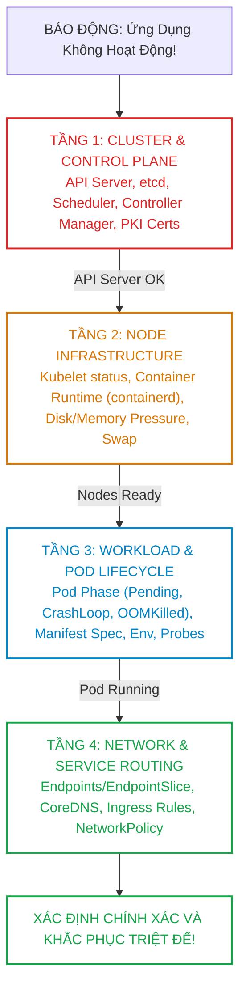
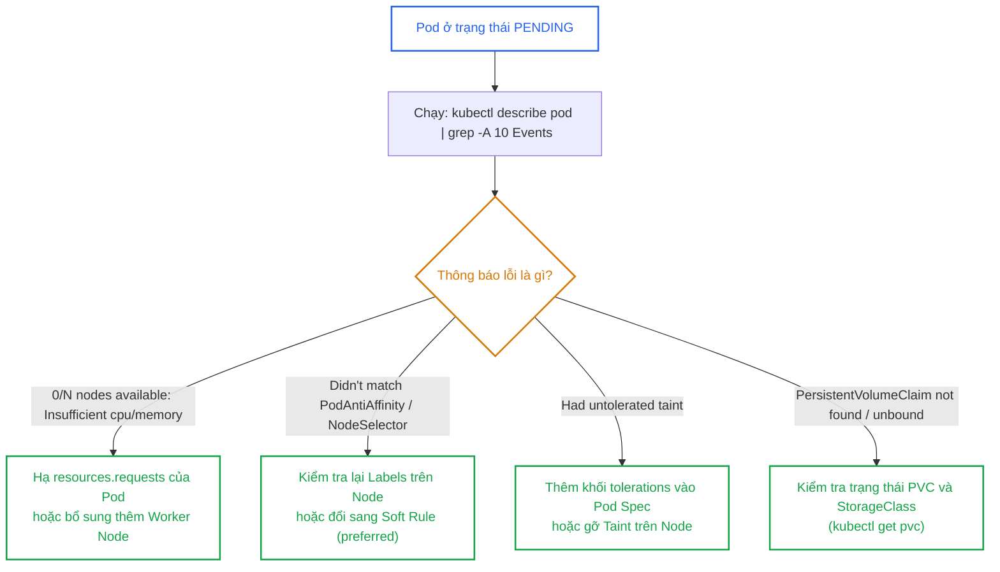
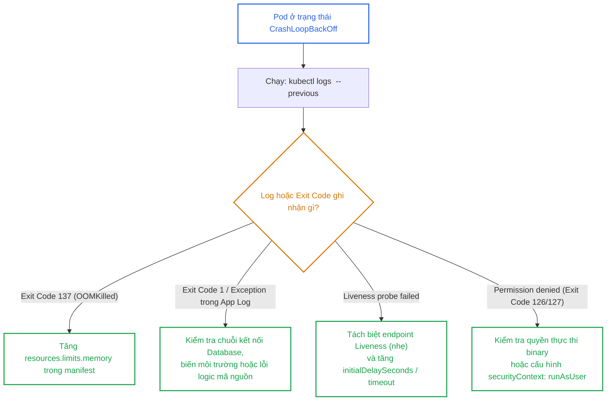
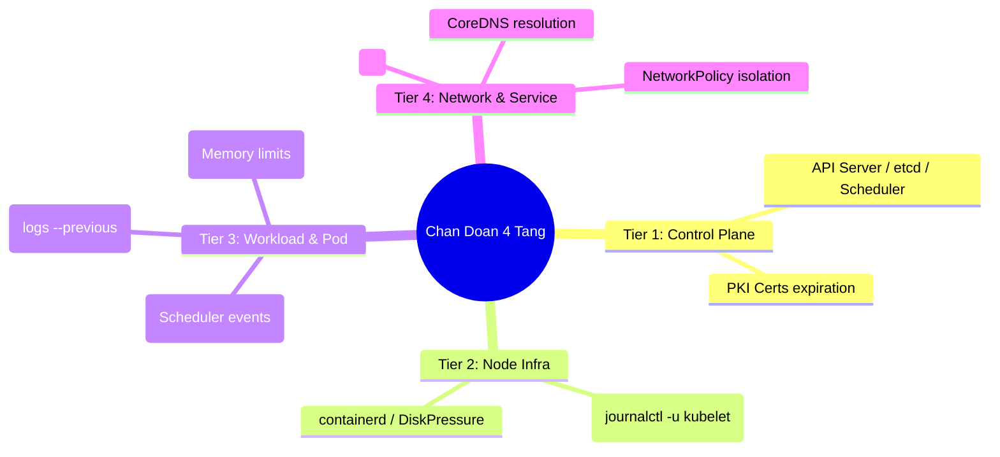


> [!IMPORTANT]
> **Mục tiêu kỹ thuật & Trọng tâm CKA**:
> - Troubleshooting chiếm tới **30% tổng điểm** trong kỳ thi CKA.
> - Thiết lập tư duy chẩn đoán hệ thống phân tầng (Top-down & Bottom-up) thay vì đoán mò (Trial-and-error).
> - Làm chủ các lệnh One-liner thần tốc: lọc Pod lỗi, soi log container đã chết (`--previous`), trích xuất sự kiện cảnh báo.
> - Xử lý dứt điểm các tình huống Pod kẹt trạng thái: `Pending`, `ContainerCreating`, `ImagePullBackOff`, `CrashLoopBackOff`, `Terminating`.
> - Chẩn đoán sự cố dịch vụ mạng: Endpoint rỗng, CoreDNS timeout, NetworkPolicy chặn nhầm.

---

## 1. Bản Chất Kiến Trúc & Tư Duy Cốt Lõi: Mô Hình Chẩn Đoán 4 Tầng

Một cụm Kubernetes là một hệ phân tán phức tạp với hàng chục thành phần tương tác bất đồng bộ. Khi một ứng dụng gặp lỗi, nguyên nhân có thể nằm ở bất kỳ tầng nào: từ cấu hình sai YAML, Node bị ngắt kết nối mạng, Kubelet bị dừng dịch vụ, cho đến chứng chỉ TLS của Control Plane hết hạn.

Phương pháp **4-Tier Troubleshooting Framework** giúp kỹ sư cô lập và xác định chính xác vị trí phát sinh lỗi trong thời gian ngắn nhất:



---

## 2. Bảng Ma Trận So Sánh Kỹ Thuật Toàn Diện (Engineering Matrix)

Bảng phân loại các trạng thái lỗi kinh điển của Pod, mã thoát và giải pháp tương ứng:

| Trạng Thái Lỗi (Status) | Mã Thoát (Exit Code) | Nguyên Nhân Gốc Rễ Tiêu Biểu | Lệnh Chẩn Đoán Số 1 | Giải Pháp Khắc Phục |
| :--- | :--- | :--- | :--- | :--- |
| **`Pending`** | Không có | Thiếu CPU/RAM, sai NodeSelector/Affinity, dính Taint | `kubectl describe pod` (xem mục Events) | Tăng tài nguyên Node, sửa selector, thêm tolerations |
| **`ImagePullBackOff`** | Không có | Sai tên Image/Tag, Registry yêu cầu Auth, mạng chặn | `kubectl describe pod` (xem mục Events) | Sửa đúng tag, tạo và gán `imagePullSecrets` |
| **`CrashLoopBackOff`** | `Exit 1` hoặc `255` | Ứng dụng ném Unhandled Exception, thiếu config/DB | `kubectl logs <pod> --previous` | Sửa code app, nạp đúng ConfigMap/Secret |
| **`OOMKilled`** | `Exit 137` | Tiêu thụ RAM vượt quá `resources.limits.memory` | `kubectl describe pod` (xem Last State) | Tăng memory limits, fix memory leak trong code |
| **`CreateContainerConfigError`**| Không có | Tham chiếu tới ConfigMap hoặc Secret không tồn tại | `kubectl describe pod` (xem mục Events) | Tạo ConfigMap/Secret bị thiếu hoặc đặt `optional: true` |
| **`ContainerCreating` kẹt** | Không có | Không mount được Volume (PVC Pending, AWS Multi-Attach)| `kubectl describe pod` (xem Events mount) | Sửa StorageClass/PV, gỡ đĩa khỏi Node cũ |
| **`Terminating` kẹt** | Không có | Node bị mất mạng, Finalizer chặn, Storage không detach | `kubectl get pod -o yaml` (xem finalizers)| Kiểm tra Node Kubelet, gỡ finalizers nếu an toàn |

---

## 3. Cây Quyết Định Chẩn Đoán Nhanh (Decision Trees)

### 3.1. Cây Quyết Định Xử Lý Pod Bị `Pending`



### 3.2. Cây Quyết Định Xử Lý Pod Bị `CrashLoopBackOff`



---

## 4. Phân Tích Cạm Bẫy Thực Chiến: 3 Tình Huống Sự Cố Hóc Búa

### Tình huống 1: Pod `Running 1/1` nhưng Service trả về lỗi `502 Bad Gateway` hoặc rớt kết nối

Pod hiển thị trạng thái `Running`, nhưng người dùng gửi request vào Service thì bị từ chối kết nối.

### Hậu Quả & Log Lỗi Thực Tế:

```text
$ kubectl get pods -n production
NAME                      READY   STATUS    RESTARTS   AGE
payment-68d7547b7b-2k8nm   1/1     Running   0          5m

$ curl http://payment-service.production.svc
curl: (7) Failed to connect to payment-service port 80: Connection refused

# Kiểm tra EndpointSlice của Service:
$ kubectl get endpointslices -l kubernetes.io/service-name=payment-service
NAME                  ADDRESSTYPE   PORTS   ENDPOINTS   AGE
payment-service-8xk   IPv4          80      <none>      5m # RỖNG HOÀN TOÀN!
```

### 5-Whys Root Cause Analysis:
1. **Tại sao Service không chuyển tiếp request?** -> Danh sách Endpoints của Service bị rỗng (`<none>`).
2. **Tại sao Endpoints rỗng trong khi Pod đang Running?** -> Nhãn (Labels) của Pod không khớp với `spec.selector` của Service.
3. **Tại sao nhãn không khớp?** -> Service khai báo `selector: app=payment` nhưng Deployment Pod Template lại đặt nhãn `labels: app=payment-api`.
4. **Tại sao Kubernetes không báo lỗi cú pháp?** -> Kubernetes cho phép tạo Service độc lập trước khi có Pod, nên không có cơ chế chặn tạo Service rỗng.
5. **Giải pháp khắc phục là gì?** -> Đồng bộ hóa chính xác 100% từng ký tự giữa Service selector và Pod labels.

```diff
 spec:
   selector:
-    app: payment
+    app: payment-api
```

---

### Tình huống 2: Pod bị kẹt ở trạng thái `Terminating` suốt nhiều giờ

Kỹ sư xóa Pod (`kubectl delete pod legacy-app`), nhưng Pod giữ nguyên trạng thái `Terminating` và không bao giờ biến mất.

### Hậu Quả & Log Lỗi Thực Tế:

```text
$ kubectl get pods
NAME         READY   STATUS        RESTARTS   AGE
legacy-app   1/1     Terminating   0          4h
```

### 5-Whys Root Cause Analysis:
1. **Tại sao Pod không biến mất?** -> Đối tượng Pod trong etcd có chứa một trường **`finalizers`** chưa được hoàn tất.
2. **Finalizer nào đang chặn?** -> Thường là `kubernetes.io/pvc-protection` hoặc finalizer của Custom Controller bên thứ 3.
3. **Tại sao finalizer không chạy xong?** -> Controller quản lý finalizer đó đã bị xóa hoặc máy chủ Node vật lý bị ngắt kết nối nên không thể xác nhận đã giải phóng volume.
4. **Có nên xóa ép không?** -> Có thể xóa ép nếu chắc chắn dữ liệu an toàn.
5. **Lệnh giải phóng triệt để là gì?** -> Xóa bỏ finalizer bằng patch JSON:

```bash
kubectl patch pod legacy-app -p '{"metadata":{"finalizers":null}}'
```

---

## 5. Hands-on Lab: Khắc Phục 4 Tình Huống Sự Cố Thực Tế (8 Bước)

Bảng tổng hợp 8 bước thực hành:

| Bước | Thao Tác | Mục Tiêu Kỹ Thuật | Lệnh / Công Cụ |
| :--- | :--- | :--- | :--- |
| **1** | Khởi tạo Namespace Sự Cố | Thiết lập môi trường Lab | `kubectl create ns debug-lab` |
| **2** | Giả lập Lỗi Tầng 3 (Pending) | Tạo Pod yêu cầu 100 CPU cores | `kubectl apply -f pending-pod.yaml` |
| **3** | Chẩn đoán & Sửa lỗi Pending | Đọc Events và hạ CPU request | `kubectl describe pod`, `edit` |
| **4** | Giả lập Lỗi Tầng 3 (CrashLoop) | Tạo Pod chạy lệnh shell lỗi | `kubectl apply -f crash-pod.yaml` |
| **5** | Chẩn đoán & Sửa lỗi CrashLoop | Đọc log `--previous` và sửa command | `kubectl logs --previous` |
| **6** | Giả lập Lỗi Tầng 4 (Service Lệch Nhãn)| Tạo Service không khớp Pod selector | `kubectl apply -f broken-svc.yaml` |
| **7** | Chẩn đoán Endpoint Rỗng | Kiểm tra `kubectl get endpoints` | `kubectl get ep`, sửa selector |
| **8** | Xác minh Toàn Bộ Cụm Khỏe Mạnh | Chạy lệnh kiểm tra tổng thể | `kubectl get pods,svc -n debug-lab`|

---

### Bước 1: Khởi tạo Namespace

```bash
kubectl create namespace debug-lab
```

---

### Bước 2 & 3: Giả lập và Khắc phục sự cố Pod bị `Pending`

Tạo Pod yêu cầu tài nguyên không tưởng (100 CPUs):

```bash
cat <<EOF | kubectl apply -f -
apiVersion: v1
kind: Pod
metadata:
  name: huge-resource-pod
  namespace: debug-lab
spec:
  containers:
    - name: app
      image: nginx:alpine
      resources:
        requests:
          cpu: "100"
EOF
```

Chẩn đoán nguyên nhân:

```bash
kubectl get pod huge-resource-pod -n debug-lab
kubectl describe pod huge-resource-pod -n debug-lab | tail -n 10
```

Output:
```text
Events:
  Type     Reason            Age   From               Message
  ----     ------            ----  ----               -------
  Warning  FailedScheduling  12s   default-scheduler  0/3 nodes are available: 3 Insufficient cpu.
```

Khắc phục: Hạ CPU request xuống mức hợp lý `100m`:

```bash
kubectl patch pod huge-resource-pod -n debug-lab --type='json' -p='[{"op": "replace", "path": "/spec/containers/0/resources/requests/cpu", "value": "100m"}]' 2>/dev/null || (kubectl delete pod huge-resource-pod -n debug-lab && sed 's/"100"/"100m"/' | kubectl apply -f -)
```

---

### Bước 4 & 5: Giả lập và Khắc phục sự cố `CrashLoopBackOff`

Tạo Pod thực thi một lệnh không tồn tại trong container:

```bash
cat <<EOF | kubectl apply -f -
apiVersion: v1
kind: Pod
metadata:
  name: crashing-app
  namespace: debug-lab
spec:
  containers:
    - name: app
      image: busybox:1.36
      command: ["/bin/sh", "-c", "echo Khởi động...; non_existing_command; exit 1"]
EOF
```

Chẩn đoán bằng cách đọc log của container đã chết:

```bash
sleep 10
kubectl get pod crashing-app -n debug-lab
kubectl logs crashing-app -n debug-lab --previous
```

Output chỉ rõ dòng lỗi:
```text
Khởi động...
/bin/sh: non_existing_command: not found
```

Khắc phục: Sửa lệnh thành `sleep 3600`:

```bash
kubectl delete pod crashing-app -n debug-lab
kubectl run crashing-app --image=busybox:1.36 -n debug-lab -- /bin/sh -c "echo Started successfully; sleep 3600"
```

---

### Bước 6 & 7: Giả lập và Khắc phục sự cố Service Endpoint Rỗng

Tạo Pod có nhãn `app=order-v1` nhưng Service lại lọc nhãn `app=order`:

```bash
kubectl run order-backend --image=nginx:alpine --labels="app=order-v1" --port=80 -n debug-lab

cat <<EOF | kubectl apply -f -
apiVersion: v1
kind: Service
metadata:
  name: order-service
  namespace: debug-lab
spec:
  ports:
    - port: 80
      targetPort: 80
  selector:
    app: order # Sai nhãn!
EOF
```

Chẩn đoán:

```bash
kubectl get endpoints order-service -n debug-lab
```

Output:
```text
NAME            ENDPOINTS   AGE
order-service   <none>      20s
```

Khắc phục: Cập nhật selector của Service thành `app=order-v1`:

```bash
kubectl patch service order-service -n debug-lab -p '{"spec":{"selector":{"app":"order-v1"}}}'
kubectl get endpoints order-service -n debug-lab
```

Output xác nhận đã tìm thấy IP của Pod:
```text
NAME            ENDPOINTS         AGE
order-service   10.244.1.48:80    45s
```

---

### Bước 8: Kiểm tra toàn diện trạng thái hệ thống

```bash
kubectl get pods,svc,endpoints -n debug-lab
```

Toàn bộ tài nguyên đều chuyển sang trạng thái `Running` và `Endpoints` hoàn chỉnh!

---

## 6. 10 Câu Hỏi Tự Kiểm Tra Chuyên Sâu (Self-Check Q&A Accordion)

<details class="qa-card">
  <summary><b>Câu 1: Bốn tầng trong mô hình chẩn đoán sự cố 4-Tier Troubleshooting của Kubernetes là gì?</b></summary>
  <div class="qa-answer">
    <b>Trả lời:</b><br>
    <ul>
      <li><b>Tầng 1 - Cluster &amp; Control Plane:</b> Kiểm tra tính sẵn sàng của API Server, etcd, Scheduler, Controller Manager và chứng chỉ TLS PKI.</li>
      <li><b>Tầng 2 - Node Infrastructure:</b> Kiểm tra trạng thái Kubelet, Container Runtime (containerd), điều kiện áp lực đĩa/bộ nhớ (Disk/Memory Pressure) và cấu hình Swap.</li>
      <li><b>Tầng 3 - Workload &amp; Pod:</b> Phân tích vòng đời Pod (Pending, CrashLoop, OOMKilled), cấu hình Manifest, biến môi trường và Probes.</li>
      <li><b>Tầng 4 - Network &amp; Service:</b> Kiểm tra định tuyến EndpointSlice, phân giải CoreDNS, Ingress routing và rào cản NetworkPolicy.</li>
    </ul>
  </div>
</details>

<details class="qa-card">
  <summary><b>Câu 2: Lệnh nào giúp kỹ sư xem nhanh toàn bộ sự kiện cảnh báo gần nhất trên toàn cụm được sắp xếp theo thời gian?</b></summary>
  <div class="qa-answer">
    <b>Trả lời:</b><br>
    Sử dụng lệnh:<br>
    <code>kubectl get events -A --sort-by='.metadata.creationTimestamp'</code>
  </div>
</details>

<details class="qa-card">
  <summary><b>Câu 3: Làm thế nào để đọc được nhật ký log của một Container đã bị crash ở vòng lặp trước đó?</b></summary>
  <div class="qa-answer">
    <b>Trả lời:</b><br>
    Thêm cờ <b><code>--previous</code></b> vào lệnh logs:<br>
    <code>kubectl logs &lt;pod-name&gt; -n &lt;namespace&gt; --previous [-c &lt;container-name&gt;]</code>
  </div>
</details>

<details class="qa-card">
  <summary><b>Câu 4: Ý nghĩa của mã thoát Exit Code 137 khi xem trạng thái Container là gì?</b></summary>
  <div class="qa-answer">
    <b>Trả lời:</b><br>
    Exit Code 137 = 128 + 9 (tín hiệu <code>SIGKILL</code>). Điều này chỉ ra rằng container đã bị cưỡng chế tiêu diệt bởi Linux Kernel <b>OOM-Killer</b> do tiêu thụ bộ nhớ RAM vượt quá mức <code>resources.limits.memory</code> hoặc do máy chủ Node vật lý bị cạn kiệt RAM nghiêm trọng.
  </div>
</details>

<details class="qa-card">
  <summary><b>Câu 5: Nguyên nhân phổ biến nhất khiến Pod rơi vào trạng thái ImagePullBackOff hoặc ErrImagePull là gì?</b></summary>
  <div class="qa-answer">
    <b>Trả lời:</b><br>
    1. Tên Image hoặc Tag phiên bản bị sai chính tả (Typo).<br>
    2. Container Image nằm trong Private Registry nhưng Pod Spec không khai báo hoặc khai báo sai <code>imagePullSecrets</code>.<br>
    3. Máy chủ Node bị mất kết nối Internet / mạng nội bộ không thể phân giải DNS hoặc truy cập tới Container Registry.
  </div>
</details>

<details class="qa-card">
  <summary><b>Câu 6: Ba nguyên nhân chính khiến Pod bị kẹt ở trạng thái Pending là gì?</b></summary>
  <div class="qa-answer">
    <b>Trả lời:</b><br>
    <ul>
      <li>1. <b>Thiếu hụt tài nguyên:</b> Không có Node nào còn đủ CPU hoặc Memory đáp ứng mức <code>resources.requests</code> của Pod.</li>
      <li>2. <b>Ràng buộc lập lịch:</b> Không có Node nào khớp với nhãn trong <code>nodeSelector</code>, <code>nodeAffinity</code>, hoặc vi phạm <code>podAntiAffinity</code>.</li>
      <li>3. <b>Vết nhơ Node (Taints):</b> Toàn bộ các Node đều có Taint mà Pod không khai báo <code>tolerations</code> tương ứng.</li>
    </ul>
  </div>
</details>

<details class="qa-card">
  <summary><b>Câu 7: Lệnh systemd nào giúp kỹ sư xem trực tiếp log của tiến trình Kubelet khi Node bị NotReady?</b></summary>
  <div class="qa-answer">
    <b>Trả lời:</b><br>
    Sử dụng lệnh:<br>
    <code>sudo journalctl -u kubelet -n 100 -f</code>
  </div>
</details>

<details class="qa-card">
  <summary><b>Câu 8: Tại sao một Service có thể có địa chỉ ClusterIP nhưng mục Endpoints lại hiển thị &lt;none&gt;?</b></summary>
  <div class="qa-answer">
    <b>Trả lời:</b><br>
    Bởi vì: (1) Trường <code>spec.selector</code> của Service không khớp với bất kỳ nhãn (labels) nào của các Pod đang chạy, hoặc (2) Các Pod có khớp nhãn nhưng tất cả đều chưa vượt qua bài kiểm tra <b>Readiness Probe</b> (chưa Ready).
  </div>
</details>

<details class="qa-card">
  <summary><b>Câu 9: Khi nào kỹ sư nên sử dụng lệnh xóa cưỡng bức kubectl delete pod --force --grace-period=0?</b></summary>
  <div class="qa-answer">
    <b>Trả lời:</b><br>
    Chỉ nên sử dụng khi một Pod bị kẹt ở trạng thái <code>Terminating</code> trên một Node vật lý đã bị sập nguồn hoàn toàn (Dead Node) hoặc bị hỏng phần cứng vĩnh viễn không thể khôi phục, nhằm giải phóng trạng thái trong etcd để các controller (như StatefulSet) có thể khởi tạo lại Pod trên Node mới.
  </div>
</details>

<details class="qa-card">
  <summary><b>Câu 10: Lệnh nào giúp lọc và hiển thị nhanh tất cả các Pod đang không ở trạng thái Running hoặc Succeeded trên toàn bộ các Namespace?</b></summary>
  <div class="qa-answer">
    <b>Trả lời:</b><br>
    Sử dụng lệnh:<br>
    <code>kubectl get pods -A --field-selector status.phase!=Running,status.phase!=Succeeded</code>
  </div>
</details>

---

## 7. Tổng Kết & Lộ Trình Bài Học Tiếp Theo



Thành thạo phương pháp chẩn đoán sự cố 4 tầng và làm chủ cây quyết định phân tích lỗi giúp bạn tự tin làm chủ 30% điểm số thực hành trong kỳ thi CKA và giải quyết nhanh chóng mọi cuộc khủng hoảng vận hành trong môi trường thực tế.

> [!TIP]
> **Bài học tiếp theo**: Trong [Bài 29: Chẩn Đoán Sự Cố Control Plane, Thành Phần Hệ Thống & Phục Hồi Node](cka-29-29-chan-doan-control-plane-va-node.html), chúng ta sẽ nghiên cứu sâu vào việc cứu hộ tầng hạ tầng: sửa lỗi Static Pods bị crash, gia hạn chứng chỉ PKI hết hạn và quy trình phục hồi một Worker Node bị mất kết nối (NotReady) về trạng thái hoạt động bình thường.

