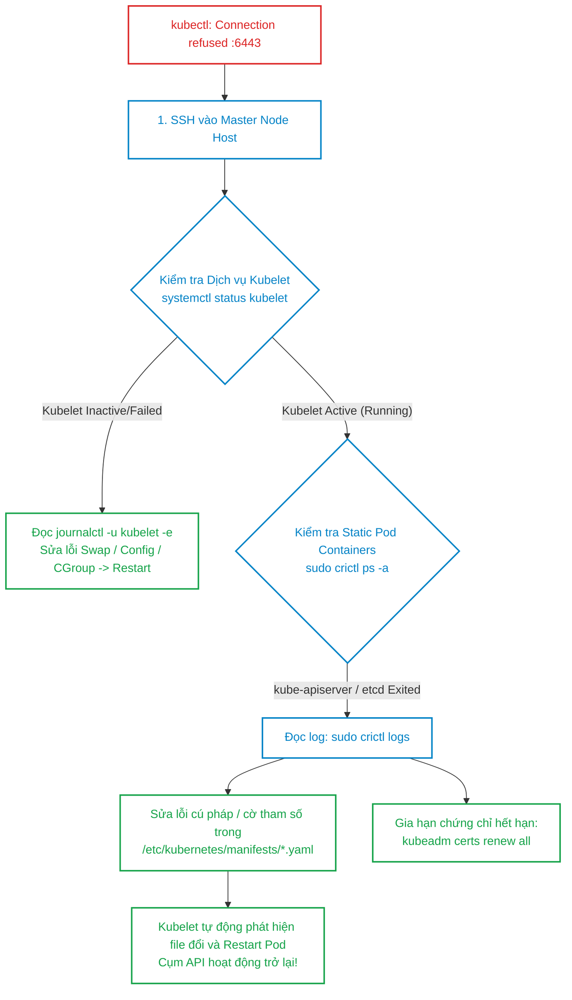
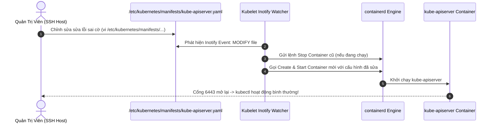
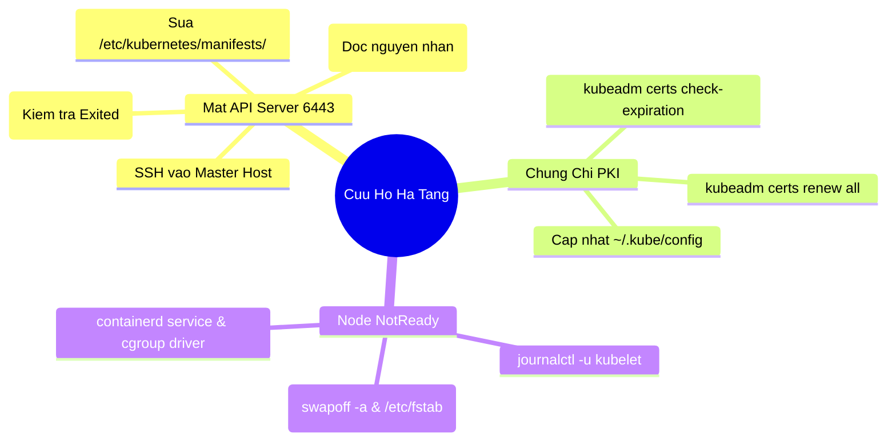


> [!IMPORTANT]
> **Mục tiêu kỹ thuật & Trọng tâm CKA**:
> - Khắc phục sự cố khi `kube-apiserver` không thể khởi động (mất kết nối cổng 6443).
> - Sử dụng `crictl` và `journalctl` để đọc nhật ký lỗi trực tiếp từ Container Runtime khi không thể dùng `kubectl`.
> - Kiểm tra, phát hiện và sửa lỗi cú pháp trong các Static Pods (`kube-apiserver.yaml`, `etcd.yaml`, `kube-controller-manager.yaml`, `kube-scheduler.yaml`).
> - Gia hạn toàn bộ chứng chỉ PKI của cụm bằng `kubeadm certs renew`.
> - Đưa một Worker Node từ trạng thái `NotReady` trở về `Ready` thành công.

---

## 1. Bản Chất Kiến Trúc & Tư Duy Cốt Lõi: Cứu Hộ Khi Không Có API Server

Khi một kỹ sư chạy lệnh `kubectl get nodes` và nhận được thông báo lỗi:
`The connection to the server 192.168.10.10:6443 was refused - did you specify the right host or port?`

Tại thời điểm này, **kube-apiserver đã chết**. Toàn bộ các công cụ giao tiếp qua API như `kubectl`, Dashboard, Helm hay CI/CD đều hoàn toàn vô hiệu. Kỹ sư bắt buộc phải sử dụng các công cụ tầng thấp của hệ điều hành Linux:



---

## 2. Bảng Ma Trận So Sánh Kỹ Thuật Toàn Diện (Engineering Matrix)

Bảng đối chiếu các sự cố tầng sâu của Control Plane và Node:

| Triệu Chứng Sự Cố | Nguyên Nhân Gốc Rễ Tiêu Biểu | Công Cụ & Tệp Cần Kiểm Tra | Lệnh Khắc Phục Chuẩn |
| :--- | :--- | :--- | :--- |
| **API Server từ chối cổng 6443**| Sai cú pháp YAML trong `/etc/kubernetes/manifests/kube-apiserver.yaml`| `crictl ps -a`, `crictl logs <id>` | Sửa lại tệp YAML, lưu file để Kubelet tự nạp lại |
| **Chứng chỉ TLS hết hạn (Expired)**| Chứng chỉ cụm vượt quá 1 năm không gia hạn | `kubeadm certs check-expiration` | `kubeadm certs renew all && systemctl restart kubelet` |
| **Node báo trạng thái `NotReady`**| Kubelet service bị crash do Swap được bật | `journalctl -u kubelet`, `swapon --show` | `sudo swapoff -a && sudo systemctl restart kubelet` |
| **Kubelet không start được** | Sai lệch cgroup driver (`systemd` vs `cgroupfs`)| `/etc/containerd/config.toml`, `/var/lib/kubelet/config.yaml` | Đồng bộ `SystemdCgroup = true` cho cả containerd & Kubelet |
| **etcd bị crash liên tục** | Thư mục dữ liệu `/var/lib/etcd` bị đầy ổ đĩa hoặc sai quyền sở hữu | `df -h`, `ls -la /var/lib/etcd` | Giải phóng dung lượng đĩa, cấp quyền `chown -R root:root /var/lib/etcd` |
| **Containerd socket missing** | Dịch vụ containerd bị chết | `systemctl status containerd` | `sudo systemctl restart containerd` |

---

## 3. Quy Trình Cứu Hộ Static Pods & Gia Hạn Chứng Chỉ PKI

### 3.1. Cấu Trúc Thư Mục `/etc/kubernetes/manifests/`

Kubelet trên Control Plane liên tục theo dõi (Inotify) thư mục `/etc/kubernetes/manifests/`:
- `kube-apiserver.yaml`
- `kube-controller-manager.yaml`
- `kube-scheduler.yaml`
- `etcd.yaml`

Mọi thay đổi trên các tệp tin này sẽ lập tức kích hoạt Kubelet tiêu diệt container cũ và tạo container mới tương ứng.



### 3.2. Quy Trình Gia Hạn Chứng Chỉ Toàn Cụm

Khi chứng chỉ PKI hết hạn, API Server sẽ từ chối mọi kết nối TLS. Quy trình gia hạn:

```bash
# 1. Kiểm tra thời hạn của toàn bộ 10 chứng chỉ trong cụm
sudo kubeadm certs check-expiration

# 2. Gia hạn toàn bộ chứng chỉ thêm 1 năm
sudo kubeadm certs renew all

# 3. Khởi động lại Kubelet để nạp lại chứng chỉ client
sudo systemctl restart kubelet

# 4. Cập nhật lại tệp ~/.kube/config của quản trị viên
sudo cp -i /etc/kubernetes/admin.conf $HOME/.kube/config
sudo chown $(id -u):$(id -g) $HOME/.kube/config
```

---

## 4. Phân Tích Cạm Bẫy Thực Chiến: Sự Cố Kubelet Crash & Cấu Hình Swap

### Tình huống 1: Worker Node chuyển sang `NotReady` sau khi máy chủ reboot

Máy chủ Worker Node được khởi động lại sau đợt bảo trì phần cứng. Sau khi boot, Node liên tục hiển thị trạng thái `NotReady`.

### Hậu Quả & Log Lỗi Thực Tế:

```text
$ kubectl get nodes
NAME        STATUS     ROLES    AGE   VERSION
worker-01   NotReady   <none>   15d   v1.30.0

# SSH vào worker-01 và kiểm tra journalctl:
$ sudo journalctl -u kubelet -n 30 --no-pager
Sep 16 04:30:15 worker-01 kubelet[14210]: F0916 04:30:15.891234 14210 server.go:215] 
"Failed to run kubelet" err="running with swap on is not supported, please disable swap! 
or set --fail-swap-on to false"
```

### 5-Whys Root Cause Analysis:
1. **Tại sao Node báo NotReady?** -> Kubelet process trên Worker Node bị dừng (Active: failed).
2. **Tại sao Kubelet bị dừng?** -> Kubelet phát hiện phân vùng Swap đang bật (`running with swap on`).
3. **Tại sao Swap lại bật trong khi trước đó đã tắt?** -> Kỹ sư chỉ tắt Swap tạm thời bằng `swapoff -a` mà không xóa bản ghi trong `/etc/fstab`.
4. **Tại sao Kubelet mặc định cấm Swap?** -> Để đảm bảo tính chính xác của việc tính toán cấp phát tài nguyên RAM và QoS Classes của Pod.
5. **Giải pháp khắc phục triệt để là gì?** -> Tắt Swap ngay lập tức và comment dòng swap trong `/etc/fstab`.

```bash
# Tắt swap ngay lập tức
sudo swapoff -a

# Vô hiệu hóa vĩnh viễn trong /etc/fstab
sudo sed -i '/ swap / s/^\(.*\)$/#\1/g' /etc/fstab

# Khởi động lại Kubelet
sudo systemctl restart kubelet
```

---

### Tình huống 2: Sửa nhầm tệp `kube-scheduler.yaml` khiến toàn bộ Pod mới bị kẹt `Pending`

Kỹ sư gõ nhầm một tham số trong `/etc/kubernetes/manifests/kube-scheduler.yaml` (ví dụ: `--leader-elect=truuu`). Pod scheduler bị crash, không có scheduler nào chạy trên cụm.

### Hậu Quả & Log Lỗi Thực Tế:

```text
# Mọi Pod mới tạo đều ở trạng thái Pending:
$ kubectl get pods
NAME         READY   STATUS    AGE
my-new-app   0/1     Pending   10m

# Kiểm tra log static pod scheduler bằng crictl:
$ sudo crictl ps -a | grep scheduler
7a8b9c123d   registry.k8s.io/kube-scheduler:v1.30.0   Exited   kube-scheduler-cp-01

$ sudo crictl logs 7a8b9c123d
Error: invalid boolean value "truuu" for --leader-elect: strconv.ParseBool: parsing "truuu": invalid syntax
```

Sửa lại `--leader-elect=true` trong tệp YAML, lưu file, và scheduler sẽ tự phục hồi trong 5 giây!

---

## 5. Hands-on Lab: Cứu Hộ Control Plane & Khôi Phục Node NotReady (8 Bước)

Bảng tổng hợp 8 bước thực hành:

| Bước | Thao Tác | Mục Tiêu Kỹ Thuật | Lệnh / Công Cụ |
| :--- | :--- | :--- | :--- |
| **1** | Giả lập Lỗi Hỏng API Server | Sửa sai cờ trong `kube-apiserver.yaml` | `vi /etc/kubernetes/manifests/` |
| **2** | Quan sát Lỗi Mất Kết Nối 6443 | Xác nhận `kubectl` tê liệt | `kubectl get nodes` (Kỳ vọng lỗi) |
| **3** | Định vị Container Lỗi qua `crictl`| Soi trạng thái `Exited` của API container | `sudo crictl ps -a` |
| **4** | Đọc Log Container bị sập | Tìm dòng cấu hình gây panic | `sudo crictl logs <id>` |
| **5** | Khắc phục Tệp Manifest API Server | Sửa lại cờ chuẩn xác | `sudo vi kube-apiserver.yaml` |
| **6** | Kiểm tra Phục Hồi Thành Công | Xác nhận `kubectl` hoạt động lại | `kubectl get nodes` |
| **7** | Kiểm tra Thời Hạn Toàn Bộ Chứng Chỉ| Đọc bảng báo cáo hết hạn PKI | `sudo kubeadm certs check-expiration` |
| **8** | Thực hiện Gia Hạn Chứng Chỉ Thử Nghiệm| Renew toàn bộ chứng chỉ cụm | `sudo kubeadm certs renew all` |

---

### Bước 1: Giả lập sự cố làm sập `kube-apiserver`

Đăng nhập vào Control Plane node và sửa tệp manifest:

```bash
sudo sed -i 's/--secure-port=6443/--secure-port=invalid_port/g' /etc/kubernetes/manifests/kube-apiserver.yaml
```

---

### Bước 2: Xác nhận API Server tê liệt hoàn toàn

Chờ 10 giây và chạy thử lệnh kubectl:

```bash
kubectl get nodes
```

Output báo lỗi kinh điển:
```text
The connection to the server 192.168.10.11:6443 was refused - did you specify the right host or port?
```

---

### Bước 3 & 4: Sử dụng `crictl` để tìm và đọc log container bị sập

```bash
# Liệt kê các container đã thoát (Exited)
sudo crictl ps -a --name kube-apiserver

# Lấy Container ID đầu tiên và đọc log lỗi
CONTAINER_ID=$(sudo crictl ps -a --name kube-apiserver -q | head -n 1)
sudo crictl logs $CONTAINER_ID
```

Output chỉ rõ nguyên nhân sập:
```text
Error: invalid argument "invalid_port" for "--secure-port" flag: strconv.ParseUint: parsing "invalid_port": invalid syntax
```

---

### Bước 5: Sửa lại tệp cấu hình về đúng cổng 6443

```bash
sudo sed -i 's/--secure-port=invalid_port/--secure-port=6443/g' /etc/kubernetes/manifests/kube-apiserver.yaml
```

---

### Bước 6: Kiểm tra API Server đã tự động phục hồi

Chờ khoảng 10–15 giây để Kubelet khởi động lại container mới:

```bash
sleep 15
kubectl get nodes
```

Output hoạt động bình thường:
```text
NAME        STATUS   ROLES           AGE   VERSION
cp-01       Ready    control-plane   15d   v1.30.0
worker-01   Ready    <none>          15d   v1.30.0
```

---

### Bước 7: Kiểm tra thời hạn chứng chỉ toàn cụm

```bash
sudo kubeadm certs check-expiration
```

Output hiển thị chi tiết hạn dùng của từng chứng chỉ:
```text
CERTIFICATE                EXPIRES                  RESIDUAL TIME   CERTIFICATE AUTHORITY   EXTERNALLY MANAGED
admin.conf                 Sep 16, 2027 04:00 UTC   364d            ca                      no
apiserver                  Sep 16, 2027 04:00 UTC   364d            ca                      no
apiserver-etcd-client      Sep 16, 2027 04:00 UTC   364d            etcd-ca                 no
apiserver-kubelet-client   Sep 16, 2027 04:00 UTC   364d            ca                      no
```

---

### Bước 8: Gia hạn chứng chỉ toàn cụm

```bash
sudo kubeadm certs renew all
sudo systemctl restart kubelet
```

Output:
```text
[certs] Certificate renewed: 'admin.conf'
[certs] Certificate renewed: 'apiserver'
[certs] Certificate renewed: 'apiserver-etcd-client'
[certs] Certificate renewed: 'apiserver-kubelet-client'
...
Done renewing certificates. You must restart the kube-apiserver, kube-controller-manager, kube-scheduler and etcd.
```

---

## 6. 10 Câu Hỏi Tự Kiểm Tra Chuyên Sâu (Self-Check Q&A Accordion)

<details class="qa-card">
  <summary><b>Câu 1: Khi lệnh kubectl báo lỗi The connection to the server :6443 was refused, ba bước xử lý đầu tiên là gì?</b></summary>
  <div class="qa-answer">
    <b>Trả lời:</b><br>
    <ul>
      <li>1. SSH trực tiếp vào máy chủ Master/Control Plane.</li>
      <li>2. Kiểm tra trạng thái dịch vụ Kubelet bằng lệnh <code>sudo systemctl status kubelet</code> (và đọc <code>journalctl -u kubelet</code> nếu failed).</li>
      <li>3. Nếu Kubelet đang chạy, sử dụng <code>sudo crictl ps -a</code> để tìm các Static Pod container (kube-apiserver, etcd) ở trạng thái <code>Exited</code> và đọc log bằng <code>sudo crictl logs &lt;id&gt;</code>.</li>
    </ul>
  </div>
</details>

<details class="qa-card">
  <summary><b>Câu 2: Thư mục mặc định nào trên Linux lưu trữ các tệp manifest của Static Pods?</b></summary>
  <div class="qa-answer">
    <b>Trả lời:</b><br>
    Thư mục chuẩn là <b><code>/etc/kubernetes/manifests/</code></b> (được cấu hình qua tham số <code>staticPodPath</code> trong tệp <code>/var/lib/kubelet/config.yaml</code>).
  </div>
</details>

<details class="qa-card">
  <summary><b>Câu 3: Lệnh nào cho phép kiểm tra hạn dùng của toàn bộ chứng chỉ TLS trong cụm Kubeadm?</b></summary>
  <div class="qa-answer">
    <b>Trả lời:</b><br>
    Sử dụng lệnh:<br>
    <code>sudo kubeadm certs check-expiration</code>
  </div>
</details>

<details class="qa-card">
  <summary><b>Câu 4: Lệnh nào dùng để gia hạn toàn bộ chứng chỉ PKI của Control Plane thêm 1 năm?</b></summary>
  <div class="qa-answer">
    <b>Trả lời:</b><br>
    Sử dụng lệnh:<br>
    <code>sudo kubeadm certs renew all</code><br>
    Sau khi gia hạn, bắt buộc phải cập nhật lại tệp <code>~/.kube/config</code> từ <code>/etc/kubernetes/admin.conf</code> và restart Kubelet.
  </div>
</details>

<details class="qa-card">
  <summary><b>Câu 5: Tại sao Kubelet trên Worker Node bị crash sau khi khởi động lại máy chủ nếu chưa tắt Swap vĩnh viễn?</b></summary>
  <div class="qa-answer">
    <b>Trả lời:</b><br>
    Mặc định, Kubelet được lập trình để từ chối khởi động nếu phát hiện hệ điều hành có phân vùng Swap đang hoạt động (nhằm đảm bảo tính chính xác của cơ chế phân lớp QoS và quản lý bộ nhớ). Khi máy chủ reboot, hệ điều hành sẽ tự động kích hoạt lại Swap theo tệp <code>/etc/fstab</code> nếu chưa bị vô hiệu hóa vĩnh viễn.
  </div>
</details>

<details class="qa-card">
  <summary><b>Câu 6: Làm thế nào để xem log của tiến trình containerd runtime khi nghi ngờ container engine bị lỗi?</b></summary>
  <div class="qa-answer">
    <b>Trả lời:</b><br>
    Sử dụng lệnh:<br>
    <code>sudo journalctl -u containerd -n 100 --no-pager</code>
  </div>
</details>

<details class="qa-card">
  <summary><b>Câu 7: Điểm khác biệt giữa crictl và docker khi chẩn đoán container trên Node Kubernetes là gì?</b></summary>
  <div class="qa-answer">
    <b>Trả lời:</b><br>
    <code>crictl</code> là công cụ CLI chuẩn giao tiếp trực tiếp với bất kỳ Container Runtime nào qua giao thức <b>CRI (Container Runtime Interface)</b> như containerd, CRI-O. Từ Kubernetes v1.24+, Docker shim đã bị loại bỏ hoàn toàn khỏi Kubernetes nên lệnh <code>docker ps</code> không còn nhìn thấy các container của Kubernetes.
  </div>
</details>

<details class="qa-card">
  <summary><b>Câu 8: Nếu tệp kubeconfig ~/.kube/config bị hỏng hoặc mất, làm sao để lấy lại quyền cluster-admin trên Master Node?</b></summary>
  <div class="qa-answer">
    <b>Trả lời:</b><br>
    Sao chép lại tệp cấu hình quản trị gốc từ <code>/etc/kubernetes/admin.conf</code>:<br>
    <code>mkdir -p $HOME/.kube</code><br>
    <code>sudo cp -i /etc/kubernetes/admin.conf $HOME/.kube/config</code><br>
    <code>sudo chown $(id -u):$(id -g) $HOME/.kube/config</code>
  </div>
</details>

<details class="qa-card">
  <summary><b>Câu 9: Sự cố Cgroup Driver Mismatch giữa Kubelet và Containerd gây ra lỗi gì?</b></summary>
  <div class="qa-answer">
    <b>Trả lời:</b><br>
    Nếu Containerd sử dụng cgroup driver <code>systemd</code> trong khi Kubelet lại sử dụng <code>cgroupfs</code> (hoặc ngược lại), Kubelet sẽ không thể quản lý được cgroups của container và sẽ crash ngay khi khởi động với thông báo lỗi <code>misconfiguration: kubelet cgroup driver "cgroupfs" is different from runtime cgroup driver "systemd"</code>.
  </div>
</details>

<details class="qa-card">
  <summary><b>Câu 10: Làm thế nào để Kubelet tự động nạp lại cấu hình Static Pod sau khi ta chỉnh sửa tệp YAML trong /etc/kubernetes/manifests/?</b></summary>
  <div class="qa-answer">
    <b>Trả lời:</b><br>
    Bạn <b>chỉ cần lưu tệp tin (Save file)</b>. Kubelet tích hợp cơ chế theo dõi hệ thống tệp tin (File Watcher / Inotify); ngay khi tệp manifest có sự thay đổi về timestamp hoặc nội dung, Kubelet sẽ tự động nhận biết, tiêu hủy container cũ và khởi chạy container mới mà không cần restart service Kubelet.
  </div>
</details>

---

## 7. Tổng Kết & Lộ Trình Bài Học Tiếp Theo



Khả năng bình tĩnh xử lý sự cố ngoài tầng API Server và khôi phục cụm từ những tình huống tê liệt nghiêm trọng nhất là phẩm chất quan trọng nhất phân biệt một Quản trị viên Kubernetes chuyên nghiệp đạt chuẩn CKA.

> [!TIP]
> **Bài học tiếp theo**: Trong [Bài 30: Bộ Đề Thi Thử Thực Chiến CKA (CKA Practice Exam: 17 Kịch Bản Mô Phỏng 120 Phút)](cka-30-30-thi-thu-cka.html), chúng ta sẽ bước vào bài thi thử toàn diện mô phỏng 100% áp lực và cấu trúc phòng thi quốc tế của Linux Foundation: 17 câu hỏi thực chiến bao quát toàn bộ 5 domain kiến thức.

