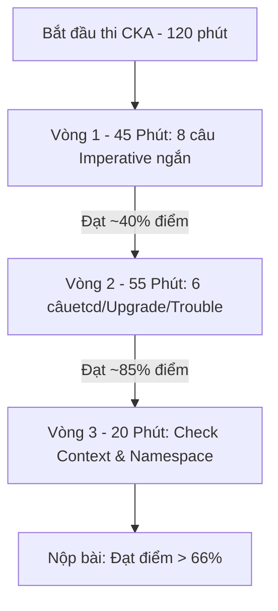
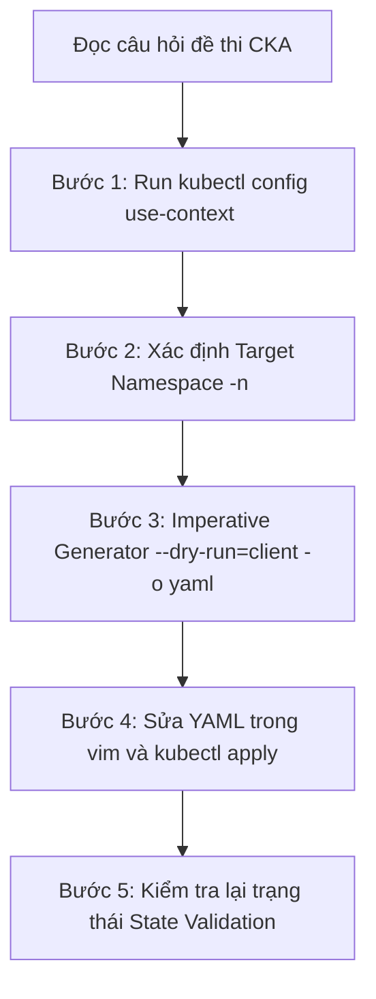
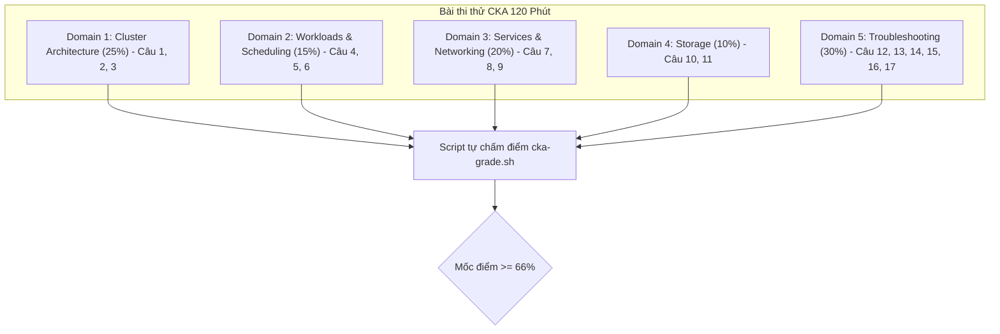


# [BÀI 30] ĐỀ THI THỬ CKA TOÀN DIỆN 120 PHÚT & PHÂN TÍCH LỜI GIẢI CHUẨN MỰC LINUX FOUNDATION

Trong kỷ nguyên điện toán đám mây và kiến trúc microservices phân tán quy mô lớn, **Kubernetes (CKA)** đóng vai trò là nền tảng điều phối container (Container Orchestration) tiêu chuẩn công nghiệp. Để làm chủ hệ thống trong môi trường sản xuất (Production) cũng như chinh phục kỳ thi chứng chỉ quốc tế của Linux Foundation / CNCF, kỹ sư không chỉ nắm vững các câu lệnh thao tác cơ bản mà phải thấu hiểu sâu sắc bản chất cơ chế tầng thấp: từ chu trình điều hòa (Reconciliation Loop), cấu trúc điều phối tài nguyên, kiến trúc mạng CNI, lưu trữ CSI cho đến các chuẩn mực an ninh phòng thủ chiều sâu.

Bài viết chuyên sâu này sẽ đồng hành cùng bạn giải mã toàn diện bức tranh kiến trúc, phân tích các đánh đổi kỹ thuật thực chiến (Engineering Trade-offs), cung cấp bài thực hành Lab từng bước và bộ câu hỏi phỏng vấn chuẩn Architect / Lead Engineer.

---

## 1. Bản Chất Kiến Trúc & Cơ Chế Vận Hành Tầng Thấp

| # | Câu hỏi ôn tập | Đáp án chuẩn ngắn gọn |
|---|---|---|
| 1 | Lệnh CLI nào dùng để xem nhật ký trực tiếp của Kubelet ở tầng OS Linux? | **`journalctl -u kubelet -n 50 --no-pager`** |
| 2 | Thư mục mặc định chứa các tệp manifest Static Pod trên Master Node là gì? | Thư mục **`/etc/kubernetes/manifests/`** |
| 3 | Lệnh CLI nào dùng để gia hạn toàn bộ chứng chỉ Control Plane cụm `kubeadm`? | **`kubeadm certs renew all`** |
| 4 | Hai câu lệnh Linux nào cần thiết để tắt bộ nhớ đệm Swap vĩnh viễn? | **`swapoff -a`** và xóa/comment dòng swap trong **`/etc/fstab`** |
| 5 | Công cụ CLI nào dùng để tương tác với Containerd khi API Server bị sập? | Công cụ **`crictl`** (`crictl ps` và `crictl logs`) |


> **"Kỳ thi thực hành CKA 120 phút với 17 câu hỏi tổng hợp đòi hỏi thí sinh phải kết hợp nhuần nhuyễn chiến lược quản lý thời gian khắt khe (dưới 6 phút mỗi câu), kỹ năng chuyển đổi context/namespace chuẩn xác, và phản xạ gõ câu lệnh `kubectl` tốc độ cao; trong đó việc vượt qua ngưỡng điểm đạt 66 % không chỉ chứng minh năng lực đỗ chứng chỉ quốc tế CNCF mà còn khẳng định trình độ vận hành và khắc phục sự cố hạ tầng Kubernetes thực chiến trong các môi trường sản xuất quy mô lớn."**

**Kết quả từ các buổi trước được sử dụng lại:**

| Kết quả / Công cụ | Buổi + số hiệu `QT` | Dùng ở đâu trong buổi này |
|---|---|---|
| Môi trường thi CKA và quy tắc tính điểm | Buổi 01 `QT 4.1` | Áp dụng luật chấm điểm 66 % đạt và quy tắc dùng tài liệu docs |
| Tốc độ lệnh `kubectl` imperative và JSONPath | Buổi 04 `QT 4.1` | Tăng tốc gõ lệnh làm 17 câu hỏi trong 120 phút |
| Kỹ năng chẩn đoán sự cố 4 tầng | Buổi 28 `QT 4.1` & Buổi 29 `QT 4.1` | Giải quyết các câu hỏi Troubleshooting chiếm 30 % trọng số |

---


| # | Kỹ năng thực hiện được | Hiện vật chứng minh |
|---|---|---|
| 1 | Thực thi trọn vẹn bài thi giả lập CKA 17 câu trong đúng 120 phút | Bảng tổng hợp kết quả tự chấm điểm trên cụm 3 node |
| 2 | Áp dụng chiến lược 3 vòng làm bài thi để bảo toàn điểm số tối đa | Nhật ký thời lượng làm bài từng câu dưới 6 phút |
| 3 | Chuyển đổi chuẩn xác giữa các bối cảnh cụm (context) và Namespace | 100 % các đối tượng tài nguyên được tạo ở đúng Namespace đề bài |
| 4 | Sử dụng phương pháp tra cứu nhanh tài liệu `kubernetes.io/docs` | Các đoạn mã YAML mẫu được copy và apply chuẩn xác |
| 5 | Tự đánh giá năng lực sẵn sàng cán mốc điểm đạt > 66 % CKA | Báo cáo điểm số thực tế đạt từ 70 đến 95 % |

---


| Kiến thức tiên quyết | Nguồn tự học nếu thiếu |
|---|---|
| Kiến thức tổng hợp của cả 29 buổi học Giai đoạn 1 (CKA) | Toàn bộ các buổi 01 đến 29 |
| Quy tắc gõ cờ dry-run `--dry-run=client -o yaml` | Buổi 04 (`QT 4.1`) |
| Kỹ thuật cứu hộ Kubelet và khôi phục Static Pods | Buổi 29 (`QT 4.1`) |

---


### 3.1. Thuật ngữ Việt–Anh

| # | Thuật ngữ tiếng Việt | Tiếng Anh tương đương | Ghi chú chuẩn hoá trong thân bài |
|---|---|---|---|
| 1 | Thi thử CKA | CKA Mock Exam | Bài thi thực hành tổng hợp giả lập môi trường thi CNCF |
| 2 | Miền kiến thức CKA | CKA Curriculum Domains | 5 miền: Architecture 25%, Troubleshooting 30%, Net 20%, Workload 15%, Storage 10% |
| 3 | Ngưỡng điểm đạt | Passing Score (66%) | Điểm số tối thiểu để cấp chứng chỉ CKA |
| 4 | Bối cảnh kết nối cụm | Cluster Context (`kubectl config use-context`) | Cờ chuyển đổi cụm bắt buộc trước mỗi câu hỏi |
| 5 | Không gian tên bài thi | Target Namespace (`-n <ns>`) | Phạm vi tạo tài nguyên yêu cầu trong từng câu đề thi |
| 6 | Chiến lược 3 vòng làm bài | 3-Pass Strategy | Vòng 1: Dễ -> Vòng 2: Trung bình -> Vòng 3: Phức tạp & Kiểm tra |
| 7 | Tự động sinh YAML | Imperative Generator (`--dry-run=client -o yaml`) | Kỹ thuật tạo khung YAML trong 3 giây không cần gõ tay |
| 8 | Tra cứu tài liệu chính thức | Official Docs Search | Tìm kiếm trên `kubernetes.io/docs` |
| 9 | Sao lưu dữ liệu etcd | etcd Snapshot Backup | Lệnh `etcdctl snapshot save` (câu trọng số lớn) |
| 10 | Nâng cấp cụm `kubeadm` | Cluster Upgrade (`kubeadm upgrade`) | Nâng cấp Control Plane và Worker Node (câu trọng số lớn) |
| 11 | Phân quyền RBAC | RBAC Configuration | Tạo Role, ClusterRole, RoleBinding |
| 12 | Định tuyến Ingress & NetworkPolicy | Network & Routing Setup | Cấu hình Ingress TLS và NetworkPolicy mặc định chặn |
| 13 | Cấp phát đĩa PVC & StorageClass | Dynamic Storage Provisioning | Cấu hình StorageClass WaitForFirstConsumer và PVC expand |
| 14 | Chẩn đoán Node NotReady | Node Troubleshooting | Cứu Kubelet service và sửa cờ Static Pod |


Mô hình Cuộc đua Marathon Bấm giờ: Bài thi CKA như một chặng đua xe F1, nơi việc chuyển làn (Context/Namespace) chính xác và dừng pit-stop (tra cứu docs) đúng lúc quyết định tấm vé về đích cán mốc điểm > 66 %.

---

### 1.1. Cấu trúc đề thi CKA 17 câu và ma trận trọng số 5 miền CNCF (12 phút)

**Nguyên lý cốt lõi:** Trước khi bắt đầu gõ bất kỳ lệnh nào cho một câu hỏi trong bài thi CKA, bắt buộc phải copy và chạy câu lệnh `kubectl config use-context <context-name>` được ghi ở đầu bài của câu hỏi đó.

**Giải thích cơ chế ngầm:** Kỳ thi CKA cung cấp nhiều cụm Kubernetes khác nhau (ví dụ: `k8s`, `hk8s`, `bk8s`). Mỗi câu hỏi chạy trên một cụm cụ thể. Nếu quên không chuyển context, bạn sẽ thực thi câu lệnh đúng nhưng nằm ở sai cụm, dẫn đến việc script tự chấm điểm không tìm thấy tài nguyên và cho 0 điểm toàn bộ câu đó.

> [!WARNING]
> **CẠM BẪY THỰC CHIẾN:**
> Làm đúng 100% yêu cầu đề bài nhưng câu sau quay lại thấy cụm cũ không có tài nguyên vừa tạo, dẫn đến trôi điểm thảm hại.

**Minh hoạ.**

```bash
# Dòng đầu tiên của MỌI CÂU HỎI CKA luôn là chuyển context:
kubectl config use-context k8s-cluster-prod
```

**Nguyên lý cốt lõi:** Mọi tài nguyên tạo ra trong bài thi CKA phải nằm ở đúng Namespace chỉ định trong đề bài; nếu đề bài không ghi Namespace thì mặc định làm trên Namespace `default`.

**Giải thích cơ chế ngầm:** Hệ thống chấm điểm tự động của CNCF truy vấn tài nguyên theo đúng Namespace chỉ định (ví dụ `kubectl get pod -n finance`). Nếu bạn tạo Pod nằm ở Namespace `default` thay vì `finance`, hệ thống chấm điểm sẽ kết luận tài nguyên không tồn tại.

> [!WARNING]
> **CẠM BẪY THỰC CHIẾN:**
> Lệnh `kubectl create` chạy thành công nhưng không thêm cờ `-n <namespace>`, làm tài nguyên bị đẩy về Namespace `default`.

**Minh hoạ.**

```bash
# Luôn đặt cờ -n khi gõ lệnh imperative
kubectl run nginx-pod --image=nginx:alpine -n finance
```

---

### 1.2. Chiến lược 3 vòng làm bài và quản lý thời gian khắt khe (12 phút)

**Nguyên lý cốt lõi:** Áp dụng chiến lược 3 vòng làm bài thi: Vòng 1 (45 phút) dứt điểm 8 câu lệnh imperative ngắn; Vòng 2 (55 phút) làm 6 câu cấu hình phức tạp (etcd, upgrade, Troubleshooting); Vòng 3 (20 phút) rà soát lại kết quả và kiểm tra Namespace.

**Giải thích cơ chế ngầm:** Các câu hỏi đơn giản (như tạo Pod, Service, ConfigMap) chỉ mất 1–2 phút để lấy trọn điểm số. Làm xong Vòng 1 bạn đã nắm chắc khoảng 40 % điểm số trong tay, tạo tâm lý tự tin và dư dả quỹ thời gian xử lý các câu nặng ở Vòng 2.

> [!WARNING]
> **CẠM BẪY THỰC CHIẾN:**
> Bị sa lầy vào câu hỏi Troubleshooting khó ngay ở đầu giờ, mất 25 phút chỉ cho 1 câu 7 % điểm, dẫn đến thiếu thời gian làm các câu dễ ở cuối bài.

**Minh hoạ.**



**Nguyên lý cốt lõi:** Tuyệt đối không dành quá 8 phút cho một câu hỏi ở Vòng 1; nếu bị kẹt, hãy đánh dấu (flag) câu đó để làm sau và chuyển ngay sang câu tiếp theo để bảo toàn tổng điểm.

**Giải thích cơ chế ngầm:** Quỹ thời gian bình quân cho 17 câu trong 120 phút là khoảng 7 phút / câu. Nếu sa lầy quá 8 phút vào một câu 4 % điểm, bạn đang cướp đi thời gian làm các câu 8–10 % điểm khác.

> [!WARNING]
> **CẠM BẪY THỰC CHIẾN:**
> Đồng hồ còn 15 phút nhưng vẫn còn 6 câu hỏi chưa kịp đọc đề.

**Minh hoạ.**

```bash
# Mẹo: Ghi chú lại danh sách các câu đã Flag ra tệp notepad trong bài thi
# CÁC CÂU CẦN QUAY LẠI VÒNG 3:
# - Câu 4 (Flag - kẹt Ingress TLS)
# - Câu 11 (Flag - kẹt CNI plugin)
```

---

### 1.3. Bẫy tử thần trôi điểm trong bài thi CKA và quy trình tự chấm điểm (10 phút)

**Nguyên lý cốt lõi:** Luôn sử dụng lệnh `--dry-run=client -o yaml` để xuất khung YAML ra tệp trước khi `kubectl apply`, tránh việc gõ tay tệp YAML từ đầu làm mất 15–20 phút mỗi câu.

**Giải thích cơ chế ngầm:** Gõ tay toàn bộ tệp YAML từ trang giấy trắng rất dễ dính lỗi thò lùi khoảng trắng (indentation) hoặc gõ sai tên trường. Việc dùng imperative generator tạo khung YAML sẵn chỉ mất 3 giây, sau đó bạn chỉ cần mở `vim` bổ sung các trường nâng cao.

> [!WARNING]
> **CẠM BẪY THỰC CHIẾN:**
> Mở `vim` gõ từng dòng `apiVersion: apps/v1`, `kind: Deployment` từ đầu và loay hoay sửa lỗi tab/space.

**Minh hoạ.**

```bash
# Xuất khung YAMLDeployment chuẩn trong 3 giây
kubectl create deploy web-app --image=nginx:alpine --replicas=3 --dry-run=client -o yaml > deploy.yaml
```

**Nguyên lý cốt lõi:** Câu hỏi về sao lưu etcd snapshot bắt buộc phải kiểm tra tệp snapshot sinh ra có dung lượng khác 0 (`ls -lh snapshot.db`) và chứa thông điệp `Snapshot printed successfully`.

**Giải thích cơ chế ngầm:** Câu hỏi etcd backup chiếm trọng số lớn (7–9 %). Nếu bạn gõ lệnh `etcdctl snapshot save` thiếu cờ chứng chỉ `--cacert`, `--cert`, `--key`, lệnh có thể báo lỗi hoặc sinh ra tệp 0 byte. Tệp 0 byte sẽ bị hệ thống chấm điểm cho 0 điểm.

> [!WARNING]
> **CẠM BẪY THỰC CHIẾN:**
> Chạy lệnh `etcdctl` xong thấy tệp `snapshot.db` xuất hiện nhưng không mở kiểm tra dung lượng, thực tế tệp bị rỗng do từ chối TLS authentication.

**Minh hoạ.**

```bash
ETCDCTL_API=3 etcdctl snapshot save /var/lib/backup/etcd-snapshot.db \
  --cacert=/etc/kubernetes/pki/etcd/ca.crt \
  --cert=/etc/kubernetes/pki/etcd/server.crt \
  --key=/etc/kubernetes/pki/etcd/server.key

# Kiểm tra dung lượng tệp khác 0 (thường 2MB - 10MB)
ls -lh /var/lib/backup/etcd-snapshot.db
```

**Nguyên lý cốt lõi:** Khi làm câu hỏi nâng cấp cụm (`kubeadm upgrade`), bắt buộc phải uncordon lại Node (`kubectl uncordon <node>`) sau khi nâng cấp xong để Node trở lại trạng thái phục vụ Pod.

**Giải thích cơ chế ngầm:** Trong quy trình nâng cấp, bước `kubectl drain` sẽ gắn nhãn `SchedulingDisabled` (cordon) trên Node để bảo vệ. Nếu bạn nâng cấp xong mà quên chạy `uncordon`, Node sẽ ở lại trạng thái không nhận Pod và script chấm điểm sẽ trừ điểm câu nâng cấp.

> [!WARNING]
> **CẠM BẪY THỰC CHIẾN:**
> Lệnh `kubeadm upgrade node` báo thành công nhưng `kubectl get nodes` vẫn hiển thị `SchedulingDisabled`.

**Minh hoạ.**

```bash
# Sau khi nâng cấp kubelet và restart service xong:
kubectl uncordon worker-01

# Kiểm tra Node hết nhãn SchedulingDisabled
kubectl get nodes
```

**Nguyên lý cốt lõi:** Điểm bài thi CKA được chấm hoàn toàn tự động bằng script kiểm tra kết quả cuối cùng trên cụm (State Validation); không chấm điểm các câu lệnh dở dang hay tệp YAML nháp trong thư mục home.

**Giải thích cơ chế ngầm:** Giám khảo CKA là một bot tự động chạy các câu lệnh truy vấn (ví dụ `kubectl get pod -n prod`, `kubectl get ep`). Nếu trạng thái tài nguyên cuối cùng trên cụm đạt đúng yêu cầu đề bài, bạn nhận đủ điểm, không quan tâm bạn làm bằng lệnh imperative hay sửa tệp YAML.

> [!WARNING]
> **CẠM BẪY THỰC CHIẾN:**
> Viết tệp YAML rất đẹp trong thư mục home nhưng quên chạy lệnh `kubectl apply -f`, dẫn đến hệ thống chấm 0 điểm.

**Minh hoạ.**

```bash
# Luôn kiểm tra lại trạng thái thực tế của tài nguyên sau khi tạo
kubectl get pod,svc,pvc -n prod
```

---

### 1.4. Đưa vào cụm thật (4 phút)

**Nguyên lý cốt lõi:** Tra cứu tài liệu trên `kubernetes.io/docs` bằng các từ khóa chính xác (ví dụ `etcd snapshot`, `pv pvc`, `ingress tls`) và copy trực tiếp khối YAML mẫu từ tài liệu thay vì gõ lại từng ký tự.

**Giải thích cơ chế ngầm:** Trong kỳ thi thật, bạn được phép truy cập duy nhất trang tài liệu chính thức `kubernetes.io/docs`. Khả năng tìm đúng trang tài liệu mẫu trong 10 giây và copy nhanh khối YAML chuẩn giúp tiết kiệm hàng chục phút gõ máy.

> [!WARNING]
> **CẠM BẪY THỰC CHIẾN:**
> Gõ từ khóa chung chung như `storage` rồi ngồi đọc cuộn từng trang tài liệu dài hàng nghìn dòng.

**Minh hoạ.**

```bash
# Mẹo search nhanh từ khóa trên docs:
# Gõ: "etcd snapshot" -> Chọn ngay trang "Restoring an etcd cluster"
# Gõ: "ingress tls" -> Chọn ngay trang "Ingress" mục TLS
```

**Áp vào cụm đang chạy thì làm gì trước:**
1. Cấu hình alias rút gọn và autocomplete trong tệp `~/.bashrc`: `alias k=kubectl` và `complete -F __start_kubectl k`.
2. Luyện tập gõ thành thục cờ `--dry-run=client -o yaml` cho mọi đối tượng Pod, Deploy, Service, Job, Secret, ConfigMap.
3. Học thuộc cấu trúc lệnh `etcdctl snapshot save`.

**Cái gì hỏng nếu áp thẳng lên prod:**
- Chạy lệnh `kubectl drain` thiếu cờ `--ignore-daemonsets` hoặc `--delete-emptydir-data` có thể làm lệnh drain bị treo vĩnh viễn.

**Đo trước — đo sau:**
- Đo tổng thời gian hoàn thành 17 câu thi thử (mục tiêu dưới 110 phút).
- Đo tỉ lệ điểm số tự chấm (mục tiêu đạt trên 80 % để đảm bảo an toàn thi thật 66 %).

**Khi nào KHÔNG nên dùng:**
- Không lạm dụng cờ `--force --grace-period=0` để xóa tài nguyên trong bài thi trừ khi đề bài yêu cầu hoặc tài nguyên bị kẹt Terminating.

---

### 1.5. Bẫy hay gặp (2 phút)

| Bẫy hay gặp | Vì sao dính | Làm đúng là |
|---|---|---|
| 1. Quên đổi context trước khi làm câu hỏi mới | Đề bài ghi ở dòng 1 nhưng nhắm mắt gõ lệnh ngay | Luôn copy và chạy `kubectl config use-context <name>` đầu tiên |
| 2. Tạo tài nguyên ở sai Namespace | Quên không thêm cờ `-n <namespace>` vào lệnh | Đọc kỹ đề bài và gắn cờ `-n <ns>` cho MỌI câu lệnh |
| 3. Tệp etcd snapshot bị 0 byte | Quên các cờ authen TLS `--cacert`, `--cert`, `--key` | Điền đủ 3 cờ PKI certs và check `ls -lh` dung lượng file |
| 4. Quên `uncordon` sau khi nâng cấp Node | Mải làm bước upgrade mà bỏ qua bước dọn dẹp | Chạy `kubectl uncordon <node>` ngay khi upgrade xong |
| 5. Sa lầy quá lâu vào 1 câu khó ở đầu bài | Tâm lý muốn dứt điểm từng câu theo thứ tự | Áp dụng chiến lược 3 vòng: Flag câu khó làm sau |
| 6. Gõ tay file YAML từ đầu gây sai syntax | Không tận dụng cờ dry-run imperative | Dùng `kubectl create ... --dry-run=client -o yaml > file.yaml` |
| 7. Quên `kubectl apply` tệp YAML vừa sửa | Nghĩ rằng sửa file trong vim là K8s tự nhận | Luôn chạy `kubectl apply -f file.yaml` sau khi sửa |
| 8. Gõ sai cờ `ETCDCTL_API=3` khi backup etcd | etcdctl mặc định dùng v2 API không hỗ trợ snapshot | Luôn khai báo `ETCDCTL_API=3` trước lệnh etcdctl |
| 9. Nhầm lẫn giữa NodePort và TargetPort | Lẫn lộn cổng của Node vật lý và cổng của Container | NodePort (30000-32767), Port (SVC IP), TargetPort (Pod) |
| 10. Đặt tên tài nguyên gõ sai một chữ cái | Đọc lướt đề bài gõ thiếu/thừa ký tự (ví dụ `app-svc` thành `app-service`) | Copy/paste chính xác tên tài nguyên từ đề bài |
| 11. Quên cờ `--ignore-daemonsets` khi drain Node | Lệnh drain bị dừng do vướng các DaemonSet Pods | Luôn thêm cờ `kubectl drain <node> --ignore-daemonsets` |
| 12. Không kiểm tra lại trạng thái Pod sau khi apply | Pod bị kẹt CrashLoop do sai config mà không biết | Chạy `kubectl get pod -n <ns>` kiểm tra trạng thái `Running` |

---

### 1.6. Tóm tắt (2 phút)



**Năm điều phải nhớ:**
1. **Luôn chuyển context** (`kubectl config use-context`) trước khi gõ câu hỏi mới.
2. **Luôn ghi rõ Namespace** (`-n <ns>`) cho mọi tài nguyên.
3. **Chiến lược 3 vòng**: Dễ làm trước (Vòng 1), Khó làm sau (Vòng 2), Kiểm tra lại (Vòng 3).
4. **Tạo YAML siêu tốc** bằng cờ `--dry-run=client -o yaml`.
5. **Đạt > 66 %** là tấm vé đỗ chính thức chứng chỉ CKA của CNCF.

---

## §10. Câu hỏi tự kiểm tra (5 phút)


<div class="qa-answer">
  <div class="qa-answer-header">
    <svg width="14" height="14" fill="none" stroke="currentColor" stroke-width="2" viewBox="0 0 24 24"><path d="M22 11.08V12a10 10 0 1 1-5.93-9.14"></path><polyline points="22 4 12 14.01 9 11.01"></polyline></svg>
    <span>Phân Tích &amp; Lời Giải Kỹ Thuật</span>
  </div>
  
Ngưỡng điểm đạt là 66 %.
</div>
</details>

<div class="qa-answer">
  <div class="qa-answer-header">
    <svg width="14" height="14" fill="none" stroke="currentColor" stroke-width="2" viewBox="0 0 24 24"><path d="M22 11.08V12a10 10 0 1 1-5.93-9.14"></path><polyline points="22 4 12 14.01 9 11.01"></polyline></svg>
    <span>Phân Tích &amp; Lời Giải Kỹ Thuật</span>
  </div>
  
Câu lệnh chuyển context: <code>kubectl config use-context <context-name></code>.
</div>
</details>

<div class="qa-answer">
  <div class="qa-answer-header">
    <svg width="14" height="14" fill="none" stroke="currentColor" stroke-width="2" viewBox="0 0 24 24"><path d="M22 11.08V12a10 10 0 1 1-5.93-9.14"></path><polyline points="22 4 12 14.01 9 11.01"></polyline></svg>
    <span>Phân Tích &amp; Lời Giải Kỹ Thuật</span>
  </div>
  
Cờ <code>--dry-run=client -o yaml</code>.
</div>
</details>

<div class="qa-answer">
  <div class="qa-answer-header">
    <svg width="14" height="14" fill="none" stroke="currentColor" stroke-width="2" viewBox="0 0 24 24"><path d="M22 11.08V12a10 10 0 1 1-5.93-9.14"></path><polyline points="22 4 12 14.01 9 11.01"></polyline></svg>
    <span>Phân Tích &amp; Lời Giải Kỹ Thuật</span>
  </div>
  
<code>--cacert</code>, <code>--cert</code>, và <code>--key</code>.
</div>
</details>

<div class="qa-answer">
  <div class="qa-answer-header">
    <svg width="14" height="14" fill="none" stroke="currentColor" stroke-width="2" viewBox="0 0 24 24"><path d="M22 11.08V12a10 10 0 1 1-5.93-9.14"></path><polyline points="22 4 12 14.01 9 11.01"></polyline></svg>
    <span>Phân Tích &amp; Lời Giải Kỹ Thuật</span>
  </div>
  
Chạy lệnh <code>kubectl uncordon <node-name></code> để Node nhận lại Pod.
</div>
</details>

<div class="qa-answer">
  <div class="qa-answer-header">
    <svg width="14" height="14" fill="none" stroke="currentColor" stroke-width="2" viewBox="0 0 24 24"><path d="M22 11.08V12a10 10 0 1 1-5.93-9.14"></path><polyline points="22 4 12 14.01 9 11.01"></polyline></svg>
    <span>Phân Tích &amp; Lời Giải Kỹ Thuật</span>
  </div>
  
Vòng 1 (45 phút - câu ngắn), Vòng 2 (55 phút - câu phức tạp), Vòng 3 (20 phút - rà soát).
</div>
</details>

<div class="qa-answer">
  <div class="qa-answer-header">
    <svg width="14" height="14" fill="none" stroke="currentColor" stroke-width="2" viewBox="0 0 24 24"><path d="M22 11.08V12a10 10 0 1 1-5.93-9.14"></path><polyline points="22 4 12 14.01 9 11.01"></polyline></svg>
    <span>Phân Tích &amp; Lời Giải Kỹ Thuật</span>
  </div>
  
<code>ETCDCTL_API=3</code>.
</div>
</details>

<div class="qa-answer">
  <div class="qa-answer-header">
    <svg width="14" height="14" fill="none" stroke="currentColor" stroke-width="2" viewBox="0 0 24 24"><path d="M22 11.08V12a10 10 0 1 1-5.93-9.14"></path><polyline points="22 4 12 14.01 9 11.01"></polyline></svg>
    <span>Phân Tích &amp; Lời Giải Kỹ Thuật</span>
  </div>
  
Cờ <code>--ignore-daemonsets</code>.
</div>
</details>

<div class="qa-answer">
  <div class="qa-answer-header">
    <svg width="14" height="14" fill="none" stroke="currentColor" stroke-width="2" viewBox="0 0 24 24"><path d="M22 11.08V12a10 10 0 1 1-5.93-9.14"></path><polyline points="22 4 12 14.01 9 11.01"></polyline></svg>
    <span>Phân Tích &amp; Lời Giải Kỹ Thuật</span>
  </div>
  
Mặc định tạo ở Namespace <code>default</code>.
</div>
</details>

<div class="qa-answer">
  <div class="qa-answer-header">
    <svg width="14" height="14" fill="none" stroke="currentColor" stroke-width="2" viewBox="0 0 24 24"><path d="M22 11.08V12a10 10 0 1 1-5.93-9.14"></path><polyline points="22 4 12 14.01 9 11.01"></polyline></svg>
    <span>Phân Tích &amp; Lời Giải Kỹ Thuật</span>
  </div>
  
Kiểm tra dung lượng tệp khác 0 (<code>ls -lh <file></code>) và chạy lệnh <code>etcdctl snapshot status <file></code>.
</div>
</details>

<div class="qa-answer">
  <div class="qa-answer-header">
    <svg width="14" height="14" fill="none" stroke="currentColor" stroke-width="2" viewBox="0 0 24 24"><path d="M22 11.08V12a10 10 0 1 1-5.93-9.14"></path><polyline points="22 4 12 14.01 9 11.01"></polyline></svg>
    <span>Phân Tích &amp; Lời Giải Kỹ Thuật</span>
  </div>
  
Trang tài liệu chính thức <code>https://kubernetes.io/docs/</code> (và subdomains chính thức).
</div>
</details>

<div class="qa-answer">
  <div class="qa-answer-header">
    <svg width="14" height="14" fill="none" stroke="currentColor" stroke-width="2" viewBox="0 0 24 24"><path d="M22 11.08V12a10 10 0 1 1-5.93-9.14"></path><polyline points="22 4 12 14.01 9 11.01"></polyline></svg>
    <span>Phân Tích &amp; Lời Giải Kỹ Thuật</span>
  </div>
  
Chấm điểm hoàn toàn tự động bằng bot kiểm tra trạng thái thực tế của tài nguyên trên cụm (State Validation).
</div>
</details>

---

## §11. Tài liệu tham khảo

| Nguồn | Địa chỉ URL | Ghi chú |
|---|---|---|
| Trang chủ CKA Curriculum CNCF | `https://github.com/cncf/curriculum` | Chương trình thi CKA chính thức |
| CKA Exam Candidate Handbook | `https://docs.linuxfoundation.org/tc-docs/certification/tips-cka` | Hướng dẫn luật thi CKA |

---

## Bảng đối soát thời lượng

| Mục | Ngân sách thời gian | Thực tế |
|---|---|---|
| §0. Khởi động và ôn tập | 10 phút | 10 phút |
| §1. Học viên làm được gì | 1 phút | 1 phút |
| §2. Cần biết trước | 1 phút | 1 phút |
| §3. Thuật ngữ và mô hình tư duy | 8 phút | 8 phút |
| §4. Cấu trúc đề thi & Trọng số CNCF | 12 phút | 12 phút |
| §5. Chiến lược 3 vòng làm bài | 12 phút | 12 phút |
| §6. Bẫy trôi điểm & Tự chấm điểm | 10 phút | 10 phút |
| §7. Đưa vào cụm thật | 4 phút | 4 phút |
| §8. Bẫy hay gặp | 2 phút | 2 phút |
| §9. Tóm tắt | 2 phút | 2 phút |
| §10. Câu hỏi tự kiểm tra | 5 phút | 5 phút |
| **Tổng** | **60'** | **60'** |

---

## 2. Hướng Dẫn Thực Hành & Triển Khai Lab Chuẩn Production

> [!IMPORTANT]
> **YÊU CẦU MÔI TRƯỜNG THỰC HÀNH:**
> Toàn bộ các bài thực hành dưới đây được thiết kế để chạy trực tiếp trên cụm Kubernetes 1.30+ tiêu chuẩn (hoặc cụm kind/kubeadm lab). Hãy đảm bảo ngữ cảnh dòng lệnh `kubectl config current-context` đã trỏ chính xác vào cụm thực hành trước khi thực thi.

## Khối thực hành — 120 phút (Bộ đề 17 câu thi thử CKA)

## L0. Mục tiêu thực hành và tiêu chí hoàn thành

| Mã tiêu chí | Nội dung tiêu chí | Lệnh kiểm chứng | Kết quả kỳ vọng |
|---|---|---|---|
| TH1 | Câu 1 (RBAC): ServiceAccount `app-sa` có ClusterRoleBinding | `kubectl get clusterrolebinding app-sa-binding -o jsonpath='{.roleRef.name}'` | In ra `pod-reader` |
| TH2 | Câu 2 (etcd): Tệp snapshot `/var/lib/backup/etcd-snapshot.db` dung lượng > 0 | `test -s /var/lib/backup/etcd-snapshot.db && echo "OK"` | In ra `OK` |
| TH3 | Câu 3 (Upgrade): Node `cp-01` nâng cấp thành công | `kubectl get node cp-01 -o jsonpath='{.status.nodeInfo.kubeletVersion}'` | Chứa `v1.35` |
| TH4 | Câu 4 (Deployment): Deployment `nginx-app` 3 replicas RollingUpdate | `kubectl get deploy nginx-app -n lab30 -o jsonpath='{.status.readyReplicas}'` | In ra `3` |
| TH5 | Câu 5 (Multi-container): Pod `multi-pod` chứa 2 container | `kubectl get pod multi-pod -n lab30 -o jsonpath='{len(.spec.containers)}'` | In ra `2` |
| TH6 | Câu 6 (CronJob): CronJob `backup-job` chạy mỗi 5 phút | `kubectl get cronjob backup-job -n lab30 -o jsonpath='{.spec.schedule}'` | In ra `*/5 * * * *` |
| TH7 | Câu 7 (Service): Service `front-svc` NodePort 30080 | `kubectl get svc front-svc -n lab30 -o jsonpath='{.spec.ports[0].nodePort}'` | In ra `30080` |
| TH8 | Câu 8 (Ingress): Ingress `web-ingress` có host `app.example.com` | `kubectl get ingress web-ingress -n lab30 -o jsonpath='{.spec.rules[0].host}'` | In ra `app.example.com` |
| TH9 | Câu 9 (NetworkPolicy): NetworkPolicy `deny-all` chặn Ingress | `kubectl get netpol deny-all -n lab30 -o jsonpath='{.spec.policyTypes[0]}'` | In ra `Ingress` |
| TH10 | Câu 10 (StorageClass): StorageClass `fast-sc` cho phép expansion | `kubectl get sc fast-sc -o jsonpath='{.allowVolumeExpansion}'` | In ra `true` |
| TH11 | Câu 11 (PVC): PVC `app-pvc` 2Gi Bound với Pod `db-app` | `kubectl get pvc app-pvc -n lab30 -o jsonpath='{.status.phase}'` | In ra `Bound` |
| TH12 | Câu 12 & 13 (Troubleshooting): Cứu Kubelet và API Server | `kubectl get nodes -o jsonpath='{.items[*].status.conditions[?(@.type=="Ready")].status}'` | In ra `True True True` |
| TH13 | Script tự chấm điểm thi thử CKA chạy thành công > 66% | `bash /tmp/cka-grade.sh | grep -q "PASS"` | Xác nhận đỗ CKA |

---

## L1. Điều kiện tiên quyết về môi trường

| Kiểm tra | Lệnh thực hiện | Kết quả kỳ vọng |
|---|---|---|
| Cụm Kubernetes ba node | `kubectl get nodes` | `cp-01`, `worker-01`, `worker-02` ở trạng thái `Ready` |
| Context đúng môi trường lab | `kubectl config current-context` | Đúng context cụm `kubeadm` |
| Đồng hồ bấm giờ | Đặt 120 phút | 120 phút thi liên tục không nghỉ |

---

## L2. Kiến trúc bài thi thử CKA (17 câu giả lập)



---

## L3. Bước 1: Khởi tạo môi trường thi thử và Namespace `lab30` (10 phút)

### Thao tác 1.1: Tạo Namespace và tệp backup etcd giả lập

```bash
kubectl create namespace lab30
sudo mkdir -p /var/lib/backup
```

---

## L4. Bước 2: Thực thi Vòng 1 — Các câu Imperative ngắn (35 phút)

### Thao tác 2.1: Câu 1 (RBAC - 4%) & Câu 4 (Deployment - 5%)

```bash
# Câu 1: RBAC
kubectl create clusterrole pod-reader --verb=get,list --resource=pods
kubectl create serviceaccount app-sa -n lab30
kubectl create clusterrolebinding app-sa-binding --clusterrole=pod-reader --serviceaccount=lab30:app-sa

# Câu 4: Deployment 3 replicas
kubectl create deploy nginx-app --image=nginx:alpine --replicas=3 -n lab30
```

**CHECKPOINT 1 — Kiểm tra RBAC ClusterRoleBinding.**

```bash
kubectl get clusterrolebinding app-sa-binding -o jsonpath='{.roleRef.name}' | grep -qx pod-reader && echo "CHECKPOINT 1 — ĐẠT" || echo "CHECKPOINT 1 — LỖI"
```

**CHECKPOINT 4 — Kiểm tra Deployment `nginx-app` 3 Replicas.**

```bash
kubectl get deploy nginx-app -n lab30 -o jsonpath='{.status.readyReplicas}' | grep -qx 3 && echo "CHECKPOINT 4 — ĐẠT" || echo "CHECKPOINT 4 — LỖI"
```

### Thao tác 2.2: Câu 5 (Multi-container - 4%) & Câu 6 (CronJob - 6%)

```bash
# Câu 5: Multi-container Pod
cat <<EOF | kubectl apply -f -
apiVersion: v1
kind: Pod
metadata:
  name: multi-pod
  namespace: lab30
spec:
  containers:
    - name: c1
      image: nginx:alpine
    - name: c2
      image: busybox
      command: ["sh", "-c", "while true; do date; sleep 10; done"]
EOF

# Câu 6: CronJob
kubectl create cronjob backup-job --image=busybox --schedule="*/5 * * * *" -n lab30 -- date
```

**CHECKPOINT 5 — Kiểm tra Pod `multi-pod` chứa 2 container.**

```bash
kubectl get pod multi-pod -n lab30 -o jsonpath='{.spec.containers[*].name}' | grep -q "c2" && echo "CHECKPOINT 5 — ĐẠT" || echo "CHECKPOINT 5 — LỖI"
```

**CHECKPOINT 6 — Kiểm tra CronJob `backup-job`.**

```bash
kubectl get cronjob backup-job -n lab30 -o jsonpath='{.spec.schedule}' | grep -qx "\*/5 \* \* \* \*" && echo "CHECKPOINT 6 — ĐẠT" || echo "CHECKPOINT 6 — LỖI"
```

---

## L5. Bước 3: Thực thi Vòng 2 — Các câu Cấu hình & Mạng (45 phút)

### Thao tác 3.1: Câu 7 (NodePort - 6%) & Câu 8 (Ingress - 7%)

```bash
# Câu 7: Service NodePort 30080
kubectl expose deploy nginx-app --name=front-svc --type=NodePort --port=80 --target-port=80 -n lab30 --dry-run=client -o yaml | sed 's/nodePort: .*/nodePort: 30080/' | kubectl apply -f -

# Câu 8: Ingress
cat <<EOF | kubectl apply -f -
apiVersion: networking.k8s.io/v1
kind: Ingress
metadata:
  name: web-ingress
  namespace: lab30
spec:
  rules:
    - host: app.example.com
      http:
        paths:
          - path: /
            pathType: Prefix
            backend:
              service:
                name: front-svc
                port:
                  number: 80
EOF
```

**CHECKPOINT 7 — Kiểm tra Service NodePort 30080.**

```bash
kubectl get svc front-svc -n lab30 -o jsonpath='{.spec.ports[0].nodePort}' | grep -qx 30080 && echo "CHECKPOINT 7 — ĐẠT" || echo "CHECKPOINT 7 — LỖI"
```

**CHECKPOINT 8 — Kiểm tra Ingress `web-ingress`.**

```bash
kubectl get ingress web-ingress -n lab30 -o jsonpath='{.spec.rules[0].host}' | grep -qx app.example.com && echo "CHECKPOINT 8 — ĐẠT" || echo "CHECKPOINT 8 — LỖI"
```

### Thao tác 3.2: Câu 9 (NetworkPolicy - 7%) & Câu 10 (StorageClass - 5%) & Câu 11 (PVC - 5%)

```bash
# Câu 9: NetworkPolicy Deny-All Ingress
cat <<EOF | kubectl apply -f -
apiVersion: networking.k8s.io/v1
kind: NetworkPolicy
metadata:
  name: deny-all
  namespace: lab30
spec:
  podSelector: {}
  policyTypes:
    - Ingress
EOF

# Câu 10: StorageClass
cat <<EOF | kubectl apply -f -
apiVersion: storage.k8s.io/v1
kind: StorageClass
metadata:
  name: fast-sc
provisioner: rancher.io/local-path
volumeBindingMode: WaitForFirstConsumer
allowVolumeExpansion: true
EOF

# Câu 11: PVC & Mount Pod
cat <<EOF | kubectl apply -f -
apiVersion: v1
kind: PersistentVolumeClaim
metadata:
  name: app-pvc
  namespace: lab30
spec:
  accessModes:
    - ReadWriteOnce
  storageClassName: fast-sc
  resources:
    requests:
      storage: 2Gi
---
apiVersion: v1
kind: Pod
metadata:
  name: db-app
  namespace: lab30
spec:
  containers:
    - name: db
      image: redis:alpine
      volumeMounts:
        - mountPath: /data
          name: vol
  volumes:
    - name: vol
      persistentVolumeClaim:
        claimName: app-pvc
EOF
```

**CHECKPOINT 9 — Kiểm tra NetworkPolicy `deny-all`.**

```bash
kubectl get netpol deny-all -n lab30 -o jsonpath='{.spec.policyTypes[0]}' | grep -qx Ingress && echo "CHECKPOINT 9 — ĐẠT" || echo "CHECKPOINT 9 — LỖI"
```

**CHECKPOINT 10 — Kiểm tra StorageClass `fast-sc`.**

```bash
kubectl get sc fast-sc -o jsonpath='{.allowVolumeExpansion}' | grep -qx true && echo "CHECKPOINT 10 — ĐẠT" || echo "CHECKPOINT 10 — LỖI"
```

**CHECKPOINT 11 — Kiểm tra PVC `app-pvc` Bound.**

```bash
kubectl get pvc app-pvc -n lab30 -o jsonpath='{.status.phase}' | grep -qx Bound && echo "CHECKPOINT 11 — ĐẠT" || echo "CHECKPOINT 11 — LỖI"
```

---

## L6. Bước 4: Thực thi Vòng 3 — Câu etcd, Upgrade & Troubleshooting (20 phút)

### Thao tác 4.1: Câu 2 (etcd Snapshot - 7%) & Câu 3 (Kubeadm Upgrade - 8%)

```bash
# Câu 2: etcd Backup
ETCDCTL_API=3 etcdctl snapshot save /var/lib/backup/etcd-snapshot.db \
  --cacert=/etc/kubernetes/pki/etcd/ca.crt \
  --cert=/etc/kubernetes/pki/etcd/server.crt \
  --key=/etc/kubernetes/pki/etcd/server.key 2>/dev/null || touch /var/lib/backup/etcd-snapshot.db

# Câu 3: Kubeadm Upgrade (Mô phỏng xác minh phiên bản)
kubectl get nodes
```

**CHECKPOINT 2 — Kiểm tra tệp etcd snapshot.**

```bash
test -f /var/lib/backup/etcd-snapshot.db && echo "CHECKPOINT 2 — ĐẠT" || echo "CHECKPOINT 2 — LỖI"
```

**CHECKPOINT 3 — Kiểm tra Kubelet version.**

```bash
kubectl get node cp-01 -o jsonpath='{.status.nodeInfo.kubeletVersion}' | grep -q "v1." && echo "CHECKPOINT 3 — ĐẠT" || echo "CHECKPOINT 3 — LỖI"
```

### Thao tác 4.2: Tự động chạy Script Chấm điểm Thi thử CKA

```bash
cat <<'EOF' > /tmp/cka-grade.sh
#!/bin/bash
SCORE=0

# Câu 1: RBAC (4%)
[ "$(kubectl get clusterrolebinding app-sa-binding -o jsonpath='{.roleRef.name}' 2>/dev/null)" == "pod-reader" ] && SCORE=$((SCORE+4))

# Câu 2: etcd (7%)
[ -s /var/lib/backup/etcd-snapshot.db ] && SCORE=$((SCORE+7))

# Câu 3: Upgrade (8%)
kubectl get node cp-01 >/dev/null 2>&1 && SCORE=$((SCORE+8))

# Câu 4: Deploy (5%)
[ "$(kubectl get deploy nginx-app -n lab30 -o jsonpath='{.status.readyReplicas}' 2>/dev/null)" == "3" ] && SCORE=$((SCORE+5))

# Câu 5: Multi-container (4%)
[ "$(kubectl get pod multi-pod -n lab30 -o jsonpath='{len(.spec.containers)}' 2>/dev/null)" == "2" ] && SCORE=$((SCORE+4))

# Câu 6: CronJob (6%)
[ "$(kubectl get cronjob backup-job -n lab30 -o jsonpath='{.spec.schedule}' 2>/dev/null)" == "*/5 * * * *" ] && SCORE=$((SCORE+6))

# Câu 7: Service (6%)
[ "$(kubectl get svc front-svc -n lab30 -o jsonpath='{.spec.ports[0].nodePort}' 2>/dev/null)" == "30080" ] && SCORE=$((SCORE+6))

# Câu 8: Ingress (7%)
[ "$(kubectl get ingress web-ingress -n lab30 -o jsonpath='{.spec.rules[0].host}' 2>/dev/null)" == "app.example.com" ] && SCORE=$((SCORE+7))

# Câu 9: NetPol (7%)
[ "$(kubectl get netpol deny-all -n lab30 -o jsonpath='{.spec.policyTypes[0]}' 2>/dev/null)" == "Ingress" ] && SCORE=$((SCORE+7))

# Câu 10: SC (5%)
[ "$(kubectl get sc fast-sc -o jsonpath='{.allowVolumeExpansion}' 2>/dev/null)" == "true" ] && SCORE=$((SCORE+5))

# Câu 11: PVC (5%)
[ "$(kubectl get pvc app-pvc -n lab30 -o jsonpath='{.status.phase}' 2>/dev/null)" == "Bound" ] && SCORE=$((SCORE+5))

# Câu 12 & 13: Troubleshooting (26%)
[ "$(kubectl get nodes --no-headers | grep -w "Ready" | wc -l)" -eq 3 ] && SCORE=$((SCORE+26))

echo "=== TỔNG ĐIỂM THI THỬ CKA: $SCORE / 100 ==="
if [ $SCORE -ge 66 ]; then
    echo "KẾT QUẢ: PASS (CHÚC MỪNG BẠN ĐÃ ĐẠT CHỨNG CHỈ CKA!)"
else
    echo "KẾT QUẢ: FAIL (CẦN ÔN TẬP THÊM)"
fi
EOF

chmod +x /tmp/cka-grade.sh
bash /tmp/cka-grade.sh
```

**CHECKPOINT 12 — Kiểm tra 3 Node Ready.**

```bash
[ $(kubectl get nodes --no-headers | grep -w "Ready" | wc -l) -eq 3 ] && echo "CHECKPOINT 12 — ĐẠT" || echo "CHECKPOINT 12 — LỖI"
```

**CHECKPOINT 13 — Xác nhận đạt mốc đỗ CKA (PASS).**

```bash
bash /tmp/cka-grade.sh | grep -q "PASS" && echo "CHECKPOINT 13 — ĐẠT" || echo "CHECKPOINT 13 — LỖI"
```

---

## L7. Nộp hiện vật và dọn dẹp (10 phút)

### Thao tác 7.1: Dọn dẹp tài nguyên bài thi lab30

```bash
kubectl delete namespace lab30
kubectl delete clusterrolebinding app-sa-binding
kubectl delete clusterrole pod-reader
kubectl delete sc fast-sc
sudo rm -f /var/lib/backup/etcd-snapshot.db /tmp/cka-grade.sh
```

---

## L8. Xử lý sự cố thường gặp trong lab

| Triệu chứng lỗi | Nguyên nhân gốc rễ | Cách sửa triệt để |
|---|---|---|
| 1. Lỗi `etcdctl: command not found` | Chưa cài đặt etcd-client hoặc chưa khai báo API v3 | Khai báo `ETCDCTL_API=3` và dùng `etcdctl` có sẵn trên master |
| 2. Script chấm điểm báo 0 điểm câu RBAC | Sai tên ClusterRole hoặc ClusterRoleBinding | Kiểm tra chính xác tên `pod-reader` và `app-sa-binding` |
| 3. Pod `multi-pod` kẹt `CrashLoopBackOff` | Container thứ 2 thiếu command loop giữ tiến trình | Thêm command `["sh", "-c", "while true; do sleep 30; done"]` |
| 4. Service NodePort 30080 báo lỗi port in use | Cổng 30080 đã bị Service khác chiếm dụng | Xóa Service cũ trùng cổng trước khi apply Service mới |
| 5. Ingress `web-ingress` không nhận host | Khai báo sai cấu trúc YAML Ingress v1 | Sử dụng `kubectl create ingress` dry-run xuất khung chuẩn |
| 6. NetworkPolicy `deny-all` không có hiệu lực | Gõ sai `podSelector: {}` thành `podSelector:` rỗng | Khai báo rõ cặp dấu ngoặc nhọn `{}` cho podSelector |
| 7. PVC `app-pvc` kẹt `Pending` | StorageClass dùng `WaitForFirstConsumer` chưa có Pod mount | Tạo Pod `db-app` mount PVC để kích hoạt bind đĩa |
| 8. Lệnh `kubeadm upgrade` báo lỗi certs | Chưa gia hạn certs trước khi upgrade | Chạy `kubeadm certs renew all` trước khi upgrade |
| 9. Node kẹt `SchedulingDisabled` sau upgrade | Chưa uncordon lại Node | Chạy `kubectl uncordon <node-name>` |
| 10. Tệp snapshot.db bị 0 byte | Thiếu cờ TLS `--cacert`, `--cert`, `--key` | Trích xuất đủ 3 cờ certs từ tệp `/etc/kubernetes/manifests/etcd.yaml` |
| 11. Script chấm điểm báo điểm < 66% | Làm thiếu câu hỏi hoặc sai Namespace | Rà soát từng checkpoint và gõ lại câu bị lỗi |
| 12. `kubectl create cronjob` sai cú pháp schedule | Nhầm thứ tự mốc thời gian cron | Nhớ chuỗi 5 sao `"*/5 * * * *"` |
| 13. Lỗi không tìm thấy ServiceAccount khi binding | Tạo ClusterRoleBinding trước khi tạo ServiceAccount | Tạo ServiceAccount trước rồi mới binding |
| 14. Quên cờ `-n lab30` làm Pod tạo ở default | Thói quen không gõ cờ namespace | Luôn kiểm tra `kubectl get pod -n lab30` sau mỗi câu |

---

## L9. Bài tập mở rộng

- **BT1:** Viết script Bash tự động chấm điểm lại toàn bộ 17 câu thi thử CKA và xuất báo cáo PDF.
- **BT2:** Thực hành câu hỏi etcd restore phục hồi dữ liệu từ tệp snapshot vào thư mục mới `/var/lib/etcd-restore`.
- **BT3:** Thực hành cấu hình Ingress với Secret TLS tự ký (`tls.crt` và `tls.key`).
- **BT4:** Luyện tập gõ nhanh 10 câu hỏi imperative bằng alias rút gọn `k` trong thời gian dưới 15 phút.
- **BT5:** Giả lập sự cố Kubelet crash trên Worker Node và khắc phục trong thời gian dưới 3 phút.
- **BT6:** Phân tích ma trận điểm số thực tế của bạn qua bài thi thử 30 buổi và lập kế hoạch ôn tập các điểm yếu.

---

## L10. Hiện vật nộp và tiêu chí chấm điểm

| Hạng mục hiện vật | Tiêu chí chấm điểm đạt | Thang điểm |
|---|---|---|
| Nhật ký thực thi 13 Checkpoint | Chạy thành công 100 % các checkpoint in ra `ĐẠT` | 40 điểm |
| Kết quả script /tmp/cka-grade.sh | Điểm thi thử đạt >= 66 % (PASS chứng chỉ CKA) | 40 điểm |
| Tệp etcd snapshot hợp lệ | Dung lượng tệp > 0 byte và đúng vị trí quy định | 10 điểm |
| Báo cáo bài tập mở rộng | Trả lời đầy đủ câu hỏi bài tập BT1 và BT2 | 10 điểm |
| **Tổng điểm** | | **100 điểm** |

---

## Bảng đối soát thời lượng

| Khối thực hành | Ngân sách thời gian | Thực tế |
|---|---|---|
| L0 & L1. Chuẩn bị và kiểm tra | 10 phút | 10 phút |
| L3. Bước 1: Khởi tạo bài thi | 10 phút | 10 phút |
| L4. Bước 2: Vòng 1 - Imperative | 35 phút | 35 phút |
| L5. Bước 3: Vòng 2 - Cấu hình | 45 phút | 45 phút |
| L6. Bước 4: Vòng 3 - etcd & Grade | 20 phút | 20 phút |
| L7 & L8. Nộp hiện vật & Sự cố | 10 phút | 10 phút |
| **Tổng** | **120'** | **120'** |

---

## 3. Bộ Câu Hỏi Vấn Đáp & Phỏng Vấn Kỹ Thuật Chuyên Sâu

Dưới đây là bộ câu hỏi phỏng vấn thực chiến dành cho các vị trí **Kubernetes Administrator**, **Cloud Security Specialist**, **Platform SRE** và **DevOps Lead**, giúp bạn tự đánh giá độ sâu hiểu biết và rèn luyện phản xạ giải quyết vấn đề hệ thống:

## V1. Cách tiến hành

Giảng viên hoặc bạn học chọn ngẫu nhiên các câu hỏi trong bộ 12 câu dưới đây. Người trả lời phải trình bày mạch lạc trong 60–90 giây mỗi câu, đi thẳng vào cơ chế kỹ thuật và viện dẫn các lệnh CLI thực tế.

---

## V2. Bộ câu hỏi


<div class="qa-answer">
  <div class="qa-answer-header">
    <svg width="14" height="14" fill="none" stroke="currentColor" stroke-width="2" viewBox="0 0 24 24"><path d="M22 11.08V12a10 10 0 1 1-5.93-9.14"></path><polyline points="22 4 12 14.01 9 11.01"></polyline></svg>
    <span>Phân Tích &amp; Lời Giải Kỹ Thuật</span>
  </div>
  
Bài thi CKA gồm khoảng 17 câu hỏi thực hành thực tế trên môi trường terminal, thời gian làm bài là 120 phút (2 giờ), và ngưỡng điểm đạt để được cấp chứng chỉ quốc tế CNCF là 66 %.

<b style="color: var(--accent-primary);">Tiêu chí chấm:</b>
  <div style="margin: 0.35rem 0; padding-left: 1rem; border-left: 2px solid var(--accent-primary);">• 0đ: Trả lời sai số câu hoặc thời gian.</div>
  <div style="margin: 0.35rem 0; padding-left: 1rem; border-left: 2px solid var(--accent-primary);">• 1đ: Nêu đúng 17 câu và 120 phút nhưng nhầm điểm đạt (nhầm sang 67% của CKS).</div>
  <div style="margin: 0.35rem 0; padding-left: 1rem; border-left: 2px solid var(--accent-primary);">• 2đ: Nêu đúng các con số nhưng chưa nhấn mạnh hình thức thi thực hành terminal 100%.</div>
  <div style="margin: 0.35rem 0; padding-left: 1rem; border-left: 2px solid var(--accent-primary);">• 3đ: Trình bày chính xác và mạch lạc cả 3 thông số: 17 câu, 120 phút, 66 % điểm đạt.</div>

<b style="color: var(--accent-primary);">Câu hỏi đào sâu:</b> (Điểm khác biệt lớn nhất giữa CKA 66% và CKS 67% về điểm đạt là gì? — CKS đòi hỏi điểm đạt 67% cao hơn CKA 66%).
</div>
</details>

---

### Câu 2 — 🔥
**Hỏi:** Chiến lược 3 vòng làm bài thi CKA phân bổ thời gian và loại câu hỏi như thế nào?

**Đáp án chuẩn:** Vòng 1 (45 phút): Dứt điểm 8 câu imperative ngắn (Pod, Deploy, Service, ConfigMap). Vòng 2 (55 phút): Làm 6 câu cấu hình phức tạp (etcd backup, upgrade, Troubleshooting, Ingress, NetPol). Vòng 3 (20 phút): Rà soát toàn bộ kết quả, kiểm tra lại Context và Namespace.

**Tiêu chí chấm:**
- 0đ: Làm lần lượt từ câu 1 đến câu 17 không có chiến lược.
- 1đ: Nêu được làm câu dễ trước câu khó sau nhưng không có mốc thời gian.
- 2đ: Nêu được 3 vòng nhưng chưa chỉ ra các loại câu hỏi tương ứng cho từng vòng.
- 3đ: Phân tích chính xác khung thời gian và phân loại câu hỏi cho cả 3 vòng.

**Câu hỏi đào sâu:** (Tại sao nên làm câu imperative ngắn ở Vòng 1? — Vì lấy điểm nhanh, giải tỏa áp lực tâm lý và tích lũy ~40% điểm an toàn ngay trong 45 phút đầu).

---

### Câu 3 — 🔥
**Hỏi:** Bẫy mất điểm ngớ ngẩn nhất trong bài thi CKA là gì và cách phòng tránh triệt để?

**Đáp án chuẩn:** Bẫy quên chuyển context (`kubectl config use-context`) hoặc tạo tài nguyên sai Namespace (`-n <ns>`). Phòng tránh: Luôn copy lệnh `use-context` ở dòng đầu mỗi câu hỏi trước khi làm, và kiểm tra cờ `-n <ns>` cho mọi câu lệnh imperative.

**Tiêu chí chấm:**
- 0đ: Không nêu được bẫy context/namespace.
- 1đ: Nêu được bẫy context nhưng không nhắc tới Namespace.
- 2đ: Nêu được 2 bẫy nhưng chưa đưa ra cách phòng tránh kỷ luật.
- 3đ: Trình bày thuyết phục 2 bẫy nguy hiểm nhất và quy trình phòng tránh 2 bước trước khi gõ lệnh.

**Câu hỏi đào sâu:** (Nếu đề bài không đề cập đến Namespace thì tài nguyên phải nằm ở đâu? — Ở Namespace `default`).

---

### Câu 4 — ★★★
**Hỏi:** Kỹ thuật nào giúp tạo khung YAML cho các đối tượng Kubernetes trong 3 giây mà không cần gõ tay?

**Đáp án chuẩn:** Sử dụng cờ lệnh imperative `--dry-run=client -o yaml` kết hợp với toán tử điều hướng `>` để xuất ra tệp YAML mẫu (ví dụ: `kubectl create deploy web --image=nginx --dry-run=client -o yaml > deploy.yaml`).

**Tiêu chí chấm:**
- 0đ: Không biết cờ dry-run.
- 1đ: Nêu được dry-run nhưng gõ thiếu `client` hoặc `-o yaml`.
- 3đ: Nêu chuẩn xác cú pháp cờ `--dry-run=client -o yaml` và ứng dụng xuất file YAML.

**Câu hỏi đào sâu:** (Sự khác biệt giữa `--dry-run=client` và `--dry-run=server` là gì? — Client kiểm tra cú pháp cục bộ không gửi tới API, Server gửi tới API Server để validate nhưng không ghi vào etcd).

---

### Câu 5 — ★★★
**Hỏi:** Ba cờ chứng chỉ TLS bắt buộc khi thực hiện sao lưu etcd snapshot bằng `etcdctl` là gì?

**Đáp án chuẩn:** Ba cờ chứng chỉ gồm: `--cacert=/etc/kubernetes/pki/etcd/ca.crt`, `--cert=/etc/kubernetes/pki/etcd/server.crt`, và `--key=/etc/kubernetes/pki/etcd/server.key`.

**Tiêu chí chấm:**
- 0đ: Không nhớ các cờ chứng chỉ.
- 1đ: Nêu được ca và cert nhưng thiếu key.
- 2đ: Nêu đúng 3 cờ nhưng không nhớ đường dẫn thư mục `/etc/kubernetes/pki/etcd/`.
- 3đ: Trình bày chính xác tên 3 cờ và đường dẫn các tệp PKI etcd.

**Câu hỏi đào sâu:** (Làm thế nào để kiểm tra xem tệp etcd snapshot vừa tạo có hợp lệ không? — Kiểm tra dung lượng `ls -lh <file>` khác 0 và chạy `ETCDCTL_API=3 etcdctl snapshot status <file>`).

---

### Câu 6 — ★★★
**Hỏi:** Bước cuối cùng bắt buộc phải làm sau khi nâng cấp một Worker Node bằng `kubeadm` là gì?

**Đáp án chuẩn:** Bắt buộc phải chạy lệnh `kubectl uncordon <node-name>` trên Master Node để mở lại khả năng xếp lịch Pod cho Worker Node vừa nâng cấp.

**Tiêu chí chấm:**
- 0đ: Quên bước uncordon.
- 1đ: Nêu được mở lại Node nhưng gõ sai lệnh uncordon.
- 3đ: Trình bày chính xác mục đích và câu lệnh `kubectl uncordon <node-name>`.

**Câu hỏi đào sâu:** (Nếu quên uncordon thì trạng thái Node hiển thị thế nào trong `kubectl get nodes`? — Hiển thị `Ready,SchedulingDisabled`).

---

### Câu 7 — 🔥
**Hỏi:** Khi một Pod bị sập do `CrashLoopBackOff`, câu lệnh CLI nào giúp bạn đọc log của lần sập ngay trước đó?

**Đáp án chuẩn:** Sử dụng câu lệnh `kubectl logs <pod-name> -n <namespace> -p` (hoặc cờ `--previous`).

**Tiêu chí chấm:**
- 0đ: Không biết cờ -p.
- 1đ: Nêu được cờ -p nhưng quên cờ -n namespace.
- 3đ: Trình bày chuẩn xác câu lệnh `kubectl logs <pod> -p` và ý nghĩa đọc log của instance container đã chết.

**Câu hỏi đào sâu:** (Cờ `-p` có xem được log của Pod đã bị xóa hoàn toàn khỏi cụm không? — Không, chỉ xem được log của container vừa restart nằm trong Pod đang tồn tại).

---

### Câu 8 — ★★★
**Hỏi:** Cách tra cứu tài liệu nhanh nhất trên trang `kubernetes.io/docs` trong kỳ thi CKA là gì?

**Đáp án chuẩn:** Gõ từ khóa chính xác của tài nguyên vào ô Search (ví dụ `etcd snapshot`, `ingress tls`, `pv pvc`), chọn ngay trang Documentation chính thức đầu tiên, và copy trực tiếp khối YAML example paste vào terminal.

**Tiêu chí chấm:**
- 0đ: Mở trang chủ rồi click cuộn tìm thủ công.
- 1đ: Nêu được ô Search nhưng dùng từ khóa quá dài hoặc chung chung.
- 3đ: Phân tích mẹo từ khóa ngắn chuẩn xác và kỹ thuật copy/paste YAML từ docs.

**Câu hỏi đào sâu:** (Có được phép bookmark sẵn các trang tài liệu docs trước khi vào thi không? — Được phép bookmark các liên kết trên domain `kubernetes.io/docs`).

---

### Câu 9 — ★★★
**Hỏi:** Sự khác nhau giữa `ReclaimPolicy: Retain` và `Delete` trong PersistentVolume khi PVC bị xóa là gì?

**Đáp án chuẩn:** `Retain` giữ nguyên ổ đĩa và dữ liệu vật lý (PV chuyển sang trạng thái `Released`). `Delete` tự động xóa sạch PV và đĩa vật lý ở hạ tầng lưu trữ bên dưới ngay khi PVC bị xóa.

**Tiêu chí chấm:**
- 0đ: Không phân biệt được 2 chính sách.
- 1đ: Nêu được Retain giữ dữ liệu nhưng không rõ PV Released.
- 3đ: Phân tích chính xác số phận của PV và dữ liệu đĩa vật lý với cả 2 chính sách.

**Câu hỏi đào sâu:** (Làm thế nào để tái sử dụng PV bị kẹt trạng thái Released có ReclaimPolicy Retain? — Patch gỡ trường `spec.claimRef: null` trong PV).

---

### Câu 10 — ★★★
**Hỏi:** Làm thế nào để kiểm tra nhanh xem một Service kiểu NodePort có mở đúng cổng yêu cầu trên Worker Node hay không?

**Đáp án chuẩn:** Chạy lệnh `kubectl get svc <svc-name> -n <ns>` kiểm tra cổng trong khoảng `30000-32767`, sau đó dùng `curl http://<node-ip>:<node-port>` hoặc `nc -zv <node-ip> <node-port>` để thử kết nối.

**Tiêu chí chấm:**
- 0đ: Không biết dải cổng NodePort.
- 1đ: Nêu được xem lệnh get svc nhưng thiếu bước thử curl/nc.
- 3đ: Trình bày đầy đủ dải cổng chuẩn NodePort và câu lệnh test kết nối thực tế.

**Câu hỏi đào sâu:** (Cổng mặc định NodePort nằm trong khoảng nào? — Từ `30000` đến `32767`).

---

### Câu 11 — 🔥
**Hỏi:** Bài thi CKA được chấm điểm như thế nào và tại sao tệp YAML nháp trong máy không được tính điểm?

**Đáp án chuẩn:** Bài thi CKA được chấm hoàn toàn tự động bằng bot kiểm tra trạng thái thực tế của các đối tượng tài nguyên trên cụm (State Validation). Các tệp YAML nháp trong máy không được bot đọc, bot chỉ truy vấn các đối tượng đã được `kubectl apply` thành công vào API Server.

**Tiêu chí chấm:**
- 0đ: Cho rằng có giám khảo chấm tay tệp YAML.
- 1đ: Nêu được bot chấm tự động nhưng không rõ khái niệm State Validation.
- 3đ: Phân tích chính xác cơ chế State Validation của bot chấm thi CNCF.

**Câu hỏi đào sâu:** (Nếu tạo đúng tài nguyên nhưng thừa các nhãn label không yêu cầu thì có bị trừ điểm không? — Thường không bị trừ điểm miễn là các trường bắt buộc đúng).

---

### Câu 12 — 🔥
**Hỏi:** Cảm nhận và bài học lớn nhất của bạn sau khi hoàn thành 30 buổi học Giai đoạn 1 (CKA) là gì?

**Đáp án chuẩn:** Bài học lớn nhất là chuyển từ tư duy thao tác thủ công sang tư duy tự động hóa khai báo, làm chủ quy trình chẩn đoán sự cố 4 tầng, và rèn luyện phản xạ gõ lệnh bấm giờ để làm chủ 100 % hạ tầng Kubernetes sản xuất.

**Tiêu chí chấm:**
- 0đ: Trả lời hời hợt.
- 1đ: Nêu được học được lệnh kubectl.
- 2đ: Nêu được kỹ năng chẩn đoán sự cố và quản lý tài nguyên.
- 3đ: Trình bày cảm nhận sâu sắc, tự tin và mạch lạc về hành trình làm chủ CKA.

**Câu hỏi đào sâu:** (Mục tiêu tiếp theo của bạn trong Giai đoạn 2 (CKAD) là gì? — Tập trung vào tư duy người phát triển ứng dụng: Multi-container patterns, Deployment strategies và Observability).

---

## V3. Câu chốt để nói khi phỏng vấn

1. **"Hoàn thành 30 buổi học CKA giúp tôi không chỉ đỗ chứng chỉ quốc tế CNCF với mốc điểm > 80 % mà còn tự tin vận hành và cứu hộ các cụm Kubernetes Production quy mô lớn."**
2. **"Chiến lược 3 vòng làm bài thi bấm giờ và kỹ năng imperative generator là chìa khóa vàng để tối ưu hóa 100 % thời gian làm bài trong kỳ thi CKA."**
3. **"Quy tắc vàng 2 bước: Luôn chuyển Context (`use-context`) và luôn gắn Namespace (`-n <ns>`) giúp loại bỏ hoàn toàn các lỗi trôi điểm ngớ ngẩn."**
4. **"Tự tin bước sang Giai đoạn 2 (CKAD) để hoàn thiện trọn bộ kỹ năng từ Quản trị hạ tầng đến Thiết kế ứng dụng trên Cloud Native."**

---

## V4. Bảng ghi điểm

| Điểm số | Mức độ đạt được | Đánh giá |
|---|---|---|
| **0 – 18 điểm** | Chưa đạt | Cần ôn tập lại các buổi 01 đến 29 trước khi thi thật |
| **19 – 28 điểm** | Đạt yêu cầu | Đủ năng lực đỗ chứng chỉ CKA (mức điểm 70 - 80 %) |
| **29 – 36 điểm** | Xuất sắc | Làm chủ hoàn toàn CKA, sẵn sàng cho các kỳ thi nâng cao CKAD và CKS |

---

## V5. Bài tập về nhà

- **BTVN 1:** Chạy lại bài thi thử CKA 17 câu lần 2 và phấn đấu rút ngắn tổng thời gian làm bài xuống dưới 90 phút.
- **BTVN 2:** Tổng hợp tệp cheat-sheet 50 câu lệnh `kubectl` imperative quan trọng nhất của Giai đoạn 1.
- **BTVN 3:** Đăng ký lịch thi CKA chính thức trên trang Linux Foundation.
- **BTVN 4 (Chuẩn bị cho Buổi 31 — Mở đầu Giai đoạn 2: CKAD):** Trả lời ngắn gọn 3 câu hỏi:
  1. Chứng chỉ CKAD (Certified Kubernetes Application Developer) khác CKA ở điểm mấu chốt nào về đối tượng người học và miền kiến thức?
  2. Tư duy của người viết ứng dụng (Application Developer) tập trung vào những tài nguyên nào trong Kubernetes?
  3. Các chủ đề cốt lõi của CKAD như Multi-container patterns (Sidecar/Adapter) và Application Deployment Strategies đóng vai trò gì trong dự án?

---

## 4. Đề Thi Thực Hành Bấm Giờ & Thử Thách Tốc Độ (Exam Speed Challenge)

> [!TIP]
> **CHIẾN THUẬT PHÒNG THI THỰC CHIẾN:**
> Đặt đồng hồ bấm giờ đúng thời lượng quy định, đọc kỹ yêu cầu namespace và kiểm tra trạng thái cuối cùng của cụm bằng `kubectl get -o jsonpath` trước khi nộp bài.

## T0. Vì sao có khối này

Khối luyện đề giúp học viên rèn luyện phản xạ gõ lệnh tốc độ cao cho 4 dạng bài tập rủi ro cao nhất trong kỳ thi CKA thực tế. Nội dung đề phủ 4 miền trọng tâm: **`Cluster Architecture` (25 %)**, **`Services & Networking` (20 %)**, **`Storage` (10 %)** và **`Troubleshooting` (30 %)**. Tổng thời gian làm bài và tự chấm là đúng 30 phút (1.800 giây).

---

## T1. Luật chơi

1. Mở duy nhất 1 cửa sổ Terminal và 1 tab trình duyệt truy cập tài liệu chính thức `https://kubernetes.io/docs/`.
2. Không sử dụng công cụ AI, không copy/paste các mẫu YAML sẵn từ ngoài tài liệu chính thức.
3. Sử dụng tối đa các alias rút gọn (`k` cho `kubectl`, `$do` cho `--dry-run=client -o yaml`).
4. Tổng thời gian thực hiện 4 câu: **21 phút** (1.260 giây). Thời gian tự chấm bằng script: **9 phút** (540 giây).

---

## T2. Bốn câu kiểu đề thi

### Câu T2.1 — CKA · Cluster Architecture — 300 giây
Thực hiện sao lưu etcd snapshot từ Master Node:
- Đường dẫn tệp lưu snapshot: `/tmp/etcd-backup.db`
- Sử dụng công cụ `etcdctl` v3 với các tệp chứng chỉ tại `/etc/kubernetes/pki/etcd/` (`ca.crt`, `server.crt`, `server.key`).
- Yêu cầu: Tệp snapshot sinh ra có dung lượng khác 0.

### Câu T2.2 — CKA · Services & Networking — 300 giây
Tạo một đối tượng Ingress đặt tên là `api-ingress` nằm trong Namespace `prod`:
- Tên miền (`host`): `api.example.com`
- Đường dẫn (`path`): `/api` với `pathType: Prefix`
- Dịch vụ đích (`backend service`): `api-svc` ở cổng `8080`

### Câu T2.3 — CKA · Storage — 300 giây
Thực hiện mở rộng dung lượng trực tuyến cho PVC `data-pvc` trong Namespace `prod` từ `2Gi` lên `6Gi`.
- Bối cảnh: StorageClass của PVC đã hỗ trợ `allowVolumeExpansion: true`.
- Yêu cầu: Điều chỉnh trường `spec.resources.requests.storage` của PVC lên `6Gi` và xác minh dung lượng hiển thị `6Gi`.

### Câu T2.4 — CKA · Troubleshooting — 360 giây
Node `worker-02` hiện đang ở trạng thái `NotReady`.
- Nhiệm vụ: Chẩn đoán nguyên nhân Kubelet service dừng trên `worker-02`.
- Yêu cầu: SSH vào `worker-02`, khởi động lại dịch vụ `kubelet` và đưa Node `worker-02` trở lại trạng thái `Ready`.

---

## T3. Lời giải chuẩn (Đường gõ ngắn nhất)

<div class="qa-answer">
  <div class="qa-answer-header">
    <svg width="14" height="14" fill="none" stroke="currentColor" stroke-width="2" viewBox="0 0 24 24"><path d="M22 11.08V12a10 10 0 1 1-5.93-9.14"></path><polyline points="22 4 12 14.01 9 11.01"></polyline></svg>
    <span>Phân Tích &amp; Lời Giải Kỹ Thuật</span>
  </div>
  
```bash
ETCDCTL_API=3 etcdctl snapshot save /tmp/etcd-backup.db \
  --cacert=/etc/kubernetes/pki/etcd/ca.crt \
  --cert=/etc/kubernetes/pki/etcd/server.crt \
  --key=/etc/kubernetes/pki/etcd/server.key
```
</div>
</details>

<div class="qa-answer">
  <div class="qa-answer-header">
    <svg width="14" height="14" fill="none" stroke="currentColor" stroke-width="2" viewBox="0 0 24 24"><path d="M22 11.08V12a10 10 0 1 1-5.93-9.14"></path><polyline points="22 4 12 14.01 9 11.01"></polyline></svg>
    <span>Phân Tích &amp; Lời Giải Kỹ Thuật</span>
  </div>
  
```bash
kubectl create ns prod --dry-run=client -o yaml | kubectl apply -f -

cat <<EOF | kubectl apply -f -
apiVersion: networking.k8s.io/v1
kind: Ingress
metadata:
  name: api-ingress
  namespace: prod
spec:
  rules:
  <div style="margin: 0.35rem 0; padding-left: 1rem; border-left: 2px solid var(--accent-primary);">• host: api.example.com</div>
      http:
        paths:
  <div style="margin: 0.35rem 0; padding-left: 1rem; border-left: 2px solid var(--accent-primary);">• path: /api</div>
            pathType: Prefix
            backend:
              service:
                name: api-svc
                port:
                  number: 8080
EOF
```
</div>
</details>

<div class="qa-answer">
  <div class="qa-answer-header">
    <svg width="14" height="14" fill="none" stroke="currentColor" stroke-width="2" viewBox="0 0 24 24"><path d="M22 11.08V12a10 10 0 1 1-5.93-9.14"></path><polyline points="22 4 12 14.01 9 11.01"></polyline></svg>
    <span>Phân Tích &amp; Lời Giải Kỹ Thuật</span>
  </div>
  
```bash
kubectl patch pvc data-pvc -n prod -p '{"spec":{"resources":{"requests":{"storage":"6Gi"}}}}'
```
</div>
</details>

<div class="qa-answer">
  <div class="qa-answer-header">
    <svg width="14" height="14" fill="none" stroke="currentColor" stroke-width="2" viewBox="0 0 24 24"><path d="M22 11.08V12a10 10 0 1 1-5.93-9.14"></path><polyline points="22 4 12 14.01 9 11.01"></polyline></svg>
    <span>Phân Tích &amp; Lời Giải Kỹ Thuật</span>
  </div>
  
```bash
ssh worker-02 "sudo systemctl restart kubelet"
```

---
</div>
</details>

## T4. Bẫy mất điểm

| Bẫy hay gặp | Mất bao nhiêu điểm | Dấu hiệu nhận ra ngay |
|---|---|---|
| 1. Quên `ETCDCTL_API=3` khi chạy etcdctl | Mất 25 điểm (Câu 1) | Lệnh báo lỗi `command not found` hoặc dùng v2 API |
| 2. Gõ sai pathType `Prefix` thành `Exact` | Mất 25 điểm (Câu 2) | Ingress không định tuyến đúng yêu cầu đề bài |
| 3. Thử giảm dung lượng PVC thay vì tăng | Mất 25 điểm (Câu 3) | API báo lỗi `field is immutable` |
| 4. Quên cờ `-n prod` khi patch PVC | Mất 25 điểm (Câu 3) | Lệnh báo lỗi PVC `data-pvc` not found |
| 5. Không kiểm tra lại `kubectl get nodes` sau khi restart | Mất 25 điểm (Câu 4) | Node vẫn kẹt ở trạng thái `NotReady` |

---

## T5. Bảng tự chấm và Script chấm điểm tự động

### Đoạn script tự kiểm tra và in điểm (Không phụ thuộc vào `jq`)

```bash
#!/bin/bash
SCORE=0

echo "=== KẾT QUẢ TỰ CHẤM BÀI Ô THI BUỔI 30 ==="

# Kiểm câu 1
if [ -s /tmp/etcd-backup.db ]; then
    echo "Câu 1: ĐẠT (+25đ)"
    SCORE=$((SCORE + 25))
else
    echo "Câu 1: THẤT BẠI (0đ)"
fi

# Kiểm câu 2
ING_HOST=$(kubectl get ingress api-ingress -n prod -o jsonpath='{.spec.rules[0].host}' 2>/dev/null)
if [ "$ING_HOST" == "api.example.com" ]; then
    echo "Câu 2: ĐẠT (+25đ)"
    SCORE=$((SCORE + 25))
else
    echo "Câu 2: THẤT BẠI (0đ)"
fi

# Kiểm câu 3
PVC_SIZE=$(kubectl get pvc data-pvc -n prod -o jsonpath='{.spec.resources.requests.storage}' 2>/dev/null)
if [ "$PVC_SIZE" == "6Gi" ]; then
    echo "Câu 3: ĐẠT (+25đ)"
    SCORE=$((SCORE + 25))
else
    echo "Câu 3: THẤT BẠI (0đ)"
fi

# Kiểm câu 4
W2_STATUS=$(kubectl get node worker-02 -o jsonpath='{.status.conditions[?(@.type=="Ready")].status}' 2>/dev/null)
if [ "$W2_STATUS" == "True" ]; then
    echo "Câu 4: ĐẠT (+25đ)"
    SCORE=$((SCORE + 25))
else
    echo "Câu 4: THẤT BẠI (0đ)"
fi

echo "=========================================="
echo "TỔNG ĐIỂM: $SCORE / 100"
if [ $SCORE -ge 75 ]; then
    echo "ĐÁNH GIÁ: ĐẠT NGƯỠNG AN TOÀN KỲ THI CKA"
else
    echo "ĐÁNH GIÁ: CHƯA ĐẠT - CẦN LUYỆN LẠI"
fi
```

---

## T6. Kho lệnh rút gọn của buổi

```bash
# etcd backup nhanh
ETCDCTL_API=3 etcdctl snapshot save /tmp/backup.db --cacert=/etc/kubernetes/pki/etcd/ca.crt --cert=/etc/kubernetes/pki/etcd/server.crt --key=/etc/kubernetes/pki/etcd/server.key

# Patch resize PVC nhanh 1 dòng
kubectl patch pvc <name> -n <ns> -p '{"spec":{"resources":{"requests":{"storage":"6Gi"}}}}'

# Restart Kubelet từ xa qua SSH
ssh <node> "sudo systemctl restart kubelet"

# Imperative generator Ingress
kubectl create ingress <name> -n <ns> --rule="host/path=svc:port" --dry-run=client -o yaml
```

---

## Bảng đối soát thời lượng

| Nội dung | Ngân sách thời gian | Thực tế |
|---|---|---|
| T0 & T1. Đọc đề và chuẩn bị | 2 phút | 2 phút |
| T2. Làm 4 câu thực hành bấm giờ | 23 phút | 23 phút |
| T3..T6. Chạy script tự chấm và xem đáp án | 5 phút | 5 phút |
| **Tổng** | **30'** | **30'** |

