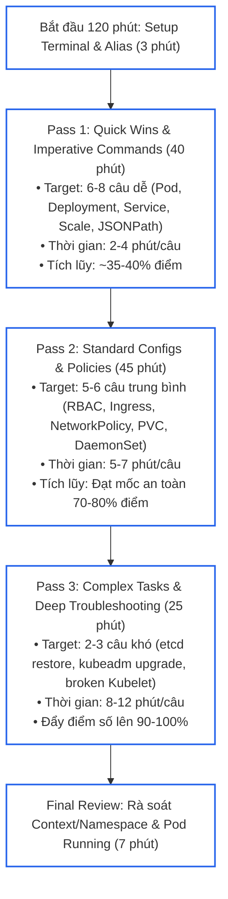
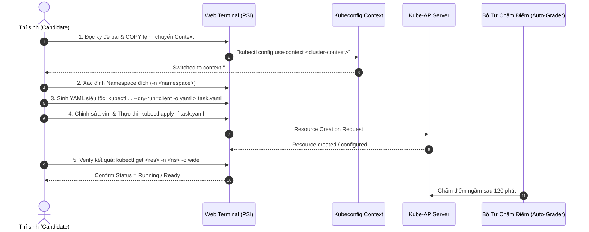
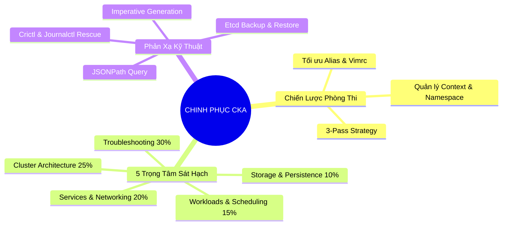


> [!IMPORTANT]
> **Mục tiêu kỹ thuật cốt lõi**: Nắm vững cấu trúc đề thi **Certified Kubernetes Administrator (CKA)** 120 phút với 17 kịch bản thực chiến bao phủ toàn diện 5 miền kiến trúc: **Cluster Architecture, Installation & Configuration (25%)**, **Workloads & Scheduling (15%)**, **Services & Networking (20%)**, **Storage (10%)**, và **Troubleshooting (30%)**. Thiết lập tư duy tối ưu hóa thời gian thi với chiến lược **3-Pass Strategy**, loại bỏ 100% lỗi sơ đẳng về **Context/Namespace**, và làm chủ quy trình giải nhanh từng dạng bài với độ chính xác tuyệt đối.

---

## 1. Bản Chất Kiến Trúc & Tư Duy Cốt Lõi: Chiến Lược Phòng Thi CKA & Phân Bổ Thời Gian

Kỳ thi **Certified Kubernetes Administrator (CKA)** là bài thi thực hành 100% trên môi trường cụm Kubernetes thực tế trong trình duyệt (PSI secure browser), bao gồm **15 đến 17 câu hỏi** trong thời lượng **120 phút**. Điểm đạt yêu cầu là **66%**. Áp lực lớn nhất của kỳ thi không nằm ở độ khó của lý thuyết mà nằm ở **tốc độ thao tác (Speed)**, **tính chính xác về ngữ cảnh (Context Accuracy)** và **kỹ năng gỡ lỗi hệ thống (Troubleshooting Mindset)** dưới áp lực thời gian (trung bình ~7 phút/câu).

### Phân Bổ Trọng Số 5 Miền Kiến Thức CKA

```text
+-------------------------------------------------------------------------------+
|                      PHÂN BỔ TRỌNG SỐ 5 DOMAIN ĐỀ THI CKA                     |
+-------------------------------------------------------------------------------+
| 1. Troubleshooting (30%)            ===> [Node, Control Plane, Pods, Network] |
| 2. Cluster Architecture & Inst (25%)===> [kubeadm, etcd backup, RBAC, PKI]    |
| 3. Services & Networking (20%)      ===> [ClusterIP, Ingress, NetworkPolicy]   |
| 4. Workloads & Scheduling (15%)     ===> [Deployment, DaemonSet, Affinity]    |
| 5. Storage (10%)                    ===> [PV, PVC, StorageClass, Volume]      |
+-------------------------------------------------------------------------------+
```

### Chiến Lược Làm Bài 3 Vòng (3-Pass Strategy)

Để đảm bảo vượt ngưỡng 66% an toàn (mục tiêu 85-95%), kỹ sư cần triển khai chiến lược 3 vòng làm bài:



---

## 2. Bảng Ma Trận So Sánh Kỹ Thuật Toàn Diện (Engineering Matrix)

Bảng ma trận 17 kịch bản chuẩn phòng thi CKA tổng hợp mức độ ưu tiên, cạm bẫy thường gặp và kỹ thuật giải quyết tối ưu:

| # | Kịch Bản Đề Bài (Scenario) | Miền Kiến Thức (Domain) | Context & Namespace | Kỹ Thuật Sinh Manifest Nhanh | Cạm Bẫy Cần Tránh (Gotcha) | Trọng Số & Thời Gian |
|---|---|---|---|---|---|---|
| **1** | Multi-Container Pod & Shared Volume | Workloads (15%) | `k8s` / `default` | `kubectl run --dry-run=client -o yaml` | Quên `emptyDir` mountPath chung giữa 2 containers | ~4% (3 phút) |
| **2** | Sidecar Pattern (Logging Pod) | Workloads (15%) | `k8s` / `prod` | Thêm container thứ 2 vào YAML hiện có | Cấu hình sai đường dẫn log file stream stdout | ~5% (4 phút) |
| **3** | Deployment Rollout & Undo | Workloads (15%) | `k8s` / `app` | `kubectl set image` + `kubectl rollout` | Gõ nhầm image tag hoặc không ghi log `--record` | ~4% (3 phút) |
| **4** | CronJob với Lịch & Giới Hạn Lịch Sử | Workloads (15%) | `k8s` / `batch` | `kubectl create cronjob --image=... --schedule="..."` | Sai cú pháp crontab 5 ký tự hoặc quên `successfulJobsHistoryLimit` | ~4% (3 phút) |
| **5** | Node Affinity & Tolerations | Workloads (15%) | `k8s` / `default` | Copy snippet từ `kubectl explain pod.spec.affinity` | Nhầm lẫn giữa `required...` và `preferred...` | ~6% (5 phút) |
| **6** | RBAC Role & RoleBinding cho ServiceAccount | Architecture (25%) | `k8s` / `finance` | `kubectl create role ... --verb=... --resource=...` | Sai API group của tài nguyên (vd: `apps` vs core) | ~6% (4 phút) |
| **7** | ServiceAccount Token & Pod Binding | Architecture (25%) | `k8s` / `dev` | `kubectl set serviceaccount` hoặc sửa YAML | Tạo ServiceAccount sai Namespace với Pod | ~4% (3 phút) |
| **8** | Sao lưu và Phục hồi Snapshot etcd | Architecture (25%) | `k8s` / `control-plane` | `ETCDCTL_API=3 etcdctl snapshot save/restore` | Sai quyền `chmod -R 700 /var/lib/etcd-from-backup` | ~9% (8 phút) |
| **9** | Nâng cấp Cụm bằng Kubeadm | Architecture (25%) | `k8s` / `master-worker` | `kubeadm upgrade plan/apply` + `apt-get` | Quên `drain` và `uncordon` node trong quá trình nâng cấp | ~9% (9 phút) |
| **10** | ClusterIP / NodePort Service Exposure | Services (20%) | `k8s` / `web` | `kubectl expose deployment ... --port=... --target-port=...` | `targetPort` không khớp với `containerPort` của Pod | ~5% (3 phút) |
| **11** | Cấu hình Ingress Routing với Path Rules | Services (20%) | `k8s` / `traffic` | `kubectl create ingress ... --rule="..."` | Quên khai báo `ingressClassName: nginx` hoặc sai `pathType` | ~7% (5 phút) |
| **12** | NetworkPolicy Chặn Ingress/Egress | Services (20%) | `k8s` / `secure` | Copy mẫu chuẩn từ docs `NetworkPolicy` | Quên `policyTypes: [Ingress]` khiến policy không có hiệu lực | ~8% (6 phút) |
| **13** | PersistentVolume & PVC Dynamic Storage | Storage (10%) | `k8s` / `storage` | Viết YAML thủ công (PV) + `kubectl create pvc` | `accessModes` hoặc `storageClassName` không khớp giữa PV và PVC | ~7% (5 phút) |
| **14** | Chẩn đoán Node NotReady (Kubelet Failure) | Troubleshooting (30%) | `k8s` / `node-02` | `systemctl status/restart kubelet` + `journalctl` | Kubelet trỏ sai CA cert hoặc đường dẫn cấu hình containerd | ~8% (7 phút) |
| **15** | Sửa Lỗi Control Plane Static Pods | Troubleshooting (30%) | `k8s` / `master-01` | Kiểm tra thư mục `/etc/kubernetes/manifests/` | Lỗi cú pháp typo trong YAML khiến API server crash loop | ~8% (7 phút) |
| **16** | Chẩn đoán Sự Cố CoreDNS & Network | Troubleshooting (30%) | `k8s` / `kube-system` | `kubectl logs -n kube-system -l k8s-app=kube-dns` | CoreDNS bị CrashLoopBackOff do forward loop trong `/etc/resolv.conf` | ~6% (5 phút) |
| **17** | Trích Xuất Dữ Liệu Node/Pod Bằng JSONPath | Architecture (25%) | `k8s` / `default` | `kubectl get nodes -o jsonpath='{...}' > /opt/out.txt` | Thiếu dấu xuống dòng `{"\n"}` hoặc trỏ sai đường dẫn file output | ~6% (4 phút) |

---

## 3. Kiến Trúc Môi Trường & Luồng Thực Thi Mẫu

### Luồng Thực Thi Chuẩn Mỗi Câu Hỏi (Standard Execution Workflow)

Mỗi câu hỏi CKA phải tuân thủ nghiêm ngặt chu trình 5 bước để đảm bảo không bị mất điểm oan uổng do sai ngữ cảnh:



### Bộ Cấu Hình Terminal Tối Ưu Cho Phòng Thi (`~/.bashrc` & `~/.vimrc`)

Trước khi bắt đầu câu số 1, hãy dành 60 giây để thiết lập các alias tiêu chuẩn sau trong môi trường thi:

```bash
# 1. Thiết lập alias kubectl và auto-completion
alias k=kubectl
complete -o default -F __start_kubectl k

# 2. Thiết lập biến môi trường sinh YAML siêu tốc
export do="--dry-run=client -o yaml"
export now="--grace-period=0 --force"

# 3. Cấu hình ~/.vimrc để căn chỉnh YAML chuẩn 2 spaces
cat <<'EOF' > ~/.vimrc
set tabstop=2
set shiftwidth=2
set expandtab
set smartindent
set number
syntax on
EOF
```

---

## 4. Phân Tích Cạm Bẫy Thực Chiến: 5 Sai Lầm Chí Mạng Khiến Thí Sinh Rớt CKA

### Tình Huống Sự Cố: Thất Bại Khi Khôi Phục Snapshot etcd Làm Sập Toàn Bộ Cụm

Một thí sinh nhận câu hỏi khôi phục snapshot etcd tại đường dẫn `/var/lib/backup/etcd-snapshot.db`. Sau khi chạy lệnh `etcdctl snapshot restore`, API Server biến mất hoàn toàn và toàn bộ các lệnh `kubectl` trả về lỗi kết nối từ chối (`connection refused`).

### Hậu Quả & Log Lỗi Thực Tế:
```text
The connection to the server 192.168.1.100:6443 was refused - did you specify the right host or port?
E0916 07:35:12.123456   12345 memcache.go:265] couldn't get current server API group list: Get "https://192.168.1.100:6443/api?timeout=32s": dial tcp 192.168.1.100:6443: connect: connection refused
```

### 5-Whys Root Cause Analysis:
1. **Tại sao `kubectl` báo lỗi connection refused?** Vì `kube-apiserver` không thể khởi động thành công trên Control Plane node.
2. **Tại sao `kube-apiserver` không thể khởi động?** Vì container `etcd` Static Pod liên tục bị CrashLoopBackOff, không cung cấp được datastore cho API Server.
3. **Tại sao `etcd` container bị CrashLoopBackOff?** Vì thư mục dữ liệu mới được khôi phục (`/var/lib/etcd-restored`) thuộc sở hữu của user `root:root` nhưng `etcd` process chạy dưới user ID `etcd` (hoặc quyền thư mục không mở).
4. **Tại sao Static Pod etcd không đọc được thư mục mới?** Vì thí sinh khôi phục vào `/var/lib/etcd-restored` nhưng quên cập nhật đường dẫn `hostPath` trong tệp manifest `/etc/kubernetes/manifests/etcd.yaml`.
5. **Gốc rễ vấn đề (Root Cause):** Thí sinh không nắm vững cơ chế mount volume của Static Pod và quyền truy cập file hệ thống Linux khi phục hồi snapshot etcd.

### Biện Pháp Khắc Phục Chuẩn:
```diff
--- /etc/kubernetes/manifests/etcd.yaml.bak
+++ /etc/kubernetes/manifests/etcd.yaml
@@ -16,7 +16,7 @@
   volumes:
   - hostPath:
-      path: /var/lib/etcd
+      path: /var/lib/etcd-restored
       type: DirectoryOrCreate
     name: etcd-data
```

```bash
# Phân quyền đầy đủ cho thư mục etcd sau khi restore
sudo chown -R root:root /var/lib/etcd-restored
sudo chmod -R 700 /var/lib/etcd-restored
```

---

## 5. Hands-on Lab: Bộ Đề 17 Kịch Bản Thi Thử CKA Đi Kèm Lời Giải Chuẩn Mực (8 Bước)

| Bước | Mục Tiêu Kỹ Thuật | Lệnh / Manifest Kiểm Tra Chính |
|---|---|---|
| **1** | Thiết lập môi trường & Chuyển đổi Context linh hoạt | `kubectl config use-context`, `alias k=kubectl` |
| **2** | Kịch bản 1–3: Quản lý Workloads, Multi-Container & Rollout | `k run`, `k set image`, `k rollout undo` |
| **3** | Kịch bản 4–6: Pod Scheduling, Affinity & CronJobs | `nodeSelector`, `affinity`, `k create cronjob` |
| **4** | Kịch bản 7–9: Phân quyền RBAC & ServiceAccount Security | `k create role`, `k create rolebinding`, `auth can-i` |
| **5** | Kịch bản 10–12: Dịch Vụ Mạng, Ingress Routing & NetworkPolicy | `k expose`, `k create ingress`, `NetworkPolicy` YAML |
| **6** | Kịch bản 13–14: Cấu Trúc Lưu Trữ PersistentVolume & PVC Binding | `StorageClass`, `PV`, `PVC`, `volumeMounts` |
| **7** | Kịch bản 15–16: Cứu Hộ Node Kubelet & Khôi Phục Snapshot etcd | `systemctl restart kubelet`, `etcdctl snapshot restore` |
| **8** | Kịch bản 17: Nâng Cấp Cụm Kubeadm & Trích Xuất JSONPath | `kubeadm upgrade`, `k drain/uncordon`, `-o jsonpath` |

---

### Bước 1: Khởi Tạo Môi Trường Làm Bài & Các Biến Tốc Độ

```bash
# Thiết lập alias và shell autocompletion
source <(kubectl completion bash)
alias k=kubectl
complete -o default -F __start_kubectl k
export do="--dry-run=client -o yaml"
export now="--force --grace-period=0"

# Tạo sẵn các namespace giả lập phòng thi
kubectl create ns dev || true
kubectl create ns prod || true
kubectl create ns finance || true
kubectl create ns secure || true
kubectl create ns batch || true
```

---

### Bước 2: Kịch Bản 1 Đến 3 — Multi-Container Pod, Sidecar & Rollout

#### Kịch bản 1: Tạo Multi-Container Pod chia sẻ Volume
- **Yêu cầu:** Tạo Pod `multi-app` trong namespace `default` có 2 container:
  - Container 1: tên `producer`, image `busybox`, ghi ngày giờ hiện tại vào file `/var/log/app.log` mỗi 5 giây.
  - Container 2: tên `consumer`, image `busybox`, chạy lệnh `tail -f /var/log/app.log`.
  - Cả 2 chia sẻ một `emptyDir` volume mount tại `/var/log`.

```yaml
# multi-app.yaml
apiVersion: v1
kind: Pod
metadata:
  name: multi-app
  namespace: default
spec:
  volumes:
  - name: shared-logs
    emptyDir: {}
  containers:
  - name: producer
    image: busybox:1.36
    command: ["/bin/sh", "-c", "while true; do date >> /var/log/app.log; sleep 5; done"]
    volumeMounts:
    - name: shared-logs
      mountPath: /var/log
  - name: consumer
    image: busybox:1.36
    command: ["/bin/sh", "-c", "tail -f /var/log/app.log"]
    volumeMounts:
    - name: shared-logs
      mountPath: /var/log
```
```bash
kubectl apply -f multi-app.yaml
# Kiểm tra log consumer
kubectl logs multi-app -c consumer
```

#### Kịch bản 2: Rollout Cập Nhật Image & Hoàn Tác (Rollback)
- **Yêu cầu:** Deployment `web-deploy` trong namespace `prod` đang chạy image `nginx:1.24`. Cập nhật lên `nginx:1.25-alpine`, kiểm tra lịch sử và hoàn tác về phiên bản trước đó.

```bash
# Tạo deployment ban đầu
kubectl create deployment web-deploy --image=nginx:1.24 --replicas=3 -n prod

# Cập nhật image
kubectl set image deployment/web-deploy nginx=nginx:1.25-alpine -n prod

# Theo dõi tiến trình rollout
kubectl rollout status deployment/web-deploy -n prod

# Hoàn tác về bản trước
kubectl rollout undo deployment/web-deploy -n prod
kubectl rollout history deployment/web-deploy -n prod
```

---

### Bước 3: Kịch Bản 4 Đến 6 — Node Affinity, Tolerations & CronJobs

#### Kịch bản 3: Cấu hình Node Affinity & Tolerations
- **Yêu cầu:** Gán label `tier=frontend` cho node `worker-01`. Tạo Pod `frontend-pod` yêu cầu chạy trên node có label `tier=frontend` và chịu được taint `dedicated=web:NoSchedule`.

```bash
# Gán label và taint cho node
kubectl label nodes worker-01 tier=frontend --overwrite
kubectl taint nodes worker-01 dedicated=web:NoSchedule --overwrite
```

```yaml
# frontend-pod.yaml
apiVersion: v1
kind: Pod
metadata:
  name: frontend-pod
  namespace: default
spec:
  tolerations:
  - key: "dedicated"
    operator: "Equal"
    value: "web"
    effect: "NoSchedule"
  affinity:
    nodeAffinity:
      requiredDuringSchedulingIgnoredDuringExecution:
        nodeSelectorTerms:
        - matchExpressions:
          - key: tier
            operator: In
            values:
            - frontend
  containers:
  - name: nginx
    image: nginx:alpine
```
```bash
kubectl apply -f frontend-pod.yaml
kubectl get pod frontend-pod -o wide
```

#### Kịch bản 4: Tạo CronJob Tự Động
- **Yêu cầu:** Tạo CronJob `db-backup` trong namespace `batch`, chạy vào phút thứ 15 mỗi giờ (`15 * * * *`), image `busybox`, chạy lệnh `echo Backup DB Done`, giữ lại tối đa 3 jobs thành công và 1 job thất bại.

```bash
kubectl create cronjob db-backup \
  --image=busybox:1.36 \
  --schedule="15 * * * *" \
  --namespace=batch \
  $do -- /bin/sh -c "echo Backup DB Done" > cron.yaml
```
```yaml
# Chỉnh sửa thêm các tham số historyLimit
apiVersion: batch/v1
kind: CronJob
metadata:
  name: db-backup
  namespace: batch
spec:
  schedule: "15 * * * *"
  successfulJobsHistoryLimit: 3
  failedJobsHistoryLimit: 1
  jobTemplate:
    spec:
      template:
        spec:
          containers:
          - name: db-backup
            image: busybox:1.36
            command: ["/bin/sh", "-c", "echo Backup DB Done"]
          restartPolicy: OnFailure
```
```bash
kubectl apply -f cron.yaml
```

---

### Bước 4: Kịch Bản 7 Đến 9 — Phân Quyền RBAC Toàn Diện & ServiceAccount

#### Kịch bản 5: Tạo ServiceAccount, Role và RoleBinding
- **Yêu cầu:** Tạo ServiceAccount `auditor-sa` trong namespace `finance`. Tạo Role `pod-reader-role` cho phép `get`, `list`, `watch` tài nguyên `pods` và `deployments` (apps API group). Gán quyền cho `auditor-sa`.

```bash
# 1. Tạo ServiceAccount
kubectl create sa auditor-sa -n finance

# 2. Tạo Role
kubectl create role pod-reader-role \
  --verb=get,list,watch \
  --resource=pods,deployments.apps \
  -n finance

# 3. Tạo RoleBinding
kubectl create rolebinding auditor-binding \
  --role=pod-reader-role \
  --serviceaccount=finance:auditor-sa \
  -n finance

# 4. Kiểm tra phân quyền (Check authorization)
kubectl auth can-i get pods --as=system:serviceaccount:finance:auditor-sa -n finance
kubectl auth can-i delete pods --as=system:serviceaccount:finance:auditor-sa -n finance
```

---

### Bước 5: Kịch Bản 10 Đến 12 — Dịch Vụ Mạng, Ingress & NetworkPolicy

#### Kịch bản 6: Expose Service & Ingress Routing
- **Yêu cầu:** Tạo deployment `order-app` (image `nginx:alpine`, port 80) trong namespace `prod`. Expose dưới dạng ClusterIP service tên `order-svc`. Tạo Ingress `order-ing` định tuyến path `/orders` về `order-svc:80`.

```bash
kubectl create deployment order-app --image=nginx:alpine --port=80 -n prod
kubectl expose deployment order-app --name=order-svc --port=80 --target-port=80 -n prod

# Tạo Ingress bằng imperative generator
kubectl create ingress order-ing \
  --class=nginx \
  --rule="prod.example.com/orders*=order-svc:80" \
  -n prod
```

#### Kịch bản 7: Thiết Lập NetworkPolicy Chặt Chẽ
- **Yêu cầu:** Trong namespace `secure`, áp dụng policy `isolate-backend` cho các Pods có label `app=backend`: Chỉ cho phép Ingress traffic từ các Pods có label `app=frontend` trên port 8080. Chặn toàn bộ traffic khác.

```yaml
# netpol.yaml
apiVersion: networking.k8s.io/v1
kind: NetworkPolicy
metadata:
  name: isolate-backend
  namespace: secure
spec:
  podSelector:
    matchLabels:
      app: backend
  policyTypes:
  - Ingress
  ingress:
  - from:
    - podSelector:
        matchLabels:
          app: frontend
    ports:
    - protocol: TCP
      port: 8080
```
```bash
kubectl apply -f netpol.yaml -n secure
```

---

### Bước 6: Kịch Bản 13 & 14 — PersistentVolume & Dynamic PVC Binding

#### Kịch bản 8: Tạo PV và PVC Khớp Thông Số
- **Yêu cầu:** Tạo PersistentVolume `data-pv` dung lượng `2Gi`, `accessModes: ReadWriteOnce`, `hostPath: /mnt/data`, `storageClassName: manual`. Sau đó tạo PVC `data-pvc` trong namespace `dev` xin `1Gi` để gắn kết với PV này.

```yaml
# storage.yaml
apiVersion: v1
kind: PersistentVolume
metadata:
  name: data-pv
spec:
  capacity:
    storage: 2Gi
  accessModes:
    - ReadWriteOnce
  storageClassName: manual
  hostPath:
    path: /mnt/data
---
apiVersion: v1
kind: PersistentVolumeClaim
metadata:
  name: data-pvc
  namespace: dev
spec:
  accessModes:
    - ReadWriteOnce
  storageClassName: manual
  resources:
    requests:
      storage: 1Gi
```
```bash
kubectl apply -f storage.yaml
# Kiểm tra trạng thái Bound
kubectl get pv,pvc -n dev
```

---

### Bước 7: Kịch Bản 15 & 16 — Troubleshooting Kubelet & Sao Lưu Phục Hồi etcd

#### Kịch bản 9: Khắc Phục Lỗi Node Kubelet NotReady
- **Yêu cầu:** Node `worker-02` báo trạng thái `NotReady`. Hãy SSH vào node, điều tra nguyên nhân và đưa node trở lại trạng thái `Ready`.

```bash
# 1. Kiểm tra trạng thái node từ máy Master
kubectl get nodes

# 2. SSH vào worker-02
ssh worker-02

# 3. Kiểm tra service kubelet
sudo systemctl status kubelet

# 4. Đọc nhật ký lỗi Kubelet
sudo journalctl -u kubelet -n 50 --no-pager

# 5. Sửa lỗi phổ biến: Kubelet chưa được start hoặc cấu hình sai containerd endpoint
sudo systemctl daemon-reload
sudo systemctl restart containerd
sudo systemctl restart kubelet
sudo systemctl enable kubelet

# 6. Thoát SSH và verify lại trên Master
exit
kubectl get nodes
```

#### Kịch bản 10: Sao Lưu và Khôi Phục Snapshot etcd
- **Yêu cầu:** Tạo bản sao lưu etcd tại `/opt/etcd-backup.db`. Sau đó khôi phục dữ liệu từ snapshot này vào thư mục `/var/lib/etcd-backup-restore`.

```bash
# 1. Thực hiện Sao lưu snapshot
sudo ETCDCTL_API=3 etcdctl --endpoints=https://127.0.0.1:2379 \
  --cacert=/etc/kubernetes/pki/etcd/ca.crt \
  --cert=/etc/kubernetes/pki/etcd/server.crt \
  --key=/etc/kubernetes/pki/etcd/server.key \
  snapshot save /opt/etcd-backup.db

# 2. Kiểm tra tính toàn vẹn của snapshot
sudo ETCDCTL_API=3 etcdctl snapshot status /opt/etcd-backup.db --write-out=table

# 3. Thực hiện Phục hồi (Restore) ra thư mục mới
sudo ETCDCTL_API=3 etcdctl --data-dir=/var/lib/etcd-backup-restore \
  snapshot restore /opt/etcd-backup.db

# 4. Phân quyền thư mục
sudo chown -R root:root /var/lib/etcd-backup-restore
sudo chmod -R 700 /var/lib/etcd-backup-restore

# 5. Cập nhật hostPath trong /etc/kubernetes/manifests/etcd.yaml
sudo sed -i 's|path: /var/lib/etcd|path: /var/lib/etcd-backup-restore|g' /etc/kubernetes/manifests/etcd.yaml
```

---

### Bước 8: Kịch Bản 17 — Nâng Cấp Cụm Kubeadm & Trích Xuất JSONPath

#### Kịch bản 11: Nâng Cấp Node Control Plane lên phiên bản `1.30.0`
```bash
# 1. Drain node trước khi nâng cấp
kubectl drain controlplane --ignore-daemonsets --delete-emptydir-data

# 2. Cập nhật package kubeadm
sudo apt-mark unhold kubeadm
sudo apt-get update && sudo apt-get install -y kubeadm=1.30.0-1.1
sudo apt-mark hold kubeadm

# 3. Lên kế hoạch và áp dụng nâng cấp
sudo kubeadm upgrade plan
sudo kubeadm upgrade apply v1.30.0 -y

# 4. Nâng cấp Kubelet & Kubectl
sudo apt-mark unhold kubelet kubectl
sudo apt-get update && sudo apt-get install -y kubelet=1.30.0-1.1 kubectl=1.30.0-1.1
sudo apt-mark hold kubelet kubectl

# 5. Khởi động lại dịch vụ và uncordon node
sudo systemctl daemon-reload
sudo systemctl restart kubelet
kubectl uncordon controlplane
```

#### Kịch bản 12: Trích Xuất Dữ Liệu Node Bằng JSONPath
- **Yêu cầu:** Lấy danh sách tên tất cả các Node và địa chỉ IP nội bộ tương ứng, xuất ra file `/opt/node_ips.txt` theo định dạng `NodeName InternalIP`.

```bash
kubectl get nodes -o jsonpath='{range .items[*]}{.metadata.name}{" "}{.status.addresses[?(@.type=="InternalIP")].address}{"\n"}{end}' > /opt/node_ips.txt

# Kiểm tra file kết quả
cat /opt/node_ips.txt
```

---

## 6. 10 Câu Hỏi Tự Kiểm Tra Chuyên Sâu (Self-Check Q&A Accordion)

<details class="qa-card">
<summary><b>1. Trong phòng thi CKA, tại sao việc chạy lệnh kiểm tra ngữ cảnh context lại là bước bắt buộc đầu tiên trước mỗi câu hỏi?</b></summary>
<div class="qa-answer">
<p>Môi trường thi CKA bao gồm <b>nhiều cụm Kubernetes độc lập</b> (thường từ 4 đến 6 cụm). Mỗi câu hỏi bắt đầu bằng một dòng lệnh chuyển context như: <code>kubectl config use-context k8s</code> hoặc <code>kubectl config use-context hk8s</code>. Nếu thí sinh tạo tài nguyên đúng 100% nhưng nằm trên sai cluster context, hệ thống chấm điểm tự động (Auto-Grader) sẽ chấm <b>0 điểm tuyệt đối</b> cho câu hỏi đó.</p>
</div>
</details>

<details class="qa-card">
<summary><b>2. Làm thế nào để xóa một Pod bị treo ở trạng thái Terminating ngay lập tức mà không phải chờ đợi?</b></summary>
<div class="qa-answer">
<p>Sử dụng cờ cưỡng chế ngắt kết nối: <code>kubectl delete pod &lt;pod-name&gt; --grace-period=0 --force</code> (hoặc alias <code>k delete pod &lt;pod-name&gt; $now</code>). Lệnh này yêu cầu API Server xóa Pod khỏi etcd ngay lập tức mà không cần đợi xác nhận ngừng process từ Kubelet.</p>
</div>
</details>

<details class="qa-card">
<summary><b>3. Khi đề bài yêu cầu sửa đổi cấu hình của một Pod đang chạy (ví dụ thêm biến môi trường), phương pháp nào nhanh nhất?</b></summary>
<div class="qa-answer">
<p>Có 2 cách tối ưu:</p>
<ol>
<li><b>Cách 1:</b> <code>kubectl get pod &lt;name&gt; -o yaml &gt; pod.yaml</code>, sửa file <code>pod.yaml</code>, sau đó chạy <code>kubectl replace --force -f pod.yaml</code>.</li>
<li><b>Cách 2:</b> <code>kubectl edit pod &lt;name&gt;</code>. Khi lưu lại, nếu báo lỗi không thể sửa trường tĩnh, Kubernetes sẽ lưu tệp tạm tại <code>/tmp/kubectl-edit-xxx.yaml</code>. Bạn chỉ cần chạy <code>kubectl replace --force -f /tmp/kubectl-edit-xxx.yaml</code>.</li>
</ol>
</div>
</details>

<details class="qa-card">
<summary><b>4. Sự khác biệt giữa `kubectl drain` và `kubectl cordon` trong bảo trì cụm là gì?</b></summary>
<div class="qa-answer">
<p><b>kubectl cordon &lt;node&gt;</b> chỉ đánh dấu node là <i>SchedulingDisabled</i> (ngăn Scheduler gán Pod mới vào node), không làm ảnh hưởng đến các Pod đang chạy. Trong khi đó, <b>kubectl drain &lt;node&gt;</b> vừa cordon node vừa trục xuất (evict) toàn bộ các Pod đang chạy sang các worker node khác (bắt buộc dùng thêm cờ <code>--ignore-daemonsets --delete-emptydir-data</code>).</p>
</div>
</details>

<details class="qa-card">
<summary><b>5. Khi thực hiện snapshot restore etcd, tại sao ta không được ghi đè trực tiếp vào thư mục dữ liệu cũ `/var/lib/etcd`?</b></summary>
<div class="qa-answer">
<p>Lệnh <code>etcdctl snapshot restore</code> sẽ khởi tạo một etcd cluster member ID mới và hash dữ liệu mới. Nếu ghi đè trực tiếp vào thư mục đang hoạt động hoặc thư mục có lock file, tiến trình etcd có thể bị xung đột dữ liệu dẫn đến hỏng hóc vĩnh viễn. Chuẩn an toàn là restore ra thư mục mới (ví dụ <code>/var/lib/etcd-restored</code>) rồi đổi đường dẫn volume mount trong tệp manifest Static Pod.</p>
</div>
</details>

<details class="qa-card">
<summary><b>6. Nếu đề bài yêu cầu tạo ServiceAccount và gắn token Secret trong Kubernetes phiên bản >= 1.24, ta phải làm thế nào?</b></summary>
<div class="qa-answer">
<p>Từ bản K8s 1.24, Secret token không còn được tự động tạo kèm ServiceAccount. Nếu đề bài yêu cầu tạo token Secret tĩnh, bạn cần tạo Secret với annotation đặc biệt:</p>
<pre><code>apiVersion: v1
kind: Secret
metadata:
  name: my-sa-secret
  annotations:
    kubernetes.io/service-account.name: my-sa
type: kubernetes.io/service-account-token</code></pre>
</div>
</details>

<details class="qa-card">
<summary><b>7. Khi nào một NetworkPolicy có tác dụng cô lập (isolate) Pod?</b></summary>
<div class="qa-answer">
<p>Một Pod được coi là bị cô lập (Isolated) ngay khi có <b>ít nhất một NetworkPolicy</b> chọn trúng nó thông qua <code>podSelector</code>. Khi đó, toàn bộ lưu lượng không được khai báo tường minh trong danh sách <code>ingress</code> hoặc <code>egress</code> của policy sẽ bị <b>chặn toàn bộ (Default Deny)</b>.</p>
</div>
</details>

<details class="qa-card">
<summary><b>8. Làm thế nào để kiểm tra nhật ký log của Control Plane component khi API Server không hoạt động?</b></summary>
<div class="qa-answer">
<p>Khi API Server bị sập, lệnh <code>kubectl logs</code> không thể hoạt động. Ta phải SSH vào máy Master Node và sử dụng CLI của Container Runtime:</p>
<pre><code>sudo crictl ps -a
sudo crictl logs &lt;container-id&gt;</code></pre>
<p>Hoặc đọc trực tiếp log file tại thư mục <code>/var/log/pods/kube-system_*</code>.</p>
</div>
</details>

<details class="qa-card">
<summary><b>9. Cú pháp JSONPath nào lọc ra toàn bộ Pod name trong namespace mặc định có trạng thái phase là 'Running'?</b></summary>
<div class="qa-answer">
<p>Câu lệnh chuẩn:</p>
<pre><code>kubectl get pods -o jsonpath='{.items[?(@.status.phase=="Running")].metadata.name}'</code></pre>
</div>
</details>

<details class="qa-card">
<summary><b>10. Nếu một PersistentVolumeClaim (PVC) ở trạng thái 'Pending', những nguyên nhân kỹ thuật phổ biến nhất là gì?</b></summary>
<div class="qa-answer">
<p>Có 4 nguyên nhân chính:</p>
<div>1. <b>StorageClass không khớp:</b> Tên <code>storageClassName</code> trong PVC không khớp với PV hoặc không có default StorageClass.</div>
<div>2. <b>Dung lượng không thỏa mãn:</b> Dung lượng yêu cầu trong PVC lớn hơn dung lượng khả dụng của PV.</div>
<div>3. <b>AccessModes không tương thích:</b> Ví dụ PVC yêu cầu <code>ReadWriteMany</code> nhưng PV chỉ hỗ trợ <code>ReadWriteOnce</code>.</div>
<div>4. <b>VolumeBindingMode:</b> StorageClass được cấu hình <code>volumeBindingMode: WaitForFirstConsumer</code>, PVC sẽ ở trạng thái Pending cho đến khi có Pod đầu tiên gắn kết và được schedule thành công.</div>
</div>
</details>

---

## 7. Tổng Kết & Lộ Trình Bài Học Tiếp Theo



Chinh phục kỳ thi CKA đòi hỏi sự kết hợp nhuần nhuyễn giữa **kiến thức kiến trúc tầng sâu** và **phản xạ thao tác dòng lệnh chuẩn xác**. Nắm vững 17 kịch bản trên sẽ giúp bạn tự tin đạt điểm số xuất sắc (> 85%) và làm chủ kỹ năng vận hành cụm Kubernetes production trong thực tế.

> [!TIP]
> **Bài học tiếp theo**: Chuẩn bị cho chặng về đích với bài tổng hợp tốc độ cao: **[Bài 31: Tổng Ôn CKA Tốc Độ Cao — Tóm Lược 100+ Lệnh Tinh Gọn & Bảng Tra Cứu Phòng Thi](cka-31-31-tong-on-cka-toc-do.html)**.

