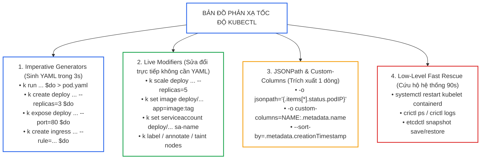
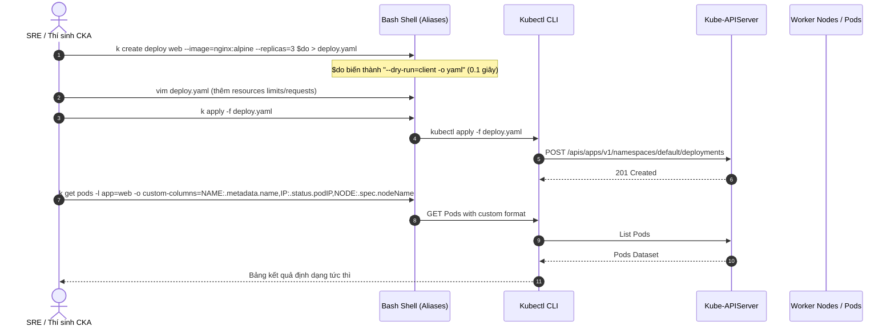
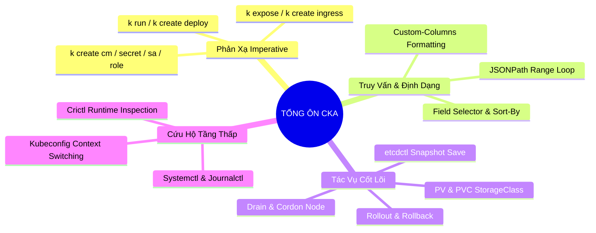


> [!IMPORTANT]
> **Mục tiêu kỹ thuật cốt lõi**: Đạt tốc độ phản xạ tối đa khi thao tác quản trị cụm Kubernetes bằng cách chuẩn hóa bộ **100+ câu lệnh Imperative**, làm chủ cú pháp **JSONPath / Custom-Columns** trích xuất dữ liệu đa tầng, tối ưu hóa tệp cấu hình **Terminal & Vim**, và giải quyết nhanh **20 kịch bản Speed Drill** trong thời gian dưới **4,5 phút mỗi câu**.

---

## 1. Bản Chất Kiến Trúc & Tư Duy Cốt Lõi: Bản Đồ Phản Xạ Tốc Độ & Cheat Sheet 100+ Lệnh

Trong kỳ thi CKA cũng như các sự cố sản xuất (Production Outage Severity 1), yếu tố quyết định sự thành bại là **Tốc Độ Phản Xạ (Speed of Execution)** và **Độ Chính Xác Tuyệt Đối (Zero Syntax Error)**. Việc tự viết từng dòng YAML bằng tay (declarative authoring) từ con số 0 tiêu tốn từ 5–10 phút cho mỗi đối tượng phức tạp. Thay vào đó, kỹ sư chuyên nghiệp tận dụng tối đa cơ chế **Imperative Generators** của `kubectl` kết hợp các cờ `--dry-run=client -o yaml` để sinh khung manifest chuẩn xác chỉ trong **2 đến 5 giây**.



---

## 2. Bảng Ma Trận So Sánh Kỹ Thuật Toàn Diện (Engineering Matrix)

Bảng ma trận tổng hợp các mẫu lệnh imperative, truy vấn JSONPath và kỹ thuật can thiệp nhanh:

| Nghiệp Vụ Quản Trị (Task) | Lệnh Imperative Siêu Tốc (Fast Command) | Truy Vấn JSONPath / Filter Tương Đương | Cờ Quan Trọng Cần Nhớ | Thời Gian Chuẩn |
|---|---|---|---|---|
| **Tạo Pod đơn giản** | `k run nginx --image=nginx:alpine --port=80 $do > pod.yaml` | `k get pod nginx -o jsonpath='{.status.podIP}'` | `--env="KEY=VAL"`, `--labels="app=web"` | 15 giây |
| **Tạo Deployment & Scale** | `k create deploy web --image=nginx --replicas=3` | `k get deploy web -o jsonpath='{.spec.replicas}'` | `--replicas=N`, `--port=80` | 20 giây |
| **Expose Service ClusterIP** | `k expose deploy web --port=80 --target-port=8080 --name=web-svc` | `k get svc web-svc -o jsonpath='{.spec.clusterIP}'` | `--type=ClusterIP / NodePort` | 15 giây |
| **Expose Service NodePort** | `k create svc nodeport web-np --tcp=80:80 $do > np.yaml` | `k get svc web-np -o jsonpath='{.spec.ports[0].nodePort}'` | `--node-port=30080` (chỉnh YAML) | 30 giây |
| **Tạo Ingress Rule** | `k create ingress web-ing --rule="app.com/api*=web-svc:80" --class=nginx` | `k get ingress -o jsonpath='{.items[*].spec.rules[*].host}'` | `--class=nginx`, `--annotation` | 40 giây |
| **Tạo ConfigMap từ Literals** | `k create cm app-cfg --from-literal=DB_HOST=mysql --from-literal=DB_PORT=3306` | `k get cm app-cfg -o jsonpath='{.data.DB_HOST}'` | `--from-literal`, `--from-file` | 20 giây |
| **Tạo Secret Generic** | `k create secret generic app-sec --from-literal=PASS=admin123` | `k get secret app-sec -o jsonpath='{.data.PASS}' \| base64 -d` | `--from-literal`, `--from-file` | 20 giây |
| **Tạo ServiceAccount & Token** | `k create sa api-sa && k create token api-sa --duration=24h` | `k get sa api-sa -o jsonpath='{.secrets[*].name}'` | `--duration`, `--audience` | 20 giây |
| **Phân quyền Role & Binding** | `k create role pod-ro --verb=get,list --resource=pods && k create rolebinding rb --role=pod-ro --serviceaccount=ns:sa` | `k auth can-i get pods --as=system:serviceaccount:ns:sa` | `--verb`, `--resource`, `--serviceaccount` | 45 giây |
| **Tạo CronJob** | `k create cronjob backup --image=busybox --schedule="*/5 * * * *" -- /bin/sh -c "date"` | `k get cronjob backup -o jsonpath='{.spec.schedule}'` | `--schedule="..."` | 30 giây |
| **Trích xuất Danh Sách Node IP** | `k get nodes -o wide` | `k get nodes -o jsonpath='{range .items[*]}{.metadata.name}{"\t"}{.status.addresses[?(@.type=="InternalIP")].address}{"\n"}{end}'` | `jsonpath range loop` | 45 giây |
| **Lọc Pod theo Node & Restart** | `k get pods -A --field-selector spec.nodeName=worker-01` | `k get pods -A --sort-by=.status.containerStatuses[0].restartCount` | `--field-selector`, `--sort-by` | 30 giây |
| **Drain & Cordon Node** | `k cordon node-1 && k drain node-1 --ignore-daemonsets --delete-emptydir-data --force` | `k get node node-1 -o jsonpath='{.spec.unschedulable}'` | `--ignore-daemonsets`, `--delete-emptydir-data` | 30 giây |
| **Sao Lưu Nhanh Snapshot etcd** | `ETCDCTL_API=3 etcdctl --cacert=... --cert=... --key=... snapshot save /tmp/etcd.db` | `ETCDCTL_API=3 etcdctl snapshot status /tmp/etcd.db -w table` | `--cacert`, `--cert`, `--key`, `--endpoints` | 60 giây |
| **Cứu Hộ Dịch Vụ Kubelet** | `systemctl status kubelet && journalctl -u kubelet -n 30 --no-pager` | `crictl ps && crictl logs <id>` | `systemctl daemon-reload` | 90 giây |

---

## 3. Kiến Trúc Môi Trường & Luồng Thực Thi Mẫu

### Luồng Tương Tác Tốc Độ Cao Một Câu Lệnh (Fast Iteration Loop)



### Bộ Khởi Động Terminal Thần Tốc (Bỏ Vào Đầu Phiên Làm Việc)

```bash
# Script thiết lập môi trường siêu tốc (Copy-Paste 1 lần)
cat << 'EOF' >> ~/.bashrc
source <(kubectl completion bash)
alias k=kubectl
complete -o default -F __start_kubectl k
export do="--dry-run=client -o yaml"
export now="--force --grace-period=0"
export ns="-n"

# Hàm chuyển namespace nhanh
function kns() {
  kubectl config set-context --current --namespace="$1"
}
EOF
source ~/.bashrc
```

---

## 4. Phân Tích Cạm Bẫy Thực Chiến: 5 Lỗi Cú Pháp Khiến Lệnh Imperative Thất Bại

### Tình Huống Sự Cố: Sai Lầm Cú Pháp JSONPath Dẫn Đến File Rỗng

Trong kỳ thi, đề bài yêu cầu: *"Trích xuất tên và trạng thái Ready của tất cả Pod trong namespace `kube-system` và lưu vào file `/tmp/pods_status.txt` theo định dạng `Name:Status`"*. Thí sinh chạy lệnh JSONPath với dấu nháy kép bên ngoài khiến Bash shell mở rộng biến sai, kết quả tạo ra file rỗng hoặc syntax error.

### Hậu Quả & Log Lỗi Thực Tế:
```text
error: error parsing jsonpath {.items[*].metadata.name}:{.items[*].status.containerStatuses[*].ready}, unclosed action
syntax error near unexpected token `('
bash: /tmp/pods_status.txt: No such file or directory
```

### 5-Whys Root Cause Analysis:
1. **Tại sao lệnh báo lỗi unclosed action / syntax error?** Vì biểu thức JSONPath chứa các ký tự đặc biệt như `[`, `]`, `*`, `?`, `(` bị Bash shell can thiệp và phân giải trước khi chuyển cho `kubectl`.
2. **Tại sao Bash can thiệp vào chuỗi?** Vì thí sinh sử dụng dấu ngoặc kép `"` bao quanh biểu thức thay vì dấu nháy đơn `'` (`-o jsonpath="..."` vs `-o jsonpath='...'`).
3. **Tại sao cấu trúc JSONPath ghép 2 mảng bị lỗi?** Vì JSONPath không thể tự động ghép 2 mảng độc lập trên cùng 1 dòng mà không dùng vòng lặp `{range .items[*]}`.
4. **Tại sao file output không có dữ liệu?** Vì lệnh trả về exit code khác 0 và redirect stderr/stdout bị cắt ngang.
5. **Gốc rễ vấn đề (Root Cause):** Thí sinh không nắm vững quy tắc thoát ký tự trong Bash và cú pháp vòng lặp `{range ...}{end}` của JSONPath.

### Cú Pháp Sửa Đổi Chuẩn Xác:
```bash
# Cú pháp JSONPath chuẩn xác có range loop và xuống dòng:
kubectl get pods -n kube-system -o jsonpath='{range .items[*]}{.metadata.name}{":"}{.status.containerStatuses[0].ready}{"\n"}{end}' > /tmp/pods_status.txt

# Hoặc dùng Custom-Columns đơn giản hơn nhiều:
kubectl get pods -n kube-system -o custom-columns='NAME:.metadata.name,STATUS:.status.containerStatuses[0].ready' --no-headers > /tmp/pods_status.txt
```

---

## 5. Hands-on Lab: 20 Bài Tập Phản Xạ Tốc Độ (Speed Drills) Trong 90 Phút (8 Bước)

| Bước | Nhóm Bài Tập Phản Xạ | Thời Gian Mục Tiêu | Mục Tiêu Kỹ Thuật |
|---|---|---|---|
| **1** | Speed Drills 1–3: Khởi tạo Pod, Biến Môi Trường & Multi-Container | 8 phút | `k run`, `--env`, `emptyDir` mount |
| **2** | Speed Drills 4–6: Deployment, Scale, Rollout & DaemonSet | 10 phút | `k create deploy`, `k set image`, `k rollout` |
| **3** | Speed Drills 7–9: Service, Ingress Routing & Port-Forward | 12 phút | `k expose`, `k create ingress`, `ClusterIP` |
| **4** | Speed Drills 10–12: RBAC Roles, ClusterRole & ServiceAccount | 12 phút | `k create role/rolebinding/sa`, `auth can-i` |
| **5** | Speed Drills 13–14: ConfigMap, Secret & Pod Env Injection | 8 phút | `k create cm/secret`, `envFrom` |
| **6** | Speed Drills 15–16: PersistentVolume, PVC & Storage Binding | 10 phút | StorageClass, PV HostPath, PVC ReadWriteOnce |
| **7** | Speed Drills 17–18: Node Cordon/Drain & JSONPath Queries | 12 phút | `k drain`, `jsonpath range loop`, `--sort-by` |
| **8** | Speed Drills 19–20: etcd Fast Backup & Kubelet Troubleshooting | 18 phút | `etcdctl snapshot`, `systemctl/journalctl kubelet` |

---

### Bước 1: Speed Drills 1 Đến 3 — Pods, Config & Multi-Containers (8 Phút)

```bash
# Drill 1: Tạo Pod nginx-fast có env DB_URL=postgres://db:5432 và label tier=api trong 15s
kubectl run nginx-fast --image=nginx:alpine --env="DB_URL=postgres://db:5432" -l tier=api

# Drill 2: Tạo Pod busybox chạy lệnh sleep 3600 và tự động restart khi fail
kubectl run sleeper --image=busybox:1.36 --restart=OnFailure -- /bin/sh -c "sleep 3600"

# Drill 3: Tạo Pod 2 containers (app + adapter) chia sẻ volume trong 90s
cat << 'EOF' | kubectl apply -f -
apiVersion: v1
kind: Pod
metadata:
  name: two-containers
spec:
  volumes:
  - name: shared-data
    emptyDir: {}
  containers:
  - name: writer
    image: busybox:1.36
    command: ["/bin/sh", "-c", "while true; do date > /data/time.txt; sleep 2; done"]
    volumeMounts:
    - name: shared-data
      mountPath: /data
  - name: reader
    image: busybox:1.36
    command: ["/bin/sh", "-c", "tail -f /data/time.txt"]
    volumeMounts:
    - name: shared-data
      mountPath: /data
EOF
```

---

### Bước 2: Speed Drills 4 Đến 6 — Deployment, Rollout & DaemonSet (10 Phút)

```bash
# Drill 4: Tạo Deployment web-prod 4 replicas chạy image redis:6.2
kubectl create deployment web-prod --image=redis:6.2 --replicas=4

# Drill 5: Nâng cấp image lên redis:7.0, ghi nhận rollout, sau đó rollback về bản cũ
kubectl set image deployment/web-prod redis=redis:7.0 --record
kubectl rollout status deployment/web-prod
kubectl rollout undo deployment/web-prod

# Drill 6: Chuyển đổi Deployment thành DaemonSet trong 60s
kubectl create deployment log-agent --image=fluentd:v1.14 $do > ds.yaml
sed -i 's/kind: Deployment/kind: DaemonSet/g' ds.yaml
sed -i '/replicas:/d' ds.yaml
sed -i '/strategy:/d' ds.yaml
kubectl apply -f ds.yaml
```

---

### Bước 3: Speed Drills 7 Đến 9 — Services, Ingress & Port Mapping (12 Phút)

```bash
# Drill 7: Expose Deployment web-prod thành ClusterIP service tên web-svc cổng 6379
kubectl expose deployment web-prod --name=web-svc --port=6379 --target-port=6379

# Drill 8: Tạo Service NodePort expose port 80 -> nodePort 30080
kubectl create service nodeport nginx-np --tcp=80:80 $do > np.yaml
sed -i '/targetPort: 80/a \      nodePort: 30080' np.yaml
kubectl apply -f np.yaml

# Drill 9: Tạo Ingress điều hướng domain api.company.com/v1 về web-svc:6379
kubectl create ingress api-ing \
  --class=nginx \
  --rule="api.company.com/v1*=web-svc:6379"
```

---

### Bước 4: Speed Drills 10 Đến 12 — RBAC & ServiceAccount (12 Phút)

```bash
# Drill 10: Tạo ServiceAccount tên deploy-admin trong namespace prod
kubectl create sa deploy-admin -n prod

# Drill 11: Tạo Role quản lý toàn quyền Deployments/StatefulSets trong prod
kubectl create role app-manager \
  --verb="*" \
  --resource=deployments.apps,statefulsets.apps \
  -n prod

# Drill 12: Gán Role app-manager cho ServiceAccount deploy-admin
kubectl create rolebinding app-manager-binding \
  --role=app-manager \
  --serviceaccount=prod:deploy-admin \
  -n prod

# Kiểm tra quyền:
kubectl auth can-i create deployments --as=system:serviceaccount:prod:deploy-admin -n prod
```

---

### Bước 5: Speed Drills 13 Đến 14 — ConfigMap & Secrets (8 Phút)

```bash
# Drill 13: Tạo ConfigMap chứa cả key đơn và file cấu hình
echo "debug=true" > config.ini
kubectl create cm app-config \
  --from-literal=ENVIRONMENT=production \
  --from-file=config.ini

# Drill 14: Tạo Secret chứa TLS Certificate giả lập
openssl req -x509 -nodes -days 365 -newkey rsa:2048 \
  -keyout tls.key -out tls.crt -subj "/CN=api.company.com"
kubectl create secret tls api-tls-secret --key=tls.key --cert=tls.crt
```

---

### Bước 6: Speed Drills 15 Đến 16 — PersistentVolume & Claims (10 Phút)

```yaml
# Drill 15 & 16: Tạo PV dung lượng 5Gi và PVC xin 2Gi khớp StorageClass
cat << 'EOF' | kubectl apply -f -
apiVersion: v1
kind: PersistentVolume
metadata:
  name: fast-pv
spec:
  capacity:
    storage: 5Gi
  accessModes:
    - ReadWriteOnce
  storageClassName: local-storage
  hostPath:
    path: /data/fast
---
apiVersion: v1
kind: PersistentVolumeClaim
metadata:
  name: fast-pvc
spec:
  accessModes:
    - ReadWriteOnce
  storageClassName: local-storage
  resources:
    requests:
      storage: 2Gi
EOF
```
```bash
kubectl get pv fast-pv,pvc fast-pvc
```

---

### Bước 7: Speed Drills 17 Đến 18 — Cordon/Drain & JSONPath Queries (12 Phút)

```bash
# Drill 17: Drain worker-01 an toàn bỏ qua DaemonSets
kubectl cordon worker-01
kubectl drain worker-01 --ignore-daemonsets --delete-emptydir-data --force

# Uncordon sau khi hoàn tất bảo trì
kubectl uncordon worker-01

# Drill 18: Lọc ra tất cả Pod name kèm Node name sắp xếp theo thời gian tạo
kubectl get pods -A --sort-by=.metadata.creationTimestamp \
  -o jsonpath='{range .items[*]}{.metadata.namespace}{"\t"}{.metadata.name}{"\t"}{.spec.nodeName}{"\n"}{end}'
```

---

### Bước 8: Speed Drills 19 Đến 20 — etcd Backup & Kubelet Rescue (18 Phút)

```bash
# Drill 19: Sao lưu etcd snapshot với đầy đủ TLS certificates trong 60s
ETCDCTL_API=3 etcdctl \
  --endpoints=https://127.0.0.1:2379 \
  --cacert=/etc/kubernetes/pki/etcd/ca.crt \
  --cert=/etc/kubernetes/pki/etcd/server.crt \
  --key=/etc/kubernetes/pki/etcd/server.key \
  snapshot save /tmp/etcd-fast-backup.db

# Kiểm tra status snapshot
ETCDCTL_API=3 etcdctl snapshot status /tmp/etcd-fast-backup.db -w table

# Drill 20: Quy trình cấp cứu Kubelet bị lỗi cấu hình trong 90s
sudo systemctl daemon-reload
sudo systemctl restart containerd
sudo systemctl restart kubelet
sudo journalctl -u kubelet -n 30 --no-pager
```

---

## 6. 10 Câu Hỏi Tự Kiểm Tra Chuyên Sâu (Self-Check Q&A Accordion)

<details class="qa-card">
<summary><b>1. Làm thế nào để tạo file manifest cho một Service loại NodePort bằng lệnh kubectl imperative?</b></summary>
<div class="qa-answer">
<p>Dùng lệnh <code>kubectl create service nodeport &lt;svc-name&gt; --tcp=80:80 $do &gt; svc.yaml</code>. Sau đó nếu muốn cố định cổng <code>nodePort</code> (ví dụ 30080), mở file YAML và thêm trường <code>nodePort: 30080</code> dưới mục <code>ports</code>.</p>
</div>
</details>

<details class="qa-card">
<summary><b>2. Sự khác biệt giữa `kubectl replace --force -f pod.yaml` và `kubectl apply -f pod.yaml` là gì?</b></summary>
<div class="qa-answer">
<p>Lệnh <code>kubectl apply</code> cố gắng cập nhật tài nguyên tại chỗ (in-place update). Tuy nhiên, nhiều trường của Pod (như <code>spec.containers</code>, <code>spec.affinity</code>) là bất biến (immutable) và sẽ trả về lỗi. Lệnh <code>kubectl replace --force</code> sẽ tự động xóa ngay Pod cũ (tương đương <code>delete --grace-period=0</code>) và tạo mới lại Pod với cấu hình cập nhật chỉ trong 1 bước.</p>
</div>
</details>

<details class="qa-card">
<summary><b>3. Biểu thức JSONPath nào giúp lấy toàn bộ InternalIP của tất cả các Node trong cụm?</b></summary>
<div class="qa-answer">
<pre><code>kubectl get nodes -o jsonpath='{.items[*].status.addresses[?(@.type=="InternalIP")].address}'</code></pre>
<p>Để xuống dòng đẹp từng IP, ta lồng trong vòng lặp range: <code>'{range .items[*]}{.metadata.name}{"\t"}{.status.addresses[?(@.type=="InternalIP")].address}{"\n"}{end}'</code>.</p>
</div>
</details>

<details class="qa-card">
<summary><b>4. Khi nào nên dùng Custom-Columns (`-o custom-columns=...`) thay vì JSONPath?</b></summary>
<div class="qa-answer">
<p>Nên dùng <b>Custom-Columns</b> khi đề bài yêu cầu xuất dữ liệu dạng bảng với tiêu đề cột cụ thể (ví dụ: <code>NAME</code>, <code>IP</code>, <code>NODE</code>) hoặc khi bạn cần nhìn nhanh kết quả nhiều trường. Cú pháp Custom-Columns ngắn gọn và ít bị lỗi cú pháp nháy ngoặc hơn so với JSONPath loop.</p>
</div>
</details>

<details class="qa-card">
<summary><b>5. Lệnh nào giúp kiểm tra nhanh xem một ServiceAccount có quyền xóa PersistentVolumeClaims trong cụm không?</b></summary>
<div class="qa-answer">
<pre><code>kubectl auth can-i delete pvc --as=system:serviceaccount:&lt;namespace&gt;:&lt;sa-name&gt; -n &lt;namespace&gt;</code></pre>
</div>
</details>

<details class="qa-card">
<summary><b>6. Làm thế nào để lọc các Pod bị crash hoặc có số lần restart > 0 nhanh nhất?</b></summary>
<div class="qa-answer">
<pre><code>kubectl get pods -A --sort-by='.status.containerStatuses[0].restartCount'</code></pre>
<p>Hoặc lọc theo trạng thái không phải Running: <code>kubectl get pods -A --field-selector status.phase!=Running</code>.</p>
</div>
</details>

<details class="qa-card">
<summary><b>7. Khi một Node ở trạng thái `Ready,SchedulingDisabled`, điều đó có nghĩa là gì?</b></summary>
<div class="qa-answer">
<p>Node đó đang hoạt động bình thường (Kubelet và CNI khỏe mạnh) nhưng đã bị đánh dấu <b>Cordon</b> hoặc đang trong trạng thái <b>Drain</b>. Kubernetes Scheduler sẽ không phân bổ thêm Pods mới vào Node này.</p>
</div>
</details>

<details class="qa-card">
<summary><b>8. Thao tác nhanh nhất để lấy mẫu YAML của một NetworkPolicy trong phòng thi là gì?</b></summary>
<div class="qa-answer">
<p>Mở trình duyệt phòng thi, truy cập trang tài liệu chính thức <code>kubernetes.io/docs</code>, tìm kiếm từ khóa <b>"Network Policies"</b>, cuộn xuống mục ví dụ mẫu YAML chuẩn (chứa đầy đủ <code>podSelector</code>, <code>ingress</code>, <code>from</code>, <code>ports</code>, <code>egress</code>) rồi copy-paste chỉnh sửa theo yêu cầu đề bài.</p>
</div>
</details>

<details class="qa-card">
<summary><b>9. Làm thế nào để đặt Namespace mặc định cho toàn bộ các lệnh kubectl tiếp theo mà không cần gõ `-n <namespace>`?</b></summary>
<div class="qa-answer">
<p>Chạy câu lệnh chuyển đổi namespace trên context hiện tại:</p>
<pre><code>kubectl config set-context --current --namespace=&lt;target-namespace&gt;</code></pre>
</div>
</details>

<details class="qa-card">
<summary><b>10. Nếu lệnh `kubectl logs` trả về lỗi "dial tcp ...: connect: connection refused" thì nguyên nhân nằm ở đâu?</b></summary>
<div class="qa-answer">
<p>Khi chạy <code>kubectl logs</code>, API Server kết nối trực tiếp đến cổng 10250 của Kubelet trên Node chứa Pod. Lỗi <i>connection refused</i> chỉ ra rằng: dịch vụ Kubelet trên Worker Node đó đang bị tắt (stopped/crashed), firewall/security group chặn port 10250, hoặc Kubelet cấu hình sai địa chỉ IP bind.</p>
</div>
</details>

---

## 7. Tổng Kết & Lộ Trình Bài Học Tiếp Theo



Tổng ôn tốc độ cao là bước đệm then chốt giúp bạn biến kiến thức lý thuyết thành **bản năng dòng lệnh phản xạ tức thì**. Với hơn 100 câu lệnh tinh gọn và kỹ năng giải quyết sự cố trong vòng 90 giây, bạn đã sẵn sàng bước vào thế giới quản trị hạ tầng quy mô lớn trong môi trường doanh nghiệp.

> [!TIP]
> **Bài học tiếp theo**: Tiến vào giai đoạn chuyên sâu về vận hành thực tế doanh nghiệp với **[Bài 32: Vận Hành Cụm Đa Đội Ngũ (Multi-Tenant) — Phân Chia Tài Nguyên, Hard Multi-Tenancy & Quản Trị Chi Phí](cka-32-32-van-hanh-that-cum-nhieu-doi.html)**.

