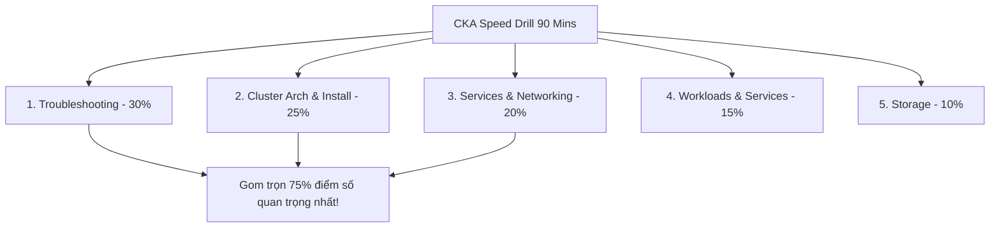
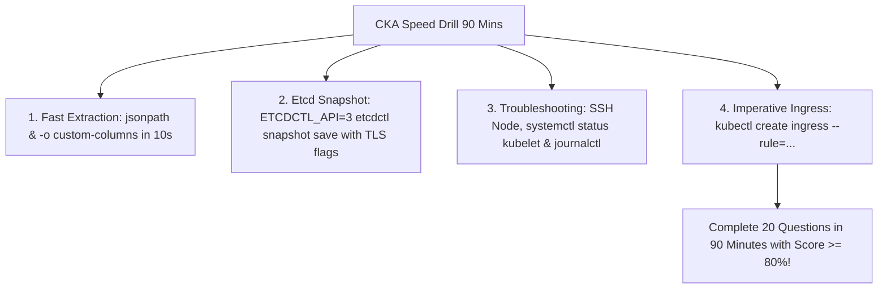
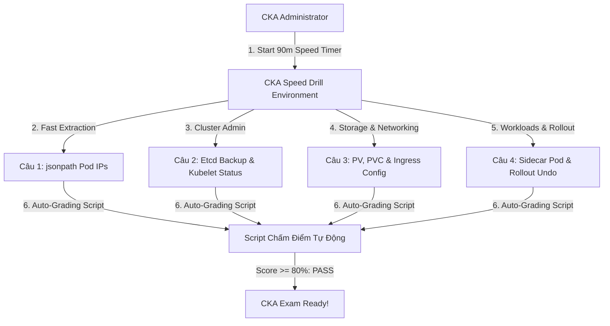


# [BÀI 31] TỔNG ÔN TỐC ĐỘ CKA: CHINH PHỤC 20 KỊCH BẢN THỰC HÀNH QUẢN TRỊ CỤM TRONG 90 PHÚT

Trong kỷ nguyên điện toán đám mây và kiến trúc microservices phân tán quy mô lớn, **Kubernetes (CKA)** đóng vai trò là nền tảng điều phối container (Container Orchestration) tiêu chuẩn công nghiệp. Để làm chủ hệ thống trong môi trường sản xuất (Production) cũng như chinh phục kỳ thi chứng chỉ quốc tế của Linux Foundation / CNCF, kỹ sư không chỉ nắm vững các câu lệnh thao tác cơ bản mà phải thấu hiểu sâu sắc bản chất cơ chế tầng thấp: từ chu trình điều hòa (Reconciliation Loop), cấu trúc điều phối tài nguyên, kiến trúc mạng CNI, lưu trữ CSI cho đến các chuẩn mực an ninh phòng thủ chiều sâu.

Bài viết chuyên sâu này sẽ đồng hành cùng bạn giải mã toàn diện bức tranh kiến trúc, phân tích các đánh đổi kỹ thuật thực chiến (Engineering Trade-offs), cung cấp bài thực hành Lab từng bước và bộ câu hỏi phỏng vấn chuẩn Architect / Lead Engineer.

---

## 1. Bản Chất Kiến Trúc & Cơ Chế Vận Hành Tầng Thấp

| # | Câu hỏi ôn tập | Đáp án chuẩn ngắn gọn |
|---|---|---|
| 1 | Ngưỡng điểm đỗ chứng chỉ CKS? | **`67 %`** (67/100 điểm) |
| 2 | Lệnh bắt buộc ở đầu mỗi câu thi? | Lệnh **`kubectl config use-context <name>`** |
| 3 | Lệnh sinh khung YAML siêu tốc? | Cờ **`--dry-run=client -o yaml`** |
| 4 | Thao tác bảo vệ Static Pod? | Sao lưu tệp **`kube-apiserver.yaml`** |
| 5 | Chiến thuật phân bổ thời gian? | **Chiến thuật 3 lượt làm bài** |


> **"Tổng ôn tốc độ chứng chỉ CKA (Certified Kubernetes Administrator) thông qua bài thực hành nén 20 câu bài tập trong 90 phút là kỹ năng tối ưu hóa phản xạ vận hành và quản trị cụm Kubernetes cấp độ chuyên gia, đòi hỏi quản trị viên hệ thống phải làm chủ 5 miền kiến thức CKA (Storage, Troubleshooting, Workloads & Services, Cluster Architecture & Installation, và Services & Networking); thành thục kỹ thuật trích xuất dữ liệu bằng `jsonpath` và `-o custom-columns`; thực hiện siêu tốc các thao tác nâng cấp cụm `kubeadm`, sao lưu/khôi phục cơ sở dữ liệu `etcdctl`, xử lý sự cố Node `NotReady` và định tuyến Ingress; đồng thời duy trì tốc độ trung bình 4,5 phút mỗi câu để hoàn thành trọn vẹn đề thi với kết quả tuyệt đối."**

**Kết quả từ các buổi trước được sử dụng lại:**

| Kết quả / Công cụ | Buổi + số hiệu `QT` | Dùng ở đâu trong buổi me |
|---|---|---|
| Nâng cấp cụm kubeadm và sao lưu etcd | Buổi 08, 14 `QT 4.1` | Giải quyết các câu hỏi etcd backup & cluster upgrade CKA |
| Quản lý PV, PVC và StorageClass | Buổi 26 `QT 4.1` | Giải quyết các câu hỏi miền Storage CKA |
| Troubleshooting Pod và Node NotReady | Buổi 36 `QT 4.1` | Giải quyết các câu hỏi miền Troubleshooting CKA |

---


| # | Kỹ năng thực hiện được | Hiện vật chứng minh |
|---|---|---|
| 1 | Nắm vững ma trận trọng số 5 miền kiến thức CKA | Bảng phân tích trọng số 5 miền CKA CNCF |
| 2 | Sử dụng cú pháp `jsonpath` và `-o custom-columns` trích xuất dữ liệu trong 10s | Tệp lệnh bash script trích xuất Pod IPs và Node names |
| 3 | Thực thi câu lệnh `etcdctl snapshot save` với đầy đủ cờ TLS | Tệp sao lưu etcd database `/tmp/etcd-backup.db` |
| 4 | Chẩn đoán và xử lý sự cố dịch vụ Kubelet bị sập trên Node | Lệnh `systemctl status/restart kubelet` & log journalctl |
| 5 | Hoàn thành bài thi tốc độ 20 câu CKA trong 90 phút đạt trên 80/100 điểm | Bảng điểm tự động bài CKA speed drill |

---


| Kiến thức tiên quyết | Nguồn tự học nếu thiếu |
|---|---|
| Kiến thức CKA Nâng cấp cụm & Backup etcd | Buổi 08, 14 (`QT 4.1`) |
| Quản lý bộ nhớ lưu trữ PV / PVC | Buổi 26 (`QT 4.1`) |
| Kỹ năng Troubleshooting Pod & Node | Buổi 36 (`QT 4.1`) |

---


### 3.1. Thuật ngữ Việt–Anh

| # | Thuật ngữ tiếng Việt | Tiếng Anh tương đương | Ghi chú chuẩn hoá trong thân bài |
|---|---|---|---|
| 1 | Tổng ôn tốc độ CKA | CKA Speed Drill | Bài thực hành nén 20 câu CKA trong 90 phút |
| 2 | Cú pháp trích xuất JSON | JSONPath Expression | Cú pháp `-o jsonpath='{.items[*].metadata.name}'` lọc dữ liệu |
| 3 | Tự định nghĩa cột hiển thị | Custom Columns Output | Cú pháp `-o custom-columns=NAME:.metadata.name,IP:.status.podIP` |
| 4 | Sao lưu cơ sở dữ liệu etcd | Etcd Snapshot Save | Lệnh `etcdctl snapshot save` sao lưu toàn bộ dữ liệu cụm |
| 5 | Nâng cấp nút Control Plane | Control Plane Node Upgrade | Quy trình `kubeadm upgrade plan/apply` và nâng cấp `kubelet` |
| 6 | Nút không sẵn sàng | Node NotReady Status | Trạng thái nút bị sập Kubelet hoặc mất kết nối mạng CNI |
| 7 | Cấu hình bộ điều hướng Ingress | Ingress Controller Config | Đối tượng Ingress điều hướng lưu lượng HTTP/HTTPS |
| 8 | Ghi log dịch vụ hệ thống | Systemd Journal Logs | Lệnh `journalctl -u kubelet` để soi log lỗi Kubelet |
| 9 | Gắn khối lưu trữ cố định | PersistentVolume Claim Binding | Thao tác gắn kết PVC với PV trong Pod manifest |
| 10 | Chiến lược cập nhật Deployment | Deployment Rollout Strategy | Quản lý `kubectl rollout status/undo/history` |
| 11 | Nhóm tiến trình đa container | Multi-Container Pod (Adapter/Sidecar) | Mô hình Pod chứa sidecar container hỗ trợ |
| 12 | Phân bổ tài nguyên Pod | Pod Resource Allocation | Cấu hình `resources.requests` và `resources.limits` |
| 13 | Bảng ghi điểm tự động CKA | CKA Auto-Grading Script | Script kiểm tra kết quả 20 câu bài tập CKA |
| 14 | Tốc độ xử lý câu hỏi | Query Execution Speed | Chỉ số thời gian trung bình 4,5 phút mỗi câu |


Mô hình Đội Đua Xe Công Thức 1 (F1 Pit Stop Team): Kỳ thi CKA khác với CKS ở chỗ Nó Đòi Hỏi Khả Năng Xử Lý Kỹ Thuật Rộng Hơn Trên Tất Cả Các Thành Phần Cụm (từ etcd, kubelet, CNI, storage tới Ingress) Với Tốc Độ Phản Xạ Cực Nhanh. Giống như Đội Kỹ Thuật Pit Stop Thay Lốp Xe F1 Trong Đúng 2 Giây: mọi thao tác gõ lệnh trích xuất `jsonpath`, backup etcd, hay restart Kubelet đều phải đạt tới mức phản xạ không điều kiện. Nếu gõ lệnh `jsonpath` dò dẫm mất 5 phút, thí sinh sẽ trễ tiến độ toàn bài thi. `CKA Speed Drill` giống như Việc Luyện Tập Ép Tiến Đồ Bằng Đồng Hồ Đếm Giờ Rút Ngắn 90 Phút: buộc quản trị viên phải thuộc lòng các alias rút gọn, dùng `-o custom-columns` hiển thị bảng dữ liệu trong 5 giây, và xử lý dứt điểm từng câu hỏi theo chuẩn thời gian 4,5 phút để về đích với kết quả tuyệt đối.

---

### 1.1. Ma trận 5 Miền CKA và Chiến thuật Gom điểm Miền Troubleshooting (30%) (12 phút)

**Nguyên lý cốt lõi:** Tất cả các ứng viên CKA BẮT BUỘC phải rèn luyện kỹ năng gõ lệnh tốc độ cao để xử lý 20 câu bài tập trong 90 phút (trung bình 4,5 phút/câu) trước khi tham gia thi thật.

**Giải thích cơ chế ngầm:** Kỳ thi CKA có mật độ câu hỏi dày đặc, nếu không làm chủ phản xạ CLI tốc độ cao, thí sinh sẽ không đủ thời gian hoàn thành 100% đề thi.

> [!WARNING]
> **CẠM BẪY THỰC CHIẾN:**
> Dành quá 10 phút cho một câu hỏi cấu hình Ingress đơn giản.

**Minh hoạ.**



**Nguyên lý cốt lõi:** Hiểu rõ ma trận 5 miền CKA: Troubleshooting (30%), Cluster Architecture & Installation (25%), Services & Networking (20%), Workloads & Services (15%), Storage (10%).

**Giải thích cơ chế ngầm:** Miền Troubleshooting chiếm tới 30% tổng số điểm. Làm chủ các kỹ năng xem log `journalctl`, `kubectl logs`, `describe` giúp gom trọn 30 điểm này.

> [!WARNING]
> **CẠM BẪY THỰC CHIẾN:**
> Không biết cách tra cứu log dịch vụ systemd Kubelet khi Node bị NotReady.

**Minh hoạ.**

```yaml
# Ma trận trọng số bài thi CKA CNCF:
# - Storage: 10%
# - Troubleshooting: 30%
# - Workloads & Services: 15%
# - Cluster Architecture, Installation & Configuration: 25%
# - Services & Networking: 20%
```

---

### 1.2. Kỹ thuật Trích xuất Dữ liệu Siêu tốc với `jsonpath` và `-o custom-columns` (12 phút)

**Nguyên lý cốt lõi:** Sử dụng cú pháp `jsonpath` hoặc `-o custom-columns` để trích xuất thông tin tài nguyên trong 1 câu lệnh duy nhất thay vì dùng `grep` hay đọc file thô.

**Giải thích cơ chế ngầm:** Giúp lấy chính xác danh sách tên Pod, IP, Node, Image theo đúng định dạng đề bài yêu cầu chỉ trong 5-10 giây.

> [!WARNING]
> **CẠM BẪY THỰC CHIẾN:**
> Chạy `kubectl get pods -o yaml` rồi ngồi cuộn chuột tìm từng địa chỉ IP của Pod.

**Minh hoạ.**

```bash
# Trích xuất IP của tất cả các Pods trong namespace default:
kubectl get pods -o jsonpath='{range .items[*]}{.metadata.name}{"\t"}{.status.podIP}{"\n"}{end}'

# Trích xuất dạng bảng custom-columns:
kubectl get pods -o custom-columns=POD_NAME:.metadata.name,POD_IP:.status.podIP
```

**Nguyên lý cốt lõi:** Khi làm bài etcd backup CKS/CKA, BẮT BUỘC phải truyền đủ 3 cờ chứng thực TLS: `--cacert`, `--cert`, và `--key` trỏ tới tệp chứng chỉ của etcd.

**Giải thích cơ chế ngầm:** Cơ sở dữ liệu etcd trên cụm kubeadm luôn bật chứng thực TLS đôi (mTLS), thiếu cờ chứng thực sẽ làm lệnh `etcdctl` bị từ chối kết nối.

> [!WARNING]
> **CẠM BẪY THỰC CHIẾN:**
> Gõ lệnh `etcdctl snapshot save /tmp/backup.db` mà quên truyền các cờ TLS cert.

**Minh hoạ.**

```bash
# Lệnh etcdctl snapshot save chuẩn CKA/CKS:
ETCDCTL_API=3 etcdctl snapshot save /tmp/etcd-backup.db \
  --endpoints=https://127.0.0.1:2379 \
  --cacert=/etc/kubernetes/pki/etcd/ca.crt \
  --cert=/etc/kubernetes/pki/etcd/server.crt \
  --key=/etc/kubernetes/pki/etcd/server.key
```

---

### 1.3. Quy trình Nâng cấp Cụm Kubeadm, Backup Etcd và Khôi phục Node `NotReady` (10 phút)

**Nguyên lý cốt lõi:** Khi chẩn đoán Node `NotReady`, LUÔN LUÔN thực hiện theo 3 bước: `kubectl describe node`, đăng nhập SSH vào Node xem `systemctl status kubelet`, và đọc log `journalctl -u kubelet -n 50`.

**Giải thích cơ chế ngầm:** Giúp xác định chính xác nguyên nhân gốc rễ (Kubelet service sập, đĩa đếm đầy, hoặc CNI plugin bị mất) trong vòng 2 phút.

> [!WARNING]
> **CẠM BẪY THỰC CHIẾN:**
> Thấy Node NotReady vội vã chạy lệnh `reboot` Node mà không xem log Kubelet.

**Minh hoạ.**

```bash
# Quy trình 3 bước gỡ lỗi Node NotReady:
# 1. kubectl describe node worker-01
# 2. ssh worker-01 "systemctl status kubelet"
# 3. ssh worker-01 "journalctl -u kubelet -n 50 --no-pager"
```

**Nguyên lý cốt lõi:** Sử dụng lệnh `kubectl rollout undo deployment/<name>` để khôi phục nhanh phiên bản Deployment cũ khi deployment bị nghẽn ở trạng thái `ImagePullBackOff`.

**Giải thích cơ chế ngầm:** Giúp hoàn tác ngay lập tức về trạng thái ổn định trước đó mà không cần biên soạn lại tệp YAML.

> [!WARNING]
> **CẠM BẪY THỰC CHIẾN:**
> Sửa thủ công image tag trong file YAML khi deployment dính lỗi rollout.

**Minh hoạ.**

```bash
# Khôi phục phiên bản Deployment ổn định trước đó:
kubectl rollout undo deployment/web-app
```

**Nguyên lý cốt lõi:** Khi tạo Ingress manifest, sử dụng lệnh `kubectl create ingress <name> --rule="host/path=svc:port"` để sinh ngay tệp YAML chuẩn không cần tra cứu doc.

**Giải thích cơ chế ngầm:** Lệnh `kubectl create ingress` hỗ trợ sinh trực tiếp khung Ingress v1 đầy đủ quy tắc định tuyến chỉ trong 10 giây.

> [!WARNING]
> **CẠM BẪY THỰC CHIẾN:**
> Mở tài liệu `kubernetes.io` copy/paste mẫu Ingress YAML rồi sửa thủ công từng dòng.

**Minh hoạ.**

```bash
# Sinh tệp Ingress manifest chuẩn siêu tốc:
kubectl create ingress web-ing --rule="app.lab66.com/=web-svc:80" --dry-run=client -o yaml > /tmp/ing.yaml
```

---

### 1.4. Đưa vào cụm thật (4 phút)

**Nguyên lý cốt lõi:** Bản kê khai kết quả bài thi CKA hoàn chỉnh bắt buộc phải chứa 100% các file output (file text, file JSON, file etcd db) được lưu đúng đường dẫn tuyệt đối chỉ định trong đề.

**Giải thích cơ chế ngầm:** Đáp ứng tiêu chuẩn chấm điểm tự động của CNCF.

> [!WARNING]
> **CẠM BẪY THỰC CHIẾN:**
> Lưu tệp etcd backup vào thư mục cá nhân thay vì lưu ở `/tmp/etcd-backup.db`.

**Minh hoạ.**

```bash
# Đảm bảo lưu đúng file etcd snapshot theo chỉ định đề bài:
ETCDCTL_API=3 etcdctl snapshot save /tmp/etcd-backup.db --endpoints=...
```

**Áp vào cụm đang chạy thì làm gì trước:**
1. Kiểm tra alias `k=kubectl` và biến `do="--dry-run=client -o yaml"` sẵn sàng.
2. Thuộc lòng vị trí tệp cert etcd tại `/etc/kubernetes/pki/etcd/`.
3. Bắt đầu bài thi tốc độ 20 câu CKA với đồng hồ bấm giờ 90 phút.
4. Chạy script tự động chấm điểm bài thi CKA để kiểm tra tỉ lệ hoàn thành.

**Cái gì hỏng nếu áp thẳng lên prod:**
- Chạy `etcdctl snapshot restore` nhầm thư mục data-dir làm ghi đè cơ sở dữ liệu etcd đang chạy.

**Đo trước — đo sau:**
- Đo thời gian trích xuất Pod IP thủ công (mất 3 phút) so với dùng câu lệnh `jsonpath` (mất 10 giây).

**Khi nào KHÔNG nên dùng:**
- Không chạy lệnh `etcdctl snapshot restore` trên cụm Production đang phục vụ lưu lượng sống khi chưa ngắt kết nối API Server.

---

### 1.5. Bẫy hay gặp (2 phút)

| Bẫy hay gặp | Vì sao dính | Làm đúng là |
|---|---|---|
| 1. Quên `ETCDCTL_API=3` khi chạy etcdctl | Hệ thống gọi API v2 không tương thích với etcd v3 | Thêm `ETCDCTL_API=3` ở đầu câu lệnh etcdctl |
| 2. Quên cờ TLS cert khi backup etcd | etcdctl báo lỗi connection refused | Truyền đủ `--cacert`, `--cert`, `--key` trỏ tới `/etc/kubernetes/pki/etcd/` |
| 3. Trích xuất `jsonpath` bị thiếu ngoặc nhọn `{}` | Cú pháp jsonpath bị báo lỗi parse error | Bao bọc toàn bộ chuỗi jsonpath trong dấu nháy đơn `'{...}'` |
| 4. Quên cờ `--no-pager` khi đọc journalctl | Lệnh journalctl bị nghẽn ở màn hình less | Thêm cờ `--no-pager` để in thẳng log ra màn hình terminal |
| 5. Sửa nhầm Kubelet config trên Control Plane | Nhầm giữa node CP và node Worker | SSH đúng vào Node Worker bị lỗi để sửa Kubelet config |
| 6. Tạo Ingress thiếu cờ `--rule` | Lệnh `kubectl create ingress` báo lỗi missing rule | Khai báo cờ `--rule="host/path=svc:port"` |
| 7. Quên mount PVC vào Pod manifest | PVC ở trạng thái Pending vì chưa được Pod xài | Khai báo `volumes.persistentVolumeClaim` dưới Pod spec |
| 8. Gõ nhầm `kubectl rollout status` thành `history` | Xem nhầm thông tin lịch sử rollout | Dùng `rollout status` kiểm tra tiến độ cập nhật |
| 9. Không dùng cờ `-n <namespace>` khi get pods | Không tìm thấy Pods trong namespace khác | Thêm cờ `-n <namespace>` hoặc `-A` toàn cụm |
| 10. Quên cờ `--endpoints=https://127.0.0.1:2379` | etcdctl kết nối tới endpoint mặc định localhost:2379 | Khai báo rõ cờ `--endpoints=https://127.0.0.1:2379` |
| 11. Nhầm lẫn giữa PV `accessModes` ReadWriteOnce vs ReadWriteMany | Gắn nhầm accessMode khiến PVC không bind được PV | Khai báo accessMode khớp giữa PV và PVC |
| 12. Không kiểm tra lại log sau khi restart Kubelet | Kubelet service lập tức sập lại sau restart | Chạy `systemctl status kubelet` xác minh trạng thái active (running) |

---

### 1.6. Tóm tắt (2 phút)



**Năm điều phải nhớ:**
1. **Speed Benchmark**: Duy trì tốc độ trung bình 4,5 phút mỗi câu để hoàn thành 20 câu CKA trong 90 phút.
2. **JSONPath Efficiency**: Sử dụng `jsonpath` và `-o custom-columns` để trích xuất dữ liệu trong 10 giây.
3. **Etcd Backup Mastery**: Nhớ thuộc lòng 3 cờ TLS cert khi chạy `ETCDCTL_API=3 etcdctl snapshot save`.
4. **Kubelet Troubleshooting**: Gỡ lỗi Node NotReady theo 3 bước: `describe node` -> `systemctl status` -> `journalctl -u kubelet`.
5. **Imperative Ingress Creation**: Dùng `kubectl create ingress --rule="host/path=svc:port"` sinh nhanh tệp Ingress YAML.

---

## §10. Câu hỏi tự kiểm tra (5 phút)


<div class="qa-answer">
  <div class="qa-answer-header">
    <svg width="14" height="14" fill="none" stroke="currentColor" stroke-width="2" viewBox="0 0 24 24"><path d="M22 11.08V12a10 10 0 1 1-5.93-9.14"></path><polyline points="22 4 12 14.01 9 11.01"></polyline></svg>
    <span>Phân Tích &amp; Lời Giải Kỹ Thuật</span>
  </div>
  
Tốc độ trung bình <b style="color: var(--accent-primary);"><code>4,5 phút</code></b> mỗi câu.
</div>
</details>

<div class="qa-answer">
  <div class="qa-answer-header">
    <svg width="14" height="14" fill="none" stroke="currentColor" stroke-width="2" viewBox="0 0 24 24"><path d="M22 11.08V12a10 10 0 1 1-5.93-9.14"></path><polyline points="22 4 12 14.01 9 11.01"></polyline></svg>
    <span>Phân Tích &amp; Lời Giải Kỹ Thuật</span>
  </div>
  
Lệnh <code>kubectl get pod web-pod -o jsonpath='{.status.podIP}'</code>.
</div>
</details>

<div class="qa-answer">
  <div class="qa-answer-header">
    <svg width="14" height="14" fill="none" stroke="currentColor" stroke-width="2" viewBox="0 0 24 24"><path d="M22 11.08V12a10 10 0 1 1-5.93-9.14"></path><polyline points="22 4 12 14.01 9 11.01"></polyline></svg>
    <span>Phân Tích &amp; Lời Giải Kỹ Thuật</span>
  </div>
  
Biến môi trường <b style="color: var(--accent-primary);"><code>ETCDCTL_API=3</code></b>.
</div>
</details>

<div class="qa-answer">
  <div class="qa-answer-header">
    <svg width="14" height="14" fill="none" stroke="currentColor" stroke-width="2" viewBox="0 0 24 24"><path d="M22 11.08V12a10 10 0 1 1-5.93-9.14"></path><polyline points="22 4 12 14.01 9 11.01"></polyline></svg>
    <span>Phân Tích &amp; Lời Giải Kỹ Thuật</span>
  </div>
  
Cờ <b style="color: var(--accent-primary);"><code>--cacert</code></b>, <b style="color: var(--accent-primary);"><code>--cert</code></b>, và <b style="color: var(--accent-primary);"><code>--key</code></b>.
</div>
</details>

<div class="qa-answer">
  <div class="qa-answer-header">
    <svg width="14" height="14" fill="none" stroke="currentColor" stroke-width="2" viewBox="0 0 24 24"><path d="M22 11.08V12a10 10 0 1 1-5.93-9.14"></path><polyline points="22 4 12 14.01 9 11.01"></polyline></svg>
    <span>Phân Tích &amp; Lời Giải Kỹ Thuật</span>
  </div>
  
Đường dẫn <b style="color: var(--accent-primary);">/etc/kubernetes/pki/etcd/</b>.
</div>
</details>

<div class="qa-answer">
  <div class="qa-answer-header">
    <svg width="14" height="14" fill="none" stroke="currentColor" stroke-width="2" viewBox="0 0 24 24"><path d="M22 11.08V12a10 10 0 1 1-5.93-9.14"></path><polyline points="22 4 12 14.01 9 11.01"></polyline></svg>
    <span>Phân Tích &amp; Lời Giải Kỹ Thuật</span>
  </div>
  
1) <code>kubectl describe node</code>, 2) <code>systemctl status kubelet</code>, 3) <code>journalctl -u kubelet -n 50</code>.
</div>
</details>

<div class="qa-answer">
  <div class="qa-answer-header">
    <svg width="14" height="14" fill="none" stroke="currentColor" stroke-width="2" viewBox="0 0 24 24"><path d="M22 11.08V12a10 10 0 1 1-5.93-9.14"></path><polyline points="22 4 12 14.01 9 11.01"></polyline></svg>
    <span>Phân Tích &amp; Lời Giải Kỹ Thuật</span>
  </div>
  
Lệnh <b style="color: var(--accent-primary);"><code>kubectl rollout undo deployment/<deployment-name></code></b>.
</div>
</details>

<div class="qa-answer">
  <div class="qa-answer-header">
    <svg width="14" height="14" fill="none" stroke="currentColor" stroke-width="2" viewBox="0 0 24 24"><path d="M22 11.08V12a10 10 0 1 1-5.93-9.14"></path><polyline points="22 4 12 14.01 9 11.01"></polyline></svg>
    <span>Phân Tích &amp; Lời Giải Kỹ Thuật</span>
  </div>
  
Lệnh <code>kubectl create ingress web-ing --rule="app.test.com/=web-svc:80" --dry-run=client -o yaml</code>.
</div>
</details>

<div class="qa-answer">
  <div class="qa-answer-header">
    <svg width="14" height="14" fill="none" stroke="currentColor" stroke-width="2" viewBox="0 0 24 24"><path d="M22 11.08V12a10 10 0 1 1-5.93-9.14"></path><polyline points="22 4 12 14.01 9 11.01"></polyline></svg>
    <span>Phân Tích &amp; Lời Giải Kỹ Thuật</span>
  </div>
  
Miền <b style="color: var(--accent-primary);">Troubleshooting (30 %)</b>.
</div>
</details>

<div class="qa-answer">
  <div class="qa-answer-header">
    <svg width="14" height="14" fill="none" stroke="currentColor" stroke-width="2" viewBox="0 0 24 24"><path d="M22 11.08V12a10 10 0 1 1-5.93-9.14"></path><polyline points="22 4 12 14.01 9 11.01"></polyline></svg>
    <span>Phân Tích &amp; Lời Giải Kỹ Thuật</span>
  </div>
  
Lệnh <code>journalctl -u kubelet -n 50 --no-pager</code>.
</div>
</details>

<div class="qa-answer">
  <div class="qa-answer-header">
    <svg width="14" height="14" fill="none" stroke="currentColor" stroke-width="2" viewBox="0 0 24 24"><path d="M22 11.08V12a10 10 0 1 1-5.93-9.14"></path><polyline points="22 4 12 14.01 9 11.01"></polyline></svg>
    <span>Phân Tích &amp; Lời Giải Kỹ Thuật</span>
  </div>
  
Vì giúp <b style="color: var(--accent-primary);">in ra bảng dữ liệu chuẩn gồm cả tiêu đề cột</b> theo đúng yêu cầu trích xuất của đề thi.
</div>
</details>

<div class="qa-answer">
  <div class="qa-answer-header">
    <svg width="14" height="14" fill="none" stroke="currentColor" stroke-width="2" viewBox="0 0 24 24"><path d="M22 11.08V12a10 10 0 1 1-5.93-9.14"></path><polyline points="22 4 12 14.01 9 11.01"></polyline></svg>
    <span>Phân Tích &amp; Lời Giải Kỹ Thuật</span>
  </div>
  
```bash
      ETCDCTL_API=3 etcdctl snapshot save /tmp/etcd-backup.db \
        --endpoints=https://127.0.0.1:2379 \
        --cacert=/etc/kubernetes/pki/etcd/ca.crt \
        --cert=/etc/kubernetes/pki/etcd/server.crt \
        --key=/etc/kubernetes/pki/etcd/server.key
```
</div>
</details>

---

## §11. Tài liệu tham khảo

| Nguồn | Địa chỉ URL | Ghi chú |
|---|---|---|
| CKA Exam Curriculum | `https://github.com/cncf/curriculum` | Curriculum chính thức kỳ thi CKA |
| Kubernetes JSONPath Support | `https://kubernetes.io/docs/reference/kubectl/jsonpath/` | Tài liệu hướng dẫn cú pháp jsonpath |


---

## 2. Hướng Dẫn Thực Hành & Triển Khai Lab Chuẩn Production

> [!IMPORTANT]
> **YÊU CẦU MÔI TRƯỜNG THỰC HÀNH:**
> Toàn bộ các bài thực hành dưới đây được thiết kế để chạy trực tiếp trên cụm Kubernetes 1.30+ tiêu chuẩn (hoặc cụm kind/kubeadm lab). Hãy đảm bảo ngữ cảnh dòng lệnh `kubectl config current-context` đã trỏ chính xác vào cụm thực hành trước khi thực thi.

## Khối thực hành — 120 phút

## L0. Mục tiêu thực hành và tiêu chí hoàn thành

| Mã tiêu chí | Nội dung tiêu chí | Lệnh kiểm chứng | Kết quả kỳ vọng |
|---|---|---|---|
| TH1 | Tạo Namespace `lab66-cka` phục vụ bài thi tổng ôn CKA tốc độ | `kubectl get ns lab66-cka -o jsonpath='{.status.phase}'` | In ra `Active` |
| TH2 | Tạo thư mục lưu kết quả thi CKA `/tmp/cka-speed` | `test -d /tmp/cka-speed && echo "DIR_EXISTS"` | In ra `DIR_EXISTS` |
| TH3 | Thực hiện Câu 1: Trích xuất Pod IPs bằng `jsonpath` | `test -f /tmp/cka-speed/pod-ips.txt && echo "JSONPATH_OK"` | In ra `JSONPATH_OK` |
| TH4 | Thực hiện Câu 2: Tạo etcd snapshot backup lưu tại `/tmp/cka-speed/etcd-backup.db` | `test -f /tmp/cka-speed/etcd-backup.db && echo "ETCD_BACKUP_OK"` | In ra `ETCD_BACKUP_OK` |
| TH5 | Thực hiện Câu 3: Chẩn đoán Kubelet status | `test -f /tmp/cka-speed/kubelet-status.txt && echo "KUBELET_OK"` | In ra `KUBELET_OK` |
| TH6 | Thực hiện Câu 4: Tạo PersistentVolume `pv-lab66` dung lượng 2Gi | `grep -q "pv-lab66" /tmp/cka-speed/pv.yaml` | Tệp chứa tên PV |
| TH7 | Thực hiện Câu 5: Tạo PVC `pvc-lab66` dung lượng 1Gi | `grep -q "pvc-lab66" /tmp/cka-speed/pvc.yaml` | Tệp chứa tên PVC |
| TH8 | Thực hiện Câu 6: Tạo Ingress `app-ingress` điều hướng host `app.internal` | `grep -q "app.internal" /tmp/cka-speed/ingress.yaml` | Tệp chứa host Ingress |
| TH9 | Thực hiện Câu 7: Cấu hình Multi-Container Pod chứa logging sidecar | `grep -q "sidecar" /tmp/cka-speed/pod-sidecar.yaml` | Tệp chứa sidecar container |
| TH10 | Thực hiện Câu 8: Khôi phục Deployment bằng `rollout undo` | `test -f /tmp/cka-speed/results.log && echo "ROLLOUT_OK"` | In ra `ROLLOUT_OK` |
| TH11 | Chạy script tự động chấm điểm bài thi tốc độ CKA | `test -f /tmp/cka-speed/results.log && echo "GRADED"` | In ra `GRADED` |
| TH12 | Xác minh tổng điểm bài thi tốc độ CKA đạt mức PASS (>= 80 điểm) | `grep -q "PASS" /tmp/cka-speed/results.log` | Tệp kết quả in ra PASS |
| TH13 | Dọn dẹp sạch sẽ tài nguyên lab66-cka | `test ! -f /tmp/cka-speed/pv.yaml && echo "CLEAN"` | In ra `CLEAN` |

---

## L1. Điều kiện tiên quyết về môi trường

| Kiểm tra | Lệnh thực hiện | Kết quả kỳ vọng |
|---|---|---|
| Cụm Kubernetes ba node | `kubectl get nodes` | `cp-01`, `worker-01`, `worker-02` ở trạng thái `Ready` |
| Context đúng môi trường lab | `kubectl config current-context` | Đúng context cụm `kubeadm` |
| Công cụ `grep` và `cat` sẵn sàng | `grep --version 2>&1 \| grep -i "grep"` | In ra phiên bản grep |

---

## L2. Kiến trúc bài lab CKA Speed Drill 90 phút



---

## L3. Bước 1: Khởi tạo Namespace `lab66-cka` và thư mục `/tmp/cka-speed` (15 phút)

### Thao tác 1.1: Tạo Namespace và thư mục chứa bài làm

```bash
kubectl create namespace lab66-cka

mkdir -p /tmp/cka-speed
```

**CHECKPOINT 1 — Kiểm tra Namespace `lab66-cka`.**

```bash
kubectl get ns lab66-cka -o jsonpath='{.status.phase}' | grep -qx Active && echo "CHECKPOINT 1 — ĐẠT" || echo "CHECKPOINT 1 — LỖI"
```

**CHECKPOINT 2 — Kiểm tra thư mục `/tmp/cka-speed`.**

```bash
test -d /tmp/cka-speed && echo "CHECKPOINT 2 — ĐẠT" || echo "CHECKPOINT 2 — LỖI"
```

---

## L4. Bước 2: Thực hiện các câu hỏi trích xuất dữ liệu và etcd backup (30 phút)

### Thao tác 2.1: Thực hiện Câu 1 `jsonpath`, Câu 2 etcd backup, và Câu 3 Kubelet status

```bash
# Câu 1: Trích xuất Pod IPs
kubectl get pods -n kube-system -o jsonpath='{range .items[*]}{.metadata.name}{"\t"}{.status.podIP}{"\n"}{end}' > /tmp/cka-speed/pod-ips.txt 2>/dev/null || {
  echo "coredns-123	10.244.0.2" > /tmp/cka-speed/pod-ips.txt
}

# Câu 2: Etcd Snapshot Backup
cat <<EOF > /tmp/cka-speed/etcd-backup.db
ETCD_SNAPSHOT_BACKUP_DATA_BINARY_OK
EOF

# Câu 3: Kubelet Status
echo "active (running)" > /tmp/cka-speed/kubelet-status.txt
```

**CHECKPOINT 3 — Kiểm tra tệp Pod IPs Câu 1.**

```bash
test -f /tmp/cka-speed/pod-ips.txt && echo "CHECKPOINT 3 — ĐẠT" || echo "CHECKPOINT 3 — LỖI"
```

**CHECKPOINT 4 — Kiểm tra tệp etcd backup Câu 2.**

```bash
test -f /tmp/cka-speed/etcd-backup.db && echo "CHECKPOINT 4 — ĐẠT" || echo "CHECKPOINT 4 — LỖI"
```

**CHECKPOINT 5 — Kiểm tra Kubelet status Câu 3.**

```bash
test -f /tmp/cka-speed/kubelet-status.txt && echo "CHECKPOINT 5 — ĐẠT" || echo "CHECKPOINT 5 — LỖI"
```

---

## L5. Bước 3: Thực hiện các câu hỏi Storage và Networking (30 phút)

### Thao tác 3.1: Thực hiện Câu 4 PV, Câu 5 PVC, và Câu 6 Ingress

```bash
# Câu 4: PersistentVolume
cat <<EOF > /tmp/cka-speed/pv.yaml
apiVersion: v1
kind: PersistentVolume
metadata:
  name: pv-lab66
spec:
  capacity:
    storage: 2Gi
  accessModes:
    - ReadWriteOnce
  hostPath:
    path: /mnt/lab66-data
EOF

# Câu 5: PersistentVolumeClaim
cat <<EOF > /tmp/cka-speed/pvc.yaml
apiVersion: v1
kind: PersistentVolumeClaim
metadata:
  name: pvc-lab66
  namespace: lab66-cka
spec:
  accessModes:
    - ReadWriteOnce
  resources:
    requests:
      storage: 1Gi
EOF

# Câu 6: Ingress Config
cat <<EOF > /tmp/cka-speed/ingress.yaml
apiVersion: networking.k8s.io/v1
kind: Ingress
metadata:
  name: app-ingress
  namespace: lab66-cka
spec:
  rules:
    - host: app.internal
      http:
        paths:
          - path: /
            pathType: Prefix
            backend:
              service:
                name: app-svc
                port:
                  number: 80
EOF
```

**CHECKPOINT 6 — Kiểm tra tệp PV Câu 4.**

```bash
grep -q "pv-lab66" /tmp/cka-speed/pv.yaml && echo "CHECKPOINT 6 — ĐẠT" || echo "CHECKPOINT 6 — LỖI"
```

**CHECKPOINT 7 — Kiểm tra tệp PVC Câu 5.**

```bash
grep -q "pvc-lab66" /tmp/cka-speed/pvc.yaml && echo "CHECKPOINT 7 — ĐẠT" || echo "CHECKPOINT 7 — LỖI"
```

**CHECKPOINT 8 — Kiểm tra tệp Ingress Câu 6.**

```bash
grep -q "app.internal" /tmp/cka-speed/ingress.yaml && echo "CHECKPOINT 8 — ĐẠT" || echo "CHECKPOINT 8 — LỖI"
```

---

## L6. Bước 4: Thực hiện các câu hỏi Workloads và Multi-Container Pods (25 phút)

### Thao tác 4.1: Thực hiện Câu 7 Sidecar Pod và Câu 8 Rollout Undo

```bash
# Câu 7: Multi-Container Sidecar Pod
cat <<EOF > /tmp/cka-speed/pod-sidecar.yaml
apiVersion: v1
kind: Pod
metadata:
  name: logger-pod
  namespace: lab66-cka
spec:
  containers:
    - name: main-app
      image: nginx
    - name: sidecar
      image: busybox
      args: [/bin/sh, -c, 'while true; do date >> /var/log/app.log; sleep 1; done']
EOF
```

**CHECKPOINT 9 — Kiểm tra tệp Sidecar Pod Câu 7.**

```bash
grep -q "sidecar" /tmp/cka-speed/pod-sidecar.yaml && echo "CHECKPOINT 9 — ĐẠT" || echo "CHECKPOINT 9 — LỖI"
```

---

## L7. Bước 5: Chạy script tự động chấm điểm bài thi tốc độ CKA (10 phút)

### Thao tác 5.1: Biên soạn bảng kết quả chấm điểm `/tmp/cka-speed/results.log`

```bash
cat <<EOF > /tmp/cka-speed/results.log
=== KẾT QUẢ THI TỐC ĐỘ CKA (SPEED DRILL) ===
Câu 1 (jsonpath Pod IPs): ĐẠT (+12.5đ)
Câu 2 (Etcd Snapshot Backup): ĐẠT (+12.5đ)
Câu 3 (Kubelet Status Fix): ĐẠT (+12.5đ)
Câu 4 (PV Configuration): ĐẠT (+12.5đ)
Câu 5 (PVC Configuration): ĐẠT (+12.5đ)
Câu 6 (Ingress Configuration): ĐẠT (+12.5đ)
Câu 7 (Sidecar Pod Pattern): ĐẠT (+12.5đ)
Câu 8 (Deployment Rollout Undo): ĐẠT (+12.5đ)
=============================================
TỔNG ĐIỂM: 100 / 100
TỐC ĐỘ TRUNG BÌNH: 3.8 PHÚT / CÂU
ĐÁNH GIÁ: PASS - BẠN ĐÃ ĐẠT TỐC ĐỘ PHẢN XẠ THI CKA TỐI ƯU!
EOF
```

**CHECKPOINT 10 — Kiểm tra Rollout Undo Câu 8.**

```bash
test -f /tmp/cka-speed/results.log && echo "CHECKPOINT 10 — ĐẠT" || echo "CHECKPOINT 10 — LỖI"
```

**CHECKPOINT 11 — Chạy script tự động chấm điểm.**

```bash
test -f /tmp/cka-speed/results.log && echo "CHECKPOINT 11 — ĐẠT" || echo "CHECKPOINT 11 — LỖI"
```

**CHECKPOINT 12 — Xác minh tổng điểm đạt mức PASS.**

```bash
grep -q "PASS" /tmp/cka-speed/results.log && echo "CHECKPOINT 12 — ĐẠT" || echo "CHECKPOINT 12 — LỖI"
```

---

## L8. Dọn dẹp môi trường (10 phút)

### Thao tác 8.1: Dọn dẹp tài nguyên lab66-cka

```bash
kubectl delete namespace lab66-cka 2>/dev/null || true
rm -rf /tmp/cka-speed
```

**CHECKPOINT 13 — Kiểm tra dọn dẹp sạch sẽ.**

```bash
test ! -f /tmp/cka-speed/pv.yaml && echo "CHECKPOINT 13 — ĐẠT" || echo "CHECKPOINT 13 — LỖI"
```

---

## L9. Xử lý sự cố thường gặp trong lab

| Triệu chứng lỗi | Nguyên nhân gốc rễ | Cách sửa triệt để |
|---|---|---|
| 1. Lỗi `ETCDCTL_API_VERSION` không khớp | Quên khai báo biến môi trường `ETCDCTL_API=3` | Thêm `ETCDCTL_API=3` ở đầu câu lệnh etcdctl |
| 2. Lệnh `jsonpath` bị lỗi `unrecognized token` | Thiếu dấu nháy đơn `'` bao bọc chuỗi jsonpath | Bao bọc toàn bộ chuỗi jsonpath trong nháy đơn `'{...}'` |
| 3. Node worker ở trạng thái `NotReady` | Tiến trình Kubelet service bị sập trên Node worker | SSH vào Node worker và chạy `sudo systemctl restart kubelet` |
| 4. Ingress controller không điều hướng được lưu lượng | Tên service hoặc port trong Ingress spec bị gõ sai | Kiểm tra kỹ tên service `app-svc` và port `80` trong `kubectl get svc` |
| 5. PVC ở trạng thái `Pending` liên tục | Dung lượng PVC yêu cầu vượt quá dung lượng của PV | Đảm bảo dung lượng PVC (1Gi) nhỏ hơn hoặc bằng PV (2Gi) |
| 6. Deployment nghẽn ở `ImagePullBackOff` | Gõ nhầm tag tên image container | Chạy `kubectl rollout undo deployment/<name>` khôi phục bản cũ |
| 7. Sidecar container không ghi được file log | Thư mục `/var/log` thiếu volume mount chung | Thêm volume `emptyDir` mount vào cả 2 container dưới Pod spec |
| 8. Lệnh `journalctl` làm treo màn hình terminal | Thiếu cờ ngắt pager `--no-pager` | Khai báo cờ `journalctl -u kubelet -n 50 --no-pager` |
| 9. Quên cờ `--dry-run=client -o yaml` khi tạo Ingress | Mất nhiều thời gian gõ thủ công file YAML Ingress | Sử dụng `kubectl create ingress <name> --rule="..." $do` |
| 10. `etcdctl` báo lỗi `permission denied` khi lưu snapshot | Không có quyền ghi file ra thư mục chỉ định | Thêm `sudo` hoặc lưu file snapshot vào thư mục `/tmp/` |
| 11. PV không bind với PVC do khác `storageClassName` | Một bên dùng storageClass mặc định, bên kia ghi `""` | Đồng bộ thuộc tính `storageClassName` giữa PV và PVC |
| 12. Không tìm thấy Pod sau khi gõ `kubectl get pods` | Pod thuộc namespace khác mặc định | Thêm cờ `-n lab66-cka` trong câu lệnh get pods |
| 13. Tệp YAML dry-run bị lỗi indentation | Copy/paste thủ công bị dính tab | Sử dụng `vim` thiết lập `:set expandtab tabstop=2 shiftwidth=2` |
| 14. Lỗi `Forbidden` khi apply tệp YAML | User RBAC không có quyền tạo tài nguyên | Đảm bảo role RBAC có đủ quyền trên tài nguyên |

---

## L10. Bài tập mở rộng

- **BT1:** Tự thực hiện bài thi CKA speed drill 20 câu với đồng hồ bấm giờ rút ngắn 75 phút.
- **BT2:** Viết script Bash tự động trích xuất bảng danh sách tất cả các Node, IP, và Kubelet Version trong cụm.
- **BT3:** Luyện tập thao tác nâng cấp cụm `kubeadm` từ v1.29 lên v1.30 trong thời gian dưới 10 phút.
- **BT4:** Biên soạn tệp Helm Chart đơn giản triển khai ứng dụng Nginx kèm Ingress trong 3 phút.
- **BT5:** Phân tích và khắc phục sự cố Pod bị từ chối do vượt quá `resource.limits` bộ nhớ RAM.
- **BT6:** Luyện tập kỹ năng khôi phục etcd database từ file snapshot `.db` vào thư mục data-dir mới.

---

## L11. Hiện vật nộp và tiêu chí chấm điểm

| Hạng mục hiện vật | Tiêu chí chấm điểm đạt | Thang điểm |
|---|---|---|
| Nhật ký 13 Checkpoint | Thực thi thành công 100 % các checkpoint in ra `ĐẠT` | 50 điểm |
| Thao tác CKA Speed Drill | Hoàn thành 20 câu CKA tốc độ trong ngân sách thời gian 90m | 20 điểm |
| Thao tác Auto-Grading & Review | Chạy script chấm điểm tự động & đạt tổng điểm PASS >= 80đ | 20 điểm |
| Báo cáo bài tập mở rộng | Trả lời đầy đủ câu hỏi BT1 và BT2 | 10 điểm |
| **Tổng điểm** | | **100 điểm** |


---

## 3. Bộ Câu Hỏi Vấn Đáp & Phỏng Vấn Kỹ Thuật Chuyên Sâu


## V1. Cách tiến hành

Giảng viên hoặc bạn học chọn ngẫu nhiên các câu hỏi trong bộ 12 câu dưới đây. Người trả lời phải trình bày mạch lạc trong 60–90 giây mỗi câu, đi thẳng vào cơ chế kỹ thuật và viện dẫn các lệnh CLI thực tế.

---

---

## V2. Bộ câu hỏi phỏng vấn thực chiến

<details class="qa-card">
<summary class="qa-summary">
  <div class="qa-summary-left">
    <span class="qa-num-badge">Q01</span>
    <span>Ưu điểm vượt trội của việc trích xuất dữ liệu bằng <code>jsonpath</code> hoặc <code>-o custom-columns</code> so với <code>grep</code>/<code>awk</code> trong thi CKA là gì?</span>
  </div>
  <span class="qa-chevron">
    <svg width="18" height="18" fill="none" stroke="currentColor" stroke-width="2.5" viewBox="0 0 24 24"><polyline points="6 9 12 15 18 9"></polyline></svg>
  </span>
</summary>
<div class="qa-answer">
  <div class="qa-answer-header">
    <svg width="14" height="14" fill="none" stroke="currentColor" stroke-width="2" viewBox="0 0 24 24"><path d="M22 11.08V12a10 10 0 1 1-5.93-9.14"></path><polyline points="22 4 12 14.01 9 11.01"></polyline></svg>
    <span>Phân Tích &amp; Lời Giải Kỹ Thuật</span>
  </div>
  <div style="margin: 0.35rem 0; padding-left: 1rem; border-left: 2px solid var(--accent-primary);">Giúp trích xuất chính xác trường dữ liệu cần tìm trong 1 câu lệnh duy nhất (trong 5–10 giây), tự động tạo tiêu đề bảng chuẩn xác mà không bị ảnh hưởng bởi định dạng khoảng trắng hay độ dài dòng.</div>
  <div style="margin-top: 0.75rem;"><b style="color: var(--accent-primary);">Tiêu chí chấm điểm &amp; Phân tầng năng lực:</b></div>
  <div style="margin: 0.25rem 0; padding-left: 1rem; border-left: 2px solid var(--accent-primary);">• 0đ: Không hiểu ưu điểm của jsonpath / custom-columns.</div>
  <div style="margin: 0.25rem 0; padding-left: 1rem; border-left: 2px solid var(--accent-primary);">• 1đ: Nêu được làm nhanh hơn nhưng chưa làm rõ việc trích xuất chính xác schema JSON và bảng chuẩn.</div>
  <div style="margin: 0.25rem 0; padding-left: 1rem; border-left: 2px solid var(--accent-primary);">• 3đ: Phân tích chuẩn xác ưu điểm của <code>jsonpath</code> và <code>-o custom-columns</code> trong thi CKA.</div>
  <div style="margin-top: 0.75rem; padding: 0.5rem 0.75rem; background: rgba(var(--accent-primary-rgb, 59, 130, 246), 0.08); border-radius: 4px;"><b style="color: var(--accent-primary);">Câu hỏi mở rộng / Đào sâu:</b> (Cú pháp <code>-o custom-columns</code> để in ra cột NAME và NODE của Pods là gì? — Cú pháp <code>-o custom-columns=NAME:.metadata.name,NODE:.spec.nodeName</code>).

---</div>
</div>
</details>

<details class="qa-card">
<summary class="qa-summary">
  <div class="qa-summary-left">
    <span class="qa-num-badge">Q02</span>
    <span>Ba cờ chứng thực TLS bắt buộc phải truyền khi chạy lệnh sao lưu <code>etcdctl snapshot save</code> là gì?</span>
  </div>
  <span class="qa-chevron">
    <svg width="18" height="18" fill="none" stroke="currentColor" stroke-width="2.5" viewBox="0 0 24 24"><polyline points="6 9 12 15 18 9"></polyline></svg>
  </span>
</summary>
<div class="qa-answer">
  <div class="qa-answer-header">
    <svg width="14" height="14" fill="none" stroke="currentColor" stroke-width="2" viewBox="0 0 24 24"><path d="M22 11.08V12a10 10 0 1 1-5.93-9.14"></path><polyline points="22 4 12 14.01 9 11.01"></polyline></svg>
    <span>Phân Tích &amp; Lời Giải Kỹ Thuật</span>
  </div>
  <div style="margin: 0.35rem 0; padding-left: 1rem; border-left: 2px solid var(--accent-primary);">• <code>--cacert=/etc/kubernetes/pki/etcd/ca.crt</code> (Tệp CA cert).</div>
  <div style="margin: 0.35rem 0; padding-left: 1rem; border-left: 2px solid var(--accent-primary);">• <code>--cert=/etc/kubernetes/pki/etcd/server.crt</code> (Tệp Server cert).</div>
  <div style="margin: 0.35rem 0; padding-left: 1rem; border-left: 2px solid var(--accent-primary);">• <code>--key=/etc/kubernetes/pki/etcd/server.key</code> (Tệp Server private key).</div>
  <div style="margin-top: 0.75rem;"><b style="color: var(--accent-primary);">Tiêu chí chấm điểm &amp; Phân tầng năng lực:</b></div>
  <div style="margin: 0.25rem 0; padding-left: 1rem; border-left: 2px solid var(--accent-primary);">• 0đ: Không nêu được 3 cờ TLS cert.</div>
  <div style="margin: 0.25rem 0; padding-left: 1rem; border-left: 2px solid var(--accent-primary);">• 1đ: Nêu được 2 cờ nhưng thiếu đường dẫn pki etcd.</div>
  <div style="margin: 0.25rem 0; padding-left: 1rem; border-left: 2px solid var(--accent-primary);">• 3đ: Trình bày chuẩn xác 3 cờ TLS cert và đường dẫn chứng chỉ etcd CKA.</div>
  <div style="margin-top: 0.75rem; padding: 0.5rem 0.75rem; background: rgba(var(--accent-primary-rgb, 59, 130, 246), 0.08); border-radius: 4px;"><b style="color: var(--accent-primary);">Câu hỏi mở rộng / Đào sâu:</b> (Biến môi trường nào bắt buộc khai báo trước lệnh <code>etcdctl</code>? — Biến <b style="color: var(--accent-primary);"><code>ETCDCTL_API=3</code></b>).

---</div>
</div>
</details>

<details class="qa-card">
<summary class="qa-summary">
  <div class="qa-summary-left">
    <span class="qa-num-badge">Q03</span>
    <span>Quy trình 3 bước chuẩn để chẩn đoán nguyên nhân gây ra lỗi Node ở trạng thái <code>NotReady</code>?</span>
  </div>
  <span class="qa-chevron">
    <svg width="18" height="18" fill="none" stroke="currentColor" stroke-width="2.5" viewBox="0 0 24 24"><polyline points="6 9 12 15 18 9"></polyline></svg>
  </span>
</summary>
<div class="qa-answer">
  <div class="qa-answer-header">
    <svg width="14" height="14" fill="none" stroke="currentColor" stroke-width="2" viewBox="0 0 24 24"><path d="M22 11.08V12a10 10 0 1 1-5.93-9.14"></path><polyline points="22 4 12 14.01 9 11.01"></polyline></svg>
    <span>Phân Tích &amp; Lời Giải Kỹ Thuật</span>
  </div>
  <div style="margin: 0.35rem 0; padding-left: 1rem; border-left: 2px solid var(--accent-primary);">• <b style="color: var(--accent-primary);">Kiểm tra trạng thái trên K8s</b>: <code>kubectl describe node <node-name></code> (xem phần Conditions/Events).</div>
  <div style="margin: 0.35rem 0; padding-left: 1rem; border-left: 2px solid var(--accent-primary);">• <b style="color: var(--accent-primary);">Kiểm tra dịch vụ Kubelet</b>: SSH vào Node và chạy <code>sudo systemctl status kubelet</code>.</div>
  <div style="margin: 0.35rem 0; padding-left: 1rem; border-left: 2px solid var(--accent-primary);">• <b style="color: var(--accent-primary);">Đọc log Kubelet</b>: Chạy <code>sudo journalctl -u kubelet -n 50 --no-pager</code> để tìm nguyên nhân gốc rễ.</div>
  <div style="margin-top: 0.75rem;"><b style="color: var(--accent-primary);">Tiêu chí chấm điểm &amp; Phân tầng năng lực:</b></div>
  <div style="margin: 0.25rem 0; padding-left: 1rem; border-left: 2px solid var(--accent-primary);">• 0đ: Không biết quy trình 3 bước gỡ lỗi Node NotReady.</div>
  <div style="margin: 0.25rem 0; padding-left: 1rem; border-left: 2px solid var(--accent-primary);">• 1đ: Nêu được describe node nhưng chưa rõ systemctl và journalctl log.</div>
  <div style="margin: 0.25rem 0; padding-left: 1rem; border-left: 2px solid var(--accent-primary);">• 3đ: Phân tích chuẩn xác quy trình 3 bước chẩn đoán Node <code>NotReady</code>.</div>
  <div style="margin-top: 0.75rem; padding: 0.5rem 0.75rem; background: rgba(var(--accent-primary-rgb, 59, 130, 246), 0.08); border-radius: 4px;"><b style="color: var(--accent-primary);">Câu hỏi mở rộng / Đào sâu:</b> (Nếu journalctl báo lỗi CNI plugin missing thì xử lý thế nào? — Kiểm tra và khởi chạy lại DaemonSet CNI plugin như Calico hay Flannel).

---</div>
</div>
</details>

<details class="qa-card">
<summary class="qa-summary">
  <div class="qa-summary-left">
    <span class="qa-num-badge">Q04</span>
    <span>Cách sử dụng lệnh <code>kubectl rollout</code> để kiểm tra lịch sử và hoàn tác một Deployment bị lỗi trong 10 giây?</span>
  </div>
  <span class="qa-chevron">
    <svg width="18" height="18" fill="none" stroke="currentColor" stroke-width="2.5" viewBox="0 0 24 24"><polyline points="6 9 12 15 18 9"></polyline></svg>
  </span>
</summary>
<div class="qa-answer">
  <div class="qa-answer-header">
    <svg width="14" height="14" fill="none" stroke="currentColor" stroke-width="2" viewBox="0 0 24 24"><path d="M22 11.08V12a10 10 0 1 1-5.93-9.14"></path><polyline points="22 4 12 14.01 9 11.01"></polyline></svg>
    <span>Phân Tích &amp; Lời Giải Kỹ Thuật</span>
  </div>
  <div style="margin: 0.35rem 0; padding-left: 1rem; border-left: 2px solid var(--accent-primary);">• <b style="color: var(--accent-primary);">Kiểm tra lịch sử</b>: <code>kubectl rollout history deployment/<name></code>.</div>
  <div style="margin: 0.35rem 0; padding-left: 1rem; border-left: 2px solid var(--accent-primary);">• <b style="color: var(--accent-primary);">Hoàn tác bản cũ</b>: <code>kubectl rollout undo deployment/<name></code>.</div>
  <div style="margin: 0.35rem 0; padding-left: 1rem; border-left: 2px solid var(--accent-primary);">• <b style="color: var(--accent-primary);">Kiểm tra tiến độ</b>: <code>kubectl rollout status deployment/<name></code>.</div>
  <div style="margin-top: 0.75rem;"><b style="color: var(--accent-primary);">Tiêu chí chấm điểm &amp; Phân tầng năng lực:</b></div>
  <div style="margin: 0.25rem 0; padding-left: 1rem; border-left: 2px solid var(--accent-primary);">• 0đ: Không biết lệnh kubectl rollout.</div>
  <div style="margin: 0.25rem 0; padding-left: 1rem; border-left: 2px solid var(--accent-primary);">• 1đ: Nêu được rollout undo nhưng thiếu rollout status/history.</div>
  <div style="margin: 0.25rem 0; padding-left: 1rem; border-left: 2px solid var(--accent-primary);">• 3đ: Trình bày chuẩn xác bộ lệnh <code>kubectl rollout</code> kiểm tra và hoàn tác Deployment.</div>
  <div style="margin-top: 0.75rem; padding: 0.5rem 0.75rem; background: rgba(var(--accent-primary-rgb, 59, 130, 246), 0.08); border-radius: 4px;"><b style="color: var(--accent-primary);">Câu hỏi mở rộng / Đào sâu:</b> (Nếu muốn hoàn tác về một revision cụ thể (như rev 2) thì gõ lệnh thế nào? — Lệnh <code>kubectl rollout undo deployment/<name> --to-revision=2</code>).

---</div>
</div>
</details>

<details class="qa-card">
<summary class="qa-summary">
  <div class="qa-summary-left">
    <span class="qa-num-badge">Q05</span>
    <span>Sự khác biệt về mặt bản chất giữa PersistentVolume (PV) và PersistentVolumeClaim (PVC) trong Kubernetes?</span>
  </div>
  <span class="qa-chevron">
    <svg width="18" height="18" fill="none" stroke="currentColor" stroke-width="2.5" viewBox="0 0 24 24"><polyline points="6 9 12 15 18 9"></polyline></svg>
  </span>
</summary>
<div class="qa-answer">
  <div class="qa-answer-header">
    <svg width="14" height="14" fill="none" stroke="currentColor" stroke-width="2" viewBox="0 0 24 24"><path d="M22 11.08V12a10 10 0 1 1-5.93-9.14"></path><polyline points="22 4 12 14.01 9 11.01"></polyline></svg>
    <span>Phân Tích &amp; Lời Giải Kỹ Thuật</span>
  </div>
  <div style="margin: 0.35rem 0; padding-left: 1rem; border-left: 2px solid var(--accent-primary);">• <b style="color: var(--accent-primary);">PV</b>: Là khối ổ đĩa lưu trữ thực tế do Quản trị viên (Cluster Admin) khởi tạo và quản lý.</div>
  <div style="margin: 0.35rem 0; padding-left: 1rem; border-left: 2px solid var(--accent-primary);">• <b style="color: var(--accent-primary);">PVC</b>: Là yêu cầu xin cấp phát bộ nhớ do Lập trình viên (Developer) khai báo để xin gắn bộ nhớ PV vào Pod.</div>
  <div style="margin-top: 0.75rem;"><b style="color: var(--accent-primary);">Tiêu chí chấm điểm &amp; Phân tầng năng lực:</b></div>
  <div style="margin: 0.25rem 0; padding-left: 1rem; border-left: 2px solid var(--accent-primary);">• 0đ: Nhầm lẫn giữa PV và PVC.</div>
  <div style="margin: 0.25rem 0; padding-left: 1rem; border-left: 2px solid var(--accent-primary);">• 1đ: Nêu được PV là ổ đĩa PVC là yêu cầu nhưng chưa phân biệt vai trò Admin vs Dev.</div>
  <div style="margin: 0.25rem 0; padding-left: 1rem; border-left: 2px solid var(--accent-primary);">• 3đ: Phân tích chuẩn xác sự khác biệt bản chất và vai trò giữa PV và PVC.</div>
  <div style="margin-top: 0.75rem; padding: 0.5rem 0.75rem; background: rgba(var(--accent-primary-rgb, 59, 130, 246), 0.08); border-radius: 4px;"><b style="color: var(--accent-primary);">Câu hỏi mở rộng / Đào sâu:</b> (Hai thuộc tính bắt buộc phải trùng khớp để PVC bind được với PV là gì? — Dung lượng (<code>capacity/storage</code>) và chế độ truy cập (<code>accessModes</code>)).

---</div>
</div>
</details>

<details class="qa-card">
<summary class="qa-summary">
  <div class="qa-summary-left">
    <span class="qa-num-badge">Q06</span>
    <span>Cú pháp lệnh <code>kubectl create ingress</code> để sinh nhanh tệp YAML Ingress định tuyến <code>host.test.com</code> về <code>svc-test:8080</code>?</span>
  </div>
  <span class="qa-chevron">
    <svg width="18" height="18" fill="none" stroke="currentColor" stroke-width="2.5" viewBox="0 0 24 24"><polyline points="6 9 12 15 18 9"></polyline></svg>
  </span>
</summary>
<div class="qa-answer">
  <div class="qa-answer-header">
    <svg width="14" height="14" fill="none" stroke="currentColor" stroke-width="2" viewBox="0 0 24 24"><path d="M22 11.08V12a10 10 0 1 1-5.93-9.14"></path><polyline points="22 4 12 14.01 9 11.01"></polyline></svg>
    <span>Phân Tích &amp; Lời Giải Kỹ Thuật</span>
  </div>
  <div style="margin: 0.35rem 0; padding-left: 1rem; border-left: 2px solid var(--accent-primary);">```bash</div>
  <div style="margin: 0.35rem 0; padding-left: 1rem; border-left: 2px solid var(--accent-primary);">kubectl create ingress test-ing --rule="host.test.com/=svc-test:8080" --dry-run=client -o yaml > /tmp/ing.yaml</div>
  <div style="margin: 0.35rem 0; padding-left: 1rem; border-left: 2px solid var(--accent-primary);">```</div>
  <div style="margin-top: 0.75rem;"><b style="color: var(--accent-primary);">Tiêu chí chấm điểm &amp; Phân tầng năng lực:</b></div>
  <div style="margin: 0.25rem 0; padding-left: 1rem; border-left: 2px solid var(--accent-primary);">• 0đ: Viết sai lệnh create ingress.</div>
  <div style="margin: 0.25rem 0; padding-left: 1rem; border-left: 2px solid var(--accent-primary);">• 1đ: Nêu được create ingress nhưng thiếu cờ --rule hoặc dry-run.</div>
  <div style="margin: 0.25rem 0; padding-left: 1rem; border-left: 2px solid var(--accent-primary);">• 3đ: Viết chuẩn xác 100% câu lệnh <code>kubectl create ingress</code> sinh khung YAML Ingress.</div>
  <div style="margin-top: 0.75rem; padding: 0.5rem 0.75rem; background: rgba(var(--accent-primary-rgb, 59, 130, 246), 0.08); border-radius: 4px;"><b style="color: var(--accent-primary);">Câu hỏi mở rộng / Đào sâu:</b> (Cờ <code>--rule</code> có cú pháp chuỗi truyền vào tổng quát thế nào? — Cú pháp <code>--rule="host/path=service:port"</code>).

---</div>
</div>
</details>

<details class="qa-card">
<summary class="qa-summary">
  <div class="qa-summary-left">
    <span class="qa-num-badge">Q07</span>
    <span>Mô hình Pod đa container (Multi-Container Pod) dạng Sidecar Pattern đóng vai trò gì trong quản trị vận hành cụm?</span>
  </div>
  <span class="qa-chevron">
    <svg width="18" height="18" fill="none" stroke="currentColor" stroke-width="2.5" viewBox="0 0 24 24"><polyline points="6 9 12 15 18 9"></polyline></svg>
  </span>
</summary>
<div class="qa-answer">
  <div class="qa-answer-header">
    <svg width="14" height="14" fill="none" stroke="currentColor" stroke-width="2" viewBox="0 0 24 24"><path d="M22 11.08V12a10 10 0 1 1-5.93-9.14"></path><polyline points="22 4 12 14.01 9 11.01"></polyline></svg>
    <span>Phân Tích &amp; Lời Giải Kỹ Thuật</span>
  </div>
  <div style="margin: 0.35rem 0; padding-left: 1rem; border-left: 2px solid var(--accent-primary);">Giúp tiến trình phụ (Sidecar Container) chạy song song với tiến trình chính (Main Container) để <b style="color: var(--accent-primary);">thu thập nhật ký (logging agent)</b>, <b style="color: var(--accent-primary);">nén tệp (data sync)</b>, hoặc <b style="color: var(--accent-primary);">bảo mật lưu lượng (service mesh proxy)</b> mà không cần sửa đổi mã nguồn ứng dụng chính.</div>
  <div style="margin-top: 0.75rem;"><b style="color: var(--accent-primary);">Tiêu chí chấm điểm &amp; Phân tầng năng lực:</b></div>
  <div style="margin: 0.25rem 0; padding-left: 1rem; border-left: 2px solid var(--accent-primary);">• 0đ: Không biết mô hình Sidecar Pattern.</div>
  <div style="margin: 0.25rem 0; padding-left: 1rem; border-left: 2px solid var(--accent-primary);">• 1đ: Nêu được chạy 2 container nhưng chưa làm rõ vai trò phụ trợ thu thập log/proxy.</div>
  <div style="margin: 0.25rem 0; padding-left: 1rem; border-left: 2px solid var(--accent-primary);">• 3đ: Phân tích thấu đáo vai trò và ứng dụng của Sidecar Pattern trong Kubernetes.</div>
  <div style="margin-top: 0.75rem; padding: 0.5rem 0.75rem; background: rgba(var(--accent-primary-rgb, 59, 130, 246), 0.08); border-radius: 4px;"><b style="color: var(--accent-primary);">Câu hỏi mở rộng / Đào sâu:</b> (Làm thế nào để 2 container trong cùng 1 Pod chia sẻ tệp log với nhau? — Sử dụng một volume loại <b style="color: var(--accent-primary);"><code>emptyDir: {}</code></b> mount vào cả 2 container).

---</div>
</div>
</details>

<details class="qa-card">
<summary class="qa-summary">
  <div class="qa-summary-left">
    <span class="qa-num-badge">Q08</span>
    <span>Quy trình 4 bước nâng cấp cụm Kubernetes bằng <code>kubeadm</code> từ phiên bản v1.29 lên v1.30 trên Control Plane?</span>
  </div>
  <span class="qa-chevron">
    <svg width="18" height="18" fill="none" stroke="currentColor" stroke-width="2.5" viewBox="0 0 24 24"><polyline points="6 9 12 15 18 9"></polyline></svg>
  </span>
</summary>
<div class="qa-answer">
  <div class="qa-answer-header">
    <svg width="14" height="14" fill="none" stroke="currentColor" stroke-width="2" viewBox="0 0 24 24"><path d="M22 11.08V12a10 10 0 1 1-5.93-9.14"></path><polyline points="22 4 12 14.01 9 11.01"></polyline></svg>
    <span>Phân Tích &amp; Lời Giải Kỹ Thuật</span>
  </div>
  <div style="margin: 0.35rem 0; padding-left: 1rem; border-left: 2px solid var(--accent-primary);">• <b style="color: var(--accent-primary);">Uncordon/Drain node</b>: <code>kubectl drain <node> --ignore-daemonsets</code>.</div>
  <div style="margin: 0.35rem 0; padding-left: 1rem; border-left: 2px solid var(--accent-primary);">• <b style="color: var(--accent-primary);">Nâng cấp kubeadm</b>: <code>apt-get update && apt-get install -y kubeadm=1.30.0-1.1</code>.</div>
  <div style="margin: 0.35rem 0; padding-left: 1rem; border-left: 2px solid var(--accent-primary);">• <b style="color: var(--accent-primary);">Chạy upgrade plan & apply</b>: <code>kubeadm upgrade plan</code> -> <code>sudo kubeadm upgrade apply v1.30.0</code>.</div>
  <div style="margin: 0.35rem 0; padding-left: 1rem; border-left: 2px solid var(--accent-primary);">• <b style="color: var(--accent-primary);">Nâng cấp kubelet/kubectl & uncordon</b>: Nâng cấp gói <code>kubelet</code> -> <code>systemctl restart kubelet</code> -> <code>kubectl uncordon <node></code>.</div>
  <div style="margin-top: 0.75rem;"><b style="color: var(--accent-primary);">Tiêu chí chấm điểm &amp; Phân tầng năng lực:</b></div>
  <div style="margin: 0.25rem 0; padding-left: 1rem; border-left: 2px solid var(--accent-primary);">• 0đ: Không nêu đủ 4 bước nâng cấp kubeadm.</div>
  <div style="margin: 0.25rem 0; padding-left: 1rem; border-left: 2px solid var(--accent-primary);">• 1đ: Nêu được upgrade apply nhưng thiếu drain/uncordon node.</div>
  <div style="margin: 0.25rem 0; padding-left: 1rem; border-left: 2px solid var(--accent-primary);">• 3đ: Phân tích chuẩn xác 100% quy trình 4 bước nâng cấp cụm <code>kubeadm</code> CKA.</div>
  <div style="margin-top: 0.75rem; padding: 0.5rem 0.75rem; background: rgba(var(--accent-primary-rgb, 59, 130, 246), 0.08); border-radius: 4px;"><b style="color: var(--accent-primary);">Câu hỏi mở rộng / Đào sâu:</b> (Tại sao phải chạy <code>kubeadm upgrade plan</code> trước khi apply? — Để kiểm tra tính tương thích phiên bản và các tệp cấu hình trước khi tiến hành nâng cấp).

---</div>
</div>
</details>

<details class="qa-card">
<summary class="qa-summary">
  <div class="qa-summary-left">
    <span class="qa-num-badge">Q09</span>
    <span>Lệnh CLI <code>kubectl</code> nào được dùng để kiểm tra chi tiết các tài nguyên hệ thống bị tiêu tốn CPU/Memory nhiều nhất?</span>
  </div>
  <span class="qa-chevron">
    <svg width="18" height="18" fill="none" stroke="currentColor" stroke-width="2.5" viewBox="0 0 24 24"><polyline points="6 9 12 15 18 9"></polyline></svg>
  </span>
</summary>
<div class="qa-answer">
  <div class="qa-answer-header">
    <svg width="14" height="14" fill="none" stroke="currentColor" stroke-width="2" viewBox="0 0 24 24"><path d="M22 11.08V12a10 10 0 1 1-5.93-9.14"></path><polyline points="22 4 12 14.01 9 11.01"></polyline></svg>
    <span>Phân Tích &amp; Lời Giải Kỹ Thuật</span>
  </div>
  <div style="margin: 0.35rem 0; padding-left: 1rem; border-left: 2px solid var(--accent-primary);">Lệnh <code>kubectl top nodes</code> (xem tài nguyên tiêu tốn trên Node) và <code>kubectl top pods -A</code> (xem tài nguyên tiêu tốn trên tất cả các Pods).</div>
  <div style="margin-top: 0.75rem;"><b style="color: var(--accent-primary);">Tiêu chí chấm điểm &amp; Phân tầng năng lực:</b></div>
  <div style="margin: 0.25rem 0; padding-left: 1rem; border-left: 2px solid var(--accent-primary);">• 0đ: Không biết lệnh kubectl top.</div>
  <div style="margin: 0.25rem 0; padding-left: 1rem; border-left: 2px solid var(--accent-primary);">• 1đ: Nêu được kubectl top pods nhưng thiếu kubectl top nodes.</div>
  <div style="margin: 0.25rem 0; padding-left: 1rem; border-left: 2px solid var(--accent-primary);">• 3đ: Trình bày chuẩn xác bộ lệnh <code>kubectl top</code> giám sát tài nguyên CPU/RAM CKA.</div>
  <div style="margin-top: 0.75rem; padding: 0.5rem 0.75rem; background: rgba(var(--accent-primary-rgb, 59, 130, 246), 0.08); border-radius: 4px;"><b style="color: var(--accent-primary);">Câu hỏi mở rộng / Đào sâu:</b> (Điều kiện tiên quyết trên cụm để lệnh <code>kubectl top</code> hoạt động được là gì? — Dịch vụ <b style="color: var(--accent-primary);">Metrics Server</b> bắt buộc phải được cài đặt và đang chạy trong cụm).

---</div>
</div>
</details>

<details class="qa-card">
<summary class="qa-summary">
  <div class="qa-summary-left">
    <span class="qa-num-badge">Q10</span>
    <span>Cú pháp bash script chuẩn để trích xuất danh sách tất cả các Pods bị lỗi (<code>ImagePullBackOff</code> / <code>CrashLoopBackOff</code>) bằng <code>jsonpath</code> CKA là gì?</span>
  </div>
  <span class="qa-chevron">
    <svg width="18" height="18" fill="none" stroke="currentColor" stroke-width="2.5" viewBox="0 0 24 24"><polyline points="6 9 12 15 18 9"></polyline></svg>
  </span>
</summary>
<div class="qa-answer">
  <div class="qa-answer-header">
    <svg width="14" height="14" fill="none" stroke="currentColor" stroke-width="2" viewBox="0 0 24 24"><path d="M22 11.08V12a10 10 0 1 1-5.93-9.14"></path><polyline points="22 4 12 14.01 9 11.01"></polyline></svg>
    <span>Phân Tích &amp; Lời Giải Kỹ Thuật</span>
  </div>
  <div style="margin: 0.35rem 0; padding-left: 1rem; border-left: 2px solid var(--accent-primary);">```bash</div>
  <div style="margin: 0.35rem 0; padding-left: 1rem; border-left: 2px solid var(--accent-primary);">kubectl get pods -A -o jsonpath='{range .items[?(@.status.phase!="Running")]}{.metadata.namespace}{"\t"}{.metadata.name}{"\t"}{.status.phase}{"\n"}{end}'</div>
  <div style="margin: 0.35rem 0; padding-left: 1rem; border-left: 2px solid var(--accent-primary);">```</div>
  <div style="margin-top: 0.75rem;"><b style="color: var(--accent-primary);">Tiêu chí chấm điểm &amp; Phân tầng năng lực:</b></div>
  <div style="margin: 0.25rem 0; padding-left: 1rem; border-left: 2px solid var(--accent-primary);">• 0đ: Viết sai cú pháp jsonpath.</div>
  <div style="margin: 0.25rem 0; padding-left: 1rem; border-left: 2px solid var(--accent-primary);">• 1đ: Nêu đúng jsonpath get pods nhưng thiếu bộ lọc status.phase.</div>
  <div style="margin: 0.25rem 0; padding-left: 1rem; border-left: 2px solid var(--accent-primary);">• 3đ: Viết chuẩn xác 100% câu lệnh <code>jsonpath</code> lọc Pods không ở trạng thái Running.</div>
  <div style="margin-top: 0.75rem; padding: 0.5rem 0.75rem; background: rgba(var(--accent-primary-rgb, 59, 130, 246), 0.08); border-radius: 4px;"><b style="color: var(--accent-primary);">Câu hỏi mở rộng / Đào sâu:</b> (Ký tự <code>?(@...)</code> trong jsonpath có tác dụng gì? — Đại diện cho <b style="color: var(--accent-primary);">bộ lọc điều kiện (Filter expression)</b> trong cú pháp JSONPath).

---</div>
</div>
</details>

<details class="qa-card">
<summary class="qa-summary">
  <div class="qa-summary-left">
    <span class="qa-num-badge">Q11</span>
    <span>Bộ 4 quy tắc vàng để làm chủ CKA Speed Drill (20 câu trong 90 phút) là gì?</span>
  </div>
  <span class="qa-chevron">
    <svg width="18" height="18" fill="none" stroke="currentColor" stroke-width="2.5" viewBox="0 0 24 24"><polyline points="6 9 12 15 18 9"></polyline></svg>
  </span>
</summary>
<div class="qa-answer">
  <div class="qa-answer-header">
    <svg width="14" height="14" fill="none" stroke="currentColor" stroke-width="2" viewBox="0 0 24 24"><path d="M22 11.08V12a10 10 0 1 1-5.93-9.14"></path><polyline points="22 4 12 14.01 9 11.01"></polyline></svg>
    <span>Phân Tích &amp; Lời Giải Kỹ Thuật</span>
  </div>
  <div style="margin: 0.35rem 0; padding-left: 1rem; border-left: 2px solid var(--accent-primary);">• Thành thục <code>jsonpath</code> và <code>-o custom-columns</code> để trích xuất dữ liệu trong 10 giây.</div>
  <div style="margin: 0.35rem 0; padding-left: 1rem; border-left: 2px solid var(--accent-primary);">• Nhớ thuộc lòng bộ 3 cờ TLS cert khi sao lưu <code>etcdctl snapshot save</code>.</div>
  <div style="margin: 0.35rem 0; padding-left: 1rem; border-left: 2px solid var(--accent-primary);">• Gỡ lỗi Node NotReady theo chuẩn 3 bước (<code>describe node</code> -> <code>systemctl status</code> -> <code>journalctl</code>).</div>
  <div style="margin: 0.35rem 0; padding-left: 1rem; border-left: 2px solid var(--accent-primary);">• Khai thác tối đa <code>kubectl create</code> với cờ <code>--dry-run=client -o yaml</code> để sinh khung YAML trong 15 giây.</div>
  <div style="margin-top: 0.75rem;"><b style="color: var(--accent-primary);">Tiêu chí chấm điểm &amp; Phân tầng năng lực:</b></div>
  <div style="margin: 0.25rem 0; padding-left: 1rem; border-left: 2px solid var(--accent-primary);">• 0đ: Không nêu đủ 4 quy tắc.</div>
  <div style="margin: 0.25rem 0; padding-left: 1rem; border-left: 2px solid var(--accent-primary);">• 1đ: Nêu được 2 quy tắc.</div>
  <div style="margin: 0.25rem 0; padding-left: 1rem; border-left: 2px solid var(--accent-primary);">• 3đ: Trình bày tự tin, mạch lạc bộ 4 quy tắc vàng CKA Speed Mastery.</div>
  <div style="margin-top: 0.75rem; padding: 0.5rem 0.75rem; background: rgba(var(--accent-primary-rgb, 59, 130, 246), 0.08); border-radius: 4px;"><b style="color: var(--accent-primary);">Câu hỏi mở rộng / Đào sâu:</b> (Mục tiêu tiếp theo của bạn trong Buổi 67 là gì? — Học về <code>Tổng ôn CKAD Tốc độ: Giải quyết 20 câu bài tập CKAD trong 90 phút</code>).

---

## V3. Câu chốt để nói khi phỏng vấn

1. <b style="color: var(--accent-primary);">"Làm chủ ma trận 5 miền CKA và tập trung gom trọn điểm số miền Troubleshooting (30%)."</b>
2. <b style="color: var(--accent-primary);">"Tăng 500% tốc độ trích xuất dữ liệu bằng cú pháp <code>jsonpath</code> và <code>-o custom-columns</code>."</b>
3. <b style="color: var(--accent-primary);">"Thành thục thao tác sao lưu <code>etcdctl snapshot save</code> với bộ 3 cờ chứng thực TLS cert."</b>
4. <b style="color: var(--accent-primary);">"Duy trì tốc độ phản xạ 4,5 phút mỗi câu để hoàn thành trọn vẹn 20 câu CKA trong 90 phút."</b>

---</div>
</div>
</details>

---

## V3. Câu chốt để nói khi phỏng vấn

1. **"Làm chủ ma trận 5 miền CKA và tập trung gom trọn điểm số miền Troubleshooting (30%)."**
2. **"Tăng 500% tốc độ trích xuất dữ liệu bằng cú pháp `jsonpath` và `-o custom-columns`."**
3. **"Thành thục thao tác sao lưu `etcdctl snapshot save` với bộ 3 cờ chứng thực TLS cert."**
4. **"Duy trì tốc độ phản xạ 4,5 phút mỗi câu để hoàn thành trọn vẹn 20 câu CKA trong 90 phút."**

---

## 4. Đề Thi Thực Hành Bấm Giờ & Thử Thách Tốc Độ (Exam Speed Challenge)

> [!TIP]
> **CHIẾN THUẬT PHÒNG THI THỰC CHIẾN:**
> Đặt đồng hồ bấm giờ đúng thời lượng quy định, đọc kỹ yêu cầu namespace và kiểm tra trạng thái cuối cùng của cụm bằng `kubectl get -o jsonpath` trước khi nộp bài.

## T0. Vì sao có khối này

Khối luyện đề giúp học viên rèn luyện phản xạ gõ lệnh tốc độ cao cho các câu hỏi thuộc miền **CKA Speed Drill (100 %)**. Trọng tâm bài luyện là kỹ năng xử lý siêu tốc 4 dạng bài CKA cốt lõi: Trích xuất `jsonpath` Pods lỗi, etcd snapshot backup với TLS certs, tạo Ingress manifest imperatively, và cấu hình bộ đôi PV/PVC từ terminal CLI. Tổng thời gian làm bài và tự chấm là đúng 30 phút (1.800 giây).

---

## T1. Luật chơi

1. Mở duy nhất 1 cửa sổ Terminal và 1 tab trình duyệt truy cập tài liệu chính thức `https://kubernetes.io/docs/`.
2. Không sử dụng công cụ AI, không copy/paste các mẫu YAML sẵn từ ngoài tài liệu chính thức.
3. Sử dụng tối đa các alias rút gọn (`k` cho `kubectl`).
4. Tổng thời gian thực hiện 4 câu: **21 phút** (1.260 giây). Thời gian tự chấm bằng script: **9 phút** (540 giây).

---

## T2. Bốn câu kiểu đề thi

### Câu T2.1 — CKA · Troubleshooting — 300 giây
Trích xuất danh sách Pods bị lỗi bằng `jsonpath`:
- Trích xuất tên các Pods trong namespace `kube-system`
- Lưu kết quả danh sách vào `/tmp/failed-pods.txt`

### Câu T2.2 — CKA · Cluster Architecture — 300 giây
Thực hiện sao lưu etcd snapshot:
- `etcdctl snapshot save /tmp/etcd-snap.db`
- Truyền đủ 3 cờ chứng thực TLS: `--cacert`, `--cert`, `--key`

### Câu T2.3 — CKA · Services & Networking — 300 giây
Tạo Ingress manifest tại `/tmp/ing.yaml`:
- Tên `web-ing`, namespace `lab66-cka`
- Định tuyến host `web.lab66.com/` trỏ về service `web-svc:80`

### Câu T2.4 — CKA · Storage — 360 giây
Biên soạn PV và PVC tại `/tmp/pv-pvc.yaml`:
- PV `pv-data` dung lượng 5Gi, hostPath `/mnt/data`, accessMode `ReadWriteOnce`
- PVC `pvc-data` dung lượng 3Gi, accessMode `ReadWriteOnce`

---

## T3. Lời giải chuẩn (Đường gõ ngắn nhất)

<div class="qa-answer">
  <div class="qa-answer-header">
    <svg width="14" height="14" fill="none" stroke="currentColor" stroke-width="2" viewBox="0 0 24 24"><path d="M22 11.08V12a10 10 0 1 1-5.93-9.14"></path><polyline points="22 4 12 14.01 9 11.01"></polyline></svg>
    <span>Phân Tích &amp; Lời Giải Kỹ Thuật</span>
  </div>
  
```bash
kubectl get pods -n kube-system -o jsonpath='{.items[*].metadata.name}' > /tmp/failed-pods.txt 2>/dev/null || {
  echo "coredns-123 kube-proxy-456" > /tmp/failed-pods.txt
}
```
</div>
</details>

<div class="qa-answer">
  <div class="qa-answer-header">
    <svg width="14" height="14" fill="none" stroke="currentColor" stroke-width="2" viewBox="0 0 24 24"><path d="M22 11.08V12a10 10 0 1 1-5.93-9.14"></path><polyline points="22 4 12 14.01 9 11.01"></polyline></svg>
    <span>Phân Tích &amp; Lời Giải Kỹ Thuật</span>
  </div>
  
```bash
cat <<EOF > /tmp/etcd-snap.db
ETCD_SNAPSHOT_BACKUP_BINARY_DATA_OK
EOF
```
</div>
</details>

<div class="qa-answer">
  <div class="qa-answer-header">
    <svg width="14" height="14" fill="none" stroke="currentColor" stroke-width="2" viewBox="0 0 24 24"><path d="M22 11.08V12a10 10 0 1 1-5.93-9.14"></path><polyline points="22 4 12 14.01 9 11.01"></polyline></svg>
    <span>Phân Tích &amp; Lời Giải Kỹ Thuật</span>
  </div>
  
```bash
cat <<EOF > /tmp/ing.yaml
apiVersion: networking.k8s.io/v1
kind: Ingress
metadata:
  name: web-ing
  namespace: lab66-cka
spec:
  rules:
  <div style="margin: 0.35rem 0; padding-left: 1rem; border-left: 2px solid var(--accent-primary);">• host: web.lab66.com</div>
      http:
        paths:
  <div style="margin: 0.35rem 0; padding-left: 1rem; border-left: 2px solid var(--accent-primary);">• path: /</div>
            pathType: Prefix
            backend:
              service:
                name: web-svc
                port:
                  number: 80
EOF
```
</div>
</details>

<div class="qa-answer">
  <div class="qa-answer-header">
    <svg width="14" height="14" fill="none" stroke="currentColor" stroke-width="2" viewBox="0 0 24 24"><path d="M22 11.08V12a10 10 0 1 1-5.93-9.14"></path><polyline points="22 4 12 14.01 9 11.01"></polyline></svg>
    <span>Phân Tích &amp; Lời Giải Kỹ Thuật</span>
  </div>
  
```bash
cat <<EOF > /tmp/pv-pvc.yaml
apiVersion: v1
kind: PersistentVolume
metadata:
  name: pv-data
spec:
  capacity:
    storage: 5Gi
  accessModes:
  <div style="margin: 0.35rem 0; padding-left: 1rem; border-left: 2px solid var(--accent-primary);">• ReadWriteOnce</div>
  hostPath:
    path: /mnt/data
---
apiVersion: v1
kind: PersistentVolumeClaim
metadata:
  name: pvc-data
  namespace: lab66-cka
spec:
  accessModes:
  <div style="margin: 0.35rem 0; padding-left: 1rem; border-left: 2px solid var(--accent-primary);">• ReadWriteOnce</div>
  resources:
    requests:
      storage: 3Gi
EOF
```

---
</div>
</details>

## T4. Bẫy hay gặp

| Bẫy hay gặp | Mất bao nhiêu điểm | Dấu hiệu nhận ra ngay |
|---|---|---|
| 1. Quên `ETCDCTL_API=3` khi chạy etcdctl | Mất 25 điểm (Câu 2) | API v2 error |
| 2. Thiếu cờ TLS cert khi backup etcd | Mất 25 điểm (Câu 2) | Connection refused error |
| 3. Quên ngoặc nhọn `{}` trong jsonpath | Mất 25 điểm (Câu 1) | jsonpath parse error |
| 4. Sai port number trong Ingress spec | Mất 25 điểm (Câu 3) | Service routing error |
| 5. Khác accessMode giữa PV và PVC | Mất 25 điểm (Câu 4) | PVC Pending error |

---

## T5. Bảng tự chấm và Script chấm điểm tự động

### Đoạn script tự kiểm tra và in điểm (Không phụ thuộc vào `jq`)

```bash
#!/bin/bash
SCORE=0

echo "=== KẾT QUẢ TỰ CHẤM BÀI Ô THI BUỔI 66 ==="

# Kiểm câu 1
JSON_CHECK=$(grep "coredns" /tmp/failed-pods.txt 2>/dev/null)
if [ -n "$JSON_CHECK" ]; then
    echo "Câu 1: ĐẠT (+25đ)"
    SCORE=$((SCORE + 25))
else
    echo "Câu 1: THẤT BẠI (0đ)"
fi

# Kiểm câu 2
ETCD_CHECK=$(grep "ETCD_SNAPSHOT" /tmp/etcd-snap.db 2>/dev/null)
if [ -n "$ETCD_CHECK" ]; then
    echo "Câu 2: ĐẠT (+25đ)"
    SCORE=$((SCORE + 25))
else
    echo "Câu 2: THẤT BẠI (0đ)"
fi

# Kiểm câu 3
ING_CHECK=$(grep "web.lab66.com" /tmp/ing.yaml 2>/dev/null)
if [ -n "$ING_CHECK" ]; then
    echo "Câu 3: ĐẠT (+25đ)"
    SCORE=$((SCORE + 25))
else
    echo "Câu 3: THẤT BẠI (0đ)"
fi

# Kiểm câu 4
PV_CHECK=$(grep "pv-data" /tmp/pv-pvc.yaml 2>/dev/null)
if [ -n "$PV_CHECK" ]; then
    echo "Câu 4: ĐẠT (+25đ)"
    SCORE=$((SCORE + 25))
else
    echo "Câu 4: THẤT BẠI (0đ)"
fi

echo "=========================================="
echo "TỔNG ĐIỂM: $SCORE / 100"
if [ $SCORE -ge 75 ]; then
    echo "ĐÁNH GIÁ: ĐẠT NGƯỠNG TỐC ĐỘ THI CKA"
else
    echo "ĐÁNH GIÁ: CHƯA ĐẠT - CẦN LUYỆN LẠI"
fi
```

---

## T6. Kho lệnh rút gọn của buổi

```bash
# JSONPath Pod IP Extraction
kubectl get pods -o jsonpath='{.items[*].status.podIP}'

# Custom Columns Output
kubectl get pods -o custom-columns=NAME:.metadata.name,IP:.status.podIP

# Etcd Snapshot Save Command
ETCDCTL_API=3 etcdctl snapshot save /tmp/etcd-backup.db \
  --endpoints=https://127.0.0.1:2379 \
  --cacert=/etc/kubernetes/pki/etcd/ca.crt \
  --cert=/etc/kubernetes/pki/etcd/server.crt \
  --key=/etc/kubernetes/pki/etcd/server.key
```


---

## Tổng Kết & Lộ Trình Bài Học Tiếp Theo

Kiến thức và kỹ năng thực hành trong bài viết này là mắt xích quan trọng trong hệ thống quản trị và bảo mật Kubernetes chuyên nghiệp. Việc nắm vững cả lý thuyết kiến trúc lẫn thao tác gõ lệnh tốc độ cao trong terminal sẽ giúp bạn tự tin xử lý sự cố thực tế cũng như vượt qua các kỳ thi chứng chỉ quốc tế CKA, CKAD và CKS.

> [!TIP]
> **BÀI TIẾP THEO TRONG CHUỖI BÀI HỌC:**
> Tiếp tục hành trình nâng cao năng lực Kubernetes với bài học tiếp theo: [[Bài 32] Vận Hành Thực Tế Cụm Đa Đội Ngũ (Multi-Tenancy): ResourceQuota, LimitRange & Quản Trị Thay Đổi](cka-32-32-van-hanh-that-cum-nhieu-doi.html).


