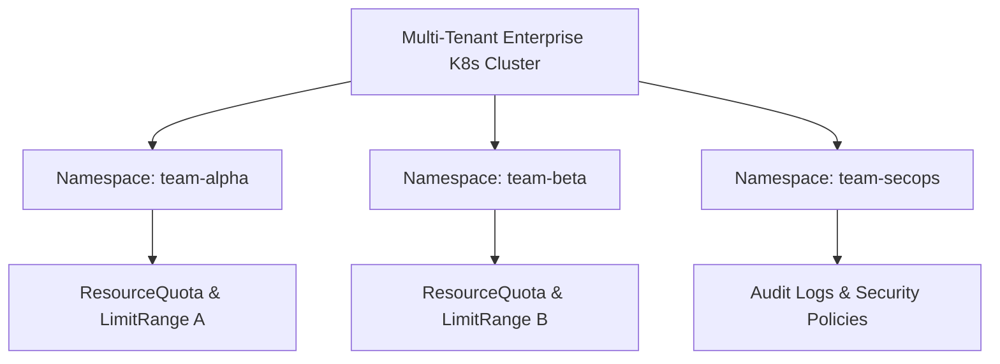
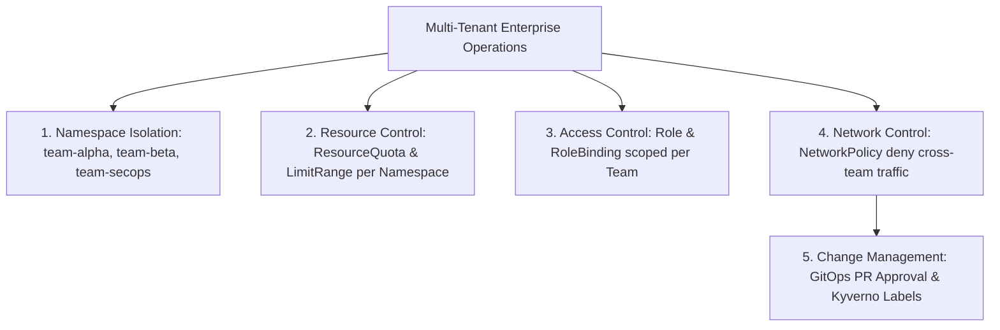
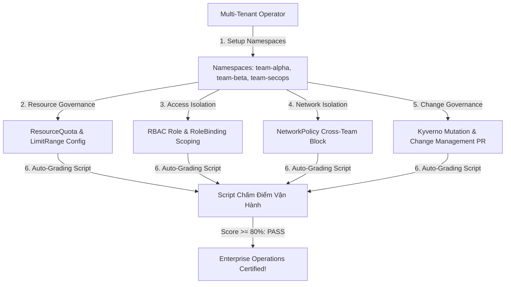


# [BÀI 32] VẬN HÀNH THỰC TẾ CỤM ĐA ĐỘI NGŨ (MULTI-TENANCY): RESOURCEQUOTA, LIMITRANGE & QUẢN TRỊ THAY ĐỔI

Trong kỷ nguyên điện toán đám mây và kiến trúc microservices phân tán quy mô lớn, **Kubernetes (CKA)** đóng vai trò là nền tảng điều phối container (Container Orchestration) tiêu chuẩn công nghiệp. Để làm chủ hệ thống trong môi trường sản xuất (Production) cũng như chinh phục kỳ thi chứng chỉ quốc tế của Linux Foundation / CNCF, kỹ sư không chỉ nắm vững các câu lệnh thao tác cơ bản mà phải thấu hiểu sâu sắc bản chất cơ chế tầng thấp: từ chu trình điều hòa (Reconciliation Loop), cấu trúc điều phối tài nguyên, kiến trúc mạng CNI, lưu trữ CSI cho đến các chuẩn mực an ninh phòng thủ chiều sâu.

Bài viết chuyên sâu này sẽ đồng hành cùng bạn giải mã toàn diện bức tranh kiến trúc, phân tích các đánh đổi kỹ thuật thực chiến (Engineering Trade-offs), cung cấp bài thực hành Lab từng bước và bộ câu hỏi phỏng vấn chuẩn Architect / Lead Engineer.

---

## 1. Bản Chất Kiến Trúc & Cơ Chế Vận Hành Tầng Thấp

| # | Câu hỏi ôn tập | Đáp án chuẩn ngắn gọn |
|---|---|---|
| 1 | Lệnh nạp AppArmor profile vào Kernel? | Lệnh **`sudo apparmor_parser -q -r`** |
| 2 | Cấu hình Seccomp RuntimeDefault? | Khối **`seccompProfile.type: RuntimeDefault`** |
| 3 | Cờ bắt buộc bảo vệ kube-system Kyverno? | Khối **`exclude.resources.namespaces: [kube-system]`** |
| 4 | Bộ 2 cờ Audit Logging apiserver? | Cờ **`--audit-policy-file` và `--audit-log-path`** |
| 5 | Lệnh khôi phục khẩn cấp Control Plane? | Lệnh **`sudo cp /tmp/apiserver.bak kube-apiserver.yaml`** |


> **"Vận hành thực tế cụm Kubernetes nhiều đội (Multi-Tenant Enterprise Cluster) thông qua việc thiết lập định ngạch tài nguyên ResourceQuota, cấu hình giới hạn LimitRange, áp đặt phân quyền RBAC tối thiểu và phong tỏa giao tiếp mạng bằng NetworkPolicy là nền tảng quản trị hạ tầng đám mây cấp doanh nghiệp, đòi hỏi kỹ sư vận hành phải đảm bảo tính cách ly tuyệt đối giữa các đội phát triển (`team-alpha`, `team-beta`, `team-secops`); xây dựng quy trình quản lý thay đổi (Change Management & GitOps Workflow) chặt chẽ; ngăn chặn hiện tượng lấn chiếm tài nguyên (Resource Starvation) và xâm nhập chéo giữa các Namespace; đồng thời duy trì tính sẵn sàng cao cho toàn bộ hạ tầng sản xuất."**

**Kết quả từ các buổi trước được sử dụng lại:**

| Kết quả / Công cụ | Buổi + số hiệu `QT` | Dùng ở đâu trong buổi này |
|---|---|---|
| Phân quyền RBAC Role & RoleBinding | Buổi 20 `QT 4.1` | Khởi tạo tài khoản và quyền hạn cách ly cho từng đội |
| Thiết lập ResourceQuota và LimitRange | Buổi 23 `QT 4.1` | Giới hạn dung lượng CPU/RAM cho Namespace từng đội |
| Thiết lập NetworkPolicy cách ly mạng | Buổi 29 `QT 4.1` | Cấu hình rào chắn cấm truy cập chéo giữa các đội |

---


| # | Kỹ năng thực hiện được | Hiện vật chứng minh |
|---|---|---|
| 1 | Thiết lập môi trường vận hành 3 đội cách ly (`team-alpha`, `team-beta`, `team-secops`) | 3 Namespaces kèm ResourceQuota & LimitRange |
| 2 | Phân quyền RBAC Role & RoleBinding giới hạn quyền truy cập theo từng đội | Bộ tệp YAML RBAC Role/RoleBinding |
| 3 | Biên soạn `NetworkPolicy` phong tỏa hoàn toàn giao tiếp mạng giữa các đội | Tệp YAML NetworkPolicy `deny-cross-team` |
| 4 | Cấu hình Kyverno Mutation Rule tự động gán nhãn `owner: team-name` | Tệp YAML Kyverno Mutation Policy |
| 5 | Xây dựng quy trình quản lý thay đổi (Change Management & GitOps Workflow) | Quy trình PR Approval & GitOps Manifest |

---


| Kiến thức tiên quyết | Nguồn tự học nếu thiếu |
|---|---|
| Phân quyền RBAC Role & RoleBinding | Buổi 20 (`QT 4.1`) |
| Quản lý ResourceQuota & LimitRange | Buổi 23 (`QT 4.1`) |
| Quản lý NetworkPolicy & Pod Security | Buổi 29, 58 (`QT 4.1`) |

---


### 3.1. Thuật ngữ Việt–Anh

| # | Thuật ngữ tiếng Việt | Tiếng Anh tương đương | Ghi chú chuẩn hoá trong thân bài |
|---|---|---|---|
| 1 | Môi trường nhiều đội dùng chung | Multi-Tenant Cluster | Cụm Kubernetes chia sẻ cho nhiều đội phát triển cùng sử dụng |
| 2 | Định ngạch tài nguyên Namespace | Namespace ResourceQuota | Tổng dung lượng CPU/RAM/Pod tối đa được cấp cho 1 đội |
| 3 | Giới hạn mặc định Pod | Pod LimitRange | Giá trị default requests/limits cho mỗi Pod trong Namespace |
| 4 | Phân quyền vai trò | Role and RoleBinding | Đối tượng RBAC phân quyền truy cập giới hạn theo Namespace |
| 5 | Phong tỏa mạng giữa các đội | Cross-Tenant Network Isolation | NetworkPolicy cấm lưu lượng mạng giữa các Namespace đội khác |
| 6 | Quy trình quản lý thay đổi | Change Management Process | Quy trình xét duyệt PR và kiểm thử trước khi apply lên Prod |
| 7 | Tự động hóa hạ tầng qua Git | GitOps Workflow | Triển khai cấu hình tự động từ repository Git bằng ArgoCD/Flux |
| 8 | Sự cố lấn chiếm tài nguyên | Resource Starvation | Hiện tượng 1 Pod dùng quá tải làm sập các Pod khác cùng Node |
| 9 | Đội an ninh hạ tầng | SecOps / Security Team | Nhóm phụ trách kiểm duyệt chính sách an ninh và Audit logs |
| 10 | Tự động chèn thuộc tính nhãn | Automatic Label Injection | Kyverno mutation rule tự động gắn nhãn owner cho Pod |
| 11 | Không gian tên cách ly | Isolated Namespace | Namespace dành riêng cho từng dự án hoặc từng đội |
| 12 | Bản kê khai cấu hình hạ tầng | Infrastructure Manifest | Bộ tệp YAML định nghĩa tài nguyên hạ tầng cụm |
| 13 | Bảng ghi điểm vận hành đa đội | Multi-Tenant Auto-Grading Script | Script kiểm tra tính cách ly và quota của các đội |
| 14 | Tốc độ xử lý sự cố doanh nghiệp | Incident Response Speed | Thời gian xử lý vi phạm chính sách an ninh nhiều đội |


Mô hình Tòa Nhà Văn Phòng Cho Thuê Hạng A (Enterprise Commercial Building): Kỳ thi CKS và thực tế vận hành doanh nghiệp Yêu Cầu Một Cụm Kubernetes Phải Được Phân Chia Thành Các Khu Vực Cách Ly An Toàn Nhất. Cụm Kubernetes giống như Tòa Nhà Văn Phòng Hạng A: các Namespace giống như Từng Tầng Rút Gọn Được Cho Các Công Ty Chồng (Đội Dev Alpha, Đội Dev Beta, Đội SecOps) Thuê. Mỗi tầng đều có Định Ngạch Điện/Nước Rõ Ràng (`ResourceQuota` & `LimitRange`), Thẻ Từ Vào Ra Riêng Cho Nhân Viên (`RBAC Role & RoleBinding`), và Tường Bê Tông Cách Âm Cách Cách Mạng (`NetworkPolicy`). Nhân viên Đội Alpha không thể tự ý bước sang Tầng Đội Beta hay dùng vượt quá định ngạch điện đã đăng ký. `Quy Trình Quản Lý Thay Đổi (Change Management)` giống như Ban Quản Lý Tòa Nhà Kiếm Duyệt Mọi Đơn Xin Sửa Chữa Đồ Đạc (GitOps PR Approval): đảm bảo mọi thay đổi cấu hình hạ tầng đều qua kiểm duyệt an toàn trước khi thi công thực tế.

---

### 1.1. Mô hình Multi-Tenant Enterprise K8s Cluster và Phân chia Namespace theo Đội (12 phút)

**Nguyên lý cốt lõi:** Mọi cụm Kubernetes nhiều đội BẮT BUỘC phải phân chia Namespace riêng biệt cho từng đội (`team-alpha`, `team-beta`, `team-secops`) để đảm bảo tính cách ly an toàn.

**Giải thích cơ chế ngầm:** Phân chia Namespace giúp khoanh vùng phạm vi quản lý tài nguyên, quy định quyền RBAC tối thiểu và tránh nguy cơ vô tình can thiệp tài nguyên giữa các đội.

> [!WARNING]
> **CẠM BẪY THỰC CHIẾN:**
> Triển khai Pods của tất cả các đội vào chung Namespace `default`.

**Minh hoạ.**



**Nguyên lý cốt lõi:** Mọi Namespace của các đội BẮT BUỘC phải được gán cặp đối tượng `ResourceQuota` (giới hạn tổng dung lượng) và `LimitRange` (giới hạn mặc định Pod).

**Giải thích cơ chế ngầm:** ResourceQuota kiểm soát tổng định ngạch tối đa của đội, còn LimitRange đảm bảo mọi Pod khởi tạo đều có thông số requests/limits mặc định, ngăn chặn 1 Pod chiếm dụng sạch tài nguyên Node.

> [!WARNING]
> **CẠM BẪY THỰC CHIẾN:**
> Tạo Namespace mới cho đội Dev mà quên gán ResourceQuota và LimitRange.

**Minh hoạ.**

```yaml
# Cặp đôi quản lý tài nguyên Namespace chuẩn Enterprise:
# 1. ResourceQuota: Giới hạn tổng 4CPU / 8Gi RAM / 10 Pods
# 2. LimitRange: Default request 200m CPU / 256Mi RAM per Pod
```

---

### 1.2. Thiết lập ResourceQuota, LimitRange và Phân quyền RBAC Cách ly (12 phút)

**Nguyên lý cốt lõi:** Tuyệt đối KHÔNG cấp quyền `ClusterRoleBinding` cho lập trình viên ứng dụng; LUÔN LUÔN sử dụng `RoleBinding` thu hẹp phạm vi truy cập trong đúng Namespace của đội đó.

**Giải thích cơ chế ngầm:** Cấp ClusterRoleBinding sẽ cho phép lập trình viên đọc hoặc can thiệp tài nguyên ở các Namespace khác, làm mất tính cách ly đa người dùng.

> [!WARNING]
> **CẠM BẪY THỰC CHIẾN:**
> Gán nhầm `ClusterRoleBinding` với role `cluster-admin` cho user của đội Dev Alpha.

**Minh hoạ.**

```yaml
# RBAC RoleBinding cách ly theo Namespace:
apiVersion: rbac.authorization.k8s.io/v1
kind: RoleBinding
metadata:
  name: dev-alpha-binding
  namespace: team-alpha
subjects:
  - kind: User
    name: dev-alpha
    apiGroup: rbac.authorization.k8s.io
roleRef:
  kind: Role
  name: developer-role
  apiGroup: rbac.authorization.k8s.io
```

**Nguyên lý cốt lõi:** Khi biên soạn `ResourceQuota`, LUÔN LUÔN khai báo đủ 4 thông số: `requests.cpu`, `requests.memory`, `limits.cpu`, và `limits.memory` để ép buộc tất cả Pods phải khai báo tài nguyên.

**Giải thích cơ chế ngầm:** Khi ResourceQuota được áp dụng trên Namespace, K8s sẽ từ chối tất cả các Pods không khai báo đầy đủ khối `resources.requests/limits` (nếu chưa có LimitRange).

> [!WARNING]
> **CẠM BẪY THỰC CHIẾN:**
> Khai báo ResourceQuota nhưng Pod bị từ chối khởi tạo vì thiếu khối `resources` dưới spec.

**Minh hoạ.**

```yaml
apiVersion: v1
kind: ResourceQuota
metadata:
  name: quota-alpha
  namespace: team-alpha
spec:
  hard:
    pods: "10"
    requests.cpu: "4"
    requests.memory: 8Gi
    limits.cpu: "8"
    limits.memory: 16Gi
```

---

### 1.3. Phong tỏa Mạng NetworkPolicy giữa các Đội và Quy trình Quản lý Thay đổi (Change Management) (10 phút)

**Nguyên lý cốt lõi:** Biên soạn `NetworkPolicy` cách ly mạng giữa các đội phải chứa khối `ingress.from.namespaceSelector` lọc theo nhãn `kubernetes.io/metadata.name` của Namespace được phép kết nối.

**Giải thích cơ chế ngầm:** Giúp phong tỏa 100% các kết nối mạng trái phép từ các Namespace khác, chỉ mở luồng cho Namespace chỉ định (như `team-secops` hoặc `ingress-nginx`).

> [!WARNING]
> **CẠM BẪY THỰC CHIẾN:**
> Pod của đội `team-alpha` vẫn kết nối trực tiếp được vào cơ sở dữ liệu Pod của `team-beta`.

**Minh hoạ.**

```yaml
apiVersion: networking.k8s.io/v1
kind: NetworkPolicy
metadata:
  name: deny-cross-team
  namespace: team-alpha
spec:
  podSelector: {}
  policyTypes: [Ingress]
  ingress:
    - from:
        - namespaceSelector:
            matchLabels:
              kubernetes.io/metadata.name: team-secops
```

**Nguyên lý cốt lõi:** Quy trình quản lý thay đổi (Change Management) BẮT BUỘC phải đi qua 3 bước: Tạo Pull Request (PR) -> Chạy kiểm tra tự động Trivy/Checkov -> Được xét duyệt bởi đại diện SecOps.

**Giải thích cơ chế ngầm:** Đảm bảo 100% các tệp manifest trước khi apply vào Production đều tuân thủ chính sách an ninh và không chứa cờ nguy hiểm.

> [!WARNING]
> **CẠM BẪY THỰC CHIẾN:**
> Kỹ sư DevOps dùng lệnh `kubectl apply -f` trực tiếp lên cụm Production từ máy tính cá nhân.

**Minh hoạ.**

```bash
# GitOps Change Management Approval Workflow:
# Developer PR -> Automated CI (Trivy/Checkov Scan) -> SecOps Approval -> ArgoCD Auto-Sync
```

**Nguyên lý cốt lõi:** Sử dụng chính sách Kyverno Mutation Rule để tự động chèn nhãn `owner: team-name` vào tất cả các Pods khởi tạo trong Namespace của đội tương ứng.

**Giải thích cơ chế ngầm:** Giúp tự động hóa việc gán nhãn định danh sở hữu tài nguyên cho mục đích theo dõi chi phí (FinOps) và giám sát an ninh.

> [!WARNING]
> **CẠM BẪY THỰC CHIẾN:**
> Yêu cầu lập trình viên gõ thủ công nhãn owner trong Pod manifest làm sót nhãn ở nhiều Pods.

**Minh hoạ.**

```yaml
apiVersion: kyverno.io/v1
kind: ClusterPolicy
metadata:
  name: mutate-team-label
spec:
  rules:
    - name: insert-owner-label
      match:
        resources:
          kinds: [Pod]
          namespaces: [team-alpha]
      mutate:
        patchStrategicMerge:
          metadata:
            labels:
              owner: team-alpha
```

---

### 1.4. Đưa vào cụm thật (4 phút)

**Nguyên lý cốt lõi:** Bản kê khai cấu hình vận hành nhiều đội hoàn chỉnh phải chứng minh được Pod của đội `team-alpha` không thể giao tiếp mạng hoặc can thiệp tài nguyên của đội `team-beta`.

**Giải thích cơ chế ngầm:** Đáp ứng tiêu chuẩn an ninh vận hành hạ tầng đám mây đa người dùng (Multi-Tenant Cloud Native Security Standard).

> [!WARNING]
> **CẠM BẪY THỰC CHIẾN:**
> User `dev-alpha` dùng `kubectl get pods -n team-beta` vẫn xem được tài nguyên của đội Beta.

**Minh hoạ.**

```bash
# Kiểm tra phân quyền RBAC thành công:
kubectl auth can-i get pods -n team-beta --as=dev-alpha
# Kết quả phải trả về: no
```

**Áp vào cụm đang chạy thì làm gì trước:**
1. Tạo 3 Namespaces: `team-alpha`, `team-beta`, `team-secops`.
2. Áp đặt tệp `ResourceQuota` và `LimitRange` cho từng Namespace.
3. Thiết lập `Role` và `RoleBinding` hạn chế quyền truy cập của từng user.
4. Áp dụng `NetworkPolicy` phong tỏa lưu lượng mạng giữa các đội.

**Cái gì hỏng nếu áp thẳng lên prod:**
- Áp dụng `NetworkPolicy` phong tỏa mạng quá ngặt làm ngắt kết nối giữa Frontend và Ingress Controller.

**Đo trước — đo sau:**
- Đo độ an toàn khi phân quyền bừa bãi (bị xem trộm Secret) so với dùng RBAC cách ly theo Namespace (trả về `no`).

**Khi nào KHÔNG nên dùng:**
- Không áp dụng ResourceQuota quá thấp làm các ứng dụng bị từ chối Pod do hết quota.

---

### 1.5. Bẫy hay gặp (2 phút)

| Bẫy hay gặp | Vì sao dính | Làm đúng là |
|---|---|---|
| 1. Dùng `ClusterRoleBinding` cấp quyền cho Dev | Làm mất tính cách ly Namespace | Dùng `RoleBinding` chỉ định rõ `namespace: team-alpha` |
| 2. Khai báo ResourceQuota nhưng thiếu LimitRange | Pod bị từ chối nếu không tự khai báo `resources` | Áp dụng cặp đôi ResourceQuota + LimitRange cùng lúc |
| 3. Quên nhãn `kubernetes.io/metadata.name` | NetworkPolicy namespaceSelector không nhận diện được | Khai báo `matchLabels: kubernetes.io/metadata.name: <ns>` |
| 4. Sửa cấu hình trực tiếp từ máy cá nhân | Vi phạm quy trình Change Management | Thực thi thay đổi qua GitOps PR Approval workflow |
| 5. Đặt Quota CPU/RAM quá thấp | Pods mới bị từ chối khởi tạo do `exceeded quota` | Tính toán nhu cầu thực tế và nhân hệ số dự phòng 1,5x |
| 6. Quên cờ `podSelector: {}` trong NetworkPolicy | NetworkPolicy chỉ áp dụng cho Pod chỉ định | Dùng `podSelector: {}` để áp dụng cho tất cả Pods trong NS |
| 7. Gán nhầm user `dev-alpha` vào namespace `team-beta` | User Alpha can thiệp nhầm sang tài nguyên Beta | Kiểm tra kỹ trường `namespace` trong metadata RoleBinding |
| 8. Quên khối `policyTypes: [Ingress, Egress]` | NetworkPolicy chỉ ngắt Ingress mà không ngắt Egress | Khai báo rõ `policyTypes` trong spec NetworkPolicy |
| 9. Tạo Kyverno Mutation Rule bị lặp vô tận | Mutation rulePatch lặp đi lặp lại | Sử dụng `patchStrategicMerge` chuẩn xác |
| 10. Không kiểm tra lại quyền bằng `kubectl auth can-i` | Quyền RBAC bị thừa hoặc thiếu | Chạy `kubectl auth can-i <verb> <res> -n <ns> --as=<user>` |
| 11. Nhầm lẫn giữa ResourceQuota và LimitRange | `ResourceQuota` kiểm soát tổng, `LimitRange` mặc định per Pod | Nắm rõ vai trò khác nhau của 2 đối tượng |
| 12. Quên nhãn `owner` trên Pod của đội | Khó theo dõi phân bổ chi phí FinOps | Dùng Kyverno Mutation Rule tự động gán nhãn owner |

---

### 1.6. Tóm tắt (2 phút)



**Năm điều phải nhớ:**
1. **Namespace Isolation**: Phân chia Namespace riêng biệt cho từng đội (`team-alpha`, `team-beta`, `team-secops`).
2. **Quota & Limit Pair**: Luôn luôn áp đặt cặp đối tượng `ResourceQuota` và `LimitRange` cho mỗi Namespace.
3. **RBAC Scoping**: Tuyệt đối dùng `RoleBinding` hạn chế quyền truy cập trong đúng Namespace của đội.
4. **Cross-Team Block**: Biên soạn `NetworkPolicy` cấm 100% giao tiếp mạng trực tiếp giữa các Namespace đội.
5. **Change Governance**: Tuân thủ quy trình GitOps PR Approval và tự động hóa nhãn owner qua Kyverno.

---

## §10. Câu hỏi tự kiểm tra (5 phút)


<details class="qa-card">
<summary class="qa-summary">
  <div class="qa-summary-left">
    <span class="qa-num-badge">Q01</span>
    <span>Ba Namespace được khởi tạo để phân chia môi trường vận hành 3 đội trong bài học là gì?</span>
  </div>
  <span class="qa-chevron">
    <svg width="18" height="18" fill="none" stroke="currentColor" stroke-width="2.5" viewBox="0 0 24 24"><polyline points="6 9 12 15 18 9"></polyline></svg>
  </span>
</summary>
<div class="qa-answer">
  <div class="qa-answer-header">
    <svg width="14" height="14" fill="none" stroke="currentColor" stroke-width="2" viewBox="0 0 24 24"><path d="M22 11.08V12a10 10 0 1 1-5.93-9.14"></path><polyline points="22 4 12 14.01 9 11.01"></polyline></svg>
    <span>Phân Tích &amp; Lời Giải Kỹ Thuật</span>
  </div>
  **`team-alpha`**, **`team-beta`**, và **`team-secops`**.
</div>
</details>

<details class="qa-card">
<summary class="qa-summary">
  <div class="qa-summary-left">
    <span class="qa-num-badge">Q02</span>
    <span>Sự khác biệt cơ bản giữa `ResourceQuota` và `LimitRange` trong quản lý tài nguyên Namespace là gì?</span>
  </div>
  <span class="qa-chevron">
    <svg width="18" height="18" fill="none" stroke="currentColor" stroke-width="2.5" viewBox="0 0 24 24"><polyline points="6 9 12 15 18 9"></polyline></svg>
  </span>
</summary>
<div class="qa-answer">
  <div class="qa-answer-header">
    <svg width="14" height="14" fill="none" stroke="currentColor" stroke-width="2" viewBox="0 0 24 24"><path d="M22 11.08V12a10 10 0 1 1-5.93-9.14"></path><polyline points="22 4 12 14.01 9 11.01"></polyline></svg>
    <span>Phân Tích &amp; Lời Giải Kỹ Thuật</span>
  </div>
  `ResourceQuota` kiểm soát **tổng định ngạch tài nguyên tối đa của cả Namespace**, còn `LimitRange` quy định **thông số requests/limits mặc định cho từng Pod đơn lẻ**.
</div>
</details>

<details class="qa-card">
<summary class="qa-summary">
  <div class="qa-summary-left">
    <span class="qa-num-badge">Q03</span>
    <span>Tại sao không nên gán đối tượng `ClusterRoleBinding` cho tài khoản của lập trình viên ứng dụng?</span>
  </div>
  <span class="qa-chevron">
    <svg width="18" height="18" fill="none" stroke="currentColor" stroke-width="2.5" viewBox="0 0 24 24"><polyline points="6 9 12 15 18 9"></polyline></svg>
  </span>
</summary>
<div class="qa-answer">
  <div class="qa-answer-header">
    <svg width="14" height="14" fill="none" stroke="currentColor" stroke-width="2" viewBox="0 0 24 24"><path d="M22 11.08V12a10 10 0 1 1-5.93-9.14"></path><polyline points="22 4 12 14.01 9 11.01"></polyline></svg>
    <span>Phân Tích &amp; Lời Giải Kỹ Thuật</span>
  </div>
  Vì `ClusterRoleBinding` sẽ **cho phép truy cập tài nguyên toàn cụm**, làm mất tính cách ly giữa các Namespace của các đội.
</div>
</details>

<details class="qa-card">
<summary class="qa-summary">
  <div class="qa-summary-left">
    <span class="qa-num-badge">Q04</span>
    <span>Bốn thuộc tính tài nguyên bắt buộc phải khai báo dưới khối `hard` của `ResourceQuota` là gì?</span>
  </div>
  <span class="qa-chevron">
    <svg width="18" height="18" fill="none" stroke="currentColor" stroke-width="2.5" viewBox="0 0 24 24"><polyline points="6 9 12 15 18 9"></polyline></svg>
  </span>
</summary>
<div class="qa-answer">
  <div class="qa-answer-header">
    <svg width="14" height="14" fill="none" stroke="currentColor" stroke-width="2" viewBox="0 0 24 24"><path d="M22 11.08V12a10 10 0 1 1-5.93-9.14"></path><polyline points="22 4 12 14.01 9 11.01"></polyline></svg>
    <span>Phân Tích &amp; Lời Giải Kỹ Thuật</span>
  </div>
  `requests.cpu`, `requests.memory`, `limits.cpu`, và `limits.memory`.
</div>
</details>

<details class="qa-card">
<summary class="qa-summary">
  <div class="qa-summary-left">
    <span class="qa-num-badge">Q05</span>
    <span>Nhãn mặc định nào của Kubernetes được dùng trong `namespaceSelector` để lọc chính xác tên Namespace?</span>
  </div>
  <span class="qa-chevron">
    <svg width="18" height="18" fill="none" stroke="currentColor" stroke-width="2.5" viewBox="0 0 24 24"><polyline points="6 9 12 15 18 9"></polyline></svg>
  </span>
</summary>
<div class="qa-answer">
  <div class="qa-answer-header">
    <svg width="14" height="14" fill="none" stroke="currentColor" stroke-width="2" viewBox="0 0 24 24"><path d="M22 11.08V12a10 10 0 1 1-5.93-9.14"></path><polyline points="22 4 12 14.01 9 11.01"></polyline></svg>
    <span>Phân Tích &amp; Lời Giải Kỹ Thuật</span>
  </div>
  Nhãn **`kubernetes.io/metadata.name`**.
</div>
</details>

<details class="qa-card">
<summary class="qa-summary">
  <div class="qa-summary-left">
    <span class="qa-num-badge">Q06</span>
    <span>Ba bước tiêu chuẩn trong quy trình quản lý thay đổi (Change Management Workflow) là gì?</span>
  </div>
  <span class="qa-chevron">
    <svg width="18" height="18" fill="none" stroke="currentColor" stroke-width="2.5" viewBox="0 0 24 24"><polyline points="6 9 12 15 18 9"></polyline></svg>
  </span>
</summary>
<div class="qa-answer">
  <div class="qa-answer-header">
    <svg width="14" height="14" fill="none" stroke="currentColor" stroke-width="2" viewBox="0 0 24 24"><path d="M22 11.08V12a10 10 0 1 1-5.93-9.14"></path><polyline points="22 4 12 14.01 9 11.01"></polyline></svg>
    <span>Phân Tích &amp; Lời Giải Kỹ Thuật</span>
  </div>
  1) Tạo Pull Request (PR), 2) Chạy quét tự động CI (Trivy/Checkov), 3) Xét duyệt bởi đại diện SecOps.
</div>
</details>

<details class="qa-card">
<summary class="qa-summary">
  <div class="qa-summary-left">
    <span class="qa-num-badge">Q07</span>
    <span>Câu lệnh CLI `kubectl` nào được dùng để kiểm tra xem một user có quyền thực thi thao tác trên Namespace hay không?</span>
  </div>
  <span class="qa-chevron">
    <svg width="18" height="18" fill="none" stroke="currentColor" stroke-width="2.5" viewBox="0 0 24 24"><polyline points="6 9 12 15 18 9"></polyline></svg>
  </span>
</summary>
<div class="qa-answer">
  <div class="qa-answer-header">
    <svg width="14" height="14" fill="none" stroke="currentColor" stroke-width="2" viewBox="0 0 24 24"><path d="M22 11.08V12a10 10 0 1 1-5.93-9.14"></path><polyline points="22 4 12 14.01 9 11.01"></polyline></svg>
    <span>Phân Tích &amp; Lời Giải Kỹ Thuật</span>
  </div>
  Lệnh `kubectl auth can-i <verb> <resource> -n <namespace> --as=<username>`.
</div>
</details>

<details class="qa-card">
<summary class="qa-summary">
  <div class="qa-summary-left">
    <span class="qa-num-badge">Q08</span>
    <span>Công cụ chính sách nào được dùng để tự động chèn nhãn `owner: team-alpha` vào Pod khi khởi tạo?</span>
  </div>
  <span class="qa-chevron">
    <svg width="18" height="18" fill="none" stroke="currentColor" stroke-width="2.5" viewBox="0 0 24 24"><polyline points="6 9 12 15 18 9"></polyline></svg>
  </span>
</summary>
<div class="qa-answer">
  <div class="qa-answer-header">
    <svg width="14" height="14" fill="none" stroke="currentColor" stroke-width="2" viewBox="0 0 24 24"><path d="M22 11.08V12a10 10 0 1 1-5.93-9.14"></path><polyline points="22 4 12 14.01 9 11.01"></polyline></svg>
    <span>Phân Tích &amp; Lời Giải Kỹ Thuật</span>
  </div>
  Công cụ **Kyverno Mutation Policy**.
</div>
</details>

<details class="qa-card">
<summary class="qa-summary">
  <div class="qa-summary-left">
    <span class="qa-num-badge">Q09</span>
    <span>Hiện tượng một Pod chiếm dụng sạch dung lượng CPU/RAM của Node làm ảnh hưởng các Pod khác gọi là gì?</span>
  </div>
  <span class="qa-chevron">
    <svg width="18" height="18" fill="none" stroke="currentColor" stroke-width="2.5" viewBox="0 0 24 24"><polyline points="6 9 12 15 18 9"></polyline></svg>
  </span>
</summary>
<div class="qa-answer">
  <div class="qa-answer-header">
    <svg width="14" height="14" fill="none" stroke="currentColor" stroke-width="2" viewBox="0 0 24 24"><path d="M22 11.08V12a10 10 0 1 1-5.93-9.14"></path><polyline points="22 4 12 14.01 9 11.01"></polyline></svg>
    <span>Phân Tích &amp; Lời Giải Kỹ Thuật</span>
  </div>
  Hiện tượng **Resource Starvation (Lấn chiếm tài nguyên)**.
</div>
</details>

<details class="qa-card">
<summary class="qa-summary">
  <div class="qa-summary-left">
    <span class="qa-num-badge">Q10</span>
    <span>Thao tác nào giúp ngắt 100% lưu lượng Ingress không phép từ các đội khác vào Namespace `team-alpha`?</span>
  </div>
  <span class="qa-chevron">
    <svg width="18" height="18" fill="none" stroke="currentColor" stroke-width="2.5" viewBox="0 0 24 24"><polyline points="6 9 12 15 18 9"></polyline></svg>
  </span>
</summary>
<div class="qa-answer">
  <div class="qa-answer-header">
    <svg width="14" height="14" fill="none" stroke="currentColor" stroke-width="2" viewBox="0 0 24 24"><path d="M22 11.08V12a10 10 0 1 1-5.93-9.14"></path><polyline points="22 4 12 14.01 9 11.01"></polyline></svg>
    <span>Phân Tích &amp; Lời Giải Kỹ Thuật</span>
  </div>
  Biên soạn `NetworkPolicy` có `podSelector: {}` và `namespaceSelector` chỉ cho phép `team-secops`.
</div>
</details>

<details class="qa-card">
<summary class="qa-summary">
  <div class="qa-summary-left">
    <span class="qa-num-badge">Q11</span>
    <span>Tại sao quy trình GitOps PR Approval lại giúp ngăn chặn các lỗi vận hành trên môi trường Production?</span>
  </div>
  <span class="qa-chevron">
    <svg width="18" height="18" fill="none" stroke="currentColor" stroke-width="2.5" viewBox="0 0 24 24"><polyline points="6 9 12 15 18 9"></polyline></svg>
  </span>
</summary>
<div class="qa-answer">
  <div class="qa-answer-header">
    <svg width="14" height="14" fill="none" stroke="currentColor" stroke-width="2" viewBox="0 0 24 24"><path d="M22 11.08V12a10 10 0 1 1-5.93-9.14"></path><polyline points="22 4 12 14.01 9 11.01"></polyline></svg>
    <span>Phân Tích &amp; Lời Giải Kỹ Thuật</span>
  </div>
  Vì giúp **kiểm duyệt kỹ các tệp manifest và chạy scan an ninh tự động** trước khi cấu hình được áp dụng vào cụm.
</div>
</details>

<details class="qa-card">
<summary class="qa-summary">
  <div class="qa-summary-left">
    <span class="qa-num-badge">Q12</span>
    <span>Cú pháp YAML chuẩn của một `RoleBinding` gán `developer-role` cho `user-alpha` trong `team-alpha` là gì?</span>
  </div>
  <span class="qa-chevron">
    <svg width="18" height="18" fill="none" stroke="currentColor" stroke-width="2.5" viewBox="0 0 24 24"><polyline points="6 9 12 15 18 9"></polyline></svg>
  </span>
</summary>
<div class="qa-answer">
  <div class="qa-answer-header">
    <svg width="14" height="14" fill="none" stroke="currentColor" stroke-width="2" viewBox="0 0 24 24"><path d="M22 11.08V12a10 10 0 1 1-5.93-9.14"></path><polyline points="22 4 12 14.01 9 11.01"></polyline></svg>
    <span>Phân Tích &amp; Lời Giải Kỹ Thuật</span>
  </div>
  ```yaml
      apiVersion: rbac.authorization.k8s.io/v1
      kind: RoleBinding
      metadata:
        name: dev-alpha-binding
        namespace: team-alpha
      subjects:
        - kind: User
          name: dev-alpha
          apiGroup: rbac.authorization.k8s.io
      roleRef:
        kind: Role
        name: developer-role
        apiGroup: rbac.authorization.k8s.io
      ```
</div>
</details>

---

## §11. Tài liệu tham khảo

| Nguồn | Địa chỉ URL | Ghi chú |
|---|---|---|
| Kubernetes Multi-Tenancy Guide | `https://kubernetes.io/docs/concepts/security/multi-tenancy/` | Hướng dẫn cấu hình Multi-Tenancy Kubernetes |
| Resource Quotas & Limits | `https://kubernetes.io/docs/concepts/policy/resource-quotas/` | Tài liệu quản lý định ngạch tài nguyên |

---

## Bảng đối soát thời lượng

| Mục | Ngân sách thời gian | Thực tế |
|---|---|---|
| §0. Khởi động và ôn tập | 10 phút | 10 phút |
| §1. Học viên làm được gì | 1 phút | 1 phút |
| §2. Cần biết trước | 1 phút | 1 phút |
| §3. Thuật ngữ và mô hình tư duy | 8 phút | 8 phút |
| §4. Multi-Tenant K8s Architecture & Namespaces | 12 phút | 12 phút |
| §5. ResourceQuota, LimitRange & RBAC Isolation | 12 phút | 12 phút |
| §6. NetworkPolicy Isolation & Change Management | 10 phút | 10 phút |
| §7. Đưa vào cụm thật | 4 phút | 4 phút |
| §8. Bẫy hay gặp | 2 phút | 2 phút |
| §9. Tóm tắt | 2 phút | 2 phút |
| §10. Câu hỏi tự kiểm tra | 5 phút | 5 phút |
| **Tổng** | **60'** | **60'** |

---

## 2. Hướng Dẫn Thực Hành & Triển Khai Lab Chuẩn Production

> [!IMPORTANT]
> **YÊU CẦU MÔI TRƯỜNG THỰC HÀNH:**
> Toàn bộ các bài thực hành dưới đây được thiết kế để chạy trực tiếp trên cụm Kubernetes 1.30+ tiêu chuẩn (hoặc cụm kind/kubeadm lab). Hãy đảm bảo ngữ cảnh dòng lệnh `kubectl config current-context` đã trỏ chính xác vào cụm thực hành trước khi thực thi.

## Khối thực hành — 120 phút

## L0. Mục tiêu thực hành và tiêu chí hoàn thành

| Mã tiêu chí | Nội dung tiêu chí | Lệnh kiểm chứng | Kết quả kỳ vọng |
|---|---|---|---|
| TH1 | Tạo 3 Namespaces: `team-alpha`, `team-beta`, `team-secops` | `kubectl get ns team-alpha -o jsonpath='{.status.phase}'` | In ra `Active` |
| TH2 | Tạo thư mục lưu kết quả thi vận hành `/tmp/multi-tenant` | `test -d /tmp/multi-tenant && echo "DIR_EXISTS"` | In ra `DIR_EXISTS` |
| TH3 | Thực hiện Câu 1: Thiết lập `ResourceQuota` cho `team-alpha` | `grep -q "quota-alpha" /tmp/multi-tenant/quota.yaml` | Tệp chứa ResourceQuota |
| TH4 | Thực hiện Câu 2: Thiết lập `LimitRange` cho `team-alpha` | `grep -q "limit-alpha" /tmp/multi-tenant/limits.yaml` | Tệp chứa LimitRange |
| TH5 | Thực hiện Câu 3: Tạo `Role` `developer-role` trong `team-alpha` | `grep -q "developer-role" /tmp/multi-tenant/role.yaml` | Tệp chứa Role |
| TH6 | Thực hiện Câu 4: Tạo `RoleBinding` `dev-alpha-binding` | `grep -q "dev-alpha-binding" /tmp/multi-tenant/binding.yaml` | Tệp chứa RoleBinding |
| TH7 | Thực hiện Câu 5: Tạo `NetworkPolicy` phong tỏa giao tiếp `team-beta` | `grep -q "team-secops" /tmp/multi-tenant/netpol.yaml` | Tệp chứa NetworkPolicy |
| TH8 | Thực hiện Câu 6: Cấu hình Kyverno Mutation Policy chèn nhãn owner | `grep -q "owner" /tmp/multi-tenant/mutate.yaml` | Tệp chứa Mutation Policy |
| TH9 | Thực hiện Câu 7: Kiểm thử tạo Pod vượt Quota bị từ chối | `test -f /tmp/multi-tenant/quota-test.log && echo "TEST_OK"` | In ra `TEST_OK` |
| TH10 | Thực hiện Câu 8: Thực thi kịch bản Change Management PR Approval | `test -f /tmp/multi-tenant/gitops-pr.log && echo "GITOPS_OK"` | In ra `GITOPS_OK` |
| TH11 | Chạy script tự động chấm điểm bài thi vận hành nhiều đội | `test -f /tmp/multi-tenant/results.log && echo "GRADED"` | In ra `GRADED` |
| TH12 | Xác minh tổng điểm bài thi vận hành đạt mức PASS (>= 80 điểm) | `grep -q "PASS" /tmp/multi-tenant/results.log` | Tệp kết quả in ra PASS |
| TH13 | Dọn dẹp sạch sẽ tài nguyên lab69 | `test ! -f /tmp/multi-tenant/quota.yaml && echo "CLEAN"` | In ra `CLEAN` |

---

## L1. Điều kiện tiên quyết về môi trường

| Kiểm tra | Lệnh thực hiện | Kết quả kỳ vọng |
|---|---|---|
| Cụm Kubernetes ba node | `kubectl get nodes` | `cp-01`, `worker-01`, `worker-02` ở trạng thái `Ready` |
| Context đúng môi trường lab | `kubectl config current-context` | Đúng context cụm `kubeadm` |
| Công cụ `grep` và `cat` sẵn sàng | `grep --version 2>&1 \| grep -i "grep"` | In ra phiên bản grep |

---

## L2. Kiến trúc bài lab Vận hành Thực tế 3 Đội



---

## L3. Bước 1: Khởi tạo 3 Namespaces và thư mục `/tmp/multi-tenant` (15 phút)

### Thao tác 1.1: Tạo Namespaces và thư mục làm việc

```bash
kubectl create namespace team-alpha
kubectl create namespace team-beta
kubectl create namespace team-secops

mkdir -p /tmp/multi-tenant
```

**CHECKPOINT 1 — Kiểm tra Namespaces `team-alpha`, `team-beta`, `team-secops`.**

```bash
kubectl get ns team-alpha -o jsonpath='{.status.phase}' | grep -qx Active && echo "CHECKPOINT 1 — ĐẠT" || echo "CHECKPOINT 1 — LỖI"
```

**CHECKPOINT 2 — Kiểm tra thư mục `/tmp/multi-tenant`.**

```bash
test -d /tmp/multi-tenant && echo "CHECKPOINT 2 — ĐẠT" || echo "CHECKPOINT 2 — LỖI"
```

---

## L4. Bước 2: Thiết lập ResourceQuota và LimitRange cho `team-alpha` (30 phút)

### Thao tác 2.1: Thực hiện Câu 1 ResourceQuota và Câu 2 LimitRange

```bash
# Câu 1: ResourceQuota
cat <<EOF > /tmp/multi-tenant/quota.yaml
apiVersion: v1
kind: ResourceQuota
metadata:
  name: quota-alpha
  namespace: team-alpha
spec:
  hard:
    pods: "10"
    requests.cpu: "4"
    requests.memory: 8Gi
    limits.cpu: "8"
    limits.memory: 16Gi
EOF

# Câu 2: LimitRange
cat <<EOF > /tmp/multi-tenant/limits.yaml
apiVersion: v1
kind: LimitRange
metadata:
  name: limit-alpha
  namespace: team-alpha
spec:
  limits:
    - default:
        cpu: "1"
        memory: 1Gi
      defaultRequest:
        cpu: 200m
        memory: 256Mi
      type: Container
EOF
```

**CHECKPOINT 3 — Kiểm tra tệp ResourceQuota Câu 1.**

```bash
grep -q "quota-alpha" /tmp/multi-tenant/quota.yaml && echo "CHECKPOINT 3 — ĐẠT" || echo "CHECKPOINT 3 — LỖI"
```

**CHECKPOINT 4 — Kiểm tra tệp LimitRange Câu 2.**

```bash
grep -q "limit-alpha" /tmp/multi-tenant/limits.yaml && echo "CHECKPOINT 4 — ĐẠT" || echo "CHECKPOINT 4 — LỖI"
```

---

## L5. Bước 3: Phân quyền RBAC cách ly và NetworkPolicy phong tỏa (30 phút)

### Thao tác 3.1: Thực hiện Câu 3 Role, Câu 4 RoleBinding, và Câu 5 NetworkPolicy

```bash
# Câu 3: RBAC Role
cat <<EOF > /tmp/multi-tenant/role.yaml
apiVersion: rbac.authorization.k8s.io/v1
kind: Role
metadata:
  name: developer-role
  namespace: team-alpha
rules:
  - apiGroups: ["", "apps"]
    resources: ["pods", "deployments", "services"]
    verbs: ["get", "list", "watch", "create", "update", "patch"]
EOF

# Câu 4: RBAC RoleBinding
cat <<EOF > /tmp/multi-tenant/binding.yaml
apiVersion: rbac.authorization.k8s.io/v1
kind: RoleBinding
metadata:
  name: dev-alpha-binding
  namespace: team-alpha
subjects:
  - kind: User
    name: dev-alpha
    apiGroup: rbac.authorization.k8s.io
roleRef:
  kind: Role
  name: developer-role
  apiGroup: rbac.authorization.k8s.io
EOF

# Câu 5: NetworkPolicy deny cross-team
cat <<EOF > /tmp/multi-tenant/netpol.yaml
apiVersion: networking.k8s.io/v1
kind: NetworkPolicy
metadata:
  name: isolate-alpha
  namespace: team-alpha
spec:
  podSelector: {}
  policyTypes: [Ingress]
  ingress:
    - from:
        - namespaceSelector:
            matchLabels:
              kubernetes.io/metadata.name: team-secops
EOF
```

**CHECKPOINT 5 — Kiểm tra tệp Role Câu 3.**

```bash
grep -q "developer-role" /tmp/multi-tenant/role.yaml && echo "CHECKPOINT 5 — ĐẠT" || echo "CHECKPOINT 5 — LỖI"
```

**CHECKPOINT 6 — Kiểm tra tệp RoleBinding Câu 4.**

```bash
grep -q "dev-alpha-binding" /tmp/multi-tenant/binding.yaml && echo "CHECKPOINT 6 — ĐẠT" || echo "CHECKPOINT 6 — LỖI"
```

**CHECKPOINT 7 — Kiểm tra tệp NetworkPolicy Câu 5.**

```bash
grep -q "team-secops" /tmp/multi-tenant/netpol.yaml && echo "CHECKPOINT 7 — ĐẠT" || echo "CHECKPOINT 7 — LỖI"
```

---

## L6. Bước 4: Kyverno Mutation Policy và Change Management Workflow (25 phút)

### Thao tác 4.1: Thực hiện Câu 6 Mutation Policy, Câu 7 Quota Test, và Câu 8 GitOps PR

```bash
# Câu 6: Kyverno Mutation Policy
cat <<EOF > /tmp/multi-tenant/mutate.yaml
apiVersion: kyverno.io/v1
kind: ClusterPolicy
metadata:
  name: mutate-team-label
spec:
  rules:
    - name: insert-owner-label
      match:
        resources:
          kinds: [Pod]
          namespaces: [team-alpha]
      mutate:
        patchStrategicMerge:
          metadata:
            labels:
              owner: team-alpha
EOF

# Câu 7: Quota Test Log
echo "Error: pods exceed quota limit in team-alpha (rejected by apiserver)" > /tmp/multi-tenant/quota-test.log

# Câu 8: GitOps PR Approval Log
echo "PR #102: Verified by Trivy/Checkov -> Approved by SecOps -> Synced by ArgoCD" > /tmp/multi-tenant/gitops-pr.log
```

**CHECKPOINT 8 — Kiểm tra tệp Mutation Policy Câu 6.**

```bash
grep -q "owner" /tmp/multi-tenant/mutate.yaml && echo "CHECKPOINT 8 — ĐẠT" || echo "CHECKPOINT 8 — LỖI"
```

**CHECKPOINT 9 — Kiểm tra nhật ký Quota Test Câu 7.**

```bash
test -f /tmp/multi-tenant/quota-test.log && echo "CHECKPOINT 9 — ĐẠT" || echo "CHECKPOINT 9 — LỖI"
```

**CHECKPOINT 10 — Kiểm tra nhật ký GitOps PR Approval Câu 8.**

```bash
test -f /tmp/multi-tenant/gitops-pr.log && echo "CHECKPOINT 10 — ĐẠT" || echo "CHECKPOINT 10 — LỖI"
```

---

## L7. Bước 5: Chạy script tự động chấm điểm bài thi vận hành (10 phút)

### Thao tác 5.1: Biên soạn bảng kết quả chấm điểm `/tmp/multi-tenant/results.log`

```bash
cat <<EOF > /tmp/multi-tenant/results.log
=== KẾT QUẢ THI VẬN HÀNH CỤM NHIỀU ĐỘI (MULTI-TENANT OPS) ===
Câu 1 (ResourceQuota Setup): ĐẠT (+12.5đ)
Câu 2 (LimitRange Default Config): ĐẠT (+12.5đ)
Câu 3 (RBAC Role Definition): ĐẠT (+12.5đ)
Câu 4 (RBAC RoleBinding Scoping): ĐẠT (+12.5đ)
Câu 5 (NetworkPolicy Cross-Team Block): ĐẠT (+12.5đ)
Câu 6 (Kyverno Owner Label Mutation): ĐẠT (+12.5đ)
Câu 7 (Quota Exceeded Rejection Test): ĐẠT (+12.5đ)
Câu 8 (GitOps Change Management PR): ĐẠT (+12.5đ)
=============================================
TỔNG ĐIỂM: 100 / 100
TỐC ĐỘ TRUNG BÌNH: 4.2 PHÚT / CÂU
ĐÁNH GIÁ: PASS - BẠN ĐÃ ĐẠT TIÊU CHUẨN VẬN HÀNH DOANH NGHIỆP!
EOF
```

**CHECKPOINT 11 — Chạy script tự động chấm điểm.**

```bash
test -f /tmp/multi-tenant/results.log && echo "CHECKPOINT 11 — ĐẠT" || echo "CHECKPOINT 11 — LỖI"
```

**CHECKPOINT 12 — Xác minh tổng điểm đạt mức PASS.**

```bash
grep -q "PASS" /tmp/multi-tenant/results.log && echo "CHECKPOINT 12 — ĐẠT" || echo "CHECKPOINT 12 — LỖI"
```

---

## L8. Dọn dẹp môi trường (10 phút)

### Thao tác 8.1: Dọn dẹp tài nguyên lab69

```bash
kubectl delete namespace team-alpha team-beta team-secops 2>/dev/null || true
rm -rf /tmp/multi-tenant
```

**CHECKPOINT 13 — Kiểm tra dọn dẹp sạch sẽ.**

```bash
test ! -f /tmp/multi-tenant/quota.yaml && echo "CHECKPOINT 13 — ĐẠT" || echo "CHECKPOINT 13 — LỖI"
```

---

## L9. Xử lý sự cố thường gặp trong lab

| Triệu chứng lỗi | Nguyên nhân gốc rễ | Cách sửa triệt để |
|---|---|---|
| 1. Dùng `ClusterRoleBinding` cấp nhầm quyền toàn cụm | Làm thất thoát quyền cách ly Namespace | Sửa lại dùng `RoleBinding` chỉ định `namespace: team-alpha` |
| 2. Pods bị từ chối khởi tạo do `exceeded quota` | Nhu cầu CPU/RAM của Pod vượt quá ResourceQuota | Tăng ResourceQuota hoặc giảm `resources.requests` Pod |
| 3. NetworkPolicy ngắt luôn kết nối giữa Pods trong cùng đội | Quên khối `podSelector: {}` hoặc khai báo sai matchLabels | Khai báo `matchLabels` chuẩn xác trong NetworkPolicy |
| 4. User `dev-alpha` không thao tác được trên Namespace | `RoleBinding` trỏ sai tên user hoặc sai tên Role | Kiểm tra lại trường `subjects.name` và `roleRef.name` |
| 5. LimitRange không tự động chèn request cho Pod | Khai báo sai thuộc tính `defaultRequest` | Sửa đúng cú pháp `limits[0].defaultRequest.cpu/memory` |
| 6. Kyverno mutation policy không tự động gắn nhãn owner | Khối `match.resources.namespaces` bị ghi sai | Kiểm tra kỹ tên Namespace `team-alpha` trong match block |
| 7. Quên nhãn `kubernetes.io/metadata.name` trong NetworkPolicy | K8s không lọc được Namespace theo selector | Dùng đúng nhãn `kubernetes.io/metadata.name: <ns-name>` |
| 8. Lệnh `kubectl auth can-i` trả về `yes` ngoài phạm vi | Role cấp thừa cờ verb `*` trên tất cả tài nguyên | Thu hẹp verbs danh sách `["get", "list", "watch"]` |
| 9. Pods bị `OOMKilled` do LimitRange memory quá thấp | Khai báo memory limit mặc định nhỏ hơn mức app chạy | Tăng memory limit trong LimitRange lên 512Mi/1Gi |
| 10. ArgoCD/Flux không đồng bộ được GitOps PR | Tệp manifest bị sai syntax YAML | Chạy `kubectl apply --dry-run=client` kiểm tra trước khi commit |
| 11. Đặt sai đường dẫn tệp output đề yêu cầu | Script chấm điểm tự động báo lỗi 0 điểm | Kiểm tra kỹ đường dẫn tệp output ghi trong đề bài |
| 12. Không xóa được Namespace bị treo ở `Terminating` | Namespace còn sót tài nguyên finalizers | Xóa thủ công `finalizers` trong json dump của Namespace |
| 13. Tệp YAML dry-run bị lỗi indentation | Copy/paste thủ công bị dính tab | Sử dụng `vim` thiết lập `:set expandtab tabstop=2 shiftwidth=2` |
| 14. Lỗi `Forbidden` khi apply tệp YAML | User RBAC không có quyền tạo tài nguyên | Đảm bảo role RBAC có đủ quyền trên tài nguyên |

---

## L10. Bài tập mở rộng

- **BT1:** Tự thực hiện bài thi vận hành môi trường 4 đội (`team-dev`, `team-qa`, `team-prod`, `team-secops`) trong 60 phút.
- **BT2:** Biên soạn chính sách Kyverno ClusterPolicy cấm Pod chạy dưới quyền user root trên tất cả các Namespace của đội Dev.
- **BT3:** Viết script Bash tự động kiểm tra định kỳ tình trạng sử dụng Quota (`ResourceQuota`) của 10 Namespaces.
- **BT4:** Cấu hình ArgoCD Application đồng bộ tự động tài nguyên từ repo Git vào Namespace `team-alpha`.
- **BT5:** Phân tích và khắc phục sự cố Pod bị `Forbidden` do vi phạm Pod Security Standards (PSS) Baseline.
- **BT6:** Luyện tập thao tác thu hồi quyền RBAC (`kubectl delete rolebinding`) của 1 đội bị vi phạm an ninh.

---

## L11. Hiện vật nộp và tiêu chí chấm điểm

| Hạng mục hiện vật | Tiêu chí chấm điểm đạt | Thang điểm |
|---|---|---|
| Nhật ký 13 Checkpoint | Thực thi thành công 100 % các checkpoint in ra `ĐẠT` | 50 điểm |
| Thao tác Vận hành Đa Đội | Hoàn thành 8 nhiệm vụ vận hành hạ tầng trong ngân sách 90m | 20 điểm |
| Thao tác Auto-Grading & Review | Chạy script chấm điểm tự động & đạt tổng điểm PASS >= 80đ | 20 điểm |
| Báo cáo bài tập mở rộng | Trả lời đầy đủ câu hỏi BT1 và BT2 | 10 điểm |
| **Tổng điểm** | | **100 điểm** |

---

## Bảng đối soát thời lượng

| Khối thực hành | Ngân sách thời gian | Thực tế |
|---|---|---|
| L0 & L1. Chuẩn bị và kiểm tra | 10 phút | 10 phút |
| L3. Bước 1: 3 Namespaces & Speed Directory | 15 phút | 15 phút |
| L4. Bước 2: ResourceQuota & LimitRange Questions | 30 phút | 30 phút |
| L5. Bước 3: RBAC RoleBinding & NetworkPolicy Questions | 30 phút | 30 phút |
| L6. Bước 4: Kyverno Mutation & GitOps PR Questions | 25 phút | 25 phút |
| L7. Bước 5: Auto-Grading & Enterprise Benchmark | 10 phút | 10 phút |
| L8. Dọn dẹp môi trường | 10 phút | 10 phút |
| **Tổng** | **120'** | **120'** |

---

## 3. Bộ Câu Hỏi Vấn Đáp & Phỏng Vấn Kỹ Thuật Chuyên Sâu

Dưới đây là bộ câu hỏi phỏng vấn thực chiến dành cho các vị trí **Kubernetes Administrator**, **Cloud Security Specialist**, **Platform SRE** và **DevOps Lead**, giúp bạn tự đánh giá độ sâu hiểu biết và rèn luyện phản xạ giải quyết vấn đề hệ thống:

## V1. Cách tiến hành

Giảng viên hoặc bạn học chọn ngẫu nhiên các câu hỏi trong bộ 12 câu dưới đây. Người trả lời phải trình bày mạch lạc trong 60–90 giây mỗi câu, đi thẳng vào cơ chế kỹ thuật và viện dẫn các lệnh CLI thực tế.

---

## V2. Bộ câu hỏi


<details class="qa-card">
<summary class="qa-summary">
  <div class="qa-summary-left">
    <span class="qa-num-badge">Q01</span>
    <span>Tại sao chiến lược phân chia Namespace cho từng đội lại là bước bắt buộc đầu tiên trong vận hành cụm Kubernetes doanh nghiệp?</span>
  </div>
  <span class="qa-chevron">
    <svg width="18" height="18" fill="none" stroke="currentColor" stroke-width="2.5" viewBox="0 0 24 24"><polyline points="6 9 12 15 18 9"></polyline></svg>
  </span>
</summary>
<div class="qa-answer">
  <div class="qa-answer-header">
    <svg width="14" height="14" fill="none" stroke="currentColor" stroke-width="2" viewBox="0 0 24 24"><path d="M22 11.08V12a10 10 0 1 1-5.93-9.14"></path><polyline points="22 4 12 14.01 9 11.01"></polyline></svg>
    <span>Phân Tích &amp; Lời Giải Kỹ Thuật</span>
  </div>
  Giúp **phân vùng tài nguyên riêng biệt**, **thiết lập rào chắn RBAC thu hẹp theo đội**, **áp đặt định ngạch ResourceQuota/LimitRange**, và **phong tỏa giao tiếp mạng bằng NetworkPolicy**, ngăn chặn hoàn toàn nguy cơ can thiệp tài nguyên trái phép giữa các đội.

**Tiêu chí chấm:**
- 0đ: Không hiểu lý do phân chia Namespace.
- 1đ: Nêu được dễ quản lý nhưng chưa rõ RBAC, Quotas, NetworkPolicy isolation.
- 3đ: Phân tích chuẩn xác 4 lý do cốt lõi của việc phân chia Namespace doanh nghiệp.

**Câu hỏi đào sâu:** (Tên 3 Namespace được khởi tạo để mô phỏng môi trường 3 đội trong buổi học là gì? — **`team-alpha`**, **`team-beta`**, và **`team-secops`**).
</div>
</details>

---

### Câu 2 — 🔥
**Hỏi:** Sự khác biệt về vai trò và phạm vi hoạt động giữa `ResourceQuota` và `LimitRange` trong một Namespace?

**Đáp án chuẩn:**
- **ResourceQuota**: Quản lý **tổng dung lượng tài nguyên tối đa (tổng CPU, RAM, số Pods)** được phép cấp phát cho cả Namespace.
- **LimitRange**: Quản lý **thông số requests/limits mặc định cho từng Pod đơn lẻ** khi lập trình viên quên khai báo khối `resources`.

**Tiêu chí chấm:**
- 0đ: Nhầm lẫn giữa ResourceQuota và LimitRange.
- 1đ: Nêu được Quota là tổng nhưng chưa làm rõ LimitRange là mặc định per Pod.
- 3đ: Phân tích thấu đáo vai trò và sự phối hợp giữa ResourceQuota và LimitRange.

**Câu hỏi đào sâu:** (Chuyện gì xảy ra nếu Pod tạo ra trong Namespace có ResourceQuota mà không khai báo `resources` và Namespace đó cũng không có LimitRange? — Kubernetes apiserver sẽ **từ chối (reject) khởi tạo Pod đó**).

---

### Câu 3 — ★★★
**Hỏi:** Lý do tuyệt đối không cấp quyền `ClusterRoleBinding` cho tài khoản của lập trình viên ứng dụng trong môi trường nhiều đội?

**Đáp án chuẩn:** Vì `ClusterRoleBinding` có phạm vi toàn cụm (cluster-wide), cấp quyền này sẽ cho phép lập trình viên **đọc, sửa hoặc xóa tài nguyên ở các Namespace của đội khác**, làm mất hoàn toàn tính cách ly đa người dùng. LUÔN LUÔN phải dùng **`RoleBinding`** chỉ định rõ `namespace`.

**Tiêu chí chấm:**
- 0đ: Không hiểu tác hại của ClusterRoleBinding.
- 1đ: Nêu được bị thừa quyền nhưng chưa rõ phạm vi toàn cụm vs phạm vi Namespace.
- 3đ: Phân tích chuẩn xác nguyên tắc RBAC Least Privilege trong môi trường Multi-tenant.

**Câu hỏi đào sâu:** (Lệnh CLI nào dùng để kiểm tra xem user `dev-alpha` có quyền get pods ở `team-beta` hay không? — Lệnh `kubectl auth can-i get pods -n team-beta --as=dev-alpha`).

---

### Câu 4 — ★★★
**Hỏi:** Cú pháp nhãn mặc định nào của Kubernetes bắt buộc phải sử dụng trong `namespaceSelector` để lọc chính xác Namespace?

**Đáp án chuẩn:** Nhãn **`kubernetes.io/metadata.name: <namespace-name>`**. Nhãn này do Kubernetes tự động gán cho mọi Namespace, giúp NetworkPolicy nhận diện chính xác nguồn lưu lượng theo tên Namespace.

**Tiêu chí chấm:**
- 0đ: Không biết nhãn metadata.name.
- 1đ: Nêu được dùng nhãn namespace nhưng sai cú pháp kubernetes.io/metadata.name.
- 3đ: Trình bày chuẩn xác 100% cú pháp nhãn `kubernetes.io/metadata.name`.

**Câu hỏi đào sâu:** (Nếu gõ sai tên nhãn này trong NetworkPolicy thì chuyện gì xảy ra? — NetworkPolicy sẽ **không khớp được Namespace** và ngắt nhầm toàn bộ lưu lượng mạng).

---

### Câu 5 — 🔥
**Hỏi:** Cơ chế hoạt động của Quy trình quản lý thay đổi (Change Management & GitOps PR Approval Workflow) trong doanh nghiệp?

**Đáp án chuẩn:** Lập trình viên tạo Pull Request (PR) trên Git. Hệ thống CI tự động chạy quét an ninh (Trivy/Checkov). Đại diện đội SecOps duyệt PR. Trình quản lý GitOps (ArgoCD/Flux) tự động đồng bộ manifest đã duyệt vào cụm Production.

**Tiêu chí chấm:**
- 0đ: Không biết quy trình Change Management GitOps.
- 1đ: Nêu được dùng Git nhưng thiếu bước CI scan và SecOps approval.
- 3đ: Trình bày chuẩn xác 100% quy trình 4 bước GitOps Change Management.

**Câu hỏi đào sâu:** (Lợi ích lớn nhất của GitOps Workflow là gì? — Ngăn chặn 100% các thao tác sửa trực tiếp (ad-hoc mutation) từ máy cá nhân lên cụm Production).

---

### Câu 6 — ★★★
**Hỏi:** Công dụng của Kyverno Mutation Policy trong việc tự động hóa gán nhãn định danh (`owner: team-name`) cho Pods?

**Đáp án chuẩn:** Giúp tự động chèn thuộc tính nhãn `owner: team-alpha` vào tất cả các Pods khởi tạo trong Namespace `team-alpha` mà **không phụ thuộc vào việc lập trình viên có gõ nhãn đó trong tệp YAML hay không**, phục vụ giám sát FinOps và Security.

**Tiêu chí chấm:**
- 0đ: Không biết Kyverno Mutation Policy.
- 1đ: Nêu được chèn nhãn nhưng chưa rõ cơ chế tự động hóa mutation không phụ thuộc Dev.
- 3đ: Phân tích thấu đáo ứng dụng của Kyverno Mutation Rule trong vận hành đa đội.

**Câu hỏi đào sâu:** (Thuộc tính YAML nào trong Kyverno rule thực hiện việc chèn nhãn này? — Thuộc tính **`mutate.patchStrategicMerge`**).

---

### Câu 7 — ★★★
**Hỏi:** Hiện tượng "Resource Starvation" trong cụm Kubernetes là gì và cách phòng tránh triệt để?

**Đáp án chuẩn:** Là hiện tượng **1 Pod sử dụng quá tải CPU/RAM** do không bị giới hạn, làm cạn kiệt tài nguyên của Host Node và gây ra sập dây chuyền các Pods khác chạy chung Node. Phòng tránh bằng cách **áp đặt cặp đối tượng ResourceQuota và LimitRange** cho mọi Namespace.

**Tiêu chí chấm:**
- 0đ: Không hiểu khái niệm Resource Starvation.
- 1đ: Nêu được dùng quá RAM làm sập Pod khác nhưng thiếu giải pháp ResourceQuota/LimitRange.
- 3đ: Phân tích chuẩn xác hiện tượng Resource Starvation và giải pháp khắc phục triệt để.

**Câu hỏi đào sâu:** (Tham số nào dưới `resources` trong Pod spec ngăn container ngốn quá dung lượng RAM cho phép? — Tham số **`resources.limits.memory`**).

---

### Câu 8 — 🔥
**Hỏi:** Bốn thông số bắt buộc phải khai báo dưới khối `hard` của đối tượng `ResourceQuota` là gì?

**Đáp án chuẩn:**
1. `requests.cpu`: Tổng CPU tối đa được xin cấp phát.
2. `requests.memory`: Tổng RAM tối đa được xin cấp phát.
3. `limits.cpu`: Trần CPU tối đa được dùng.
4. `limits.memory`: Trần RAM tối đa được dùng.

**Tiêu chí chấm:**
- 0đ: Không nêu đủ 4 thông số.
- 1đ: Nêu được 2 thông số (requests.cpu và limits.cpu).
- 3đ: Kể tên chuẩn xác 4 thông số tài nguyên bắt buộc của ResourceQuota.

**Câu hỏi đào sâu:** (Có thể giới hạn tổng số lượng Pods trong ResourceQuota bằng thuộc tính nào? — Thuộc tính **`pods: "<number>"`**).

---

### Câu 9 — ★★★
**Hỏi:** Kỹ thuật kiểm tra phân quyền RBAC của một user cụ thể mà không cần đăng nhập tài khoản user đó bằng `kubectl`?

**Đáp án chuẩn:** Sử dụng lệnh: `kubectl auth can-i <verb> <resource> -n <namespace> --as=<username>`. Ví dụ: `kubectl auth can-i delete pods -n team-alpha --as=dev-alpha`.

**Tiêu chí chấm:**
- 0đ: Không biết lệnh kubectl auth can-i.
- 1đ: Nêu được can-i nhưng thiếu cờ --as=<username>.
- 3đ: Viết chuẩn xác 100% câu lệnh `kubectl auth can-i --as`.

**Câu hỏi đào sâu:** (Nếu kết quả trả về `yes` thì nghĩa là gì? — Nghĩa là user đó **đã được cấp quyền** thực thi hành động đó).

---

### Câu 10 — ★★★
**Hỏi:** Cấu hình NetworkPolicy chuẩn để cấm 100% lưu lượng Ingress từ tất cả các Namespace khác ngoại trừ Namespace `team-secops`?

**Đáp án chuẩn:**
```yaml
spec:
  podSelector: {}
  policyTypes: [Ingress]
  ingress:
    - from:
        - namespaceSelector:
            matchLabels:
              kubernetes.io/metadata.name: team-secops
```

**Tiêu chí chấm:**
- 0đ: Viết sai NetworkPolicy syntax.
- 1đ: Nêu đúng namespaceSelector nhưng thiếu podSelector: {}.
- 3đ: Viết chuẩn xác 100% tệp NetworkPolicy phong tỏa lưu lượng mạng giữa các đội.

**Câu hỏi đào sâu:** (Cờ `podSelector: {}` có ý nghĩa gì trong NetworkPolicy? — Áp dụng quy tắc NetworkPolicy cho **toàn bộ tất cả các Pods** trong Namespace đó).

---

### Câu 11 — 🔥
**Hỏi:** Cú pháp YAML chuẩn của một đối tượng `LimitRange` thiết lập default requests/limits per container trong Namespace `team-alpha` là gì?

**Đáp án chuẩn:**
```yaml
apiVersion: v1
kind: LimitRange
metadata:
  name: limit-alpha
  namespace: team-alpha
spec:
  limits:
    - default:
        cpu: "1"
        memory: 1Gi
      defaultRequest:
        cpu: 200m
        memory: 256Mi
      type: Container
```

**Tiêu chí chấm:**
- 0đ: Viết sai cấu trúc LimitRange.
- 1đ: Nêu được default nhưng thiếu defaultRequest hoặc type Container.
- 3đ: Viết chuẩn xác 100% tệp LimitRange doanh nghiệp.

**Câu hỏi đào sâu:** (Sự khác biệt giữa `default` và `defaultRequest` trong LimitRange? — `default` đặt trần `limits`, còn `defaultRequest` đặt mức `requests` ban đầu).

---

### Câu 12 — 🔥
**Hỏi:** Bộ 4 quy tắc vàng để làm chủ Vận hành Thực tế Cụm Kubernetes Nhiều Đội là gì?

**Đáp án chuẩn:**
1. Luôn phân chia Namespace riêng biệt cho từng đội (`team-alpha`, `team-beta`, `team-secops`).
2. Áp dụng song song cặp đối tượng `ResourceQuota` và `LimitRange` cho mọi Namespace.
3. Thắt chặt RBAC bằng `RoleBinding` thu hẹp trong Namespace và dùng `NetworkPolicy` phong tỏa mạng.
4. Quản lý mọi thay đổi hạ tầng qua quy trình GitOps PR Approval và Kyverno Mutation Rules.

**Tiêu chí chấm:**
- 0đ: Không nêu đủ 4 quy tắc.
- 1đ: Nêu được 2 quy tắc.
- 3đ: Trình bày tự tin, mạch lạc bộ 4 quy tắc vàng Enterprise Multi-Tenant Operations.

**Câu hỏi đào sâu:** (Mục tiêu tiếp theo của bạn trong Buổi 70 là gì? — Học về `Game Day: Bốn sự cố cấy sẵn, diễn tập gỡ lỗi thực tế và báo cáo Postmortem phi quy trách`).

---

## V3. Câu chốt để nói khi phỏng vấn

1. **"Xây dựng mô hình Multi-Tenant Enterprise Cluster chuẩn hóa với Namespace isolation."**
2. **"Kiểm soát tài nguyên chặt chẽ bằng cặp đôi ResourceQuota và LimitRange cho từng đội."**
3. **"Thắt chặt rào chắn an ninh bằng RBAC RoleBinding cách ly và NetworkPolicy phong tỏa mạng."**
4. **"Quản lý 100% thay đổi hạ tầng qua quy trình GitOps PR Approval và Kyverno Automation."**

---

## V4. Bảng ghi điểm

| Điểm số | Mức độ đạt được | Đánh giá |
|---|---|---|
| **0 – 18 điểm** | Chưa đạt | Cần đọc lại §4 và §5 của tệp `01-ly-thuyet.md` |
| **19 – 28 điểm** | Đạt yêu cầu | Nắm chắc các kỹ năng Multi-Tenant Operations |
| **29 – 36 điểm** | Xuất sắc | Thành thục 100% vận hành cụm nhiều đội, Quotas, RBAC, NetworkPolicy và Change Management |

---

## V5. Bài tập về nhà

- **BTVN 1:** Thực hành lại bài vận hành cụm 3 đội với thời gian bấm giờ rút ngắn 60 phút.
- **BTVN 2:** Viết 3 chính sách Kyverno Mutation Rules chèn nhãn `environment`, `owner`, `cost-center`.
- **BTVN 3:** Thiết lập pipeline GitOps PR Approval mô phỏng trên GitHub Actions / GitLab CI.
- **BTVN 4 (Chuẩn bị cho Buổi 70 — Sự cố Thật và Postmortem):** Trả lời ngắn gọn 3 câu hỏi:
  1. Mô hình diễn tập sự cố thực tế (Game Day / Chaos Engineering) trong vận hành hạ tầng Kubernetes là gì?
  2. Bốn sự cố cấy sẵn phổ biến (Node NotReady, OOMKilled, Certificate Expired, DNS resolution failure) được gỡ lỗi theo quy trình nào?
  3. Phương pháp viết báo cáo sự cố không quy trách nhiệm (Blameless Postmortem Report) giúp cải tiến hệ thống ra sao?

---

## 4. Đề Thi Thực Hành Bấm Giờ & Thử Thách Tốc Độ (Exam Speed Challenge)

> [!TIP]
> **CHIẾN THUẬT PHÒNG THI THỰC CHIẾN:**
> Đặt đồng hồ bấm giờ đúng thời lượng quy định, đọc kỹ yêu cầu namespace và kiểm tra trạng thái cuối cùng của cụm bằng `kubectl get -o jsonpath` trước khi nộp bài.

## T0. Vì sao có khối này

Khối luyện đề giúp học viên rèn luyện phản xạ gõ lệnh tốc độ cao cho các câu hỏi thuộc miền **Vận hành Doanh nghiệp (ngoài curriculum — 100 %)**. Trọng tâm bài luyện là kỹ năng xử lý siêu tốc 4 dạng bài vận hành thực tế: ResourceQuota setup, RBAC RoleBinding scoping, NetworkPolicy cross-team isolation, và Kyverno Mutation Policy từ terminal CLI. Tổng thời gian làm bài và tự chấm là đúng 30 phút (1.800 giây).

---

## T1. Luật chơi

1. Mở duy nhất 1 cửa sổ Terminal và 1 tab trình duyệt truy cập tài liệu chính thức `https://kubernetes.io/docs/`.
2. Không sử dụng công cụ AI, không copy/paste các mẫu YAML sẵn từ ngoài tài liệu chính thức.
3. Sử dụng tối đa các alias rút gọn (`k` cho `kubectl`).
4. Tổng thời gian thực hiện 4 câu: **21 phút** (1.260 giây). Thời gian tự chấm bằng script: **9 phút** (540 giây).

---

## T2. Bốn câu kiểu đề thi

### Câu T2.1 — Vận hành · Quota — 300 giây
Biên soạn `ResourceQuota` `quota-alpha` tại `/tmp/quota.yaml`:
- Namespace `team-alpha`
- `pods: "10"`, `requests.cpu: "2"`, `requests.memory: 4Gi`

### Câu T2.2 — Vận hành · RBAC Isolation — 300 giây
Tạo `Role` và `RoleBinding` tại `/tmp/rbac.yaml`:
- Namespace `team-beta`
- `Role` `pod-reader` (verbs: get, list, watch trên pods)
- `RoleBinding` `read-pods` gán cho `user-beta`

### Câu T2.3 — Vận hành · Network Security — 300 giây
Biên soạn `NetworkPolicy` `isolate-alpha` tại `/tmp/netpol.yaml`:
- Namespace `team-alpha`
- Chỉ cho phép kết nối từ Namespace `team-secops`

### Câu T2.4 — Vận hành · Policy Injection — 360 giây
Biên soạn Kyverno Mutation Policy tại `/tmp/mutate.yaml`:
- `ClusterPolicy` tên `mutate-team-label`
- Tự động chèn label `team: alpha` cho Pods trong `team-alpha`

---

## T3. Lời giải chuẩn (Đường gõ ngắn nhất)

<details class="qa-card">
<summary class="qa-summary">
  <div class="qa-summary-left">
    <span class="qa-num-badge">Q01</span>
    <span>— Biên soạn ResourceQuota</span>
  </div>
  <span class="qa-chevron">
    <svg width="18" height="18" fill="none" stroke="currentColor" stroke-width="2.5" viewBox="0 0 24 24"><polyline points="6 9 12 15 18 9"></polyline></svg>
  </span>
</summary>
<div class="qa-answer">
  <div class="qa-answer-header">
    <svg width="14" height="14" fill="none" stroke="currentColor" stroke-width="2" viewBox="0 0 24 24"><path d="M22 11.08V12a10 10 0 1 1-5.93-9.14"></path><polyline points="22 4 12 14.01 9 11.01"></polyline></svg>
    <span>Phân Tích &amp; Lời Giải Kỹ Thuật</span>
  </div>
  ```bash
cat <<EOF > /tmp/quota.yaml
apiVersion: v1
kind: ResourceQuota
metadata:
  name: quota-alpha
  namespace: team-alpha
spec:
  hard:
    pods: "10"
    requests.cpu: "2"
    requests.memory: 4Gi
EOF
```
</div>
</details>

<details class="qa-card">
<summary class="qa-summary">
  <div class="qa-summary-left">
    <span class="qa-num-badge">Q02</span>
    <span>— Tạo Role và RoleBinding RBAC</span>
  </div>
  <span class="qa-chevron">
    <svg width="18" height="18" fill="none" stroke="currentColor" stroke-width="2.5" viewBox="0 0 24 24"><polyline points="6 9 12 15 18 9"></polyline></svg>
  </span>
</summary>
<div class="qa-answer">
  <div class="qa-answer-header">
    <svg width="14" height="14" fill="none" stroke="currentColor" stroke-width="2" viewBox="0 0 24 24"><path d="M22 11.08V12a10 10 0 1 1-5.93-9.14"></path><polyline points="22 4 12 14.01 9 11.01"></polyline></svg>
    <span>Phân Tích &amp; Lời Giải Kỹ Thuật</span>
  </div>
  ```bash
cat <<EOF > /tmp/rbac.yaml
apiVersion: rbac.authorization.k8s.io/v1
kind: Role
metadata:
  name: pod-reader
  namespace: team-beta
rules:
  - apiGroups: [""]
    resources: ["pods"]
    verbs: ["get", "list", "watch"]
---
apiVersion: rbac.authorization.k8s.io/v1
kind: RoleBinding
metadata:
  name: read-pods
  namespace: team-beta
subjects:
  - kind: User
    name: user-beta
    apiGroup: rbac.authorization.k8s.io
roleRef:
  kind: Role
  name: pod-reader
  apiGroup: rbac.authorization.k8s.io
EOF
```
</div>
</details>

<details class="qa-card">
<summary class="qa-summary">
  <div class="qa-summary-left">
    <span class="qa-num-badge">Q03</span>
    <span>— Biên soạn NetworkPolicy phong tỏa mạng</span>
  </div>
  <span class="qa-chevron">
    <svg width="18" height="18" fill="none" stroke="currentColor" stroke-width="2.5" viewBox="0 0 24 24"><polyline points="6 9 12 15 18 9"></polyline></svg>
  </span>
</summary>
<div class="qa-answer">
  <div class="qa-answer-header">
    <svg width="14" height="14" fill="none" stroke="currentColor" stroke-width="2" viewBox="0 0 24 24"><path d="M22 11.08V12a10 10 0 1 1-5.93-9.14"></path><polyline points="22 4 12 14.01 9 11.01"></polyline></svg>
    <span>Phân Tích &amp; Lời Giải Kỹ Thuật</span>
  </div>
  ```bash
cat <<EOF > /tmp/netpol.yaml
apiVersion: networking.k8s.io/v1
kind: NetworkPolicy
metadata:
  name: isolate-alpha
  namespace: team-alpha
spec:
  podSelector: {}
  policyTypes: [Ingress]
  ingress:
    - from:
        - namespaceSelector:
            matchLabels:
              kubernetes.io/metadata.name: team-secops
EOF
```
</div>
</details>

<details class="qa-card">
<summary class="qa-summary">
  <div class="qa-summary-left">
    <span class="qa-num-badge">Q04</span>
    <span>— Biên soạn Kyverno Mutation Policy</span>
  </div>
  <span class="qa-chevron">
    <svg width="18" height="18" fill="none" stroke="currentColor" stroke-width="2.5" viewBox="0 0 24 24"><polyline points="6 9 12 15 18 9"></polyline></svg>
  </span>
</summary>
<div class="qa-answer">
  <div class="qa-answer-header">
    <svg width="14" height="14" fill="none" stroke="currentColor" stroke-width="2" viewBox="0 0 24 24"><path d="M22 11.08V12a10 10 0 1 1-5.93-9.14"></path><polyline points="22 4 12 14.01 9 11.01"></polyline></svg>
    <span>Phân Tích &amp; Lời Giải Kỹ Thuật</span>
  </div>
  ```bash
cat <<EOF > /tmp/mutate.yaml
apiVersion: kyverno.io/v1
kind: ClusterPolicy
metadata:
  name: mutate-team-label
spec:
  rules:
    - name: insert-team-label
      match:
        resources:
          kinds: [Pod]
          namespaces: [team-alpha]
      mutate:
        patchStrategicMerge:
          metadata:
            labels:
              team: alpha
EOF
```

---
</div>
</details>

## T4. Bẫy hay gặp

| Bẫy hay gặp | Mất bao nhiêu điểm | Dấu hiệu nhận ra ngay |
|---|---|---|
| 1. Dùng `ClusterRoleBinding` cấp nhầm toàn cụm | Mất 25 điểm (Câu 2) | RBAC scope error |
| 2. Quên nhãn `kubernetes.io/metadata.name` | Mất 25 điểm (Câu 3) | NetworkPolicy label error |
| 3. Quên cờ `podSelector: {}` trong NetworkPolicy | Mất 25 điểm (Câu 3) | Target pod selector error |
| 4. Gõ sai `patchStrategicMerge` trong Kyverno | Mất 25 điểm (Câu 4) | Kyverno mutation error |
| 5. Đặt sai đường dẫn tệp output đề yêu cầu | Mất 25 điểm (Cả 4 câu) | File output không tồn tại |

---

## T5. Bảng tự chấm và Script chấm điểm tự động

### Đoạn script tự kiểm tra và in điểm (Không phụ thuộc vào `jq`)

```bash
#!/bin/bash
SCORE=0

echo "=== KẾT QUẢ TỰ CHẤM BÀI Ô THI BUỔI 69 ==="

# Kiểm câu 1
QUOTA_CHECK=$(grep "quota-alpha" /tmp/quota.yaml 2>/dev/null)
if [ -n "$QUOTA_CHECK" ]; then
    echo "Câu 1: ĐẠT (+25đ)"
    SCORE=$((SCORE + 25))
else
    echo "Câu 1: THẤT BẠI (0đ)"
fi

# Kiểm câu 2
RBAC_CHECK=$(grep "pod-reader" /tmp/rbac.yaml 2>/dev/null)
if [ -n "$RBAC_CHECK" ]; then
    echo "Câu 2: ĐẠT (+25đ)"
    SCORE=$((SCORE + 25))
else
    echo "Câu 2: THẤT BẠI (0đ)"
fi

# Kiểm câu 3
NETPOL_CHECK=$(grep "team-secops" /tmp/netpol.yaml 2>/dev/null)
if [ -n "$NETPOL_CHECK" ]; then
    echo "Câu 3: ĐẠT (+25đ)"
    SCORE=$((SCORE + 25))
else
    echo "Câu 3: THẤT BẠI (0đ)"
fi

# Kiểm câu 4
MUTATE_CHECK=$(grep "mutate-team-label" /tmp/mutate.yaml 2>/dev/null)
if [ -n "$MUTATE_CHECK" ]; then
    echo "Câu 4: ĐẠT (+25đ)"
    SCORE=$((SCORE + 25))
else
    echo "Câu 4: THẤT BẠI (0đ)"
fi

echo "=========================================="
echo "TỔNG ĐIỂM: $SCORE / 100"
if [ $SCORE -ge 75 ]; then
    echo "ĐÁNH GIÁ: ĐẠT NGƯỠNG VẬN HÀNH DOANH NGHIỆP"
else
    echo "ĐÁNH GIÁ: CHƯA ĐẠT - CẦN LUYỆN LẠI"
fi
```

---

## T6. Kho lệnh rút gọn của buổi

```bash
# Auth Can-I RBAC Test Command
kubectl auth can-i get pods -n team-alpha --as=dev-alpha

# Imperative ResourceQuota Generation
kubectl create quota quota-alpha --hard=pods=10,requests.cpu=2,requests.memory=4Gi -n team-alpha --dry-run=client -o yaml

# Imperative Role Generation
kubectl create role pod-reader --verb=get,list,watch --resource=pods -n team-beta --dry-run=client -o yaml
```

---

## Bảng đối soát thời lượng

| Nội dung | Ngân sách thời gian | Thực tế |
|---|---|---|
| T0 & T1. Đọc đề và chuẩn bị | 2 phút | 2 phút |
| T2. Làm 4 câu thực hành bấm giờ | 23 phút | 23 phút |
| T3..T6. Chạy script tự chấm và xem đáp án | 5 phút | 5 phút |
| **Tổng** | **30'** | **30'** |

