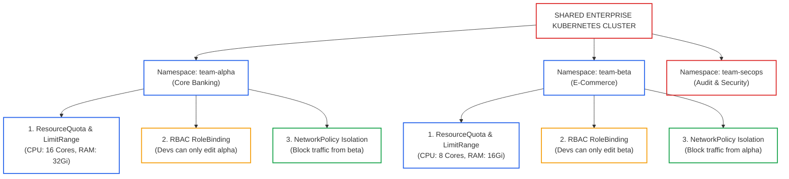
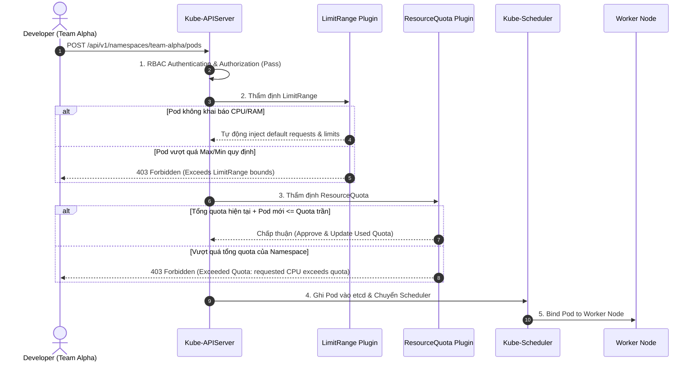
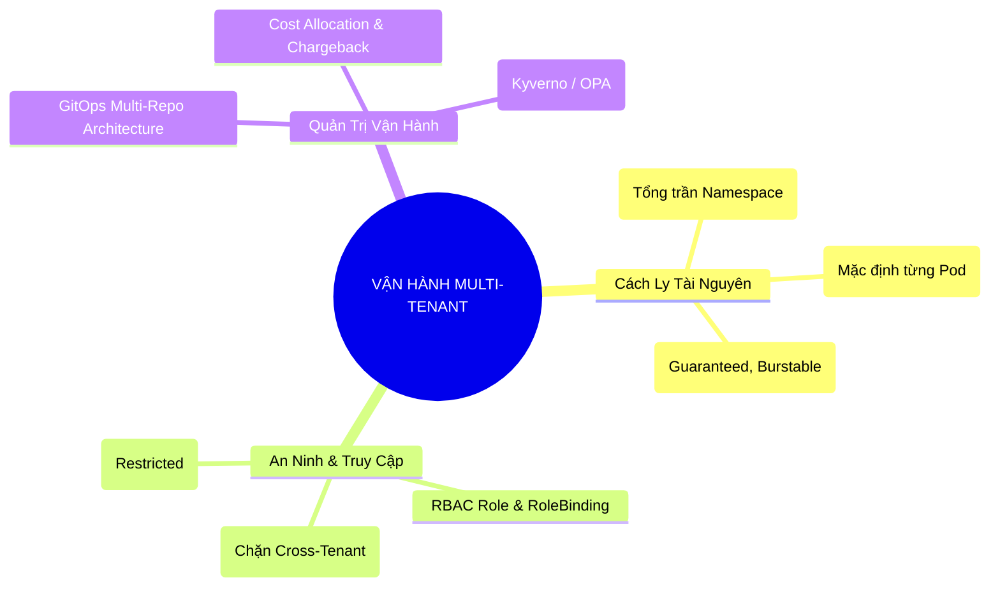


> [!IMPORTANT]
> **Mục tiêu kỹ thuật cốt lõi**: Nắm vững phương pháp thiết kế và vận hành cụm Kubernetes đa đội ngũ (**Multi-Tenant Enterprise Cluster**) đáp ứng tiêu chuẩn sản xuất. Triển khai 4 trụ cột cách ly: **Compute Isolation (ResourceQuota & LimitRange)**, **Control Plane Access (RBAC & ServiceAccount)**, **Network Boundaries (NetworkPolicy Isolation)**, và **Change Management (GitOps Workflow)** nhằm triệt tiêu hoàn toàn rủi ro tranh chấp tài nguyên (**Noisy Neighbor**) và xâm nhập chéo giữa các phòng ban.

---

## 1. Bản Chất Kiến Trúc & Tư Duy Cốt Lõi: Kiến Trúc Multi-Tenancy & Phân Tách Tài Nguyên

Khi doanh nghiệp mở rộng quy mô, việc cung cấp cho mỗi nhóm phát triển một cụm Kubernetes vật lý riêng biệt (Dedicated Clusters) sẽ dẫn đến chi phí vận hành tăng vọt và lãng phí tài nguyên tính toán (Under-utilization). Giải pháp chuẩn mực là chia sẻ một hoặc nhiều cụm lớn cho nhiều đội ngũ (**Multi-Tenancy**). 

### Soft Multi-Tenancy vs. Hard Multi-Tenancy



#### 4 Trụ Cột Cách Ly Bắt Buộc (4 Pillars of Multi-Tenancy):
1. **Compute & Storage Isolation**: Sử dụng `ResourceQuota` để khống chế tổng mức tiêu thụ (CPU/RAM/Pods/PVCs) và `LimitRange` để ép buộc thiết lập request/limit cho từng Container nhằm bảo vệ Worker Node khỏi hiện tượng OOMKilled.
2. **Access & Identity Isolation**: Áp dụng RBAC phân quyền chặt chẽ theo từng Namespace, ngăn chặn Developer của đội này có quyền xem cấu hình Secret hoặc xóa Pod của đội khác.
3. **Network Isolation**: Khởi tạo `NetworkPolicy` mặc định chặn toàn bộ kết nối giữa các Namespace (Cross-Tenant Deny), chỉ mở cổng khi có khai báo tường minh.
4. **Governance & Label Mutation**: Sử dụng Admission Webhooks (Kyverno / OPA Gatekeeper) để tự động gắn nhãn `team: <name>`, `cost-center: <id>` phục vụ tính cước nội bộ (Chargeback & Showback).

---

## 2. Bảng Ma Trận So Sánh Kỹ Thuật Toàn Diện (Engineering Matrix)

Bảng ma trận so sánh các chiến lược phân tách cụm trong môi trường doanh nghiệp:

| Tiêu Chí So Sánh | Namespace-Based Multi-Tenancy | Virtual Clusters (vCluster) | Dedicated NodePools (Taints/Tolerations) | Dedicated Physical Clusters |
|---|---|---|---|---|
| **Mức Độ Cách Ly (Isolation Level)** | Soft (Logic isolation qua API Server) | Medium-Hard (Control plane riêng trên 1 cụm) | Medium (Cách ly tài nguyên vật lý Worker) | Hard (Cách ly vật lý 100%) |
| **Chi Phí Hạ Tầng (Infrastructure Cost)** | Thấp nhất (Chia sẻ 100% Control Plane & Nodes) | Rất thấp (Chia sẻ Worker nodes) | Trung bình (Tốn tài nguyên node riêng) | Cao nhất (Nhân bản Control Plane và Master) |
| **Độ Phức Tạp Vận Hành** | Thấp (Dùng native K8s objects) | Trung bình (Cài thêm vCluster operator) | Trung bình (Quản lý node labels & taints) | Rất cao (Bảo trì, nâng cấp N cụm) |
| **Phù Hợp Với Ai?** | Các nhóm nội bộ cùng công ty (Trusted Tenants) | Môi trường Dev/Test của nhiều phòng ban | Ứng dụng yêu cầu phần cứng đặc thù (GPU/NVMe) | Multi-customers không tin cậy (Untrusted Tenants) |
| **Công Cụ Quản Trị Khuyến Nghị** | ResourceQuota, LimitRange, RBAC, NetPol | Loft vCluster, Capsule, Kiosk | NodeAffinity, Taints & Tolerations | Terraform, Cluster API, Crossplane |

---

## 3. Kiến Trúc Môi Trường & Luồng Thực Thi Mẫu

### Luồng Thẩm Định và Áp Đặt Chính Sách (Admission Control Sequence)

Khi một lập trình viên thuộc `team-alpha` gửi một yêu cầu triển khai Pod lên Kubernetes, quy trình thẩm định đa tầng sẽ diễn ra như sau:



---

## 4. Phân Tích Cạm Bẫy Thực Chiến: Sự Cố Cạn Kiệt Tài Nguyên & Vượt Rào Phân Quyền Giữa Các Đội

### Tình Huống Sự Cố: Ứng Dụng Chạy Tràn Bộ Nhớ Khiến Các Đội Khác Bị Trục Xuất (Noisy Neighbor Outage)

Một kỹ sư thuộc `team-beta` triển khai một batch job xử lý dữ liệu lớn lên namespace `team-beta` mà không khai báo `resources.limits`. Khi ứng dụng rò rỉ bộ nhớ (Memory Leak), nó ngốn sạch 64GB RAM của Worker Node `worker-01`. Hậu quả là Linux Kernel kích hoạt OOM Killer và Kubelet tiến hành trục xuất (Eviction) hàng loạt Pods quan trọng của `team-alpha` đang cùng nằm trên Node đó.

### Hậu Quả & Log Lỗi Thực Tế:
```text
The node was low on resource: memory. Threshold quantity: 100Mi, available: 45Mi.
Pod team-alpha/payment-service-7f9d8b8c-x9z1a was evicted due to node memory pressure.
Message: "Evicted due to memory pressure on node worker-01"
```

### 5-Whys Root Cause Analysis:
1. **Tại sao payment-service của team-alpha bị trục xuất?** Vì Worker Node `worker-01` rơi vào trạng thái Memory Pressure.
2. **Tại sao Node bị Memory Pressure?** Vì batch job của `team-beta` tiêu thụ tới 98% bộ nhớ vật lý của Node.
3. **Tại sao batch job có thể ngốn không giới hạn RAM?** Vì namespace `team-beta` không có cấu hình `LimitRange` để ép buộc thiết lập memory limits, và Pod không khai báo limits (BestEffort QoS).
4. **Tại sao Kubelet chọn Pod của team-alpha để trục xuất?** Vì Pod của `team-alpha` có QoS là Burstable, bị Kubelet chọn xử lý khi tổng tài nguyên node cạn kiệt.
5. **Gốc rễ vấn đề (Root Cause):** Cụm Kubernetes chưa thiết lập chính sách `LimitRange` mặc định và `ResourceQuota` trần cho từng Namespace, vi phạm nguyên tắc cách ly tài nguyên Multi-Tenancy.

### Biện Pháp Khắc Phục Chuẩn:
```diff
--- /dev/null
+++ b/limitrange-team-beta.yaml
@@ -0,0 +1,16 @@
+apiVersion: v1
+kind: LimitRange
+metadata:
+  name: default-limits
+  namespace: team-beta
+spec:
+  limits:
+  - default:
+      cpu: 500m
+      memory: 512Mi
+    defaultRequest:
+      cpu: 100m
+      memory: 128Mi
+    max:
+      cpu: 2000m
+      memory: 4Gi
+    type: Container
```

---

## 5. Hands-on Lab: Triển Khai Nền Tảng Multi-Tenant Hoàn Chỉnh Cho 3 Đội Ngũ (8 Bước)

| Bước | Mục Tiêu Kỹ Thuật | Lệnh / File Kiểm Tra Chính |
|---|---|---|
| **1** | Khởi tạo 3 Isolated Namespaces (`team-alpha`, `team-beta`, `team-secops`) | `kubectl create ns` kèm labels |
| **2** | Cấu hình ResourceQuota khống chế CPU, RAM, Pods và PVCs | `ResourceQuota` manifest |
| **3** | Cấu hình LimitRange thiết lập giá trị Request/Limit mặc định | `LimitRange` manifest |
| **4** | Cấu hình RBAC Namespace-scoped Roles & RoleBindings | `Role`, `RoleBinding`, `auth can-i` |
| **5** | Phong tỏa giao tiếp mạng liên Namespace bằng NetworkPolicy | `NetworkPolicy` (Deny Cross-Namespace) |
| **6** | Kiểm thử cơ chế từ chối khi Workload vượt quá Quota | `kubectl apply` test pod |
| **7** | Cấu hình NetworkPolicy mở cổng đặc thù cho SecOps Audit | `NetworkPolicy` ingress rule |
| **8** | Báo cáo kiểm toán mức tiêu thụ tài nguyên của từng đội | `kubectl describe quota -A` |

---

### Bước 1: Khởi Tạo Namespaces Kèm Metadata Đầy Đủ

```bash
# Tạo 3 namespace có nhãn phân loại đội và môi trường
kubectl create ns team-alpha
kubectl label ns team-alpha team=alpha env=prod cost-center=cc-101

kubectl create ns team-beta
kubectl label ns team-beta team=beta env=staging cost-center=cc-102

kubectl create ns team-secops
kubectl label ns team-secops team=secops env=security cost-center=cc-999
```

---

### Bước 2: Thiết Lập ResourceQuota Cho Từng Đội

```yaml
# quota-alpha.yaml
apiVersion: v1
kind: ResourceQuota
metadata:
  name: compute-quota
  namespace: team-alpha
spec:
  hard:
    requests.cpu: "4"
    requests.memory: 8Gi
    limits.cpu: "8"
    limits.memory: 16Gi
    pods: "10"
    persistentvolumeclaims: "4"
    requests.storage: 20Gi
---
# quota-beta.yaml
apiVersion: v1
kind: ResourceQuota
metadata:
  name: compute-quota
  namespace: team-beta
spec:
  hard:
    requests.cpu: "2"
    requests.memory: 4Gi
    limits.cpu: "4"
    limits.memory: 8Gi
    pods: "5"
    persistentvolumeclaims: "2"
    requests.storage: 10Gi
```
```bash
kubectl apply -f quota-alpha.yaml
kubectl apply -f quota-beta.yaml
kubectl describe quota -n team-alpha
```

---

### Bước 3: Thiết Lập LimitRange Ép Buộc Default Limits

```yaml
# limitrange-all.yaml
apiVersion: v1
kind: LimitRange
metadata:
  name: container-limits
  namespace: team-alpha
spec:
  limits:
  - default:
      cpu: 500m
      memory: 512Mi
    defaultRequest:
      cpu: 100m
      memory: 128Mi
    max:
      cpu: "2"
      memory: 2Gi
    min:
      cpu: 50m
      memory: 64Mi
    type: Container
---
apiVersion: v1
kind: LimitRange
metadata:
  name: container-limits
  namespace: team-beta
spec:
  limits:
  - default:
      cpu: 250m
      memory: 256Mi
    defaultRequest:
      cpu: 50m
      memory: 64Mi
    max:
      cpu: "1"
      memory: 1Gi
    min:
      cpu: 20m
      memory: 32Mi
    type: Container
```
```bash
kubectl apply -f limitrange-all.yaml
kubectl describe limitrange -n team-alpha
```

---

### Bước 4: Cấu Hình RBAC Phân Quyền Chi Tiết Cho Developer

```bash
# 1. Tạo ServiceAccounts đại diện cho kỹ sư từng đội
kubectl create sa dev-alpha -n team-alpha
kubectl create sa dev-beta -n team-beta

# 2. Tạo Role toàn quyền trong phạm vi namespace của mình
kubectl create role dev-lead-role \
  --verb="*" \
  --resource=pods,deployments,services,configmaps,secrets,persistentvolumeclaims \
  -n team-alpha

kubectl create role dev-lead-role \
  --verb="*" \
  --resource=pods,deployments,services,configmaps,secrets,persistentvolumeclaims \
  -n team-beta

# 3. Gán RoleBinding
kubectl create rolebinding dev-alpha-binding \
  --role=dev-lead-role \
  --serviceaccount=team-alpha:dev-alpha \
  -n team-alpha

kubectl create rolebinding dev-beta-binding \
  --role=dev-lead-role \
  --serviceaccount=team-beta:dev-beta \
  -n team-beta

# 4. Kiểm tra phân quyền: Dev Alpha KHÔNG ĐƯỢC phép truy cập team-beta
kubectl auth can-i list pods --as=system:serviceaccount:team-alpha:dev-alpha -n team-alpha
# Kết quả: yes
kubectl auth can-i list pods --as=system:serviceaccount:team-alpha:dev-alpha -n team-beta
# Kết quả: no
```

---

### Bước 5: Phong Tỏa Mạng Giữa Các Đội Bằng NetworkPolicy

```yaml
# netpol-deny-cross-tenant.yaml
apiVersion: networking.k8s.io/v1
kind: NetworkPolicy
metadata:
  name: isolate-team-alpha
  namespace: team-alpha
spec:
  podSelector: {}
  policyTypes:
  - Ingress
  ingress:
  # 1. Chỉ cho phép các Pods CÙNG trong namespace team-alpha giao tiếp với nhau
  - from:
    - podSelector: {}
  # 2. Cho phép traffic từ Ingress Controller (nếu có nhãn ingress-ready)
  - from:
    - namespaceSelector:
        matchLabels:
          kubernetes.io/metadata.name: ingress-nginx
  # 3. Cho phép SecOps quét kiểm toán
  - from:
    - namespaceSelector:
        matchLabels:
          team: secops
---
apiVersion: networking.k8s.io/v1
kind: NetworkPolicy
metadata:
  name: isolate-team-beta
  namespace: team-beta
spec:
  podSelector: {}
  policyTypes:
  - Ingress
  ingress:
  - from:
    - podSelector: {}
```
```bash
kubectl apply -f netpol-deny-cross-tenant.yaml
```

---

### Bước 6: Kiểm Thử Cơ Chế Tự Động Gán Limits & Từ Chối Vượt Quota

```bash
# 1. Triển khai Pod không khai báo limits -> LimitRange sẽ tự inject
kubectl run test-auto-limit --image=nginx:alpine -n team-alpha
kubectl get pod test-auto-limit -n team-alpha -o yaml | grep -A 8 resources:

# 2. Thử tạo Pod vượt quá hạn ngạch (ví dụ xin 10 Cores CPU trong khi quota chỉ có 4)
cat << 'EOF' | kubectl apply -f - || true
apiVersion: v1
kind: Pod
metadata:
  name: greedy-pod
  namespace: team-alpha
spec:
  containers:
  - name: heavy
    image: nginx:alpine
    resources:
      requests:
        cpu: "10"
        memory: 20Gi
EOF
```
> Kết quả: Kubernetes từ chối tạo Pod ngay tại cổng Admission Controller với lỗi `exceeded quota: compute-quota, requested: requests.cpu=10, used: requests.cpu=100m, limited: requests.cpu=4`.

---

### Bước 7: Mở Luồng Kiểm Toán An Ninh Cho SecOps

```yaml
# netpol-allow-secops.yaml
apiVersion: networking.k8s.io/v1
kind: NetworkPolicy
metadata:
  name: allow-secops-scanner
  namespace: team-beta
spec:
  podSelector: {}
  policyTypes:
  - Ingress
  ingress:
  - from:
    - namespaceSelector:
        matchLabels:
          team: secops
    ports:
    - protocol: TCP
      port: 8080
```
```bash
kubectl apply -f netpol-allow-secops.yaml
```

---

### Bước 8: Kiểm Toán Báo Cáo Tài Nguyên Đa Đội Toàn Cụm

```bash
# Xem tổng quan tài nguyên đã cấp phát trên tất cả các Namespace
kubectl get resourcequota -A

# Lệnh trích xuất chi tiết theo dạng bảng
kubectl get resourcequota -A -o custom-columns=\
NAMESPACE:.metadata.namespace,\
NAME:.metadata.name,\
CPU_REQ_USED:.status.used.requests\.cpu,\
CPU_REQ_HARD:.status.hard.requests\.cpu,\
MEM_REQ_USED:.status.used.requests\.memory,\
MEM_REQ_HARD:.status.hard.requests\.memory,\
PODS_USED:.status.used.pods,\
PODS_HARD:.status.hard.pods
```

---

## 6. 10 Câu Hỏi Tự Kiểm Tra Chuyên Sâu (Self-Check Q&A Accordion)

<details class="qa-card">
<summary><b>1. ResourceQuota và LimitRange khác nhau như thế nào về phạm vi áp dụng?</b></summary>
<div class="qa-answer">
<p><b>ResourceQuota</b> áp dụng ở cấp độ <b>toàn bộ Namespace</b> (tổng dung lượng trần của tất cả Pods cộng lại). Trong khi đó, <b>LimitRange</b> áp dụng ở cấp độ <b>từng Container/Pod đơn lẻ</b> (thiết lập giá trị mặc định, giá trị tối thiểu và giá trị tối đa cho mỗi Pod khi tạo ra).</p>
</div>
</details>

<details class="qa-card">
<summary><b>2. Điều gì sẽ xảy ra nếu một Namespace có ResourceQuota cho CPU/RAM nhưng Pod tạo ra không khai báo `requests` và `limits`?</b></summary>
<div class="qa-answer">
<p>Nếu Namespace có ResourceQuota mà <b>không có LimitRange</b> để tự động bù đắp giá trị mặc định, Kubernetes API Server sẽ <b>từ chối (Reject)</b> việc tạo Pod với thông báo lỗi yêu cầu phải khai báo tường minh trường <code>resources.requests</code> hoặc <code>resources.limits</code>.</p>
</div>
</details>

<details class="qa-card">
<summary><b>3. Làm thế nào để giới hạn số lượng Pod loại BestEffort không được chiếm dụng toàn bộ tài nguyên trong cụm?</b></summary>
<div class="qa-answer">
<p>Sử dụng cơ chế <b>ResourceQuota Scopes</b>. Ta có thể tạo một ResourceQuota chỉ nhắm vào các Pods có scope là <code>BestEffort</code> (ví dụ: tối đa 5 BestEffort pods) và một ResourceQuota khác cho các Pods có scope <code>NotBestEffort</code>.</p>
</div>
</details>

<details class="qa-card">
<summary><b>4. Tại sao cấu hình `podSelector: {}` trong NetworkPolicy lại có ý nghĩa quan trọng?</b></summary>
<div class="qa-answer">
<p>Khai báo <code>podSelector: {}</code> có nghĩa là chính sách này sẽ được áp dụng cho <b>toàn bộ tất cả các Pods</b> hiện có và sẽ được tạo trong tương lai bên trong Namespace đó, đóng vai trò như một quy tắc bảo vệ tổng thể (Default Policy).</p>
</div>
</details>

<details class="qa-card">
<summary><b>5. Soft Multi-Tenancy có thể ngăn chặn hoàn toàn một lập trình viên có quyền Root trên Node không?</b></summary>
<div class="qa-answer">
<p><b>Không thể.</b> Trong mô hình Soft Multi-Tenancy, tất cả các container chia sẻ chung Linux Kernel của Worker Node. Nếu một container chạy dưới quyền <code>privileged: true</code> hoặc root escape, nó có thể truy cập vào filesystem của Node và can thiệp vào các container của đội khác. Để ngăn chặn điều này, cần kết hợp thêm <b>Pod Security Standards (Restricted)</b> hoặc sử dụng runtime cách ly như <b>gVisor / Kata Containers</b>.</p>
</div>
</details>

<details class="qa-card">
<summary><b>6. Khi một Pod cố gắng tiêu thụ vượt quá mức `limits.memory` đã định nghĩa, hệ điều hành sẽ phản ứng ra sao?</b></summary>
<div class="qa-answer">
<p>Bộ điều khiển cgroups của Linux Kernel sẽ phát hiện vi phạm bộ nhớ và kích hoạt <b>OOM Killer (Out Of Memory)</b> để tiêu diệt (kill) tiến trình bên trong container. Container sẽ kết thúc với Exit Code <b>137</b> và Kubernetes đánh dấu trạng thái <code>OOMKilled</code> rồi khởi động lại container theo restartPolicy.</p>
</div>
</details>

<details class="qa-card">
<summary><b>7. Làm thế nào để ngăn chặn lập trình viên tự ý gán nhãn Namespace hoặc vượt quyền qua ClusterRole?</b></summary>
<div class="qa-answer">
<p>Chỉ gán cho lập trình viên quyền truy cập thông qua <b>RoleBinding</b> gắn với <b>Role</b> nội bộ bên trong Namespace. Tuyệt đối không cấp quyền <code>ClusterRoleBinding</code> hoặc các quyền quản trị trên đối tượng phạm vi toàn cụm như <code>namespaces</code>, <code>nodes</code>, <code>clusterroles</code>, <code>storageclasses</code>.</p>
</div>
</details>

<details class="qa-card">
<summary><b>8. Lợi ích lớn nhất của việc sử dụng Virtual Clusters (vCluster) so với phân chia thuần bằng Namespace là gì?</b></summary>
<div class="qa-answer">
<p>vCluster cung cấp cho mỗi đội một <b>Kube-APIServer riêng biệt</b> chạy bên trong một Pod. Nhờ đó, mỗi đội có thể tự do định nghĩa CRDs riêng, cài đặt Helm charts ở phạm vi toàn cụm, và quản lý các Namespace con của riêng họ mà không làm ảnh hưởng hay xung đột với các đội khác trên cụm vật lý bên dưới.</p>
</div>
</details>

<details class="qa-card">
<summary><b>9. Làm thế nào để định ngạch dung lượng lưu trữ đĩa (Storage Quota) cho từng đội?</b></summary>
<div class="qa-answer">
<p>Khai báo trong ResourceQuota trường <code>requests.storage: &lt;dung-lượng&gt;</code> (ví dụ <code>50Gi</code>) hoặc chỉ định quota theo từng StorageClass cụ thể bằng cú pháp <code>&lt;storage-class-name&gt;.storageclass.storage.k8s.io/requests.storage: 20Gi</code>.</p>
</div>
</details>

<details class="qa-card">
<summary><b>10. Trong môi trường GitOps đa đội, cấu trúc phân quyền kho mã nguồn (Repository) nên được tổ chức như thế nào?</b></summary>
<div class="qa-answer">
<p>Tổ chức theo mô hình <b>Multi-Repo Pattern</b>:</p>
<div>1. <b>Platform/Infra Repo:</b> Do đội Core Infra quản lý, chứa cấu hình cụm, CNI, CSI, Ingress, ResourceQuota và RBAC.</div>
<div>2. <b>Tenant App Repos:</b> Mỗi đội sở hữu một Git repo riêng, chỉ chứa Kubernetes manifests (Deployments, Services, ConfigMaps) trỏ vào Namespace của đội mình thông qua ArgoCD Application phân quyền scoped.</div>
</div>
</details>

---

## 7. Tổng Kết & Lộ Trình Bài Học Tiếp Theo



Làm chủ kiến trúc Multi-Tenancy là bước chuyển mình từ một kỹ sư Kubernetes thông thường thành một **Platform Engineer / Lead Cloud Architect** có khả năng thiết kế hệ thống phục vụ hàng trăm lập trình viên an toàn và tiết kiệm chi phí.

> [!TIP]
> **Bài học tiếp theo**: Khám phá và phân tích sâu sắc các sự cố kinh điển trong sản xuất với **[Bài 33: Điều Tra Sự Cố Thực Tế (Postmortem) — 10 Thảm Họa Production & Bài Học Xương Máu](cka-33-33-su-co-that-va-postmortem.html)**.

