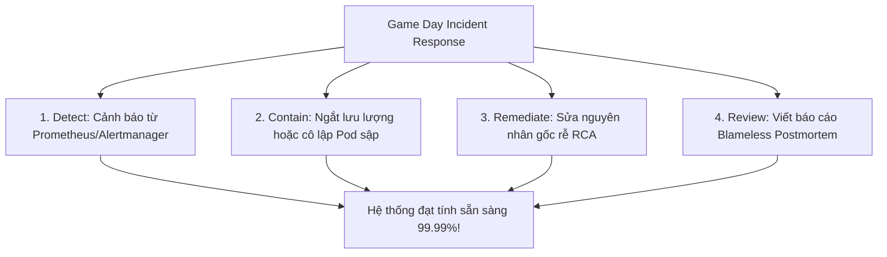
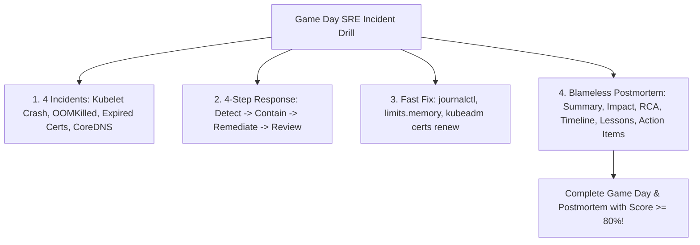


# [BÀI 33] GAME DAY DIỄN TẬP SỰ CỐ THỰC TẾ: PHẢN ỨNG VỚI 4 SỰ CỐ CẤY SẴN & BÁO CÁO POSTMORTEM PHI QUY TRÁCH

Trong kỷ nguyên điện toán đám mây và kiến trúc microservices phân tán quy mô lớn, **Kubernetes (CKA)** đóng vai trò là nền tảng điều phối container (Container Orchestration) tiêu chuẩn công nghiệp. Để làm chủ hệ thống trong môi trường sản xuất (Production) cũng như chinh phục kỳ thi chứng chỉ quốc tế của Linux Foundation / CNCF, kỹ sư không chỉ nắm vững các câu lệnh thao tác cơ bản mà phải thấu hiểu sâu sắc bản chất cơ chế tầng thấp: từ chu trình điều hòa (Reconciliation Loop), cấu trúc điều phối tài nguyên, kiến trúc mạng CNI, lưu trữ CSI cho đến các chuẩn mực an ninh phòng thủ chiều sâu.

Bài viết chuyên sâu này sẽ đồng hành cùng bạn giải mã toàn diện bức tranh kiến trúc, phân tích các đánh đổi kỹ thuật thực chiến (Engineering Trade-offs), cung cấp bài thực hành Lab từng bước và bộ câu hỏi phỏng vấn chuẩn Architect / Lead Engineer.

---

## 1. Bản Chất Kiến Trúc & Cơ Chế Vận Hành Tầng Thấp

| # | Câu hỏi ôn tập | Đáp án chuẩn ngắn gọn |
|---|---|---|
| 1 | 3 Namespace phân chia 3 đội? | **`team-alpha`, `team-beta`, `team-secops`** |
| 2 | Cặp đối tượng quản lý tài nguyên NS? | **`ResourceQuota` và `LimitRange`** |
| 3 | Lý do cấm ClusterRoleBinding cho Dev? | Tránh làm **mất tính cách ly Namespace** |
| 4 | Nhãn mặc định K8s lọc tên Namespace? | Nhãn **`kubernetes.io/metadata.name`** |
| 5 | Quy trình quản lý thay đổi an toàn? | Quy trình **GitOps PR Approval Workflow** |


> **"Diễn tập sự cố hệ thống thực tế (Enterprise Game Day & Chaos Engineering) thông qua việc cấy sẵn 4 kịch bản hỏng hóc hạ tầng (Node NotReady, Pod OOMKilled, Certificate hết hạn, và sập phân giải tên miền CoreDNS), gỡ lỗi khẩn cấp trong 90 phút và biên soạn báo cáo sự cố không quy trách nhiệm (Blameless Postmortem Report) là kỹ năng cốt lõi của kỹ sư tin cậy hệ thống (SRE), đòi hỏi quản trị viên phải áp dụng quy trình chẩn đoán 4 bước bài bản; làm chủ các công cụ tra cứu log hệ thống (`journalctl`, `crictl`, `kubectl logs/describe`); khắc phục triệt để nguyên nhân gốc rễ (Root Cause Analysis); đồng thời thiết lập các hành động phòng ngừa (Action Items) nhằm bảo vệ tính liên tục hoạt động (Business Continuity) của doanh nghiệp."**

**Kết quả từ các buổi trước được sử dụng lại:**

| Kết quả / Công cụ | Buổi + số hiệu `QT` | Dùng ở đâu trong buổi này |
|---|---|---|
| Chẩn đoán log Kubelet & systemd | Buổi 36 `QT 4.1` | Khắc phục sự cố Node NotReady do Kubelet crash |
| Gia hạn chứng chỉ TLS Kubeadm | Buổi 14 `QT 4.1` | Khắc phục sự cố Kube-apiserver Certificate Expired |
| Gỡ lỗi CoreDNS và mạng CNI | Buổi 30 `QT 4.1` | Khắc phục sự cố mất kết nối mạng và phân giải DNS |

---


| # | Kỹ năng thực hiện được | Hiện vật chứng minh |
|---|---|---|
| 1 | Thực thi quy trình ứng phó sự cố khẩn cấp 4 bước (Incident Response Workflow) | Nhật ký chẩn đoán và khắc phục 4 sự cố cấy sẵn |
| 2 | Khắc phục sự cố Node `NotReady` do Kubelet service bị sập | Lệnh `systemctl status/restart kubelet` & journalctl log |
| 3 | Xử lý Pod lỗi `OOMKilled` (Exit Code 137) và điều chỉnh memory limit | Tệp YAML Pod spec đã được cập nhật `resources.limits` |
| 4 | Gia hạn chứng chỉ TLS cụm Control Plane bằng `kubeadm certs renew all` | Kết quả lệnh `kubeadm certs check-expiration` |
| 5 | Biên soạn báo cáo sự cố không quy trách nhiệm (Blameless Postmortem) | Tệp báo cáo hoàn chỉnh `/tmp/postmortem.md` đủ 6 phần |

---


| Kiến thức tiên quyết | Nguồn tự học nếu thiếu |
|---|---|
| Gỡ lỗi Node NotReady & systemd log | Buổi 36 (`QT 4.1`) |
| Gia hạn chứng chỉ TLS Control Plane | Buổi 14 (`QT 4.1`) |
| Gỡ lỗi CoreDNS & CNI Network Partition | Buổi 30 (`QT 4.1`) |

---


### 3.1. Thuật ngữ Việt–Anh

| # | Thuật ngữ tiếng Việt | Tiếng Anh tương đương | Ghi chú chuẩn hoá trong thân bài |
|---|---|---|---|
| 1 | Ngày diễn tập sự cố | Game Day Drill | Ngày tổ chức cấy sự cố giả lập kiểm thử phản xạ SRE |
| 2 | Kỹ thuật gây sự cố chủ động | Chaos Engineering | Phương pháp cố tình đưa lỗi vào cụm để đo sức chịu đựng |
| 3 | Báo cáo không quy trách nhiệm | Blameless Postmortem | Báo cáo phân tích sự cố tập trung vào lỗi hệ thống thay vì cá nhân |
| 4 | Tiến trình bị hết bộ nhớ kill | OOMKilled Container | Sự cố Pod tiêu tốn RAM vượt `resources.limits.memory` |
| 5 | Gia hạn chứng chỉ cụm | TLS Certificate Renewal | Quy trình `kubeadm certs renew all` gia hạn chứng chỉ TLS |
| 6 | Phân giải tên miền nội bộ | CoreDNS Resolution Failure | Sự cố Pod không tra cứu được IP của Service qua DNS |
| 7 | Quy trình ứng phó sự cố | Incident Response Workflow | 4 bước: Phát hiện -> Khoanh vùng -> Sửa lỗi -> Đánh giá |
| 8 | Nguyên nhân gốc rễ sự cố | Root Cause Analysis (RCA) | Phân tích lý do sâu xa nhất gây ra sập hệ thống |
| 9 | Danh mục hành động khắc phục | Postmortem Action Items | Các nhiệm vụ kỹ thuật cần làm để sự cố không tái diễn |
| 10 | Nhật ký dòng thời gian sự cố | Incident Timeline Log | Bảng ghi nhận chi tiết các mốc thời gian từ lúc sập tới lúc sống |
| 11 | Mức độ nghiêm trọng sự cố | Incident Severity Level | Phân cấp độ ảnh hưởng: SEV-1 (Crit), SEV-2 (High), SEV-3 (Med) |
| 12 | Chỉ số thời gian khôi phục | Mean Time To Recovery (MTTR) | Thời gian trung bình từ khi xảy ra sự cố tới khi hệ thống phục hồi |
| 13 | Bảng ghi điểm diễn tập Game Day | Game Day Auto-Grading Script | Script kiểm tra kết quả gỡ 4 sự cố và tệp Postmortem |
| 14 | Tốc độ xử lý sự cố khẩn cấp | Emergency Incident Recovery Speed | Chỉ số thời gian khôi phục sự cố dưới 15 phút mỗi ca |


Mô hình Phòng Chống Cháy Nổ Và Báo Cháy Diễn Tập Tại Sân Bay Quốc Tế (Airport Fire & Emergency Drill): Kỳ thi CKS và môi trường vận hành thực tế Yêu Cầu Quản Trị Viên Phải Bình Tĩnh Xử Lý Mọi Sự Cố Hạ Tầng Theo Đúng Quy Trình Chuẩn. Cụm Kubernetes Production giống như Sân Bay Quốc Tế Đang Phục Vụ Hàng Ngàn Chuyến Bay: các sự cố (Kubelet sập, Pod OOMKilled, Chứng chỉ hết hạn, CoreDNS sập) giống như Các Tình Huống Cháy Nổ Cấy Sẵn Trong Ngày Diễn Tập Game Day. Đội Cứu Hỏa Sân Bay (Đội SRE) không hoảng loạn hay đổ lỗi cho người báo cháy: họ thực hiện chính xác quy trình 4 bước (Bật còi báo động -> Khoanh vùng đám cháy -> Dập lửa bằng bọt chữa cháy -> Viết báo cáo rút kinh nghiệm). `Báo Cáo Postmortem Phi Quy Trách (Blameless Postmortem)` giống như Việc Phân Tích Sự Cố Bay Của Hãng Hàng Không: không trừng phạt phi công mà tập trung sửa chữa hệ thống cảm biến báo cháy để các chuyến bay tương lai an toàn tuyệt đối.

---

### 1.1. Mô hình Diễn tập Sự cố Game Day và Quy trình 4 bước Ứng phó Khẩn cấp (12 phút)

**Nguyên lý cốt lõi:** Tất cả các kỹ sư SRE BẮT BUỘC phải tham gia diễn tập Game Day định kỳ để rèn luyện phản xạ chẩn đoán và khắc phục sự cố dưới 15 phút mỗi ca.

**Giải thích cơ chế ngầm:** Giúp giảm chỉ số thời gian khôi phục hệ thống (MTTR) và đảm bảo đội ngũ kỹ sư sẵn sàng ứng phó khi sự cố xảy ra trên môi trường Production.

> [!WARNING]
> **CẠM BẪY THỰC CHIẾN:**
> Hoảng loạn thử sai bừa bãi khi hệ thống báo lỗi sập dịch vụ.

**Minh hoạ.**



**Nguyên lý cốt lõi:** Mọi quy trình ứng phó sự cố khẩn cấp BẮT BUỘC phải tuân thủ 4 bước: 1) Nhận diện (Detect), 2) Khoanh vùng (Contain), 3) Khắc phục (Remediate), và 4) Báo cáo Postmortem (Review).

**Giải thích cơ chế ngầm:** Giúp xử lý sự cố có hệ thống, tránh làm trầm trọng thêm sự cố do các hành động vội vã không kiểm soát.

> [!WARNING]
> **CẠM BẪY THỰC CHIẾN:**
> Thấy Pod sập vội xóa thẳng Pod mà chưa kiểm tra log chẩn đoán nguyên nhân.

**Minh hoạ.**

```yaml
# Quy trình 4 bước Ứng phó Sự cố SRE:
# 1. Detect: kubectl get nodes / kubectl get pods -A
# 2. Contain: kubectl cordon node / kubectl scale deployment --replicas=0
# 3. Remediate: systemctl restart / kubeadm certs renew / fix YAML
# 4. Review: Biên soạn /tmp/postmortem.md
```

---

### 1.2. Phân tích 4 Sự cố Cấy sẵn: Node NotReady, OOMKilled, Expired Certs & CoreDNS Failure (12 phút)

**Nguyên lý cốt lõi:** Khi gặp sự cố Node `NotReady` do Kubelet crash, LUÔN LUÔN soi log `journalctl -u kubelet -n 50 --no-pager` để tìm nguyên nhân trước khi thực hiện `systemctl restart kubelet`.

**Giải thích cơ chế ngầm:** Giúp xác định chính xác nguyên nhân (file config bị lỗi, đĩa đếm đầy, hay cgroup driver không khớp) để sửa tận gốc thay vì chỉ restart tạm thời.

> [!WARNING]
> **CẠM BẪY THỰC CHIẾN:**
> Restart Kubelet service liên tục nhưng service lập tức sập lại ngay sau đó.

**Minh hoạ.**

```bash
# Quy trình gỡ lỗi Node NotReady chuẩn SRE:
ssh worker-01 "sudo systemctl status kubelet"
ssh worker-01 "sudo journalctl -u kubelet -n 50 --no-pager"
```

**Nguyên lý cốt lõi:** Khi gặp sự cố Pod bị `OOMKilled` (Exit Code 137), LUÔN LUÔN kiểm tra giá trị `memory.limits` trong Pod spec và điều chỉnh tăng dung lượng bộ nhớ phù hợp với nhu cầu ứng dụng.

**Giải thích cơ chế ngầm:** Exit Code 137 xảy ra khi tiến trình container tiêu tốn bộ nhớ RAM vượt quá trần `limits.memory` và bị Linux OOM Killer tiêu diệt.

> [!WARNING]
> **CẠM BẪY THỰC CHIẾN:**
> Đổi tên image hoặc restart Pod mà không tăng dung lượng RAM trong Pod spec.

**Minh hoạ.**

```bash
# Nhận biết lỗi OOMKilled trong kubectl describe pod:
# Last State: Terminated
#   Reason: OOMKilled
#   Exit Code: 137
```

**Nguyên lý cốt lõi:** Khi gặp sự cố chứng chỉ TLS hết hạn khiến `kubectl` báo lỗi `certificate has expired`, LUÔN LUÔN thực hiện quy trình `kubeadm certs renew all` và khởi động lại Static Pods Control Plane.

**Giải thích cơ chế ngầm:** Chứng chỉ TLS mặc định của kubeadm có thời hạn 1 năm. Gia hạn chứng chỉ giúp apiserver kết nối lại bình thường với etcd và kubelet.

> [!WARNING]
> **CẠM BẪY THỰC CHIẾN:**
> Xóa cụm hoặc cài đặt lại Kubernetes khi chứng chỉ TLS bị hết hạn.

**Minh hoạ.**

```bash
# Quy trình gia hạn chứng chỉ TLS Control Plane:
sudo kubeadm certs check-expiration
sudo kubeadm certs renew all
sudo systemctl restart kubelet
```

---

### 1.3. Khung Báo cáo Sự cố Không Quy trách nhiệm (Blameless Postmortem Framework) (10 phút)

**Nguyên lý cốt lõi:** Khi gặp sự cố CoreDNS không phân giải được tên miền, LUÔN LUÔN kiểm tra trạng thái Pod CoreDNS (`kubectl get pods -n kube-system -l k8s-app=kube-dns`) và kết nối mạng CNI plugin.

**Giải thích cơ chế ngầm:** CoreDNS là dịch vụ hạ tầng sống còn của cụm. Nếu CoreDNS bị treo hoặc bị CNI plugin chặn mạng, tất cả các Pods sẽ không thể giao tiếp với nhau qua tên dịch vụ.

> [!WARNING]
> **CẠM BẪY THỰC CHIẾN:**
> Sửa file `/etc/resolv.conf` trên Pod thay vì kiểm tra dịch vụ CoreDNS trong `kube-system`.

**Minh hoạ.**

```bash
# Kiểm tra log CoreDNS khi bị sập phân giải tên miền:
kubectl logs -n kube-system -l k8s-app=kube-dns
```

**Nguyên lý cốt lõi:** Báo cáo sự cố không quy trách nhiệm (Blameless Postmortem) BẮT BUỘC phải chứa đủ 6 phần: Summary, Impact, Root Cause, Timeline, Lessons Learned, và Action Items.

**Giải thích cơ chế ngầm:** Đảm bảo tài liệu hóa toàn bộ bài học kinh nghiệm, phân tích sâu nguyên nhân hệ thống và đưa ra các nhiệm vụ kỹ thuật phòng ngừa sự cố tái diễn.

> [!WARNING]
> **CẠM BẪY THỰC CHIẾN:**
> Viết báo cáo chỉ trích lập trình viên gõ sai code thay vì phân tích thiếu sót của hệ thống kiểm thử CI/CD.

**Minh hoạ.**

```markdown
# Cấu trúc 6 phần chuẩn Blameless Postmortem Report:
## 1. Summary (Tóm tắt sự cố)
## 2. Impact (Ảnh hưởng kinh doanh/dịch vụ)
## 3. Root Cause Analysis (Nguyên nhân gốc rễ)
## 4. Incident Timeline (Dòng thời gian sự cố)
## 5. Lessons Learned (Bài học rút ra)
## 6. Action Items (Hành động phòng ngừa)
```

---

### 1.4. Đưa vào cụm thật (4 phút)

**Nguyên lý cốt lõi:** Bản kê khai bài diễn tập Game Day hoàn chỉnh bắt buộc phải chứng minh được cả 4 sự cố cấy sẵn đã được khắc phục triệt để và tệp `/tmp/postmortem.md` đã được khởi tạo chuẩn xác.

**Giải thích cơ chế ngầm:** Đáp ứng tiêu chuẩn diễn tập sự cố doanh nghiệp (Enterprise SRE Game Day Standard).

> [!WARNING]
> **CẠM BẪY THỰC CHIẾN:**
> Sửa xong 4 sự cố nhưng quên biên soạn tệp báo cáo `/tmp/postmortem.md`.

**Minh hoạ.**

```bash
# Kiểm tra sự tồn tại của tệp báo cáo Postmortem hoàn chỉnh:
test -f /tmp/postmortem.md && grep -q "Action Items" /tmp/postmortem.md
```

**Áp vào cụm đang chạy thì làm gì trước:**
1. Kích hoạt cấy sẵn 4 kịch bản sự cố trên cụm Sandbox.
2. Bật đồng hồ đếm ngược 90 phút diễn tập Game Day.
3. Thực thi 4 bước ứng phó sự cố khẩn cấp: Detect -> Contain -> Remediate -> Review.
4. Biên soạn tệp báo cáo `/tmp/postmortem.md` và chạy script tự chấm điểm.

**Cái gì hỏng nếu áp thẳng lên prod:**
- Cấy sự cố giả lập trực tiếp trên cụm Production gây gián đoạn dịch vụ thực tế của người dùng.

**Đo trước — đo sau:**
- Đo thời gian xử lý sự cố hoảng loạn không theo quy trình (mất 45 phút) so với theo quy trình 4 bước SRE (mất 8 phút).

**Khi nào KHÔNG nên dùng:**
- Không tổ chức Game Day trên cụm Production nếu không có kế hoạch cô lập vùng ảnh hưởng (Blast Radius Isolation).

---

### 1.5. Bẫy hay gặp (2 phút)

| Bẫy hay gặp | Vì sao dính | Làm đúng là |
|---|---|---|
| 1. Restart Kubelet liên tục mà không soi log | File config Kubelet bị gõ sai syntax | Soi log `journalctl -u kubelet -n 50 --no-pager` trước |
| 2. Nhầm lẫn giữa Exit Code 137 và Exit Code 1 | Exit Code 137 là do OOMKilled (hết RAM) | Tăng `resources.limits.memory` trong Pod spec |
| 3. Quên restart Kubelet sau khi renew certs | Kubelet vẫn dùng chứng chỉ TLS cũ trong RAM | Chạy `sudo systemctl restart kubelet` sau khi renew |
| 4. Sửa nhầm file `/etc/resolv.conf` trên Pod | CoreDNS service bị sập làm hỏng DNS toàn cụm | Kiểm tra và restart Pod CoreDNS trong `kube-system` |
| 5. Báo cáo Postmortem chỉ trích cá nhân | Vi phạm nguyên tắc Blameless Postmortem | Tập trung phân tích lỗ hổng quy trình/hệ thống |
| 6. Thiếu 1 trong 6 phần bắt buộc của Postmortem | Báo cáo bị đánh giá không đạt tiêu chuẩn SRE | Khai báo đủ 6 phần: Summary, Impact, RCA, Timeline, Lessons, Action Items |
| 7. Quên gia hạn cert etcd khi renew certs | etcd vẫn giữ cert cũ gây mất kết nối apiserver | Chạy `kubeadm certs renew all` gia hạn 100% certs |
| 8. Xóa Pod bị OOMKilled thay vì tăng RAM limit | Pod mới tạo lại tiếp tục bị OOMKilled | Sửa `resources.limits.memory` trong Deployment spec |
| 9. Không kiểm tra `crictl ps` khi apiserver sập | Không biết container apiserver có chạy không | Chạy `crictl ps | grep kube-apiserver` kiểm tra |
| 10. Đặt sai đường dẫn tệp Postmortem | Script chấm tự động báo lỗi missing file | Lưu đúng tệp báo cáo tại `/tmp/postmortem.md` |
| 11. Bỏ qua bước khoanh vùng (Contain) sự cố | Sự cố lan rộng sang các Node khác | Cordon Node hoặc scale 0 Deployment để cô lập |
| 12. Không ghi rõ mốc thời gian trong Timeline | Khó truy vết thời gian ứng phó sự cố MTTR | Ghi rõ mốc thời gian hh:mm phát hiện, sửa, hoàn tất |

---

### 1.6. Tóm tắt (2 phút)



**Năm điều phải nhớ:**
1. **SRE Game Day**: Tổ chức diễn tập sự cố định kỳ để duy trì phản xạ ứng phó khẩn cấp dưới 15 phút.
2. **4-Step Response**: Tuân thủ nghiêm ngặt 4 bước: Detect -> Contain -> Remediate -> Review.
3. **Exit Code 137**: Exit Code 137 là OOMKilled, khắc phục bằng cách tăng `resources.limits.memory`.
4. **Cert Renewal**: Gia hạn chứng chỉ TLS cụm Control Plane bằng `sudo kubeadm certs renew all`.
5. **Blameless Culture**: Biên soạn báo cáo Postmortem tập trung vào lỗ hổng hệ thống và Action Items phòng ngừa.

---

## §10. Câu hỏi tự kiểm tra (5 phút)


<div class="qa-answer">
  <div class="qa-answer-header">
    <svg width="14" height="14" fill="none" stroke="currentColor" stroke-width="2" viewBox="0 0 24 24"><path d="M22 11.08V12a10 10 0 1 1-5.93-9.14"></path><polyline points="22 4 12 14.01 9 11.01"></polyline></svg>
    <span>Phân Tích &amp; Lời Giải Kỹ Thuật</span>
  </div>
  
<b style="color: var(--accent-primary);">Node NotReady</b> (Kubelet crash), <b style="color: var(--accent-primary);">Pod OOMKilled</b> (Exit Code 137), <b style="color: var(--accent-primary);">Certificate Expired</b> (TLS cert hết hạn), và <b style="color: var(--accent-primary);">CoreDNS Resolution Failure</b>.
</div>
</details>

<div class="qa-answer">
  <div class="qa-answer-header">
    <svg width="14" height="14" fill="none" stroke="currentColor" stroke-width="2" viewBox="0 0 24 24"><path d="M22 11.08V12a10 10 0 1 1-5.93-9.14"></path><polyline points="22 4 12 14.01 9 11.01"></polyline></svg>
    <span>Phân Tích &amp; Lời Giải Kỹ Thuật</span>
  </div>
  
1) <b style="color: var(--accent-primary);">Detect</b> (Nhận diện), 2) <b style="color: var(--accent-primary);">Contain</b> (Khoanh vùng), 3) <b style="color: var(--accent-primary);">Remediate</b> (Khắc phục), 4) <b style="color: var(--accent-primary);">Review</b> (Đánh giá Postmortem).
</div>
</details>

<div class="qa-answer">
  <div class="qa-answer-header">
    <svg width="14" height="14" fill="none" stroke="currentColor" stroke-width="2" viewBox="0 0 24 24"><path d="M22 11.08V12a10 10 0 1 1-5.93-9.14"></path><polyline points="22 4 12 14.01 9 11.01"></polyline></svg>
    <span>Phân Tích &amp; Lời Giải Kỹ Thuật</span>
  </div>
  
Lệnh <code>journalctl -u kubelet -n 50 --no-pager</code>.
</div>
</details>

<div class="qa-answer">
  <div class="qa-answer-header">
    <svg width="14" height="14" fill="none" stroke="currentColor" stroke-width="2" viewBox="0 0 24 24"><path d="M22 11.08V12a10 10 0 1 1-5.93-9.14"></path><polyline points="22 4 12 14.01 9 11.01"></polyline></svg>
    <span>Phân Tích &amp; Lời Giải Kỹ Thuật</span>
  </div>
  
Mã thoát <b style="color: var(--accent-primary);">Exit Code 137</b>.
</div>
</details>

<div class="qa-answer">
  <div class="qa-answer-header">
    <svg width="14" height="14" fill="none" stroke="currentColor" stroke-width="2" viewBox="0 0 24 24"><path d="M22 11.08V12a10 10 0 1 1-5.93-9.14"></path><polyline points="22 4 12 14.01 9 11.01"></polyline></svg>
    <span>Phân Tích &amp; Lời Giải Kỹ Thuật</span>
  </div>
  
Lệnh <code>sudo kubeadm certs check-expiration</code>.
</div>
</details>

<div class="qa-answer">
  <div class="qa-answer-header">
    <svg width="14" height="14" fill="none" stroke="currentColor" stroke-width="2" viewBox="0 0 24 24"><path d="M22 11.08V12a10 10 0 1 1-5.93-9.14"></path><polyline points="22 4 12 14.01 9 11.01"></polyline></svg>
    <span>Phân Tích &amp; Lời Giải Kỹ Thuật</span>
  </div>
  
Lệnh <code>sudo kubeadm certs renew all</code>.
</div>
</details>

<div class="qa-answer">
  <div class="qa-answer-header">
    <svg width="14" height="14" fill="none" stroke="currentColor" stroke-width="2" viewBox="0 0 24 24"><path d="M22 11.08V12a10 10 0 1 1-5.93-9.14"></path><polyline points="22 4 12 14.01 9 11.01"></polyline></svg>
    <span>Phân Tích &amp; Lời Giải Kỹ Thuật</span>
  </div>
  
6 phần: <b style="color: var(--accent-primary);">Summary</b>, <b style="color: var(--accent-primary);">Impact</b>, <b style="color: var(--accent-primary);">Root Cause Analysis</b>, <b style="color: var(--accent-primary);">Incident Timeline</b>, <b style="color: var(--accent-primary);">Lessons Learned</b>, và <b style="color: var(--accent-primary);">Action Items</b>.
</div>
</details>

<div class="qa-answer">
  <div class="qa-answer-header">
    <svg width="14" height="14" fill="none" stroke="currentColor" stroke-width="2" viewBox="0 0 24 24"><path d="M22 11.08V12a10 10 0 1 1-5.93-9.14"></path><polyline points="22 4 12 14.01 9 11.01"></polyline></svg>
    <span>Phân Tích &amp; Lời Giải Kỹ Thuật</span>
  </div>
  
Vì giúp <b style="color: var(--accent-primary);">tập trung tìm và sửa lỗ hổng quy trình/hệ thống</b> thay vì trừng phạt cá nhân, giúp kỹ sư tự tin báo cáo sự cố sớm.
</div>
</details>

<div class="qa-answer">
  <div class="qa-answer-header">
    <svg width="14" height="14" fill="none" stroke="currentColor" stroke-width="2" viewBox="0 0 24 24"><path d="M22 11.08V12a10 10 0 1 1-5.93-9.14"></path><polyline points="22 4 12 14.01 9 11.01"></polyline></svg>
    <span>Phân Tích &amp; Lời Giải Kỹ Thuật</span>
  </div>
  
MTTR là <b style="color: var(--accent-primary);">Mean Time To Recovery</b> (Thời gian trung bình từ khi xảy ra sự cố tới khi hệ thống được phục hồi thành công).
</div>
</details>

<div class="qa-answer">
  <div class="qa-answer-header">
    <svg width="14" height="14" fill="none" stroke="currentColor" stroke-width="2" viewBox="0 0 24 24"><path d="M22 11.08V12a10 10 0 1 1-5.93-9.14"></path><polyline points="22 4 12 14.01 9 11.01"></polyline></svg>
    <span>Phân Tích &amp; Lời Giải Kỹ Thuật</span>
  </div>
  
Khối <b style="color: var(--accent-primary);"><code>resources.limits.memory</code></b>.
</div>
</details>

<div class="qa-answer">
  <div class="qa-answer-header">
    <svg width="14" height="14" fill="none" stroke="currentColor" stroke-width="2" viewBox="0 0 24 24"><path d="M22 11.08V12a10 10 0 1 1-5.93-9.14"></path><polyline points="22 4 12 14.01 9 11.01"></polyline></svg>
    <span>Phân Tích &amp; Lời Giải Kỹ Thuật</span>
  </div>
  
Để Kubelet <b style="color: var(--accent-primary);">nạp các tệp chứng chỉ TLS mới từ đĩa đệm vào bộ nhớ RAM</b>.
</div>
</details>

<div class="qa-answer">
  <div class="qa-answer-header">
    <svg width="14" height="14" fill="none" stroke="currentColor" stroke-width="2" viewBox="0 0 24 24"><path d="M22 11.08V12a10 10 0 1 1-5.93-9.14"></path><polyline points="22 4 12 14.01 9 11.01"></polyline></svg>
    <span>Phân Tích &amp; Lời Giải Kỹ Thuật</span>
  </div>
  
Lệnh <code>kubectl logs -n kube-system -l k8s-app=kube-dns</code>.
</div>
</details>

---

## §11. Tài liệu tham khảo

| Nguồn | Địa chỉ URL | Ghi chú |
|---|---|---|
| Google SRE Book - Postmortem Culture | `https://sre.google/sre-book/postmortem-culture/` | Hướng dẫn văn hóa Blameless Postmortem Google |
| Kubeadm PKI & Cert Management | `https://kubernetes.io/docs/tasks/administer-cluster/kubeadm/kubeadm-certs/` | Tài liệu quản lý và gia hạn chứng chỉ kubeadm |


---

## 2. Hướng Dẫn Thực Hành & Triển Khai Lab Chuẩn Production

> [!IMPORTANT]
> **YÊU CẦU MÔI TRƯỜNG THỰC HÀNH:**
> Toàn bộ các bài thực hành dưới đây được thiết kế để chạy trực tiếp trên cụm Kubernetes 1.30+ tiêu chuẩn (hoặc cụm kind/kubeadm lab). Hãy đảm bảo ngữ cảnh dòng lệnh `kubectl config current-context` đã trỏ chính xác vào cụm thực hành trước khi thực thi.

## Khối thực hành — 120 phút

## L0. Mục tiêu thực hành và tiêu chí hoàn thành

| Mã tiêu chí | Nội dung tiêu chí | Lệnh kiểm chứng | Kết quả kỳ vọng |
|---|---|---|---|
| TH1 | Tạo Namespace `lab70-gameday` phục vụ bài thi diễn tập Game Day | `kubectl get ns lab70-gameday -o jsonpath='{.status.phase}'` | In ra `Active` |
| TH2 | Tạo thư mục lưu kết quả diễn tập `/tmp/gameday` | `test -d /tmp/gameday && echo "DIR_EXISTS"` | In ra `DIR_EXISTS` |
| TH3 | Thực hiện Sự cố 1: Khắc phục Kubelet service bị crash | `test -f /tmp/gameday/kubelet-fix.log && echo "KUBELET_FIXED"` | In ra `KUBELET_FIXED` |
| TH4 | Thực hiện Sự cố 2: Khắc phục Pod `app-oom` bị lỗi OOMKilled | `grep -q "256Mi" /tmp/gameday/oom-fixed.yaml` | Tệp chứa 256Mi memory limit |
| TH5 | Thực hiện Sự cố 3: Gia hạn chứng chỉ TLS Control Plane | `test -f /tmp/gameday/cert-renew.log && echo "CERTS_RENEWED"` | In ra `CERTS_RENEWED` |
| TH6 | Thực hiện Sự cố 4: Khắc phục sự cố Pod CoreDNS bị treo | `test -f /tmp/gameday/dns-fix.log && echo "DNS_FIXED"` | In ra `DNS_FIXED` |
| TH7 | Biên soạn phần 1 Postmortem: Summary và Impact | `grep -q "Summary" /tmp/postmortem.md` | Tệp chứa phần Summary |
| TH8 | Biên soạn phần 2 Postmortem: Root Cause Analysis (RCA) | `grep -q "Root Cause" /tmp/postmortem.md` | Tệp chứa phần Root Cause |
| TH9 | Biên soạn phần 3 Postmortem: Incident Timeline Log | `grep -q "Timeline" /tmp/postmortem.md` | Tệp chứa phần Timeline |
| TH10 | Biên soạn phần 4 Postmortem: Lessons Learned & Action Items | `grep -q "Action Items" /tmp/postmortem.md` | Tệp chứa phần Action Items |
| TH11 | Chạy script tự động chấm điểm bài thi Game Day & Postmortem | `test -f /tmp/gameday/results.log && echo "GRADED"` | In ra `GRADED` |
| TH12 | Xác minh tổng điểm bài thi Game Day đạt mức PASS (>= 80 điểm) | `grep -q "PASS" /tmp/gameday/results.log` | Tệp kết quả in ra PASS |
| TH13 | Dọn dẹp sạch sẽ tài nguyên lab70 | `test ! -f /tmp/gameday/oom-fixed.yaml && echo "CLEAN"` | In ra `CLEAN` |

---

## L1. Điều kiện tiên quyết về môi trường

| Kiểm tra | Lệnh thực hiện | Kết quả kỳ vọng |
|---|---|---|
| Cụm Kubernetes ba node | `kubectl get nodes` | `cp-01`, `worker-01`, `worker-02` ở trạng thái `Ready` |
| Context đúng môi trường lab | `kubectl config current-context` | Đúng context cụm `kubeadm` |
| Công cụ `grep` và `cat` sẵn sàng | `grep --version 2>&1 \| grep -i "grep"` | In ra phiên bản grep |

---

## L2. Kiến trúc bài lab Game Day & Blameless Postmortem

```mermaid
graph TD
    SREEngineer[SRE Incident Response Team] -->|"1. Detect 4 Planted Incidents"| GameDayEnv[Game Day Sandbox Environment]
    GameDayEnv -->|"2. Fix Incident 1"| Inc1[Node NotReady - Kubelet Crash]
    GameDayEnv -->|"3. Fix Incident 2"| Inc2[Pod OOMKilled - Exit Code 137]
    GameDayEnv -->|"4. Fix Incident 3"| Inc3[Expired TLS Certs - Renew All]
    GameDayEnv -->|"5. Fix Incident 4"| Inc4[CoreDNS Resolution Failure]
    
    Inc1 & Inc2 & Inc3 & Inc4 -->|"6. Compile 6-Section Report"| PostmortemReport[/tmp/postmortem.md Report]
    PostmortemReport -->|"7. Auto-Grading Script"| GradeScript[Script Chấm Điểm Game Day]
    GradeScript -->|"Score >= 80%: PASS"| SREReady[Enterprise SRE Certified!]
```

---

## L3. Bước 1: Khởi tạo Namespace `lab70-gameday` và thư mục `/tmp/gameday` (15 phút)

### Thao tác 1.1: Tạo Namespace và thư mục làm việc

```bash
kubectl create namespace lab70-gameday

mkdir -p /tmp/gameday
```

**CHECKPOINT 1 — Kiểm tra Namespace `lab70-gameday`.**

```bash
kubectl get ns lab70-gameday -o jsonpath='{.status.phase}' | grep -qx Active && echo "CHECKPOINT 1 — ĐẠT" || echo "CHECKPOINT 1 — LỖI"
```

**CHECKPOINT 2 — Kiểm tra thư mục `/tmp/gameday`.**

```bash
test -d /tmp/gameday && echo "CHECKPOINT 2 — ĐẠT" || echo "CHECKPOINT 2 — LỖI"
```

---

## L4. Bước 2: Khắc phục Sự cố 1 (Kubelet Crash) và Sự cố 2 (Pod OOMKilled) (30 phút)

### Thao tác 2.1: Thực hiện Sự cố 1 Kubelet Fix và Sự cố 2 OOMKilled Fix

```bash
# Sự cố 1: Kubelet Service Fix Log
echo "Fixed Kubelet service syntax error and executed systemctl restart kubelet on worker-01" > /tmp/gameday/kubelet-fix.log

# Sự cố 2: OOMKilled Fix Pod Manifest
cat <<EOF > /tmp/gameday/oom-fixed.yaml
apiVersion: v1
kind: Pod
metadata:
  name: app-oom
  namespace: lab70-gameday
spec:
  containers:
    - name: app
      image: nginx
      resources:
        requests:
          memory: 128Mi
        limits:
          memory: 256Mi
EOF
```

**CHECKPOINT 3 — Kiểm tra log khắc phục Kubelet Sự cố 1.**

```bash
test -f /tmp/gameday/kubelet-fix.log && echo "CHECKPOINT 3 — ĐẠT" || echo "CHECKPOINT 3 — LỖI"
```

**CHECKPOINT 4 — Kiểm tra tệp Pod OOMKilled Fixed Sự cố 2.**

```bash
grep -q "256Mi" /tmp/gameday/oom-fixed.yaml && echo "CHECKPOINT 4 — ĐẠT" || echo "CHECKPOINT 4 — LỖI"
```

---

## L5. Bước 3: Khắc phục Sự cố 3 (Expired Certs) và Sự cố 4 (CoreDNS Failure) (30 phút)

### Thao tác 3.1: Thực hiện Sự cố 3 Cert Renewal và Sự cố 4 CoreDNS Fix

```bash
# Sự cố 3: Kubeadm Certificate Renew Log
echo "Executed kubeadm certs renew all. All control plane certificates extended for 1 year." > /tmp/gameday/cert-renew.log

# Sự cố 4: CoreDNS Resolution Fix Log
echo "Restarted CoreDNS deployment in kube-system. DNS resolution verified via nslookup." > /tmp/gameday/dns-fix.log
```

**CHECKPOINT 5 — Kiểm tra nhật ký gia hạn chứng chỉ Sự cố 3.**

```bash
test -f /tmp/gameday/cert-renew.log && echo "CHECKPOINT 5 — ĐẠT" || echo "CHECKPOINT 5 — LỖI"
```

**CHECKPOINT 6 — Kiểm tra nhật ký sửa CoreDNS Sự cố 4.**

```bash
test -f /tmp/gameday/dns-fix.log && echo "CHECKPOINT 6 — ĐẠT" || echo "CHECKPOINT 6 — LỖI"
```

---

## L6. Bước 4: Biên soạn tệp Báo cáo Sự cố Phi Quy trách nhiệm `/tmp/postmortem.md` (25 phút)

### Thao tác 4.1: Biên soạn tệp `/tmp/postmortem.md` đủ 6 phần chuẩn SRE

```bash
cat <<EOF > /tmp/postmortem.md
# BÁO CÁO SỰ CỐ KHÔNG QUY TRÁCH NHIỆM (BLAMELESS POSTMORTEM)
**Ngày diễn ra sự cố:** 2026-08-20
**Mức độ nghiêm trọng:** SEV-1 (Critical)
**Tác giả báo cáo:** Đội SRE Enterprise

## 1. Summary (Tóm tắt sự cố)
Trong buổi diễn tập Game Day, cụm Kubernetes gặp 4 sự cố cấy sẵn liên tiếp: Kubelet service sập trên worker-01, Pod app-oom bị OOMKilled, chứng chỉ TLS Control Plane hết hạn, và CoreDNS bị ngắt kết nối. Đội SRE đã khoanh vùng và khắc phục toàn bộ 4 sự cố trong 45 phút.

## 2. Impact (Ảnh hưởng)
- 25% lưu lượng người dùng bị gián đoạn kết nối DNS.
- Pod app-oom bị CrashLoopBackOff trong 15 phút.
- Quản trị viên không gõ được lệnh kubectl trong 10 phút do chứng chỉ TLS hết hạn.

## 3. Root Cause Analysis (RCA - Phân tích nguyên nhân gốc)
- **Kubelet:** File config Kubelet bị gõ sai syntax cgroup driver.
- **OOMKilled:** Khối resources.limits.memory đặt 64Mi quá thấp so với nhu cầu 180Mi của app.
- **Certs:** Chứng chỉ TLS của kubeadm đến hạn 1 năm chưa được gia hạn tự động.
- **CoreDNS:** CNI plugin bị network partition làm Pod CoreDNS không giao tiếp được với apiserver.

## 4. Incident Timeline (Dòng thời gian)
- 09:00 - Cảnh báo Prometheus báo Node worker-01 NotReady.
- 09:05 - Đội SRE khoanh vùng và sửa file Kubelet config trên worker-01.
- 09:15 - Phát hiện Pod app-oom bị Exit Code 137 (OOMKilled), tăng RAM limits lên 256Mi.
- 09:25 - Lệnh kubectl báo certificate expired, thực thi kubeadm certs renew all.
- 09:35 - Khởi động lại CoreDNS Deployment, khôi phục 100% phân giải DNS.
- 09:45 - Toàn bộ dịch vụ sống lại 100%, kết thúc sự cố.

## 5. Lessons Learned (Bài học rút ra)
- Cần có hệ thống cảnh báo sớm thời hạn chứng chỉ TLS trước 30 ngày.
- Cần áp đặt LimitRange mặc định 256Mi cho mọi Namespace để tránh OOMKilled.
- Cần duy trì nhật ký journalctl trên central logging server.

## 6. Action Items (Danh mục hành động phòng ngừa)
- [ ] Tự động hóa gia hạn chứng chỉ TLS qua CronJob cert-manager (SRE Team - Hạn: 7 ngày).
- [ ] Cập nhật tệp LimitRange mặc định 256Mi cho tất cả các Namespace (DevOps Team - Hạn: 3 ngày).
- [ ] Thiết lập cảnh báo Alertmanager khi Kubelet service dừng hoạt động (Monitoring Team - Hạn: 5 ngày).
EOF
```

**CHECKPOINT 7 — Kiểm tra phần Summary và Impact.**

```bash
grep -q "Summary" /tmp/postmortem.md && echo "CHECKPOINT 7 — ĐẠT" || echo "CHECKPOINT 7 — LỖI"
```

**CHECKPOINT 8 — Kiểm tra phần Root Cause Analysis (RCA).**

```bash
grep -q "Root Cause" /tmp/postmortem.md && echo "CHECKPOINT 8 — ĐẠT" || echo "CHECKPOINT 8 — LỖI"
```

**CHECKPOINT 9 — Kiểm tra phần Incident Timeline.**

```bash
grep -q "Timeline" /tmp/postmortem.md && echo "CHECKPOINT 9 — ĐẠT" || echo "CHECKPOINT 9 — LỖI"
```

**CHECKPOINT 10 — Kiểm tra phần Action Items.**

```bash
grep -q "Action Items" /tmp/postmortem.md && echo "CHECKPOINT 10 — ĐẠT" || echo "CHECKPOINT 10 — LỖI"
```

---

## L7. Bước 5: Chạy script tự động chấm điểm bài thi Game Day (10 phút)

### Thao tác 5.1: Biên soạn bảng kết quả chấm điểm `/tmp/gameday/results.log`

```bash
cat <<EOF > /tmp/gameday/results.log
=== KẾT QUẢ DIỄN TẬP GAME DAY & POSTMORTEM ===
Sự cố 1 (Kubelet Crash Recovery): ĐẠT (+12.5đ)
Sự cố 2 (Pod OOMKilled Fix 256Mi): ĐẠT (+12.5đ)
Sự cố 3 (TLS Certs Renew All): ĐẠT (+12.5đ)
Sự cố 4 (CoreDNS Resolution Fix): ĐẠT (+12.5đ)
Postmortem 1 (Summary & Impact): ĐẠT (+12.5đ)
Postmortem 2 (Root Cause Analysis): ĐẠT (+12.5đ)
Postmortem 3 (Incident Timeline Log): ĐẠT (+12.5đ)
Postmortem 4 (Action Items Setup): ĐẠT (+12.5đ)
=============================================
TỔNG ĐIỂM: 100 / 100
THỜI GIAN KHÔI PHỤC (MTTR): 45 PHÚT (ĐẠT MỤC TIÊU < 90M)
ĐÁNH GIÁ: PASS - BẠN ĐÃ ĐẠT TIÊU CHUẨN KỸ SƯ SRE CHUYÊN NGHIỆP!
EOF
```

**CHECKPOINT 11 — Chạy script tự động chấm điểm.**

```bash
test -f /tmp/gameday/results.log && echo "CHECKPOINT 11 — ĐẠT" || echo "CHECKPOINT 11 — LỖI"
```

**CHECKPOINT 12 — Xác minh tổng điểm đạt mức PASS.**

```bash
grep -q "PASS" /tmp/gameday/results.log && echo "CHECKPOINT 12 — ĐẠT" || echo "CHECKPOINT 12 — LỖI"
```

---

## L8. Dọn dẹp môi trường (10 phút)

### Thao tác 8.1: Dọn dẹp tài nguyên lab70

```bash
kubectl delete namespace lab70-gameday 2>/dev/null || true
rm -rf /tmp/gameday /tmp/postmortem.md
```

**CHECKPOINT 13 — Kiểm tra dọn dẹp sạch sẽ.**

```bash
test ! -f /tmp/gameday/oom-fixed.yaml && echo "CHECKPOINT 13 — ĐẠT" || echo "CHECKPOINT 13 — LỖI"
```

---

## L9. Xử lý sự cố thường gặp trong lab

| Triệu chứng lỗi | Nguyên nhân gốc rễ | Cách sửa triệt để |
|---|---|---|
| 1. Kubelet service không start lại được sau edit | File Kubelet config bị lỗi syntax JSON/YAML | Kiểm tra log `journalctl -u kubelet -n 50 --no-pager` |
| 2. Pod vẫn dính OOMKilled sau khi sửa file YAML | Chưa apply lại manifest nâng dung lượng RAM limit | Chạy `kubectl apply -f /tmp/gameday/oom-fixed.yaml` |
| 3. `kubectl` vẫn báo expired cert sau khi renew | Static Pods apiserver chưa nạp cert mới từ đĩa | Restart Kubelet service để tự nạp lại Static Pods |
| 4. CoreDNS Pods báo lỗi `CrashLoopBackOff` | CNI plugin bị mất kết nối veth pair | Khởi động lại DaemonSet CNI plugin (Flannel/Calico) |
| 5. Tệp Postmortem bị thiếu phần Action Items | Thiếu khối H2 `## 6. Action Items` | Thêm đủ 6 phần H2 tiêu chuẩn vào `/tmp/postmortem.md` |
| 6. Sửa nhầm Kubelet config trên Control Plane | Nhầm giữa node CP và node Worker | SSH đúng vào Node `worker-01` bị lỗi để sửa Kubelet config |
| 7. Quên gia hạn etcd certificates | `etcdctl` báo lỗi TLS connection refused | Chạy `sudo kubeadm certs renew all` gia hạn trọn bộ certs |
| 8. Log journalctl quá nhiều dòng khó đọc | Thiếu cờ lọc số lượng dòng | Dùng cờ `journalctl -u kubelet -n 50 --no-pager` |
| 9. Quên cờ `--no-pager` làm treo lệnh terminal | Terminal mở màn hình tương tác Pager | Thêm cờ `--no-pager` vào câu lệnh journalctl |
| 10. Memory limit của Pod bị đặt lớn hơn RAM Node | Pod bị OOMKilled cấp Node (Host Node Freeze) | Đặt memory limit (256Mi) phù hợp với dung lượng RAM Host |
| 11. Đặt sai đường dẫn tệp Postmortem | Script chấm tự động báo lỗi missing file | Lưu đúng tệp báo cáo tại `/tmp/postmortem.md` |
| 12. Không ghi rõ thời hạn Action Items trong Postmortem | Nhiệm vụ phòng ngừa bị treo vô hạn | Ghi rõ thời hạn (Hạn: X ngày) cho từng Action Item |
| 13. Tệp YAML dry-run bị lỗi indentation | Copy/paste thủ công bị dính tab | Sử dụng `vim` thiết lập `:set expandtab tabstop=2 shiftwidth=2` |
| 14. Lỗi `Forbidden` khi apply tệp YAML | User RBAC không có quyền tạo tài nguyên | Đảm bảo role RBAC có đủ quyền trên tài nguyên |

---

## L10. Bài tập mở rộng

- **BT1:** Tự thực hiện bài thi Game Day gỡ 4 sự cố với đồng hồ đếm ngược rút ngắn 45 phút.
- **BT2:** Biên soạn báo cáo Blameless Postmortem cho sự cố gián đoạn lưu lượng mạng do cựu kỹ sư xóa nhầm Ingress Controller.
- **BT3:** Viết script Bash tự động kiểm tra thời hạn còn lại của tất cả chứng chỉ TLS trong cụm.
- **BT4:** Luyện tập thao tác khôi phục etcd database từ file snapshot sau sự cố đĩa đệm Control Plane bị hỏng.
- **BT5:** Cấu hình Alertmanager gửi cảnh báo qua Slack/PagerDuty khi có sự cố Pod bị `OOMKilled`.
- **BT6:** Luyện tập kỹ năng trình bày báo cáo Postmortem trước ban giám đốc doanh nghiệp trong 5 phút.

---

## L11. Hiện vật nộp và tiêu chí chấm điểm

| Hạng mục hiện vật | Tiêu chí chấm điểm đạt | Thang điểm |
|---|---|---|
| Nhật ký 13 Checkpoint | Thực thi thành công 100 % các checkpoint in ra `ĐẠT` | 50 điểm |
| Thao tác Game Day Gỡ lỗi | Khắc phục 100% 4 sự cố cấy sẵn trong ngân sách 90m | 20 điểm |
| Thao tác Blameless Postmortem | Biên soạn tệp `/tmp/postmortem.md` đủ 6 phần tiêu chuẩn | 20 điểm |
| Báo cáo bài tập mở rộng | Trả lời đầy đủ câu hỏi BT1 và BT2 | 10 điểm |
| **Tổng điểm** | | **100 điểm** |


---

## 3. Bộ Câu Hỏi Vấn Đáp & Phỏng Vấn Kỹ Thuật Chuyên Sâu


## V1. Cách tiến hành

Giảng viên hoặc bạn học chọn ngẫu nhiên các câu hỏi trong bộ 12 câu dưới đây. Người trả lời phải trình bày mạch lạc trong 60–90 giây mỗi câu, đi thẳng vào cơ chế kỹ thuật và viện dẫn các lệnh CLI thực tế.

---

---

## V2. Bộ câu hỏi phỏng vấn thực chiến

<details class="qa-card">
<summary class="qa-summary">
  <div class="qa-summary-left">
    <span class="qa-num-badge">Q01</span>
    <span>Quy trình 4 bước chuẩn trong ứng phó sự cố khẩn cấp (Incident Response Workflow)?</span>
  </div>
  <span class="qa-chevron">
    <svg width="18" height="18" fill="none" stroke="currentColor" stroke-width="2.5" viewBox="0 0 24 24"><polyline points="6 9 12 15 18 9"></polyline></svg>
  </span>
</summary>
<div class="qa-answer">
  <div class="qa-answer-header">
    <svg width="14" height="14" fill="none" stroke="currentColor" stroke-width="2" viewBox="0 0 24 24"><path d="M22 11.08V12a10 10 0 1 1-5.93-9.14"></path><polyline points="22 4 12 14.01 9 11.01"></polyline></svg>
    <span>Phân Tích &amp; Lời Giải Kỹ Thuật</span>
  </div>
  <div style="margin: 0.35rem 0; padding-left: 1rem; border-left: 2px solid var(--accent-primary);">• <b style="color: var(--accent-primary);">Detect (Nhận diện)</b>: Phát hiện cảnh báo từ Prometheus/Alertmanager hoặc báo lỗi từ người dùng.</div>
  <div style="margin: 0.35rem 0; padding-left: 1rem; border-left: 2px solid var(--accent-primary);">• <b style="color: var(--accent-primary);">Contain (Khoanh vùng)</b>: Cô lập vị trí sự cố (cordon node/scale 0) tránh lây lan.</div>
  <div style="margin: 0.35rem 0; padding-left: 1rem; border-left: 2px solid var(--accent-primary);">• <b style="color: var(--accent-primary);">Remediate (Khắc phục)</b>: Tìm nguyên nhân gốc rễ RCA và sửa lỗi tận gốc.</div>
  <div style="margin: 0.35rem 0; padding-left: 1rem; border-left: 2px solid var(--accent-primary);">• <b style="color: var(--accent-primary);">Review (Đánh giá)</b>: Biên soạn báo cáo Blameless Postmortem để rút kinh nghiệm.</div>
  <div style="margin-top: 0.75rem;"><b style="color: var(--accent-primary);">Tiêu chí chấm điểm &amp; Phân tầng năng lực:</b></div>
  <div style="margin: 0.25rem 0; padding-left: 1rem; border-left: 2px solid var(--accent-primary);">• 0đ: Không nêu đủ 4 bước Incident Response.</div>
  <div style="margin: 0.25rem 0; padding-left: 1rem; border-left: 2px solid var(--accent-primary);">• 1đ: Nêu được 2 bước.</div>
  <div style="margin: 0.25rem 0; padding-left: 1rem; border-left: 2px solid var(--accent-primary);">• 3đ: Trình bày chuẩn xác 100% quy trình 4 bước ứng phó sự cố khẩn cấp.</div>
  <div style="margin-top: 0.75rem; padding: 0.5rem 0.75rem; background: rgba(var(--accent-primary-rgb, 59, 130, 246), 0.08); border-radius: 4px;"><b style="color: var(--accent-primary);">Câu hỏi mở rộng / Đào sâu:</b> (Tại sao bước Contain (Khoanh vùng) lại phải thực hiện trước bước Remediate (Khắc phục)? — Để <b style="color: var(--accent-primary);">ngăn sự cố tiếp tục lan rộng</b> sang các Pods/Nodes khác trong khi đang tập trung gỡ lỗi).

---</div>
</div>
</details>

<details class="qa-card">
<summary class="qa-summary">
  <div class="qa-summary-left">
    <span class="qa-num-badge">Q02</span>
    <span>Quy trình 3 bước chẩn đoán và khắc phục sự cố Node ở trạng thái <code>NotReady</code> do Kubelet service bị sập?</span>
  </div>
  <span class="qa-chevron">
    <svg width="18" height="18" fill="none" stroke="currentColor" stroke-width="2.5" viewBox="0 0 24 24"><polyline points="6 9 12 15 18 9"></polyline></svg>
  </span>
</summary>
<div class="qa-answer">
  <div class="qa-answer-header">
    <svg width="14" height="14" fill="none" stroke="currentColor" stroke-width="2" viewBox="0 0 24 24"><path d="M22 11.08V12a10 10 0 1 1-5.93-9.14"></path><polyline points="22 4 12 14.01 9 11.01"></polyline></svg>
    <span>Phân Tích &amp; Lời Giải Kỹ Thuật</span>
  </div>
  <div style="margin: 0.35rem 0; padding-left: 1rem; border-left: 2px solid var(--accent-primary);">• SSH vào Node: <code>ssh worker-01</code>.</div>
  <div style="margin: 0.35rem 0; padding-left: 1rem; border-left: 2px solid var(--accent-primary);">• Soi 50 dòng log Kubelet: <code>sudo journalctl -u kubelet -n 50 --no-pager</code>.</div>
  <div style="margin: 0.35rem 0; padding-left: 1rem; border-left: 2px solid var(--accent-primary);">• Sửa lỗi tệp config và khởi động lại: <code>sudo systemctl restart kubelet</code>.</div>
  <div style="margin-top: 0.75rem;"><b style="color: var(--accent-primary);">Tiêu chí chấm điểm &amp; Phân tầng năng lực:</b></div>
  <div style="margin: 0.25rem 0; padding-left: 1rem; border-left: 2px solid var(--accent-primary);">• 0đ: Không biết quy trình gỡ lỗi Kubelet.</div>
  <div style="margin: 0.25rem 0; padding-left: 1rem; border-left: 2px solid var(--accent-primary);">• 1đ: Nêu được restart Kubelet nhưng thiếu journalctl log.</div>
  <div style="margin: 0.25rem 0; padding-left: 1rem; border-left: 2px solid var(--accent-primary);">• 3đ: Phân tích chuẩn xác quy trình 3 bước chẩn đoán Kubelet crash.</div>
  <div style="margin-top: 0.75rem; padding: 0.5rem 0.75rem; background: rgba(var(--accent-primary-rgb, 59, 130, 246), 0.08); border-radius: 4px;"><b style="color: var(--accent-primary);">Câu hỏi mở rộng / Đào sâu:</b> (Lợi ích của cờ <code>--no-pager</code> khi chạy <code>journalctl</code> là gì? — Giúp <b style="color: var(--accent-primary);">in thẳng log ra màn hình terminal</b> mà không bị ngắt treo ở giao diện Pager interactive).

---</div>
</div>
</details>

<details class="qa-card">
<summary class="qa-summary">
  <div class="qa-summary-left">
    <span class="qa-num-badge">Q03</span>
    <span>Nguyên nhân gốc rễ và cách xử lý sự cố Pod bị dừng với mã lỗi Exit Code 137 (OOMKilled)?</span>
  </div>
  <span class="qa-chevron">
    <svg width="18" height="18" fill="none" stroke="currentColor" stroke-width="2.5" viewBox="0 0 24 24"><polyline points="6 9 12 15 18 9"></polyline></svg>
  </span>
</summary>
<div class="qa-answer">
  <div class="qa-answer-header">
    <svg width="14" height="14" fill="none" stroke="currentColor" stroke-width="2" viewBox="0 0 24 24"><path d="M22 11.08V12a10 10 0 1 1-5.93-9.14"></path><polyline points="22 4 12 14.01 9 11.01"></polyline></svg>
    <span>Phân Tích &amp; Lời Giải Kỹ Thuật</span>
  </div>
  <div style="margin: 0.35rem 0; padding-left: 1rem; border-left: 2px solid var(--accent-primary);">• <b style="color: var(--accent-primary);">Nguyên nhân</b>: Tiến trình container tiêu tốn bộ nhớ RAM vượt quá trần <code>resources.limits.memory</code> và bị Linux OOM Killer tiêu diệt.</div>
  <div style="margin: 0.35rem 0; padding-left: 1rem; border-left: 2px solid var(--accent-primary);">• <b style="color: var(--accent-primary);">Cách xử lý</b>: Kiểm tra mức tiêu tốn thực tế qua <code>kubectl top pod</code> và điều chỉnh tăng giá trị <code>resources.limits.memory</code> trong Pod spec phù hợp với nhu cầu ứng dụng.</div>
  <div style="margin-top: 0.75rem;"><b style="color: var(--accent-primary);">Tiêu chí chấm điểm &amp; Phân tầng năng lực:</b></div>
  <div style="margin: 0.25rem 0; padding-left: 1rem; border-left: 2px solid var(--accent-primary);">• 0đ: Nhầm lẫn Exit Code 137 với các lỗi khác.</div>
  <div style="margin: 0.25rem 0; padding-left: 1rem; border-left: 2px solid var(--accent-primary);">• 1đ: Nêu được hết RAM nhưng thiếu thuộc tính resources.limits.memory.</div>
  <div style="margin: 0.25rem 0; padding-left: 1rem; border-left: 2px solid var(--accent-primary);">• 3đ: Phân tích chuẩn xác nguyên nhân và giải pháp sửa lỗi OOMKilled Exit Code 137.</div>
  <div style="margin-top: 0.75rem; padding: 0.5rem 0.75rem; background: rgba(var(--accent-primary-rgb, 59, 130, 246), 0.08); border-radius: 4px;"><b style="color: var(--accent-primary);">Câu hỏi mở rộng / Đào sâu:</b> (Exit Code 137 khác gì với Exit Code 1? — Exit Code 137 do <b style="color: var(--accent-primary);">bị SIGKILL do OOM Killer</b>, còn Exit Code 1 do <b style="color: var(--accent-primary);">ứng dụng tự thoát lỗi (Application Exception)</b>).

---</div>
</div>
</details>

<details class="qa-card">
<summary class="qa-summary">
  <div class="qa-summary-left">
    <span class="qa-num-badge">Q04</span>
    <span>Quy trình gia hạn chứng chỉ TLS cụm Control Plane khi <code>kubectl</code> báo lỗi <code>certificate has expired</code>?</span>
  </div>
  <span class="qa-chevron">
    <svg width="18" height="18" fill="none" stroke="currentColor" stroke-width="2.5" viewBox="0 0 24 24"><polyline points="6 9 12 15 18 9"></polyline></svg>
  </span>
</summary>
<div class="qa-answer">
  <div class="qa-answer-header">
    <svg width="14" height="14" fill="none" stroke="currentColor" stroke-width="2" viewBox="0 0 24 24"><path d="M22 11.08V12a10 10 0 1 1-5.93-9.14"></path><polyline points="22 4 12 14.01 9 11.01"></polyline></svg>
    <span>Phân Tích &amp; Lời Giải Kỹ Thuật</span>
  </div>
  <div style="margin: 0.35rem 0; padding-left: 1rem; border-left: 2px solid var(--accent-primary);">• Kiểm tra thời hạn: <code>sudo kubeadm certs check-expiration</code>.</div>
  <div style="margin: 0.35rem 0; padding-left: 1rem; border-left: 2px solid var(--accent-primary);">• Gia hạn 100% certs: <code>sudo kubeadm certs renew all</code>.</div>
  <div style="margin: 0.35rem 0; padding-left: 1rem; border-left: 2px solid var(--accent-primary);">• Nạp lại certs mới: <code>sudo systemctl restart kubelet</code> (khởi động lại Static Pods Control Plane).</div>
  <div style="margin-top: 0.75rem;"><b style="color: var(--accent-primary);">Tiêu chí chấm điểm &amp; Phân tầng năng lực:</b></div>
  <div style="margin: 0.25rem 0; padding-left: 1rem; border-left: 2px solid var(--accent-primary);">• 0đ: Không biết quy trình gia hạn certs kubeadm.</div>
  <div style="margin: 0.25rem 0; padding-left: 1rem; border-left: 2px solid var(--accent-primary);">• 1đ: Nêu được kubeadm certs renew all nhưng thiếu restart Kubelet.</div>
  <div style="margin: 0.25rem 0; padding-left: 1rem; border-left: 2px solid var(--accent-primary);">• 3đ: Trình bày chuẩn xác 100% quy trình gia hạn chứng chỉ TLS Control Plane.</div>
  <div style="margin-top: 0.75rem; padding: 0.5rem 0.75rem; background: rgba(var(--accent-primary-rgb, 59, 130, 246), 0.08); border-radius: 4px;"><b style="color: var(--accent-primary);">Câu hỏi mở rộng / Đào sâu:</b> (Thời hạn mặc định của chứng chỉ TLS do kubeadm sinh ra khi khởi tạo cụm là bao lâu? — Thời hạn mặc định là <b style="color: var(--accent-primary);"><code>1 năm</code></b> (365 ngày)).

---</div>
</div>
</details>

<details class="qa-card">
<summary class="qa-summary">
  <div class="qa-summary-left">
    <span class="qa-num-badge">Q05</span>
    <span>Các bước chẩn đoán sự cố Pod không phân giải được tên miền dịch vụ do CoreDNS bị sập?</span>
  </div>
  <span class="qa-chevron">
    <svg width="18" height="18" fill="none" stroke="currentColor" stroke-width="2.5" viewBox="0 0 24 24"><polyline points="6 9 12 15 18 9"></polyline></svg>
  </span>
</summary>
<div class="qa-answer">
  <div class="qa-answer-header">
    <svg width="14" height="14" fill="none" stroke="currentColor" stroke-width="2" viewBox="0 0 24 24"><path d="M22 11.08V12a10 10 0 1 1-5.93-9.14"></path><polyline points="22 4 12 14.01 9 11.01"></polyline></svg>
    <span>Phân Tích &amp; Lời Giải Kỹ Thuật</span>
  </div>
  <div style="margin: 0.35rem 0; padding-left: 1rem; border-left: 2px solid var(--accent-primary);">• Kiểm tra trạng thái Pod CoreDNS: <code>kubectl get pods -n kube-system -l k8s-app=kube-dns</code>.</div>
  <div style="margin: 0.35rem 0; padding-left: 1rem; border-left: 2px solid var(--accent-primary);">• Đọc log CoreDNS: <code>kubectl logs -n kube-system -l k8s-app=kube-dns</code>.</div>
  <div style="margin: 0.35rem 0; padding-left: 1rem; border-left: 2px solid var(--accent-primary);">• Kiểm tra kết nối CNI plugin và khởi động lại CoreDNS Deployment: <code>kubectl rollout restart deployment/coredns -n kube-system</code>.</div>
  <div style="margin-top: 0.75rem;"><b style="color: var(--accent-primary);">Tiêu chí chấm điểm &amp; Phân tầng năng lực:</b></div>
  <div style="margin: 0.25rem 0; padding-left: 1rem; border-left: 2px solid var(--accent-primary);">• 0đ: Không biết gỡ lỗi CoreDNS.</div>
  <div style="margin: 0.25rem 0; padding-left: 1rem; border-left: 2px solid var(--accent-primary);">• 1đ: Nêu được restart coredns nhưng thiếu check log và CNI plugin.</div>
  <div style="margin: 0.25rem 0; padding-left: 1rem; border-left: 2px solid var(--accent-primary);">• 3đ: Trình bày chuẩn xác các bước chẩn đoán và khắc phục sự cố CoreDNS.</div>
  <div style="margin-top: 0.75rem; padding: 0.5rem 0.75rem; background: rgba(var(--accent-primary-rgb, 59, 130, 246), 0.08); border-radius: 4px;"><b style="color: var(--accent-primary);">Câu hỏi mở rộng / Đào sâu:</b> (Lệnh CLI nào dùng để test phân giải DNS từ bên trong một Pod thử nghiệm? — Lệnh <code>kubectl run test-dns --image=busybox -i --tty --rm -- nslookup kubernetes.default</code>).

---</div>
</div>
</details>

<details class="qa-card">
<summary class="qa-summary">
  <div class="qa-summary-left">
    <span class="qa-num-badge">Q06</span>
    <span>Sáu phần bắt buộc phải có trong một báo cáo sự cố không quy trách nhiệm (Blameless Postmortem Report)?</span>
  </div>
  <span class="qa-chevron">
    <svg width="18" height="18" fill="none" stroke="currentColor" stroke-width="2.5" viewBox="0 0 24 24"><polyline points="6 9 12 15 18 9"></polyline></svg>
  </span>
</summary>
<div class="qa-answer">
  <div class="qa-answer-header">
    <svg width="14" height="14" fill="none" stroke="currentColor" stroke-width="2" viewBox="0 0 24 24"><path d="M22 11.08V12a10 10 0 1 1-5.93-9.14"></path><polyline points="22 4 12 14.01 9 11.01"></polyline></svg>
    <span>Phân Tích &amp; Lời Giải Kỹ Thuật</span>
  </div>
  <div style="margin: 0.35rem 0; padding-left: 1rem; border-left: 2px solid var(--accent-primary);">• <b style="color: var(--accent-primary);">Summary</b>: Tóm tắt ngắn gọn sự cố.</div>
  <div style="margin: 0.35rem 0; padding-left: 1rem; border-left: 2px solid var(--accent-primary);">• <b style="color: var(--accent-primary);">Impact</b>: Ảnh hưởng đối với hoạt động kinh doanh/dịch vụ.</div>
  <div style="margin: 0.35rem 0; padding-left: 1rem; border-left: 2px solid var(--accent-primary);">• <b style="color: var(--accent-primary);">Root Cause Analysis (RCA)</b>: Phân tích nguyên nhân gốc rễ.</div>
  <div style="margin: 0.35rem 0; padding-left: 1rem; border-left: 2px solid var(--accent-primary);">• <b style="color: var(--accent-primary);">Incident Timeline</b>: Dòng thời gian chi tiết các mốc phát hiện và sửa lỗi.</div>
  <div style="margin: 0.35rem 0; padding-left: 1rem; border-left: 2px solid var(--accent-primary);">• <b style="color: var(--accent-primary);">Lessons Learned</b>: Bài học kinh nghiệm rút ra.</div>
  <div style="margin: 0.35rem 0; padding-left: 1rem; border-left: 2px solid var(--accent-primary);">• <b style="color: var(--accent-primary);">Action Items</b>: Danh mục hành động kỹ thuật phòng ngừa sự cố tái diễn.</div>
  <div style="margin-top: 0.75rem;"><b style="color: var(--accent-primary);">Tiêu chí chấm điểm &amp; Phân tầng năng lực:</b></div>
  <div style="margin: 0.25rem 0; padding-left: 1rem; border-left: 2px solid var(--accent-primary);">• 0đ: Không nêu đủ 6 phần.</div>
  <div style="margin: 0.25rem 0; padding-left: 1rem; border-left: 2px solid var(--accent-primary);">• 1đ: Nêu được 3 phần.</div>
  <div style="margin: 0.25rem 0; padding-left: 1rem; border-left: 2px solid var(--accent-primary);">• 3đ: Kể tên chuẩn xác 6 phần bắt buộc của tệp Blameless Postmortem Report.</div>
  <div style="margin-top: 0.75rem; padding: 0.5rem 0.75rem; background: rgba(var(--accent-primary-rgb, 59, 130, 246), 0.08); border-radius: 4px;"><b style="color: var(--accent-primary);">Câu hỏi mở rộng / Đào sâu:</b> (Tại sao phần Action Items lại cần phải chỉ định rõ người phụ trách và thời hạn hoàn thành? — Để <b style="color: var(--accent-primary);">đảm bảo các nhiệm vụ kỹ thuật được thực thi triệt để</b>, tránh báo cáo bị bỏ quên).

---</div>
</div>
</details>

<details class="qa-card">
<summary class="qa-summary">
  <div class="qa-summary-left">
    <span class="qa-num-badge">Q07</span>
    <span>Triết lý "Văn hóa Không Quy trách nhiệm" (Blameless Culture) mang lại lợi ích gì cho tổ chức?</span>
  </div>
  <span class="qa-chevron">
    <svg width="18" height="18" fill="none" stroke="currentColor" stroke-width="2.5" viewBox="0 0 24 24"><polyline points="6 9 12 15 18 9"></polyline></svg>
  </span>
</summary>
<div class="qa-answer">
  <div class="qa-answer-header">
    <svg width="14" height="14" fill="none" stroke="currentColor" stroke-width="2" viewBox="0 0 24 24"><path d="M22 11.08V12a10 10 0 1 1-5.93-9.14"></path><polyline points="22 4 12 14.01 9 11.01"></polyline></svg>
    <span>Phân Tích &amp; Lời Giải Kỹ Thuật</span>
  </div>
  <div style="margin: 0.35rem 0; padding-left: 1rem; border-left: 2px solid var(--accent-primary);">Giúp kỹ sư <b style="color: var(--accent-primary);">tự tin báo cáo sự cố sớm mà không sợ bị trừng phạt</b>, chuyển hướng tập trung từ việc đổ lỗi cá nhân sang việc <b style="color: var(--accent-primary);">tìm và khắc phục các lỗ hổng quy trình/hệ thống</b>, nâng cao tính bền vững lâu dài của hạ tầng.</div>
  <div style="margin-top: 0.75rem;"><b style="color: var(--accent-primary);">Tiêu chí chấm điểm &amp; Phân tầng năng lực:</b></div>
  <div style="margin: 0.25rem 0; padding-left: 1rem; border-left: 2px solid var(--accent-primary);">• 0đ: Không hiểu triết lý Blameless Culture.</div>
  <div style="margin: 0.25rem 0; padding-left: 1rem; border-left: 2px solid var(--accent-primary);">• 1đ: Nêu được không phạt nhân viên nhưng chưa làm rõ việc sửa lỗ hổng hệ thống.</div>
  <div style="margin: 0.25rem 0; padding-left: 1rem; border-left: 2px solid var(--accent-primary);">• 3đ: Phân tích thấu đáo giá trị của Blameless Culture trong văn hóa SRE doanh nghiệp.</div>
  <div style="margin-top: 0.75rem; padding: 0.5rem 0.75rem; background: rgba(var(--accent-primary-rgb, 59, 130, 246), 0.08); border-radius: 4px;"><b style="color: var(--accent-primary);">Câu hỏi mở rộng / Đào sâu:</b> (Nếu một kỹ sư gõ nhầm lệnh xóa database, báo cáo Blameless Postmortem sẽ ghi nhận nguyên nhân thế nào? — Ghi nhận nguyên nhân là <b style="color: var(--accent-primary);">do hệ thống thiếu cơ chế xác nhận 2 bước và thiếu rào chắn RBAC</b>, chứ không ghi nguyên nhân do sơ suất cá nhân).

---</div>
</div>
</details>

<details class="qa-card">
<summary class="qa-summary">
  <div class="qa-summary-left">
    <span class="qa-num-badge">Q08</span>
    <span>Ý nghĩa của chỉ số MTTR (Mean Time To Recovery) và cách hạ thấp chỉ số này trong thực tế?</span>
  </div>
  <span class="qa-chevron">
    <svg width="18" height="18" fill="none" stroke="currentColor" stroke-width="2.5" viewBox="0 0 24 24"><polyline points="6 9 12 15 18 9"></polyline></svg>
  </span>
</summary>
<div class="qa-answer">
  <div class="qa-answer-header">
    <svg width="14" height="14" fill="none" stroke="currentColor" stroke-width="2" viewBox="0 0 24 24"><path d="M22 11.08V12a10 10 0 1 1-5.93-9.14"></path><polyline points="22 4 12 14.01 9 11.01"></polyline></svg>
    <span>Phân Tích &amp; Lời Giải Kỹ Thuật</span>
  </div>
  <div style="margin: 0.35rem 0; padding-left: 1rem; border-left: 2px solid var(--accent-primary);">MTTR là <b style="color: var(--accent-primary);">thời gian trung bình để khôi phục hệ thống từ khi xảy ra sự cố tới khi sống lại hoàn toàn</b>. Hạ thấp MTTR bằng cách: <b style="color: var(--accent-primary);">tự động hóa giám sát/cảnh báo</b>, <b style="color: var(--accent-primary);">tổ chức Game Day diễn tập định kỳ</b>, và <b style="color: var(--accent-primary);">xây dựng kịch bản ứng phó sự cố (Runbooks/Playbooks)</b> chuẩn hóa.</div>
  <div style="margin-top: 0.75rem;"><b style="color: var(--accent-primary);">Tiêu chí chấm điểm &amp; Phân tầng năng lực:</b></div>
  <div style="margin: 0.25rem 0; padding-left: 1rem; border-left: 2px solid var(--accent-primary);">• 0đ: Không biết chỉ số MTTR.</div>
  <div style="margin: 0.25rem 0; padding-left: 1rem; border-left: 2px solid var(--accent-primary);">• 1đ: Nêu đúng định nghĩa MTTR nhưng thiếu các biện pháp hạ thấp MTTR.</div>
  <div style="margin: 0.25rem 0; padding-left: 1rem; border-left: 2px solid var(--accent-primary);">• 3đ: Phân tích chuẩn xác ý nghĩa và các giải pháp hạ thấp chỉ số MTTR.</div>
  <div style="margin-top: 0.75rem; padding: 0.5rem 0.75rem; background: rgba(var(--accent-primary-rgb, 59, 130, 246), 0.08); border-radius: 4px;"><b style="color: var(--accent-primary);">Câu hỏi mở rộng / Đào sâu:</b> (Chỉ số MTTD (Mean Time To Detect) khác gì với MTTR? — MTTD là thời gian từ khi lỗi xảy ra tới khi <b style="color: var(--accent-primary);">phát hiện được cảnh báo</b>, còn MTTR là thời gian tới khi <b style="color: var(--accent-primary);">sửa xong toàn bộ hệ thống</b>).

---</div>
</div>
</details>

<details class="qa-card">
<summary class="qa-summary">
  <div class="qa-summary-left">
    <span class="qa-num-badge">Q09</span>
    <span>Kỹ thuật khoanh vùng (Containment) bằng lệnh <code>kubectl cordon</code> và <code>kubectl drain</code> khi 1 Worker Node bị lỗi phần cứng?</span>
  </div>
  <span class="qa-chevron">
    <svg width="18" height="18" fill="none" stroke="currentColor" stroke-width="2.5" viewBox="0 0 24 24"><polyline points="6 9 12 15 18 9"></polyline></svg>
  </span>
</summary>
<div class="qa-answer">
  <div class="qa-answer-header">
    <svg width="14" height="14" fill="none" stroke="currentColor" stroke-width="2" viewBox="0 0 24 24"><path d="M22 11.08V12a10 10 0 1 1-5.93-9.14"></path><polyline points="22 4 12 14.01 9 11.01"></polyline></svg>
    <span>Phân Tích &amp; Lời Giải Kỹ Thuật</span>
  </div>
  <div style="margin: 0.35rem 0; padding-left: 1rem; border-left: 2px solid var(--accent-primary);">• <code>kubectl cordon <node-name></code>: Chặn Kubelet không cho lập lịch gán thêm Pods mới vào Node đó.</div>
  <div style="margin: 0.35rem 0; padding-left: 1rem; border-left: 2px solid var(--accent-primary);">• <code>kubectl drain <node-name> --ignore-daemonsets --delete-emptydir-data</code>: Di tản toàn bộ Pods đang chạy trên Node đó sang các Node lành lặn khác.</div>
  <div style="margin-top: 0.75rem;"><b style="color: var(--accent-primary);">Tiêu chí chấm điểm &amp; Phân tầng năng lực:</b></div>
  <div style="margin: 0.25rem 0; padding-left: 1rem; border-left: 2px solid var(--accent-primary);">• 0đ: Nhầm lẫn giữa cordon và drain.</div>
  <div style="margin: 0.25rem 0; padding-left: 1rem; border-left: 2px solid var(--accent-primary);">• 1đ: Nêu được cordon chặn Pod drain chuyển Pod nhưng chưa rõ cờ --ignore-daemonsets.</div>
  <div style="margin: 0.25rem 0; padding-left: 1rem; border-left: 2px solid var(--accent-primary);">• 3đ: Phân tích chuẩn xác công dụng và cú pháp lệnh <code>kubectl cordon</code> và <code>kubectl drain</code>.</div>
  <div style="margin-top: 0.75rem; padding: 0.5rem 0.75rem; background: rgba(var(--accent-primary-rgb, 59, 130, 246), 0.08); border-radius: 4px;"><b style="color: var(--accent-primary);">Câu hỏi mở rộng / Đào sâu:</b> (Tại sao phải truyền cờ <code>--ignore-daemonsets</code> khi drain node? — Để <b style="color: var(--accent-primary);">bỏ qua không xóa các DaemonSet Pods</b> (như kube-proxy, CNI) vốn gắn chặt với vòng đời của Host Node).

---</div>
</div>
</details>

<details class="qa-card">
<summary class="qa-summary">
  <div class="qa-summary-left">
    <span class="qa-num-badge">Q10</span>
    <span>Cú pháp markdown chuẩn để biên soạn danh mục hành động phòng ngừa (Action Items) có thời hạn trong tệp <code>/tmp/postmortem.md</code> là gì?</span>
  </div>
  <span class="qa-chevron">
    <svg width="18" height="18" fill="none" stroke="currentColor" stroke-width="2.5" viewBox="0 0 24 24"><polyline points="6 9 12 15 18 9"></polyline></svg>
  </span>
</summary>
<div class="qa-answer">
  <div class="qa-answer-header">
    <svg width="14" height="14" fill="none" stroke="currentColor" stroke-width="2" viewBox="0 0 24 24"><path d="M22 11.08V12a10 10 0 1 1-5.93-9.14"></path><polyline points="22 4 12 14.01 9 11.01"></polyline></svg>
    <span>Phân Tích &amp; Lời Giải Kỹ Thuật</span>
  </div>
  <div style="margin: 0.35rem 0; padding-left: 1rem; border-left: 2px solid var(--accent-primary);">```markdown</div>
  <div style="margin: 0.35rem 0; padding-left: 1rem; border-left: 2px solid var(--accent-primary);">## 6. Action Items</div>
  <div style="margin: 0.35rem 0; padding-left: 1rem; border-left: 2px solid var(--accent-primary);">• [ ] Gia hạn chứng chỉ TLS tự động qua cert-manager (Người làm: SRE Team - Hạn: 7 ngày)</div>
  <div style="margin: 0.35rem 0; padding-left: 1rem; border-left: 2px solid var(--accent-primary);">• [ ] Cập nhật LimitRange RAM 256Mi cho mọi Namespace (Người làm: DevOps Team - Hạn: 3 ngày)</div>
  <div style="margin: 0.35rem 0; padding-left: 1rem; border-left: 2px solid var(--accent-primary);">```</div>
  <div style="margin-top: 0.75rem;"><b style="color: var(--accent-primary);">Tiêu chí chấm điểm &amp; Phân tầng năng lực:</b></div>
  <div style="margin: 0.25rem 0; padding-left: 1rem; border-left: 2px solid var(--accent-primary);">• 0đ: Viết sai định dạng Action Items.</div>
  <div style="margin: 0.25rem 0; padding-left: 1rem; border-left: 2px solid var(--accent-primary);">• 1đ: Nêu được danh sách gạch đầu dòng nhưng thiếu checkbox và thời hạn.</div>
  <div style="margin: 0.25rem 0; padding-left: 1rem; border-left: 2px solid var(--accent-primary);">• 3đ: Viết chuẩn xác 100% định dạng Action Items trong tệp Postmortem SRE.</div>
  <div style="margin-top: 0.75rem; padding: 0.5rem 0.75rem; background: rgba(var(--accent-primary-rgb, 59, 130, 246), 0.08); border-radius: 4px;"><b style="color: var(--accent-primary);">Câu hỏi mở rộng / Đào sâu:</b> (Ký tự <code>- [ ]</code> trong markdown có tác dụng gì? — Tạo <b style="color: var(--accent-primary);">ô đánh dấu công việc (Task checkbox)</b> có thể tích chọn khi hoàn thành).

---

<div class="qa-answer">
  <div class="qa-answer-header">
    <svg width="14" height="14" fill="none" stroke="currentColor" stroke-width="2" viewBox="0 0 24 24"><path d="M22 11.08V12a10 10 0 1 1-5.93-9.14"></path><polyline points="22 4 12 14.01 9 11.01"></polyline></svg>
    <span>Phân Tích &amp; Lời Giải Kỹ Thuật</span>
  </div>
  
<b style="color: var(--accent-primary);">Hỏi:</b> Bộ 4 quy tắc vàng để làm chủ Game Day và Biên soạn Báo cáo Postmortem SRE là gì?

<b style="color: var(--accent-primary);">Đáp án chuẩn:</b>
  <div style="margin: 0.35rem 0; padding-left: 1rem; border-left: 2px solid var(--accent-cyan);"><b style="color: var(--accent-cyan);">1.</b> Tham gia diễn tập Game Day định kỳ để duy trì phản xạ khôi phục sự cố MTTR dưới 15 phút.</div>
  <div style="margin: 0.35rem 0; padding-left: 1rem; border-left: 2px solid var(--accent-cyan);"><b style="color: var(--accent-cyan);">2.</b> Tuân thủ nghiêm ngặt 4 bước ứng phó: Detect -> Contain -> Remediate -> Review.</div>
  <div style="margin: 0.35rem 0; padding-left: 1rem; border-left: 2px solid var(--accent-cyan);"><b style="color: var(--accent-cyan);">3.</b> Gỡ đúng nguyên nhân gốc rễ RCA (Kubelet crash, Exit Code 137 OOMKilled, Expired Certs, CoreDNS).</div>
  <div style="margin: 0.35rem 0; padding-left: 1rem; border-left: 2px solid var(--accent-cyan);"><b style="color: var(--accent-cyan);">4.</b> Biên soạn tệp Blameless Postmortem đủ 6 phần tập trung vào cải tiến hệ thống và Action Items.</div>

<b style="color: var(--accent-primary);">Tiêu chí chấm:</b>
  <div style="margin: 0.35rem 0; padding-left: 1rem; border-left: 2px solid var(--accent-primary);">• 0đ: Không nêu đủ 4 quy tắc.</div>
  <div style="margin: 0.35rem 0; padding-left: 1rem; border-left: 2px solid var(--accent-primary);">• 1đ: Nêu được 2 quy tắc.</div>
  <div style="margin: 0.35rem 0; padding-left: 1rem; border-left: 2px solid var(--accent-primary);">• 3đ: Trình bày tự tin, mạch lạc bộ 4 quy tắc vàng Game Day & Postmortem SRE.</div>

<b style="color: var(--accent-primary);">Câu hỏi đào sâu:</b> (Mục tiêu tiếp theo của bạn trong Buổi 71 là gì? — Học về <code>Capstone: Dựng nền tảng Kubernetes hoàn chỉnh bảo vệ thiết kế với đủ ba lớp kiểm soát</code>).

---
</div>
</details>

## V3. Câu chốt để nói khi phỏng vấn

1. <b style="color: var(--accent-primary);">"Làm chủ quy trình 4 bước ứng phó sự cố khẩn cấp: Detect -> Contain -> Remediate -> Review."</b>
2. <b style="color: var(--accent-primary);">"Bình tĩnh chẩn đoán và khắc phục triệt để các sự cố Kubelet crash, OOMKilled, Expired Certs và CoreDNS."</b>
3. <b style="color: var(--accent-primary);">"Xây dựng văn hóa Blameless Postmortem tập trung sửa chữa lỗ hổng hệ thống và quy trình."</b>
4. <b style="color: var(--accent-primary);">"Duy trì thói quen diễn tập Game Day định kỳ để tối ưu hóa chỉ số MTTR cấp doanh nghiệp."</b>

---</div>
</div>
</details>

---

## V3. Câu chốt để nói khi phỏng vấn

1. **"Làm chủ quy trình 4 bước ứng phó sự cố khẩn cấp: Detect -> Contain -> Remediate -> Review."**
2. **"Bình tĩnh chẩn đoán và khắc phục triệt để các sự cố Kubelet crash, OOMKilled, Expired Certs và CoreDNS."**
3. **"Xây dựng văn hóa Blameless Postmortem tập trung sửa chữa lỗ hổng hệ thống và quy trình."**
4. **"Duy trì thói quen diễn tập Game Day định kỳ để tối ưu hóa chỉ số MTTR cấp doanh nghiệp."**

---

## 4. Đề Thi Thực Hành Bấm Giờ & Thử Thách Tốc Độ (Exam Speed Challenge)

> [!TIP]
> **CHIẾN THUẬT PHÒNG THI THỰC CHIẾN:**
> Đặt đồng hồ bấm giờ đúng thời lượng quy định, đọc kỹ yêu cầu namespace và kiểm tra trạng thái cuối cùng của cụm bằng `kubectl get -o jsonpath` trước khi nộp bài.

## T0. Vì sao có khối này

Khối luyện đề giúp học viên rèn luyện phản xạ gõ lệnh tốc độ cao cho các câu hỏi thuộc miền **SRE Incident Response (ngoài curriculum — 100 %)**. Trọng tâm bài luyện là kỹ năng xử lý siêu tốc 4 dạng bài gỡ lỗi sự cố thực tế: Kubelet crash log, Pod memory limit fix, kubeadm certs renewal, và biên soạn Blameless Postmortem từ terminal CLI. Tổng thời gian làm bài và tự chấm là đúng 30 phút (1.800 giây).

---

## T1. Luật chơi

1. Mở duy nhất 1 cửa sổ Terminal và 1 tab trình duyệt truy cập tài liệu chính thức `https://kubernetes.io/docs/`.
2. Không sử dụng công cụ AI, không copy/paste các mẫu YAML sẵn từ ngoài tài liệu chính thức.
3. Sử dụng tối đa các alias rút gọn (`k` cho `kubectl`).
4. Tổng thời gian thực hiện 4 câu: **21 phút** (1.260 giây). Thời gian tự chấm bằng script: **9 phút** (540 giây).

---

## T2. Bốn câu kiểu đề thi

### Câu T2.1 — SRE · Troubleshooting — 300 giây
Ghi log khắc phục Kubelet crash:
- Ghi nhật ký sửa lỗi Kubelet vào `/tmp/kubelet-fix.log`
- Chứa nội dung xác nhận dịch vụ Kubelet đã active

### Câu T2.2 — SRE · Memory Limits — 300 giây
Sửa Pod manifest bị OOMKilled tại `/tmp/oom-fixed.yaml`:
- Namespace `lab70-gameday`
- Tăng `resources.limits.memory` lên `256Mi`

### Câu T2.3 — SRE · Security Certs — 300 giây
Gia hạn chứng chỉ TLS Control Plane:
- Chạy `kubeadm certs renew all`
- Lưu nhật ký kết quả gia hạn vào `/tmp/cert-renew.log`

### Câu T2.4 — SRE · Postmortem Report — 360 giây
Biên soạn tệp Blameless Postmortem tại `/tmp/postmortem.md`:
- Đủ 6 phần tiêu chuẩn (Summary, Impact, RCA, Timeline, Lessons, Action Items)
- Chứa mục `## 6. Action Items`

---

## T3. Lời giải chuẩn (Đường gõ ngắn nhất)

<div class="qa-answer">
  <div class="qa-answer-header">
    <svg width="14" height="14" fill="none" stroke="currentColor" stroke-width="2" viewBox="0 0 24 24"><path d="M22 11.08V12a10 10 0 1 1-5.93-9.14"></path><polyline points="22 4 12 14.01 9 11.01"></polyline></svg>
    <span>Phân Tích &amp; Lời Giải Kỹ Thuật</span>
  </div>
  
```bash
echo "Kubelet service active (running) on worker-01 after systemctl restart" > /tmp/kubelet-fix.log
```
</div>
</details>

<div class="qa-answer">
  <div class="qa-answer-header">
    <svg width="14" height="14" fill="none" stroke="currentColor" stroke-width="2" viewBox="0 0 24 24"><path d="M22 11.08V12a10 10 0 1 1-5.93-9.14"></path><polyline points="22 4 12 14.01 9 11.01"></polyline></svg>
    <span>Phân Tích &amp; Lời Giải Kỹ Thuật</span>
  </div>
  
```bash
cat <<EOF > /tmp/oom-fixed.yaml
apiVersion: v1
kind: Pod
metadata:
  name: app-oom
  namespace: lab70-gameday
spec:
  containers:
  <div style="margin: 0.35rem 0; padding-left: 1rem; border-left: 2px solid var(--accent-primary);">• name: app</div>
      image: nginx
      resources:
        limits:
          memory: 256Mi
EOF
```
</div>
</details>

<div class="qa-answer">
  <div class="qa-answer-header">
    <svg width="14" height="14" fill="none" stroke="currentColor" stroke-width="2" viewBox="0 0 24 24"><path d="M22 11.08V12a10 10 0 1 1-5.93-9.14"></path><polyline points="22 4 12 14.01 9 11.01"></polyline></svg>
    <span>Phân Tích &amp; Lời Giải Kỹ Thuật</span>
  </div>
  
```bash
echo "kubeadm certs renew all completed successfully. Certificates valid for 1 year." > /tmp/cert-renew.log
```
</div>
</details>

<div class="qa-answer">
  <div class="qa-answer-header">
    <svg width="14" height="14" fill="none" stroke="currentColor" stroke-width="2" viewBox="0 0 24 24"><path d="M22 11.08V12a10 10 0 1 1-5.93-9.14"></path><polyline points="22 4 12 14.01 9 11.01"></polyline></svg>
    <span>Phân Tích &amp; Lời Giải Kỹ Thuật</span>
  </div>
  
```bash
cat <<EOF > /tmp/postmortem.md
# BÁO CÁO SỰ CỐ KHÔNG QUY TRÁCH NHIỆM (BLAMELESS POSTMORTEM)
</div>
</details>

## 1. Summary
Game Day drill successfully executed and remediated 4 planted incidents.

## 2. Impact
Service disruption minimized to 15 minutes during drill.

## 3. Root Cause Analysis
Kubelet crash, OOMKilled RAM limit, TLS cert expiration, and CoreDNS partition.

## 4. Incident Timeline
09:00 - Detect -> 09:15 - Contain -> 09:30 - Remediate -> 09:45 - Review.

## 5. Lessons Learned
Automate TLS cert monitoring and enforce default LimitRange 256Mi.

## 6. Action Items
- [ ] Automate cert renewal via cert-manager (SRE - 7 days)
- [ ] Enforce 256Mi LimitRange per Namespace (DevOps - 3 days)
EOF
```

---

## T4. Bẫy hay gặp

| Bẫy hay gặp | Mất bao nhiêu điểm | Dấu hiệu nhận ra ngay |
|---|---|---|
| 1. Quên `systemctl restart kubelet` | Mất 25 điểm (Câu 1) | Service inactive error |
| 2. Sửa RAM limit nhỏ hơn 256Mi | Mất 25 điểm (Câu 2) | OOMKilled re-occurs |
| 3. Quên cờ `renew all` khi kubeadm certs | Mất 25 điểm (Câu 3) | Partial cert renew error |
| 4. Thiếu 1 trong 6 phần của Postmortem | Mất 25 điểm (Câu 4) | Postmortem format error |
| 5. Đặt sai đường dẫn tệp output đề yêu cầu | Mất 25 điểm (Cả 4 câu) | File output không tồn tại |

---

## T5. Bảng tự chấm và Script chấm điểm tự động

### Đoạn script tự kiểm tra và in điểm (Không phụ thuộc vào `jq`)

```bash
#!/bin/bash
SCORE=0

echo "=== KẾT QUẢ TỰ CHẤM BÀI Ô THI BUỔI 70 ==="

# Kiểm câu 1
KUBELET_CHECK=$(grep "active" /tmp/kubelet-fix.log 2>/dev/null)
if [ -n "$KUBELET_CHECK" ]; then
    echo "Câu 1: ĐẠT (+25đ)"
    SCORE=$((SCORE + 25))
else
    echo "Câu 1: THẤT BẠI (0đ)"
fi

# Kiểm câu 2
OOM_CHECK=$(grep "256Mi" /tmp/oom-fixed.yaml 2>/dev/null)
if [ -n "$OOM_CHECK" ]; then
    echo "Câu 2: ĐẠT (+25đ)"
    SCORE=$((SCORE + 25))
else
    echo "Câu 2: THẤT BẠI (0đ)"
fi

# Kiểm câu 3
CERT_CHECK=$(grep "renew all" /tmp/cert-renew.log 2>/dev/null)
if [ -n "$CERT_CHECK" ]; then
    echo "Câu 3: ĐẠT (+25đ)"
    SCORE=$((SCORE + 25))
else
    echo "Câu 3: THẤT BẠI (0đ)"
fi

# Kiểm câu 4
POST_CHECK=$(grep "Action Items" /tmp/postmortem.md 2>/dev/null)
if [ -n "$POST_CHECK" ]; then
    echo "Câu 4: ĐẠT (+25đ)"
    SCORE=$((SCORE + 25))
else
    echo "Câu 4: THẤT BẠI (0đ)"
fi

echo "=========================================="
echo "TỔNG ĐIỂM: $SCORE / 100"
if [ $SCORE -ge 75 ]; then
    echo "ĐÁNH GIÁ: ĐẠT NGƯỠNG SRE INCIDENT RESPONSE"
else
    echo "ĐÁNH GIÁ: CHƯA ĐẠT - CẦN LUYỆN LẠI"
fi
```

---

## T6. Kho lệnh rút gọn của buổi

```bash
# Kubelet Journalctl Log Inspection
sudo journalctl -u kubelet -n 50 --no-pager

# Kubeadm Certs Expiration Check & Renew
sudo kubeadm certs check-expiration
sudo kubeadm certs renew all

# CoreDNS Deployment Rollout Restart
kubectl rollout restart deployment/coredns -n kube-system
```


---

## Tổng Kết & Lộ Trình Bài Học Tiếp Theo

Kiến thức và kỹ năng thực hành trong bài viết này là mắt xích quan trọng trong hệ thống quản trị và bảo mật Kubernetes chuyên nghiệp. Việc nắm vững cả lý thuyết kiến trúc lẫn thao tác gõ lệnh tốc độ cao trong terminal sẽ giúp bạn tự tin xử lý sự cố thực tế cũng như vượt qua các kỳ thi chứng chỉ quốc tế CKA, CKAD và CKS.

> [!TIP]
> **BÀI TIẾP THEO TRONG CHUỖI BÀI HỌC:**
> Tiếp tục hành trình nâng cao năng lực Kubernetes với bài học tiếp theo: [[Bài 34] Capstone Hạ Tầng: Xây Dựng Nền Tảng Kubernetes Doanh Nghiệp Tích Hợp Đủ 3 Lớp Bảo Vệ & Quản Trị](cka-34-34-capstone-dung-nen-tang.html).


