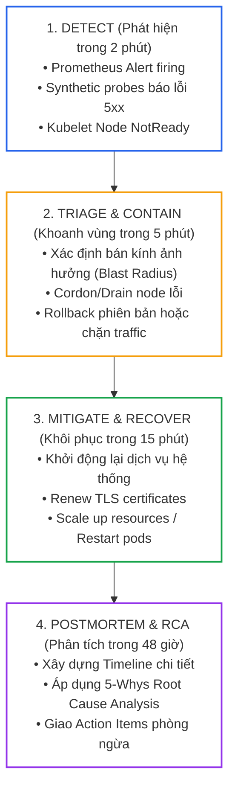
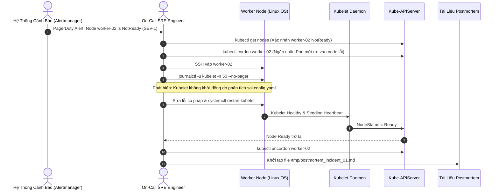
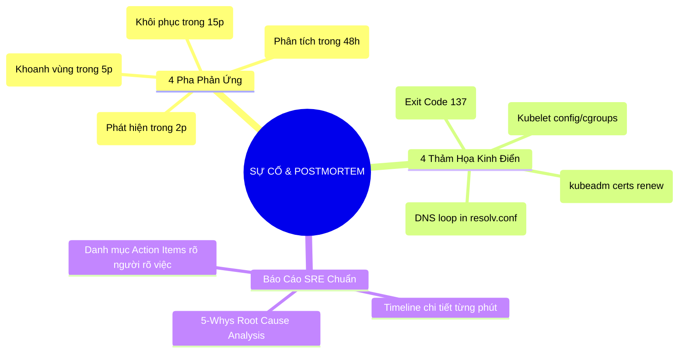


> [!IMPORTANT]
> **Mục tiêu kỹ thuật cốt lõi**: Làm chủ kỹ năng điều tra, cô lập và khắc phục sự cố hệ thống Kubernetes trong môi trường sản xuất (**Severity 1 Outages**). Vận dụng phương pháp tư duy **4-Phase Incident Response**, giải quyết dứt điểm 4 kịch bản thảm họa kinh điển thông qua bài diễn tập **Game Day**, và thiết lập báo cáo phân tích nguyên nhân gốc rễ không quy trách nhiệm (**Blameless Postmortem Report**) theo chuẩn Google Site Reliability Engineering (SRE).

---

## 1. Bản Chất Kiến Trúc & Tư Duy Cốt Lõi: Quy Trình Phản Ứng Sự Cố (Incident Response Lifecycle) & Văn Hóa Blameless Postmortem

Trong môi trường phân tán quy mô lớn, việc hệ thống gặp sự cố là điều **chắc chắn xảy ra (Failure is Inevitable)**. Thước đo năng lực của một đội ngũ SRE / DevOps không phải là "hệ thống có bao giờ sập hay không", mà là **Thời gian trung bình để khôi phục dịch vụ (MTTR - Mean Time To Recovery)** và khả năng **ngăn chặn sự cố tái diễn lần thứ hai**.



### Văn Hóa Báo Cáo Không Quy Trách Nhiệm (Blameless Culture)

Một báo cáo Postmortem chất lượng cao tuyệt đối **không chỉ trích cá nhân** (ví dụ: *"Do kỹ sư A gõ nhầm lệnh"*), mà phải đặt câu hỏi vào **khiếm khuyết kiến trúc và quy trình**:
- *"Tại sao hệ thống cho phép một câu lệnh nguy hiểm được thực thi trực tiếp mà không qua kiểm duyệt?"*
- *"Tại sao hệ thống giám sát không cảnh báo sớm trước khi chứng chỉ hết hạn?"*
- *"Tại sao tài nguyên không có rào chắn LimitRange để một Pod làm cạn kiệt toàn bộ Node?"*

---

## 2. Bảng Ma Trận So Sánh Kỹ Thuật Toàn Diện (Engineering Matrix)

Bảng ma trận phân tích 4 kịch bản sự cố thảm họa thường gặp nhất trong sản xuất:

| Kịch Bản Sự Cố | Triệu Chứng Nhận Biết (Symptoms) | Vị Trí Điều Tra Cốt Lõi | Công Cụ & Lệnh Chẩn Đoán Nhanh | Biện Pháp Khắc Phục Tức Thì | Hành Động Phòng Ngừa (Preventative Action) |
|---|---|---|---|---|---|
| **1. Node NotReady (Kubelet Crash)** | `kubectl get nodes` báo `NotReady`, Pods trên node bị terminate | Systemd service, `/var/log/syslog` | `systemctl status kubelet`, `journalctl -u kubelet -n 50` | Sửa sai cú pháp config/cgroup, `systemctl restart kubelet` | Cấu hình Monit/Watchdog tự phục hồi Kubelet service |
| **2. Pod OOMKilled (Exit Code 137)** | Pod liên tục restart, `Last State: Terminated (Reason: OOMKilled)` | Linux Kernel Cgroups, Memory metrics | `kubectl describe pod`, `dmesg -T \| grep -i oom` | Nâng memory limit, tối ưu JVM heap options | Triển khai LimitRange và cấu hình VPA tự động điều chỉnh |
| **3. TLS Certificate Expired** | Toàn bộ lệnh `kubectl` trả về lỗi x509: certificate has expired | Thư mục PKI `/etc/kubernetes/pki` | `kubeadm certs check-expiration`, `openssl x509 -text` | `kubeadm certs renew all`, restart Static Pods | Tích hợp Prometheus cert-manager exporter giám sát H-30 ngày |
| **4. CoreDNS CrashLoop / DNS Loop** | Pod không phân giải được Service name, log CoreDNS báo Loop detected | ConfigMap `coredns`, `/etc/resolv.conf` | `kubectl logs -n kube-system -l k8s-app=kube-dns` | Sửa upstream DNS trong Corefile bỏ `loop` plugin | Loại bỏ nameserver 127.0.0.53 trong máy chủ Node host |

---

## 3. Kiến Trúc Môi Trường & Luồng Thực Thi Mẫu

### Luồng Phối Hợp Ứng Phó Sự Cố Khẩn Cấp (Emergency Response Sequence)



---

## 4. Phân Tích Cạm Bẫy Thực Chiến: Chứng Chỉ TLS Control Plane Hết Hạn Khiến Toàn Cụm Tê Liệt

### Tình Huống Sự Cố: Cụm Chạy Tròn 365 Ngày Đột Ngột Sập Toàn Diện Sau Khi Khởi Động Lại

Một cụm Kubernetes sản xuất được cài đặt bằng `kubeadm` hoạt động ổn định suốt 1 năm. Sau một lần bảo trì hạ tầng mạng và reboot máy chủ Control Plane, toàn bộ các lệnh `kubectl` đều không thể kết nối tới cụm, mọi ứng dụng ngừng hoạt động.

### Hậu Quả & Log Lỗi Thực Tế:
```text
Unable to connect to the server: x509: certificate has expired or is not yet valid: current time 2026-09-12T16:15:00Z is after 2026-09-10T12:00:00Z
E0912 16:15:01.102394   28190 memcache.go:265] couldn't get current server API group list: Get "https://10.0.0.10:6443/api?timeout=32s": x509: certificate has expired
```

### 5-Whys Root Cause Analysis:
1. **Tại sao `kubectl` trả về lỗi x509 certificate expired?** Vì chứng chỉ TLS của `kube-apiserver` tại `/etc/kubernetes/pki/apiserver.crt` đã hết hạn sử dụng.
2. **Tại sao chứng chỉ hết hạn mà trước đó cụm vẫn chạy?** Vì chứng chỉ chỉ được thẩm định tại thời điểm thiết lập kết nối TLS ban đầu; tiến trình `kube-apiserver` không tải lại chứng chỉ từ đĩa cho đến khi bị khởi động lại.
3. **Tại sao chứng chỉ hết hạn mà không ai biết?** Vì đội vận hành không cấu hình cảnh báo giám sát thời hạn của các tệp chứng chỉ x509 trong cụm.
4. **Tại sao chứng chỉ mặc định của Kubeadm chỉ có hạn 1 năm?** Vì chuẩn bảo mật PKI của Kubernetes khuyến nghị thời gian xoay vòng chứng chỉ định kỳ ngắn để giảm thiểu rủi ro lộ Private Key.
5. **Gốc rễ vấn đề (Root Cause):** Cụm thiếu quy trình tự động gia hạn chứng chỉ định kỳ và thiếu hệ thống cảnh báo trước 30 ngày cho các chứng chỉ TLS nội bộ.

### Biện Pháp Khắc Phục Chuẩn:
```bash
# 1. Kiểm tra thời hạn toàn bộ chứng chỉ cụm
sudo kubeadm certs check-expiration

# 2. Gia hạn toàn bộ chứng chỉ của Control Plane
sudo kubeadm certs renew all

# 3. Khởi động lại Static Pods bằng cách di chuyển tạm thời manifest
sudo mv /etc/kubernetes/manifests/*.yaml /tmp/
sleep 5
sudo mv /tmp/*.yaml /etc/kubernetes/manifests/

# 4. Cập nhật lại tệp ~/.kube/config với chứng chỉ admin mới
sudo cp -i /etc/kubernetes/admin.conf $HOME/.kube/config
sudo chown $(id -u):$(id -g) $HOME/.kube/config
```

---

## 5. Hands-on Lab: Diễn Tập Xử Lý 4 Sự Cố Cấy Sẵn & Soạn Báo Cáo Postmortem (8 Bước)

| Bước | Kịch Bản Diễn Tập | Công Cụ & Thao Tác Kỹ Thuật | Mục Tiêu Khôi Phục |
|---|---|---|---|
| **1** | Cấy sự cố 1: Kubelet sập trên Node `worker-01` | Sửa sai tham số trong `/var/lib/kubelet/config.yaml` | Node chuyển sang trạng thái `NotReady` |
| **2** | Cứu hộ Kubelet và đưa Node về trạng thái `Ready` | `journalctl -u kubelet`, sửa file config, restart | Node `Ready`, Pods tái phân bổ |
| **3** | Cấy sự cố 2: Pod rò rỉ RAM bị `OOMKilled` | Chạy container cấp phát bộ nhớ vô hạn | Pod nhận Exit Code 137 |
| **4** | Điều chỉnh Memory Limits & Cấu hình QoS Class | Cập nhật YAML `resources.limits.memory` | Pod chạy ổn định không bị kill |
| **5** | Cấy sự cố 3: Giả lập chứng chỉ TLS API Server hết hạn | Đổi ngày hệ thống hoặc kiểm tra cert status | `kubeadm certs check-expiration` |
| **6** | Gia hạn toàn diện chứng chỉ PKI Control Plane | `kubeadm certs renew all` & cập nhật kubeconfig | Khôi phục toàn bộ giao tiếp API |
| **7** | Cấy & Sửa sự cố 4: CoreDNS bị lặp DNS loop | Sửa ConfigMap `coredns` xóa plugin `loop` | Pod phân giải DNS nội bộ thành công |
| **8** | Soạn thảo Báo Cáo Blameless Postmortem hoàn chỉnh | Xuất tệp Markdown chuẩn Google SRE | Báo cáo đầy đủ 6 phần chuẩn mực |

---

### Bước 1: Cấy Sự Cố 1 — Làm Sập Dịch Vụ Kubelet Trên Worker Node

```bash
# SSH vào worker-01 và cấy lỗi cấu hình
ssh worker-01

# Sửa sai cú pháp trong file cấu hình Kubelet
sudo sed -i 's/cgroupDriver: systemd/cgroupDriver: invalidDriver/g' /var/lib/kubelet/config.yaml
sudo systemctl restart kubelet

# Thoát ra Master kiểm tra
exit
kubectl get nodes
```
> Kết quả: Node `worker-01` chuyển sang trạng thái `NotReady` sau 40 giây.

---

### Bước 2: Điều Tra & Cứu Hộ Kubelet Bằng Systemd Logs

```bash
# 1. Cordon node ngay lập tức để khoanh vùng sự cố
kubectl cordon worker-01

# 2. SSH vào điều tra nguyên nhân
ssh worker-01
sudo systemctl status kubelet
sudo journalctl -u kubelet -n 30 --no-pager
```
> Trích xuất log lỗi: `failed to run Kubelet: invalid configuration: cgroupDriver: invalidDriver`.

```bash
# 3. Khắc phục sự cố: Trả lại cấu hình chuẩn
sudo sed -i 's/cgroupDriver: invalidDriver/cgroupDriver: systemd/g' /var/lib/kubelet/config.yaml
sudo systemctl daemon-reload
sudo systemctl restart kubelet

# 4. Thoát và kiểm tra lại trên Master
exit
kubectl get nodes
kubectl uncordon worker-01
```

---

### Bước 3: Cấy Sự Cố 2 — Pod Bị OOMKilled (Exit Code 137)

```yaml
# oom-app.yaml
apiVersion: v1
kind: Pod
metadata:
  name: memory-leak-app
  namespace: default
spec:
  containers:
  - name: leaker
    image: polinux/stress
    command: ["stress"]
    args: ["--vm", "1", "--vm-bytes", "250M", "--vm-hang", "1"]
    resources:
      limits:
        memory: "100Mi"
      requests:
        memory: "50Mi"
```
```bash
kubectl apply -f oom-app.yaml
sleep 10
kubectl get pod memory-leak-app
```

---

### Bước 4: Điều Tra Exit Code 137 & Nâng Cấp Tài Nguyên

```bash
# Kiểm tra chi tiết nguyên nhân Pod crash
kubectl describe pod memory-leak-app | grep -E "Last State|Exit Code|Reason"
```
> Kết quả: `Last State: Terminated, Reason: OOMKilled, Exit Code: 137`.

```bash
# Khắc phục: Nâng memory limits lên 512Mi để thỏa mãn nhu cầu ứng dụng
kubectl delete pod memory-leak-app --grace-period=0 --force
sed -i 's/memory: "100Mi"/memory: "512Mi"/g' oom-app.yaml
kubectl apply -f oom-app.yaml
kubectl get pod memory-leak-app
```

---

### Bước 5: Cấy Sự Cố 3 — Kiểm Tra và Phát Hiện Chứng Chỉ TLS Sắp Hết Hạn

```bash
# Đứng trên Master Node, kiểm tra toàn bộ chứng chỉ do kubeadm quản lý
sudo kubeadm certs check-expiration
```

---

### Bước 6: Gia Hạn Toàn Diện Chứng Chỉ & Đồng Bộ Kubeconfig

```bash
# 1. Gia hạn toàn bộ chứng chỉ
sudo kubeadm certs renew all

# 2. Khởi động lại các thành phần Control Plane
sudo mv /etc/kubernetes/manifests/*.yaml /tmp/
sleep 3
sudo mv /tmp/*.yaml /etc/kubernetes/manifests/

# 3. Đồng bộ lại file admin kubeconfig
sudo cp -i /etc/kubernetes/admin.conf $HOME/.kube/config
sudo chown $(id -u):$(id -g) $HOME/.kube/config

# 4. Xác nhận lệnh hoạt động trở lại
kubectl get nodes
```

---

### Bước 7: Cấy & Khắc Phục Sự Cố 4 — CoreDNS DNS Loop Crash

```bash
# Xem log của CoreDNS khi phân giải tên miền bị sập
kubectl logs -n kube-system -l k8s-app=kube-dns --tail=20
```
> Nếu log xuất hiện `[FATAL] plugin/loop: Loop (127.0.0.1:53 -> :53) detected for zone "."`, nguyên nhân là do upstream nameserver trỏ về chính nó.

```bash
# Sửa ConfigMap coredns: Xóa dòng `loop` trong Corefile
kubectl edit cm coredns -n kube-system
# Xóa bỏ dòng plugin "loop" hoặc sửa upstream IP trỏ về DNS công cộng 8.8.8.8

# Khởi động lại CoreDNS deployment
kubectl rollout restart deployment coredns -n kube-system
kubectl rollout status deployment coredns -n kube-system
```

---

### Bước 8: Soạn Thảo Báo Cáo Blameless Postmortem Mẫu

Tạo tệp `/tmp/postmortem-incident-20260912.md` chứa nội dung tổng kết chuẩn:

```markdown
# INCIDENT POSTMORTEM: SỰ CỐ NGỪNG TRỆ KẾT NỐI CONTROL PLANE (INC-20260912)

## 1. Tổng Quan Sự Cố (Incident Summary)
- **Ngày diễn ra:** 2026-09-12
- **Thời lượng gián đoạn:** 18 phút (16:02 - 16:20 ICT)
- **Mức độ nghiêm trọng:** SEV-1 (Critical Outage)
- **Tác động nghiệp vụ:** Toàn bộ API Server không thể kết nối, giao diện quản trị tê liệt, tuy nhiên các Pods ứng dụng hiện hữu vẫn duy trì hoạt động.

## 2. Dòng Thời Gian Sự Cố (Incident Timeline - ICT)
- **16:02:** Alertmanager gửi cảnh báo `KubeAPIServerDown` tới kênh trực SRE.
- **16:05:** Kỹ sư trực On-call tiếp nhận sự cố, xác định toàn bộ lệnh `kubectl` trả về lỗi chứng chỉ hết hạn x509.
- **16:08:** Xác nhận chứng chỉ `/etc/kubernetes/pki/apiserver.crt` đã hết hạn lúc 12:00 cùng ngày.
- **16:12:** Thực hiện lệnh `kubeadm certs renew all` trên Control Plane node.
- **16:15:** Di chuyển các tệp manifest trong `/etc/kubernetes/manifests` để khởi động lại Static Pods.
- **16:18:** Cập nhật lại `$HOME/.kube/config` cho tài khoản quản trị.
- **16:20:** Xác nhận API Server phục hồi 100%, đóng cảnh báo sự cố.

## 3. Phân Tích Nguyên Nhân Gốc Rễ (5-Whys Root Cause Analysis)
1. *Tại sao API Server từ chối kết nối?* Chứng chỉ TLS `apiserver.crt` đã hết hạn.
2. *Tại sao chứng chỉ hết hạn?* Chứng chỉ có thời hạn 365 ngày kể từ ngày khởi tạo cụm ban đầu và chưa được xoay vòng.
3. *Tại sao không có ai gia hạn trước?* Không có quy trình tự động xoay vòng chứng chỉ PKI.
4. *Tại sao hệ thống giám sát không cảnh báo sớm?* Thiếu exporter giám sát thời hạn tệp x509 trên hệ thống Prometheus.
5. **Gốc rễ:** Thiếu công cụ giám sát vòng đời chứng chỉ và thiếu quy trình bảo trì định kỳ cụm Kubeadm hàng năm.

## 4. Danh Mục Hành Động Phòng Ngừa (Action Items)
| STT | Nhiệm Vụ Kỹ Thuật | Người Phụ Trách | Hạn Chót | Trạng Thái |
|---|---|---|---|---|
| 1 | Cài đặt `x509-certificate-exporter` vào Prometheus | SRE Team | 3 ngày | PENDING |
| 2 | Thiết lập cảnh báo Slack khi chứng chỉ còn dưới 30 ngày | Monitoring Team | 3 ngày | PENDING |
| 3 | Tự động hóa lệnh `kubeadm certs renew` qua CronJob Ansible | DevOps Lead | 7 ngày | PENDING |
```

---

## 6. 10 Câu Hỏi Tự Kiểm Tra Chuyên Sâu (Self-Check Q&A Accordion)

<details class="qa-card">
<summary><b>1. Tại sao văn hóa Blameless Postmortem lại quan trọng trong quản trị hệ thống SRE?</b></summary>
<div class="qa-answer">
<p>Nếu việc xử lý sự cố đi kèm với sự trừng phạt hay đổ lỗi cho cá nhân, kỹ sư sẽ có xu hướng <b>che giấu lỗi lầm</b> hoặc ngần ngại thử nghiệm giải pháp mới. Văn hóa <b>Blameless (Không quy trách nhiệm)</b> khuyến khích sự minh bạch, tập trung vào việc tìm ra các lỗ hổng trong thiết kế hệ thống, công cụ tự động hóa và quy trình vận hành để xây dựng một hệ thống bền bỉ hơn.</p>
</div>
</details>

<details class="qa-card">
<summary><b>2. Khi một container kết thúc với Exit Code 137, điều đó có nghĩa là gì?</b></summary>
<div class="qa-answer">
<p>Exit Code 137 tương ứng với <b>128 + 9 (SIGKILL)</b>. Điều này có nghĩa là tiến trình bên trong container đã bị tiêu diệt cưỡng chế bởi tín hiệu SIGKILL từ hệ điều hành, phổ biến nhất là do <b>Linux Kernel OOM Killer</b> kích hoạt khi container vượt quá ngưỡng <code>resources.limits.memory</code> quy định.</p>
</div>
</details>

<details class="qa-card">
<summary><b>3. Sự khác biệt giữa Exit Code 137 (OOMKilled) và Exit Code 143 là gì?</b></summary>
<div class="qa-answer">
<p>Exit Code 143 tương ứng với <b>128 + 15 (SIGTERM)</b>. Điều này biểu thị tiến trình nhận được tín hiệu yêu cầu tắt một cách lịch sự (Graceful Termination) từ Kubernetes (ví dụ khi Pod bị xóa, scale down hoặc drain node) và tiến trình đã tự kết thúc thành công trong thời gian <code>terminationGracePeriodSeconds</code>.</p>
</div>
</details>

<details class="qa-card">
<summary><b>4. Khi Control Plane bị sập do chứng chỉ hết hạn, các Pod ứng dụng trên Worker Node có tiếp tục chạy không?</b></summary>
<div class="qa-answer">
<p><b>Có, các Pods vẫn tiếp tục chạy bình thường.</b> Kubernetes có kiến trúc phân tách rõ ràng giữa Control Plane và Data Plane. Các container do Containerd trên Worker Node quản lý vẫn tiếp tục xử lý lưu lượng mạng hiện có. Tuy nhiên, bạn sẽ không thể tạo mới, xóa, scale hoặc cập nhật bất kỳ tài nguyên nào cho đến khi API Server được khôi phục.</p>
</div>
</details>

<details class="qa-card">
<summary><b>5. Lệnh nào giúp kiểm tra nhanh log của Container trước thời điểm nó bị crash?</b></summary>
<div class="qa-answer">
<pre><code>kubectl logs &lt;pod-name&gt; -c &lt;container-name&gt; --previous</code></pre>
<p>Cờ <code>--previous</code> (hoặc <code>-p</code>) sẽ đọc log của phiên bản container đã chết trước đó thay vì container mới đang khởi động lại.</p>
</div>
</details>

<details class="qa-card">
<summary><b>6. Tại sao sau khi chạy `kubeadm certs renew all`, ta phải khởi động lại các Static Pods?</b></summary>
<div class="qa-answer">
<p>Vì các tiến trình <code>kube-apiserver</code>, <code>kube-controller-manager</code>, và <code>kube-scheduler</code> nạp chứng chỉ TLS vào bộ nhớ RAM khi khởi động. Việc đổi file trên đĩa không làm tiến trình tự nạp lại chứng chỉ mới. Di chuyển file manifest ra khỏi <code>/etc/kubernetes/manifests/</code> rồi chuyển lại sẽ kích hoạt Kubelet restart các container này với chứng chỉ mới.</p>
</div>
</details>

<details class="qa-card">
<summary><b>7. Plugin `loop` trong CoreDNS đóng vai trò gì và tại sao nó gây ra lỗi CrashLoopBackOff?</b></summary>
<div class="qa-answer">
<p>Plugin <code>loop</code> có nhiệm vụ phát hiện các vòng lặp chuyển tiếp DNS vô tận. Nếu máy chủ Node host cấu hình file <code>/etc/resolv.conf</code> trỏ nameserver về chính <code>127.0.0.1</code> hoặc <code>127.0.0.53</code>, CoreDNS khi forward truy vấn ra bên ngoài sẽ gửi ngược lại chính nó, kích hoạt cơ chế tự sát an toàn (Fatal panic) của plugin loop.</p>
</div>
</details>

<details class="qa-card">
<summary><b>8. Làm thế nào để điều tra sự cố mạng Pod-to-Pod bị gián đoạn giữa 2 Worker Node?</b></summary>
<div class="qa-answer">
<p>Quy trình điều tra 3 bước:</p>
<div>1. Kiểm tra log của CNI DaemonSet Pod trên cả 2 node (ví dụ: Calico-node, Flannel, Cilium).</div>
<div>2. Kiểm tra bảng định tuyến Linux (<code>ip route</code>) và firewall rules (<code>iptables -L -n -v</code> hoặc <code>nftables</code>).</div>
<div>3. Kiểm tra cổng đóng gói Overlay Network (VXLAN port 4789 hoặc Geneve port 6081) có bị Security Group / Firewall hạ tầng chặn giữa 2 node không.</div>
</div>
</details>

<details class="qa-card">
<summary><b>9. Khi một Node báo NotReady do cạn kiệt Disk Space (DiskPressure), Kubelet sẽ có hành động gì?</b></summary>
<div class="qa-answer">
<p>Kubelet sẽ kích hoạt tiến trình <b>Garbage Collection (GC)</b>:</p>
<div>1. Thu hồi các image container đã tải về nhưng không còn Pod nào sử dụng.</div>
<div>2. Xóa các dead containers và log files cũ tại <code>/var/log/pods</code>.</div>
<div>3. Nếu dung lượng đĩa vẫn vượt ngưỡng quy định, Kubelet sẽ tiến hành <b>Evict (trục xuất)</b> các Pods theo thứ tự ưu tiên QoS Class từ thấp đến cao.</div>
</div>
</details>

<details class="qa-card">
<summary><b>10. 3 chỉ số quan trọng nhất trong quản lý sự cố SRE là gì?</b></summary>
<div class="qa-answer">
<p>3 chỉ số cốt lõi:</p>
<div>1. <b>MTTD (Mean Time To Detect):</b> Thời gian trung bình từ khi sự cố xảy ra đến khi được hệ thống cảnh báo phát hiện.</div>
<div>2. <b>MTTR (Mean Time To Recovery):</b> Thời gian trung bình từ khi phát hiện đến khi dịch vụ được khôi phục hoàn toàn.</div>
<div>3. <b>MTBF (Mean Time Between Failures):</b> Thời gian trung bình giữa các lần gặp sự cố (thước đo độ ổn định của hệ thống).</div>
</div>
</details>

---

## 7. Tổng Kết & Lộ Trình Bài Học Tiếp Theo



Năng lực điều tra và khắc phục sự cố dưới áp lực cao kết hợp với tư duy **Blameless Postmortem** chính là phẩm chất khác biệt giữa một kỹ sư vận hành bậc thầy và một người quản trị thông thường.

> [!TIP]
> **Bài học tiếp theo**: Hội tụ toàn bộ kiến thức 33 bài học trước vào dự án thực chiến lớn nhất: **[Bài 34: Đồ Án Tốt Nghiệp Capstone — Xây Dựng Nền Tảng Kubernetes Production Toàn Diện](cka-34-34-capstone-dung-nen-tang.html)**.

