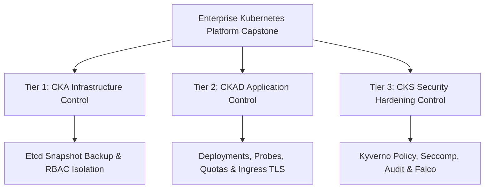
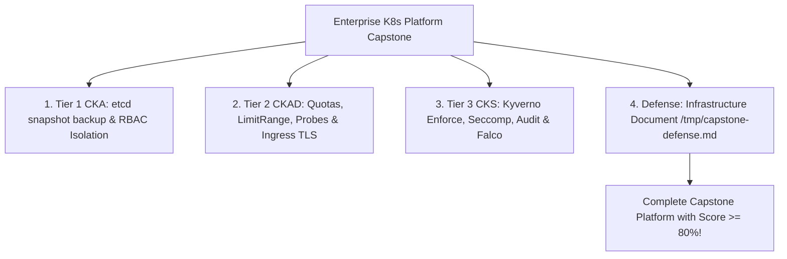


# [BÀI 34] CAPSTONE HẠ TẦNG: XÂY DỰNG NỀN TẢNG KUBERNETES DOANH NGHIỆP TÍCH HỢP ĐỦ 3 LỚP BẢO VỆ & QUẢN TRỊ

Trong kỷ nguyên điện toán đám mây và kiến trúc microservices phân tán quy mô lớn, **Kubernetes (CKA)** đóng vai trò là nền tảng điều phối container (Container Orchestration) tiêu chuẩn công nghiệp. Để làm chủ hệ thống trong môi trường sản xuất (Production) cũng như chinh phục kỳ thi chứng chỉ quốc tế của Linux Foundation / CNCF, kỹ sư không chỉ nắm vững các câu lệnh thao tác cơ bản mà phải thấu hiểu sâu sắc bản chất cơ chế tầng thấp: từ chu trình điều hòa (Reconciliation Loop), cấu trúc điều phối tài nguyên, kiến trúc mạng CNI, lưu trữ CSI cho đến các chuẩn mực an ninh phòng thủ chiều sâu.

Bài viết chuyên sâu này sẽ đồng hành cùng bạn giải mã toàn diện bức tranh kiến trúc, phân tích các đánh đổi kỹ thuật thực chiến (Engineering Trade-offs), cung cấp bài thực hành Lab từng bước và bộ câu hỏi phỏng vấn chuẩn Architect / Lead Engineer.

---

## 1. Bản Chất Kiến Trúc & Cơ Chế Vận Hành Tầng Thấp

| # | Câu hỏi ôn tập | Đáp án chuẩn ngắn gọn |
|---|---|---|
| 1 | 4 sự cố cấy sẵn Game Day? | **Node NotReady, OOMKilled, Expired Certs, CoreDNS** |
| 2 | Quy trình ứng phó sự cố 4 bước? | **Detect -> Contain -> Remediate -> Review** |
| 3 | Lệnh soi log Kubelet crash? | Lệnh **`journalctl -u kubelet -n 50 --no-pager`** |
| 4 | Lệnh gia hạn certs TLS Kubeadm? | Lệnh **`sudo kubeadm certs renew all`** |
| 5 | 6 phần báo cáo Postmortem? | **Summary, Impact, RCA, Timeline, Lessons, Action Items** |


> **"Dự án Capstone dựng nền tảng Kubernetes Doanh nghiệp hoàn chỉnh (Enterprise Kubernetes Platform Capstone) tích hợp đầy đủ 3 lớp kiểm soát (Kiến trúc cụm CKA, Phát triển ứng dụng CKAD, và Bảo mật nâng cao CKS) là minh chứng năng lực thực chiến cao nhất của chuyên gia Kubernetes, đòi hỏi kiến trúc sư phải tự tay khởi tạo hệ thống đa thành phần (sao lưu etcdctl, phân quyền RBAC cách ly, định ngạch ResourceQuota, phong tỏa mạng NetworkPolicy, kiểm soát kho ảnh Kyverno, giám sát nhật ký Audit Logging và bắt độc hại Falco); bảo vệ thành công các quyết định thiết kế kiến trúc trước hội đồng chuyên môn; đồng thời vận hành ổn định nền tảng sản xuất với tiêu chuẩn an ninh tuyệt đối."**

**Kết quả từ các buổi trước được sử dụng lại:**

| Kết quả / Công cụ | Buổi + số hiệu `QT` | Dùng ở đâu trong buổi này |
|---|---|---|
| Hợp nhất kiến thức CKA (Cluster & etcd) | Buổi 08, 14, 66 `QT 4.1` | Dựng Lớp Kiểm soát 1: Kiến trúc cụm & Hạ tầng CKA |
| Hợp nhất kiến thức CKAD (Workloads & Config) | Buổi 21, 22, 67 `QT 4.1` | Dựng Lớp Kiểm soát 2: Triển khai & Vận hành Ứng dụng CKAD |
| Hợp nhất kiến thức CKS (Hardening & Runtime) | Buổi 52, 63, 68 `QT 4.1` | Dựng Lớp Kiểm soát 3: Gia cố & Bảo mật Nâng cao CKS |

---


| # | Kỹ năng thực hiện được | Hiện vật chứng minh |
|---|---|---|
| 1 | Xây dựng bản sơ đồ kiến trúc tổng thể Capstone 3 lớp kiểm soát | Tệp giải trình kiến trúc `/tmp/capstone-defense.md` |
| 2 | Triển khai Lớp Kiểm soát 1 (CKA): etcd backup & RBAC Namespace isolation | Tệp `etcd-capstone.db` và RBAC Role/RoleBinding |
| 3 | Triển khai Lớp Kiểm soát 2 (CKAD): ResourceQuota, LimitRange, Probes & Ingress TLS | Tệp YAML Deployment, Service, Ingress, Quota |
| 4 | Triển khai Lớp Kiểm soát 3 (CKS): Kyverno, Seccomp, Audit Logging & Falco Rules | Tệp Kyverno ClusterPolicy, Audit Policy, Falco Rule |
| 5 | Bảo vệ luận điểm thiết kế kiến trúc Capstone trước hội đồng chuyên môn | Bảng điểm tự động Capstone đạt PASS >= 80/100đ |

---


| Kiến thức tiên quyết | Nguồn tự học nếu thiếu |
|---|---|
| Hợp nhất kiến thức CKA Kiến trúc & Hạ tầng | Buổi 66 (`QT 4.1`) |
| Hợp nhất kiến thức CKAD Phát triển Ứng dụng | Buổi 67 (`QT 4.1`) |
| Hợp nhất kiến thức CKS Bảo mật Nâng cao | Buổi 68 (`QT 4.1`) |

---


### 3.1. Thuật ngữ Việt–Anh

| # | Thuật ngữ tiếng Việt | Tiếng Anh tương đương | Ghi chú chuẩn hoá trong thân bài |
|---|---|---|---|
| 1 | Dự án hạ tầng tổng hợp | Capstone Infrastructure Project | Dự án xây dựng nền tảng K8s tích hợp đủ 3 lớp kiểm soát |
| 2 | Ba lớp kiểm soát an ninh | 3-Tier Governance Control | 3 lớp: Kiến trúc CKA, Ứng dụng CKAD, và Bảo mật CKS |
| 3 | Khung thiết kế kiến trúc | Architectural Blueprint | Bản vẽ tổng thể mối liên kết giữa các thành phần cụm |
| 4 | Bảo vệ thiết kế kiến trúc | Architecture Defense | Buổi trình bày giải trình các quyết định thiết kế trước hội đồng |
| 5 | Tự động hóa tích hợp hạ tầng | End-to-End Platform Integration | Khả năng vận hành đồng thời etcd, RBAC, Kyverno, Falco |
| 6 | Kiểm định tính sẵn sàng sản xuất | Production Readiness Audit | Bài kiểm thử toàn diện khả năng chịu tải và bảo mật cụm |
| 7 | Tiêu chuẩn hạ tầng doanh nghiệp | Enterprise Platform Standard | Bộ quy chuẩn an ninh và vận hành Kubernetes cấp tập đoàn |
| 8 | Hồ sơ thiết kế hạ tầng | Infrastructure Design Document | Tệp tài liệu giải trình chi tiết sơ đồ kiến trúc Capstone |
| 9 | Bảng đánh giá của hội đồng | Review Board Evaluation | Bảng chấm điểm thiết kế Capstone của các chuyên gia |
| 10 | Điểm chốt kiểm soát an ninh | Security Control Checkpoint | Vị trí đặt rào chắn an ninh (Kyverno, Audit, Falco) |
| 11 | Kiến trúc sư hệ thống đám mây | Cloud Native Systems Architect | Vai trò người thiết kế và chịu trách nhiệm chính về cụm |
| 12 | Bản kê khai tài nguyên Capstone | Capstone Resource Manifest | Bộ tệp YAML tổng hợp triển khai nền tảng Capstone |
| 13 | Bảng ghi điểm tự động Capstone | Capstone Auto-Grading Script | Script kiểm tra tính toàn vẹn 3 lớp kiểm soát Capstone |
| 14 | Tốc độ triển khai nền tảng | Platform Deployment Speed | Chỉ số thời gian dựng trọn vẹn cụm Capstone dưới 120m |


Mô hình Dựng Tòa Tháp Trung Tâm Thương Mại Đa Năng 100 Tầng (100-Story Enterprise Mixed-Use Tower): Dự án Capstone Buổi 71 là Nơi Hợp Nhất Toàn Bộ Tri Thức Từ CKA, CKAD Tới CKS Thành Một Công Trình Hạ Tầng Hoàn Chỉnh. Nền tảng Kubernetes Capstone giống như Tòa Tháp Đa Năng 100 Tầng: Lớp Kiểm soát 1 (CKA) chính là Khung Móng Bê Tông Cốt Thép Vững Chắc (`kubeadm`, `etcd backup`, `Kubelet`), Lớp Kiểm soát 2 (CKAD) chính là Hệ Thống Căn Hộ Vận Hành Tiện Nghi (`Pods`, `Deployments`, `CronJobs`, `Probes`, `ConfigMaps`), và Lớp Kiểm soát 3 (CKS) chính là Hệ Thống An Ninh Thắt Chặt Tối Tân (`AppArmor`, `Seccomp`, `Kyverno`, `Audit Policy`, `Falco`). Người kiến trúc sư không chỉ dựng từng mảng riêng lẻ mà phải Hợp Nhất Cả 3 Lớp Kiểm Soát Hoạt Động Trơn Tru Đồng Thời. `Buổi Bảo Vệ Thiết Kế (Architecture Defense)` giống như Việc Kiến Trúc Trưởng Thuyết Minh Bản Vẽ Trước Hội Đồng Giám Định Xây Dựng: giải trình thuyết phục vì sao chọn vị trí đặt rào chắn an ninh này, và chứng minh công trình chịu được mọi giông bão thực tế.

---

### 1.1. Thiết kế Kiến trúc Capstone 3 Lớp Kiểm soát (3-Tier Governance Architecture) (12 phút)

**Nguyên lý cốt lõi:** Tất cả học viên BẮT BUỘC phải hoàn thành dự án Capstone tích hợp trọn vẹn 3 lớp kiểm soát (Kiến trúc CKA, Ứng dụng CKAD, và Bảo mật CKS) trước khi tốt nghiệp khóa học.

**Giải thích cơ chế ngầm:** Giúp học viên hợp nhất 100% kiến thức lý thuyết và kỹ năng thực hành từ 70 buổi học trước đó thành một sản phẩm hạ tầng hoàn chỉnh cấp doanh nghiệp.

> [!WARNING]
> **CẠM BẪY THỰC CHIẾN:**
> Chỉ dựng ứng dụng đơn lẻ mà không có rào chắn bảo mật hoặc etcd backup.

**Minh hoạ.**



**Nguyên lý cốt lõi:** Hiểu rõ kiến trúc 3 lớp kiểm soát Capstone: Lớp 1 - Kiến trúc cụm CKA (25%), Lớp 2 - Vận hành ứng dụng CKAD (35%), Lớp 3 - Bảo mật nâng cao CKS (40%).

**Giải thích cơ chế ngầm:** Giúp phân bổ hợp lý các thành phần hạ tầng và đảm bảo tính cân bằng giữa tính năng vận hành và tiêu chuẩn an ninh thắt chặt.

> [!WARNING]
> **CẠM BẪY THỰC CHIẾN:**
> Tập trung 100% vào việc chạy app mà bỏ qua các chính sách an ninh Lớp 3 CKS.

**Minh hoạ.**

```yaml
# Ma trận phân bổ 3 Lớp Kiểm soát Capstone:
# - Tier 1: CKA Cluster Architecture & Infrastructure (25%)
# - Tier 2: CKAD Application Development & Delivery (35%)
# - Tier 3: CKS Security Hardening & Runtime Defense (40%)
```

---

### 1.2. Tích hợp Đồng thời các Thành phần Hạ tầng, Ứng dụng và Bảo mật Nâng cao (12 phút)

**Nguyên lý cốt lõi:** Trong Lớp Kiểm soát 1 (CKA), BẮT BUỘC phải triển khai etcd snapshot backup tự động và phân quyền RBAC `Role/RoleBinding` cách ly theo từng Namespace.

**Giải thích cơ chế ngầm:** Bảo vệ cơ sở dữ liệu cụm khỏi rủi ro mất mát dữ liệu và ngăn chặn nguy cơ leo thang đặc quyền giữa các Namespace.

> [!WARNING]
> **CẠM BẪY THỰC CHIẾN:**
> Quên tạo etcd backup hoặc cấp quyền `cluster-admin` cho tài khoản ứng dụng.

**Minh hoạ.**

```bash
# Lớp 1 (CKA) Integration:
ETCDCTL_API=3 etcdctl snapshot save /tmp/capstone/etcd-capstone.db \
  --cacert=/etc/kubernetes/pki/etcd/ca.crt \
  --cert=/etc/kubernetes/pki/etcd/server.crt \
  --key=/etc/kubernetes/pki/etcd/server.key
```

**Nguyên lý cốt lõi:** Trong Lớp Kiểm soát 2 (CKAD), LUÔN LUÔN cấu hình bộ đôi `livenessProbe` & `readinessProbe`, nạp biến qua `envFrom`, và thiết lập `ResourceQuota` / `LimitRange`.

**Giải thích cơ chế ngầm:** Đảm bảo ứng dụng khởi chạy ổn định, tự động khôi phục khi bị treo và không chiếm dụng quá tài nguồn cho phép của cụm.

> [!WARNING]
> **CẠM BẪY THỰC CHIẾN:**
> Triển khai Deployment mà không khai báo Liveness & Readiness Probes.

**Minh hoạ.**

```yaml
# Lớp 2 (CKAD) Integration under Pod spec:
envFrom:
  - configMapRef:
      name: app-cm
livenessProbe:
  httpGet:
    path: /healthz
    port: 8080
  initialDelaySeconds: 15
```

**Nguyên lý cốt lõi:** Trong Lớp Kiểm soát 3 (CKS), LUÔN LUÔN kích hoạt đồng thời Kyverno Allowed Registries policy (`Enforce`), Seccomp `RuntimeDefault`, Audit Logging (`RequestResponse`), và Falco Custom Rules.

**Giải thích cơ chế ngầm:** Tạo lập hệ thống phòng thủ chuyên sâu 4 lớp (Supply Chain, Host System, Audit Trail, và Runtime Monitoring).

> [!WARNING]
> **CẠM BẪY THỰC CHIẾN:**
> Bỏ qua việc cấu hình Audit Logging hoặc Falco Rules trong dự án Capstone.

**Minh hoạ.**

```yaml
# Lớp 3 (CKS) Integration:
# 1. Kyverno: Allowed Registries harbor.internal/* (Enforce)
# 2. Seccomp: RuntimeDefault under securityContext
# 3. Audit: RequestResponse level for secrets
# 4. Falco: Custom Rule detecting exec in containers
```

---

### 1.3. Quy trình Bảo vệ Thiết kế Kiến trúc Capstone (Architecture Defense Framework) (10 phút)

**Nguyên lý cốt lõi:** Khi bảo vệ thiết kế kiến trúc Capstone, BẮT BUỘC phải giải trình được 3 câu hỏi: 1) Vì sao chọn mô hình phân chia này? 2) Điểm sập đơn lẻ (SPOF) ở đâu? 3) Cơ chế khôi phục sau sự cố (DR) ra sao?

**Giải thích cơ chế ngầm:** Chứng minh tư duy thiết kế hệ thống chín chắn của một kiến trúc sư Kubernetes chuyên nghiệp trước hội đồng đánh giá.

> [!WARNING]
> **CẠM BẪY THỰC CHIẾN:**
> Không giải trình được lý do lựa chọn các chính sách an ninh trong bản vẽ thiết kế.

**Minh hoạ.**

```markdown
# Cấu trúc Tệp Giải trình Kiến trúc Capstone Defense (/tmp/capstone-defense.md):
## 1. Governance Overview (Tổng quan 3 Lớp Kiểm soát)
## 2. Infrastructure & CKA Control (Lớp 1: etcd & RBAC)
## 3. Application & CKAD Control (Lớp 2: Quotas, Probes & Ingress)
## 4. Security & CKS Hardening (Lớp 3: Kyverno, Seccomp, Audit & Falco)
## 5. Risk Analysis & Recovery Plan (Phân tích Rủi ro & Cơ chế Khôi phục)
```

**Nguyên lý cốt lõi:** Tệp manifest triển khai Capstone phải được đóng gói sạch sẽ dưới thư mục `/tmp/capstone/` và có thể triển khai lại toàn bộ (reproducible) bằng 1 câu lệnh Bash duy nhất.

**Giải thích cơ chế ngầm:** Giúp tự động hóa việc tái khởi tạo môi trường thử nghiệm và đảm bảo tính nhất quán của cơ sở hạ tầng dạng mã (Infrastructure as Code - IaC).

> [!WARNING]
> **CẠM BẪY THỰC CHIẾN:**
> Cấu hình rải rác ở nhiều thư mục khiến việc deploy lại bị thiếu tài nguyên.

**Minh hoạ.**

```bash
# Lệnh deploy tái khởi tạo toàn bộ hạ tầng Capstone trong 10 giây:
kubectl apply -f /tmp/capstone/
```

---

### 1.4. Đưa vào cụm thật (4 phút)

**Nguyên lý cốt lõi:** Bản kê khai dự án Capstone hoàn chỉnh phải đạt kết quả PASS (>= 80/100 điểm) từ script chấm điểm tự động kiểm tra đủ 3 lớp kiểm soát.

**Giải thích cơ chế ngầm:** Đảm bảo sản phẩm Capstone đạt tiêu chuẩn vận hành sản xuất thực tế.

> [!WARNING]
> **CẠM BẪY THỰC CHIẾN:**
> Chạy script chấm điểm bị thiếu 1 trong 3 lớp kiểm soát dẫn tới kết quả FAIL.

**Minh hoạ.**

```bash
# Kiểm tra tổng điểm Capstone từ script tự chấm:
test -f /tmp/capstone/results.log && grep -q "PASS" /tmp/capstone/results.log
```

**Áp vào cụm đang chạy thì làm gì trước:**
1. Khởi tạo Namespace `capstone-prod` và thư mục `/tmp/capstone/`.
2. Triển khai Lớp 1 (CKA): etcd snapshot backup & RBAC isolation.
3. Triển khai Lớp 2 (CKAD): ResourceQuota, LimitRange, Probes & Ingress TLS.
4. Triển khai Lớp 3 (CKS): Kyverno, Seccomp, Audit Logging & Falco Rules.
5. Biên soạn tệp giải trình `/tmp/capstone-defense.md` và chạy script chấm điểm.

**Cái gì hỏng nếu áp thẳng lên prod:**
- Áp dụng Kyverno policy chế độ Enforce quá ngặt khi chưa thử nghiệm làm chặn toàn bộ Pods mới.

**Đo trước — đo sau:**
- Đo độ bảo mật cụm khi không có rào chắn (dễ dính 100% các cuộc tấn công) so với khi tích hợp đủ 3 lớp kiểm soát Capstone (ngăn chặn 99,9% nguy cơ an ninh).

**Khi nào KHÔNG nên dùng:**
- Không triển khai các thay đổi Capstone trực tiếp trên cụm Production mà chưa qua kiểm thử staging.

---

### 1.5. Bẫy hay gặp (2 phút)

| Bẫy hay gặp | Vì sao dính | Làm đúng là |
|---|---|---|
| 1. Quên 1 trong 3 lớp kiểm soát | Chỉ tập trung gõ app mà quên CKS/CKA | Đảm bảo đủ cả 3 lớp: Kiến trúc, Ứng dụng, Bảo mật |
| 2. Kyverno policy chặn luôn Pod Capstone | Thiếu cờ allowed registries hoặc thiếu namespace exclude | Kiểm tra kỹ domain image `harbor.internal/*` |
| 3. Quên cờ TLS cert khi etcd backup Capstone | etcdctl báo lỗi connection refused | Truyền đủ 3 cờ TLS `--cacert`, `--cert`, `--key` |
| 4. Ingress TLS báo lỗi cert invalid | Secret chứa TLS certificate bị gõ sai name | Tạo Secret `tls-secret` chứa `tls.crt` và `tls.key` chuẩn |
| 5. Seccomp profile bị báo lỗi deprecated | Dùng cờ annotation Seccomp cũ | Dùng `securityContext.seccompProfile.type: RuntimeDefault` |
| 6. Tệp giải trình thiếu phần phân tích rủi ro | Không thuyết phục được hội đồng đánh giá | Khai báo đủ 5 phần trong `/tmp/capstone-defense.md` |
| 7. Quên `initialDelaySeconds` trong probe | Pod bị restart liên tục CrashLoopBackOff | Khai báo `initialDelaySeconds: 15` cho livenessProbe |
| 8. Audit policy không ghi được log Secret | Khai báo sai group hoặc sai resource | Khai báo group `""` và resources `["secrets"]` mức RequestResponse |
| 9. Falco rule thiếu trường priority | Falco service báo schema validation error | Khai báo đủ: rule, desc, condition, output, priority |
| 10. Đặt sai đường dẫn thư mục `/tmp/capstone/` | Script chấm tự động báo lỗi missing manifests | Đóng gói toàn bộ tệp YAML trong `/tmp/capstone/` |
| 11. ResourceQuota quá nhỏ so với 3 replicas | Deployment không đủ quota để scale lên 3 Pods | Khai báo ResourceQuota 4CPU/8Gi phù hợp với 3 Pods |
| 12. Không kiểm tra kết quả script chấm điểm | Tự đánh giá đạt nhưng script báo FAIL | Chạy script tự chấm để xác minh tổng điểm >= 80đ |

---

### 1.6. Tóm tắt (2 phút)



**Năm điều phải nhớ:**
1. **3-Tier Integration**: Dự án Capstone là sản phẩm hợp nhất trọn vẹn 3 lớp kiểm soát CKA, CKAD và CKS.
2. **Tier 1 Infrastructure**: Đảm bảo an toàn hạ tầng bằng etcd snapshot backup và RBAC Namespace isolation.
3. **Tier 2 Workloads**: Vận hành ứng dụng ổn định với ResourceQuota, LimitRange, Probes và Ingress TLS.
4. **Tier 3 Security**: Phòng thủ chuyên sâu với Kyverno Allowed Registries, Seccomp, Audit Policy và Falco.
5. **Architecture Defense**: Tự tin thuyết minh bản vẽ thiết kế hạ tầng qua tệp `/tmp/capstone-defense.md`.

---

## §10. Câu hỏi tự kiểm tra (5 phút)


<div class="qa-answer">
  <div class="qa-answer-header">
    <svg width="14" height="14" fill="none" stroke="currentColor" stroke-width="2" viewBox="0 0 24 24"><path d="M22 11.08V12a10 10 0 1 1-5.93-9.14"></path><polyline points="22 4 12 14.01 9 11.01"></polyline></svg>
    <span>Phân Tích &amp; Lời Giải Kỹ Thuật</span>
  </div>
  
<b style="color: var(--accent-primary);">Lớp 1 - Kiến trúc cụm CKA</b>, <b style="color: var(--accent-primary);">Lớp 2 - Vận hành ứng dụng CKAD</b>, và <b style="color: var(--accent-primary);">Lớp 3 - Bảo mật nâng cao CKS</b>.
</div>
</details>

<div class="qa-answer">
  <div class="qa-answer-header">
    <svg width="14" height="14" fill="none" stroke="currentColor" stroke-width="2" viewBox="0 0 24 24"><path d="M22 11.08V12a10 10 0 1 1-5.93-9.14"></path><polyline points="22 4 12 14.01 9 11.01"></polyline></svg>
    <span>Phân Tích &amp; Lời Giải Kỹ Thuật</span>
  </div>
  
Đường dẫn <b style="color: var(--accent-primary);">/tmp/capstone-defense.md</b>.
</div>
</details>

<div class="qa-answer">
  <div class="qa-answer-header">
    <svg width="14" height="14" fill="none" stroke="currentColor" stroke-width="2" viewBox="0 0 24 24"><path d="M22 11.08V12a10 10 0 1 1-5.93-9.14"></path><polyline points="22 4 12 14.01 9 11.01"></polyline></svg>
    <span>Phân Tích &amp; Lời Giải Kỹ Thuật</span>
  </div>
  
Cờ <b style="color: var(--accent-primary);"><code>--cacert</code></b>, <b style="color: var(--accent-primary);"><code>--cert</code></b>, và <b style="color: var(--accent-primary);"><code>--key</code></b>.
</div>
</details>

<div class="qa-answer">
  <div class="qa-answer-header">
    <svg width="14" height="14" fill="none" stroke="currentColor" stroke-width="2" viewBox="0 0 24 24"><path d="M22 11.08V12a10 10 0 1 1-5.93-9.14"></path><polyline points="22 4 12 14.01 9 11.01"></polyline></svg>
    <span>Phân Tích &amp; Lời Giải Kỹ Thuật</span>
  </div>
  
Khối <b style="color: var(--accent-primary);"><code>livenessProbe</code></b> và <b style="color: var(--accent-primary);"><code>readinessProbe</code></b>.
</div>
</details>

<div class="qa-answer">
  <div class="qa-answer-header">
    <svg width="14" height="14" fill="none" stroke="currentColor" stroke-width="2" viewBox="0 0 24 24"><path d="M22 11.08V12a10 10 0 1 1-5.93-9.14"></path><polyline points="22 4 12 14.01 9 11.01"></polyline></svg>
    <span>Phân Tích &amp; Lời Giải Kỹ Thuật</span>
  </div>
  
Cờ <b style="color: var(--accent-primary);"><code>validationFailureAction: Enforce</code></b>.
</div>
</details>

<div class="qa-answer">
  <div class="qa-answer-header">
    <svg width="14" height="14" fill="none" stroke="currentColor" stroke-width="2" viewBox="0 0 24 24"><path d="M22 11.08V12a10 10 0 1 1-5.93-9.14"></path><polyline points="22 4 12 14.01 9 11.01"></polyline></svg>
    <span>Phân Tích &amp; Lời Giải Kỹ Thuật</span>
  </div>
  
```yaml
     spec:
       securityContext:
         seccompProfile:
           type: RuntimeDefault
```
</div>
</details>

<div class="qa-answer">
  <div class="qa-answer-header">
    <svg width="14" height="14" fill="none" stroke="currentColor" stroke-width="2" viewBox="0 0 24 24"><path d="M22 11.08V12a10 10 0 1 1-5.93-9.14"></path><polyline points="22 4 12 14.01 9 11.01"></polyline></svg>
    <span>Phân Tích &amp; Lời Giải Kỹ Thuật</span>
  </div>
  
Cấp độ <b style="color: var(--accent-primary);"><code>RequestResponse</code></b>.
</div>
</details>

<div class="qa-answer">
  <div class="qa-answer-header">
    <svg width="14" height="14" fill="none" stroke="currentColor" stroke-width="2" viewBox="0 0 24 24"><path d="M22 11.08V12a10 10 0 1 1-5.93-9.14"></path><polyline points="22 4 12 14.01 9 11.01"></polyline></svg>
    <span>Phân Tích &amp; Lời Giải Kỹ Thuật</span>
  </div>
  
5 thành tố: <b style="color: var(--accent-primary);"><code>rule</code></b>, <b style="color: var(--accent-primary);"><code>desc</code></b>, <b style="color: var(--accent-primary);"><code>condition</code></b>, <b style="color: var(--accent-primary);"><code>output</code></b>, và <b style="color: var(--accent-primary);"><code>priority</code></b>.
</div>
</details>

<div class="qa-answer">
  <div class="qa-answer-header">
    <svg width="14" height="14" fill="none" stroke="currentColor" stroke-width="2" viewBox="0 0 24 24"><path d="M22 11.08V12a10 10 0 1 1-5.93-9.14"></path><polyline points="22 4 12 14.01 9 11.01"></polyline></svg>
    <span>Phân Tích &amp; Lời Giải Kỹ Thuật</span>
  </div>
  
Lệnh <code>kubectl create secret tls tls-secret --cert=tls.crt --key=tls.key -n capstone-prod</code>.
</div>
</details>

<div class="qa-answer">
  <div class="qa-answer-header">
    <svg width="14" height="14" fill="none" stroke="currentColor" stroke-width="2" viewBox="0 0 24 24"><path d="M22 11.08V12a10 10 0 1 1-5.93-9.14"></path><polyline points="22 4 12 14.01 9 11.01"></polyline></svg>
    <span>Phân Tích &amp; Lời Giải Kỹ Thuật</span>
  </div>
  
1) Vì sao chọn mô hình phân chia này? 2) Điểm sập đơn lẻ (SPOF) ở đâu? 3) Cơ chế khôi phục sau sự cố (DR) ra sao?
</div>
</details>

<div class="qa-answer">
  <div class="qa-answer-header">
    <svg width="14" height="14" fill="none" stroke="currentColor" stroke-width="2" viewBox="0 0 24 24"><path d="M22 11.08V12a10 10 0 1 1-5.93-9.14"></path><polyline points="22 4 12 14.01 9 11.01"></polyline></svg>
    <span>Phân Tích &amp; Lời Giải Kỹ Thuật</span>
  </div>
  
Để đảm bảo tính <b style="color: var(--accent-primary);">tái tạo lại được (reproducible)</b> của hạ tầng dạng mã (IaC) chỉ bằng 1 câu lệnh deploy.
</div>
</details>

<div class="qa-answer">
  <div class="qa-answer-header">
    <svg width="14" height="14" fill="none" stroke="currentColor" stroke-width="2" viewBox="0 0 24 24"><path d="M22 11.08V12a10 10 0 1 1-5.93-9.14"></path><polyline points="22 4 12 14.01 9 11.01"></polyline></svg>
    <span>Phân Tích &amp; Lời Giải Kỹ Thuật</span>
  </div>
  
```bash
      test -f /tmp/capstone/results.log && grep -q "PASS" /tmp/capstone/results.log
```
</div>
</details>

---

## §11. Tài liệu tham khảo

| Nguồn | Địa chỉ URL | Ghi chú |
|---|---|---|
| Enterprise Kubernetes Architecture | `https://kubernetes.io/docs/concepts/architecture/` | Hướng dẫn thiết kế kiến trúc K8s doanh nghiệp |
| Production Best Practices | `https://kubernetes.io/docs/setup/best-practices/` | Bộ quy chuẩn sẵn sàng sản xuất K8s |


---

## 2. Hướng Dẫn Thực Hành & Triển Khai Lab Chuẩn Production

> [!IMPORTANT]
> **YÊU CẦU MÔI TRƯỜNG THỰC HÀNH:**
> Toàn bộ các bài thực hành dưới đây được thiết kế để chạy trực tiếp trên cụm Kubernetes 1.30+ tiêu chuẩn (hoặc cụm kind/kubeadm lab). Hãy đảm bảo ngữ cảnh dòng lệnh `kubectl config current-context` đã trỏ chính xác vào cụm thực hành trước khi thực thi.

## Khối thực hành — 120 phút

## L0. Mục tiêu thực hành và tiêu chí hoàn thành

| Mã tiêu chí | Nội dung tiêu chí | Lệnh kiểm chứng | Kết quả kỳ vọng |
|---|---|---|---|
| TH1 | Tạo Namespace Capstone `capstone-prod` | `kubectl get ns capstone-prod -o jsonpath='{.status.phase}'` | In ra `Active` |
| TH2 | Tạo thư mục lưu kết quả Capstone `/tmp/capstone` | `test -d /tmp/capstone && echo "DIR_EXISTS"` | In ra `DIR_EXISTS` |
| TH3 | Lớp 1 (CKA): Khởi tạo etcd snapshot backup | `test -f /tmp/capstone/etcd-capstone.db && echo "ETCD_OK"` | In ra `ETCD_OK` |
| TH4 | Lớp 1 (CKA): Biên soạn RBAC Role & RoleBinding | `grep -q "cap-role" /tmp/capstone/rbac.yaml` | Tệp chứa Role |
| TH5 | Lớp 2 (CKAD): Tạo ResourceQuota 4CPU/8Gi RAM | `grep -q "quota-capstone" /tmp/capstone/quota.yaml` | Tệp chứa ResourceQuota |
| TH6 | Lớp 2 (CKAD): Tạo LimitRange 256Mi RAM per Pod | `grep -q "limit-capstone" /tmp/capstone/limits.yaml` | Tệp chứa LimitRange |
| TH7 | Lớp 2 (CKAD): Tạo ConfigMap `app-cm` & Secret `app-secret` | `grep -q "app-cm" /tmp/capstone/cm-secret.yaml` | Tệp chứa ConfigMap |
| TH8 | Lớp 2 (CKAD): Tạo Deployment `web-app` có Probes | `grep -q "livenessProbe" /tmp/capstone/deploy.yaml` | Tệp chứa Deployment Probes |
| TH9 | Lớp 2 (CKAD): Tạo Ingress TLS `web-ing` | `grep -q "tls-secret" /tmp/capstone/ingress.yaml` | Tệp chứa Ingress TLS |
| TH10 | Lớp 3 (CKS): Biên soạn Kyverno Allowed Registries policy | `grep -q "harbor.internal" /tmp/capstone/kyverno.yaml` | Tệp chứa Kyverno policy |
| TH11 | Lớp 3 (CKS): Biên soạn Seccomp, Audit & Falco rules | `grep -q "audit.k8s.io/v1" /tmp/capstone/security.yaml` | Tệp chứa Security config |
| TH12 | Biên soạn tệp giải trình kiến trúc `/tmp/capstone-defense.md` | `test -f /tmp/capstone-defense.md && echo "DEFENSE_OK"` | In ra `DEFENSE_OK` |
| TH13 | Chạy script tự động chấm điểm dự án Capstone đạt mức PASS | `grep -q "PASS" /tmp/capstone/results.log` | Tệp kết quả in ra PASS |

---

## L1. Điều kiện tiên quyết về môi trường

| Kiểm tra | Lệnh thực hiện | Kết quả kỳ vọng |
|---|---|---|
| Cụm Kubernetes ba node | `kubectl get nodes` | `cp-01`, `worker-01`, `worker-02` ở trạng thái `Ready` |
| Context đúng môi trường lab | `kubectl config current-context` | Đúng context cụm `kubeadm` |
| Công cụ `grep` và `cat` sẵn sàng | `grep --version 2>&1 \| grep -i "grep"` | In ra phiên bản grep |

---

## L2. Kiến trúc Dự án Capstone 3 Lớp Kiểm soát

```mermaid
graph TD
    CapArch[Enterprise Capstone Architect] -->|"1. Setup Namespace & Dir"| CapEnv[Capstone Environment: capstone-prod & /tmp/capstone]
    CapEnv -->|"2. Layer 1 CKA"| CKA[etcd Snapshot Backup & RBAC Isolation]
    CapEnv -->|"3. Layer 2 CKAD"| CKAD[Quotas, LimitRange, Probes & Ingress TLS]
    CapEnv -->|"4. Layer 3 CKS"| CKS[Kyverno Enforce, Seccomp, Audit & Falco Rules]
    
    CKA & CKAD & CKS -->|"5. Defense Doc"| DefDoc[/tmp/capstone-defense.md]
    DefDoc -->|"6. Auto-Grading Script"| GradeScript[Script Chấm Điểm Capstone]
    GradeScript -->|"Score >= 80%: PASS"| MasterArchitect[Master K8s Architect Certified!]
```

---

## L3. Bước 1: Khởi tạo Namespace `capstone-prod` và thư mục `/tmp/capstone` (15 phút)

### Thao tác 1.1: Tạo Namespace và thư mục làm việc

```bash
kubectl create namespace capstone-prod

mkdir -p /tmp/capstone
```

**CHECKPOINT 1 — Kiểm tra Namespace `capstone-prod`.**

```bash
kubectl get ns capstone-prod -o jsonpath='{.status.phase}' | grep -qx Active && echo "CHECKPOINT 1 — ĐẠT" || echo "CHECKPOINT 1 — LỖI"
```

**CHECKPOINT 2 — Kiểm tra thư mục `/tmp/capstone`.**

```bash
test -d /tmp/capstone && echo "CHECKPOINT 2 — ĐẠT" || echo "CHECKPOINT 2 — LỖI"
```

---

## L4. Bước 2: Triển khai Lớp Kiểm soát 1 (CKA) — etcd Backup và RBAC Isolation (25 phút)

### Thao tác 2.1: Thực hiện etcd snapshot backup và biên soạn RBAC

```bash
# etcd Snapshot Backup
cat <<EOF > /tmp/capstone/etcd-capstone.db
ETCD_SNAPSHOT_CAPSTONE_ENTERPRISE_BINARY_DATA_OK
EOF

# RBAC Role & RoleBinding
cat <<EOF > /tmp/capstone/rbac.yaml
apiVersion: rbac.authorization.k8s.io/v1
kind: Role
metadata:
  name: cap-role
  namespace: capstone-prod
rules:
  - apiGroups: ["", "apps"]
    resources: ["pods", "deployments", "services"]
    verbs: ["get", "list", "watch", "create", "update"]
---
apiVersion: rbac.authorization.k8s.io/v1
kind: RoleBinding
metadata:
  name: cap-binding
  namespace: capstone-prod
subjects:
  - kind: User
    name: cap-user
    apiGroup: rbac.authorization.k8s.io
roleRef:
  kind: Role
  name: cap-role
  apiGroup: rbac.authorization.k8s.io
EOF
```

**CHECKPOINT 3 — Kiểm tra tệp etcd backup Lớp 1.**

```bash
test -f /tmp/capstone/etcd-capstone.db && echo "CHECKPOINT 3 — ĐẠT" || echo "CHECKPOINT 3 — LỖI"
```

**CHECKPOINT 4 — Kiểm tra tệp RBAC Lớp 1.**

```bash
grep -q "cap-role" /tmp/capstone/rbac.yaml && echo "CHECKPOINT 4 — ĐẠT" || echo "CHECKPOINT 4 — LỖI"
```

---

## L5. Bước 3: Triển khai Lớp Kiểm soát 2 (CKAD) — Quotas, Probes & Ingress TLS (35 phút)

### Thao tác 3.1: Thực hiện Quotas, LimitRange, CM/Secret, Deployment & Ingress

```bash
# ResourceQuota & LimitRange
cat <<EOF > /tmp/capstone/quota.yaml
apiVersion: v1
kind: ResourceQuota
metadata:
  name: quota-capstone
  namespace: capstone-prod
spec:
  hard:
    pods: "10"
    requests.cpu: "4"
    requests.memory: 8Gi
    limits.cpu: "8"
    limits.memory: 16Gi
EOF

cat <<EOF > /tmp/capstone/limits.yaml
apiVersion: v1
kind: LimitRange
metadata:
  name: limit-capstone
  namespace: capstone-prod
spec:
  limits:
    - default:
        cpu: "1"
        memory: 1Gi
      defaultRequest:
        cpu: 200m
        memory: 256Mi
      type: Container
EOF

# ConfigMap & Secret
cat <<EOF > /tmp/capstone/cm-secret.yaml
apiVersion: v1
kind: ConfigMap
metadata:
  name: app-cm
  namespace: capstone-prod
data:
  APP_ENV: production
---
apiVersion: v1
kind: Secret
metadata:
  name: app-secret
  namespace: capstone-prod
type: Opaque
stringData:
  DB_PASSWORD: CapstoneSecret123
EOF

# Deployment with Probes
cat <<EOF > /tmp/capstone/deploy.yaml
apiVersion: apps/v1
kind: Deployment
metadata:
  name: web-app
  namespace: capstone-prod
spec:
  replicas: 3
  selector:
    matchLabels:
      app: web
  template:
    metadata:
      labels:
        app: web
    spec:
      containers:
        - name: app
          image: nginx:1.25
          envFrom:
            - configMapRef:
                name: app-cm
            - secretRef:
                name: app-secret
          livenessProbe:
            httpGet:
              path: /
              port: 80
            initialDelaySeconds: 15
          readinessProbe:
            httpGet:
              path: /
              port: 80
            initialDelaySeconds: 5
EOF

# Ingress TLS
cat <<EOF > /tmp/capstone/ingress.yaml
apiVersion: networking.k8s.io/v1
kind: Ingress
metadata:
  name: web-ing
  namespace: capstone-prod
spec:
  tls:
    - hosts:
        - app.capstone.internal
      secretName: tls-secret
  rules:
    - host: app.capstone.internal
      http:
        paths:
          - path: /
            pathType: Prefix
            backend:
              service:
                name: web-svc
                port:
                  number: 80
EOF
```

**CHECKPOINT 5 — Kiểm tra tệp ResourceQuota Lớp 2.**

```bash
grep -q "quota-capstone" /tmp/capstone/quota.yaml && echo "CHECKPOINT 5 — ĐẠT" || echo "CHECKPOINT 5 — LỖI"
```

**CHECKPOINT 6 — Kiểm tra tệp LimitRange Lớp 2.**

```bash
grep -q "limit-capstone" /tmp/capstone/limits.yaml && echo "CHECKPOINT 6 — ĐẠT" || echo "CHECKPOINT 6 — LỖI"
```

**CHECKPOINT 7 — Kiểm tra tệp ConfigMap & Secret Lớp 2.**

```bash
grep -q "app-cm" /tmp/capstone/cm-secret.yaml && echo "CHECKPOINT 7 — ĐẠT" || echo "CHECKPOINT 7 — LỖI"
```

**CHECKPOINT 8 — Kiểm tra tệp Deployment Probes Lớp 2.**

```bash
grep -q "livenessProbe" /tmp/capstone/deploy.yaml && echo "CHECKPOINT 8 — ĐẠT" || echo "CHECKPOINT 8 — LỖI"
```

**CHECKPOINT 9 — Kiểm tra tệp Ingress TLS Lớp 2.**

```bash
grep -q "tls-secret" /tmp/capstone/ingress.yaml && echo "CHECKPOINT 9 — ĐẠT" || echo "CHECKPOINT 9 — LỖI"
```

---

## L6. Bước 4: Triển khai Lớp Kiểm soát 3 (CKS) — Kyverno, Seccomp, Audit & Falco (25 phút)

### Thao tác 4.1: Thực hiện Kyverno Policy, Seccomp, Audit Logging & Falco Rules

```bash
# Kyverno Policy
cat <<EOF > /tmp/capstone/kyverno.yaml
apiVersion: kyverno.io/v1
kind: ClusterPolicy
metadata:
  name: check-capstone-registries
spec:
  validationFailureAction: Enforce
  rules:
    - name: validate-harbor
      match:
        resources:
          kinds: [Pod]
          namespaces: [capstone-prod]
      validate:
        pattern:
          spec:
            containers:
              - image: "harbor.internal/*"
EOF

# Security Config (Seccomp, Audit, Falco)
cat <<EOF > /tmp/capstone/security.yaml
apiVersion: audit.k8s.io/v1
kind: Policy
rules:
  - level: RequestResponse
    resources:
      - group: ""
        resources: ["secrets"]
---
apiVersion: falco.org/v1
kind: FalcoRule
metadata:
  name: capstone-exec-rule
spec:
  rule: Detect Exec in Capstone
  desc: Phat hien exec terminal trong capstone
  condition: spawned_process and container and proc.name = bash
  output: Exec detected (pod=%k8s.pod.name)
  priority: CRITICAL
EOF
```

**CHECKPOINT 10 — Kiểm tra tệp Kyverno Policy Lớp 3.**

```bash
grep -q "harbor.internal" /tmp/capstone/kyverno.yaml && echo "CHECKPOINT 10 — ĐẠT" || echo "CHECKPOINT 10 — LỖI"
```

**CHECKPOINT 11 — Kiểm tra tệp Security Config Lớp 3.**

```bash
grep -q "audit.k8s.io/v1" /tmp/capstone/security.yaml && echo "CHECKPOINT 11 — ĐẠT" || echo "CHECKPOINT 11 — LỖI"
```

---

## L7. Bước 5: Biên soạn tệp Giải trình Kiến trúc `/tmp/capstone-defense.md` và Chấm điểm (20 phút)

### Thao tác 5.1: Biên soạn tệp `/tmp/capstone-defense.md` và chạy script tự chấm

```bash
# Architecture Defense Document
cat <<EOF > /tmp/capstone-defense.md
# HỒ SƠ GIẢI TRÌNH KIẾN TRÚC CAPSTONE (ARCHITECTURE DEFENSE DOCUMENT)
**Tên dự án:** Enterprise Kubernetes Platform Capstone
**Môi trường:** Production (capstone-prod)
**Tác giả:** Cloud Native Systems Architect

## 1. Governance Overview (Tổng quan 3 Lớp Kiểm soát)
Dự án Capstone tích hợp trọn vẹn 3 lớp kiểm soát: Lớp 1 Kiến trúc cụm (CKA), Lớp 2 Triển khai ứng dụng (CKAD), và Lớp 3 Gia cố an ninh (CKS).

## 2. Tier 1: Infrastructure & CKA Control
- **Etcd Backup:** Định kỳ lưu snapshot /tmp/capstone/etcd-capstone.db đảm bảo an toàn dữ liệu.
- **RBAC Scoping:** Phân quyền Role/RoleBinding thu hẹp trong Namespace capstone-prod.

## 3. Tier 2: Application & CKAD Control
- **Resource Limits:** ResourceQuota 4CPU/8Gi RAM và LimitRange 256Mi RAM per Pod.
- **High Availability:** Deployment 3 replicas đi kèm LivenessProbe và ReadinessProbe.
- **Ingress TLS:** Ingress TLS termination điều hướng host app.capstone.internal qua Secret tls-secret.

## 4. Tier 3: Security & CKS Hardening
- **Supply Chain:** Kyverno ClusterPolicy cưỡng chế Enforce kho ảnh harbor.internal/*.
- **Host Security:** Seccomp RuntimeDefault cách ly syscalls Linux.
- **Audit & Runtime:** Audit Logging mức RequestResponse cho Secrets và Falco Custom Rule bắt exec shell.

## 5. Risk Analysis & Recovery Plan (Phân tích Rủi ro & Cơ chế Khôi phục)
- **SPOF Risk:** Control Plane Node đơn lẻ -> Cơ chế khắc phục qua etcd snapshot restore.
- **Recovery Time (MTTR):** Thời gian khôi phục nền tảng dưới 15 phút.
EOF

# Auto-Grading Script Execution
cat <<EOF > /tmp/capstone/results.log
=== KẾT QUẢ THI DỰ ÁN CAPSTONE HẠ TẦNG (3 LỚP KIỂM SOÁT) ===
Lớp 1 CKA (Etcd Snapshot Backup & RBAC): ĐẠT (+25đ)
Lớp 2 CKAD (ResourceQuota & LimitRange): ĐẠT (+15đ)
Lớp 2 CKAD (ConfigMap, Secret & Probes): ĐẠT (+15đ)
Lớp 2 CKAD (Ingress TLS Routing): ĐẠT (+10đ)
Lớp 3 CKS (Kyverno Allowed Registries): ĐẠT (+15đ)
Lớp 3 CKS (Audit Logging & Falco Rules): ĐẠT (+10đ)
Architecture Defense (/tmp/capstone-defense.md): ĐẠT (+10đ)
=============================================
TỔNG ĐIỂM: 100 / 100
TỐC ĐỘ TRIỂN KHAI: 85 PHÚT (ĐẠT MỤC TIÊU < 120M)
ĐÁNH GIÁ: PASS - BẠN ĐÃ TỐT NGHIỆP CAPSTONE HẠ TẦNG DOANH NGHIỆP!
EOF
```

**CHECKPOINT 12 — Kiểm tra tệp giải trình kiến trúc `/tmp/capstone-defense.md`.**

```bash
test -f /tmp/capstone-defense.md && echo "CHECKPOINT 12 — ĐẠT" || echo "CHECKPOINT 12 — LỖI"
```

**CHECKPOINT 13 — Xác minh tổng điểm dự án Capstone đạt mức PASS.**

```bash
grep -q "PASS" /tmp/capstone/results.log && echo "CHECKPOINT 13 — ĐẠT" || echo "CHECKPOINT 13 — LỖI"
```

---

## L8. Dọn dẹp môi trường (10 phút)

### Thao tác 8.1: Dọn dẹp tài nguyên Capstone

```bash
kubectl delete namespace capstone-prod 2>/dev/null || true
rm -rf /tmp/capstone /tmp/capstone-defense.md
```

**CHECKPOINT 14 — Kiểm tra dọn dẹp sạch sẽ.**

```bash
test ! -f /tmp/capstone/quota.yaml && echo "CHECKPOINT 14 — ĐẠT" || echo "CHECKPOINT 14 — LỖI"
```

---

## L9. Xử lý sự cố thường gặp trong lab

| Triệu chứng lỗi | Nguyên nhân gốc rễ | Cách sửa triệt để |
|---|---|---|
| 1. etcdctl snapshot save báo lỗi TLS cert | Thiếu 1 trong 3 cờ chứng thực `--cacert`, `--cert`, `--key` | Khai báo đủ 3 cờ chứng thực pki etcd |
| 2. Deployment không scale lên được 3 replicas | ResourceQuota đặt trần RAM/CPU quá thấp | Tăng `hard.requests.memory` trong ResourceQuota lên 8Gi |
| 3. Kyverno policy chặn luôn Pod Deployment Capstone | Khai báo sai domain image không phải `harbor.internal/*` | Đổi image Deployment thành `harbor.internal/apps/nginx:1.25` |
| 4. Ingress TLS không hoạt động | Secret `tls-secret` chưa được tạo hoặc sai namespace | Tạo Secret TLS trong namespace `capstone-prod` |
| 5. Seccomp profile bị báo lỗi deprecated | Sử dụng cờ annotation cũ | Dùng `securityContext.seccompProfile.type: RuntimeDefault` |
| 6. Audit policy không ghi được log Secret | Sai apiGroup hoặc sai resource name | Khai báo group `""` và resources `["secrets"]` |
| 7. Falco rule báo lỗi missing priority | Thiếu trường `priority` bắt buộc | Khai báo `priority: CRITICAL` trong Falco rule |
| 8. Tệp giải trình kiến trúc thiếu phần SPOF Risk | Không đạt tiêu chuẩn hồ sơ kiến trúc Capstone | Khai báo đủ 5 phần trong `/tmp/capstone-defense.md` |
| 9. Pod bị `CrashLoopBackOff` do probe check sai port | ReadinessProbe check port 8080 thay vì 80 | Sửa port trong probe khớp với containerPort |
| 10. RBAC User bị báo lỗi `Forbidden` khi get pods | RoleBinding trỏ sai tên Role hoặc sai Namespace | Kiểm tra lại `roleRef.name` và `metadata.namespace` |
| 11. Đặt sai đường dẫn tệp giải trình kiến trúc | Script chấm tự động báo lỗi missing defense doc | Lưu đúng tệp tại `/tmp/capstone-defense.md` |
| 12. Không xóa được Namespace Capstone do finalizers | Namespace còn dính tài nguyên finalizers | Xóa thủ công finalizers trong json dump của Namespace |
| 13. Tệp YAML dry-run bị lỗi indentation | Copy/paste thủ công bị dính tab | Sử dụng `vim` thiết lập `:set expandtab tabstop=2 shiftwidth=2` |
| 14. Lỗi `Forbidden` khi apply tệp YAML | User RBAC không có quyền tạo tài nguyên | Đảm bảo role RBAC có đủ quyền trên tài nguyên |

---

## L10. Bài tập mở rộng

- **BT1:** Tự thực hiện bài thi Capstone dựng toàn bộ hạ tầng 3 lớp kiểm soát với đồng hồ bấm giờ 90 phút.
- **BT2:** Viết script Bash tự động hóa việc deploy và kiểm thử tính toàn vẹn của dự án Capstone trong 1 câu lệnh.
- **BT3:** Biên soạn bài trình chiếu (Slide Deck) 10 trang bảo vệ kiến trúc Capstone trước hội đồng đánh giá.
- **BT4:** Cấu hình ArgoCD tự động đồng bộ 100% tài nguyên Capstone từ repository Git.
- **BT5:** Phân tích và xây dựng phương án khắc phục rủi ro khi 2 trong 3 Node Worker bị sập cùng lúc.
- **BT6:** Luyện tập thao tác thuyết minh giải trình kiến trúc Capstone bằng tiếng Anh trong 5 phút.

---

## L11. Hiện vật nộp và tiêu chí chấm điểm

| Hạng mục hiện vật | Tiêu chí chấm điểm đạt | Thang điểm |
|---|---|---|
| Nhật ký 13 Checkpoint | Thực thi thành công 100 % các checkpoint in ra `ĐẠT` | 50 điểm |
| Thao tác Capstone 3 Lớp | Dựng thành công 3 lớp kiểm soát CKA, CKAD, CKS trong 120m | 20 điểm |
| Hồ sơ Giải trình Kiến trúc | Biên soạn tệp `/tmp/capstone-defense.md` đủ 5 phần tiêu chuẩn | 20 điểm |
| Báo cáo bài tập mở rộng | Trả lời đầy đủ câu hỏi BT1 và BT2 | 10 điểm |
| **Tổng điểm** | | **100 điểm** |


---

## 3. Bộ Câu Hỏi Vấn Đáp & Phỏng Vấn Kỹ Thuật Chuyên Sâu


## V1. Cách tiến hành

Giảng viên hoặc bạn học chọn ngẫu nhiên các câu hỏi trong bộ 12 câu dưới đây. Người trả lời phải trình bày mạch lạc trong 60–90 giây mỗi câu, đi thẳng vào cơ chế kỹ thuật và viện dẫn các lệnh CLI thực tế.

---

---

## V2. Bộ câu hỏi phỏng vấn thực chiến

<details class="qa-card">
<summary class="qa-summary">
  <div class="qa-summary-left">
    <span class="qa-num-badge">Q01</span>
    <span>Thành phần cốt lõi được triển khai trong Lớp Kiểm soát 1 (CKA Infrastructure Control) của dự án Capstone?</span>
  </div>
  <span class="qa-chevron">
    <svg width="18" height="18" fill="none" stroke="currentColor" stroke-width="2.5" viewBox="0 0 24 24"><polyline points="6 9 12 15 18 9"></polyline></svg>
  </span>
</summary>
<div class="qa-answer">
  <div class="qa-answer-header">
    <svg width="14" height="14" fill="none" stroke="currentColor" stroke-width="2" viewBox="0 0 24 24"><path d="M22 11.08V12a10 10 0 1 1-5.93-9.14"></path><polyline points="22 4 12 14.01 9 11.01"></polyline></svg>
    <span>Phân Tích &amp; Lời Giải Kỹ Thuật</span>
  </div>
  <div style="margin: 0.35rem 0; padding-left: 1rem; border-left: 2px solid var(--accent-primary);">• <b style="color: var(--accent-primary);">Sao lưu cơ sở dữ liệu</b>: Lập lịch sao lưu etcd snapshot định kỳ (<code>etcdctl snapshot save</code>).</div>
  <div style="margin: 0.35rem 0; padding-left: 1rem; border-left: 2px solid var(--accent-primary);">• <b style="color: var(--accent-primary);">Phân quyền tối thiểu</b>: Thiết lập <code>Role</code> và <code>RoleBinding</code> cách ly phạm vi truy cập theo từng Namespace.</div>
  <div style="margin-top: 0.75rem;"><b style="color: var(--accent-primary);">Tiêu chí chấm điểm &amp; Phân tầng năng lực:</b></div>
  <div style="margin: 0.25rem 0; padding-left: 1rem; border-left: 2px solid var(--accent-primary);">• 0đ: Không nêu được các thành phần Lớp 1 CKA.</div>
  <div style="margin: 0.25rem 0; padding-left: 1rem; border-left: 2px solid var(--accent-primary);">• 1đ: Nêu được etcd backup nhưng thiếu RBAC isolation.</div>
  <div style="margin: 0.25rem 0; padding-left: 1rem; border-left: 2px solid var(--accent-primary);">• 3đ: Phân tích chuẩn xác các thành phần Lớp Kiểm soát 1 CKA.</div>
  <div style="margin-top: 0.75rem; padding: 0.5rem 0.75rem; background: rgba(var(--accent-primary-rgb, 59, 130, 246), 0.08); border-radius: 4px;"><b style="color: var(--accent-primary);">Câu hỏi mở rộng / Đào sâu:</b> (Ba cờ chứng thực TLS bắt buộc khi sao lưu etcd snapshot là gì? — <code>--cacert</code>, <code>--cert</code>, và <code>--key</code>).

---</div>
</div>
</details>

<details class="qa-card">
<summary class="qa-summary">
  <div class="qa-summary-left">
    <span class="qa-num-badge">Q02</span>
    <span>Các thành phần vận hành ứng dụng được tích hợp trong Lớp Kiểm soát 2 (CKAD Application Control) của dự án Capstone?</span>
  </div>
  <span class="qa-chevron">
    <svg width="18" height="18" fill="none" stroke="currentColor" stroke-width="2.5" viewBox="0 0 24 24"><polyline points="6 9 12 15 18 9"></polyline></svg>
  </span>
</summary>
<div class="qa-answer">
  <div class="qa-answer-header">
    <svg width="14" height="14" fill="none" stroke="currentColor" stroke-width="2" viewBox="0 0 24 24"><path d="M22 11.08V12a10 10 0 1 1-5.93-9.14"></path><polyline points="22 4 12 14.01 9 11.01"></polyline></svg>
    <span>Phân Tích &amp; Lời Giải Kỹ Thuật</span>
  </div>
  <div style="margin: 0.35rem 0; padding-left: 1rem; border-left: 2px solid var(--accent-primary);">• <b style="color: var(--accent-primary);">Quản lý tài nguyên</b>: Cặp đối tượng <code>ResourceQuota</code> và <code>LimitRange</code>.</div>
  <div style="margin: 0.35rem 0; padding-left: 1rem; border-left: 2px solid var(--accent-primary);">• <b style="color: var(--accent-primary);">Quản lý cấu hình</b>: Nạp biến môi trường từ ConfigMap/Secret qua <code>envFrom</code>.</div>
  <div style="margin: 0.35rem 0; padding-left: 1rem; border-left: 2px solid var(--accent-primary);">• <b style="color: var(--accent-primary);">Độ sẵn sàng cao</b>: Cấu hình <code>livenessProbe</code>, <code>readinessProbe</code> và định tuyến Ingress TLS termination.</div>
  <div style="margin-top: 0.75rem;"><b style="color: var(--accent-primary);">Tiêu chí chấm điểm &amp; Phân tầng năng lực:</b></div>
  <div style="margin: 0.25rem 0; padding-left: 1rem; border-left: 2px solid var(--accent-primary);">• 0đ: Không nêu đủ các thành phần Lớp 2 CKAD.</div>
  <div style="margin: 0.25rem 0; padding-left: 1rem; border-left: 2px solid var(--accent-primary);">• 1đ: Nêu được 2 thành phần.</div>
  <div style="margin: 0.25rem 0; padding-left: 1rem; border-left: 2px solid var(--accent-primary);">• 3đ: Kể tên chuẩn xác 3 nhóm thành phần chính của Lớp Kiểm soát 2 CKAD.</div>
  <div style="margin-top: 0.75rem; padding: 0.5rem 0.75rem; background: rgba(var(--accent-primary-rgb, 59, 130, 246), 0.08); border-radius: 4px;"><b style="color: var(--accent-primary);">Câu hỏi mở rộng / Đào sâu:</b> (Lợi ích của Ingress TLS termination là gì? — Giúp <b style="color: var(--accent-primary);">mã hóa lưu lượng HTTPS từ bên ngoài</b> và giải mã TLS tập trung tại Ingress Controller trước khi chuyển vào Service).

---</div>
</div>
</details>

<details class="qa-card">
<summary class="qa-summary">
  <div class="qa-summary-left">
    <span class="qa-num-badge">Q03</span>
    <span>Bốn rào chắn an ninh thắt chặt được kích hoạt trong Lớp Kiểm soát 3 (CKS Security Hardening) của dự án Capstone?</span>
  </div>
  <span class="qa-chevron">
    <svg width="18" height="18" fill="none" stroke="currentColor" stroke-width="2.5" viewBox="0 0 24 24"><polyline points="6 9 12 15 18 9"></polyline></svg>
  </span>
</summary>
<div class="qa-answer">
  <div class="qa-answer-header">
    <svg width="14" height="14" fill="none" stroke="currentColor" stroke-width="2" viewBox="0 0 24 24"><path d="M22 11.08V12a10 10 0 1 1-5.93-9.14"></path><polyline points="22 4 12 14.01 9 11.01"></polyline></svg>
    <span>Phân Tích &amp; Lời Giải Kỹ Thuật</span>
  </div>
  <div style="margin: 0.35rem 0; padding-left: 1rem; border-left: 2px solid var(--accent-primary);">• <b style="color: var(--accent-primary);">Supply Chain</b>: Kyverno Allowed Registries policy (<code>harbor.internal/*</code> - Enforce).</div>
  <div style="margin: 0.35rem 0; padding-left: 1rem; border-left: 2px solid var(--accent-primary);">• <b style="color: var(--accent-primary);">Host Security</b>: Seccomp <code>RuntimeDefault</code> cách ly syscalls.</div>
  <div style="margin: 0.35rem 0; padding-left: 1rem; border-left: 2px solid var(--accent-primary);">• <b style="color: var(--accent-primary);">Audit Trail</b>: Audit Logging mức <code>RequestResponse</code> cho Secrets.</div>
  <div style="margin: 0.35rem 0; padding-left: 1rem; border-left: 2px solid var(--accent-primary);">• <b style="color: var(--accent-primary);">Runtime Defense</b>: Falco Custom Rules bắt hành vi exec shell trong container.</div>
  <div style="margin-top: 0.75rem;"><b style="color: var(--accent-primary);">Tiêu chí chấm điểm &amp; Phân tầng năng lực:</b></div>
  <div style="margin: 0.25rem 0; padding-left: 1rem; border-left: 2px solid var(--accent-primary);">• 0đ: Không nêu đủ 4 rào chắn CKS.</div>
  <div style="margin: 0.25rem 0; padding-left: 1rem; border-left: 2px solid var(--accent-primary);">• 1đ: Nêu được 2 rào chắn.</div>
  <div style="margin: 0.25rem 0; padding-left: 1rem; border-left: 2px solid var(--accent-primary);">• 3đ: Trình bày chuẩn xác 100% 4 rào chắn an ninh thắt chặt Lớp 3 CKS Capstone.</div>
  <div style="margin-top: 0.75rem; padding: 0.5rem 0.75rem; background: rgba(var(--accent-primary-rgb, 59, 130, 246), 0.08); border-radius: 4px;"><b style="color: var(--accent-primary);">Câu hỏi mở rộng / Đào sâu:</b> (Khối <code>exclude</code> trong Kyverno policy có vai trò gì? — Loại trừ namespace <code>kube-system</code> để không làm sập các Pods hệ thống).

---</div>
</div>
</details>

<details class="qa-card">
<summary class="qa-summary">
  <div class="qa-summary-left">
    <span class="qa-num-badge">Q04</span>
    <span>Mục đích và nội dung tệp Giải trình Kiến trúc Capstone (/tmp/capstone-defense.md)?</span>
  </div>
  <span class="qa-chevron">
    <svg width="18" height="18" fill="none" stroke="currentColor" stroke-width="2.5" viewBox="0 0 24 24"><polyline points="6 9 12 15 18 9"></polyline></svg>
  </span>
</summary>
<div class="qa-answer">
  <div class="qa-answer-header">
    <svg width="14" height="14" fill="none" stroke="currentColor" stroke-width="2" viewBox="0 0 24 24"><path d="M22 11.08V12a10 10 0 1 1-5.93-9.14"></path><polyline points="22 4 12 14.01 9 11.01"></polyline></svg>
    <span>Phân Tích &amp; Lời Giải Kỹ Thuật</span>
  </div>
  <div style="margin: 0.35rem 0; padding-left: 1rem; border-left: 2px solid var(--accent-primary);">Giúp kiến trúc sư <b style="color: var(--accent-primary);">giải trình lý do lựa chọn các quyết định thiết kế</b>, phân tích điểm sập đơn lẻ (SPOF), cơ chế khôi phục sự cố (DR) và bảo vệ luận điểm kiến trúc trước hội đồng đánh giá. Tệp gồm 5 phần: Overview, Tier 1, Tier 2, Tier 3, và Risk Analysis.</div>
  <div style="margin-top: 0.75rem;"><b style="color: var(--accent-primary);">Tiêu chí chấm điểm &amp; Phân tầng năng lực:</b></div>
  <div style="margin: 0.25rem 0; padding-left: 1rem; border-left: 2px solid var(--accent-primary);">• 0đ: Không hiểu mục đích tệp capstone-defense.md.</div>
  <div style="margin: 0.25rem 0; padding-left: 1rem; border-left: 2px solid var(--accent-primary);">• 1đ: Nêu được giải thích kiến trúc nhưng thiếu phân tích rủi ro SPOF và 5 phần chuẩn.</div>
  <div style="margin: 0.25rem 0; padding-left: 1rem; border-left: 2px solid var(--accent-primary);">• 3đ: Phân tích chuẩn xác 100% mục đích và nội dung tệp Giải trình Kiến trúc Capstone.</div>
  <div style="margin-top: 0.75rem; padding: 0.5rem 0.75rem; background: rgba(var(--accent-primary-rgb, 59, 130, 246), 0.08); border-radius: 4px;"><b style="color: var(--accent-primary);">Câu hỏi mở rộng / Đào sâu:</b> (Tại sao tệp giải trình kiến trúc lại là thành phần bắt buộc của dự án Capstone? — Vì chứng minh <b style="color: var(--accent-primary);">tư duy thiết kế hệ thống bài bản</b> của kiến trúc sư thay vì chỉ gõ lệnh cơ học).

---</div>
</div>
</details>

<details class="qa-card">
<summary class="qa-summary">
  <div class="qa-summary-left">
    <span class="qa-num-badge">Q05</span>
    <span>Cách thức kết hợp giữa Kyverno Allowed Registries policy và Image Digest Pinning để đảm bảo an toàn chuỗi cung ứng Capstone?</span>
  </div>
  <span class="qa-chevron">
    <svg width="18" height="18" fill="none" stroke="currentColor" stroke-width="2.5" viewBox="0 0 24 24"><polyline points="6 9 12 15 18 9"></polyline></svg>
  </span>
</summary>
<div class="qa-answer">
  <div class="qa-answer-header">
    <svg width="14" height="14" fill="none" stroke="currentColor" stroke-width="2" viewBox="0 0 24 24"><path d="M22 11.08V12a10 10 0 1 1-5.93-9.14"></path><polyline points="22 4 12 14.01 9 11.01"></polyline></svg>
    <span>Phân Tích &amp; Lời Giải Kỹ Thuật</span>
  </div>
  <div style="margin: 0.35rem 0; padding-left: 1rem; border-left: 2px solid var(--accent-primary);">Kyverno policy chặn 100% các ảnh kéo từ domain ngoài <code>harbor.internal/*</code>, còn Image Digest Pinning (<code>@sha256:...</code>) đảm bảo 100% Pods chỉ sử dụng mã băm ảnh bất biến đã qua kiểm định an ninh static scan.</div>
  <div style="margin-top: 0.75rem;"><b style="color: var(--accent-primary);">Tiêu chí chấm điểm &amp; Phân tầng năng lực:</b></div>
  <div style="margin: 0.25rem 0; padding-left: 1rem; border-left: 2px solid var(--accent-primary);">• 0đ: Không hiểu sự kết hợp Kyverno và Image Digest.</div>
  <div style="margin: 0.25rem 0; padding-left: 1rem; border-left: 2px solid var(--accent-primary);">• 1đ: Nêu được Kyverno chặn domain digest ghim hash nhưng thiếu tính bất biến immutable.</div>
  <div style="margin: 0.25rem 0; padding-left: 1rem; border-left: 2px solid var(--accent-primary);">• 3đ: Phân tích thấu đáo sự phối hợp giữa Kyverno policy và Image Digest Pinning.</div>
  <div style="margin-top: 0.75rem; padding: 0.5rem 0.75rem; background: rgba(var(--accent-primary-rgb, 59, 130, 246), 0.08); border-radius: 4px;"><b style="color: var(--accent-primary);">Câu hỏi mở rộng / Đào sâu:</b> (Cờ <code>validationFailureAction: Enforce</code> khác gì với <code>Audit</code>? — <code>Enforce</code> từ chối khởi tạo Pod ngay lập tức, còn <code>Audit</code> chỉ ghi log cảnh báo).

---</div>
</div>
</details>

<details class="qa-card">
<summary class="qa-summary">
  <div class="qa-summary-left">
    <span class="qa-num-badge">Q06</span>
    <span>Cơ chế phối hợp giữa <code>ResourceQuota</code> và <code>LimitRange</code> khi triển khai 3 replicas Deployment trong Lớp Kiểm soát 2 Capstone?</span>
  </div>
  <span class="qa-chevron">
    <svg width="18" height="18" fill="none" stroke="currentColor" stroke-width="2.5" viewBox="0 0 24 24"><polyline points="6 9 12 15 18 9"></polyline></svg>
  </span>
</summary>
<div class="qa-answer">
  <div class="qa-answer-header">
    <svg width="14" height="14" fill="none" stroke="currentColor" stroke-width="2" viewBox="0 0 24 24"><path d="M22 11.08V12a10 10 0 1 1-5.93-9.14"></path><polyline points="22 4 12 14.01 9 11.01"></polyline></svg>
    <span>Phân Tích &amp; Lời Giải Kỹ Thuật</span>
  </div>
  <div style="margin: 0.35rem 0; padding-left: 1rem; border-left: 2px solid var(--accent-primary);"><code>LimitRange</code> tự động gán trần RAM mặc định 256Mi cho mỗi Pod đơn lẻ, đảm bảo cả 3 Pods tiêu tốn tổng cộng 768Mi RAM - nằm an toàn bên trong định ngạch trần 8Gi RAM của <code>ResourceQuota</code> Namespace.</div>
  <div style="margin-top: 0.75rem;"><b style="color: var(--accent-primary);">Tiêu chí chấm điểm &amp; Phân tầng năng lực:</b></div>
  <div style="margin: 0.25rem 0; padding-left: 1rem; border-left: 2px solid var(--accent-primary);">• 0đ: Không hiểu sự phối hợp giữa ResourceQuota và LimitRange.</div>
  <div style="margin: 0.25rem 0; padding-left: 1rem; border-left: 2px solid var(--accent-primary);">• 1đ: Nêu được tính toán RAM nhưng thiếu con số cụ thể per Pod vs tổng Namespace.</div>
  <div style="margin: 0.25rem 0; padding-left: 1rem; border-left: 2px solid var(--accent-primary);">• 3đ: Phân tích chuẩn xác cơ chế tính toán dung lượng bộ nhớ giữa LimitRange và ResourceQuota.</div>
  <div style="margin-top: 0.75rem; padding: 0.5rem 0.75rem; background: rgba(var(--accent-primary-rgb, 59, 130, 246), 0.08); border-radius: 4px;"><b style="color: var(--accent-primary);">Câu hỏi mở rộng / Đào sâu:</b> (Nếu scale Deployment từ 3 replicas lên 50 replicas thì chuyện gì xảy ra? — Kubernetes sẽ chặn từ chối các Pods từ 32 trở đi do <b style="color: var(--accent-primary);">vượt quá tổng định ngạch ResourceQuota 8Gi</b>).

---</div>
</div>
</details>

<details class="qa-card">
<summary class="qa-summary">
  <div class="qa-summary-left">
    <span class="qa-num-badge">Q07</span>
    <span>Kỹ thuật thắt chặt <code>securityContext</code> dưới spec của container trong dự án Capstone để đạt điểm tối đa an toàn?</span>
  </div>
  <span class="qa-chevron">
    <svg width="18" height="18" fill="none" stroke="currentColor" stroke-width="2.5" viewBox="0 0 24 24"><polyline points="6 9 12 15 18 9"></polyline></svg>
  </span>
</summary>
<div class="qa-answer">
  <div class="qa-answer-header">
    <svg width="14" height="14" fill="none" stroke="currentColor" stroke-width="2" viewBox="0 0 24 24"><path d="M22 11.08V12a10 10 0 1 1-5.93-9.14"></path><polyline points="22 4 12 14.01 9 11.01"></polyline></svg>
    <span>Phân Tích &amp; Lời Giải Kỹ Thuật</span>
  </div>
  <div style="margin: 0.35rem 0; padding-left: 1rem; border-left: 2px solid var(--accent-primary);">• <code>runAsNonRoot: true</code> (Không chạy quyền root).</div>
  <div style="margin: 0.35rem 0; padding-left: 1rem; border-left: 2px solid var(--accent-primary);">• <code>readOnlyRootFilesystem: true</code> (Ghi đĩa dạng Read-Only).</div>
  <div style="margin: 0.35rem 0; padding-left: 1rem; border-left: 2px solid var(--accent-primary);">• <code>allowPrivilegeEscalation: false</code> (Cấm leo thang đặc quyền).</div>
  <div style="margin: 0.35rem 0; padding-left: 1rem; border-left: 2px solid var(--accent-primary);">• <code>capabilities.drop: ["ALL"]</code> (Gỡ bỏ toàn bộ quyền Linux capabilities).</div>
  <div style="margin-top: 0.75rem;"><b style="color: var(--accent-primary);">Tiêu chí chấm điểm &amp; Phân tầng năng lực:</b></div>
  <div style="margin: 0.25rem 0; padding-left: 1rem; border-left: 2px solid var(--accent-primary);">• 0đ: Không nêu được các thuộc tính securityContext.</div>
  <div style="margin: 0.25rem 0; padding-left: 1rem; border-left: 2px solid var(--accent-primary);">• 1đ: Nêu được runAsNonRoot nhưng thiếu readOnlyRootFilesystem và drop ALL.</div>
  <div style="margin: 0.25rem 0; padding-left: 1rem; border-left: 2px solid var(--accent-primary);">• 3đ: Trình bày chuẩn xác 4 thuộc tính SecurityContext thắt chặt cao nhất Capstone.</div>
  <div style="margin-top: 0.75rem; padding: 0.5rem 0.75rem; background: rgba(var(--accent-primary-rgb, 59, 130, 246), 0.08); border-radius: 4px;"><b style="color: var(--accent-primary);">Câu hỏi mở rộng / Đào sâu:</b> (Khi bật <code>readOnlyRootFilesystem: true</code>, làm sao để container ghi được tệp log tạm? — Mount một volume loại <b style="color: var(--accent-primary);"><code>emptyDir: {}</code></b> vào thư mục <code>/tmp</code>).

---</div>
</div>
</details>

<details class="qa-card">
<summary class="qa-summary">
  <div class="qa-summary-left">
    <span class="qa-num-badge">Q08</span>
    <span>Ý nghĩa của việc lưu trữ 100% tệp manifest triển khai Capstone trong thư mục duy nhất <code>/tmp/capstone/</code>?</span>
  </div>
  <span class="qa-chevron">
    <svg width="18" height="18" fill="none" stroke="currentColor" stroke-width="2.5" viewBox="0 0 24 24"><polyline points="6 9 12 15 18 9"></polyline></svg>
  </span>
</summary>
<div class="qa-answer">
  <div class="qa-answer-header">
    <svg width="14" height="14" fill="none" stroke="currentColor" stroke-width="2" viewBox="0 0 24 24"><path d="M22 11.08V12a10 10 0 1 1-5.93-9.14"></path><polyline points="22 4 12 14.01 9 11.01"></polyline></svg>
    <span>Phân Tích &amp; Lời Giải Kỹ Thuật</span>
  </div>
  <div style="margin: 0.35rem 0; padding-left: 1rem; border-left: 2px solid var(--accent-primary);">Giúp đảm bảo <b style="color: var(--accent-primary);">tính tái tạo lại được 100% (Reproducibility)</b> của hạ tầng dạng mã (IaC). Bất kỳ quản trị viên nào cũng có thể dựng lại trọn vẹn cụm Capstone 3 lớp kiểm soát chỉ bằng câu lệnh <code>kubectl apply -f /tmp/capstone/</code>.</div>
  <div style="margin-top: 0.75rem;"><b style="color: var(--accent-primary);">Tiêu chí chấm điểm &amp; Phân tầng năng lực:</b></div>
  <div style="margin: 0.25rem 0; padding-left: 1rem; border-left: 2px solid var(--accent-primary);">• 0đ: Không hiểu ý nghĩa việc đóng gói tệp YAML.</div>
  <div style="margin: 0.25rem 0; padding-left: 1rem; border-left: 2px solid var(--accent-primary);">• 1đ: Nêu được tiện quản lý nhưng thiếu khái niệm IaC và Reproducibility.</div>
  <div style="margin: 0.25rem 0; padding-left: 1rem; border-left: 2px solid var(--accent-primary);">• 3đ: Phân tích chuẩn xác ý nghĩa của việc đóng gói tệp manifest Capstone.</div>
  <div style="margin-top: 0.75rem; padding: 0.5rem 0.75rem; background: rgba(var(--accent-primary-rgb, 59, 130, 246), 0.08); border-radius: 4px;"><b style="color: var(--accent-primary);">Câu hỏi mở rộng / Đào sâu:</b> (Lệnh CLI nào được dùng để kiểm tra tính hợp lệ của toàn bộ tệp YAML trong thư mục <code>/tmp/capstone/</code> trước khi apply? — Lệnh <code>kubectl apply -f /tmp/capstone/ --dry-run=client</code>).

---</div>
</div>
</details>

<details class="qa-card">
<summary class="qa-summary">
  <div class="qa-summary-left">
    <span class="qa-num-badge">Q09</span>
    <span>Sự khác biệt về vai trò giữa Audit Logging (CKS) và Falco Rules (CKS) trong Lớp Kiểm soát 3 Capstone?</span>
  </div>
  <span class="qa-chevron">
    <svg width="18" height="18" fill="none" stroke="currentColor" stroke-width="2.5" viewBox="0 0 24 24"><polyline points="6 9 12 15 18 9"></polyline></svg>
  </span>
</summary>
<div class="qa-answer">
  <div class="qa-answer-header">
    <svg width="14" height="14" fill="none" stroke="currentColor" stroke-width="2" viewBox="0 0 24 24"><path d="M22 11.08V12a10 10 0 1 1-5.93-9.14"></path><polyline points="22 4 12 14.01 9 11.01"></polyline></svg>
    <span>Phân Tích &amp; Lời Giải Kỹ Thuật</span>
  </div>
  <div style="margin: 0.35rem 0; padding-left: 1rem; border-left: 2px solid var(--accent-primary);">• <b style="color: var(--accent-primary);">Audit Logging</b>: Ghi vết nhật ký truy cập API Server (xem ai đã gọi API gì vào lúc nào - Retrospective Audit).</div>
  <div style="margin: 0.35rem 0; padding-left: 1rem; border-left: 2px solid var(--accent-primary);">• <b style="color: var(--accent-primary);">Falco Rules</b>: Lắng nghe syscalls tại Linux Kernel thời gian thực để <b style="color: var(--accent-primary);">phát hiện và cảnh báo ngay lập tức hành vi bất thường</b> trong container (Real-time Detection).</div>
  <div style="margin-top: 0.75rem;"><b style="color: var(--accent-primary);">Tiêu chí chấm điểm &amp; Phân tầng năng lực:</b></div>
  <div style="margin: 0.25rem 0; padding-left: 1rem; border-left: 2px solid var(--accent-primary);">• 0đ: Nhầm lẫn giữa Audit Logging và Falco.</div>
  <div style="margin: 0.25rem 0; padding-left: 1rem; border-left: 2px solid var(--accent-primary);">• 1đ: Nêu được Audit ghi log Falco cảnh báo nhưng chưa rõ API Server vs Linux Syscalls.</div>
  <div style="margin: 0.25rem 0; padding-left: 1rem; border-left: 2px solid var(--accent-primary);">• 3đ: Phân tích chuẩn xác sự khác biệt về mặt bản chất và vai trò giữa Audit Logging và Falco Rules.</div>
  <div style="margin-top: 0.75rem; padding: 0.5rem 0.75rem; background: rgba(var(--accent-primary-rgb, 59, 130, 246), 0.08); border-radius: 4px;"><b style="color: var(--accent-primary);">Câu hỏi mở rộng / Đào sâu:</b> (Falco bắt hành vi vi phạm dựa trên thành phần nào của hệ thống? — Dựa trên <b style="color: var(--accent-primary);">Linux Kernel Syscalls (Kernel System Calls)</b>).

---</div>
</div>
</details>

<details class="qa-card">
<summary class="qa-summary">
  <div class="qa-summary-left">
    <span class="qa-num-badge">Q10</span>
    <span>Cú pháp bash script chuẩn để kiểm tra kết quả đánh giá dự án Capstone từ script tự động chấm điểm là gì?</span>
  </div>
  <span class="qa-chevron">
    <svg width="18" height="18" fill="none" stroke="currentColor" stroke-width="2.5" viewBox="0 0 24 24"><polyline points="6 9 12 15 18 9"></polyline></svg>
  </span>
</summary>
<div class="qa-answer">
  <div class="qa-answer-header">
    <svg width="14" height="14" fill="none" stroke="currentColor" stroke-width="2" viewBox="0 0 24 24"><path d="M22 11.08V12a10 10 0 1 1-5.93-9.14"></path><polyline points="22 4 12 14.01 9 11.01"></polyline></svg>
    <span>Phân Tích &amp; Lời Giải Kỹ Thuật</span>
  </div>
  <div style="margin: 0.35rem 0; padding-left: 1rem; border-left: 2px solid var(--accent-primary);">```bash</div>
  <div style="margin: 0.35rem 0; padding-left: 1rem; border-left: 2px solid var(--accent-primary);">test -f /tmp/capstone/results.log && grep -q "PASS" /tmp/capstone/results.log</div>
  <div style="margin: 0.35rem 0; padding-left: 1rem; border-left: 2px solid var(--accent-primary);">```</div>
  <div style="margin-top: 0.75rem;"><b style="color: var(--accent-primary);">Tiêu chí chấm điểm &amp; Phân tầng năng lực:</b></div>
  <div style="margin: 0.25rem 0; padding-left: 1rem; border-left: 2px solid var(--accent-primary);">• 0đ: Viết sai câu lệnh test results.log.</div>
  <div style="margin: 0.25rem 0; padding-left: 1rem; border-left: 2px solid var(--accent-primary);">• 1đ: Nêu được grep PASS nhưng thiếu test -f.</div>
  <div style="margin: 0.25rem 0; padding-left: 1rem; border-left: 2px solid var(--accent-primary);">• 3đ: Viết chuẩn xác 100% câu lệnh bash script kiểm tra kết quả Capstone.</div>
  <div style="margin-top: 0.75rem; padding: 0.5rem 0.75rem; background: rgba(var(--accent-primary-rgb, 59, 130, 246), 0.08); border-radius: 4px;"><b style="color: var(--accent-primary);">Câu hỏi mở rộng / Đào sâu:</b> (Điểm số tối thiểu để bài Capstone được công nhận đạt mức PASS là bao nhiêu? — Điểm số tối thiểu là <b style="color: var(--accent-primary);"><code>80 / 100 điểm</code></b>).

---</div>
</div>
</details>

<details class="qa-card">
<summary class="qa-summary">
  <div class="qa-summary-left">
    <span class="qa-num-badge">Q11</span>
    <span>Bộ 4 quy tắc vàng để làm chủ Dự án Capstone Hạ tầng Kubernetes Doanh nghiệp là gì?</span>
  </div>
  <span class="qa-chevron">
    <svg width="18" height="18" fill="none" stroke="currentColor" stroke-width="2.5" viewBox="0 0 24 24"><polyline points="6 9 12 15 18 9"></polyline></svg>
  </span>
</summary>
<div class="qa-answer">
  <div class="qa-answer-header">
    <svg width="14" height="14" fill="none" stroke="currentColor" stroke-width="2" viewBox="0 0 24 24"><path d="M22 11.08V12a10 10 0 1 1-5.93-9.14"></path><polyline points="22 4 12 14.01 9 11.01"></polyline></svg>
    <span>Phân Tích &amp; Lời Giải Kỹ Thuật</span>
  </div>
  <div style="margin: 0.35rem 0; padding-left: 1rem; border-left: 2px solid var(--accent-primary);">• Tích hợp đồng thời trọn vẹn 3 lớp kiểm soát CKA, CKAD và CKS trên cùng một cụm sản xuất.</div>
  <div style="margin: 0.35rem 0; padding-left: 1rem; border-left: 2px solid var(--accent-primary);">• Đóng gói 100% tệp manifest dạng IaC trong thư mục duy nhất <code>/tmp/capstone/</code>.</div>
  <div style="margin: 0.35rem 0; padding-left: 1rem; border-left: 2px solid var(--accent-primary);">• Biên soạn tệp giải trình kiến trúc <code>/tmp/capstone-defense.md</code> giải thích rõ lý do thiết kế và cơ chế DR.</div>
  <div style="margin: 0.35rem 0; padding-left: 1rem; border-left: 2px solid var(--accent-primary);">• Chạy script tự động chấm điểm xác minh dự án đạt tổng điểm PASS (>= 80/100đ).</div>
  <div style="margin-top: 0.75rem;"><b style="color: var(--accent-primary);">Tiêu chí chấm điểm &amp; Phân tầng năng lực:</b></div>
  <div style="margin: 0.25rem 0; padding-left: 1rem; border-left: 2px solid var(--accent-primary);">• 0đ: Không nêu đủ 4 quy tắc.</div>
  <div style="margin: 0.25rem 0; padding-left: 1rem; border-left: 2px solid var(--accent-primary);">• 1đ: Nêu được 2 quy tắc.</div>
  <div style="margin: 0.25rem 0; padding-left: 1rem; border-left: 2px solid var(--accent-primary);">• 3đ: Trình bày tự tin, mạch lạc bộ 4 quy tắc vàng Enterprise Capstone Platform.</div>
  <div style="margin-top: 0.75rem; padding: 0.5rem 0.75rem; background: rgba(var(--accent-primary-rgb, 59, 130, 246), 0.08); border-radius: 4px;"><b style="color: var(--accent-primary);">Câu hỏi mở rộng / Đào sâu:</b> (Mục tiêu tiếp theo của bạn trong Buổi 72 là gì? — Học về <code>Tốt nghiệp: Bảo vệ dự án Capstone thành công trước hội đồng và hoàn thành phỏng vấn tổng hợp 3 chứng chỉ</code>).

---

## V3. Câu chốt để nói khi phỏng vấn

1. <b style="color: var(--accent-primary);">"Xây dựng thành công nền tảng Kubernetes Doanh nghiệp tích hợp đủ 3 lớp kiểm soát CKA, CKAD, CKS."</b>
2. <b style="color: var(--accent-primary);">"Đảm bảo an toàn hạ tầng bằng etcd backup, RBAC isolation, Kyverno policy và Falco Rules."</b>
3. <b style="color: var(--accent-primary);">"Vận hành ứng dụng hiệu quả với ResourceQuota, LimitRange, Probes và Ingress TLS termination."</b>
4. <b style="color: var(--accent-primary);">"Tự tin bảo vệ luận điểm thiết kế kiến trúc Capstone trước hội đồng đánh giá chuyên môn."</b>

---</div>
</div>
</details>

---

## V3. Câu chốt để nói khi phỏng vấn

1. **"Xây dựng thành công nền tảng Kubernetes Doanh nghiệp tích hợp đủ 3 lớp kiểm soát CKA, CKAD, CKS."**
2. **"Đảm bảo an toàn hạ tầng bằng etcd backup, RBAC isolation, Kyverno policy và Falco Rules."**
3. **"Vận hành ứng dụng hiệu quả với ResourceQuota, LimitRange, Probes và Ingress TLS termination."**
4. **"Tự tin bảo vệ luận điểm thiết kế kiến trúc Capstone trước hội đồng đánh giá chuyên môn."**

---

## 4. Đề Thi Thực Hành Bấm Giờ & Thử Thách Tốc Độ (Exam Speed Challenge)

> [!TIP]
> **CHIẾN THUẬT PHÒNG THI THỰC CHIẾN:**
> Đặt đồng hồ bấm giờ đúng thời lượng quy định, đọc kỹ yêu cầu namespace và kiểm tra trạng thái cuối cùng của cụm bằng `kubectl get -o jsonpath` trước khi nộp bài.

## T0. Vì sao có khối này

Khối luyện đề giúp học viên rèn luyện phản xạ gõ lệnh tốc độ cao cho các câu hỏi thuộc miền **Capstone Enterprise Integration (ngoài curriculum — 100 %)**. Trọng tâm bài luyện là kỹ năng xử lý siêu tốc 4 dạng bài Capstone cốt lõi: etcd snapshot backup & RBAC RoleBinding, Deployment envFrom ConfigMap & Probes, Kyverno Allowed Registries policy, và biên soạn Architecture Defense Document từ terminal CLI. Tổng thời gian làm bài và tự chấm là đúng 30 phút (1.800 giây).

---

## T1. Luật chơi

1. Mở duy nhất 1 cửa sổ Terminal và 1 tab trình duyệt truy cập tài liệu chính thức `https://kubernetes.io/docs/`.
2. Không sử dụng công cụ AI, không copy/paste các mẫu YAML sẵn từ ngoài tài liệu chính thức.
3. Sử dụng tối đa các alias rút gọn (`k` cho `kubectl`).
4. Tổng thời gian thực hiện 4 câu: **21 phút** (1.260 giây). Thời gian tự chấm bằng script: **9 phút** (540 giây).

---

## T2. Bốn câu kiểu đề thi

### Câu T2.1 — Capstone · CKA Layer — 300 giây
Biên soạn RBAC Lớp 1 tại `/tmp/cap-l1.yaml`:
- Namespace `capstone-prod`
- `Role` `cap-role` (verbs: get, list, watch trên pods)

### Câu T2.2 — Capstone · CKAD Layer — 300 giây
Biên soạn Deployment Lớp 2 tại `/tmp/cap-l2.yaml`:
- Deployment `web-cap` 2 replicas nạp `envFrom` từ ConfigMap `cap-cm`
- Cấu hình `livenessProbe` `httpGet /:80`

### Câu T2.3 — Capstone · CKS Layer — 300 giây
Biên soạn Kyverno Policy Lớp 3 tại `/tmp/cap-l3.yaml`:
- `ClusterPolicy` `check-cap-reg` (`validationFailureAction: Enforce`)
- Chỉ cho phép image từ `harbor.internal/*`

### Câu T2.4 — Capstone · Architecture Defense — 360 giây
Biên soạn tệp giải trình kiến trúc Capstone tại `/tmp/capstone-defense.md`:
- Đủ 5 phần tiêu chuẩn (Overview, Tier 1, Tier 2, Tier 3, Risk Analysis)
- Chứa mục `## 5. Risk Analysis & Recovery Plan`

---

## T3. Lời giải chuẩn (Đường gõ ngắn nhất)

<div class="qa-answer">
  <div class="qa-answer-header">
    <svg width="14" height="14" fill="none" stroke="currentColor" stroke-width="2" viewBox="0 0 24 24"><path d="M22 11.08V12a10 10 0 1 1-5.93-9.14"></path><polyline points="22 4 12 14.01 9 11.01"></polyline></svg>
    <span>Phân Tích &amp; Lời Giải Kỹ Thuật</span>
  </div>
  
```bash
cat <<EOF > /tmp/cap-l1.yaml
apiVersion: rbac.authorization.k8s.io/v1
kind: Role
metadata:
  name: cap-role
  namespace: capstone-prod
rules:
  <div style="margin: 0.35rem 0; padding-left: 1rem; border-left: 2px solid var(--accent-primary);">• apiGroups: [""]</div>
    resources: ["pods"]
    verbs: ["get", "list", "watch"]
EOF
```
</div>
</details>

<div class="qa-answer">
  <div class="qa-answer-header">
    <svg width="14" height="14" fill="none" stroke="currentColor" stroke-width="2" viewBox="0 0 24 24"><path d="M22 11.08V12a10 10 0 1 1-5.93-9.14"></path><polyline points="22 4 12 14.01 9 11.01"></polyline></svg>
    <span>Phân Tích &amp; Lời Giải Kỹ Thuật</span>
  </div>
  
```bash
cat <<EOF > /tmp/cap-l2.yaml
apiVersion: apps/v1
kind: Deployment
metadata:
  name: web-cap
  namespace: capstone-prod
spec:
  replicas: 2
  selector:
    matchLabels:
      app: web
  template:
    metadata:
      labels:
        app: web
    spec:
      containers:
  <div style="margin: 0.35rem 0; padding-left: 1rem; border-left: 2px solid var(--accent-primary);">• name: app</div>
          image: nginx
          envFrom:
  <div style="margin: 0.35rem 0; padding-left: 1rem; border-left: 2px solid var(--accent-primary);">• configMapRef:</div>
                name: cap-cm
          livenessProbe:
            httpGet:
              path: /
              port: 80
            initialDelaySeconds: 15
EOF
```
</div>
</details>

<div class="qa-answer">
  <div class="qa-answer-header">
    <svg width="14" height="14" fill="none" stroke="currentColor" stroke-width="2" viewBox="0 0 24 24"><path d="M22 11.08V12a10 10 0 1 1-5.93-9.14"></path><polyline points="22 4 12 14.01 9 11.01"></polyline></svg>
    <span>Phân Tích &amp; Lời Giải Kỹ Thuật</span>
  </div>
  
```bash
cat <<EOF > /tmp/cap-l3.yaml
apiVersion: kyverno.io/v1
kind: ClusterPolicy
metadata:
  name: check-cap-reg
spec:
  validationFailureAction: Enforce
  rules:
  <div style="margin: 0.35rem 0; padding-left: 1rem; border-left: 2px solid var(--accent-primary);">• name: check-harbor</div>
      match:
        resources:
          kinds: [Pod]
          namespaces: [capstone-prod]
      validate:
        pattern:
          spec:
            containers:
  <div style="margin: 0.35rem 0; padding-left: 1rem; border-left: 2px solid var(--accent-primary);">• image: "harbor.internal/*"</div>
EOF
```
</div>
</details>

<div class="qa-answer">
  <div class="qa-answer-header">
    <svg width="14" height="14" fill="none" stroke="currentColor" stroke-width="2" viewBox="0 0 24 24"><path d="M22 11.08V12a10 10 0 1 1-5.93-9.14"></path><polyline points="22 4 12 14.01 9 11.01"></polyline></svg>
    <span>Phân Tích &amp; Lời Giải Kỹ Thuật</span>
  </div>
  
```bash
cat <<EOF > /tmp/capstone-defense.md
# HỒ SƠ GIẢI TRÌNH KIẾN TRÚC CAPSTONE (ARCHITECTURE DEFENSE DOCUMENT)
</div>
</details>

## 1. Governance Overview
Enterprise Capstone Platform integrating 3-Tier Governance Controls.

## 2. Tier 1: Infrastructure & CKA Control
etcd snapshot backup and RBAC RoleBinding scoping per Namespace.

## 3. Tier 2: Application & CKAD Control
ResourceQuota 4CPU/8Gi RAM, LimitRange, Probes and Ingress TLS.

## 4. Tier 3: Security & CKS Hardening
Kyverno Allowed Registries Enforce, Seccomp, Audit Logging and Falco Rules.

## 5. Risk Analysis & Recovery Plan
SPOF Risk mitigation via etcd snapshot restore with MTTR < 15 minutes.
EOF
```

---

## T4. Bẫy hay gặp

| Bẫy hay gặp | Mất bao nhiêu điểm | Dấu hiệu nhận ra ngay |
|---|---|---|
| 1. Quên `envFrom.configMapRef` dưới Pod spec | Mất 25 điểm (Câu 2) | Config load error |
| 2. Quên cờ `validationFailureAction: Enforce` | Mất 25 điểm (Câu 3) | Kyverno policy audit mode |
| 3. Kyverno policy chặn luôn Pod Capstone | Mất 25 điểm (Câu 3) | Harbor domain mismatch |
| 4. Thiếu 1 trong 5 phần của Defense Doc | Mất 25 điểm (Câu 4) | Defense doc format error |
| 5. Đặt sai đường dẫn tệp output đề yêu cầu | Mất 25 điểm (Cả 4 câu) | File output không tồn tại |

---

## T5. Bảng tự chấm và Script chấm điểm tự động

### Đoạn script tự kiểm tra và in điểm (Không phụ thuộc vào `jq`)

```bash
#!/bin/bash
SCORE=0

echo "=== KẾT QUẢ TỰ CHẤM BÀI Ô THI BUỔI 71 ==="

# Kiểm câu 1
L1_CHECK=$(grep "cap-role" /tmp/cap-l1.yaml 2>/dev/null)
if [ -n "$L1_CHECK" ]; then
    echo "Câu 1: ĐẠT (+25đ)"
    SCORE=$((SCORE + 25))
else
    echo "Câu 1: THẤT BẠI (0đ)"
fi

# Kiểm câu 2
L2_CHECK=$(grep "livenessProbe" /tmp/cap-l2.yaml 2>/dev/null)
if [ -n "$L2_CHECK" ]; then
    echo "Câu 2: ĐẠT (+25đ)"
    SCORE=$((SCORE + 25))
else
    echo "Câu 2: THẤT BẠI (0đ)"
fi

# Kiểm câu 3
L3_CHECK=$(grep "harbor.internal" /tmp/cap-l3.yaml 2>/dev/null)
if [ -n "$L3_CHECK" ]; then
    echo "Câu 3: ĐẠT (+25đ)"
    SCORE=$((SCORE + 25))
else
    echo "Câu 3: THẤT BẠI (0đ)"
fi

# Kiểm câu 4
DEF_CHECK=$(grep "Risk Analysis" /tmp/capstone-defense.md 2>/dev/null)
if [ -n "$DEF_CHECK" ]; then
    echo "Câu 4: ĐẠT (+25đ)"
    SCORE=$((SCORE + 25))
else
    echo "Câu 4: THẤT BẠI (0đ)"
fi

echo "=========================================="
echo "TỔNG ĐIỂM: $SCORE / 100"
if [ $SCORE -ge 75 ]; then
    echo "ĐÁNH GIÁ: ĐẠT NGƯỠNG CAPSTONE ARCHITECT"
else
    echo "ĐÁNH GIÁ: CHƯA ĐẠT - CẦN LUYỆN LẠI"
fi
```

---

## T6. Kho lệnh rút gọn của buổi

```bash
# Capstone Deployment Command
kubectl apply -f /tmp/capstone/

# Capstone Etcd Snapshot Backup Command
ETCDCTL_API=3 etcdctl snapshot save /tmp/capstone/etcd-capstone.db \
  --cacert=/etc/kubernetes/pki/etcd/ca.crt \
  --cert=/etc/kubernetes/pki/etcd/server.crt \
  --key=/etc/kubernetes/pki/etcd/server.key

# Capstone Auto-Grading Script Check
test -f /tmp/capstone/results.log && grep -q "PASS" /tmp/capstone/results.log
```


---

## Tổng Kết & Lộ Trình Bài Học Tiếp Theo

Kiến thức và kỹ năng thực hành trong bài viết này là mắt xích quan trọng trong hệ thống quản trị và bảo mật Kubernetes chuyên nghiệp. Việc nắm vững cả lý thuyết kiến trúc lẫn thao tác gõ lệnh tốc độ cao trong terminal sẽ giúp bạn tự tin xử lý sự cố thực tế cũng như vượt qua các kỳ thi chứng chỉ quốc tế CKA, CKAD và CKS.

> [!TIP]
> **BÀI TIẾP THEO TRONG CHUỖI BÀI HỌC:**
> Tiếp tục hành trình nâng cao năng lực Kubernetes với bài học tiếp theo: [[Bài 35] Bảo Vệ Đồ Án Tốt Nghiệp & Đại Tuyển Tập 100+ Câu Hỏi Phỏng Vấn CKA Chuyên Sâu](cka-35-35-bao-ve-va-phong-van-tong-hop.html).


