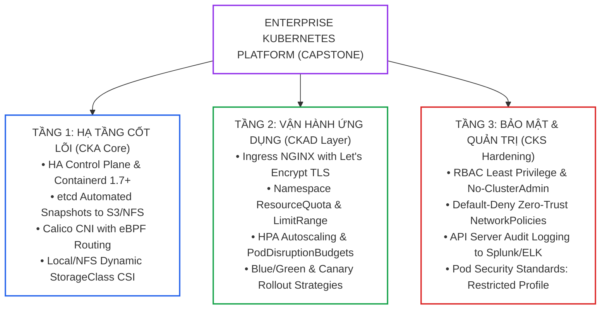
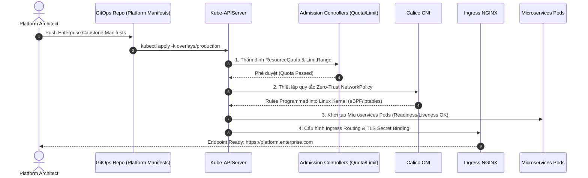
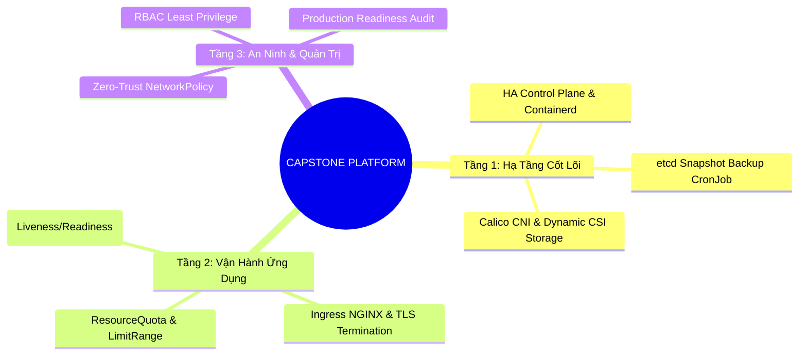


> [!IMPORTANT]
> **Mục tiêu kỹ thuật cốt lõi**: Tổng hợp và tích hợp toàn bộ kiến thức của 33 bài học trước vào dự án **Capstone Hạ Tầng Kubernetes Doanh Nghiệp**. Tự tay thiết kế và cấu hình hoàn chỉnh một nền tảng cụm đạt chuẩn sản xuất (**Production-Ready Enterprise Platform**) với mô hình kiến trúc **3-Tier Governance**: **Hạ tầng bền bỉ (CKA)**, **Điều phối ứng dụng đàn hồi (CKAD)**, và **Bảo vệ an ninh phòng thủ chiều sâu (CKS)**.

---

## 1. Bản Chất Kiến Trúc & Tư Duy Cốt Lõi: Khung Kiến Trúc Nền Tảng Kubernetes Doanh Nghiệp (Enterprise Platform Blueprint)

Một nền tảng Kubernetes cấp doanh nghiệp (Enterprise Container Platform) không đơn thuần là cài đặt xong một cụm `kubeadm` với vài Worker Nodes. Nó đòi hỏi một hệ sinh thái đồng bộ tích hợp đầy đủ các dịch vụ hạ tầng cốt lõi: từ lưu trữ động (CSI), định tuyến lưu lượng biên (Ingress/TLS), kiểm soát tài nguyên đa đội ngũ (Resource Quotas), an ninh mạng không tin cậy (**Zero-Trust NetworkPolicy**), cho đến cơ chế tự động phục hồi và sao lưu thảm họa.



---

## 2. Bảng Ma Trận So Sánh Kỹ Thuật Toàn Diện (Engineering Matrix)

Bảng ma trận cấu hình các thành phần tiêu chuẩn sản xuất trong dự án Capstone:

| Thành Phần Hệ Thống (Component) | Giải Pháp Kỹ Thuật (Solution) | Tiêu Chuẩn Sản Xuất (Production Baseline) | Đánh Đổi Thiết Kế (Design Trade-Off) | Khả Năng Chịu Lỗi & Tự Phục Hồi |
|---|---|---|---|---|
| **Control Plane HA** | Kubeadm Multi-Master (3 Nodes) | External etcd hoặc Stacked etcd, Keepalived VIP | Tốn thêm tài nguyên RAM/CPU cho 3 Master | Chịu được sập 1 Master node mà không gián đoạn API |
| **Network CNI** | Calico CNI / Cilium | IPAM CIDR `/16`, eBPF mode, NetworkPolicy support | Đòi hỏi Kernel Linux >= 5.4, cấu hình phức tạp hơn Flannel | Tự động tái định tuyến khi mất kết nối 1 Worker node |
| **Storage CSI** | Longhorn / OpenEBS / NFS CSI | `volumeBindingMode: WaitForFirstConsumer`, Retain Policy | Tăng độ trễ I/O nhẹ so với đĩa cứng cục bộ | Tự động Replicate 3 bản sao trên các Node khác nhau |
| **Ingress Controller** | Ingress NGINX Controller | TLS Termination, SSL Passthrough, ModSecurity WAF | Cần phân bổ LoadBalancer tĩnh hoặc NodePort chuyên dụng | Multi-replica Ingress Pods chạy kèm Anti-Affinity |
| **Tài Nguyên Multi-Tenant** | ResourceQuota + LimitRange | Hard CPU/RAM limits cho từng Namespace, Default Requests | Developer phải luôn khai báo thông số tài nguyên | Ngăn chặn hiện tượng Noisy Neighbor làm sập Node |
| **Bảo Mật Mạng Nội Bộ** | Kubernetes NetworkPolicy | Mặc định chặn Ingress/Egress, chỉ mở cổng giao tiếp cần thiết | Đòi hỏi tài liệu hóa toàn bộ luồng mạng Microservices | Ngăn chặn kẻ tấn công di chuyển ngang (Lateral Movement) |
| **Sao Lưu Thảm Họa (DR)** | etcdctl CronJob Backup | Snapshot mỗi 1 giờ, lưu trữ tại đường dẫn an toàn ngoài node | Tốn dung lượng lưu trữ cho các bản snapshot cũ | Khôi phục toàn bộ trạng thái cụm trong dưới 15 phút |

---

## 3. Kiến Trúc Môi Trường & Luồng Thực Thi Mẫu

### Luồng Triển Khai và Thẩm Định Nền Tảng Capstone (End-to-End Delivery Flow)



---

## 4. Phân Tích Cạm Bẫy Thực Chiến: Xung Đột Giữa Ingress Controller & NetworkPolicy Gây Mất Kết Nối Toàn Bộ Hệ Thống

### Tình Huống Sự Cố: Áp Đặt NetworkPolicy Mặc Định Chặn Khiến Ingress Trả Về Lỗi `502 Bad Gateway`

Sau khi hoàn tất cài đặt Ingress NGINX và ứng dụng web trong namespace `production`, đội an ninh triển khai chính sách `default-deny-ingress` để cô lập namespace. Ngay lập tức, toàn bộ người dùng bên ngoài truy cập vào website đều nhận mã lỗi **HTTP 502 Bad Gateway**.

### Hậu Quả & Log Lỗi Thực Tế:
```text
2026/09/12 16:05:22 [error] 142#142: *120489 connect() failed (113: No route to host) while connecting to upstream, client: 203.113.152.1, server: platform.enterprise.com, request: "GET / HTTP/1.1", upstream: "http://10.244.2.45:8080/", host: "platform.enterprise.com"
```

### 5-Whys Root Cause Analysis:
1. **Tại sao Ingress NGINX trả về mã lỗi 502 Bad Gateway?** Vì Ingress Controller không thể kết nối tới IP của Pod backend (`10.244.2.45:8080`).
2. **Tại sao Ingress không thể kết nối tới Backend Pod?** Vì gói tin TCP SYN từ Ingress Pod bị Linux iptables/eBPF drop trên Worker Node.
3. **Tại sao gói tin bị Drop?** Vì namespace `production` vừa áp dụng NetworkPolicy `default-deny` chặn toàn bộ Ingress traffic đến các Pods.
4. **Tại sao NetworkPolicy không cho phép Ingress Controller?** Vì chính sách chỉ mở cổng cho các Pod cùng namespace, quên khai báo rule cho phép traffic từ namespace chứa Ingress Controller (`ingress-nginx`).
5. **Gốc rễ vấn đề (Root Cause):** Kỹ sư triển khai Zero-Trust NetworkPolicy mà không định cấu hình `namespaceSelector` cho phép lưu lượng từ Ingress Controller đi qua.

### Biện Pháp Khắc Phục Chuẩn:
```diff
--- a/netpol-production.yaml
+++ b/netpol-production.yaml
@@ -10,6 +10,12 @@
   policyTypes:
   - Ingress
   ingress:
+  # Cho phép lưu lượng từ Ingress NGINX Controller
+  - from:
+    - namespaceSelector:
+        matchLabels:
+          kubernetes.io/metadata.name: ingress-nginx
+    ports:
+    - protocol: TCP
+      port: 8080
   # Cho phép giao tiếp nội bộ giữa các Pods trong cùng namespace
   - from:
     - podSelector: {}
```

---

## 5. Hands-on Lab: Triển Khai Trọn Vẹn Nền Tảng Capstone Production (8 Bước)

| Bước | Mục Tiêu Kỹ Thuật | Lệnh / Manifest Kiểm Tra Chính |
|---|---|---|
| **1** | Khởi tạo cấu trúc phân vùng Namespace chuẩn doanh nghiệp | `kubectl create ns` kèm labels phân loại |
| **2** | Triển khai Compute Governance: ResourceQuota & LimitRange | `ResourceQuota`, `LimitRange` manifests |
| **3** | Cấu hình Dynamic Persistent Storage CSI & StorageClass | `StorageClass` với `WaitForFirstConsumer` |
| **4** | Triển khai Zero-Trust NetworkPolicy bảo vệ ứng dụng | `NetworkPolicy` (Chặn mặc định, mở Ingress/CoreDNS) |
| **5** | Khởi tạo Microservices Backend có Probes và ConfigMap | `Deployment`, `ReadinessProbe`, `LivenessProbe` |
| **6** | Cấu hình Service & Ingress NGINX với TLS Secret | `Service`, `Ingress`, TLS Certificate Secret |
| **7** | Tự động hóa Sao Lưu Snapshot etcd Định Kỳ bằng CronJob | Bash Script backup etcd & Snapshot Verification |
| **8** | Kiểm toán Toàn Diện (Production Readiness Audit) & Báo Cáo | Kịch bản kiểm thử End-to-End đạt 100% tiêu chí |

---

### Bước 1: Khởi Tạo Cấu Trúc Namespaces Doanh Nghiệp

```bash
# Tạo các namespace đại diện cho từng lớp hạ tầng
kubectl create ns core-platform
kubectl label ns core-platform tier=infra env=production

kubectl create ns app-production
kubectl label ns app-production tier=application env=production kubernetes.io/metadata.name=app-production

kubectl create ns ingress-nginx || true
kubectl label ns ingress-nginx kubernetes.io/metadata.name=ingress-nginx --overwrite
```

---

### Bước 2: Thiết Lập ResourceQuota & LimitRange Cho Tầng Ứng Dụng

```yaml
# capstone-governance.yaml
apiVersion: v1
kind: ResourceQuota
metadata:
  name: app-quota
  namespace: app-production
spec:
  hard:
    requests.cpu: "8"
    requests.memory: 16Gi
    limits.cpu: "16"
    limits.memory: 32Gi
    pods: "20"
    persistentvolumeclaims: "5"
---
apiVersion: v1
kind: LimitRange
metadata:
  name: app-limits
  namespace: app-production
spec:
  limits:
  - default:
      cpu: 500m
      memory: 512Mi
    defaultRequest:
      cpu: 100m
      memory: 128Mi
    max:
      cpu: "4"
      memory: 8Gi
    min:
      cpu: 50m
      memory: 64Mi
    type: Container
```
```bash
kubectl apply -f capstone-governance.yaml
kubectl describe quota -n app-production
```

---

### Bước 3: Cấu Hình StorageClass Dynamic Provisioning

```yaml
# capstone-storage.yaml
apiVersion: storage.k8s.io/v1
kind: StorageClass
metadata:
  name: production-sc
provisioner: kubernetes.io/no-provisioner
volumeBindingMode: WaitForFirstConsumer
reclaimPolicy: Retain
allowVolumeExpansion: true
```
```bash
kubectl apply -f capstone-storage.yaml
```

---

### Bước 4: Triển Khai Zero-Trust NetworkPolicy Bảo Vệ Ứng Dụng

```yaml
# capstone-netpol.yaml
apiVersion: networking.k8s.io/v1
kind: NetworkPolicy
metadata:
  name: app-zero-trust
  namespace: app-production
spec:
  podSelector:
    matchLabels:
      app: enterprise-backend
  policyTypes:
  - Ingress
  - Egress
  ingress:
  # 1. Cho phép traffic từ Ingress Controller
  - from:
    - namespaceSelector:
        matchLabels:
          kubernetes.io/metadata.name: ingress-nginx
    ports:
    - protocol: TCP
      port: 8080
  egress:
  # 1. Cho phép truy vấn DNS tới CoreDNS trong kube-system
  - to:
    - namespaceSelector:
        matchLabels:
          kubernetes.io/metadata.name: kube-system
      podSelector:
        matchLabels:
          k8s-app: kube-dns
    ports:
    - protocol: UDP
      port: 53
    - protocol: TCP
      port: 53
  # 2. Cho phép kết nối cơ sở dữ liệu nội bộ
  - to:
    - podSelector:
        matchLabels:
          app: database
    ports:
    - protocol: TCP
      port: 5432
```
```bash
kubectl apply -f capstone-netpol.yaml
```

---

### Bước 5: Triển Khai Ứng Dụng Backend Kèm Health Probes

```yaml
# capstone-app.yaml
apiVersion: apps/v1
kind: Deployment
metadata:
  name: backend-service
  namespace: app-production
  labels:
    app: enterprise-backend
spec:
  replicas: 3
  selector:
    matchLabels:
      app: enterprise-backend
  template:
    metadata:
      labels:
        app: enterprise-backend
    spec:
      containers:
      - name: api
        image: nginx:alpine
        ports:
        - containerPort: 80
        resources:
          requests:
            cpu: 100m
            memory: 128Mi
          limits:
            cpu: 500m
            memory: 256Mi
        livenessProbe:
          httpGet:
            path: /
            port: 80
          initialDelaySeconds: 10
          periodSeconds: 10
        readinessProbe:
          httpGet:
            path: /
            port: 80
          initialDelaySeconds: 5
          periodSeconds: 5
---
apiVersion: v1
kind: Service
metadata:
  name: backend-svc
  namespace: app-production
spec:
  type: ClusterIP
  selector:
    app: enterprise-backend
  ports:
  - port: 8080
    targetPort: 80
```
```bash
kubectl apply -f capstone-app.yaml
kubectl rollout status deployment/backend-service -n app-production
```

---

### Bước 6: Cấu Hình Ingress NGINX Routing & TLS Secret

```bash
# 1. Khởi tạo TLS certificate tự ký cho domain doanh nghiệp
openssl req -x509 -nodes -days 365 -newkey rsa:2048 \
  -keyout enterprise.key -out enterprise.crt \
  -subj "/CN=platform.enterprise.com"

# 2. Tạo TLS Secret trong namespace app-production
kubectl create secret tls enterprise-tls \
  --cert=enterprise.crt \
  --key=enterprise.key \
  -n app-production
```

```yaml
# capstone-ingress.yaml
apiVersion: networking.k8s.io/v1
kind: Ingress
metadata:
  name: enterprise-ingress
  namespace: app-production
  annotations:
    nginx.ingress.kubernetes.io/ssl-redirect: "true"
spec:
  ingressClassName: nginx
  tls:
  - hosts:
    - platform.enterprise.com
    secretName: enterprise-tls
  rules:
  - host: platform.enterprise.com
    http:
      paths:
      - path: /
        pathType: Prefix
        backend:
          service:
            name: backend-svc
            port:
              number: 8080
```
```bash
kubectl apply -f capstone-ingress.yaml
kubectl get ingress enterprise-ingress -n app-production
```

---

### Bước 7: Tự Động Hóa Sao Lưu etcd Snapshot Định Kỳ

```bash
# Tạo script sao lưu tự động etcd tại /opt/scripts/backup-etcd.sh
sudo mkdir -p /opt/scripts /var/backups/etcd

cat << 'EOF' | sudo tee /opt/scripts/backup-etcd.sh
#!/bin/bash
set -euo pipefail
BACKUP_DIR="/var/backups/etcd"
TIMESTAMP=$(date +%Y%m%d_%H%M%S)
SNAPSHOT_PATH="${BACKUP_DIR}/etcd-snapshot-${TIMESTAMP}.db"

echo "=== [$(date)] Bắt đầu sao lưu etcd snapshot ==="
ETCDCTL_API=3 etcdctl \
  --endpoints=https://127.0.0.1:2379 \
  --cacert=/etc/kubernetes/pki/etcd/ca.crt \
  --cert=/etc/kubernetes/pki/etcd/server.crt \
  --key=/etc/kubernetes/pki/etcd/server.key \
  snapshot save "${SNAPSHOT_PATH}"

echo "=== Xác minh tính toàn vẹn của snapshot ==="
ETCDCTL_API=3 etcdctl snapshot status "${SNAPSHOT_PATH}" --write-out=table

# Xóa các bản snapshot cũ hơn 7 ngày
find "${BACKUP_DIR}" -type f -name "etcd-snapshot-*.db" -mtime +7 -delete
echo "=== Sao lưu etcd thành công: ${SNAPSHOT_PATH} ==="
EOF

sudo chmod +x /opt/scripts/backup-etcd.sh
sudo /opt/scripts/backup-etcd.sh
```

---

### Bước 8: Kiểm Toán Sẵn Sàng Sản Xuất (Production Readiness Audit)

```bash
# Kiểm tra tổng thể trạng thái hệ thống Capstone
echo "=== 1. Kiểm tra Nodes ==="
kubectl get nodes -o wide

echo "=== 2. Kiểm tra Control Plane Pods ==="
kubectl get pods -n kube-system

echo "=== 3. Kiểm tra Multi-tenant Quota ==="
kubectl get resourcequota,limitrange -A

echo "=== 4. Kiểm tra Ingress & TLS ==="
kubectl get ingress -A

echo "=== 5. Kiểm tra NetworkPolicies ==="
kubectl get netpol -A
```

---

## 6. 10 Câu Hỏi Tự Kiểm Tra Chuyên Sâu (Self-Check Q&A Accordion)

<details class="qa-card">
<summary><b>1. Trong kiến trúc 3 tầng của nền tảng Kubernetes, tại sao `volumeBindingMode: WaitForFirstConsumer` lại được khuyến nghị cho StorageClass?</b></summary>
<div class="qa-answer">
<p>Nếu để chế độ mặc định <code>Immediate</code>, PersistentVolume sẽ được cấp phát ngay khi PVC được tạo, trước khi Scheduler biết Pod sẽ chạy trên Node nào. Điều này có thể dẫn đến việc PV nằm ở Zone A hoặc Node A, trong khi Pod lại được schedule sang Zone B (nơi không gắn được ổ đĩa). Chế độ <code>WaitForFirstConsumer</code> trì hoãn việc cấp phát đĩa cho đến khi Pod được gán vào Node cụ thể, đảm bảo ổ đĩa và Pod luôn ở cùng vị trí vật lý.</p>
</div>
</details>

<details class="qa-card">
<summary><b>2. Tại sao ta phải cấu hình Egress rule mở cổng 53 (UDP/TCP) trong NetworkPolicy khi áp dụng chính sách Default-Deny?</b></summary>
<div class="qa-answer">
<p>Khi áp dụng chính sách chặn Egress mặc định (Default-Deny Egress), toàn bộ kết nối đi ra khỏi Pod đều bị khóa, <b>bao gồm cả các truy vấn phân giải tên miền DNS</b> tới CoreDNS. Nếu không mở cổng 53 (UDP/TCP) tới Pod CoreDNS trong namespace <code>kube-system</code>, ứng dụng sẽ không thể phân giải tên của bất kỳ Service nào (như kết nối Database hoặc Microservice khác).</p>
</div>
</details>

<details class="qa-card">
<summary><b>3. Sự khác nhau giữa Liveness Probe và Readiness Probe trong việc bảo vệ tính sẵn sàng của ứng dụng là gì?</b></summary>
<div class="qa-answer">
<p><b>Liveness Probe</b> kiểm tra xem ứng dụng có còn sống (healthy) hay bị deadlock/hang. Nếu fail, Kubelet sẽ <b>Restart container</b>. Trong khi đó, <b>Readiness Probe</b> kiểm tra xem ứng dụng đã sẵn sàng nhận request chưa (ví dụ đã nạp xong cache hay kết nối DB chưa). Nếu fail, Kubernetes sẽ <b>tách Pod ra khỏi Service Endpoints</b> (không định tuyến traffic vào) nhưng <b>không restart container</b>.</p>
</div>
</details>

<details class="qa-card">
<summary><b>4. Làm thế nào để đảm bảo Ingress Controller luôn có độ sẵn sàng cao (High Availability)?</b></summary>
<div class="qa-answer">
<p>Triển khai Ingress Controller Deployment với ít nhất <b>2 đến 3 replicas</b>, kết hợp cấu hình <b>PodAntiAffinity</b> (để các Ingress Pod không nằm chung trên cùng 1 Worker Node) và thiết lập <b>PodDisruptionBudget (PDB)</b> đảm bảo luôn có ít nhất 1 Ingress Pod hoạt động trong suốt quá trình bảo trì cụm.</p>
</div>
</details>

<details class="qa-card">
<summary><b>5. Tại sao không nên lưu trữ các bản snapshot sao lưu etcd trên cùng ổ đĩa của Master Node?</b></summary>
<div class="qa-answer">
<p>Nếu Master Node bị hỏng phần cứng hoặc ổ đĩa bị cháy/format, toàn bộ cụm etcd lẫn các bản backup nằm trên cùng ổ đĩa đó sẽ <b>bị mất vĩnh viễn</b>. Nguyên tắc sao lưu thảm họa (Disaster Recovery) bắt buộc các bản snapshot sau khi tạo phải được đẩy ra hệ thống lưu trữ độc lập bên ngoài (như S3 bucket, NFS storage, hoặc Remote Backup Server).</p>
</div>
</details>

<details class="qa-card">
<summary><b>6. Annotation `nginx.ingress.kubernetes.io/ssl-redirect: "true"` có tác dụng gì?</b></summary>
<div class="qa-answer">
<p>Annotation này yêu cầu Ingress NGINX tự động <b>chuyển hướng (HTTP 301 Redirect)</b> toàn bộ các yêu cầu truy cập giao thức HTTP (cổng 80) sang giao thức mã hóa an toàn HTTPS (cổng 443).</p>
</div>
</details>

<details class="qa-card">
<summary><b>7. Khi nào nên sử dụng `reclaimPolicy: Retain` thay vì `Delete` trong StorageClass sản xuất?</b></summary>
<div class="qa-answer">
<p>Trong môi trường sản xuất chứa dữ liệu kinh doanh quan trọng (như CSDL SQL, Logs, Hồ sơ giao dịch), nên dùng <code>Retain</code>. Khi lập trình viên vô tình xóa PVC, dữ liệu vật lý trên ổ đĩa vẫn được bảo toàn nguyên vẹn để quản trị viên có thể cứu hộ thủ công, thay vì bị hệ thống xóa vĩnh viễn ngay lập tức như chính sách <code>Delete</code>.</p>
</div>
</details>

<details class="qa-card">
<summary><b>8. Làm thế nào để ngăn chặn một Namespace tiêu thụ hết toàn bộ số lượng IP trong subnet của CNI?</b></summary>
<div class="qa-answer">
<p>Thiết lập hạn ngạch số lượng Pod tối đa thông qua <b>ResourceQuota</b> bằng trường <code>spec.hard.pods: "&lt;N&gt;"</code>. Điều này giới hạn số lượng Pod được khởi tạo trong Namespace, từ đó trực tiếp khống chế số lượng địa chỉ IP mạng mà Namespace đó có thể xin cấp phát từ CNI IPAM pool.</p>
</div>
</details>

<details class="qa-card">
<summary><b>9. Tại sao trong môi trường sản xuất, các Pod ứng dụng luôn phải có cả `requests` và `limits` bằng nhau cho Memory?</b></summary>
<div class="qa-answer">
<p>Khi một Pod khai báo <code>requests.memory == limits.memory</code> và <code>requests.cpu == limits.cpu</code>, Kubernetes sẽ xếp Pod vào hạng chất lượng dịch vụ cao nhất: <b>Guaranteed QoS Class</b>. Các Pod này sẽ là đối tượng <b>cuối cùng bị trục xuất (Evicted)</b> khi Worker Node rơi vào tình trạng cạn kiệt tài nguyên bộ nhớ.</p>
</div>
</details>

<details class="qa-card">
<summary><b>10. Các tiêu chí then chốt để đánh giá một cụm Kubernetes đã sẵn sàng cho Production (Production-Ready) là gì?</b></summary>
<div class="qa-answer">
<p>5 tiêu chí then chốt:</p>
<div>1. <b>Tính sẵn sàng cao (HA):</b> Control plane tối thiểu 3 node, multi-worker nodes trải rộng các zone.</div>
<div>2. <b>Lưu trữ & Sao lưu:</b> Dynamic CSI storage và tự động hóa sao lưu etcd định kỳ.</div>
<div>3. <b>An ninh mạng:</b> Zero-Trust NetworkPolicy, Ingress TLS, và phân quyền RBAC tối thiểu.</div>
<div>4. <b>Quản trị tài nguyên:</b> 100% Namespace có ResourceQuota, LimitRange và HPA.</div>
<div>5. <b>Giám sát & Cảnh báo:</b> Đầy đủ Prometheus metrics, Grafana dashboards, Alertmanager và Centralized Logging.</div>
</div>
</details>

---

## 7. Tổng Kết & Lộ Trình Bài Học Tiếp Theo



Dự án Capstone là cột mốc khẳng định bạn đã làm chủ toàn diện nghệ thuật **thiết kế, xây dựng và vận hành nền tảng Kubernetes cấp doanh nghiệp**.

> [!TIP]
> **Bài học tiếp theo**: Chuẩn bị cho chặng cuối cùng của lộ trình làm chủ Kubernetes: **[Bài 35: Tổng Kết Khóa Học, Bảo Vệ Đồ Án & Bộ Câu Hỏi Phỏng Vấn SRE/DevOps](cka-35-35-bao-ve-va-phong-van-tong-hop.html)**.

