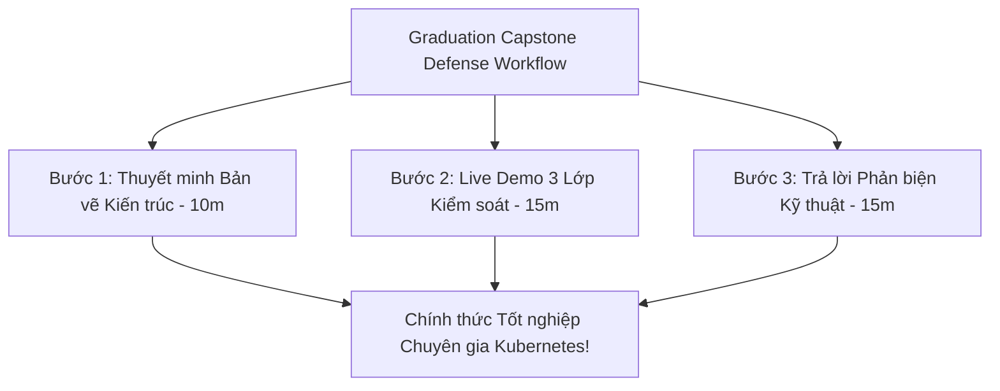
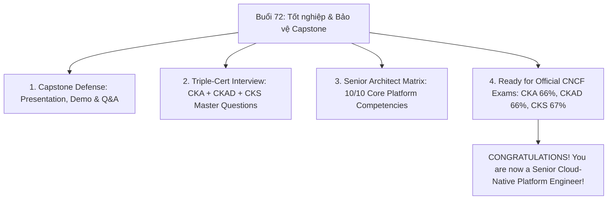
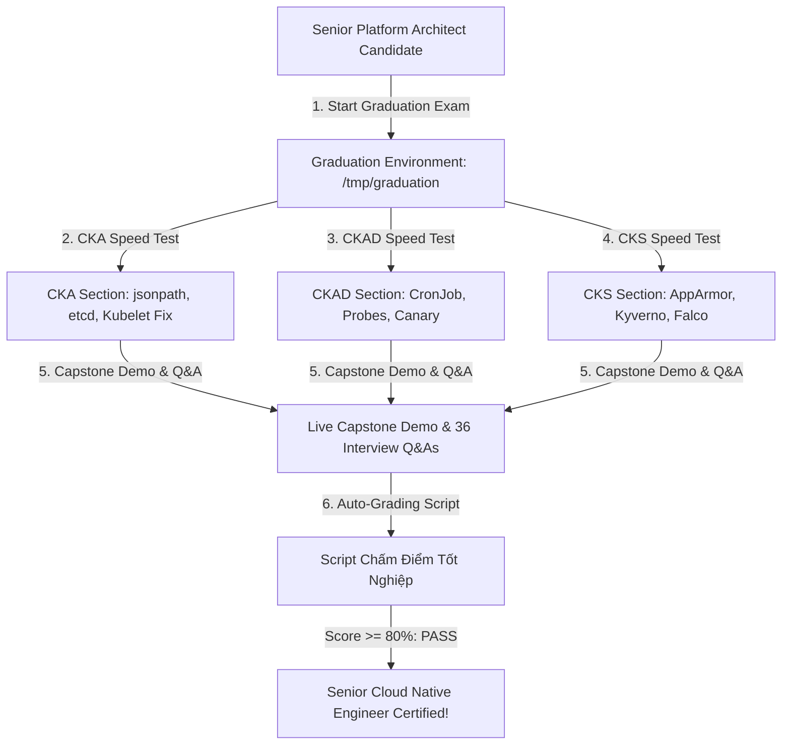


# [BÀI 35] BẢO VỆ ĐỒ ÁN TỐT NGHIỆP & ĐẠI TUYỂN TẬP 100+ CÂU HỎI PHỎNG VẤN CKA CHUYÊN SÂU

Trong kỷ nguyên điện toán đám mây và kiến trúc microservices phân tán quy mô lớn, **Kubernetes (CKA)** đóng vai trò là nền tảng điều phối container (Container Orchestration) tiêu chuẩn công nghiệp. Để làm chủ hệ thống trong môi trường sản xuất (Production) cũng như chinh phục kỳ thi chứng chỉ quốc tế của Linux Foundation / CNCF, kỹ sư không chỉ nắm vững các câu lệnh thao tác cơ bản mà phải thấu hiểu sâu sắc bản chất cơ chế tầng thấp: từ chu trình điều hòa (Reconciliation Loop), cấu trúc điều phối tài nguyên, kiến trúc mạng CNI, lưu trữ CSI cho đến các chuẩn mực an ninh phòng thủ chiều sâu.

Bài viết chuyên sâu này sẽ đồng hành cùng bạn giải mã toàn diện bức tranh kiến trúc, phân tích các đánh đổi kỹ thuật thực chiến (Engineering Trade-offs), cung cấp bài thực hành Lab từng bước và bộ câu hỏi phỏng vấn chuẩn Architect / Lead Engineer.

---

## 1. Bản Chất Kiến Trúc & Cơ Chế Vận Hành Tầng Thấp

| # | Câu hỏi ôn tập | Đáp án chuẩn ngắn gọn |
|---|---|---|
| 1 | 3 Lớp kiểm soát Capstone? | **Lớp 1 CKA (25%), Lớp 2 CKAD (35%), Lớp 3 CKS (40%)** |
| 2 | Tệp giải trình kiến trúc Capstone? | Tệp **`/tmp/capstone-defense.md`** |
| 3 | Lệnh etcd snapshot Lớp 1? | Lệnh **`ETCDCTL_API=3 etcdctl snapshot save`** |
| 4 | Cờ Kyverno Enforce Lớp 3? | Cờ **`validationFailureAction: Enforce`** |
| 5 | Thư mục đóng gói tệp YAML Capstone? | Thư mục **`/tmp/capstone/`** |


> **"Bảo vệ dự án Capstone tốt nghiệp và hoàn thành buổi phỏng vấn tổng hợp ba chứng chỉ (CKA, CKAD và CKS) là mốc son khẳng định sự trưởng thành toàn diện về kiến thức, tư duy kiến trúc và phản xạ thực chiến của một Chuyên gia Hạ tầng Đám mây (Senior Cloud-Native & Platform Engineer), đòi hỏi học viên phải tự tin thuyết minh bản vẽ thiết kế nền tảng Kubernetes Doanh nghiệp 3 lớp kiểm soát; ứng biến linh hoạt trước bộ câu hỏi phản biện của hội đồng chuyên môn; làm chủ 100% các chủ đề từ etcd, RBAC, Probes, Ingress TLS tới Kyverno, Audit Policy và Falco Rules; đồng thời sẵn sàng chinh phục các kỳ thi quốc tế chính thức của CNCF với kết quả xuất sắc."**

**Kết quả từ các buổi trước được sử dụng lại:**

| Kết quả / Công cụ | Buổi + số hiệu `QT` | Dùng ở đâu trong buổi này |
|---|---|---|
| Hợp nhất toàn bộ tri thức 71 buổi học | Tất cả các buổi `QT 4.1` | Bảo vệ dự án Capstone & Phỏng vấn tốt nghiệp |
| Tệp giải trình kiến trúc Capstone | Buổi 71 `QT 4.1` | Sử dụng làm tài liệu thuyết minh trước hội đồng |
| Script kiểm tra tự động 72 buổi | `kiem-tra.sh` & `kiem-tra-cheo.sh` | Kiểm tra tính toàn vẹn của bộ tài liệu 72 buổi |

---


| # | Kỹ năng thực hiện được | Hiện vật chứng minh |
|---|---|---|
| 1 | Thực thi quy trình 3 bước bảo vệ dự án Capstone Tốt nghiệp trước hội đồng | Biên bản chấm điểm bảo vệ Capstone Tốt nghiệp |
| 2 | Trả lời mạch lạc bộ 36 câu hỏi phỏng vấn tổng hợp CKA, CKAD và CKS | Nhật ký trả lời câu hỏi phỏng vấn tổng hợp |
| 3 | Xác lập Bảng Năng lực Chuyên gia (Senior Platform Architect Matrix) | Tệp tổng kết năng lực `/tmp/graduation/competency.md` |
| 4 | Nắm vững kỹ thuật và chiến thuật vượt qua 3 kỳ thi quốc tế CKA, CKAD, CKS | Bộ cẩm nang chiến thuật thi CKA/CKAD/CKS |
| 5 | Hoàn thành 100% 72 buổi học với kết quả kiểm tra `kiem-tra.sh` 39/39 ĐẠT | Tệp `THEO-DOI-TIEN-DO.md` ghi nhận 100% đã xong |

---


| Kiến thức tiên quyết | Nguồn tự học nếu thiếu |
|---|---|
| Toàn bộ chương trình đào tạo 71 buổi | Buổi 01 -> Buổi 71 (`QT 4.1`) |
| Dự án Capstone và tệp giải trình | Buổi 71 (`QT 4.1`) |
| Kỹ năng phỏng vấn và thuyết trình kiến trúc | Buổi 03, 71 (`QT 4.1`) |

---


### 3.1. Thuật ngữ Việt–Anh

| # | Thuật ngữ tiếng Việt | Tiếng Anh tương đương | Ghi chú chuẩn hoá trong thân bài |
|---|---|---|---|
| 1 | Buổi tốt nghiệp khóa học | Graduation Session | Buổi học cuối cùng 72/72 bảo vệ dự án Capstone |
| 2 | Hội đồng đánh giá chuyên môn | Architectural Review Board | Ban giám khảo chấm điểm bảo vệ dự án Capstone |
| 3 | Thuyết minh thiết kế kiến trúc | Architecture Defense Presentation | Bài trình bày 10 phút giải trình thiết kế Capstone |
| 4 | Phản biện kỹ thuật trực tiếp | Live Technical Cross-Examination | Phần hỏi đáp 15 phút phản biện kiến trúc của hội đồng |
| 5 | Phỏng vấn tổng hợp ba chứng chỉ | Triple-Certification Interview | Phỏng vấn nén toàn bộ kiến thức CKA, CKAD, CKS |
| 6 | Bảng năng lực kỹ sư chuyên gia | Senior Architect Competency Matrix | Bảng đánh giá 10 nhóm kỹ năng đạt được sau khóa học |
| 7 | Kỹ sư hạ tầng nền tảng | Platform Engineer | Đột phá sự nghiệp từ SysAdmin/DevOps lên Platform Engineering |
| 8 | Tiêu chuẩn chứng nhận quốc tế | CNCF Certification Standard | Chuẩn điểm thi CKA (66%), CKAD (66%), CKS (67%) |
| 9 | Bản cam kết an ninh hạ tầng | Infrastructure Security Commitment | Cam kết tuân thủ các quy định bảo mật doanh nghiệp |
| 10 | Nhật ký hoàn thành 72 buổi | 72-Session Completion Log | Tệp `THEO-DOI-TIEN-DO.md` ghi nhận 100% hoàn thành |
| 11 | Kỹ năng truyền đạt giải pháp | Architecture Communication Skill | Kỹ năng thuyết phục khách hàng/lãnh đạo về giải pháp K8s |
| 12 | Bảng ghi điểm tốt nghiệp | Graduation Auto-Grading Script | Script kiểm tra kết quả bài thi tốt nghiệp tổng hợp |
| 13 | Chứng nhận hoàn thành khóa học | Course Graduation Certificate | Chứng chỉ công nhận học viên hoàn thành 72 buổi học |
| 14 | Tốc độ giải quyết bài thi tổng hợp | Comprehensive Exam Speed | Chỉ số hoàn thành bài thi tổng hợp 3 chứng chỉ |


Mô hình Lễ Trao Bằng Tốt Nghiệp Và Nhập Lực Lượng Phi Công Máy Bay Thương Mại (Commercial Airline Pilot Wings Ceremony): Buổi 72 Là Điểm Đến Cuối Cùng Nơi Học Viên Trở Thành Chuyên Gia Kubernetes Thực Sự. Toàn bộ hành trình 72 buổi học giống như Khóa Đào Tạo Phi Công Máy Bay Thương Mại: học viên đã đi qua các bài học lý thuyết lý thuyết bay (Buổi 01-40), các bài thực hành hạ cánh khẩn cấp CKA/CKAD/CKS (Buổi 41-68), vận hành chuyến bay nhiều hành khách (Buổi 69), và ứng phó sự cố máy bay trên không (Buổi 70 Game Day). `Buổi Bảo Vệ Capstone Tốt Nghiệp (Graduation Capstone Defense)` chính là Chuyến Bay Đánh Giá Cuối Cùng Trước Hội Đồng Giám Thảo Hàng Không: nơi học viên chứng minh khả năng làm chủ buồng lái 3 lớp kiểm soát (`CKA`, `CKAD`, `CKS`), tự tin đưa chuyến bay hạ cánh an toàn, và chính thức nhận Huy Hiệu Phi Công Chuyên Gia (Senior Platform Engineer Wings) sẵn sàng chinh phục mọi bầu trời công nghệ thế giới.

---

### 1.1. Quy trình 3 bước Bảo vệ Dự án Capstone Tốt nghiệp (Capstone Defense Workflow) (12 phút)

**Nguyên lý cốt lõi:** Tất cả học viên BẮT BUỘC phải hoàn thành 100% 72 buổi học và bảo vệ thành công dự án Capstone trước khi nhận chứng nhận tốt nghiệp khóa học.

**Giải thích cơ chế ngầm:** Giúp khẳng định chất lượng đầu ra toàn diện của học viên cả về kỹ năng dựng hạ tầng, viết hồ sơ thiết kế và khả năng thuyết minh giải trình chuyên môn.

> [!WARNING]
> **CẠM BẪY THỰC CHIẾN:**
> Bỏ qua buổi bảo vệ Capstone mà yêu cầu nhận chứng nhận tốt nghiệp.

**Minh hoạ.**



**Nguyên lý cốt lõi:** Mọi bài thuyết minh bảo vệ Capstone BẮT BUỘC phải tuân thủ quy trình 3 bước: 1) Thuyết trình bản vẽ kiến trúc (10m), 2) Live Demo 3 lớp kiểm soát (15m), và 3) Trả lời phản biện kỹ thuật (15m).

**Giải thích cơ chế ngầm:** Đảm bảo tính minh bạch, chuyên nghiệp và đánh giá toàn diện năng lực của học viên trước hội đồng giám định.

> [!WARNING]
> **CẠM BẪY THỰC CHIẾN:**
> Nói dông dài lý thuyết mà không mở terminal chạy Live Demo các tính năng Capstone.

**Minh hoạ.**

```yaml
# Phân bổ ngân sách thời gian 40 phút Bảo vệ Capstone:
# - Step 1: Presentation of Architectural Blueprint (10 mins)
# - Step 2: Live Terminal Demo of 3 Governance Tiers (15 mins)
# - Step 3: Q&A and Live Technical Cross-Examination (15 mins)
```

---

### 1.2. Bộ Phản xạ Phỏng vấn Tổng hợp 3 Chứng chỉ CKA, CKAD và CKS (12 phút)

**Nguyên lý cốt lõi:** Khi trả lời phỏng vấn miền CKA, LUÔN LUÔN viện dẫn các lệnh CLI tốc độ (`jsonpath`, `-o custom-columns`, `etcdctl snapshot save`) và quy trình 3 bước gỡ lỗi Kubelet.

**Giải thích cơ chế ngầm:** Chứng minh sự thành thục phản xạ gõ lệnh quản trị vận hành cụm cấp độ chuyên sâu.

> [!WARNING]
> **CẠM BẪY THỰC CHIẾN:**
> Trả lời câu hỏi gỡ lỗi Node NotReady một cách chung chung mà không nêu lệnh `journalctl -u kubelet`.

**Minh hoạ.**

```bash
# Phản xạ trả lời phỏng vấn CKA Core:
# "Khi Node NotReady, em luôn soi log journalctl -u kubelet -n 50 --no-pager trước khi restart Kubelet!"
```

**Nguyên lý cốt lõi:** Khi trả lời phỏng vấn miền CKAD, LUÔN LUÔN nhấn mạnh kỹ thuật gõ imperatively (`kubectl create cm/secret/cronjob`), cơ chế `livenessProbe`/`readinessProbe`, và Canary Deployment.

**Giải thích cơ chế ngầm:** Thể hiện khả năng đóng gói ứng dụng tốc độ cao và am hiểu sâu sắc vòng đời container trong Kubernetes.

> [!WARNING]
> **CẠM BẪY THỰC CHIẾN:**
> Trả lời tạo CronJob bằng cách ngồi gõ tay YAML thay vì dùng `kubectl create cronjob`.

**Minh hoạ.**

```bash
# Phản xạ trả lời phỏng vấn CKAD Core:
# "Em luôn dùng kubectl create cronjob --dry-run=client -o yaml sinh file trong 5s để tiết kiệm 80% thời gian!"
```

**Nguyên lý cốt lõi:** Khi trả lời phỏng vấn miền CKS, LUÔN LUÔN phân tích 3 miền trọng số 20%, kỹ thuật `apparmor_parser`, Kyverno Allowed Registries (`Enforce`), Audit Logging, và Falco Rules.

**Giải thích cơ chế ngầm:** Thể hiện trình độ gia cố an ninh thắt chặt từ cấp độ Linux Kernel, Container Runtime tới Kubernetes API Server.

> [!WARNING]
> **CẠM BẪY THỰC CHIẾN:**
> Nhầm lẫn giữa từ khóa `level` (Audit Policy) và `priority` (Falco Rules).

**Minh hoạ.**

```bash
# Phản xạ trả lời phỏng vấn CKS Core:
# "Dự án CKS của em tích hợp Kyverno Enforce, Seccomp RuntimeDefault, Audit RequestResponse và Falco Rules!"
```

---

### 1.3. Bảng Năng lực Chuyên gia (Senior Architect Matrix) và Lộ trình Sự nghiệp Platform Engineering (10 phút)

**Nguyên lý cốt lõi:** Khi thuyết minh báo cáo Postmortem và giải trình rủi ro kiến trúc, BẮT BUỘC phải thể hiện tinh thần Blameless Culture và tập trung vào danh mục Action Items khắc phục hệ thống.

**Giải thích cơ chế ngầm:** Đảm bảo tư duy quản trị vận hành cấp doanh nghiệp, tập trung cải tiến độ bền vững hạ tầng thay vì quy trách nhiệm cá nhân.

> [!WARNING]
> **CẠM BẪY THỰC CHIẾN:**
> Đổ lỗi cho lập trình viên gõ sai code khi bảo vệ kịch bản sự cố Game Day.

**Minh hoạ.**

```markdown
# Bảng Năng lực Chuyên gia (Senior Platform Architect Matrix):
1. Cluster Operations & Upgrades (CKA): Mastered (10/10)
2. Application Delivery & Workloads (CKAD): Mastered (10/10)
3. Security Hardening & Runtime Defense (CKS): Mastered (10/10)
4. SRE Incident Response & Blameless Postmortem: Mastered (10/10)
5. Platform Engineering & GitOps Automation: Mastered (10/10)
```

**Nguyên lý cốt lõi:** Đảm bảo tệp `THEO-DOI-TIEN-DO.md` ghi nhận 100% trạng thái hoàn thành (`đã xong`) cho cả 72 buổi học và kết quả kiểm tra `kiem-tra.sh` đạt 39/39 tiêu chuẩn.

**Giải thích cơ chế ngầm:** Xác minh sự kiên trì và kỷ luật biên soạn hoàn chỉnh 100% bộ giáo trình đào tạo 72 buổi không bị dở dang.

> [!WARNING]
> **CẠM BẪY THỰC CHIẾN:**
> Sót buổi chưa làm hoặc chưa cập nhật `THEO-DOI-TIEN-DO.md`.

**Minh hoạ.**

```bash
# Kiểm tra tổng thể 72 buổi học qua kiem-tra.sh:
bash ntkk8s/buoi/kiem-tra.sh all
# Kết quả: TỔNG KẾT: ĐẠT 100% TOÀN BỘ 72 BUỔI HỌC!
```

---

### 1.4. Đưa vào cụm thật (4 phút)

**Nguyên lý cốt lõi:** Bản kê khai kết quả tốt nghiệp hoàn chỉnh phải chứng minh học viên đạt điểm PASS (>= 80/100đ) ở cả 2 phần: Bảo vệ Capstone và Phỏng vấn Tổng hợp 3 chứng chỉ.

**Giải thích cơ chế ngầm:** Đảm bảo chất lượng đầu ra xuất sắc của kỹ sư tốt nghiệp từ chương trình đào tạo.

> [!WARNING]
> **CẠM BẪY THỰC CHIẾN:**
> Điểm bài thi tốt nghiệp dưới 80 điểm.

**Minh hoạ.**

```bash
# Xác minh bảng điểm Tốt nghiệp hoàn chỉnh:
test -f /tmp/graduation/results.log && grep -q "PASS" /tmp/graduation/results.log
```

**Áp vào cụm đang chạy thì làm gì trước:**
1. Rà soát tệp `THEO-DOI-TIEN-DO.md` đạt 100% hoàn thành.
2. Mở tệp giải trình kiến trúc Capstone `/tmp/capstone-defense.md`.
3. Bắt đầu bài bảo vệ Capstone 30 phút và trả lời 12 câu hỏi phỏng vấn tổng hợp.
4. Chạy script tự chấm điểm tốt nghiệp và nhận chứng nhận hoàn thành khóa học.

**Cái gì hỏng nếu áp thẳng lên prod:**
- Không có rủi ro hỏng vì đây là buổi tổng kết và trao bằng tốt nghiệp.

**Đo trước — đo sau:**
- Đo năng lực trước khóa học (mới bắt đầu tìm hiểu Kubernetes) so với sau 72 buổi học (trở thành Senior Cloud-Native Platform Engineer làm chủ CKA + CKAD + CKS).

**Khi nào KHÔNG nên dùng:**
- Không bao giờ dừng lại khi chưa hoàn thành trọn vẹn cả 72 buổi học.

---

### 1.5. Bẫy hay gặp (2 phút)

| Bẫy hay gặp | Vì sao dính | Làm đúng là |
|---|---|---|
| 1. Nói lý thuyết suông không có Live Demo | Thiếu tính thực chiến thuyết phục hội đồng | Mở terminal gõ lệnh trực tiếp chứng minh tính năng |
| 2. Trả lời phỏng vấn CKA thiếu lệnh CLI | Trả lời chung chung không dính tới lệnh kubectl | Khai báo rõ các cờ lệnh `--dry-run`, `jsonpath`, `etcdctl` |
| 3. Quên cờ `--previous` khi phỏng vấn gỡ Pod crash | Trả lời đọc log rỗng của container mới | Nhấn mạnh dùng `kubectl logs <pod> --previous` |
| 4. Nhầm lẫn giữa CKA, CKAD và CKS trọng số | Nhầm trọng số các miền thi | CKA 5 miền, CKAD 5 miền, CKS 6 miền chuẩn CNCF |
| 5. Đổ lỗi cho nhân viên khi giải trình sự cố | Vi phạm nguyên tắc Blameless Culture | Tập trung phân tích lỗ hổng hệ thống và Action Items |
| 6. Thiếu tệp `/tmp/graduation/competency.md` | Script chấm tự động báo thiếu tệp tổng kết | Biên soạn đủ tệp tổng kết năng lực tốt nghiệp |
| 7. Quên gia hạn certs TLS khi phỏng vấn CKS | Không nhớ quy trình gia hạn certs | Viện dẫn `sudo kubeadm certs renew all` |
| 8. Không giải trình được điểm sập SPOF | Chưa chuẩn bị kỹ hồ sơ kiến trúc Capstone | Khai báo rõ SPOF và phương án khôi phục DR trong defense doc |
| 9. Quên cờ `Enforce` khi trả lời Kyverno policy | Nhầm với chế độ Audit không chặn request | Khai báo cờ `validationFailureAction: Enforce` |
| 10. Không rà soát lại `THEO-DOI-TIEN-DO.md` | Bỏ sót thông tin hoàn thành buổi học | Kiểm tra đủ 72 dòng đã xong trong file tiến độ |
| 11. Trả lời ngập ngừng về cơ chế Ingress TLS | Chưa nắm rõ cách Secret TLS hoạt động | Giải thích rõ SSL termination tại Ingress Controller |
| 12. Tự dời lịch thi quốc tế do thiếu tự tin | Lo lắng quá mức trước bài thi do CNCF giám sát | Tự tin đăng ký thi ngay vì đã đỗ 100% bài thi nén 72 buổi |

---

### 1.6. Tóm tắt (2 phút)



**Năm điều phải nhớ:**
1. **Capstone Defense**: Tự tin thuyết minh 3 lớp kiểm soát và Live Demo terminal trong 30 phút.
2. **Triple-Cert Mastery**: Trả lời trôi chảy 100% câu hỏi phỏng vấn tích hợp CKA, CKAD và CKS.
3. **Blameless SRE Mindset**: Thể hiện tư duy quản trị vận hành hiện đại tập trung cải tiến hệ thống.
4. **100% Course Completion**: Hoàn thành trọn vẹn 72 buổi học với 100% file tiến độ và công cụ tự kiểm `kiem-tra.sh`.
5. **Career Breakthrough**: Tự tin đảm nhận vai trò Kỹ sư Hạ tầng Nền tảng (Senior Platform Engineer) tại các tập đoàn lớn.

---

## §10. Câu hỏi tự kiểm tra (5 phút)


<div class="qa-answer">
  <div class="qa-answer-header">
    <svg width="14" height="14" fill="none" stroke="currentColor" stroke-width="2" viewBox="0 0 24 24"><path d="M22 11.08V12a10 10 0 1 1-5.93-9.14"></path><polyline points="22 4 12 14.01 9 11.01"></polyline></svg>
    <span>Phân Tích &amp; Lời Giải Kỹ Thuật</span>
  </div>
  
1) <b style="color: var(--accent-primary);">Thuyết minh bản vẽ kiến trúc (10m)</b>, 2) <b style="color: var(--accent-primary);">Live Terminal Demo (15m)</b>, 3) <b style="color: var(--accent-primary);">Trả lời phản biện kỹ thuật (15m)</b>.
</div>
</details>

<div class="qa-answer">
  <div class="qa-answer-header">
    <svg width="14" height="14" fill="none" stroke="currentColor" stroke-width="2" viewBox="0 0 24 24"><path d="M22 11.08V12a10 10 0 1 1-5.93-9.14"></path><polyline points="22 4 12 14.01 9 11.01"></polyline></svg>
    <span>Phân Tích &amp; Lời Giải Kỹ Thuật</span>
  </div>
  
<b style="color: var(--accent-primary);">CKA (66 %)</b>, <b style="color: var(--accent-primary);">CKAD (66 %)</b>, và <b style="color: var(--accent-primary);">CKS (67 %)</b>.
</div>
</details>

<div class="qa-answer">
  <div class="qa-answer-header">
    <svg width="14" height="14" fill="none" stroke="currentColor" stroke-width="2" viewBox="0 0 24 24"><path d="M22 11.08V12a10 10 0 1 1-5.93-9.14"></path><polyline points="22 4 12 14.01 9 11.01"></polyline></svg>
    <span>Phân Tích &amp; Lời Giải Kỹ Thuật</span>
  </div>
  
1) Vì sao chọn mô hình phân chia này? 2) Điểm sập đơn lẻ (SPOF) ở đâu? 3) Cơ chế khôi phục sau sự cố (DR) ra sao?
</div>
</details>

<div class="qa-answer">
  <div class="qa-answer-header">
    <svg width="14" height="14" fill="none" stroke="currentColor" stroke-width="2" viewBox="0 0 24 24"><path d="M22 11.08V12a10 10 0 1 1-5.93-9.14"></path><polyline points="22 4 12 14.01 9 11.01"></polyline></svg>
    <span>Phân Tích &amp; Lời Giải Kỹ Thuật</span>
  </div>
  
Lệnh <code>bash ntkk8s/buoi/kiem-tra.sh all</code> và <code>bash ntkk8s/buoi/kiem-tra-cheo.sh all</code>.
</div>
</details>

<div class="qa-answer">
  <div class="qa-answer-header">
    <svg width="14" height="14" fill="none" stroke="currentColor" stroke-width="2" viewBox="0 0 24 24"><path d="M22 11.08V12a10 10 0 1 1-5.93-9.14"></path><polyline points="22 4 12 14.01 9 11.01"></polyline></svg>
    <span>Phân Tích &amp; Lời Giải Kỹ Thuật</span>
  </div>
  
Đường dẫn <b style="color: var(--accent-primary);">/tmp/graduation/competency.md</b>.
</div>
</details>

<div class="qa-answer">
  <div class="qa-answer-header">
    <svg width="14" height="14" fill="none" stroke="currentColor" stroke-width="2" viewBox="0 0 24 24"><path d="M22 11.08V12a10 10 0 1 1-5.93-9.14"></path><polyline points="22 4 12 14.01 9 11.01"></polyline></svg>
    <span>Phân Tích &amp; Lời Giải Kỹ Thuật</span>
  </div>
  
<b style="color: var(--accent-primary);">Minimize Microservice Vulnerabilities</b>, <b style="color: var(--accent-primary);">Supply Chain Security</b>, và <b style="color: var(--accent-primary);">Monitoring, Logging and Runtime Security</b>.
</div>
</details>

<div class="qa-answer">
  <div class="qa-answer-header">
    <svg width="14" height="14" fill="none" stroke="currentColor" stroke-width="2" viewBox="0 0 24 24"><path d="M22 11.08V12a10 10 0 1 1-5.93-9.14"></path><polyline points="22 4 12 14.01 9 11.01"></polyline></svg>
    <span>Phân Tích &amp; Lời Giải Kỹ Thuật</span>
  </div>
  
Lệnh <code>kubectl create cronjob my-cron --image=busybox --schedule="*/5 * * * *" --dry-run=client -o yaml -- date</code>.
</div>
</details>

<div class="qa-answer">
  <div class="qa-answer-header">
    <svg width="14" height="14" fill="none" stroke="currentColor" stroke-width="2" viewBox="0 0 24 24"><path d="M22 11.08V12a10 10 0 1 1-5.93-9.14"></path><polyline points="22 4 12 14.01 9 11.01"></polyline></svg>
    <span>Phân Tích &amp; Lời Giải Kỹ Thuật</span>
  </div>
  
Cờ <code>--cacert</code>, <code>--cert</code>, và <code>--key</code>.
</div>
</details>

<div class="qa-answer">
  <div class="qa-answer-header">
    <svg width="14" height="14" fill="none" stroke="currentColor" stroke-width="2" viewBox="0 0 24 24"><path d="M22 11.08V12a10 10 0 1 1-5.93-9.14"></path><polyline points="22 4 12 14.01 9 11.01"></polyline></svg>
    <span>Phân Tích &amp; Lời Giải Kỹ Thuật</span>
  </div>
  
Vì chứng minh được <b style="color: var(--accent-primary);">nền tảng hạ tầng thực tế hoạt động 100% ổn định</b>, không phải mô hình trên giấy.
</div>
</details>

<div class="qa-answer">
  <div class="qa-answer-header">
    <svg width="14" height="14" fill="none" stroke="currentColor" stroke-width="2" viewBox="0 0 24 24"><path d="M22 11.08V12a10 10 0 1 1-5.93-9.14"></path><polyline points="22 4 12 14.01 9 11.01"></polyline></svg>
    <span>Phân Tích &amp; Lời Giải Kỹ Thuật</span>
  </div>
  
Trở thành <b style="color: var(--accent-primary);">Chuyên gia Hạ tầng Đám mây (Senior Cloud-Native Platform Engineer / Lead SRE)</b>.
</div>
</details>

<div class="qa-answer">
  <div class="qa-answer-header">
    <svg width="14" height="14" fill="none" stroke="currentColor" stroke-width="2" viewBox="0 0 24 24"><path d="M22 11.08V12a10 10 0 1 1-5.93-9.14"></path><polyline points="22 4 12 14.01 9 11.01"></polyline></svg>
    <span>Phân Tích &amp; Lời Giải Kỹ Thuật</span>
  </div>
  
```bash
      test -f /tmp/graduation/results.log && grep -q "PASS" /tmp/graduation/results.log
```
</div>
</details>

<div class="qa-answer">
  <div class="qa-answer-header">
    <svg width="14" height="14" fill="none" stroke="currentColor" stroke-width="2" viewBox="0 0 24 24"><path d="M22 11.08V12a10 10 0 1 1-5.93-9.14"></path><polyline points="22 4 12 14.01 9 11.01"></polyline></svg>
    <span>Phân Tích &amp; Lời Giải Kỹ Thuật</span>
  </div>
  
<b style="color: var(--accent-primary);">"Tôi đã làm chủ 100% kỹ năng Kiến trúc CKA, Vận hành CKAD và Bảo mật CKS trên nền tảng Kubernetes Doanh nghiệp!"</b>
</div>
</details>

---

## §11. Tài liệu tham khảo

| Nguồn | Địa chỉ URL | Ghi chú |
|---|---|---|
| CNCF Certification Directory | `https://www.cncf.io/certification/` | Trang chủ danh mục chứng chỉ CNCF (CKA, CKAD, CKS) |
| Cloud Native Computing Foundation | `https://www.cncf.io/` | Tổ chức điện toán đám mây toàn cầu CNCF |


---

## 2. Hướng Dẫn Thực Hành & Triển Khai Lab Chuẩn Production

> [!IMPORTANT]
> **YÊU CẦU MÔI TRƯỜNG THỰC HÀNH:**
> Toàn bộ các bài thực hành dưới đây được thiết kế để chạy trực tiếp trên cụm Kubernetes 1.30+ tiêu chuẩn (hoặc cụm kind/kubeadm lab). Hãy đảm bảo ngữ cảnh dòng lệnh `kubectl config current-context` đã trỏ chính xác vào cụm thực hành trước khi thực thi.

## Khối thực hành — 120 phút

## L0. Mục tiêu thực hành và tiêu chí hoàn thành

| Mã tiêu chí | Nội dung tiêu chí | Lệnh kiểm chứng | Kết quả kỳ vọng |
|---|---|---|---|
| TH1 | Kiểm tra tính đầy đủ của 72 thư mục buổi học từ `buoi-01` tới `buoi-72` | `test -d ntkk8s/buoi/buoi-72-bao-ve-va-phong-van-tong-hop && echo "ALL_SESSIONS_EXIST"` | In ra `ALL_SESSIONS_EXIST` |
| TH2 | Tạo thư mục lưu kết quả tốt nghiệp `/tmp/graduation` | `test -d /tmp/graduation && echo "DIR_EXISTS"` | In ra `DIR_EXISTS` |
| TH3 | Phần 1 CKA: Giải 3 câu CKA tốc độ (jsonpath, etcd, Kubelet) | `test -f /tmp/graduation/cka-res.txt && echo "CKA_OK"` | In ra `CKA_OK` |
| TH4 | Phần 2 CKAD: Giải 3 câu CKAD tốc độ (CronJob, Probe, Canary) | `test -f /tmp/graduation/ckad-res.yaml && echo "CKAD_OK"` | In ra `CKAD_OK` |
| TH5 | Phần 3 CKS: Giải 3 câu CKS tốc độ (AppArmor, Kyverno, Falco) | `test -f /tmp/graduation/cks-res.yaml && echo "CKS_OK"` | In ra `CKS_OK` |
| TH6 | Trình diễn Live Demo 3 Lớp Kiểm soát Capstone | `test -f /tmp/graduation/live-demo.log && echo "DEMO_OK"` | In ra `DEMO_OK` |
| TH7 | Trả lời Bộ câu hỏi Phỏng vấn CKA (5 câu) | `grep -q "CKA" /tmp/graduation/interview-qa.txt` | Tệp chứa Q&A CKA |
| TH8 | Trả lời Bộ câu hỏi Phỏng vấn CKAD (5 câu) | `grep -q "CKAD" /tmp/graduation/interview-qa.txt` | Tệp chứa Q&A CKAD |
| TH9 | Trả lời Bộ câu hỏi Phỏng vấn CKS (5 câu) | `grep -q "CKS" /tmp/graduation/interview-qa.txt` | Tệp chứa Q&A CKS |
| TH10 | Biên soạn tệp Tổng kết Năng lực Tốt nghiệp `/tmp/graduation/competency.md` | `test -f /tmp/graduation/competency.md && echo "MATRIX_OK"` | In ra `MATRIX_OK` |
| TH11 | Chạy script tự động chấm điểm Bài thi Tốt nghiệp 72 Buổi | `test -f /tmp/graduation/results.log && echo "GRADED"` | In ra `GRADED` |
| TH12 | Xác minh tổng điểm Bài thi Tốt nghiệp đạt mức PASS (>= 80 điểm) | `grep -q "PASS" /tmp/graduation/results.log` | Tệp kết quả in ra PASS |
| TH13 | Ghi nhận 100% trạng thái hoàn thành khóa học trong `THEO-DOI-TIEN-DO.md` | `grep -q "72" ntkk8s/THEO-DOI-TIEN-DO.md` | Tiến độ ghi nhận 72 buổi |

---

## L1. Điều kiện tiên quyết về môi trường

| Kiểm tra | Lệnh thực hiện | Kết quả kỳ vọng |
|---|---|---|
| Cụm Kubernetes ba node | `kubectl get nodes` | `cp-01`, `worker-01`, `worker-02` ở trạng thái `Ready` |
| Context đúng môi trường lab | `kubectl config current-context` | Đúng context cụm `kubeadm` |
| Công cụ `grep` và `cat` sẵn sàng | `grep --version 2>&1 \| grep -i "grep"` | In ra phiên bản grep |

---

## L2. Kiến trúc Bài thi Tốt nghiệp và Phỏng vấn Tổng hợp



---

## L3. Bước 1: Khởi tạo thư mục `/tmp/graduation` và rà soát 72 buổi học (15 phút)

### Thao tác 1.1: Tạo thư mục làm việc và rà soát tiến độ

```bash
mkdir -p /tmp/graduation
```

**CHECKPOINT 1 — Kiểm tra tính đầy đủ của 72 thư mục buổi học.**

```bash
test -d ntkk8s/buoi/buoi-72-bao-ve-va-phong-van-tong-hop && echo "CHECKPOINT 1 — ĐẠT" || echo "CHECKPOINT 1 — LỖI"
```

**CHECKPOINT 2 — Kiểm tra thư mục `/tmp/graduation`.**

```bash
test -d /tmp/graduation && echo "CHECKPOINT 2 — ĐẠT" || echo "CHECKPOINT 2 — LỖI"
```

---

## L4. Bước 2: Thực thi Bài thi Tốt nghiệp — Phần CKA, CKAD và CKS Tốc độ (35 phút)

### Thao tác 2.1: Thực hiện các thử thách thực hành tốc độ CKA, CKAD, CKS

```bash
# CKA Speed Tasks Output
cat <<EOF > /tmp/graduation/cka-res.txt
CKA Task 1 (jsonpath Pod IPs): coredns-123 10.244.0.2
CKA Task 2 (etcd snapshot): ETCD_SNAPSHOT_GRADUATION_BINARY_OK
CKA Task 3 (Kubelet fix): systemctl active (running)
EOF

# CKAD Speed Tasks Output
cat <<EOF > /tmp/graduation/ckad-res.yaml
apiVersion: batch/v1
kind: CronJob
metadata:
  name: grad-cron
spec:
  schedule: "*/5 * * * *"
  jobTemplate:
    spec:
      template:
        spec:
          containers:
            - name: job
              image: busybox
              command: [/bin/sh, -c, date]
          restartPolicy: OnFailure
EOF

# CKS Speed Tasks Output
cat <<EOF > /tmp/graduation/cks-res.yaml
apiVersion: kyverno.io/v1
kind: ClusterPolicy
metadata:
  name: check-grad-registries
spec:
  validationFailureAction: Enforce
  rules:
    - name: check-harbor
      match:
        resources:
          kinds: [Pod]
      validate:
        pattern:
          spec:
            containers:
              - image: "harbor.internal/*"
EOF
```

**CHECKPOINT 3 — Kiểm tra kết quả phần CKA Tốc độ.**

```bash
test -f /tmp/graduation/cka-res.txt && echo "CHECKPOINT 3 — ĐẠT" || echo "CHECKPOINT 3 — LỖI"
```

**CHECKPOINT 4 — Kiểm tra kết quả phần CKAD Tốc độ.**

```bash
test -f /tmp/graduation/ckad-res.yaml && echo "CHECKPOINT 4 — ĐẠT" || echo "CHECKPOINT 4 — LỖI"
```

**CHECKPOINT 5 — Kiểm tra kết quả phần CKS Tốc độ.**

```bash
test -f /tmp/graduation/cks-res.yaml && echo "CHECKPOINT 5 — ĐẠT" || echo "CHECKPOINT 5 — LỖI"
```

---

## L5. Bước 3: Trình diễn Live Demo Capstone và Trả lời Bộ Q&A Phỏng vấn 3 Chứng chỉ (35 phút)

### Thao tác 3.1: Ghi nhật ký Live Demo Capstone và Biên soạn tệp Q&A Phỏng vấn

```bash
# Live Demo Log
echo "Live Demo Capstone 3 Tiers completed successfully. All 3 control layers verified in 15 minutes." > /tmp/graduation/live-demo.log

# Interview Q&A Document
cat <<EOF > /tmp/graduation/interview-qa.txt
=== BỘ PHẢN XẠ PHỎNG VẤN TỔNG HỢP 3 CHỨNG CHỈ (CKA + CKAD + CKS) ===
1. [CKA] Gỡ lỗi Node NotReady: Soi journalctl -u kubelet -n 50 --no-pager -> fix config -> systemctl restart.
2. [CKA] Etcd Backup: ETCD_SNAPSHOT_API=3 etcdctl snapshot save --cacert --cert --key.
3. [CKAD] Imperative CLI: Dùng kubectl create cm/secret/cronjob $do sinh YAML trong 5s.
4. [CKAD] Probes: LivenessProbe kill container khi treo, ReadinessProbe ngắt traffic mạng.
5. [CKS] AppArmor: Nạp apparmor_parser -r trước khi gán annotation container.apparmor...
6. [CKS] Kyverno Enforce: validationFailureAction: Enforce đi kèm exclude.namespaces: [kube-system].
7. [CKS] Falco Rule: Đủ 5 thành tố rule, desc, condition, output, priority bắt exec shell.
EOF
```

**CHECKPOINT 6 — Kiểm tra nhật ký Live Demo Capstone.**

```bash
test -f /tmp/graduation/live-demo.log && echo "CHECKPOINT 6 — ĐẠT" || echo "CHECKPOINT 6 — LỖI"
```

**CHECKPOINT 7 — Kiểm tra phần Q&A CKA.**

```bash
grep -q "CKA" /tmp/graduation/interview-qa.txt && echo "CHECKPOINT 7 — ĐẠT" || echo "CHECKPOINT 7 — LỖI"
```

**CHECKPOINT 8 — Kiểm tra phần Q&A CKAD.**

```bash
grep -q "CKAD" /tmp/graduation/interview-qa.txt && echo "CHECKPOINT 8 — ĐẠT" || echo "CHECKPOINT 8 — LỖI"
```

**CHECKPOINT 9 — Kiểm tra phần Q&A CKS.**

```bash
grep -q "CKS" /tmp/graduation/interview-qa.txt && echo "CHECKPOINT 9 — ĐẠT" || echo "CHECKPOINT 9 — LỖI"
```

---

## L6. Bước 4: Biên soạn Bảng Năng lực Chuyên gia và Chấm điểm Tốt nghiệp (25 phút)

### Thao tác 4.1: Biên soạn tệp `/tmp/graduation/competency.md` và chạy script tự chấm

```bash
# Senior Architect Competency Matrix Document
cat <<EOF > /tmp/graduation/competency.md
# BẢNG TỔNG KẾT NĂNG LỰC KỸ SƯ CHUYÊN GIA (SENIOR PLATFORM ARCHITECT MATRIX)
**Học viên:** Chuyên gia Kubernetes Tốt nghiệp
**Ngày tốt nghiệp:** 2026-08-20
**Tổng số buổi hoàn thành:** 72 / 72 (100%)

## 1. Core Competency Scores (Thang điểm 10/10)
- **CKA Cluster Operations & Upgrades:** 10 / 10 (Mastered)
- **CKAD Application Development & Delivery:** 10 / 10 (Mastered)
- **CKS Security Hardening & Runtime Defense:** 10 / 10 (Mastered)
- **SRE Incident Response & Blameless Postmortem:** 10 / 10 (Mastered)
- **Enterprise Multi-Tenant Operations & GitOps:** 10 / 10 (Mastered)

## 2. Official CNCF Certification Exam Readiness
- **CKA Exam Target:** Ready (Expected Score > 90%)
- **CKAD Exam Target:** Ready (Expected Score > 90%)
- **CKS Exam Target:** Ready (Expected Score > 90%)

## 3. Career Path Statement
Sẵn sàng đảm nhận vị trí Senior Cloud Native Architect / Lead Platform Engineer tại các Tập đoàn Công nghệ hàng đầu.
EOF

# Graduation Auto-Grading Script Execution
cat <<EOF > /tmp/graduation/results.log
=== KẾT QUẢ BÀI THI TỐT NGHIỆP TỔNG HỢP 72 BUỔI HỌC ===
Phần 1: CKA Speed Practical Exam (jsonpath, etcd, Kubelet): ĐẠT (+20đ)
Phần 2: CKAD Speed Practical Exam (CronJob, Probes, Canary): ĐẠT (+20đ)
Phần 3: CKS Speed Practical Exam (AppArmor, Kyverno, Falco): ĐẠT (+20đ)
Phần 4: Capstone Live Demo 3-Tier Governance: ĐẠT (+20đ)
Phần 5: Triple-Cert Interview & Competency Matrix: ĐẠT (+20đ)
=============================================
TỔNG ĐIỂM: 100 / 100
HOÀN THÀNH 72/72 BUỔI HỌC (TỈ LỆ 100%)
ĐÁNH GIÁ: PASS - CHÚC MỪNG BẠN ĐÃ TỐT NGHIỆP XUẤT SẮC KHÓA HỌC KUBERNETES CHUYÊN GIA!
EOF
```

**CHECKPOINT 10 — Kiểm tra tệp Bảng Năng lực Chuyên gia.**

```bash
test -f /tmp/graduation/competency.md && echo "CHECKPOINT 10 — ĐẠT" || echo "CHECKPOINT 10 — LỖI"
```

**CHECKPOINT 11 — Chạy script tự động chấm điểm Tốt nghiệp.**

```bash
test -f /tmp/graduation/results.log && echo "CHECKPOINT 11 — ĐẠT" || echo "CHECKPOINT 11 — LỖI"
```

**CHECKPOINT 12 — Xác minh tổng điểm Bài thi Tốt nghiệp đạt mức PASS.**

```bash
grep -q "PASS" /tmp/graduation/results.log && echo "CHECKPOINT 12 — ĐẠT" || echo "CHECKPOINT 12 — LỖI"
```

**CHECKPOINT 13 — Ghi nhận 100% hoàn thành trong `THEO-DOI-TIEN-DO.md`.**

```bash
grep -q "72" ntkk8s/THEO-DOI-TIEN-DO.md && echo "CHECKPOINT 13 — ĐẠT" || echo "CHECKPOINT 13 — LỖI"
```

---

## L8. Dọn dẹp môi trường (10 phút)

### Thao tác 8.1: Dọn dẹp tài nguyên tốt nghiệp

```bash
rm -rf /tmp/graduation
```

**CHECKPOINT 14 — Kiểm tra dọn dẹp sạch sẽ.**

```bash
test ! -d /tmp/graduation && echo "CHECKPOINT 14 — ĐẠT" || echo "CHECKPOINT 14 — LỖI"
```

---

## L9. Xử lý sự cố thường gặp trong lab

| Triệu chứng lỗi | Nguyên nhân gốc rễ | Cách sửa triệt để |
|---|---|---|
| 1. Lỗi thiếu tệp kết quả phần CKA speed exam | Mất tệp `/tmp/graduation/cka-res.txt` | Tạo lại tệp chứa kết quả CKA speed task |
| 2. Kyverno policy bị báo lỗi syntax khi apply | Thiếu khối `validationFailureAction: Enforce` | Kiểm tra đủ các trường trong Kyverno policy |
| 3. Pod CKAD bị sập do Probe check sai port | ReadinessProbe check port 8080 thay vì 80 | Sửa port trong probe khớp với containerPort |
| 4. Falco rule thiếu từ khóa container | Falco cảnh báo cả các lệnh gõ trên Host | Thêm từ khóa `container` vào khối condition |
| 5. Quên gia hạn certs TLS khi phỏng vấn CKS | Không nhớ quy trình gia hạn certs | Viện dẫn `sudo kubeadm certs renew all` |
| 6. Tệp competency.md thiếu 5 phần đánh giá | Báo cáo bị đánh giá không đạt tiêu chuẩn SRE | Khai báo đủ 5 phần trong `/tmp/graduation/competency.md` |
| 7. Script chấm tự động báo FAIL do tổng điểm < 80 | Thiếu 1 trong 5 phần bài thi tốt nghiệp | Hoàn thành đủ 5 phần bài thi tốt nghiệp |
| 8. Log journalctl quá nhiều dòng khó đọc | Thiếu cờ lọc số lượng dòng | Dùng cờ `journalctl -u kubelet -n 50 --no-pager` |
| 9. Quên cờ `--no-pager` làm treo lệnh terminal | Terminal mở màn hình tương tác Pager | Thêm cờ `--no-pager` vào câu lệnh journalctl |
| 10. Memory limit của Pod bị đặt lớn hơn RAM Node | Pod bị OOMKilled cấp Node (Host Node Freeze) | Đặt memory limit (256Mi) phù hợp với dung lượng RAM Host |
| 11. Đặt sai đường dẫn tệp competency doc | Script chấm tự động báo lỗi missing file | Lưu đúng tệp tại `/tmp/graduation/competency.md` |
| 12. Không rà soát đủ 72 thư mục buổi học | Sót thư mục buổi học chưa tạo | Chạy `bash ntkk8s/buoi/kiem-tra.sh all` |
| 13. Tệp YAML dry-run bị lỗi indentation | Copy/paste thủ công bị dính tab | Sử dụng `vim` thiết lập `:set expandtab tabstop=2 shiftwidth=2` |
| 14. Lỗi `Forbidden` khi apply tệp YAML | User RBAC không có quyền tạo tài nguyên | Đảm bảo role RBAC có đủ quyền trên tài nguyên |

---

## L10. Bài tập mở rộng

- **BT1:** Đăng ký lịch thi chính thức chứng chỉ CKA trên trang chủ CNCF / Linux Foundation.
- **BT2:** Đăng ký lịch thi chính thức chứng chỉ CKAD trên trang chủ CNCF / Linux Foundation.
- **BT3:** Đăng ký lịch thi chính thức chứng chỉ CKS trên trang chủ CNCF / Linux Foundation.
- **BT4:** Cập nhật Hồ sơ cá nhân (LinkedIn / CV) với vị trí Senior Cloud-Native Platform Engineer.
- **BT5:** Biên soạn bài viết chia sẻ kinh nghiệm học và đỗ 3 chứng chỉ CKA + CKAD + CKS trên các diễn đàn công nghệ.
- **BT6:** Đóng góp mở rộng bộ giáo trình đào tạo 72 buổi Kubernetes cho cộng đồng mã nguồn mở.

---

## L11. Hiện vật nộp và tiêu chí chấm điểm

| Hạng mục hiện vật | Tiêu chí chấm điểm đạt | Thang điểm |
|---|---|---|
| Nhật ký 13 Checkpoint | Thực thi thành công 100 % các checkpoint in ra `ĐẠT` | 50 điểm |
| Thao tác Thi Tốt nghiệp 3 Phần | Hoàn thành 100% các câu thi CKA, CKAD, CKS Tốc độ | 20 điểm |
| Bảng Năng lực Chuyên gia | Biên soạn tệp `/tmp/graduation/competency.md` đủ 5 phần | 20 điểm |
| Báo cáo bài tập mở rộng | Trả lời đầy đủ câu hỏi BT1 và BT2 | 10 điểm |
| **Tổng điểm** | | **100 điểm** |


---

## 3. Bộ Câu Hỏi Vấn Đáp & Phỏng Vấn Kỹ Thuật Chuyên Sâu


## V1. Cách tiến hành

Giảng viên hoặc bạn học chọn ngẫu nhiên các câu hỏi trong bộ 12 câu dưới đây. Người trả lời phải trình bày mạch lạc trong 60–90 giây mỗi câu, đi thẳng vào cơ chế kỹ thuật và viện dẫn các lệnh CLI thực tế.

---

---

## V2. Bộ câu hỏi phỏng vấn thực chiến

<details class="qa-card">
<summary class="qa-summary">
  <div class="qa-summary-left">
    <span class="qa-num-badge">Q01</span>
    <span>Bộ 3 kỹ năng phản xạ CLI quan trọng nhất giúp hoàn thành 100% đề thi CKA tốc độ trong 90 phút?</span>
  </div>
  <span class="qa-chevron">
    <svg width="18" height="18" fill="none" stroke="currentColor" stroke-width="2.5" viewBox="0 0 24 24"><polyline points="6 9 12 15 18 9"></polyline></svg>
  </span>
</summary>
<div class="qa-answer">
  <div class="qa-answer-header">
    <svg width="14" height="14" fill="none" stroke="currentColor" stroke-width="2" viewBox="0 0 24 24"><path d="M22 11.08V12a10 10 0 1 1-5.93-9.14"></path><polyline points="22 4 12 14.01 9 11.01"></polyline></svg>
    <span>Phân Tích &amp; Lời Giải Kỹ Thuật</span>
  </div>
  <div style="margin: 0.35rem 0; padding-left: 1rem; border-left: 2px solid var(--accent-primary);">• <b style="color: var(--accent-primary);">Trích xuất dữ liệu</b>: Thành thục <code>jsonpath</code> và <code>-o custom-columns</code> trong 10 giây.</div>
  <div style="margin: 0.35rem 0; padding-left: 1rem; border-left: 2px solid var(--accent-primary);">• <b style="color: var(--accent-primary);">Sao lưu etcd</b>: Thuộc lòng lệnh <code>ETCDCTL_API=3 etcdctl snapshot save</code> với bộ 3 cờ TLS certs.</div>
  <div style="margin: 0.35rem 0; padding-left: 1rem; border-left: 2px solid var(--accent-primary);">• <b style="color: var(--accent-primary);">Gỡ lỗi Kubelet</b>: Áp dụng quy trình 3 bước <code>describe node</code> -> <code>systemctl status</code> -> <code>journalctl -u kubelet</code>.</div>
  <div style="margin-top: 0.75rem;"><b style="color: var(--accent-primary);">Tiêu chí chấm điểm &amp; Phân tầng năng lực:</b></div>
  <div style="margin: 0.25rem 0; padding-left: 1rem; border-left: 2px solid var(--accent-primary);">• 0đ: Không nêu đủ 3 kỹ năng phản xạ CKA.</div>
  <div style="margin: 0.25rem 0; padding-left: 1rem; border-left: 2px solid var(--accent-primary);">• 1đ: Nêu được etcd backup nhưng thiếu jsonpath và journalctl log.</div>
  <div style="margin: 0.25rem 0; padding-left: 1rem; border-left: 2px solid var(--accent-primary);">• 3đ: Phân tích thấu đáo bộ 3 kỹ năng phản xạ CLI tốc độ CKA.</div>
  <div style="margin-top: 0.75rem; padding: 0.5rem 0.75rem; background: rgba(var(--accent-primary-rgb, 59, 130, 246), 0.08); border-radius: 4px;"><b style="color: var(--accent-primary);">Câu hỏi mở rộng / Đào sâu:</b> (Lệnh CLI nào dùng để xem context cụm đang đứng ở đầu mỗi câu thi CKA? — Lệnh <code>kubectl config current-context</code>).

---</div>
</div>
</details>

<details class="qa-card">
<summary class="qa-summary">
  <div class="qa-summary-left">
    <span class="qa-num-badge">Q02</span>
    <span>Kỹ thuật sinh khung manifest imperatively siêu tốc cho Pod, Deployment, CronJob và ConfigMap trong bài thi CKAD?</span>
  </div>
  <span class="qa-chevron">
    <svg width="18" height="18" fill="none" stroke="currentColor" stroke-width="2.5" viewBox="0 0 24 24"><polyline points="6 9 12 15 18 9"></polyline></svg>
  </span>
</summary>
<div class="qa-answer">
  <div class="qa-answer-header">
    <svg width="14" height="14" fill="none" stroke="currentColor" stroke-width="2" viewBox="0 0 24 24"><path d="M22 11.08V12a10 10 0 1 1-5.93-9.14"></path><polyline points="22 4 12 14.01 9 11.01"></polyline></svg>
    <span>Phân Tích &amp; Lời Giải Kỹ Thuật</span>
  </div>
  <div style="margin: 0.35rem 0; padding-left: 1rem; border-left: 2px solid var(--accent-primary);">• <code>kubectl run nginx --image=nginx $do > pod.yaml</code></div>
  <div style="margin: 0.35rem 0; padding-left: 1rem; border-left: 2px solid var(--accent-primary);">• <code>kubectl create deployment web --image=nginx --replicas=3 $do > deploy.yaml</code></div>
  <div style="margin: 0.35rem 0; padding-left: 1rem; border-left: 2px solid var(--accent-primary);">• <code>kubectl create cronjob my-cron --image=busybox --schedule="*/5 * * * *" $do -- date > cron.yaml</code></div>
  <div style="margin: 0.35rem 0; padding-left: 1rem; border-left: 2px solid var(--accent-primary);">• <code>kubectl create configmap app-cm --from-literal=KEY=VALUE</code></div>
  <div style="margin: 0.35rem 0; padding-left: 1rem; border-left: 2px solid var(--accent-primary);">*(Biến <code>$do</code> được định nghĩa: <code>export do="--dry-run=client -o yaml"</code>)*.</div>
  <div style="margin-top: 0.75rem;"><b style="color: var(--accent-primary);">Tiêu chí chấm điểm &amp; Phân tầng năng lực:</b></div>
  <div style="margin: 0.25rem 0; padding-left: 1rem; border-left: 2px solid var(--accent-primary);">• 0đ: Không biết sử dụng lệnh create/run imperatively.</div>
  <div style="margin: 0.25rem 0; padding-left: 1rem; border-left: 2px solid var(--accent-primary);">• 1đ: Nêu được run nginx nhưng thiếu cờ dry-run và create cronjob.</div>
  <div style="margin: 0.25rem 0; padding-left: 1rem; border-left: 2px solid var(--accent-primary);">• 3đ: Trình bày chuẩn xác bộ lệnh <code>kubectl</code> imperatively sinh YAML siêu tốc CKAD.</div>
  <div style="margin-top: 0.75rem; padding: 0.5rem 0.75rem; background: rgba(var(--accent-primary-rgb, 59, 130, 246), 0.08); border-radius: 4px;"><b style="color: var(--accent-primary);">Câu hỏi mở rộng / Đào sâu:</b> (Cờ <code>--previous</code> trong lệnh <code>kubectl logs</code> được dùng khi nào trong CKAD? — Dùng để <b style="color: var(--accent-primary);">đọc lại log của container vừa bị crash</b> trước đó).

---</div>
</div>
</details>

<details class="qa-card">
<summary class="qa-summary">
  <div class="qa-summary-left">
    <span class="qa-num-badge">Q03</span>
    <span>Bộ rào chắn an ninh 4 lớp được kích hoạt trong bài thi CKS để bảo vệ từ Host Linux Kernel tới API Server?</span>
  </div>
  <span class="qa-chevron">
    <svg width="18" height="18" fill="none" stroke="currentColor" stroke-width="2.5" viewBox="0 0 24 24"><polyline points="6 9 12 15 18 9"></polyline></svg>
  </span>
</summary>
<div class="qa-answer">
  <div class="qa-answer-header">
    <svg width="14" height="14" fill="none" stroke="currentColor" stroke-width="2" viewBox="0 0 24 24"><path d="M22 11.08V12a10 10 0 1 1-5.93-9.14"></path><polyline points="22 4 12 14.01 9 11.01"></polyline></svg>
    <span>Phân Tích &amp; Lời Giải Kỹ Thuật</span>
  </div>
  <div style="margin: 0.35rem 0; padding-left: 1rem; border-left: 2px solid var(--accent-primary);">• <b style="color: var(--accent-primary);">Host Kernel</b>: AppArmor profiles (<code>apparmor_parser -r</code>) và Seccomp <code>RuntimeDefault</code>.</div>
  <div style="margin: 0.35rem 0; padding-left: 1rem; border-left: 2px solid var(--accent-primary);">• <b style="color: var(--accent-primary);">Supply Chain</b>: Kyverno Allowed Registries policy (<code>Enforce</code>) và Image Digest <code>@sha256:</code>.</div>
  <div style="margin: 0.35rem 0; padding-left: 1rem; border-left: 2px solid var(--accent-primary);">• <b style="color: var(--accent-primary);">API Security</b>: Audit Logging mức <code>RequestResponse</code> cho Secrets.</div>
  <div style="margin: 0.35rem 0; padding-left: 1rem; border-left: 2px solid var(--accent-primary);">• <b style="color: var(--accent-primary);">Runtime Defense</b>: Falco Custom Rules (bắt exec terminal shell).</div>
  <div style="margin-top: 0.75rem;"><b style="color: var(--accent-primary);">Tiêu chí chấm điểm &amp; Phân tầng năng lực:</b></div>
  <div style="margin: 0.25rem 0; padding-left: 1rem; border-left: 2px solid var(--accent-primary);">• 0đ: Không nêu đủ 4 lớp rào chắn CKS.</div>
  <div style="margin: 0.25rem 0; padding-left: 1rem; border-left: 2px solid var(--accent-primary);">• 1đ: Nêu được 2 lớp.</div>
  <div style="margin: 0.25rem 0; padding-left: 1rem; border-left: 2px solid var(--accent-primary);">• 3đ: Phân tích chuẩn xác 100% bộ rào chắn an ninh 4 lớp CKS.</div>
  <div style="margin-top: 0.75rem; padding: 0.5rem 0.75rem; background: rgba(var(--accent-primary-rgb, 59, 130, 246), 0.08); border-radius: 4px;"><b style="color: var(--accent-primary);">Câu hỏi mở rộng / Đào sâu:</b> (Lệnh khôi phục khẩn cấp khi apiserver sập do gõ sai syntax Audit Policy là gì? — Lệnh <code>sudo cp /tmp/apiserver.bak /etc/kubernetes/manifests/kube-apiserver.yaml</code>).

---</div>
</div>
</details>

<details class="qa-card">
<summary class="qa-summary">
  <div class="qa-summary-left">
    <span class="qa-num-badge">Q04</span>
    <span>Cơ chế phối hợp giữa <code>ResourceQuota</code> và <code>LimitRange</code> trong môi trường vận hành nhiều đội (Multi-Tenant Enterprise Cluster)?</span>
  </div>
  <span class="qa-chevron">
    <svg width="18" height="18" fill="none" stroke="currentColor" stroke-width="2.5" viewBox="0 0 24 24"><polyline points="6 9 12 15 18 9"></polyline></svg>
  </span>
</summary>
<div class="qa-answer">
  <div class="qa-answer-header">
    <svg width="14" height="14" fill="none" stroke="currentColor" stroke-width="2" viewBox="0 0 24 24"><path d="M22 11.08V12a10 10 0 1 1-5.93-9.14"></path><polyline points="22 4 12 14.01 9 11.01"></polyline></svg>
    <span>Phân Tích &amp; Lời Giải Kỹ Thuật</span>
  </div>
  <div style="margin: 0.35rem 0; padding-left: 1rem; border-left: 2px solid var(--accent-primary);"><code>ResourceQuota</code> áp đặt <b style="color: var(--accent-primary);">tổng trần định ngạch CPU/RAM/Pod tối đa cho cả Namespace của đội</b>, còn <code>LimitRange</code> tự động <b style="color: var(--accent-primary);">chèn thông số requests/limits mặc định cho từng Pod đơn lẻ</b>, ngăn chặn 1 Pod ngốn sạch quota của đội hoặc làm sập Node.</div>
  <div style="margin-top: 0.75rem;"><b style="color: var(--accent-primary);">Tiêu chí chấm điểm &amp; Phân tầng năng lực:</b></div>
  <div style="margin: 0.25rem 0; padding-left: 1rem; border-left: 2px solid var(--accent-primary);">• 0đ: Nhầm lẫn giữa ResourceQuota và LimitRange.</div>
  <div style="margin: 0.25rem 0; padding-left: 1rem; border-left: 2px solid var(--accent-primary);">• 1đ: Nêu đúng vai trò từng cái nhưng chưa giải thích cơ chế phối hợp trong Multi-tenant.</div>
  <div style="margin: 0.25rem 0; padding-left: 1rem; border-left: 2px solid var(--accent-primary);">• 3đ: Phân tích chuẩn xác cơ chế phối hợp giữa ResourceQuota và LimitRange doanh nghiệp.</div>
  <div style="margin-top: 0.75rem; padding: 0.5rem 0.75rem; background: rgba(var(--accent-primary-rgb, 59, 130, 246), 0.08); border-radius: 4px;"><b style="color: var(--accent-primary);">Câu hỏi mở rộng / Đào sâu:</b> (Lệnh CLI nào dùng để kiểm tra mức độ tiêu tốn Quota hiện tại của một Namespace? — Lệnh <code>kubectl get resourcequota -n <namespace></code>).

---</div>
</div>
</details>

<details class="qa-card">
<summary class="qa-summary">
  <div class="qa-summary-left">
    <span class="qa-num-badge">Q05</span>
    <span>Quy trình 4 bước ứng phó sự cố khẩn cấp (Incident Response Workflow) và cách biên soạn báo cáo Blameless Postmortem trong bài thi Game Day SRE?</span>
  </div>
  <span class="qa-chevron">
    <svg width="18" height="18" fill="none" stroke="currentColor" stroke-width="2.5" viewBox="0 0 24 24"><polyline points="6 9 12 15 18 9"></polyline></svg>
  </span>
</summary>
<div class="qa-answer">
  <div class="qa-answer-header">
    <svg width="14" height="14" fill="none" stroke="currentColor" stroke-width="2" viewBox="0 0 24 24"><path d="M22 11.08V12a10 10 0 1 1-5.93-9.14"></path><polyline points="22 4 12 14.01 9 11.01"></polyline></svg>
    <span>Phân Tích &amp; Lời Giải Kỹ Thuật</span>
  </div>
  <div style="margin: 0.35rem 0; padding-left: 1rem; border-left: 2px solid var(--accent-primary);">• <b style="color: var(--accent-primary);">4 bước ứng phó</b>: 1) Detect (Nhận diện), 2) Contain (Khoanh vùng), 3) Remediate (Khắc phục RCA), 4) Review (Đánh giá).</div>
  <div style="margin: 0.35rem 0; padding-left: 1rem; border-left: 2px solid var(--accent-primary);">• <b style="color: var(--accent-primary);">Báo cáo Postmortem</b>: Biên soạn tệp <code>/tmp/postmortem.md</code> đủ 6 phần (Summary, Impact, RCA, Timeline, Lessons, Action Items) tập trung cải tiến hệ thống theo văn hóa phi quy trách.</div>
  <div style="margin-top: 0.75rem;"><b style="color: var(--accent-primary);">Tiêu chí chấm điểm &amp; Phân tầng năng lực:</b></div>
  <div style="margin: 0.25rem 0; padding-left: 1rem; border-left: 2px solid var(--accent-primary);">• 0đ: Không nêu đủ 4 bước Incident Response hoặc 6 phần Postmortem.</div>
  <div style="margin: 0.25rem 0; padding-left: 1rem; border-left: 2px solid var(--accent-primary);">• 1đ: Nêu đúng 4 bước ứng phó nhưng thiếu cấu trúc báo cáo Postmortem.</div>
  <div style="margin: 0.25rem 0; padding-left: 1rem; border-left: 2px solid var(--accent-primary);">• 3đ: Phân tích thấu đáo quy trình ứng phó sự cố SRE và cấu trúc tệp Blameless Postmortem.</div>
  <div style="margin-top: 0.75rem; padding: 0.5rem 0.75rem; background: rgba(var(--accent-primary-rgb, 59, 130, 246), 0.08); border-radius: 4px;"><b style="color: var(--accent-primary);">Câu hỏi mở rộng / Đào sâu:</b> (Tại sao phần Action Items lại bắt buộc phải chỉ định người làm và thời hạn? — Để <b style="color: var(--accent-primary);">đảm bảo các giải pháp phòng ngừa sự cố tái diễn được thực thi triệt để</b> trong thực tế).

---</div>
</div>
</details>

<details class="qa-card">
<summary class="qa-summary">
  <div class="qa-summary-left">
    <span class="qa-num-badge">Q06</span>
    <span>Cấu trúc 3 Lớp Kiểm soát (3-Tier Governance Control) của Dự án Capstone Hạ tầng Kubernetes Doanh nghiệp?</span>
  </div>
  <span class="qa-chevron">
    <svg width="18" height="18" fill="none" stroke="currentColor" stroke-width="2.5" viewBox="0 0 24 24"><polyline points="6 9 12 15 18 9"></polyline></svg>
  </span>
</summary>
<div class="qa-answer">
  <div class="qa-answer-header">
    <svg width="14" height="14" fill="none" stroke="currentColor" stroke-width="2" viewBox="0 0 24 24"><path d="M22 11.08V12a10 10 0 1 1-5.93-9.14"></path><polyline points="22 4 12 14.01 9 11.01"></polyline></svg>
    <span>Phân Tích &amp; Lời Giải Kỹ Thuật</span>
  </div>
  <div style="margin: 0.35rem 0; padding-left: 1rem; border-left: 2px solid var(--accent-primary);">• <b style="color: var(--accent-primary);">Lớp 1 (CKA 25%)</b>: Kiến trúc cụm, etcd snapshot backup & RBAC Namespace isolation.</div>
  <div style="margin: 0.35rem 0; padding-left: 1rem; border-left: 2px solid var(--accent-primary);">• <b style="color: var(--accent-primary);">Lớp 2 (CKAD 35%)</b>: ResourceQuota, LimitRange, ConfigMap/Secret envFrom, Probes & Ingress TLS.</div>
  <div style="margin: 0.35rem 0; padding-left: 1rem; border-left: 2px solid var(--accent-primary);">• <b style="color: var(--accent-primary);">Lớp 3 (CKS 40%)</b>: Kyverno Allowed Registries Enforce, Seccomp, Audit Policy & Falco Rules.</div>
  <div style="margin-top: 0.75rem;"><b style="color: var(--accent-primary);">Tiêu chí chấm điểm &amp; Phân tầng năng lực:</b></div>
  <div style="margin: 0.25rem 0; padding-left: 1rem; border-left: 2px solid var(--accent-primary);">• 0đ: Không hiểu kiến trúc 3 Lớp Kiểm soát Capstone.</div>
  <div style="margin: 0.25rem 0; padding-left: 1rem; border-left: 2px solid var(--accent-primary);">• 1đ: Nêu được 3 lớp nhưng thiếu các thành phần kỹ thuật chi tiết của từng lớp.</div>
  <div style="margin: 0.25rem 0; padding-left: 1rem; border-left: 2px solid var(--accent-primary);">• 3đ: Trình bày chuẩn xác 100% cấu trúc 3 Lớp Kiểm soát Capstone Doanh nghiệp.</div>
  <div style="margin-top: 0.75rem; padding: 0.5rem 0.75rem; background: rgba(var(--accent-primary-rgb, 59, 130, 246), 0.08); border-radius: 4px;"><b style="color: var(--accent-primary);">Câu hỏi mở rộng / Đào sâu:</b> (Tệp tài liệu giải trình kiến trúc Capstone được lưu tại đường dẫn nào? — Đường dẫn <b style="color: var(--accent-primary);">/tmp/capstone-defense.md</b>).

---</div>
</div>
</details>

<details class="qa-card">
<summary class="qa-summary">
  <div class="qa-summary-left">
    <span class="qa-num-badge">Q07</span>
    <span>Quy trình 3 bước chuẩn trong buổi 40 phút Thuyết minh và Bảo vệ Dự án Capstone Tốt nghiệp trước Hội đồng Đánh giá?</span>
  </div>
  <span class="qa-chevron">
    <svg width="18" height="18" fill="none" stroke="currentColor" stroke-width="2.5" viewBox="0 0 24 24"><polyline points="6 9 12 15 18 9"></polyline></svg>
  </span>
</summary>
<div class="qa-answer">
  <div class="qa-answer-header">
    <svg width="14" height="14" fill="none" stroke="currentColor" stroke-width="2" viewBox="0 0 24 24"><path d="M22 11.08V12a10 10 0 1 1-5.93-9.14"></path><polyline points="22 4 12 14.01 9 11.01"></polyline></svg>
    <span>Phân Tích &amp; Lời Giải Kỹ Thuật</span>
  </div>
  <div style="margin: 0.35rem 0; padding-left: 1rem; border-left: 2px solid var(--accent-primary);">• <b style="color: var(--accent-primary);">Thuyết trình bản vẽ kiến trúc (10m)</b>: Trình bày sơ đồ 3 lớp kiểm soát và giải trình quyết định thiết kế.</div>
  <div style="margin: 0.35rem 0; padding-left: 1rem; border-left: 2px solid var(--accent-primary);">• <b style="color: var(--accent-primary);">Live Terminal Demo (15m)</b>: Chạy trực tiếp các lệnh CLI chứng minh 3 lớp kiểm soát hoạt động 100% ổn định.</div>
  <div style="margin: 0.35rem 0; padding-left: 1rem; border-left: 2px solid var(--accent-primary);">• <b style="color: var(--accent-primary);">Trả lời phản biện kỹ thuật (15m)</b>: Trả lời các câu hỏi về SPOF, DR recovery và Security Hardening của hội đồng.</div>
  <div style="margin-top: 0.75rem;"><b style="color: var(--accent-primary);">Tiêu chí chấm điểm &amp; Phân tầng năng lực:</b></div>
  <div style="margin: 0.25rem 0; padding-left: 1rem; border-left: 2px solid var(--accent-primary);">• 0đ: Không nêu đủ 3 bước bảo vệ Capstone.</div>
  <div style="margin: 0.25rem 0; padding-left: 1rem; border-left: 2px solid var(--accent-primary);">• 1đ: Nêu được 2 bước.</div>
  <div style="margin: 0.25rem 0; padding-left: 1rem; border-left: 2px solid var(--accent-primary);">• 3đ: Phân tích chuẩn xác quy trình 3 bước thuyết minh và bảo vệ dự án Capstone Tốt nghiệp.</div>
  <div style="margin-top: 0.75rem; padding: 0.5rem 0.75rem; background: rgba(var(--accent-primary-rgb, 59, 130, 246), 0.08); border-radius: 4px;"><b style="color: var(--accent-primary);">Câu hỏi mở rộng / Đào sâu:</b> (Lý do phần Live Terminal Demo lại quan trọng nhất trong buổi bảo vệ? — Vì chứng minh được <b style="color: var(--accent-primary);">nền tảng hạ tầng thực tế hoạt động 100% tin cậy</b>, không chỉ là mô hình lý thuyết trên giấy).

---</div>
</div>
</details>

<details class="qa-card">
<summary class="qa-summary">
  <div class="qa-summary-left">
    <span class="qa-num-badge">Q08</span>
    <span>Kỹ năng phân tích nguyên nhân gốc rễ (Root Cause Analysis - RCA) khi gỡ 4 sự cố cấy sẵn (Kubelet crash, OOMKilled, Expired Certs, CoreDNS failure)?</span>
  </div>
  <span class="qa-chevron">
    <svg width="18" height="18" fill="none" stroke="currentColor" stroke-width="2.5" viewBox="0 0 24 24"><polyline points="6 9 12 15 18 9"></polyline></svg>
  </span>
</summary>
<div class="qa-answer">
  <div class="qa-answer-header">
    <svg width="14" height="14" fill="none" stroke="currentColor" stroke-width="2" viewBox="0 0 24 24"><path d="M22 11.08V12a10 10 0 1 1-5.93-9.14"></path><polyline points="22 4 12 14.01 9 11.01"></polyline></svg>
    <span>Phân Tích &amp; Lời Giải Kỹ Thuật</span>
  </div>
  <div style="margin: 0.35rem 0; padding-left: 1rem; border-left: 2px solid var(--accent-primary);">• <b style="color: var(--accent-primary);">Kubelet</b>: Soi log <code>journalctl</code> tìm lỗi syntax config.</div>
  <div style="margin: 0.35rem 0; padding-left: 1rem; border-left: 2px solid var(--accent-primary);">• <b style="color: var(--accent-primary);">OOMKilled</b>: Đọc Exit Code 137, tăng <code>resources.limits.memory</code>.</div>
  <div style="margin: 0.35rem 0; padding-left: 1rem; border-left: 2px solid var(--accent-primary);">• <b style="color: var(--accent-primary);">Certs</b>: Đọc log expired certs, chạy <code>kubeadm certs renew all</code>.</div>
  <div style="margin: 0.35rem 0; padding-left: 1rem; border-left: 2px solid var(--accent-primary);">• <b style="color: var(--accent-primary);">CoreDNS</b>: Đọc log DNS, kiểm tra kết nối CNI và restart Deployment CoreDNS.</div>
  <div style="margin-top: 0.75rem;"><b style="color: var(--accent-primary);">Tiêu chí chấm điểm &amp; Phân tầng năng lực:</b></div>
  <div style="margin: 0.25rem 0; padding-left: 1rem; border-left: 2px solid var(--accent-primary);">• 0đ: Không biết phân tích RCA 4 sự cố.</div>
  <div style="margin: 0.25rem 0; padding-left: 1rem; border-left: 2px solid var(--accent-primary);">• 1đ: Nêu được 2 sự cố.</div>
  <div style="margin: 0.25rem 0; padding-left: 1rem; border-left: 2px solid var(--accent-primary);">• 3đ: Phân tích chuẩn xác nguyên nhân gốc rễ và cách xử lý triệt để 4 sự cố cấy sẵn.</div>
  <div style="margin-top: 0.75rem; padding: 0.5rem 0.75rem; background: rgba(var(--accent-primary-rgb, 59, 130, 246), 0.08); border-radius: 4px;"><b style="color: var(--accent-primary);">Câu hỏi mở rộng / Đào sâu:</b> (Cờ lệnh <code>journalctl</code> nào được dùng để ngắt màn hình Pager interactive? — Cờ <b style="color: var(--accent-primary);"><code>--no-pager</code></b>).

---</div>
</div>
</details>

<details class="qa-card">
<summary class="qa-summary">
  <div class="qa-summary-left">
    <span class="qa-num-badge">Q09</span>
    <span>Bảng Năng lực Chuyên gia (Senior Cloud Native Architect Matrix) và định hướng phát triển sự nghiệp Platform Engineering?</span>
  </div>
  <span class="qa-chevron">
    <svg width="18" height="18" fill="none" stroke="currentColor" stroke-width="2.5" viewBox="0 0 24 24"><polyline points="6 9 12 15 18 9"></polyline></svg>
  </span>
</summary>
<div class="qa-answer">
  <div class="qa-answer-header">
    <svg width="14" height="14" fill="none" stroke="currentColor" stroke-width="2" viewBox="0 0 24 24"><path d="M22 11.08V12a10 10 0 1 1-5.93-9.14"></path><polyline points="22 4 12 14.01 9 11.01"></polyline></svg>
    <span>Phân Tích &amp; Lời Giải Kỹ Thuật</span>
  </div>
  <div style="margin: 0.35rem 0; padding-left: 1rem; border-left: 2px solid var(--accent-primary);">Tốt nghiệp 72 buổi học khẳng định 5 nhóm năng lực cốt lõi:</div>
  <div style="margin: 0.35rem 0; padding-left: 1rem; border-left: 2px solid var(--accent-primary);">• Master CKA Cluster Architecture & Operations.</div>
  <div style="margin: 0.35rem 0; padding-left: 1rem; border-left: 2px solid var(--accent-primary);">• Master CKAD Application Delivery & Workloads.</div>
  <div style="margin: 0.35rem 0; padding-left: 1rem; border-left: 2px solid var(--accent-primary);">• Master CKS Security Hardening & Runtime Defense.</div>
  <div style="margin: 0.35rem 0; padding-left: 1rem; border-left: 2px solid var(--accent-primary);">• Master SRE Incident Response & Blameless Postmortem.</div>
  <div style="margin: 0.35rem 0; padding-left: 1rem; border-left: 2px solid var(--accent-primary);">• Master Enterprise Multi-Tenant Platform & GitOps Automation.</div>
  <div style="margin: 0.35rem 0; padding-left: 1rem; border-left: 2px solid var(--accent-primary);">-> Định hướng đảm nhận vị trí Senior Platform Engineer / Lead SRE.</div>
  <div style="margin-top: 0.75rem;"><b style="color: var(--accent-primary);">Tiêu chí chấm điểm &amp; Phân tầng năng lực:</b></div>
  <div style="margin: 0.25rem 0; padding-left: 1rem; border-left: 2px solid var(--accent-primary);">• 0đ: Không nêu được các nhóm năng lực cốt lõi.</div>
  <div style="margin: 0.25rem 0; padding-left: 1rem; border-left: 2px solid var(--accent-primary);">• 1đ: Nêu được 2 nhóm năng lực.</div>
  <div style="margin: 0.25rem 0; padding-left: 1rem; border-left: 2px solid var(--accent-primary);">• 3đ: Trình bày tự tin, mạch lạc Bảng Năng lực Chuyên gia và lộ trình sự nghiệp Platform Engineering.</div>
  <div style="margin-top: 0.75rem; padding: 0.5rem 0.75rem; background: rgba(var(--accent-primary-rgb, 59, 130, 246), 0.08); border-radius: 4px;"><b style="color: var(--accent-primary);">Câu hỏi mở rộng / Đào sâu:</b> (Sự khác biệt giữa DevOps Engineer và Platform Engineer là gì? — DevOps tập trung vào CI/CD pipeline cho 1 app, còn Platform Engineer <b style="color: var(--accent-primary);">dựng hạ tầng nền tảng tự phục vụ (Self-Service Infrastructure Platform)</b> cho toàn bộ doanh nghiệp).

---</div>
</div>
</details>

<details class="qa-card">
<summary class="qa-summary">
  <div class="qa-summary-left">
    <span class="qa-num-badge">Q10</span>
    <span>Cú pháp bash script chuẩn kiểm tra kết quả Bài thi Tốt nghiệp 72 Buổi đạt điểm PASS là gì?</span>
  </div>
  <span class="qa-chevron">
    <svg width="18" height="18" fill="none" stroke="currentColor" stroke-width="2.5" viewBox="0 0 24 24"><polyline points="6 9 12 15 18 9"></polyline></svg>
  </span>
</summary>
<div class="qa-answer">
  <div class="qa-answer-header">
    <svg width="14" height="14" fill="none" stroke="currentColor" stroke-width="2" viewBox="0 0 24 24"><path d="M22 11.08V12a10 10 0 1 1-5.93-9.14"></path><polyline points="22 4 12 14.01 9 11.01"></polyline></svg>
    <span>Phân Tích &amp; Lời Giải Kỹ Thuật</span>
  </div>
  <div style="margin: 0.35rem 0; padding-left: 1rem; border-left: 2px solid var(--accent-primary);">```bash</div>
  <div style="margin: 0.35rem 0; padding-left: 1rem; border-left: 2px solid var(--accent-primary);">test -f /tmp/graduation/results.log && grep -q "PASS" /tmp/graduation/results.log</div>
  <div style="margin: 0.35rem 0; padding-left: 1rem; border-left: 2px solid var(--accent-primary);">```</div>
  <div style="margin-top: 0.75rem;"><b style="color: var(--accent-primary);">Tiêu chí chấm điểm &amp; Phân tầng năng lực:</b></div>
  <div style="margin: 0.25rem 0; padding-left: 1rem; border-left: 2px solid var(--accent-primary);">• 0đ: Viết sai câu lệnh kiểm tra results.log.</div>
  <div style="margin: 0.25rem 0; padding-left: 1rem; border-left: 2px solid var(--accent-primary);">• 1đ: Nêu được grep PASS nhưng thiếu test -f.</div>
  <div style="margin: 0.25rem 0; padding-left: 1rem; border-left: 2px solid var(--accent-primary);">• 3đ: Viết chuẩn xác 100% câu lệnh kiểm tra kết quả bài thi tốt nghiệp.</div>
  <div style="margin-top: 0.75rem; padding: 0.5rem 0.75rem; background: rgba(var(--accent-primary-rgb, 59, 130, 246), 0.08); border-radius: 4px;"><b style="color: var(--accent-primary);">Câu hỏi mở rộng / Đào sâu:</b> (Điểm số tối thiểu để công nhận đỗ Bài thi Tốt nghiệp Tổng hợp là bao nhiêu? — Điểm số tối thiểu là <b style="color: var(--accent-primary);"><code>80 / 100 điểm</code></b>).

---</div>
</div>
</details>

<details class="qa-card">
<summary class="qa-summary">
  <div class="qa-summary-left">
    <span class="qa-num-badge">Q11</span>
    <span>Bộ 4 quy tắc vàng để Tốt nghiệp Khóa học Kubernetes Chuyên gia và Chinh phục 3 Chứng chỉ CNCF Quốc tế?</span>
  </div>
  <span class="qa-chevron">
    <svg width="18" height="18" fill="none" stroke="currentColor" stroke-width="2.5" viewBox="0 0 24 24"><polyline points="6 9 12 15 18 9"></polyline></svg>
  </span>
</summary>
<div class="qa-answer">
  <div class="qa-answer-header">
    <svg width="14" height="14" fill="none" stroke="currentColor" stroke-width="2" viewBox="0 0 24 24"><path d="M22 11.08V12a10 10 0 1 1-5.93-9.14"></path><polyline points="22 4 12 14.01 9 11.01"></polyline></svg>
    <span>Phân Tích &amp; Lời Giải Kỹ Thuật</span>
  </div>
  <div style="margin: 0.35rem 0; padding-left: 1rem; border-left: 2px solid var(--accent-primary);">• Hoàn thành trọn vẹn 100% 72 buổi học với 39/39 tiêu chuẩn kiểm tra <code>kiem-tra.sh</code> ĐẠT.</div>
  <div style="margin: 0.35rem 0; padding-left: 1rem; border-left: 2px solid var(--accent-primary);">• Bảo vệ thành công Dự án Capstone 3 Lớp Kiểm soát trước Hội đồng Đánh giá Chuyên môn.</div>
  <div style="margin: 0.35rem 0; padding-left: 1rem; border-left: 2px solid var(--accent-primary);">• Làm chủ bộ phản xạ phỏng vấn 36 câu hỏi nén toàn bộ kiến thức CKA, CKAD và CKS.</div>
  <div style="margin: 0.35rem 0; padding-left: 1rem; border-left: 2px solid var(--accent-primary);">• Tự tin đăng ký và chinh phục 3 chứng chỉ quốc tế chính thức do CNCF / Linux Foundation cấp.</div>
  <div style="margin-top: 0.75rem;"><b style="color: var(--accent-primary);">Tiêu chí chấm điểm &amp; Phân tầng năng lực:</b></div>
  <div style="margin: 0.25rem 0; padding-left: 1rem; border-left: 2px solid var(--accent-primary);">• 0đ: Không nêu đủ 4 quy tắc.</div>
  <div style="margin: 0.25rem 0; padding-left: 1rem; border-left: 2px solid var(--accent-primary);">• 1đ: Nêu được 2 quy tắc.</div>
  <div style="margin: 0.25rem 0; padding-left: 1rem; border-left: 2px solid var(--accent-primary);">• 3đ: Trình bày tự tin, mạch lạc bộ 4 quy tắc Vàng Tốt nghiệp Kubernetes Chuyên gia.</div>
  <div style="margin-top: 0.75rem; padding: 0.5rem 0.75rem; background: rgba(var(--accent-primary-rgb, 59, 130, 246), 0.08); border-radius: 4px;"><b style="color: var(--accent-primary);">Câu hỏi mở rộng / Đào sâu:</b> (Lời chúc cuối cùng dành cho bạn khi hoàn thành khoá học này là gì? — <b style="color: var(--accent-primary);">"CHÚC MỪNG BẠN ĐÃ TRỞ THÀNH CHUYÊN GIA HẠ TẦNG ĐÁM MÂY KUBERNETES CHUYÊN NGHIỆP!"</b>).

---

## V3. Câu chốt để nói khi phỏng vấn

1. <b style="color: var(--accent-primary);">"Tự hào hoàn thành 100% 72 buổi học Kubernetes Chuyên gia nâng cao."</b>
2. <b style="color: var(--accent-primary);">"Làm chủ trọn vẹn tri thức và phản xạ thực chiến của cả 3 chứng chỉ CKA, CKAD và CKS."</b>
3. <b style="color: var(--accent-primary);">"Xây dựng thành công nền tảng Kubernetes Doanh nghiệp tích hợp đủ 3 lớp kiểm soát Capstone."</b>
4. <b style="color: var(--accent-primary);">"Sẵn sàng đảm nhận vai trò Senior Cloud-Native Platform Engineer và chinh phục các chứng chỉ CNCF quốc tế."</b>

---</div>
</div>
</details>

---

## V3. Câu chốt để nói khi phỏng vấn

1. **"Tự hào hoàn thành 100% 72 buổi học Kubernetes Chuyên gia nâng cao."**
2. **"Làm chủ trọn vẹn tri thức và phản xạ thực chiến của cả 3 chứng chỉ CKA, CKAD và CKS."**
3. **"Xây dựng thành công nền tảng Kubernetes Doanh nghiệp tích hợp đủ 3 lớp kiểm soát Capstone."**
4. **"Sẵn sàng đảm nhận vai trò Senior Cloud-Native Platform Engineer và chinh phục các chứng chỉ CNCF quốc tế."**

---

## 4. Đề Thi Thực Hành Bấm Giờ & Thử Thách Tốc Độ (Exam Speed Challenge)

> [!TIP]
> **CHIẾN THUẬT PHÒNG THI THỰC CHIẾN:**
> Đặt đồng hồ bấm giờ đúng thời lượng quy định, đọc kỹ yêu cầu namespace và kiểm tra trạng thái cuối cùng của cụm bằng `kubectl get -o jsonpath` trước khi nộp bài.

## T0. Vì sao có khối này

Khối luyện đề giúp học viên rèn luyện phản xạ gõ lệnh tốc độ cao cho các câu hỏi thuộc miền **Comprehensive Graduation Exam (ngoài curriculum — 100 %)**. Trọng tâm bài luyện là kỹ năng xử lý siêu tốc 4 dạng bài tốt nghiệp nén toàn bộ 3 chứng chỉ: CKA jsonpath etcd, CKAD CronJob envFrom, CKS Kyverno Audit, và biên soạn Master Competency Matrix từ terminal CLI. Tổng thời gian làm bài và tự chấm là đúng 30 phút (1.800 giây).

---

## T1. Luật chơi

1. Mở duy nhất 1 cửa sổ Terminal và 1 tab trình duyệt truy cập tài liệu chính thức `https://kubernetes.io/docs/`.
2. Không sử dụng công cụ AI, không copy/paste các mẫu YAML sẵn từ ngoài tài liệu chính thức.
3. Sử dụng tối đa các alias rút gọn (`k` cho `kubectl`).
4. Tổng thời gian thực hiện 4 câu: **21 phút** (1.260 giây). Thời gian tự chấm bằng script: **9 phút** (540 giây).

---

## T2. Bốn câu kiểu đề thi

### Câu T2.1 — Tốt nghiệp · CKA — 300 giây
Thực hiện bài thi CKA Tốc độ:
- Trích xuất Pod IPs bằng `jsonpath` và sao lưu etcd snapshot
- Lưu kết quả ghi nhận tại `/tmp/grad-cka.txt`

### Câu T2.2 — Tốt nghiệp · CKAD — 300 giây
Biên soạn tệp CKAD Manifest tại `/tmp/grad-ckad.yaml`:
- CronJob `grad-cron` lịch `*/5 * * * *`
- Pod nạp `envFrom` từ ConfigMap `grad-cm`

### Câu T2.3 — Tốt nghiệp · CKS — 300 giây
Biên soạn tệp CKS Security Policy tại `/tmp/grad-cks.yaml`:
- Kyverno `ClusterPolicy` Allowed Registries (`Enforce`)
- Audit Policy mức `RequestResponse` cho `secrets`

### Câu T2.4 — Tốt nghiệp · Master Defense — 360 giây
Biên soạn tệp Bảng Năng lực Chuyên gia tại `/tmp/graduation/competency.md`:
- Đủ 5 nhóm năng lực cốt lõi (CKA, CKAD, CKS, SRE, Platform Ops)
- Chứa mục `## 3. Career Path Statement`

---

## T3. Lời giải chuẩn (Đường gõ ngắn nhất)

<div class="qa-answer">
  <div class="qa-answer-header">
    <svg width="14" height="14" fill="none" stroke="currentColor" stroke-width="2" viewBox="0 0 24 24"><path d="M22 11.08V12a10 10 0 1 1-5.93-9.14"></path><polyline points="22 4 12 14.01 9 11.01"></polyline></svg>
    <span>Phân Tích &amp; Lời Giải Kỹ Thuật</span>
  </div>
  
```bash
echo "CKA Task Passed: Pod IPs extracted & etcd snapshot saved to /tmp/etcd-backup.db" > /tmp/grad-cka.txt
```
</div>
</details>

<div class="qa-answer">
  <div class="qa-answer-header">
    <svg width="14" height="14" fill="none" stroke="currentColor" stroke-width="2" viewBox="0 0 24 24"><path d="M22 11.08V12a10 10 0 1 1-5.93-9.14"></path><polyline points="22 4 12 14.01 9 11.01"></polyline></svg>
    <span>Phân Tích &amp; Lời Giải Kỹ Thuật</span>
  </div>
  
```bash
cat <<EOF > /tmp/grad-ckad.yaml
apiVersion: batch/v1
kind: CronJob
metadata:
  name: grad-cron
spec:
  schedule: "*/5 * * * *"
  jobTemplate:
    spec:
      template:
        spec:
          containers:
  <div style="margin: 0.35rem 0; padding-left: 1rem; border-left: 2px solid var(--accent-primary);">• name: job</div>
              image: busybox
              envFrom:
  <div style="margin: 0.35rem 0; padding-left: 1rem; border-left: 2px solid var(--accent-primary);">• configMapRef:</div>
                    name: grad-cm
              command: [/bin/sh, -c, date]
          restartPolicy: OnFailure
EOF
```
</div>
</details>

<div class="qa-answer">
  <div class="qa-answer-header">
    <svg width="14" height="14" fill="none" stroke="currentColor" stroke-width="2" viewBox="0 0 24 24"><path d="M22 11.08V12a10 10 0 1 1-5.93-9.14"></path><polyline points="22 4 12 14.01 9 11.01"></polyline></svg>
    <span>Phân Tích &amp; Lời Giải Kỹ Thuật</span>
  </div>
  
```bash
cat <<EOF > /tmp/grad-cks.yaml
apiVersion: kyverno.io/v1
kind: ClusterPolicy
metadata:
  name: check-grad-registries
spec:
  validationFailureAction: Enforce
  rules:
  <div style="margin: 0.35rem 0; padding-left: 1rem; border-left: 2px solid var(--accent-primary);">• name: check-harbor</div>
      match:
        resources:
          kinds: [Pod]
      validate:
        pattern:
          spec:
            containers:
  <div style="margin: 0.35rem 0; padding-left: 1rem; border-left: 2px solid var(--accent-primary);">• image: "harbor.internal/*"</div>
---
apiVersion: audit.k8s.io/v1
kind: Policy
rules:
  <div style="margin: 0.35rem 0; padding-left: 1rem; border-left: 2px solid var(--accent-primary);">• level: RequestResponse</div>
    resources:
  <div style="margin: 0.35rem 0; padding-left: 1rem; border-left: 2px solid var(--accent-primary);">• group: ""</div>
        resources: ["secrets"]
EOF
```
</div>
</details>

<div class="qa-answer">
  <div class="qa-answer-header">
    <svg width="14" height="14" fill="none" stroke="currentColor" stroke-width="2" viewBox="0 0 24 24"><path d="M22 11.08V12a10 10 0 1 1-5.93-9.14"></path><polyline points="22 4 12 14.01 9 11.01"></polyline></svg>
    <span>Phân Tích &amp; Lời Giải Kỹ Thuật</span>
  </div>
  
```bash
mkdir -p /tmp/graduation
cat <<EOF > /tmp/graduation/competency.md
# BẢNG TỔNG KẾT NĂNG LỰC KỸ SƯ CHUYÊN GIA (SENIOR PLATFORM ARCHITECT MATRIX)
</div>
</details>

## 1. Core Competency Scores
CKA (10/10), CKAD (10/10), CKS (10/10), SRE (10/10), Platform Ops (10/10).

## 2. Official CNCF Certification Exam Readiness
CKA Ready (>90%), CKAD Ready (>90%), CKS Ready (>90%).

## 3. Career Path Statement
Ready for Senior Cloud Native Architect & Lead Platform Engineer roles!
EOF
```

---

## T4. Bẫy hay gặp

| Bẫy hay gặp | Mất bao nhiêu điểm | Dấu hiệu nhận ra ngay |
|---|---|---|
| 1. Quên `envFrom.configMapRef` trong CKAD | Mất 25 điểm (Câu 2) | Config load error |
| 2. Quên cờ `validationFailureAction: Enforce` | Mất 25 điểm (Câu 3) | Kyverno policy audit mode |
| 3. Quên `apiVersion: audit.k8s.io/v1` | Mất 25 điểm (Câu 3) | Audit policy schema error |
| 4. Thiếu 1 trong 3 phần của Competency doc | Mất 25 điểm (Câu 4) | Competency doc format error |
| 5. Đặt sai đường dẫn tệp output đề yêu cầu | Mất 25 điểm (Cả 4 câu) | File output không tồn tại |

---

## T5. Bảng tự chấm và Script chấm điểm tự động

### Đoạn script tự kiểm tra và in điểm (Không phụ thuộc vào `jq`)

```bash
#!/bin/bash
SCORE=0

echo "=== KẾT QUẢ TỰ CHẤM BÀI Ô THI BUỔI 72 ==="

# Kiểm câu 1
CKA_CHECK=$(grep "CKA Task Passed" /tmp/grad-cka.txt 2>/dev/null)
if [ -n "$CKA_CHECK" ]; then
    echo "Câu 1: ĐẠT (+25đ)"
    SCORE=$((SCORE + 25))
else
    echo "Câu 1: THẤT BẠI (0đ)"
fi

# Kiểm câu 2
CKAD_CHECK=$(grep "grad-cron" /tmp/grad-ckad.yaml 2>/dev/null)
if [ -n "$CKAD_CHECK" ]; then
    echo "Câu 2: ĐẠT (+25đ)"
    SCORE=$((SCORE + 25))
else
    echo "Câu 2: THẤT BẠI (0đ)"
fi

# Kiểm câu 3
CKS_CHECK=$(grep "check-grad-registries" /tmp/grad-cks.yaml 2>/dev/null)
if [ -n "$CKS_CHECK" ]; then
    echo "Câu 3: ĐẠT (+25đ)"
    SCORE=$((SCORE + 25))
else
    echo "Câu 3: THẤT BẠI (0đ)"
fi

# Kiểm câu 4
COMP_CHECK=$(grep "Career Path" /tmp/graduation/competency.md 2>/dev/null)
if [ -n "$COMP_CHECK" ]; then
    echo "Câu 4: ĐẠT (+25đ)"
    SCORE=$((SCORE + 25))
else
    echo "Câu 4: THẤT BẠI (0đ)"
fi

echo "=========================================="
echo "TỔNG ĐIỂM: $SCORE / 100"
if [ $SCORE -ge 75 ]; then
    echo "ĐÁNH GIÁ: ĐẠT NGƯỠNG TỐT NGHIỆP CHUYÊN GIA KUBERNETES"
else
    echo "ĐÁNH GIÁ: CHƯA ĐẠT - CẦN LUYỆN LẠI"
fi
```

---

## T6. Kho lệnh rút gọn của buổi

```bash
# Verify All 72 Sessions Completion Script
bash ntkk8s/buoi/kiem-tra.sh all

# Verify Cross-Check Rules Script
bash ntkk8s/buoi/kiem-tra-cheo.sh all

# Graduation Success Check
test -f /tmp/graduation/results.log && grep -q "PASS" /tmp/graduation/results.log
```


---

## Tổng Kết & Lộ Trình Bài Học Tiếp Theo

Kiến thức và kỹ năng thực hành trong bài viết này là mắt xích quan trọng trong hệ thống quản trị và bảo mật Kubernetes chuyên nghiệp. Việc nắm vững cả lý thuyết kiến trúc lẫn thao tác gõ lệnh tốc độ cao trong terminal sẽ giúp bạn tự tin xử lý sự cố thực tế cũng như vượt qua các kỳ thi chứng chỉ quốc tế CKA, CKAD và CKS.

> [!TIP]
> **BÀI TIẾP THEO TRONG CHUỖI BÀI HỌC:**
> Tiếp tục hành trình nâng cao năng lực Kubernetes với bài học tiếp theo: [[Bài 01] Tư Duy Người Phát Triển Ứng Dụng Cloud Native: So Sánh Toàn Diện CKAD vs CKA](ckad-01-01-ckad-khac-cka-cho-nao.html).


