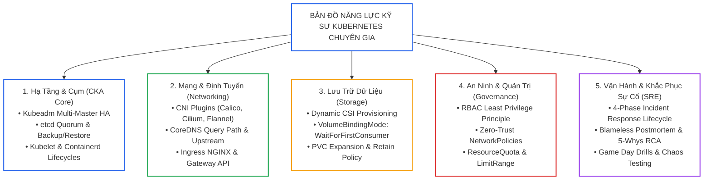
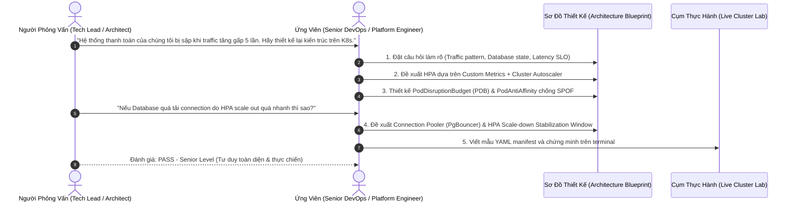
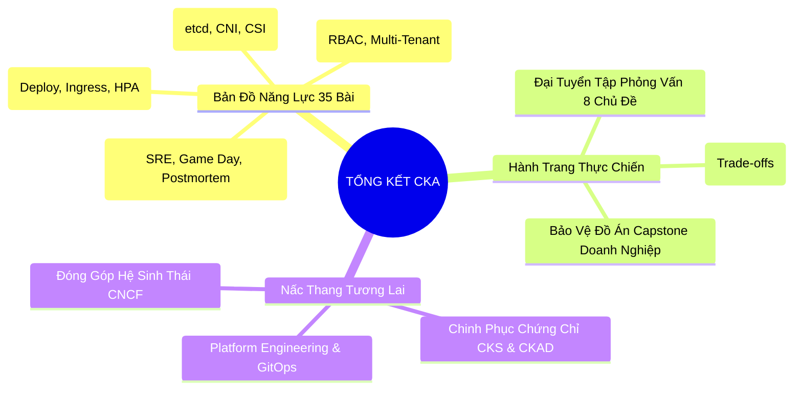


> [!IMPORTANT]
> **Mục tiêu kỹ thuật cốt lõi**: Khép lại trọn vẹn lộ trình **35 bài học CKA Exam & Cluster Admin Mastery**. Tổng hợp toàn bộ tri thức kỹ thuật tầng thấp thành **Bản Đồ Năng Lực Chuyên Gia (Senior Platform Architect Competency Matrix)**, làm chủ kỹ năng trả lời phỏng vấn chuyên sâu thông qua **Đại Tuyển Tập 8 Chủ Đề Phỏng Vấn Thực Chiến**, và tự tin bảo vệ các quyết định thiết kế kiến trúc hạ tầng trước hội đồng kỹ thuật hoặc nhà tuyển dụng hàng đầu.

---

## 1. Bản Chất Kiến Trúc & Tư Duy Cốt Lõi: Bản Đồ Năng Lực Kỹ Sư Kubernetes (Kubernetes Competency Matrix)

Hành trình từ một người vận hành hệ thống truyền thống (SysAdmin) chuyển mình thành một **Kỹ sư Nền tảng Đám mây (Platform / SRE Engineer)** đòi hỏi sự kết hợp giữa **3 trụ cột năng lực**:
1. **Thao Tác Thực Chiến Tốc Độ Cao (CLI Reflexes)**: Làm chủ `kubectl`, `etcdctl`, `crictl`, `journalctl` và các cờ tối ưu hóa thời gian.
2. **Thấu Hiểu Bản Chất Tầng Thấp (Low-Level Internals)**: Hiểu sâu chu trình điều hòa (Reconciliation Loop), giải thuật đồng thuận Raft của etcd, cơ chế đóng gói gói tin CNI Overlay (VXLAN/Geneve), và Linux Cgroups/Namespaces.
3. **Tư Duy Kiến Trúc & Đánh Đổi (Architectural Trade-offs)**: Biết khi nào nên dùng Hard vs. Soft Multi-Tenancy, lựa chọn CSI Reclaim Policy phù hợp, và thiết kế mạng Zero-Trust bảo vệ toàn diện hệ thống.



---

## 2. Bảng Ma Trận So Sánh Kỹ Thuật Toàn Diện (Engineering Matrix)

Bảng ma trận đánh giá năng lực phỏng vấn và các lỗi thiết kế phổ biến theo từng miền kiến thức:

| Miền Tri Thức (Domain) | Năng Lực Cốt Lõi Cần Chứng Minh | Lỗi Thiết Kế Điển Hình (Anti-Pattern) | Câu Hỏi Phỏng Vấn Sát Hạch Trọng Tâm | Tiêu Chuẩn Trả Lời Cấp Senior |
|---|---|---|---|---|
| **Cluster Architecture** | Hiểu cơ chế Raft, etcd Quorum `(N/2)+1`, Kubelet static pods | Đặt số lượng etcd member chẵn (ví dụ 4 nodes) | *"Tại sao cụm etcd 4 nodes lại có khả năng chịu lỗi kém hơn 3 nodes?"* | Giải thích hiện tượng Split-Brain và công thức Quorum yêu cầu 3 votes. |
| **Workloads & Scheduling** | Làm chủ QoS Classes, NodeAffinity, Taints/Tolerations, PodTopologySpread | Không khai báo `requests/limits`, để Pod ở BestEffort | *"Làm thế nào để phân bổ Pods đồng đều qua 3 Availability Zones?"* | Dùng `topologySpreadConstraints` với `maxSkew: 1` và `topologyKey: topology.kubernetes.io/zone`. |
| **Services & Networking** | Phân biệt iptables mode vs IPVS vs eBPF trong kube-proxy | Để dịch vụ phụ thuộc vào IP tĩnh của Pod | *"Điều gì xảy ra ở tầng Linux Kernel khi một request đi tới ClusterIP?"* | Phân tích cơ chế DNAT của iptables/IPVS thay thế ClusterIP thành Pod IP. |
| **Storage CSI** | Vòng đời PV, PVC, StorageClass, Retain vs Delete | Dùng hostPath trên cụm multi-node cho ứng dụng Stateful | *"Tại sao PVC ở trạng thái Pending khi StorageClass để WaitForFirstConsumer?"* | Giải thích cơ chế hoãn cấp phát cho tới khi Scheduler chọn được Node cho Pod. |
| **Troubleshooting & SRE** | Chẩn đoán 4 tầng (App, Pod, Node, Cluster), đọc log journalctl/crictl | Xóa Pod ngay lập tức khi lỗi mà không lưu log | *"Quy trình bạn điều tra một Node bị NotReady trong 3 phút là gì?"* | Cordon node -> SSH -> `systemctl status kubelet` -> `journalctl -u kubelet` -> `crictl ps`. |

---

## 3. Kiến Trúc Môi Trường & Luồng Thực Thi Mẫu

### Luồng Tương Tác Phỏng Vấn Kiến Trúc Trực Tiếp (Technical Interview / Defense Flow)



---

## 4. Phân Tích Cạm Bẫy Thực Chiến: 5 Sai Lầm Kinh Điển Khi Phỏng Vấn & Thiết Kế Kiến Trúc Cụm

### Tình Huống Sự Cố: Cấp Quyền `cluster-admin` Tràn Lan Khiến Kẻ Tấn Công Chiếm Quyền Điều Khiển Toàn Cụm

Trong một buổi phỏng vấn, khi được hỏi: *"Làm thế nào để ứng dụng CI/CD Runner có thể deploy vào các Namespace?"*, ứng viên trả lời: *"Tạo một ClusterRoleBinding gán quyền cluster-admin cho ServiceAccount của Runner để đỡ mất công cấu hình nhiều file"*.

### Hậu Quả & Log Lỗi Thực Tế:
```text
ALERT: Suspicious privilege escalation detected in cluster!
Principal: system:serviceaccount:cicd:gitlab-runner
Action: DELETE /api/v1/namespaces/kube-system/secrets
Result: 200 OK (Cluster PKI CA Secrets deleted by compromised CI/CD pipeline token)
```

### 5-Whys Root Cause Analysis:
1. **Tại sao cụm bị xóa mất chứng chỉ CA trong kube-system?** Vì pipeline CI/CD bị chèn mã độc (Supply Chain Attack) và thực thi lệnh xóa secret.
2. **Tại sao token của CI/CD Runner có thể xóa secret trong kube-system?** Vì ServiceAccount của Runner được cấp quyền `cluster-admin`.
3. **Tại sao lại cấp quyền `cluster-admin` cho một công cụ ứng dụng?** Vì kỹ sư muốn tiết kiệm thời gian phân quyền và không muốn quản lý nhiều RoleBinding.
4. **Tại sao hệ thống không chặn được hành vi này?** Vì quyền `cluster-admin` bỏ qua mọi rào chắn kiểm soát namespace.
5. **Gốc rễ vấn đề (Root Cause):** Vi phạm nghiêm trọng nguyên tắc đặc quyền tối thiểu (**Principle of Least Privilege**) và thiếu tư duy phân quyền an ninh trong thiết kế hệ thống.

### Biện Pháp Sửa Đổi Chuẩn Kiến Trúc:
```yaml
# Chỉ cấp quyền Role trong đúng namespace mục tiêu
apiVersion: rbac.authorization.k8s.io/v1
kind: Role
metadata:
  name: app-deployer
  namespace: app-production
rules:
- apiGroups: ["apps"]
  resources: ["deployments"]
  verbs: ["get", "list", "watch", "create", "update", "patch"]
- apiGroups: [""]
  resources: ["services", "configmaps"]
  verbs: ["get", "list", "watch", "create", "update", "patch"]
```

---

## 5. Hands-on Lab: Đại Tuyển Tập Phỏng Vấn SRE/Platform Engineer Thực Chiến (8 Bước)

| Bước | Chủ Đề Phỏng Vấn Chuyên Sâu | Vấn Đề Kỹ Thuật Trọng Tâm | Kỹ Năng Sát Hạch |
|---|---|---|---|
| **1** | Kiến Trúc Control Plane & etcd Quorum | Thuật toán Raft, sao lưu khôi phục snapshot, Split-Brain | `etcdctl`, `kube-apiserver` flags |
| **2** | Vòng Đời Pod & Cơ Chế Khởi Động Container | Pause container, Init Containers, Probes, OOMKilled | `kubectl describe`, cgroups Linux |
| **3** | Mạng Kubernetes: CNI, kube-proxy & Packet Flow | Overlay network (VXLAN), IPVS mode, iptables NAT | `iptables`, `ip route`, Calico CNI |
| **4** | Phân Giải CoreDNS & Định Tuyến Ingress | DNS Query Path, ndots:5, TLS Ingress Routing | Corefile, Ingress NGINX annotations |
| **5** | Lưu Trữ CSI & Dynamic Volume Lifecycle | PV/PVC Binding, VolumeBindingMode, Retain policy | `StorageClass`, `hostPath` vs CSI |
| **6** | Quản Trị Multi-Tenancy & QoS Classes | ResourceQuota, LimitRange, Eviction Thresholds | Guaranteed vs Burstable vs BestEffort |
| **7** | An Ninh Bảo Mật RBAC & Zero-Trust NetworkPolicy | Least Privilege, ServiceAccount Token, Default Deny | `NetworkPolicy`, `RoleBinding` |
| **8** | Quy Trình Ứng Phó Sự Cố & Tối Ưu MTTR | Chẩn đoán Node NotReady, Kubelet crash, Blameless RCA | `journalctl`, `crictl`, Postmortem |

---

### Bước 1: Chủ Đề 1 — Bản Chất etcd Quorum & Cơ Chế Hoạt Động Của Control Plane

#### Câu hỏi phỏng vấn:
> *"Tại sao số lượng node trong cụm etcd luôn phải là số lẻ (3, 5, 7)? Nếu cụm có 5 node bị mất 2 node thì cụm có ghi dữ liệu được không? Nếu mất 3 node thì sao?"*

#### Đáp án kỹ thuật chuẩn mực:
- **Công thức Quorum:** Để etcd chấp nhận một thao tác ghi (Write transaction), đa số thành viên phải đồng thuận:
  $$\text{Quorum} = \lfloor N/2 \rfloor + 1$$
- Với cụm $N=5$: $\text{Quorum} = \lfloor 5/2 \rfloor + 1 = 3$.
  - Nếu mất 2 node $\rightarrow$ Còn 3 nodes $\ge 3$ (Đạt Quorum) $\rightarrow$ **Cụm vẫn đọc/ghi bình thường**.
  - Nếu mất 3 node $\rightarrow$ Còn 2 nodes $< 3$ (Mất Quorum) $\rightarrow$ **Cụm chuyển sang chế độ Read-Only**, từ chối mọi thao tác ghi để chống xung đột dữ liệu (Split-Brain).
- Số lượng node lẻ giúp tối ưu chi phí và khả năng chịu lỗi: Cụm 4 nodes cũng chỉ chịu được mất 1 node (Quorum = 3), tương đương cụm 3 nodes nhưng tốn thêm 1 node lãng phí.

---

### Bước 2: Chủ Đề 2 — Vòng Đời Pod, Container Pause & Cơ Chế OOMKilled

#### Câu hỏi phỏng vấn:
> *"Pause Container là gì và đóng vai trò gì trong mỗi Pod? Làm thế nào Kubernetes phát hiện và xử lý khi một container bị OOMKilled?"*

#### Đáp án kỹ thuật chuẩn mực:
- **Pause Container (Infra Container):** Là container đầu tiên được khởi tạo trong Pod. Nhiệm vụ của nó là giữ và chia sẻ **Linux Namespaces (Network, IPC, UTS)** cho tất cả các container người dùng trong cùng Pod. Nhờ đó, các container trong Pod có thể giao tiếp qua `localhost` và chia sẻ chung địa chỉ IP.
- **Cơ chế OOMKilled:** Khi tiến trình trong container tiêu thụ bộ nhớ vượt quá `resources.limits.memory`, Linux Kernel Cgroups phát hiện vi phạm và gửi tín hiệu `SIGKILL` (Exit Code 137). Kubelet nhận thông báo từ Container Runtime, ghi nhận trạng thái `Terminated (Reason: OOMKilled)` và kích hoạt restart container theo `restartPolicy`.

---

### Bước 3: Chủ Đề 3 — Luồng Gói Tin Mạng CNI & kube-proxy (iptables vs IPVS)

#### Câu hỏi phỏng vấn:
> *"Hãy giải thích đường đi của một gói tin từ Pod A trên Node 1 gửi tới ClusterIP Service của Pod B trên Node 2?"*

#### Đáp án kỹ thuật chuẩn mực:
1. Pod A gửi gói tin đến IP đích là `ClusterIP:Port`.
2. Gói tin đi qua giao diện `veth` của Pod ra Bridge mạng trên Node 1.
3. **Netfilter / iptables (hoặc IPVS / eBPF):** Quy tắc do `kube-proxy` tạo ra chặn gói tin và thực hiện **DNAT (Destination NAT)**, đổi địa chỉ đích từ `ClusterIP` thành IP thực của Pod B (`10.244.2.X`).
4. **CNI Routing (Calico/Flannel):** Node 1 tra cứu bảng định tuyến, đóng gói gói tin (ví dụ: bọc thêm header VXLAN với Outer IP là IP của Node 2) và gửi qua mạng vật lý.
5. Node 2 nhận gói tin, bóc tách header VXLAN và chuyển gói tin nguyên bản vào giao diện `veth` của Pod B.

---

### Bước 4: Chủ Đề 4 — Hiệu Năng Phân Giải CoreDNS & Tham Số `ndots:5`

#### Câu hỏi phỏng vấn:
> *"Tại sao tham số mặc định ndots:5 trong /etc/resolv.conf của Pod lại có thể làm tăng gấp 5 lần tải truy vấn lên CoreDNS đối với các domain bên ngoài (như api.stripe.com)?"*

#### Đáp án kỹ thuật chuẩn mực:
- Trong Linux resolver, nếu số lượng dấu chấm `.` trong tên miền nhỏ hơn giá trị `ndots` (mặc định là 5), hệ thống sẽ thử nối lần lượt các chuỗi trong `search domains` trước:
  1. `api.stripe.com.default.svc.cluster.local` (Fail)
  2. `api.stripe.com.svc.cluster.local` (Fail)
  3. `api.stripe.com.cluster.local` (Fail)
  4. `api.stripe.com.ec2.internal` (Fail)
  5. `api.stripe.com.` (Thành công ở lần truy vấn thứ 5!)
- **Giải pháp tối ưu:** Sử dụng dấu chấm tuyệt đối ở cuối tên miền trong mã nguồn (ví dụ: `https://api.stripe.com./`) hoặc cấu hình `dnsConfig.options: [{name: "ndots", value: "2"}]` trong Pod spec.

---

### Bước 5: Chủ Đề 5 — Quản Lý Lưu Trữ CSI & VolumeBindingMode

#### Câu hỏi phỏng vấn:
> *"Sự khác biệt giữa volumeBindingMode: Immediate và volumeBindingMode: WaitForFirstConsumer trong StorageClass là gì?"*

#### Đáp án kỹ thuật chuẩn mực:
- **Immediate:** Volume được cấp phát ngay lập tức khi PVC được tạo. Không quan tâm Pod sẽ chạy ở đâu. Có nguy cơ PV nằm ở Zone A nhưng Pod lại được schedule sang Zone B (không gắn được ổ đĩa).
- **WaitForFirstConsumer:** Trì hoãn việc tạo PV cho tới khi Pod sử dụng PVC được Scheduler chọn Node thành công. Điều này đảm bảo ổ đĩa lưu trữ luôn được cấp phát tại đúng Zone/Node mà Pod đang cư trú.

---

### Bước 6: Chủ Đề 6 — Phân Hạng QoS (Guaranteed, Burstable, BestEffort)

#### Câu hỏi phỏng vấn:
> *"Kubernetes xác định hạng QoS của Pod như thế nào và thứ tự trục xuất (Eviction Order) khi Node cạn kiệt bộ nhớ ra sao?"*

#### Đáp án kỹ thuật chuẩn mực:
- **Guaranteed:** 100% container trong Pod có `requests.cpu == limits.cpu` và `requests.memory == limits.memory`.
- **Burstable:** Ít nhất một container có `requests` khác `limits` hoặc chỉ khai báo `requests`.
- **BestEffort:** Không khai báo bất kỳ `requests` hay `limits` nào.
- **Thứ tự trục xuất khi Node bị MemoryPressure:**
  $$\text{BestEffort (Bị kill đầu tiên)} \longrightarrow \text{Burstable} \longrightarrow \text{Guaranteed (Bị kill cuối cùng)}$$

---

### Bước 7: Chủ Đề 7 — An Ninh Bảo Mật Zero-Trust & NetworkPolicy

#### Câu hỏi phỏng vấn:
> *"Làm thế nào để thiết kế chính sách NetworkPolicy theo mô hình Zero-Trust cho một ứng dụng 3-tier (Web -> Backend -> DB)?"*

#### Đáp án kỹ thuật chuẩn mực:
1. Áp dụng chính sách **Default Deny All** (chặn toàn bộ Ingress và Egress trong Namespace).
2. Tạo NetworkPolicy cho tầng **Web**: Cho phép Ingress từ Ingress Controller, cho phép Egress tới CoreDNS (port 53) và tầng Backend (port 8080).
3. Tạo NetworkPolicy cho tầng **Backend**: Chỉ cho phép Ingress từ Pods có label `tier=web`, cho phép Egress tới CoreDNS và tầng Database (port 5432).
4. Tạo NetworkPolicy cho tầng **DB**: Chỉ cho phép Ingress từ Pods có label `tier=backend` trên port 5432, không cho phép bất kỳ Egress nào ra ngoài.

---

### Bước 8: Chủ Đề 8 — Quy Trình Chẩn Đoán & Tối Ưu Hóa MTTR

#### Kịch bản thực hành:
Thực thi lệnh kiểm tra sức khỏe toàn diện cụm chỉ trong 30 giây:

```bash
# 1. Kiểm tra trạng thái Node và phiên bản
kubectl get nodes -o wide

# 2. Kiểm tra các Pods lỗi trên toàn cụm
kubectl get pods -A --field-selector status.phase!=Running,status.phase!=Succeeded

# 3. Kiểm tra số lần restart cao bất thường
kubectl get pods -A --sort-by='.status.containerStatuses[0].restartCount' | tail -n 10

# 4. Kiểm tra sức khỏe etcd
sudo ETCDCTL_API=3 etcdctl \
  --cacert=/etc/kubernetes/pki/etcd/ca.crt \
  --cert=/etc/kubernetes/pki/etcd/server.crt \
  --key=/etc/kubernetes/pki/etcd/server.key \
  endpoint health -w table
```

---

## 6. 10 Câu Hỏi Tự Kiểm Tra Chuyên Sâu (Self-Check Q&A Accordion)

<details class="qa-card">
<summary><b>1. Làm thế nào để giải thích cơ chế Reconciliation Loop của Kubernetes Controller Manager cho một người mới?</b></summary>
<div class="qa-answer">
<p>Reconciliation Loop là một <b>vòng lặp vô tận (Infinite Control Loop)</b> liên tục thực hiện 3 bước:</p>
<div>1. <b>Quan sát (Observe):</b> Đọc trạng thái thực tế hiện tại (Actual State) của hệ thống từ etcd thông qua API Server.</div>
<div>2. <b>So sánh (Diff):</b> So sánh trạng thái thực tế với trạng thái mong muốn (Desired State) do người dùng khai báo trong manifest YAML.</div>
<div>3. <b>Điều chỉnh (Act/Reconcile):</b> Thực hiện các thao tác (tạo thêm Pod, xóa Pod thừa, cập nhật endpoint) để đưa trạng thái thực tế khớp 100% với trạng thái mong muốn.</div>
</div>
</details>

<details class="qa-card">
<summary><b>2. Tại sao ta không nên chạy ứng dụng Stateful (như MySQL/PostgreSQL) trên Kubernetes mà không dùng StatefulSet?</b></summary>
<div class="qa-answer">
<p>Deployment thông thường coi các Pod là vô danh và có thể thay thế lẫn nhau (ephemeral). Nếu dùng Deployment, các Pod sẽ dùng chung PVC hoặc bị cấp phát ngẫu nhiên, khi restart sẽ đổi tên và IP, gây hỏng hóc CSDL. <b>StatefulSet</b> đảm bảo: danh tính mạng cố định (<code>mysql-0</code>, <code>mysql-1</code>), mỗi Pod gắn với một PVC riêng biệt thông qua <code>volumeClaimTemplates</code>, và thứ tự khởi động/tắt được kiểm soát tuần tự.</p>
</div>
</details>

<details class="qa-card">
<summary><b>3. Giải thích sự khác biệt giữa `nodeSelector`, `nodeAffinity`, và `Taints/Tolerations`?</b></summary>
<div class="qa-answer">
<p><b>nodeSelector:</b> Cơ chế gán Pod vào Node đơn giản nhất bằng cách so khớp key-value nhãn chính xác.</p>
<p><b>nodeAffinity:</b> Cơ chế mở rộng mạnh mẽ của nodeSelector, hỗ trợ các toán tử logic (In, NotIn, Exists) và quy tắc mềm (Preferred) hoặc cứng (Required).</p>
<p><b>Taints & Tolerations:</b> Hoạt động theo chiều ngược lại — Node đặt ra "vết nhơ" (Taint) để <b>xua đuổi (Repel)</b> các Pods không mong muốn, chỉ những Pod có "sức chịu đựng" (Toleration) tương ứng mới được phép chạy trên Node đó.</p>
</div>
</details>

<details class="qa-card">
<summary><b>4. Tại sao lệnh `kubectl exec` lại có thể mở được shell vào container bên trong Worker Node?</b></summary>
<div class="qa-answer">
<p>Khi chạy <code>kubectl exec</code>, API Server nâng cấp kết nối HTTP thành kết nối hai chiều <b>WebSocket/SPDY</b> (Streaming Connection) tới cổng 10250 của Kubelet trên Worker Node. Kubelet sau đó gọi giao diện <b>CRI (Container Runtime Interface)</b> của Containerd để tạo tiến trình shell bên trong Linux Namespaces của container và truyền tải luồng stdin/stdout qua kết nối stream.</p>
</div>
</details>

<details class="qa-card">
<summary><b>5. Sự khác biệt giữa ServiceAccount Token chiếu xạ (Bound ServiceAccount Token) và Token Secret tĩnh cũ là gì?</b></summary>
<div class="qa-answer">
<p>Từ bản K8s 1.22+, Kubernetes sử dụng <b>Bound ServiceAccount Tokens</b> (Token chiếu xạ). Token này có các đặc tính an ninh vượt trội: có <b>thời hạn hết hạn tự động (Time-bound)</b>, gắn chặt với <b>vòng đời của Pod (Pod-bound)</b> (khi Pod chết token lập tức vô hiệu), và có trường <b>Audience</b> cụ thể. Token tĩnh cũ không bao giờ hết hạn và được lưu trong Secret, rất dễ bị rò rỉ và lạm dụng.</p>
</div>
</details>

<details class="qa-card">
<summary><b>6. Khi nào ta nên sử dụng Ingress Controller và khi nào nên chuyển sang Gateway API?</b></summary>
<div class="qa-answer">
<p><b>Ingress Controller</b> phù hợp cho các nhu cầu định tuyến HTTP/HTTPS cơ bản trong một tổ chức nhỏ. <b>Gateway API</b> là thế hệ kế tiếp (Next-Gen) của Ingress, hỗ trợ phân quyền theo vai trò (Infra Provider quản lý GatewayClass, Cluster Admin quản lý Gateway, Developer quản lý HTTPRoute), hỗ trợ native các giao thức nâng cao (gRPC, TCP/UDP, TLS Passthrough) và khả năng chia tải lưu lượng (Traffic Splitting / Canary) mà không cần các annotation phức tạp.</p>
</div>
</details>

<details class="qa-card">
<summary><b>7. Làm thế nào để cấu hình Zero-Downtime Deployment trên Kubernetes?</b></summary>
<div class="qa-answer">
<p>4 yếu tố bắt buộc:</p>
<div>1. Triển khai <b>Readiness Probe</b> chuẩn xác để traffic không đi vào container chưa sẵn sàng.</div>
<div>2. Cấu hình <b>RollingUpdate Strategy</b> với <code>maxUnavailable: 0</code> và <code>maxSurge: 1</code>.</div>
<div>3. Xử lý tín hiệu tắt lịch sự trong ứng dụng (bắt tín hiệu <b>SIGTERM</b> và hoàn tất các request đang dang dở).</div>
<div>4. Thiết lập <b>preStop hook</b> (ví dụ: <code>sleep 5</code>) để đảm bảo iptables/kube-proxy trên toàn cụm kịp thời xóa IP của Pod cũ khỏi endpoint trước khi container bị dừng.</div>
</div>
</details>

<details class="qa-card">
<summary><b>8. Lợi ích lớn nhất của việc sử dụng eBPF (như Cilium CNI) thay cho iptables trong cụm Kubernetes quy mô lớn là gì?</b></summary>
<div class="qa-answer">
<p>Khi cụm Kubernetes mở rộng lên hàng nghìn Services và Pods, bảng <code>iptables</code> chứa hàng chục nghìn quy tắc tuần tự ($O(N)$), gây suy giảm hiệu năng CPU và độ trễ mạng nghiêm trọng. <b>eBPF</b> xử lý định tuyến và lọc gói tin trực tiếp trong Linux Kernel thông qua cấu trúc bảng băm (Hash Maps $O(1)$), mang lại hiệu năng mạng vượt trội, giám sát lưu lượng mạng chi tiết ở tầng L7 và khả năng bảo mật runtime theo thời gian thực.</p>
</div>
</details>

<details class="qa-card">
<summary><b>9. Làm thế nào để bảo vệ cụm Kubernetes khỏi các lỗ hổng Container Escape?</b></summary>
<div class="qa-answer">
<p>Áp dụng nguyên tắc phòng thủ chiều sâu (Defense-in-Depth):</p>
<div>1. Ép buộc áp dụng <b>Pod Security Standards (Restricted Profile)</b>: Cấm chạy container dưới quyền <code>root</code> (<code>runAsNonRoot: true</code>), cấm <code>privileged: true</code>, cấm <code>allowPrivilegeEscalation: false</code>.</div>
<div>2. Khóa chặt tệp hệ thống bằng <code>readOnlyRootFilesystem: true</code> và xóa toàn bộ Linux Capabilities (<code>drop: ["ALL"]</code>).</div>
<div>3. Kích hoạt hồ sơ bảo vệ Kernel: <b>AppArmor</b> và <b>Seccomp (RuntimeDefault)</b>.</div>
<div>4. Sử dụng Sandbox Container Runtime (như <b>gVisor</b> hoặc <b>Kata Containers</b>) cho các workload không tin cậy.</div>
</div>
</details>

<details class="qa-card">
<summary><b>10. Những bước tiếp theo được khuyến nghị sau khi hoàn thành chứng chỉ CKA là gì?</b></summary>
<div class="qa-answer">
<p>Lộ trình phát triển tiếp theo:</p>
<div>1. <b>Chinh phục CKS (Certified Kubernetes Security Specialist):</b> Nâng cấp năng lực chuyên gia bảo mật hạ tầng cụm, AppArmor, Seccomp, Falco, và Trivy scanning.</div>
<div>2. <b>Chuyển dịch sang Platform Engineering:</b> Xây dựng Internal Developer Platforms (IDP) bằng cách kết hợp Kubernetes với <b>Backstage</b>, <b>Crossplane</b>, <b>ArgoCD (GitOps)</b> và <b>OpenTelemetry</b>.</div>
<div>3. <b>Tham gia đóng góp cộng đồng:</b> Đóng góp mã nguồn hoặc tài liệu cho các dự án CNCF (Kubernetes, Envoy, Helm, Prometheus).</div>
</div>
</details>

---

## 7. Tổng Kết & Lộ Trình Bài Học Tiếp Theo



Chúc mừng bạn đã hoàn thành xuất sắc toàn bộ khóa học **CKA Exam & Cluster Admin Mastery (35 Bài Học Chuyên Sâu)**! Bạn đã trang bị đầy đủ kiến thức nền tảng vững chắc, phản xạ dòng lệnh điêu luyện và tư duy kiến trúc hiện đại để tự tin vượt qua kỳ thi CKA với điểm số tối đa, cũng như sẵn sàng đảm nhận vai trò **Senior SRE / Cloud-Native Platform Engineer** tại các tổ chức công nghệ hàng đầu.

> [!TIP]
> **Hành trình tiếp theo**: Hãy tiếp tục phát triển chuyên môn với lộ trình bảo mật nâng cao **[Certified Kubernetes Security Specialist (CKS) Mastery Series](../cks/index.html)** và xây dựng nền tảng **Platform Engineering trên môi trường Đa Đám Mây (Multi-Cloud)**.

