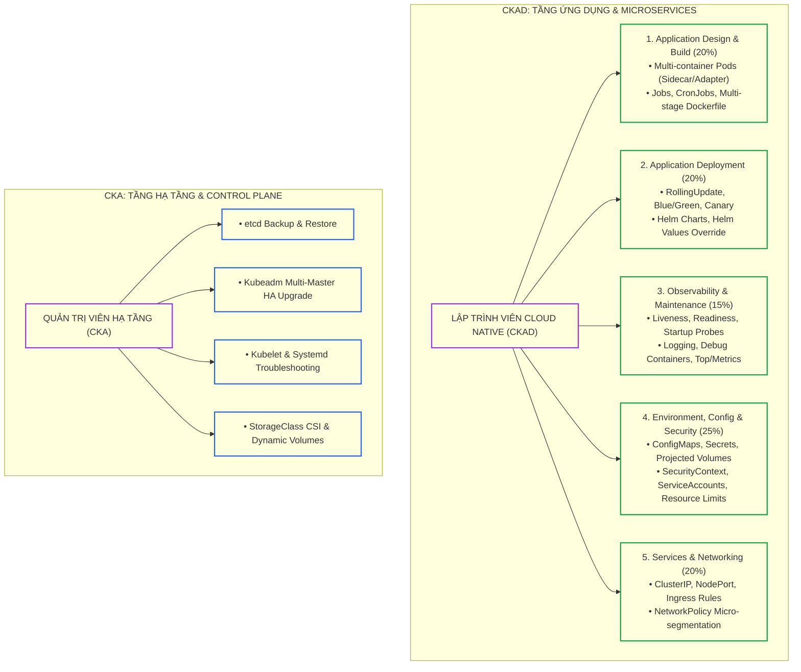
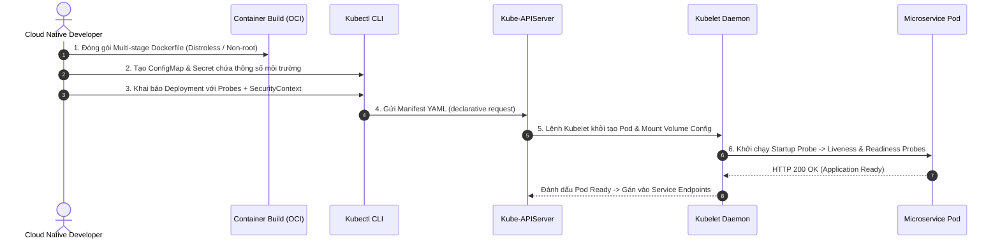
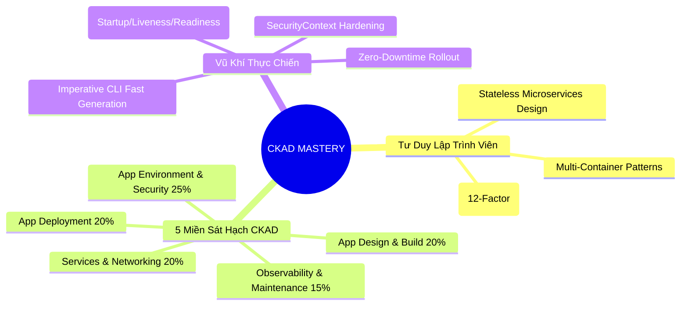


> [!IMPORTANT]
> **Mục tiêu kỹ thuật cốt lõi**: Xác lập tư duy lập trình và vận hành ứng dụng Cloud-Native (**Application Developer Mindset**). Nắm vững sự khác biệt căn bản giữa hai kỳ thi chứng chỉ quốc tế của Linux Foundation / CNCF: **CKA (Quản trị hạ tầng cụm)** và **CKAD (Phát triển ứng dụng trên cụm)**. Làm chủ 5 miền kiến thức trọng tâm của CKAD, thiết lập phản xạ thao tác lệnh `kubectl` định hướng ứng dụng, và hiểu rõ chu trình sống của một dịch vụ microservice phân tán từ khâu đóng gói container đến khi chạy production.

---

## 1. Bản Chất Kiến Trúc & Tư Duy Cốt Lõi: Chuyển Dịch Tư Duy Từ CKA (Admin) Sang CKAD (Developer)

Trong khi chứng chỉ **CKA (Certified Kubernetes Administrator)** tập trung vào việc duy trì sức khỏe của hạ tầng cụm (cài đặt `kubeadm`, sao lưu `etcd`, khắc phục sự cố `kubelet`, cấu hình `CNI/CSI`), chứng chỉ **CKAD (Certified Kubernetes Application Developer)** lại đặt trọng tâm vào **trải nghiệm của lập trình viên và vòng đời ứng dụng (Application Lifecycle)**.



### 5 Miền Kiến Thức Trọng Tâm Của CKAD (CNCF Curriculum):
1. **Application Environment, Configuration and Security (25%)**: Cấu hình biến môi trường, nạp Secrets, Downward API, và áp đặt `securityContext` (chạy non-root, drop capabilities).
2. **Application Design and Build (20%)**: Đóng gói container tối ưu, thiết kế các mẫu Pod đa container (Sidecar, Adapter, Ambassador), và quản lý tiến trình theo lượt (Jobs & CronJobs).
3. **Application Deployment (20%)**: Quản lý chiến lược cập nhật RollingUpdate, điều phối lưu lượng Canary/Blue-Green và triển khai ứng dụng bằng Helm.
4. **Services and Networking (20%)**: Phơi bày ứng dụng qua Services, cấu hình Ingress HTTP routing và phong tỏa mạng bằng NetworkPolicy.
5. **Application Observability and Maintenance (15%)**: Thiết lập tam giác Probes (Liveness, Readiness, Startup), phân tích log container và kiểm tra độ tiêu thụ tài nguyên bằng `kubectl top`.

---

## 2. Bảng Ma Trận So Sánh Kỹ Thuật Toàn Diện (Engineering Matrix)

Bảng ma trận đối sánh chi tiết phạm vi kỹ thuật giữa CKA và CKAD:

| Tiêu Chí So Sánh | CKA (Cluster Administrator) | CKAD (Application Developer) | Đánh Đổi Kỹ Thuật (Trade-Off) | Cạm Bẫy CKAD Cần Tránh |
|---|---|---|---|---|
| **Góc Nhìn Trọng Tâm** | Hạ tầng, Node vật lý, Control Plane | Ứng dụng, Container, Microservices | Admin lo "cụm sống hay chết", Dev lo "app chạy đúng hay sai" | Cố gắng sửa Kubelet/etcd trong khi đề bài CKAD chỉ nằm ở Pod/Service |
| **Thao Tác Với Node** | SSH vào Node, `systemctl`, sửa file `/etc/kubernetes` | Không cần SSH vào Node, chỉ thao tác qua `kubectl` | CKAD 100% thao tác qua Kubernetes API Server | Quên chỉ định đúng Namespace (`-n <ns>`) trong câu lệnh |
| **Quản Lý Bộ Nhớ & CPU** | Cài đặt CNI/CSI, cấp phát tài nguyên Node | Định nghĩa `resources.requests` và `limits` cho từng Container | Requests dùng cho Scheduling, Limits dùng chống rò rỉ RAM | Đặt Limit quá thấp dẫn đến Pod bị `OOMKilled` liên tục |
| **Kiểm Tra Sức Khỏe** | Kiểm tra Kubelet status, Node Conditions | Thiết lập `livenessProbe`, `readinessProbe`, `startupProbe` | Probe sai port/path khiến container bị Kubelet kill vô cớ | Không cấu hình `initialDelaySeconds` cho app khởi động chậm |
| **Cấu Hình & Bí Mật** | Cấu hình PKI Certs, Kubeconfig, Audit policy | Sử dụng `ConfigMap`, `Secret`, biến môi trường, Volume mounts | Tránh hardcode cấu hình trong image, tuân thủ 12-Factor App | Quên decode Base64 khi kiểm tra nội dung Secret |
| **Chiến Lược Deploy** | Nâng cấp cụm bằng `kubeadm upgrade` | Rollout Deployment, Canary, Blue/Green, Helm values | Đảm bảo tính khả dụng Zero-Downtime của dịch vụ người dùng | Không kiểm tra `readinessProbe` trước khi Rollout làm mất traffic |

---

## 3. Kiến Trúc Môi Trường & Luồng Thực Thi Mẫu

### Luồng Vận Hành Của Lập Trình Viên Cloud-Native



### Manifest Mẫu Một Ứng Dụng Cloud-Native Chuẩn Mực

```yaml
# production-cloud-native-app.yaml
apiVersion: apps/v1
kind: Deployment
metadata:
  name: payment-api
  namespace: default
  labels:
    app: payment-api
    tier: backend
spec:
  replicas: 3
  selector:
    matchLabels:
      app: payment-api
  template:
    metadata:
      labels:
        app: payment-api
        tier: backend
    spec:
      securityContext:
        runAsNonRoot: true
        runAsUser: 10001
        fsGroup: 10001
      containers:
      - name: api
        image: nginx:alpine
        imagePullPolicy: IfNotPresent
        ports:
        - containerPort: 8080
          name: http
        resources:
          requests:
            cpu: 100m
            memory: 128Mi
          limits:
            cpu: 500m
            memory: 256Mi
        securityContext:
          allowPrivilegeEscalation: false
          readOnlyRootFilesystem: true
          capabilities:
            drop:
            - ALL
        env:
        - name: APP_ENV
          valueFrom:
            configMapKeyRef:
              name: app-config
              key: ENVIRONMENT
        startupProbe:
          httpGet:
            path: /healthz
            port: 8080
          failureThreshold: 30
          periodSeconds: 2
        livenessProbe:
          httpGet:
            path: /healthz
            port: 8080
          periodSeconds: 10
          timeoutSeconds: 2
        readinessProbe:
          httpGet:
            path: /ready
            port: 8080
          periodSeconds: 5
          timeoutSeconds: 2
        volumeMounts:
        - name: tmp-vol
          mountPath: /tmp
      volumes:
      - name: tmp-vol
        emptyDir: {}
```

---

## 4. Phân Tích Cạm Bẫy Thực Chiến: Ứng Dụng Khởi Động Chậm Khiến Liveness Probe Gây CrashLoopBackOff

### Tình Huống Sự Cố: Ứng Dụng Java/Node.js Cần 30 Giây Để Khởi Động Nhưng Liên Tục Bị Kích Hoạt Kill

Một lập trình viên triển khai vi dịch vụ xử lý thanh toán lên cụm Kubernetes. Ứng dụng cần nạp cache và kết nối database mất khoảng 35 giây trước khi mở cổng HTTP. Tuy nhiên, Pod vừa chạy được 15 giây thì bị Kubelet gửi tín hiệu `SIGKILL` và restart liên tục, rơi vào trạng thái `CrashLoopBackOff`.

### Hậu Quả & Log Lỗi Thực Tế:
```text
Events:
  Type     Reason     Age                From               Message
  ----     ------     ----               ----               -------
  Normal   Scheduled  45s                default-scheduler  Successfully assigned default/payment-api to worker-01
  Normal   Pulled     40s                kubelet            Container image "payment:v1" already present on machine
  Normal   Created    39s                kubelet            Created container api
  Normal   Started    38s                kubelet            Started container api
  Warning  Unhealthy  25s (x3 over 35s)  kubelet            Liveness probe failed: HTTP probe failed with statuscode: 503
  Normal   Killing    25s                kubelet            Container api failed liveness probe, will be restarted
```

### 5-Whys Root Cause Analysis:
1. **Tại sao Container bị Kubelet kill và restart liên tục?** Vì `livenessProbe` thất bại liên tiếp 3 lần (`failureThreshold: 3`).
2. **Tại sao Liveness Probe thất bại?** Vì endpoint `/healthz` trả về lỗi HTTP 503 hoặc connection refused trong 30 giây đầu tiên.
3. **Tại sao endpoint chưa sẵn sàng?** Vì ứng dụng Java/Spring Boot cần 35 giây để hoàn tất nạp framework và database connection pool.
4. **Tại sao Liveness Probe lại kiểm tra quá sớm?** Vì cấu hình `initialDelaySeconds: 5` và `periodSeconds: 5`, khiến probe bắt đầu thăm dò ngay từ giây thứ 5.
5. **Gốc rễ vấn đề (Root Cause):** Thiếu cơ chế **Startup Probe** chuyên dụng cho các ứng dụng khởi động chậm, hoặc cấu hình `initialDelaySeconds` quá ngắn so với thời gian khởi động thực tế.

### Biện Pháp Khắc Phục Chuẩn:
```diff
--- a/deployment.yaml
+++ b/deployment.yaml
@@ -20,6 +20,12 @@
         resources:
           limits:
             memory: 512Mi
+        # Sử dụng Startup Probe để bảo vệ ứng dụng trong giai đoạn khởi động
+        startupProbe:
+          httpGet:
+            path: /healthz
+            port: 8080
+          failureThreshold: 30
+          periodSeconds: 2
         livenessProbe:
           httpGet:
             path: /healthz
             port: 8080
-          initialDelaySeconds: 5
+          periodSeconds: 10
```

---

## 5. Hands-on Lab: Khởi Tạo Ứng Dụng Cloud Native Chuẩn Mực (8 Bước)

| Bước | Mục Tiêu Kỹ Thuật | Lệnh / Manifest Kiểm Tra Chính |
|---|---|---|
| **1** | Thiết lập môi trường và cấu hình Alias phòng thi CKAD | `alias k=kubectl`, `export do="--dry-run=client -o yaml"` |
| **2** | Khởi tạo ConfigMap và Secret chứa cấu hình ứng dụng | `k create cm`, `k create secret generic` |
| **3** | Xây dựng Multi-Container Pod (App Producer + Sidecar Consumer) | Multi-container Pod với `emptyDir` Volume |
| **4** | Áp đặt SecurityContext an toàn (Non-root & Read-only Root) | `runAsNonRoot: true`, `readOnlyRootFilesystem: true` |
| **5** | Tích hợp tam giác Probes (Startup, Liveness, Readiness) | `startupProbe`, `livenessProbe`, `readinessProbe` |
| **6** | Expose dịch vụ qua ClusterIP Service và Ingress Route | `k expose deploy`, `k create ingress` |
| **7** | Cấu hình Horizontal Pod Autoscaler (HPA) theo CPU | `k autoscale deployment --cpu-percent=70` |
| **8** | Kiểm thử End-to-End và xác minh trạng thái Pod Ready | `k get pods,svc,hpa -o wide` |

---

### Bước 1: Thiết Lập Môi Trường Làm Bài & Các Biến Tốc Độ

```bash
# Thiết lập alias kubectl và auto-completion
source <(kubectl completion bash)
alias k=kubectl
complete -o default -F __start_kubectl k
export do="--dry-run=client -o yaml"
export now="--force --grace-period=0"

# Tạo namespace làm việc cho CKAD Lab
kubectl create ns ckad-lab
kubectl config set-context --current --namespace=ckad-lab
```

---

### Bước 2: Khởi Tạo ConfigMap & Secret

```bash
# 1. Tạo ConfigMap chứa thông số ứng dụng
kubectl create configmap app-config \
  --from-literal=ENVIRONMENT=production \
  --from-literal=LOG_LEVEL=info \
  --from-literal=PORT=8080

# 2. Tạo Secret chứa chuỗi kết nối bảo mật
kubectl create secret generic db-secret \
  --from-literal=DB_USER=appuser \
  --from-literal=DB_PASSWORD=SecurePassword123!
```

---

### Bước 3: Triển Khai Multi-Container Pod (Sidecar Pattern)

```yaml
# sidecar-pod.yaml
apiVersion: v1
kind: Pod
metadata:
  name: web-logger-pod
  labels:
    app: web-logger
spec:
  volumes:
  - name: shared-logs
    emptyDir: {}
  containers:
  # Container chính: Ghi log
  - name: app-producer
    image: busybox:1.36
    command: ["/bin/sh", "-c", "while true; do echo \"$(date) - Transaction processed successfully\" >> /var/log/app.log; sleep 3; done"]
    volumeMounts:
    - name: shared-logs
      mountPath: /var/log
  # Container phụ (Sidecar): Đọc và stream log
  - name: log-sidecar
    image: busybox:1.36
    command: ["/bin/sh", "-c", "tail -f /var/log/app.log"]
    volumeMounts:
    - name: shared-logs
      mountPath: /var/log
```
```bash
kubectl apply -f sidecar-pod.yaml
# Kiểm tra log từ container sidecar
kubectl logs web-logger-pod -c log-sidecar
```

---

### Bước 4: Áp Đặt SecurityContext Chuẩn An Ninh Ứng Dụng

```yaml
# secure-app.yaml
apiVersion: v1
kind: Pod
metadata:
  name: secure-app
spec:
  securityContext:
    runAsNonRoot: true
    runAsUser: 2000
    fsGroup: 2000
  containers:
  - name: secure-web
    image: nginx:alpine
    securityContext:
      allowPrivilegeEscalation: false
      readOnlyRootFilesystem: true
      capabilities:
        drop:
        - ALL
    volumeMounts:
    - name: cache-vol
      mountPath: /var/cache/nginx
    - name: run-vol
      mountPath: /var/run
  volumes:
  - name: cache-vol
    emptyDir: {}
  - name: run-vol
    emptyDir: {}
```
```bash
kubectl apply -f secure-app.yaml
kubectl get pod secure-app
```

---

### Bước 5: Tích Hợp Đầy Đủ Probes Vào Deployment

```yaml
# robust-deployment.yaml
apiVersion: apps/v1
kind: Deployment
metadata:
  name: robust-api
spec:
  replicas: 2
  selector:
    matchLabels:
      app: robust-api
  template:
    metadata:
      labels:
        app: robust-api
    spec:
      containers:
      - name: api
        image: nginx:alpine
        ports:
        - containerPort: 80
        resources:
          requests:
            cpu: 50m
            memory: 64Mi
          limits:
            cpu: 200m
            memory: 128Mi
        startupProbe:
          httpGet:
            path: /
            port: 80
          failureThreshold: 10
          periodSeconds: 2
        livenessProbe:
          httpGet:
            path: /
            port: 80
          periodSeconds: 10
        readinessProbe:
          httpGet:
            path: /
            port: 80
          periodSeconds: 5
```
```bash
kubectl apply -f robust-deployment.yaml
kubectl rollout status deployment/robust-api
```

---

### Bước 6: Expose Service & Cấu Hình Ingress Routing

```bash
# 1. Expose Service ClusterIP
kubectl expose deployment robust-api --name=robust-svc --port=80 --target-port=80

# 2. Tạo Ingress Rule
kubectl create ingress robust-ing \
  --class=nginx \
  --rule="api.ckad.local/*=robust-svc:80"
```

---

### Bước 7: Cấu Hình Horizontal Pod Autoscaler (HPA)

```bash
# Tự động co giãn từ 2 đến 10 Pods khi CPU tiêu thụ vượt quá 70%
kubectl autoscale deployment robust-api --min=2 --max=10 --cpu-percent=70

# Kiểm tra trạng thái HPA
kubectl get hpa robust-api
```

---

### Bước 8: Kiểm Tra Hoàn Tất Hệ Thống

```bash
# Xem tổng quan tài nguyên trong namespace ckad-lab
kubectl get all,configmap,secret,ingress,hpa -n ckad-lab
```

---

## 6. 10 Câu Hỏi Tự Kiểm Tra Chuyên Sâu (Self-Check Q&A Accordion)

<details class="qa-card">
<summary><b>1. Sự khác biệt cốt lõi giữa kỳ thi CKA và CKAD là gì?</b></summary>
<div class="qa-answer">
<p><b>CKA (Certified Kubernetes Administrator)</b> tập trung vào việc quản trị, bảo trì, cài đặt cụm (Cluster Admin), quản lý node, nâng cấp etcd, cấu hình mạng CNI và lưu trữ CSI. Trong khi đó, <b>CKAD (Certified Kubernetes Application Developer)</b> tập trung vào góc nhìn của lập trình viên: thiết kế Pod đa container, triển khai ứng dụng (Deployments/Jobs), cấu hình biến môi trường (ConfigMaps/Secrets), tối ưu hóa Probes và bảo vệ ứng dụng bằng SecurityContext.</p>
</div>
</details>

<details class="qa-card">
<summary><b>2. Khi một ứng dụng cần thời gian khởi động lâu (ví dụ 60 giây), ta nên sử dụng loại Probe nào để tránh bị Kubelet restart sớm?</b></summary>
<div class="qa-answer">
<p>Sử dụng <b>Startup Probe</b>. Khi Startup Probe được khai báo, Kubernetes sẽ tạm thời <b>vô hiệu hóa</b> cả Liveness và Readiness Probes cho đến khi Startup Probe thành công lần đầu tiên. Điều này giúp ứng dụng có đủ thời gian khởi động mà không sợ bị Liveness Probe kill nhầm hoặc phải tăng <code>initialDelaySeconds</code> của Liveness Probe lên quá cao.</p>
</div>
</details>

<details class="qa-card">
<summary><b>3. Tại sao nguyên tắc 12-Factor App lại khuyến nghị lưu trữ cấu hình trong biến môi trường (Environment Variables) thay vì file tĩnh trong Image?</b></summary>
<div class="qa-answer">
<p>Lưu cấu hình trong biến môi trường giúp <b>tách rời mã nguồn (Code) khỏi cấu hình (Config)</b>. Nhờ đó, cùng một Container Image có thể được triển khai trên nhiều môi trường khác nhau (Development, Staging, Production) mà không cần phải build lại Image, chỉ cần thay đổi tệp ConfigMap hoặc Secret tương ứng.</p>
</div>
</details>

<details class="qa-card">
<summary><b>4. Khi nào ta nên sử dụng mô hình Pod đa container loại 'Adapter'?</b></summary>
<div class="qa-answer">
<p>Mô hình <b>Adapter Pattern</b> được sử dụng khi ứng dụng chính xuất dữ liệu hoặc log theo một định dạng không chuẩn (ví dụ định dạng log tùy biến), và ta cần một container phụ (Adapter) để đọc, chuẩn hóa lại định dạng đó (ví dụ chuyển thành JSON hoặc Prometheus metrics) trước khi gửi ra hệ thống giám sát trung tâm.</p>
</div>
</details>

<details class="qa-card">
<summary><b>5. Điều gì xảy ra nếu container khai báo `readOnlyRootFilesystem: true` nhưng ứng dụng cần ghi file tạm vào `/tmp`?</b></summary>
<div class="qa-answer">
<p>Nếu không cấu hình thêm volume, ứng dụng sẽ bị lỗi <i>Read-only file system (Permission Denied)</i> khi cố gắng ghi file. Giải pháp chuẩn là gắn một <b>emptyDir volume</b> vào thư mục <code>/tmp</code> trong container. Khi đó, root filesystem vẫn được khóa an toàn, trong khi ứng dụng vẫn có thể ghi dữ liệu tạm vào volume.</p>
</div>
</details>

<details class="qa-card">
<summary><b>6. Lệnh kubectl imperative nào giúp tạo một Secret loại generic chứa cả literal và file trong 5 giây?</b></summary>
<div class="qa-answer">
<pre><code>kubectl create secret generic my-secret --from-literal=API_KEY=12345 --from-file=config.json</code></pre>
</div>
</details>

<details class="qa-card">
<summary><b>7. Sự khác biệt giữa `resources.requests` và `resources.limits` trong điều phối Pod là gì?</b></summary>
<div class="qa-answer">
<p><b>requests</b> là lượng tài nguyên tối thiểu được <b>Kube-Scheduler sử dụng để tìm Worker Node</b> phù hợp. <b>limits</b> là mức trần tối đa do <b>Linux Kernel cgroups cưỡng chế áp đặt</b> (nếu vượt quá CPU limit sẽ bị bóp nghẽn/throttled, nếu vượt quá Memory limit sẽ bị OOMKilled).</p>
</div>
</details>

<details class="qa-card">
<summary><b>8. Làm thế nào để nạp toàn bộ các key-value trong một ConfigMap thành các biến môi trường của Pod?</b></summary>
<div class="qa-answer">
<p>Sử dụng trường <code>envFrom</code> trỏ tới <code>configMapRef</code> trong cấu hình container của Pod spec:</p>
<pre><code>envFrom:
  configMapRef:
    name: app-config</code></pre>
</div>
</details>

<details class="qa-card">
<summary><b>9. Trong phòng thi CKAD, khi nào ta nên dùng `kubectl run` và khi nào nên dùng `kubectl create deployment`?</b></summary>
<div class="qa-answer">
<p>Dùng <b>kubectl run &lt;name&gt; --image=...</b> khi đề bài yêu cầu tạo một <b>Pod đơn lẻ (Single Pod)</b>. Dùng <b>kubectl create deployment &lt;name&gt; --image=...</b> khi đề bài yêu cầu tạo một <b>Deployment</b> có khả năng scale nhiều bản sao (replicas) hoặc có chiến lược rollout cập nhật.</p>
</div>
</details>

<details class="qa-card">
<summary><b>10. Khi nào Readiness Probe đánh dấu Pod là Unhealthy thì Kubernetes sẽ phản ứng như thế nào?</b></summary>
<div class="qa-answer">
<p>Kubernetes sẽ <b>tách địa chỉ IP của Pod ra khỏi danh sách Service Endpoints</b>. Khi đó, Service sẽ ngừng điều hướng lưu lượng truy cập của người dùng tới Pod này. Container <b>không bị restart</b>, giúp nó có thời gian tự hồi phục hoặc xử lý xong tải nặng.</p>
</div>
</details>

---

## 7. Tổng Kết & Lộ Trình Bài Học Tiếp Theo



Khởi đầu với tư duy Cloud-Native vững chắc sẽ là kim chỉ nam giúp bạn làm chủ toàn bộ 16 bài học chuyên sâu của khóa học CKAD và tự tin đạt điểm tuyệt đối trong kỳ thi quốc tế của Linux Foundation.

> [!TIP]
> **Bài học tiếp theo**: Đi sâu vào kỹ thuật đóng gói và tối ưu hóa container chuyên nghiệp với **[Bài 02: Định Nghĩa & Đóng Gói Container: Multi-stage Dockerfile, Distroless & OCI Specs](ckad-02-02-dinh-nghia-va-dong-goi-container.html)**.

