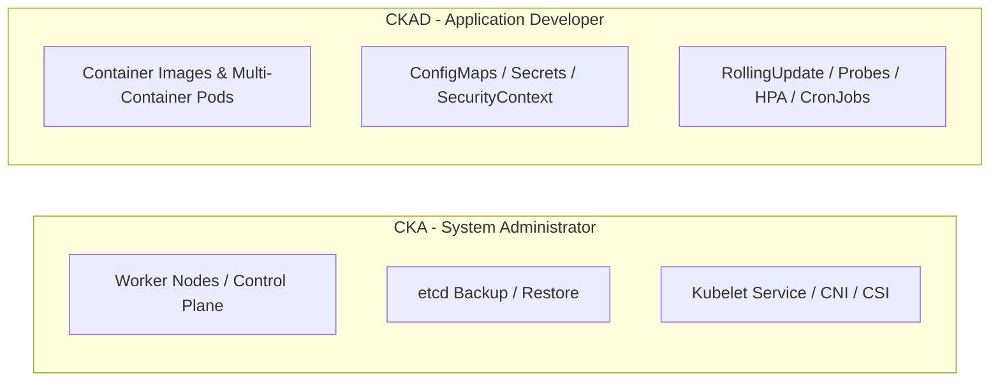
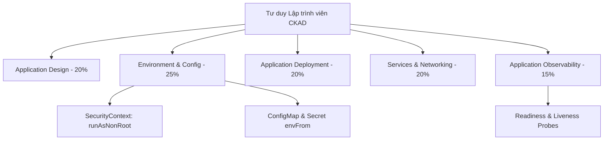
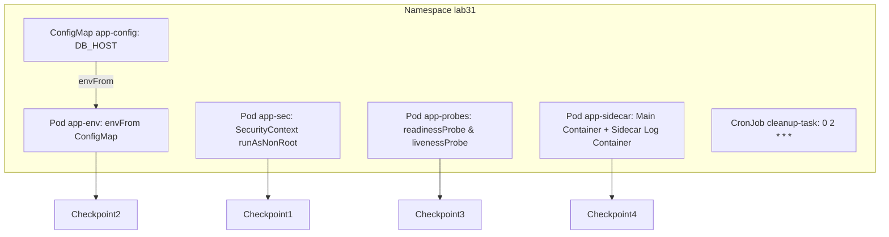


# [BÀI 01] TƯ DUY NGƯỜI PHÁT TRIỂN ỨNG DỤNG CLOUD NATIVE: SO SÁNH TOÀN DIỆN CKAD VS CKA

Trong kỷ nguyên điện toán đám mây và kiến trúc microservices phân tán quy mô lớn, **Kubernetes (CKAD)** đóng vai trò là nền tảng điều phối container (Container Orchestration) tiêu chuẩn công nghiệp. Để làm chủ hệ thống trong môi trường sản xuất (Production) cũng như chinh phục kỳ thi chứng chỉ quốc tế của Linux Foundation / CNCF, kỹ sư không chỉ nắm vững các câu lệnh thao tác cơ bản mà phải thấu hiểu sâu sắc bản chất cơ chế tầng thấp: từ chu trình điều hòa (Reconciliation Loop), cấu trúc điều phối tài nguyên, kiến trúc mạng CNI, lưu trữ CSI cho đến các chuẩn mực an ninh phòng thủ chiều sâu.

Bài viết chuyên sâu này sẽ đồng hành cùng bạn giải mã toàn diện bức tranh kiến trúc, phân tích các đánh đổi kỹ thuật thực chiến (Engineering Trade-offs), cung cấp bài thực hành Lab từng bước và bộ câu hỏi phỏng vấn chuẩn Architect / Lead Engineer.

---

## 1. Bản Chất Kiến Trúc & Cơ Chế Vận Hành Tầng Thấp

| # | Câu hỏi ôn tập | Đáp án chuẩn ngắn gọn |
|---|---|---|
| 1 | Ngưỡng điểm đạt chính thức của kỳ thi CKA là bao nhiêu %? | **66 %** |
| 2 | Câu lệnh CLI nào bắt buộc phải chạy ở dòng đầu tiên của mỗi câu hỏi CKA? | **`kubectl config use-context <context-name>`** |
| 3 | Chiến lược 3 vòng làm bài thi CKA phân bổ thời gian như thế nào? | Vòng 1 (**45'** - câu ngắn), Vòng 2 (**55'** - câu phức tạp), Vòng 3 (**20'** - rà soát) |
| 4 | Cờ lệnh imperative nào giúp xuất khung tệp YAML mẫu trong 3 giây? | **`--dry-run=client -o yaml`** |
| 5 | Ba cờ chứng chỉ TLS bắt buộc khi thực hiện sao lưu etcd snapshot là gì? | **`--cacert`**, **`--cert`**, và **`--key`** |


> **"Bước sang Giai đoạn 2 (CKAD), tư duy vận hành phải chuyển đổi hoàn toàn từ góc nhìn Quản trị hạ tầng (System Administrator trong CKA - tập trung vào Node, etcd, Kubelet và Control Plane) sang góc nhìn Người phát triển ứng dụng (Application Developer trong CKAD - tập trung vào việc định nghĩa container, thiết kế mẫu thiết kế đa container Sidecar/Adapter, chiến lược triển khai ứng dụng RollingUpdate/Canary, và giám sát khả năng chịu lỗi qua Probes); trong đó việc làm chủ 5 miền kiến thức của CKAD giúp lập trình viên tối ưu hóa trải nghiệm ứng dụng Cloud Native và đạt chứng chỉ quốc tế thứ hai của CNCF."**

**Kết quả từ các buổi trước được sử dụng lại:**

| Kết quả / Công cụ | Buổi + số hiệu `QT` | Dùng ở đâu trong buổi này |
|---|---|---|
| Tự động sinh YAML bằng cờ dry-run | Buổi 04 `QT 4.1` | Tái sử dụng để tạo nhanh các tệp manifest ứng dụng trong CKAD |
| Khái niệm Pod đa container và InitContainer | Buổi 14 `QT 4.1` | Phát triển lên thành các mẫu thiết kế Sidecar/Adapter của CKAD |
| Cấu hình biến môi trường qua ConfigMap/Secret | Buổi 20 `QT 4.1` | Mở rộng cấu hình ứng dụng động trong miền Environment & Config của CKAD |

---


| # | Kỹ năng thực hiện được | Hiện vật chứng minh |
|---|---|---|
| 1 | Phân biệt sự khác nhau giữa phạm vi CKA (Admin) và CKAD (Developer) | Bảng đối sánh chi tiết trách nhiệm và miền đề thi |
| 2 | Nắm vững cấu trúc 5 miền curriculum CKAD và ma trận trọng số CNCF | Sơ đồ phân bổ trọng số 5 miền CKAD |
| 3 | Biên soạn bản kê khai Pod nâng cao tích hợp `securityContext` và `Probes` | Tệp YAML Pod chứa cờ `runAsNonRoot` và `readinessProbe` |
| 4 | Nạp đồng thời toàn bộ biến môi trường từ ConfigMap qua cờ `envFrom` | Nhật ký container nhận đủ tập biến cấu hình động |
| 5 | Áp dụng tư duy Lập trình viên Cloud Native thiết kế ứng dụng Stateless | Kiến trúc Pod đa container Sidecar xử lý log |

---


| Kiến thức tiên quyết | Nguồn tự học nếu thiếu |
|---|---|
| Kỹ năng quản lý tài nguyên Pod, Deployment và Service cơ bản | Buổi 14, 15, 22 |
| Cấu hình ConfigMap và Secret | Buổi 20 (`QT 4.1`) |
| Kỹ thuật tạo khung YAML bằng cờ dry-run | Buổi 04 (`QT 4.1`) |

---


### 3.1. Thuật ngữ Việt–Anh

| # | Thuật ngữ tiếng Việt | Tiếng Anh tương đương | Ghi chú chuẩn hoá trong thân bài |
|---|---|---|---|
| 1 | Nhà phát triển ứng dụng | Application Developer | Đối tượng trọng tâm của kỳ thi CKAD |
| 2 | Mẫu thiết kế container | Multi-Container Design Patterns | Các mẫu Sidecar, Adapter, Ambassador |
| 3 | Khả năng quan sát ứng dụng | Application Observability | Giám sát qua Probes, Logs và Metrics |
| 4 | Cấu hình môi trường | Environment & Configuration | Truyền ConfigMap, Secret, SecurityContext |
| 5 | Chiến lược cập nhật | Deployment Strategies | `RollingUpdate`, `Recreate`, Blue-Green |
| 6 | Định nghĩa ảnh container | Container Definition | Khai báo `command`, `args`, `imagePullPolicy` |
| 7 | Tự động co giãn ứng dụng | Pod Autoscaling (HPA) | Tự động tăng giảm bản sao Pod theo CPU/RAM |
| 8 | Giới hạn tài nguyên ứng dụng | Resource Limits & Requests | Định nghĩa hạn ngạch RAM/CPU cho từng container |
| 9 | Quyền chạy container | SecurityContext (App level) | Cấu hình `runAsNonRoot`, `readOnlyRootFilesystem` |
| 10 | Tài nguyên công việc theo lượt | Jobs & CronJobs | Quản lý tác vụ chạy một lần hoặc định kỳ |
| 11 | Điểm kiểm tra ứng dụng | Readiness & Liveness Probes | Cơ chế tự sửa lỗi và điều hướng traffic |
| 12 | Bản kê khai ứng dụng | Application Manifests | Tệp YAML định nghĩa các tài nguyên Workload |
| 13 | Quản lý Secret bí mật | Secret Management | Mã hóa Base64 và mounted volume Secret |
| 14 | Biến môi trường chiếu | Projected Volumes / Downward API | Truyền thông tin Pod vào bên trong Container |


Mô hình Kiến trúc sư Nội thất: Nếu CKA là Kỹ sư Xây dựng (lo phần khung nhà, móng, điện nước hạ tầng), thì CKAD là Kiến trúc sư Nội thất (sắp xếp đồ đạc, trang trí phòng khách, tối ưu trải nghiệm sống của người ở trong nhà).

---

### 1.1. So sánh toàn diện CKA so với CKAD: Sự chuyển dịch từ Infrastructure sang Application (12 phút)

**Nguyên lý cốt lõi:** Kỳ thi CKA tập trung 100 % vào hạ tầng (Cluster/Node/Control Plane), trong khi CKAD tập trung 100 % vào Workload và Ứng dụng chạy trên cụm (Application/Container/Deployment/Config).

**Giải thích cơ chế ngầm:** Trong thực tế doanh nghiệp, đội SysAdmin/DevOps lo việc dựng cụm, bảo mật Node và nâng cấp Kubelet (CKA). Đội Software Engineer/App Developer lo việc đóng gói Dockerfile, định nghĩa Pod spec, viết readiness probe, và cấu hình co giãn HPA (CKAD).

> [!WARNING]
> **CẠM BẪY THỰC CHIẾN:**
> Mang tư duy SSH Node hay sửa file Static Pod vào bài thi CKAD. Bài thi CKAD không hề cho phép SSH vào Node mẹ và cũng không có câu hỏi nào về etcd hay kubeadm.

**Minh hoạ.**



**Nguyên lý cốt lõi:** Trong bài thi CKAD, thí sinh tuyệt đối không cần SSH vào Node mẹ hay sửa tệp Static Pod `/etc/kubernetes/manifests/`; toàn bộ thao tác đều thông qua API Server bằng các lệnh `kubectl` với cờ `--dry-run=client -o yaml`.

**Giải thích cơ chế ngầm:** CKAD kiểm tra năng lực của Lập trình viên tương tác với API Server để định nghĩa tài nguyên Workload. Thí sinh chỉ cần ngồi trên môi trường Client Terminal và bắn các bản kê khai YAML vào cụm.

> [!WARNING]
> **CẠM BẪY THỰC CHIẾN:**
> Loay hoay tìm lệnh SSH vào Master Node trong bài thi CKAD.

**Minh hoạ.**

```bash
# Thao tác điển hình của CKAD: Xuất khung YAML và apply trực tiếp qua API
kubectl run app-pod --image=python:alpine --dry-run=client -o yaml > app.yaml
kubectl apply -f app.yaml
```

---

### 1.2. Bối cảnh 5 miền curriculum CKAD và trọng số CNCF (12 phút)

**Nguyên lý cốt lõi:** Miền `Environment, Configuration and Security` (25 %) và `Application Design and Build` (20 %) chiếm tới 45 % tổng số điểm của CKAD; làm chủ hai miền này là yếu tố quyết định để đỗ CKAD.

**Giải thích cơ chế ngầm:** Hai miền này kiểm tra các kỹ năng cốt lõi nhất của lập trình viên: Đóng gói container, thiết kế Pod đa container (Sidecar/Adapter), truyền biến cấu hình động (ConfigMap/Secret), khai báo hạn ngạch CPU/RAM và thiết lập quyền chạy an toàn (`securityContext`).

> [!WARNING]
> **CẠM BẪY THỰC CHIẾN:**
> Không nắm vững cách tạo Pod đa container chia sẻ volume, dẫn tới mất trọn 20 % điểm của miền Application Design.

**Minh hoạ.**

```yaml
# Ma trận 5 miền CKAD (TỔNG 100%):
# 1. Application Environment, Configuration and Security (25%)
# 2. Application Design and Build (20%)
# 3. Application Deployment (20%)
# 4. Services and Networking (20%)
# 5. Application Observability and Maintenance (15%)
```

**Nguyên lý cốt lõi:** Đề thi CKAD yêu cầu tốc độ gõ lệnh và xử lý YAML cao hơn CKA do số lượng câu hỏi về cấu hình chi tiết (Probes, SecurityContext, ConfigMap) nhiều hơn.

**Giải thích cơ chế ngầm:** Đề thi CKA có nhiều câu dài về lệnh (như nâng cấp kubeadm, etcd snapshot), trong khi đề thi CKAD gồm 16–19 câu ngắn đòi hỏi gõ chính xác các trường con nằm sâu bên trong YAML spec (như `securityContext.runAsNonRoot`, `readinessProbe.httpGet.path`).

> [!WARNING]
> **CẠM BẪY THỰC CHIẾN:**
> Không thuộc tên các trường YAML con, phải mở trang docs cuộn tìm lâu làm hết giờ.

**Minh hoạ.**

```bash
# Ví dụ gõ cấu hình SecurityContext chuẩn tốc độ cao
cat <<EOF | kubectl apply -f -
apiVersion: v1
kind: Pod
metadata:
  name: sec-pod
  namespace: prod
spec:
  securityContext:
    runAsNonRoot: true
    runAsUser: 1000
  containers:
    - name: app
      image: nginx:alpine
EOF
```

---

### 1.3. Tư duy người phát triển ứng dụng Cloud Native trên Kubernetes (10 phút)

**Nguyên lý cốt lõi:** Tư duy Lập trình viên Cloud Native đòi hỏi container ứng dụng phải không lưu trạng thái (Stateless), cấu hình tách biệt hoàn toàn khỏi code, và luôn khai báo `requests`/`limits` tài nguyên.

**Giải thích cơ chế ngầm:** Theo nguyên tắc 12-Factor App, ứng dụng chạy trên Kubernetes có thể bị tiêu diệt và tạo lại bất kỳ lúc nào trên bất kỳ Node nào. Nếu ứng dụng lưu file trực tiếp vào đĩa cục bộ của container mà không dùng Volume, dữ liệu sẽ bị mất sạch khi Pod restart.

> [!WARNING]
> **CẠM BẪY THỰC CHIẾN:**
> Ghi tệp session hoặc file upload trực tiếp vào thư mục `/tmp` bên trong container mà không gắn Volume.

**Minh hoạ.**

```yaml
# Định nghĩa chuẩn cho container Stateless có limits
apiVersion: v1
kind: Pod
metadata:
  name: cloud-native-app
spec:
  containers:
    - name: app
      image: node:alpine
      resources:
        requests:
          cpu: "100m"
          memory: "128Mi"
        limits:
          cpu: "200m"
          memory: "256Mi"
```

**Nguyên lý cốt lõi:** Mọi Pod Production trong CKAD bắt buộc phải có đầy đủ 2 loại probe: `livenessProbe` (để Kubelet restart khi app treo) và `readinessProbe` (để Service ngừng chuyển traffic khi app chưa sẵn sàng).

**Giải thích cơ chế ngầm:** Nếu thiếu `readinessProbe`, khi container mới tạo đang trong quá trình tải dữ liệu khởi động (ví dụ nạp cache hết 30 giây), Service đã chuyển ngay yêu cầu của người dùng vào container đó, gây ra lỗi 502/503.

> [!WARNING]
> **CẠM BẪY THỰC CHIẾN:**
> Tạo Pod triển khai ứng dụng web nhưng bỏ trống khối `readinessProbe` và `livenessProbe`.

**Minh hoạ.**

```yaml
spec:
  containers:
    - name: web
      image: nginx:alpine
      readinessProbe:
        httpGet:
          path: /healthz
          port: 80
        initialDelaySeconds: 5
      livenessProbe:
        httpGet:
          path: /healthz
          port: 80
        initialDelaySeconds: 15
```

**Nguyên lý cốt lõi:** Khi biên soạn container cho ứng dụng, luôn khai báo cờ `imagePullPolicy: IfNotPresent` để tối ưu thời gian kéo ảnh và tiết kiệm băng thông mạng.

**Giải thích cơ chế ngầm:** Nếu đặt `imagePullPolicy: Always` cho các tag cố định (như `v1.0.0`), Kubelet mỗi lần khởi động container đều phải gửi yêu cầu truy vấn registry qua mạng, làm chậm thời gian khởi động Pod.

> [!WARNING]
> **CẠM BẪY THỰC CHIẾN:**
> Đặt cờ `Always` cho ảnh có dung lượng 1GB làm Pod mất 2 phút mới `Running`.

**Minh hoạ.**

```yaml
spec:
  containers:
    - name: app
      image: my-company/app:v1.2.0
      imagePullPolicy: IfNotPresent # CHỈ KÉO NẾU NODE CHƯA CÓ
```

**Nguyên lý cốt lõi:** Cấu hình bảo mật ứng dụng ở tầng Pod/Container (`securityContext`) phải luôn ưu tiên cờ `runAsNonRoot: true` và `readOnlyRootFilesystem: true` để giảm thiểu bề mặt tấn công.

**Giải thích cơ chế ngầm:** Mặc định nhiều container chạy dưới quyền root (UID 0). Nếu ứng dụng bị lỗ hổng RCE (Remote Code Execution), kẻ tấn công sẽ có toàn quyền kiểm soát container. Chạy với `runAsNonRoot: true` ngăn chặn hoàn toàn nguy cơ này.

> [!WARNING]
> **CẠM BẪY THỰC CHIẾN:**
> Chạy container ứng dụng với quyền root mặc định trong môi trường Production.

**Minh hoạ.**

```yaml
spec:
  securityContext:
    runAsNonRoot: true
    runAsUser: 10001
  containers:
    - name: secure-app
      image: nginx:alpine
      securityContext:
        readOnlyRootFilesystem: true # KHÔNG CHO GHI VÀO Ổ ĐĨA GỐC
```

---

### 1.4. Đưa vào cụm thật (4 phút)

**Nguyên lý cốt lõi:** Bản kê khai ứng dụng CKAD phải được tổ chức theo từng Namespace riêng biệt, sử dụng `ResourceQuota` và `LimitRange` để tránh việc một ứng dụng chiếm dụng toàn bộ tài nguyên cụm.

**Giải thích cơ chế ngầm:** Trong cụm dùng chung (Multi-tenant cluster), việc đưa ứng dụng vào Namespace riêng kèm theo Quota bảo vệ tài nguyên cụm không bị ứng dụng lỗi chiếm sạch CPU/RAM làm ảnh hưởng các ứng dụng khác.

> [!WARNING]
> **CẠM BẪY THỰC CHIẾN:**
> Áp dụng toàn bộ tệp YAML ứng dụng vào Namespace `default` trên cụm Production.

**Minh hoạ.**

```yaml
# Ví dụ tạo ResourceQuota giới hạn tài nguyên cho Namespace ứng dụng
apiVersion: v1
kind: ResourceQuota
metadata:
  name: app-quota
  namespace: prod
spec:
  hard:
    requests.cpu: "2"
    requests.memory: 4Gi
    limits.cpu: "4"
    limits.memory: 8Gi
```

**Áp vào cụm đang chạy thì làm gì trước:**
1. Rà soát lại toàn bộ 5 miền kiến thức CKAD và chuẩn bị mẫu các đoạn YAML SecurityContext và Probes.
2. Xây dựng thói quen luôn đặt `requests` và `limits` cho MỌI container.
3. Sử dụng cờ `envFrom` nạp ConfigMap thay vì khai báo từng dòng `valueFrom` thủ công.

**Cái gì hỏng nếu áp thẳng lên prod:**
- Đặt cờ `readOnlyRootFilesystem: true` mà không mount một volume `emptyDir` vào thư mục `/tmp` sẽ làm các ứng dụng Java/Node.js bị crash ngay lập tức do không ghi được tệp temporary.

**Đo trước — đo sau:**
- Đo tốc độ khởi tạo Pod có cài probe (thời gian Pod về `READY 1/1`).
- Đo tỷ lệ tiêu thụ RAM/CPU thực tế so với mức `requests` đã khai báo.

**Khi nào KHÔNG nên dùng:**
- Không đặt `limits.cpu` quá khắt khe gây hiện tượng CFS Throttling làm ứng dụng phản hồi chậm.

---

### 1.5. Bẫy hay gặp (2 phút)

| Bẫy hay gặp | Vì sao dính | Làm đúng là |
|---|---|---|
| 1. Nhầm lẫn giữa CKA và CKAD trong bài thi | Cố gắng SSH vào Node trong bài thi CKAD | Tập trung 100% vào việc biên soạn tệp YAML Workload |
| 2. Quên cờ `envFrom` khi nạp ConfigMap | Khai báo thủ công từng dòng `valueFrom` làm mất thời gian | Dùng `envFrom: [{configMapRef: {name: app-config}}]` |
| 3. Pod crash do `readOnlyRootFilesystem: true` | App cần ghi file tạm `/tmp` nhưng đĩa bị khóa ghi | Mount thêm volume `emptyDir` vào `/tmp` trong container |
| 4. `readinessProbe` fail khiến Pod mãi ở `READY 0/1` | Khai báo sai cổng hoặc sai đường dẫn HTTP path | Kiểm tra lại port và path ứng dụng lắng nghe thực tế |
| 5. Quên khai báo `imagePullPolicy: IfNotPresent` | Kubelet tốn thời gian query registry làm chậm Pod | Khai báo cờ `IfNotPresent` cho các image tag cố định |
| 6. Đặt `initialDelaySeconds` của Probe quá ngắn | Ứng dụng khởi động chưa xong đã bị Probe check fail | Tăng `initialDelaySeconds` cho ứng dụng khởi động chậm |
| 7. Gõ sai từ khóa `runAsNonRoot` thành `runAsUserNonRoot` | Nhớ không chuẩn tên trường SecurityContext | Dùng `kubectl explain pod.spec.securityContext` kiểm tra |
| 8. Tạo Pod đa container nhưng quên chia sẻ Volume | Hai container không nhìn thấy dữ liệu của nhau | Mount chung 1 volume `emptyDir` vào cả 2 container |
| 9. Bỏ quên cờ `-n <namespace>` trong đề thi CKAD | Tài nguyên bị đẩy về Namespace `default` | Luôn kiểm tra Namespace chỉ định ở đề bài |
| 10. Dùng `limits` nhỏ hơn `requests` | Sai logic tài nguyên Kubernetes | Luôn đảm bảo `limits` >= `requests` |
| 11. Nhầm lẫn giữa Sidecar pattern và InitContainer | InitContainer chạy xong rồi tắt, Sidecar chạy song song | Dùng Sidecar container cho các tác vụ theo dõi log |
| 12. Không test lại Pod sau khi `kubectl apply` | Pod bị kẹt `CreateContainerConfigError` do sai Secret | Chạy `kubectl get pod -n <ns>` xác minh status `Running` |

---

### 1.6. Tóm tắt (2 phút)



**Năm điều phải nhớ:**
1. **CKAD là kỳ thi của Developer**: Tập trung 100 % vào Workload, Container, Config và Deployments.
2. **Không SSH Node trong CKAD**: Toàn bộ bài thi thực thi qua Client Terminal và API Server.
3. **Hai miền lớn nhất**: Environment & Config (25%) và App Design (20%) chiếm 45% tổng điểm.
4. **SecurityContext**: Ưu tiên `runAsNonRoot: true` cho mọi ứng dụng Cloud Native.
5. **Khả năng chịu lỗi**: Mọi Pod Production phải có đầy đủ `readinessProbe` và `livenessProbe`.

---

## §10. Câu hỏi tự kiểm tra (5 phút)


<div class="qa-answer">
  <div class="qa-answer-header">
    <svg width="14" height="14" fill="none" stroke="currentColor" stroke-width="2" viewBox="0 0 24 24"><path d="M22 11.08V12a10 10 0 1 1-5.93-9.14"></path><polyline points="22 4 12 14.01 9 11.01"></polyline></svg>
    <span>Phân Tích &amp; Lời Giải Kỹ Thuật</span>
  </div>
  
CKA tập trung vào Quản trị hạ tầng cụm (System Admin), CKAD tập trung vào Phát triển và thiết kế ứng dụng (App Developer).
</div>
</details>

<div class="qa-answer">
  <div class="qa-answer-header">
    <svg width="14" height="14" fill="none" stroke="currentColor" stroke-width="2" viewBox="0 0 24 24"><path d="M22 11.08V12a10 10 0 1 1-5.93-9.14"></path><polyline points="22 4 12 14.01 9 11.01"></polyline></svg>
    <span>Phân Tích &amp; Lời Giải Kỹ Thuật</span>
  </div>
  
Miền <code>Environment, Configuration and Security</code> (25 %) và <code>Application Design and Build</code> (20 %).
</div>
</details>

<div class="qa-answer">
  <div class="qa-answer-header">
    <svg width="14" height="14" fill="none" stroke="currentColor" stroke-width="2" viewBox="0 0 24 24"><path d="M22 11.08V12a10 10 0 1 1-5.93-9.14"></path><polyline points="22 4 12 14.01 9 11.01"></polyline></svg>
    <span>Phân Tích &amp; Lời Giải Kỹ Thuật</span>
  </div>
  
Không. Bài thi CKAD 100 % thực hiện từ Client Terminal thông qua API Server.
</div>
</details>

<div class="qa-answer">
  <div class="qa-answer-header">
    <svg width="14" height="14" fill="none" stroke="currentColor" stroke-width="2" viewBox="0 0 24 24"><path d="M22 11.08V12a10 10 0 1 1-5.93-9.14"></path><polyline points="22 4 12 14.01 9 11.01"></polyline></svg>
    <span>Phân Tích &amp; Lời Giải Kỹ Thuật</span>
  </div>
  
Cờ <code>runAsNonRoot: true</code>.
</div>
</details>

<div class="qa-answer">
  <div class="qa-answer-header">
    <svg width="14" height="14" fill="none" stroke="currentColor" stroke-width="2" viewBox="0 0 24 24"><path d="M22 11.08V12a10 10 0 1 1-5.93-9.14"></path><polyline points="22 4 12 14.01 9 11.01"></polyline></svg>
    <span>Phân Tích &amp; Lời Giải Kỹ Thuật</span>
  </div>
  
Cờ <code>envFrom: [{configMapRef: {name: <configmap-name>}}]</code>.
</div>
</details>

<div class="qa-answer">
  <div class="qa-answer-header">
    <svg width="14" height="14" fill="none" stroke="currentColor" stroke-width="2" viewBox="0 0 24 24"><path d="M22 11.08V12a10 10 0 1 1-5.93-9.14"></path><polyline points="22 4 12 14.01 9 11.01"></polyline></svg>
    <span>Phân Tích &amp; Lời Giải Kỹ Thuật</span>
  </div>
  
<code>livenessProbe</code> giúp Kubelet restart container khi bị lỗi treo, <code>readinessProbe</code> giúp Service ngừng chuyển traffic khi app chưa sẵn sàng.
</div>
</details>

<div class="qa-answer">
  <div class="qa-answer-header">
    <svg width="14" height="14" fill="none" stroke="currentColor" stroke-width="2" viewBox="0 0 24 24"><path d="M22 11.08V12a10 10 0 1 1-5.93-9.14"></path><polyline points="22 4 12 14.01 9 11.01"></polyline></svg>
    <span>Phân Tích &amp; Lời Giải Kỹ Thuật</span>
  </div>
  
Để Pod có thể bị tiêu diệt và khởi tạo lại linh hoạt trên bất kỳ Node nào mà không làm mất dữ liệu người dùng.
</div>
</details>

<div class="qa-answer">
  <div class="qa-answer-header">
    <svg width="14" height="14" fill="none" stroke="currentColor" stroke-width="2" viewBox="0 0 24 24"><path d="M22 11.08V12a10 10 0 1 1-5.93-9.14"></path><polyline points="22 4 12 14.01 9 11.01"></polyline></svg>
    <span>Phân Tích &amp; Lời Giải Kỹ Thuật</span>
  </div>
  
Kubelet chỉ kéo ảnh container từ registry về nếu ổ đĩa trên Node đó chưa có sẵn bản ảnh đó.
</div>
</details>

<div class="qa-answer">
  <div class="qa-answer-header">
    <svg width="14" height="14" fill="none" stroke="currentColor" stroke-width="2" viewBox="0 0 24 24"><path d="M22 11.08V12a10 10 0 1 1-5.93-9.14"></path><polyline points="22 4 12 14.01 9 11.01"></polyline></svg>
    <span>Phân Tích &amp; Lời Giải Kỹ Thuật</span>
  </div>
  
Mẫu thiết kế Sidecar (Sidecar Container Pattern).
</div>
</details>

<div class="qa-answer">
  <div class="qa-answer-header">
    <svg width="14" height="14" fill="none" stroke="currentColor" stroke-width="2" viewBox="0 0 24 24"><path d="M22 11.08V12a10 10 0 1 1-5.93-9.14"></path><polyline points="22 4 12 14.01 9 11.01"></polyline></svg>
    <span>Phân Tích &amp; Lời Giải Kỹ Thuật</span>
  </div>
  
Ứng dụng sẽ bị sập do lỗi permission denied khi cố ghi file, trừ khi mount một volume <code>emptyDir</code> vào thư mục tạm đó.
</div>
</details>

<div class="qa-answer">
  <div class="qa-answer-header">
    <svg width="14" height="14" fill="none" stroke="currentColor" stroke-width="2" viewBox="0 0 24 24"><path d="M22 11.08V12a10 10 0 1 1-5.93-9.14"></path><polyline points="22 4 12 14.01 9 11.01"></polyline></svg>
    <span>Phân Tích &amp; Lời Giải Kỹ Thuật</span>
  </div>
  
Giá trị <code>limits</code> phải luôn lớn hơn hoặc bằng giá trị <code>requests</code>.
</div>
</details>

<div class="qa-answer">
  <div class="qa-answer-header">
    <svg width="14" height="14" fill="none" stroke="currentColor" stroke-width="2" viewBox="0 0 24 24"><path d="M22 11.08V12a10 10 0 1 1-5.93-9.14"></path><polyline points="22 4 12 14.01 9 11.01"></polyline></svg>
    <span>Phân Tích &amp; Lời Giải Kỹ Thuật</span>
  </div>
  
<code>kubectl run <pod-name> --image=<image> --dry-run=client -o yaml > pod.yaml</code>.
</div>
</details>

---

## §11. Tài liệu tham khảo

| Nguồn | Địa chỉ URL | Ghi chú |
|---|---|---|
| Trang chủ CKAD Curriculum CNCF | `https://github.com/cncf/curriculum` | Chương trình thi CKAD mới nhất |
| Kubernetes SecurityContext | `https://kubernetes.io/docs/tasks/configure-pod-container/security-context/` | Cấu hình bảo mật Pod |


---

## 2. Hướng Dẫn Thực Hành & Triển Khai Lab Chuẩn Production

> [!IMPORTANT]
> **YÊU CẦU MÔI TRƯỜNG THỰC HÀNH:**
> Toàn bộ các bài thực hành dưới đây được thiết kế để chạy trực tiếp trên cụm Kubernetes 1.30+ tiêu chuẩn (hoặc cụm kind/kubeadm lab). Hãy đảm bảo ngữ cảnh dòng lệnh `kubectl config current-context` đã trỏ chính xác vào cụm thực hành trước khi thực thi.

## Khối thực hành — 120 phút

## L0. Mục tiêu thực hành và tiêu chí hoàn thành

| Mã tiêu chí | Nội dung tiêu chí | Lệnh kiểm chứng | Kết quả kỳ vọng |
|---|---|---|---|
| TH1 | Tạo Namespace `lab31` phục vụ môi trường thực hành CKAD | `kubectl get ns lab31 -o jsonpath='{.status.phase}'` | In ra `Active` |
| TH2 | Biển soạn Pod `app-sec` với `securityContext.runAsNonRoot: true` | `kubectl get pod app-sec -n lab31 -o jsonpath='{.spec.securityContext.runAsNonRoot}'` | In ra `true` |
| TH3 | Pod `app-sec` chạy với UID user 1000 | `kubectl get pod app-sec -n lab31 -o jsonpath='{.spec.securityContext.runAsUser}'` | In ra `1000` |
| TH4 | Tạo ConfigMap `app-config` chứa cặp cấu hình `DB_HOST` | `kubectl get cm app-config -n lab31 -o jsonpath='{.data.DB_HOST}'` | In ra `postgres.prod` |
| TH5 | Cấu hình Pod `app-env` nạp biến từ ConfigMap qua `envFrom` | `kubectl get pod app-env -n lab31 -o jsonpath='{.spec.containers[0].envFrom[0].configMapRef.name}'` | In ra `app-config` |
| TH6 | Kiểm tra biến môi trường `DB_HOST` bên trong container | `kubectl exec app-env -n lab31 -- env \| grep DB_HOST` | In ra `DB_HOST=postgres.prod` |
| TH7 | Biên soạn Pod `app-probes` chứa `readinessProbe` HTTP | `kubectl get pod app-probes -n lab31 -o jsonpath='{.spec.containers[0].readinessProbe.httpGet.path}'` | In ra `/` |
| TH8 | Pod `app-probes` chứa `livenessProbe` HTTP | `kubectl get pod app-probes -n lab31 -o jsonpath='{.spec.containers[0].livenessProbe.httpGet.path}'` | In ra `/` |
| TH9 | Pod `app-probes` đạt trạng thái sẵn sàng `READY 1/1` | `kubectl get pod app-probes -n lab31 -o jsonpath='{.status.containerStatuses[0].ready}'` | In ra `true` |
| TH10 | Tạo Pod đa container `app-sidecar` chứa 2 container | `kubectl get pod app-sidecar -n lab31 -o jsonpath='{len(.spec.containers)}'` | In ra `2` |
| TH11 | Container Sidecar đọc chung Volume `shared-logs` | `kubectl get pod app-sidecar -n lab31 -o jsonpath='{.spec.volumes[0].name}'` | In ra `shared-logs` |
| TH12 | Tạo CronJob `cleanup-task` chạy định kỳ `0 2 * * *` | `kubectl get cronjob cleanup-task -n lab31 -o jsonpath='{.spec.schedule}'` | In ra `0 2 * * *` |
| TH13 | Dọn dẹp môi trường lab31 sạch sẽ | `test ! -f /tmp/lab31-app.yaml && echo "CLEAN"` | In ra `CLEAN` |

---

## L1. Điều kiện tiên quyết về môi trường

| Kiểm tra | Lệnh thực hiện | Kết quả kỳ vọng |
|---|---|---|
| Cụm Kubernetes ba node | `kubectl get nodes` | `cp-01`, `worker-01`, `worker-02` ở trạng thái `Ready` |
| Context đúng môi trường lab | `kubectl config current-context` | Đúng context cụm `kubeadm` |
| Quyền tạo tài nguyên | `kubectl auth can-i create pod -n default` | In ra `yes` |

---

## L2. Kiến trúc bài lab CKAD



---

## L3. Bước 1: Khởi tạo Namespace `lab31` (10 phút)

### Thao tác 1.1: Tạo Namespace

```bash
kubectl create namespace lab31
```

**CHECKPOINT 1 — Kiểm tra Namespace `lab31`.**

```bash
kubectl get ns lab31 -o jsonpath='{.status.phase}' | grep -qx Active && echo "CHECKPOINT 1 — ĐẠT" || echo "CHECKPOINT 1 — LỖI"
```

---

## L4. Bước 2: Thiết lập Bảo mật Pod `securityContext` (25 phút)

### Thao tác 2.1: Biên soạn và khởi tạo Pod `app-sec`

```bash
cat <<EOF | kubectl apply -f -
apiVersion: v1
kind: Pod
metadata:
  name: app-sec
  namespace: lab31
spec:
  securityContext:
    runAsNonRoot: true
    runAsUser: 1000
  containers:
    - name: app
      image: busybox:1.36
      command: ["sh", "-c", "sleep 3600"]
      securityContext:
        allowPrivilegeEscalation: false
EOF
```

**CHECKPOINT 2 — Kiểm tra cờ `runAsNonRoot: true`.**

```bash
kubectl get pod app-sec -n lab31 -o jsonpath='{.spec.securityContext.runAsNonRoot}' | grep -qx true && echo "CHECKPOINT 2 — ĐẠT" || echo "CHECKPOINT 2 — LỖI"
```

**CHECKPOINT 3 — Kiểm tra `runAsUser: 1000`.**

```bash
kubectl get pod app-sec -n lab31 -o jsonpath='{.spec.securityContext.runAsUser}' | grep -qx 1000 && echo "CHECKPOINT 3 — ĐẠT" || echo "CHECKPOINT 3 — LỖI"
```

---

## L5. Bước 3: Cấu hình biến môi trường qua ConfigMap `envFrom` (25 phút)

### Thao tác 3.1: Tạo ConfigMap `app-config`

```bash
kubectl create configmap app-config --from-literal=DB_HOST=postgres.prod --from-literal=DB_PORT=5432 -n lab31
```

**CHECKPOINT 4 — Kiểm tra ConfigMap `app-config`.**

```bash
kubectl get cm app-config -n lab31 -o jsonpath='{.data.DB_HOST}' | grep -qx postgres.prod && echo "CHECKPOINT 4 — ĐẠT" || echo "CHECKPOINT 4 — LỖI"
```

### Thao tác 3.2: Biên soạn Pod `app-env` nạp biến bằng `envFrom`

```bash
cat <<EOF | kubectl apply -f -
apiVersion: v1
kind: Pod
metadata:
  name: app-env
  namespace: lab31
spec:
  containers:
    - name: app
      image: busybox:1.36
      command: ["sh", "-c", "sleep 3600"]
      envFrom:
        - configMapRef:
            name: app-config
EOF
```

**CHECKPOINT 5 — Kiểm tra khai báo `envFrom` trong Pod.**

```bash
kubectl get pod app-env -n lab31 -o jsonpath='{.spec.containers[0].envFrom[0].configMapRef.name}' | grep -qx app-config && echo "CHECKPOINT 5 — ĐẠT" || echo "CHECKPOINT 5 — LỖI"
```

**CHECKPOINT 6 — Kiểm tra biến môi trường thực tế bên trong Container.**

```bash
kubectl exec app-env -n lab31 -- env | grep -q "DB_HOST=postgres.prod" && echo "CHECKPOINT 6 — ĐẠT" || echo "CHECKPOINT 6 — LỖI"
```

---

## L6. Bước 4: Thiết lập Khả năng quan sát Probes (25 phút)

### Thao tác 4.1: Biên soạn Pod `app-probes` chứa Readiness và Liveness Probes

```bash
cat <<EOF | kubectl apply -f -
apiVersion: v1
kind: Pod
metadata:
  name: app-probes
  namespace: lab31
spec:
  containers:
    - name: web
      image: nginx:alpine
      ports:
        - containerPort: 80
      readinessProbe:
        httpGet:
          path: /
          port: 80
        initialDelaySeconds: 3
        periodSeconds: 5
      livenessProbe:
        httpGet:
          path: /
          port: 80
        initialDelaySeconds: 5
        periodSeconds: 10
EOF
```

**CHECKPOINT 7 — Kiểm tra `readinessProbe` path `/`.**

```bash
kubectl get pod app-probes -n lab31 -o jsonpath='{.spec.containers[0].readinessProbe.httpGet.path}' | grep -qx / && echo "CHECKPOINT 7 — ĐẠT" || echo "CHECKPOINT 7 — LỖI"
```

**CHECKPOINT 8 — Kiểm tra `livenessProbe` path `/`.**

```bash
kubectl get pod app-probes -n lab31 -o jsonpath='{.spec.containers[0].livenessProbe.httpGet.path}' | grep -qx / && echo "CHECKPOINT 8 — ĐẠT" || echo "CHECKPOINT 8 — LỖI"
```

**CHECKPOINT 9 — Kiểm tra trạng thái Pod sẵn sàng `READY 1/1`.**

```bash
sleep 5
kubectl get pod app-probes -n lab31 -o jsonpath='{.status.containerStatuses[0].ready}' | grep -qx true && echo "CHECKPOINT 9 — ĐẠT" || echo "CHECKPOINT 9 — LỖI"
```

---

## L7. Bước 5: Mẫu thiết kế Pod đa container Sidecar (25 phút)

### Thao tác 5.1: Biên soạn Pod `app-sidecar` ghi và đọc log dùng Volume `emptyDir`

```bash
cat <<EOF | kubectl apply -f -
apiVersion: v1
kind: Pod
metadata:
  name: app-sidecar
  namespace: lab31
spec:
  volumes:
    - name: shared-logs
      emptyDir: {}
  containers:
    - name: main-app
      image: busybox:1.36
      command: ["sh", "-c", "while true; do date >> /var/log/app.log; sleep 2; done"]
      volumeMounts:
        - name: shared-logs
          mountPath: /var/log
    - name: sidecar-logger
      image: busybox:1.36
      command: ["sh", "-c", "tail -n+1 -f /var/log/app.log"]
      volumeMounts:
        - name: shared-logs
          mountPath: /var/log
EOF
```

**CHECKPOINT 10 — Kiểm tra Pod `app-sidecar` có đúng 2 container.**

```bash
kubectl get pod app-sidecar -n lab31 -o jsonpath='{len(.spec.containers)}' | grep -qx 2 && echo "CHECKPOINT 10 — ĐẠT" || echo "CHECKPOINT 10 — LỖI"
```

**CHECKPOINT 11 — Kiểm tra đặt tên Volume `shared-logs`.**

```bash
kubectl get pod app-sidecar -n lab31 -o jsonpath='{.spec.volumes[0].name}' | grep -qx shared-logs && echo "CHECKPOINT 11 — ĐẠT" || echo "CHECKPOINT 11 — LỖI"
```

### Thao tác 5.2: Khởi tạo CronJob `cleanup-task`

```bash
kubectl create cronjob cleanup-task --image=busybox:1.36 --schedule="0 2 * * *" -n lab31 -- sh -c "echo Cleanup done"
```

**CHECKPOINT 12 — Kiểm tra CronJob `cleanup-task`.**

```bash
kubectl get cronjob cleanup-task -n lab31 -o jsonpath='{.spec.schedule}' | grep -qx "0 2 \* \* \*" && echo "CHECKPOINT 12 — ĐẠT" || echo "CHECKPOINT 12 — LỖI"
```

---

## L8. Dọn dẹp môi trường (10 phút)

### Thao tác 8.1: Dọn dẹp tài nguyên lab31

```bash
kubectl delete namespace lab31
rm -f /tmp/lab31-app.yaml
```

**CHECKPOINT 13 — Kiểm tra dọn dẹp sạch sẽ.**

```bash
test ! -f /tmp/lab31-app.yaml && echo "CHECKPOINT 13 — ĐẠT" || echo "CHECKPOINT 13 — LỖI"
```

---

## L9. Xử lý sự cố thường gặp trong lab

| Triệu chứng lỗi | Nguyên nhân gốc rễ | Cách sửa triệt để |
|---|---|---|
| 1. Pod `app-sec` kẹt `CreateContainerConfigError` | Khai báo `runAsNonRoot: true` nhưng dùng ảnh root mặc định không ghi rõ `runAsUser` | Khai báo bổ sung `runAsUser: 1000` trong spec |
| 2. Pod `app-env` không nhận biến môi trường | Gõ sai tên ConfigMap trong `configMapRef.name` | Kiểm tra lại tên ConfigMap `app-config` qua `kubectl get cm` |
| 3. Pod `app-probes` kẹt `READY 0/1` | Cấu hình `readinessProbe` trỏ tới cổng hoặc path không tồn tại | Kiểm tra xem cổng 80 và đường dẫn HTTP `/` có mở trong container |
| 4. Container Sidecar không xem được file log | Mount sai `mountPath` giữa container chính và container sidecar | Đảm bảo cả 2 container mount chung 1 đường dẫn `/var/log` |
| 5. CronJob `cleanup-task` sai định dạng schedule | Gõ sai chuỗi 5 mốc cron | Đảm bảo chuỗi cron đúng `"0 2 * * *"` (chạy lúc 2 giờ sáng) |
| 6. Lỗi `permission denied` khi container ghi file | Đặt `runAsUser: 1000` nhưng thư mục ghi file thuộc sở hữu của root | Mount volume `emptyDir` hoặc đổi quyền thư mục |
| 7. Lỗi syntax YAML khi thêm `envFrom` | Thò lùi sai khoảng trắng ở danh sách mảng | Đảm bảo thụt lùi dấu `-` đúng 2 khoảng trắng dưới `envFrom:` |
| 8. Lệnh `kubectl exec` báo không tìm thấy container | Pod có nhiều container nhưng quên cờ `-c <container-name>` | Thêm cờ `-c app` khi exec vào Pod đa container |
| 9. Readiness probe fail làm HPA co giãn liên tục | Probe fail làm Pod bị gỡ khỏi Endpoints liên tục | Điều chỉnh `initialDelaySeconds` phù hợp thời gian boot app |
| 10. `livenessProbe` kill container liên tục | Cài đặt `timeoutSeconds` quá ngắn so với tốc độ app trả lời | Tăng `timeoutSeconds` hoặc `periodSeconds` cho Probe |
| 11. Biến môi trường không tự động cập nhật khi sửa CM | Pod nạp biến qua `envFrom` không tự nạp lại khi CM thay đổi | Restart Pod để Kubelet nạp tập biến mới từ ConfigMap |
| 12. Quên cờ `-n lab31` khi tạo tài nguyên | Thói quen tạo tài nguyên ở Namespace `default` | Kiểm tra lại tài nguyên qua `kubectl get pod -n lab31` |
| 13. Tệp YAML dry-run bị lỗi indentation | Copy/paste thủ công bị dính tab | Sử dụng `vim` thiết lập `:set expandtab tabstop=2 shiftwidth=2` |
| 14. Lỗi Pod kẹt `CrashLoopBackOff` khi dùng busybox | Busybox kết thúc lệnh ngay lập tục nếu thiếu command loop | Thêm command `["sh", "-c", "sleep 3600"]` giữ tiến trình |

---

## L10. Bài tập mở rộng

- **BT1:** Viết tệp YAML triển khai Pod đa container theo mẫu Adapter Pattern đổi định dạng log trước khi xuất ra stdout.
- **BT2:** Cấu hình `readinessProbe` kiểu `exec` chạy câu lệnh `cat /tmp/healthy` thay vì HTTP check.
- **BT3:** Tạo Secret kiểu `Opaque` chứa chứng chỉ TLS và nạp vào Pod qua cơ chế mounted Volume.
- **BT4:** Viết bản kê khai Deployment có cấu hình `securityContext` cấp Pod và cấp Container riêng biệt.
- **BT5:** Cấu hình Pod ứng dụng nạp biến từ cả ConfigMap và Secret đồng thời qua 2 khối `envFrom`.
- **BT6:** Thiết lập HPA tự động co giãn Pod từ 2 đến 10 bản sao khi tỷ lệ sử dụng CPU vượt quá 50 %.

---

## L11. Hiện vật nộp và tiêu chí chấm điểm

| Hạng mục hiện vật | Tiêu chí chấm điểm đạt | Thang điểm |
|---|---|---|
| Nhật ký 13 Checkpoint | Thực thi thành công 100 % các checkpoint in ra `ĐẠT` | 50 điểm |
| Bản kê khai Pod `app-sec` & `app-probes` | Cấu hình đúng `securityContext` và 2 loại probes | 20 điểm |
| Mẫu thiết kế Pod đa container | Container chính và Sidecar đọc chung Volume `emptyDir` | 20 điểm |
| Báo cáo bài tập mở rộng | Trả lời đầy đủ câu hỏi BT1 và BT2 | 10 điểm |
| **Tổng điểm** | | **100 điểm** |


---

## 3. Bộ Câu Hỏi Vấn Đáp & Phỏng Vấn Kỹ Thuật Chuyên Sâu


## V1. Cách tiến hành

Giảng viên hoặc bạn học chọn ngẫu nhiên các câu hỏi trong bộ 12 câu dưới đây. Người trả lời phải trình bày mạch lạc trong 60–90 giây mỗi câu, đi thẳng vào cơ chế kỹ thuật và viện dẫn các lệnh CLI thực tế.

---

---

## V2. Bộ câu hỏi phỏng vấn thực chiến

<details class="qa-card">
<summary class="qa-summary">
  <div class="qa-summary-left">
    <span class="qa-num-badge">Q01</span>
    <span>Hai miền kiến thức nào chiếm tổng trọng số cao nhất (45 %) trong ma trận 5 miền thi CKAD?</span>
  </div>
  <span class="qa-chevron">
    <svg width="18" height="18" fill="none" stroke="currentColor" stroke-width="2.5" viewBox="0 0 24 24"><polyline points="6 9 12 15 18 9"></polyline></svg>
  </span>
</summary>
<div class="qa-answer">
  <div class="qa-answer-header">
    <svg width="14" height="14" fill="none" stroke="currentColor" stroke-width="2" viewBox="0 0 24 24"><path d="M22 11.08V12a10 10 0 1 1-5.93-9.14"></path><polyline points="22 4 12 14.01 9 11.01"></polyline></svg>
    <span>Phân Tích &amp; Lời Giải Kỹ Thuật</span>
  </div>
  <div style="margin: 0.35rem 0; padding-left: 1rem; border-left: 2px solid var(--accent-primary);">Miền <code>Application Environment, Configuration and Security</code> (chiếm 25 %) và miền <code>Application Design and Build</code> (chiếm 20 %).</div>
  <div style="margin-top: 0.75rem;"><b style="color: var(--accent-primary);">Tiêu chí chấm điểm &amp; Phân tầng năng lực:</b></div>
  <div style="margin: 0.25rem 0; padding-left: 1rem; border-left: 2px solid var(--accent-primary);">• 0đ: Nhầm lẫn trọng số các miền.</div>
  <div style="margin: 0.25rem 0; padding-left: 1rem; border-left: 2px solid var(--accent-primary);">• 1đ: Nêu đúng tên 2 miền nhưng nhầm con số trọng số %.</div>
  <div style="margin: 0.25rem 0; padding-left: 1rem; border-left: 2px solid var(--accent-primary);">• 3đ: Nêu chính xác tên và trọng số 25% và 20% của 2 miền cốt lõi này.</div>
  <div style="margin-top: 0.75rem; padding: 0.5rem 0.75rem; background: rgba(var(--accent-primary-rgb, 59, 130, 246), 0.08); border-radius: 4px;"><b style="color: var(--accent-primary);">Câu hỏi mở rộng / Đào sâu:</b> (Nội dung chính của miền Environment & Config bao gồm những tài nguyên nào? — ConfigMaps, Secrets, SecurityContext, Resource Requests/Limits và ServiceAccount).

---</div>
</div>
</details>

<details class="qa-card">
<summary class="qa-summary">
  <div class="qa-summary-left">
    <span class="qa-num-badge">Q02</span>
    <span>Tại sao ứng dụng thiết kế chạy trên Kubernetes (Cloud Native) lại bắt buộc phải là ứng dụng không lưu trạng thái (Stateless)?</span>
  </div>
  <span class="qa-chevron">
    <svg width="18" height="18" fill="none" stroke="currentColor" stroke-width="2.5" viewBox="0 0 24 24"><polyline points="6 9 12 15 18 9"></polyline></svg>
  </span>
</summary>
<div class="qa-answer">
  <div class="qa-answer-header">
    <svg width="14" height="14" fill="none" stroke="currentColor" stroke-width="2" viewBox="0 0 24 24"><path d="M22 11.08V12a10 10 0 1 1-5.93-9.14"></path><polyline points="22 4 12 14.01 9 11.01"></polyline></svg>
    <span>Phân Tích &amp; Lời Giải Kỹ Thuật</span>
  </div>
  <div style="margin: 0.35rem 0; padding-left: 1rem; border-left: 2px solid var(--accent-primary);">Vì trên Kubernetes, Pod có thể bị Kubelet hủy (terminate) và tạo lại bất kỳ lúc nào trên một Worker Node khác. Ứng dụng Stateless không lưu dữ liệu người dùng cục bộ bên trong đĩa container, giúp ứng dụng có thể co giãn linh hoạt và phục hồi tức thì không gây mất dữ liệu.</div>
  <div style="margin-top: 0.75rem;"><b style="color: var(--accent-primary);">Tiêu chí chấm điểm &amp; Phân tầng năng lực:</b></div>
  <div style="margin: 0.25rem 0; padding-left: 1rem; border-left: 2px solid var(--accent-primary);">• 0đ: Không giải thích được khái niệm Stateless.</div>
  <div style="margin: 0.25rem 0; padding-left: 1rem; border-left: 2px solid var(--accent-primary);">• 1đ: Nêu được không lưu dữ liệu nhưng không gắn với đặc tính hủy/tạo Pod của Kubelet.</div>
  <div style="margin: 0.25rem 0; padding-left: 1rem; border-left: 2px solid var(--accent-primary);">• 3đ: Phân tích thấu đáo theo nguyên tắc 12-Factor App và cơ chế co giãn tự động của Kubernetes.</div>
  <div style="margin-top: 0.75rem; padding: 0.5rem 0.75rem; background: rgba(var(--accent-primary-rgb, 59, 130, 246), 0.08); border-radius: 4px;"><b style="color: var(--accent-primary);">Câu hỏi mở rộng / Đào sâu:</b> (Nếu ứng dụng bắt buộc phải lưu tệp tải lên của người dùng thì trên K8s phải xử lý thế nào? — Lưu vào bộ lưu trữ đối tượng bên ngoài như AWS S3 hoặc mount PersistentVolume).

---</div>
</div>
</details>

<details class="qa-card">
<summary class="qa-summary">
  <div class="qa-summary-left">
    <span class="qa-num-badge">Q03</span>
    <span>Cờ cấu hình <code>runAsNonRoot: true</code> trong <code>securityContext</code> của Pod có vai trò gì về mặt bảo mật?</span>
  </div>
  <span class="qa-chevron">
    <svg width="18" height="18" fill="none" stroke="currentColor" stroke-width="2.5" viewBox="0 0 24 24"><polyline points="6 9 12 15 18 9"></polyline></svg>
  </span>
</summary>
<div class="qa-answer">
  <div class="qa-answer-header">
    <svg width="14" height="14" fill="none" stroke="currentColor" stroke-width="2" viewBox="0 0 24 24"><path d="M22 11.08V12a10 10 0 1 1-5.93-9.14"></path><polyline points="22 4 12 14.01 9 11.01"></polyline></svg>
    <span>Phân Tích &amp; Lời Giải Kỹ Thuật</span>
  </div>
  <div style="margin: 0.35rem 0; padding-left: 1rem; border-left: 2px solid var(--accent-primary);">Cờ <code>runAsNonRoot: true</code> bắt buộc Kubelet kiểm tra và từ chối khởi chạy container nếu tiến trình bên trong container được cấu hình chạy dưới quyền root (UID 0), ngăn ngừa nguy cơ kẻ tấn công chiếm quyền điều khiển hạ tầng khi ứng dụng bị khai thác lỗ hổng.</div>
  <div style="margin-top: 0.75rem;"><b style="color: var(--accent-primary);">Tiêu chí chấm điểm &amp; Phân tầng năng lực:</b></div>
  <div style="margin: 0.25rem 0; padding-left: 1rem; border-left: 2px solid var(--accent-primary);">• 0đ: Không biết tác dụng của cờ.</div>
  <div style="margin: 0.25rem 0; padding-left: 1rem; border-left: 2px solid var(--accent-primary);">• 1đ: Nêu được không cho chạy root nhưng không giải thích được cơ chế Kubelet validate UID.</div>
  <div style="margin: 0.25rem 0; padding-left: 1rem; border-left: 2px solid var(--accent-primary);">• 3đ: Trình bày chính xác mục đích giảm bề mặt tấn công và cơ chế ngăn chặn UID 0 của Kubelet.</div>
  <div style="margin-top: 0.75rem; padding: 0.5rem 0.75rem; background: rgba(var(--accent-primary-rgb, 59, 130, 246), 0.08); border-radius: 4px;"><b style="color: var(--accent-primary);">Câu hỏi mở rộng / Đào sâu:</b> (Nếu ảnh container mặc định chạy root mà ta đặt <code>runAsNonRoot: true</code> thì điều gì sẽ xảy ra? — Kubelet sẽ báo lỗi <code>CreateContainerConfigError</code> và Pod không chạy được).

---</div>
</div>
</details>

<details class="qa-card">
<summary class="qa-summary">
  <div class="qa-summary-left">
    <span class="qa-num-badge">Q04</span>
    <span>Sự khác biệt giữa cờ <code>env</code> và cờ <code>envFrom</code> khi nạp dữ liệu từ ConfigMap vào Pod là gì?</span>
  </div>
  <span class="qa-chevron">
    <svg width="18" height="18" fill="none" stroke="currentColor" stroke-width="2.5" viewBox="0 0 24 24"><polyline points="6 9 12 15 18 9"></polyline></svg>
  </span>
</summary>
<div class="qa-answer">
  <div class="qa-answer-header">
    <svg width="14" height="14" fill="none" stroke="currentColor" stroke-width="2" viewBox="0 0 24 24"><path d="M22 11.08V12a10 10 0 1 1-5.93-9.14"></path><polyline points="22 4 12 14.01 9 11.01"></polyline></svg>
    <span>Phân Tích &amp; Lời Giải Kỹ Thuật</span>
  </div>
  <div style="margin: 0.35rem 0; padding-left: 1rem; border-left: 2px solid var(--accent-primary);">Cờ <code>env</code> nạp từng biến môi trường thủ công bằng cách chỉ định rõ key-value. Cờ <code>envFrom</code> nạp đồng thời toàn bộ các cặp Key-Value có trong ConfigMap làm biến môi trường container chỉ với 1 dòng khai báo, giúp tiết kiệm thời gian gõ YAML.</div>
  <div style="margin-top: 0.75rem;"><b style="color: var(--accent-primary);">Tiêu chí chấm điểm &amp; Phân tầng năng lực:</b></div>
  <div style="margin: 0.25rem 0; padding-left: 1rem; border-left: 2px solid var(--accent-primary);">• 0đ: Không phân biệt được 2 cờ.</div>
  <div style="margin: 0.25rem 0; padding-left: 1rem; border-left: 2px solid var(--accent-primary);">• 1đ: Nêu được envFrom nạp nhanh hơn nhưng không rõ cơ chế nạp toàn bộ cặp key-value.</div>
  <div style="margin: 0.25rem 0; padding-left: 1rem; border-left: 2px solid var(--accent-primary);">• 3đ: So sánh rõ ràng cú pháp và trường hợp sử dụng của <code>env</code> và <code>envFrom</code>.</div>
  <div style="margin-top: 0.75rem; padding: 0.5rem 0.75rem; background: rgba(var(--accent-primary-rgb, 59, 130, 246), 0.08); border-radius: 4px;"><b style="color: var(--accent-primary);">Câu hỏi mở rộng / Đào sâu:</b> (Nếu trong ConfigMap có 20 cặp key-value thì dùng cờ nào tối ưu nhất trong đề thi CKAD? — Dùng cờ <code>envFrom</code>).

---</div>
</div>
</details>

<details class="qa-card">
<summary class="qa-summary">
  <div class="qa-summary-left">
    <span class="qa-num-badge">Q05</span>
    <span>Phân biệt mục đích kỹ thuật giữa <code>livenessProbe</code> và <code>readinessProbe</code> trong Kubernetes Pod?</span>
  </div>
  <span class="qa-chevron">
    <svg width="18" height="18" fill="none" stroke="currentColor" stroke-width="2.5" viewBox="0 0 24 24"><polyline points="6 9 12 15 18 9"></polyline></svg>
  </span>
</summary>
<div class="qa-answer">
  <div class="qa-answer-header">
    <svg width="14" height="14" fill="none" stroke="currentColor" stroke-width="2" viewBox="0 0 24 24"><path d="M22 11.08V12a10 10 0 1 1-5.93-9.14"></path><polyline points="22 4 12 14.01 9 11.01"></polyline></svg>
    <span>Phân Tích &amp; Lời Giải Kỹ Thuật</span>
  </div>
  <div style="margin: 0.35rem 0; padding-left: 1rem; border-left: 2px solid var(--accent-primary);"><code>livenessProbe</code> kiểm tra xem container có đang sống hay không; nếu probe fail, Kubelet sẽ kill container và restart lại. <code>readinessProbe</code> kiểm tra xem container đã sẵn sàng nhận traffic chưa; nếu probe fail, Service sẽ gỡ IP của Pod khỏi danh sách Endpoints để không chuyển request vào, nhưng Kubelet không restart container.</div>
  <div style="margin-top: 0.75rem;"><b style="color: var(--accent-primary);">Tiêu chí chấm điểm &amp; Phân tầng năng lực:</b></div>
  <div style="margin: 0.25rem 0; padding-left: 1rem; border-left: 2px solid var(--accent-primary);">• 0đ: Nhầm lẫn chức năng của 2 loại probe.</div>
  <div style="margin: 0.25rem 0; padding-left: 1rem; border-left: 2px solid var(--accent-primary);">• 1đ: Nêu được liveness restart nhưng không rõ readiness gỡ khỏi Service Endpoints.</div>
  <div style="margin: 0.25rem 0; padding-left: 1rem; border-left: 2px solid var(--accent-primary);">• 3đ: Phân tích chuẩn xác hành vi của Kubelet với livenessProbe và hành vi của Service với readinessProbe.</div>
  <div style="margin-top: 0.75rem; padding: 0.5rem 0.75rem; background: rgba(var(--accent-primary-rgb, 59, 130, 246), 0.08); border-radius: 4px;"><b style="color: var(--accent-primary);">Câu hỏi mở rộng / Đào sâu:</b> (Nếu ứng dụng nạp dữ liệu cache hết 45 giây khi khởi động thì nên dùng probe nào để tránh người dùng bị lỗi 502? — Dùng <code>readinessProbe</code> với <code>initialDelaySeconds: 45</code>).

---</div>
</div>
</details>

<details class="qa-card">
<summary class="qa-summary">
  <div class="qa-summary-left">
    <span class="qa-num-badge">Q06</span>
    <span>Mẫu thiết kế Pod đa container Sidecar (Sidecar Pattern) là gì và ứng dụng phổ biến nhất của nó là gì?</span>
  </div>
  <span class="qa-chevron">
    <svg width="18" height="18" fill="none" stroke="currentColor" stroke-width="2.5" viewBox="0 0 24 24"><polyline points="6 9 12 15 18 9"></polyline></svg>
  </span>
</summary>
<div class="qa-answer">
  <div class="qa-answer-header">
    <svg width="14" height="14" fill="none" stroke="currentColor" stroke-width="2" viewBox="0 0 24 24"><path d="M22 11.08V12a10 10 0 1 1-5.93-9.14"></path><polyline points="22 4 12 14.01 9 11.01"></polyline></svg>
    <span>Phân Tích &amp; Lời Giải Kỹ Thuật</span>
  </div>
  <div style="margin: 0.35rem 0; padding-left: 1rem; border-left: 2px solid var(--accent-primary);">Sidecar Pattern là mẫu thiết kế đặt một container phụ (sidecar) chạy song song cùng container chính trong cùng 1 Pod, chia sẻ chung Volume đĩa. Ứng dụng phổ biến nhất là thu thập/chuyển đổi log (Log Collection) hoặc đóng vai trò mTLS proxy (Service Mesh).</div>
  <div style="margin-top: 0.75rem;"><b style="color: var(--accent-primary);">Tiêu chí chấm điểm &amp; Phân tầng năng lực:</b></div>
  <div style="margin: 0.25rem 0; padding-left: 1rem; border-left: 2px solid var(--accent-primary);">• 0đ: Không giải thích được khái niệm Sidecar.</div>
  <div style="margin: 0.25rem 0; padding-left: 1rem; border-left: 2px solid var(--accent-primary);">• 1đ: Nêu được container phụ chạy cùng container chính nhưng thiếu ý chia sẻ Volume đĩa.</div>
  <div style="margin: 0.25rem 0; padding-left: 1rem; border-left: 2px solid var(--accent-primary);">• 3đ: Trình bày hoàn chỉnh định nghĩa Sidecar, cơ chế chia sẻ Volume/Network và ứng dụng thu thập log.</div>
  <div style="margin-top: 0.75rem; padding: 0.5rem 0.75rem; background: rgba(var(--accent-primary-rgb, 59, 130, 246), 0.08); border-radius: 4px;"><b style="color: var(--accent-primary);">Câu hỏi mở rộng / Đào sâu:</b> (Sidecar container khác InitContainer ở điểm cốt lõi nào? — InitContainer chạy xong và kết thúc trước khi container chính chạy; Sidecar container chạy liên tục song song cùng container chính).

---</div>
</div>
</details>

<details class="qa-card">
<summary class="qa-summary">
  <div class="qa-summary-left">
    <span class="qa-num-badge">Q07</span>
    <span>Tác dụng của chỉ thị <code>imagePullPolicy: IfNotPresent</code> khi biên soạn Pod spec là gì?</span>
  </div>
  <span class="qa-chevron">
    <svg width="18" height="18" fill="none" stroke="currentColor" stroke-width="2.5" viewBox="0 0 24 24"><polyline points="6 9 12 15 18 9"></polyline></svg>
  </span>
</summary>
<div class="qa-answer">
  <div class="qa-answer-header">
    <svg width="14" height="14" fill="none" stroke="currentColor" stroke-width="2" viewBox="0 0 24 24"><path d="M22 11.08V12a10 10 0 1 1-5.93-9.14"></path><polyline points="22 4 12 14.01 9 11.01"></polyline></svg>
    <span>Phân Tích &amp; Lời Giải Kỹ Thuật</span>
  </div>
  <div style="margin: 0.35rem 0; padding-left: 1rem; border-left: 2px solid var(--accent-primary);">Chỉ thị <code>IfNotPresent</code> ra lệnh cho Kubelet kiểm tra xem ảnh container đã có sẵn trên đĩa cục bộ của Worker Node chưa. Nếu đã có thì sử dụng ngay, chỉ thực hiện kéo (pull) ảnh từ Registry về khi ổ đĩa Node chưa có bản ảnh đó.</div>
  <div style="margin-top: 0.75rem;"><b style="color: var(--accent-primary);">Tiêu chí chấm điểm &amp; Phân tầng năng lực:</b></div>
  <div style="margin: 0.25rem 0; padding-left: 1rem; border-left: 2px solid var(--accent-primary);">• 0đ: Không nhớ tác dụng của policy.</div>
  <div style="margin: 0.25rem 0; padding-left: 1rem; border-left: 2px solid var(--accent-primary);">• 1đ: Nêu được không kéo ảnh nhưng không rõ điều kiện "nếu đĩa đã có".</div>
  <div style="margin: 0.25rem 0; padding-left: 1rem; border-left: 2px solid var(--accent-primary);">• 3đ: Trình bày chuẩn xác cơ chế tối ưu thời gian khởi động Pod và tiết kiệm băng thông của <code>IfNotPresent</code>.</div>
  <div style="margin-top: 0.75rem; padding: 0.5rem 0.75rem; background: rgba(var(--accent-primary-rgb, 59, 130, 246), 0.08); border-radius: 4px;"><b style="color: var(--accent-primary);">Câu hỏi mở rộng / Đào sâu:</b> (Nếu tag của ảnh là <code>:latest</code> thì mặc định <code>imagePullPolicy</code> sẽ là gì? — Mặc định sẽ là <code>Always</code>).

---</div>
</div>
</details>

<details class="qa-card">
<summary class="qa-summary">
  <div class="qa-summary-left">
    <span class="qa-num-badge">Q08</span>
    <span>Ý nghĩa của cờ <code>readOnlyRootFilesystem: true</code> trong SecurityContext là gì và bẫy hay gặp khi ứng dụng cần ghi file tạm là gì?</span>
  </div>
  <span class="qa-chevron">
    <svg width="18" height="18" fill="none" stroke="currentColor" stroke-width="2.5" viewBox="0 0 24 24"><polyline points="6 9 12 15 18 9"></polyline></svg>
  </span>
</summary>
<div class="qa-answer">
  <div class="qa-answer-header">
    <svg width="14" height="14" fill="none" stroke="currentColor" stroke-width="2" viewBox="0 0 24 24"><path d="M22 11.08V12a10 10 0 1 1-5.93-9.14"></path><polyline points="22 4 12 14.01 9 11.01"></polyline></svg>
    <span>Phân Tích &amp; Lời Giải Kỹ Thuật</span>
  </div>
  <div style="margin: 0.35rem 0; padding-left: 1rem; border-left: 2px solid var(--accent-primary);">Cờ này khóa toàn bộ hệ thống tệp gốc của container ở chế độ chỉ đọc, ngăn kẻ tấn công ghi mã độc vào đĩa. Bẫy hay gặp là ứng dụng (như Java/Node.js) bị crash do không ghi được tệp tạm vào <code>/tmp</code>. Cách xử lý là mount một volume <code>emptyDir</code> vào <code>/tmp</code>.</div>
  <div style="margin-top: 0.75rem;"><b style="color: var(--accent-primary);">Tiêu chí chấm điểm &amp; Phân tầng năng lực:</b></div>
  <div style="margin: 0.25rem 0; padding-left: 1rem; border-left: 2px solid var(--accent-primary);">• 0đ: Không biết ý nghĩa cờ.</div>
  <div style="margin: 0.25rem 0; padding-left: 1rem; border-left: 2px solid var(--accent-primary);">• 1đ: Nêu được khóa ổ đĩa chỉ đọc nhưng không biết cách xử lý khi app cần ghi file tạm <code>/tmp</code>.</div>
  <div style="margin: 0.25rem 0; padding-left: 1rem; border-left: 2px solid var(--accent-primary);">• 3đ: Phân tích tác dụng bảo mật và giải pháp mount <code>emptyDir</code> giải quyết bẫy ghi file tạm.</div>
  <div style="margin-top: 0.75rem; padding: 0.5rem 0.75rem; background: rgba(var(--accent-primary-rgb, 59, 130, 246), 0.08); border-radius: 4px;"><b style="color: var(--accent-primary);">Câu hỏi mở rộng / Đào sâu:</b> (Volume <code>emptyDir</code> có bị khóa chỉ đọc khi đặt <code>readOnlyRootFilesystem: true</code> không? — Không, volume mount riêng vẫn cho phép ghi bình thường).

---</div>
</div>
</details>

<details class="qa-card">
<summary class="qa-summary">
  <div class="qa-summary-left">
    <span class="qa-num-badge">Q09</span>
    <span>Làm thế nào để kiểm tra danh sách toàn bộ biến môi trường thực tế đang chạy bên trong một Pod từ terminal?</span>
  </div>
  <span class="qa-chevron">
    <svg width="18" height="18" fill="none" stroke="currentColor" stroke-width="2.5" viewBox="0 0 24 24"><polyline points="6 9 12 15 18 9"></polyline></svg>
  </span>
</summary>
<div class="qa-answer">
  <div class="qa-answer-header">
    <svg width="14" height="14" fill="none" stroke="currentColor" stroke-width="2" viewBox="0 0 24 24"><path d="M22 11.08V12a10 10 0 1 1-5.93-9.14"></path><polyline points="22 4 12 14.01 9 11.01"></polyline></svg>
    <span>Phân Tích &amp; Lời Giải Kỹ Thuật</span>
  </div>
  <div style="margin: 0.35rem 0; padding-left: 1rem; border-left: 2px solid var(--accent-primary);">Sử dụng câu lệnh <code>kubectl exec <pod-name> -n <namespace> -- env</code>.</div>
  <div style="margin-top: 0.75rem;"><b style="color: var(--accent-primary);">Tiêu chí chấm điểm &amp; Phân tầng năng lực:</b></div>
  <div style="margin: 0.25rem 0; padding-left: 1rem; border-left: 2px solid var(--accent-primary);">• 0đ: Không biết lệnh exec.</div>
  <div style="margin: 0.25rem 0; padding-left: 1rem; border-left: 2px solid var(--accent-primary);">• 1đ: Nêu được <code>kubectl exec</code> nhưng quên cờ <code>-- env</code>.</div>
  <div style="margin: 0.25rem 0; padding-left: 1rem; border-left: 2px solid var(--accent-primary);">• 3đ: Trình bày chuẩn xác câu lệnh <code>kubectl exec</code> kết hợp lệnh Linux <code>env</code>.</div>
  <div style="margin-top: 0.75rem; padding: 0.5rem 0.75rem; background: rgba(var(--accent-primary-rgb, 59, 130, 246), 0.08); border-radius: 4px;"><b style="color: var(--accent-primary);">Câu hỏi mở rộng / Đào sâu:</b> (Nếu Pod có 2 container thì câu lệnh exec phải bổ sung cờ gì? — Bổ sung cờ <code>-c <container-name></code>).

---</div>
</div>
</details>

<details class="qa-card">
<summary class="qa-summary">
  <div class="qa-summary-left">
    <span class="qa-num-badge">Q10</span>
    <span>Tại sao người viết ứng dụng Cloud Native lại cần khai báo đầy đủ cả 2 trường <code>requests</code> và <code>limits</code> cho RAM và CPU?</span>
  </div>
  <span class="qa-chevron">
    <svg width="18" height="18" fill="none" stroke="currentColor" stroke-width="2.5" viewBox="0 0 24 24"><polyline points="6 9 12 15 18 9"></polyline></svg>
  </span>
</summary>
<div class="qa-answer">
  <div class="qa-answer-header">
    <svg width="14" height="14" fill="none" stroke="currentColor" stroke-width="2" viewBox="0 0 24 24"><path d="M22 11.08V12a10 10 0 1 1-5.93-9.14"></path><polyline points="22 4 12 14.01 9 11.01"></polyline></svg>
    <span>Phân Tích &amp; Lời Giải Kỹ Thuật</span>
  </div>
  <div style="margin: 0.35rem 0; padding-left: 1rem; border-left: 2px solid var(--accent-primary);">Trường <code>requests</code> giúp Kubernetes Scheduler tìm Node có đủ tài nguyên trống để xếp lịch Pod. Trường <code>limits</code> thiết lập trần tối đa container được dùng, ngăn không cho container bị rò rỉ bộ nhớ (memory leak) chiếm sạch tài nguyên của Node gây ảnh hưởng các Pod khác.</div>
  <div style="margin-top: 0.75rem;"><b style="color: var(--accent-primary);">Tiêu chí chấm điểm &amp; Phân tầng năng lực:</b></div>
  <div style="margin: 0.25rem 0; padding-left: 1rem; border-left: 2px solid var(--accent-primary);">• 0đ: Nhầm lẫn giữa requests và limits.</div>
  <div style="margin: 0.25rem 0; padding-left: 1rem; border-left: 2px solid var(--accent-primary);">• 1đ: Nêu được xin tài nguyên và giới hạn nhưng chưa giải thích vai trò của Scheduler và bảo vệ Node.</div>
  <div style="margin: 0.25rem 0; padding-left: 1rem; border-left: 2px solid var(--accent-primary);">• 3đ: Phân tích thấu đáo vai trò của <code>requests</code> với Scheduler và <code>limits</code> với cờ OOMKill/CFS Throttling.</div>
  <div style="margin-top: 0.75rem; padding: 0.5rem 0.75rem; background: rgba(var(--accent-primary-rgb, 59, 130, 246), 0.08); border-radius: 4px;"><b style="color: var(--accent-primary);">Câu hỏi mở rộng / Đào sâu:</b> (Chuyện gì xảy ra khi container vượt quá <code>memory.limits</code>? — Container sẽ bị Linux Kernel tiêu diệt ngay lập tức do lỗi OOMKilled).

---</div>
</div>
</details>

<details class="qa-card">
<summary class="qa-summary">
  <div class="qa-summary-left">
    <span class="qa-num-badge">Q11</span>
    <span>Cờ lệnh imperative nào là vũ khí quan trọng nhất giúp bạn tạo nhanh khung tệp YAML cho các câu hỏi CKAD?</span>
  </div>
  <span class="qa-chevron">
    <svg width="18" height="18" fill="none" stroke="currentColor" stroke-width="2.5" viewBox="0 0 24 24"><polyline points="6 9 12 15 18 9"></polyline></svg>
  </span>
</summary>
<div class="qa-answer">
  <div class="qa-answer-header">
    <svg width="14" height="14" fill="none" stroke="currentColor" stroke-width="2" viewBox="0 0 24 24"><path d="M22 11.08V12a10 10 0 1 1-5.93-9.14"></path><polyline points="22 4 12 14.01 9 11.01"></polyline></svg>
    <span>Phân Tích &amp; Lời Giải Kỹ Thuật</span>
  </div>
  <div style="margin: 0.35rem 0; padding-left: 1rem; border-left: 2px solid var(--accent-primary);">Cờ lệnh <code>--dry-run=client -o yaml</code> (ví dụ: <code>kubectl run app --image=nginx --dry-run=client -o yaml > app.yaml</code>).</div>
  <div style="margin-top: 0.75rem;"><b style="color: var(--accent-primary);">Tiêu chí chấm điểm &amp; Phân tầng năng lực:</b></div>
  <div style="margin: 0.25rem 0; padding-left: 1rem; border-left: 2px solid var(--accent-primary);">• 0đ: Không nhớ cờ dry-run.</div>
  <div style="margin: 0.25rem 0; padding-left: 1rem; border-left: 2px solid var(--accent-primary);">• 1đ: Nêu được dry-run nhưng gõ thiếu client hoặc -o yaml.</div>
  <div style="margin: 0.25rem 0; padding-left: 1rem; border-left: 2px solid var(--accent-primary);">• 3đ: Trình bày cú pháp chính xác và ứng dụng tốc độ cao trong bài thi CKAD.</div>
  <div style="margin-top: 0.75rem; padding: 0.5rem 0.75rem; background: rgba(var(--accent-primary-rgb, 59, 130, 246), 0.08); border-radius: 4px;"><b style="color: var(--accent-primary);">Câu hỏi mở rộng / Đào sâu:</b> (Cờ <code>--dry-run=client</code> có gửi request tới API Server không? — Không, nó xử lý hoàn toàn cục bộ ở cờ kubectl client).

---

## V3. Câu chốt để nói khi phỏng vấn

1. <b style="color: var(--accent-primary);">"Chuyển đổi từ CKA sang CKAD là sự chuyển dịch tư duy từ Quản trị viên hạ tầng (SysAdmin) sang Lập trình viên ứng dụng Cloud Native (App Developer)."</b>
2. <b style="color: var(--accent-primary);">"Mọi ứng dụng chuẩn Cloud Native trên Kubernetes phải tuân thủ nguyên tắc Stateless, tách biệt cấu hình khỏi code qua ConfigMap/Secret, và bảo vệ bởi SecurityContext."</b>
3. <b style="color: var(--accent-primary);">"Khả năng quan sát ứng dụng (Application Observability) thông qua bộ đôi Readiness và Liveness Probes là mắt xích bắt buộc để đảm bảo hệ thống đạt độ sẵn sàng cao không bị gián đoạn dịch vụ."</b>
4. <b style="color: var(--accent-primary);">"Thành thục các mẫu thiết kế Pod đa container (Sidecar Pattern) giúp mở rộng chức năng ứng dụng mà không cần sửa đổi mã nguồn chính."</b>

---</div>
</div>
</details>

---

## V3. Câu chốt để nói khi phỏng vấn

1. **"Chuyển đổi từ CKA sang CKAD là sự chuyển dịch tư duy từ Quản trị viên hạ tầng (SysAdmin) sang Lập trình viên ứng dụng Cloud Native (App Developer)."**
2. **"Mọi ứng dụng chuẩn Cloud Native trên Kubernetes phải tuân thủ nguyên tắc Stateless, tách biệt cấu hình khỏi code qua ConfigMap/Secret, và bảo vệ bởi SecurityContext."**
3. **"Khả năng quan sát ứng dụng (Application Observability) thông qua bộ đôi Readiness và Liveness Probes là mắt xích bắt buộc để đảm bảo hệ thống đạt độ sẵn sàng cao không bị gián đoạn dịch vụ."**
4. **"Thành thục các mẫu thiết kế Pod đa container (Sidecar Pattern) giúp mở rộng chức năng ứng dụng mà không cần sửa đổi mã nguồn chính."**

---

## 4. Đề Thi Thực Hành Bấm Giờ & Thử Thách Tốc Độ (Exam Speed Challenge)

> [!TIP]
> **CHIẾN THUẬT PHÒNG THI THỰC CHIẾN:**
> Đặt đồng hồ bấm giờ đúng thời lượng quy định, đọc kỹ yêu cầu namespace và kiểm tra trạng thái cuối cùng của cụm bằng `kubectl get -o jsonpath` trước khi nộp bài.

## T0. Vì sao có khối này

Khối luyện đề giúp học viên rèn luyện phản xạ gõ lệnh tốc độ cao cho 4 dạng bài tập thiết kế ứng dụng trọng tâm của chứng chỉ CKAD. Nội dung đề phủ 3 miền trọng tâm: **`Application Design and Build` (20 %)**, **`Application Environment, Configuration and Security` (25 %)** và **`Application Observability and Maintenance` (15 %)**. Tổng thời gian làm bài và tự chấm là đúng 30 phút (1.800 giây).

---

## T1. Luật chơi

1. Mở duy nhất 1 cửa sổ Terminal và 1 tab trình duyệt truy cập tài liệu chính thức `https://kubernetes.io/docs/`.
2. Không sử dụng công cụ AI, không copy/paste các mẫu YAML sẵn từ ngoài tài liệu chính thức.
3. Sử dụng tối đa các alias rút gọn (`k` cho `kubectl`, `$do` cho `--dry-run=client -o yaml`).
4. Tổng thời gian thực hiện 4 câu: **21 phút** (1.260 giây). Thời gian tự chấm bằng script: **9 phút** (540 giây).

---

## T2. Bốn câu kiểu đề thi

### Câu T2.1 — CKAD · Application Design — 300 giây
Tạo một Pod tên là `web-app` nằm trong Namespace `prod` chạy ảnh `nginx:alpine`:
- Khai báo mức yêu cầu tài nguyên (`requests`): `cpu: 100m`, `memory: 64Mi`
- Khai báo giới hạn tối đa (`limits`): `cpu: 200m`, `memory: 128Mi`
- Yêu cầu: Pod đạt trạng thái `Running`.

### Câu T2.2 — CKAD · Application Config — 300 giây
Tạo Secret tên là `db-pass` trong Namespace `prod` chứa cặp dữ liệu `password=Secret123`:
- Tạo Pod tên là `app-db` chạy ảnh `busybox:1.36` trong Namespace `prod`.
- Nạp giá trị secret `password` thành biến môi trường `DB_PASS` bên trong container `app-db`.
- Yêu cầu: Tiến dịch thực thi lệnh `sleep 3600`.

### Câu T2.3 — CKAD · Application Observability — 300 giây
Tạo Pod tên là `app-health` trong Namespace `prod` chạy ảnh `nginx:alpine`:
- Cấu hình `livenessProbe` kiểm tra HTTP path `/` ở cổng 80.
- Cấu hình thời gian chờ khởi tạo ban đầu `initialDelaySeconds: 5`.
- Cấu hình chu kỳ kiểm tra `periodSeconds: 10`.

### Câu T2.4 — CKAD · Application Design — 360 giây
Tạo Pod đa container tên là `logger-pod` trong Namespace `prod`:
- Container 1 tên `app` chạy ảnh `busybox:1.36` thực thi lệnh: `sh -c "while true; do date >> /var/log/app.log; sleep 1; done"`.
- Container 2 tên `sidecar` chạy ảnh `busybox:1.36` thực thi lệnh: `sh -c "tail -n+1 -f /var/log/app.log"`.
- Cả 2 container dùng chung Volume tên `text-vol` kiểu `emptyDir` mount vào `/var/log`.

---

## T3. Lời giải chuẩn (Đường gõ ngắn nhất)

<div class="qa-answer">
  <div class="qa-answer-header">
    <svg width="14" height="14" fill="none" stroke="currentColor" stroke-width="2" viewBox="0 0 24 24"><path d="M22 11.08V12a10 10 0 1 1-5.93-9.14"></path><polyline points="22 4 12 14.01 9 11.01"></polyline></svg>
    <span>Phân Tích &amp; Lời Giải Kỹ Thuật</span>
  </div>
  
```bash
kubectl create ns prod --dry-run=client -o yaml | kubectl apply -f -

cat <<EOF | kubectl apply -f -
apiVersion: v1
kind: Pod
metadata:
  name: web-app
  namespace: prod
spec:
  containers:
  <div style="margin: 0.35rem 0; padding-left: 1rem; border-left: 2px solid var(--accent-primary);">• name: web</div>
      image: nginx:alpine
      resources:
        requests:
          cpu: 100m
          memory: 64Mi
        limits:
          cpu: 200m
          memory: 128Mi
EOF
```
</div>
</details>

<div class="qa-answer">
  <div class="qa-answer-header">
    <svg width="14" height="14" fill="none" stroke="currentColor" stroke-width="2" viewBox="0 0 24 24"><path d="M22 11.08V12a10 10 0 1 1-5.93-9.14"></path><polyline points="22 4 12 14.01 9 11.01"></polyline></svg>
    <span>Phân Tích &amp; Lời Giải Kỹ Thuật</span>
  </div>
  
```bash
kubectl create secret generic db-pass --from-literal=password=Secret123 -n prod

cat <<EOF | kubectl apply -f -
apiVersion: v1
kind: Pod
metadata:
  name: app-db
  namespace: prod
spec:
  containers:
  <div style="margin: 0.35rem 0; padding-left: 1rem; border-left: 2px solid var(--accent-primary);">• name: app</div>
      image: busybox:1.36
      command: ["sh", "-c", "sleep 3600"]
      env:
  <div style="margin: 0.35rem 0; padding-left: 1rem; border-left: 2px solid var(--accent-primary);">• name: DB_PASS</div>
          valueFrom:
            secretKeyRef:
              name: db-pass
              key: password
EOF
```
</div>
</details>

<div class="qa-answer">
  <div class="qa-answer-header">
    <svg width="14" height="14" fill="none" stroke="currentColor" stroke-width="2" viewBox="0 0 24 24"><path d="M22 11.08V12a10 10 0 1 1-5.93-9.14"></path><polyline points="22 4 12 14.01 9 11.01"></polyline></svg>
    <span>Phân Tích &amp; Lời Giải Kỹ Thuật</span>
  </div>
  
```bash
cat <<EOF | kubectl apply -f -
apiVersion: v1
kind: Pod
metadata:
  name: app-health
  namespace: prod
spec:
  containers:
  <div style="margin: 0.35rem 0; padding-left: 1rem; border-left: 2px solid var(--accent-primary);">• name: web</div>
      image: nginx:alpine
      livenessProbe:
        httpGet:
          path: /
          port: 80
        initialDelaySeconds: 5
        periodSeconds: 10
EOF
```
</div>
</details>

<div class="qa-answer">
  <div class="qa-answer-header">
    <svg width="14" height="14" fill="none" stroke="currentColor" stroke-width="2" viewBox="0 0 24 24"><path d="M22 11.08V12a10 10 0 1 1-5.93-9.14"></path><polyline points="22 4 12 14.01 9 11.01"></polyline></svg>
    <span>Phân Tích &amp; Lời Giải Kỹ Thuật</span>
  </div>
  
```bash
cat <<EOF | kubectl apply -f -
apiVersion: v1
kind: Pod
metadata:
  name: logger-pod
  namespace: prod
spec:
  volumes:
  <div style="margin: 0.35rem 0; padding-left: 1rem; border-left: 2px solid var(--accent-primary);">• name: log-vol</div>
      emptyDir: {}
  containers:
  <div style="margin: 0.35rem 0; padding-left: 1rem; border-left: 2px solid var(--accent-primary);">• name: app</div>
      image: busybox:1.36
      command: ["sh", "-c", "while true; do date >> /var/log/app.log; sleep 1; done"]
      volumeMounts:
  <div style="margin: 0.35rem 0; padding-left: 1rem; border-left: 2px solid var(--accent-primary);">• name: log-vol</div>
          mountPath: /var/log
  <div style="margin: 0.35rem 0; padding-left: 1rem; border-left: 2px solid var(--accent-primary);">• name: sidecar</div>
      image: busybox:1.36
      command: ["sh", "-c", "tail -n+1 -f /var/log/app.log"]
      volumeMounts:
  <div style="margin: 0.35rem 0; padding-left: 1rem; border-left: 2px solid var(--accent-primary);">• name: log-vol</div>
          mountPath: /var/log
EOF
```

---
</div>
</details>

## T4. Bẫy mất điểm

| Bẫy hay gặp | Mất bao nhiêu điểm | Dấu hiệu nhận ra ngay |
|---|---|---|
| 1. Đặt `limits` nhỏ hơn `requests` | Mất 25 điểm (Câu 1) | API Server từ chối tạo Pod |
| 2. Quên cờ `-n prod` khi tạo Secret | Mất 25 điểm (Câu 2) | Secret nằm ở Namespace default làm Pod app-db crash |
| 3. Gõ sai từ khóa `secretKeyRef` | Mất 25 điểm (Câu 2) | Pod kẹt trạng thái `CreateContainerConfigError` |
| 4. Khai báo sai cổng LivenessProbe | Mất 25 điểm (Câu 3) | Kubelet kill container liên tục sau 5 giây |
| 5. Đặt tên VolumeMounts khác nhau giữa 2 container | Mất 25 điểm (Câu 4) | Sidecar container không đọc được log của container chính |

---

## T5. Bảng tự chấm và Script chấm điểm tự động

### Đoạn script tự kiểm tra và in điểm (Không phụ thuộc vào `jq`)

```bash
#!/bin/bash
SCORE=0

echo "=== KẾT QUẢ TỰ CHẤM BÀI Ô THI BUỔI 31 ==="

# Kiểm câu 1
REQ_CPU=$(kubectl get pod web-app -n prod -o jsonpath='{.spec.containers[0].resources.requests.cpu}' 2>/dev/null)
if [ "$REQ_CPU" == "100m" ]; then
    echo "Câu 1: ĐẠT (+25đ)"
    SCORE=$((SCORE + 25))
else
    echo "Câu 1: THẤT BẠI (0đ)"
fi

# Kiểm câu 2
ENV_NAME=$(kubectl get pod app-db -n prod -o jsonpath='{.spec.containers[0].env[0].name}' 2>/dev/null)
if [ "$ENV_NAME" == "DB_PASS" ]; then
    echo "Câu 2: ĐẠT (+25đ)"
    SCORE=$((SCORE + 25))
else
    echo "Câu 2: THẤT BẠI (0đ)"
fi

# Kiểm câu 3
PROBE_PATH=$(kubectl get pod app-health -n prod -o jsonpath='{.spec.containers[0].livenessProbe.httpGet.path}' 2>/dev/null)
if [ "$PROBE_PATH" == "/" ]; then
    echo "Câu 3: ĐẠT (+25đ)"
    SCORE=$((SCORE + 25))
else
    echo "Câu 3: THẤT BẠI (0đ)"
fi

# Kiểm câu 4
CONTAINER_COUNT=$(kubectl get pod logger-pod -n prod -o jsonpath='{len(.spec.containers)}' 2>/dev/null)
if [ "$CONTAINER_COUNT" == "2" ]; then
    echo "Câu 4: ĐẠT (+25đ)"
    SCORE=$((SCORE + 25))
else
    echo "Câu 4: THẤT BẠI (0đ)"
fi

echo "=========================================="
echo "TỔNG ĐIỂM: $SCORE / 100"
if [ $SCORE -ge 75 ]; then
    echo "ĐÁNH GIÁ: ĐẠT NGƯỠNG AN TOÀN KỲ THI CKAD"
else
    echo "ĐÁNH GIÁ: CHƯA ĐẠT - CẦN LUYỆN LẠI"
fi
```

---

## T6. Kho lệnh rút gọn của buổi

```bash
# Xuất khung YAML Pod có resource requests/limits
kubectl run web --image=nginx:alpine --dry-run=client -o yaml

# Tạo Secret generic nhanh từ CLI
kubectl create secret generic <name> --from-literal=key=val -n <ns>

# Kiểm tra log container sidecar trong Pod đa container
kubectl logs <pod-name> -c sidecar -n <ns>

# Nạp biến từ Secret/ConfigMap một dòng
envFrom: [{secretRef: {name: db-pass}}]
```


---

## Tổng Kết & Lộ Trình Bài Học Tiếp Theo

Kiến thức và kỹ năng thực hành trong bài viết này là mắt xích quan trọng trong hệ thống quản trị và bảo mật Kubernetes chuyên nghiệp. Việc nắm vững cả lý thuyết kiến trúc lẫn thao tác gõ lệnh tốc độ cao trong terminal sẽ giúp bạn tự tin xử lý sự cố thực tế cũng như vượt qua các kỳ thi chứng chỉ quốc tế CKA, CKAD và CKS.

> [!TIP]
> **BÀI TIẾP THEO TRONG CHUỖI BÀI HỌC:**
> Tiếp tục hành trình nâng cao năng lực Kubernetes với bài học tiếp theo: [[Bài 02] Thiết Kế & Đóng Gói Container Chuẩn Production: Dockerfile Đa Tầng, Entrypoint vs Command & Ảnh Mỏng](ckad-02-02-dinh-nghia-va-dong-goi-container.html).


