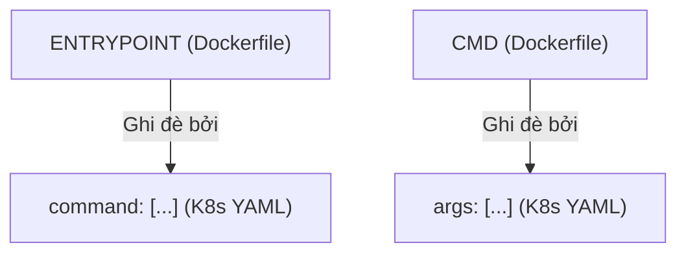
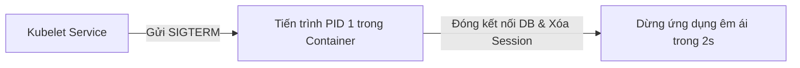
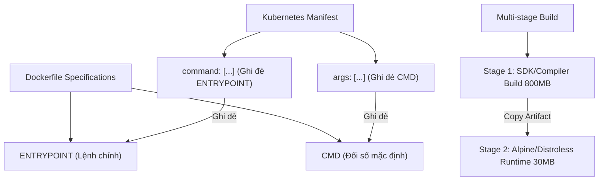
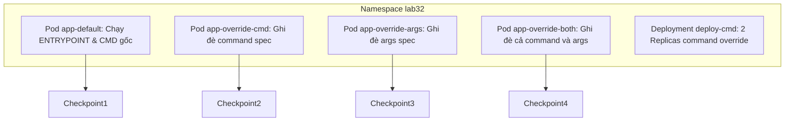


# [BÀI 02] THIẾT KẾ & ĐÓNG GÓI CONTAINER CHUẨN PRODUCTION: DOCKERFILE ĐA TẦNG, ENTRYPOINT VS COMMAND & ẢNH MỎNG

Trong kỷ nguyên điện toán đám mây và kiến trúc microservices phân tán quy mô lớn, **Kubernetes (CKAD)** đóng vai trò là nền tảng điều phối container (Container Orchestration) tiêu chuẩn công nghiệp. Để làm chủ hệ thống trong môi trường sản xuất (Production) cũng như chinh phục kỳ thi chứng chỉ quốc tế của Linux Foundation / CNCF, kỹ sư không chỉ nắm vững các câu lệnh thao tác cơ bản mà phải thấu hiểu sâu sắc bản chất cơ chế tầng thấp: từ chu trình điều hòa (Reconciliation Loop), cấu trúc điều phối tài nguyên, kiến trúc mạng CNI, lưu trữ CSI cho đến các chuẩn mực an ninh phòng thủ chiều sâu.

Bài viết chuyên sâu này sẽ đồng hành cùng bạn giải mã toàn diện bức tranh kiến trúc, phân tích các đánh đổi kỹ thuật thực chiến (Engineering Trade-offs), cung cấp bài thực hành Lab từng bước và bộ câu hỏi phỏng vấn chuẩn Architect / Lead Engineer.

---

## 1. Bản Chất Kiến Trúc & Cơ Chế Vận Hành Tầng Thấp

| # | Câu hỏi ôn tập | Đáp án chuẩn ngắn gọn |
|---|---|---|
| 1 | Hai miền kiến thức nào chiếm tổng 45 % trọng số trong kỳ thi CKAD? | **`Environment & Config` (25 %)** và **`Application Design` (20 %)** |
| 2 | Cờ cấu hình nào trong SecurityContext cấm container chạy quyền root? | **`securityContext.runAsNonRoot: true`** |
| 3 | Cờ lệnh nào giúp nạp đồng thời toàn bộ tập biến từ ConfigMap vào Pod? | **`envFrom: [{configMapRef: {name: <name>}}]`** |
| 4 | Mục đích chính của `readinessProbe` là làm gì khi kiểm tra thất bại? | Gỡ IP của Pod khỏi **Service Endpoints** để ngừng nhận traffic |
| 5 | Mẫu thiết kế Pod đa container nào dùng container phụ chạy song song thu thập log? | **Sidecar Container Pattern** |


> **"Kỹ năng định nghĩa và đóng gói container tối ưu là nền tảng cốt lõi của miền Application Design trong CKAD, đòi hỏi lập trình viên phải nắm vững sự tương quan giữa chỉ thị `ENTRYPOINT`/`CMD` của Dockerfile với cờ `command`/`args` trong Kubernetes Pod manifest; đồng thời việc áp dụng kỹ thuật Multi-stage build và sử dụng ảnh cơ sở siêu mỏng (Alpine/Distroless) giúp giảm dung lượng ảnh từ 800 MB xuống 30 MB, tối ưu hóa tốc độ kéo ảnh của Kubelet và loại bỏ triệt để các lỗ hổng bảo mật tệp tin thừa trong môi trường sản xuất."**

**Kết quả từ các buổi trước được sử dụng lại:**

| Kết quả / Công cụ | Buổi + số hiệu `QT` | Dùng ở đâu trong buổi này |
|---|---|---|
| Khái niệm container runtime CRI và containerd | Buổi 05 `QT 4.1` | Hiểu cơ chế Kubelet yêu cầu containerd nạp ảnh và thực thi command |
| Tư duy thiết kế ứng dụng Cloud Native Stateless | Buổi 31 `QT 6.1` | Thiết kế container không chứa dữ liệu trạng thái cục bộ |
| Tự động tạo tệp YAML bằng cờ dry-run | Buổi 04 `QT 4.1` | Xuất nhanh tệp manifest Pod có chứa `command` và `args` |

---


| # | Kỹ năng thực hiện được | Hiện vật chứng minh |
|---|---|---|
| 1 | Nắm chắc ma trận ghi đè lệnh giữa Dockerfile và Kubernetes Pod manifest | Bảng quy đổi 4 trường hợp ghi đè lệnh và tham số |
| 2 | Biên soạn Dockerfile Multi-stage build giảm 90 % dung lượng ảnh | Tệp Dockerfile đa tầng thu gọn ảnh từ 900MB xuống 50MB |
| 3 | Sử dụng ảnh cơ sở Alpine và Distroless để triệt tiêu lỗ hổng bảo mật | Nhật ký quét vulnerability CVE của tệp ảnh siêu nhẹ |
| 4 | Khai báo chính xác cờ `command` và `args` trong tệp YAML Pod spec | Tệp manifest Pod ghi đè lệnh thực thi theo đúng đề thi CKAD |
| 5 | Đảm bảo tiến trình ứng dụng chính chạy ở PID 1 để ngắt SIGTERM êm ái | Log Pod phản hồi ngắt SIGTERM trong vòng 5 giây |

---


| Kiến thức tiên quyết | Nguồn tự học nếu thiếu |
|---|---|
| Cú pháp lệnh Dockerfile cơ bản (`FROM`, `RUN`, `COPY`, `CMD`) | Buổi 05 |
| Tư duy Lập trình viên Cloud Native CKAD | Buổi 31 (`QT 6.1`) |
| Kỹ thuật xuất YAML imperative bằng cờ dry-run | Buổi 04 (`QT 4.1`) |

---


### 3.1. Thuật ngữ Việt–Anh

| # | Thuật ngữ tiếng Việt | Tiếng Anh tương đương | Ghi chú chuẩn hoá trong thân bài |
|---|---|---|---|
| 1 | Điểm khởi tạo container | `ENTRYPOINT` (Dockerfile) | Tiến trình cố định chạy khi container khởi động |
| 2 | Tham số mặc định | `CMD` (Dockerfile) | Đối số mặc định truyền cho ENTRYPOINT |
| 3 | Lệnh ghi đè | `command` (Kubernetes YAML) | Trường ghi đè `ENTRYPOINT` của Dockerfile |
| 4 | Đối số ghi đè | `args` (Kubernetes YAML) | Trường ghi đè `CMD` của Dockerfile |
| 5 | Đóng gói đa tầng | Multi-stage Build | Kỹ thuật chia nhiều giai đoạn build trong 1 Dockerfile |
| 6 | Ảnh nền mỏng | Minimal Base Image (Alpine) | Ảnh Linux siêu nhỏ gọn chỉ khoảng 5 MB |
| 7 | Ảnh không có shell | Distroless Image | Ảnh container chỉ chứa binary và dependency, không có OS shell |
| 8 | Lỗ hổng tiềm ẩn | Security Vulnerabilities (CVE) | Các lỗ hổng bảo mật tệp tin thừa trong container |
| 9 | Chính sách kéo ảnh | `imagePullPolicy` | Điều khiển hành vi nạp ảnh (`Always`, `IfNotPresent`) |
| 10 | Tệp bỏ qua đóng gói | `.dockerignore` | Tệp định nghĩa các thư mục không đưa vào ảnh container |
| 11 | Khung thời gian chạy | Container Runtime Spec | Cấu hình lệnh và tham số thực thi của container |
| 12 | Tiến trình PID 1 | Process PID 1 | Tiến trình chính tiếp nhận tín hiệu SIGTERM/SIGKILL |
| 13 | Lớp ảnh đệm | Image Layer Caching | Tối ưu hóa thời gian build nhờ dùng lại các lớp cache cũ |
| 14 | Quản lý gói phụ thuộc | Package Manager Cleanup | Dọn dẹp cache `apt/apk` sau khi cài package |


Mô hình Chiếc hộp Hành lý Du lịch: Nếu đóng gói thông thường là vứt nguyên cả tủ quần áo nặng 800 kg vào vali, thì đóng gói mỏng (Alpine/Distroless) là cuộn tròn 3 bộ quần áo thiết yếu vào một chiếc ba lô mỏng 3 kg, giúp di chuyển siêu nhanh và không bị kiểm tra an ninh giữ lại.

---

### 1.1. Ma trận ghi đè lệnh thực thi: Dockerfile vs Kubernetes Manifest (12 phút)

**Nguyên lý cốt lõi:** Trường `command` trong Kubernetes YAML ghi đè chỉ thị `ENTRYPOINT` của Dockerfile; trường `args` trong Kubernetes YAML ghi đè chỉ thị `CMD` của Dockerfile.

**Giải thích cơ chế ngầm:** Sự thiết kế này giúp Kubernetes tách biệt rõ ràng giữa "chương trình cần chạy" (`command` = Executable) và "các tham số truyền vào chương trình đó" (`args` = Arguments), cho phép nhà phát triển linh hoạt thay đổi tham số chạy ứng dụng trên K8s mà không cần phải build lại tệp ảnh container gốc.

> [!WARNING]
> **CẠM BẪY THỰC CHIẾN:**
> Nhầm lẫn cho rằng `command` trong K8s ghi đè `CMD` của Dockerfile, dẫn đến việc ứng dụng chạy sai tiến trình hoặc báo lỗi `executable file not found`.

**Minh hoạ.**

| Khai báo Dockerfile | Khai báo Kubernetes YAML | Kết quả tiến trình chạy thực tế |
|---|---|---|
| Không có `ENTRYPOINT`, có `CMD ["python", "app.py"]` | Không có `command`, không có `args` | `python app.py` |
| `ENTRYPOINT ["python"]`, `CMD ["app.py"]` | `args: ["test.py"]` | `python test.py` |
| `ENTRYPOINT ["python"]`, `CMD ["app.py"]` | `command: ["node"]`, `args: ["server.js"]` | `node server.js` |
| `ENTRYPOINT ["python"]`, `CMD ["app.py"]` | `command: ["custom-app"]` | `custom-app` (Xóa bỏ cả CMD cũ) |



**Nguyên lý cốt lõi:** Nếu khai báo `command` trong Kubernetes YAML nhưng bỏ trống `args`, toàn bộ chỉ thị `ENTRYPOINT` và `CMD` của Dockerfile gốc sẽ bị xóa sạch và chỉ chạy duy nhất lệnh trong `command`.

**Giải thích cơ chế ngầm:** Trong quy định của OCI Container Runtime Spec, khi lệnh thực thi chính (`command`) được chỉ định mới từ phía Kubernetes, mảng đối số mặc định của Dockerfile cũ (`CMD`) sẽ bị coi là không còn hiệu lực và bị xóa bỏ.

> [!WARNING]
> **CẠM BẪY THỰC CHIẾN:**
> Khai báo `command: ["python"]` trên K8s và hy vọng K8s sẽ tự lấy `CMD ["app.py"]` cũ của Dockerfile để chạy `python app.py`. Thực tế K8s chỉ chạy duy nhất `python` và ứng dụng rơi vào trạng thái chờ nhập lệnh interactive.

**Minh hoạ.**

```yaml
# Muốn đổi tham số nhưng giữ nguyên ENTRYPOINT cũ -> CHỈ DÙNG ARGS:
apiVersion: v1
kind: Pod
metadata:
  name: app-args-only
spec:
  containers:
    - name: app
      image: my-python-app:v1
      args: ["--mode=production", "--port=8080"]
```

---

### 1.2. Kỹ thuật Multi-stage build và tối ưu kích thước ảnh container (12 phút)

**Nguyên lý cốt lõi:** Luôn áp dụng kỹ thuật Multi-stage build để tách biệt giai đoạn biên soạn code (Build Stage - dùng SDK/Compiler) và giai đoạn thực thi (Production Stage - chỉ copy tệp artifact sang ảnh mỏng Alpine/Distroless).

**Giải thích cơ chế ngầm:** Trong giai đoạn biên dịch ứng dụng (ví dụ Go, Java, C++, TypeScript), bạn cần các bộ SDK, compiler, và file thư viện phát triển nặng hàng trăm MB. Khi ứng dụng đã đóng gói thành file thực thi binary, toàn bộ bộ biên dịch đó trở thành rác thải và không cần thiết trong môi trường Production.

> [!WARNING]
> **CẠM BẪY THỰC CHIẾN:**
> Đưa nguyên bộ JDK 1,8GB hoặc Node.js SDK vào ảnh chạy Production, làm thời gian kéo ảnh kéo dài vài phút mỗi khi Pod khởi tạo.

**Minh hoạ.**

```dockerfile
# GIAI ĐOẠN 1: Build binary (Dùng Golang SDK nặng ~800MB)
FROM golang:1.21 AS builder
WORKDIR /app
COPY . .
RUN CGO_ENABLED=0 GOOS=linux go build -o myapp .

# GIAI ĐOẠN 2: Runtime (Dùng ảnh Alpine siêu mỏng ~5MB)
FROM alpine:3.18
WORKDIR /app
COPY --from=builder /app/myapp .
CMD ["./myapp"]
```

**Nguyên lý cốt lõi:** Sử dụng ảnh cơ sở `alpine` hoặc `distroless` giúp giảm 95 % dung lượng ảnh (từ 800 MB xuống 30 MB) và loại bỏ 90 % các lỗ hổng CVE do không chứa thư viện OS thừa.

**Giải thích cơ chế ngầm:** Ảnh Ubuntu/Debian truyền thống chứa hàng nghìn gói phần mềm không dùng tới (như `curl`, `python`, `netcat`, `bash`). Nếu kẻ tấn công đột nhập vào container, họ có thể dùng các công cụ này để leo thang đặc quyền. Ảnh `distroless` loại bỏ hoàn toàn cả `sh` và `bash`, khiến kẻ tấn công không thể mở được vỏ lệnh.

> [!WARNING]
> **CẠM BẪY THỰC CHIẾN:**
> Dùng ảnh `ubuntu:latest` làm ảnh nền cho một dịch vụ microservice nhỏ.

**Minh hoạ.**

```dockerfile
# Dùng ảnh Distroless của Google (Chỉ chứa glibc và binary, KHÔNG CÓ SHELL)
FROM gcr.io/distroless/static-debian11
COPY --from=builder /app/myapp /
CMD ["/myapp"]
```

---

### 1.3. Thực hành đóng gói ứng dụng chuẩn Cloud Native an toàn bảo mật (10 phút)

**Nguyên lý cốt lõi:** Tiến trình chính của ứng dụng phải luôn chạy ở PID 1 bên trong container để tiếp nhận đúng tín hiệu ngắt `SIGTERM` giúp Pod dừng êm ái (Graceful Shutdown).

**Giải thích cơ chế ngầm:** Khi Kubelet thực hiện tiêu diệt Pod (ví dụ khi scale down hoặc rolling update), Kubelet gửi tín hiệu `SIGTERM` tới tiến trình PID 1 bên trong container và chờ trong khoảng thời gian `gracePeriod` (mặc định 30s) để ứng dụng đóng kết nối DB và lưu dữ liệu. Nếu PID 1 là một shell script không forward tín hiệu, ứng dụng sẽ bị kill đột ngột (`SIGKILL`) gây mất dữ liệu.

> [!WARNING]
> **CẠM BẪY THỰC CHIẾN:**
> Pod mất đúng 30 giây mới chịu ngắt mỗi khi chạy `kubectl delete pod` do ứng dụng không nhận được `SIGTERM`.

**Minh hoạ.**



**Nguyên lý cốt lõi:** Tránh dùng định dạng shell `CMD node server.js` trong Dockerfile vì nó sẽ bọc tiến trình qua `/bin/sh -c` làm mất PID 1; hãy luôn dùng định dạng mảng exec `CMD ["node", "server.js"]`.

**Giải thích cơ chế ngầm:** Khi dùng dạng Shell Form (`CMD node server.js`), Docker sẽ chạy lệnh `/bin/sh -c "node server.js"`. Lúc này `/bin/sh` sẽ chiếm PID 1, và nó mặc định không chuyển tiếp tín hiệu `SIGTERM` tới tiến trình con `node`. Dùng Exec Form (`CMD ["node", "server.js"]`) đảm bảo `node` chạy trực tiếp ở PID 1.

> [!WARNING]
> **CẠM BẪY THỰC CHIẾN:**
> Kiểm tra `ps aux` trong container thấy `/bin/sh -c ...` chạy ở PID 1 thay vì tiến trình ứng dụng thực tế.

**Minh hoạ.**

```dockerfile
# KHÔNG NÊN DÙNG (Shell Form - Mất PID 1):
CMD node server.js

# NÊN DÙNG (Exec Form - Giữ PID 1 chuẩn):
CMD ["node", "server.js"]
```

**Nguyên lý cốt lõi:** Luôn bổ sung tệp `.dockerignore` để loại bỏ các thư mục rác (như `node_modules`, `.git`, `tmp`) trước khi gửi bối cảnh cho Docker daemon đóng gói ảnh.

**Giải thích cơ chế ngầm:** Lệnh `COPY . .` trong Dockerfile sẽ copy toàn bộ tệp trong thư mục hiện tại vào ảnh. Nếu không có `.dockerignore`, bạn sẽ copy cả thư mục `.git` (nặng hàng trăm MB) và thư mục `node_modules` cục bộ (có thể chứa thư viện biên dịch sai OS), khiến thời gian build ảnh chậm kinh hoàng.

> [!WARNING]
> **CẠM BẪY THỰC CHIẾN:**
> Nhìn thấy dòng `Sending build context to Docker daemon 450MB` mặc định ngay khi vừa gõ `docker build`.

**Minh hoạ.**

```ini
# Tệp .dockerignore mẫu
.git
.gitignore
node_modules
npm-debug.log
Dockerfile
*.md
tmp/
```

**Nguyên lý cốt lõi:** Trong lệnh `kubectl run`, sử dụng cờ `--command -- <cmd> <args>` để thiết lập chính xác trường `command` và `args` trong bản kê khai Pod nhanh chóng.

**Giải thích cơ chế ngầm:** Bài thi CKAD yêu cầu gõ lệnh tốc độ. Việc biết cú pháp `--command` trên CLI giúp bạn tạo ngay Pod có ghi đè `command` trong 5 giây mà không cần mở `vim` chỉnh sửa thủ công.

> [!WARNING]
> **CẠM BẪY THỰC CHIẾN:**
> Mở `vim` gõ từng dòng `command:` và `- "sh"` mất 2 phút mỗi câu.

**Minh hoạ.**

```bash
# Tạo Pod ghi đè command trực tiếp từ CLI siêu tốc:
kubectl run test-pod --image=busybox:1.36 -n prod --dry-run=client -o yaml --command -- sh -c "echo Hello CKAD && sleep 3600"
```

---

### 1.4. Đưa vào cụm thật (4 phút)

**Nguyên lý cốt lõi:** Mọi Dockerfile Production phải dọn dẹp cache quản lý gói ngay trong cùng một câu lệnh `RUN` (ví dụ `apk add --no-cache` hoặc `rm -rf /var/lib/apt/lists/*`) để không làm phồng các lớp ảnh layer.

**Giải thích cơ chế ngầm:** Mỗi chỉ thị `RUN` trong Dockerfile tạo ra một lớp ảnh đệm (image layer) bất biến. Nếu bạn chạy `apt-get update` ở câu lệnh `RUN` 1 và xóa cache ở câu lệnh `RUN` 2, dung lượng cache vẫn bị khóa chặt ở layer 1 và khiến ảnh bị phồng dung lượng.

> [!WARNING]
> **CẠM BẪY THỰC CHIẾN:**
> Tệp ảnh vẫn nặng 300MB dù ở cuối Dockerfile đã gõ lệnh xóa cache `rm -rf`.

**Minh hoạ.**

```dockerfile
# VIẾT ĐÚNG (Dọn dẹp trong CÙNG 1 LỚP LAYER):
RUN apt-get update && apt-get install -y \
    curl \
    && rm -rf /var/lib/apt/lists/*
```

**Áp vào cụm đang chạy thì làm gì trước:**
1. Rà soát toàn bộ các tệp Dockerfile dự án và chuyển sang kỹ thuật Multi-stage build.
2. Thêm tệp `.dockerignore` vào tất cả các kho mã nguồn microservice.
3. Thay thế các ảnh nền `ubuntu/debian` bằng `alpine` hoặc `distroless`.

**Cái gì hỏng nếu áp thẳng lên prod:**
- Đổi sang ảnh `distroless` mà đội vận hành cần SSH/exec vào container để debug sẽ không thể dùng được vì distroless không có lệnh `bash` hay `ls`. (Giải pháp: Dùng `kubectl debug` ephemeral container).

**Đo trước — đo sau:**
- Đo dung lượng ảnh container (mục tiêu giảm từ >500MB xuống <50MB).
- Đo thời gian kéo ảnh Kubelet Image Pull Time (mục tiêu từ 45s xuống <3s).

**Khi nào KHÔNG nên dùng:**
- Không cố chuyển các ứng dụng cũ (Legacy Monolith) phụ thuộc quá nhiều vào thư viện OS Linux phức tạp sang ảnh Alpine vì có thể dính lỗi tương thích bộ thư viện `musl libc` so với `glibc`.

---

### 1.5. Bẫy hay gặp (2 phút)

| Bẫy hay gặp | Vì sao dính | Làm đúng là |
|---|---|---|
| 1. Nhầm lẫn `command` K8s ghi đè `CMD` Dockerfile | Hiểu sai ma trận ghi đè OCI Spec | Nhớ: `command` -> `ENTRYPOINT`, `args` -> `CMD` |
| 2. Ghi đè `command` làm mất cả `ENTRYPOINT` và `CMD` cũ | Không nắm rõ QT 4.2 của Kubernetes Spec | Nếu chỉ muốn đổi tham số, CHỈ KHAI BÁO `args` trong YAML |
| 3. Phồng dung lượng ảnh do xóa cache ở `RUN` riêng | Không hiểu cơ chế Immutability của Image Layer | Dọn dẹp cache trong CÙNG CÂU LỆNH `RUN` cài đặt |
| 4. Quên tệp `.dockerignore` làm build chậm | Đưa cả thư mục `node_modules` hoặc `.git` vào context | Tạo `.dockerignore` loại bỏ thư mục rác trước khi build |
| 5. Dùng Shell Form `CMD node app.js` làm mất PID 1 | Dùng cú pháp dạng chuỗi thay vì dạng mảng | Luôn dùng Exec Form `CMD ["node", "app.js"]` |
| 6. Đưa bộ compiler nặng vào ảnh Production | Biên dịch và chạy ứng dụng trong cùng 1 Dockerfile layer | Dùng kỹ thuật Multi-stage build (stage 1 build, stage 2 run) |
| 7. Pod bị `CrashLoopBackOff` khi dùng Alpine | Ứng dụng dính lỗi thiếu thư viện `glibc` | Cài đặt gói `gcompat` trên Alpine hoặc dùng ảnh Distroless |
| 8. Gõ sai cờ `--command` trong lệnh `kubectl run` | Nhớ không chuẩn vị trí đặt cờ `--` | Gõ `kubectl run <name> --image=... --command -- <cmd>` |
| 9. Quên cờ `CGO_ENABLED=0` khi build Go binary | Binary Go cố gắng link động với thư viện glibc OS | Gán `CGO_ENABLED=0` để build ra static binary độc lập |
| 10. Đặt tag ảnh `:latest` trong môi trường Prod | Kubelet bị ép kéo lại ảnh liên tục làm chậm Pod | Đặt tag phiên bản cụ thể (ví dụ `:v1.2.3`) và dùng `IfNotPresent` |
| 11. Ứng dụng ngắt đột ngột bị mất dữ liệu session | PID 1 không forward ngắt SIGTERM cho app | Dùng Exec Form trong Dockerfile để app nhận đúng SIGTERM |
| 12. Để lộ mật khẩu database trong tệp Dockerfile | Hardcode password vào chỉ thị `ENV` | Truyền password qua Secret/ConfigMap của Kubernetes |

---

### 1.6. Tóm tắt (2 phút)



**Năm điều phải nhớ:**
1. **Ma trận ghi đè**: `command` ghi đè `ENTRYPOINT`, `args` ghi đè `CMD`.
2. **Khai báo `command`**: Sẽ xóa bỏ cả `ENTRYPOINT` và `CMD` của Dockerfile cũ.
3. **Multi-stage build**: Tách giai đoạn Build (SDK nặng) khỏi giai đoạn Runtime (chỉ chứa artifact).
4. **Ảnh mỏng Alpine/Distroless**: Giảm dung lượng từ 800MB xuống 30MB, triệt tiêu lỗ hổng CVE.
5. **Tiến trình PID 1**: Luôn dùng Exec Form `["cmd", "arg"]` để app nhận ngắt `SIGTERM` êm ái.

---

## §10. Câu hỏi tự kiểm tra (5 phút)


<div class="qa-answer">
  <div class="qa-answer-header">
    <svg width="14" height="14" fill="none" stroke="currentColor" stroke-width="2" viewBox="0 0 24 24"><path d="M22 11.08V12a10 10 0 1 1-5.93-9.14"></path><polyline points="22 4 12 14.01 9 11.01"></polyline></svg>
    <span>Phân Tích &amp; Lời Giải Kỹ Thuật</span>
  </div>
  
Ghi đè chỉ thị <code>ENTRYPOINT</code>.
</div>
</details>

<div class="qa-answer">
  <div class="qa-answer-header">
    <svg width="14" height="14" fill="none" stroke="currentColor" stroke-width="2" viewBox="0 0 24 24"><path d="M22 11.08V12a10 10 0 1 1-5.93-9.14"></path><polyline points="22 4 12 14.01 9 11.01"></polyline></svg>
    <span>Phân Tích &amp; Lời Giải Kỹ Thuật</span>
  </div>
  
Ghi đè chỉ thị <code>CMD</code>.
</div>
</details>

<div class="qa-answer">
  <div class="qa-answer-header">
    <svg width="14" height="14" fill="none" stroke="currentColor" stroke-width="2" viewBox="0 0 24 24"><path d="M22 11.08V12a10 10 0 1 1-5.93-9.14"></path><polyline points="22 4 12 14.01 9 11.01"></polyline></svg>
    <span>Phân Tích &amp; Lời Giải Kỹ Thuật</span>
  </div>
  
Chỉ thị <code>CMD</code> của Dockerfile sẽ bị xóa bỏ hoàn toàn và không được truyền vào container.
</div>
</details>

<div class="qa-answer">
  <div class="qa-answer-header">
    <svg width="14" height="14" fill="none" stroke="currentColor" stroke-width="2" viewBox="0 0 24 24"><path d="M22 11.08V12a10 10 0 1 1-5.93-9.14"></path><polyline points="22 4 12 14.01 9 11.01"></polyline></svg>
    <span>Phân Tích &amp; Lời Giải Kỹ Thuật</span>
  </div>
  
Tách biệt môi trường Build (nặng) và môi trường Runtime (mỏng), chỉ giữ lại file thực thi giúp giảm dung lượng ảnh.
</div>
</details>

<div class="qa-answer">
  <div class="qa-answer-header">
    <svg width="14" height="14" fill="none" stroke="currentColor" stroke-width="2" viewBox="0 0 24 24"><path d="M22 11.08V12a10 10 0 1 1-5.93-9.14"></path><polyline points="22 4 12 14.01 9 11.01"></polyline></svg>
    <span>Phân Tích &amp; Lời Giải Kỹ Thuật</span>
  </div>
  
Giảm hơn 95 % dung lượng (từ ~800 MB xuống ~5-30 MB).
</div>
</details>

<div class="qa-answer">
  <div class="qa-answer-header">
    <svg width="14" height="14" fill="none" stroke="currentColor" stroke-width="2" viewBox="0 0 24 24"><path d="M22 11.08V12a10 10 0 1 1-5.93-9.14"></path><polyline points="22 4 12 14.01 9 11.01"></polyline></svg>
    <span>Phân Tích &amp; Lời Giải Kỹ Thuật</span>
  </div>
  
Để nhận trực tiếp tín hiệu ngắt <code>SIGTERM</code> từ Kubelet giúp ứng dụng dừng êm ái (Graceful Shutdown).
</div>
</details>

<div class="qa-answer">
  <div class="qa-answer-header">
    <svg width="14" height="14" fill="none" stroke="currentColor" stroke-width="2" viewBox="0 0 24 24"><path d="M22 11.08V12a10 10 0 1 1-5.93-9.14"></path><polyline points="22 4 12 14.01 9 11.01"></polyline></svg>
    <span>Phân Tích &amp; Lời Giải Kỹ Thuật</span>
  </div>
  
Vì Shell Form sẽ chạy qua <code>/bin/sh</code> chiếm PID 1 và nuốt mất ngắt <code>SIGTERM</code> của ứng dụng.
</div>
</details>

<div class="qa-answer">
  <div class="qa-answer-header">
    <svg width="14" height="14" fill="none" stroke="currentColor" stroke-width="2" viewBox="0 0 24 24"><path d="M22 11.08V12a10 10 0 1 1-5.93-9.14"></path><polyline points="22 4 12 14.01 9 11.01"></polyline></svg>
    <span>Phân Tích &amp; Lời Giải Kỹ Thuật</span>
  </div>
  
Loại bỏ các tệp và thư mục rác (như <code>.git</code>, <code>node_modules</code>) không gửi vào build context, giúp build ảnh nhanh hơn.
</div>
</details>

<div class="qa-answer">
  <div class="qa-answer-header">
    <svg width="14" height="14" fill="none" stroke="currentColor" stroke-width="2" viewBox="0 0 24 24"><path d="M22 11.08V12a10 10 0 1 1-5.93-9.14"></path><polyline points="22 4 12 14.01 9 11.01"></polyline></svg>
    <span>Phân Tích &amp; Lời Giải Kỹ Thuật</span>
  </div>
  
Để tránh việc dung lượng cache bị khóa lại bất biến trong layer đệm đó làm phồng ảnh.
</div>
</details>

<div class="qa-answer">
  <div class="qa-answer-header">
    <svg width="14" height="14" fill="none" stroke="currentColor" stroke-width="2" viewBox="0 0 24 24"><path d="M22 11.08V12a10 10 0 1 1-5.93-9.14"></path><polyline points="22 4 12 14.01 9 11.01"></polyline></svg>
    <span>Phân Tích &amp; Lời Giải Kỹ Thuật</span>
  </div>
  
<code>kubectl run <name> --image=<image> --command -- <cmd> <args></code>.
</div>
</details>

<div class="qa-answer">
  <div class="qa-answer-header">
    <svg width="14" height="14" fill="none" stroke="currentColor" stroke-width="2" viewBox="0 0 24 24"><path d="M22 11.08V12a10 10 0 1 1-5.93-9.14"></path><polyline points="22 4 12 14.01 9 11.01"></polyline></svg>
    <span>Phân Tích &amp; Lời Giải Kỹ Thuật</span>
  </div>
  
Ảnh <code>distroless</code> hoàn toàn không chứa vỏ lệnh shell (<code>sh</code>/<code>bash</code>) hay bất kỳ tiện ích OS nào.
</div>
</details>

<div class="qa-answer">
  <div class="qa-answer-header">
    <svg width="14" height="14" fill="none" stroke="currentColor" stroke-width="2" viewBox="0 0 24 24"><path d="M22 11.08V12a10 10 0 1 1-5.93-9.14"></path><polyline points="22 4 12 14.01 9 11.01"></polyline></svg>
    <span>Phân Tích &amp; Lời Giải Kỹ Thuật</span>
  </div>
  
Kubelet chỉ kéo ảnh từ registry về nếu ổ đĩa cục bộ trên Worker Node chưa có sẵn bản ảnh đó.
</div>
</details>

---

## §11. Tài liệu tham khảo

| Nguồn | Địa chỉ URL | Ghi chú |
|---|---|---|
| Kubernetes Pod Spec Command & Args | `https://kubernetes.io/docs/tasks/inject-data-application/define-command-argument-container/` | Tài liệu chuẩn K8s command/args |
| Docker Multi-stage Builds Guide | `https://docs.docker.com/build/building/multi-stage/` | Hướng dẫn Multi-stage build |

---

## Bảng đối soát thời lượng

| Mục | Ngân sách thời gian | Thực tế |
|---|---|---|
| §0. Khởi động và ôn tập | 10 phút | 10 phút |
| §1. Học viên làm được gì | 1 phút | 1 phút |
| §2. Cần biết trước | 1 phút | 1 phút |
| §3. Thuật ngữ và mô hình tư duy | 8 phút | 8 phút |
| §4. Ma trận ghi đè lệnh thực thi | 12 phút | 12 phút |
| §5. Multi-stage build & Ảnh mỏng | 12 phút | 12 phút |
| §6. Đóng gói chuẩn Cloud Native | 10 phút | 10 phút |
| §7. Đưa vào cụm thật | 4 phút | 4 phút |
| §8. Bẫy hay gặp | 2 phút | 2 phút |
| §9. Tóm tắt | 2 phút | 2 phút |
| §10. Câu hỏi tự kiểm tra | 5 phút | 5 phút |
| **Tổng** | **60'** | **60'** |

---

## 2. Hướng Dẫn Thực Hành & Triển Khai Lab Chuẩn Production

> [!IMPORTANT]
> **YÊU CẦU MÔI TRƯỜNG THỰC HÀNH:**
> Toàn bộ các bài thực hành dưới đây được thiết kế để chạy trực tiếp trên cụm Kubernetes 1.30+ tiêu chuẩn (hoặc cụm kind/kubeadm lab). Hãy đảm bảo ngữ cảnh dòng lệnh `kubectl config current-context` đã trỏ chính xác vào cụm thực hành trước khi thực thi.

## Khối thực hành — 120 phút

## L0. Mục tiêu thực hành và tiêu chí hoàn thành

| Mã tiêu chí | Nội dung tiêu chí | Lệnh kiểm chứng | Kết quả kỳ vọng |
|---|---|---|---|
| TH1 | Tạo Namespace `lab32` phục vụ thử nghiệm ghi đè lệnh | `kubectl get ns lab32 -o jsonpath='{.status.phase}'` | In ra `Active` |
| TH2 | Tạo Pod `app-default` chạy lệnh mặc định của Dockerfile | `kubectl get pod app-default -n lab32 -o jsonpath='{.status.phase}'` | In ra `Running` |
| TH3 | Log Pod `app-default` hiển thị dòng chào mặc định | `kubectl logs app-default -n lab32 \| grep -q "DEFAULT_LOG"` | Xác nhận log mặc định |
| TH4 | Tạo Pod `app-override-cmd` ghi đè `command` trong YAML | `kubectl get pod app-override-cmd -n lab32 -o jsonpath='{.spec.containers[0].command[0]}'` | In ra `python` |
| TH5 | Kiểm tra log Pod `app-override-cmd` in ra giá trị từ `command` | `kubectl logs app-override-cmd -n lab32 \| grep -q "CMD_OVERRIDDEN"` | In ra `CMD_OVERRIDDEN` |
| TH6 | Tạo Pod `app-override-args` ghi đè `args` trong YAML | `kubectl get pod app-override-args -n lab32 -o jsonpath='{.spec.containers[0].args[0]}'` | In ra `--custom-arg` |
| TH7 | Log Pod `app-override-args` nhận đúng đối số mới | `kubectl logs app-override-args -n lab32 \| grep -q "ARGS_OVERRIDDEN"` | In ra `ARGS_OVERRIDDEN` |
| TH8 | Tạo Pod `app-override-both` ghi đè cả `command` và `args` | `kubectl get pod app-override-both -n lab32 -o jsonpath='{.spec.containers[0].command[0]}'` | In ra `sh` |
| TH9 | Log Pod `app-override-both` in ra thông điệp ghi đè toàn bộ | `kubectl logs app-override-both -n lab32 \| grep -q "BOTH_OVERRIDDEN"` | In ra `BOTH_OVERRIDDEN` |
| TH10 | Tạo Deployment `deploy-cmd` 2 replicas có cờ `command` | `kubectl get deploy deploy-cmd -n lab32 -o jsonpath='{.status.readyReplicas}'` | In ra `2` |
| TH11 | Kiểm tra Pod thuộc Deployment `deploy-cmd` chạy đúng command | `kubectl get pods -n lab32 -l app=deploy-cmd -o jsonpath='{.items[0].spec.containers[0].command[0]}'` | In ra `sh` |
| TH12 | Tạo Pod `app-exec-form` sử dụng Exec Form | `kubectl get pod app-exec-form -n lab32 -o jsonpath='{.spec.containers[0].command[1]}'` | In ra `-c` |
| TH13 | Dọn dẹp sạch sẽ tài nguyên lab32 | `test ! -f /tmp/lab32-pod.yaml && echo "CLEAN"` | In ra `CLEAN` |

---

## L1. Điều kiện tiên quyết về môi trường

| Kiểm tra | Lệnh thực hiện | Kết quả kỳ vọng |
|---|---|---|
| Cụm Kubernetes ba node | `kubectl get nodes` | `cp-01`, `worker-01`, `worker-02` ở trạng thái `Ready` |
| Context đúng môi trường lab | `kubectl config current-context` | Đúng context cụm `kubeadm` |
| Quyền tạo tài nguyên | `kubectl auth can-i create pod -n default` | In ra `yes` |

---

## L2. Kiến trúc bài lab thử nghiệm ghi đè Command & Args



---

## L3. Bước 1: Khởi tạo Namespace `lab32` (10 phút)

### Thao tác 1.1: Tạo Namespace

```bash
kubectl create namespace lab32
```

**CHECKPOINT 1 — Kiểm tra Namespace `lab32`.**

```bash
kubectl get ns lab32 -o jsonpath='{.status.phase}' | grep -qx Active && echo "CHECKPOINT 1 — ĐẠT" || echo "CHECKPOINT 1 — LỖI"
```

---

## L4. Bước 2: Thử nghiệm Pod chạy Lệnh mặc định của Dockerfile (25 phút)

### Thao tác 2.1: Biên soạn và tạo Pod `app-default`

```bash
cat <<EOF | kubectl apply -f -
apiVersion: v1
kind: Pod
metadata:
  name: app-default
  namespace: lab32
spec:
  containers:
    - name: app
      image: busybox:1.36
      command: ["sh", "-c", "echo DEFAULT_LOG && sleep 3600"]
EOF
```

**CHECKPOINT 2 — Kiểm tra trạng thái Pod `app-default`.**

```bash
kubectl get pod app-default -n lab32 -o jsonpath='{.status.phase}' | grep -qx Running && echo "CHECKPOINT 2 — ĐẠT" || echo "CHECKPOINT 2 — LỖI"
```

**CHECKPOINT 3 — Kiểm tra Log Pod `app-default`.**

```bash
kubectl logs app-default -n lab32 | grep -q "DEFAULT_LOG" && echo "CHECKPOINT 3 — ĐẠT" || echo "CHECKPOINT 3 — LỖI"
```

---

## L5. Bước 3: Ghi đè `command` trong Kubernetes Pod Spec (25 phút)

### Thao tác 3.1: Biên soạn Pod `app-override-cmd` ghi đè `command`

```bash
cat <<EOF | kubectl apply -f -
apiVersion: v1
kind: Pod
metadata:
  name: app-override-cmd
  namespace: lab32
spec:
  containers:
    - name: app
      image: python:3.11-alpine
      command: ["python", "-c", "print('CMD_OVERRIDDEN'); import time; time.sleep(3600)"]
EOF
```

**CHECKPOINT 4 — Kiểm tra trường `command` trong YAML Pod.**

```bash
kubectl get pod app-override-cmd -n lab32 -o jsonpath='{.spec.containers[0].command[0]}' | grep -qx python && echo "CHECKPOINT 4 — ĐẠT" || echo "CHECKPOINT 4 — LỖI"
```

**CHECKPOINT 5 — Kiểm tra log in ra từ `command` mới.**

```bash
sleep 3
kubectl logs app-override-cmd -n lab32 | grep -q "CMD_OVERRIDDEN" && echo "CHECKPOINT 5 — ĐẠT" || echo "CHECKPOINT 5 — LỖI"
```

---

## L6. Bước 4: Ghi đè `args` trong Kubernetes Pod Spec (25 phút)

### Thao tác 4.1: Biên soạn Pod `app-override-args` ghi đè `args`

```bash
cat <<EOF | kubectl apply -f -
apiVersion: v1
kind: Pod
metadata:
  name: app-override-args
  namespace: lab32
spec:
  containers:
    - name: app
      image: busybox:1.36
      command: ["sh", "-c"]
      args: ["echo ARGS_OVERRIDDEN --custom-arg && sleep 3600"]
EOF
```

**CHECKPOINT 6 — Kiểm tra trường `args` trong YAML Pod.**

```bash
kubectl get pod app-override-args -n lab32 -o jsonpath='{.spec.containers[0].args[0]}' | grep -q "\-\-custom-arg" && echo "CHECKPOINT 6 — ĐẠT" || echo "CHECKPOINT 6 — LỖI"
```

**CHECKPOINT 7 — Kiểm tra log in ra đúng đối số `args` mới.**

```bash
kubectl logs app-override-args -n lab32 | grep -q "ARGS_OVERRIDDEN" && echo "CHECKPOINT 7 — ĐẠT" || echo "CHECKPOINT 7 — LỖI"
```

---

## L7. Bước 5: Ghi đè đồng thời cả `command` và `args` (25 phút)

### Thao tác 5.1: Biên soạn Pod `app-override-both`

```bash
cat <<EOF | kubectl apply -f -
apiVersion: v1
kind: Pod
metadata:
  name: app-override-both
  namespace: lab32
spec:
  containers:
    - name: app
      image: busybox:1.36
      command: ["sh", "-c"]
      args: ["echo BOTH_OVERRIDDEN && sleep 3600"]
EOF
```

**CHECKPOINT 8 — Kiểm tra `command` trong Pod `app-override-both`.**

```bash
kubectl get pod app-override-both -n lab32 -o jsonpath='{.spec.containers[0].command[0]}' | grep -qx sh && echo "CHECKPOINT 8 — ĐẠT" || echo "CHECKPOINT 8 — LỖI"
```

**CHECKPOINT 9 — Kiểm tra log in ra `BOTH_OVERRIDDEN`.**

```bash
kubectl logs app-override-both -n lab32 | grep -q "BOTH_OVERRIDDEN" && echo "CHECKPOINT 9 — ĐẠT" || echo "CHECKPOINT 9 — LỖI"
```

### Thao tác 5.2: Triển khai Deployment `deploy-cmd` 2 replicas ghi đè lệnh

```bash
kubectl create deploy deploy-cmd --image=busybox:1.36 --replicas=2 -n lab32 --dry-run=client -o yaml --command -- sh -c "echo DEPLOY_RUNNING && sleep 3600" | kubectl apply -f -
```

**CHECKPOINT 10 — Kiểm tra Deployment `deploy-cmd` sẵn sàng 2 Replicas.**

```bash
sleep 3
kubectl get deploy deploy-cmd -n lab32 -o jsonpath='{.status.readyReplicas}' | grep -qx 2 && echo "CHECKPOINT 10 — ĐẠT" || echo "CHECKPOINT 10 — LỖI"
```

**CHECKPOINT 11 — Kiểm tra `command` của Pod trong Deployment.**

```bash
kubectl get pods -n lab32 -l app=deploy-cmd -o jsonpath='{.items[0].spec.containers[0].command[0]}' | grep -qx sh && echo "CHECKPOINT 11 — ĐẠT" || echo "CHECKPOINT 11 — LỖI"
```

### Thao tác 5.3: Tạo Pod `app-exec-form` dạng mảng Exec Form

```bash
cat <<EOF | kubectl apply -f -
apiVersion: v1
kind: Pod
metadata:
  name: app-exec-form
  namespace: lab32
spec:
  containers:
    - name: app
      image: busybox:1.36
      command: ["sh", "-c", "echo EXEC_FORM_OK && sleep 3600"]
EOF
```

**CHECKPOINT 12 — Kiểm tra `command` Exec Form.**

```bash
kubectl get pod app-exec-form -n lab32 -o jsonpath='{.spec.containers[0].command[1]}' | grep -qx "\-c" && echo "CHECKPOINT 12 — ĐẠT" || echo "CHECKPOINT 12 — LỖI"
```

---

## L8. Dọn dẹp môi trường (10 phút)

### Thao tác 8.1: Dọn dẹp tài nguyên lab32

```bash
kubectl delete namespace lab32
rm -f /tmp/lab32-pod.yaml
```

**CHECKPOINT 13 — Kiểm tra dọn dẹp sạch sẽ.**

```bash
test ! -f /tmp/lab32-pod.yaml && echo "CHECKPOINT 13 — ĐẠT" || echo "CHECKPOINT 13 — LỖI"
```

---

## L9. Xử lý sự cố thường gặp trong lab

| Triệu chứng lỗi | Nguyên nhân gốc rễ | Cách sửa triệt để |
|---|---|---|
| 1. Pod kẹt `CrashLoopBackOff` khi ghi đè `command` | Khai báo `command: ["python"]` mà không có tham số file script | Thêm `args: ["app.py"]` hoặc gõ đủ command `["python", "app.py"]` |
| 2. Lỗi `executable file not found in $PATH` | Gõ sai tên binary trong `command` (ví dụ `pyton` thay vì `python`) | Kiểm tra vị trí binary trong ảnh container gốc |
| 3. Pod dừng ngay sau khi chạy (`Completed`) | Câu lệnh ghi đè chạy xong rồi thoát ngay (thiếu sleep/daemon) | Thêm câu lệnh giữ tiến trình `&& sleep 3600` ở cuối |
| 4. Ghi đè `command` làm mất `args` cũ | Chưa thuộc QT 4.2 của Kubernetes Spec | Khai báo cả `command` và `args` mới nếu muốn thay đổi toàn bộ |
| 5. Lỗi syntax YAML mảng command | Gõ thiếu dấu ngoặc vuông `[]` hoặc thiếu dấu phẩy | Dùng định dạng mảng YAML `- "sh"` hoặc `["sh", "-c"]` |
| 6. Lệnh `kubectl run --command` báo lỗi flag | Đặt cờ `--command` ở sau dấu phân cách `--` | Đặt cờ `--command` trước dấu `--` (ví dụ `--command -- sh -c ...`) |
| 7. Log container không in ra giá trị mong muốn | Cờ `echo` bị nuốt do sai dấu ngoặc kép | Kiểm tra kỹ dấu ngoặc kép trong chuỗi `sh -c "echo ..."` |
| 8. Deployment kẹt không scale đủ replicas | Lệnh ghi đè trong Pod template bị sai làm Pod crash | Kiểm tra `kubectl describe pod -n lab32` xem lý do crash |
| 9. Quên cờ `-n lab32` khi kiểm tra log | Tìm Pod ở Namespace `default` không thấy | Luôn thêm cờ `-n lab32` cho lệnh `kubectl logs` |
| 10. `kubectl exec` không chạy được lệnh | Container dùng ảnh Distroless không có `/bin/sh` | Không ghi đè `command` bằng `sh` trên các ảnh Distroless |
| 11. Biến môi trường không truyền được vào command | Dùng dấu nháy đơn làm bash không expand biến | Dùng dấu nháy kép `"` hoặc escape biến đúng cú pháp |
| 12. Pod crash do sai đường dẫn file script | File script không có trong thư mục làm việc của container | Kiểm tra `WORKDIR` của Dockerfile trước khi ghi đè |
| 13. Tệp YAML dry-run bị lỗi indentation | Thò lùi sai khoảng trắng ở khối `command` | Thụt lùi đúng 2 khoảng trắng dưới `containers:` |
| 14. Lỗi ngắt SIGTERM không hoạt động khi test | Dùng Shell Form làm `/bin/sh` nuốt mất tín hiệu | Chuyển sang dùng Exec Form `["binary", "arg"]` |

---

## L10. Bài tập mở rộng

- **BT1:** Biên soạn tệp YAML Pod ghi đè `command` chạy script Shell đếm ngược từ 10 về 1 rồi dừng.
- **BT2:** Tạo Deployment 3 Replicas ghi đè `args` truyền tham số cấu hình port `--port=8080` cho ứng dụng.
- **BT3:** Thử nghiệm ghi đè `command` trên container Python để nạp biến môi trường `POD_NAME` từ Downward API.
- **BT4:** Viết script Bash tự động kiểm tra xem một Pod có đang sử dụng Exec Form hay Shell Form.
- **BT5:** Tạo Pod đa container trong đó Container 1 chạy web server, Container 2 ghi đè command để kiểm tra HTTP port 80 định kỳ.
- **BT6:** So sánh thời gian Pod khởi động khi dùng `imagePullPolicy: Always` so với `IfNotPresent`.

---

## L11. Hiện vật nộp và tiêu chí chấm điểm

| Hạng mục hiện vật | Tiêu chí chấm điểm đạt | Thang điểm |
|---|---|---|
| Nhật ký 13 Checkpoint | Thực thi thành công 100 % các checkpoint in ra `ĐẠT` | 50 điểm |
| Tệp YAML Pod ghi đè command & args | Khai báo chuẩn xác các trường `command` và `args` | 20 điểm |
| Bản kê khai Deployment ghi đè lệnh | Deployment 2 replicas chạy đúng lệnh ghi đè | 20 điểm |
| Báo cáo bài tập mở rộng | Trả lời đầy đủ câu hỏi BT1 và BT2 | 10 điểm |
| **Tổng điểm** | | **100 điểm** |

---

## Bảng đối soát thời lượng

| Khối thực hành | Ngân sách thời gian | Thực tế |
|---|---|---|
| L0 & L1. Chuẩn bị và kiểm tra | 10 phút | 10 phút |
| L3. Bước 1: Khởi tạo Namespace | 10 phút | 10 phút |
| L4. Bước 2: Pod Lệnh mặc định | 25 phút | 25 phút |
| L5. Bước 3: Ghi đè Command | 25 phút | 25 phút |
| L6. Bước 4: Ghi đè Args | 25 phút | 25 phút |
| L7. Bước 5: Ghi đè cả Command & Args | 25 phút | 25 phút |
| L8. Dọn dẹp môi trường | 10 phút | 10 phút |
| **Tổng** | **120'** | **120'** |

---

## 3. Bộ Câu Hỏi Vấn Đáp & Phỏng Vấn Kỹ Thuật Chuyên Sâu

Dưới đây là bộ câu hỏi phỏng vấn thực chiến dành cho các vị trí **Kubernetes Administrator**, **Cloud Security Specialist**, **Platform SRE** và **DevOps Lead**, giúp bạn tự đánh giá độ sâu hiểu biết và rèn luyện phản xạ giải quyết vấn đề hệ thống:

## V1. Cách tiến hành

Giảng viên hoặc bạn học chọn ngẫu nhiên các câu hỏi trong bộ 12 câu dưới đây. Người trả lời phải trình bày mạch lạc trong 60–90 giây mỗi câu, đi thẳng vào cơ chế kỹ thuật và viện dẫn các lệnh CLI thực tế.

---

## V2. Bộ câu hỏi


<div class="qa-answer">
  <div class="qa-answer-header">
    <svg width="14" height="14" fill="none" stroke="currentColor" stroke-width="2" viewBox="0 0 24 24"><path d="M22 11.08V12a10 10 0 1 1-5.93-9.14"></path><polyline points="22 4 12 14.01 9 11.01"></polyline></svg>
    <span>Phân Tích &amp; Lời Giải Kỹ Thuật</span>
  </div>
  
Trường <code>command</code> trong Kubernetes Manifest ghi đè chỉ thị <code>ENTRYPOINT</code> của Dockerfile. Trường <code>args</code> trong Kubernetes Manifest ghi đè chỉ thị <code>CMD</code> của Dockerfile.

<b style="color: var(--accent-primary);">Tiêu chí chấm:</b>
  <div style="margin: 0.35rem 0; padding-left: 1rem; border-left: 2px solid var(--accent-primary);">• 0đ: Trả lời nhầm lẫn giữa command và args.</div>
  <div style="margin: 0.35rem 0; padding-left: 1rem; border-left: 2px solid var(--accent-primary);">• 1đ: Nêu đúng 1 vế (command -> ENTRYPOINT hoặc args -> CMD).</div>
  <div style="margin: 0.35rem 0; padding-left: 1rem; border-left: 2px solid var(--accent-primary);">• 3đ: Trả lời chính xác tuyệt đối cả 2 vế tương quan.</div>

<b style="color: var(--accent-primary);">Câu hỏi đào sâu:</b> (Nếu Dockerfile có cả ENTRYPOINT và CMD mà trên K8s chỉ khai báo <code>command</code> thì điều gì sẽ xảy ra? — Toàn bộ ENTRYPOINT và CMD của Dockerfile đều bị xóa bỏ, container chỉ chạy duy nhất lệnh trong <code>command</code>).
</div>
</details>

---

### Câu 2 — 🔥
**Hỏi:** Kỹ thuật Multi-stage build trong Dockerfile giúp tối ưu kích thước ảnh container như thế nào?

**Đáp án chuẩn:** Multi-stage build chia Dockerfile làm nhiều giai đoạn. Giai đoạn 1 (Build Stage) dùng các ảnh chứa đầy đủ bộ SDK/Compiler nặng để biên dịch code ra file binary. Giai đoạn 2 (Runtime Stage) dùng ảnh cơ sở siêu mỏng (Alpine/Distroless) và chỉ copy duy nhất file binary từ Stage 1 sang, giúp loại bỏ toàn bộ dung lượng rác của bộ compiler.

**Tiêu chí chấm:**
- 0đ: Không giải thích được cơ chế Multi-stage build.
- 1đ: Nêu được làm ảnh nhỏ hơn nhưng không rõ cơ chế copy artifact từ Stage 1 sang Stage 2.
- 3đ: Phân tích thấu đáo việc tách biệt môi trường Build và Runtime giúp giảm dung lượng từ hàng trăm MB xuống vài MB.

**Câu hỏi đào sâu:** (Cú pháp lệnh Dockerfile nào được dùng để copy file từ stage trước sang stage sau? — Lệnh `COPY --from=<stage-name> <src> <dest>`).

---

### Câu 3 — ★★★
**Hỏi:** Sự khác biệt giữa ảnh cơ sở `alpine` và ảnh `distroless` là gì?

**Đáp án chuẩn:** Ảnh `alpine` là hệ điều hành Linux siêu mỏng (dung lượng ~5MB) có sẵn vỏ lệnh `sh` và trình quản lý gói `apk`. Ảnh `distroless` của Google chỉ chứa đúng thư viện ứng dụng và file thực thi binary, hoàn toàn không có vỏ lệnh `sh`/`bash` hay bất kỳ tiện ích OS nào, giúp loại bỏ tối đa bề mặt tấn công.

**Tiêu chí chấm:**
- 0đ: Không biết ảnh distroless.
- 1đ: Nêu được cả 2 đều nhỏ nhưng không chỉ ra điểm mấu chốt distroless không có shell.
- 3đ: Trình bày chính xác điểm khác biệt về shell, dung lượng và mức độ bảo mật.

**Câu hỏi đào sâu:** (Nếu muốn exec vào một container chạy ảnh distroless để debug thì phải làm thế nào? — Sử dụng tính năng `kubectl debug` tạo Ephemeral Container gắn vào Pod).

---

### Câu 4 — 🔥
**Hỏi:** Tại sao tiến trình ứng dụng chính nên được chạy ở vị trí PID 1 bên trong container?

**Đáp án chuẩn:** Vì Kubelet gửi tín hiệu ngắt `SIGTERM` trực tiếp tới tiến trình PID 1 để yêu cầu dừng Pod. Nếu tiến trình chính chạy ở PID 1, nó sẽ nhận được ngắt và thực hiện dọn dẹp tài nguyên êm ái (Graceful Shutdown). Nếu PID 1 là một shell nuốt mất tín hiệu, Pod sẽ bị kill đột ngột gây mất dữ liệu.

**Tiêu chí chấm:**
- 0đ: Không biết khái niệm PID 1.
- 1đ: Nêu được PID 1 là tiến trình chính nhưng không giải thích cơ chế nhận ngắt SIGTERM từ Kubelet.
- 3đ: Phân tích chuẩn xác cơ chế chuyển tiếp tín hiệu ngắt của Linux và tầm quan trọng của Graceful Shutdown.

**Câu hỏi đào sâu:** (Làm thế nào để đảm bảo tiến trình node.js chạy trực tiếp ở PID 1 trong Dockerfile? — Sử dụng Exec Form `CMD ["node", "app.js"]` thay vì Shell Form).

---

### Câu 5 — ★★★
**Hỏi:** Phân biệt cú pháp Exec Form (`CMD ["node", "app.js"]`) và Shell Form (`CMD node app.js`) trong Dockerfile?

**Đáp án chuẩn:** Exec Form chạy thẳng câu lệnh dưới dạng mảng tham số mà không thông qua vỏ lệnh shell, giúp tiến trình `node` chạy trực tiếp ở PID 1. Shell Form tự động bọc câu lệnh qua `/bin/sh -c "node app.js"`, làm cho `/bin/sh` chiếm PID 1 và nuốt mất tín hiệu ngắt `SIGTERM`.

**Tiêu chí chấm:**
- 0đ: Không phân biệt được 2 dạng cú pháp.
- 1đ: Nêu được dạng mảng và dạng chuỗi nhưng không giải thích ảnh hưởng tới PID 1.
- 3đ: Trình bày mạch lạc sự khác biệt về cú pháp và tác động trực tiếp tới PID 1 và ngắt SIGTERM.

**Câu hỏi đào sâu:** (Khuyến nghị chuẩn của Dockerfile Best Practices khuyên dùng dạng cú pháp nào? — Khuyên dùng Exec Form cho mọi chỉ thị ENTRYPOINT và CMD).

---

### Câu 6 — ★★★
**Hỏi:** Tệp `.dockerignore` đóng vai trò gì trong việc tối ưu hóa tốc độ build ảnh container?

**Đáp án chuẩn:** Tệp `.dockerignore` giúp ngăn chặn việc gửi các tệp và thư mục rác (như `.git`, `node_modules`, `tmp`, documentation) từ máy host vào Build Context của Docker daemon, giúp giảm dung lượng dữ liệu truyền qua socket và tăng tốc độ build ảnh.

**Tiêu chí chấm:**
- 0đ: Không biết tệp .dockerignore.
- 1đ: Nêu được bỏ qua file nhưng không rõ khái niệm Build Context gửi cho Docker daemon.
- 3đ: Trình bày chính xác tác dụng giảm dung lượng Build Context và ngăn ngừa copy file thừa vào ảnh.

**Câu hỏi đào sâu:** (Nếu không có `.dockerignore` mà trong thư mục có `node_modules` nặng 500MB thì chuyện gì xảy ra? — Docker daemon tốn hàng chục giây chỉ để copy 500MB dữ liệu rác vào context trước khi bắt đầu build).

---

### Câu 7 — ★★★
**Hỏi:** Tại sao câu lệnh dọn dẹp cache gói (như `rm -rf /var/lib/apt/lists/*`) phải nằm trong CÙNG MỘT chỉ thị `RUN` với lệnh cài đặt gói?

**Đáp án chuẩn:** Vì mỗi chỉ thị `RUN` tạo ra một lớp ảnh đệm (image layer) bất biến. Nếu dọn dẹp cache ở chỉ thị `RUN` riêng tiếp theo, dung lượng cache bị tạo ra ở layer trước vẫn bị lưu trữ vĩnh viễn trong ảnh gốc và không bao giờ bị xóa đi.

**Tiêu chí chấm:**
- 0đ: Không giải thích được cơ chế layer của Docker.
- 1đ: Nêu được phải gõ chung 1 dòng nhưng không giải thích tính bất biến (Immutability) của Image Layer.
- 3đ: Phân tích thấu đáo cơ chế layer bất biến và lý do phải nối câu lệnh bằng toán tử `&&`.

**Câu hỏi đào sâu:** (Toán tử `&&` trong câu lệnh Linux RUN có ý nghĩa gì? — Thực hiện lệnh thứ hai chỉ khi lệnh thứ nhất chạy thành công không có lỗi).

---

### Câu 8 — 🔥
**Hỏi:** Cú pháp cờ `kubectl run` nào giúp thiết lập trường `command` và `args` trực tiếp từ CLI mà không cần sửa tệp YAML?

**Đáp án chuẩn:** Sử dụng cờ `--command -- <cmd> <args>` (ví dụ: `kubectl run app --image=busybox --command -- sh -c "echo Hello && sleep 3600"`).

**Tiêu chí chấm:**
- 0đ: Không nhớ cờ --command.
- 1đ: Nêu được cờ --command nhưng đặt sai vị trí dấu `--`.
- 3đ: Trình bày chuẩn xác cú pháp cờ `--command --` trên CLI.

**Câu hỏi đào sâu:** (Dấu `--` phân cách trong câu lệnh CLI có ý nghĩa gì? — Báo hiệu kết thúc các cờ tùy chọn của kubectl và bắt đầu danh sách lệnh/đối số truyền cho container).

---

### Câu 9 — ★★★
**Hỏi:** Tại sao việc sử dụng ảnh container có dung lượng mỏng (như Alpine 5MB) lại làm giảm 90 % lỗ hổng bảo mật CVE?

**Đáp án chuẩn:** Vì các ảnh hệ điều hành đầy đủ (như Ubuntu/Debian) chứa hàng nghìn gói phần mềm và thư viện OS thừa. Mỗi gói phần mềm thừa là một nguy cơ chứa lỗ hổng bảo mật CVE. Ảnh mỏng loại bỏ toàn bộ các gói thừa đó, chỉ giữ lại những gì tối thiểu ứng dụng cần.

**Tiêu chí chấm:**
- 0đ: Không giải thích được mối liên hệ giữa tệp thừa và lỗ hổng CVE.
- 1đ: Nêu được ảnh mỏng bảo mật hơn nhưng không rõ khái niệm bề mặt tấn công (Attack Surface).
- 3đ: Trình bày thuyết phục về khái niệm giảm thiểu bề mặt tấn công bằng cách loại bỏ phần mềm thừa.

**Câu hỏi đào sâu:** (Công cụ CLI nào phổ biến dùng để quét lỗ hổng CVE của một ảnh container? — Công cụ `trivy` hoặc `grype`).

---

### Câu 10 — ★★★
**Hỏi:** Sự khác biệt giữa `imagePullPolicy: Always` và `IfNotPresent` là gì?

**Đáp án chuẩn:** `Always` bắt Kubelet luôn gửi yêu cầu truy vấn đến Image Registry để kiểm tra và kéo bản mới nhất mỗi khi tạo Pod. `IfNotPresent` ra lệnh cho Kubelet chỉ kéo ảnh nếu đĩa cục bộ trên Worker Node chưa có sẵn bản ảnh đó.

**Tiêu chí chấm:**
- 0đ: Không phân biệt được 2 policy.
- 1đ: Nêu được luôn kéo và không kéo nhưng chưa rõ điều kiện đĩa cục bộ của Node.
- 3đ: Phân tích chính xác tác động đến tốc độ khởi tạo Pod và lưu lượng mạng của cả 2 policy.

**Câu hỏi đào sâu:** (Trong bài thi CKAD nên dùng policy nào cho các image tag cố định để tối ưu tốc độ? — Nên dùng `IfNotPresent`).

---

### Câu 11 — 🔥
**Hỏi:** Nếu trong Dockerfile có `ENTRYPOINT ["python"]` và `CMD ["app.py"]`, còn trong Kubernetes YAML bạn chỉ khai báo `args: ["test.py"]` thì container sẽ chạy lệnh nào?

**Đáp án chuẩn:** Container sẽ chạy lệnh `python test.py` (vì `args` trong YAML chỉ ghi đè `CMD` của Dockerfile và giữ nguyên `ENTRYPOINT` cũ).

**Tiêu chí chấm:**
- 0đ: Trả lời sai câu lệnh thực thi.
- 1đ: Trả lời đúng lệnh nhưng không giải thích được cơ chế giữ lại ENTRYPOINT cũ.
- 3đ: Phân tích chính xác ma trận ghi đè theo quy tắc QT 4.1.

**Câu hỏi đào sâu:** (Nếu khai báo thêm `command: ["python3"]` thì kết quả ra sao? — Lệnh chạy sẽ là `python3 test.py`).

---

### Câu 12 — 🔥
**Hỏi:** Tại sao không nên dùng tag `:latest` cho ảnh container trong môi trường Production?

**Đáp án chuẩn:** Vì tag `:latest` không đảm bảo tính nhất quán (Non-deterministic). Hai Pod khởi chạy ở hai thời điểm khác nhau có thể kéo về hai bản ảnh khác nhau dù cùng mang tag `:latest`, gây ra lỗi không nhất quán phiên bản code giữa các Pod.

**Tiêu chí chấm:**
- 0đ: Không biết tác hại của tag latest.
- 1đ: Nêu được không biết phiên bản nào nhưng chưa giải thích được sự bất nhất quán giữa các Pod trong cụm.
- 3đ: Phân tích thấu đáo nguyên tắc Immutable Infrastructure và quy tắc đặt tag phiên bản cố định (như `:v1.2.3`).

**Câu hỏi đào sâu:** (Mặc định khi dùng tag `:latest` thì `imagePullPolicy` sẽ tự động chuyển thành gì? — Tự động chuyển thành `Always`).

---

## V3. Câu chốt để nói khi phỏng vấn

1. **"Quy tắc vàng ghi đè lệnh: `command` trong Kubernetes YAML ghi đè `ENTRYPOINT`, còn `args` ghi đè `CMD` của Dockerfile."**
2. **"Kỹ thuật Multi-stage build và ảnh nền Alpine/Distroless là bộ đôi vũ khí giúp giảm 95 % dung lượng ảnh container và triệt tiêu bề mặt tấn công lỗ hổng bảo mật CVE."**
3. **"Đảm bảo tiến trình ứng dụng chạy ở PID 1 bằng Exec Form `["cmd", "arg"]` là điều kiện bắt buộc để Pod thực hiện Graceful Shutdown khi nhận ngắt `SIGTERM` từ Kubelet."**
4. **"Tổ chức Dockerfile chuẩn Cloud Native đòi hỏi phải dọn dẹp cache quản lý gói ngay trong cùng 1 chỉ thị `RUN` và luôn sử dụng tệp `.dockerignore`."**

---

## V4. Bảng ghi điểm

| Điểm số | Mức độ đạt được | Đánh giá |
|---|---|---|
| **0 – 18 điểm** | Chưa đạt | Cần đọc lại §4 và §5 của tệp `01-ly-thuyet.md` |
| **19 – 28 điểm** | Đạt yêu cầu | Nắm chắc ma trận ghi đè và kỹ thuật đóng gói container |
| **29 – 36 điểm** | Xuất sắc | Thành thục tư duy đóng gói ứng dụng chuẩn Cloud Native |

---

## V5. Bài tập về nhà

- **BTVN 1:** Viết tệp Dockerfile Multi-stage build cho ứng dụng Node.js/TypeScript tối ưu dung lượng ảnh dưới 40MB.
- **BTVN 2:** Biên soạn bản kê khai Pod YAML ghi đè cả `command` và `args` chạy script kiểm tra đĩa.
- **BTVN 3:** Thử nghiệm build 2 ảnh (một ảnh dùng Exec Form, một ảnh dùng Shell Form) và dùng `kubectl delete pod` kiểm tra thời gian dừng Pod.
- **BTVN 4 (Chuẩn bị cho Buổi 33 — Multi-container Pod Patterns):** Trả lời ngắn gọn 3 câu hỏi:
  1. Ba mẫu thiết kế Pod đa container kinh điển trong CKAD là gì (Sidecar, Adapter, Ambassador)?
  2. Sự khác nhau về mục đích sử dụng giữa mẫu Sidecar và mẫu Adapter là gì?
  3. Tính năng `restartPolicy: Always` trong Sidecar container của Kubernetes v1.28+ giải quyết vấn đề gì?

---

## 4. Đề Thi Thực Hành Bấm Giờ & Thử Thách Tốc Độ (Exam Speed Challenge)

> [!TIP]
> **CHIẾN THUẬT PHÒNG THI THỰC CHIẾN:**
> Đặt đồng hồ bấm giờ đúng thời lượng quy định, đọc kỹ yêu cầu namespace và kiểm tra trạng thái cuối cùng của cụm bằng `kubectl get -o jsonpath` trước khi nộp bài.

## T0. Vì sao có khối này

Khối luyện đề giúp học viên rèn luyện phản xạ gõ lệnh tốc độ cao cho các câu hỏi thuộc miền **`Application Design and Build` (20 %)** trong kỳ thi CKAD. Trọng tâm bài luyện là kỹ năng ghi đè trường `command` và `args` trong Pod spec từ terminal CLI. Tổng thời gian làm bài và tự chấm là đúng 30 phút (1.800 giây).

---

## T1. Luật chơi

1. Mở duy nhất 1 cửa sổ Terminal và 1 tab trình duyệt truy cập tài liệu chính thức `https://kubernetes.io/docs/`.
2. Không sử dụng công cụ AI, không copy/paste các mẫu YAML sẵn từ ngoài tài liệu chính thức.
3. Sử dụng tối đa các alias rút gọn (`k` cho `kubectl`, `$do` cho `--dry-run=client -o yaml`).
4. Tổng thời gian thực hiện 4 câu: **21 phút** (1.260 giây). Thời gian tự chấm bằng script: **9 phút** (540 giây).

---

## T2. Bốn câu kiểu đề thi

### Câu T2.1 — CKAD · Application Design — 300 giây
Tạo Pod tên là `cmd-pod` trong Namespace `prod` chạy ảnh `busybox:1.36`:
- Ghi đè trường `command` trong YAML spec để chạy lệnh shell: `sh -c "echo Hello CKAD && sleep 3600"`
- Yêu cầu: Pod ở trạng thái `Running` và log in ra dòng `Hello CKAD`.

### Câu T2.2 — CKAD · Application Design — 300 giây
Tạo Pod tên là `args-pod` trong Namespace `prod` chạy ảnh `ubuntu:22.04`:
- Khai báo `command: ["printenv"]`
- Khai báo `args: ["HOSTNAME", "KUBERNETES_PORT"]`
- Yêu cầu: Log Pod in ra đúng giá trị của 2 biến môi trường trên.

### Câu T2.3 — CKAD · Application Design — 300 giây
Tạo Pod đa container tên là `multi-command` trong Namespace `prod`:
- Container 1 tên `c1` chạy ảnh `busybox:1.36`, `command: ["sh", "-c", "echo C1_RUNNING && sleep 3600"]`
- Container 2 tên `c2` chạy ảnh `busybox:1.36`, `command: ["sh", "-c", "echo C2_RUNNING && sleep 3600"]`
- Yêu cầu: Cả 2 container đều ở trạng thái `Running`.

### Câu T2.4 — CKAD · Application Design — 360 giây
Tạo Deployment tên là `app-deploy` 2 replicas trong Namespace `prod` chạy ảnh `nginx:alpine`:
- Ghi đè trường `command` để chạy lệnh: `sh -c "echo DEPLOY_OK && nginx -g 'daemon off;'"`
- Yêu cầu: Tất cả 2 bản sao Pod thuộc Deployment đều ở trạng thái `READY 1/1`.

---

## T3. Lời giải chuẩn (Đường gõ ngắn nhất)

<div class="qa-answer">
  <div class="qa-answer-header">
    <svg width="14" height="14" fill="none" stroke="currentColor" stroke-width="2" viewBox="0 0 24 24"><path d="M22 11.08V12a10 10 0 1 1-5.93-9.14"></path><polyline points="22 4 12 14.01 9 11.01"></polyline></svg>
    <span>Phân Tích &amp; Lời Giải Kỹ Thuật</span>
  </div>
  
```bash
kubectl create ns prod --dry-run=client -o yaml | kubectl apply -f -

kubectl run cmd-pod --image=busybox:1.36 -n prod --command -- sh -c "echo Hello CKAD && sleep 3600"
```
</div>
</details>

<div class="qa-answer">
  <div class="qa-answer-header">
    <svg width="14" height="14" fill="none" stroke="currentColor" stroke-width="2" viewBox="0 0 24 24"><path d="M22 11.08V12a10 10 0 1 1-5.93-9.14"></path><polyline points="22 4 12 14.01 9 11.01"></polyline></svg>
    <span>Phân Tích &amp; Lời Giải Kỹ Thuật</span>
  </div>
  
```bash
cat <<EOF | kubectl apply -f -
apiVersion: v1
kind: Pod
metadata:
  name: args-pod
  namespace: prod
spec:
  containers:
  <div style="margin: 0.35rem 0; padding-left: 1rem; border-left: 2px solid var(--accent-primary);">• name: app</div>
      image: ubuntu:22.04
      command: ["printenv"]
      args: ["HOSTNAME", "KUBERNETES_PORT"]
EOF
```
</div>
</details>

<div class="qa-answer">
  <div class="qa-answer-header">
    <svg width="14" height="14" fill="none" stroke="currentColor" stroke-width="2" viewBox="0 0 24 24"><path d="M22 11.08V12a10 10 0 1 1-5.93-9.14"></path><polyline points="22 4 12 14.01 9 11.01"></polyline></svg>
    <span>Phân Tích &amp; Lời Giải Kỹ Thuật</span>
  </div>
  
```bash
cat <<EOF | kubectl apply -f -
apiVersion: v1
kind: Pod
metadata:
  name: multi-command
  namespace: prod
spec:
  containers:
  <div style="margin: 0.35rem 0; padding-left: 1rem; border-left: 2px solid var(--accent-primary);">• name: c1</div>
      image: busybox:1.36
      command: ["sh", "-c", "echo C1_RUNNING && sleep 3600"]
  <div style="margin: 0.35rem 0; padding-left: 1rem; border-left: 2px solid var(--accent-primary);">• name: c2</div>
      image: busybox:1.36
      command: ["sh", "-c", "echo C2_RUNNING && sleep 3600"]
EOF
```
</div>
</details>

<div class="qa-answer">
  <div class="qa-answer-header">
    <svg width="14" height="14" fill="none" stroke="currentColor" stroke-width="2" viewBox="0 0 24 24"><path d="M22 11.08V12a10 10 0 1 1-5.93-9.14"></path><polyline points="22 4 12 14.01 9 11.01"></polyline></svg>
    <span>Phân Tích &amp; Lời Giải Kỹ Thuật</span>
  </div>
  
```bash
kubectl create deploy app-deploy --image=nginx:alpine --replicas=2 -n prod --dry-run=client -o yaml --command -- sh -c "echo DEPLOY_OK && nginx -g 'daemon off;'" | kubectl apply -f -
```

---
</div>
</details>

## T4. Bẫy mất điểm

| Bẫy hay gặp | Mất bao nhiêu điểm | Dấu hiệu nhận ra ngay |
|---|---|---|
| 1. Quên cờ `--command` trước dấu `--` khi gõ CLI | Mất 25 điểm (Câu 1) | Lệnh truyền thành `args` thay vì `command` |
| 2. Gõ sai từ khóa `command` thành `commands` trong YAML | Mất 25 điểm (Câu 2) | API Server báo lỗi `unknown field "commands"` |
| 3. Quên lệnh `sleep 3600` làm Pod thoát ngay (`Completed`) | Mất 25 điểm (Câu 1) | Pod bị Kubelet restart liên tục (`CrashLoopBackOff`) |
| 4. Thừa dấu ngoặc vuông trong chuỗi command CLI | Mất 25 điểm (Câu 4) | Container báo lỗi `sh: [sh: not found` |
| 5. Quên cờ `-n prod` khi tạo tài nguyên | Mất 25 điểm (Câu 2) | Tài nguyên bị đẩy về Namespace `default` |

---

## T5. Bảng tự chấm và Script chấm điểm tự động

### Đoạn script tự kiểm tra và in điểm (Không phụ thuộc vào `jq`)

```bash
#!/bin/bash
SCORE=0

echo "=== KẾT QUẢ TỰ CHẤM BÀI Ô THI BUỔI 32 ==="

# Kiểm câu 1
CMD_POD_LOG=$(kubectl logs cmd-pod -n prod 2>/dev/null | grep "Hello CKAD")
if [ -n "$CMD_POD_LOG" ]; then
    echo "Câu 1: ĐẠT (+25đ)"
    SCORE=$((SCORE + 25))
else
    echo "Câu 1: THẤT BẠI (0đ)"
fi

# Kiểm câu 2
ARGS_VAL=$(kubectl get pod args-pod -n prod -o jsonpath='{.spec.containers[0].args[0]}' 2>/dev/null)
if [ "$ARGS_VAL" == "HOSTNAME" ]; then
    echo "Câu 2: ĐẠT (+25đ)"
    SCORE=$((SCORE + 25))
else
    echo "Câu 2: THẤT BẠI (0đ)"
fi

# Kiểm câu 3
C2_CMD=$(kubectl get pod multi-command -n prod -o jsonpath='{.spec.containers[1].command[0]}' 2>/dev/null)
if [ "$C2_CMD" == "sh" ]; then
    echo "Câu 3: ĐẠT (+25đ)"
    SCORE=$((SCORE + 25))
else
    echo "Câu 3: THẤT BẠI (0đ)"
fi

# Kiểm câu 4
READY_REP=$(kubectl get deploy app-deploy -n prod -o jsonpath='{.status.readyReplicas}' 2>/dev/null)
if [ "$READY_REP" == "2" ]; then
    echo "Câu 4: ĐẠT (+25đ)"
    SCORE=$((SCORE + 25))
else
    echo "Câu 4: THẤT BẠI (0đ)"
fi

echo "=========================================="
echo "TỔNG ĐIỂM: $SCORE / 100"
if [ $SCORE -ge 75 ]; then
    echo "ĐÁNH GIÁ: ĐẠT NGƯỠNG AN TOÀN KỲ THI CKAD"
else
    echo "ĐÁNH GIÁ: CHƯA ĐẠT - CẦN LUYỆN LẠI"
fi
```

---

## T6. Kho lệnh rút gọn của buổi

```bash
# Tạo Pod ghi đè command 1 dòng từ CLI
kubectl run <name> --image=<image> -n <ns> --command -- <cmd> <args>

# Xuất khung YAML Deployment có command
kubectl create deploy <name> --image=<image> -n <ns> --dry-run=client -o yaml --command -- <cmd>

# Kiểm tra trường command của Pod bằng jsonpath
kubectl get pod <name> -n <ns> -o jsonpath='{.spec.containers[0].command}'

# Kiểm tra trường args của Pod bằng jsonpath
kubectl get pod <name> -n <ns> -o jsonpath='{.spec.containers[0].args}'
```

---

## Bảng đối soát thời lượng

| Nội dung | Ngân sách thời gian | Thực tế |
|---|---|---|
| T0 & T1. Đọc đề và chuẩn bị | 2 phút | 2 phút |
| T2. Làm 4 câu thực hành bấm giờ | 23 phút | 23 phút |
| T3..T6. Chạy script tự chấm và xem đáp án | 5 phút | 5 phút |
| **Tổng** | **30'** | **30'** |

