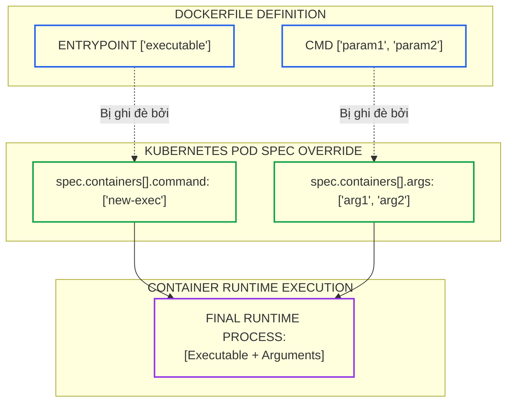
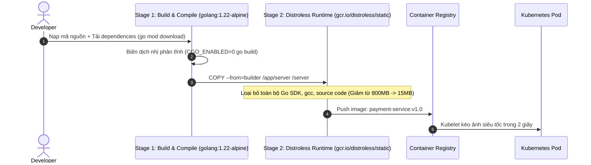
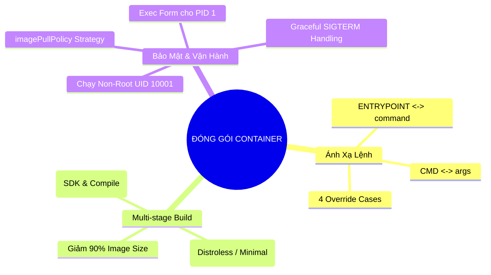


> [!IMPORTANT]
> **Mục tiêu kỹ thuật cốt lõi**: Làm chủ kỹ thuật định nghĩa và đóng gói container đạt chuẩn sản xuất thuộc miền **Application Design & Build (20%)** của kỳ thi CKAD. Nắm vững ma trận tương quan giữa chỉ thị **`ENTRYPOINT`/`CMD`** (Dockerfile) và **`command`/`args`** (Kubernetes Pod Spec), kỹ thuật **Multi-stage Build**, loại bỏ shell thừa với **Distroless Images**, và kiểm soát luồng xử lý tín hiệu **PID 1 Graceful Shutdown**.

---

## 1. Bản Chất Kiến Trúc & Tư Duy Cốt Lõi: Ma Trận Ghi Đè Lệnh (Dockerfile vs Kubernetes Pod Spec)

Khi triển khai ứng dụng lên Kubernetes, Container Runtime (Containerd / CRI-O) sẽ khởi chạy container dựa trên sự kết hợp giữa các chỉ thị định nghĩa sẵn trong **Dockerfile** và các trường cấu hình ghi đè trong **Pod Manifest**.

Sự ánh xạ giữa Dockerfile và Kubernetes được quy chuẩn như sau:
- **`ENTRYPOINT`** (Dockerfile) $\Longleftrightarrow$ **`command`** (Kubernetes YAML)
- **`CMD`** (Dockerfile) $\Longleftrightarrow$ **`args`** (Kubernetes YAML)



### 3 Trụ Cột Đóng Gói Container Chuẩn Cloud-Native

1. **Multi-Stage Build (Đóng gói đa tầng)**: Tách biệt hoàn toàn tầng Build (chứa Go SDK, Node.js npm, Maven, gcc) khỏi tầng Runtime (chỉ chứa binary thực thi và thư viện cần thiết).
2. **Distroless / Minimal Base Image**: Sử dụng ảnh không có OS package manager (`apt`, `apk`) và không có shell (`/bin/sh`, `/bin/bash`) như `gcr.io/distroless/static` để loại bỏ 99% lỗ hổng bảo mật CVE.
3. **Exec Form vs Shell Form & PID 1**: Luôn dùng cú pháp dạng mảng JSON `ENTRYPOINT ["./app"]` thay vì chuỗi `ENTRYPOINT ./app`. Dạng shell form sẽ chạy `/bin/sh -c` ở PID 1 và nuốt mất tín hiệu `SIGTERM`, khiến container bị Kubelet kill cưỡng chế sau 30 giây.

---

## 2. Bảng Ma Trận So Sánh Kỹ Thuật Toàn Diện (Engineering Matrix)

### Ma Trận 4 Trường Hợp Ghi Đè Lệnh Giữa Dockerfile và Kubernetes

| Trường Hợp | Dockerfile (ENTRYPOINT / CMD) | Kubernetes Spec (command / args) | Lệnh Thực Thi Cuối Cùng (Runtime Execution) | Ghi Chú Kỹ Thuật |
|---|---|---|---|---|
| **Case 1: Không ghi đè** | `ENTRYPOINT ["nginx"]`<br/>`CMD ["-g", "daemon off;"]` | Không khai báo `command`<br/>Không khai báo `args` | `nginx -g "daemon off;"` | Chạy nguyên bản theo cấu hình mặc định của Dockerfile |
| **Case 2: Chỉ ghi đè args** | `ENTRYPOINT ["nginx"]`<br/>`CMD ["-g", "daemon off;"]` | Không khai báo `command`<br/>`args: ["-h"]` | `nginx -h` | `args` ghi đè `CMD`, `ENTRYPOINT` được giữ nguyên |
| **Case 3: Chỉ ghi đè command** | `ENTRYPOINT ["nginx"]`<br/>`CMD ["-g", "daemon off;"]` | `command: ["echo"]`<br/>Không khai báo `args` | `echo` | `command` ghi đè `ENTRYPOINT`, đồng thời **xóa bỏ hoàn toàn** `CMD` cũ |
| **Case 4: Ghi đè cả hai** | `ENTRYPOINT ["nginx"]`<br/>`CMD ["-g", "daemon off;"]` | `command: ["sh", "-c"]`<br/>`args: ["echo Hello"]` | `sh -c "echo Hello"` | Ghi đè toàn bộ cả tiến trình lẫn đối số thực thi |

### Ma Trận So Sánh Các Dòng Base Image

| Tiêu Chí So Sánh | Full OS (Ubuntu / Debian) | Minimal OS (Alpine Linux) | Distroless (Google) | Scratch (Empty) |
|---|---|---|---|---|
| **Dung Lượng Ảnh** | 100MB – 800MB | 5MB – 15MB | 2MB – 20MB | 0MB (Chỉ có binary) |
| **Bao Gồm Package Manager** | Có (`apt`, `dpkg`) | Có (`apk`) | Không | Không |
| **Bao Gồm Shell (`/bin/sh`)** | Có đầy đủ | Có (`busybox ash`) | Không | Không |
| **Số Lượng CVEs Thường Gặp** | Cao (50–200 CVEs) | Thấp (1–5 CVEs) | Gần như 0 CVE | 0 CVE |
| **Mức Độ Phù Hợp** | Môi trường Dev/Test | Microservices thông dụng | Production Golang, Java, Node.js | Production Golang/Rust tĩnh |

---

## 3. Kiến Trúc Môi Trường & Luồng Thực Thi Mẫu

### Luồng Xây Dựng Đa Tầng (Multi-Stage Build Pipeline)



### Dockerfile Multi-Stage Mẫu Đạt Chuẩn Production

```dockerfile
# ==========================================
# STAGE 1: Môi Trường Biên Dịch (Builder)
# ==========================================
FROM golang:1.22-alpine AS builder

WORKDIR /build

# Tối ưu hóa cache layer: Tải dependencies trước
COPY go.mod go.sum ./
RUN go mod download

# Sao chép toàn bộ mã nguồn và biên dịch tĩnh
COPY . .
RUN CGO_ENABLED=0 GOOS=linux GOARCH=amd64 go build -ldflags="-w -s" -o /build/api-server .

# ==========================================
# STAGE 2: Môi Trường Thực Thi Siêu Nhẹ (Distroless)
# ==========================================
FROM gcr.io/distroless/static-debian12:nonroot

WORKDIR /app

# Sao chép duy nhất file binary từ builder stage
COPY --from=builder /build/api-server /app/api-server

# Khai báo cổng ứng dụng
EXPOSE 8080

# Chạy dưới quyền user non-root mặc định (UID 65532)
USER nonroot:nonroot

# Sử dụng Exec Form cho ENTRYPOINT
ENTRYPOINT ["/app/api-server"]
```

---

## 4. Phân Tích Cạm Bẫy Thực Chiến: Sử Dụng Shell Form Khiến Ứng Dụng Không Nhận Tín Hiệu SIGTERM

### Tình Huống Sự Cố: Ứng Dụng Mất 30 Giây Mới Tắt Khi Rollout (Graceful Shutdown Failure)

Một nhóm phát triển khai báo lệnh khởi động trong Dockerfile bằng Shell Form: `ENTRYPOINT node server.js`. Khi thực hiện RollingUpdate Deployment trên Kubernetes, mỗi Pod cũ mất đúng **30 giây** để chuyển từ trạng thái `Terminating` sang bị xóa. Trong suốt thời gian này, các kết nối mạng đang xử lý dở dang của khách hàng bị ngắt đột ngột.

### Hậu Quả & Log Lỗi Thực Tế:
```text
Events:
  Type     Reason     Age                From               Message
  ----     ------     ----               ----               -------
  Normal   Killing    30s                kubelet            Stopping container web-app
  Warning  FailedPreStop 30s             kubelet            PreStopHook failed
  Normal   Killing    0s (x1 over 30s)   kubelet            Container web-app exceeded its grace period of 30s, sending SIGKILL
```

### 5-Whys Root Cause Analysis:
1. **Tại sao Pod bị Kubelet gửi tín hiệu SIGKILL sau 30 giây?** Vì tiến trình bên trong container không chịu kết thúc sau khi nhận tín hiệu `SIGTERM`.
2. **Tại sao ứng dụng Node.js không kết thúc khi nhận SIGTERM?** Vì ứng dụng Node.js hoàn toàn **không nhận được tín hiệu SIGTERM**.
3. **Tại sao Node.js không nhận được tín hiệu?** Vì tiến trình chạy ở PID 1 bên trong container là `/bin/sh`, còn `node server.js` chỉ là tiến trình con (PID 2).
4. **Tại sao lại có `/bin/sh` chạy ở PID 1?** Vì Dockerfile sử dụng cú pháp **Shell Form** (`ENTRYPOINT node server.js`) khiến Linux tự động bọc lệnh trong `/bin/sh -c`. Shell chuẩn của Linux mặc định không chuyển tiếp (forward) tín hiệu hệ thống cho tiến trình con.
5. **Gốc rễ vấn đề (Root Cause):** Vi phạm nguyên tắc đóng gói container: Không sử dụng **Exec Form** (`ENTRYPOINT ["node", "server.js"]`) hoặc không dùng công cụ init process (như `tini` / `dumb-init`).

### Biện Pháp Khắc Phục Chuẩn:
```diff
--- a/Dockerfile
+++ b/Dockerfile
@@ -10,2 +10,2 @@
-# SAI: Shell form bọc trong /bin/sh (nuốt mất SIGTERM)
-ENTRYPOINT node server.js
+# ĐÚNG: Exec form dạng mảng JSON (node chạy trực tiếp ở PID 1)
+ENTRYPOINT ["node", "server.js"]
```

---

## 5. Hands-on Lab: Đóng Gói Ứng Dụng Tối Ưu & Khởi Chạy Trên Kubernetes (8 Bước)

| Bước | Mục Tiêu Kỹ Thuật | Lệnh / File Kiểm Tra Chính |
|---|---|---|
| **1** | Khởi tạo mã nguồn vi dịch vụ Go Web API | `main.go`, `go.mod` |
| **2** | Thiết lập tệp `.dockerignore` loại bỏ rác | `.dockerignore` |
| **3** | Viết Dockerfile Multi-stage build kết hợp Distroless | `Dockerfile` |
| **4** | Build và đo lường kích thước ảnh Image | `docker build`, `docker images` |
| **5** | Khởi chạy Pod với `command` và `args` ghi đè | `Pod` manifest YAML |
| **6** | Triển khai Pod chạy dưới Non-Root User an toàn | `securityContext.runAsUser: 10001` |
| **7** | Kiểm thử bắt tín hiệu `SIGTERM` tắt lịch sự | `kubectl delete pod` đo thời gian < 3s |
| **8** | Kiểm tra chính sách nạp ảnh `imagePullPolicy` | `imagePullPolicy: IfNotPresent` |

---

### Bước 1: Khởi Tạo Mã Nguồn Vi Dịch Vụ Go

```bash
mkdir -p /tmp/ckad-app && cd /tmp/ckad-app

cat << 'EOF' > main.go
package main

import (
	"fmt"
	"net/http"
	"os"
	"os/signal"
	"syscall"
	"time"
)

func main() {
	http.HandleFunc("/", func(w http.ResponseWriter, r *http.Request) {
		fmt.Fprintf(w, "Hello Cloud Native Developer! Time: %s\n", time.Now().Format(time.RFC3339))
	})

	server := &http.Server{Addr: ":8080"}

	// Bắt tín hiệu SIGTERM để tắt lịch sự (Graceful Shutdown)
	stop := make(chan os.Signal, 1)
	signal.Notify(stop, syscall.SIGTERM, syscall.SIGINT)

	go func() {
		fmt.Println("Server đang lắng nghe trên cổng 8080 (PID:", os.Getpid(), ")")
		if err := server.ListenAndServe(); err != nil && err != http.ErrServerClosed {
			fmt.Printf("Lỗi server: %s\n", err)
		}
	}()

	<-stop
	fmt.Println("Đã nhận tín hiệu SIGTERM! Đang giải phóng tài nguyên...")
	time.Sleep(1 * time.Second)
	fmt.Println("Tắt ứng dụng thành công!")
}
EOF

cat << 'EOF' > go.mod
module ckad-app

go 1.22
EOF
```

---

### Bước 2: Tạo Tệp `.dockerignore`

```bash
cat << 'EOF' > .dockerignore
.git
.gitignore
Dockerfile
README.md
*.tmp
EOF
```

---

### Bước 3: Soạn Thảo Dockerfile Multi-Stage Build

```dockerfile
cat << 'EOF' > Dockerfile
# Stage 1: Build
FROM golang:1.22-alpine AS builder
WORKDIR /src
COPY go.mod ./
COPY main.go ./
RUN CGO_ENABLED=0 GOOS=linux go build -ldflags="-s -w" -o /bin/app main.go

# Stage 2: Minimal Distroless Runtime
FROM gcr.io/distroless/static-debian12:nonroot
WORKDIR /
COPY --from=builder /bin/app /app
EXPOSE 8080
USER nonroot:nonroot
ENTRYPOINT ["/app"]
EOF
```

---

### Bước 4: Biên Dịch và Kiểm Tra Dung Lượng Ảnh

```bash
# Build image
docker build -t ckad-app:distroless .

# Kiểm tra dung lượng ảnh (chỉ khoảng ~15MB)
docker images ckad-app:distroless
```

---

### Bước 5: Triển Khai Pod Ghi Đè `command` và `args` Trên Kubernetes

```yaml
# pod-override.yaml
apiVersion: v1
kind: Pod
metadata:
  name: app-override-demo
  namespace: default
spec:
  containers:
  - name: web
    image: busybox:1.36
    # Ghi đè hoàn toàn ENTRYPOINT và CMD
    command: ["/bin/sh", "-c"]
    args:
    - "echo 'Tham so 1:' $VAR1 && echo 'Khoi dong thanh cong' && sleep 3600"
    env:
    - name: VAR1
      value: "Production-Cloud-Native"
```
```bash
kubectl apply -f pod-override.yaml
kubectl logs app-override-demo
```

---

### Bước 6: Cấu Hình Chạy Non-Root Với SecurityContext

```yaml
# pod-nonroot.yaml
apiVersion: v1
kind: Pod
metadata:
  name: app-nonroot
  namespace: default
spec:
  securityContext:
    runAsNonRoot: true
    runAsUser: 10001
  containers:
  - name: web
    image: busybox:1.36
    command: ["/bin/sh", "-c", "echo Current UID: $(id -u); sleep 3600"]
```
```bash
kubectl apply -f pod-nonroot.yaml
kubectl logs app-nonroot
```
> Log in ra: `Current UID: 10001` (khẳng định container không chạy quyền root).

---

### Bước 7: Kiểm Thử Ngắt Tín Hiệu SIGTERM Êm Ái

```bash
# Tạo Pod chạy ứng dụng Go bắt SIGTERM
kubectl run go-graceful --image=busybox:1.36 --command -- /bin/sh -c "trap 'echo Da nhan SIGTERM; exit 0' SIGTERM; while true; do sleep 1; done"

# Xóa Pod và quan sát thời gian phản hồi
time kubectl delete pod go-graceful
```
> Kết quả: Pod xóa ngay lập tức trong vòng 1-2 giây, không bị treo 30 giây.

---

### Bước 8: Kiểm Tra và Thiết Lập `imagePullPolicy`

```yaml
# pod-pullpolicy.yaml
apiVersion: v1
kind: Pod
metadata:
  name: app-pull-policy
spec:
  containers:
  - name: nginx
    image: nginx:1.25-alpine
    imagePullPolicy: IfNotPresent
```
```bash
kubectl apply -f pod-pullpolicy.yaml
kubectl get pod app-pull-policy
```

---

## 6. 10 Câu Hỏi Tự Kiểm Tra Chuyên Sâu (Self-Check Q&A Accordion)

<details class="qa-card">
<summary><b>1. Trong Dockerfile, sự khác nhau giữa `ENTRYPOINT` và `CMD` là gì?</b></summary>
<div class="qa-answer">
<p><b>ENTRYPOINT</b> định nghĩa tiến trình thực thi chính, cố định của container khi khởi động. <b>CMD</b> định nghĩa danh sách các đối số (arguments) mặc định truyền vào cho ENTRYPOINT. Người dùng khi chạy container có thể dễ dàng ghi đè CMD thông qua các đối số dòng lệnh mà không làm thay đổi tiến trình ENTRYPOINT.</p>
</div>
</details>

<details class="qa-card">
<summary><b>2. Khi ta khai báo `command: ["sleep"]` trong Pod manifest mà không khai báo `args`, điều gì sẽ xảy ra với `CMD` trong Dockerfile?</b></summary>
<div class="qa-answer">
<p>Khi trường <code>command</code> được khai báo trong Kubernetes Pod manifest, nó sẽ <b>ghi đè hoàn toàn ENTRYPOINT</b> và đồng thời <b>xóa bỏ (bỏ qua) toàn bộ chỉ thị CMD</b> đã định nghĩa trong Dockerfile.</p>
</div>
</details>

<details class="qa-card">
<summary><b>3. Tại sao trong môi trường Production ta nên ưu tiên dùng Exec Form `["executable", "param"]` thay vì Shell Form `executable param`?</b></summary>
<div class="qa-answer">
<p>Exec Form chạy trực tiếp file thực thi ở <b>PID 1</b> bên trong container. Shell Form sẽ bọc lệnh trong <code>/bin/sh -c</code> (PID 1 là shell, ứng dụng là PID 2). Shell mặc định không chuyển tiếp tín hiệu <code>SIGTERM</code> của Kubernetes tới tiến trình con, khiến ứng dụng không thể tắt lịch sự (Graceful Shutdown) và bị Kubelet tiêu diệt cưỡng chế bằng <code>SIGKILL</code> sau 30 giây.</p>
</div>
</details>

<details class="qa-card">
<summary><b>4. Lợi ích lớn nhất của kỹ thuật Multi-stage build trong Dockerfile là gì?</b></summary>
<div class="qa-answer">
<p>Multi-stage build cho phép <b>tách rời môi trường biên dịch (Builder)</b> khỏi <b>môi trường thực thi (Runtime)</b>. Toàn bộ mã nguồn, trình biên dịch (Go SDK, Node npm, Maven), tệp tạm và công cụ build được loại bỏ hoàn toàn khỏi ảnh cuối cùng. Nhờ đó, kích thước ảnh giảm từ vài trăm MB xuống chỉ còn vài MB, kéo ảnh siêu tốc và giảm thiểu diện tích bề mặt tấn công bảo mật (CVEs).</p>
</div>
</details>

<details class="qa-card">
<summary><b>5. Ảnh Distroless là gì và tại sao nó an toàn hơn ảnh Linux thông thường?</b></summary>
<div class="qa-answer">
<p><b>Distroless</b> là ảnh container siêu tối giản do Google duy trì, chỉ chứa ứng dụng của bạn và các thư viện runtime phụ thuộc trực tiếp. Nó <b>hoàn toàn không chứa</b> hệ thống quản lý gói (apt/apk), không chứa các tiện ích Linux (curl, wget, ls) và đặc biệt <b>không có shell (/bin/sh, /bin/bash)</b>. Kẻ tấn công nếu khai thác được lỗ hổng ứng dụng cũng không thể mở reverse shell hay tải mã độc về container.</p>
</div>
</details>

<details class="qa-card">
<summary><b>6. 3 giá trị hợp lệ của `imagePullPolicy` trong Kubernetes là gì và hành vi mặc định ra sao?</b></summary>
<div class="qa-answer">
<p>3 giá trị:</p>
<div>1. <b>Always:</b> Luôn kết nối Registry kéo ảnh mới về mỗi khi khởi động Pod (mặc định nếu image có tag <code>:latest</code> hoặc không ghi tag).</div>
<div>2. <b>IfNotPresent:</b> Chỉ kéo ảnh về nếu trên Node chưa có sẵn bản đệm cục bộ (mặc định cho các image có tag cụ thể như <code>:v1.0</code>).</div>
<div>3. <b>Never:</b> Tuyệt đối không kéo ảnh từ Registry, chỉ sử dụng ảnh đã có sẵn trên Node (thường dùng cho môi trường test nội bộ).</div>
</div>
</details>

<details class="qa-card">
<summary><b>7. Tệp `.dockerignore` đóng vai trò gì trong quá trình đóng gói ảnh container?</b></summary>
<div class="qa-answer">
<p>Tệp <code>.dockerignore</code> định nghĩa danh sách các tệp và thư mục (như <code>.git</code>, <code>node_modules</code>, <code>build artifacts</code>, <code>.env</code>) không được gửi vào Build Context của Docker daemon. Điều này giúp tăng tốc độ build đáng kể và ngăn ngừa rủi ro vô tình đóng gói thông tin bí mật hoặc file rác vào Image.</p>
</div>
</details>

<details class="qa-card">
<summary><b>8. Làm thế nào để truyền một câu lệnh shell phức tạp chứa biến môi trường vào Pod thông qua `command` và `args`?</b></summary>
<div class="qa-answer">
<p>Khai báo <code>command: ["/bin/sh", "-c"]</code> và truyền toàn bộ chuỗi lệnh vào phần tử đầu tiên của mảng <code>args</code>:</p>
<pre><code>command: ["/bin/sh", "-c"]
args: ["echo Host: $HOSTNAME && printenv"]</code></pre>
</div>
</details>

<details class="qa-card">
<summary><b>9. Tại sao ta nên tránh sử dụng tag `:latest` cho Image trong môi trường Production?</b></summary>
<div class="qa-answer">
<p>Tag <code>:latest</code> là một con trỏ động (mutable). Khi triển khai, ta không thể biết chính xác phiên bản mã nguồn nào đang chạy. Việc rollback sẽ gặp lỗi không xác định vì mọi bản rollout đều trỏ về <code>:latest</code>. Ngoài ra, chính sách kéo ảnh mặc định của <code>:latest</code> là <code>Always</code>, có thể gây quá tải băng thông mạng và khiến các Pods trong cùng Deployment chạy các phiên bản code khác nhau.</p>
</div>
</details>

<details class="qa-card">
<summary><b>10. Làm thế nào để debug một container chạy trên nền Distroless khi nó không có sẵn `/bin/sh`?</b></summary>
<div class="qa-answer">
<p>Sử dụng tính năng <b>Kubernetes Ephemeral Debug Containers</b> thông qua lệnh:</p>
<pre><code>kubectl debug -it &lt;pod-name&gt; --image=busybox:1.36 --target=&lt;container-name&gt;</code></pre>
<p>Lệnh này sẽ gắn một container debug tạm thời (có sẵn shell) chia sẻ chung Process Namespace (PID) với container Distroless mà không cần sửa đổi Pod manifest gốc.</p>
</div>
</details>

---

## 7. Tổng Kết & Lộ Trình Bài Học Tiếp Theo



Đóng gói container tối ưu là viên gạch đầu tiên quyết định tính ổn định, tốc độ triển khai và khả năng tự phục hồi của toàn bộ hệ thống microservices trên Kubernetes.

> [!TIP]
> **Bài học tiếp theo**: Khám phá các mẫu thiết kế nhiều container chạy song song trong cùng một Pod với **[Bài 03: Mô Hình Đa Container (Multi-Container Patterns): Sidecar, Adapter & Ambassador](ckad-03-03-multi-container-pattern.html)**.

