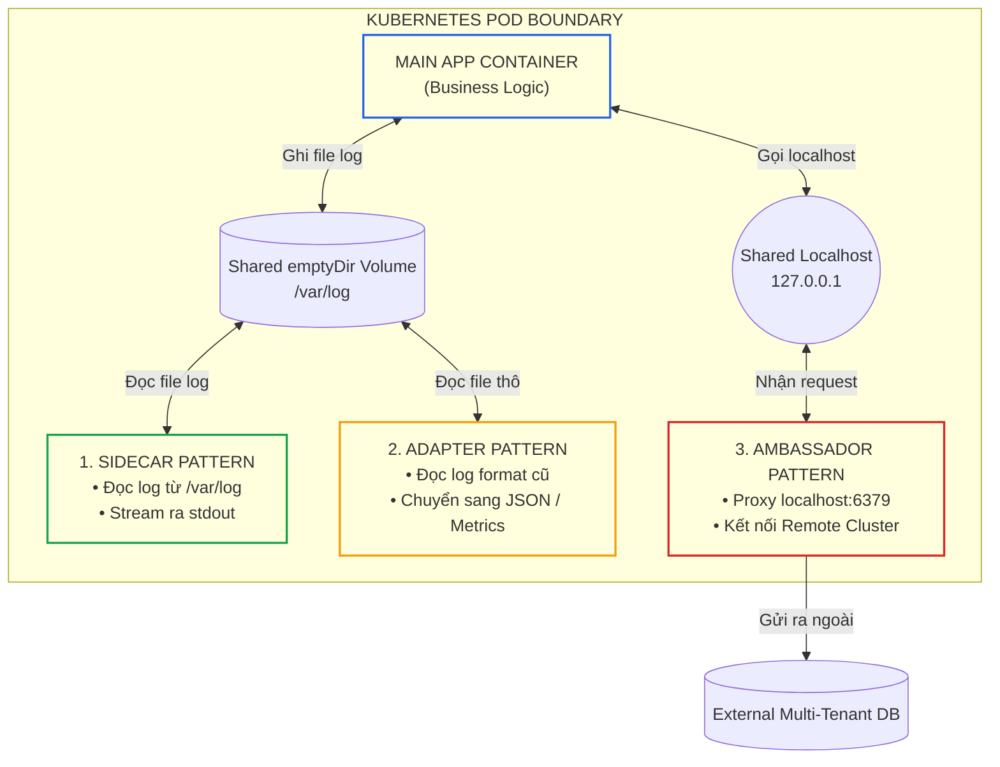
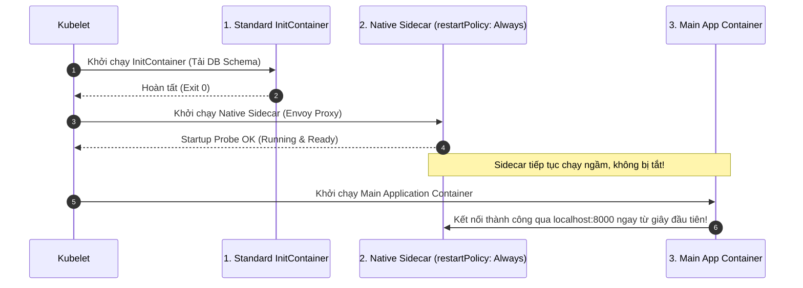
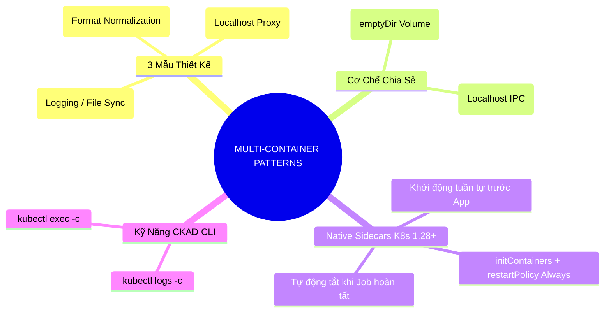


> [!IMPORTANT]
> **Mục tiêu kỹ thuật cốt lõi**: Nắm vững phương pháp thiết kế và triển khai mô hình **Pod Đa Container (Multi-Container Design Patterns)** thuộc miền **Application Design and Build (20%)** của kỳ thi CKAD. Triển khai chính xác 3 mẫu kiến trúc: **Sidecar (Thu thập log & Sync cấu hình)**, **Adapter (Chuẩn hóa Metrics/Log format)**, và **Ambassador (Proxy kết nối Database/External APIs)**; đồng thời làm chủ tính năng **Native Sidecar Containers** trong Kubernetes hiện đại.

---

## 1. Bản Chất Kiến Trúc & Tư Duy Cốt Lõi: 3 Mẫu Thiết Kế Đa Container & Native Sidecars

Trong kiến trúc Kubernetes, **Pod** là đơn vị triển khai nhỏ nhất. Một Pod có thể chứa một hoặc nhiều container cùng chia sẻ chung:
1. **Network Namespace**: Tất cả các container trong Pod dùng chung một địa chỉ IP, chung dải cổng (Ports) và có thể giao tiếp với nhau siêu tốc qua **`localhost`**.
2. **Storage Volumes**: Các container có thể cùng gắn kết (mount) vào một volume dùng chung (thường là **`emptyDir`**).
3. **IPC (Inter-Process Communication)**: Có thể cấu hình chia sẻ bộ nhớ chung (POSIX Shared Memory).



### So Sánh 3 Mẫu Thiết Kế Kinh Điển:

1. **Sidecar Pattern (Phụ trợ & Mở rộng)**:
   - *Mục đích:* Mở rộng và bổ trợ tính năng cho container chính mà **không cần sửa đổi mã nguồn** của ứng dụng (ví dụ: Log Shipper Fluentd, Git-sync tải mã HTML định kỳ).
   - *Giao tiếp:* Thường qua **Shared Volume (`emptyDir`)**.
2. **Adapter Pattern (Chuyển đổi & Chuẩn hóa)**:
   - *Mục đích:* Nhận dữ liệu đầu ra không chuẩn từ ứng dụng chính (ví dụ log text thô hoặc metrics tùy biến) và **chuẩn hóa lại** thành định dạng tiêu chuẩn của doanh nghiệp (ví dụ JSON hoặc Prometheus `/metrics`).
   - *Giao tiếp:* Qua **Shared Volume** hoặc gọi HTTP nội bộ qua **`localhost`**.
3. **Ambassador Pattern (Đại sứ & Ủy thác kết nối)**:
   - *Mục đích:* Đóng vai trò là một **Proxy thông minh** nằm cạnh ứng dụng chính. Ứng dụng chỉ cần gửi request tới `localhost:<port>`, container Ambassador sẽ đảm nhận việc định tuyến, mã hóa TLS, sharding hoặc chuyển tiếp tới cơ sở dữ liệu phân tán phức tạp bên ngoài.
   - *Giao tiếp:* Luôn luôn qua **`localhost` (Shared Network Namespace)**.

---

## 2. Bảng Ma Trận So Sánh Kỹ Thuật Toàn Diện (Engineering Matrix)

Bảng ma trận phân loại chi tiết các mẫu thiết kế đa container trong thực tế:

| Tiêu Chí Kỹ Thuật | Sidecar Pattern | Adapter Pattern | Ambassador Pattern | Native Sidecar (K8s 1.28+) |
|---|---|---|---|---|
| **Mục Đích Chính** | Thu thập log, đồng bộ file, cập nhật chứng chỉ TLS | Chuẩn hóa định dạng log, chuyển đổi Metrics sang Prometheus | Proxy kết nối, Traffic splitting, Service mesh proxy | Container phụ chạy suốt vòng đời nhưng khởi động trước |
| **Kênh Giao Tiếp Chính** | Shared `emptyDir` Volume | Shared Volume hoặc `localhost` HTTP | `localhost` TCP Socket | Shared Volume & `localhost` |
| **Sửa Mã Nguồn App?** | Không (Zero code change) | Không | Không (App chỉ trỏ về localhost) | Không |
| **Vấn Đề Thường Gặp** | Dung lượng đĩa đầy nếu log không được xoay vòng | Adapter xử lý chậm gây nghẽn CPU | Ambassador crash khiến App mất kết nối hoàn toàn | Sai cú pháp `restartPolicy: Always` trong `initContainers` |
| **Giải Pháp Native** | Khai báo trong `spec.containers` | Khai báo trong `spec.containers` | Khai báo trong `spec.containers` | Khai báo trong `spec.initContainers` có `restartPolicy: Always` |

---

## 3. Kiến Trúc Môi Trường & Luồng Thực Thi Mẫu

### Luồng Vận Hành Của Native Sidecar Containers (Kubernetes 1.28+)

Trước bản 1.28, các container trong Pod khởi động song song không xác định thứ tự. Nếu ứng dụng chính cần gọi một proxy Sidecar (ví dụ Envoy/Vault proxy) để lấy cấu hình khi boot, ứng dụng sẽ bị crash do Sidecar chưa kịp sẵn sàng. **Native Sidecar** giải quyết triệt để vấn đề này bằng cách đưa Sidecar vào `initContainers` kèm cờ `restartPolicy: Always`:



---

## 4. Phân Tích Cạm Bẫy Thực Chiến: Thứ Tự Khởi Động Khiến Container Chính Sập Khi Sidecar Chưa Sẵn Sàng

### Tình Huống Sự Cố: Ứng Dụng Chính CrashLoopBackOff Do Ambassador Proxy Khởi Động Chậm Hơn

Một ứng dụng thanh toán được cấu hình kết nối tới cơ sở dữ liệu thông qua container phụ Ambassador proxy lắng nghe tại `localhost:5432`. Khi Pod khởi động trên Worker Node, container chính boot trong 1 giây và cố gắng mở kết nối TCP tới `localhost:5432`. Do Ambassador proxy cần 5 giây để nạp TLS context, ứng dụng chính nhận lỗi `Connection Refused` và lập tức crash, rơi vào vòng lặp `CrashLoopBackOff`.

### Hậu Quả & Log Lỗi Thực Tế:
```text
Events:
  Type     Reason     Age                From               Message
  ----     ------     ----               ----               -------
  Normal   Scheduled  20s                default-scheduler  Successfully assigned default/payment-pod to worker-01
  Normal   Started    18s                kubelet            Started container app
  Normal   Started    18s                kubelet            Started container db-ambassador
  Warning  BackOff    10s (x3 over 17s)  kubelet            Back-off restarting failed container app
Logs (app):
  [FATAL] dial tcp 127.0.0.1:5432: connect: connection refused
  [ERROR] Database unavailable during application boot, exiting with code 1
```

### 5-Whys Root Cause Analysis:
1. **Tại sao Container ứng dụng chính bị CrashLoopBackOff?** Vì tiến trình nhận lỗi `Connection Refused` khi cố gắng kết nối tới `127.0.0.1:5432` lúc khởi động.
2. **Tại sao cổng 5432 bị từ chối kết nối?** Vì container `db-ambassador` chưa kịp khởi động xong và chưa lắng nghe trên cổng 5432.
3. **Tại sao Kubernetes không đợi Ambassador sẵn sàng rồi mới bật container chính?** Vì theo mô hình multi-container truyền thống, tất cả các container trong mảng `spec.containers` được Kubelet kích hoạt **đồng thời (in parallel)**.
4. **Tại sao ứng dụng không tự retry kết nối?** Vì mã nguồn ứng dụng thiết kế cơ chế fail-fast, không có vòng lặp retry chờ database.
5. **Gốc rễ vấn đề (Root Cause):** Không sử dụng tính năng **Native Sidecar Container** (`initContainers` có `restartPolicy: Always` kèm `startupProbe`) để đảm bảo thứ tự khởi động tuần tự.

### Biện Pháp Khắc Phục Chuẩn (Native Sidecar):
```diff
--- a/pod.yaml
+++ b/pod.yaml
@@ -7,4 +7,14 @@
 spec:
+  # Khai báo Sidecar trong initContainers để ép buộc khởi động trước
+  initContainers:
+  - name: db-ambassador
+    image: ambassador-proxy:v1
+    restartPolicy: Always
+    startupProbe:
+      tcpSocket:
+        port: 5432
+      periodSeconds: 1
+      failureThreshold: 30
   containers:
   - name: app
     image: payment-app:v1
-  - name: db-ambassador
-    image: ambassador-proxy:v1
```

---

## 5. Hands-on Lab: Triển Khai Trọn Vẹn 3 Mẫu Multi-Container & Native Sidecar (8 Bước)

| Bước | Kịch Bản Thiết Kế | Mục Tiêu Kỹ Thuật | Lệnh / File Kiểm Tra Chính |
|---|---|---|---|
| **1** | Mẫu 1: Sidecar Pattern | Ghi log vào file và dùng Sidecar stream stdout | `emptyDir` volume, `tail -f` container |
| **2** | Quản trị log đa container | Đọc log độc lập từng container qua CLI | `kubectl logs <pod> -c <container>` |
| **3** | Mẫu 2: Adapter Pattern | Chuyển đổi định dạng log thô sang JSON | Script adapter regex & transform |
| **4** | Kiểm tra đầu ra Adapter | Xác minh log JSON chuẩn hóa tại container phụ | `kubectl logs adapter-pod -c adapter` |
| **5** | Mẫu 3: Ambassador Pattern | Tạo reverse proxy chuyển tiếp traffic tới dịch vụ ngoài | Nginx proxy `localhost:80` $\rightarrow$ Target URL |
| **6** | Kiểm thử kết nối Ambassador | Gửi HTTP request tới `localhost` từ container chính | `curl localhost:80` từ bên trong App |
| **7** | Kỹ thuật Native Sidecar | Khởi chạy container phụ trong `initContainers` | `restartPolicy: Always` + `startupProbe` |
| **8** | Xác minh vòng đời Pod | Đảm bảo Sidecar sống liên tục và tắt sau cùng | `kubectl describe pod` kiểm tra Init phase |

---

### Bước 1: Triển Khai Sidecar Pattern (Log Shipper)

```yaml
# 1-sidecar-pod.yaml
apiVersion: v1
kind: Pod
metadata:
  name: sidecar-demo
  namespace: default
spec:
  volumes:
  - name: shared-logs
    emptyDir: {}
  containers:
  # Container chính: Ghi log giao dịch vào file
  - name: app
    image: busybox:1.36
    command: ["/bin/sh", "-c"]
    args:
    - "while true; do echo \"[$(date)] TRANSACTION SUCCESSFUL - ID=$RANDOM\" >> /var/log/app.log; sleep 2; done"
    volumeMounts:
    - name: shared-logs
      mountPath: /var/log
  # Container Sidecar: Đọc và xuất ra stdout
  - name: log-shipper
    image: busybox:1.36
    command: ["/bin/sh", "-c"]
    args:
    - "tail -n+1 -f /var/log/app.log"
    volumeMounts:
    - name: shared-logs
      mountPath: /var/log
```
```bash
kubectl apply -f 1-sidecar-pod.yaml
```

---

### Bước 2: Kiểm Tra Log Độc Lập Bằng Lệnh Kubectl CLI

```bash
# Kiểm tra log từ container chính (rỗng vì app ghi ra file)
kubectl logs sidecar-demo -c app

# Kiểm tra log từ container sidecar (in ra toàn bộ log giao dịch)
kubectl logs sidecar-demo -c log-shipper --tail=5
```

---

### Bước 3: Triển Khai Adapter Pattern (Metrics / Log Formatter)

```yaml
# 2-adapter-pod.yaml
apiVersion: v1
kind: Pod
metadata:
  name: adapter-demo
  namespace: default
spec:
  volumes:
  - name: raw-data
    emptyDir: {}
  containers:
  # Container chính: Xuất dữ liệu định dạng thô dạng Text
  - name: legacy-app
    image: busybox:1.36
    command: ["/bin/sh", "-c"]
    args:
    - "while true; do echo \"CPU=45 MEM=512 DISK=80\" > /data/status.txt; sleep 3; done"
    volumeMounts:
    - name: raw-data
      mountPath: /data
  # Container Adapter: Đọc file thô và chuyển thành định dạng JSON chuẩn
  - name: json-adapter
    image: busybox:1.36
    command: ["/bin/sh", "-c"]
    args:
    - |
      while true; do
        if [ -f /data/status.txt ]; then
          CPU=$(cat /data/status.txt | cut -d' ' -f1 | cut -d= -f2)
          MEM=$(cat /data/status.txt | cut -d' ' -f2 | cut -d= -f2)
          DISK=$(cat /data/status.txt | cut -d' ' -f3 | cut -d= -f2)
          echo "{\"metric\": \"system_health\", \"cpu\": $CPU, \"memory\": $MEM, \"disk\": $DISK}"
        fi
        sleep 3
      done
    volumeMounts:
    - name: raw-data
      mountPath: /data
```
```bash
kubectl apply -f 2-adapter-pod.yaml
```

---

### Bước 4: Xác Minh Kết Quả Adapter

```bash
# Xem log JSON chuẩn hóa được xuất ra bởi adapter container
kubectl logs adapter-demo -c json-adapter --tail=5
```

---

### Bước 5: Triển Khai Ambassador Pattern (Local Reverse Proxy)

```yaml
# 3-ambassador-pod.yaml
apiVersion: v1
kind: Pod
metadata:
  name: ambassador-demo
  namespace: default
spec:
  containers:
  # Container chính: Chỉ cần gọi localhost:8080 để lấy dữ liệu ngoài
  - name: client-app
    image: curlimages/curl:8.7.1
    command: ["/bin/sh", "-c"]
    args:
    - "while true; do echo '--- Calling Local Ambassador Proxy ---'; curl -s http://localhost:8080 | head -n 3; sleep 5; done"
  # Container Ambassador: Chuyển tiếp cổng 8080 ra trang web bên ngoài
  - name: proxy-ambassador
    image: nginx:alpine
    command: ["/bin/sh", "-c"]
    args:
    - |
      cat << 'EOF' > /etc/nginx/conf.d/default.conf
      server {
        listen 8080;
        location / {
          proxy_pass https://raw.githubusercontent.com/;
          proxy_set_header Host raw.githubusercontent.com;
        }
      }
      EOF
      nginx -g 'daemon off;'
```
```bash
kubectl apply -f 3-ambassador-pod.yaml
```

---

### Bước 6: Kiểm Tra Kết Quả Ambassador Proxy

```bash
# Kiểm tra log container client gọi thông suốt qua localhost:8080
kubectl logs ambassador-demo -c client-app --tail=10
```

---

### Bước 7: Triển Khai Native Sidecar Container (K8s v1.28+)

```yaml
# 4-native-sidecar.yaml
apiVersion: v1
kind: Pod
metadata:
  name: native-sidecar-demo
  namespace: default
spec:
  initContainers:
  # Native Sidecar: Khởi động trước, duy trì sống suốt vòng đời Pod
  - name: vault-sidecar-proxy
    image: busybox:1.36
    restartPolicy: Always
    command: ["/bin/sh", "-c"]
    args:
    - "echo 'Vault Sidecar Proxy Started' && while true; do sleep 3600; done"
    startupProbe:
      exec:
        command: ["echo", "ready"]
      periodSeconds: 1
      failureThreshold: 5
  containers:
  # Container chính: Chỉ khởi động khi vault-sidecar-proxy đã Ready
  - name: main-app
    image: busybox:1.36
    command: ["/bin/sh", "-c"]
    args:
    - "echo 'Main App Started Successfully after Sidecar Ready' && sleep 3600"
```
```bash
kubectl apply -f 4-native-sidecar.yaml
```

---

### Bước 8: Xác Minh Trạng Thái Native Sidecar

```bash
# Kiểm tra mô tả Pod: Init Container có trạng thái Running song song
kubectl get pod native-sidecar-demo
kubectl logs native-sidecar-demo -c vault-sidecar-proxy
kubectl logs native-sidecar-demo -c main-app
```

---

## 6. 10 Câu Hỏi Tự Kiểm Tra Chuyên Sâu (Self-Check Q&A Accordion)

<details class="qa-card">
<summary><b>1. Hai container trong cùng một Pod có thể lắng nghe trên cùng một cổng TCP (ví dụ cả hai cùng bind port 8080) được không?</b></summary>
<div class="qa-answer">
<p><b>Không thể.</b> Vì tất cả các container trong cùng một Pod chia sẻ chung <b>Network Namespace</b> (chung địa chỉ IP). Nếu cả hai container cùng cố gắng bind vào cổng 8080, container khởi động sau sẽ bị lỗi <i>Address already in use</i> (Port Conflict) và bị sập.</p>
</div>
</details>

<details class="qa-card">
<summary><b>2. Sự khác biệt căn bản giữa Sidecar Pattern và Adapter Pattern là gì?</b></summary>
<div class="qa-answer">
<p><b>Sidecar Pattern</b> tập trung vào việc <b>bổ trợ hoặc mở rộng chức năng</b> cho ứng dụng chính (ví dụ stream log ra stdout, đồng bộ dữ liệu tĩnh). Trong khi đó, <b>Adapter Pattern</b> tập trung vào việc <b>chuẩn hóa và chuyển đổi định dạng dữ liệu</b> (ví dụ chuyển đổi log định dạng tùy biến sang chuẩn JSON hoặc xuất metrics sang chuẩn Prometheus) để tương thích với hệ sinh thái giám sát của doanh nghiệp.</p>
</div>
</details>

<details class="qa-card">
<summary><b>3. Làm thế nào để xem log của một container cụ thể trong Pod chứa nhiều container bằng kubectl?</b></summary>
<div class="qa-answer">
<p>Sử dụng cờ <code>-c</code> (hoặc <code>--container</code>):</p>
<pre><code>kubectl logs &lt;pod-name&gt; -c &lt;container-name&gt;</code></pre>
</div>
</details>

<details class="qa-card">
<summary><b>4. Khi nào ta nên áp dụng Ambassador Pattern?</b></summary>
<div class="qa-answer">
<p>Nên dùng <b>Ambassador Pattern</b> khi ứng dụng chính cần kết nối tới một dịch vụ bên ngoài phức tạp (ví dụ cụm Redis Cluster phân mảnh, hệ thống Database có mã hóa mTLS phức tạp, hoặc dịch vụ thay đổi endpoint liên tục). Ứng dụng chính chỉ cần kết nối tới <code>localhost</code>, toàn bộ logic proxy, định tuyến và xác thực sẽ do container Ambassador đảm nhận.</p>
</div>
</details>

<details class="qa-card">
<summary><b>5. Trước Kubernetes 1.28, vấn đề lớn nhất của việc dùng Sidecar truyền thống trong Kubernetes Job là gì?</b></summary>
<div class="qa-answer">
<p>Khi ứng dụng chính trong Job hoàn thành công việc và kết thúc (Exit 0), container Sidecar (ví dụ log shipper) vẫn tiếp tục chạy ngầm vô tận. Do đó, <b>Job không bao giờ chuyển sang trạng thái Completed</b> và tiếp tục tiêu tốn tài nguyên cụm. Tính năng Native Sidecar Container từ bản 1.28+ tự động gửi tín hiệu tắt Sidecar khi tất cả container chính đã kết thúc.</p>
</div>
</details>

<details class="qa-card">
<summary><b>6. Làm thế nào để định nghĩa một Native Sidecar Container trong Pod spec?</b></summary>
<div class="qa-answer">
<p>Khai báo container bên trong khối <code>initContainers</code> và thiết lập trường <code>restartPolicy: Always</code>:</p>
<pre><code>initContainers:
  name: my-sidecar
  image: my-image:v1
  restartPolicy: Always</code></pre>
</div>
</details>

<details class="qa-card">
<summary><b>7. Dung lượng của Volume loại `emptyDir` được lưu trữ ở đâu trên Worker Node?</b></summary>
<div class="qa-answer">
<p>Mặc định, <code>emptyDir</code> được lưu trữ trên <b>ổ đĩa cục bộ (Disk Storage)</b> của Worker Node tại thư mục <code>/var/lib/kubelet/pods/&lt;pod-uid&gt;/volumes/kubernetes.io~empty-dir/</code>. Nếu cấu hình <code>medium: Memory</code>, volume sẽ được tạo trên <b>RAM (tmpfs)</b> của Node giúp đọc ghi siêu tốc nhưng tiêu tốn bộ nhớ RAM của Pod.</p>
</div>
</details>

<details class="qa-card">
<summary><b>8. Điều gì xảy ra với dữ liệu trong `emptyDir` volume khi một container trong Pod bị restart?</b></summary>
<div class="qa-answer">
<p>Dữ liệu trong <code>emptyDir</code> <b>vẫn được bảo toàn nguyên vẹn</b> khi container bị crash hoặc restart. Dữ liệu chỉ bị xóa vĩnh viễn khi toàn bộ <b>Pod bị xóa hoàn toàn</b> khỏi Worker Node.</p>
</div>
</details>

<details class="qa-card">
<summary><b>9. Lệnh nào giúp mở phiên làm việc tương tác (interactive shell) vào container thứ hai của một Pod?</b></summary>
<div class="qa-answer">
<pre><code>kubectl exec -it &lt;pod-name&gt; -c &lt;container-name&gt; -- /bin/sh</code></pre>
</div>
</details>

<details class="qa-card">
<summary><b>10. Có thể gắn giới hạn tài nguyên (Resources Requests & Limits) riêng biệt cho từng container trong Pod không?</b></summary>
<div class="qa-answer">
<p><b>Hoàn toàn được.</b> Mỗi container trong Pod (cả container chính, init container và sidecar) đều có khối <code>resources.requests</code> và <code>resources.limits</code> độc lập. Tổng tài nguyên yêu cầu của toàn bộ Pod sẽ bằng tổng các requests của các container bên trong cộng lại.</p>
</div>
</details>

---

## 7. Tổng Kết & Lộ Trình Bài Học Tiếp Theo



Làm chủ các mẫu thiết kế đa container giúp bạn xây dựng các vi dịch vụ dạng module hóa cao, tách biệt rạch ròi trách nhiệm (Separation of Concerns) và nâng tầm kiến trúc ứng dụng Cloud-Native.

> [!TIP]
> **Bài học tiếp theo**: Chuyển sang quản lý các tác vụ xử lý hàng loạt và định kỳ với **[Bài 04: Xử Lý Tác Vụ Hàng Loạt: Kubernetes Job, CronJob & Batch Processing](ckad-04-04-job-cronjob-va-batch.html)**.

