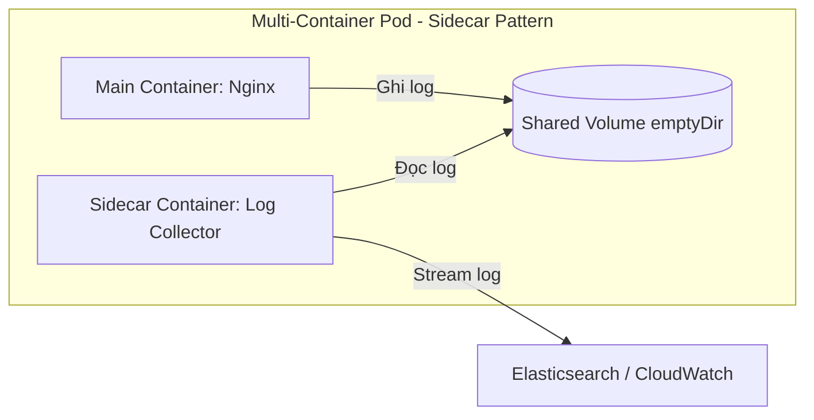
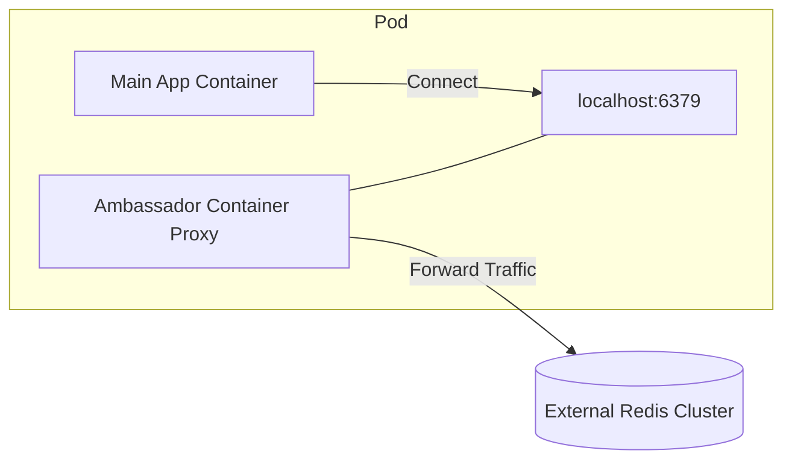
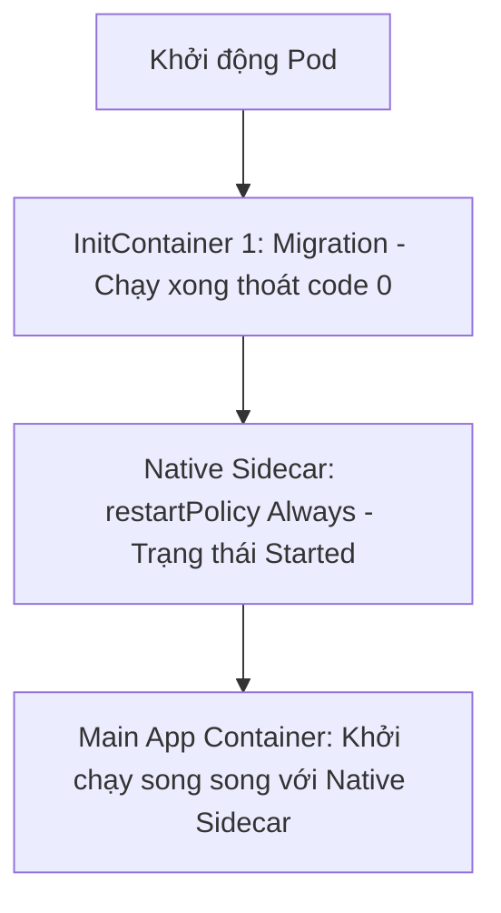
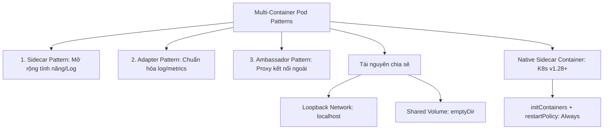
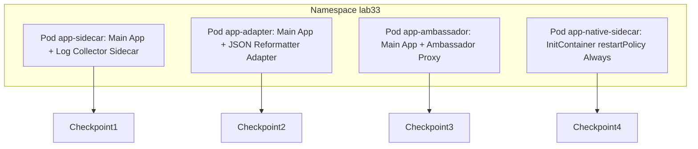


# [BÀI 03] MULTI-CONTAINER DESIGN PATTERNS: LÀM CHỦ SIDECAR, ADAPTER, AMBASSADOR & RESTARTABLE INITCONTAINERS

Trong kỷ nguyên điện toán đám mây và kiến trúc microservices phân tán quy mô lớn, **Kubernetes (CKAD)** đóng vai trò là nền tảng điều phối container (Container Orchestration) tiêu chuẩn công nghiệp. Để làm chủ hệ thống trong môi trường sản xuất (Production) cũng như chinh phục kỳ thi chứng chỉ quốc tế của Linux Foundation / CNCF, kỹ sư không chỉ nắm vững các câu lệnh thao tác cơ bản mà phải thấu hiểu sâu sắc bản chất cơ chế tầng thấp: từ chu trình điều hòa (Reconciliation Loop), cấu trúc điều phối tài nguyên, kiến trúc mạng CNI, lưu trữ CSI cho đến các chuẩn mực an ninh phòng thủ chiều sâu.

Bài viết chuyên sâu này sẽ đồng hành cùng bạn giải mã toàn diện bức tranh kiến trúc, phân tích các đánh đổi kỹ thuật thực chiến (Engineering Trade-offs), cung cấp bài thực hành Lab từng bước và bộ câu hỏi phỏng vấn chuẩn Architect / Lead Engineer.

---

## 1. Bản Chất Kiến Trúc & Cơ Chế Vận Hành Tầng Thấp

| # | Câu hỏi ôn tập | Đáp án chuẩn ngắn gọn |
|---|---|---|
| 1 | Trường `command` và `args` trong K8s YAML tương ứng ghi đè những chỉ thị nào trong Dockerfile? | `command` ghi đè **`ENTRYPOINT`**, `args` ghi đè **`CMD`** |
| 2 | Kỹ thuật chia nhiều giai đoạn build trong 1 Dockerfile giúp giảm dung lượng ảnh là gì? | **Multi-stage build** |
| 3 | Tên hai ảnh cơ sở siêu mỏng giúp giảm 95% dung lượng ảnh và triệt tiêu lỗ hổng CVE? | Ảnh **`alpine`** (~5MB) và ảnh **`distroless`** |
| 4 | Cú pháp chỉ thị Dockerfile nào giữ đúng tiến trình chính chạy ở vị trí PID 1? | Cú pháp **Exec Form** `CMD ["node", "app.js"]` |
| 5 | Tệp nào giúp loại bỏ các thư mục rác khi gửi bối cảnh cho Docker daemon đóng gói ảnh? | Tệp **`.dockerignore`** |


> **"Thiết kế Pod đa container (Multi-Container Pod Patterns) là mẫu kiến thức chiếm trọng số cao trong miền Application Design của CKAD, yêu cầu lập trình viên phân biệt rõ 3 mẫu thiết kế kinh điển (Sidecar thu thập log, Adapter chuẩn hóa định dạng dữ liệu, Ambassador đại diện kết nối dịch vụ ngoài); đồng thời việc ứng dụng tính năng Native Sidecar Container (`restartPolicy: Always` trong InitContainers từ Kubernetes v1.28+) giúp khởi chạy container phụ trước container chính mà không bị chấm dứt tiến trình, khắc phục triệt để các vấn đề phụ thuộc khởi động của ứng dụng Cloud Native."**

**Kết quả từ các buổi trước được sử dụng lại:**

| Kết quả / Công cụ | Buổi + số hiệu `QT` | Dùng ở đâu trong buổi này |
|---|---|---|
| Vòng đời Pod và InitContainer | Buổi 14 `QT 4.1` | Phát triển lên thành Native Sidecar Container |
| Khái niệm volume `emptyDir` chia sẻ dữ liệu | Buổi 26 `QT 4.1` | Mount chung volume giữa container chính và sidecar/adapter |
| Tư duy thiết kế ứng dụng Stateless CKAD | Buổi 31 `QT 6.1` | Thiết kế các container phụ hoạt động độc lập và không lưu trạng thái |

---


| # | Kỹ năng thực hiện được | Hiện vật chứng minh |
|---|---|---|
| 1 | Phân biệt chính xác bản chất và trường hợp sử dụng của Sidecar, Adapter và Ambassador | Bảng so sánh mục đích và sơ đồ luồng dữ liệu của 3 pattern |
| 2 | Biên soạn bản kê khai Pod đa container chia sẻ Volume `emptyDir` | Tệp YAML Pod chứa container chính và container Sidecar thu thập log |
| 3 | Cấu hình container Ambassador làm proxy kết nối dịch vụ ngoài qua `localhost` | Nhật ký container chính gọi thành công DB ngoài qua port local |
| 4 | Áp dụng tính năng Native Sidecar Container từ Kubernetes v1.28+ | Tệp YAML Pod chứa `initContainers` có cờ `restartPolicy: Always` |
| 5 | Kiểm tra log độc lập từng container trong Pod đa container qua CLI | Nhật ký lệnh `kubectl logs <pod> -c <container>` |

---


| Kiến thức tiên quyết | Nguồn tự học nếu thiếu |
|---|---|
| Cấu hình Volume `emptyDir` trong Pod manifest | Buổi 26 (`QT 4.1`) |
| Định nghĩa container spec và cờ command/args | Buổi 32 (`QT 4.1`) |
| Kỹ thuật tạo khung YAML bằng cờ dry-run | Buổi 04 (`QT 4.1`) |

---


### 3.1. Thuật ngữ Việt–Anh

| # | Thuật ngữ tiếng Việt | Tiếng Anh tương đương | Ghi chú chuẩn hoá trong thân bài |
|---|---|---|---|
| 1 | Mẫu container phụ trợ | Sidecar Pattern | Container phụ chạy song song mở rộng tính năng |
| 2 | Mẫu container chuyển đổi | Adapter Pattern | Container phụ chuẩn hóa định dạng log/metrics |
| 3 | Mẫu container đại diện | Ambassador Pattern | Container đại sứ làm proxy kết nối dịch vụ ngoài |
| 4 | Container khởi tạo native | Native Sidecar Container | InitContainer có cờ `restartPolicy: Always` |
| 5 | Bộ lưu trữ dùng chung | Shared Volume (`emptyDir`) | Volume mount chung vào nhiều container trong 1 Pod |
| 6 | Mạng chia sẻ localhost | Shared Network Namespace | Các container trong Pod gọi nhau qua `localhost` |
| 7 | Thứ tự khởi động container | Container Startup Order | Thứ tự InitContainer -> Native Sidecar -> Main |
| 8 | Thu thập nhật ký | Log Aggregation | Thu thập log ứng dụng ghi ra file hoặc stdout |
| 9 | Chuẩn hóa chỉ số | Metrics Standardization | Chuyển đổi định dạng metrics sang định dạng Prometheus |
| 10 | Ủy quyền kết nối | Connection Proxying | Đảo ngược proxy kết nối tới cơ sở dữ liệu bên ngoài |
| 11 | Vòng đời chung Pod | Shared Pod Lifecycle | Các container trong 1 Pod bị ngắt cùng lúc |
| 12 | Tiến trình chạy ngầm | Background Daemon Process | Tiến trình sidecar duy trì kết nối liên tục |
| 13 | Khôi phục container phụ | Sidecar Restart Policy | Cờ `restartPolicy: Always` cho InitContainer |
| 14 | Ủy thác giao thức | Protocol Translation | Chuyển đổi giao thức kết nối qua container ambassador |


Mô hình Ban Nhạc Rock 3 Người: Container chính là Ca sĩ hát chính; Sidecar container là Tay trống (chạy cùng lúc hỗ trợ nhịp điệu log); Adapter container là Kỹ sư âm thanh (chỉnh sửa giọng ca theo chuẩn phát thanh); Ambassador container là Trưởng đoàn (đại diện liên hệ với ban tổ chức bên ngoài qua `localhost`).

---

### 1.1. Ba mẫu thiết kế Pod đa container kinh điển: Sidecar, Adapter, Ambassador (12 phút)

**Nguyên lý cốt lõi:** Sử dụng Sidecar Pattern khi muốn mở rộng khả năng của container chính (như thu thập log, reload config) mà không cần sửa đổi mã nguồn ứng dụng gốc.

**Giải thích cơ chế ngầm:** Trong thực tế, container chính là ứng dụng nghiệp vụ (ví dụ Nginx web server ghi log vào tệp `/var/log/nginx/access.log`). Thay vì sửa code ứng dụng để gửi log sang Logstash, ta gắn thêm 1 container Sidecar (Fluentd/Vector) đọc trực tiếp file log đó từ Volume dùng chung và stream ra stdout hoặc gửi về Elasticsearch.

> [!WARNING]
> **CẠM BẪY THỰC CHIẾN:**
> Cố gắng sửa mã nguồn của container ứng dụng cũ để thêm tính năng đọc log, làm vi phạm nguyên tắc tách biệt trách nhiệm (Single Responsibility Principle).

**Minh hoạ.**



**Nguyên lý cốt lõi:** Sử dụng Adapter Pattern khi muốn chuẩn hóa định dạng dữ liệu đầu ra (như biến đổi file log dị biệt thành chuẩn JSON hoặc chuyển đổi metrics thành chuẩn Prometheus) trước khi xuất ra ngoài.

**Giải thích cơ chế ngầm:** Các ứng dụng cũ (Legacy) xuất ra định dạng log hoặc metrics khác nhau (như XML, plain text, custom binary). Container Adapter đóng vai trò bộ chuyển đổi (Adapter), đọc dữ liệu gốc và định dạng lại thành chuẩn chung mà hệ thống Monitoring toàn công ty (Prometheus/Grafana) có thể hiểu được.

> [!WARNING]
> **CẠM BẪY THỰC CHIẾN:**
> Bỏ mặc ứng dụng xuất ra log định dạng dị biệt khiến hệ thống giám sát tập trung không thể phân tích cú pháp (parse log).

**Minh hoạ.**

```yaml
# Ví dụ Adapter Container đọc metrics định dạng text và chuyển đổi thành Prometheus format
spec:
  volumes:
    - name: metrics-vol
      emptyDir: {}
  containers:
    - name: main-app
      image: legacy-app:v1
      volumeMounts:
        - name: metrics-vol
          mountPath: /var/metrics
    - name: adapter-prom
      image: prometheus-adapter-sidecar:v1
      command: ["sh", "-c", "adapt-metrics --input=/var/metrics/raw.txt --output=/dev/stdout"]
      volumeMounts:
        - name: metrics-vol
          mountPath: /var/metrics
```

**Nguyên lý cốt lõi:** Sử dụng Ambassador Pattern khi muốn giấu kín địa chỉ dịch vụ bên ngoài; container chính chỉ cần kết nối tới `localhost:<port>` của container ambassador proxy.

**Giải thích cơ chế ngầm:** Ứng dụng chính không cần quan tâm cơ sở dữ liệu thật nằm ở IP nào trên Cloud hay cấu hình Cluster Sharding phức tạp ra sao. Container Ambassador (ví dụ HAProxy hoặc Twemproxy) đóng vai trò đại sứ, lắng nghe trên `localhost` của Pod và âm thầm điều hướng traffic tới đúng cụm database bên ngoài.

> [!WARNING]
> **CẠM BẪY THỰC CHIẾN:**
> Hardcode địa chỉ IP cơ sở dữ liệu thật bên ngoài vào trực tiếp mã nguồn của container ứng dụng chính.

**Minh hoạ.**



---

### 1.2. Cơ chế chia sẻ tài nguyên Network và Volume trong cùng một Pod (12 phút)

**Nguyên lý cốt lõi:** Tất cả các container nằm trong cùng một Pod chia sẻ 1 IP duy nhất và giao tiếp với nhau qua giao diện mạng `localhost` (Loopback Network Namespace).

**Giải thích cơ chế ngầm:** Kubernetes khởi tạo một Infra Container (Pause Container) để giữ Network Namespace cho Pod. Mọi container trong Pod đều gia nhập vào Network Namespace này, giúp chúng có chung địa chỉ IP và có thể gọi nhau cực nhanh qua các cổng khác nhau trên `localhost`.

> [!WARNING]
> **CẠM BẪY THỰC CHIẾN:**
> Cho 2 container trong cùng 1 Pod lắng nghe trùng 1 cổng (ví dụ cả 2 container đều bind cổng 80), làm container thứ 2 bị lỗi `address already in use`.

**Minh hoạ.**

```bash
# Container 1 chạy Web Server cổng 80
# Container 2 (Ambassador) có thể gọi trực tiếp Container 1 bằng lệnh:
curl http://localhost:80
```

**Nguyên lý cốt lõi:** Để hai container trong Pod trao đổi file dữ liệu trực tiếp, bắt buộc phải định nghĩa 1 Volume (thường là `emptyDir`) trong `spec.volumes` và mount Volume đó vào cả 2 container.

**Giải thích cơ chế ngầm:** Mặc định hệ thống tệp tin (filesystem) của từng container nằm trong các lớp đệm riêng biệt và bị cô lập tuyệt đối. Việc mount chung 1 Volume `emptyDir` tạo ra một ổ đĩa dùng chung tạm thời trên bộ nhớ Node giúp 2 container đọc/ghi dữ liệu lẫn nhau.

> [!WARNING]
> **CẠM BẪY THỰC CHIẾN:**
> Khai báo Volume ở `spec.volumes` nhưng chỉ mount vào container 1 mà quên mount vào container 2, làm container 2 không thấy file dữ liệu.

**Minh hoạ.**

```yaml
spec:
  volumes:
    - name: shared-data
      emptyDir: {}
  containers:
    - name: writer
      image: busybox:1.36
      volumeMounts:
        - name: shared-data
          mountPath: /data
    - name: reader
      image: busybox:1.36
      volumeMounts:
        - name: shared-data
          mountPath: /data
```

---

### 1.3. Native Sidecar Container từ Kubernetes v1.28+ (restartPolicy: Always trong InitContainers) (10 phút)

**Nguyên lý cốt lõi:** Từ Kubernetes v1.28+, một InitContainer được khai báo cờ `restartPolicy: Always` sẽ trở thành Native Sidecar Container: nó được Kubelet khởi chạy trước container chính và duy trì chạy ngầm suốt vòng đời của Pod.

**Giải thích cơ chế ngầm:** Trước K8s v1.28, Kubelet khởi chạy tất cả các container chính trong `spec.containers` cùng một lúc mà không thể đảm bảo Sidecar (như Vault agent lấy secret) chạy xong trước App chính. Khai báo `restartPolicy: Always` trong `initContainers` giải quyết triệt để bài toán thứ tự phụ thuộc này.

> [!WARNING]
> **CẠM BẪY THỰC CHIẾN:**
> Khai báo sidecar container trong khối `initContainers` nhưng quên cờ `restartPolicy: Always`, làm Kubelet đợi sidecar chạy xong mới khởi động container chính; nhưng vì sidecar chạy ngầm không bao giờ thoát nên Pod bị kẹt vĩnh viễn ở trạng thái Init.

**Minh hoạ.**

```yaml
spec:
  initContainers:
    - name: vault-agent-sidecar
      image: vault:1.13.3
      restartPolicy: Always # NATIVE SIDECAR FEATURE (K8s v1.28+)
      command: ["vault", "agent", "-config=/etc/vault/config.hcl"]
  containers:
    - name: main-app
      image: my-app:v1
```

**Nguyên lý cốt lõi:** Khác với InitContainer thông thường (phải chạy xong và thoát với code 0 mới tới container chính), Native Sidecar Container cho phép container chính khởi chạy ngay khi sidecar vừa ở trạng thái `Started`.

**Giải thích cơ chế ngầm:** Kubelet nhận biết cờ `restartPolicy: Always` trong InitContainer và theo dõi startup/readiness probe của nó. Ngay khi Native Sidecar ở trạng thái sẵn sàng, Kubelet chuyển sang khởi chạy container tiếp theo mà không đợi Native Sidecar kết thúc.

> [!WARNING]
> **CẠM BẪY THỰC CHIẾN:**
> Không cài `readinessProbe` cho Native Sidecar làm container chính khởi chạy quá sớm khi sidecar chưa kịp chuẩn bị xong môi trường.

**Minh hoạ.**



**Nguyên lý cốt lõi:** Khi tiêu diệt Pod, Native Sidecar Container sẽ bị Kubelet ngắt sau khi container chính đã ngắt hoàn toàn, đảm bảo sidecar thu thập đủ log chặng cuối.

**Giải thích cơ chế ngầm:** Thứ tự tắt Pod của Native Sidecar ngược lại với thứ tự khởi tạo. Kubelet sẽ gửi `SIGTERM` tắt container chính trước, đợi container chính dừng hẳn rồi mới gửi `SIGTERM` tắt Native Sidecar, giúp sidecar không bị chết trước làm thất thoát dữ liệu log chặng cuối.

> [!WARNING]
> **CẠM BẪY THỰC CHIẾN:**
> Sidecar container bị tắt trước container chính làm thất thoát log truy cập ở các giây cuối cùng khi Pod dừng.

**Minh hoạ.**

```bash
# Thứ tự ngắt Pod của Kubelet với Native Sidecar:
# 1. Gửi SIGTERM tới Main Container -> Chờ Main Container dừng hoàn toàn.
# 2. Gửi SIGTERM tới Native Sidecar Container -> Dừng hẳn Pod.
```

---

### 1.4. Đưa vào cụm thật (4 phút)

**Nguyên lý cốt lõi:** Trong bài thi CKAD, bài tập tạo Pod đa container luôn yêu cầu định nghĩa tên container chính xác và gắn đúng tên Volume `emptyDir` chia sẻ giữa các container.

**Giải thích cơ chế ngầm:** Script chấm điểm tự động của CNCF kiểm tra chính xác tên từng container qua cờ `-c <name>` và kiểm tra thuộc tính volume mount. Chỉ cần gõ sai tên 1 container hoặc mount sai path, bạn sẽ bị mất điểm trọn vẹn câu hỏi đó.

> [!WARNING]
> **CẠM BẪY THỰC CHIẾN:**
> Gõ nhầm tên container trong bản kê khai YAML làm script chấm điểm `kubectl logs -c <name>` bị thất bại.

**Minh hoạ.**

```yaml
# Ví dụ khai báo chuẩn tên container trong bài thi CKAD
spec:
  containers:
    - name: app # ĐÚNG TÊN ĐỀ BÀI YÊU CẦU
      image: busybox:1.36
    - name: sidecar # ĐÚNG TÊN SIDECAR ĐỀ BÀI YÊU CẦU
      image: busybox:1.36
```

**Áp vào cụm đang chạy thì làm gì trước:**
1. Rà soát lại các ứng dụng cần thu thập log và áp dụng Sidecar Pattern thay vì sửa mã nguồn.
2. Kiểm tra phiên bản Kubernetes cụm (`kubectl version`) để tận dụng cờ `restartPolicy: Always` cho Native Sidecar (v1.28+).
3. Đảm bảo các container trong cùng Pod không bị đụng độ cổng trên `localhost`.

**Cái gì hỏng nếu áp thẳng lên prod:**
- Tạo quá nhiều container phụ trong 1 Pod sẽ làm tăng mức tiêu thụ tài nguyên RAM/CPU của Pod đó. Cần khai báo `requests`/`limits` riêng cho từng container phụ.

**Đo trước — đo sau:**
- Đo dung lượng đĩa `emptyDir` dùng chung để tránh việc container Sidecar ghi log quá đầy làm cạn kiệt ổ đĩa Node.
- Đo thời gian khởi động của Native Sidecar so với container chính.

**Khi nào KHÔNG nên dùng:**
- Không dùng Multi-container Pod cho hai tiến trình không có quan hệ mật thiết và không cần chia sẻ vòng đời/mạng với nhau. Hãy tách chúng thành 2 Pod độc lập.

---

### 1.5. Bẫy hay gặp (2 phút)

| Bẫy hay gặp | Vì sao dính | Làm đúng là |
|---|---|---|
| 1. Hai container trong Pod bị trùng cổng | Cả 2 container cùng bind cổng 80 trên `localhost` | Đổi cổng container 2 sang cổng khác (ví dụ 8080) |
| 2. Quên mount Volume vào container thứ hai | Khai báo Volume nhưng chỉ mount vào container 1 | Mount chung Volume `emptyDir` vào cả 2 container |
| 3. Nhầm lẫn giữa Sidecar và Adapter pattern | Không phân biệt được việc thu thập log vs chuẩn hóa log | Sidecar: Thu thập/stream log; Adapter: Định dạng lại log |
| 4. Pod kẹt Init vĩnh viễn khi làm Native Sidecar | Quên cờ `restartPolicy: Always` trong initContainers | Khai báo `restartPolicy: Always` cho Native Sidecar |
| 5. Gõ sai tên container khi xem log qua CLI | Quên cờ `-c <container-name>` khi xem log Pod | Chạy `kubectl logs <pod-name> -c <container-name>` |
| 6. Đặt `mountPath` khác nhau nhưng tưởng cùng thư mục | Gõ sai đường dẫn mount giữa 2 container | Đảm bảo cả 2 container trỏ đúng đường dẫn mount mong muốn |
| 7. Kéo ảnh Sidecar nặng làm chậm Pod | Dùng ảnh Ubuntu cho container Sidecar đọc log | Dùng ảnh siêu nhẹ `busybox:1.36` hoặc `alpine` cho Sidecar |
| 8. Cố gắng SSH giữa 2 container trong cùng Pod | Nghĩ rằng 2 container có IP khác nhau | Nhớ rằng 2 container dùng chung 1 IP và gọi qua `localhost` |
| 9. Quên khai báo `requests/limits` cho Sidecar | Container Sidecar chiếm hết RAM của container chính | Định nghĩa `resources` riêng biệt cho MỌI container |
| 10. Gõ sai cờ `--command` trong lệnh kubectl run | Không xuất được khung YAML Pod đa container | Dùng dry-run xuất 1 container rồi sửa tệp YAML thêm container 2 |
| 11. Sidecar bị ngắt trước làm mất log chặng cuối | Dùng Sidecar container thông thường thay vì Native | Nâng cấp lên Native Sidecar với `restartPolicy: Always` |
| 12. Không test lại log của Sidecar sau khi apply | Pod hiển thị `READY 2/2` nhưng Sidecar không đọc được file | Chạy `kubectl logs <pod> -c sidecar` kiểm tra đầu ra log |

---

### 1.6. Tóm tắt (2 phút)



**Năm điều phải nhớ:**
1. **Ba Pattern kinh điển**: Sidecar (thu thập log), Adapter (chuẩn hóa log/metrics), Ambassador (proxy ngoài).
2. **Chia sẻ tài nguyên**: Các container chia sẻ chung 1 IP qua `localhost` và chung đĩa qua `emptyDir`.
3. **Native Sidecar (v1.28+)**: Đặt `restartPolicy: Always` trong khối `initContainers`.
4. **Thứ tự khởi động/tắt**: Native Sidecar bật trước và tắt sau container chính.
5. **Xem log đa container**: Bắt buộc thêm cờ `-c <container-name>` khi dùng `kubectl logs`.

---

## §10. Câu hỏi tự kiểm tra (5 phút)


<details class="qa-card">
<summary class="qa-summary">
  <div class="qa-summary-left">
    <span class="qa-num-badge">Q01</span>
    <span>Ba mẫu thiết kế Pod đa container kinh điển trong chứng chỉ CKAD là gì?</span>
  </div>
  <span class="qa-chevron">
    <svg width="18" height="18" fill="none" stroke="currentColor" stroke-width="2.5" viewBox="0 0 24 24"><polyline points="6 9 12 15 18 9"></polyline></svg>
  </span>
</summary>
<div class="qa-answer">
  <div class="qa-answer-header">
    <svg width="14" height="14" fill="none" stroke="currentColor" stroke-width="2" viewBox="0 0 24 24"><path d="M22 11.08V12a10 10 0 1 1-5.93-9.14"></path><polyline points="22 4 12 14.01 9 11.01"></polyline></svg>
    <span>Phân Tích &amp; Lời Giải Kỹ Thuật</span>
  </div>
  Sidecar Pattern, Adapter Pattern và Ambassador Pattern.
</div>
</details>

<details class="qa-card">
<summary class="qa-summary">
  <div class="qa-summary-left">
    <span class="qa-num-badge">Q02</span>
    <span>Container Sidecar và container chính trong cùng một Pod giao tiếp mạng với nhau qua địa chỉ nào?</span>
  </div>
  <span class="qa-chevron">
    <svg width="18" height="18" fill="none" stroke="currentColor" stroke-width="2.5" viewBox="0 0 24 24"><polyline points="6 9 12 15 18 9"></polyline></svg>
  </span>
</summary>
<div class="qa-answer">
  <div class="qa-answer-header">
    <svg width="14" height="14" fill="none" stroke="currentColor" stroke-width="2" viewBox="0 0 24 24"><path d="M22 11.08V12a10 10 0 1 1-5.93-9.14"></path><polyline points="22 4 12 14.01 9 11.01"></polyline></svg>
    <span>Phân Tích &amp; Lời Giải Kỹ Thuật</span>
  </div>
  Giao tiếp qua giao diện mạng `localhost` (Loopback Network Namespace).
</div>
</details>

<details class="qa-card">
<summary class="qa-summary">
  <div class="qa-summary-left">
    <span class="qa-num-badge">Q03</span>
    <span>Đối tượng lưu trữ nào thường được dùng để chia sẻ file dữ liệu trực tiếp giữa 2 container trong cùng 1 Pod?</span>
  </div>
  <span class="qa-chevron">
    <svg width="18" height="18" fill="none" stroke="currentColor" stroke-width="2.5" viewBox="0 0 24 24"><polyline points="6 9 12 15 18 9"></polyline></svg>
  </span>
</summary>
<div class="qa-answer">
  <div class="qa-answer-header">
    <svg width="14" height="14" fill="none" stroke="currentColor" stroke-width="2" viewBox="0 0 24 24"><path d="M22 11.08V12a10 10 0 1 1-5.93-9.14"></path><polyline points="22 4 12 14.01 9 11.01"></polyline></svg>
    <span>Phân Tích &amp; Lời Giải Kỹ Thuật</span>
  </div>
  Volume loại `emptyDir`.
</div>
</details>

<details class="qa-card">
<summary class="qa-summary">
  <div class="qa-summary-left">
    <span class="qa-num-badge">Q04</span>
    <span>Mẫu thiết kế container nào đóng vai trò chuyển đổi định dạng log/metrics dị biệt thành chuẩn chung trước khi xuất ra ngoài?</span>
  </div>
  <span class="qa-chevron">
    <svg width="18" height="18" fill="none" stroke="currentColor" stroke-width="2.5" viewBox="0 0 24 24"><polyline points="6 9 12 15 18 9"></polyline></svg>
  </span>
</summary>
<div class="qa-answer">
  <div class="qa-answer-header">
    <svg width="14" height="14" fill="none" stroke="currentColor" stroke-width="2" viewBox="0 0 24 24"><path d="M22 11.08V12a10 10 0 1 1-5.93-9.14"></path><polyline points="22 4 12 14.01 9 11.01"></polyline></svg>
    <span>Phân Tích &amp; Lời Giải Kỹ Thuật</span>
  </div>
  Adapter Pattern (Adapter Container).
</div>
</details>

<details class="qa-card">
<summary class="qa-summary">
  <div class="qa-summary-left">
    <span class="qa-num-badge">Q05</span>
    <span>Mẫu thiết kế container nào đóng vai trò đại sứ proxy kết nối từ container chính tới cơ sở dữ liệu bên ngoài qua `localhost`?</span>
  </div>
  <span class="qa-chevron">
    <svg width="18" height="18" fill="none" stroke="currentColor" stroke-width="2.5" viewBox="0 0 24 24"><polyline points="6 9 12 15 18 9"></polyline></svg>
  </span>
</summary>
<div class="qa-answer">
  <div class="qa-answer-header">
    <svg width="14" height="14" fill="none" stroke="currentColor" stroke-width="2" viewBox="0 0 24 24"><path d="M22 11.08V12a10 10 0 1 1-5.93-9.14"></path><polyline points="22 4 12 14.01 9 11.01"></polyline></svg>
    <span>Phân Tích &amp; Lời Giải Kỹ Thuật</span>
  </div>
  Ambassador Pattern (Ambassador Container).
</div>
</details>

<details class="qa-card">
<summary class="qa-summary">
  <div class="qa-summary-left">
    <span class="qa-num-badge">Q06</span>
    <span>Tính năng Native Sidecar Container xuất hiện chính thức từ phiên bản Kubernetes nào?</span>
  </div>
  <span class="qa-chevron">
    <svg width="18" height="18" fill="none" stroke="currentColor" stroke-width="2.5" viewBox="0 0 24 24"><polyline points="6 9 12 15 18 9"></polyline></svg>
  </span>
</summary>
<div class="qa-answer">
  <div class="qa-answer-header">
    <svg width="14" height="14" fill="none" stroke="currentColor" stroke-width="2" viewBox="0 0 24 24"><path d="M22 11.08V12a10 10 0 1 1-5.93-9.14"></path><polyline points="22 4 12 14.01 9 11.01"></polyline></svg>
    <span>Phân Tích &amp; Lời Giải Kỹ Thuật</span>
  </div>
  Từ phiên bản Kubernetes v1.28+.
</div>
</details>

<details class="qa-card">
<summary class="qa-summary">
  <div class="qa-summary-left">
    <span class="qa-num-badge">Q07</span>
    <span>Cờ cấu hình nào trong khối `initContainers` biến một InitContainer thành Native Sidecar Container?</span>
  </div>
  <span class="qa-chevron">
    <svg width="18" height="18" fill="none" stroke="currentColor" stroke-width="2.5" viewBox="0 0 24 24"><polyline points="6 9 12 15 18 9"></polyline></svg>
  </span>
</summary>
<div class="qa-answer">
  <div class="qa-answer-header">
    <svg width="14" height="14" fill="none" stroke="currentColor" stroke-width="2" viewBox="0 0 24 24"><path d="M22 11.08V12a10 10 0 1 1-5.93-9.14"></path><polyline points="22 4 12 14.01 9 11.01"></polyline></svg>
    <span>Phân Tích &amp; Lời Giải Kỹ Thuật</span>
  </div>
  Cờ `restartPolicy: Always`.
</div>
</details>

<details class="qa-card">
<summary class="qa-summary">
  <div class="qa-summary-left">
    <span class="qa-num-badge">Q08</span>
    <span>Thứ tự khởi chạy giữa Native Sidecar Container và container chính diễn ra thế nào?</span>
  </div>
  <span class="qa-chevron">
    <svg width="18" height="18" fill="none" stroke="currentColor" stroke-width="2.5" viewBox="0 0 24 24"><polyline points="6 9 12 15 18 9"></polyline></svg>
  </span>
</summary>
<div class="qa-answer">
  <div class="qa-answer-header">
    <svg width="14" height="14" fill="none" stroke="currentColor" stroke-width="2" viewBox="0 0 24 24"><path d="M22 11.08V12a10 10 0 1 1-5.93-9.14"></path><polyline points="22 4 12 14.01 9 11.01"></polyline></svg>
    <span>Phân Tích &amp; Lời Giải Kỹ Thuật</span>
  </div>
  Native Sidecar Container khởi chạy trước và đạt trạng thái `Started` rồi mới tới container chính.
</div>
</details>

<details class="qa-card">
<summary class="qa-summary">
  <div class="qa-summary-left">
    <span class="qa-num-badge">Q09</span>
    <span>Khi tiêu diệt Pod, container nào sẽ bị Kubelet ngắt trước tiên?</span>
  </div>
  <span class="qa-chevron">
    <svg width="18" height="18" fill="none" stroke="currentColor" stroke-width="2.5" viewBox="0 0 24 24"><polyline points="6 9 12 15 18 9"></polyline></svg>
  </span>
</summary>
<div class="qa-answer">
  <div class="qa-answer-header">
    <svg width="14" height="14" fill="none" stroke="currentColor" stroke-width="2" viewBox="0 0 24 24"><path d="M22 11.08V12a10 10 0 1 1-5.93-9.14"></path><polyline points="22 4 12 14.01 9 11.01"></polyline></svg>
    <span>Phân Tích &amp; Lời Giải Kỹ Thuật</span>
  </div>
  Container chính sẽ bị ngắt trước, sau khi dừng hẳn mới tới Native Sidecar Container.
</div>
</details>

<details class="qa-card">
<summary class="qa-summary">
  <div class="qa-summary-left">
    <span class="qa-num-badge">Q10</span>
    <span>Câu lệnh CLI nào dùng để xem log của riêng container `sidecar` trong Pod `app-pod`?</span>
  </div>
  <span class="qa-chevron">
    <svg width="18" height="18" fill="none" stroke="currentColor" stroke-width="2.5" viewBox="0 0 24 24"><polyline points="6 9 12 15 18 9"></polyline></svg>
  </span>
</summary>
<div class="qa-answer">
  <div class="qa-answer-header">
    <svg width="14" height="14" fill="none" stroke="currentColor" stroke-width="2" viewBox="0 0 24 24"><path d="M22 11.08V12a10 10 0 1 1-5.93-9.14"></path><polyline points="22 4 12 14.01 9 11.01"></polyline></svg>
    <span>Phân Tích &amp; Lời Giải Kỹ Thuật</span>
  </div>
  `kubectl logs app-pod -c sidecar`.
</div>
</details>

<details class="qa-card">
<summary class="qa-summary">
  <div class="qa-summary-left">
    <span class="qa-num-badge">Q11</span>
    <span>Chuyện gì xảy ra nếu hai container trong cùng một Pod cố gắng bind vào cùng cổng 8080 trên `localhost`?</span>
  </div>
  <span class="qa-chevron">
    <svg width="18" height="18" fill="none" stroke="currentColor" stroke-width="2.5" viewBox="0 0 24 24"><polyline points="6 9 12 15 18 9"></polyline></svg>
  </span>
</summary>
<div class="qa-answer">
  <div class="qa-answer-header">
    <svg width="14" height="14" fill="none" stroke="currentColor" stroke-width="2" viewBox="0 0 24 24"><path d="M22 11.08V12a10 10 0 1 1-5.93-9.14"></path><polyline points="22 4 12 14.01 9 11.01"></polyline></svg>
    <span>Phân Tích &amp; Lời Giải Kỹ Thuật</span>
  </div>
  Container thứ hai sẽ bị lỗi `address already in use` và sập.
</div>
</details>

<details class="qa-card">
<summary class="qa-summary">
  <div class="qa-summary-left">
    <span class="qa-num-badge">Q12</span>
    <span>Tại sao lại nên dùng Sidecar container để thu thập log thay vì sửa trực tiếp mã nguồn ứng dụng?</span>
  </div>
  <span class="qa-chevron">
    <svg width="18" height="18" fill="none" stroke="currentColor" stroke-width="2.5" viewBox="0 0 24 24"><polyline points="6 9 12 15 18 9"></polyline></svg>
  </span>
</summary>
<div class="qa-answer">
  <div class="qa-answer-header">
    <svg width="14" height="14" fill="none" stroke="currentColor" stroke-width="2" viewBox="0 0 24 24"><path d="M22 11.08V12a10 10 0 1 1-5.93-9.14"></path><polyline points="22 4 12 14.01 9 11.01"></polyline></svg>
    <span>Phân Tích &amp; Lời Giải Kỹ Thuật</span>
  </div>
  Để tuân thủ nguyên tắc tách biệt trách nhiệm (Single Responsibility), giữ cho mã nguồn ứng dụng độc lập và dễ tái sử dụng.
</div>
</details>

---

## §11. Tài liệu tham khảo

| Nguồn | Địa chỉ URL | Ghi chú |
|---|---|---|
| Kubernetes Multi-Container Pods | `https://kubernetes.io/docs/concepts/workloads/pods/#how-pods-handle-multiple-containers` | Tài liệu chuẩn K8s Multi-container |
| K8s Sidecar Containers Feature | `https://kubernetes.io/docs/concepts/workloads/pods/sidecar-containers/` | Tính năng Native Sidecar Container |

---

## Bảng đối soát thời lượng

| Mục | Ngân sách thời gian | Thực tế |
|---|---|---|
| §0. Khởi động và ôn tập | 10 phút | 10 phút |
| §1. Học viên làm được gì | 1 phút | 1 phút |
| §2. Cần biết trước | 1 phút | 1 phút |
| §3. Thuật ngữ và mô hình tư duy | 8 phút | 8 phút |
| §4. Ba mẫu thiết kế Multi-container | 12 phút | 12 phút |
| §5. Cơ chế chia sẻ Network và Volume | 12 phút | 12 phút |
| §6. Native Sidecar Container (K8s v1.28+) | 10 phút | 10 phút |
| §7. Đưa vào cụm thật | 4 phút | 4 phút |
| §8. Bẫy hay gặp | 2 phút | 2 phút |
| §9. Tóm tắt | 2 phút | 2 phút |
| §10. Câu hỏi tự kiểm tra | 5 phút | 5 phút |
| **Tổng** | **60'** | **60'** |

---

## 2. Hướng Dẫn Thực Hành & Triển Khai Lab Chuẩn Production

> [!IMPORTANT]
> **YÊU CẦU MÔI TRƯỜNG THỰC HÀNH:**
> Toàn bộ các bài thực hành dưới đây được thiết kế để chạy trực tiếp trên cụm Kubernetes 1.30+ tiêu chuẩn (hoặc cụm kind/kubeadm lab). Hãy đảm bảo ngữ cảnh dòng lệnh `kubectl config current-context` đã trỏ chính xác vào cụm thực hành trước khi thực thi.

## Khối thực hành — 120 phút

## L0. Mục tiêu thực hành và tiêu chí hoàn thành

| Mã tiêu chí | Nội dung tiêu chí | Lệnh kiểm chứng | Kết quả kỳ vọng |
|---|---|---|---|
| TH1 | Tạo Namespace `lab33` phục vụ thử nghiệm Multi-container Pods | `kubectl get ns lab33 -o jsonpath='{.status.phase}'` | In ra `Active` |
| TH2 | Tạo Pod Sidecar `app-sidecar` chứa 2 container | `kubectl get pod app-sidecar -n lab33 -o jsonpath='{len(.spec.containers)}'` | In ra `2` |
| TH3 | Pod `app-sidecar` đạt trạng thái sẵn sàng `READY 2/2` | `kubectl get pod app-sidecar -n lab33 -o jsonpath='{.status.containerStatuses[1].ready}'` | In ra `true` |
| TH4 | Container Sidecar đọc thành công tệp log từ `emptyDir` | `kubectl logs app-sidecar -c sidecar-logger -n lab33 \| grep -q "ACCESS_LOG"` | In ra dòng log |
| TH5 | Tạo Pod Adapter `app-adapter` chứa 2 container | `kubectl get pod app-adapter -n lab33 -o jsonpath='{len(.spec.containers)}'` | In ra `2` |
| TH6 | Container Adapter in log định dạng lại `[ADAPTED_JSON]` | `kubectl logs app-adapter -c adapter-json -n lab33 \| grep -q "ADAPTED_JSON"` | In ra `ADAPTED_JSON` |
| TH7 | Tạo Pod Ambassador `app-ambassador` chứa 2 container | `kubectl get pod app-ambassador -n lab33 -o jsonpath='{len(.spec.containers)}'` | In ra `2` |
| TH8 | Container chính gửi dữ liệu tới `localhost:8080` qua Ambassador proxy | `kubectl logs app-ambassador -c main-app -n lab33 \| grep -q "HTTP/1.1"` | In ra mã phản hồi HTTP |
| TH9 | Tạo Pod Native Sidecar `app-native-sidecar` có InitContainer | `kubectl get pod app-native-sidecar -n lab33 -o jsonpath='{.spec.initContainers[0].name}'` | In ra `native-sidecar` |
| TH10 | InitContainer sở hữu cờ `restartPolicy: Always` | `kubectl get pod app-native-sidecar -n lab33 -o jsonpath='{.spec.initContainers[0].restartPolicy}'` | In ra `Always` |
| TH11 | Tạo Deployment `multi-deploy` 2 Replicas có Sidecar | `kubectl get deploy multi-deploy -n lab33 -o jsonpath='{.status.readyReplicas}'` | In ra `2` |
| TH12 | Các Pod trong Deployment đạt trạng thái `READY 2/2` | `kubectl get pods -n lab33 -l app=multi-deploy -o jsonpath='{.items[0].status.containerStatuses[1].ready}'` | In ra `true` |
| TH13 | Dọn dẹp sạch sẽ tài nguyên lab33 | `test ! -f /tmp/lab33-pod.yaml && echo "CLEAN"` | In ra `CLEAN` |

---

## L1. Điều kiện tiên quyết về môi trường

| Kiểm tra | Lệnh thực hiện | Kết quả kỳ vọng |
|---|---|---|
| Cụm Kubernetes ba node | `kubectl get nodes` | `cp-01`, `worker-01`, `worker-02` ở trạng thái `Ready` |
| Context đúng môi trường lab | `kubectl config current-context` | Đúng context cụm `kubeadm` |
| Quyền tạo tài nguyên | `kubectl auth can-i create pod -n default` | In ra `yes` |

---

## L2. Kiến trúc bài lab 3 mẫu thiết kế Multi-Container



---

## L3. Bước 1: Khởi tạo Namespace `lab33` (10 phút)

### Thao tác 1.1: Tạo Namespace

```bash
kubectl create namespace lab33
```

**CHECKPOINT 1 — Kiểm tra Namespace `lab33`.**

```bash
kubectl get ns lab33 -o jsonpath='{.status.phase}' | grep -qx Active && echo "CHECKPOINT 1 — ĐẠT" || echo "CHECKPOINT 1 — LỖI"
```

---

## L4. Bước 2: Triển khai Mẫu Sidecar Pattern (25 phút)

### Thao tác 2.1: Biên soạn Pod `app-sidecar` ghi và đọc log dùng `emptyDir`

```bash
cat <<EOF | kubectl apply -f -
apiVersion: v1
kind: Pod
metadata:
  name: app-sidecar
  namespace: lab33
spec:
  volumes:
    - name: shared-logs
      emptyDir: {}
  containers:
    - name: main-web
      image: busybox:1.36
      command: ["sh", "-c", "while true; do echo 'ACCESS_LOG - GET /index.html 200' >> /var/log/access.log; sleep 2; done"]
      volumeMounts:
        - name: shared-logs
          mountPath: /var/log
    - name: sidecar-logger
      image: busybox:1.36
      command: ["sh", "-c", "tail -n+1 -f /var/log/access.log"]
      volumeMounts:
        - name: shared-logs
          mountPath: /var/log
EOF
```

**CHECKPOINT 2 — Kiểm tra Pod `app-sidecar` có đúng 2 container.**

```bash
kubectl get pod app-sidecar -n lab33 -o jsonpath='{len(.spec.containers)}' | grep -qx 2 && echo "CHECKPOINT 2 — ĐẠT" || echo "CHECKPOINT 2 — LỖI"
```

**CHECKPOINT 3 — Kiểm tra trạng thái `READY 2/2`.**

```bash
sleep 3
kubectl get pod app-sidecar -n lab33 -o jsonpath='{.status.containerStatuses[1].ready}' | grep -qx true && echo "CHECKPOINT 3 — ĐẠT" || echo "CHECKPOINT 3 — LỖI"
```

**CHECKPOINT 4 — Kiểm tra Log từ container Sidecar.**

```bash
kubectl logs app-sidecar -c sidecar-logger -n lab33 | grep -q "ACCESS_LOG" && echo "CHECKPOINT 4 — ĐẠT" || echo "CHECKPOINT 4 — LỖI"
```

---

## L5. Bước 3: Triển khai Mẫu Adapter Pattern (25 phút)

### Thao tác 3.1: Biên soạn Pod `app-adapter` chuyển đổi log sang JSON

```bash
cat <<EOF | kubectl apply -f -
apiVersion: v1
kind: Pod
metadata:
  name: app-adapter
  namespace: lab33
spec:
  volumes:
    - name: raw-logs
      emptyDir: {}
  containers:
    - name: main-app
      image: busybox:1.36
      command: ["sh", "-c", "while true; do echo 'STATUS=OK CPU=12%' >> /tmp/raw.log; sleep 2; done"]
      volumeMounts:
        - name: raw-logs
          mountPath: /tmp
    - name: adapter-json
      image: busybox:1.36
      command: ["sh", "-c", "while true; do if [ -f /tmp/raw.log ]; then tail -n 1 /tmp/raw.log | sed 's/STATUS=\(.*\) CPU=\(.*\)/{\"status\":\"\1\",\"cpu\":\"\2\",\"tag\":\"ADAPTED_JSON\"}/'; fi; sleep 2; done"]
      volumeMounts:
        - name: raw-logs
          mountPath: /tmp
EOF
```

**CHECKPOINT 5 — Kiểm tra số lượng container trong Pod `app-adapter`.**

```bash
kubectl get pod app-adapter -n lab33 -o jsonpath='{len(.spec.containers)}' | grep -qx 2 && echo "CHECKPOINT 5 — ĐẠT" || echo "CHECKPOINT 5 — LỖI"
```

**CHECKPOINT 6 — Kiểm tra Log định dạng lại `[ADAPTED_JSON]`.**

```bash
sleep 4
kubectl logs app-adapter -c adapter-json -n lab33 | grep -q "ADAPTED_JSON" && echo "CHECKPOINT 6 — ĐẠT" || echo "CHECKPOINT 6 — LỖI"
```

---

## L6. Bước 4: Triển khai Mẫu Ambassador Pattern (25 phút)

### Thao tác 6.1: Biên soạn Pod `app-ambassador` Proxy kết nối ngoài

```bash
cat <<EOF | kubectl apply -f -
apiVersion: v1
kind: Pod
metadata:
  name: app-ambassador
  namespace: lab33
spec:
  containers:
    - name: main-app
      image: busybox:1.36
      command: ["sh", "-c", "while true; do wget -qO- http://localhost:8080; sleep 3; done"]
    - name: ambassador-proxy
      image: alpine/socat
      args: ["tcp-listen:8080,fork,reuseaddr", "tcp-connect:kubernetes.default.svc:443"]
EOF
```

**CHECKPOINT 7 — Kiểm tra số container trong Pod `app-ambassador`.**

```bash
kubectl get pod app-ambassador -n lab33 -o jsonpath='{len(.spec.containers)}' | grep -qx 2 && echo "CHECKPOINT 7 — ĐẠT" || echo "CHECKPOINT 7 — LỖI"
```

**CHECKPOINT 8 — Kiểm tra Container chính gửi request qua `localhost:8080`.**

```bash
sleep 4
kubectl logs app-ambassador -c main-app -n lab33 | grep -q "HTTP/1.1" && echo "CHECKPOINT 8 — ĐẠT" || echo "CHECKPOINT 8 — LỖI"
```

---

## L7. Bước 5: Triển khai Native Sidecar Container (K8s v1.28+) (25 phút)

### Thao tác 7.1: Biên soạn Pod `app-native-sidecar` với InitContainer `restartPolicy: Always`

```bash
cat <<EOF | kubectl apply -f -
apiVersion: v1
kind: Pod
metadata:
  name: app-native-sidecar
  namespace: lab33
spec:
  initContainers:
    - name: native-sidecar
      image: busybox:1.36
      restartPolicy: Always
      command: ["sh", "-c", "echo NATIVE_SIDECAR_STARTED && sleep 3600"]
  containers:
    - name: main-app
      image: busybox:1.36
      command: ["sh", "-c", "echo MAIN_APP_RUNNING && sleep 3600"]
EOF
```

**CHECKPOINT 9 — Kiểm tra khối `initContainers` trong Pod.**

```bash
kubectl get pod app-native-sidecar -n lab33 -o jsonpath='{.spec.initContainers[0].name}' | grep -qx native-sidecar && echo "CHECKPOINT 9 — ĐẠT" || echo "CHECKPOINT 9 — LỖI"
```

**CHECKPOINT 10 — Kiểm tra cờ `restartPolicy: Always`.**

```bash
kubectl get pod app-native-sidecar -n lab33 -o jsonpath='{.spec.initContainers[0].restartPolicy}' | grep -qx Always && echo "CHECKPOINT 10 — ĐẠT" || echo "CHECKPOINT 10 — LỖI"
```

### Thao tác 7.2: Tạo Deployment `multi-deploy` 2 Replicas có Sidecar

```bash
cat <<EOF | kubectl apply -f -
apiVersion: apps/v1
kind: Deployment
metadata:
  name: multi-deploy
  namespace: lab33
spec:
  replicas: 2
  selector:
    matchLabels:
      app: multi-deploy
  template:
    metadata:
      labels:
        app: multi-deploy
    spec:
      volumes:
        - name: vol
          emptyDir: {}
      containers:
        - name: app
          image: busybox:1.36
          command: ["sh", "-c", "echo Hi >> /var/log/a.log; sleep 3600"]
          volumeMounts:
            - name: vol
              mountPath: /var/log
        - name: sidecar
          image: busybox:1.36
          command: ["sh", "-c", "tail -n+1 -f /var/log/a.log"]
          volumeMounts:
            - name: vol
              mountPath: /var/log
EOF
```

**CHECKPOINT 11 — Kiểm tra Deployment `multi-deploy` 2 Replicas.**

```bash
sleep 4
kubectl get deploy multi-deploy -n lab33 -o jsonpath='{.status.readyReplicas}' | grep -qx 2 && echo "CHECKPOINT 11 — ĐẠT" || echo "CHECKPOINT 11 — LỖI"
```

**CHECKPOINT 12 — Kiểm tra trạng thái `READY 2/2` của Pod trong Deployment.**

```bash
kubectl get pods -n lab33 -l app=multi-deploy -o jsonpath='{.items[0].status.containerStatuses[1].ready}' | grep -qx true && echo "CHECKPOINT 12 — ĐẠT" || echo "CHECKPOINT 12 — LỖI"
```

---

## L8. Dọn dẹp môi trường (10 phút)

### Thao tác 8.1: Dọn dẹp tài nguyên lab33

```bash
kubectl delete namespace lab33
rm -f /tmp/lab33-pod.yaml
```

**CHECKPOINT 13 — Kiểm tra dọn dẹp sạch sẽ.**

```bash
test ! -f /tmp/lab33-pod.yaml && echo "CHECKPOINT 13 — ĐẠT" || echo "CHECKPOINT 13 — LỖI"
```

---

## L9. Xử lý sự cố thường gặp trong lab

| Triệu chứng lỗi | Nguyên nhân gốc rễ | Cách sửa triệt để |
|---|---|---|
| 1. Pod kẹt `READY 1/2` vĩnh viễn | Container thứ 2 bị crash do sai command hoặc sai mountPath | Chạy `kubectl describe pod -n lab33` kiểm tra container 2 |
| 2. Container Sidecar không đọc được log | Mount Volume `emptyDir` ở 2 đường dẫn khác nhau giữa 2 container | Đảm bảo cả 2 container mount trỏ đúng chung 1 `mountPath` |
| 3. Ambassador proxy báo lỗi port in use | Cả container chính và ambassador cùng listen cổng 8080 | Đổi cổng container chính hoặc đổi cổng proxy khác nhau |
| 4. Native Sidecar làm Pod kẹt `Init` | Quên cờ `restartPolicy: Always` trong `initContainers` | Khai báo cờ `restartPolicy: Always` trong khối initContainers |
| 5. Lỗi `kubectl logs` báo nhầm container | Quên cờ `-c <container-name>` khi xem log Pod đa container | Luôn gắn cờ `-c sidecar-logger` khi dùng `kubectl logs` |
| 6. Container Adapter không output ra log | Cú pháp lệnh `sed/grep` trong script chuyển đổi bị lỗi | Test lệnh transform trong terminal container trước khi dán YAML |
| 7. Pod crash do ổ đĩa `emptyDir` bị đầy | Container ghi log liên tục không có cơ chế xoay vòng (logrotate) | Giới hạn dung lượng ghi hoặc thêm script dọn dẹp log |
| 8. Lỗi syntax YAML khi thêm khối `initContainers` | Thò lùi sai khoảng trắng ở thụt lề YAML spec | Thụt lùi `initContainers:` ngang hàng với `containers:` |
| 9. Deployment kẹt không scale đủ 2 replicas | 1 trong 2 container của Pod template bị lỗi image not found | Kiểm tra cờ `image:` xem gõ đúng tên ảnh busybox/alpine |
| 10. `kubectl exec` vào nhầm container chính | Quên cờ `-c` nên kubectl mặc định chọn container 1 | Thêm cờ `-c sidecar` để exec chính xác vào container phụ |
| 11. Pod bị `CrashLoopBackOff` ở container sidecar | Lệnh `tail -f` trỏ tới file chưa được container chính tạo | Dùng lệnh `touch` tạo file log trước hoặc dùng `tail -n+1 -f` |
| 12. Ambassador container không kết nối tới DB ngoài | Gõ sai tên miền service ngoài trong tham số proxy socat | Kiểm tra chính xác tên miền DNS hoặc IP của dịch vụ ngoài |
| 13. Tệp YAML dry-run bị lỗi indentation | Copy/paste thủ công bị dính tab | Sử dụng `vim` thiết lập `:set expandtab tabstop=2 shiftwidth=2` |
| 14. Native Sidecar ngắt trước container chính | Cụm K8s phiên bản cũ hơn v1.28 chưa hỗ trợ cờ Native | Nâng cấp cụm lên v1.28+ hoặc chuyển sang dùng Sidecar thường |

---

## L10. Bài tập mở rộng

- **BT1:** Biên soạn tệp YAML Pod Multi-container tích hợp Prometheus Exporter Adapter đọc log Nginx và xuất metrics cổng 9113.
- **BT2:** Thực hành cấu hình Ambassador Proxy bằng HAProxy làm tải cân bằng kết nối tới 2 cơ sở dữ liệu bên ngoài.
- **BT3:** Thử nghiệm thứ tự ngắt Pod của Native Sidecar Container bằng cách kiểm tra timestamp trong nhật ký `kubectl logs`.
- **BT4:** Viết script Bash tự động kiểm tra số lượng container và trạng thái `READY` của tất cả các Pod trong Namespace `lab33`.
- **BT5:** Tạo Deployment 3 Replicas với Sidecar container thu thập log và tự động nén file log cũ khi dung lượng vượt quá 10MB.
- **BT6:** So sánh mức tiêu thụ CPU/RAM giữa 1 Pod đơn container và 1 Pod đa container 3 thành phần.

---

## L11. Hiện vật nộp và tiêu chí chấm điểm

| Hạng mục hiện vật | Tiêu chí chấm điểm đạt | Thang điểm |
|---|---|---|
| Nhật ký 13 Checkpoint | Thực thi thành công 100 % các checkpoint in ra `ĐẠT` | 50 điểm |
| Tệp YAML 3 Pattern (Sidecar, Adapter, Ambassador) | Khai báo chuẩn xác 3 mẫu thiết kế Pod đa container | 20 điểm |
| Bản kê khai Native Sidecar Container | Khai báo đúng `initContainers` có `restartPolicy: Always` | 20 điểm |
| Báo cáo bài tập mở rộng | Trả lời đầy đủ câu hỏi BT1 và BT2 | 10 điểm |
| **Tổng điểm** | | **100 điểm** |

---

## Bảng đối soát thời lượng

| Khối thực hành | Ngân sách thời gian | Thực tế |
|---|---|---|
| L0 & L1. Chuẩn bị và kiểm tra | 10 phút | 10 phút |
| L3. Bước 1: Khởi tạo Namespace | 10 phút | 10 phút |
| L4. Bước 2: Sidecar Pattern | 25 phút | 25 phút |
| L5. Bước 3: Adapter Pattern | 25 phút | 25 phút |
| L6. Bước 4: Ambassador Pattern | 25 phút | 25 phút |
| L7. Bước 5: Native Sidecar & Deploy | 25 phút | 25 phút |
| L8. Dọn dẹp môi trường | 10 phút | 10 phút |
| **Tổng** | **120'** | **120'** |

---

## 3. Bộ Câu Hỏi Vấn Đáp & Phỏng Vấn Kỹ Thuật Chuyên Sâu

Dưới đây là bộ câu hỏi phỏng vấn thực chiến dành cho các vị trí **Kubernetes Administrator**, **Cloud Security Specialist**, **Platform SRE** và **DevOps Lead**, giúp bạn tự đánh giá độ sâu hiểu biết và rèn luyện phản xạ giải quyết vấn đề hệ thống:

## V1. Cách tiến hành

Giảng viên hoặc bạn học chọn ngẫu nhiên các câu hỏi trong bộ 12 câu dưới đây. Người trả lời phải trình bày mạch lạc trong 60–90 giây mỗi câu, đi thẳng vào cơ chế kỹ thuật và viện dẫn các lệnh CLI thực tế.

---

## V2. Bộ câu hỏi


<details class="qa-card">
<summary class="qa-summary">
  <div class="qa-summary-left">
    <span class="qa-num-badge">Q01</span>
    <span>Ba mẫu thiết kế Pod đa container (Multi-Container Patterns) kinh điển trong chứng chỉ CKAD là gì và khác nhau ở điểm cốt lõi nào?</span>
  </div>
  <span class="qa-chevron">
    <svg width="18" height="18" fill="none" stroke="currentColor" stroke-width="2.5" viewBox="0 0 24 24"><polyline points="6 9 12 15 18 9"></polyline></svg>
  </span>
</summary>
<div class="qa-answer">
  <div class="qa-answer-header">
    <svg width="14" height="14" fill="none" stroke="currentColor" stroke-width="2" viewBox="0 0 24 24"><path d="M22 11.08V12a10 10 0 1 1-5.93-9.14"></path><polyline points="22 4 12 14.01 9 11.01"></polyline></svg>
    <span>Phân Tích &amp; Lời Giải Kỹ Thuật</span>
  </div>
  Ba pattern kinh điển gồm: Sidecar Pattern (mở rộng khả năng của container chính như thu thập log/reload config), Adapter Pattern (chuẩn hóa định dạng log/metrics đầu ra), và Ambassador Pattern (làm proxy đại sứ đại diện kết nối tới các dịch vụ bên ngoài qua `localhost`).

**Tiêu chí chấm:**
- 0đ: Không nêu đủ 3 pattern hoặc nhầm lẫn công dụng.
- 1đ: Nêu đúng tên 3 pattern nhưng không giải thích được mục đích cốt lõi của từng loại.
- 3đ: Phân tích thấu đáo, chuẩn xác điểm cốt lõi và trường hợp ứng dụng thực tế của cả 3 pattern.

**Câu hỏi đào sâu:** (Nếu muốn thu thập tệp log của Nginx xuất ra stdout thì dùng pattern nào? — Dùng Sidecar Pattern).
</div>
</details>

---

### Câu 2 — 🔥
**Hỏi:** Hai container chạy cùng trong một Pod chia sẻ những tài nguyên hạ tầng nào với nhau?

**Đáp án chuẩn:** Hai container trong cùng 1 Pod chia sẻ chung 1 địa chỉ IP và Loopback Network Namespace (`localhost`), đồng thời có thể chia sẻ chung hệ thống tệp tin (filesystem) nếu mount cùng một Volume (thường là `emptyDir`).

**Tiêu chí chấm:**
- 0đ: Cho rằng 2 container trong Pod có IP khác nhau.
- 1đ: Nêu được chia sẻ IP nhưng thiếu ý chia sẻ Volume đĩa.
- 3đ: Phân tích chuẩn xác cả 2 yếu tố mạng (Network Namespace) và đĩa (Shared Volume).

**Câu hỏi đào sâu:** (Hai container trong cùng 1 Pod có thể lắng nghe trên cùng một cổng TCP/8080 được không? — Không được, sẽ bị lỗi port collision `address already in use` trên localhost).

---

### Câu 3 — ★★★
**Hỏi:** Mẫu thiết kế Ambassador Pattern đóng vai trò gì và giúp ích gì cho lập trình viên phát triển ứng dụng?

**Đáp án chuẩn:** Ambassador Pattern tạo một container đại sứ đóng vai trò Proxy (như HAProxy, Nginx, Socat) lắng nghe trên `localhost` của Pod. Giúp lập trình viên giấu kín địa chỉ IP và cơ chế Sharding phức tạp của cụm database bên ngoài; ứng dụng chính chỉ cần gửi kết nối tới `localhost:<port>`.

**Tiêu chí chấm:**
- 0đ: Không hiểu khái niệm Ambassador.
- 1đ: Nêu được proxy nhưng không giải thích được lợi ích giấu kín địa chỉ dịch vụ ngoài với app chính.
- 3đ: Trình bày chính xác vai trò proxy đại sứ và sự đơn giản hóa cấu hình cho lập trình viên.

**Câu hỏi đào sâu:** (Nếu địa chỉ database bên ngoài thay đổi thì có cần build lại container ứng dụng chính không? — Không cần, chỉ cần cập nhật cấu hình của Ambassador container).

---

### Câu 4 — ★★★
**Hỏi:** Mẫu thiết kế Adapter Pattern giải quyết bài toán nào trong hệ thống giám sát tập trung (Monitoring)?

**Đáp án chuẩn:** Adapter Pattern giải quyết bài toán dị biệt định dạng. Nó đóng vai trò bộ chuyển đổi, đọc dữ liệu log/metrics định dạng riêng của ứng dụng cũ (như XML, plain text) và biến đổi thành định dạng chuẩn chung (như JSON hoặc Prometheus metrics format) trước khi xuất ra cho hệ thống monitoring thu thập.

**Tiêu chí chấm:**
- 0đ: Không phân biệt được Adapter với Sidecar.
- 1đ: Nêu được chuyển đổi log nhưng không gắn với bài toán chuẩn hóa dữ liệu cho hệ thống monitoring.
- 3đ: Trình bày mạch lạc vai trò chuẩn hóa dữ liệu đầu ra của Adapter Pattern.

**Câu hỏi đào sâu:** (Adapter Pattern khác Sidecar Pattern ở điểm cốt lõi nào? — Sidecar thu thập/stream nguyên vẹn dữ liệu, Adapter biến đổi/định dạng lại dữ liệu trước khi stream).

---

### Câu 5 — 🔥
**Hỏi:** Tính năng Native Sidecar Container từ Kubernetes v1.28+ hoạt động dựa trên cơ chế nào trong bản kê khai Pod?

**Đáp án chuẩn:** Dựa trên việc khai báo cờ `restartPolicy: Always` bên trong một container thuộc khối `initContainers`. Kubelet sẽ nhận biết đây là Native Sidecar Container, khởi chạy nó trước container chính và duy trì chạy ngầm suốt vòng đời của Pod.

**Tiêu chí chấm:**
- 0đ: Không biết cờ restartPolicy: Always trong initContainers.
- 1đ: Nêu được initContainers nhưng quên cờ `restartPolicy: Always`.
- 3đ: Phân tích chuẩn xác cơ chế khởi tạo và cờ cấu hình của Native Sidecar Container từ K8s v1.28+.

**Câu hỏi đào sâu:** (Nếu bỏ trống cờ `restartPolicy: Always` trong initContainers thì container đó sẽ hoạt động thế nào? — Nó sẽ hoạt động như InitContainer thông thường: phải chạy xong và thoát code 0 thì container chính mới được bật).

---

### Câu 6 — ★★★
**Hỏi:** Sự khác biệt về thứ tự khởi chạy giữa Native Sidecar Container và InitContainer thông thường là gì?

**Đáp án chuẩn:** InitContainer thông thường phải chạy xong 100% và thoát với mã lỗi 0 thì Kubelet mới khởi chạy container tiếp theo. Native Sidecar Container cho phép Kubelet khởi chạy container chính ngay khi Native Sidecar vừa ở trạng thái `Started` (đã qua startup/readiness probe) mà không cần đợi sidecar thoát.

**Tiêu chí chấm:**
- 0đ: Cho rằng Native Sidecar cũng phải thoát code 0.
- 1đ: Nêu được sidecar không thoát nhưng không giải thích được mốc điều kiện `Started`.
- 3đ: Trình bày chính xác mốc điều kiện `Started` giúp container chính bật lên song song với Native Sidecar.

**Câu hỏi đào sâu:** (Native Sidecar Container giải quyết được vấn đề gì cho các ứng dụng cần lấy secret từ Vault trước khi chạy? — Giúp Vault Agent chạy lên trước lấy secret, rồi duy trì chạy ngầm để xoay vòng token cho app).

---

### Câu 7 — ★★★
**Hỏi:** Thứ tự tiêu diệt (shutdown order) của Native Sidecar Container khi Pod bị xóa diễn ra như thế nào?

**Đáp án chuẩn:** Kubelet sẽ ngắt container chính trước (gửi `SIGTERM` và đợi dừng hẳn), sau đó mới gửi `SIGTERM` tiêu diệt Native Sidecar Container. Thứ tự ngắt này ngược lại với thứ tự khởi tạo, giúp sidecar thu thập đủ log chặng cuối của container chính.

**Tiêu chí chấm:**
- 0đ: Cho rằng các container bị ngắt ngẫu nhiên.
- 1đ: Nêu được sidecar ngắt sau nhưng không rõ lý do thu thập log chặng cuối.
- 3đ: Phân tích chuẩn xác quy trình tắt Pod ngược và ý nghĩa bảo toàn dữ liệu log.

**Câu hỏi đào sâu:** (Nếu sidecar thường ngắt trước container chính trong K8s cũ thì hậu quả là gì? — Mất dữ liệu log hoặc mất kết nối proxy ở những giây cuối khi container chính đang shutdown).

---

### Câu 8 — 🔥
**Hỏi:** Làm thế nào để xem log của riêng container thứ hai (container sidecar) trong một Pod có 2 container từ terminal CLI?

**Đáp án chuẩn:** Sử dụng câu lệnh `kubectl logs <pod-name> -c <container-name> -n <namespace>`.

**Tiêu chí chấm:**
- 0đ: Không biết cờ -c.
- 1đ: Nêu được cờ -c nhưng gõ sai vị trí hoặc quên namespace.
- 3đ: Trình bày chính xác cú pháp cờ `-c <container-name>` để chỉ định tên container cụ thể.

**Câu hỏi đào sâu:** (Nếu gõ `kubectl logs <pod-name>` mà không có cờ `-c` cho Pod đa container thì chuyện gì xảy ra? — Kubelet sẽ tự động chọn container đầu tiên trong danh sách và in ra lời cảnh báo).

---

### Câu 9 — ★★★
**Hỏi:** Tại sao volume loại `emptyDir` lại là lựa chọn hàng đầu cho việc chia sẻ dữ liệu giữa các container trong cùng một Pod?

**Đáp án chuẩn:** Vì `emptyDir` được tạo ra tự động khi Pod gắn vào Node và tồn tại suốt vòng đời của Pod. Nó nằm trên bộ nhớ RAM hoặc ổ đĩa SSD cục bộ của Node nên tốc độ đọc/ghi cực nhanh, hoàn hảo cho việc trao đổi file log và socket tạm thời giữa các container.

**Tiêu chí chấm:**
- 0đ: Không biết volume emptyDir.
- 1đ: Nêu được dung lượng tạm nhưng không rõ tốc độ và tính chất chia sẻ dữ liệu trong cùng 1 Pod.
- 3đ: Phân tích ưu điểm tốc độ và tính chất tự dọn dẹp theo vòng đời Pod của `emptyDir`.

**Câu hỏi đào sâu:** (Dữ liệu trong `emptyDir` có bị mất khi container trong Pod bị restart không? — Không mất, dữ liệu chỉ mất khi toàn bộ Pod bị xóa hoàn toàn khỏi Node).

---

### Câu 10 — ★★★
**Hỏi:** Chuyện gì xảy ra nếu container Sidecar trong Pod đa container bị crash và thoát với mã lỗi 1?

**Đáp án chuẩn:** Kubelet sẽ phát hiện container Sidecar bị crash và tự động khởi động lại container Sidecar đó theo chính sách `restartPolicy` của Pod (mặc định là `Always`), trong khi container chính vẫn tiếp tục chạy bình thường.

**Tiêu chí chấm:**
- 0đ: Cho rằng cả Pod bị xóa vĩnh viễn.
- 1đ: Nêu được Kubelet restart lại container sidecar nhưng không rõ container chính vẫn chạy.
- 3đ: Trình bày chuẩn xác cơ chế Kubelet restart độc lập từng container bị lỗi trong Pod.

**Câu hỏi đào sâu:** (Trạng thái của Pod sẽ hiển thị thế nào trong `kubectl get pod` khi sidecar đang bị restart? — Hiển thị `READY 1/2` và cột Restarts tăng lên).

---

### Câu 11 — 🔥
**Hỏi:** Tại sao không nên lạm dụng đưa quá nhiều container không liên quan vào cùng một Pod?

**Đáp án chuẩn:** Vì các container trong cùng 1 Pod bị buộc chặt vòng đời và tài nguyên với nhau (cùng bị scale out/in, cùng nằm trên 1 Node). Đưa container không liên quan vào Pod làm lãng phí tài nguyên Node, tăng rủi ro đụng độ cổng `localhost` và vi phạm nguyên tắc thiết kế Microservices độc lập.

**Tiêu chí chấm:**
- 0đ: Cho rằng đưa bao nhiêu container vào Pod cũng được.
- 1đ: Nêu được tốn tài nguyên nhưng không giải thích được sự ràng buộc vòng đời và nguyên tắc Microservices.
- 3đ: Phân tích thấu đáo các lý do về ràng buộc vòng đời, scaling, cổng localhost và kiến thức thiết kế hệ thống.

**Câu hỏi đào sâu:** (Tiêu chuẩn nào quyết định 2 container nên nằm chung 1 Pod hay tách thành 2 Pod riêng? — Nếu chúng bắt buộc phải chia sẻ Volume đĩa hoặc gọi nhau qua `localhost` với độ trễ cực thấp thì nằm chung 1 Pod).

---

### Câu 12 — 🔥
**Hỏi:** Cú pháp YAML chuẩn để định nghĩa một volume `emptyDir` và mount vào 2 container là gì?

**Đáp án chuẩn:** Khai báo khối `spec.volumes: [{name: shared-vol, emptyDir: {}}]`, sau đó trong từng container dưới `spec.containers` khai báo khối `volumeMounts: [{name: shared-vol, mountPath: /path}]`.

**Tiêu chí chấm:**
- 0đ: Khai báo sai cấu trúc YAML.
- 1đ: Nêu đúng khối volumes nhưng quên volumeMounts ở 1 container.
- 3đ: Trình bày chính xác cú pháp YAML kết nối giữa `spec.volumes` và `volumeMounts`.

**Câu hỏi đào sâu:** (Đường dẫn `mountPath` ở 2 container có nhất thiết phải giống hệt nhau không? — Không bắt buộc giống nhau, container 1 có thể mount vào `/var/log` và container 2 mount vào `/tmp/logs`).

---

## V3. Câu chốt để nói khi phỏng vấn

1. **"Làm chủ 3 mẫu thiết kế Multi-Container Pod (Sidecar, Adapter, Ambassador) giúp mở rộng và chuẩn hóa hệ thống mà không cần sửa một dòng mã nguồn ứng dụng gốc."**
2. **"Tất cả các container trong cùng một Pod chia sẻ chung Network Namespace (`localhost`) và có thể trao đổi dữ liệu tốc độ cao qua Volume `emptyDir`."**
3. **"Tính năng Native Sidecar Container từ Kubernetes v1.28+ (`restartPolicy: Always` trong InitContainers) giải quyết triệt để bài toán phụ thuộc thứ tự khởi động và tắt êm ái của ứng dụng."**
4. **"Luôn ghi nhớ cờ `-c <container-name>` khi làm việc với các lệnh chẩn đoán `kubectl logs` và `kubectl exec` trên các Pod đa container."**

---

## V4. Bảng ghi điểm

| Điểm số | Mức độ đạt được | Đánh giá |
|---|---|---|
| **0 – 18 điểm** | Chưa đạt | Cần đọc lại §4 và §6 của tệp `01-ly-thuyet.md` |
| **19 – 28 điểm** | Đạt yêu cầu | Nắm chắc các mẫu thiết kế Pod đa container CKAD |
| **29 – 36 điểm** | Xuất sắc | Thành thục kỹ thuật Multi-container chuẩn Kubernetes v1.28+ |

---

## V5. Bài tập về nhà

- **BTVN 1:** Viết bản kê khai Pod YAML hoàn chỉnh áp dụng Sidecar Pattern đọc log Nginx và xuất ra stdout.
- **BTVN 2:** Thực hành viết Pod Native Sidecar Container dùng `initContainers` có `restartPolicy: Always` khởi chạy Vault Agent.
- **BTVN 3:** So sánh ưu nhược điểm giữa việc dùng Ambassador Container và việc dùng Ingress/Service ngoài để kết nối DB.
- **BTVN 4 (Chuẩn bị cho Buổi 34 — Job, CronJob và Batch Workloads):** Trả lời ngắn gọn 3 câu hỏi:
  1. Sự khác nhau giữa Pod thông thường (chạy liên tục) và Job (chạy xong thoát với code 0) là gì?
  2. Ý nghĩa của cờ `completions` và `parallelism` trong bản kê khai Kubernetes Job?
  3. Cờ `concurrencyPolicy` trong CronJob có 3 giá trị nào (`Allow`, `Forbid`, `Replace`) và ý nghĩa của từng giá trị?

---

## 4. Đề Thi Thực Hành Bấm Giờ & Thử Thách Tốc Độ (Exam Speed Challenge)

> [!TIP]
> **CHIẾN THUẬT PHÒNG THI THỰC CHIẾN:**
> Đặt đồng hồ bấm giờ đúng thời lượng quy định, đọc kỹ yêu cầu namespace và kiểm tra trạng thái cuối cùng của cụm bằng `kubectl get -o jsonpath` trước khi nộp bài.

## T0. Vì sao có khối này

Khối luyện đề giúp học viên rèn luyện phản xạ gõ lệnh tốc độ cao cho các câu hỏi thuộc miền **`Application Design and Build` (20 %)** trong kỳ thi CKAD. Trọng tâm bài luyện là kỹ năng biên soạn Pod đa container (Sidecar, Adapter, Ambassador) và Native Sidecar từ terminal CLI. Tổng thời gian làm bài và tự chấm là đúng 30 phút (1.800 giây).

---

## T1. Luật chơi

1. Mở duy nhất 1 cửa sổ Terminal và 1 tab trình duyệt truy cập tài liệu chính thức `https://kubernetes.io/docs/`.
2. Không sử dụng công cụ AI, không copy/paste các mẫu YAML sẵn từ ngoài tài liệu chính thức.
3. Sử dụng tối đa các alias rút gọn (`k` cho `kubectl`, `$do` cho `--dry-run=client -o yaml`).
4. Tổng thời gian thực hiện 4 câu: **21 phút** (1.260 giây). Thời gian tự chấm bằng script: **9 phút** (540 giây).

---

## T2. Bốn câu kiểu đề thi

### Câu T2.1 — CKAD · Application Design — 300 giây
Tạo Pod Sidecar tên là `sidecar-pod` trong Namespace `prod`:
- Container 1 tên `app` chạy ảnh `busybox:1.36`, lệnh `sh -c "while true; do date >> /var/log/app.log; sleep 1; done"`
- Container 2 tên `sidecar` chạy ảnh `busybox:1.36`, lệnh `sh -c "tail -n+1 -f /var/log/app.log"`
- Cả 2 container dùng chung Volume `log-vol` kiểu `emptyDir` mount vào `/var/log`.

### Câu T2.2 — CKAD · Application Design — 300 giây
Tạo Pod Adapter tên là `adapter-pod` trong Namespace `prod`:
- Container 1 tên `web` chạy ảnh `busybox:1.36`, lệnh `sh -c "while true; do echo 'RAW_LOG 200 OK' >> /tmp/raw.log; sleep 2; done"`
- Container 2 tên `adapter` chạy ảnh `busybox:1.36`, lệnh `sh -c "while true; do if [ -f /tmp/raw.log ]; then tail -n 1 /tmp/raw.log | sed 's/^/[ADAPTED] /'; fi; sleep 2; done"`
- Cả 2 container dùng chung Volume `raw-vol` kiểu `emptyDir` mount vào `/tmp`.

### Câu T2.3 — CKAD · Application Design — 300 giây
Tạo Pod Ambassador tên là `ambassador-pod` trong Namespace `prod`:
- Container 1 tên `app` chạy ảnh `busybox:1.36`, lệnh `sh -c "while true; do wget -qO- http://localhost:8080; sleep 3; done"`
- Container 2 tên `ambassador` chạy ảnh `alpine/socat`, tham số `tcp-listen:8080,fork,reuseaddr`, `tcp-connect:kubernetes.default.svc:443`.

### Câu T2.4 — CKAD · Application Design — 360 giây
Tạo Pod Native Sidecar tên là `native-sidecar-pod` trong Namespace `prod`:
- Khối `initContainers`: Container tên `sidecar-init` chạy ảnh `busybox:1.36`, cờ `restartPolicy: Always`, lệnh `sh -c "echo INIT_SIDECAR_OK && sleep 3600"`
- Khối `containers`: Container tên `app` chạy ảnh `busybox:1.36`, lệnh `sh -c "echo MAIN_APP_OK && sleep 3600"`.

---

## T3. Lời giải chuẩn (Đường gõ ngắn nhất)

<details class="qa-card">
<summary class="qa-summary">
  <div class="qa-summary-left">
    <span class="qa-num-badge">Q01</span>
    <span>— Tạo Pod Sidecar `sidecar-pod</span>
  </div>
  <span class="qa-chevron">
    <svg width="18" height="18" fill="none" stroke="currentColor" stroke-width="2.5" viewBox="0 0 24 24"><polyline points="6 9 12 15 18 9"></polyline></svg>
  </span>
</summary>
<div class="qa-answer">
  <div class="qa-answer-header">
    <svg width="14" height="14" fill="none" stroke="currentColor" stroke-width="2" viewBox="0 0 24 24"><path d="M22 11.08V12a10 10 0 1 1-5.93-9.14"></path><polyline points="22 4 12 14.01 9 11.01"></polyline></svg>
    <span>Phân Tích &amp; Lời Giải Kỹ Thuật</span>
  </div>
  ```bash
kubectl create ns prod --dry-run=client -o yaml | kubectl apply -f -

cat <<EOF | kubectl apply -f -
apiVersion: v1
kind: Pod
metadata:
  name: sidecar-pod
  namespace: prod
spec:
  volumes:
    - name: log-vol
      emptyDir: {}
  containers:
    - name: app
      image: busybox:1.36
      command: ["sh", "-c", "while true; do date >> /var/log/app.log; sleep 1; done"]
      volumeMounts:
        - name: log-vol
          mountPath: /var/log
    - name: sidecar
      image: busybox:1.36
      command: ["sh", "-c", "tail -n+1 -f /var/log/app.log"]
      volumeMounts:
        - name: log-vol
          mountPath: /var/log
EOF
```
</div>
</details>

<details class="qa-card">
<summary class="qa-summary">
  <div class="qa-summary-left">
    <span class="qa-num-badge">Q02</span>
    <span>— Tạo Pod Adapter `adapter-pod</span>
  </div>
  <span class="qa-chevron">
    <svg width="18" height="18" fill="none" stroke="currentColor" stroke-width="2.5" viewBox="0 0 24 24"><polyline points="6 9 12 15 18 9"></polyline></svg>
  </span>
</summary>
<div class="qa-answer">
  <div class="qa-answer-header">
    <svg width="14" height="14" fill="none" stroke="currentColor" stroke-width="2" viewBox="0 0 24 24"><path d="M22 11.08V12a10 10 0 1 1-5.93-9.14"></path><polyline points="22 4 12 14.01 9 11.01"></polyline></svg>
    <span>Phân Tích &amp; Lời Giải Kỹ Thuật</span>
  </div>
  ```bash
cat <<EOF | kubectl apply -f -
apiVersion: v1
kind: Pod
metadata:
  name: adapter-pod
  namespace: prod
spec:
  volumes:
    - name: raw-vol
      emptyDir: {}
  containers:
    - name: web
      image: busybox:1.36
      command: ["sh", "-c", "while true; do echo 'RAW_LOG 200 OK' >> /tmp/raw.log; sleep 2; done"]
      volumeMounts:
        - name: raw-vol
          mountPath: /tmp
    - name: adapter
      image: busybox:1.36
      command: ["sh", "-c", "while true; do if [ -f /tmp/raw.log ]; then tail -n 1 /tmp/raw.log | sed 's/^/[ADAPTED] /'; fi; sleep 2; done"]
      volumeMounts:
        - name: raw-vol
          mountPath: /tmp
EOF
```
</div>
</details>

<details class="qa-card">
<summary class="qa-summary">
  <div class="qa-summary-left">
    <span class="qa-num-badge">Q03</span>
    <span>— Tạo Pod Ambassador `ambassador-pod</span>
  </div>
  <span class="qa-chevron">
    <svg width="18" height="18" fill="none" stroke="currentColor" stroke-width="2.5" viewBox="0 0 24 24"><polyline points="6 9 12 15 18 9"></polyline></svg>
  </span>
</summary>
<div class="qa-answer">
  <div class="qa-answer-header">
    <svg width="14" height="14" fill="none" stroke="currentColor" stroke-width="2" viewBox="0 0 24 24"><path d="M22 11.08V12a10 10 0 1 1-5.93-9.14"></path><polyline points="22 4 12 14.01 9 11.01"></polyline></svg>
    <span>Phân Tích &amp; Lời Giải Kỹ Thuật</span>
  </div>
  ```bash
cat <<EOF | kubectl apply -f -
apiVersion: v1
kind: Pod
metadata:
  name: ambassador-pod
  namespace: prod
spec:
  containers:
    - name: app
      image: busybox:1.36
      command: ["sh", "-c", "while true; do wget -qO- http://localhost:8080; sleep 3; done"]
    - name: ambassador
      image: alpine/socat
      args: ["tcp-listen:8080,fork,reuseaddr", "tcp-connect:kubernetes.default.svc:443"]
EOF
```
</div>
</details>

<details class="qa-card">
<summary class="qa-summary">
  <div class="qa-summary-left">
    <span class="qa-num-badge">Q04</span>
    <span>— Tạo Pod Native Sidecar `native-sidecar-pod</span>
  </div>
  <span class="qa-chevron">
    <svg width="18" height="18" fill="none" stroke="currentColor" stroke-width="2.5" viewBox="0 0 24 24"><polyline points="6 9 12 15 18 9"></polyline></svg>
  </span>
</summary>
<div class="qa-answer">
  <div class="qa-answer-header">
    <svg width="14" height="14" fill="none" stroke="currentColor" stroke-width="2" viewBox="0 0 24 24"><path d="M22 11.08V12a10 10 0 1 1-5.93-9.14"></path><polyline points="22 4 12 14.01 9 11.01"></polyline></svg>
    <span>Phân Tích &amp; Lời Giải Kỹ Thuật</span>
  </div>
  ```bash
cat <<EOF | kubectl apply -f -
apiVersion: v1
kind: Pod
metadata:
  name: native-sidecar-pod
  namespace: prod
spec:
  initContainers:
    - name: sidecar-init
      image: busybox:1.36
      restartPolicy: Always
      command: ["sh", "-c", "echo INIT_SIDECAR_OK && sleep 3600"]
  containers:
    - name: app
      image: busybox:1.36
      command: ["sh", "-c", "echo MAIN_APP_OK && sleep 3600"]
EOF
```

---
</div>
</details>

## T4. Bẫy mất điểm

| Bẫy hay gặp | Mất bao nhiêu điểm | Dấu hiệu nhận ra ngay |
|---|---|---|
| 1. Đặt tên VolumeMounts khác nhau ở 2 container | Mất 25 điểm (Câu 1) | Container sidecar không tìm thấy file log |
| 2. Gõ sai từ khóa `restartPolicy: Always` trong InitContainer | Mất 25 điểm (Câu 4) | Pod kẹt vĩnh viễn ở trạng thái Init |
| 3. Trùng cổng giữa container chính và ambassador | Mất 25 điểm (Câu 3) | Ambassador container bị crash do port collision |
| 4. Quên cờ `-n prod` khi apply Pod | Mất 25 điểm (Câu 2) | Tài nguyên bị tạo ở Namespace default |
| 5. Lệnh `tail -f` trỏ tới file chưa tồn tại | Mất 25 điểm (Câu 1) | Container sidecar bị crash ngay khi start |

---

## T5. Bảng tự chấm và Script chấm điểm tự động

### Đoạn script tự kiểm tra và in điểm (Không phụ thuộc vào `jq`)

```bash
#!/bin/bash
SCORE=0

echo "=== KẾT QUẢ TỰ CHẤM BÀI Ô THI BUỔI 33 ==="

# Kiểm câu 1
CONTAINER_COUNT_1=$(kubectl get pod sidecar-pod -n prod -o jsonpath='{len(.spec.containers)}' 2>/dev/null)
if [ "$CONTAINER_COUNT_1" == "2" ]; then
    echo "Câu 1: ĐẠT (+25đ)"
    SCORE=$((SCORE + 25))
else
    echo "Câu 1: THẤT BẠI (0đ)"
fi

# Kiểm câu 2
ADAPTED_LOG=$(kubectl logs adapter-pod -c adapter -n prod 2>/dev/null | grep "ADAPTED")
if [ -n "$ADAPTED_LOG" ]; then
    echo "Câu 2: ĐẠT (+25đ)"
    SCORE=$((SCORE + 25))
else
    echo "Câu 2: THẤT BẠI (0đ)"
fi

# Kiểm câu 3
AMB_LOG=$(kubectl logs ambassador-pod -c app -n prod 2>/dev/null | grep "HTTP/1.1")
if [ -n "$AMB_LOG" ]; then
    echo "Câu 3: ĐẠT (+25đ)"
    SCORE=$((SCORE + 25))
else
    echo "Câu 3: THẤT BẠI (0đ)"
fi

# Kiểm câu 4
RESTART_POL=$(kubectl get pod native-sidecar-pod -n prod -o jsonpath='{.spec.initContainers[0].restartPolicy}' 2>/dev/null)
if [ "$RESTART_POL" == "Always" ]; then
    echo "Câu 4: ĐẠT (+25đ)"
    SCORE=$((SCORE + 25))
else
    echo "Câu 4: THẤT BẠI (0đ)"
fi

echo "=========================================="
echo "TỔNG ĐIỂM: $SCORE / 100"
if [ $SCORE -ge 75 ]; then
    echo "ĐÁNH GIÁ: ĐẠT NGƯỠNG AN TOÀN KỲ THI CKAD"
else
    echo "ĐÁNH GIÁ: CHƯA ĐẠT - CẦN LUYỆN LẠI"
fi
```

---

## T6. Kho lệnh rút gọn của buổi

```bash
# Xem log container Sidecar cụ thể trong Pod
kubectl logs <pod-name> -c sidecar -n <ns>

# Exec vào container phụ trong Pod đa container
kubectl exec -it <pod-name> -c sidecar -n <ns> -- sh

# Kiểm tra trường restartPolicy của InitContainer
kubectl get pod <pod-name> -n <ns> -o jsonpath='{.spec.initContainers[0].restartPolicy}'

# Khung Volume emptyDir dùng chung
volumes: [{name: vol, emptyDir: {}}]
```

---

## Bảng đối soát thời lượng

| Nội dung | Ngân sách thời gian | Thực tế |
|---|---|---|
| T0 & T1. Đọc đề và chuẩn bị | 2 phút | 2 phút |
| T2. Làm 4 câu thực hành bấm giờ | 23 phút | 23 phút |
| T3..T6. Chạy script tự chấm và xem đáp án | 5 phút | 5 phút |
| **Tổng** | **30'** | **30'** |

