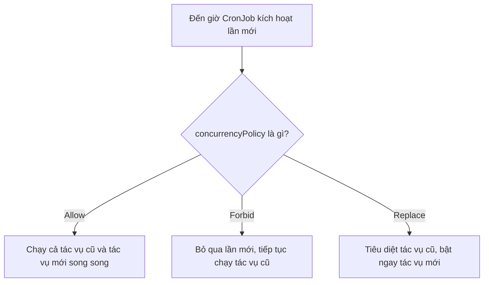
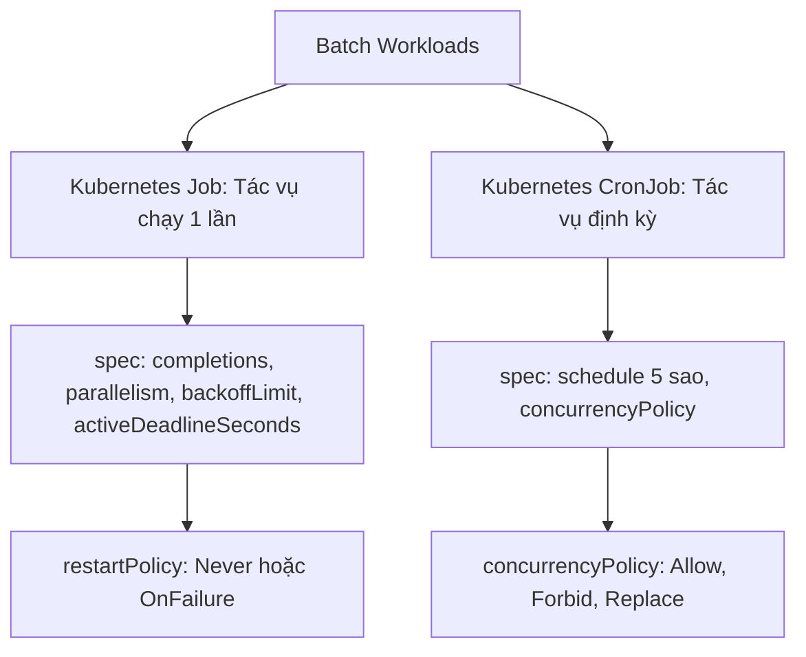
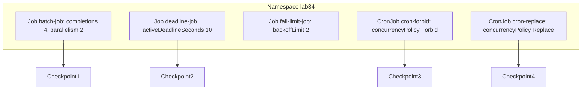


# [BÀI 04] WORKLOADS XỬ LÝ HÀNG LOẠT (BATCH): JOB, CRONJOB, COMPLETIONS, PARALLELISM & CONCURRENCYPOLICY

Trong kỷ nguyên điện toán đám mây và kiến trúc microservices phân tán quy mô lớn, **Kubernetes (CKAD)** đóng vai trò là nền tảng điều phối container (Container Orchestration) tiêu chuẩn công nghiệp. Để làm chủ hệ thống trong môi trường sản xuất (Production) cũng như chinh phục kỳ thi chứng chỉ quốc tế của Linux Foundation / CNCF, kỹ sư không chỉ nắm vững các câu lệnh thao tác cơ bản mà phải thấu hiểu sâu sắc bản chất cơ chế tầng thấp: từ chu trình điều hòa (Reconciliation Loop), cấu trúc điều phối tài nguyên, kiến trúc mạng CNI, lưu trữ CSI cho đến các chuẩn mực an ninh phòng thủ chiều sâu.

Bài viết chuyên sâu này sẽ đồng hành cùng bạn giải mã toàn diện bức tranh kiến trúc, phân tích các đánh đổi kỹ thuật thực chiến (Engineering Trade-offs), cung cấp bài thực hành Lab từng bước và bộ câu hỏi phỏng vấn chuẩn Architect / Lead Engineer.

---

## 1. Bản Chất Kiến Trúc & Cơ Chế Vận Hành Tầng Thấp

| # | Câu hỏi ôn tập | Đáp án chuẩn ngắn gọn |
|---|---|---|
| 1 | Ba mẫu thiết kế Pod đa container kinh điển trong chứng chỉ CKAD là gì? | **Sidecar**, **Adapter**, và **Ambassador** |
| 2 | Hai container trong cùng một Pod gọi mạng cho nhau qua địa chỉ nào? | Mạng chia sẻ **`localhost`** |
| 3 | Loại Volume nào được dùng để chia sẻ file dữ liệu giữa 2 container trong Pod? | Volume loại **`emptyDir`** |
| 4 | Cờ cấu hình nào biến một InitContainer thành Native Sidecar Container từ K8s v1.28+? | **`restartPolicy: Always`** trong khối `initContainers` |
| 5 | Cú pháp CLI nào dùng để xem log của riêng container `sidecar` trong Pod? | **`kubectl logs <pod-name> -c sidecar`** |


> **"Quản lý các tác vụ xử lý theo lô (Batch Workloads) với Job và CronJob là chủ đề quan trọng trong miền Application Design của CKAD, đòi hỏi lập trình viên phải làm chủ các tham số điều phối tiến trình chạy một lần (Job với `completions` số lượt hoàn thành, `parallelism` số luồng song song, `backoffLimit` số lần thử lại khi thất bại, và `restartPolicy` chỉ chấp nhận `Never` hoặc `OnFailure`); đồng thời việc làm chủ CronJob giúp lập trình viên kiểm soát tuyệt đối tần suất chạy định kỳ và cấu hình chính xác cờ `concurrencyPolicy` (`Allow`, `Forbid`, `Replace`) để ngăn ngừa triệt để tình trạng các tác vụ batch chạy chồng lên nhau gây quá tải tài nguyên cụm."**

**Kết quả từ các buổi trước được sử dụng lại:**

| Kết quả / Công cụ | Buổi + số hiệu `QT` | Dùng ở đâu trong buổi này |
|---|---|---|
| Vòng đời Pod và hai kiểu kết thúc | Buổi 14 `QT 4.1` | Hiểu cơ chế Pod chạy xong thoát với exit code 0 |
| Cấu hình biến môi trường qua ConfigMap/Secret | Buổi 20 `QT 4.1` | Truyền biến cấu hình vào container Job/CronJob |
| Tự động sinh YAML bằng cờ dry-run | Buổi 04 `QT 4.1` | Tạo nhanh khung YAML Job và CronJob từ CLI |

---


| # | Kỹ năng thực hiện được | Hiện vật chứng minh |
|---|---|---|
| 1 | Biên soạn tệp YAML Job xử lý batch với `completions` và `parallelism` | Tệp YAML Job chạy song song 2 luồng hoàn thành 4 lượt |
| 2 | Cấu hình giới hạn số lần thử lại lỗi `backoffLimit` và hạn ngạch `activeDeadlineSeconds` | Nhật ký Pod Job tự động ngắt khi vượt quá thời gian |
| 3 | Phân biệt chính xác cơ chế của `restartPolicy: Never` và `restartPolicy: OnFailure` | Nhật ký số lượng Pod sinh mới so với container restart |
| 4 | Cấu hình CronJob với 3 chính sách xử lý đụng độ `concurrencyPolicy` | Tệp YAML CronJob chứa cờ `concurrencyPolicy: Forbid` |
| 5 | Tự động dọn dẹp lịch sử Pod Job cũ bằng `successfulJobsHistoryLimit` | Danh sách Pod lịch sử trong Namespace giữ đúng 2 Pod |

---


| Kiến thức tiên quyết | Nguồn tự học nếu thiếu |
|---|---|
| Khái niệm Pod và hai loại kết thúc tiến trình | Buổi 14 (`QT 4.1`) |
| Kỹ thuật tạo khung YAML bằng cờ dry-run | Buổi 04 (`QT 4.1`) |
| Nạp biến môi trường từ ConfigMap và Secret | Buổi 20 (`QT 4.1`) |

---


### 3.1. Thuật ngữ Việt–Anh

| # | Thuật ngữ tiếng Việt | Tiếng Anh tương đương | Ghi chú chuẩn hoá trong thân bài |
|---|---|---|---|
| 1 | Tiến trình xử lý theo lô | Batch Workload | Tác vụ chạy một lần hoặc định kỳ rồi tự động kết thúc |
| 2 | Bộ điều khiển tác vụ một lần | Job Controller | Controller quản lý các Pod chạy hoàn thành nhiệm vụ |
| 3 | Bộ điều khiển tác vụ định kỳ | CronJob Controller | Controller quản lý việc kích hoạt Job theo lịch |
| 4 | Tổng số lượt hoàn thành | `completions` | Số lượng Pod phải chạy thành công (exit 0) để Job xong |
| 5 | Số luồng chạy song song | `parallelism` | Số lượng Pod tối đa chạy đồng thời tại một thời điểm |
| 6 | Giới hạn số lần thử lại | `backoffLimit` | Số lần Kubelet thử tạo lại Pod mới khi Pod trước bị lỗi |
| 7 | Hạn ngạch thời gian chạy | `activeDeadlineSeconds` | Thời gian tối đa cho phép Job chạy trước khi bị kill |
| 8 | Chính sách khởi động lại Pod | `restartPolicy` | Chỉ chấp nhận `Never` hoặc `OnFailure` cho Job |
| 9 | Chính sách xử lý đụng độ | `concurrencyPolicy` | 3 chính sách: `Allow`, `Forbid`, `Replace` |
| 10 | Giới hạn tệp lịch sử | `successfulJobsHistoryLimit` | Số lượng Pod Job đã hoàn thành được giữ lại |
| 11 | Hạn chót kích hoạt lịch | `startingDeadlineSeconds` | Thời gian cho phép kích hoạt trễ nếu lỡ nhịp cron |
| 12 | Trạng thái hoàn tất | `Completed` (Exit Code 0) | Trạng thái Pod kết thúc nhiệm vụ thành công |
| 13 | Lỗi vượt quá hạn ngạch | `BackoffLimitExceeded` | Trạng thái Job bị thất bại do thử lại quá số lần |
| 14 | Biểu thức thời gian Cron | Cron Schedule Expression | Cú pháp 5 sao định nghĩa lịch chạy (ví dụ `*/5 * * * *`) |


Mô hình Đội xe Giao hàng Thu gom rác: Job giống như một Đội xe tải giao 100 kiện hàng (`completions: 100`), bạn có thể điều 5 xe chạy cùng lúc (`parallelism: 5`). Nếu 1 xe hỏng lốp, bạn cho thử sửa tối đa 3 lần (`backoffLimit: 3`). CronJob là Đồng hồ báo thức 5 giờ sáng mỗi ngày ra lệnh cho Đội xe bắt đầu xuất phát.

---

### 1.1. Kubernetes Job Controller: completions, parallelism, backoffLimit và restartPolicy (12 phút)

**Nguyên lý cốt lõi:** Trong bản kê khai Kubernetes Job, trường `restartPolicy` bắt buộc phải được đặt là `Never` hoặc `OnFailure`; tuyệt đối không được để giá trị mặc định `Always` như của Pod/Deployment.

**Giải thích cơ chế ngầm:** Job sinh ra các Pod để chạy một tác vụ có điểm dừng (ví dụ: tính toán báo cáo, backup database). Nếu để `restartPolicy: Always`, khi tiến trình chạy xong và thoát với code 0, Kubelet sẽ lại cố khởi động lại container vĩnh viễn, khiến Job không bao giờ có thể về trạng thái `Completed`.

> [!WARNING]
> **CẠM BẪY THỰC CHIẾN:**
> API Server từ chối tạo Job và báo lỗi validation `spec.template.spec.restartPolicy: Unsupported value: "Always"`.

**Minh hoạ.**

```yaml
apiVersion: batch/v1
kind: Job
metadata:
  name: sample-job
spec:
  template:
    spec:
      restartPolicy: OnFailure # BẮT BUỘC KHÁC ALWAYS (Never hoặc OnFailure)
      containers:
        - name: worker
          image: busybox:1.36
          command: ["sh", "-c", "echo Job done"]
```

**Nguyên lý cốt lõi:** Khi đặt `restartPolicy: Never`, nếu Pod bị lỗi, Kubelet sẽ giữ nguyên Pod lỗi và tạo một Pod MỚI hoàn toàn để thử lại; khi đặt `restartPolicy: OnFailure`, Kubelet sẽ khởi động lại container NGAY TRONG Pod cũ đó.

**Giải thích cơ chế ngầm:** `restartPolicy: Never` phù hợp khi bạn cần giữ lại Pod bị lỗi để truy vấn `kubectl logs` kiểm tra nguyên nhân sập; trong khi `OnFailure` tiết kiệm tài nguyên tạo Pod mới trên cụm.

> [!WARNING]
> **CẠM BẪY THỰC CHIẾN:**
> Chọn `Never` nhưng lại ngạc nhiên khi thấy 5 Pod lỗi đứng nguyên ở trạng thái `Error` trong danh sách `kubectl get pods`.

**Minh hoạ.**

```bash
# Với restartPolicy: Never -> Thấy nhiều Pod lỗi được sinh mới:
# sample-job-1-xxxx (Error)
# sample-job-1-yyyy (Error)
# sample-job-1-zzzz (Completed)
```

**Nguyên lý cốt lõi:** Trường `completions` định nghĩa tổng số Pod phải hoàn thành thành công (exit 0) để Job được tính là thành công; trường `parallelism` định nghĩa số lượng Pod được phép chạy đồng thời tại một thời điểm.

**Giải thích cơ chế ngầm:** Giúp điều phối tải các bài toán xử lý dữ liệu lớn (Batch Processing). Ví dụ có 100 tệp cần xử lý (`completions: 100`), nhưng để tránh làm sập CPU Node, ta chỉ cho phép chạy tối đa 4 tệp cùng lúc (`parallelism: 4`).

> [!WARNING]
> **CẠM BẪY THỰC CHIẾN:**
> Đặt `parallelism` quá lớn làm cạn kiệt CPU/RAM của Worker Node khiến tất cả các Pod đều bị OOMKilled.

**Minh hoạ.**

```yaml
spec:
  completions: 10   # Tổng số 10 Pod phải hoàn thành exit 0
  parallelism: 2    # Tối đa 2 Pod chạy song song cùng lúc
```

**Nguyên lý cốt lõi:** Trường `backoffLimit` (mặc định bằng 6) định nghĩa số lần tối đa Job được phép thử lại khi Pod bị lỗi; nếu vượt quá ngưỡng này, Job sẽ chuyển sang trạng thái thất bại `BackoffLimitExceeded`.

**Giải thích cơ chế ngầm:** Tránh việc Job bị lỗi mã nguồn (bug code) cố gắng thử lại vĩnh viễn, làm tiêu tốn tài nguyên tính toán và làm tràn ngập nhật ký hệ thống.

> [!WARNING]
> **CẠM BẪY THỰC CHIẾN:**
> Job bị bug code liên tục tạo Pod lỗi khiến danh sách Pod lên tới hàng chục Pod ở trạng thái `CrashLoopBackOff`.

**Minh hoạ.**

```yaml
spec:
  backoffLimit: 3   # Thử lại tối đa 3 lần rồi đánh dấu Job thất bại
```

**Nguyên lý cốt lõi:** Trường `activeDeadlineSeconds` thiết lập hạn ngạch thời gian sống tối đa của Job; nếu Job chạy vượt quá số giây này, Kubernetes sẽ chủ động tiêu diệt toàn bộ các Pod thuộc Job bất kể đã hoàn thành hay chưa.

**Giải thích cơ chế ngầm:** Phòng ngừa trường hợp tiến trình bên trong container bị treo vô hạn (Deadlock) khiến Job kẹt vĩnh viễn ở trạng thái `Running`.

> [!WARNING]
> **CẠM BẪY THỰC CHIẾN:**
> Job bị kẹt treo 5 ngày trên cụm Production do thiếu cờ `activeDeadlineSeconds`.

**Minh hoạ.**

```yaml
spec:
  activeDeadlineSeconds: 100 # Nếu sau 100s chưa xong, kill toàn bộ Job
```

---

### 1.2. Kubernetes CronJob Controller: Cú pháp Cron 5 sao và 3 chính sách concurrencyPolicy (12 phút)

**Nguyên lý cốt lõi:** Biểu thức lịch chạy trong CronJob gồm 5 trường theo thứ tự: Phút (0-59), Giờ (0-23), Ngày trong tháng (1-31), Tháng (1-12), Ngày trong tuần (0-6).

**Giải thích cơ chế ngầm:** Cú pháp 5 sao chuẩn POSIX Cron giúp lập trình viên định nghĩa chính xác thời điểm kích hoạt tác vụ tự động.

> [!WARNING]
> **CẠM BẪY THỰC CHIẾN:**
> Nhầm lẫn thứ tự giữa Phút và Giờ, dẫn đến việc tác vụ định chạy 2 giờ sáng thì lại chạy 2 phút mỗi giờ.

**Minh hoạ.**

```text
# ┌───────────── phút (0 - 59)
# │ ┌─────────── giờ (0 - 23)
# │ │ ┌───────── ngày trong tháng (1 - 31)
# │ │ │ ┌────── tháng (1 - 12)
# │ │ │ │ ┌──── ngày trong tuần (0 - 6) (Chủ nhật = 0)
# │ │ │ │ │
  * * * * *
```

```bash
# Ví dụ: Run lúc 2h30 sáng mỗi ngày: "30 2 * * *"
# Ví dụ: Run mỗi 5 phút một lần: "*/5 * * * *"
```

**Nguyên lý cốt lõi:** Sử dụng `concurrencyPolicy: Forbid` trong CronJob để ngăn ngừa việc tác vụ định kỳ mới kích hoạt chạy đụng độ khi tác vụ cũ chưa chạy xong.

**Giải thích cơ chế ngầm:** Nếu một tác vụ CronJob xử lý dữ liệu mất 10 phút, nhưng lịch cron được cài 5 phút 1 lần. Nếu giữ mặc định `Allow`, sau 10 phút sẽ có 2 tác vụ cùng chạy song song, ghi đè dữ liệu lên nhau và làm quá tải cơ sở dữ liệu. `Forbid` ra lệnh bỏ qua lần kích hoạt mới nếu tác vụ cũ chưa xong.

> [!WARNING]
> **CẠM BẪY THỰC CHIẾN:**
> Dùng mặc định `Allow` làm xuất hiện hàng chục tiến trình batch chạy chồng chéo nhau làm treo cụm.

**Minh hoạ.**

```yaml
spec:
  concurrencyPolicy: Forbid # NẾU TÁC VỤ CŨ CHƯA XONG -> BỎ QUA LẦN MỚI
```

**Nguyên lý cốt lõi:** Sử dụng `concurrencyPolicy: Replace` khi muốn hủy bỏ tác vụ cũ đang chạy dở và thay thế ngay bằng tác vụ mới vừa tới lịch kích hoạt.

**Giải thích cơ chế ngầm:** Phù hợp cho các tác vụ lấy dữ liệu báo cáo mới nhất (Latest State Snapshot). Tác vụ cũ chạy dở không còn giá trị vì đã có tác vụ mới chứa dữ liệu mới hơn tới lịch chạy.

> [!WARNING]
> **CẠM BẪY THỰC CHIẾN:**
> Chọn `Replace` cho các tác vụ tính toán tài chính dài hạn, làm các giao dịch dở dang bị ngắt quãng nửa chừng.

**Minh hoạ.**



---

### 1.3. Xử lý sự cố Batch Workloads: Pod treo, thử lại thất bại và dọn dẹp lịch sử (10 phút)

**Nguyên lý cốt lõi:** Luôn cấu hình cờ `successfulJobsHistoryLimit: 3` và `failedJobsHistoryLimit: 1` trong CronJob Production để tránh việc giữ lại hàng nghìn Pod cũ làm phồng etcd và rác namespace.

**Giải thích cơ chế ngầm:** Mặc định CronJob giữ lại 3 Job thành công và 1 Job thất bại. Nếu bạn tăng con số này lên quá lớn hoặc bỏ trống, sau vài tháng cụm sẽ tích tụ hàng vạn Pod ở trạng thái `Completed` gây chậm lệnh `kubectl get pods`.

> [!WARNING]
> **CẠM BẪY THỰC CHIẾN:**
> Danh sách `kubectl get pods` hiển thị hàng trăm Pod rác ở trạng thái `Completed`.

**Minh hoạ.**

```yaml
spec:
  successfulJobsHistoryLimit: 3 # Giữ tối đa 3 Pod thành công
  failedJobsHistoryLimit: 1     # Giữ tối đa 1 Pod thất bại
```

---

### 1.4. Đưa vào cụm thật (4 phút)

**Áp vào cụm đang chạy thì làm gì trước:**
1. Rà soát lại tất cả các CronJob dự án và thiết lập chính xác `concurrencyPolicy: Forbid`.
2. Khai báo cờ `successfulJobsHistoryLimit: 3` để tự động dọn dẹp Pod rác.
3. Đảm bảo MỌI Job đều có cờ `activeDeadlineSeconds` để chống treo vĩnh viễn.

**Cái gì hỏng nếu áp thẳng lên prod:**
- Đặt `activeDeadlineSeconds` quá ngắn làm Job xử lý dữ liệu lớn bị ngắt giữa chừng khi chỉ còn vài giây nữa là xong.

**Đo trước — đo sau:**
- Đo thời gian chạy trung bình của Job để đặt `activeDeadlineSeconds` gấp 2–3 lần thời gian đó.
- Đo số lượng Pod rác trong Namespace trước và sau khi thêm `successfulJobsHistoryLimit`.

**Khi nào KHÔNG nên dùng:**
- Không dùng CronJob cho các tác vụ cần độ chính xác mốc thời gian đến từng mili-giây (vì CronJob có độ trễ kích hoạt từ Kubelet vài giây).

---

### 1.5. Bẫy hay gặp (2 phút)

| Bẫy hay gặp | Vì sao dính | Làm đúng là |
|---|---|---|
| 1. Dùng `restartPolicy: Always` cho Job | Thói quen copy Pod spec từ Deployment | Đổi `restartPolicy` thành `Never` hoặc `OnFailure` |
| 2. CronJob chạy chồng đụng độ nhau | Để mặc định `concurrencyPolicy: Allow` | Khai báo rõ `concurrencyPolicy: Forbid` |
| 3. Job kẹt treo vĩnh viễn do deadlock | Thiếu hạn ngạch thời gian chạy tối đa | Thêm `activeDeadlineSeconds: 300` |
| 4. Thử lại vĩnh viễn khi mã nguồn bị lỗi bug | Bỏ trống cờ giới hạn thử lại `backoffLimit` | Đặt `backoffLimit: 3` hoặc `2` |
| 5. Phồng rác etcd do tích tụ hàng trăm Pod rác | Bỏ trống cờ dọn dẹp lịch sử CronJob | Đặt `successfulJobsHistoryLimit: 3` |
| 6. Nhầm thứ tự Phút và Giờ trong cú pháp Cron | Nhớ không chuẩn vị trí 5 sao | Nhớ mốc đầu tiên luôn là Phút (0-59), thứ hai là Giờ (0-23) |
| 7. `parallelism` lớn hơn `completions` | Đặt số luồng song song thừa vãi | Đặt `parallelism` <= `completions` |
| 8. Lệnh `kubectl create job` gõ sai cờ image | Quên cờ `--image` trên CLI | Gõ `kubectl create job <name> --image=<image>` |
| 9. CronJob bị lỡ nhịp do Kubelet bận | Đặt `startingDeadlineSeconds` quá ngắn | Thiết lập `startingDeadlineSeconds: 100` |
| 10. `restartPolicy: Never` tạo quá nhiều Pod lỗi | Không hiểu cơ chế sinh Pod mới của `Never` | Đổi sang `restartPolicy: OnFailure` nếu muốn giữ 1 Pod |
| 11. Đặt `completions` quá lớn làm hết tài nguyên | Không tính toán tổng số lượt chạy | Đặt `completions` vừa đủ số lượng tệp batch |
| 12. Quên cờ `-n <namespace>` trong đề thi CKAD | Job bị tạo ở Namespace `default` | Kiểm tra lại Namespace đề bài chỉ định trước khi apply |

---

### 1.6. Tóm tắt (2 phút)



**Năm điều phải nhớ:**
1. **`restartPolicy` của Job**: Bắt buộc là `Never` hoặc `OnFailure` (không được để `Always`).
2. **`completions` & `parallelism`**: `completions` là tổng số lượt xong, `parallelism` là số luồng song song.
3. **`backoffLimit` & `activeDeadlineSeconds`**: Giới hạn số lần thử lại và thời gian sống tối đa.
4. **`concurrencyPolicy`**: `Forbid` ngăn chạy đụng độ, `Replace` hủy tác vụ cũ thay bằng mới.
5. **Dọn dẹp lịch sử**: Cấu hình `successfulJobsHistoryLimit: 3` để tránh rác cụm.

---

## §10. Câu hỏi tự kiểm tra (5 phút)


<div class="qa-answer">
  <div class="qa-answer-header">
    <svg width="14" height="14" fill="none" stroke="currentColor" stroke-width="2" viewBox="0 0 24 24"><path d="M22 11.08V12a10 10 0 1 1-5.93-9.14"></path><polyline points="22 4 12 14.01 9 11.01"></polyline></svg>
    <span>Phân Tích &amp; Lời Giải Kỹ Thuật</span>
  </div>
  
Giá trị <code>Never</code> hoặc <code>OnFailure</code>.
</div>
</details>

<div class="qa-answer">
  <div class="qa-answer-header">
    <svg width="14" height="14" fill="none" stroke="currentColor" stroke-width="2" viewBox="0 0 24 24"><path d="M22 11.08V12a10 10 0 1 1-5.93-9.14"></path><polyline points="22 4 12 14.01 9 11.01"></polyline></svg>
    <span>Phân Tích &amp; Lời Giải Kỹ Thuật</span>
  </div>
  
<code>Never</code> sinh ra Pod mới hoàn toàn để thử lại, <code>OnFailure</code> khởi động lại container ngay trong Pod cũ.
</div>
</details>

<div class="qa-answer">
  <div class="qa-answer-header">
    <svg width="14" height="14" fill="none" stroke="currentColor" stroke-width="2" viewBox="0 0 24 24"><path d="M22 11.08V12a10 10 0 1 1-5.93-9.14"></path><polyline points="22 4 12 14.01 9 11.01"></polyline></svg>
    <span>Phân Tích &amp; Lời Giải Kỹ Thuật</span>
  </div>
  
<code>completions</code> là tổng số Pod phải hoàn thành (exit 0), <code>parallelism</code> là số Pod tối đa chạy đồng thời.
</div>
</details>

<div class="qa-answer">
  <div class="qa-answer-header">
    <svg width="14" height="14" fill="none" stroke="currentColor" stroke-width="2" viewBox="0 0 24 24"><path d="M22 11.08V12a10 10 0 1 1-5.93-9.14"></path><polyline points="22 4 12 14.01 9 11.01"></polyline></svg>
    <span>Phân Tích &amp; Lời Giải Kỹ Thuật</span>
  </div>
  
Giá trị mặc định bằng 6.
</div>
</details>

<div class="qa-answer">
  <div class="qa-answer-header">
    <svg width="14" height="14" fill="none" stroke="currentColor" stroke-width="2" viewBox="0 0 24 24"><path d="M22 11.08V12a10 10 0 1 1-5.93-9.14"></path><polyline points="22 4 12 14.01 9 11.01"></polyline></svg>
    <span>Phân Tích &amp; Lời Giải Kỹ Thuật</span>
  </div>
  
Kubernetes sẽ chủ động tiêu diệt toàn bộ các Pod thuộc Job và chuyển Job sang trạng thái thất bại.
</div>
</details>

<div class="qa-answer">
  <div class="qa-answer-header">
    <svg width="14" height="14" fill="none" stroke="currentColor" stroke-width="2" viewBox="0 0 24 24"><path d="M22 11.08V12a10 10 0 1 1-5.93-9.14"></path><polyline points="22 4 12 14.01 9 11.01"></polyline></svg>
    <span>Phân Tích &amp; Lời Giải Kỹ Thuật</span>
  </div>
  
Phút, Giờ, Ngày trong tháng, Tháng, Ngày trong tuần.
</div>
</details>

<div class="qa-answer">
  <div class="qa-answer-header">
    <svg width="14" height="14" fill="none" stroke="currentColor" stroke-width="2" viewBox="0 0 24 24"><path d="M22 11.08V12a10 10 0 1 1-5.93-9.14"></path><polyline points="22 4 12 14.01 9 11.01"></polyline></svg>
    <span>Phân Tích &amp; Lời Giải Kỹ Thuật</span>
  </div>
  
<code>Allow</code>, <code>Forbid</code>, và <code>Replace</code>.
</div>
</details>

<div class="qa-answer">
  <div class="qa-answer-header">
    <svg width="14" height="14" fill="none" stroke="currentColor" stroke-width="2" viewBox="0 0 24 24"><path d="M22 11.08V12a10 10 0 1 1-5.93-9.14"></path><polyline points="22 4 12 14.01 9 11.01"></polyline></svg>
    <span>Phân Tích &amp; Lời Giải Kỹ Thuật</span>
  </div>
  
Bỏ qua lần kích hoạt mới và tiếp tục để tác vụ cũ chạy cho xong.
</div>
</details>

<div class="qa-answer">
  <div class="qa-answer-header">
    <svg width="14" height="14" fill="none" stroke="currentColor" stroke-width="2" viewBox="0 0 24 24"><path d="M22 11.08V12a10 10 0 1 1-5.93-9.14"></path><polyline points="22 4 12 14.01 9 11.01"></polyline></svg>
    <span>Phân Tích &amp; Lời Giải Kỹ Thuật</span>
  </div>
  
Tiêu diệt tác vụ cũ đang chạy dở và bật ngay tác vụ mới vừa tới lịch.
</div>
</details>

<div class="qa-answer">
  <div class="qa-answer-header">
    <svg width="14" height="14" fill="none" stroke="currentColor" stroke-width="2" viewBox="0 0 24 24"><path d="M22 11.08V12a10 10 0 1 1-5.93-9.14"></path><polyline points="22 4 12 14.01 9 11.01"></polyline></svg>
    <span>Phân Tích &amp; Lời Giải Kỹ Thuật</span>
  </div>
  
Cờ <code>successfulJobsHistoryLimit</code>.
</div>
</details>

<div class="qa-answer">
  <div class="qa-answer-header">
    <svg width="14" height="14" fill="none" stroke="currentColor" stroke-width="2" viewBox="0 0 24 24"><path d="M22 11.08V12a10 10 0 1 1-5.93-9.14"></path><polyline points="22 4 12 14.01 9 11.01"></polyline></svg>
    <span>Phân Tích &amp; Lời Giải Kỹ Thuật</span>
  </div>
  
<code>kubectl create job <job-name> --image=<image-name></code>.
</div>
</details>

<div class="qa-answer">
  <div class="qa-answer-header">
    <svg width="14" height="14" fill="none" stroke="currentColor" stroke-width="2" viewBox="0 0 24 24"><path d="M22 11.08V12a10 10 0 1 1-5.93-9.14"></path><polyline points="22 4 12 14.01 9 11.01"></polyline></svg>
    <span>Phân Tích &amp; Lời Giải Kỹ Thuật</span>
  </div>
  
<code>kubectl create cronjob <name> --image=<image> --schedule="*/5 * * * *" -- <command></code>.
</div>
</details>

---

## §11. Tài liệu tham khảo

| Nguồn | Địa chỉ URL | Ghi chú |
|---|---|---|
| Kubernetes Jobs Documentation | `https://kubernetes.io/docs/concepts/workloads/controllers/job/` | Tài liệu chuẩn K8s Job Controller |
| Kubernetes CronJobs Documentation | `https://kubernetes.io/docs/concepts/workloads/controllers/cron-jobs/` | Tài liệu chuẩn K8s CronJob Controller |


---

## 2. Hướng Dẫn Thực Hành & Triển Khai Lab Chuẩn Production

> [!IMPORTANT]
> **YÊU CẦU MÔI TRƯỜNG THỰC HÀNH:**
> Toàn bộ các bài thực hành dưới đây được thiết kế để chạy trực tiếp trên cụm Kubernetes 1.30+ tiêu chuẩn (hoặc cụm kind/kubeadm lab). Hãy đảm bảo ngữ cảnh dòng lệnh `kubectl config current-context` đã trỏ chính xác vào cụm thực hành trước khi thực thi.

## Khối thực hành — 120 phút

## L0. Mục tiêu thực hành và tiêu chí hoàn thành

| Mã tiêu chí | Nội dung tiêu chí | Lệnh kiểm chứng | Kết quả kỳ vọng |
|---|---|---|---|
| TH1 | Tạo Namespace `lab34` phục vụ bài tập Batch Workloads | `kubectl get ns lab34 -o jsonpath='{.status.phase}'` | In ra `Active` |
| TH2 | Biên soạn Job `batch-job` có `completions: 4`, `parallelism: 2` | `kubectl get job batch-job -n lab34 -o jsonpath='{.spec.completions}'` | In ra `4` |
| TH3 | Kiểm tra Job `batch-job` hoàn thành 4 lượt `4/4` | `kubectl get job batch-job -n lab34 -o jsonpath='{.status.succeeded}'` | In ra `4` |
| TH4 | Xác minh 4 Pod của `batch-job` đều ở trạng thái `Completed` | `kubectl get pods -n lab34 -l job-name=batch-job --no-headers \| grep -w Completed \| wc -l` | In ra `4` |
| TH5 | Biên soạn Job `deadline-job` chứa `activeDeadlineSeconds: 10` | `kubectl get job deadline-job -n lab34 -o jsonpath='{.spec.activeDeadlineSeconds}'` | In ra `10` |
| TH6 | Kiểm tra Job `deadline-job` bị Kubelet ngắt do quá thời gian | `kubectl get job deadline-job -n lab34 -o jsonpath='{.status.conditions[0].reason}'` | In ra `DeadlineExceeded` |
| TH7 | Biên soạn CronJob `cron-forbid` có `concurrencyPolicy: Forbid` | `kubectl get cronjob cron-forbid -n lab34 -o jsonpath='{.spec.concurrencyPolicy}'` | In ra `Forbid` |
| TH8 | Kiểm tra CronJob `cron-forbid` tự động kích hoạt tạo Job thành công | `kubectl get cronjob cron-forbid -n lab34 -o jsonpath='{.spec.schedule}'` | In ra `*/2 * * * *` |
| TH9 | Biên soạn CronJob `cron-replace` có `concurrencyPolicy: Replace` | `kubectl get cronjob cron-replace -n lab34 -o jsonpath='{.spec.concurrencyPolicy}'` | In ra `Replace` |
| TH10 | Cấu hình `successfulJobsHistoryLimit: 2` cho CronJob | `kubectl get cronjob cron-forbid -n lab34 -o jsonpath='{.spec.successfulJobsHistoryLimit}'` | In ra `2` |
| TH11 | Biên soạn Job `fail-limit-job` có `backoffLimit: 2` | `kubectl get job fail-limit-job -n lab34 -o jsonpath='{.spec.backoffLimit}'` | In ra `2` |
| TH12 | Xác minh Job `fail-limit-job` chuyển sang trạng thái thất bại | `kubectl get job fail-limit-job -n lab34 -o jsonpath='{.status.conditions[0].reason}'` | In ra `BackoffLimitExceeded` |
| TH13 | Dọn dẹp sạch sẽ tài nguyên lab34 | `test ! -f /tmp/lab34-job.yaml && echo "CLEAN"` | In ra `CLEAN` |

---

## L1. Điều kiện tiên quyết về môi trường

| Kiểm tra | Lệnh thực hiện | Kết quả kỳ vọng |
|---|---|---|
| Cụm Kubernetes ba node | `kubectl get nodes` | `cp-01`, `worker-01`, `worker-02` ở trạng thái `Ready` |
| Context đúng môi trường lab | `kubectl config current-context` | Đúng context cụm `kubeadm` |
| Quyền tạo tài nguyên | `kubectl auth can-i create job -n default` | In ra `yes` |

---

## L2. Kiến trúc bài lab Batch Workloads với Job và CronJob



---

## L3. Bước 1: Khởi tạo Namespace `lab34` (10 phút)

### Thao tác 1.1: Tạo Namespace

```bash
kubectl create namespace lab34
```

**CHECKPOINT 1 — Kiểm tra Namespace `lab34`.**

```bash
kubectl get ns lab34 -o jsonpath='{.status.phase}' | grep -qx Active && echo "CHECKPOINT 1 — ĐẠT" || echo "CHECKPOINT 1 — LỖI"
```

---

## L4. Bước 2: Triển khai Job xử lý song song Batch (25 phút)

### Thao tác 2.1: Biên soạn và tạo Job `batch-job`

```bash
cat <<EOF | kubectl apply -f -
apiVersion: batch/v1
kind: Job
metadata:
  name: batch-job
  namespace: lab34
spec:
  completions: 4
  parallelism: 2
  backoffLimit: 3
  template:
    spec:
      restartPolicy: OnFailure
      containers:
        - name: worker
          image: busybox:1.36
          command: ["sh", "-c", "echo BATCH_DONE && sleep 3"]
EOF
```

**CHECKPOINT 2 — Kiểm tra thuộc tính `completions: 4`.**

```bash
kubectl get job batch-job -n lab34 -o jsonpath='{.spec.completions}' | grep -qx 4 && echo "CHECKPOINT 2 — ĐẠT" || echo "CHECKPOINT 2 — LỖI"
```

**CHECKPOINT 3 — Kiểm tra Job `batch-job` đạt 4 lượt hoàn thành `4/4`.**

```bash
sleep 10
kubectl get job batch-job -n lab34 -o jsonpath='{.status.succeeded}' | grep -qx 4 && echo "CHECKPOINT 3 — ĐẠT" || echo "CHECKPOINT 3 — LỖI"
```

**CHECKPOINT 4 — Xác minh 4 Pod đều ở trạng thái `Completed`.**

```bash
[ $(kubectl get pods -n lab34 -l job-name=batch-job --no-headers | grep -w Completed | wc -l) -eq 4 ] && echo "CHECKPOINT 4 — ĐẠT" || echo "CHECKPOINT 4 — LỖI"
```

---

## L5. Bước 3: Thử nghiệm Hạn ngạch Thời gian `activeDeadlineSeconds` và `backoffLimit` (25 phút)

### Thao tác 3.1: Biên soạn Job `deadline-job` bị kill do quá thời gian

```bash
cat <<EOF | kubectl apply -f -
apiVersion: batch/v1
kind: Job
metadata:
  name: deadline-job
  namespace: lab34
spec:
  activeDeadlineSeconds: 10
  template:
    spec:
      restartPolicy: Never
      containers:
        - name: worker
          image: busybox:1.36
          command: ["sh", "-c", "echo SLEEPING && sleep 3600"]
EOF
```

**CHECKPOINT 5 — Kiểm tra `activeDeadlineSeconds: 10`.**

```bash
kubectl get job deadline-job -n lab34 -o jsonpath='{.spec.activeDeadlineSeconds}' | grep -qx 10 && echo "CHECKPOINT 5 — ĐẠT" || echo "CHECKPOINT 5 — LỖI"
```

**CHECKPOINT 6 — Kiểm tra Job `deadline-job` bị ngắt do `DeadlineExceeded`.**

```bash
sleep 12
kubectl get job deadline-job -n lab34 -o jsonpath='{.status.conditions[0].reason}' | grep -qx DeadlineExceeded && echo "CHECKPOINT 6 — ĐẠT" || echo "CHECKPOINT 6 — LỖI"
```

### Thao tác 3.2: Biên soạn Job `fail-limit-job` thử lại thất bại `backoffLimit: 2`

```bash
cat <<EOF | kubectl apply -f -
apiVersion: batch/v1
kind: Job
metadata:
  name: fail-limit-job
  namespace: lab34
spec:
  backoffLimit: 2
  template:
    spec:
      restartPolicy: Never
      containers:
        - name: worker
          image: busybox:1.36
          command: ["sh", "-c", "exit 1"]
EOF
```

**CHECKPOINT 11 — Kiểm tra thuộc tính `backoffLimit: 2`.**

```bash
kubectl get job fail-limit-job -n lab34 -o jsonpath='{.spec.backoffLimit}' | grep -qx 2 && echo "CHECKPOINT 11 — ĐẠT" || echo "CHECKPOINT 11 — LỖI"
```

**CHECKPOINT 12 — Xác minh Job chuyển sang trạng thái `BackoffLimitExceeded`.**

```bash
sleep 10
kubectl get job fail-limit-job -n lab34 -o jsonpath='{.status.conditions[0].reason}' | grep -qx BackoffLimitExceeded && echo "CHECKPOINT 12 — ĐẠT" || echo "CHECKPOINT 12 — LỖI"
```

---

## L6. Bước 4: Triển khai CronJob chống đụng độ `concurrencyPolicy` (25 phút)

### Thao tác 4.1: Biên soạn CronJob `cron-forbid` có `concurrencyPolicy: Forbid`

```bash
cat <<EOF | kubectl apply -f -
apiVersion: batch/v1
kind: CronJob
metadata:
  name: cron-forbid
  namespace: lab34
spec:
  schedule: "*/2 * * * *"
  concurrencyPolicy: Forbid
  successfulJobsHistoryLimit: 2
  failedJobsHistoryLimit: 1
  jobTemplate:
    spec:
      template:
        spec:
          restartPolicy: OnFailure
          containers:
            - name: cron-worker
              image: busybox:1.36
              command: ["sh", "-c", "echo FORBID_CRON_OK && sleep 5"]
EOF
```

**CHECKPOINT 7 — Kiểm tra `concurrencyPolicy: Forbid`.**

```bash
kubectl get cronjob cron-forbid -n lab34 -o jsonpath='{.spec.concurrencyPolicy}' | grep -qx Forbid && echo "CHECKPOINT 7 — ĐẠT" || echo "CHECKPOINT 7 — LỖI"
```

**CHECKPOINT 8 — Kiểm tra biểu thức lịch `*/2 * * * *`.**

```bash
kubectl get cronjob cron-forbid -n lab34 -o jsonpath='{.spec.schedule}' | grep -qx "\*/2 \* \* \* \*" && echo "CHECKPOINT 8 — ĐẠT" || echo "CHECKPOINT 8 — LỖI"
```

**CHECKPOINT 10 — Kiểm tra `successfulJobsHistoryLimit: 2`.**

```bash
kubectl get cronjob cron-forbid -n lab34 -o jsonpath='{.spec.successfulJobsHistoryLimit}' | grep -qx 2 && echo "CHECKPOINT 10 — ĐẠT" || echo "CHECKPOINT 10 — LỖI"
```

### Thao tác 4.2: Biên soạn CronJob `cron-replace` có `concurrencyPolicy: Replace`

```bash
cat <<EOF | kubectl apply -f -
apiVersion: batch/v1
kind: CronJob
metadata:
  name: cron-replace
  namespace: lab34
spec:
  schedule: "0 1 * * *"
  concurrencyPolicy: Replace
  jobTemplate:
    spec:
      template:
        spec:
          restartPolicy: Never
          containers:
            - name: cron-worker
              image: busybox:1.36
              command: ["sh", "-c", "echo REPLACE_CRON_OK"]
EOF
```

**CHECKPOINT 9 — Kiểm tra `concurrencyPolicy: Replace`.**

```bash
kubectl get cronjob cron-replace -n lab34 -o jsonpath='{.spec.concurrencyPolicy}' | grep -qx Replace && echo "CHECKPOINT 9 — ĐẠT" || echo "CHECKPOINT 9 — LỖI"
```

---

## L7. Dọn dẹp môi trường (10 phút)

### Thao tác 7.1: Dọn dẹp tài nguyên lab34

```bash
kubectl delete namespace lab34
rm -f /tmp/lab34-job.yaml
```

**CHECKPOINT 13 — Kiểm tra dọn dẹp sạch sẽ.**

```bash
test ! -f /tmp/lab34-job.yaml && echo "CHECKPOINT 13 — ĐẠT" || echo "CHECKPOINT 13 — LỖI"
```

---

## L8. Xử lý sự cố thường gặp trong lab

| Triệu chứng lỗi | Nguyên nhân gốc rễ | Cách sửa triệt để |
|---|---|---|
| 1. API Server từ chối tạo Job | Đặt `restartPolicy: Always` trong Pod spec template | Đổi `restartPolicy` thành `Never` hoặc `OnFailure` |
| 2. Job `deadline-job` kẹt không dừng | Quên cờ `activeDeadlineSeconds` làm Pod sleep vĩnh viễn | Thêm `activeDeadlineSeconds: 10` dưới khối spec của Job |
| 3. CronJob không tự kích tạo Job | Gõ sai biểu thức lịch cron (ví dụ gõ 4 sao thay vì 5 sao) | Đảm bảo đúng 5 mốc thời gian `"*/2 * * * *"` |
| 4. Job bị lỗi `BackoffLimitExceeded` | Tiến trình container thoát với code 1 quá số lần `backoffLimit` | Kiểm tra script container hoặc tăng `backoffLimit` |
| 5. CronJob chạy chồng chéo gây treo cụm | Giữ mặc định `concurrencyPolicy: Allow` khi tác vụ cũ chưa xong | Khai báo cờ `concurrencyPolicy: Forbid` |
| 6. Tích tụ hàng chục Pod `Completed` | Không giới hạn tệp lịch sử giữ lại | Thêm cờ `successfulJobsHistoryLimit: 2` trong CronJob |
| 7. Lỗi syntax YAML trong khối `jobTemplate` | Thò lùi sai khoảng trắng ở thụt lề `jobTemplate` | Thụt lùi đúng 2 khoảng trắng dưới `spec:` của CronJob |
| 8. Job `batch-job` không đạt `4/4` thành công | `parallelism` quá lớn làm Node bị quá tải tài nguyên | Giảm `parallelism` xuống 2 hoặc 1 |
| 9. `kubectl create job` báo thiếu cờ image | Quên khai báo cờ `--image` trên CLI | Gõ `kubectl create job <name> --image=busybox:1.36` |
| 10. `restartPolicy: Never` sinh hàng loạt Pod lỗi | Không hiểu cơ chế tạo Pod mới của `Never` khi thử lại | Chuyển sang `restartPolicy: OnFailure` để restart tại chỗ |
| 11. CronJob bị bỏ lỡ nhịp kích hoạt | Kubelet quá tải làm trễ quá mốc `startingDeadlineSeconds` | Tăng `startingDeadlineSeconds` lên 100s |
| 12. Quên cờ `-n lab34` khi kiểm tra status | Truy vấn Job ở Namespace `default` không thấy | Luôn thêm cờ `-n lab34` khi dùng `kubectl get job` |
| 13. Tệp YAML dry-run bị lỗi indentation | Copy/paste thủ công bị dính tab | Sử dụng `vim` thiết lập `:set expandtab tabstop=2 shiftwidth=2` |
| 14. Lỗi `DeadlineExceeded` xảy ra quá sớm | Đặt `activeDeadlineSeconds` ngắn hơn thời gian chạy thật | Tăng `activeDeadlineSeconds` phù hợp với độ dài tác vụ |

---

## L9. Bài tập mở rộng

- **BT1:** Biên soạn tệp YAML Job tính toán số Pi sử dụng ảnh `perl:5.34` với `completions: 5` và `parallelism: 2`.
- **BT2:** Cấu hình CronJob sao lưu cơ sở dữ liệu Postgres mỗi ngày lúc 3 giờ sáng với `concurrencyPolicy: Forbid`.
- **BT3:** Thử nghiệm tác động của `concurrencyPolicy: Replace` bằng cách tạo CronJob kích hoạt mỗi phút với lệnh `sleep 120`.
- **BT4:** Viết script Bash tự động xóa toàn bộ các Pod ở trạng thái `Completed` trong Namespace `lab34`.
- **BT5:** Cấu hình Job có cả 2 cờ `backoffLimit: 2` và `activeDeadlineSeconds: 30` kiểm tra cờ nào có hiệu lực trước.
- **BT6:** So sánh thời gian hoàn thành tổng thể của Job khi thay đổi `parallelism` từ 1 lên 4.

---

## L10. Hiện vật nộp và tiêu chí chấm điểm

| Hạng mục hiện vật | Tiêu chí chấm điểm đạt | Thang điểm |
|---|---|---|
| Nhật ký 13 Checkpoint | Thực thi thành công 100 % các checkpoint in ra `ĐẠT` | 50 điểm |
| Bản kê khai Job song song | Cấu hình đúng `completions: 4` và `parallelism: 2` | 20 điểm |
| Bản kê khai CronJob Forbid/Replace | Cấu hình đúng `concurrencyPolicy` và lịch sử history limit | 20 điểm |
| Báo cáo bài tập mở rộng | Trả lời đầy đủ câu hỏi BT1 và BT2 | 10 điểm |
| **Tổng điểm** | | **100 điểm** |


---

## 3. Bộ Câu Hỏi Vấn Đáp & Phỏng Vấn Kỹ Thuật Chuyên Sâu


## V1. Cách tiến hành

Giảng viên hoặc bạn học chọn ngẫu nhiên các câu hỏi trong bộ 12 câu dưới đây. Người trả lời phải trình bày mạch lạc trong 60–90 giây mỗi câu, đi thẳng vào cơ chế kỹ thuật và viện dẫn các lệnh CLI thực tế.

---

---

## V2. Bộ câu hỏi phỏng vấn thực chiến

<details class="qa-card">
<summary class="qa-summary">
  <div class="qa-summary-left">
    <span class="qa-num-badge">Q01</span>
    <span>Tại sao trường <code>restartPolicy</code> trong bản kê khai Kubernetes Job tuyệt đối không được đặt là <code>Always</code>?</span>
  </div>
  <span class="qa-chevron">
    <svg width="18" height="18" fill="none" stroke="currentColor" stroke-width="2.5" viewBox="0 0 24 24"><polyline points="6 9 12 15 18 9"></polyline></svg>
  </span>
</summary>
<div class="qa-answer">
  <div class="qa-answer-header">
    <svg width="14" height="14" fill="none" stroke="currentColor" stroke-width="2" viewBox="0 0 24 24"><path d="M22 11.08V12a10 10 0 1 1-5.93-9.14"></path><polyline points="22 4 12 14.01 9 11.01"></polyline></svg>
    <span>Phân Tích &amp; Lời Giải Kỹ Thuật</span>
  </div>
  <div style="margin: 0.35rem 0; padding-left: 1rem; border-left: 2px solid var(--accent-primary);">Vì nếu đặt <code>restartPolicy: Always</code>, khi tiến trình trong Job chạy xong nhiệm vụ và thoát với exit code 0, Kubelet sẽ lại khởi động lại container vĩnh viễn theo chính sách Always. Điều này khiến Job không bao giờ có thể về trạng thái thành công (<code>Completed</code>) và làm vi phạm thiết kế của Job Controller.</div>
  <div style="margin-top: 0.75rem;"><b style="color: var(--accent-primary);">Tiêu chí chấm điểm &amp; Phân tầng năng lực:</b></div>
  <div style="margin: 0.25rem 0; padding-left: 1rem; border-left: 2px solid var(--accent-primary);">• 0đ: Không giải thích được lý do cấm Always.</div>
  <div style="margin: 0.25rem 0; padding-left: 1rem; border-left: 2px solid var(--accent-primary);">• 1đ: Nêu được không cho Always nhưng không giải thích được cơ chế Kubelet restart lại container khi exit 0.</div>
  <div style="margin: 0.25rem 0; padding-left: 1rem; border-left: 2px solid var(--accent-primary);">• 3đ: Phân tích chính xác lý do vấp lỗi validation API Server và mục đích của trạng thái Completed.</div>
  <div style="margin-top: 0.75rem; padding: 0.5rem 0.75rem; background: rgba(var(--accent-primary-rgb, 59, 130, 246), 0.08); border-radius: 4px;"><b style="color: var(--accent-primary);">Câu hỏi mở rộng / Đào sâu:</b> (Hai giá trị hợp lệ bắt buộc của <code>restartPolicy</code> trong Job là gì? — <code>Never</code> hoặc <code>OnFailure</code>).

---</div>
</div>
</details>

<details class="qa-card">
<summary class="qa-summary">
  <div class="qa-summary-left">
    <span class="qa-num-badge">Q02</span>
    <span>Sự khác biệt về cơ chế thử lại giữa <code>restartPolicy: Never</code> và <code>restartPolicy: OnFailure</code> khi Job bị lỗi là gì?</span>
  </div>
  <span class="qa-chevron">
    <svg width="18" height="18" fill="none" stroke="currentColor" stroke-width="2.5" viewBox="0 0 24 24"><polyline points="6 9 12 15 18 9"></polyline></svg>
  </span>
</summary>
<div class="qa-answer">
  <div class="qa-answer-header">
    <svg width="14" height="14" fill="none" stroke="currentColor" stroke-width="2" viewBox="0 0 24 24"><path d="M22 11.08V12a10 10 0 1 1-5.93-9.14"></path><polyline points="22 4 12 14.01 9 11.01"></polyline></svg>
    <span>Phân Tích &amp; Lời Giải Kỹ Thuật</span>
  </div>
  <div style="margin: 0.35rem 0; padding-left: 1rem; border-left: 2px solid var(--accent-primary);">Khi đặt <code>restartPolicy: Never</code>, nếu Pod bị lỗi, Kubelet giữ nguyên Pod lỗi đó ở trạng thái <code>Error</code> và Job Controller sẽ tạo một Pod MỚI hoàn toàn để thử lại. Khi đặt <code>restartPolicy: OnFailure</code>, Kubelet sẽ khởi động lại container NGAY TRONG Pod cũ đó mà không tạo Pod mới.</div>
  <div style="margin-top: 0.75rem;"><b style="color: var(--accent-primary);">Tiêu chí chấm điểm &amp; Phân tầng năng lực:</b></div>
  <div style="margin: 0.25rem 0; padding-left: 1rem; border-left: 2px solid var(--accent-primary);">• 0đ: Không phân biệt được Never và OnFailure.</div>
  <div style="margin: 0.25rem 0; padding-left: 1rem; border-left: 2px solid var(--accent-primary);">• 1đ: Nêu được Never tạo mới nhưng không rõ OnFailure restart container trong Pod cũ.</div>
  <div style="margin: 0.25rem 0; padding-left: 1rem; border-left: 2px solid var(--accent-primary);">• 3đ: Trình bày chính xác sự khác biệt về số lượng Pod sinh ra và vị trí restart container.</div>
  <div style="margin-top: 0.75rem; padding: 0.5rem 0.75rem; background: rgba(var(--accent-primary-rgb, 59, 130, 246), 0.08); border-radius: 4px;"><b style="color: var(--accent-primary);">Câu hỏi mở rộng / Đào sâu:</b> (Khi nào nên ưu tiên chọn <code>restartPolicy: Never</code>? — Khi cần giữ lại các Pod lỗi để kiểm tra <code>kubectl logs</code> tìm nguyên nhân sập).

---</div>
</div>
</details>

<details class="qa-card">
<summary class="qa-summary">
  <div class="qa-summary-left">
    <span class="qa-num-badge">Q03</span>
    <span>Ý nghĩa của hai trường <code>completions</code> và <code>parallelism</code> trong bản kê khai Kubernetes Job là gì?</span>
  </div>
  <span class="qa-chevron">
    <svg width="18" height="18" fill="none" stroke="currentColor" stroke-width="2.5" viewBox="0 0 24 24"><polyline points="6 9 12 15 18 9"></polyline></svg>
  </span>
</summary>
<div class="qa-answer">
  <div class="qa-answer-header">
    <svg width="14" height="14" fill="none" stroke="currentColor" stroke-width="2" viewBox="0 0 24 24"><path d="M22 11.08V12a10 10 0 1 1-5.93-9.14"></path><polyline points="22 4 12 14.01 9 11.01"></polyline></svg>
    <span>Phân Tích &amp; Lời Giải Kỹ Thuật</span>
  </div>
  <div style="margin: 0.35rem 0; padding-left: 1rem; border-left: 2px solid var(--accent-primary);">Trường <code>completions</code> định nghĩa tổng số lượng Pod phải chạy thành công (exit 0) để Job được đánh giá là thành công toàn bộ. Trường <code>parallelism</code> định nghĩa số lượng Pod tối đa được phép chạy song song đồng thời tại một thời điểm.</div>
  <div style="margin-top: 0.75rem;"><b style="color: var(--accent-primary);">Tiêu chí chấm điểm &amp; Phân tầng năng lực:</b></div>
  <div style="margin: 0.25rem 0; padding-left: 1rem; border-left: 2px solid var(--accent-primary);">• 0đ: Nhầm lẫn giữa completions và parallelism.</div>
  <div style="margin: 0.25rem 0; padding-left: 1rem; border-left: 2px solid var(--accent-primary);">• 1đ: Nêu được 1 trong 2 trường.</div>
  <div style="margin: 0.25rem 0; padding-left: 1rem; border-left: 2px solid var(--accent-primary);">• 3đ: Phân tích chuẩn xác ý nghĩa điều phối tải batch processing của cả 2 trường.</div>
  <div style="margin-top: 0.75rem; padding: 0.5rem 0.75rem; background: rgba(var(--accent-primary-rgb, 59, 130, 246), 0.08); border-radius: 4px;"><b style="color: var(--accent-primary);">Câu hỏi mở rộng / Đào sâu:</b> (Nếu <code>completions: 10</code> và <code>parallelism: 2</code> thì Job sẽ mất bao nhiêu đợt chạy để hoàn thành? — Mất 5 đợt chạy nối tiếp nhau, mỗi đợt 2 Pod).

---</div>
</div>
</details>

<details class="qa-card">
<summary class="qa-summary">
  <div class="qa-summary-left">
    <span class="qa-num-badge">Q04</span>
    <span>Trường <code>backoffLimit</code> trong Job Controller có vai trò gì và giá trị mặc định của nó là bao nhiêu?</span>
  </div>
  <span class="qa-chevron">
    <svg width="18" height="18" fill="none" stroke="currentColor" stroke-width="2.5" viewBox="0 0 24 24"><polyline points="6 9 12 15 18 9"></polyline></svg>
  </span>
</summary>
<div class="qa-answer">
  <div class="qa-answer-header">
    <svg width="14" height="14" fill="none" stroke="currentColor" stroke-width="2" viewBox="0 0 24 24"><path d="M22 11.08V12a10 10 0 1 1-5.93-9.14"></path><polyline points="22 4 12 14.01 9 11.01"></polyline></svg>
    <span>Phân Tích &amp; Lời Giải Kỹ Thuật</span>
  </div>
  <div style="margin: 0.35rem 0; padding-left: 1rem; border-left: 2px solid var(--accent-primary);">Trường <code>backoffLimit</code> định nghĩa số lần tối đa Job Controller được phép thử lại khi Pod bị lỗi. Giá trị mặc định là 6. Nếu số lần thử lại vượt quá <code>backoffLimit</code>, Job sẽ dừng thử và chuyển sang trạng thái thất bại <code>BackoffLimitExceeded</code>.</div>
  <div style="margin-top: 0.75rem;"><b style="color: var(--accent-primary);">Tiêu chí chấm điểm &amp; Phân tầng năng lực:</b></div>
  <div style="margin: 0.25rem 0; padding-left: 1rem; border-left: 2px solid var(--accent-primary);">• 0đ: Không biết backoffLimit.</div>
  <div style="margin: 0.25rem 0; padding-left: 1rem; border-left: 2px solid var(--accent-primary);">• 1đ: Nêu được giới hạn thử lại nhưng nhầm số mặc định (không nhớ 6).</div>
  <div style="margin: 0.25rem 0; padding-left: 1rem; border-left: 2px solid var(--accent-primary);">• 3đ: Trình bày chính xác mục đích ngăn ngừa thử lại vĩnh viễn khi bug code và số mặc định bằng 6.</div>
  <div style="margin-top: 0.75rem; padding: 0.5rem 0.75rem; background: rgba(var(--accent-primary-rgb, 59, 130, 246), 0.08); border-radius: 4px;"><b style="color: var(--accent-primary);">Câu hỏi mở rộng / Đào sâu:</b> (Thời gian chờ giữa các lần thử lại của backoffLimit tăng lên theo quy luật nào? — Tăng theo cấp số nhân: 10s, 20s, 40s, 80s...).

---</div>
</div>
</details>

<details class="qa-card">
<summary class="qa-summary">
  <div class="qa-summary-left">
    <span class="qa-num-badge">Q05</span>
    <span>Trường <code>activeDeadlineSeconds</code> có tác dụng gì và điều gì xảy ra khi Job vượt quá mốc thời gian này?</span>
  </div>
  <span class="qa-chevron">
    <svg width="18" height="18" fill="none" stroke="currentColor" stroke-width="2.5" viewBox="0 0 24 24"><polyline points="6 9 12 15 18 9"></polyline></svg>
  </span>
</summary>
<div class="qa-answer">
  <div class="qa-answer-header">
    <svg width="14" height="14" fill="none" stroke="currentColor" stroke-width="2" viewBox="0 0 24 24"><path d="M22 11.08V12a10 10 0 1 1-5.93-9.14"></path><polyline points="22 4 12 14.01 9 11.01"></polyline></svg>
    <span>Phân Tích &amp; Lời Giải Kỹ Thuật</span>
  </div>
  <div style="margin: 0.35rem 0; padding-left: 1rem; border-left: 2px solid var(--accent-primary);">Trường <code>activeDeadlineSeconds</code> thiết lập hạn ngạch thời gian sống tối đa cho phép của Job. Nếu Job chạy vượt quá số giây này, Kubernetes sẽ chủ động tiêu diệt toàn bộ các Pod thuộc Job và chuyển Job sang trạng thái thất bại <code>DeadlineExceeded</code> bất kể đã đạt <code>completions</code> hay chưa.</div>
  <div style="margin-top: 0.75rem;"><b style="color: var(--accent-primary);">Tiêu chí chấm điểm &amp; Phân tầng năng lực:</b></div>
  <div style="margin: 0.25rem 0; padding-left: 1rem; border-left: 2px solid var(--accent-primary);">• 0đ: Không biết activeDeadlineSeconds.</div>
  <div style="margin: 0.25rem 0; padding-left: 1rem; border-left: 2px solid var(--accent-primary);">• 1đ: Nêu được giới hạn thời gian nhưng chưa giải thích việc tiêu diệt toàn bộ Pod thuộc Job.</div>
  <div style="margin: 0.25rem 0; padding-left: 1rem; border-left: 2px solid var(--accent-primary);">• 3đ: Trình bày thấu đáo mục đích phòng chống Job bị deadlock treo vô hạn trên cụm.</div>
  <div style="margin-top: 0.75rem; padding: 0.5rem 0.75rem; background: rgba(var(--accent-primary-rgb, 59, 130, 246), 0.08); border-radius: 4px;"><b style="color: var(--accent-primary);">Câu hỏi mở rộng / Đào sâu:</b> (Nếu <code>activeDeadlineSeconds</code> và <code>backoffLimit</code> cùng xảy ra thì cờ nào sẽ ưu tiên làm Job dừng trước? — Cờ nào chạm ngưỡng trước sẽ làm Job dừng trước).

---</div>
</div>
</details>

<details class="qa-card">
<summary class="qa-summary">
  <div class="qa-summary-left">
    <span class="qa-num-badge">Q06</span>
    <span>Cú pháp biểu thức Cron 5 sao trong CronJob quy định 5 mốc thời gian theo thứ tự nào?</span>
  </div>
  <span class="qa-chevron">
    <svg width="18" height="18" fill="none" stroke="currentColor" stroke-width="2.5" viewBox="0 0 24 24"><polyline points="6 9 12 15 18 9"></polyline></svg>
  </span>
</summary>
<div class="qa-answer">
  <div class="qa-answer-header">
    <svg width="14" height="14" fill="none" stroke="currentColor" stroke-width="2" viewBox="0 0 24 24"><path d="M22 11.08V12a10 10 0 1 1-5.93-9.14"></path><polyline points="22 4 12 14.01 9 11.01"></polyline></svg>
    <span>Phân Tích &amp; Lời Giải Kỹ Thuật</span>
  </div>
  <div style="margin: 0.35rem 0; padding-left: 1rem; border-left: 2px solid var(--accent-primary);">5 mốc thời gian theo thứ tự từ trái sang phải gồm: Phút (0-59), Giờ (0-23), Ngày trong tháng (1-31), Tháng (1-12), và Ngày trong tuần (0-6 với 0 là Chủ Nhật).</div>
  <div style="margin-top: 0.75rem;"><b style="color: var(--accent-primary);">Tiêu chí chấm điểm &amp; Phân tầng năng lực:</b></div>
  <div style="margin: 0.25rem 0; padding-left: 1rem; border-left: 2px solid var(--accent-primary);">• 0đ: Không nhớ 5 mốc thời gian.</div>
  <div style="margin: 0.25rem 0; padding-left: 1rem; border-left: 2px solid var(--accent-primary);">• 1đ: Nhầm thứ tự mốc Phút và Giờ.</div>
  <div style="margin: 0.25rem 0; padding-left: 1rem; border-left: 2px solid var(--accent-primary);">• 3đ: Nêu chuẩn xác tuyệt đối 5 mốc thời gian theo dải giá trị chuẩn POSIX Cron.</div>
  <div style="margin-top: 0.75rem; padding: 0.5rem 0.75rem; background: rgba(var(--accent-primary-rgb, 59, 130, 246), 0.08); border-radius: 4px;"><b style="color: var(--accent-primary);">Câu hỏi mở rộng / Đào sâu:</b> (Biểu thức <code>"*/15 * * * *"</code> có ý nghĩa là gì? — Kích hoạt tác vụ mỗi 15 phút một lần).

---</div>
</div>
</details>

<details class="qa-card">
<summary class="qa-summary">
  <div class="qa-summary-left">
    <span class="qa-num-badge">Q07</span>
    <span>Ba chính sách hợp lệ của trường <code>concurrencyPolicy</code> trong CronJob là gì và khác nhau thế nào?</span>
  </div>
  <span class="qa-chevron">
    <svg width="18" height="18" fill="none" stroke="currentColor" stroke-width="2.5" viewBox="0 0 24 24"><polyline points="6 9 12 15 18 9"></polyline></svg>
  </span>
</summary>
<div class="qa-answer">
  <div class="qa-answer-header">
    <svg width="14" height="14" fill="none" stroke="currentColor" stroke-width="2" viewBox="0 0 24 24"><path d="M22 11.08V12a10 10 0 1 1-5.93-9.14"></path><polyline points="22 4 12 14.01 9 11.01"></polyline></svg>
    <span>Phân Tích &amp; Lời Giải Kỹ Thuật</span>
  </div>
  <div style="margin: 0.35rem 0; padding-left: 1rem; border-left: 2px solid var(--accent-primary);">Ba chính sách gồm: <code>Allow</code> (mặc định - cho phép các tác vụ cũ và mới chạy chồng lên nhau), <code>Forbid</code> (bỏ qua lần kích hoạt mới nếu tác vụ cũ chưa xong), và <code>Replace</code> (tiêu diệt tác vụ cũ đang chạy dở và bật ngay tác vụ mới vừa tới lịch).</div>
  <div style="margin-top: 0.75rem;"><b style="color: var(--accent-primary);">Tiêu chí chấm điểm &amp; Phân tầng năng lực:</b></div>
  <div style="margin: 0.25rem 0; padding-left: 1rem; border-left: 2px solid var(--accent-primary);">• 0đ: Không nhớ tên 3 chính sách.</div>
  <div style="margin: 0.25rem 0; padding-left: 1rem; border-left: 2px solid var(--accent-primary);">• 1đ: Nêu được tên nhưng nhầm lẫn ý nghĩa của Forbid và Replace.</div>
  <div style="margin: 0.25rem 0; padding-left: 1rem; border-left: 2px solid var(--accent-primary);">• 3đ: Phân tích thấu đáo hành vi của CronJob Controller với cả 3 chính sách.</div>
  <div style="margin-top: 0.75rem; padding: 0.5rem 0.75rem; background: rgba(var(--accent-primary-rgb, 59, 130, 246), 0.08); border-radius: 4px;"><b style="color: var(--accent-primary);">Câu hỏi mở rộng / Đào sâu:</b> (Trong hệ thống xử lý tài chính Production thì nên chọn chính sách nào? — Nên chọn <code>concurrencyPolicy: Forbid</code> để tránh dữ liệu bị ghi đè).

---</div>
</div>
</details>

<details class="qa-card">
<summary class="qa-summary">
  <div class="qa-summary-left">
    <span class="qa-num-badge">Q08</span>
    <span>Trường <code>successfulJobsHistoryLimit</code> trong CronJob đóng vai trò gì trong việc dọn dẹp cụm?</span>
  </div>
  <span class="qa-chevron">
    <svg width="18" height="18" fill="none" stroke="currentColor" stroke-width="2.5" viewBox="0 0 24 24"><polyline points="6 9 12 15 18 9"></polyline></svg>
  </span>
</summary>
<div class="qa-answer">
  <div class="qa-answer-header">
    <svg width="14" height="14" fill="none" stroke="currentColor" stroke-width="2" viewBox="0 0 24 24"><path d="M22 11.08V12a10 10 0 1 1-5.93-9.14"></path><polyline points="22 4 12 14.01 9 11.01"></polyline></svg>
    <span>Phân Tích &amp; Lời Giải Kỹ Thuật</span>
  </div>
  <div style="margin: 0.35rem 0; padding-left: 1rem; border-left: 2px solid var(--accent-primary);">Trường <code>successfulJobsHistoryLimit</code> (mặc định bằng 3) giới hạn số lượng Pod Job đã chạy thành công được phép giữ lại trong namespace. Giúp tự động dọn dẹp các Pod rác cũ, tránh việc làm phồng etcd và gây chậm lệnh <code>kubectl get pods</code>.</div>
  <div style="margin-top: 0.75rem;"><b style="color: var(--accent-primary);">Tiêu chí chấm điểm &amp; Phân tầng năng lực:</b></div>
  <div style="margin: 0.25rem 0; padding-left: 1rem; border-left: 2px solid var(--accent-primary);">• 0đ: Không biết cờ history limit.</div>
  <div style="margin: 0.25rem 0; padding-left: 1rem; border-left: 2px solid var(--accent-primary);">• 1đ: Nêu được dọn dẹp Pod nhưng nhầm con số mặc định bằng 3.</div>
  <div style="margin: 0.25rem 0; padding-left: 1rem; border-left: 2px solid var(--accent-primary);">• 3đ: Phân tích chính xác lợi ích bảo vệ bộ nhớ etcd và hiệu năng quản lý cụm.</div>
  <div style="margin-top: 0.75rem; padding: 0.5rem 0.75rem; background: rgba(var(--accent-primary-rgb, 59, 130, 246), 0.08); border-radius: 4px;"><b style="color: var(--accent-primary);">Câu hỏi mở rộng / Đào sâu:</b> (Nếu muốn xóa sạch ngay Pod thành công sau khi chạy xong thì đặt cờ này bằng bao nhiêu? — Đặt <code>successfulJobsHistoryLimit: 0</code>).

---</div>
</div>
</details>

<details class="qa-card">
<summary class="qa-summary">
  <div class="qa-summary-left">
    <span class="qa-num-badge">Q09</span>
    <span>Trường <code>startingDeadlineSeconds</code> trong CronJob giải quyết vấn đề gì khi cụm Kubelet bị quá tải?</span>
  </div>
  <span class="qa-chevron">
    <svg width="18" height="18" fill="none" stroke="currentColor" stroke-width="2.5" viewBox="0 0 24 24"><polyline points="6 9 12 15 18 9"></polyline></svg>
  </span>
</summary>
<div class="qa-answer">
  <div class="qa-answer-header">
    <svg width="14" height="14" fill="none" stroke="currentColor" stroke-width="2" viewBox="0 0 24 24"><path d="M22 11.08V12a10 10 0 1 1-5.93-9.14"></path><polyline points="22 4 12 14.01 9 11.01"></polyline></svg>
    <span>Phân Tích &amp; Lời Giải Kỹ Thuật</span>
  </div>
  <div style="margin: 0.35rem 0; padding-left: 1rem; border-left: 2px solid var(--accent-primary);">Nếu Kubelet quá tải hoặc bị rớt mạng khiến CronJob không thể kích hoạt đúng mốc thời gian lịch. Trường <code>startingDeadlineSeconds</code> định nghĩa khoảng thời gian trễ cho phép; nếu quá mốc thời gian trễ này mà Job vẫn chưa kích hoạt được thì Kubelet sẽ bỏ qua đợt chạy đó và đợi đợt tiếp theo.</div>
  <div style="margin-top: 0.75rem;"><b style="color: var(--accent-primary);">Tiêu chí chấm điểm &amp; Phân tầng năng lực:</b></div>
  <div style="margin: 0.25rem 0; padding-left: 1rem; border-left: 2px solid var(--accent-primary);">• 0đ: Không biết cờ startingDeadlineSeconds.</div>
  <div style="margin: 0.25rem 0; padding-left: 1rem; border-left: 2px solid var(--accent-primary);">• 1đ: Nêu được kích hoạt trễ nhưng không rõ cơ chế bỏ qua đợt chạy khi quá hạn ngạch trễ.</div>
  <div style="margin: 0.25rem 0; padding-left: 1rem; border-left: 2px solid var(--accent-primary);">• 3đ: Trình bày chính xác cơ chế bảo vệ cụm khỏi việc dồn đống các Job lỡ nhịp khi Kubelet phục hồi.</div>
  <div style="margin-top: 0.75rem; padding: 0.5rem 0.75rem; background: rgba(var(--accent-primary-rgb, 59, 130, 246), 0.08); border-radius: 4px;"><b style="color: var(--accent-primary);">Câu hỏi mở rộng / Đào sâu:</b> (Nếu bỏ trống cờ này mà CronJob lỡ nhịp hơn 100 lần thì chuyện gì xảy ra? — CronJob Controller sẽ ngừng kích hoạt CronJob đó và báo lỗi trong event).

---</div>
</div>
</details>

<details class="qa-card">
<summary class="qa-summary">
  <div class="qa-summary-left">
    <span class="qa-num-badge">Q10</span>
    <span>Cú pháp CLI gõ nhanh để tạo một Job và một CronJob từ terminal trong bài thi CKAD là gì?</span>
  </div>
  <span class="qa-chevron">
    <svg width="18" height="18" fill="none" stroke="currentColor" stroke-width="2.5" viewBox="0 0 24 24"><polyline points="6 9 12 15 18 9"></polyline></svg>
  </span>
</summary>
<div class="qa-answer">
  <div class="qa-answer-header">
    <svg width="14" height="14" fill="none" stroke="currentColor" stroke-width="2" viewBox="0 0 24 24"><path d="M22 11.08V12a10 10 0 1 1-5.93-9.14"></path><polyline points="22 4 12 14.01 9 11.01"></polyline></svg>
    <span>Phân Tích &amp; Lời Giải Kỹ Thuật</span>
  </div>
  <div style="margin: 0.35rem 0; padding-left: 1rem; border-left: 2px solid var(--accent-primary);">Tạo Job: <code>kubectl create job <name> --image=<image></code>. Tạo CronJob: <code>kubectl create cronjob <name> --image=<image> --schedule="<cron-expr>" -- <command></code>.</div>
  <div style="margin-top: 0.75rem;"><b style="color: var(--accent-primary);">Tiêu chí chấm điểm &amp; Phân tầng năng lực:</b></div>
  <div style="margin: 0.25rem 0; padding-left: 1rem; border-left: 2px solid var(--accent-primary);">• 0đ: Không nhớ câu lệnh CLI create job/cronjob.</div>
  <div style="margin: 0.25rem 0; padding-left: 1rem; border-left: 2px solid var(--accent-primary);">• 1đ: Nêu được create job nhưng quên cú pháp truyền schedule cho cronjob.</div>
  <div style="margin: 0.25rem 0; padding-left: 1rem; border-left: 2px solid var(--accent-primary);">• 3đ: Trình bày chuẩn xác cả 2 câu lệnh CLI kèm các cờ bắt buộc.</div>
  <div style="margin-top: 0.75rem; padding: 0.5rem 0.75rem; background: rgba(var(--accent-primary-rgb, 59, 130, 246), 0.08); border-radius: 4px;"><b style="color: var(--accent-primary);">Câu hỏi mở rộng / Đào sâu:</b> (Có thể dùng cờ <code>--dry-run=client -o yaml</code> với lệnh <code>kubectl create cronjob</code> được không? — Có, dùng để xuất khung tệp YAML mẫu trong 3 giây).

---</div>
</div>
</details>

<details class="qa-card">
<summary class="qa-summary">
  <div class="qa-summary-left">
    <span class="qa-num-badge">Q11</span>
    <span>Cảm nhận và kinh nghiệm thực chiến của bạn khi áp dụng Job và CronJob vào các dự án Production?</span>
  </div>
  <span class="qa-chevron">
    <svg width="18" height="18" fill="none" stroke="currentColor" stroke-width="2.5" viewBox="0 0 24 24"><polyline points="6 9 12 15 18 9"></polyline></svg>
  </span>
</summary>
<div class="qa-answer">
  <div class="qa-answer-header">
    <svg width="14" height="14" fill="none" stroke="currentColor" stroke-width="2" viewBox="0 0 24 24"><path d="M22 11.08V12a10 10 0 1 1-5.93-9.14"></path><polyline points="22 4 12 14.01 9 11.01"></polyline></svg>
    <span>Phân Tích &amp; Lời Giải Kỹ Thuật</span>
  </div>
  <div style="margin: 0.35rem 0; padding-left: 1rem; border-left: 2px solid var(--accent-primary);">Kinh nghiệm lớn nhất là luôn khai báo <code>concurrencyPolicy: Forbid</code> cho mọi CronJob định kỳ, đặt <code>activeDeadlineSeconds</code> để chống treo Job, và giới hạn <code>successfulJobsHistoryLimit: 3</code> để giữ cho namespace luôn sạch sẽ.</div>
  <div style="margin-top: 0.75rem;"><b style="color: var(--accent-primary);">Tiêu chí chấm điểm &amp; Phân tầng năng lực:</b></div>
  <div style="margin: 0.25rem 0; padding-left: 1rem; border-left: 2px solid var(--accent-primary);">• 0đ: Trả lời chung chung.</div>
  <div style="margin: 0.25rem 0; padding-left: 1rem; border-left: 2px solid var(--accent-primary);">• 1đ: Nêu được dùng Job cho backup database.</div>
  <div style="margin: 0.25rem 0; padding-left: 1rem; border-left: 2px solid var(--accent-primary);">• 3đ: Trình bày tự tin, mạch lạc bộ 3 cờ quy tắc an toàn Production cho Batch Workloads.</div>
  <div style="margin-top: 0.75rem; padding: 0.5rem 0.75rem; background: rgba(var(--accent-primary-rgb, 59, 130, 246), 0.08); border-radius: 4px;"><b style="color: var(--accent-primary);">Câu hỏi mở rộng / Đào sâu:</b> (Mục tiêu tiếp theo của bạn trong Buổi 35 là gì? — Học về Deployment Strategies: RollingUpdate so với Recreate và cách rollback phiên bản).

---

## V3. Câu chốt để nói khi phỏng vấn

1. <b style="color: var(--accent-primary);">"Bộ đôi Job và CronJob là giải pháp chuẩn Cloud Native cho các tác vụ xử lý theo lô (Batch Workloads) có điểm kết thúc rõ ràng."</b>
2. <b style="color: var(--accent-primary);">"Luôn ghi nhớ quy tắc vàng: Trường <code>restartPolicy</code> trong Job bắt buộc phải là <code>Never</code> hoặc <code>OnFailure</code>, tuyệt đối không để <code>Always</code>."</b>
3. <b style="color: var(--accent-primary);">"Áp dụng cờ <code>concurrencyPolicy: Forbid</code> cho CronJob Production là lá chắn an toàn nhất để ngăn ngừa việc các tác vụ đụng độ và ghi đè dữ liệu lẫn nhau."</b>
4. <b style="color: var(--accent-primary);">"Quản lý tài nguyên Batch hiệu quả thông qua bộ cờ <code>completions</code>, <code>parallelism</code>, <code>activeDeadlineSeconds</code> và <code>successfulJobsHistoryLimit</code> giúp cụm luôn hoạt động tối ưu."</b>

---</div>
</div>
</details>

---

## V3. Câu chốt để nói khi phỏng vấn

1. **"Bộ đôi Job và CronJob là giải pháp chuẩn Cloud Native cho các tác vụ xử lý theo lô (Batch Workloads) có điểm kết thúc rõ ràng."**
2. **"Luôn ghi nhớ quy tắc vàng: Trường `restartPolicy` trong Job bắt buộc phải là `Never` hoặc `OnFailure`, tuyệt đối không để `Always`."**
3. **"Áp dụng cờ `concurrencyPolicy: Forbid` cho CronJob Production là lá chắn an toàn nhất để ngăn ngừa việc các tác vụ đụng độ và ghi đè dữ liệu lẫn nhau."**
4. **"Quản lý tài nguyên Batch hiệu quả thông qua bộ cờ `completions`, `parallelism`, `activeDeadlineSeconds` và `successfulJobsHistoryLimit` giúp cụm luôn hoạt động tối ưu."**

---

## 4. Đề Thi Thực Hành Bấm Giờ & Thử Thách Tốc Độ (Exam Speed Challenge)

> [!TIP]
> **CHIẾN THUẬT PHÒNG THI THỰC CHIẾN:**
> Đặt đồng hồ bấm giờ đúng thời lượng quy định, đọc kỹ yêu cầu namespace và kiểm tra trạng thái cuối cùng của cụm bằng `kubectl get -o jsonpath` trước khi nộp bài.

## T0. Vì sao có khối này

Khối luyện đề giúp học viên rèn luyện phản xạ gõ lệnh tốc độ cao cho các câu hỏi thuộc miền **`Application Design and Build` (20 %)** trong kỳ thi CKAD. Trọng tâm bài luyện là kỹ năng tạo Job và CronJob điều phối các tác vụ batch processing từ terminal CLI. Tổng thời gian làm bài và tự chấm là đúng 30 phút (1.800 giây).

---

## T1. Luật chơi

1. Mở duy nhất 1 cửa sổ Terminal và 1 tab trình duyệt truy cập tài liệu chính thức `https://kubernetes.io/docs/`.
2. Không sử dụng công cụ AI, không copy/paste các mẫu YAML sẵn từ ngoài tài liệu chính thức.
3. Sử dụng tối đa các alias rút gọn (`k` cho `kubectl`, `$do` cho `--dry-run=client -o yaml`).
4. Tổng thời gian thực hiện 4 câu: **21 phút** (1.260 giây). Thời gian tự chấm bằng script: **9 phút** (540 giây).

---

## T2. Bốn câu kiểu đề thi

### Câu T2.1 — CKAD · Application Design — 300 giây
Tạo Job tên là `calc-job` trong Namespace `prod`:
- Ảnh container `busybox:1.36`, lệnh thực thi `sh -c "echo CALCULATED && sleep 2"`
- Tổng lượt hoàn thành (`completions`): `3`
- Số luồng chạy song song (`parallelism`): `1`
- Chính sách khởi động lại (`restartPolicy`): `Never`

### Câu T2.2 — CKAD · Application Design — 300 giây
Tạo Job tên là `fail-job` trong Namespace `prod`:
- Ảnh container `busybox:1.36`, lệnh thực thi `sh -c "exit 1"`
- Giới hạn số lần thử lại (`backoffLimit`): `2`
- Chính sách khởi động lại (`restartPolicy`): `OnFailure`

### Câu T2.3 — CKAD · Application Design — 300 giây
Tạo CronJob tên là `backup-cron` trong Namespace `prod`:
- Lịch chạy (`schedule`): `"*/5 * * * *"` (mỗi 5 phút)
- Ảnh container `busybox:1.36`, lệnh thực thi `date`
- Chính sách chống đụng độ (`concurrencyPolicy`): `Forbid`

### Câu T2.4 — CKAD · Application Design — 360 giây
Tạo CronJob tên là `clean-cron` trong Namespace `prod`:
- Lịch chạy (`schedule`): `"0 1 * * *"` (lúc 1h sáng mỗi ngày)
- Ảnh container `busybox:1.36`, lệnh thực thi `echo Cleaned`
- Giới hạn lịch sử thành công (`successfulJobsHistoryLimit`): `2`
- Giới hạn lịch sử thất bại (`failedJobsHistoryLimit`): `1`
- Hạn chót kích hoạt trễ (`startingDeadlineSeconds`): `30`

---

## T3. Lời giải chuẩn (Đường gõ ngắn nhất)

<div class="qa-answer">
  <div class="qa-answer-header">
    <svg width="14" height="14" fill="none" stroke="currentColor" stroke-width="2" viewBox="0 0 24 24"><path d="M22 11.08V12a10 10 0 1 1-5.93-9.14"></path><polyline points="22 4 12 14.01 9 11.01"></polyline></svg>
    <span>Phân Tích &amp; Lời Giải Kỹ Thuật</span>
  </div>
  
```bash
kubectl create ns prod --dry-run=client -o yaml | kubectl apply -f -

cat <<EOF | kubectl apply -f -
apiVersion: batch/v1
kind: Job
metadata:
  name: calc-job
  namespace: prod
spec:
  completions: 3
  parallelism: 1
  template:
    spec:
      restartPolicy: Never
      containers:
  <div style="margin: 0.35rem 0; padding-left: 1rem; border-left: 2px solid var(--accent-primary);">• name: calc</div>
          image: busybox:1.36
          command: ["sh", "-c", "echo CALCULATED && sleep 2"]
EOF
```
</div>
</details>

<div class="qa-answer">
  <div class="qa-answer-header">
    <svg width="14" height="14" fill="none" stroke="currentColor" stroke-width="2" viewBox="0 0 24 24"><path d="M22 11.08V12a10 10 0 1 1-5.93-9.14"></path><polyline points="22 4 12 14.01 9 11.01"></polyline></svg>
    <span>Phân Tích &amp; Lời Giải Kỹ Thuật</span>
  </div>
  
```bash
cat <<EOF | kubectl apply -f -
apiVersion: batch/v1
kind: Job
metadata:
  name: fail-job
  namespace: prod
spec:
  backoffLimit: 2
  template:
    spec:
      restartPolicy: OnFailure
      containers:
  <div style="margin: 0.35rem 0; padding-left: 1rem; border-left: 2px solid var(--accent-primary);">• name: worker</div>
          image: busybox:1.36
          command: ["sh", "-c", "exit 1"]
EOF
```
</div>
</details>

<div class="qa-answer">
  <div class="qa-answer-header">
    <svg width="14" height="14" fill="none" stroke="currentColor" stroke-width="2" viewBox="0 0 24 24"><path d="M22 11.08V12a10 10 0 1 1-5.93-9.14"></path><polyline points="22 4 12 14.01 9 11.01"></polyline></svg>
    <span>Phân Tích &amp; Lời Giải Kỹ Thuật</span>
  </div>
  
```bash
kubectl create cronjob backup-cron --image=busybox:1.36 --schedule="*/5 * * * *" -n prod --dry-run=client -o yaml -- date | sed 's/concurrencyPolicy: .*/concurrencyPolicy: Forbid/' | kubectl apply -f -
```
</div>
</details>

<div class="qa-answer">
  <div class="qa-answer-header">
    <svg width="14" height="14" fill="none" stroke="currentColor" stroke-width="2" viewBox="0 0 24 24"><path d="M22 11.08V12a10 10 0 1 1-5.93-9.14"></path><polyline points="22 4 12 14.01 9 11.01"></polyline></svg>
    <span>Phân Tích &amp; Lời Giải Kỹ Thuật</span>
  </div>
  
```bash
cat <<EOF | kubectl apply -f -
apiVersion: batch/v1
kind: CronJob
metadata:
  name: clean-cron
  namespace: prod
spec:
  schedule: "0 1 * * *"
  concurrencyPolicy: Allow
  successfulJobsHistoryLimit: 2
  failedJobsHistoryLimit: 1
  startingDeadlineSeconds: 30
  jobTemplate:
    spec:
      template:
        spec:
          restartPolicy: OnFailure
          containers:
  <div style="margin: 0.35rem 0; padding-left: 1rem; border-left: 2px solid var(--accent-primary);">• name: cleaner</div>
              image: busybox:1.36
              command: ["sh", "-c", "echo Cleaned"]
EOF
```

---
</div>
</details>

## T4. Bẫy mất điểm

| Bẫy hay gặp | Mất bao nhiêu điểm | Dấu hiệu nhận ra ngay |
|---|---|---|
| 1. Dùng `restartPolicy: Always` trong Job template | Mất 25 điểm (Câu 1) | API Server báo lỗi validation `Unsupported value: Always` |
| 2. Gõ sai từ khóa `concurrencyPolicy` thành `concurrency` | Mất 25 điểm (Câu 3) | API Server báo lỗi unknown field |
| 3. Quên cờ `restartPolicy` dưới `spec.template.spec` | Mất 25 điểm (Câu 1) | API Server từ chối tạo Job do thiếu trường bắt buộc |
| 4. Nhầm thứ tự mốc Cron 5 sao | Mất 25 điểm (Câu 3) | CronJob chạy sai mốc thời gian yêu cầu đề bài |
| 5. Quên cờ `-n prod` khi tạo CronJob | Mất 25 điểm (Câu 4) | Tài nguyên bị tạo ở Namespace default |

---

## T5. Bảng tự chấm và Script chấm điểm tự động

### Đoạn script tự kiểm tra và in điểm (Không phụ thuộc vào `jq`)

```bash
#!/bin/bash
SCORE=0

echo "=== KẾT QUẢ TỰ CHẤM BÀI Ô THI BUỔI 34 ==="

# Kiểm câu 1
COMPLETIONS_VAL=$(kubectl get job calc-job -n prod -o jsonpath='{.spec.completions}' 2>/dev/null)
if [ "$COMPLETIONS_VAL" == "3" ]; then
    echo "Câu 1: ĐẠT (+25đ)"
    SCORE=$((SCORE + 25))
else
    echo "Câu 1: THẤT BẠI (0đ)"
fi

# Kiểm câu 2
BACKOFF_VAL=$(kubectl get job fail-job -n prod -o jsonpath='{.spec.backoffLimit}' 2>/dev/null)
if [ "$BACKOFF_VAL" == "2" ]; then
    echo "Câu 2: ĐẠT (+25đ)"
    SCORE=$((SCORE + 25))
else
    echo "Câu 2: THẤT BẠI (0đ)"
fi

# Kiểm câu 3
FORBID_POLICY=$(kubectl get cronjob backup-cron -n prod -o jsonpath='{.spec.concurrencyPolicy}' 2>/dev/null)
if [ "$FORBID_POLICY" == "Forbid" ]; then
    echo "Câu 3: ĐẠT (+25đ)"
    SCORE=$((SCORE + 25))
else
    echo "Câu 3: THẤT BẠI (0đ)"
fi

# Kiểm câu 4
HIST_LIMIT=$(kubectl get cronjob clean-cron -n prod -o jsonpath='{.spec.successfulJobsHistoryLimit}' 2>/dev/null)
if [ "$HIST_LIMIT" == "2" ]; then
    echo "Câu 4: ĐẠT (+25đ)"
    SCORE=$((SCORE + 25))
else
    echo "Câu 4: THẤT BẠI (0đ)"
fi

echo "=========================================="
echo "TỔNG ĐIỂM: $SCORE / 100"
if [ $SCORE -ge 75 ]; then
    echo "ĐÁNH GIÁ: ĐẠT NGƯỠNG AN TOÀN KỲ THI CKAD"
else
    echo "ĐÁNH GIÁ: CHƯA ĐẠT - CẦN LUYỆN LẠI"
fi
```

---

## T6. Kho lệnh rút gọn của buổi

```bash
# Tạo Job từ CLI siêu nhanh
kubectl create job <name> --image=<image> -n <ns>

# Xuất khung YAML CronJob có lịch 5 sao
kubectl create cronjob <name> --image=<image> --schedule="*/5 * * * *" -n <ns> --dry-run=client -o yaml

# Kiểm tra trường completions của Job bằng jsonpath
kubectl get job <name> -n <ns> -o jsonpath='{.spec.completions}'

# Kiểm tra cờ concurrencyPolicy của CronJob bằng jsonpath
kubectl get cronjob <name> -n <ns> -o jsonpath='{.spec.concurrencyPolicy}'
```


---

## Tổng Kết & Lộ Trình Bài Học Tiếp Theo

Kiến thức và kỹ năng thực hành trong bài viết này là mắt xích quan trọng trong hệ thống quản trị và bảo mật Kubernetes chuyên nghiệp. Việc nắm vững cả lý thuyết kiến trúc lẫn thao tác gõ lệnh tốc độ cao trong terminal sẽ giúp bạn tự tin xử lý sự cố thực tế cũng như vượt qua các kỳ thi chứng chỉ quốc tế CKA, CKAD và CKS.

> [!TIP]
> **BÀI TIẾP THEO TRONG CHUỖI BÀI HỌC:**
> Tiếp tục hành trình nâng cao năng lực Kubernetes với bài học tiếp theo: [[Bài 05] Chiến Lược Triển Khai Ứng Dụng: RollingUpdate, Recreate, Blue-Green Deployment & Canary Releases](ckad-05-05-trien-khai-va-chien-luoc-cap-nhat.html).


