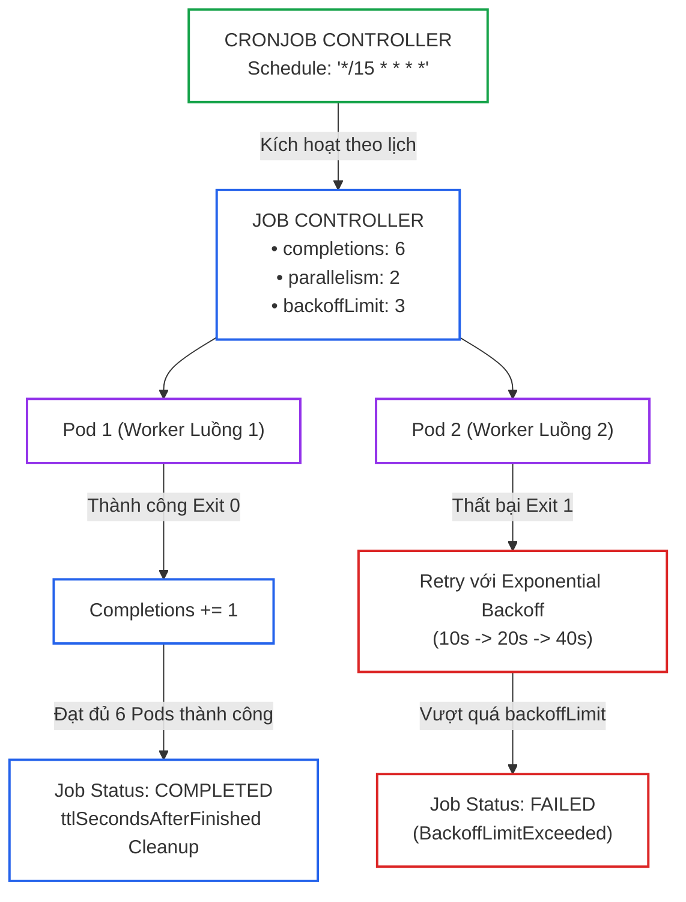
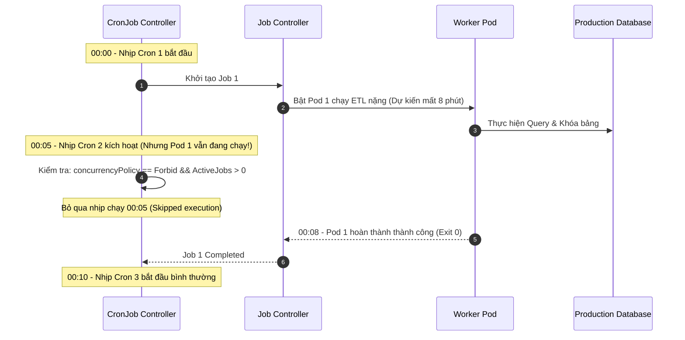
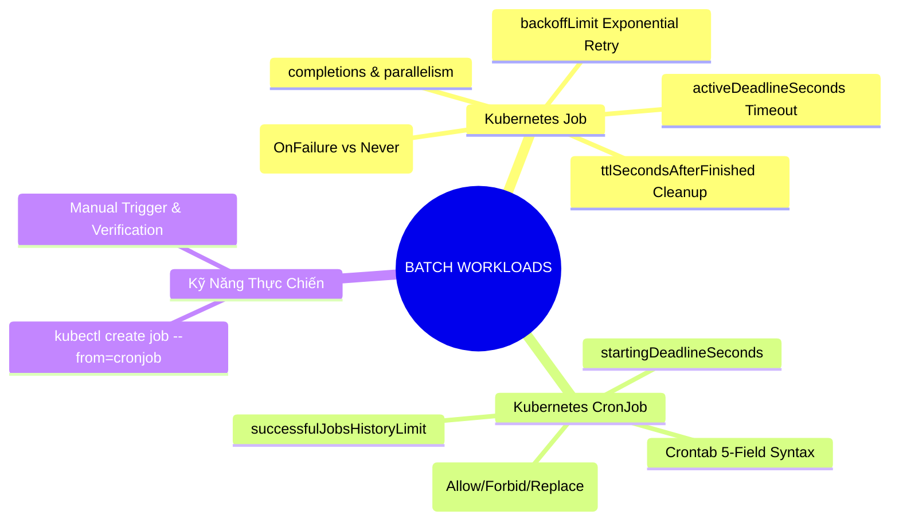


> [!IMPORTANT]
> **Mục tiêu kỹ thuật cốt lõi**: Làm chủ các khối lượng công việc xử lý theo lô (**Batch Workloads**) thuộc miền **Application Design and Build (20%)** của kỳ thi CKAD. Thiết kế và tối ưu hóa **Kubernetes Job** với các cơ chế song song hóa (**Parallelism**), giới hạn số lần thử lại (**`backoffLimit`**), kiểm soát thời gian thực thi tối đa (**`activeDeadlineSeconds`**), và cấu hình **CronJob** định kỳ chuẩn xác với chính sách chống đụng độ (**`concurrencyPolicy`**).

---

## 1. Bản Chất Kiến Trúc & Tư Duy Cốt Lõi: Vòng Đời Tác Vụ Batch (Job & CronJob Controller)

Trong khi **Deployment / StatefulSet** được thiết kế để duy trì các dịch vụ chạy liên tục không ngừng nghỉ (Long-running Services như Web servers, API Gateways), thì **Job** và **CronJob** được thiết kế chuyên biệt cho các tác vụ có điểm kết thúc rõ ràng (**Run-to-completion Tasks** như sao lưu CSDL, gửi email hàng loạt, huấn luyện mô hình AI, xử lý tệp video).



### Các Tham Số Điều Phối Cốt Lõi Của Job:

1. **`spec.completions`**: Tổng số lượt Pod phải kết thúc thành công (Exit Code 0) để Job được coi là hoàn tất.
2. **`spec.parallelism`**: Số lượng Pod tối đa được phép chạy đồng thời tại một thời điểm.
3. **`spec.backoffLimit`**: Số lần tối đa cho phép Pod bị lỗi trước khi Job Controller đánh dấu toàn bộ Job là thất bại (mặc định là 6 lần, áp dụng thuật toán lùi thời gian theo cấp số nhân: 10s, 20s, 40s...).
4. **`spec.activeDeadlineSeconds`**: Hạn ngạch thời gian tối đa cho phép Job hoạt động tính từ lúc tạo. Nếu vượt quá ngưỡng này, toàn bộ các Pod đang chạy sẽ bị Kubelet tiêu diệt ngay lập tức.
5. **`spec.ttlSecondsAfterFinished`**: Thời gian (tính bằng giây) tự động xóa sạch đối tượng Job và toàn bộ các Pods liên quan sau khi Job đã hoàn thành (hoặc thất bại) nhằm giải phóng bộ nhớ etcd.

---

## 2. Bảng Ma Trận So Sánh Kỹ Thuật Toàn Diện (Engineering Matrix)

### Ma Trận 3 Chính Sách Xử Lý Đụng Độ CronJob (`concurrencyPolicy`)

| Chính Sách (`concurrencyPolicy`) | Hành Vi Khi Job Cũ Chưa Xong | Rủi Ro Quá Tải Cụm | Rủi Ro Dữ Liệu | Trường Hợp Khuyến Nghị Sử Dụng |
|---|---|---|---|---|
| **`Allow` (Mặc định)** | Khởi tạo ngay Job mới chạy song song với Job cũ | **Rất cao** (Nhiều job chạy chồng lấn làm cạn kiệt CPU/RAM) | Nguy cơ xung đột dữ liệu hoặc Race Condition | Tác vụ đọc độc lập, gửi notification không phụ thuộc nhau |
| **`Forbid`** | **Bỏ qua lượt chạy mới**, tiếp tục để Job cũ hoàn thành | **Rất thấp** (Luôn duy trì tối đa duy nhất 1 Job chạy) | An toàn tuyệt đối (Không bị xung đột dữ liệu) | Sao lưu database, quét bảo mật, tổng hợp báo cáo tài chính |
| **`Replace`** | **Hủy diệt ngay Job cũ** đang chạy dở và bật Job mới thay thế | **Trung bình** (Luôn duy trì 1 Job nhưng tốn công abort job cũ) | Dữ liệu job cũ có thể bị dở dang nếu không có rollback | Tác vụ làm mới bộ nhớ cache, đồng bộ dữ liệu thời gian thực |

### So Sánh `restartPolicy: Never` vs `restartPolicy: OnFailure`

| Tiêu Chí So Sánh | `restartPolicy: OnFailure` | `restartPolicy: Never` |
|---|---|---|
| **Hành Vi Khi Container Lỗi** | Kubelet khởi động lại container **ngay trên cùng Pod** đó | Kubelet **không restart container**, Job Controller **tạo Pod mới hoàn toàn** |
| **Số Lượng Pod Trong Cụm** | Duy trì số lượng Pod cố định, Pod có `RESTARTS > 0` | Số lượng Pod tăng dần theo số lần retry (`job-xxx-1`, `job-xxx-2`) |
| **Truy Vết Log Lỗi** | Khó hơn (cần dùng `kubectl logs --previous`) | Dễ dàng (mỗi lần crash là 1 Pod riêng biệt lưu giữ nguyên vẹn log) |
| **Gắn Kết Bộ Nhớ (Node Storage)** | Giữ nguyên dữ liệu trong `emptyDir` cục bộ của Pod | Mất dữ liệu `emptyDir` cũ vì Pod mới được schedule sang vị trí khác |

---

## 3. Kiến Trúc Môi Trường & Luồng Thực Thi Mẫu

### Luồng Điều Phối CronJob Tránh Xung Đột Dữ Liệu (`concurrencyPolicy: Forbid`)



### Manifest Mẫu CronJob Sản Xuất Chuẩn Mực

```yaml
# production-cronjob.yaml
apiVersion: batch/v1
kind: CronJob
metadata:
  name: daily-db-cleaner
  namespace: default
spec:
  # Chạy vào 02:00 sáng mỗi ngày
  schedule: "0 2 * * *"
  # Chỉ cho phép duy nhất 1 job chạy tại 1 thời điểm
  concurrencyPolicy: Forbid
  # Cho phép kích hoạt trễ tối đa 100 giây nếu cụm bận
  startingDeadlineSeconds: 100
  # Giữ lại lịch sử 3 jobs thành công và 1 job thất bại
  successfulJobsHistoryLimit: 3
  failedJobsHistoryLimit: 1
  jobTemplate:
    spec:
      # Tối đa 5 phút phải xong toàn bộ Job
      activeDeadlineSeconds: 300
      # Tối đa thử lại 2 lần nếu gặp lỗi
      backoffLimit: 2
      # Tự động dọn dẹp sạch sau khi hoàn tất 120s
      ttlSecondsAfterFinished: 120
      template:
        spec:
          restartPolicy: OnFailure
          containers:
          - name: cleaner
            image: postgres:16-alpine
            command: ["/bin/sh", "-c"]
            args:
            - "echo 'Cleaning expired sessions...' && sleep 10 && echo 'Done!'"
            resources:
              requests:
                cpu: 100m
                memory: 128Mi
              limits:
                cpu: 300m
                memory: 256Mi
```

---

## 4. Phân Tích Cạm Bẫy Thực Chiến: CronJob Chạy Chồng Lấn Gây Sập Cơ Sở Dữ Liệu

### Tình Huống Sự Cố: Tác Vụ ETL Chạy Lặp Mỗi 5 Phút Nhưng Mất 15 Phút Để Xử Lý

Một kỹ sư thiết lập CronJob chạy tác vụ tổng hợp dữ liệu giao dịch định kỳ 5 phút một lần (`*/5 * * * *`). Do không khai báo `concurrencyPolicy`, Kubernetes sử dụng giá trị mặc định là `Allow`. Vào giờ cao điểm, khối lượng dữ liệu tăng đột biến khiến mỗi lượt Job mất tới 15 phút mới hoàn thành. Hậu quả là sau 15 phút, có tới **4 Job chạy song song**, mở hàng trăm kết nối đồng thời và khóa bảng CSDL, làm sập toàn bộ hệ thống bán hàng trực tuyến.

### Hậu Quả & Log Lỗi Thực Tế:
```text
FATAL: remaining connection slots are reserved for non-replication superuser connections
ERROR: deadlock detected
DETAIL: Process 18492 waits for ExclusiveLock on relation "orders"; blocked by Process 18401.
[CRITICAL] Application database connection pool exhausted, HTTP 500 returned to clients.
```

### 5-Whys Root Cause Analysis:
1. **Tại sao CSDL bị cạn kiệt connection pool và deadlock?** Vì có quá nhiều tiến trình ETL của CronJob cùng chạy đồng thời và tranh chấp khóa trên bảng `orders`.
2. **Tại sao lại có nhiều tiến trình ETL chạy cùng lúc?** Vì CronJob kích hoạt lượt chạy mới mỗi 5 phút trong khi lượt chạy trước đó vẫn chưa kết thúc.
3. **Tại sao Kubernetes lại cho phép chạy chồng lấn?** Vì cấu hình CronJob không định nghĩa trường `concurrencyPolicy`, hệ thống tự áp dụng chính sách mặc định là `Allow`.
4. **Tại sao kỹ sư không cấu hình `concurrencyPolicy`?** Vì kỹ sư nghĩ rằng tác vụ chỉ mất 30 giây để hoàn thành và không lường trước trường hợp dữ liệu tăng đột biến vào giờ cao điểm.
5. **Gốc rễ vấn đề (Root Cause):** Thiếu tư duy thiết kế bảo vệ hệ thống: Không áp dụng nguyên tắc phòng thủ `concurrencyPolicy: Forbid` và không cấu hình `activeDeadlineSeconds` giới hạn thời gian chạy tối đa.

### Biện Pháp Khắc Phục Chuẩn:
```diff
--- a/cronjob.yaml
+++ b/cronjob.yaml
@@ -6,4 +6,6 @@
 spec:
   schedule: "*/5 * * * *"
+  # Khóa đụng độ: Bỏ qua nhịp mới nếu nhịp cũ chưa hoàn thành
+  concurrencyPolicy: Forbid
+  # Hạn ngạch tối đa: Tự động hủy nếu chạy quá 10 phút
+  jobTemplate:
+    spec:
+      activeDeadlineSeconds: 600
```

---

## 5. Hands-on Lab: Triển Khai Xử Lý Batch Đàn Hồi & CronJob (8 Bước)

| Bước | Mục Tiêu Kỹ Thuật | Lệnh / Manifest Kiểm Tra Chính |
|---|---|---|
| **1** | Khởi tạo Job đơn giản bằng câu lệnh Imperative CLI | `kubectl create job` |
| **2** | Cấu hình Job song song (`completions: 4`, `parallelism: 2`) | Manifest Job với `completions` & `parallelism` |
| **3** | Kiểm tra cơ chế chạy song song 2 luồng Pods | `kubectl get pods -w -l job-name=parallel-job` |
| **4** | Cấu hình cơ chế thử lại `backoffLimit` và `restartPolicy: Never` | Manifest Job gây lỗi giả lập |
| **5** | Khởi tạo CronJob chạy định kỳ với biểu thức crontab | `kubectl create cronjob` |
| **6** | Thiết lập chính sách chống đụng độ `concurrencyPolicy: Forbid` | Manifest CronJob |
| **7** | Tự động dọn dẹp Pods hoàn tất với `ttlSecondsAfterFinished` | Cấu hình `ttlSecondsAfterFinished: 60` |
| **8** | Quản lý và kiểm tra lịch sử Job qua CLI | `kubectl get cronjob,job,pod` |

---

### Bước 1: Tạo Job Đơn Giản Bằng Lệnh Imperative CLI

```bash
# Tạo Job tính toán số Pi với 2000 chữ số thập phân
kubectl create job pi-calculator \
  --image=perl:5.34 \
  -- perl -Mbignum=bpi -w -e 'print bpi(2000)'

# Theo dõi tiến trình Job
kubectl wait --for=condition=complete job/pi-calculator --timeout=60s
kubectl logs job/pi-calculator
```

---

### Bước 2: Cấu Hình Job Song Song (Parallel Batch Job)

```yaml
# parallel-job.yaml
apiVersion: batch/v1
kind: Job
metadata:
  name: parallel-workers
  namespace: default
spec:
  # Cần tổng cộng 4 lượt chạy thành công
  completions: 4
  # Chạy tối đa 2 Pods song song đồng thời
  parallelism: 2
  template:
    metadata:
      labels:
        app: batch-worker
    spec:
      restartPolicy: OnFailure
      containers:
      - name: worker
        image: busybox:1.36
        command: ["/bin/sh", "-c"]
        args:
        - "echo 'Worker ID:' $HOSTNAME 'bắt đầu xử lý lô hàng...' && sleep 4 && echo 'Hoàn tất thành công!'"
```
```bash
kubectl apply -f parallel-job.yaml
```

---

### Bước 3: Quan Sát Cơ Chế Song Song Của Job

```bash
# Quan sát: Luôn có 2 Pods chạy đồng thời, hoàn thành lần lượt 4 lượt
kubectl get pods -l job-name=parallel-workers -o wide
```

---

### Bước 4: Kiểm Thử Cơ Chế Thử Lại (BackoffLimit & Retry)

```yaml
# failing-job.yaml
apiVersion: batch/v1
kind: Job
metadata:
  name: retry-demo-job
  namespace: default
spec:
  # Chỉ cho phép thử lại tối đa 2 lần
  backoffLimit: 2
  template:
    spec:
      restartPolicy: Never
      containers:
      - name: buggy-app
        image: busybox:1.36
        command: ["/bin/sh", "-c"]
        args:
        - "echo 'Ứng dụng gặp lỗi nghiêm trọng!' && exit 1"
```
```bash
kubectl apply -f failing-job.yaml
sleep 15
kubectl describe job retry-demo-job
```
> Trạng thái hiển thị: `Pods Statuses: 0 Active / 0 Succeeded / 3 Failed` (1 lần đầu + 2 lần retry = 3 failed pods $\rightarrow$ Job FAILED).

---

### Bước 5: Khởi Tạo CronJob Bằng Imperative Generator

```bash
# Tạo CronJob chạy vào phút thứ 30 mỗi giờ
kubectl create cronjob hourly-report \
  --image=busybox:1.36 \
  --schedule="30 * * * *" \
  $do -- /bin/sh -c "echo Generating hourly report..." > cronjob-demo.yaml
```

---

### Bước 6: Cấu Hình `concurrencyPolicy: Forbid` và Hạn Chế Lịch Sử

```yaml
# robust-cronjob.yaml
apiVersion: batch/v1
kind: CronJob
metadata:
  name: secure-sync-cron
  namespace: default
spec:
  schedule: "*/1 * * * *"
  concurrencyPolicy: Forbid
  successfulJobsHistoryLimit: 2
  failedJobsHistoryLimit: 1
  jobTemplate:
    spec:
      activeDeadlineSeconds: 120
      ttlSecondsAfterFinished: 60
      template:
        spec:
          restartPolicy: OnFailure
          containers:
          - name: syncer
            image: busybox:1.36
            command: ["/bin/sh", "-c"]
            args:
            - "echo 'Đang đồng bộ dữ liệu an toàn...' && sleep 10"
```
```bash
kubectl apply -f robust-cronjob.yaml
```

---

### Bước 7: Kích Hoạt Thủ Công Một Job Từ CronJob

Trong thực tế hoặc phòng thi, bạn thường phải kiểm tra ngay CronJob mà không muốn chờ nhịp thời gian kế tiếp:

```bash
# Tạo thủ công 1 Job từ mẫu của CronJob
kubectl create job --from=cronjob/secure-sync-cron manual-test-run

# Kiểm tra log của Job vừa tạo thủ công
kubectl logs job/manual-test-run
```

---

### Bước 8: Kiểm Tra và Dọn Dẹp Tài Nguyên Batch

```bash
# Xem danh sách toàn bộ CronJobs và Jobs hiện có
kubectl get cronjob,job,pods -l 'app in (batch-worker)'
```

---

## 6. 10 Câu Hỏi Tự Kiểm Tra Chuyên Sâu (Self-Check Q&A Accordion)

<details class="qa-card">
<summary><b>1. Giá trị `restartPolicy: Always` có được chấp nhận trong Kubernetes Job không? Tại sao?</b></summary>
<div class="qa-answer">
<p><b>Hoàn toàn không được chấp nhận.</b> Kubernetes API Server sẽ trả về lỗi thẩm định (Validation Error) nếu bạn khai báo <code>restartPolicy: Always</code> trong Job. Bản chất của Job là tiến trình có điểm dừng (Run-to-completion). Nếu để <code>Always</code>, container khi chạy xong thành công (Exit 0) sẽ lập tức bị Kubelet bật lại vô tận, khiến Job không bao giờ đạt trạng thái hoàn thành.</p>
</div>
</details>

<details class="qa-card">
<summary><b>2. Sự khác biệt cốt lõi giữa `completions` và `parallelism` trong Job là gì?</b></summary>
<div class="qa-answer">
<p><b>completions</b> là <b>tổng số lượng Pod mục tiêu</b> phải chạy hoàn tất thành công (Exit 0) thì Job mới được tính là xong. <b>parallelism</b> là <b>số lượng Pod tối đa được phép chạy đồng thời</b> tại một thời điểm. Ví dụ: <code>completions: 10</code> và <code>parallelism: 2</code> có nghĩa là Job sẽ chạy tuần tự từng cặp 2 Pods một cho đến khi đủ 10 Pods thành công.</p>
</div>
</details>

<details class="qa-card">
<summary><b>3. Thuật toán Exponential Backoff hoạt động như thế nào khi một Pod trong Job bị thất bại?</b></summary>
<div class="qa-answer">
<p>Khi Pod bị lỗi, Job Controller sẽ trì hoãn việc tạo lại Pod với khoảng thời gian chờ tăng dần theo cấp số nhân: <b>10 giây, 20 giây, 40 giây, 80 giây, ... tối đa 6 phút</b>. Cơ chế này giúp giảm tải cho cụm và tránh làm nghẽn tài nguyên khi ứng dụng gặp lỗi lặp đi lặp lại.</p>
</div>
</details>

<details class="qa-card">
<summary><b>4. Khi cấu hình `concurrencyPolicy: Forbid`, điều gì sẽ xảy ra nếu nhịp chạy mới đến trong khi Job cũ vẫn đang xử lý?</b></summary>
<div class="qa-answer">
<p>CronJob Controller sẽ <b>bỏ qua hoàn toàn lượt chạy mới (Skip execution)</b>. Job cũ tiếp tục chạy bình thường cho đến khi xong. Lượt chạy tiếp theo sẽ được kích hoạt tại nhịp crontab kế tiếp nếu tại thời điểm đó không còn Job nào đang chạy.</p>
</div>
</details>

<details class="qa-card">
<summary><b>5. Trường `startingDeadlineSeconds` trong CronJob giải quyết vấn đề kỹ thuật gì?</b></summary>
<div class="qa-answer">
<p>Nếu cụm Kubernetes bị quá tải hoặc Controller Manager bị sập đúng vào thời điểm lịch Cron kích hoạt, Job có thể bị trễ nhịp. Trường <code>startingDeadlineSeconds</code> định nghĩa <b>thời gian ân hạn tối đa (tính bằng giây)</b> cho phép kích hoạt bù Job sau thời điểm hẹn giờ. Nếu thời gian trôi qua vượt quá hạn mức này, lượt chạy đó sẽ bị hủy bỏ.</p>
</div>
</details>

<details class="qa-card">
<summary><b>6. Làm thế nào để tự động dọn dẹp các Pod của Job đã hoàn thành mà không cần phải xóa thủ công bằng tay?</b></summary>
<div class="qa-answer">
<p>Sử dụng trường <code>spec.ttlSecondsAfterFinished: &lt;giây&gt;</code> (ví dụ: <code>ttlSecondsAfterFinished: 100</code>). Bộ điều khiển <b>TTL-after-finished Controller</b> của Kubernetes sẽ tự động xóa sạch Job và toàn bộ Pods liên quan sau khi Job kết thúc đúng 100 giây.</p>
</div>
</details>

<details class="qa-card">
<summary><b>7. Cú pháp lệnh kubectl nào giúp tạo ngay một Job từ một CronJob có sẵn trong phòng thi CKAD?</b></summary>
<div class="qa-answer">
<pre><code>kubectl create job &lt;job-name&gt; --from=cronjob/&lt;cronjob-name&gt;</code></pre>
</div>
</details>

<details class="qa-card">
<summary><b>8. Trường `activeDeadlineSeconds` trong Job hoạt động như thế nào khi hết giờ?</b></summary>
<div class="qa-answer">
<p>Ngay khi thời gian chạy của Job vượt quá giá trị <code>activeDeadlineSeconds</code>, Kubernetes sẽ lập tức <b>tiêu diệt toàn bộ các Pods đang chạy</b> của Job đó, đánh dấu Job ở trạng thái <code>Failed</code> với lý do <b>DeadlineExceeded</b> và không thực hiện thêm bất kỳ lần retry nào nữa.</p>
</div>
</details>

<details class="qa-card">
<summary><b>9. Làm thế nào để tạm dừng (pause/suspend) một CronJob mà không cần xóa nó khỏi cụm?</b></summary>
<div class="qa-answer">
<p>Cập nhật trường <code>spec.suspend: true</code> trong CronJob manifest:</p>
<pre><code>kubectl patch cronjob &lt;cronjob-name&gt; -p '{"spec":{"suspend":true}}'</code></pre>
</div>
</details>

<details class="qa-card">
<summary><b>10. 5 trường trong biểu thức Crontab của Kubernetes tương ứng với những đơn vị thời gian nào?</b></summary>
<div class="qa-answer">
<p>Thứ tự chuẩn từ trái sang phải:</p>
<div>1. <b>Phút (Minute):</b> 0 – 59</div>
<div>2. <b>Giờ (Hour):</b> 0 – 23</div>
<div>3. <b>Ngày trong tháng (Day of Month):</b> 1 – 31</div>
<div>4. <b>Tháng (Month):</b> 1 – 12</div>
<div>5. <b>Ngày trong tuần (Day of Week):</b> 0 – 6 (0 là Chủ Nhật)</div>
</div>
</details>

---

## 7. Tổng Kết & Lộ Trình Bài Học Tiếp Theo



Quản trị tác vụ batch và lập lịch CronJob chuẩn xác là kỹ năng không thể thiếu để xây dựng các hệ thống xử lý dữ liệu tự động, tối ưu tài nguyên và ngăn ngừa sự cố quá tải cụm.

> [!TIP]
> **Bài học tiếp theo**: Khám phá các chiến lược cập nhật ứng dụng không gián đoạn dịch vụ với **[Bài 05: Chiến Lược Triển Khai: RollingUpdate, Blue/Green & Canary Rollouts](ckad-05-05-trien-khai-va-chien-luoc-cap-nhat.html)**.

