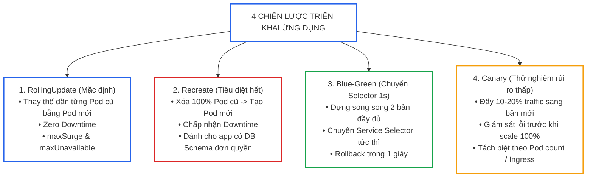
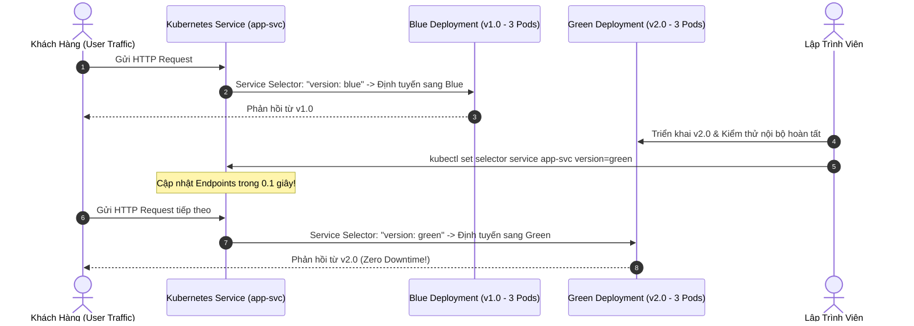
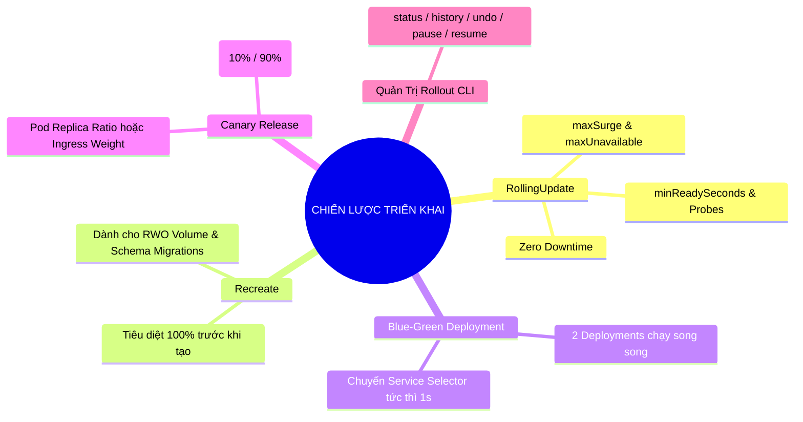


> [!IMPORTANT]
> **Mục tiêu kỹ thuật cốt lõi**: Nắm vững các chiến lược phát hành ứng dụng (**Application Deployment Strategies**) thuộc miền **Application Deployment (20%)** của kỳ thi CKAD. Cấu hình chính xác chiến lược **RollingUpdate** đảm bảo **Zero-Downtime** thông qua `maxSurge`, `maxUnavailable`, và `minReadySeconds`; triển khai thuần thục các kỹ thuật nâng cao **Blue-Green Deployment** và **Canary Release**; đồng thời làm chủ bộ công cụ CLI quản lý lịch sử và hoàn tác tức thì (**Rollout Undo / Rollback**).

---

## 1. Bản Chất Kiến Trúc & Tư Duy Cốt Lõi: 4 Chiến Lược Phát Hành Ứng Dụng Cloud-Native

Trong kỷ nguyên microservices, việc cập nhật phiên bản phần mềm phải diễn ra liên tục mà không được làm gián đoạn trải nghiệm của người dùng cuối. Kubernetes cung cấp các cơ chế điều phối Deployment linh hoạt giúp lập trình viên kiểm soát tuyệt đối vòng đời phát hành.



### Chi Tiết 4 Chiến Lược Phát Hành:

1. **RollingUpdate Strategy (Cập nhật xoay vòng)**:
   - *Cơ chế:* Kubernetes tạo ra một ReplicaSet mới (New RS) và dần dần tăng số bản sao Pod mới, đồng thời giảm số bản sao Pod cũ ở ReplicaSet cũ (Old RS) theo tỷ lệ được quy định bởi `maxSurge` và `maxUnavailable`.
   - *Đặc điểm:* Không có thời gian chết (Zero Downtime).
2. **Recreate Strategy (Tạo mới toàn bộ)**:
   - *Cơ chế:* Kubernetes giảm số bản sao của Old RS về 0 trước (tiêu diệt toàn bộ Pods v1), sau đó mới bắt đầu tăng số bản sao của New RS lên.
   - *Đặc điểm:* Có thời gian gián đoạn dịch vụ (Downtime). Thường bắt buộc khi hai phiên bản v1 và v2 không thể cùng kết nối vào một CSDL (xung đột Schema) hoặc volume lưu trữ loại `ReadWriteOnce`.
3. **Blue-Green Deployment (Xanh - Lam song song)**:
   - *Cơ chế:* Duy trì 2 Deployment độc lập (`app-blue` chạy v1 và `app-green` chạy v2). Một Service duy nhất trỏ tới `version: blue`. Khi v2 đã được kiểm thử toàn diện, ta chỉ cần sửa selector của Service trỏ sang `version: green`.
   - *Đặc điểm:* Chuyển đổi lưu lượng 100% trong 1 giây, rollback ngay lập tức nếu có sự cố.
4. **Canary Release (Phát hành thăm dò)**:
   - *Cơ chế:* Chạy đồng thời Deployment ổn định (ví dụ 9 replicas v1) và Deployment Canary (1 replica v2) cùng chia sẻ chung một Service selector. Khi đó, 10% lưu lượng ngẫu nhiên sẽ đi vào phiên bản v2 để thử nghiệm thực tế.

---

## 2. Bảng Ma Trận So Sánh Kỹ Thuật Toàn Diện (Engineering Matrix)

### Ma Trận Đánh Đổi Giữa Các Chiến Lược Triển Khai

| Tiêu Chí Kỹ Thuật | RollingUpdate | Recreate | Blue-Green Deployment | Canary Deployment |
|---|---|---|---|---|
| **Thời Gian Chết (Downtime)** | **0 giây (Zero Downtime)** | Có gián đoạn (Vài chục giây đến vài phút) | **0 giây (Zero Downtime)** | **0 giây (Zero Downtime)** |
| **Chi Phí Tài Nguyên Cụm** | Thấp (Chỉ tốn thêm `maxSurge` Pods) | Không tốn thêm tài nguyên | **Cao gấp đôi (200% RAM/CPU)** | Thấp (Chỉ tốn thêm 10–20% Pods) |
| **Tốc Độ Hoàn Tác (Rollback)** | Trung bình (Phải chờ xoay vòng Pods) | Chậm (Phải chờ xóa v2 tạo lại v1) | **Tức thì (1 giây qua CLI)** | Nhanh (Scale Canary về 0) |
| **Bán Kính Ảnh Hưởng (Blast Radius)** | Toàn bộ người dùng có thể gặp lỗi nếu v2 bug | Toàn bộ người dùng | Toàn bộ người dùng nếu v2 bug | **Rất nhỏ (Chỉ 10% user bị ảnh hưởng)** |
| **Độ Phức Tạp Vận Hành** | Thấp (Tự động hóa hoàn toàn) | Rất thấp | Trung bình (Quản lý 2 Deployments) | Trung bình đến cao (Cần theo dõi Metrics) |

### Công Thức Tính Toán `maxSurge` và `maxUnavailable` (Ví dụ với `replicas: 10`):

- **`maxSurge: 25%`** (hoặc `maxSurge: 2`): Số Pod tối đa có thể chạy trong lúc cập nhật là $10 + \lceil 10 \times 25\% \rceil = 13$ Pods.
- **`maxUnavailable: 25%`** (hoặc `maxUnavailable: 2`): Số Pod tối thiểu luôn luôn sẵn sàng phục vụ là $10 - \lfloor 10 \times 25\% \rfloor = 8$ Pods.
- **Chuẩn Zero-Downtime an toàn nhất**: Thiết lập `maxUnavailable: 0` và `maxSurge: 1` (Đảm bảo luôn luôn có ít nhất 100% dung lượng phục vụ).

---

## 3. Kiến Trúc Môi Trường & Luồng Thực Thi Mẫu

### Luồng Chuyển Đổi Tức Thì Của Blue-Green Deployment



### Manifest Mẫu Deployment RollingUpdate Chuẩn Mực

```yaml
# production-rollingupdate.yaml
apiVersion: apps/v1
kind: Deployment
metadata:
  name: web-store
  namespace: default
  labels:
    app: web-store
spec:
  replicas: 4
  # Giữ lại lịch sử tối đa 10 revisions để rollback
  revisionHistoryLimit: 10
  # Đợi 10 giây sau khi Pod Ready mới tính là chuyển sang Pod kế tiếp
  minReadySeconds: 10
  # Hạn ngạch tối đa 5 phút để hoàn tất rollout
  progressDeadlineSeconds: 300
  strategy:
    type: RollingUpdate
    rollingUpdate:
      maxSurge: 1
      maxUnavailable: 0
  selector:
    matchLabels:
      app: web-store
  template:
    metadata:
      labels:
        app: web-store
    spec:
      containers:
      - name: store-app
        image: nginx:1.24-alpine
        ports:
        - containerPort: 80
        resources:
          requests:
            cpu: 100m
            memory: 128Mi
          limits:
            cpu: 300m
            memory: 256Mi
        readinessProbe:
          httpGet:
            path: /
            port: 80
          initialDelaySeconds: 5
          periodSeconds: 3
```

---

## 4. Phân Tích Cạm Bẫy Thực Chiến: Rollout Phiên Bản Lỗi Làm Sập Toàn Bộ 100% Pods Đang Chạy

### Tình Huống Sự Cố: Cấu Hình `maxUnavailable: 100%` Khiến Toàn Bộ Dịch Vụ Biến Mất

Một lập trình viên muốn tăng tốc độ rollout nên đã cấu hình `maxUnavailable: 100%` và `maxSurge: 0` trong Deployment. Khi cập nhật sang image mới chứa lỗi cú pháp (`image: web:v2.0-broken`), Kubernetes lập tức tiêu diệt toàn bộ 10 Pods đang chạy ổn định của phiên bản cũ. Các Pods mới tạo ra đều bị rơi vào trạng thái `CrashLoopBackOff`. Kết quả là website bị sập hoàn toàn (100% Downtime).

### Hậu Quả & Log Lỗi Thực Tế:
```text
Events:
  Type     Reason        Age                From                   Message
  ----     ------        ----               ----                   -------
  Normal   ScalingReplicaSet 15s            deployment-controller  Scaled down replica set web-store-v1 to 0
  Normal   ScalingReplicaSet 15s            deployment-controller  Scaled up replica set web-store-v2 to 10
  Warning  FailedPostStart   5s (x10 over 12s) kubelet             Error: container failed to start
  Warning  BackOff           3s (x10 over 10s) kubelet             Back-off restarting failed container
[CRITICAL] 0/10 endpoints available in Service web-store-svc. HTTP 503 Service Unavailable.
```

### 5-Whys Root Cause Analysis:
1. **Tại sao website bị mất 100% lưu lượng?** Vì toàn bộ 10 Pods của phiên bản cũ bị xóa sạch trong khi 10 Pods mới đều bị crash.
2. **Tại sao Kubernetes lại xóa sạch 10 Pods cũ cùng lúc?** Vì Deployment được cấu hình `maxUnavailable: 100%`, cho phép tất cả các Pods hiện tại bị gián đoạn.
3. **Tại sao Kubernetes không đợi Pod mới chạy thành công rồi mới xóa Pod cũ?** Vì khi `maxSurge: 0`, hệ thống buộc phải xóa Pod cũ trước để có chỗ tạo Pod mới.
4. **Tại sao không phát hiện sớm lỗi của container mới?** Vì ứng dụng thiếu `readinessProbe` và không có cơ chế `minReadySeconds` để kiểm định độ ổn định của Pod mới trước khi tiếp tục rollout.
5. **Gốc rễ vấn đề (Root Cause):** Cấu hình chiến lược Deployment RollingUpdate sai lầm (`maxUnavailable` quá cao) và thiếu rào chắn kiểm tra sức khỏe ứng dụng trước khi chuyển đổi lưu lượng.

### Biện Pháp Khắc Phục Chuẩn:
```diff
--- a/deployment.yaml
+++ b/deployment.yaml
@@ -9,4 +9,4 @@
   strategy:
     type: RollingUpdate
     rollingUpdate:
-      maxUnavailable: 100%
-      maxSurge: 0
+      maxUnavailable: 0
+      maxSurge: 25%
```

---

## 5. Hands-on Lab: Triển Khai Trọn Vẹn 4 Chiến Lược Cập Nhật Ứng Dụng (8 Bước)

| Bước | Kịch Bản Triển Khai | Mục Tiêu Kỹ Thuật | Lệnh / Manifest Kiểm Tra Chính |
|---|---|---|---|
| **1** | Khởi tạo Deployment v1 (Nginx 1.24) | Dựng 4 bản sao Pods ổn định | `kubectl create deploy`, `maxUnavailable: 0` |
| **2** | Expose Service & Theo dõi Rollout | Tạo Service ClusterIP và mở luồng curl | `kubectl expose`, `while true; do curl; done` |
| **3** | Cập nhật Image lên Nginx 1.25 | Thực hiện RollingUpdate Zero-Downtime | `kubectl set image`, `kubectl rollout status` |
| **4** | Thử nghiệm Pause & Resume Rollout | Tạm dừng quá trình rollout giữa chừng để test | `kubectl rollout pause / resume` |
| **5** | Khôi phục khẩn cấp bằng Rollback | Quay lui về phiên bản cũ khi gặp sự cố | `kubectl rollout undo deployment/web-store` |
| **6** | Triển khai chiến lược Recreate | Tiêu diệt toàn bộ trước khi tạo mới | `strategy.type: Recreate` |
| **7** | Triển khai Blue-Green Deployment | Chuyển đổi Service Selector trong 1 giây | `kubectl set selector service` |
| **8** | Triển khai Canary Release (20% Traffic) | Chia tỷ lệ lưu lượng 1:4 qua Pod count | 2 Deployments chung nhãn Service |

---

### Bước 1: Khởi Tạo Deployment v1 Với RollingUpdate An Toàn

```bash
cat << 'EOF' | kubectl apply -f -
apiVersion: apps/v1
kind: Deployment
metadata:
  name: rolling-app
  namespace: default
  labels:
    app: rolling-app
spec:
  replicas: 4
  minReadySeconds: 5
  strategy:
    type: RollingUpdate
    rollingUpdate:
      maxSurge: 1
      maxUnavailable: 0
  selector:
    matchLabels:
      app: rolling-app
  template:
    metadata:
      labels:
        app: rolling-app
    spec:
      containers:
      - name: nginx
        image: nginx:1.24-alpine
        ports:
        - containerPort: 80
        readinessProbe:
          httpGet:
            path: /
            port: 80
          initialDelaySeconds: 2
          periodSeconds: 2
EOF
```

---

### Bước 2: Expose Service & Kiểm Tra Phục Vụ

```bash
# Tạo Service ClusterIP
kubectl expose deployment rolling-app --name=rolling-svc --port=80 --target-port=80

# Chạy một terminal test kiểm tra kết nối liên tục
kubectl run curl-client --image=curlimages/curl:8.7.1 --command -- /bin/sh -c "while true; do curl -s -I http://rolling-svc | head -n 1; sleep 0.5; done"
```

---

### Bước 3: Nâng Cấp Image & Quan Sát Tiến Trình Zero-Downtime

```bash
# Cập nhật image lên nginx:1.25-alpine
kubectl set image deployment/rolling-app nginx=nginx:1.25-alpine --record

# Quan sát tiến trình rollout xoay vòng từng Pod một
kubectl rollout status deployment/rolling-app
```
> Kết quả: Luồng curl ở Bước 2 duy trì 100% `HTTP/1.1 200 OK`, không có bất kỳ request nào bị lỗi.

---

### Bước 4: Thử Nghiệm Tạm Dừng (Pause) và Tiếp Tục (Resume) Rollout

```bash
# Nâng cấp image tiếp lên nginx:1.26-alpine
kubectl set image deployment/rolling-app nginx=nginx:1.26-alpine

# Tạm dừng ngay lập tức quá trình rollout
kubectl rollout pause deployment/rolling-app

# Kiểm tra trạng thái: Một số Pod chạy 1.25, một số Pod chạy 1.26
kubectl get pods -l app=rolling-app

# Cho phép rollout tiếp tục
kubectl rollout resume deployment/rolling-app
kubectl rollout status deployment/rolling-app
```

---

### Bước 5: Hoàn Tác (Rollback) Khẩn Cấp Về Phiên Bản Cũ

```bash
# Xem lịch sử các bản sửa đổi (Revisions)
kubectl rollout history deployment/rolling-app

# Hoàn tác về revision trước đó
kubectl rollout undo deployment/rolling-app

# Hoặc hoàn tác về một revision cụ thể (ví dụ revision 1)
kubectl rollout undo deployment/rolling-app --to-revision=1
```

---

### Bước 6: Thử Nghiệm Chiến Lược Recreate

```yaml
# recreate-demo.yaml
apiVersion: apps/v1
kind: Deployment
metadata:
  name: recreate-app
spec:
  replicas: 3
  strategy:
    type: Recreate
  selector:
    matchLabels:
      app: recreate-app
  template:
    metadata:
      labels:
        app: recreate-app
    spec:
      containers:
      - name: nginx
        image: nginx:1.24-alpine
```
```bash
kubectl apply -f recreate-demo.yaml
# Cập nhật image và quan sát 3 Pods cũ bị terminate hết trước khi Pod mới sinh ra
kubectl set image deployment/recreate-app nginx=nginx:1.25-alpine
kubectl get pods -w -l app=recreate-app
```

---

### Bước 7: Thực Hành Blue-Green Deployment Chuyển Đổi 1 Giây

```yaml
# blue-green.yaml
apiVersion: apps/v1
kind: Deployment
metadata:
  name: web-blue
spec:
  replicas: 3
  selector:
    matchLabels:
      app: my-web
      version: blue
  template:
    metadata:
      labels:
        app: my-web
        version: blue
    spec:
      containers:
      - name: web
        image: nginx:1.24-alpine
---
apiVersion: apps/v1
kind: Deployment
metadata:
  name: web-green
spec:
  replicas: 3
  selector:
    matchLabels:
      app: my-web
      version: green
  template:
    metadata:
      labels:
        app: my-web
        version: green
    spec:
      containers:
      - name: web
        image: nginx:1.25-alpine
---
apiVersion: v1
kind: Service
metadata:
  name: production-web-svc
spec:
  selector:
    app: my-web
    version: blue
  ports:
  - port: 80
    targetPort: 80
```
```bash
kubectl apply -f blue-green.yaml

# Kiểm tra: Service đang trỏ vào version blue
kubectl get endpoints production-web-svc

# THAO TÁC SWITCH DUY NHẤT TRONG 1 GIÂY: Chuyển sang version green
kubectl set selector service production-web-svc "app=my-web,version=green"

# Kiểm tra lại: Endpoints đã cập nhật tức thì sang các Pods của Green!
kubectl get endpoints production-web-svc
```

---

### Bước 8: Thực Hành Canary Release (Tỷ Lệ 1:4)

```yaml
# canary-release.yaml
apiVersion: apps/v1
kind: Deployment
metadata:
  name: app-stable
spec:
  replicas: 4
  selector:
    matchLabels:
      app: shop-api
  template:
    metadata:
      labels:
        app: shop-api
        track: stable
    spec:
      containers:
      - name: api
        image: nginx:1.24-alpine
---
apiVersion: apps/v1
kind: Deployment
metadata:
  name: app-canary
spec:
  replicas: 1
  selector:
    matchLabels:
      app: shop-api
  template:
    metadata:
      labels:
        app: shop-api
        track: canary
    spec:
      containers:
      - name: api
        image: nginx:1.25-alpine
---
apiVersion: v1
kind: Service
metadata:
  name: shop-api-svc
spec:
  # Service chỉ lọc theo app=shop-api -> Gom chung cả 4 Pods stable và 1 Pod canary (20% traffic)
  selector:
    app: shop-api
  ports:
  - port: 80
    targetPort: 80
```
```bash
kubectl apply -f canary-release.yaml
kubectl get pods -l app=shop-api -o wide
```

---

## 6. 10 Câu Hỏi Tự Kiểm Tra Chuyên Sâu (Self-Check Q&A Accordion)

<details class="qa-card">
<summary><b>1. Ý nghĩa của tham số `minReadySeconds` trong cấu hình Deployment là gì?</b></summary>
<div class="qa-answer">
<p><code>minReadySeconds</code> chỉ định <b>số giây tối thiểu mà một Pod mới tạo phải duy trì trạng thái Ready</b> (vượt qua tất cả các Probes mà không bị crash) trước khi Kubernetes đánh dấu Pod đó là hoàn toàn sẵn sàng và tiếp tục quy trình rollout các Pod tiếp theo. Điều này giúp ngăn chặn việc rollout quá nhanh khi ứng dụng bị crash sau vài giây khởi động.</p>
</div>
</details>

<details class="qa-card">
<summary><b>2. Làm thế nào để đảm bảo quá trình RollingUpdate không bao giờ làm giảm tổng số lượng Pod đang phục vụ người dùng?</b></summary>
<div class="qa-answer">
<p>Thiết lập tham số <code>maxUnavailable: 0</code> và <code>maxSurge: 1</code> (hoặc một tỷ lệ phần trăm như <code>25%</code>). Khi <code>maxUnavailable</code> bằng 0, Kubernetes sẽ <b>không bao giờ xóa bất kỳ Pod cũ nào</b> cho đến khi Pod mới đã khởi động thành công và đạt trạng thái Ready.</p>
</div>
</details>

<details class="qa-card">
<summary><b>3. Lệnh kubectl nào giúp theo dõi tiến trình Rollout trực tiếp trên dòng lệnh cho đến khi hoàn tất?</b></summary>
<div class="qa-answer">
<pre><code>kubectl rollout status deployment/&lt;deployment-name&gt;</code></pre>
</div>
</details>

<details class="qa-card">
<summary><b>4. Khi nào ta bắt buộc phải sử dụng chiến lược `Recreate` thay vì `RollingUpdate`?</b></summary>
<div class="qa-answer">
<p>Chiến lược <b>Recreate</b> bắt buộc trong 2 trường hợp chính:</p>
<div>1. <b>Ứng dụng gắn PersistentVolume chế độ ReadWriteOnce (RWO):</b> Hai Pod không thể cùng mount vào một ổ đĩa trên 2 node khác nhau tại cùng một thời điểm.</div>
<div>2. <b>Xung đột cấu trúc CSDL (Breaking Schema Migration):</b> Phiên bản cũ v1 và phiên bản mới v2 không thể cùng đọc/ghi đồng thời vào database.</div>
</div>
</details>

<details class="qa-card">
<summary><b>5. Sự khác biệt cốt lõi về mặt tài nguyên giữa RollingUpdate và Blue-Green Deployment là gì?</b></summary>
<div class="qa-answer">
<p><b>RollingUpdate</b> chỉ cần thêm một lượng nhỏ tài nguyên tạm thời tương ứng với <code>maxSurge</code> (khoảng 10–25% CPU/RAM). Trong khi đó, <b>Blue-Green Deployment</b> yêu cầu cụm phải có <b>gấp đôi tài nguyên (200% CPU/RAM)</b> để duy trì đồng thời cả 2 môi trường hoàn chỉnh trong suốt quá trình chuyển giao.</p>
</div>
</details>

<details class="qa-card">
<summary><b>6. Làm thế nào để quay lui (rollback) về đúng revision số 3 của một Deployment trong phòng thi CKAD?</b></summary>
<div class="qa-answer">
<pre><code>kubectl rollout undo deployment/&lt;deployment-name&gt; --to-revision=3</code></pre>
</div>
</details>

<details class="qa-card">
<summary><b>7. Cờ `--record` trong các lệnh `kubectl set image` hoặc `kubectl apply` có tác dụng gì?</b></summary>
<div class="qa-answer">
<p>Cờ <code>--record</code> lưu lại câu lệnh CLI chính xác đã thực thi vào trường <code>CHANGE-CAUSE</code> trong lịch sử rollout (<code>kubectl rollout history</code>), giúp người quản trị dễ dàng nhận biết phiên bản revision nào tương ứng với thay đổi nào.</p>
</div>
</details>

<details class="qa-card">
<summary><b>8. Trường `revisionHistoryLimit` trong Deployment có vai trò gì?</b></summary>
<div class="qa-answer">
<p>Trường <code>revisionHistoryLimit</code> quy định <b>số lượng ReplicaSets cũ tối đa được giữ lại</b> trong etcd (mặc định là 10). Các ReplicaSet cũ này có số lượng replica bằng 0 nhưng lưu giữ cấu hình Pod template để phục vụ cho thao tác rollback nhanh khi cần.</p>
</div>
</details>

<details class="qa-card">
<summary><b>9. Làm thế nào để triển khai Canary Release ở tầng Ingress thay vì chia tỷ lệ bằng số lượng Pods?</b></summary>
<div class="qa-answer">
<p>Tạo thêm một Ingress phụ trỏ vào Canary Service và gắn các annotation đặc biệt của Ingress Controller:</p>
<pre><code>nginx.ingress.kubernetes.io/canary: "true"
nginx.ingress.kubernetes.io/canary-weight: "10"</code></pre>
<p>Khi đó, Ingress Controller sẽ tự động điều phối đúng 10% lưu lượng HTTP sang Canary Service mà không phụ thuộc vào số lượng Pods.</p>
</div>
</details>

<details class="qa-card">
<summary><b>10. Điều gì xảy ra nếu quá trình Rollout bị treo và vượt quá `progressDeadlineSeconds`?</b></summary>
<div class="qa-answer">
<p>Kubernetes Deployment Controller sẽ đánh dấu điều kiện <b>Progressing = False</b> với lý do <code>ProgressDeadlineExceeded</code> trong trường <code>status.conditions</code>. Quá trình rollout sẽ dừng lại, không tiếp tục tạo thêm Pods mới, giúp cảnh báo cho hệ thống giám sát hoặc CI/CD pipeline tự động kích hoạt rollback.</p>
</div>
</details>

---

## 7. Tổng Kết & Lộ Trình Bài Học Tiếp Theo



Làm chủ các chiến lược phát hành ứng dụng giúp bạn tự tin triển khai các phiên bản tính năng mới liên tục mà không gây gián đoạn dịch vụ của doanh nghiệp.

> [!TIP]
> **Bài học tiếp theo**: Tìm hiểu cách đóng gói và quản lý ứng dụng dạng template chuẩn hóa với **[Bài 06: Đóng Gói & Quản Trị Ứng Dụng Bằng Helm Chart Cho Developer](ckad-06-06-helm-cho-nguoi-viet-ung-dung.html)**.

