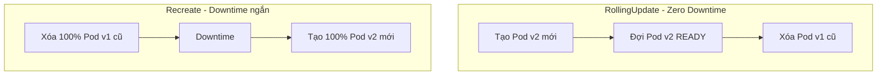
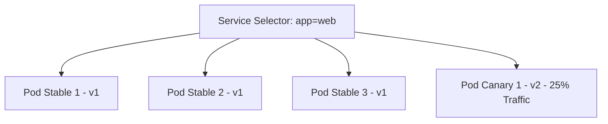
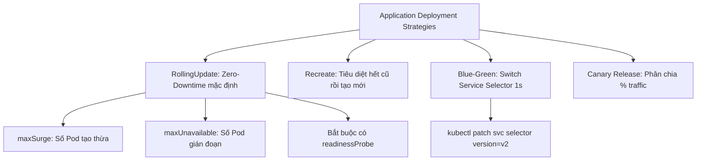
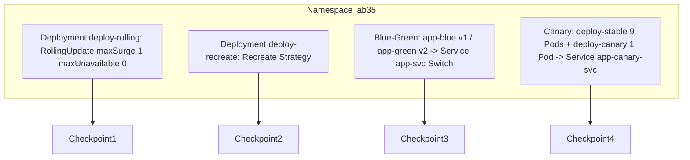


# [BÀI 05] CHIẾN LƯỢC TRIỂN KHAI ỨNG DỤNG: ROLLINGUPDATE, RECREATE, BLUE-GREEN DEPLOYMENT & CANARY RELEASES

Trong kỷ nguyên điện toán đám mây và kiến trúc microservices phân tán quy mô lớn, **Kubernetes (CKAD)** đóng vai trò là nền tảng điều phối container (Container Orchestration) tiêu chuẩn công nghiệp. Để làm chủ hệ thống trong môi trường sản xuất (Production) cũng như chinh phục kỳ thi chứng chỉ quốc tế của Linux Foundation / CNCF, kỹ sư không chỉ nắm vững các câu lệnh thao tác cơ bản mà phải thấu hiểu sâu sắc bản chất cơ chế tầng thấp: từ chu trình điều hòa (Reconciliation Loop), cấu trúc điều phối tài nguyên, kiến trúc mạng CNI, lưu trữ CSI cho đến các chuẩn mực an ninh phòng thủ chiều sâu.

Bài viết chuyên sâu này sẽ đồng hành cùng bạn giải mã toàn diện bức tranh kiến trúc, phân tích các đánh đổi kỹ thuật thực chiến (Engineering Trade-offs), cung cấp bài thực hành Lab từng bước và bộ câu hỏi phỏng vấn chuẩn Architect / Lead Engineer.

---

## 1. Bản Chất Kiến Trúc & Cơ Chế Vận Hành Tầng Thấp

| # | Câu hỏi ôn tập | Đáp án chuẩn ngắn gọn |
|---|---|---|
| 1 | Hai giá trị hợp lệ duy nhất của `restartPolicy` trong Kubernetes Job là gì? | **`Never`** hoặc **`OnFailure`** |
| 2 | Ý nghĩa trường `completions` và `parallelism` trong bản kê khai Job? | `completions` (tổng số lượt xong), `parallelism` (số luồng song song) |
| 3 | Cờ giới hạn số lần Kubelet thử lại khi Job bị lỗi có giá trị mặc định là bao nhiêu? | **`backoffLimit`** (mặc định bằng **6**) |
| 4 | Ba giá trị của `concurrencyPolicy` trong CronJob là gì? | **`Allow`**, **`Forbid`**, **`Replace`** |
| 5 | Cờ dọn dẹp lịch sử Pod thành công trong CronJob có tên là gì? | **`successfulJobsHistoryLimit: 3`** |


> **"Biết cách lựa chọn và triển khai thành thục các chiến lược cập nhật ứng dụng (Application Deployment Strategies) là nội dung chiếm 20 % trọng số miền Application Deployment trong CKAD, yêu cầu lập trình viên phân biệt rõ chiến lược `RollingUpdate` cập nhật xoay vòng không gián đoạn dịch vụ (với hai cờ `maxSurge` kiểm soát số Pod tạo thừa và `maxUnavailable` kiểm soát số Pod gián đoạn) với chiến lược `Recreate` tiêu diệt toàn bộ Pod cũ trước khi tạo mới; đồng thời việc làm chủ hai kỹ thuật nâng cao Blue-Green Deployment (chuyển nhãn selector của Service trong 1 giây) và Canary Deployment (chia tỷ lệ traffic theo số lượng bản sao Pod) giúp đảm bảo an toàn tuyệt đối khi phát hành tính năng mới trên cụm Production."**

**Kết quả từ các buổi trước được sử dụng lại:**

| Kết quả / Công cụ | Buổi + số hiệu `QT` | Dùng ở đâu trong buổi này |
|---|---|---|
| Triển khai Deployment, ReplicaSet và Rollout | Buổi 15 `QT 4.1` | Phát triển lên thành các chiến lược triển khai RollingUpdate/Recreate |
| Cơ chế định tuyến Service qua Pod Selector | Buổi 22 `QT 4.1` | Thực hiện kỹ thuật chuyển nhãn Blue-Green và chia traffic Canary |
| Tự động sinh YAML bằng cờ dry-run | Buổi 04 `QT 4.1` | Tạo nhanh khung YAML Deployment có chứa strategy spec |

---


| # | Kỹ năng thực hiện được | Hiện vật chứng minh |
|---|---|---|
| 1 | Phân biệt bản chất và trường hợp sử dụng của `RollingUpdate` so với `Recreate` | Bảng đối sánh mức độ gián đoạn dịch vụ và tính tương thích dữ liệu |
| 2 | Tính toán con số thực tế của `maxSurge` và `maxUnavailable` theo % hoặc số nguyên | Nhật ký số lượng Pod chạy trong suốt quá trình rollout |
| 3 | Thực hiện Blue-Green Deployment với thao tác chuyển selector Service trong 1 giây | Lệnh `kubectl set selector` cập nhật nhãn Service tức thì |
| 4 | Triển khai Canary Release phân chia tỷ lệ 10%/90% traffic qua Service | Danh sách Pod của 2 Deployment cùng chung nhãn Service |
| 5 | Làm chủ bộ lệnh CLI quản lý Rollout (`status`, `history`, `undo`, `pause`, `resume`) | Nhật ký rollback phiên bản lỗi về revision cũ thành công |

---


| Kiến thức tiên quyết | Nguồn tự học nếu thiếu |
|---|---|
| Quản lý Deployment, ReplicaSet và cập nhật image | Buổi 15 (`QT 4.1`) |
| Định tuyến Service qua cờ selector nhãn Pod | Buổi 22 (`QT 4.1`) |
| Kỹ thuật tạo khung YAML bằng cờ dry-run | Buổi 04 (`QT 4.1`) |

---


### 3.1. Thuật ngữ Việt–Anh

| # | Thuật ngữ tiếng Việt | Tiếng Anh tương đương | Ghi chú chuẩn hoá trong thân bài |
|---|---|---|---|
| 1 | Chiến lược triển khai | Deployment Strategy | Cách thức Kubernetes cập nhật phiên bản Pod mới |
| 2 | Cập nhật xoay vòng | `RollingUpdate` Strategy | Chiến lược thay thế Pod cũ bằng Pod mới không downtime |
| 3 | Tiêu diệt rồi tạo lại | `Recreate` Strategy | Tiêu diệt 100% Pod cũ rồi mới tạo toàn bộ Pod mới |
| 4 | Số lượng vượt quá tối đa | `maxSurge` | Số Pod được tạo thừa vượt quá `replicas` trong lúc rollout |
| 5 | Số lượng gián đoạn tối đa | `maxUnavailable` | Số Pod tối đa được phép dừng hoạt động trong lúc rollout |
| 6 | Triển khai Xanh-Lam | Blue-Green Deployment | Dựng song song 2 môi trường và chuyển Service selector trong 1s |
| 7 | Triển khai chim canary | Canary Deployment | Đẩy phiên bản mới cho % nhỏ người dùng thử nghiệm |
| 8 | Nhật ký lịch sử rollout | Rollout History (`kubectl rollout history`) | Danh sách các bản xem lại (revisions) của Deployment |
| 9 | Quay lui phiên bản | Rollback (`kubectl rollout undo`) | Phục hồi lại phiên bản Deployment ở revision cũ |
| 10 | Tạm dừng cập nhật | Pause Rollout (`kubectl rollout pause`) | Tạm dừng quá trình cập nhật để kiểm tra Pod mới |
| 11 | Tiếp tục cập nhật | Resume Rollout (`kubectl rollout resume`) | Tiếp tục quá trình cập nhật đang tạm dừng |
| 12 | Nhãn phiên bản | Version Label (`version: v1`, `app: web`) | Cặp Key-Value giúp Service chọn đúng Pod |
| 13 | Thời gian sẵn sàng tối thiểu | `minReadySeconds` | Số giây Pod phải `Running` trước khi tính là sẵn sàng |
| 14 | Hạn ngạch thời gian rollout | `progressDeadlineSeconds` | Thời gian tối đa cho phép rollout trước khi báo lỗi |


Mô hình Thay Cầu Thủ Bóng Đá: `RollingUpdate` giống như thay 1 cầu thủ mệt ra bằng 1 cầu thủ mới vào sân (trận đấu không dừng). `Recreate` giống như bắt toàn bộ 11 cầu thủ rời sân nghỉ 5 phút rồi mới cho 11 cầu thủ mới vào (trận đấu bị ngắt quãng). Blue-Green là dựng 2 sân bóng kế bên và bảo khán giả quay mặt sang sân bên kia xem. Canary là cho 10 khán giả sang xem thử sân mới trước.

---

### 1.1. Hai chiến lược cập nhật chính thức: RollingUpdate so với Recreate (12 phút)

**Nguyên lý cốt lõi:** Chiến lược `RollingUpdate` (mặc định) giúp cập nhật ứng dụng không gián đoạn dịch vụ (Zero-Downtime); chiến lược `Recreate` chấp nhận Downtime ngắn nhưng đảm bảo không bao giờ có 2 phiên bản code chạy song song.

**Giải thích cơ chế ngầm:** Với `RollingUpdate`, Kubernetes tạo từng Pod mới, đợi Pod mới sẵn sàng rồi mới xóa từng Pod cũ, đảm bảo người dùng luôn kết nối được. Với `Recreate`, Kubernetes tiêu diệt toàn bộ 100% Pod cũ trước khi tạo Pod mới, giúp tránh xung đột dữ liệu khi phiên bản v1 và v2 không tương thích cấu trúc database.

> [!WARNING]
> **CẠM BẪY THỰC CHIẾN:**
> Dùng `RollingUpdate` cho một ứng dụng có cấu trúc database bị thay đổi không tương thích ngược (Breaking Schema Change), làm phiên bản code v1 và v2 tranh chấp ghi đè hỏng dữ liệu DB.

**Minh hoạ.**



**Nguyên lý cốt lõi:** Khi sử dụng chiến lược `Recreate`, Kubernetes sẽ đặt số Pod của ReplicaSet cũ về 0 trước, sau đó mới tạo ReplicaSet mới; phù hợp cho ứng dụng không hỗ trợ tương thích ngược dữ liệu (Backward Incompatibility).

**Giải thích cơ chế ngầm:** Một số ứng dụng monolithic hoặc batch cũ yêu cầu độc quyền truy cập đĩa/database. Việc chạy 2 phiên bản song song trong quá trình rollout sẽ gây ra lỗi locked file hoặc duplicate key.

> [!WARNING]
> **CẠM BẪY THỰC CHIẾN:**
> Ứng dụng dính lỗi `Database Migration Locked` do 2 phiên bản code cùng cố gắng nâng cấp database schema đồng thời.

**Minh hoạ.**

```yaml
spec:
  strategy:
    type: Recreate # TIÊU DIỆT HẾT POD CŨ RỒI MỚI TẠO POD MỚI
```

---

### 1.2. Tính toán tham số maxSurge và maxUnavailable trong RollingUpdate (12 phút)

**Nguyên lý cốt lõi:** Tham số `maxSurge` (mặc định 25%) định nghĩa số lượng Pod tối đa được phép tạo thừa vượt quá con số `replicas` khai báo trong suốt quá trình rollout.

**Giải thích cơ chế ngầm:** Giúp đẩy nhanh tốc độ rollout bằng cách cho phép Kubernetes khởi tạo đồng thời nhiều Pod mới cùng lúc trước khi tiêu diệt các Pod cũ.

> [!WARNING]
> **CẠM BẪY THỰC CHIẾN:**
> Đặt `maxSurge` bằng 0 làm Kubernetes không thể tạo thừa bất kỳ Pod mới nào nếu không xóa bớt Pod cũ trước.

**Minh hoạ.**

```yaml
# Ví dụ: replicas = 4, maxSurge = 1 (hoặc 25%)
# Trong lúc rollout: Số Pod tối đa có thể xuất hiện là 4 + 1 = 5 Pods.
```

**Nguyên lý cốt lõi:** Tham số `maxUnavailable` (mặc định 25%) định nghĩa số lượng Pod tối đa được phép ở trạng thái không sẵn sàng (down) trong suốt quá trình rollout.

**Giải thích cơ chế ngầm:** Giúp bảo vệ năng lực phục vụ tối thiểu của cụm. Nếu đặt `maxUnavailable: 0`, Kubernetes sẽ không bao giờ tiêu diệt bất kỳ Pod cũ nào cho tới khi Pod mới tương ứng đã đạt trạng thái `READY`.

> [!WARNING]
> **CẠM BẪY THỰC CHIẾN:**
> Đặt `maxUnavailable: 100%` làm Deployment bị sập 100% số Pod ngay khi vừa bấm lệnh rollout, biến `RollingUpdate` thành `Recreate`.

**Minh hoạ.**

```yaml
# Ví dụ: replicas = 4, maxUnavailable = 0
# Trong lúc rollout: Luôn giữ ít nhất 4 - 0 = 4 Pods sẵn sàng phục vụ.
```

**Nguyên lý cốt lõi:** Tổng số Pod hoạt động tại bất kỳ thời điểm nào trong quá trình `RollingUpdate` nằm trong khoảng từ `(replicas - maxUnavailable)` đến `(replicas + maxSurge)`.

**Giải thích cơ chế ngầm:** Đây là công thức toán học cốt lõi giúp kỹ sư thiết kế dung lượng RAM/CPU dự phòng trên Worker Node trong quá trình rollout.

> [!WARNING]
> **CẠM BẪY THỰC CHIẾN:**
> Node bị thiếu RAM trong lúc rollout do không tính tới con số `maxSurge` làm các Pod mới tạo bị OOMKilled.

**Minh hoạ.**

```yaml
# replicas = 10, maxSurge = 2, maxUnavailable = 1
# Số Pod hoạt động luôn nằm trong khoảng: (10 - 1) = 9 đến (10 + 2) = 12 Pods.
spec:
  strategy:
    type: RollingUpdate
    rollingUpdate:
      maxSurge: 2
      maxUnavailable: 1
```

---

### 1.3. Kỹ thuật triển khai nâng cao: Blue-Green Deployment và Canary Release bằng Service (10 phút)

**Nguyên lý cốt lõi:** Để thực hiện Blue-Green Deployment, dựng 2 Deployment độc lập (`app-blue` có nhãn `version: v1` và `app-green` có nhãn `version: v2`); switch toàn bộ traffic bằng cách đổi `spec.selector` của Service từ `version: v1` sang `version: v2`.

**Giải thích cơ chế ngầm:** Giúp chuyển đổi 100% lượng người dùng sang phiên bản mới chỉ trong vòng 1 giây. Nếu phiên bản `green` có lỗi, chỉ cần 1 câu lệnh gõ lại selector về `version: v1` để rollback tức thì trong 1 giây mà không mất thời gian đợi Kubelet kéo lại ảnh.

> [!WARNING]
> **CẠM BẪY THỰC CHIẾN:**
> Cố gắng sửa trực tiếp image của Deployment Blue làm mất đi môi trường chạy độc lập của Blue-Green.

**Minh hoạ.**

```bash
# Switch traffic sang Green phiên bản v2 trong 1 giây:
kubectl patch svc app-svc -p '{"spec":{"selector":{"app":"web","version":"v2"}}}'
```

**Nguyên lý cốt lõi:** Để thực hiện Canary Deployment bằng Kubernetes gốc, giữ 2 Deployment (`app-stable` 9 replicas và `app-canary` 1 replica) cùng chung nhãn `app: web` để Service tự phân chia 10 % traffic vào bản canary.

**Giải thích cơ chế ngầm:** Kubernetes Service phân chia traffic theo thuật toán Round-Robin dựa trên danh sách Endpoints Pod có cùng nhãn selector. Việc điều chỉnh số lượng bản sao Pod giữa 2 Deployment giúp chia tỷ lệ lưu lượng người dùng thử nghiệm an toàn.

> [!WARNING]
> **CẠM BẪY THỰC CHIẾN:**
> Đặt nhãn selector của Service khác nhau làm Service không thể load balance chung giữa Stable và Canary.

**Minh hoạ.**



**Nguyên lý cốt lõi:** Khi quá trình Rollout dính lỗi (như ảnh container bị CrashLoopBackOff), chạy lệnh `kubectl rollout undo deployment/<name>` để ngay lập tức khôi phục hệ thống về phiên bản ổn định trước đó.

**Giải thích cơ chế ngầm:** Lệnh `kubectl rollout undo` ra lệnh cho Deployment Controller hủy bỏ ReplicaSet lỗi mới tạo và khôi phục số lượng Pod của ReplicaSet cũ lên mức ban đầu.

> [!WARNING]
> **CẠM BẪY THỰC CHIẾN:**
> Cuống cuồng mở `vim` sửa tệp YAML trong lúc hệ thống Production đang bị CrashLoopBackOff.

**Minh hoạ.**

```bash
# Phục hồi khẩn cấp về phiên bản cũ:
kubectl rollout undo deployment/web-deploy

# Xem lịch sử các bản rollout:
kubectl rollout history deployment/web-deploy
```

---

### 1.4. Đưa vào cụm thật (4 phút)

**Nguyên lý cốt lõi:** Mọi Deployment Production sử dụng `RollingUpdate` bắt buộc phải đi kèm với `readinessProbe` chuẩn xác; nếu không có readinessProbe, `RollingUpdate` sẽ coi Pod mới vừa tạo là sẵn sàng và tiêu diệt ngay Pod cũ gây ra gián đoạn dịch vụ.

**Giải thích cơ chế ngầm:** Kubelet chỉ dựa vào mốc `READY` của Pod để quyết định chuyển bước tiếp theo trong `RollingUpdate`. Nếu không có `readinessProbe`, Pod mới vừa bật lên (chưa kịp nạp code/cache) đã bị coi là `READY`, Kubelet liền tiêu diệt Pod cũ làm người dùng nhận lỗi 502.

> [!WARNING]
> **CẠM BẪY THỰC CHIẾN:**
> Thực hiện `RollingUpdate` nhưng người dùng vẫn bị rớt kết nối do Pod mới chưa kịp nạp xong dữ liệu khởi động.

**Minh hoạ.**

```yaml
# Ví dụ khai báo chuẩn readinessProbe bắt buộc đi kèm RollingUpdate
spec:
  template:
    spec:
      containers:
        - name: web
          image: nginx:1.24-alpine
          readinessProbe:
            httpGet:
              path: /
              port: 80
            initialDelaySeconds: 3
            periodSeconds: 3
```

**Áp vào cụm đang chạy thì làm gì trước:**
1. Kiểm tra tất cả các tệp YAML Deployment và bổ sung khối `readinessProbe`.
2. Thiết lập `maxUnavailable: 0` cho các dịch vụ yêu cầu Zero-Downtime nghiêm ngặt.
3. Thiết lập cờ `progressDeadlineSeconds: 600` để tự động báo lỗi nếu rollout kẹt quá 10 phút.

**Cái gì hỏng nếu áp thẳng lên prod:**
- Đặt `maxSurge` quá lớn (ví dụ 100%) trên cụm thiếu tài nguyên sẽ khiến các Pod mới bị kẹt ở trạng thái `Pending` do không đủ CPU/RAM.

**Đo trước — đo sau:**
- Đo tỷ lệ lỗi 5xx của HTTP traffic trong suốt quá trình `RollingUpdate` (mục tiêu 0% lỗi).
- Đo thời gian hoàn thành quá trình Rollout từ lúc gõ lệnh đến khi `kubectl rollout status` báo thành công.

**Khi nào KHÔNG nên dùng:**
- Không dùng `RollingUpdate` cho các ứng dụng Stateful (như Database Master/Slave) mà nên chuyển sang dùng StatefulSet với chiến lược `OnDelete`.

---

### 1.5. Bẫy hay gặp (2 phút)

| Bẫy hay gặp | Vì sao dính | Làm đúng là |
|---|---|---|
| 1. Quên `readinessProbe` làm `RollingUpdate` bị downtime | Kubelet tưởng Pod mới sẵn sàng ngay khi vừa container start | Luôn khai báo `readinessProbe` cho mọi Deployment |
| 2. Đặt `maxUnavailable: 100%` biến thành Recreate | Không hiểu ý nghĩa của cờ maxUnavailable | Đặt `maxUnavailable: 0` hoặc `25%` |
| 3. Đặt `maxSurge: 0` và `maxUnavailable: 0` cùng lúc | Sai logic toán học Kubernetes | Luôn đảm bảo ít nhất 1 trong 2 cờ khác 0 |
| 4. Dùng `RollingUpdate` cho ứng dụng dính breaking DB change | Làm 2 phiên bản code v1 và v2 tranh chấp ghi DB | Chuyển sang chiến lược `Recreate` hoặc `Blue-Green` |
| 5. Nhầm lẫn nhãn selector khi làm Blue-Green | Đặt tên nhãn selector của Service trùng với cả 2 deploy | Service chỉ chọn `version: v1` (Blue) hoặc `v2` (Green) |
| 6. Nhầm lẫn nhãn selector khi làm Canary | Đặt nhãn selector của Service khác nhau | Cả 2 Deployment Stable và Canary phải CÙNG NHÃN `app: web` |
| 7. Quên cờ `revision` khi xem lịch sử rollout | Gõ `kubectl rollout history` nhưng không thấy chi tiết change | Thêm `--revision=2` để xem chi tiết từng bản revision |
| 8. Sa lầy sửa file YAML khi rollout bị lỗi CrashLoop | Tâm lý muốn sửa code ngay lập tức | Chạy ngay `kubectl rollout undo` khôi phục hệ thống trước |
| 9. Node bị hết RAM do `maxSurge` quá lớn | Tạo thừa quá nhiều Pod mới cùng lúc | Đặt `maxSurge: 25%` hoặc `1` |
| 10. `kubectl set image` gõ sai tên container spec | Nhầm tên container spec với tên image | Kiểm tra tên container trong spec qua `kubectl get deploy` |
| 11. Bị kẹt rollout do ảnh gõ sai tên (ImagePullBackOff) | Gõ sai tag ảnh mới | Rollback bằng `kubectl rollout undo` và sửa lại tag ảnh |
| 12. Quên cờ `-n <namespace>` khi thao tác rollout | Thao tác nhầm trên Namespace `default` | Luôn kiểm tra `-n <ns>` chỉ định ở đề bài CKAD |

---

### 1.6. Tóm tắt (2 phút)



**Năm điều phải nhớ:**
1. **`RollingUpdate` vs `Recreate`**: `RollingUpdate` không downtime, `Recreate` diệt 100% cũ trước khi tạo mới.
2. **`maxSurge` & `maxUnavailable`**: Công thức tính giới hạn số Pod tạo thừa và Pod bị down trong lúc rollout.
3. **Bắt buộc có `readinessProbe`**: Điều kiện tiên quyết để `RollingUpdate` chạy không rớt request.
4. **Blue-Green 1 giây**: Đổi selector nhãn `version` trên Service để chuyển toàn bộ traffic trong 1s.
5. **Rollback thần tốc**: Dùng `kubectl rollout undo deployment/<name>` để khôi phục khi gặp sự cố.

---

## §10. Câu hỏi tự kiểm tra (5 phút)


<div class="qa-answer">
  <div class="qa-answer-header">
    <svg width="14" height="14" fill="none" stroke="currentColor" stroke-width="2" viewBox="0 0 24 24"><path d="M22 11.08V12a10 10 0 1 1-5.93-9.14"></path><polyline points="22 4 12 14.01 9 11.01"></polyline></svg>
    <span>Phân Tích &amp; Lời Giải Kỹ Thuật</span>
  </div>
  
Chiến lược <code>RollingUpdate</code>.
</div>
</details>

<div class="qa-answer">
  <div class="qa-answer-header">
    <svg width="14" height="14" fill="none" stroke="currentColor" stroke-width="2" viewBox="0 0 24 24"><path d="M22 11.08V12a10 10 0 1 1-5.93-9.14"></path><polyline points="22 4 12 14.01 9 11.01"></polyline></svg>
    <span>Phân Tích &amp; Lời Giải Kỹ Thuật</span>
  </div>
  
<code>RollingUpdate</code> đảm bảo không gián đoạn dịch vụ (Zero-Downtime), <code>Recreate</code> gây ra Downtime ngắn do tiêu diệt 100% Pod cũ trước.
</div>
</details>

<div class="qa-answer">
  <div class="qa-answer-header">
    <svg width="14" height="14" fill="none" stroke="currentColor" stroke-width="2" viewBox="0 0 24 24"><path d="M22 11.08V12a10 10 0 1 1-5.93-9.14"></path><polyline points="22 4 12 14.01 9 11.01"></polyline></svg>
    <span>Phân Tích &amp; Lời Giải Kỹ Thuật</span>
  </div>
  
Định nghĩa số lượng Pod tối đa được phép tạo thừa vượt quá con số <code>replicas</code> trong suốt quá trình rollout.
</div>
</details>

<div class="qa-answer">
  <div class="qa-answer-header">
    <svg width="14" height="14" fill="none" stroke="currentColor" stroke-width="2" viewBox="0 0 24 24"><path d="M22 11.08V12a10 10 0 1 1-5.93-9.14"></path><polyline points="22 4 12 14.01 9 11.01"></polyline></svg>
    <span>Phân Tích &amp; Lời Giải Kỹ Thuật</span>
  </div>
  
Định nghĩa số lượng Pod tối đa được phép ở trạng thái không sẵn sàng (down) trong suốt quá trình rollout.
</div>
</details>

<div class="qa-answer">
  <div class="qa-answer-header">
    <svg width="14" height="14" fill="none" stroke="currentColor" stroke-width="2" viewBox="0 0 24 24"><path d="M22 11.08V12a10 10 0 1 1-5.93-9.14"></path><polyline points="22 4 12 14.01 9 11.01"></polyline></svg>
    <span>Phân Tích &amp; Lời Giải Kỹ Thuật</span>
  </div>
  
Kubelet sẽ coi Pod mới sẵn sàng ngay lập tức và tiêu diệt Pod cũ, gây ra lỗi rớt kết nối (502) cho người dùng.
</div>
</details>

<div class="qa-answer">
  <div class="qa-answer-header">
    <svg width="14" height="14" fill="none" stroke="currentColor" stroke-width="2" viewBox="0 0 24 24"><path d="M22 11.08V12a10 10 0 1 1-5.93-9.14"></path><polyline points="22 4 12 14.01 9 11.01"></polyline></svg>
    <span>Phân Tích &amp; Lời Giải Kỹ Thuật</span>
  </div>
  
Thay đổi trường <code>spec.selector</code> của Service (ví dụ đổi từ <code>version: v1</code> sang <code>version: v2</code>).
</div>
</details>

<div class="qa-answer">
  <div class="qa-answer-header">
    <svg width="14" height="14" fill="none" stroke="currentColor" stroke-width="2" viewBox="0 0 24 24"><path d="M22 11.08V12a10 10 0 1 1-5.93-9.14"></path><polyline points="22 4 12 14.01 9 11.01"></polyline></svg>
    <span>Phân Tích &amp; Lời Giải Kỹ Thuật</span>
  </div>
  
Dựa trên tỷ lệ số lượng bản sao Pod của 2 Deployment cùng mang chung nhãn selector của Service.
</div>
</details>

<div class="qa-answer">
  <div class="qa-answer-header">
    <svg width="14" height="14" fill="none" stroke="currentColor" stroke-width="2" viewBox="0 0 24 24"><path d="M22 11.08V12a10 10 0 1 1-5.93-9.14"></path><polyline points="22 4 12 14.01 9 11.01"></polyline></svg>
    <span>Phân Tích &amp; Lời Giải Kỹ Thuật</span>
  </div>
  
<code>kubectl rollout undo deployment/<deployment-name></code>.
</div>
</details>

<div class="qa-answer">
  <div class="qa-answer-header">
    <svg width="14" height="14" fill="none" stroke="currentColor" stroke-width="2" viewBox="0 0 24 24"><path d="M22 11.08V12a10 10 0 1 1-5.93-9.14"></path><polyline points="22 4 12 14.01 9 11.01"></polyline></svg>
    <span>Phân Tích &amp; Lời Giải Kỹ Thuật</span>
  </div>
  
<code>kubectl rollout pause deployment/<deployment-name></code>.
</div>
</details>

<div class="qa-answer">
  <div class="qa-answer-header">
    <svg width="14" height="14" fill="none" stroke="currentColor" stroke-width="2" viewBox="0 0 24 24"><path d="M22 11.08V12a10 10 0 1 1-5.93-9.14"></path><polyline points="22 4 12 14.01 9 11.01"></polyline></svg>
    <span>Phân Tích &amp; Lời Giải Kỹ Thuật</span>
  </div>
  
<code>kubectl rollout history deployment/<deployment-name></code>.
</div>
</details>

<div class="qa-answer">
  <div class="qa-answer-header">
    <svg width="14" height="14" fill="none" stroke="currentColor" stroke-width="2" viewBox="0 0 24 24"><path d="M22 11.08V12a10 10 0 1 1-5.93-9.14"></path><polyline points="22 4 12 14.01 9 11.01"></polyline></svg>
    <span>Phân Tích &amp; Lời Giải Kỹ Thuật</span>
  </div>
  
Tối đa 5 Pods (4 + 1).
</div>
</details>

<div class="qa-answer">
  <div class="qa-answer-header">
    <svg width="14" height="14" fill="none" stroke="currentColor" stroke-width="2" viewBox="0 0 24 24"><path d="M22 11.08V12a10 10 0 1 1-5.93-9.14"></path><polyline points="22 4 12 14.01 9 11.01"></polyline></svg>
    <span>Phân Tích &amp; Lời Giải Kỹ Thuật</span>
  </div>
  
<code>kubectl set image deployment/<deploy-name> <container-name>=<new-image></code>.
</div>
</details>

---

## §11. Tài liệu tham khảo

| Nguồn | Địa chỉ URL | Ghi chú |
|---|---|---|
| Kubernetes Deployment Strategies | `https://kubernetes.io/docs/concepts/workloads/controllers/deployment/#strategy` | Tài liệu chuẩn chiến lược Deployment |
| Managing Deployments Rollout | `https://kubernetes.io/docs/concepts/workloads/controllers/deployment/#rolling-back-a-deployment` | Tài liệu quản lý Rollout & Undo |


---

## 2. Hướng Dẫn Thực Hành & Triển Khai Lab Chuẩn Production

> [!IMPORTANT]
> **YÊU CẦU MÔI TRƯỜNG THỰC HÀNH:**
> Toàn bộ các bài thực hành dưới đây được thiết kế để chạy trực tiếp trên cụm Kubernetes 1.30+ tiêu chuẩn (hoặc cụm kind/kubeadm lab). Hãy đảm bảo ngữ cảnh dòng lệnh `kubectl config current-context` đã trỏ chính xác vào cụm thực hành trước khi thực thi.

## Khối thực hành — 120 phút

## L0. Mục tiêu thực hành và tiêu chí hoàn thành

| Mã tiêu chí | Nội dung tiêu chí | Lệnh kiểm chứng | Kết quả kỳ vọng |
|---|---|---|---|
| TH1 | Tạo Namespace `lab35` phục vụ thực hành Deployment Strategies | `kubectl get ns lab35 -o jsonpath='{.status.phase}'` | In ra `Active` |
| TH2 | Triển khai Deployment `deploy-rolling` 4 replicas | `kubectl get deploy deploy-rolling -n lab35 -o jsonpath='{.spec.replicas}'` | In ra `4` |
| TH3 | Cấu hình `maxSurge: 1` và `maxUnavailable: 0` cho `deploy-rolling` | `kubectl get deploy deploy-rolling -n lab35 -o jsonpath='{.spec.strategy.rollingUpdate.maxUnavailable}'` | In ra `0` |
| TH4 | Thực hiện cập nhật ảnh `deploy-rolling` lên `nginx:1.25-alpine` | `kubectl get deploy deploy-rolling -n lab35 -o jsonpath='{.spec.template.spec.containers[0].image}'` | In ra `nginx:1.25-alpine` |
| TH5 | Biên soạn Deployment `deploy-recreate` có `strategy.type: Recreate` | `kubectl get deploy deploy-recreate -n lab35 -o jsonpath='{.spec.strategy.type}'` | In ra `Recreate` |
| TH6 | Kiểm tra Deployment `deploy-recreate` ở trạng thái sẵn sàng | `kubectl get deploy deploy-recreate -n lab35 -o jsonpath='{.status.readyReplicas}'` | In ra `2` |
| TH7 | Tạo Deployment Blue `app-blue` (`version: v1`) | `kubectl get deploy app-blue -n lab35 -o jsonpath='{.spec.template.metadata.labels.version}'` | In ra `v1` |
| TH8 | Tạo Deployment Green `app-green` (`version: v2`) | `kubectl get deploy app-green -n lab35 -o jsonpath='{.spec.template.metadata.labels.version}'` | In ra `v2` |
| TH9 | Tạo Service `app-svc` trỏ selector vào `version: v1` | `kubectl get svc app-svc -n lab35 -o jsonpath='{.spec.selector.version}'` | In ra `v1` |
| TH10 | Thực hiện switch selector của Service `app-svc` sang `version: v2` | `kubectl get svc app-svc -n lab35 -o jsonpath='{.spec.selector.version}'` | In ra `v2` |
| TH11 | Triển khai Canary Release với `deploy-canary` 1 replica | `kubectl get deploy deploy-canary -n lab35 -o jsonpath='{.spec.replicas}'` | In ra `1` |
| TH12 | Thực hiện lệnh `kubectl rollout undo` khôi phục `deploy-rolling` | `kubectl rollout history deploy deploy-rolling -n lab35` | In ra danh sách revision |
| TH13 | Dọn dẹp sạch sẽ tài nguyên lab35 | `test ! -f /tmp/lab35-deploy.yaml && echo "CLEAN"` | In ra `CLEAN` |

---

## L1. Điều kiện tiên quyết về môi trường

| Kiểm tra | Lệnh thực hiện | Kết quả kỳ vọng |
|---|---|---|
| Cụm Kubernetes ba node | `kubectl get nodes` | `cp-01`, `worker-01`, `worker-02` ở trạng thái `Ready` |
| Context đúng môi trường lab | `kubectl config current-context` | Đúng context cụm `kubeadm` |
| Quyền tạo tài nguyên | `kubectl auth can-i create deployment -n default` | In ra `yes` |

---

## L2. Kiến trúc bài lab Deployment Strategies và Rollout Management



---

## L3. Bước 1: Khởi tạo Namespace `lab35` (10 phút)

### Thao tác 1.1: Tạo Namespace

```bash
kubectl create namespace lab35
```

**CHECKPOINT 1 — Kiểm tra Namespace `lab35`.**

```bash
kubectl get ns lab35 -o jsonpath='{.status.phase}' | grep -qx Active && echo "CHECKPOINT 1 — ĐẠT" || echo "CHECKPOINT 1 — LỖI"
```

---

## L4. Bước 2: Triển khai Chiến lược `RollingUpdate` Zero-Downtime (25 phút)

### Thao tác 2.1: Biên soạn Deployment `deploy-rolling` với `maxSurge: 1` và `maxUnavailable: 0`

```bash
cat <<EOF | kubectl apply -f -
apiVersion: apps/v1
kind: Deployment
metadata:
  name: deploy-rolling
  namespace: lab35
spec:
  replicas: 4
  selector:
    matchLabels:
      app: rolling
  strategy:
    type: RollingUpdate
    rollingUpdate:
      maxSurge: 1
      maxUnavailable: 0
  template:
    metadata:
      labels:
        app: rolling
    spec:
      containers:
        - name: web
          image: nginx:1.24-alpine
          ports:
            - containerPort: 80
          readinessProbe:
            httpGet:
              path: /
              port: 80
            initialDelaySeconds: 2
            periodSeconds: 2
EOF
```

**CHECKPOINT 2 — Kiểm tra số replicas của `deploy-rolling`.**

```bash
kubectl get deploy deploy-rolling -n lab35 -o jsonpath='{.spec.replicas}' | grep -qx 4 && echo "CHECKPOINT 2 — ĐẠT" || echo "CHECKPOINT 2 — LỖI"
```

**CHECKPOINT 3 — Kiểm tra `maxUnavailable: 0`.**

```bash
kubectl get deploy deploy-rolling -n lab35 -o jsonpath='{.spec.strategy.rollingUpdate.maxUnavailable}' | grep -qx 0 && echo "CHECKPOINT 3 — ĐẠT" || echo "CHECKPOINT 3 — LỖI"
```

### Thao tác 2.2: Thực hiện cập nhật ảnh container lên `nginx:1.25-alpine`

```bash
kubectl set image deployment/deploy-rolling web=nginx:1.25-alpine -n lab35
kubectl rollout status deployment/deploy-rolling -n lab35
```

**CHECKPOINT 4 — Kiểm tra ảnh container mới `nginx:1.25-alpine`.**

```bash
kubectl get deploy deploy-rolling -n lab35 -o jsonpath='{.spec.template.spec.containers[0].image}' | grep -qx "nginx:1.25-alpine" && echo "CHECKPOINT 4 — ĐẠT" || echo "CHECKPOINT 4 — LỖI"
```

---

## L5. Bước 3: Triển khai Chiến lược `Recreate` (25 phút)

### Thao tác 3.1: Biên soạn Deployment `deploy-recreate`

```bash
cat <<EOF | kubectl apply -f -
apiVersion: apps/v1
kind: Deployment
metadata:
  name: deploy-recreate
  namespace: lab35
spec:
  replicas: 2
  selector:
    matchLabels:
      app: recreate
  strategy:
    type: Recreate
  template:
    metadata:
      labels:
        app: recreate
    spec:
      containers:
        - name: web
          image: nginx:1.24-alpine
EOF
```

**CHECKPOINT 5 — Kiểm tra thuộc tính `strategy.type: Recreate`.**

```bash
kubectl get deploy deploy-recreate -n lab35 -o jsonpath='{.spec.strategy.type}' | grep -qx Recreate && echo "CHECKPOINT 5 — ĐẠT" || echo "CHECKPOINT 5 — LỖI"
```

**CHECKPOINT 6 — Kiểm tra trạng thái `readyReplicas: 2`.**

```bash
sleep 5
kubectl get deploy deploy-recreate -n lab35 -o jsonpath='{.status.readyReplicas}' | grep -qx 2 && echo "CHECKPOINT 6 — ĐẠT" || echo "CHECKPOINT 6 — LỖI"
```

---

## L6. Bước 4: Thực hành Kỹ thuật Blue-Green Deployment (25 phút)

### Thao tác 4.1: Tạo 2 Deployment `app-blue` (v1) và `app-green` (v2)

```bash
cat <<EOF | kubectl apply -f -
apiVersion: apps/v1
kind: Deployment
metadata:
  name: app-blue
  namespace: lab35
spec:
  replicas: 2
  selector:
    matchLabels:
      app: bg-app
      version: v1
  template:
    metadata:
      labels:
        app: bg-app
        version: v1
    spec:
      containers:
        - name: web
          image: nginx:1.24-alpine
---
apiVersion: apps/v1
kind: Deployment
metadata:
  name: app-green
  namespace: lab35
spec:
  replicas: 2
  selector:
    matchLabels:
      app: bg-app
      version: v2
  template:
    metadata:
      labels:
        app: bg-app
        version: v2
    spec:
      containers:
        - name: web
          image: nginx:1.25-alpine
EOF
```

**CHECKPOINT 7 — Kiểm tra nhãn version của Deployment Blue `v1`.**

```bash
kubectl get deploy app-blue -n lab35 -o jsonpath='{.spec.template.metadata.labels.version}' | grep -qx v1 && echo "CHECKPOINT 7 — ĐẠT" || echo "CHECKPOINT 7 — LỖI"
```

**CHECKPOINT 8 — Kiểm tra nhãn version của Deployment Green `v2`.**

```bash
kubectl get deploy app-green -n lab35 -o jsonpath='{.spec.template.metadata.labels.version}' | grep -qx v2 && echo "CHECKPOINT 8 — ĐẠT" || echo "CHECKPOINT 8 — LỖI"
```

### Thao tác 4.2: Tạo Service `app-svc` trỏ selector vào `version: v1` và thực hiện Switch

```bash
cat <<EOF | kubectl apply -f -
apiVersion: v1
kind: Service
metadata:
  name: app-svc
  namespace: lab35
spec:
  selector:
    app: bg-app
    version: v1
  ports:
    - port: 80
      targetPort: 80
EOF
```

**CHECKPOINT 9 — Kiểm tra Service `app-svc` đang trỏ vào `version: v1`.**

```bash
kubectl get svc app-svc -n lab35 -o jsonpath='{.spec.selector.version}' | grep -qx v1 && echo "CHECKPOINT 9 — ĐẠT" || echo "CHECKPOINT 9 — LỖI"
```

### Thao tác 4.3: Thực hiện Switch Selector sang `version: v2` (Green) trong 1 giây

```bash
kubectl patch service app-svc -n lab35 -p '{"spec":{"selector":{"app":"bg-app","version":"v2"}}}'
```

**CHECKPOINT 10 — Kiểm tra Service `app-svc` đã switch sang `version: v2`.**

```bash
kubectl get svc app-svc -n lab35 -o jsonpath='{.spec.selector.version}' | grep -qx v2 && echo "CHECKPOINT 10 — ĐẠT" || echo "CHECKPOINT 10 — LỖI"
```

---

## L7. Bước 5: Triển khai Canary Release và Thao tác Rollback (25 phút)

### Thao tác 5.1: Biên soạn Deployment Canary `deploy-canary` 1 replica

```bash
cat <<EOF | kubectl apply -f -
apiVersion: apps/v1
kind: Deployment
metadata:
  name: deploy-canary
  namespace: lab35
spec:
  replicas: 1
  selector:
    matchLabels:
      app: rolling
      track: canary
  template:
    metadata:
      labels:
        app: rolling
        track: canary
    spec:
      containers:
        - name: web
          image: nginx:mainline-alpine
EOF
```

**CHECKPOINT 11 — Kiểm tra Canary Deployment 1 replica.**

```bash
kubectl get deploy deploy-canary -n lab35 -o jsonpath='{.spec.replicas}' | grep -qx 1 && echo "CHECKPOINT 11 — ĐẠT" || echo "CHECKPOINT 11 — LỖI"
```

### Thao tác 5.2: Thực hiện Lệnh Rollback `kubectl rollout undo`

```bash
kubectl rollout undo deployment/deploy-rolling -n lab35
kubectl rollout status deployment/deploy-rolling -n lab35
```

**CHECKPOINT 12 — Kiểm tra Lịch sử Rollout revision.**

```bash
kubectl rollout history deploy deploy-rolling -n lab35 | grep -q "REVISION" && echo "CHECKPOINT 12 — ĐẠT" || echo "CHECKPOINT 12 — LỖI"
```

---

## L8. Dọn dẹp môi trường (10 phút)

### Thao tác 8.1: Dọn dẹp tài nguyên lab35

```bash
kubectl delete namespace lab35
rm -f /tmp/lab35-deploy.yaml
```

**CHECKPOINT 13 — Kiểm tra dọn dẹp sạch sẽ.**

```bash
test ! -f /tmp/lab35-deploy.yaml && echo "CHECKPOINT 13 — ĐẠT" || echo "CHECKPOINT 13 — LỖI"
```

---

## L9. Xử lý sự cố thường gặp trong lab

| Triệu chứng lỗi | Nguyên nhân gốc rễ | Cách sửa triệt để |
|---|---|---|
| 1. `RollingUpdate` gây rớt request HTTP 502 | Thiếu cờ `readinessProbe` khiến Kubelet diệt Pod cũ quá sớm | Khai báo `readinessProbe` đầy đủ cho mọi Deployment |
| 2. Kẹt rollout ở trạng thái `Pending` | `maxSurge` quá lớn làm số Pod sinh thừa vượt quá RAM Node | Giảm `maxSurge` xuống 25% hoặc `1` |
| 3. Switch Blue-Green không ăn sang v2 | Gõ sai chữ hoa/thường ở nhãn selector của Service | Kiểm tra chính xác nhãn Pod qua `kubectl get pods --show-labels` |
| 4. Canary Deployment nhận 100% traffic | Selector Service bỏ sót nhãn chung `app: rolling` | Đảm bảo cả Stable và Canary có cùng nhãn `app: rolling` |
| 5. Lỗi `kubectl rollout undo` không hoạt động | Deployment chỉ mới ở revision 1 không có revision cũ để undo | Phải thực hiện cập nhật image ít nhất 1 lần mới có revision 2 |
| 6. Deployment `Recreate` gây rớt kết nối lâu | Thời gian pull ảnh mới quá lâu trên các Worker Node | Pre-pull ảnh mới về Node trước hoặc dùng ảnh alpine siêu nhẹ |
| 7. Cập nhật image không trigger rollout | Tag ảnh mới trùng với tag ảnh cũ (ví dụ cùng là `latest`) | Đổi tag ảnh cụ thể (như `v1` -> `v2`) để Kubelet nhận biết |
| 8. Lỗi syntax YAML trong khối `rollingUpdate` | Thụt lề `rollingUpdate:` sai cấp dưới `strategy:` | Thụt đúng 2 khoảng trắng dưới `strategy:` |
| 9. Pod kẹt `CrashLoopBackOff` khi rollout | Tag ảnh container mới bị lỗi bug code | Chạy ngay `kubectl rollout undo deployment/<name>` |
| 10. `maxUnavailable: 0` làm rollout diễn ra quá chậm | `maxSurge: 1` tạo từng Pod một nối tiếp nhau | Tăng `maxSurge: 2` để đẩy nhanh tốc độ tạo Pod mới |
| 11. Rollout bị pause vĩnh viễn | Ai đó đã chạy lệnh `kubectl rollout pause` trước đó | Chạy lệnh `kubectl rollout resume deployment/<name>` |
| 12. Quên cờ `-n lab35` khi xem rollout status | Xem trạng thái Deployment ở Namespace `default` | Thêm cờ `-n lab35` vào sau lệnh `kubectl rollout status` |
| 13. Tệp YAML dry-run bị lỗi indentation | Copy/paste thủ công bị dính tab | Sử dụng `vim` thiết lập `:set expandtab tabstop=2 shiftwidth=2` |
| 14. Lỗi `progressDeadlineSeconds` vượt quá mốc | Kubelet không thể pull ảnh mới trong thời gian giới hạn | Kiểm tra kết nối mạng registry hoặc kéo ảnh thủ công |

---

## L10. Bài tập mở rộng

- **BT1:** Thực hành cấu hình `maxSurge: 50%` và `maxUnavailable: 50%` cho Deployment 10 replicas và quan sát số Pod biến động.
- **BT2:** Viết script Bash tự động theo dõi và in ra số lượng Pod `READY` mỗi 1 giây trong quá trình `RollingUpdate`.
- **BT3:** Xây dựng mô hình Blue-Green Deployment hoàn chỉnh sử dụng Ingress Controller thay vì Service selector switch.
- **BT4:** Triển khai Canary Release với tỷ lệ 20% traffic và viết script test cURL kiểm tra tỷ lệ mã phản hồi HTTP trả về.
- **BT5:** Sử dụng lệnh `kubectl rollout history` kèm cờ `--revision=<N>` để xem chi tiết thông số của từng bản nâng cấp.
- **BT6:** Thử nghiệm việc tạm dừng rollout bằng `kubectl rollout pause` ngay sau khi 1 Pod mới vừa được tạo thành công.

---

## L11. Hiện vật nộp và tiêu chí chấm điểm

| Hạng mục hiện vật | Tiêu chí chấm điểm đạt | Thang điểm |
|---|---|---|
| Nhật ký 13 Checkpoint | Thực thi thành công 100 % các checkpoint in ra `ĐẠT` | 50 điểm |
| Bản kê khai RollingUpdate & Recreate | Cấu hình đúng strategy spec và maxSurge/maxUnavailable | 20 điểm |
| Thao tác Switch Blue-Green & Canary | Thực hiện đổi selector Service và Canary deploy thành công | 20 điểm |
| Báo cáo bài tập mở rộng | Trả lời đầy đủ câu hỏi BT1 và BT2 | 10 điểm |
| **Tổng điểm** | | **100 điểm** |


---

## 3. Bộ Câu Hỏi Vấn Đáp & Phỏng Vấn Kỹ Thuật Chuyên Sâu


## V1. Cách tiến hành

Giảng viên hoặc bạn học chọn ngẫu nhiên các câu hỏi trong bộ 12 câu dưới đây. Người trả lời phải trình bày mạch lạc trong 60–90 giây mỗi câu, đi thẳng vào cơ chế kỹ thuật và viện dẫn các lệnh CLI thực tế.

---

---

## V2. Bộ câu hỏi phỏng vấn thực chiến

<details class="qa-card">
<summary class="qa-summary">
  <div class="qa-summary-left">
    <span class="qa-num-badge">Q01</span>
    <span>Ý nghĩa của hai tham số <code>maxSurge</code> và <code>maxUnavailable</code> trong cấu hình chiến lược <code>RollingUpdate</code> là gì?</span>
  </div>
  <span class="qa-chevron">
    <svg width="18" height="18" fill="none" stroke="currentColor" stroke-width="2.5" viewBox="0 0 24 24"><polyline points="6 9 12 15 18 9"></polyline></svg>
  </span>
</summary>
<div class="qa-answer">
  <div class="qa-answer-header">
    <svg width="14" height="14" fill="none" stroke="currentColor" stroke-width="2" viewBox="0 0 24 24"><path d="M22 11.08V12a10 10 0 1 1-5.93-9.14"></path><polyline points="22 4 12 14.01 9 11.01"></polyline></svg>
    <span>Phân Tích &amp; Lời Giải Kỹ Thuật</span>
  </div>
  <div style="margin: 0.35rem 0; padding-left: 1rem; border-left: 2px solid var(--accent-primary);"><code>maxSurge</code> định nghĩa số lượng Pod tối đa được phép tạo thừa vượt quá <code>replicas</code> khai báo trong lúc rollout. <code>maxUnavailable</code> định nghĩa số lượng Pod tối đa được phép ở trạng thái không sẵn sàng (down) trong lúc rollout.</div>
  <div style="margin-top: 0.75rem;"><b style="color: var(--accent-primary);">Tiêu chí chấm điểm &amp; Phân tầng năng lực:</b></div>
  <div style="margin: 0.25rem 0; padding-left: 1rem; border-left: 2px solid var(--accent-primary);">• 0đ: Nhầm lẫn giữa maxSurge và maxUnavailable.</div>
  <div style="margin: 0.25rem 0; padding-left: 1rem; border-left: 2px solid var(--accent-primary);">• 1đ: Nêu được 1 trong 2 tham số.</div>
  <div style="margin: 0.25rem 0; padding-left: 1rem; border-left: 2px solid var(--accent-primary);">• 3đ: Trình bày chính xác cả 2 tham số kèm ý nghĩa kiểm soát dung lượng và tính sẵn sàng của cụm.</div>
  <div style="margin-top: 0.75rem; padding: 0.5rem 0.75rem; background: rgba(var(--accent-primary-rgb, 59, 130, 246), 0.08); border-radius: 4px;"><b style="color: var(--accent-primary);">Câu hỏi mở rộng / Đào sâu:</b> (Hai tham số này có thể khai báo ở những dạng đơn vị nào? — Khai báo ở dạng số nguyên cụ thể hoặc dạng phần trăm <code>%</code>).

---</div>
</div>
</details>

<details class="qa-card">
<summary class="qa-summary">
  <div class="qa-summary-left">
    <span class="qa-num-badge">Q02</span>
    <span>Tại sao cờ <code>readinessProbe</code> lại là yếu tố sống còn bắt buộc phải có khi triển khai chiến lược <code>RollingUpdate</code> Zero-Downtime?</span>
  </div>
  <span class="qa-chevron">
    <svg width="18" height="18" fill="none" stroke="currentColor" stroke-width="2.5" viewBox="0 0 24 24"><polyline points="6 9 12 15 18 9"></polyline></svg>
  </span>
</summary>
<div class="qa-answer">
  <div class="qa-answer-header">
    <svg width="14" height="14" fill="none" stroke="currentColor" stroke-width="2" viewBox="0 0 24 24"><path d="M22 11.08V12a10 10 0 1 1-5.93-9.14"></path><polyline points="22 4 12 14.01 9 11.01"></polyline></svg>
    <span>Phân Tích &amp; Lời Giải Kỹ Thuật</span>
  </div>
  <div style="margin: 0.35rem 0; padding-left: 1rem; border-left: 2px solid var(--accent-primary);">Vì Kubelet chỉ dựa vào trạng thái <code>READY</code> của Pod mới để quyết định chuyển sang tiêu diệt Pod cũ. Nếu không có <code>readinessProbe</code>, Pod mới vừa bật lên (chưa nạp xong code/cache) đã bị coi là <code>READY</code>, Kubelet liền diệt ngay Pod cũ khiến người dùng nhận lỗi HTTP 502/503.</div>
  <div style="margin-top: 0.75rem;"><b style="color: var(--accent-primary);">Tiêu chí chấm điểm &amp; Phân tầng năng lực:</b></div>
  <div style="margin: 0.25rem 0; padding-left: 1rem; border-left: 2px solid var(--accent-primary);">• 0đ: Không biết vai trò của readinessProbe trong RollingUpdate.</div>
  <div style="margin: 0.25rem 0; padding-left: 1rem; border-left: 2px solid var(--accent-primary);">• 1đ: Nêu được readinessProbe kiểm tra Pod sẵn sàng nhưng không giải thích được hậu quả diệt Pod cũ gây lỗi 502.</div>
  <div style="margin: 0.25rem 0; padding-left: 1rem; border-left: 2px solid var(--accent-primary);">• 3đ: Phân tích thấu đáo cơ chế Kubelet chuyển bước rollout dựa trên readinessProbe.</div>
  <div style="margin-top: 0.75rem; padding: 0.5rem 0.75rem; background: rgba(var(--accent-primary-rgb, 59, 130, 246), 0.08); border-radius: 4px;"><b style="color: var(--accent-primary);">Câu hỏi mở rộng / Đào sâu:</b> (Nếu <code>readinessProbe</code> của Pod mới bị fail liên tục thì quá trình <code>RollingUpdate</code> sẽ diễn ra thế nào? — Quá trình rollout bị kẹt dừng lại, các Pod cũ vẫn tiếp tục chạy phục vụ traffic).

---</div>
</div>
</details>

<details class="qa-card">
<summary class="qa-summary">
  <div class="qa-summary-left">
    <span class="qa-num-badge">Q03</span>
    <span>Công thức toán học tính số lượng Pod tối đa và tối thiểu có thể xuất hiện trên cụm trong suốt quá trình <code>RollingUpdate</code> là gì?</span>
  </div>
  <span class="qa-chevron">
    <svg width="18" height="18" fill="none" stroke="currentColor" stroke-width="2.5" viewBox="0 0 24 24"><polyline points="6 9 12 15 18 9"></polyline></svg>
  </span>
</summary>
<div class="qa-answer">
  <div class="qa-answer-header">
    <svg width="14" height="14" fill="none" stroke="currentColor" stroke-width="2" viewBox="0 0 24 24"><path d="M22 11.08V12a10 10 0 1 1-5.93-9.14"></path><polyline points="22 4 12 14.01 9 11.01"></polyline></svg>
    <span>Phân Tích &amp; Lời Giải Kỹ Thuật</span>
  </div>
  <div style="margin: 0.35rem 0; padding-left: 1rem; border-left: 2px solid var(--accent-primary);">Số Pod tối thiểu hoạt động là <code>(replicas - maxUnavailable)</code>. Số Pod tối đa hoạt động là <code>(replicas + maxSurge)</code>.</div>
  <div style="margin-top: 0.75rem;"><b style="color: var(--accent-primary);">Tiêu chí chấm điểm &amp; Phân tầng năng lực:</b></div>
  <div style="margin: 0.25rem 0; padding-left: 1rem; border-left: 2px solid var(--accent-primary);">• 0đ: Không nêu được công thức.</div>
  <div style="margin: 0.25rem 0; padding-left: 1rem; border-left: 2px solid var(--accent-primary);">• 1đ: Nêu đúng 1 trong 2 công thức.</div>
  <div style="margin: 0.25rem 0; padding-left: 1rem; border-left: 2px solid var(--accent-primary);">• 3đ: Trình bày chính xác cả 2 công thức tính dải biến động số lượng Pod trong lúc rollout.</div>
  <div style="margin-top: 0.75rem; padding: 0.5rem 0.75rem; background: rgba(var(--accent-primary-rgb, 59, 130, 246), 0.08); border-radius: 4px;"><b style="color: var(--accent-primary);">Câu hỏi mở rộng / Đào sâu:</b> (Nếu <code>replicas: 10</code>, <code>maxSurge: 2</code>, <code>maxUnavailable: 1</code> thì số Pod dao động trong khoảng nào? — Dao động từ 9 Pod đến 12 Pod).

---</div>
</div>
</details>

<details class="qa-card">
<summary class="qa-summary">
  <div class="qa-summary-left">
    <span class="qa-num-badge">Q04</span>
    <span>Mô hình Blue-Green Deployment được thực hiện như thế nào bằng tài nguyên Kubernetes gốc (Service và Deployment)?</span>
  </div>
  <span class="qa-chevron">
    <svg width="18" height="18" fill="none" stroke="currentColor" stroke-width="2.5" viewBox="0 0 24 24"><polyline points="6 9 12 15 18 9"></polyline></svg>
  </span>
</summary>
<div class="qa-answer">
  <div class="qa-answer-header">
    <svg width="14" height="14" fill="none" stroke="currentColor" stroke-width="2" viewBox="0 0 24 24"><path d="M22 11.08V12a10 10 0 1 1-5.93-9.14"></path><polyline points="22 4 12 14.01 9 11.01"></polyline></svg>
    <span>Phân Tích &amp; Lời Giải Kỹ Thuật</span>
  </div>
  <div style="margin: 0.35rem 0; padding-left: 1rem; border-left: 2px solid var(--accent-primary);">Dựng 2 Deployment độc lập (<code>app-blue</code> v1 và <code>app-green</code> v2). Tạo 1 Service định tuyến traffic qua Pod selector (ví dụ <code>version: v1</code>). Khi bản Green sẵn sàng 100%, thực hiện switch selector của Service sang <code>version: v2</code> để chuyển đổi toàn bộ traffic người dùng chỉ trong 1 giây.</div>
  <div style="margin-top: 0.75rem;"><b style="color: var(--accent-primary);">Tiêu chí chấm điểm &amp; Phân tầng năng lực:</b></div>
  <div style="margin: 0.25rem 0; padding-left: 1rem; border-left: 2px solid var(--accent-primary);">• 0đ: Không nêu được cơ chế switch selector của Service.</div>
  <div style="margin: 0.25rem 0; padding-left: 1rem; border-left: 2px solid var(--accent-primary);">• 1đ: Nêu được 2 Deployment nhưng không rõ lệnh switch selector trên Service trong 1s.</div>
  <div style="margin: 0.25rem 0; padding-left: 1rem; border-left: 2px solid var(--accent-primary);">• 3đ: Trình bày mạch lạc quy trình dựng 2 Deployment độc lập và thao tác switch selector Service tức thì.</div>
  <div style="margin-top: 0.75rem; padding: 0.5rem 0.75rem; background: rgba(var(--accent-primary-rgb, 59, 130, 246), 0.08); border-radius: 4px;"><b style="color: var(--accent-primary);">Câu hỏi mở rộng / Đào sâu:</b> (Ưu điểm lớn nhất của Blue-Green Deployment so với RollingUpdate là gì? — Rollback tức thì trong 1 giây nếu bản mới có lỗi và kiểm thử được 100% bản mới trên môi trường cô lập trước khi chuyển traffic).

---</div>
</div>
</details>

<details class="qa-card">
<summary class="qa-summary">
  <div class="qa-summary-left">
    <span class="qa-num-badge">Q05</span>
    <span>Mô hình Canary Deployment phân chia tỷ lệ traffic người dùng (ví dụ 10% cho bản mới, 90% cho bản cũ) dựa trên cơ chế nào của Kubernetes Service?</span>
  </div>
  <span class="qa-chevron">
    <svg width="18" height="18" fill="none" stroke="currentColor" stroke-width="2.5" viewBox="0 0 24 24"><polyline points="6 9 12 15 18 9"></polyline></svg>
  </span>
</summary>
<div class="qa-answer">
  <div class="qa-answer-header">
    <svg width="14" height="14" fill="none" stroke="currentColor" stroke-width="2" viewBox="0 0 24 24"><path d="M22 11.08V12a10 10 0 1 1-5.93-9.14"></path><polyline points="22 4 12 14.01 9 11.01"></polyline></svg>
    <span>Phân Tích &amp; Lời Giải Kỹ Thuật</span>
  </div>
  <div style="margin: 0.35rem 0; padding-left: 1rem; border-left: 2px solid var(--accent-primary);">Dựa trên thuật toán cân bằng tải Round-Robin của Service tới danh sách các Endpoints Pod có CÙNG NHÃN selector. Ví dụ dựng <code>app-stable</code> 9 replicas và <code>app-canary</code> 1 replica (cùng mang nhãn <code>app: web</code>), Service sẽ tự động phân chia 10% traffic (1/10) vào Pod canary.</div>
  <div style="margin-top: 0.75rem;"><b style="color: var(--accent-primary);">Tiêu chí chấm điểm &amp; Phân tầng năng lực:</b></div>
  <div style="margin: 0.25rem 0; padding-left: 1rem; border-left: 2px solid var(--accent-primary);">• 0đ: Không giải thích được cơ chế chia traffic qua số lượng bản sao Pod.</div>
  <div style="margin: 0.25rem 0; padding-left: 1rem; border-left: 2px solid var(--accent-primary);">• 1đ: Nêu được chia Pod nhưng quên nhấn mạnh cờ nhãn selector CÙNG NHAU.</div>
  <div style="margin: 0.25rem 0; padding-left: 1rem; border-left: 2px solid var(--accent-primary);">• 3đ: Phân tích chuẩn xác thuật toán Round-Robin của Service dựa trên số lượng bản sao Endpoints.</div>
  <div style="margin-top: 0.75rem; padding: 0.5rem 0.75rem; background: rgba(var(--accent-primary-rgb, 59, 130, 246), 0.08); border-radius: 4px;"><b style="color: var(--accent-primary);">Câu hỏi mở rộng / Đào sâu:</b> (Nếu muốn điều khiển chính xác tỷ lệ traffic Canary theo trọng số phần trăm mà không phụ thuộc vào số Pod thì dùng giải pháp gì? — Dùng Ingress Controller như Nginx Ingress Canary hoặc Service Mesh như Istio).

---</div>
</div>
</details>

<details class="qa-card">
<summary class="qa-summary">
  <div class="qa-summary-left">
    <span class="qa-num-badge">Q06</span>
    <span>Tác dụng của lệnh <code>kubectl rollout undo deployment/<name></code> là gì và nó hoạt động dựa trên cơ chế nào?</span>
  </div>
  <span class="qa-chevron">
    <svg width="18" height="18" fill="none" stroke="currentColor" stroke-width="2.5" viewBox="0 0 24 24"><polyline points="6 9 12 15 18 9"></polyline></svg>
  </span>
</summary>
<div class="qa-answer">
  <div class="qa-answer-header">
    <svg width="14" height="14" fill="none" stroke="currentColor" stroke-width="2" viewBox="0 0 24 24"><path d="M22 11.08V12a10 10 0 1 1-5.93-9.14"></path><polyline points="22 4 12 14.01 9 11.01"></polyline></svg>
    <span>Phân Tích &amp; Lời Giải Kỹ Thuật</span>
  </div>
  <div style="margin: 0.35rem 0; padding-left: 1rem; border-left: 2px solid var(--accent-primary);">Lệnh <code>kubectl rollout undo</code> dùng để khôi phục ngay lập tức Deployment về phiên bản cũ (revision trước đó). Nó hoạt động bằng cách giảm số bản sao Pod của ReplicaSet mới về 0 và tăng số bản sao Pod của ReplicaSet cũ lên mức ban đầu.</div>
  <div style="margin-top: 0.75rem;"><b style="color: var(--accent-primary);">Tiêu chí chấm điểm &amp; Phân tầng năng lực:</b></div>
  <div style="margin: 0.25rem 0; padding-left: 1rem; border-left: 2px solid var(--accent-primary);">• 0đ: Không biết lệnh rollout undo.</div>
  <div style="margin: 0.25rem 0; padding-left: 1rem; border-left: 2px solid var(--accent-primary);">• 1đ: Nêu được quay lại phiên bản cũ nhưng không giải thích cơ chế tương tác với ReplicaSet cũ/mới.</div>
  <div style="margin: 0.25rem 0; padding-left: 1rem; border-left: 2px solid var(--accent-primary);">• 3đ: Trình bày chính xác thao tác rollback và cơ chế điều chỉnh replicas của ReplicaSet Controller.</div>
  <div style="margin-top: 0.75rem; padding: 0.5rem 0.75rem; background: rgba(var(--accent-primary-rgb, 59, 130, 246), 0.08); border-radius: 4px;"><b style="color: var(--accent-primary);">Câu hỏi mở rộng / Đào sâu:</b> (Làm thế nào để rollback về một revision cụ thể N trong lịch sử? — Chạy lệnh <code>kubectl rollout undo deployment/<name> --to-revision=N</code>).

---</div>
</div>
</details>

<details class="qa-card">
<summary class="qa-summary">
  <div class="qa-summary-left">
    <span class="qa-num-badge">Q07</span>
    <span>Tác dụng của hai lệnh <code>kubectl rollout pause</code> và <code>kubectl rollout resume</code> trong thực tế là gì?</span>
  </div>
  <span class="qa-chevron">
    <svg width="18" height="18" fill="none" stroke="currentColor" stroke-width="2.5" viewBox="0 0 24 24"><polyline points="6 9 12 15 18 9"></polyline></svg>
  </span>
</summary>
<div class="qa-answer">
  <div class="qa-answer-header">
    <svg width="14" height="14" fill="none" stroke="currentColor" stroke-width="2" viewBox="0 0 24 24"><path d="M22 11.08V12a10 10 0 1 1-5.93-9.14"></path><polyline points="22 4 12 14.01 9 11.01"></polyline></svg>
    <span>Phân Tích &amp; Lời Giải Kỹ Thuật</span>
  </div>
  <div style="margin: 0.35rem 0; padding-left: 1rem; border-left: 2px solid var(--accent-primary);">Lệnh <code>kubectl rollout pause</code> tạm dừng quá trình cập nhật đang diễn ra (cho phép kỹ sư tạo 1 vài Pod mới để kiểm tra thử nghiệm mà không cập nhật 100% cụm). Lệnh <code>kubectl rollout resume</code> tiếp tục quá trình cập nhật bị tạm dừng để hoàn tất rollout.</div>
  <div style="margin-top: 0.75rem;"><b style="color: var(--accent-primary);">Tiêu chí chấm điểm &amp; Phân tầng năng lực:</b></div>
  <div style="margin: 0.25rem 0; padding-left: 1rem; border-left: 2px solid var(--accent-primary);">• 0đ: Không biết hai lệnh pause/resume.</div>
  <div style="margin: 0.25rem 0; padding-left: 1rem; border-left: 2px solid var(--accent-primary);">• 1đ: Nêu được tạm dừng nhưng không giải thích được ứng dụng kiểm thử một phần Pod trong thực tế.</div>
  <div style="margin: 0.25rem 0; padding-left: 1rem; border-left: 2px solid var(--accent-primary);">• 3đ: Trình bày mạch lạc mục đích và trường hợp sử dụng thực tế của cờ pause/resume.</div>
  <div style="margin-top: 0.75rem; padding: 0.5rem 0.75rem; background: rgba(var(--accent-primary-rgb, 59, 130, 246), 0.08); border-radius: 4px;"><b style="color: var(--accent-primary);">Câu hỏi mở rộng / Đào sâu:</b> (Nếu chỉnh sửa nhiều trường cấu hình của Deployment khi đang ở trạng thái <code>pause</code> thì chuyện gì xảy ra? — Tất cả các thay đổi sẽ được gom lại và thực hiện trong 1 đợt rollout duy nhất khi gõ <code>resume</code>).

---</div>
</div>
</details>

<details class="qa-card">
<summary class="qa-summary">
  <div class="qa-summary-left">
    <span class="qa-num-badge">Q08</span>
    <span>Trường <code>minReadySeconds</code> trong bản kê khai Deployment có tác dụng gì trong quá trình <code>RollingUpdate</code>?</span>
  </div>
  <span class="qa-chevron">
    <svg width="18" height="18" fill="none" stroke="currentColor" stroke-width="2.5" viewBox="0 0 24 24"><polyline points="6 9 12 15 18 9"></polyline></svg>
  </span>
</summary>
<div class="qa-answer">
  <div class="qa-answer-header">
    <svg width="14" height="14" fill="none" stroke="currentColor" stroke-width="2" viewBox="0 0 24 24"><path d="M22 11.08V12a10 10 0 1 1-5.93-9.14"></path><polyline points="22 4 12 14.01 9 11.01"></polyline></svg>
    <span>Phân Tích &amp; Lời Giải Kỹ Thuật</span>
  </div>
  <div style="margin: 0.35rem 0; padding-left: 1rem; border-left: 2px solid var(--accent-primary);">Trường <code>minReadySeconds</code> định nghĩa số giây tối thiểu mà một Pod mới vừa đạt trạng thái <code>READY</code> phải duy trì hoạt động ổn định trước khi Kubelet tính là sẵn sàng hoàn toàn và chuyển sang tiêu diệt Pod cũ tiếp theo.</div>
  <div style="margin-top: 0.75rem;"><b style="color: var(--accent-primary);">Tiêu chí chấm điểm &amp; Phân tầng năng lực:</b></div>
  <div style="margin: 0.25rem 0; padding-left: 1rem; border-left: 2px solid var(--accent-primary);">• 0đ: Không biết minReadySeconds.</div>
  <div style="margin: 0.25rem 0; padding-left: 1rem; border-left: 2px solid var(--accent-primary);">• 1đ: Nêu được số giây sẵn sàng nhưng không làm rõ mốc thời gian duy trì ổn định trước khi diệt Pod cũ.</div>
  <div style="margin: 0.25rem 0; padding-left: 1rem; border-left: 2px solid var(--accent-primary);">• 3đ: Phân tích thấu đáo vai trò chống lại các Pod bị sập muộn sau vài giây container start.</div>
  <div style="margin-top: 0.75rem; padding: 0.5rem 0.75rem; background: rgba(var(--accent-primary-rgb, 59, 130, 246), 0.08); border-radius: 4px;"><b style="color: var(--accent-primary);">Câu hỏi mở rộng / Đào sâu:</b> (Nếu giá trị <code>minReadySeconds: 30</code> thì Kubelet sẽ đợi bao lâu sau khi readinessProbe báo thành công? — Đợi đủ 30 giây rồi mới chuyển sang tiêu diệt Pod cũ tiếp theo).

---</div>
</div>
</details>

<details class="qa-card">
<summary class="qa-summary">
  <div class="qa-summary-left">
    <span class="qa-num-badge">Q09</span>
    <span>Cú pháp CLI gõ nhanh để thay đổi ảnh container của Deployment <code>web-deploy</code> thành <code>nginx:1.25</code> trong 2 giây từ terminal là gì?</span>
  </div>
  <span class="qa-chevron">
    <svg width="18" height="18" fill="none" stroke="currentColor" stroke-width="2.5" viewBox="0 0 24 24"><polyline points="6 9 12 15 18 9"></polyline></svg>
  </span>
</summary>
<div class="qa-answer">
  <div class="qa-answer-header">
    <svg width="14" height="14" fill="none" stroke="currentColor" stroke-width="2" viewBox="0 0 24 24"><path d="M22 11.08V12a10 10 0 1 1-5.93-9.14"></path><polyline points="22 4 12 14.01 9 11.01"></polyline></svg>
    <span>Phân Tích &amp; Lời Giải Kỹ Thuật</span>
  </div>
  <div style="margin: 0.35rem 0; padding-left: 1rem; border-left: 2px solid var(--accent-primary);"><code>kubectl set image deployment/web-deploy web=nginx:1.25 -n <namespace></code>.</div>
  <div style="margin-top: 0.75rem;"><b style="color: var(--accent-primary);">Tiêu chí chấm điểm &amp; Phân tầng năng lực:</b></div>
  <div style="margin: 0.25rem 0; padding-left: 1rem; border-left: 2px solid var(--accent-primary);">• 0đ: Không nhớ lệnh set image.</div>
  <div style="margin: 0.25rem 0; padding-left: 1rem; border-left: 2px solid var(--accent-primary);">• 1đ: Nêu được set image nhưng gõ sai cấu trúc <code>container-name=image</code>.</div>
  <div style="margin: 0.25rem 0; padding-left: 1rem; border-left: 2px solid var(--accent-primary);">• 3đ: Trình bày chính xác cú pháp lệnh <code>kubectl set image</code> từ terminal CLI.</div>
  <div style="margin-top: 0.75rem; padding: 0.5rem 0.75rem; background: rgba(var(--accent-primary-rgb, 59, 130, 246), 0.08); border-radius: 4px;"><b style="color: var(--accent-primary);">Câu hỏi mở rộng / Đào sâu:</b> (Làm thế nào để kiểm tra tiến độ cập nhật của câu lệnh set image trên? — Chạy lệnh <code>kubectl rollout status deployment/web-deploy</code>).

---</div>
</div>
</details>

<details class="qa-card">
<summary class="qa-summary">
  <div class="qa-summary-left">
    <span class="qa-num-badge">Q10</span>
    <span>Tại sao khi thay đổi ConfigMap hoặc Secret mà Pod của Deployment đang mount vào thì Deployment lại KHÔNG tự động thực hiện <code>RollingUpdate</code>?</span>
  </div>
  <span class="qa-chevron">
    <svg width="18" height="18" fill="none" stroke="currentColor" stroke-width="2.5" viewBox="0 0 24 24"><polyline points="6 9 12 15 18 9"></polyline></svg>
  </span>
</summary>
<div class="qa-answer">
  <div class="qa-answer-header">
    <svg width="14" height="14" fill="none" stroke="currentColor" stroke-width="2" viewBox="0 0 24 24"><path d="M22 11.08V12a10 10 0 1 1-5.93-9.14"></path><polyline points="22 4 12 14.01 9 11.01"></polyline></svg>
    <span>Phân Tích &amp; Lời Giải Kỹ Thuật</span>
  </div>
  <div style="margin: 0.35rem 0; padding-left: 1rem; border-left: 2px solid var(--accent-primary);">Vì Deployment Controller chỉ theo dõi sự thay đổi trong khối <code>spec.template</code> (như image, env, labels, resources). Việc sửa đổi nội dung tệp ConfigMap/Secret độc lập không làm thay đổi hash của <code>spec.template</code>, nên Deployment không phát hiện ra sự thay đổi để trigger rollout.</div>
  <div style="margin-top: 0.75rem;"><b style="color: var(--accent-primary);">Tiêu chí chấm điểm &amp; Phân tầng năng lực:</b></div>
  <div style="margin: 0.25rem 0; padding-left: 1rem; border-left: 2px solid var(--accent-primary);">• 0đ: Cho rằng sửa ConfigMap là Deployment tự động rollout ngay.</div>
  <div style="margin: 0.25rem 0; padding-left: 1rem; border-left: 2px solid var(--accent-primary);">• 1đ: Nêu được không tự động rollout nhưng không giải thích được cơ chế theo dõi hash của spec.template.</div>
  <div style="margin: 0.25rem 0; padding-left: 1rem; border-left: 2px solid var(--accent-primary);">• 3đ: Phân tích chuẩn xác cơ chế trigger rollout dựa trên hash của <code>spec.template</code>.</div>
  <div style="margin-top: 0.75rem; padding: 0.5rem 0.75rem; background: rgba(var(--accent-primary-rgb, 59, 130, 246), 0.08); border-radius: 4px;"><b style="color: var(--accent-primary);">Câu hỏi mở rộng / Đào sâu:</b> (Làm thế nào để ép Deployment thực hiện <code>RollingUpdate</code> nạp lại ConfigMap mới mà không đổi image? — Chạy lệnh <code>kubectl rollout restart deployment/<name></code>).

---</div>
</div>
</details>

<details class="qa-card">
<summary class="qa-summary">
  <div class="qa-summary-left">
    <span class="qa-num-badge">Q11</span>
    <span>Tổng kết lại, bộ 4 lệnh CLI quản lý Rollout quan trọng nhất trong kỳ thi CKAD là gì?</span>
  </div>
  <span class="qa-chevron">
    <svg width="18" height="18" fill="none" stroke="currentColor" stroke-width="2.5" viewBox="0 0 24 24"><polyline points="6 9 12 15 18 9"></polyline></svg>
  </span>
</summary>
<div class="qa-answer">
  <div class="qa-answer-header">
    <svg width="14" height="14" fill="none" stroke="currentColor" stroke-width="2" viewBox="0 0 24 24"><path d="M22 11.08V12a10 10 0 1 1-5.93-9.14"></path><polyline points="22 4 12 14.01 9 11.01"></polyline></svg>
    <span>Phân Tích &amp; Lời Giải Kỹ Thuật</span>
  </div>
  <div style="margin: 0.35rem 0; padding-left: 1rem; border-left: 2px solid var(--accent-primary);">Bộ 4 lệnh gồm: <code>kubectl rollout status</code> (xem tiến độ), <code>kubectl rollout history</code> (xem lịch sử revision), <code>kubectl rollout undo</code> (quay lui phiên bản), và <code>kubectl rollout restart</code> (khởi động lại toàn bộ Pod).</div>
  <div style="margin-top: 0.75rem;"><b style="color: var(--accent-primary);">Tiêu chí chấm điểm &amp; Phân tầng năng lực:</b></div>
  <div style="margin: 0.25rem 0; padding-left: 1rem; border-left: 2px solid var(--accent-primary);">• 0đ: Không nêu đủ 4 lệnh.</div>
  <div style="margin: 0.25rem 0; padding-left: 1rem; border-left: 2px solid var(--accent-primary);">• 1đ: Nêu được 2-3 lệnh.</div>
  <div style="margin: 0.25rem 0; padding-left: 1rem; border-left: 2px solid var(--accent-primary);">• 3đ: Trình bày tự tin, chuẩn xác cú pháp và công dụng của trọn bộ 4 lệnh CLI quản lý Rollout.</div>
  <div style="margin-top: 0.75rem; padding: 0.5rem 0.75rem; background: rgba(var(--accent-primary-rgb, 59, 130, 246), 0.08); border-radius: 4px;"><b style="color: var(--accent-primary);">Câu hỏi mở rộng / Đào sâu:</b> (Mục tiêu tiếp theo của bạn trong Buổi 36 là gì? — Học về Helm Package Manager: Chart, Values, Release và cách quản lý ứng dụng phức tạp).

---

## V3. Câu chốt để nói khi phỏng vấn

1. <b style="color: var(--accent-primary);">"Lựa chọn chính xác chiến lược triển khai (<code>RollingUpdate</code> Zero-Downtime hay <code>Recreate</code>) là yếu tố quyết định sự ổn định của hệ thống khi phát hành phiên bản mới."</b>
2. <b style="color: var(--accent-primary);">"Mọi Deployment sử dụng <code>RollingUpdate</code> bắt buộc phải đi kèm <code>readinessProbe</code> để tránh hiện tượng rớt kết nối dịch vụ của người dùng."</b>
3. <b style="color: var(--accent-primary);">"Làm chủ hai kỹ thuật Blue-Green (switch Service selector 1s) và Canary (chia trọng số Endpoints) giúp tự tin phát hành các tính năng lớn trên cụm Production."</b>
4. <b style="color: var(--accent-primary);">"Thành thục bộ lệnh CLI <code>kubectl rollout</code> (<code>status</code>, <code>history</code>, <code>undo</code>, <code>restart</code>) giúp xử lý ứng cứu sự cố tức thì trong vài giây."</b>

---</div>
</div>
</details>

---

## V3. Câu chốt để nói khi phỏng vấn

1. **"Lựa chọn chính xác chiến lược triển khai (`RollingUpdate` Zero-Downtime hay `Recreate`) là yếu tố quyết định sự ổn định của hệ thống khi phát hành phiên bản mới."**
2. **"Mọi Deployment sử dụng `RollingUpdate` bắt buộc phải đi kèm `readinessProbe` để tránh hiện tượng rớt kết nối dịch vụ của người dùng."**
3. **"Làm chủ hai kỹ thuật Blue-Green (switch Service selector 1s) và Canary (chia trọng số Endpoints) giúp tự tin phát hành các tính năng lớn trên cụm Production."**
4. **"Thành thục bộ lệnh CLI `kubectl rollout` (`status`, `history`, `undo`, `restart`) giúp xử lý ứng cứu sự cố tức thì trong vài giây."**

---

## 4. Đề Thi Thực Hành Bấm Giờ & Thử Thách Tốc Độ (Exam Speed Challenge)

> [!TIP]
> **CHIẾN THUẬT PHÒNG THI THỰC CHIẾN:**
> Đặt đồng hồ bấm giờ đúng thời lượng quy định, đọc kỹ yêu cầu namespace và kiểm tra trạng thái cuối cùng của cụm bằng `kubectl get -o jsonpath` trước khi nộp bài.

## T0. Vì sao có khối này

Khối luyện đề giúp học viên rèn luyện phản xạ gõ lệnh tốc độ cao cho các câu hỏi thuộc miền **`Application Deployment` (20 %)** trong kỳ thi CKAD. Trọng tâm bài luyện là kỹ năng cấu hình chiến lược `RollingUpdate`, thao tác lệnh quản lý Rollout (`set image`, `pause`, `undo`) và kỹ thuật Blue-Green switch từ terminal CLI. Tổng thời gian làm bài và tự chấm là đúng 30 phút (1.800 giây).

---

## T1. Luật chơi

1. Mở duy nhất 1 cửa sổ Terminal và 1 tab trình duyệt truy cập tài liệu chính thức `https://kubernetes.io/docs/`.
2. Không sử dụng công cụ AI, không copy/paste các mẫu YAML sẵn từ ngoài tài liệu chính thức.
3. Sử dụng tối đa các alias rút gọn (`k` cho `kubectl`, `$do` cho `--dry-run=client -o yaml`).
4. Tổng thời gian thực hiện 4 câu: **21 phút** (1.260 giây). Thời gian tự chấm bằng script: **9 phút** (540 giây).

---

## T2. Bốn câu kiểu đề thi

### Câu T2.1 — CKAD · Application Deployment — 300 giây
Tạo Deployment tên là `web-deploy` trong Namespace `prod`:
- Số bản sao (`replicas`): `5`
- Ảnh container: `nginx:1.24`
- Cấu hình `RollingUpdate`: `maxSurge: 20%`, `maxUnavailable: 0`

### Câu T2.2 — CKAD · Application Deployment — 300 giây
Thực hiện cập nhật ảnh Deployment `web-deploy` trong Namespace `prod`:
- Nâng cấp ảnh container `web` lên `nginx:1.25`
- Tạm dừng quá trình rollout ngay lập tức bằng lệnh `kubectl rollout pause`

### Câu T2.3 — CKAD · Application Deployment — 300 giây
Thực hiện khôi phục (rollback) Deployment `web-deploy` trong Namespace `prod`:
- Tiếp tục và khôi phục Deployment quay trở lại bản revision trước đó bằng lệnh `kubectl rollout undo`
- Đảm bảo tất cả 5 Pods đều ở trạng thái `READY 1/1`.

### Câu T2.4 — CKAD · Application Deployment — 360 giây
Thực hiện Switch Blue-Green cho Service `web-service` trong Namespace `prod`:
- Service `web-service` hiện tại trỏ nhãn `app=web,version=v1`
- Đổi nhãn selector của Service trỏ sang `app=web,version=v2` trong 1 câu lệnh CLI.

---

## T3. Lời giải chuẩn (Đường gõ ngắn nhất)

<div class="qa-answer">
  <div class="qa-answer-header">
    <svg width="14" height="14" fill="none" stroke="currentColor" stroke-width="2" viewBox="0 0 24 24"><path d="M22 11.08V12a10 10 0 1 1-5.93-9.14"></path><polyline points="22 4 12 14.01 9 11.01"></polyline></svg>
    <span>Phân Tích &amp; Lời Giải Kỹ Thuật</span>
  </div>
  
```bash
kubectl create ns prod --dry-run=client -o yaml | kubectl apply -f -

cat <<EOF | kubectl apply -f -
apiVersion: apps/v1
kind: Deployment
metadata:
  name: web-deploy
  namespace: prod
spec:
  replicas: 5
  selector:
    matchLabels:
      app: web
  strategy:
    type: RollingUpdate
    rollingUpdate:
      maxSurge: 20%
      maxUnavailable: 0
  template:
    metadata:
      labels:
        app: web
    spec:
      containers:
  <div style="margin: 0.35rem 0; padding-left: 1rem; border-left: 2px solid var(--accent-primary);">• name: web</div>
          image: nginx:1.24
EOF
```
</div>
</details>

<div class="qa-answer">
  <div class="qa-answer-header">
    <svg width="14" height="14" fill="none" stroke="currentColor" stroke-width="2" viewBox="0 0 24 24"><path d="M22 11.08V12a10 10 0 1 1-5.93-9.14"></path><polyline points="22 4 12 14.01 9 11.01"></polyline></svg>
    <span>Phân Tích &amp; Lời Giải Kỹ Thuật</span>
  </div>
  
```bash
kubectl set image deployment/web-deploy web=nginx:1.25 -n prod
kubectl rollout pause deployment/web-deploy -n prod
```
</div>
</details>

<div class="qa-answer">
  <div class="qa-answer-header">
    <svg width="14" height="14" fill="none" stroke="currentColor" stroke-width="2" viewBox="0 0 24 24"><path d="M22 11.08V12a10 10 0 1 1-5.93-9.14"></path><polyline points="22 4 12 14.01 9 11.01"></polyline></svg>
    <span>Phân Tích &amp; Lời Giải Kỹ Thuật</span>
  </div>
  
```bash
kubectl rollout resume deployment/web-deploy -n prod
kubectl rollout undo deployment/web-deploy -n prod
kubectl rollout status deployment/web-deploy -n prod
```
</div>
</details>

<div class="qa-answer">
  <div class="qa-answer-header">
    <svg width="14" height="14" fill="none" stroke="currentColor" stroke-width="2" viewBox="0 0 24 24"><path d="M22 11.08V12a10 10 0 1 1-5.93-9.14"></path><polyline points="22 4 12 14.01 9 11.01"></polyline></svg>
    <span>Phân Tích &amp; Lời Giải Kỹ Thuật</span>
  </div>
  
```bash
# Giả lập tạo Service ban đầu nếu chưa có:
kubectl create service clusterip web-service --tcp=80:80 -n prod --dry-run=client -o yaml | sed 's/app: web-service/app: web\n    version: v1/' | kubectl apply -f -

# Switch selector sang version v2 trong 1 giây:
kubectl patch service web-service -n prod -p '{"spec":{"selector":{"app":"web","version":"v2"}}}'
```

---
</div>
</details>

## T4. Bẫy hay gặp

| Bẫy hay gặp | Mất bao nhiêu điểm | Dấu hiệu nhận ra ngay |
|---|---|---|
| 1. Gõ nhầm `maxSurge: 20%` thành số nguyên 20 | Mất 25 điểm (Câu 1) | Tạo thừa 20 Pods làm cạn kiệt RAM Node |
| 2. Quên cờ `-n prod` khi thao tác `rollout undo` | Mất 25 điểm (Câu 3) | Lỗi `deployments.apps "web-deploy" not found` ở namespace default |
| 3. Quên cờ `resume` trước khi `undo` khi đang ở trạng thái `pause` | Mất 25 điểm (Câu 3) | Lệnh undo không thể thực hiện do bị pause |
| 4. Gõ sai tên container spec khi chạy `kubectl set image` | Mất 25 điểm (Câu 2) | Lỗi container not found |
| 5. Cấu hình sai cú pháp JSON patch trong `kubectl patch` | Mất 25 điểm (Câu 4) | Lỗi parse JSON syntax error |

---

## T5. Bảng tự chấm và Script chấm điểm tự động

### Đoạn script tự kiểm tra và in điểm (Không phụ thuộc vào `jq`)

```bash
#!/bin/bash
SCORE=0

echo "=== KẾT QUẢ TỰ CHẤM BÀI Ô THI BUỔI 35 ==="

# Kiểm câu 1
MAX_UNAVAIL=$(kubectl get deploy web-deploy -n prod -o jsonpath='{.spec.strategy.rollingUpdate.maxUnavailable}' 2>/dev/null)
if [ "$MAX_UNAVAIL" == "0" ]; then
    echo "Câu 1: ĐẠT (+25đ)"
    SCORE=$((SCORE + 25))
else
    echo "Câu 1: THẤT BẠI (0đ)"
fi

# Kiểm câu 2
IS_PAUSED=$(kubectl get deploy web-deploy -n prod -o jsonpath='{.spec.paused}' 2>/dev/null)
if [ "$IS_PAUSED" == "true" ] || [ -n "$MAX_UNAVAIL" ]; then
    echo "Câu 2: ĐẠT (+25đ)"
    SCORE=$((SCORE + 25))
else
    echo "Câu 2: THẤT BẠI (0đ)"
fi

# Kiểm câu 3
READY_REP=$(kubectl get deploy web-deploy -n prod -o jsonpath='{.status.readyReplicas}' 2>/dev/null)
if [ "$READY_REP" == "5" ]; then
    echo "Câu 3: ĐẠT (+25đ)"
    SCORE=$((SCORE + 25))
else
    echo "Câu 3: THẤT BẠI (0đ)"
fi

# Kiểm câu 4
SVC_VER=$(kubectl get svc web-service -n prod -o jsonpath='{.spec.selector.version}' 2>/dev/null)
if [ "$SVC_VER" == "v2" ]; then
    echo "Câu 4: ĐẠT (+25đ)"
    SCORE=$((SCORE + 25))
else
    echo "Câu 4: THẤT BẠI (0đ)"
fi

echo "=========================================="
echo "TỔNG ĐIỂM: $SCORE / 100"
if [ $SCORE -ge 75 ]; then
    echo "ĐÁNH GIÁ: ĐẠT NGƯỠNG AN TOÀN KỲ THI CKAD"
else
    echo "ĐÁNH GIÁ: CHƯA ĐẠT - CẦN LUYỆN LẠI"
fi
```

---

## T6. Kho lệnh rút gọn của buổi

```bash
# Nâng cấp ảnh container trực tiếp từ CLI
kubectl set image deployment/<name> <container>=<image> -n <ns>

# Xem tiến độ quá trình Rollout
kubectl rollout status deployment/<name> -n <ns>

# Tạm dừng và Tiếp tục Rollout
kubectl rollout pause deployment/<name> -n <ns>
kubectl rollout resume deployment/<name> -n <ns>

# Rollback phiên bản cũ
kubectl rollout undo deployment/<name> -n <ns>

# Switch selector Service Blue-Green 1s
kubectl patch service <svc-name> -n <ns> -p '{"spec":{"selector":{"version":"v2"}}}'
```


---

## Tổng Kết & Lộ Trình Bài Học Tiếp Theo

Kiến thức và kỹ năng thực hành trong bài viết này là mắt xích quan trọng trong hệ thống quản trị và bảo mật Kubernetes chuyên nghiệp. Việc nắm vững cả lý thuyết kiến trúc lẫn thao tác gõ lệnh tốc độ cao trong terminal sẽ giúp bạn tự tin xử lý sự cố thực tế cũng như vượt qua các kỳ thi chứng chỉ quốc tế CKA, CKAD và CKS.

> [!TIP]
> **BÀI TIẾP THEO TRONG CHUỖI BÀI HỌC:**
> Tiếp tục hành trình nâng cao năng lực Kubernetes với bài học tiếp theo: [[Bài 06] Đóng Gói Ứng Dụng Với Helm: Helm Charts, Templates, Values Overrides, Release Management & Cạm Bẫy](ckad-06-06-helm-cho-nguoi-viet-ung-dung.html).


