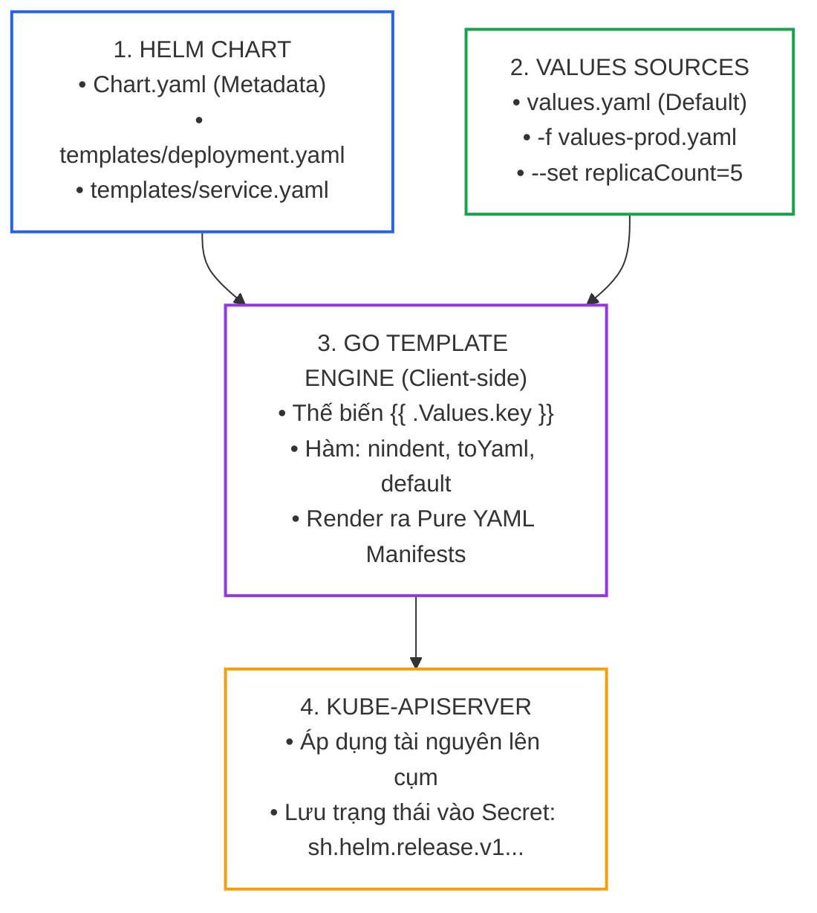
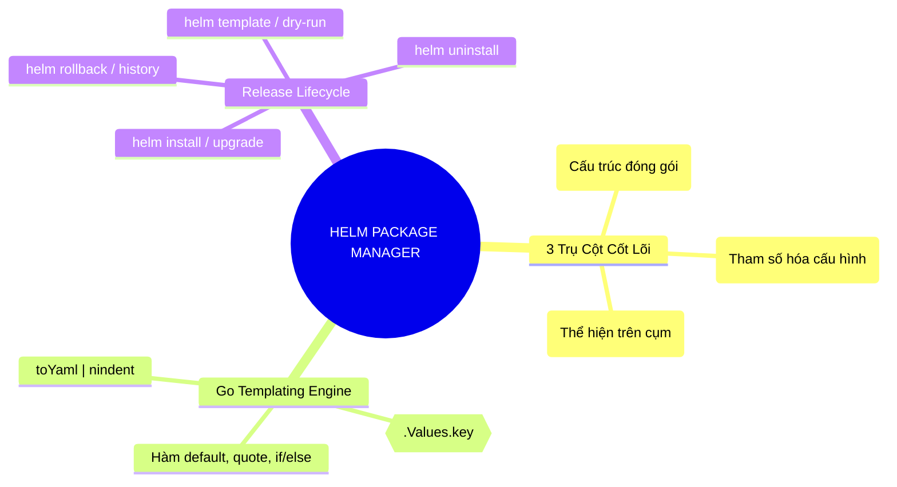


> [!IMPORTANT]
> **Mục tiêu kỹ thuật cốt lõi**: Làm chủ kỹ năng đóng gói, tham số hóa và phân phối ứng dụng microservices bằng **Helm Package Manager (Helm v3)** thuộc miền **Application Deployment (20%)** của kỳ thi CKAD. Nắm vững cấu trúc **Helm Chart**, cú pháp **Go Template Engine**, cơ chế lưu trữ trạng thái Release trong **Kubernetes Secrets**, và xử lý dứt điểm các lỗi định dạng YAML khi ghi đè cấu hình (**Values Overrides**).

---

## 1. Bản Chất Kiến Trúc & Tư Duy Cốt Lõi: Kiến Trúc Helm Package Manager & Go Templating Engine

Trong môi trường thực tế, việc duy trì hàng chục tệp YAML thuần cho mỗi môi trường (Dev, Staging, Prod) dẫn đến sự trùng lặp mã nguồn nghiêm trọng (YAML Duplication). **Helm** đóng vai trò là trình quản lý gói tiêu chuẩn (Package Manager) của hệ sinh thái Kubernetes, cho phép trừu tượng hóa các manifest thành **tệp mẫu tham số hóa (Parameterized Templates)**.



### 3 Khái Niệm Nền Tảng Của Helm:

1. **Helm Chart**: Tập hợp các tệp định nghĩa tài nguyên Kubernetes được đóng gói trong một thư mục có cấu trúc chuẩn (`Chart.yaml`, `values.yaml`, `templates/`).
2. **Values**: Dữ liệu cấu hình động được truyền vào Chart để thế chỗ cho các biến trong template (ví dụ: `image.tag`, `replicaCount`, `resources`).
3. **Helm Release**: Một thể hiện cụ thể (running instance) của một Chart được cài đặt vào một Namespace trên cụm Kubernetes. Một Chart có thể được cài đặt nhiều lần thành nhiều Release khác nhau (ví dụ: `payment-dev` và `payment-prod`).

---

## 2. Bảng Ma Trận So Sánh Kỹ Thuật Toàn Diện (Engineering Matrix)

### Ma Trận Lệnh Helm CLI Cốt Lõi Cho Lập Trình Viên (CKAD Focus)

| Thao Tác Nghiệp Vụ | Lệnh Helm CLI Chuẩn Xác | Cờ Quan Trọng Cần Nhớ | Phương Pháp Kiểm Tra / Dry-Run | Cạm Bẫy Cần Tránh |
|---|---|---|---|---|
| **Xem trước YAML Render** | `helm template my-app ./my-chart` | `-f my-values.yaml`, `--set key=val` | Xuất thẳng ra stdout, không chạm vào cụm | Không kiểm tra được tính tương thích API Server |
| **Cài đặt Release Mới** | `helm install my-app ./my-chart -n prod --create-namespace` | `--set replicaCount=3`, `-f prod.yaml` | `helm install ... --dry-run --debug` | Quên cờ `--create-namespace` nếu namespace chưa có |
| **Cập nhật / Nâng cấp** | `helm upgrade my-app ./my-chart -n prod` | `--install` (tự install nếu chưa có) | `helm diff upgrade` (nếu có plugin) | Ghi đè thiếu biến khiến các cấu hình cũ bị mất |
| **Kiểm tra Lịch Sử Release** | `helm history my-app -n prod` | `-o table` | Xem danh sách các revisions và status | Nhầm lẫn giữa revision của Helm và revision của Deployment |
| **Quay lui (Rollback)** | `helm rollback my-app 2 -n prod` | `--wait`, `--timeout 2m` | `helm history` xác nhận revision mới sinh ra | Rollback không sửa được lỗi nếu phiên bản cũ sai volume |
| **Gỡ bỏ Release** | `helm uninstall my-app -n prod` | `--keep-history` (nếu muốn giữ log) | `helm list -n prod` | Xóa mất cả PVC nếu không cấu hình Retain |

### So Sánh Helm vs Kustomize

| Tiêu Chí Kỹ Thuật | Helm Package Manager | Kustomize (Native `kubectl -k`) |
|---|---|---|
| **Cơ Chế Biến Đổi** | **Go Template Engine** (Thế biến Mustache `{{ .Values }}`) | **Overlay & Patching** (Ghi đè YAML thuần không dùng template) |
| **Quản Lý Phiên Bản** | Có quản lý Release State, History & Rollback | Không quản lý Release state (phụ thuộc GitOps) |
| **Phân Phối Mã Nguồn** | Đóng gói thành tệp `.tgz` phân phối qua Helm Repositories | Chia sẻ qua Git Repositories hoặc thư mục cục bộ |
| **Trường Hợp Phù Hợp** | Đóng gói ứng dụng thương mại, công cụ phức tạp (Prometheus, Ingress) | Tùy biến cấu hình vi dịch vụ nội bộ giữa các môi trường Dev/Prod |

---

## 3. Kiến Trúc Môi Trường & Luồng Thực Thi Mẫu

### Cấu Trúc Thư Mục Một Helm Chart Chuẩn Mực

```text
my-custom-chart/
├── Chart.yaml             # Metadata của Chart (name, version, appVersion, description)
├── values.yaml            # Cấu hình biến mặc định
└── templates/             # Thư mục chứa các tệp mẫu YAML Kubernetes
    ├── _helpers.tpl       # Định nghĩa các template hàm dùng chung
    ├── deployment.yaml    # Bản mẫu Deployment có nhúng biến
    ├── service.yaml       # Bản mẫu Service có nhúng biến
    └── NOTES.txt          # Thông báo hướng dẫn in ra màn hình sau khi install
```

### Bản Mẫu `templates/deployment.yaml` Với Hàm `nindent` Chuẩn Mực

```yaml
apiVersion: apps/v1
kind: Deployment
metadata:
  name: {{ .Release.Name }}-app
  labels:
    app: {{ .Values.appName | default "demo-app" | quote }}
    release: {{ .Release.Name }}
spec:
  replicas: {{ .Values.replicaCount | default 1 }}
  selector:
    matchLabels:
      app: {{ .Values.appName | default "demo-app" }}
  template:
    metadata:
      labels:
        app: {{ .Values.appName | default "demo-app" }}
    spec:
      containers:
      - name: {{ .Chart.Name }}
        image: "{{ .Values.image.repository }}:{{ .Values.image.tag | default .Chart.AppVersion }}"
        imagePullPolicy: {{ .Values.image.pullPolicy | default "IfNotPresent" }}
        ports:
        - containerPort: {{ .Values.service.targetPort | default 8080 }}
        {{- if .Values.resources }}
        resources:
          {{- toYaml .Values.resources | nindent 10 }}
        {{- end }}
```

---

## 4. Phân Tích Cạm Bẫy Thực Chiến: Thụt Lề YAML (Indentation Error) Khi Dùng Hàm `toYaml` Làm Sập Quá Trình Render

### Tình Huống Sự Cố: Sử Dụng `toYaml` Không Kèm `nindent` Khiến `helm install` Báo Lỗi Cú Pháp

Một lập trình viên muốn truyền toàn bộ khối cấu hình `resources` từ file `values.yaml` vào trong file `deployment.yaml` và viết cú pháp: `resources: {{ toYaml .Values.resources }}`. Khi chạy lệnh `helm install`, hệ thống lập tức báo lỗi parse YAML thất bại và từ chối tạo tài nguyên.

### Hậu Quả & Log Lỗi Thực Tế:
```text
Error: YAML parse error on my-chart/templates/deployment.yaml: error converting YAML to JSON: yaml: line 24: mapping values are not allowed in this context
helm.go:84: [debug] YAML parse error on my-chart/templates/deployment.yaml: error converting YAML to JSON: yaml: line 24: did not find expected key
```

### 5-Whys Root Cause Analysis:
1. **Tại sao Helm báo lỗi YAML parse error?** Vì tệp YAML sau khi render ra bị sai cấu trúc thụt lề (Indentation).
2. **Tại sao cấu trúc thụt lề bị sai?** Vì khối `resources` được hàm `toYaml` in ra bắt đầu ngay từ cột đầu tiên (cột 0) thay vì thụt vào đúng vị trí của thẻ cha.
3. **Tại sao hàm `toYaml` không tự thụt lề?** Vì bản chất hàm `toYaml` chỉ tuần tự hóa (serialize) object Go thành chuỗi YAML gốc từ lề trái.
4. **Tại sao không dùng hàm `indent`?** Vì hàm `indent` thụt lề toàn bộ các dòng trừ dòng đầu tiên, dẫn đến dòng đầu tiên bị lệch lề.
5. **Gốc rễ vấn đề (Root Cause):** Không sử dụng hàm **`nindent <N>`** (Newline + Indent $N$ spaces) để xuống dòng và thụt lề đồng đều cho tất cả các dòng của khối cấu hình nhúng.

### Biện Pháp Khắc Phục Chuẩn:
```diff
--- a/templates/deployment.yaml
+++ b/templates/deployment.yaml
@@ -20,2 +20,3 @@
         resources:
-          {{ toYaml .Values.resources }}
+          {{- toYaml .Values.resources | nindent 10 }}
```

---

## 5. Hands-on Lab: Tự Tạo Helm Chart, Quản Lý Release & Rollback (8 Bước)

| Bước | Mục Tiêu Kỹ Thuật | Lệnh / File Kiểm Tra Chính |
|---|---|---|
| **1** | Khởi tạo cấu trúc Helm Chart tùy chỉnh từ con số 0 | `helm create my-chart` |
| **2** | Tinh chỉnh `Chart.yaml` và khai báo `values.yaml` | `Chart.yaml`, `values.yaml` |
| **3** | Viết tệp mẫu `templates/deployment.yaml` và `service.yaml` | Go Templates với hàm `nindent` |
| **4** | Kiểm tra cú pháp và render thử với `helm lint` / `helm template` | `helm lint`, `helm template` |
| **5** | Cài đặt Release lên cụm với cờ `--set` | `helm install web-v1 ./my-chart` |
| **6** | Nâng cấp Release với tệp `values-prod.yaml` | `helm upgrade web-v1 ./my-chart -f ...` |
| **7** | Xem lịch sử và thực hiện Rollback phiên bản cũ | `helm history`, `helm rollback` |
| **8** | Gỡ bỏ hoàn toàn Release và dọn dẹp cụm | `helm uninstall web-v1` |

---

### Bước 1: Khởi Tạo Thư Mục Helm Chart

```bash
mkdir -p /tmp/helm-lab && cd /tmp/helm-lab

# Khởi tạo khung Chart chuẩn
helm create ckad-web-chart

# Xóa các tệp mẫu mặc định không cần thiết để tự viết
rm -rf ckad-web-chart/templates/*
```

---

### Bước 2: Biên Soạn `Chart.yaml` và `values.yaml`

```yaml
# ckad-web-chart/Chart.yaml
apiVersion: v2
name: ckad-web-chart
description: Enterprise Microservice Helm Chart for CKAD
type: application
version: 1.0.0
appVersion: "1.25.0"
```

```yaml
# ckad-web-chart/values.yaml
appName: backend-api
replicaCount: 2

image:
  repository: nginx
  tag: "1.24-alpine"
  pullPolicy: IfNotPresent

service:
  type: ClusterIP
  port: 80
  targetPort: 80

resources:
  requests:
    cpu: 50m
    memory: 64Mi
  limits:
    cpu: 200m
    memory: 128Mi
```

---

### Bước 3: Viết Các Tệp Mẫu Trong `templates/`

```yaml
# ckad-web-chart/templates/deployment.yaml
apiVersion: apps/v1
kind: Deployment
metadata:
  name: {{ .Release.Name }}-deploy
  labels:
    app: {{ .Values.appName }}
    release: {{ .Release.Name }}
spec:
  replicas: {{ .Values.replicaCount }}
  selector:
    matchLabels:
      app: {{ .Values.appName }}
      release: {{ .Release.Name }}
  template:
    metadata:
      labels:
        app: {{ .Values.appName }}
        release: {{ .Release.Name }}
    spec:
      containers:
      - name: web
        image: "{{ .Values.image.repository }}:{{ .Values.image.tag }}"
        imagePullPolicy: {{ .Values.image.pullPolicy }}
        ports:
        - containerPort: {{ .Values.service.targetPort }}
        resources:
          {{- toYaml .Values.resources | nindent 10 }}
```

```yaml
# ckad-web-chart/templates/service.yaml
apiVersion: v1
kind: Service
metadata:
  name: {{ .Release.Name }}-svc
  labels:
    app: {{ .Values.appName }}
spec:
  type: {{ .Values.service.type }}
  ports:
  - port: {{ .Values.service.port }}
    targetPort: {{ .Values.service.targetPort }}
  selector:
    app: {{ .Values.appName }}
    release: {{ .Release.Name }}
```

---

### Bước 4: Kiểm Tra Cú Pháp & Render Thử Nghiệm

```bash
# 1. Kiểm tra lỗi cú pháp (Linting)
helm lint ./ckad-web-chart

# 2. Render thử ra YAML thuần trên terminal (Không apply vào cụm)
helm template my-test-release ./ckad-web-chart --set replicaCount=3
```

---

### Bước 5: Cài Đặt Release Lên Kubernetes

```bash
# Cài đặt Release tên api-prod vào namespace default
helm install api-prod ./ckad-web-chart

# Kiểm tra trạng thái các tài nguyên sinh ra
kubectl get deployment,service,pods -l release=api-prod
```

---

### Bước 6: Nâng Cấp Release Bằng File Values Tùy Chỉnh

```yaml
# values-prod.yaml
replicaCount: 4
image:
  tag: "1.25-alpine"
resources:
  requests:
    cpu: 100m
    memory: 128Mi
  limits:
    cpu: 500m
    memory: 256Mi
```
```bash
# Nâng cấp Release lên Revision 2
helm upgrade api-prod ./ckad-web-chart -f values-prod.yaml

# Kiểm tra số lượng Pod tăng lên 4 và image đổi thành 1.25
kubectl get deployment api-prod-deploy -o wide
```

---

### Bước 7: Xem Lịch Sử & Thực Hiện Rollback

```bash
# Xem danh sách các revisions của Release
helm history api-prod

# Quay lui về Revision 1 (khi image là 1.24 và 2 replicas)
helm rollback api-prod 1

# Kiểm tra lại trạng thái thực tế
kubectl get deployment api-prod-deploy -o wide
```

---

### Bước 8: Gỡ Bỏ Hoàn Toàn Release

```bash
# Uninstall toàn bộ tài nguyên liên quan tới Release
helm uninstall api-prod

# Xác nhận cụm đã sạch tài nguyên
kubectl get deployment,service -l release=api-prod
```

---

## 6. 10 Câu Hỏi Tự Kiểm Tra Chuyên Sâu (Self-Check Q&A Accordion)

<details class="qa-card">
<summary><b>1. Trong kiến trúc Helm v3, thông tin trạng thái của các Release được lưu trữ ở đâu trong cụm?</b></summary>
<div class="qa-answer">
<p>Từ phiên bản Helm v3, Tiller server đã bị loại bỏ hoàn toàn. Helm client tương tác trực tiếp với Kube-APIServer và lưu trữ toàn bộ trạng thái của mỗi phiên bản Release dưới dạng các <b>Kubernetes Secrets</b> (hoặc ConfigMaps nếu cấu hình) được mã hóa nén nằm ngay bên trong <b>Namespace mà Release đó được triển khai</b>, với tiền tố tên có định dạng <code>sh.helm.release.v1.&lt;release-name&gt;.v&lt;revision&gt;</code>.</p>
</div>
</details>

<details class="qa-card">
<summary><b>2. Sự khác biệt giữa hàm `indent` và `nindent` trong Go Template của Helm là gì?</b></summary>
<div class="qa-answer">
<p>Hàm <code>indent &lt;N&gt;</code> chỉ thụt lề $N$ khoảng trắng cho các dòng từ dòng thứ hai trở đi (giữ nguyên dòng đầu tiên). Trong khi đó, hàm <code>nindent &lt;N&gt;</code> sẽ <b>tự động thêm một ký tự xuống dòng mới (\n)</b> rồi mới tiến hành thụt lề $N$ khoảng trắng cho toàn bộ các dòng. Do đó, <code>nindent</code> luôn được ưu tiên sử dụng khi nhúng các khối YAML nhiều dòng bằng <code>toYaml</code>.</p>
</div>
</details>

<details class="qa-card">
<summary><b>3. Lệnh Helm nào giúp cài đặt Release nếu nó chưa tồn tại, hoặc tự động nâng cấp nếu Release đã có sẵn?</b></summary>
<div class="qa-answer">
<pre><code>helm upgrade --install &lt;release-name&gt; &lt;chart-path&gt;</code></pre>
<p>Cờ <code>--install</code> (hoặc <code>-i</code>) đảm bảo tính idempotent, rất phổ biến trong các pipeline CI/CD.</p>
</div>
</details>

<details class="qa-card">
<summary><b>4. Sự khác biệt giữa `version` và `appVersion` trong tệp `Chart.yaml` là gì?</b></summary>
<div class="qa-answer">
<p><b>version:</b> Là phiên bản của chính <b>gói Helm Chart</b> đó (tuân thủ chuẩn Semantic Versioning, ví dụ <code>1.0.0</code>). Mỗi khi thay đổi template hoặc values mặc định, bạn phải tăng số này.</p>
<p><b>appVersion:</b> Là phiên bản của <b>ứng dụng thực tế bên trong container</b> đang chạy (ví dụ phiên bản Nginx <code>1.25.0</code> hay Node.js <code>20.1.0</code>). Đây chỉ là thông tin metadata tham khảo.</p>
</div>
</details>

<details class="qa-card">
<summary><b>5. Thứ tự ưu tiên ghi đè giá trị biến (Values Precedence) trong Helm diễn ra như thế nào?</b></summary>
<div class="qa-answer">
<p>Thứ tự ưu tiên từ thấp đến cao (cái sau ghi đè cái trước):</p>
<div>1. File <code>values.yaml</code> mặc định nằm bên trong Chart.</div>
<div>2. File values của Chart cha (nếu là Subchart).</div>
<div>3. Các file tùy chỉnh truyền qua cờ <code>-f &lt;file.yaml&gt;</code> (file gọi sau ghi đè file gọi trước).</div>
<div>4. Các tham số truyền trực tiếp qua cờ <code>--set key=value</code> trên dòng lệnh (Ưu tiên cao nhất).</div>
</div>
</details>

<details class="qa-card">
<summary><b>6. Làm thế nào để thêm một Helm Repository từ xa và tìm kiếm Chart trong phòng thi CKAD?</b></summary>
<div class="qa-answer">
<pre><code># 1. Thêm repo
helm repo add bitnami https://charts.bitnami.com/bitnami
helm repo update

# 2. Tìm kiếm chart
helm search repo nginx</code></pre>
</div>
</details>

<details class="qa-card">
<summary><b>7. Biến dựng sẵn `.Release.IsInstall` và `.Release.IsUpgrade` được dùng để làm gì trong template?</b></summary>
<div class="qa-answer">
<p>Đây là các biến cờ Boolean được dùng trong các khối điều kiện <code>{{- if .Release.IsInstall }}</code> để thực thi các tác vụ chỉ diễn ra khi cài đặt lần đầu (ví dụ: tạo mật khẩu ngẫu nhiên cho Secret) và không bị ghi đè hay thay đổi khi chạy lệnh <code>helm upgrade</code>.</p>
</div>
</details>

<details class="qa-card">
<summary><b>8. Thao tác `helm rollback` có làm tăng số phiên bản Revision của Release không?</b></summary>
<div class="qa-answer">
<p><b>Có.</b> Mỗi thao tác <code>helm rollback</code> sẽ tạo ra một <b>Revision mới tiếp theo</b> có cấu hình tương đương với bản được chỉ định quay lui. Ví dụ: Đang ở Revision 3, nếu chạy <code>helm rollback my-app 1</code>, hệ thống sẽ tạo ra <b>Revision 4</b> chứa toàn bộ nội dung của Revision 1.</p>
</div>
</details>

<details class="qa-card">
<summary><b>9. Khi nào KHÔNG nên sử dụng Helm để quản lý ứng dụng trên Kubernetes?</b></summary>
<div class="qa-answer">
<p>Không nên dùng Helm khi:</p>
<div>1. Hệ thống chỉ gồm các bản kê khai YAML tĩnh đơn giản không cần tham số hóa biến.</div>
<div>2. Đội ngũ đã chuẩn hóa toàn bộ quy trình GitOps bằng Kustomize thuần không muốn phụ thuộc vào template engine.</div>
<div>3. Các cấu hình nhạy cảm mà tổ chức cấm lưu lịch sử cấu hình dạng plaintext trong Kubernetes Secrets.</div>
</div>
</details>

<details class="qa-card">
<summary><b>10. Làm thế nào để kiểm tra giá trị thực tế của tất cả các biến đã truyền vào một Release đang chạy?</b></summary>
<div class="qa-answer">
<pre><code>helm get values &lt;release-name&gt; -n &lt;namespace&gt;</code></pre>
<p>Thêm cờ <code>--all</code> để xem toàn bộ (bao gồm cả giá trị mặc định trong Chart): <code>helm get values &lt;release-name&gt; --all -n &lt;namespace&gt;</code>.</p>
</div>
</details>

---

## 7. Tổng Kết & Lộ Trình Bài Học Tiếp Theo



Làm chủ Helm Package Manager giúp bạn chuẩn hóa quy trình phân phối ứng dụng, xóa bỏ sự trùng lặp mã nguồn và tự tin quản lý các kiến trúc microservices phức tạp trên Kubernetes.

> [!TIP]
> **Bài học tiếp theo**: Đi sâu vào cơ chế tự phục hồi và giám sát sức khỏe ứng dụng với **[Bài 07: Tam Giác Kiểm Soát Sức Khỏe: Liveness, Readiness & Startup Probes](ckad-07-07-probe-ba-loai.html)**.

