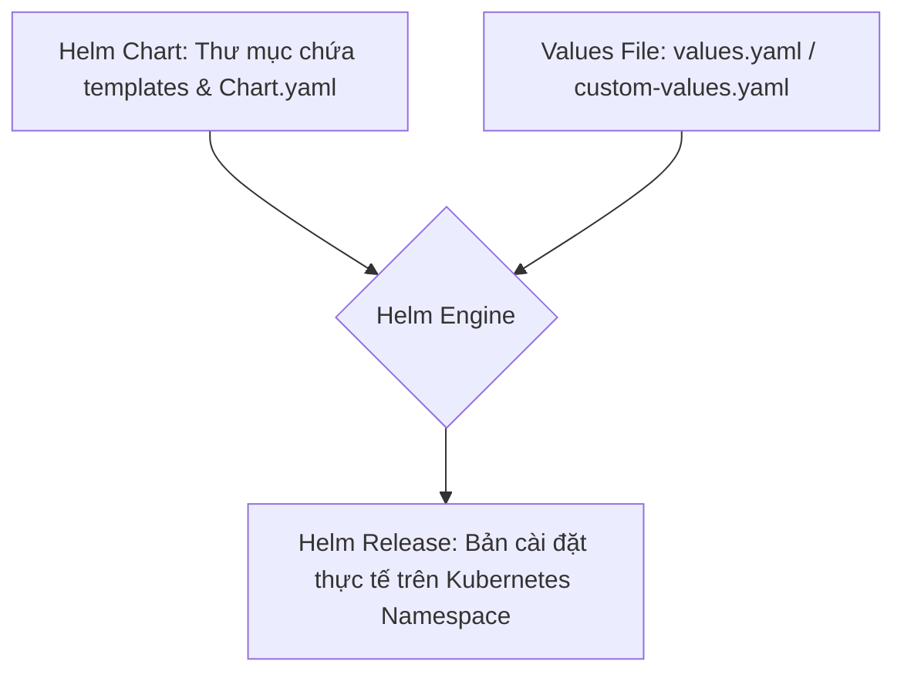
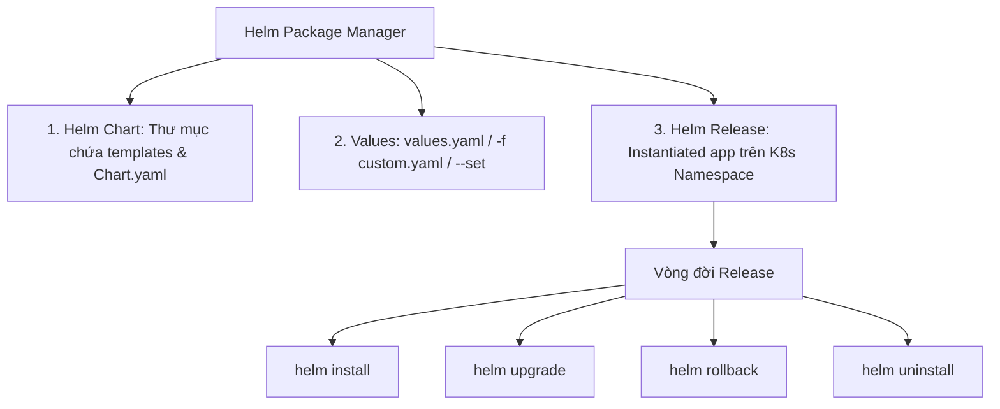
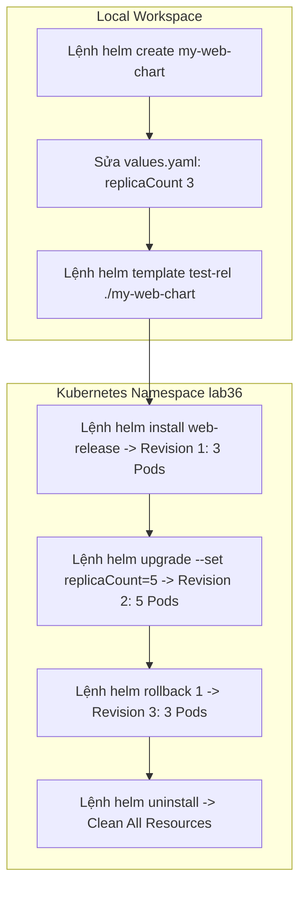


# [BÀI 06] ĐÓNG GÓI ỨNG DỤNG VỚI HELM: HELM CHARTS, TEMPLATES, VALUES OVERRIDES, RELEASE MANAGEMENT & CẠM BẪY

Trong kỷ nguyên điện toán đám mây và kiến trúc microservices phân tán quy mô lớn, **Kubernetes (CKAD)** đóng vai trò là nền tảng điều phối container (Container Orchestration) tiêu chuẩn công nghiệp. Để làm chủ hệ thống trong môi trường sản xuất (Production) cũng như chinh phục kỳ thi chứng chỉ quốc tế của Linux Foundation / CNCF, kỹ sư không chỉ nắm vững các câu lệnh thao tác cơ bản mà phải thấu hiểu sâu sắc bản chất cơ chế tầng thấp: từ chu trình điều hòa (Reconciliation Loop), cấu trúc điều phối tài nguyên, kiến trúc mạng CNI, lưu trữ CSI cho đến các chuẩn mực an ninh phòng thủ chiều sâu.

Bài viết chuyên sâu này sẽ đồng hành cùng bạn giải mã toàn diện bức tranh kiến trúc, phân tích các đánh đổi kỹ thuật thực chiến (Engineering Trade-offs), cung cấp bài thực hành Lab từng bước và bộ câu hỏi phỏng vấn chuẩn Architect / Lead Engineer.

---

## 1. Bản Chất Kiến Trúc & Cơ Chế Vận Hành Tầng Thấp

| # | Câu hỏi ôn tập | Đáp án chuẩn ngắn gọn |
|---|---|---|
| 1 | Sự khác biệt chính giữa chiến lược `RollingUpdate` và `Recreate` là gì? | `RollingUpdate` **Zero-Downtime**, `Recreate` **Downtime ngắn** diệt 100% Pod cũ |
| 2 | Hai tham số kiểm soát giới hạn số lượng Pod trong chiến lược `RollingUpdate`? | **`maxSurge`** và **`maxUnavailable`** |
| 3 | Điều kiện bắt buộc đi kèm `RollingUpdate` để không gây rớt HTTP 502? | Khai báo cờ **`readinessProbe`** đầy đủ |
| 4 | Câu lệnh CLI chuyển nhãn selector của Service trong mô hình Blue-Green? | **`kubectl patch service <svc> -p ...`** |
| 5 | Câu lệnh CLI khôi phục Deployment về phiên bản ổn định cũ khi rollout bị lỗi? | **`kubectl rollout undo deployment/<name>`** |


> **"Sử dụng Helm Package Manager để quản lý và đóng gói ứng dụng Cloud Native là kỹ năng thuộc miền Application Deployment trong CKAD, đòi hỏi lập trình viên phải làm chủ cấu trúc của một Helm Chart (`Chart.yaml`, `values.yaml`, thư mục `templates/`), cơ chế thay thế biến Mustache (`{{ .Values.key }}`), và quản lý trọn vẹn vòng đời của một Helm Release (`helm install`, `helm upgrade`, `helm rollback`, `helm uninstall`); đồng thời hiểu rõ các trường hợp KHÔNG nên dùng Helm (như với bản kê khai YAML tĩnh đơn giản hoặc khi hệ thống đã chuẩn hóa GitOps bằng Kustomize thuần) để tránh lạm dụng và phức tạp hóa kiến trúc."**

**Kết quả từ các buổi trước được sử dụng lại:**

| Kết quả / Công cụ | Buổi + số hiệu `QT` | Dùng ở đâu trong buổi này |
|---|---|---|
| Quản lý Deployment và Service | Buổi 15 & 22 `QT 4.1` | Đóng gói mẫu Deployment và Service thành các tệp mẫu Helm templates |
| Quản lý chiến lược cập nhật Deployment | Buổi 35 `QT 4.1` | Truyền các tham số strategy vào file `values.yaml` của Helm Chart |
| Thao tác CLI kubectl và dry-run | Buổi 04 `QT 4.1` | Kiểm tra kết quả Render template Helm bằng `helm template` |

---


| # | Kỹ năng thực hiện được | Hiện vật chứng minh |
|---|---|---|
| 1 | Phân biệt 3 khái niệm cốt lõi của Helm (Helm Chart, Values, Helm Release) | Bảng mapping khái niệm Helm với trình quản lý gói phần mềm APT/NPM |
| 2 | Khởi tạo và biên soạn cấu trúc một Helm Chart tùy chỉnh | Thư mục Helm Chart gồm `Chart.yaml`, `values.yaml` và `templates/` |
| 3 | Nhúng cú pháp thế biến Go Template `{{ .Values.key }}` vào tệp YAML mẫu | Tệp `templates/deployment.yaml` chứa các tham số biến |
| 4 | Thực hiện cài đặt, nâng cấp, rollback và gỡ bỏ Helm Release từ CLI | Nhật ký lệnh `helm install`, `helm upgrade`, `helm rollback`, `helm uninstall` |
| 5 | Nhận biết đúng các kịch bản KHÔNG nên dùng Helm trong thực tế | Bảng tiêu chí quyết định khi nào dùng Helm vs Kustomize |

---


| Kiến thức tiên quyết | Nguồn tự học nếu thiếu |
|---|---|
| Cấu trúc bản kê khai Deployment và Service YAML | Buổi 15 & Buổi 22 (`QT 4.1`) |
| Kỹ thuật tạo khung YAML bằng cờ dry-run | Buổi 04 (`QT 4.1`) |
| Quản lý Rollout và Rollback ứng dụng | Buổi 35 (`QT 4.1`) |

---


### 3.1. Thuật ngữ Việt–Anh

| # | Thuật ngữ tiếng Việt | Tiếng Anh tương đương | Ghi chú chuẩn hoá trong thân bài |
|---|---|---|---|
| 1 | Trình quản lý gói Kubernetes | Helm Package Manager | Công cụ đóng gói, cài đặt và nâng cấp ứng dụng trên K8s |
| 2 | Gói ứng dụng Helm | Helm Chart | Thư mục chứa cấu hình đóng gói tệp YAML Kubernetes |
| 3 | Tệp giá trị biến mặc định | `values.yaml` | Tệp chứa các giá trị biến truyền vào tệp mẫu template |
| 4 | Bản phát hành Helm | Helm Release | Một thể hiện (instance) của Chart được cài đặt lên cụm |
| 5 | Kho lưu trữ Chart | Helm Repository (`helm repo`) | Kho chứa các gói Helm Chart được chia sẻ công khai |
| 6 | Thư mục tệp mẫu | Templates Directory (`templates/`) | Thư mục chứa các tệp YAML Kubernetes có nhúng biến |
| 7 | Cú pháp thế biến | Go Template Syntax (`{{ .Values.key }}`) | Cú pháp ngoặc nhọn kép thay thế biến Mustache |
| 8 | Xem trước tệp YAML render | Helm Template (`helm template`) | Lệnh render tệp mẫu ra YAML thuần để kiểm tra |
| 9 | Cờ ghi đè biến CLI | `--set` Flag | Cờ ghi đè trực tiếp giá trị biến từ terminal CLI |
| 10 | Tệp biến tùy chỉnh | Custom Values File (`-f my-values.yaml`) | Tệp chứa giá trị biến tùy chỉnh cho môi trường dev/prod |
| 11 | Lịch sử bản phát hành | Release History (`helm history`) | Danh sách các lần nâng cấp revision của một Helm Release |
| 12 | Quay lui bản phát hành | Release Rollback (`helm rollback`) | Phục hồi Helm Release về phiên bản revision cũ |
| 13 | Khung Helm Chart mẫu | Helm Create (`helm create <chart-name>`) | Lệnh khởi tạo cấu trúc thư mục Helm Chart chuẩn |
| 14 | Gỡ bỏ bản phát hành | Helm Uninstall (`helm uninstall`) | Lệnh xóa sạch toàn bộ tài nguyên thuộc Helm Release |


Mô hình Trình quản lý Gói APT/NPM trên Linux/NodeJS: Helm Chart giống như file nén `.deb` hoặc `package.json`; `values.yaml` giống như file cấu hình `config.json`; Helm Release giống như phần mềm đã được cài đặt và đang chạy trên hệ điều hành. Lệnh `helm install` tương đương với `apt install` hoặc `npm install`.

---

### 1.1. Helm Package Manager: Ba khái niệm cốt lõi Chart, Values và Release (12 phút)

**Nguyên lý cốt lõi:** Helm Chart là một thư mục đóng gói ứng dụng Kubernetes; `values.yaml` chứa các tham số cấu hình mặc định; Helm Release là một bản cài đặt cụ thể của Chart đó trên Namespace.

**Giải thích cơ chế ngầm:** Giúp tái sử dụng bộ bản kê khai Kubernetes cho nhiều môi trường (Dev, Staging, Prod) mà không cần viết lại tệp YAML. Mỗi lần chạy `helm install`, Helm sẽ lấy Chart kết hợp với tệp `values.yaml` để tạo ra một Release độc lập trên cụm.

> [!WARNING]
> **CẠM BẪY THỰC CHIẾN:**
> Nhầm lẫn giữa Helm Chart (gói mẫu) và Helm Release (bản cài đặt đang chạy), dẫn đến việc gõ tên Chart vào lệnh `helm rollback` thay vì gõ tên Release.

**Minh hoạ.**



**Nguyên lý cốt lõi:** Mọi tệp mẫu YAML nằm trong thư mục `templates/` đều sử dụng cú pháp Go Template `{{ .Values.<key> }}` để lấy giá trị tương ứng khai báo trong tệp `values.yaml`.

**Giải thích cơ chế ngầm:** Cú pháp thế biến Go Template biến các tệp YAML tĩnh thành các bản mẫu động. Khi Helm render, tất cả các vị trí `{{ .Values.image.repository }}` sẽ được thay thế bằng chuỗi giá trị tương ứng trong `values.yaml`.

> [!WARNING]
> **CẠM BẪY THỰC CHIẾN:**
> Gõ sai chữ hoa/thường ở tên biến (ví dụ gõ `{{ .Values.Image }}` thay vì `{{ .Values.image }}`), khiến Helm render ra giá trị rỗng `<nil>`.

**Minh hoạ.**

```yaml
# Trong file values.yaml:
replicaCount: 3
image:
  repository: nginx
  tag: alpine

# Trong file templates/deployment.yaml:
spec:
  replicas: {{ .Values.replicaCount }}
  template:
    spec:
      containers:
        - name: web
          image: "{{ .Values.image.repository }}:{{ .Values.image.tag }}"
```

---

### 1.2. Cấu trúc Helm Chart và cơ chế Mustache Templating `{{ .Values.key }}` (12 phút)

**Nguyên lý cốt lõi:** Để ghi đè giá trị biến trong `values.yaml`, bạn có thể dùng cờ `-f <custom-values.yaml>` cho một danh sách biến dài hoặc dùng cờ `--set key=value` cho việc sửa nhanh 1-2 biến từ CLI.

**Giải thích cơ chế ngầm:** Cờ `-f` giúp quản lý cấu hình riêng cho từng môi trường (ví dụ `-f values-prod.yaml`), trong khi cờ `--set` cực kỳ tiện lợi trong các đường ống CI/CD khi cần thay đổi động duy nhất cờ `image.tag` từ biến build.

> [!WARNING]
> **CẠM BẪY THỰC CHIẾN:**
> Cố gắng gõ hàng chục biến `--set` trên dòng lệnh CLI gây rối mắt và dễ nhầm lẫn thay vì lưu vào tệp `-f custom-values.yaml`.

**Minh hoạ.**

```bash
# Ghi đè bằng tệp custom values:
helm install my-app ./my-chart -f values-prod.yaml -n prod

# Ghi đè nhanh 1 biến từ CLI:
helm install my-app ./my-chart --set replicaCount=5 -n prod
```

**Nguyên lý cốt lõi:** Khi sử dụng cờ `--set`, nếu giá trị biến chứa ký tự đặc biệt (như dấu phẩy hoặc dấu ngoặc), bắt buộc phải bọc giá trị trong dấu ngoặc kép hoặc dùng cờ `--set-string`.

**Giải thích cơ chế ngầm:** Helm CLI phân tích dấu phẩy trong cờ `--set` làm dấu phân cách nhiều biến (ví dụ `--set a=1,b=2`). Nếu giá trị của biến chứa dấu phẩy mà không bọc đúng cách, Helm sẽ báo lỗi syntax parser.

> [!WARNING]
> **CẠM BẪY THỰC CHIẾN:**
> Gõ `--set annotations.example=foo,bar` làm Helm hiểu nhầm thành 2 biến `annotations.example=foo` và `bar=true`.

**Minh hoạ.**

```bash
# Ghi đè đúng cách khi có ký tự đặc biệt:
helm install my-app ./my-chart --set-string "annotations.env=prod,v1"
```

---

### 1.3. Quản lý vòng đời Helm Release: install, upgrade, rollback, uninstall (10 phút)

**Nguyên lý cốt lõi:** Lệnh `helm install <release-name> <chart-path>` cài đặt một bản phát hành mới; lệnh `helm upgrade <release-name> <chart-path>` cập nhật bản phát hành lên revision mới.

**Giải thích cơ chế ngầm:** Giúp quản lý phiên bản (Versioning) của toàn bộ ứng dụng. Mỗi lần chạy `helm upgrade`, Helm sẽ tính toán sự khác biệt (diff) của các tệp YAML render và ra lệnh cho Kubernetes điều chỉnh tài nguyên tương ứng, đồng thời tăng số `REVISION` lên 1 đơn vị.

> [!WARNING]
> **CẠM BẪY THỰC CHIẾN:**
> Chạy `helm install` đè lên một Release đã tồn tại, làm Helm báo lỗi `cannot re-use a name that is still in use`.

**Minh hoạ.**

```bash
# Cài đặt lần đầu (Revision 1):
helm install web-app ./my-chart -n prod

# Nâng cấp phiên bản (Revision 2):
helm upgrade web-app ./my-chart --set image.tag=v2 -n prod
```

**Nguyên lý cốt lõi:** Khi quá trình nâng cấp Helm bị lỗi, chạy lệnh `helm rollback <release-name> <revision-number>` để ngay lập tức khôi phục toàn bộ tài nguyên Kubernetes của Release về phiên bản cũ.

**Giải thích cơ chế ngầm:** Helm lưu giữ toàn bộ lịch sử các bản kê khai YAML của từng Revision trong Secret/ConfigMap của cụm. Lệnh `helm rollback` giúp khôi phục toàn bộ Pod, Service, ConfigMap của Release về đúng trạng thái ở Revision được chỉ định.

> [!WARNING]
> **CẠM BẪY THỰC CHIẾN:**
> Xóa thủ công từng Pod khi Release bị lỗi nâng cấp thay vì dùng 1 câu lệnh `helm rollback`.

**Minh hoạ.**

```bash
# Xem lịch sử các lần upgrade:
helm history web-app -n prod

# Rollback khẩn cấp về Revision 1:
helm rollback web-app 1 -n prod
```

**Nguyên lý cốt lõi:** Lệnh `helm list -A` liệt kê tất cả các Helm Release đang chạy trên toàn bộ các Namespace của cụm; lệnh `helm status <release-name>` kiểm tra trạng thái chi tiết của 1 Release.

**Giải thích cơ chế ngầm:** Giúp kỹ sư DevOps và người quản trị hệ thống nắm bắt bức tranh toàn cảnh về các gói ứng dụng đang được triển khai trên toàn cụm.

> [!WARNING]
> **CẠM BẪY THỰC CHIẾN:**
> Quên cờ `-n <namespace>` hoặc `-A` khi chạy `helm list` khiến không thấy Release của mình nằm ở đâu.

**Minh hoạ.**

```bash
# Liệt kê tất cả Release trên cụm:
helm list -A

# Kiểm tra trạng thái Release chi tiết:
helm status web-app -n prod
```

---

### 1.4. Đưa vào cụm thật (4 phút)

**Nguyên lý cốt lõi:** KHÔNG nên dùng Helm cho các bản kê khai Kubernetes tĩnh đơn giản (chỉ có 1-2 Pod/Service không cần biến đổi) hoặc khi hệ thống đã áp dụng GitOps thuần bằng Kustomize để tránh tạo thêm lớp trừu tượng phức tạp không cần thiết.

**Giải thích cơ chế ngầm:** Helm giới thiệu cú pháp Go Template và cấu trúc thư mục phức tạp. Nếu một ứng dụng chỉ là 1 tệp YAML tĩnh không bao giờ thay đổi biến giữa các môi trường, việc dùng Helm sẽ làm tăng chi phí bảo trì mà không đem lại lợi ích.

> [!WARNING]
> **CẠM BẪY THỰC CHIẾN:**
> Cố tạo Helm Chart cho 1 tệp YAML Pod tĩnh duy nhất không có bất kỳ biến nào, làm phức tạp hóa mã nguồn vô ích.

**Minh hoạ.**

```bash
# Với tệp YAML tĩnh siêu đơn giản, chỉ cần dùng lệnh kubectl thuần:
kubectl apply -f static-pod.yaml
```

**Áp vào cụm đang chạy thì làm gì trước:**
1. Khai báo các gói ứng dụng dùng chung (như Ingress Controller, Prometheus, Cert-Manager) bằng Helm Chart chính hãng.
2. Kiểm tra tính hợp lệ của Chart tự viết bằng lệnh `helm lint ./my-chart`.
3. Chạy `helm template ./my-chart` để xem tệp YAML đầu ra trước khi apply lên cụm Production.

**Cái gì hỏng nếu áp thẳng lên prod:**
- Chạy `helm upgrade` với tệp `values.yaml` thiếu một số biến quan trọng sẽ làm Helm render ra YAML rỗng và xóa mất các tài nguyên Kubernetes tương ứng.

**Đo trước — đo sau:**
- Đo thời gian đóng gói và triển khai ứng dụng bằng Helm so với gõ thủ công lệnh `kubectl apply`.
- Kiểm tra danh sách các Secret lưu lịch sử Helm Release để dọn dẹp các revision quá cũ.

**Khi nào KHÔNG nên dùng:**
- Không dùng Helm khi bạn chỉ muốn vá nhanh 1 nhãn label hoặc 1 biến môi trường tạm thời cho mục đích debug.

---

### 1.5. Bẫy hay gặp (2 phút)

| Bẫy hay gặp | Vì sao dính | Làm đúng là |
|---|---|---|
| 1. Nhầm tên Helm Chart với tên Helm Release | Không phân biệt gói mẫu và bản cài đặt | Tên Release tự đặt khi install; tên Chart là tên thư mục |
| 2. Gõ sai hoa/thường trong `{{ .Values.key }}` | Không kiểm tra chính xác tên biến trong `values.yaml` | Luôn kiểm tra lại chữ hoa/thường của key |
| 3. Quên cờ `-n <namespace>` khi thao tác Helm | Helm mặc định thao tác trên Namespace `default` | Luôn gắn cờ `-n <namespace>` cho mọi lệnh Helm |
| 4. Bị lỗi parser khi dùng cờ `--set` có dấu phẩy | Dấu phẩy được coi là phân cách nhiều biến | Bọc chuỗi trong dấu ngoặc hoặc dùng `--set-string` |
| 5. Lệnh `helm install` báo Release name đã tồn tại | Cố cài đặt lại với tên Release cũ | Dùng `helm upgrade` nếu muốn nâng cấp |
| 6. Render ra YAML rỗng do sai đường dẫn `.Values` | Khai báo thiếu cấp phân nhánh biến trong Go Template | Kiểm tra cấp thụt lề trong `values.yaml` |
| 7. Quên chạy `helm dependency build` | Chart phụ thuộc vào các Sub-charts khác | Chạy `helm dependency build` trước khi install |
| 8. Xóa thủ công Pod làm Helm Release bị lệch trạng thái | Xóa Pod bằng `kubectl` thay vì dùng `helm` | Mọi thao tác quản lý nên thực hiện qua lệnh Helm |
| 9. Không test lệnh `helm template` trước khi upgrade | Render lỗi nhưng vẫn apply trực tiếp lên prod | Chạy `helm template ./chart` để soát lỗi syntax YAML |
| 10. `helm rollback` gõ sai số Revision | Không kiểm tra lịch sử nâng cấp trước | Chạy `helm history <release>` trước khi rollback |
| 11. Đặt tên tệp mẫu không có đuôi `.yaml` | Helm bỏ qua các tệp mẫu không đúng định dạng | Luôn đặt tên tệp mẫu dạng `deployment.yaml` dưới `templates/` |
| 12. Lạm dụng Helm cho 1 tệp YAML tĩnh siêu đơn giản | Tạo dư thừa độ phức tạp quản lý | Dùng `kubectl apply -f` cho tệp YAML tĩnh |

---

### 1.6. Tóm tắt (2 phút)



**Năm điều phải nhớ:**
1. **Ba khái niệm cốt lõi**: Chart (gói mẫu), Values (biến cấu hình), Release (bản cài đặt trên cụm).
2. **Cú pháp Go Template**: Dùng `{{ .Values.key }}` để nhúng giá trị biến từ `values.yaml`.
3. **Hai cách truyền biến**: Dùng `-f values.yaml` cho danh sách dài, `--set key=value` cho sửa nhanh CLI.
4. **Bộ lệnh Lifecycle**: `helm install`, `helm upgrade`, `helm rollback`, `helm uninstall`.
5. **Kiểm tra trước khi apply**: Luôn dùng `helm template ./chart` để render và kiểm tra tệp YAML đầu ra.

---

## §10. Câu hỏi tự kiểm tra (5 phút)


<div class="qa-answer">
  <div class="qa-answer-header">
    <svg width="14" height="14" fill="none" stroke="currentColor" stroke-width="2" viewBox="0 0 24 24"><path d="M22 11.08V12a10 10 0 1 1-5.93-9.14"></path><polyline points="22 4 12 14.01 9 11.01"></polyline></svg>
    <span>Phân Tích &amp; Lời Giải Kỹ Thuật</span>
  </div>
  
Helm Chart, Values (<code>values.yaml</code>), và Helm Release.
</div>
</details>

<div class="qa-answer">
  <div class="qa-answer-header">
    <svg width="14" height="14" fill="none" stroke="currentColor" stroke-width="2" viewBox="0 0 24 24"><path d="M22 11.08V12a10 10 0 1 1-5.93-9.14"></path><polyline points="22 4 12 14.01 9 11.01"></polyline></svg>
    <span>Phân Tích &amp; Lời Giải Kỹ Thuật</span>
  </div>
  
Thư mục <code>templates/</code>.
</div>
</details>

<div class="qa-answer">
  <div class="qa-answer-header">
    <svg width="14" height="14" fill="none" stroke="currentColor" stroke-width="2" viewBox="0 0 24 24"><path d="M22 11.08V12a10 10 0 1 1-5.93-9.14"></path><polyline points="22 4 12 14.01 9 11.01"></polyline></svg>
    <span>Phân Tích &amp; Lời Giải Kỹ Thuật</span>
  </div>
  
Cú pháp <code>{{ .Values.replicaCount }}</code>.
</div>
</details>

<div class="qa-answer">
  <div class="qa-answer-header">
    <svg width="14" height="14" fill="none" stroke="currentColor" stroke-width="2" viewBox="0 0 24 24"><path d="M22 11.08V12a10 10 0 1 1-5.93-9.14"></path><polyline points="22 4 12 14.01 9 11.01"></polyline></svg>
    <span>Phân Tích &amp; Lời Giải Kỹ Thuật</span>
  </div>
  
Cờ <code>-f</code> truyền một tệp giá trị tùy chỉnh, cờ <code>--set</code> ghi đè trực tiếp từng biến từ terminal CLI.
</div>
</details>

<div class="qa-answer">
  <div class="qa-answer-header">
    <svg width="14" height="14" fill="none" stroke="currentColor" stroke-width="2" viewBox="0 0 24 24"><path d="M22 11.08V12a10 10 0 1 1-5.93-9.14"></path><polyline points="22 4 12 14.01 9 11.01"></polyline></svg>
    <span>Phân Tích &amp; Lời Giải Kỹ Thuật</span>
  </div>
  
Lệnh <code>helm create <chart-name></code>.
</div>
</details>

<div class="qa-answer">
  <div class="qa-answer-header">
    <svg width="14" height="14" fill="none" stroke="currentColor" stroke-width="2" viewBox="0 0 24 24"><path d="M22 11.08V12a10 10 0 1 1-5.93-9.14"></path><polyline points="22 4 12 14.01 9 11.01"></polyline></svg>
    <span>Phân Tích &amp; Lời Giải Kỹ Thuật</span>
  </div>
  
Lệnh <code>helm template <release-name> <chart-path></code>.
</div>
</details>

<div class="qa-answer">
  <div class="qa-answer-header">
    <svg width="14" height="14" fill="none" stroke="currentColor" stroke-width="2" viewBox="0 0 24 24"><path d="M22 11.08V12a10 10 0 1 1-5.93-9.14"></path><polyline points="22 4 12 14.01 9 11.01"></polyline></svg>
    <span>Phân Tích &amp; Lời Giải Kỹ Thuật</span>
  </div>
  
Lệnh <code>helm history <release-name></code>.
</div>
</details>

<div class="qa-answer">
  <div class="qa-answer-header">
    <svg width="14" height="14" fill="none" stroke="currentColor" stroke-width="2" viewBox="0 0 24 24"><path d="M22 11.08V12a10 10 0 1 1-5.93-9.14"></path><polyline points="22 4 12 14.01 9 11.01"></polyline></svg>
    <span>Phân Tích &amp; Lời Giải Kỹ Thuật</span>
  </div>
  
Lệnh <code>helm rollback <release-name> 1</code>.
</div>
</details>

<div class="qa-answer">
  <div class="qa-answer-header">
    <svg width="14" height="14" fill="none" stroke="currentColor" stroke-width="2" viewBox="0 0 24 24"><path d="M22 11.08V12a10 10 0 1 1-5.93-9.14"></path><polyline points="22 4 12 14.01 9 11.01"></polyline></svg>
    <span>Phân Tích &amp; Lời Giải Kỹ Thuật</span>
  </div>
  
Lệnh <code>helm list -A</code>.
</div>
</details>

<div class="qa-answer">
  <div class="qa-answer-header">
    <svg width="14" height="14" fill="none" stroke="currentColor" stroke-width="2" viewBox="0 0 24 24"><path d="M22 11.08V12a10 10 0 1 1-5.93-9.14"></path><polyline points="22 4 12 14.01 9 11.01"></polyline></svg>
    <span>Phân Tích &amp; Lời Giải Kỹ Thuật</span>
  </div>
  
Lệnh <code>helm uninstall <release-name></code>.
</div>
</details>

<div class="qa-answer">
  <div class="qa-answer-header">
    <svg width="14" height="14" fill="none" stroke="currentColor" stroke-width="2" viewBox="0 0 24 24"><path d="M22 11.08V12a10 10 0 1 1-5.93-9.14"></path><polyline points="22 4 12 14.01 9 11.01"></polyline></svg>
    <span>Phân Tích &amp; Lời Giải Kỹ Thuật</span>
  </div>
  
Khi bản kê khai Kubernetes là tĩnh, siêu đơn giản không cần tùy biến biến, hoặc khi hệ thống đã chuẩn hóa bằng Kustomize thuần.
</div>
</details>

<div class="qa-answer">
  <div class="qa-answer-header">
    <svg width="14" height="14" fill="none" stroke="currentColor" stroke-width="2" viewBox="0 0 24 24"><path d="M22 11.08V12a10 10 0 1 1-5.93-9.14"></path><polyline points="22 4 12 14.01 9 11.01"></polyline></svg>
    <span>Phân Tích &amp; Lời Giải Kỹ Thuật</span>
  </div>
  
Tệp <code>Chart.yaml</code>.
</div>
</details>

---

## §11. Tài liệu tham khảo

| Nguồn | Địa chỉ URL | Ghi chú |
|---|---|---|
| Helm Official Documentation | `https://helm.sh/docs/` | Tài liệu chuẩn chính thức Helm |
| Helm Chart Template Guide | `https://helm.sh/docs/chart_template_guide/` | Hướng dẫn viết Go Template Helm |


---

## 2. Hướng Dẫn Thực Hành & Triển Khai Lab Chuẩn Production

> [!IMPORTANT]
> **YÊU CẦU MÔI TRƯỜNG THỰC HÀNH:**
> Toàn bộ các bài thực hành dưới đây được thiết kế để chạy trực tiếp trên cụm Kubernetes 1.30+ tiêu chuẩn (hoặc cụm kind/kubeadm lab). Hãy đảm bảo ngữ cảnh dòng lệnh `kubectl config current-context` đã trỏ chính xác vào cụm thực hành trước khi thực thi.

## Khối thực hành — 120 phút

## L0. Mục tiêu thực hành và tiêu chí hoàn thành

| Mã tiêu chí | Nội dung tiêu chí | Lệnh kiểm chứng | Kết quả kỳ vọng |
|---|---|---|---|
| TH1 | Tạo Namespace `lab36` phục vụ thực hành Helm Package Manager | `kubectl get ns lab36 -o jsonpath='{.status.phase}'` | In ra `Active` |
| TH2 | Tạo khung Helm Chart `my-web-chart` bằng `helm create` | `test -d my-web-chart && echo "EXISTS"` | In ra `EXISTS` |
| TH3 | Kiểm tra tệp `Chart.yaml` và thư mục `templates/` tồn tại | `test -f my-web-chart/Chart.yaml && test -d my-web-chart/templates && echo "OK"` | In ra `OK` |
| TH4 | Tùy biến `values.yaml` cấu hình `replicaCount: 3` và `nginx:alpine` | `grep "replicaCount: 3" my-web-chart/values.yaml` | In ra dòng cấu hình |
| TH5 | Kiểm tra lệnh `helm template` render tệp YAML mẫu thành công | `helm template test-rel ./my-web-chart \| grep -q "kind: Deployment"` | Render thành công |
| TH6 | Cài đặt Helm Release `web-release` vào Namespace `lab36` | `helm list -n lab36 -q` | In ra `web-release` |
| TH7 | Kiểm tra trạng thái Release `web-release` hiển thị `deployed` | `helm status web-release -n lab36 -o jsonpath='{.info.status}'` | In ra `deployed` |
| TH8 | Xác minh 3 Pod của `web-release` ở trạng thái `Running` | `kubectl get deploy -n lab36 -l app.kubernetes.io/instance=web-release -o jsonpath='{.items[0].status.readyReplicas}'` | In ra `3` |
| TH9 | Nâng cấp Release lên Revision 2 bằng cờ `--set replicaCount=5` | `helm history web-release -n lab36 \| grep -c "^2"` | In ra `1` |
| TH10 | Xác minh số lượng Pod tăng lên 5 Pods sau khi upgrade | `kubectl get deploy -n lab36 -l app.kubernetes.io/instance=web-release -o jsonpath='{.items[0].status.readyReplicas}'` | In ra `5` |
| TH11 | Khôi phục Release về Revision 1 bằng lệnh `helm rollback` | `helm history web-release -n lab36 \| grep -c "^3"` | In ra `1` |
| TH12 | Xác minh số lượng Pod giảm về lại 3 Pods sau khi rollback | `kubectl get deploy -n lab36 -l app.kubernetes.io/instance=web-release -o jsonpath='{.items[0].status.readyReplicas}'` | In ra `3` |
| TH13 | Gỡ bỏ Helm Release bằng `helm uninstall` và dọn dẹp lab36 | `test -z "$(helm list -n lab36 -q)" && echo "CLEAN"` | In ra `CLEAN` |

---

## L1. Điều kiện tiên quyết về môi trường

| Kiểm tra | Lệnh thực hiện | Kết quả kỳ vọng |
|---|---|---|
| Cụm Kubernetes ba node | `kubectl get nodes` | `cp-01`, `worker-01`, `worker-02` ở trạng thái `Ready` |
| Context đúng môi trường lab | `kubectl config current-context` | Đúng context cụm `kubeadm` |
| Công cụ Helm CLI đã cài | `helm version` | In ra phiên bản `v3.x.x` |

---

## L2. Kiến trúc bài lab Helm Package Manager và Release Lifecycle



---

## L3. Bước 1: Khởi tạo Namespace `lab36` (10 phút)

### Thao tác 1.1: Tạo Namespace

```bash
kubectl create namespace lab36
```

**CHECKPOINT 1 — Kiểm tra Namespace `lab36`.**

```bash
kubectl get ns lab36 -o jsonpath='{.status.phase}' | grep -qx Active && echo "CHECKPOINT 1 — ĐẠT" || echo "CHECKPOINT 1 — LỖI"
```

---

## L4. Bước 2: Tạo và cấu hình Helm Chart tùy chỉnh (25 phút)

### Thao tác 2.1: Khởi tạo khung Helm Chart `my-web-chart`

```bash
cd /tmp
rm -rf my-web-chart
helm create my-web-chart
```

**CHECKPOINT 2 — Kiểm tra thư mục `my-web-chart`.**

```bash
test -d /tmp/my-web-chart && echo "CHECKPOINT 2 — ĐẠT" || echo "CHECKPOINT 2 — LỖI"
```

**CHECKPOINT 3 — Kiểm tra các tệp cấu trúc chuẩn của Helm Chart.**

```bash
test -f /tmp/my-web-chart/Chart.yaml && test -d /tmp/my-web-chart/templates && echo "CHECKPOINT 3 — ĐẠT" || echo "CHECKPOINT 3 — LỖI"
```

### Thao tác 2.2: Chỉnh sửa `values.yaml` thiết lập `replicaCount: 3` và ảnh `nginx:alpine`

```bash
cat <<EOF > /tmp/my-web-chart/values.yaml
replicaCount: 3

image:
  repository: nginx
  pullPolicy: IfNotPresent
  tag: "alpine"

service:
  type: ClusterIP
  port: 80

resources: {}
EOF
```

**CHECKPOINT 4 — Kiểm tra dòng cấu hình `replicaCount: 3`.**

```bash
grep -q "replicaCount: 3" /tmp/my-web-chart/values.yaml && echo "CHECKPOINT 4 — ĐẠT" || echo "CHECKPOINT 4 — LỖI"
```

### Thao tác 2.3: Chạy thử lệnh `helm template` render tệp YAML mẫu

```bash
helm template test-rel /tmp/my-web-chart > /tmp/rendered.yaml
```

**CHECKPOINT 5 — Kiểm tra kết quả Render tệp YAML.**

```bash
grep -q "kind: Deployment" /tmp/rendered.yaml && echo "CHECKPOINT 5 — ĐẠT" || echo "CHECKPOINT 5 — LỖI"
```

---

## L5. Bước 3: Cài đặt Helm Release vào cụm (25 phút)

### Thao tác 3.1: Thực hiện lệnh `helm install` cài đặt Release `web-release`

```bash
helm install web-release /tmp/my-web-chart -n lab36
```

**CHECKPOINT 6 — Kiểm tra Release `web-release` trong danh sách `helm list`.**

```bash
helm list -n lab36 -q | grep -qx web-release && echo "CHECKPOINT 6 — ĐẠT" || echo "CHECKPOINT 6 — LỖI"
```

**CHECKPOINT 7 — Kiểm tra trạng thái Release hiển thị `deployed`.**

```bash
helm status web-release -n lab36 -o jsonpath='{.info.status}' | grep -qx deployed && echo "CHECKPOINT 7 — ĐẠT" || echo "CHECKPOINT 7 — LỖI"
```

**CHECKPOINT 8 — Xác minh 3 Pods của `web-release` ở trạng thái `Running`.**

```bash
sleep 4
kubectl get deploy -n lab36 -l app.kubernetes.io/instance=web-release -o jsonpath='{.items[0].status.readyReplicas}' | grep -qx 3 && echo "CHECKPOINT 8 — ĐẠT" || echo "CHECKPOINT 8 — LỖI"
```

---

## L6. Bước 4: Thực hành Nâng cấp `helm upgrade` và Quay lui `helm rollback` (25 phút)

### Thao tác 4.1: Nâng cấp Release lên Revision 2 tăng số Pod lên 5

```bash
helm upgrade web-release /tmp/my-web-chart --set replicaCount=5 -n lab36
```

**CHECKPOINT 9 — Kiểm tra Revision 2 xuất hiện trong `helm history`.**

```bash
helm history web-release -n lab36 | grep -q "^2" && echo "CHECKPOINT 9 — ĐẠT" || echo "CHECKPOINT 9 — LỖI"
```

**CHECKPOINT 10 — Xác minh số lượng Pod sẵn sàng tăng lên 5 Pods.**

```bash
sleep 5
kubectl get deploy -n lab36 -l app.kubernetes.io/instance=web-release -o jsonpath='{.items[0].status.readyReplicas}' | grep -qx 5 && echo "CHECKPOINT 10 — ĐẠT" || echo "CHECKPOINT 10 — LỖI"
```

### Thao tác 4.2: Thực hiện Lệnh `helm rollback` khôi phục về Revision 1

```bash
helm rollback web-release 1 -n lab36
```

**CHECKPOINT 11 — Kiểm tra Revision 3 trong `helm history`.**

```bash
helm history web-release -n lab36 | grep -q "^3" && echo "CHECKPOINT 11 — ĐẠT" || echo "CHECKPOINT 11 — LỖI"
```

**CHECKPOINT 12 — Xác minh số lượng Pod giảm về lại 3 Pods.**

```bash
sleep 5
kubectl get deploy -n lab36 -l app.kubernetes.io/instance=web-release -o jsonpath='{.items[0].status.readyReplicas}' | grep -qx 3 && echo "CHECKPOINT 12 — ĐẠT" || echo "CHECKPOINT 12 — LỖI"
```

---

## L7. Bước 5: Gỡ bỏ Helm Release và Dọn dẹp (25 phút)

### Thao tác 5.1: Thực hiện lệnh `helm uninstall`

```bash
helm uninstall web-release -n lab36
kubectl delete namespace lab36
rm -rf /tmp/my-web-chart /tmp/rendered.yaml
```

**CHECKPOINT 13 — Kiểm tra gỡ bỏ sạch sẽ Release.**

```bash
[ -z "$(helm list -n lab36 -q 2>/dev/null)" ] && echo "CHECKPOINT 13 — ĐẠT" || echo "CHECKPOINT 13 — LỖI"
```

---

## L8. Xử lý sự cố thường gặp trong lab

| Triệu chứng lỗi | Nguyên nhân gốc rễ | Cách sửa triệt để |
|---|---|---|
| 1. Lỗi `cannot re-use a name that is still in use` | Tên Release đã tồn tại khi chạy lệnh `helm install` | Dùng `helm upgrade` hoặc chọn tên Release khác |
| 2. `helm template` render ra file YAML rỗng | Gõ sai đường dẫn thư mục Helm Chart | Truyền đúng đường dẫn tới thư mục chứa `Chart.yaml` |
| 3. Bị lỗi `nil pointer evaluating interface` | Gõ sai tên biến trong template `{{ .Values.x }}` | Kiểm tra lại từng key trong tệp `values.yaml` |
| 4. `helm list` không thấy Release của mình | Quên cờ `-n <namespace>` khi liệt kê Release | Luôn gắn cờ `-n lab36` hoặc `-A` khi chạy `helm list` |
| 5. Cờ `--set` có chứa dấu phẩy bị báo lỗi parser | Helm hiểu nhầm dấu phẩy thành dấu phân cách biến | Bọc chuỗi trong dấu ngoặc kép hoặc dùng `--set-string` |
| 6. Lỗi `Chart.yaml file is missing` | Chạy lệnh Helm trỏ vào sai thư mục | Kiểm tra lại chắc chắn thư mục target có chứa `Chart.yaml` |
| 7. `helm rollback` báo lỗi revision not found | Nhập số Revision vượt quá lịch sử có sẵn | Chạy `helm history <release>` kiểm tra danh sách Revision |
| 8. Lệnh `helm upgrade` bị kẹt treo | Pod mới trong Chart bị lỗi ImagePullBackOff | Thêm cờ `--atomic` hoặc `--timeout 2m` để tự động rollback |
| 9. Pod của Release không lên đủ số lượng | Giới hạn tài nguyên CPU/RAM trên cụm bị cạn kiệt | Giảm `replicaCount` trong `values.yaml` |
| 10. `helm uninstall` xóa thiếu tài nguyên | Một số tài nguyên được tạo thủ công ngoài Helm Chart | Xóa tài nguyên thủ công bằng lệnh `kubectl delete` |
| 11. Gõ sai tên Release khi chạy `helm status` | Nhầm tên Release với tên thư mục Chart | Dùng `helm list` lấy chính xác tên Release đang deployed |
| 12. Quên cờ `create` khi khởi tạo Chart mới | Tạo thư mục thủ công thiếu các tệp cấu trúc chuẩn | Luôn dùng lệnh `helm create <chart-name>` |
| 13. Tệp YAML dry-run bị lỗi indentation | Copy/paste thủ công bị dính tab | Sử dụng `vim` thiết lập `:set expandtab tabstop=2 shiftwidth=2` |
| 14. Lỗi lặp vô hạn trong Go Template range | Cú pháp vòng lặp `{{ range }}` bị thiếu cờ `{{ end }}` | Đảm bảo mọi khối `range`/`if` đều có đóng khối `{{ end }}` |

---

## L9. Bài tập mở rộng

- **BT1:** Thêm tệp mẫu `templates/serviceaccount.yaml` vào Chart và điều hướng ẩn/hiện bằng biến cờ `serviceAccount.create: true/false`.
- **BT2:** Thực hành cài đặt Helm Chart chính hãng `bitnami/nginx` từ kho lưu trữ Helm Repository công khai.
- **BT3:** Viết script Bash tự động kiểm tra `helm status` và tự động gửi thông báo nếu Release bị lỗi `FAILED`.
- **BT4:** Thực hành cờ `--atomic` trong lệnh `helm upgrade` để tự động rollback khi quá trình nâng cấp bị thất bại.
- **BT5:** Sử dụng lệnh `helm lint ./my-web-chart` để kiểm tra các lỗi chuẩn hóa theo quy chuẩn Helm.
- **BT6:** So sánh điểm khác biệt giữa cấu trúc thư mục của Helm Chart v2 và Helm Chart v3 (`apiVersion: v2`).

---

## L10. Hiện vật nộp và tiêu chí chấm điểm

| Hạng mục hiện vật | Tiêu chí chấm điểm đạt | Thang điểm |
|---|---|---|
| Nhật ký 13 Checkpoint | Thực thi thành công 100 % các checkpoint in ra `ĐẠT` | 50 điểm |
| Thư mục Helm Chart `my-web-chart` | Đầy đủ tệp `Chart.yaml`, `values.yaml` và `templates/` | 20 điểm |
| Thao tác CLI Lifecycle | Thực hiện nhuần nhuyễn `install`, `upgrade`, `rollback`, `uninstall` | 20 điểm |
| Báo cáo bài tập mở rộng | Trả lời đầy đủ câu hỏi BT1 và BT2 | 10 điểm |
| **Tổng điểm** | | **100 điểm** |


---

## 3. Bộ Câu Hỏi Vấn Đáp & Phỏng Vấn Kỹ Thuật Chuyên Sâu


## V1. Cách tiến hành

Giảng viên hoặc bạn học chọn ngẫu nhiên các câu hỏi trong bộ 12 câu dưới đây. Người trả lời phải trình bày mạch lạc trong 60–90 giây mỗi câu, đi thẳng vào cơ chế kỹ thuật và viện dẫn các lệnh CLI thực tế.

---

---

## V2. Bộ câu hỏi phỏng vấn thực chiến

<details class="qa-card">
<summary class="qa-summary">
  <div class="qa-summary-left">
    <span class="qa-num-badge">Q01</span>
    <span>Cấu trúc thư mục của một Helm Chart chuẩn gồm những tệp và thư mục bắt buộc nào?</span>
  </div>
  <span class="qa-chevron">
    <svg width="18" height="18" fill="none" stroke="currentColor" stroke-width="2.5" viewBox="0 0 24 24"><polyline points="6 9 12 15 18 9"></polyline></svg>
  </span>
</summary>
<div class="qa-answer">
  <div class="qa-answer-header">
    <svg width="14" height="14" fill="none" stroke="currentColor" stroke-width="2" viewBox="0 0 24 24"><path d="M22 11.08V12a10 10 0 1 1-5.93-9.14"></path><polyline points="22 4 12 14.01 9 11.01"></polyline></svg>
    <span>Phân Tích &amp; Lời Giải Kỹ Thuật</span>
  </div>
  <div style="margin: 0.35rem 0; padding-left: 1rem; border-left: 2px solid var(--accent-primary);">Thư mục chuẩn gồm: <code>Chart.yaml</code> (metadata chứa tên, phiên bản chart), <code>values.yaml</code> (giá trị biến mặc định), và thư mục <code>templates/</code> (chứa các tệp bản kê khai Kubernetes YAML mẫu nhúng cú pháp Go Template).</div>
  <div style="margin-top: 0.75rem;"><b style="color: var(--accent-primary);">Tiêu chí chấm điểm &amp; Phân tầng năng lực:</b></div>
  <div style="margin: 0.25rem 0; padding-left: 1rem; border-left: 2px solid var(--accent-primary);">• 0đ: Không nêu đúng cấu trúc thư mục.</div>
  <div style="margin: 0.25rem 0; padding-left: 1rem; border-left: 2px solid var(--accent-primary);">• 1đ: Nêu được <code>values.yaml</code> nhưng thiếu <code>Chart.yaml</code> hoặc thư mục <code>templates/</code>.</div>
  <div style="margin: 0.25rem 0; padding-left: 1rem; border-left: 2px solid var(--accent-primary);">• 3đ: Trình bày chính xác cả 3 thành phần bắt buộc và vai trò của từng thành phần.</div>
  <div style="margin-top: 0.75rem; padding: 0.5rem 0.75rem; background: rgba(var(--accent-primary-rgb, 59, 130, 246), 0.08); border-radius: 4px;"><b style="color: var(--accent-primary);">Câu hỏi mở rộng / Đào sâu:</b> (Tệp <code>charts/</code> dưới thư mục root của Helm Chart dùng để làm gì? — Dùng để chứa các Sub-charts phụ thuộc).

---</div>
</div>
</details>

<details class="qa-card">
<summary class="qa-summary">
  <div class="qa-summary-left">
    <span class="qa-num-badge">Q02</span>
    <span>Cú pháp thế biến Go Template <code>{{ .Values.key }}</code> hoạt động như thế nào khi Helm render tệp bản kê khai?</span>
  </div>
  <span class="qa-chevron">
    <svg width="18" height="18" fill="none" stroke="currentColor" stroke-width="2.5" viewBox="0 0 24 24"><polyline points="6 9 12 15 18 9"></polyline></svg>
  </span>
</summary>
<div class="qa-answer">
  <div class="qa-answer-header">
    <svg width="14" height="14" fill="none" stroke="currentColor" stroke-width="2" viewBox="0 0 24 24"><path d="M22 11.08V12a10 10 0 1 1-5.93-9.14"></path><polyline points="22 4 12 14.01 9 11.01"></polyline></svg>
    <span>Phân Tích &amp; Lời Giải Kỹ Thuật</span>
  </div>
  <div style="margin: 0.35rem 0; padding-left: 1rem; border-left: 2px solid var(--accent-primary);">Khi chạy lệnh render (<code>helm template</code> hoặc <code>helm install</code>), Helm Engine đọc các vị trí chứa cặp ngoặc nhọn <code>{{ .Values.<key> }}</code> trong tệp mẫu thuộc <code>templates/</code>, sau đó tra cứu và thay thế bằng chuỗi giá trị tương ứng trong <code>values.yaml</code> (hoặc biến ghi đè từ cờ <code>-f</code>/<code>--set</code>).</div>
  <div style="margin-top: 0.75rem;"><b style="color: var(--accent-primary);">Tiêu chí chấm điểm &amp; Phân tầng năng lực:</b></div>
  <div style="margin: 0.25rem 0; padding-left: 1rem; border-left: 2px solid var(--accent-primary);">• 0đ: Không giải thích được cơ chế thế biến.</div>
  <div style="margin: 0.25rem 0; padding-left: 1rem; border-left: 2px solid var(--accent-primary);">• 1đ: Nêu được thay thế biến nhưng không giải thích được luồng tra cứu từ <code>values.yaml</code>.</div>
  <div style="margin: 0.25rem 0; padding-left: 1rem; border-left: 2px solid var(--accent-primary);">• 3đ: Trình bày mạch lạc cơ chế thế biến Go Template và luồng ưu tiên tra cứu giá trị.</div>
  <div style="margin-top: 0.75rem; padding: 0.5rem 0.75rem; background: rgba(var(--accent-primary-rgb, 59, 130, 246), 0.08); border-radius: 4px;"><b style="color: var(--accent-primary);">Câu hỏi mở rộng / Đào sâu:</b> (Nếu một biến được khai báo trong <code>values.yaml</code> là <code>image.tag: alpine</code> thì cú pháp thế biến trong file template sẽ gõ thế nào? — Gõ <code>{{ .Values.image.tag }}</code>).

---</div>
</div>
</details>

<details class="qa-card">
<summary class="qa-summary">
  <div class="qa-summary-left">
    <span class="qa-num-badge">Q03</span>
    <span>Sự khác biệt giữa việc sử dụng cờ <code>-f <custom-values.yaml></code> và cờ <code>--set key=value</code> khi chạy lệnh <code>helm install</code> hoặc <code>helm upgrade</code> là gì?</span>
  </div>
  <span class="qa-chevron">
    <svg width="18" height="18" fill="none" stroke="currentColor" stroke-width="2.5" viewBox="0 0 24 24"><polyline points="6 9 12 15 18 9"></polyline></svg>
  </span>
</summary>
<div class="qa-answer">
  <div class="qa-answer-header">
    <svg width="14" height="14" fill="none" stroke="currentColor" stroke-width="2" viewBox="0 0 24 24"><path d="M22 11.08V12a10 10 0 1 1-5.93-9.14"></path><polyline points="22 4 12 14.01 9 11.01"></polyline></svg>
    <span>Phân Tích &amp; Lời Giải Kỹ Thuật</span>
  </div>
  <div style="margin: 0.35rem 0; padding-left: 1rem; border-left: 2px solid var(--accent-primary);">Cờ <code>-f</code> dùng để nạp nguyên một tệp chứa danh sách nhiều biến cấu hình tùy chỉnh (thường dùng cho môi trường Dev/Staging/Prod). Cờ <code>--set</code> dùng để ghi đè trực tiếp từng biến lẻ từ terminal CLI (thường dùng trong các bước đường ống CI/CD khi cần sửa nhanh tag ảnh build).</div>
  <div style="margin-top: 0.75rem;"><b style="color: var(--accent-primary);">Tiêu chí chấm điểm &amp; Phân tầng năng lực:</b></div>
  <div style="margin: 0.25rem 0; padding-left: 1rem; border-left: 2px solid var(--accent-primary);">• 0đ: Nhầm lẫn giữa <code>-f</code> và <code>--set</code>.</div>
  <div style="margin: 0.25rem 0; padding-left: 1rem; border-left: 2px solid var(--accent-primary);">• 1đ: Nêu được tên cờ nhưng không làm rõ bối cảnh ứng dụng thực tế.</div>
  <div style="margin: 0.25rem 0; padding-left: 1rem; border-left: 2px solid var(--accent-primary);">• 3đ: Phân tích thấu đáo sự khác biệt và trường hợp sử dụng tối ưu của cả 2 cờ CLI.</div>
  <div style="margin-top: 0.75rem; padding: 0.5rem 0.75rem; background: rgba(var(--accent-primary-rgb, 59, 130, 246), 0.08); border-radius: 4px;"><b style="color: var(--accent-primary);">Câu hỏi mở rộng / Đào sâu:</b> (Nếu một biến vừa được định nghĩa trong <code>-f custom.yaml</code> vừa được truyền qua <code>--set</code>, biến nào sẽ được ưu tiên chọn? — Biến truyền qua <code>--set</code> có độ ưu tiên cao nhất sẽ ghi đè biến trong <code>-f</code>).

---</div>
</div>
</details>

<details class="qa-card">
<summary class="qa-summary">
  <div class="qa-summary-left">
    <span class="qa-num-badge">Q04</span>
    <span>Lệnh <code>helm template <release-name> <chart-path></code> có tác dụng gì và tại sao lại cực kỳ hữu ích cho kỹ sư DevOps trước khi deploy?</span>
  </div>
  <span class="qa-chevron">
    <svg width="18" height="18" fill="none" stroke="currentColor" stroke-width="2.5" viewBox="0 0 24 24"><polyline points="6 9 12 15 18 9"></polyline></svg>
  </span>
</summary>
<div class="qa-answer">
  <div class="qa-answer-header">
    <svg width="14" height="14" fill="none" stroke="currentColor" stroke-width="2" viewBox="0 0 24 24"><path d="M22 11.08V12a10 10 0 1 1-5.93-9.14"></path><polyline points="22 4 12 14.01 9 11.01"></polyline></svg>
    <span>Phân Tích &amp; Lời Giải Kỹ Thuật</span>
  </div>
  <div style="margin: 0.35rem 0; padding-left: 1rem; border-left: 2px solid var(--accent-primary);">Lệnh <code>helm template</code> thực hiện render toàn bộ các tệp mẫu trong <code>templates/</code> kết hợp với <code>values.yaml</code> ra tệp Kubernetes YAML thuần trên màn hình mà KHÔNG gửi kết nối tác động lên cụm. Giúp kỹ sư DevOps dễ dàng kiểm tra soát lỗi cú pháp YAML và logic thay thế biến trước khi apply thật lên Production.</div>
  <div style="margin-top: 0.75rem;"><b style="color: var(--accent-primary);">Tiêu chí chấm điểm &amp; Phân tầng năng lực:</b></div>
  <div style="margin: 0.25rem 0; padding-left: 1rem; border-left: 2px solid var(--accent-primary);">• 0đ: Không biết cờ helm template.</div>
  <div style="margin: 0.25rem 0; padding-left: 1rem; border-left: 2px solid var(--accent-primary);">• 1đ: Nêu được in ra YAML nhưng không làm rõ ưu điểm không tác động lên cụm K8s.</div>
  <div style="margin: 0.25rem 0; padding-left: 1rem; border-left: 2px solid var(--accent-primary);">• 3đ: Phân tích chuẩn xác công dụng kiểm thử an toàn của lệnh <code>helm template</code>.</div>
  <div style="margin-top: 0.75rem; padding: 0.5rem 0.75rem; background: rgba(var(--accent-primary-rgb, 59, 130, 246), 0.08); border-radius: 4px;"><b style="color: var(--accent-primary);">Câu hỏi mở rộng / Đào sâu:</b> (Làm thế nào để đẩy toàn bộ đầu ra của <code>helm template</code> vào lệnh <code>kubectl apply</code>? — Chạy lệnh <code>helm template my-release ./my-chart | kubectl apply -f -</code>).

---</div>
</div>
</details>

<details class="qa-card">
<summary class="qa-summary">
  <div class="qa-summary-left">
    <span class="qa-num-badge">Q05</span>
    <span>Quy trình thực hiện Rollback một Helm Release bị lỗi về phiên bản cũ bằng lệnh <code>helm rollback</code> diễn ra thế nào?</span>
  </div>
  <span class="qa-chevron">
    <svg width="18" height="18" fill="none" stroke="currentColor" stroke-width="2.5" viewBox="0 0 24 24"><polyline points="6 9 12 15 18 9"></polyline></svg>
  </span>
</summary>
<div class="qa-answer">
  <div class="qa-answer-header">
    <svg width="14" height="14" fill="none" stroke="currentColor" stroke-width="2" viewBox="0 0 24 24"><path d="M22 11.08V12a10 10 0 1 1-5.93-9.14"></path><polyline points="22 4 12 14.01 9 11.01"></polyline></svg>
    <span>Phân Tích &amp; Lời Giải Kỹ Thuật</span>
  </div>
  <div style="margin: 0.35rem 0; padding-left: 1rem; border-left: 2px solid var(--accent-primary);">Chạy <code>helm history <release-name></code> để xem danh sách lịch sử các Revision. Xác định số Revision ổn định (ví dụ Revision 1), sau đó chạy lệnh <code>helm rollback <release-name> 1</code>. Helm sẽ tự động tính toán diff và cập nhật lại toàn bộ tài nguyên trên cụm về trạng thái chính xác của Revision 1.</div>
  <div style="margin-top: 0.75rem;"><b style="color: var(--accent-primary);">Tiêu chí chấm điểm &amp; Phân tầng năng lực:</b></div>
  <div style="margin: 0.25rem 0; padding-left: 1rem; border-left: 2px solid var(--accent-primary);">• 0đ: Không biết lệnh helm rollback.</div>
  <div style="margin: 0.25rem 0; padding-left: 1rem; border-left: 2px solid var(--accent-primary);">• 1đ: Nêu được helm rollback nhưng quên bước xem lịch sử bằng <code>helm history</code>.</div>
  <div style="margin: 0.25rem 0; padding-left: 1rem; border-left: 2px solid var(--accent-primary);">• 3đ: Trình bày chính xác quy trình 2 bước kiểm tra lịch sử và thực thi rollback về Revision mong muốn.</div>
  <div style="margin-top: 0.75rem; padding: 0.5rem 0.75rem; background: rgba(var(--accent-primary-rgb, 59, 130, 246), 0.08); border-radius: 4px;"><b style="color: var(--accent-primary);">Câu hỏi mở rộng / Đào sâu:</b> (Sau khi chạy <code>helm rollback <release> 1</code>, số Revision mới trong <code>helm history</code> sẽ hiển thị là bao nhiêu? — Hiển thị là Revision mới tiếp theo, ví dụ Revision 3 với ghi chú <code>Rollback to 1</code>).

---</div>
</div>
</details>

<details class="qa-card">
<summary class="qa-summary">
  <div class="qa-summary-left">
    <span class="qa-num-badge">Q06</span>
    <span>Điều gì xảy ra đối với các tài nguyên Kubernetes trên cụm khi ta chạy lệnh <code>helm uninstall <release-name></code>?</span>
  </div>
  <span class="qa-chevron">
    <svg width="18" height="18" fill="none" stroke="currentColor" stroke-width="2.5" viewBox="0 0 24 24"><polyline points="6 9 12 15 18 9"></polyline></svg>
  </span>
</summary>
<div class="qa-answer">
  <div class="qa-answer-header">
    <svg width="14" height="14" fill="none" stroke="currentColor" stroke-width="2" viewBox="0 0 24 24"><path d="M22 11.08V12a10 10 0 1 1-5.93-9.14"></path><polyline points="22 4 12 14.01 9 11.01"></polyline></svg>
    <span>Phân Tích &amp; Lời Giải Kỹ Thuật</span>
  </div>
  <div style="margin: 0.35rem 0; padding-left: 1rem; border-left: 2px solid var(--accent-primary);">Helm sẽ tra cứu toàn bộ danh sách bản kê khai tài nguyên (Deployment, Service, ConfigMap, Ingress...) đã được tạo ra trong lần cài đặt/nâng cấp của Release đó và ra lệnh cho Kubernetes API Server xóa sạch 100% các tài nguyên thuộc sở hữu của Release khỏi Namespace.</div>
  <div style="margin-top: 0.75rem;"><b style="color: var(--accent-primary);">Tiêu chí chấm điểm &amp; Phân tầng năng lực:</b></div>
  <div style="margin: 0.25rem 0; padding-left: 1rem; border-left: 2px solid var(--accent-primary);">• 0đ: Cho rằng helm uninstall chỉ xóa file trên máy local.</div>
  <div style="margin: 0.25rem 0; padding-left: 1rem; border-left: 2px solid var(--accent-primary);">• 1đ: Nêu được xóa ứng dụng nhưng chưa giải thích việc xóa toàn bộ các tài nguyên Kubernetes thuộc sở hữu của Release.</div>
  <div style="margin: 0.25rem 0; padding-left: 1rem; border-left: 2px solid var(--accent-primary);">• 3đ: Trình bày chính xác cơ chế dọn dẹp sạch sẽ tài nguyên trên cụm của <code>helm uninstall</code>.</div>
  <div style="margin-top: 0.75rem; padding: 0.5rem 0.75rem; background: rgba(var(--accent-primary-rgb, 59, 130, 246), 0.08); border-radius: 4px;"><b style="color: var(--accent-primary);">Câu hỏi mở rộng / Đào sâu:</b> (Nếu một tài nguyên do người dùng tự tạo thủ công ngoài Helm Chart thì <code>helm uninstall</code> có xóa tài nguyên đó không? — Không xóa, Helm chỉ xóa các tài nguyên có gắn nhãn quản lý bởi Release).

---</div>
</div>
</details>

<details class="qa-card">
<summary class="qa-summary">
  <div class="qa-summary-left">
    <span class="qa-num-badge">Q07</span>
    <span>Trong những trường hợp thực tế nào ta KHÔNG nên sử dụng Helm Package Manager?</span>
  </div>
  <span class="qa-chevron">
    <svg width="18" height="18" fill="none" stroke="currentColor" stroke-width="2.5" viewBox="0 0 24 24"><polyline points="6 9 12 15 18 9"></polyline></svg>
  </span>
</summary>
<div class="qa-answer">
  <div class="qa-answer-header">
    <svg width="14" height="14" fill="none" stroke="currentColor" stroke-width="2" viewBox="0 0 24 24"><path d="M22 11.08V12a10 10 0 1 1-5.93-9.14"></path><polyline points="22 4 12 14.01 9 11.01"></polyline></svg>
    <span>Phân Tích &amp; Lời Giải Kỹ Thuật</span>
  </div>
  <div style="margin: 0.35rem 0; padding-left: 1rem; border-left: 2px solid var(--accent-primary);">Không nên dùng Helm khi: (1) Ứng dụng chỉ có các bản kê khai Kubernetes tĩnh đơn giản không bao giờ thay đổi biến; (2) Hệ thống đã chuẩn hóa GitOps bằng Kustomize thuần (chỉ thích overlay biến tĩnh); (3) Việc tạo Helm Chart làm tăng thêm độ phức tạp quản lý mà không đem lại giá trị tái sử dụng.</div>
  <div style="margin-top: 0.75rem;"><b style="color: var(--accent-primary);">Tiêu chí chấm điểm &amp; Phân tầng năng lực:</b></div>
  <div style="margin: 0.25rem 0; padding-left: 1rem; border-left: 2px solid var(--accent-primary);">• 0đ: Cho rằng dự án nào cũng bắt buộc dùng Helm.</div>
  <div style="margin: 0.25rem 0; padding-left: 1rem; border-left: 2px solid var(--accent-primary);">• 1đ: Nêu được trường hợp tệp YAML đơn giản nhưng chưa nêu được bối cảnh Kustomize/GitOps.</div>
  <div style="margin: 0.25rem 0; padding-left: 1rem; border-left: 2px solid var(--accent-primary);">• 3đ: Phân tích thấu đáo các trường hợp không nên lạm dụng Helm để tránh làm phức tạp hóa kiến trúc.</div>
  <div style="margin-top: 0.75rem; padding: 0.5rem 0.75rem; background: rgba(var(--accent-primary-rgb, 59, 130, 246), 0.08); border-radius: 4px;"><b style="color: var(--accent-primary);">Câu hỏi mở rộng / Đào sâu:</b> (Kustomize khác Helm ở điểm cốt lõi nào? — Helm dựa vào Templating thế biến động; Kustomize dựa vào Overlay phủ đè các bản kê khai tĩnh mà không dùng Go Template).

---</div>
</div>
</details>

<details class="qa-card">
<summary class="qa-summary">
  <div class="qa-summary-left">
    <span class="qa-num-badge">Q08</span>
    <span>Cú pháp CLI gõ nhanh để cài đặt một Helm Chart có sẵn từ thư mục cục bộ <code>./my-chart</code> tên release <code>web-app</code> vào Namespace <code>prod</code> là gì?</span>
  </div>
  <span class="qa-chevron">
    <svg width="18" height="18" fill="none" stroke="currentColor" stroke-width="2.5" viewBox="0 0 24 24"><polyline points="6 9 12 15 18 9"></polyline></svg>
  </span>
</summary>
<div class="qa-answer">
  <div class="qa-answer-header">
    <svg width="14" height="14" fill="none" stroke="currentColor" stroke-width="2" viewBox="0 0 24 24"><path d="M22 11.08V12a10 10 0 1 1-5.93-9.14"></path><polyline points="22 4 12 14.01 9 11.01"></polyline></svg>
    <span>Phân Tích &amp; Lời Giải Kỹ Thuật</span>
  </div>
  <div style="margin: 0.35rem 0; padding-left: 1rem; border-left: 2px solid var(--accent-primary);"><code>helm install web-app ./my-chart -n prod</code>.</div>
  <div style="margin-top: 0.75rem;"><b style="color: var(--accent-primary);">Tiêu chí chấm điểm &amp; Phân tầng năng lực:</b></div>
  <div style="margin: 0.25rem 0; padding-left: 1rem; border-left: 2px solid var(--accent-primary);">• 0đ: Không nhớ câu lệnh helm install.</div>
  <div style="margin: 0.25rem 0; padding-left: 1rem; border-left: 2px solid var(--accent-primary);">• 1đ: Gõ đúng lệnh nhưng quên cờ <code>-n prod</code>.</div>
  <div style="margin: 0.25rem 0; padding-left: 1rem; border-left: 2px solid var(--accent-primary);">• 3đ: Trình bày chuẩn xác câu lệnh <code>helm install</code> kèm đúng cờ Namespace.</div>
  <div style="margin-top: 0.75rem; padding: 0.5rem 0.75rem; background: rgba(var(--accent-primary-rgb, 59, 130, 246), 0.08); border-radius: 4px;"><b style="color: var(--accent-primary);">Câu hỏi mở rộng / Đào sâu:</b> (Nếu muốn ghi đè biến <code>image.tag</code> thành <code>v2</code> trực tiếp trong lệnh trên thì gõ thế nào? — Thêm cờ <code>--set image.tag=v2</code>).

---</div>
</div>
</details>

<details class="qa-card">
<summary class="qa-summary">
  <div class="qa-summary-left">
    <span class="qa-num-badge">Q09</span>
    <span>Làm thế nào để tự động hóa việc rollback nếu quá trình <code>helm upgrade</code> bị lỗi sập container trong pipeline CI/CD?</span>
  </div>
  <span class="qa-chevron">
    <svg width="18" height="18" fill="none" stroke="currentColor" stroke-width="2.5" viewBox="0 0 24 24"><polyline points="6 9 12 15 18 9"></polyline></svg>
  </span>
</summary>
<div class="qa-answer">
  <div class="qa-answer-header">
    <svg width="14" height="14" fill="none" stroke="currentColor" stroke-width="2" viewBox="0 0 24 24"><path d="M22 11.08V12a10 10 0 1 1-5.93-9.14"></path><polyline points="22 4 12 14.01 9 11.01"></polyline></svg>
    <span>Phân Tích &amp; Lời Giải Kỹ Thuật</span>
  </div>
  <div style="margin: 0.35rem 0; padding-left: 1rem; border-left: 2px solid var(--accent-primary);">Thêm cờ <code>--atomic</code> và <code>--timeout 3m</code> vào lệnh <code>helm upgrade</code> (ví dụ <code>helm upgrade web-app ./my-chart --atomic --timeout 3m</code>). Nếu quá trình upgrade bị thất bại hoặc quá 3 phút chưa ready, Helm sẽ tự động rollback về Revision cũ mà không cần can thiệp thủ công.</div>
  <div style="margin-top: 0.75rem;"><b style="color: var(--accent-primary);">Tiêu chí chấm điểm &amp; Phân tầng năng lực:</b></div>
  <div style="margin: 0.25rem 0; padding-left: 1rem; border-left: 2px solid var(--accent-primary);">• 0đ: Không biết cờ --atomic.</div>
  <div style="margin: 0.25rem 0; padding-left: 1rem; border-left: 2px solid var(--accent-primary);">• 1đ: Nêu được tự động rollback nhưng không nhớ cờ <code>--atomic</code>.</div>
  <div style="margin: 0.25rem 0; padding-left: 1rem; border-left: 2px solid var(--accent-primary);">• 3đ: Trình bày chính xác tác dụng của cờ <code>--atomic</code> và <code>--timeout</code> trong tự động hóa CI/CD.</div>
  <div style="margin-top: 0.75rem; padding: 0.5rem 0.75rem; background: rgba(var(--accent-primary-rgb, 59, 130, 246), 0.08); border-radius: 4px;"><b style="color: var(--accent-primary);">Câu hỏi mở rộng / Đào sâu:</b> (Cờ <code>--cleanup-on-fail</code> có tác dụng gì khi đi kèm <code>helm install</code>? — Nếu lần install đầu tiên bị lỗi, Helm sẽ tự động dọn dẹp các tài nguyên vừa tạo dở dang).

---</div>
</div>
</details>

<details class="qa-card">
<summary class="qa-summary">
  <div class="qa-summary-left">
    <span class="qa-num-badge">Q10</span>
    <span>Cú pháp lệnh CLI nào dùng để xem trạng thái chi tiết và toàn bộ nhật ký sự cố của một Helm Release <code>my-release</code>?</span>
  </div>
  <span class="qa-chevron">
    <svg width="18" height="18" fill="none" stroke="currentColor" stroke-width="2.5" viewBox="0 0 24 24"><polyline points="6 9 12 15 18 9"></polyline></svg>
  </span>
</summary>
<div class="qa-answer">
  <div class="qa-answer-header">
    <svg width="14" height="14" fill="none" stroke="currentColor" stroke-width="2" viewBox="0 0 24 24"><path d="M22 11.08V12a10 10 0 1 1-5.93-9.14"></path><polyline points="22 4 12 14.01 9 11.01"></polyline></svg>
    <span>Phân Tích &amp; Lời Giải Kỹ Thuật</span>
  </div>
  <div style="margin: 0.35rem 0; padding-left: 1rem; border-left: 2px solid var(--accent-primary);"><code>helm status my-release -n <namespace></code>.</div>
  <div style="margin-top: 0.75rem;"><b style="color: var(--accent-primary);">Tiêu chí chấm điểm &amp; Phân tầng năng lực:</b></div>
  <div style="margin: 0.25rem 0; padding-left: 1rem; border-left: 2px solid var(--accent-primary);">• 0đ: Không nhớ lệnh helm status.</div>
  <div style="margin: 0.25rem 0; padding-left: 1rem; border-left: 2px solid var(--accent-primary);">• 1đ: Nhầm với lệnh <code>kubectl describe</code>.</div>
  <div style="margin: 0.25rem 0; padding-left: 1rem; border-left: 2px solid var(--accent-primary);">• 3đ: Trình bày chính xác lệnh <code>helm status</code> và các thông tin nó trả về (status, notes, resources).</div>
  <div style="margin-top: 0.75rem; padding: 0.5rem 0.75rem; background: rgba(var(--accent-primary-rgb, 59, 130, 246), 0.08); border-radius: 4px;"><b style="color: var(--accent-primary);">Câu hỏi mở rộng / Đào sâu:</b> (Thông điệp hướng dẫn sử dụng (NOTES.txt) của Chart được xem lại qua lệnh nào? — Xem lại qua lệnh <code>helm status <release-name></code>).

---</div>
</div>
</details>

<details class="qa-card">
<summary class="qa-summary">
  <div class="qa-summary-left">
    <span class="qa-num-badge">Q11</span>
    <span>Bộ 5 lệnh CLI Helm cơ bản nhất mà mọi lập trình viên ứng dụng CKAD phải nắm vững là gì?</span>
  </div>
  <span class="qa-chevron">
    <svg width="18" height="18" fill="none" stroke="currentColor" stroke-width="2.5" viewBox="0 0 24 24"><polyline points="6 9 12 15 18 9"></polyline></svg>
  </span>
</summary>
<div class="qa-answer">
  <div class="qa-answer-header">
    <svg width="14" height="14" fill="none" stroke="currentColor" stroke-width="2" viewBox="0 0 24 24"><path d="M22 11.08V12a10 10 0 1 1-5.93-9.14"></path><polyline points="22 4 12 14.01 9 11.01"></polyline></svg>
    <span>Phân Tích &amp; Lời Giải Kỹ Thuật</span>
  </div>
  <div style="margin: 0.35rem 0; padding-left: 1rem; border-left: 2px solid var(--accent-primary);">Bộ 5 lệnh gồm: <code>helm create</code> (tạo chart), <code>helm template</code> (render thử), <code>helm install</code> (cài đặt), <code>helm upgrade</code> (nâng cấp), và <code>helm rollback</code> (quay lui).</div>
  <div style="margin-top: 0.75rem;"><b style="color: var(--accent-primary);">Tiêu chí chấm điểm &amp; Phân tầng năng lực:</b></div>
  <div style="margin: 0.25rem 0; padding-left: 1rem; border-left: 2px solid var(--accent-primary);">• 0đ: Không nêu đủ 5 lệnh.</div>
  <div style="margin: 0.25rem 0; padding-left: 1rem; border-left: 2px solid var(--accent-primary);">• 1đ: Nêu được 2-3 lệnh.</div>
  <div style="margin: 0.25rem 0; padding-left: 1rem; border-left: 2px solid var(--accent-primary);">• 3đ: Trình bày tự tin, chuẩn xác tên và công dụng của trọn bộ 5 lệnh CLI Helm cốt lõi.</div>
  <div style="margin-top: 0.75rem; padding: 0.5rem 0.75rem; background: rgba(var(--accent-primary-rgb, 59, 130, 246), 0.08); border-radius: 4px;"><b style="color: var(--accent-primary);">Câu hỏi mở rộng / Đào sâu:</b> (Mục tiêu tiếp theo của bạn trong Buổi 37 là gì? — Học về Probe ba loại: <code>startupProbe</code>, <code>readinessProbe</code>, và <code>livenessProbe</code> để quản lý sức khỏe ứng dụng).

---

## V3. Câu chốt để nói khi phỏng vấn

1. <b style="color: var(--accent-primary);">"Helm Package Manager là công cụ chuẩn De-facto giúp đóng gói, tự động hóa và quản lý trọn vẹn vòng đời ứng dụng trên Kubernetes."</b>
2. <b style="color: var(--accent-primary);">"Làm chủ 3 khái niệm cốt lõi Chart (gói mẫu), Values (biến cấu hình) và Release (bản cài đặt) là chìa khóa để triển khai ứng dụng đa môi trường hiệu quả."</b>
3. <b style="color: var(--accent-primary);">"Luôn sử dụng cờ <code>helm template</code> để kiểm tra render tệp YAML trước khi deploy và sử dụng cờ <code>--atomic</code> để đảm bảo an toàn tự động rollback khi upgrade."</b>
4. <b style="color: var(--accent-primary);">"Hiểu rõ khi nào NÊN và KHÔNG NÊN dùng Helm giúp kỹ sư đưa ra quyết định kiến trúc đúng đắn, tránh làm phức tạp hóa hệ thống không cần thiết."</b>

---</div>
</div>
</details>

---

## V3. Câu chốt để nói khi phỏng vấn

1. **"Helm Package Manager là công cụ chuẩn De-facto giúp đóng gói, tự động hóa và quản lý trọn vẹn vòng đời ứng dụng trên Kubernetes."**
2. **"Làm chủ 3 khái niệm cốt lõi Chart (gói mẫu), Values (biến cấu hình) và Release (bản cài đặt) là chìa khóa để triển khai ứng dụng đa môi trường hiệu quả."**
3. **"Luôn sử dụng cờ `helm template` để kiểm tra render tệp YAML trước khi deploy và sử dụng cờ `--atomic` để đảm bảo an toàn tự động rollback khi upgrade."**
4. **"Hiểu rõ khi nào NÊN và KHÔNG NÊN dùng Helm giúp kỹ sư đưa ra quyết định kiến trúc đúng đắn, tránh làm phức tạp hóa hệ thống không cần thiết."**

---

## 4. Đề Thi Thực Hành Bấm Giờ & Thử Thách Tốc Độ (Exam Speed Challenge)

> [!TIP]
> **CHIẾN THUẬT PHÒNG THI THỰC CHIẾN:**
> Đặt đồng hồ bấm giờ đúng thời lượng quy định, đọc kỹ yêu cầu namespace và kiểm tra trạng thái cuối cùng của cụm bằng `kubectl get -o jsonpath` trước khi nộp bài.

## T0. Vì sao có khối này

Khối luyện đề giúp học viên rèn luyện phản xạ gõ lệnh tốc độ cao cho các câu hỏi thuộc miền **`Application Deployment` (20 %)** trong kỳ thi CKAD. Trọng tâm bài luyện là kỹ năng cài đặt, tùy biến cờ `--set`, quản lý vòng đời nâng cấp và rollback các Helm Release từ terminal CLI. Tổng thời gian làm bài và tự chấm là đúng 30 phút (1.800 giây).

---

## T1. Luật chơi

1. Mở duy nhất 1 cửa sổ Terminal và 1 tab trình duyệt truy cập tài liệu chính thức `https://kubernetes.io/docs/` hoặc `https://helm.sh/docs/`.
2. Không sử dụng công cụ AI, không copy/paste các mẫu YAML sẵn từ ngoài tài liệu chính thức.
3. Sử dụng tối đa các alias rút gọn (`k` cho `kubectl`, `h` cho `helm`).
4. Tổng thời gian thực hiện 4 câu: **21 phút** (1.260 giây). Thời gian tự chấm bằng script: **9 phút** (540 giây).

---

## T2. Bốn câu kiểu đề thi

### Câu T2.1 — CKAD · Application Deployment — 300 giây
Cài đặt Helm Chart `bitnami/nginx` tên release `my-nginx` vào Namespace `prod`:
- Nếu chưa có repo bitnami, add repo `https://charts.bitnami.com/bitnami`
- Cài đặt với tham số ghi đè `--set replicaCount=3`
- Yêu cầu: Release ở trạng thái `DEPLOYED` và sinh ra 3 Pods trong `prod`.

### Câu T2.2 — CKAD · Application Deployment — 300 giây
Nâng cấp Helm Release `my-nginx` trong Namespace `prod`:
- Sử dụng lệnh `helm upgrade`
- Ghi đè tham số biến `--set replicaCount=4`
- Yêu cầu: Số Revision tăng lên `2` và số Pods sẵn sàng tăng thành `4`.

### Câu T2.3 — CKAD · Application Deployment — 300 giây
Thực hiện Quay lui (Rollback) Helm Release `my-nginx` trong Namespace `prod`:
- Kiểm tra lịch sử Release bằng `helm history`
- Thực hiện rollback về Revision `1` bằng lệnh `helm rollback`
- Yêu cầu: Số Pods trong Namespace `prod` giảm về lại `3`.

### Câu T2.4 — CKAD · Application Deployment — 360 giây
Render tệp bản kê khai Helm Chart cục bộ sang tệp YAML thuần:
- Khởi tạo chart mẫu `./my-chart` bằng `helm create`
- Render toàn bộ tệp mẫu của `./my-chart` ra tệp `/tmp/rendered.yaml` bằng lệnh `helm template` với cờ `--set replicaCount=2`.

---

## T3. Lời giải chuẩn (Đường gõ ngắn nhất)

<div class="qa-answer">
  <div class="qa-answer-header">
    <svg width="14" height="14" fill="none" stroke="currentColor" stroke-width="2" viewBox="0 0 24 24"><path d="M22 11.08V12a10 10 0 1 1-5.93-9.14"></path><polyline points="22 4 12 14.01 9 11.01"></polyline></svg>
    <span>Phân Tích &amp; Lời Giải Kỹ Thuật</span>
  </div>
  
```bash
kubectl create ns prod --dry-run=client -o yaml | kubectl apply -f -

helm repo add bitnami https://charts.bitnami.com/bitnami 2>/dev/null || true
helm repo update bitnami 2>/dev/null || true

helm install my-nginx bitnami/nginx -n prod --set replicaCount=3
```
</div>
</details>

<div class="qa-answer">
  <div class="qa-answer-header">
    <svg width="14" height="14" fill="none" stroke="currentColor" stroke-width="2" viewBox="0 0 24 24"><path d="M22 11.08V12a10 10 0 1 1-5.93-9.14"></path><polyline points="22 4 12 14.01 9 11.01"></polyline></svg>
    <span>Phân Tích &amp; Lời Giải Kỹ Thuật</span>
  </div>
  
```bash
helm upgrade my-nginx bitnami/nginx -n prod --set replicaCount=4
```
</div>
</details>

<div class="qa-answer">
  <div class="qa-answer-header">
    <svg width="14" height="14" fill="none" stroke="currentColor" stroke-width="2" viewBox="0 0 24 24"><path d="M22 11.08V12a10 10 0 1 1-5.93-9.14"></path><polyline points="22 4 12 14.01 9 11.01"></polyline></svg>
    <span>Phân Tích &amp; Lời Giải Kỹ Thuật</span>
  </div>
  
```bash
helm history my-nginx -n prod
helm rollback my-nginx 1 -n prod
```
</div>
</details>

<div class="qa-answer">
  <div class="qa-answer-header">
    <svg width="14" height="14" fill="none" stroke="currentColor" stroke-width="2" viewBox="0 0 24 24"><path d="M22 11.08V12a10 10 0 1 1-5.93-9.14"></path><polyline points="22 4 12 14.01 9 11.01"></polyline></svg>
    <span>Phân Tích &amp; Lời Giải Kỹ Thuật</span>
  </div>
  
```bash
cd /tmp
rm -rf my-chart
helm create my-chart
helm template test-rel ./my-chart --set replicaCount=2 > /tmp/rendered.yaml
```

---
</div>
</details>

## T4. Bẫy hay gặp

| Bẫy hay gặp | Mất bao nhiêu điểm | Dấu hiệu nhận ra ngay |
|---|---|---|
| 1. Quên cờ `-n prod` khi chạy `helm install` | Mất 25 điểm (Câu 1) | Release bị cài đặt nhầm vào Namespace default |
| 2. Dùng `helm install` đè lên tên Release đã có | Mất 25 điểm (Câu 2) | Lỗi `cannot re-use a name that is still in use` |
| 3. Gõ sai số Revision trong lệnh `helm rollback` | Mất 25 điểm (Câu 3) | Lỗi `release: revision not found` |
| 4. Quên cờ `--set` khi nâng cấp số bản sao | Mất 25 điểm (Câu 2) | Số bản sao Pod giữ nguyên không thay đổi |
| 5. Không kiểm tra tệp đầu ra `/tmp/rendered.yaml` | Mất 25 điểm (Câu 4) | Tệp rendered rỗng hoặc dính lỗi parser |

---

## T5. Bảng tự chấm và Script chấm điểm tự động

### Đoạn script tự kiểm tra và in điểm (Không phụ thuộc vào `jq`)

```bash
#!/bin/bash
SCORE=0

echo "=== KẾT QUẢ TỰ CHẤM BÀI Ô THI BUỔI 36 ==="

# Kiểm câu 1
REL_STATUS=$(helm status my-nginx -n prod -o jsonpath='{.info.status}' 2>/dev/null)
if [ "$REL_STATUS" == "deployed" ]; then
    echo "Câu 1: ĐẠT (+25đ)"
    SCORE=$((SCORE + 25))
else
    echo "Câu 1: THẤT BẠI (0đ)"
fi

# Kiểm câu 2 & 3
REV_COUNT=$(helm history my-nginx -n prod 2>/dev/null | grep -c "^3")
if [ "$REV_COUNT" -ge 1 ]; then
    echo "Câu 2 & 3: ĐẠT (+50đ)"
    SCORE=$((SCORE + 50))
else
    echo "Câu 2 & 3: THẤT BẠI (0đ)"
fi

# Kiểm câu 4
if [ -f /tmp/rendered.yaml ] && grep -q "kind: Deployment" /tmp/rendered.yaml; then
    echo "Câu 4: ĐẠT (+25đ)"
    SCORE=$((SCORE + 25))
else
    echo "Câu 4: THẤT BẠI (0đ)"
fi

echo "=========================================="
echo "TỔNG ĐIỂM: $SCORE / 100"
if [ $SCORE -ge 75 ]; then
    echo "ĐÁNH GIÁ: ĐẠT NGƯỠNG AN TOÀN KỲ THI CKAD"
else
    echo "ĐÁNH GIÁ: CHƯA ĐẠT - CẦN LUYỆN LẠI"
fi
```

---

## T6. Kho lệnh rút gọn của buổi

```bash
# Cài đặt Helm Release với biến ghi đè
helm install <release-name> <chart> -n <ns> --set key=value

# Nâng cấp Helm Release
helm upgrade <release-name> <chart> -n <ns> --set key=value

# Xem lịch sử các bản nâng cấp Revision
helm history <release-name> -n <ns>

# Rollback Release về Revision cũ
helm rollback <release-name> <revision> -n <ns>

# Render tệp mẫu Chart ra tệp YAML thuần
helm template <release-name> <chart-path> --set key=value > output.yaml
```


---

## Tổng Kết & Lộ Trình Bài Học Tiếp Theo

Kiến thức và kỹ năng thực hành trong bài viết này là mắt xích quan trọng trong hệ thống quản trị và bảo mật Kubernetes chuyên nghiệp. Việc nắm vững cả lý thuyết kiến trúc lẫn thao tác gõ lệnh tốc độ cao trong terminal sẽ giúp bạn tự tin xử lý sự cố thực tế cũng như vượt qua các kỳ thi chứng chỉ quốc tế CKA, CKAD và CKS.

> [!TIP]
> **BÀI TIẾP THEO TRONG CHUỖI BÀI HỌC:**
> Tiếp tục hành trình nâng cao năng lực Kubernetes với bài học tiếp theo: [[Bài 07] Cơ Chế Probes Toàn Diện: StartupProbe, ReadinessProbe, LivenessProbe & 3 Kịch Bản Sập Ứng Dụng](ckad-07-07-probe-ba-loai.html).


