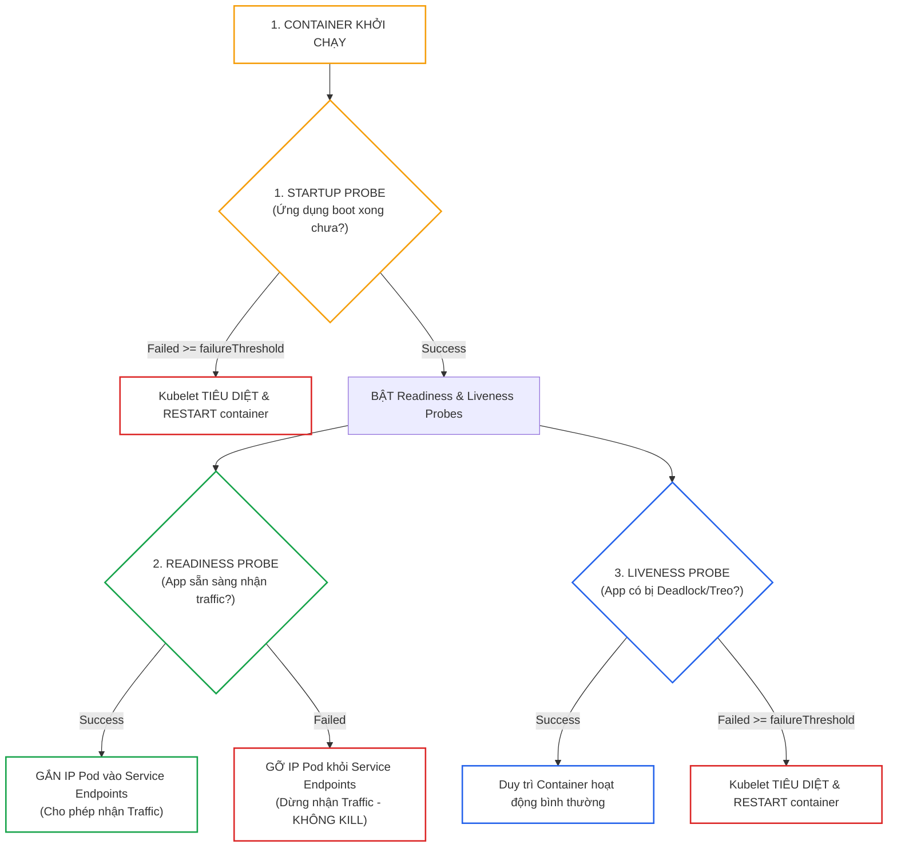
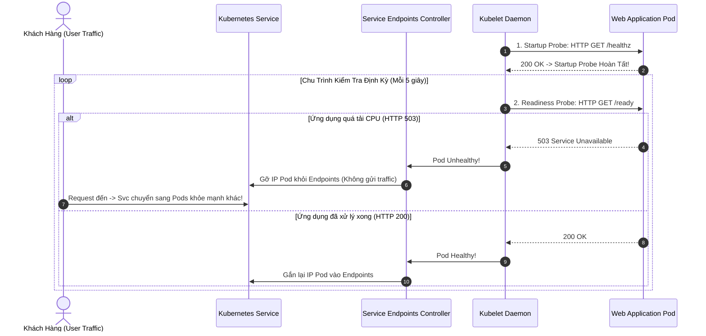
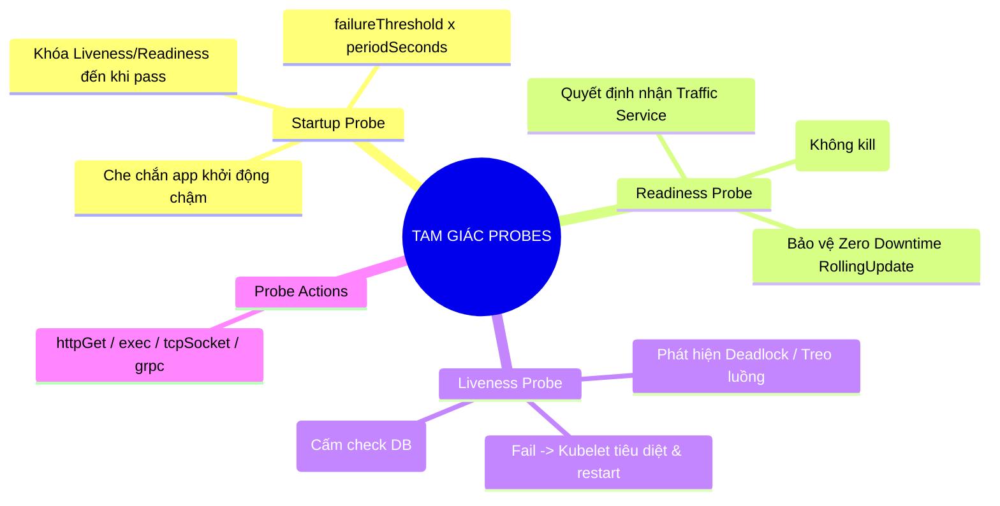


> [!IMPORTANT]
> **Mục tiêu kỹ thuật cốt lõi**: Nắm vững phương pháp thiết kế và cấu hình **Tam Giác Kiểm Soát Sức Khỏe Ứng Dụng (Health Check Probes)** thuộc miền **Application Observability and Maintenance (15%)** của kỳ thi CKAD. Thiết lập chính xác **StartupProbe**, **ReadinessProbe**, và **LivenessProbe**; tính toán hạn ngạch thời gian tối ưu cho từng loại hình microservices; và phân tích nguyên nhân gốc rễ (**5-Whys**) của các thảm họa sập dịch vụ do cấu hình Probe sai lầm.

---

## 1. Bản Chất Kiến Trúc & Tư Duy Cốt Lõi: Tam Giác Probes & Chu Trình Kiểm Tra Của Kubelet

Trong một hệ thống phân tán, việc một tiến trình container đang chạy (`Running`) **không đồng nghĩa với việc ứng dụng đang hoạt động tốt**. Ứng dụng có thể rơi vào tình trạng khóa chết (**Deadlock**), rò rỉ bộ nhớ nghiêm trọng, hoặc chưa tải xong dữ liệu đệm ban đầu. Kubelet định kỳ thực thi các cơ chế thăm dò (Probes) để chủ động phát hiện và xử lý sự cố.



### 3 Trụ Cột Trong Tam Giác Probes:

1. **Startup Probe (Bảo Vệ Khởi Động)**:
   - *Mục đích:* Dành riêng cho các ứng dụng khởi động chậm (Java Spring Boot, ứng dụng nạp dữ liệu lớn).
   - *Cơ chế:* Khi Startup Probe được cấu hình, **Kubelet sẽ tạm thời khóa cả Liveness và Readiness Probes**. Chỉ khi Startup Probe thành công lần đầu, hai probe kia mới bắt đầu hoạt động.
2. **Readiness Probe (Sẵn Sàng Nhận Tải)**:
   - *Mục đích:* Quyết định xem Pod có được phép nhận lưu lượng mạng từ **Kubernetes Service / Ingress** hay không.
   - *Hành vi khi lỗi:* Kubelet **GỠ ĐỊA CHỈ IP CỦA POD KHỎI SERVICE ENDPOINTS**. Container **KHÔNG BỊ RESTART**.
3. **Liveness Probe (Sự Sống Của Tiến Trình)**:
   - *Mục đích:* Phát hiện các trường hợp ứng dụng bị treo, deadlock, hoặc crash ngầm không thể tự phục hồi.
   - *Hành vi khi lỗi:* Kubelet **TIÊU DIỆT (SIGKILL) VÀ KHỞI ĐỘNG LẠI CONTAINER** theo `restartPolicy`.

---

## 2. Bảng Ma Trận So Sánh Kỹ Thuật Toàn Diện (Engineering Matrix)

### Ma Trận Đối Sánh Chi Tiết 3 Loại Health Probes

| Tiêu Chí Kỹ Thuật | Startup Probe | Readiness Probe | Liveness Probe |
|---|---|---|---|
| **Mục Đích Cốt Lõi** | Xác định ứng dụng đã boot xong | Xác định ứng dụng sẵn sàng nhận request | Phát hiện ứng dụng bị deadlock / treo luồng |
| **Hành Động Khi Thất Bại** | **Restart Container** | **Gỡ IP khỏi Service Endpoints** | **Restart Container** |
| **Ảnh Hưởng Tới Traffic** | Không nhận traffic | **Chặn toàn bộ traffic từ Service** | Mất traffic tạm thời khi Pod restart |
| **Ảnh Hưởng Vòng Đời Pod** | Giữ Pod ở trạng thái NotReady | Pod vẫn `Running` nhưng `READY: 0/1` | Pod tăng số lần `RESTARTS` |
| **Endpoint Khuyến Nghị** | `/healthz` hoặc cổng TCP | `/ready` (Kiểm tra nội bộ, cache, DB local) | `/live` hoặc `/ping` (Chỉ kiểm tra process) |
| **Cạm Bẫy Phổ Biến** | Đặt failureThreshold quá ngắn | Kiểm tra DB ngoài khiến rớt Endpoints oan | Kiểm tra DB khiến cụm bị restart dây chuyền |

### So Sánh 4 Phương Thức Thăm Dò (Probe Actions)

| Phương Thức | Cú Pháp Khai Báo | Cơ Chế Đánh Giá Thành Công | Trường Hợp Phù Hợp |
|---|---|---|---|
| **`httpGet`** | `httpGet: {path: /ready, port: 8080}` | Trả về mã HTTP Status Code **$\ge 200$ và $< 400$** | Web Apps, REST APIs, Microservices |
| **`tcpSocket`** | `tcpSocket: {port: 3306}` | Thiết lập kết nối **TCP Handshake thành công** | Databases, Redis, Message Queues, Kafka |
| **`exec`** | `exec: {command: ["cat", "/tmp/healthy"]}` | Lệnh thực thi trong container trả về **Exit Code 0** | Tác vụ Script, Daemon không mở cổng mạng |
| **`grpc`** | `grpc: {port: 50051}` | Trả về trạng thái `SERVING` chuẩn gRPC Health | Dịch vụ Microservices thuần gRPC |

---

## 3. Kiến Trúc Môi Trường & Luồng Thực Thi Mẫu

### Chu Trình Đánh Giá Probes Của Kubelet và Service Endpoints Controller



### Manifest Mẫu Triển Khai Đầy Đủ 3 Loại Probes Chuẩn Mực

```yaml
# production-probes-deployment.yaml
apiVersion: apps/v1
kind: Deployment
metadata:
  name: enterprise-api
  namespace: default
spec:
  replicas: 3
  selector:
    matchLabels:
      app: enterprise-api
  template:
    metadata:
      labels:
        app: enterprise-api
    spec:
      containers:
      - name: api
        image: nginx:alpine
        ports:
        - containerPort: 80
        resources:
          requests:
            cpu: 100m
            memory: 128Mi
          limits:
            cpu: 500m
            memory: 256Mi
        # 1. STARTUP PROBE: Cho phép ứng dụng khởi động tối đa 60 giây (30 x 2s)
        startupProbe:
          httpGet:
            path: /
            port: 80
          periodSeconds: 2
          failureThreshold: 30
        # 2. READINESS PROBE: Kiểm tra khả năng nhận request mỗi 5 giây
        readinessProbe:
          httpGet:
            path: /
            port: 80
          initialDelaySeconds: 2
          periodSeconds: 5
          timeoutSeconds: 2
          failureThreshold: 3
          successThreshold: 1
        # 3. LIVENESS PROBE: Kiểm tra sự sống mỗi 10 giây (chỉ chạy sau khi startup probe pass)
        livenessProbe:
          httpGet:
            path: /
            port: 80
          periodSeconds: 10
          timeoutSeconds: 3
          failureThreshold: 3
```

---

## 4. Phân Tích Cạm Bẫy Thực Chiến: Đặt Endpoint Database Check Vào Liveness Probe Gây Thảm Họa Thác Đổ (Cascading Failure)

### Tình Huống Sự Cố: Cơ Sở Dữ Liệu Chậm Làm Sập 100% Cụm Microservices Trong Vòng 2 Phút

Một đội phát triển cấu hình `livenessProbe` gọi vào endpoint `/healthz`. Bên trong mã nguồn, hàm xử lý `/healthz` thực hiện câu lệnh `SELECT 1 FROM users` để kiểm tra kết nối Database. Vào một đợt Flash Sale, CSDL PostgreSQL bị quá tải CPU khiến thời gian phản hồi câu lệnh truy vấn tăng từ 5ms lên 4 giây. Hậu quả là toàn bộ 50 Pods microservices đều bị Kubelet đánh dấu fail Liveness Probe và bị **restart đồng loạt**. Khi 50 Pods cùng khởi động lại, chúng ồ ạt mở kết nối mới tới Database, khiến Database sập hoàn toàn.

### Hậu Quả & Log Lỗi Thực Tế:
```text
Events:
  Type     Reason     Age                From     Message
  ----     ------     ----               ----     -------
  Warning  Unhealthy  12s (x3 over 22s)  kubelet  Liveness probe failed: Get "http://10.244.1.15:8080/healthz": context deadline exceeded (Client.Timeout exceeded while awaiting headers)
  Normal   Killing    12s                kubelet  Container api failed liveness probe, will be restarted
[CRITICAL] 50/50 Pods restarted simultaneously. Cluster CrashLoopBackOff detected.
```

### 5-Whys Root Cause Analysis:
1. **Tại sao toàn bộ 50 Pods bị restart đồng loạt?** Vì tất cả các Pod đều bị Kubelet kill do Liveness Probe thất bại liên tiếp 3 lần.
2. **Tại sao Liveness Probe bị thất bại?** Vì endpoint `/healthz` bị timeout vượt quá `timeoutSeconds: 2`.
3. **Tại sao endpoint `/healthz` bị timeout?** Vì câu lệnh `SELECT 1` kiểm tra CSDL bị nghẽn do Database đang bị quá tải kết nối.
4. **Tại sao việc Database chậm lại kích hoạt tiêu diệt container ứng dụng?** Vì lập trình viên đã đặt logic kiểm tra dịch vụ phụ thuộc bên ngoài (External Dependency) vào bên trong **Liveness Probe**.
5. **Gốc rễ vấn đề (Root Cause):** Nhầm lẫn nghiêm trọng giữa mục đích của Liveness Probe và Readiness Probe. Liveness Probe chỉ được kiểm tra **sự sống của chính tiến trình cục bộ**, tuyệt đối không được kiểm tra các phụ thuộc dùng chung.

### Biện Pháp Khắc Phục Chuẩn:
```diff
--- a/deployment.yaml
+++ b/deployment.yaml
@@ -15,10 +15,12 @@
+        # LIVENESS PROBE: Chỉ kiểm tra endpoint nội bộ siêu nhẹ (/ping hoặc /live)
         livenessProbe:
           httpGet:
-            path: /healthz  # Endpoint cũ có check Database
+            path: /livez    # Endpoint mới: Chỉ trả về HTTP 200 nếu process còn sống
             port: 8080
           periodSeconds: 10
+        # READINESS PROBE: Kiểm tra phụ thuộc (/ready). Khi DB chậm chỉ tạm gỡ traffic, KHÔNG KILL POD!
         readinessProbe:
           httpGet:
-            path: /ready
+            path: /readyz   # Endpoint kiểm tra DB/Cache
             port: 8080
```

---

## 5. Hands-on Lab: Cấu Hình & Xử Lý 3 Kịch Bản Sự Cố Probes (8 Bước)

| Bước | Kịch Bản Thử Nghiệm | Mục Tiêu Kỹ Thuật | Lệnh / Manifest Kiểm Tra Chính |
|---|---|---|---|
| **1** | Kịch bản 1: Ứng dụng khởi động chậm 30 giây | Mô phỏng container boot chậm | Script tạo delay 30s |
| **2** | Cấu hình StartupProbe che chắn | Ngăn chặn Kubelet kill Pod trong lúc boot | `startupProbe` với `failureThreshold: 30` |
| **3** | Kịch bản 2: Ứng dụng mất khả năng phục vụ | Mô phỏng ứng dụng quá tải HTTP 503 | Đổi file flag để báo lỗi readiness |
| **4** | Quan sát hành vi Readiness Probe | Xác minh IP Pod bị gỡ khỏi Endpoints | `kubectl get endpoints -w` |
| **5** | Kịch bản 3: Ứng dụng bị Deadlock treo luồng | Mô phỏng tiến trình chết ngầm | Khóa endpoint liveness |
| **6** | Quan sát hành vi Liveness Probe | Kubelet tự động tiêu diệt và hồi phục | `RESTARTS` count tăng lên 1 |
| **7** | Cấu hình Probe phương thức `exec` | Kiểm tra sự tồn tại của tệp trên đĩa | `exec: {command: ["test", "-f", "/tmp/ok"]}` |
| **8** | Cấu hình Probe phương thức `tcpSocket` | Kiểm tra mở cổng TCP trên container | `tcpSocket: {port: 80}` |

---

### Bước 1: Triển Khai Pod Khởi Động Chậm Kèm StartupProbe

```yaml
# 1-slow-start-pod.yaml
apiVersion: v1
kind: Pod
metadata:
  name: slow-boot-app
  namespace: default
spec:
  containers:
  - name: app
    image: busybox:1.36
    command: ["/bin/sh", "-c"]
    # Ứng dụng ngủ 25 giây rồi mới tạo file /tmp/ready để báo boot xong
    args:
    - "echo 'Đang khởi động ứng dụng...' && sleep 25 && touch /tmp/ready && echo 'Boot hoàn tất!' && sleep 3600"
    startupProbe:
      exec:
        command: ["cat", "/tmp/ready"]
      periodSeconds: 2
      failureThreshold: 20
    livenessProbe:
      exec:
        command: ["cat", "/tmp/ready"]
      periodSeconds: 5
```
```bash
kubectl apply -f 1-slow-start-pod.yaml
# Theo dõi tiến trình khởi động an toàn mà không bị restart
kubectl get pod slow-boot-app -w
```

---

### Bước 2: Triển Khai Deployment Có ReadinessProbe & Service

```yaml
# 2-readiness-demo.yaml
apiVersion: apps/v1
kind: Deployment
metadata:
  name: web-readiness-demo
spec:
  replicas: 2
  selector:
    matchLabels:
      app: web-readiness
  template:
    metadata:
      labels:
        app: web-readiness
    spec:
      containers:
      - name: nginx
        image: nginx:alpine
        readinessProbe:
          httpGet:
            path: /health.html
            port: 80
          periodSeconds: 2
          failureThreshold: 2
---
apiVersion: v1
kind: Service
metadata:
  name: web-readiness-svc
spec:
  selector:
    app: web-readiness
  ports:
  - port: 80
    targetPort: 80
```
```bash
kubectl apply -f 2-readiness-demo.yaml
```

---

### Bước 3: Tạo File Health Check Để Pod Chuyển Sang Trạng Thái Ready

```bash
# Tạo file health.html trên cả 2 Pods để Readiness Probe thành công
POD1=$(kubectl get pods -l app=web-readiness -o jsonpath='{.items[0].metadata.name}')
POD2=$(kubectl get pods -l app=web-readiness -o jsonpath='{.items[1].metadata.name}')

kubectl exec $POD1 -- /bin/sh -c "echo OK > /usr/share/nginx/html/health.html"
kubectl exec $POD2 -- /bin/sh -c "echo OK > /usr/share/nginx/html/health.html"

# Kiểm tra cả 2 Pods đều đạt READY: 1/1
kubectl get pods -l app=web-readiness
kubectl get endpoints web-readiness-svc
```

---

### Bước 4: Giả Lập Sự Cố Quá Tải Để Quan Sát Cơ Chế Tách Endpoints

```bash
# Xóa file health.html trên Pod 1 để mô phỏng Pod bị lỗi
kubectl exec $POD1 -- rm /usr/share/nginx/html/health.html

# Quan sát: Pod 1 chuyển sang READY: 0/1 nhưng KHÔNG BỊ RESTART!
sleep 5
kubectl get pods -l app=web-readiness

# Kiểm tra Service Endpoints: Chỉ còn duy nhất IP của Pod 2 phục vụ traffic!
kubectl get endpoints web-readiness-svc
```

---

### Bước 5: Thử Nghiệm LivenessProbe Tự Hồi Phục Khi Deadlock

```yaml
# 3-liveness-exec.yaml
apiVersion: v1
kind: Pod
metadata:
  name: liveness-exec-demo
spec:
  containers:
  - name: healthy-app
    image: busybox:1.36
    command: ["/bin/sh", "-c"]
    # Tạo file /tmp/healthy, sau 15 giây thì xóa file để mô phỏng deadlock
    args:
    - "touch /tmp/healthy && sleep 15 && rm -rf /tmp/healthy && sleep 3600"
    livenessProbe:
      exec:
        command: ["cat", "/tmp/healthy"]
      initialDelaySeconds: 5
      periodSeconds: 2
      failureThreshold: 2
```
```bash
kubectl apply -f 3-liveness-exec.yaml
# Quan sát sau 20 giây: Kubelet phát hiện file biến mất -> Tiêu diệt và restart container!
kubectl get pod liveness-exec-demo -w
```

---

### Bước 6: Thử Nghiệm Phương Thức `tcpSocket`

```yaml
# 4-tcpsocket-probe.yaml
apiVersion: v1
kind: Pod
metadata:
  name: tcp-probe-demo
spec:
  containers:
  - name: redis
    image: redis:alpine
    ports:
    - containerPort: 6379
    readinessProbe:
      tcpSocket:
        port: 6379
      initialDelaySeconds: 2
      periodSeconds: 5
    livenessProbe:
      tcpSocket:
        port: 6379
      initialDelaySeconds: 5
      periodSeconds: 10
```
```bash
kubectl apply -f 4-tcpsocket-probe.yaml
kubectl get pod tcp-probe-demo
```

---

### Bước 7: Kiểm Tra Nhật Ký Sự Kiện (Events) Của Probes

```bash
# Sử dụng kubectl describe để xem chi tiết các cảnh báo Unhealthy
kubectl describe pod liveness-exec-demo | grep -E "Liveness|Events:" -A 10
```

---

### Bước 8: Dọn Dẹp Tài Nguyên Lab

```bash
kubectl delete pod slow-boot-app liveness-exec-demo tcp-probe-demo --grace-period=0 --force
kubectl delete deployment web-readiness-demo
kubectl delete svc web-readiness-svc
```

---

## 6. 10 Câu Hỏi Tự Kiểm Tra Chuyên Sâu (Self-Check Q&A Accordion)

<details class="qa-card">
<summary><b>1. Tại sao không nên kiểm tra các dịch vụ phụ thuộc bên ngoài (như Database, Redis) trong Liveness Probe?</b></summary>
<div class="qa-answer">
<p>Nếu Database gặp sự cố chậm phản hồi hoặc quá tải, toàn bộ các Pods phụ thuộc sẽ cùng bị fail Liveness Probe và bị Kubelet <b>tiêu diệt rồi khởi động lại đồng loạt</b>. Việc hàng trăm Pods cùng restart và đồng loạt kết nối lại sẽ gây ra hiện tượng <b>Thảm họa sập dây chuyền (Cascading Failure / Thundering Herd Problem)</b>, khiến cả ứng dụng lẫn Database bị tê liệt hoàn toàn. Logic kiểm tra Database chỉ được phép đặt trong <b>Readiness Probe</b>.</p>
</div>
</details>

<details class="qa-card">
<summary><b>2. Sự khác biệt cốt lõi về mặt hành vi giữa Liveness Probe và Readiness Probe khi gặp lỗi là gì?</b></summary>
<div class="qa-answer">
<p>Khi <b>Liveness Probe</b> thất bại vượt quá <code>failureThreshold</code>, Kubelet sẽ <b>Restart Container</b>. Trong khi đó, khi <b>Readiness Probe</b> thất bại, Kubelet <b>không restart container</b> mà chỉ <b>gỡ địa chỉ IP của Pod ra khỏi Service Endpoints</b> để tạm dừng nhận lưu lượng truy cập.</p>
</div>
</details>

<details class="qa-card">
<summary><b>3. Vai trò của tham số `successThreshold` trong cấu hình Probe là gì?</b></summary>
<div class="qa-answer">
<p><code>successThreshold</code> định nghĩa <b>số lần thăm dò thành công liên tiếp tối thiểu</b> để một Probe (đang ở trạng thái lỗi) được công nhận là đã hồi phục và chuyển sang trạng thái Healthy. Đối với Liveness và Startup Probes, giá trị này bắt buộc phải bằng <code>1</code>. Đối với Readiness Probe, giá trị này có thể lớn hơn 1.</p>
</div>
</details>

<details class="qa-card">
<summary><b>4. Khi một Pod có cấu hình Startup Probe, Kubelet sẽ xử lý Liveness và Readiness Probes như thế nào?</b></summary>
<div class="qa-answer">
<p>Kubelet sẽ <b>tạm thời vô hiệu hóa (Disable) hoàn toàn</b> cả Liveness Probe và Readiness Probe trong suốt giai đoạn Startup Probe đang chạy. Chỉ khi Startup Probe thăm dò thành công lần đầu tiên, Kubelet mới bắt đầu kích hoạt chu trình kiểm tra của Liveness và Readiness Probes.</p>
</div>
</details>

<details class="qa-card">
<summary><b>5. Công thức tính thời gian khởi động tối đa (Max Startup Time) mà Startup Probe cho phép là gì?</b></summary>
<div class="qa-answer">
<p>Thời gian tối đa được tính theo công thức:</p>
<pre><code>Max Startup Time = periodSeconds x failureThreshold</code></pre>
<p>Ví dụ: <code>periodSeconds: 5</code> và <code>failureThreshold: 30</code> $\rightarrow$ Ứng dụng được phép khởi động tối đa trong $5 \times 30 = 150$ giây.</p>
</div>
</details>

<details class="qa-card">
<summary><b>6. Các mã HTTP Status Code nào được phương thức `httpGet` coi là Probe thành công?</b></summary>
<div class="qa-answer">
<p>Tất cả các mã phản hồi HTTP nằm trong dải <b>từ 200 đến 399</b> ($\ge 200$ và $< 400$) đều được coi là thành công. Mọi mã từ 400 trở lên (như 401, 403, 404, 500, 503) hoặc lỗi không kết nối được (Connection Timeout) đều bị coi là thất bại.</p>
</div>
</details>

<details class="qa-card">
<summary><b>7. Tham số `timeoutSeconds` có ý nghĩa gì và nếu ứng dụng phản hồi chậm hơn giá trị này thì sao?</b></summary>
<div class="qa-answer">
<p><code>timeoutSeconds</code> là <b>thời gian tối đa (tính bằng giây)</b> mà Kubelet chờ đợi phản hồi từ Probe (mặc định là 1 giây). Nếu ứng dụng phản hồi sau thời gian này, lần thăm dò đó sẽ bị tính là một lần thất bại (Fail do Timeout).</p>
</div>
</details>

<details class="qa-card">
<summary><b>8. Khi sử dụng phương thức `exec`, làm thế nào Kubelet biết được câu lệnh kiểm tra thành công hay thất bại?</b></summary>
<div class="qa-answer">
<p>Kubelet dựa vào <b>Exit Code của tiến trình</b> được thực thi bên trong container: nếu lệnh trả về <b>Exit Code = 0</b> thì Probe thành công; nếu trả về mã khác 0 thì Probe thất bại.</p>
</div>
</details>

<details class="qa-card">
<summary><b>9. Tại sao trong môi trường Production ta nên thiết lập `initialDelaySeconds` cho Readiness Probe?</b></summary>
<div class="qa-answer">
<p><code>initialDelaySeconds</code> giúp Kubelet không gửi request thăm dò quá sớm ngay khi container vừa được tạo, tránh gây lãng phí tài nguyên CPU và tránh ghi nhận các lỗi Unhealthy giả lập trong vài giây đầu tiên khi ứng dụng đang nạp runtime.</p>
</div>
</details>

<details class="qa-card">
<summary><b>10. Điều gì sẽ xảy ra nếu một Deployment không khai báo `readinessProbe` trong quá trình RollingUpdate?</b></summary>
<div class="qa-answer">
<p>Kubernetes sẽ coi mỗi Pod mới là Ready <b>ngay lập tức khi container process vừa khởi động</b>. Hệ thống sẽ lập tức tiêu diệt các Pods cũ và chuyển toàn bộ lưu lượng người dùng vào Pods mới. Nếu ứng dụng mới cần 10 giây để nạp framework, người dùng sẽ nhận hàng loạt lỗi <b>HTTP 502 Bad Gateway / Connection Refused</b> trong 10 giây đó.</p>
</div>
</details>

---

## 7. Tổng Kết & Lộ Trình Bài Học Tiếp Theo



Làm chủ tam giác Probes là nền tảng cốt lõi giúp ứng dụng Cloud-Native tự phục hồi khi gặp sự cố, đảm bảo dịch vụ luôn sẵn sàng và loại bỏ triệt để các sự cố gián đoạn vô cớ.

> [!TIP]
> **Bài học tiếp theo**: Khám phá các kỹ thuật chẩn đoán và khắc phục sự cố ứng dụng tầng sâu với **[Bài 08: Chẩn Đoán Tầng Ứng Dụng: Logging, Events & Ephemeral Debug Containers](ckad-08-08-log-su-kien-va-debug-container.html)**.

