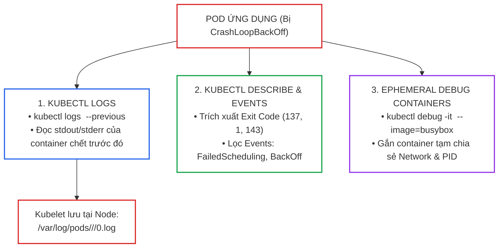
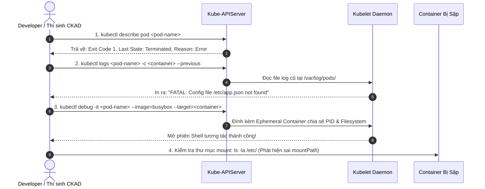
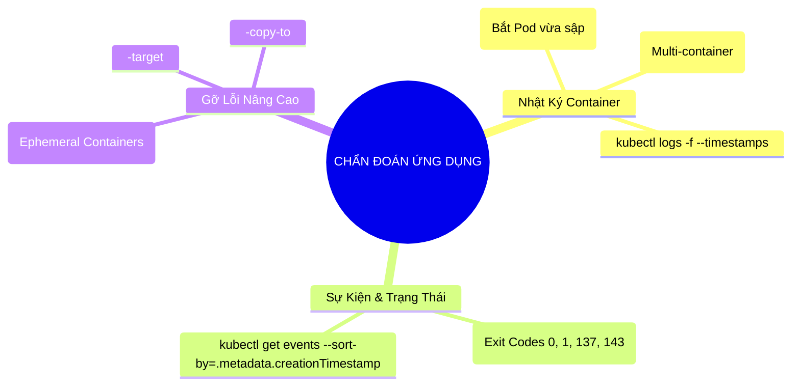


> [!IMPORTANT]
> **Mục tiêu kỹ thuật cốt lõi**: Làm chủ toàn diện các kỹ thuật **Chẩn Đoán và Gỡ Lỗi Ứng Dụng (Application Observability & Debugging)** thuộc miền **Application Observability and Maintenance (15%)** của kỳ thi CKAD. Truy vết nhanh chóng nguyên nhân sập của container với **`kubectl logs --previous`**, phân tích các mã kết thúc (**Exit Codes**), sắp xếp nhật ký sự kiện (**Kubernetes Events**), và đính kèm container tạm thời (**Ephemeral Containers**) vào các Pods sản xuất không có sẵn shell.

---

## 1. Bản Chất Kiến Trúc & Tư Duy Cốt Lõi: Kiến Trúc Logging & Cơ Chế Ephemeral Debug Containers

Khi ứng dụng chạy trên Kubernetes gặp sự cố (ví dụ `CrashLoopBackOff`, `OOMKilled`, hoặc treo luồng), phản xạ đầu tiên của kỹ sư không phải là xóa Pod, mà là **thu thập thông tin hiện trường (Forensic Evidence)** trước khi dữ liệu bị xóa sạch.



### 3 Cấp Độ Chẩn Đoán Sự Cố Ứng Dụng:

1. **Cấp Độ 1: Đọc Nhật Ký Tiến Trình (Container Logs)**:
   - Toàn bộ nội dung mà ứng dụng in ra `stdout` và `stderr` được Container Runtime thu thập và ghi vào file log trên Worker Node (`/var/log/pods/`).
   - Khi container bị crash và restart lại, lệnh `kubectl logs <pod>` thông thường sẽ chỉ hiển thị log của container *mới* (thường rỗng). Cờ **`--previous`** (hoặc `-p`) là chìa khóa bắt buộc để đọc lại nhật ký của container *ngay trước thời điểm nó bị chết*.
2. **Cấp Độ 2: Truy Vết Sự Kiện Hệ Thống (Kubernetes Events)**:
   - Các sự kiện cảnh báo (Warning Events như `FailedMount`, `FailedScheduling`, `Unhealthy Probe`, `BackOff`) được lưu trữ trong etcd với thời gian sống mặc định là **1 giờ**.
   - Cú pháp `kubectl get events --sort-by=.metadata.creationTimestamp` giúp tái hiện chính xác dòng thời gian sự cố.
3. **Cấp Độ 3: Gỡ Lỗi Động Với Ephemeral Containers (`kubectl debug`)**:
   - Đối với các container mỏng (**Distroless**) hoặc không có sẵn shell (`/bin/sh`, `curl`, `netstat`), ta không thể dùng `kubectl exec`.
   - Tính năng **Ephemeral Containers** (Container tạm thời) cho phép "bắn" một container đầy đủ công cụ chẩn đoán (ví dụ `busybox`, `netshoot`) vào thẳng trong Pod đang chạy mà không làm gián đoạn tiến trình chính.

---

## 2. Bảng Ma Trận So Sánh Kỹ Thuật Toàn Diện (Engineering Matrix)

### Ma Trận Công Cụ Chẩn Đoán Lỗi Ứng Dụng Trên Kubernetes

| Công Cụ / Lệnh CLI | Mục Đích Thu Thập Dữ Liệu | Yêu Cầu Trạng Thái Pod | Hoạt Động Được Trên Distroless? | Tác Động Tới Production | Ứng Dụng Trong Phòng Thi CKAD |
|---|---|---|---|---|---|
| **`kubectl logs`** | Xem output `stdout/stderr` của ứng dụng | Pod `Running` hoặc `CrashLoop` | **Có** (Đọc từ file log của Node) | **0% (Không ảnh hưởng)** | Dùng đầu tiên để đọc log lỗi cú pháp/mã nguồn |
| **`kubectl logs -p`** | Xem log của container chết ở lần chạy trước | Pod có `RESTARTS > 0` | **Có** | **0% (Không ảnh hưởng)** | Tìm nguyên nhân sập của các Pod CrashLoop |
| **`kubectl describe`** | Xem Exit Code, Last State, Reason, Events | Mọi trạng thái (Pending/Crash/OOM) | **Có** (Đọc metadata từ APIServer) | **0% (Không ảnh hưởng)** | Xác định Pod lỗi do OOMKilled (137) hay sai Probes |
| **`kubectl get events`** | Lọc dòng thời gian cảnh báo của toàn cụm | Mọi trạng thái | **Có** | **0% (Không ảnh hưởng)** | Tìm lỗi ImagePullBackOff, QuotaExceeded, NetPol |
| **`kubectl exec`** | Mở shell tương tác trực tiếp bên trong container | Pod phải đang **`Running`** | **Không** (Cần `/bin/sh` trong image) | Có thể làm thay đổi file nội bộ nếu gõ nhầm | Kiểm tra file config, biến môi trường, test curl |
| **`kubectl debug`** | Gắn Ephemeral container hoặc clone Pod sửa lệnh | Mọi trạng thái | **Có** (Đưa shell từ image ngoài vào) | Rất an toàn (Không sửa đổi Pod spec gốc) | Debug container Distroless, sửa command sai |

---

## 3. Kiến Trúc Môi Trường & Luồng Thực Thi Mẫu

### Chu Trình Chẩn Đoán Sự Cố 4 Bước Tiêu Chuẩn Của Developer



---

## 4. Phân Tích Cạm Bẫy Thực Chiến: Container Chết Ngay Khi Khởi Động Không Thể Dùng `kubectl exec` Để Debug

### Tình Huống Sự Cố: Lệnh `command` Bị Sai Khiến Pod Sập Sau 0.5 Giây Và `kubectl exec` Luôn Bị Từ Chối

Một lập trình viên triển khai Pod nhưng viết sai đường dẫn tệp thực thi trong `command: ["/bin/myapp"]`. Pod liên tục rơi vào trạng thái `CrashLoopBackOff`. Lập trình viên cố gắng chạy lệnh `kubectl exec -it <pod> -- /bin/sh` để vào sửa file, nhưng lệnh luôn trả về lỗi thất bại.

### Hậu Quả & Log Lỗi Thực Tế:
```text
$ kubectl exec -it my-broken-pod -- /bin/sh
error: unable to upgrade connection: container not found ("my-app")
error: container "my-app" in pod "my-broken-pod" is not running (state is Waiting: CrashLoopBackOff)
```

### 5-Whys Root Cause Analysis:
1. **Tại sao lệnh `kubectl exec` bị từ chối?** Vì container `my-app` đang không ở trạng thái `Running` (nó đang ở trạng thái `Waiting` giữa các nhịp restart).
2. **Tại sao container không ở trạng thái Running?** Vì tiến trình bên trong container kết thúc ngay lập tức sau 0.1 giây khởi động.
3. **Tại sao tiến trình kết thúc ngay lập tức?** Vì đường dẫn binary `/bin/myapp` không tồn tại trong file system của Image.
4. **Tại sao lập trình viên không thể vào shell để kiểm tra?** Vì `kubectl exec` yêu cầu tiến trình container phải đang sống để Kubelet gán luồng stdin/stdout vào process namespace.
5. **Gốc rễ vấn đề (Root Cause):** Kỹ sư không nắm vững cơ chế của `kubectl exec` và không sử dụng lệnh **`kubectl debug --copy-to`** để tạo bản sao Pod ghi đè lệnh khởi động thành `sleep 3600` phục vụ điều tra.

### Biện Pháp Khắc Phục Chuẩn (Dùng `kubectl debug --copy-to`):
```bash
# Tạo bản sao Pod ghi đè lệnh khởi động thành sleep để giữ Pod sống
kubectl debug my-broken-pod \
  --copy-to=my-debug-pod \
  --container=my-app \
  -- sh -c "sleep 3600"

# Bây giờ Pod đã Running an toàn, mở exec vào kiểm tra đường dẫn file thực tế!
kubectl exec -it my-debug-pod -- /bin/sh
```

---

## 5. Hands-on Lab: Chẩn Đoán Thực Tế 4 Tình Huống Sập Ứng Dụng (8 Bước)

| Bước | Tình Huống Chẩn Đoán | Mục Tiêu Kỹ Thuật | Lệnh / Thao Tác Kiểm Tra Chính |
|---|---|---|---|
| **1** | Khởi tạo Pod lỗi CrashLoopBackOff | Mô phỏng container sập sau khi in log | `kubectl apply` Pod crash script |
| **2** | Sử dụng `kubectl logs --previous` | Trích xuất nhật ký lỗi của phiên chạy trước | `kubectl logs <pod> -p` |
| **3** | Sắp xếp sự kiện hệ thống theo thời gian | Lọc danh sách Warning Events | `kubectl get events --sort-by` |
| **4** | Phân tích mã kết thúc Exit Code | Đọc thông tin chi tiết qua describe | `kubectl describe pod` grep Exit Code |
| **5** | Đính kèm Ephemeral Debug Container | Mở shell gỡ lỗi vào Pod Distroless | `kubectl debug -it <pod> --image=busybox` |
| **6** | Chia sẻ Process Namespace (PID) | Soi các tiến trình của container chính | `kubectl debug --target=<container>` |
| **7** | Tạo bản sao Pod ghi đè lệnh khởi động | Cứu hộ Pod không thể chạy | `kubectl debug --copy-to` |
| **8** | Dọn dẹp tài nguyên debug | Xóa các Pods thử nghiệm | `kubectl delete pod` |

---

### Bước 1: Khởi Tạo Pod Gặp Sự Cố CrashLoopBackOff

```yaml
# crash-demo.yaml
apiVersion: v1
kind: Pod
metadata:
  name: crashing-app
  namespace: default
spec:
  containers:
  - name: backend
    image: busybox:1.36
    command: ["/bin/sh", "-c"]
    # Ứng dụng chạy 3 giây rồi gặp lỗi sập với exit code 1
    args:
    - "echo '[$(date)] Khởi tạo ứng dụng...' && sleep 2 && echo '[ERROR] Database connection string invalid: user=admin host=null' && exit 1"
```
```bash
kubectl apply -f crash-demo.yaml
sleep 6
kubectl get pod crashing-app
```
> Trạng thái hiển thị: `STATUS: CrashLoopBackOff`, `RESTARTS: 1` hoặc `2`.

---

### Bước 2: Đọc Log Lỗi Của Container Ở Lần Chạy Trước

```bash
# Thử đọc log thông thường (có thể rỗng nếu container vừa bị kill):
kubectl logs crashing-app -c backend

# ĐỌC NHẬT KÝ CHÍNH XÁC BẰNG CỜ --previous:
kubectl logs crashing-app -c backend --previous
```
> Đầu ra hiển thị rõ ràng dòng log cuối cùng: `[ERROR] Database connection string invalid: user=admin host=null`.

---

### Bước 3: Sắp Xếp Toàn Bộ Sự Kiện Trong Namespace Theo Thời Gian

```bash
# Lọc toàn bộ events sắp xếp từ cũ đến mới
kubectl get events --sort-by=.metadata.creationTimestamp

# Chỉ lọc các sự kiện có Type là Warning (Cảnh báo lỗi)
kubectl get events --field-selector type=Warning --sort-by=.metadata.creationTimestamp
```

---

### Bước 4: Phân Tích Trạng Thái Exit Code Bằng `kubectl describe`

```bash
kubectl describe pod crashing-app | grep -E "State:|Last State:|Exit Code:|Reason:" -A 2
```
> Kết quả trả về:
> `Last State: Terminated`
> `Reason: Error`
> `Exit Code: 1` (Chỉ ra lỗi từ bên trong mã nguồn ứng dụng).

---

### Bước 5: Triển Khai Pod Distroless Không Có Shell & Gắn Ephemeral Container

```yaml
# distroless-demo.yaml
apiVersion: v1
kind: Pod
metadata:
  name: distroless-web
  namespace: default
spec:
  containers:
  - name: web
    image: gcr.io/distroless/static-debian12:nonroot
    # Container chạy ngầm không có /bin/sh
```
```bash
kubectl apply -f distroless-demo.yaml

# Thử exec vào Pod (SẼ BÁO LỖI OCI runtime exec failed vì không có shell):
kubectl exec -it distroless-web -- /bin/sh || true
```
```text
OCI runtime exec failed: exec: "/bin/sh": stat /bin/sh: no such file or directory: unknown
```

```bash
# GIẢI PHÁP: Gắn một Ephemeral Container công cụ (busybox) vào Pod!
kubectl debug -it distroless-web --image=busybox:1.36 --target=web
```
> Bạn đã mở được phiên làm việc terminal bên trong Pod Distroless thành công!

---

### Bước 6: Kiểm Tra Tiến Trình Của Container Chính Qua Shared PID Namespace

Bên trong phiên shell của Ephemeral Container ở Bước 5:

```bash
# Xem danh sách tiến trình: Bạn nhìn thấy toàn bộ tiến trình của container web!
ps aux

# Thoát khỏi phiên debug
exit
```

---

### Bước 7: Cứu Hộ Pod Bằng Kỹ Thuật Clone & Ghi Đè Lệnh (`--copy-to`)

```bash
# Tạo bản sao Pod mang tên debug-fixed-pod và thay đổi lệnh khởi động
kubectl debug crashing-app \
  --copy-to=debug-fixed-pod \
  --container=backend \
  -- /bin/sh -c "echo 'Pod đã được giữ sống để debug'; sleep 3600"

# Kiểm tra bản sao Pod đang chạy ổn định
kubectl get pod debug-fixed-pod

# Mở shell vào bản sao để sửa lỗi
kubectl exec -it debug-fixed-pod -c backend -- /bin/sh
```

---

### Bước 8: Dọn Dẹp Toàn Bộ Tài Nguyên Lab

```bash
kubectl delete pod crashing-app distroless-web debug-fixed-pod --grace-period=0 --force
```

---

## 6. 10 Câu Hỏi Tự Kiểm Tra Chuyên Sâu (Self-Check Q&A Accordion)

<details class="qa-card">
<summary><b>1. Cờ `--previous` trong lệnh `kubectl logs` hoạt động theo nguyên lý kỹ thuật nào?</b></summary>
<div class="qa-answer">
<p>Kubelet lưu trữ các tệp log của container trên Worker Node tại thư mục <code>/var/log/pods/</code>. Khi container bị sập và Kubelet khởi tạo container mới, tệp log của container cũ vẫn được giữ lại tạm thời. Cờ <code>--previous</code> (hoặc <code>-p</code>) yêu cầu API Server đọc tệp log của <b>thể hiện container đã chết trước đó</b> thay vì container hiện tại.</p>
</div>
</details>

<details class="qa-card">
<summary><b>2. Tại sao lệnh `kubectl exec` không thể hoạt động trên các ảnh container Distroless?</b></summary>
<div class="qa-answer">
<p>Lệnh <code>kubectl exec</code> yêu cầu container runtime phải tìm thấy và thực thi một tệp nhị phân shell (như <code>/bin/sh</code> hoặc <code>/bin/bash</code>) bên trong chính filesystem của container đó. Ảnh Distroless đã bị <b>lược bỏ hoàn toàn toàn bộ shell và các tiện ích hệ điều hành</b>, dẫn đến lỗi <i>OCI runtime exec failed: no such file or directory</i>.</p>
</div>
</details>

<details class="qa-card">
<summary><b>3. Ý nghĩa của cờ `--target=<container-name>` trong lệnh `kubectl debug` là gì?</b></summary>
<div class="qa-answer">
<p>Cờ <code>--target</code> yêu cầu Ephemeral Container được tạo ra phải <b>chia sẻ chung Process Namespace (PID Namespace)</b> với container mục tiêu. Nhờ đó, từ bên trong container debug, bạn có thể chạy lệnh <code>ps aux</code> để quan sát, theo dõi hoặc gửi tín hiệu trực tiếp tới các tiến trình đang chạy của container mục tiêu.</p>
</div>
</details>

<details class="qa-card">
<summary><b>4. Sự khác biệt giữa Exit Code 0, Exit Code 1, Exit Code 137, và Exit Code 143 là gì?</b></summary>
<div class="qa-answer">
<p>Ý nghĩa các mã kết thúc:</p>
<div>1. <b>Exit Code 0:</b> Tiến trình hoàn thành nhiệm vụ thành công và tự tắt lịch sự (Success).</div>
<div>2. <b>Exit Code 1:</b> Lỗi nội bộ từ mã nguồn ứng dụng (Unhandled Application Exception / Syntax Error).</div>
<div>3. <b>Exit Code 137:</b> Tiến trình bị tiêu diệt cưỡng chế bằng tín hiệu <code>SIGKILL</code> (128 + 9), phổ biến nhất do <b>OOMKilled</b> (vượt quá Memory limit).</div>
<div>4. <b>Exit Code 143:</b> Tiến trình nhận tín hiệu <code>SIGTERM</code> (128 + 15) yêu cầu dừng lịch sự từ Kubernetes.</div>
</div>
</details>

<details class="qa-card">
<summary><b>5. Các sự kiện (Kubernetes Events) được lưu trữ ở đâu và có thời gian sống (TTL) mặc định là bao lâu?</b></summary>
<div class="qa-answer">
<p>Kubernetes Events là các đối tượng API được lưu trữ trong cơ sở dữ liệu <b>etcd</b> của cụm. Để tránh làm phình to dung lượng etcd, các sự kiện này có thời gian tồn tại mặc định là <b>1 giờ (60 phút)</b>, sau đó bộ điều khiển Garbage Collector của Kube-APIServer sẽ tự động xóa sạch.</p>
</div>
</details>

<details class="qa-card">
<summary><b>6. Cú pháp JSONPath nào giúp sắp xếp danh sách sự kiện Events từ cũ nhất đến mới nhất?</b></summary>
<div class="qa-answer">
<pre><code>kubectl get events --sort-by=.metadata.creationTimestamp</code></pre>
</div>
</details>

<details class="qa-card">
<summary><b>7. Khi nào ta nên sử dụng `kubectl debug --copy-to` thay vì đính kèm Ephemeral Container trực tiếp?</b></summary>
<div class="qa-answer">
<p>Nên dùng <code>--copy-to</code> khi:</p>
<div>1. Pod gốc bị sập quá nhanh (CrashLoop) khiến không kịp đính kèm Ephemeral container.</div>
<div>2. Cần <b>sửa đổi các trường bất biến (Immutable fields)</b> như <code>command</code>, <code>args</code>, <code>image</code>, hoặc biến môi trường để kiểm thử giải pháp sửa lỗi.</div>
<div>3. Cụm Kubernetes phiên bản cũ chưa bật tính năng Ephemeral Containers.</div>
</div>
</details>

<details class="qa-card">
<summary><b>8. Làm thế nào để theo dõi luồng log trực tiếp (Stream Logs) kèm mốc thời gian chi tiết của một Pod?</b></summary>
<div class="qa-answer">
<pre><code>kubectl logs -f --timestamps &lt;pod-name&gt;</code></pre>
</div>
</details>

<details class="qa-card">
<summary><b>9. Lệnh `kubectl logs` có thể đọc log của toàn bộ các Pod thuộc một Deployment cùng lúc được không?</b></summary>
<div class="qa-answer">
<p><b>Hoàn toàn được.</b> Bằng cách chỉ định label selector của Deployment:</p>
<pre><code>kubectl logs -l app=&lt;app-label&gt; --max-log-requests=10 --tail=20</code></pre>
<p>Lệnh này sẽ gom và hiển thị đồng thời log của tất cả các Pods mang nhãn đó.</p>
</div>
</details>

<details class="qa-card">
<summary><b>10. Làm thế nào để xóa một Ephemeral Container sau khi đã hoàn tất quá trình debug?</b></summary>
<div class="qa-answer">
<p>Theo đặc tả của Kubernetes, <b>không thể xóa riêng lẻ một Ephemeral Container</b> ra khỏi Pod sau khi đã gắn vào (nó trở thành một phần bất biến của Pod spec). Để dọn dẹp hoàn toàn, bạn cần <b>xóa toàn bộ Pod</b> đó và để Deployment/ReplicaSet tự động tái tạo một Pod mới sạch sẽ.</p>
</div>
</details>

---

## 7. Tổng Kết & Lộ Trình Bài Học Tiếp Theo



Thành thạo bộ kỹ năng chẩn đoán tầng ứng dụng giúp bạn truy vết và cô lập lỗi trong vòng 60 giây, tự tin xử lý mọi tình huống hỏng hóc phức tạp trong phòng thi CKAD cũng như trên hệ thống thực tế.

> [!TIP]
> **Bài học tiếp theo**: Tìm hiểu cách đo lường chỉ số tài nguyên và tự động co giãn vi dịch vụ với **[Bài 09: Giám Sát Tài Nguyên & Tự Động Co Giãn: Metrics Server, HPA & VPA](ckad-09-09-metrics-va-top.html)**.

