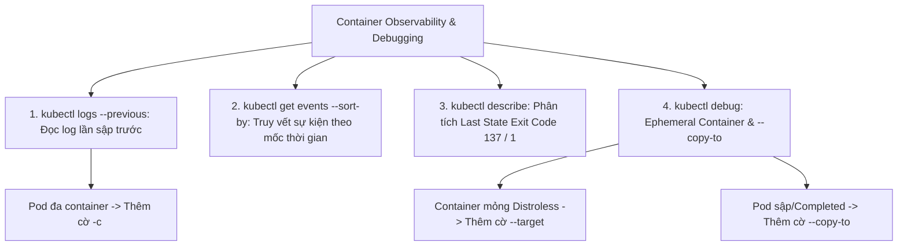
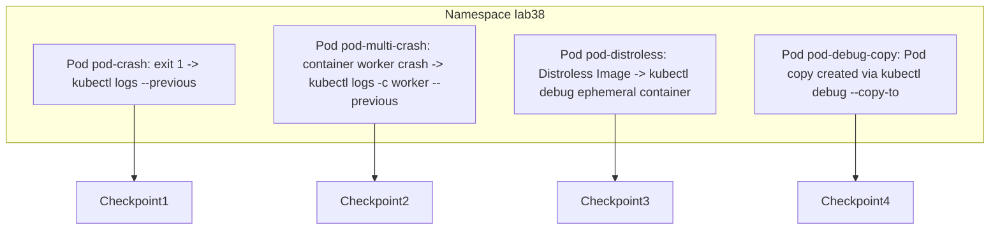


# [BÀI 08] GIÁM SÁT LOG, TRUY VẾT SỰ KIỆN & DEBUG CONTAINER: LOGS, EVENTS, DESCRIBE, EXEC & EPHEMERAL DEBUG CONTAINER

Trong kỷ nguyên điện toán đám mây và kiến trúc microservices phân tán quy mô lớn, **Kubernetes (CKAD)** đóng vai trò là nền tảng điều phối container (Container Orchestration) tiêu chuẩn công nghiệp. Để làm chủ hệ thống trong môi trường sản xuất (Production) cũng như chinh phục kỳ thi chứng chỉ quốc tế của Linux Foundation / CNCF, kỹ sư không chỉ nắm vững các câu lệnh thao tác cơ bản mà phải thấu hiểu sâu sắc bản chất cơ chế tầng thấp: từ chu trình điều hòa (Reconciliation Loop), cấu trúc điều phối tài nguyên, kiến trúc mạng CNI, lưu trữ CSI cho đến các chuẩn mực an ninh phòng thủ chiều sâu.

Bài viết chuyên sâu này sẽ đồng hành cùng bạn giải mã toàn diện bức tranh kiến trúc, phân tích các đánh đổi kỹ thuật thực chiến (Engineering Trade-offs), cung cấp bài thực hành Lab từng bước và bộ câu hỏi phỏng vấn chuẩn Architect / Lead Engineer.

---

## 1. Bản Chất Kiến Trúc & Cơ Chế Vận Hành Tầng Thấp

| # | Câu hỏi ôn tập | Đáp án chuẩn ngắn gọn |
|---|---|---|
| 1 | Ba loại Probe kiểm tra sức khỏe ứng dụng trong Kubernetes là gì? | **`startupProbe`**, **`readinessProbe`**, và **`livenessProbe`** |
| 2 | Kubelet sẽ xử lý thế nào khi `readinessProbe` bị thất bại? | Gỡ IP của Pod ra khỏi danh sách **Service Endpoints** |
| 3 | Kubelet sẽ xử lý thế nào khi `livenessProbe` bị thất bại? | Gửi `SIGKILL` **tiêu diệt và khởi động lại container** |
| 4 | Ba phương thức kiểm tra hành động (Actions) của Probe là gì? | **`httpGet`**, **`exec`**, và **`tcpSocket`** |
| 5 | Loại Probe nào giúp che chắn cho ứng dụng boot chậm không bị diệt nhầm? | **`startupProbe`** |


> **"Thành thục bộ kỹ năng chẩn đoán và gỡ lỗi container (Container Observability and Debugging) là nội dung quan trọng thuộc miền Observability in CKAD, đòi hỏi lập trình viên phải sử dụng thành thục các cờ lệnh nâng cao của `kubectl logs` (đặc biệt cờ `--previous` đọc log của Pod vừa sập, `-c` cho Pod đa container, `--tail` và `-f` theo dõi thời gian thực), kết hợp với việc lọc sự kiện hệ thống `kubectl get events` và đọc chi tiết trạng thái qua `kubectl describe`; đồng thời việc làm chủ tính năng Ephemeral Container (`kubectl debug`) giúp lập trình viên đính kèm một container công cụ chẩn đoán vào Pod đang chạy trên Production mà không cần khởi động lại Pod hay sửa đổi bản kê khai ban đầu."**

**Kết quả từ các buổi trước được sử dụng lại:**

| Kết quả / Công cụ | Buổi + số hiệu `QT` | Dùng ở đâu trong buổi này |
|---|---|---|
| Xem log cơ bản và exec vào Pod | Buổi 04 `QT 4.1` | Phát triển lên thành các cờ lệnh logs nâng cao và Ephemeral Container |
| Quan sát sự kiện và trạng thái Pod | Buổi 14 `QT 4.1` | Truy vết các mốc thời gian Pod bị diệt qua `kubectl describe` và `events` |
| Ảnh container mỏng Distroless/Alpine | Buổi 32 `QT 4.1` | Áp dụng `kubectl debug` để gỡ lỗi các container mỏng không có shell |

---


| # | Kỹ năng thực hiện được | Hiện vật chứng minh |
|---|---|---|
| 1 | Truy vết nhật ký của container vừa sập ở lần chạy trước bằng cờ `--previous` | Nhật ký chi tiết nguyên nhân sập của container trước khi bị restart |
| 2 | Đọc log của một container cụ thể trong Pod đa container với cờ `-c` | Nhật ký stdout của đúng container chỉ định |
| 3 | Lọc và sắp xếp toàn bộ sự kiện sự cố trong Namespace theo mốc thời gian | Danh sách sự kiện được sắp xếp từ cũ đến mới qua `--sort-by` |
| 4 | Đính kèm Ephemeral Container công cụ vào Pod đang chạy để debug | Phiên tương tác shell chẩn đoán mạng/tài nguyên trên Pod Production |
| 5 | Tạo bản sao Pod chẩn đoán để gỡ lỗi các Pod đã `Completed` hoặc bị sập | Bản sao Pod chẩn đoán chạy độc lập qua cờ `--copy-to` |

---


| Kiến thức tiên quyết | Nguồn tự học nếu thiếu |
|---|---|
| Định nghĩa container spec và lệnh CLI cơ bản | Buổi 32 (`QT 4.1`) |
| Quản lý vòng đời Pod và trạng thái CrashLoopBackOff | Buổi 14 (`QT 4.1`) |
| Cấu hình Health Check Probes và quan sát event | Buổi 37 (`QT 4.1`) |

---


### 3.1. Thuật ngữ Việt–Anh

| # | Thuật ngữ tiếng Việt | Tiếng Anh tương đương | Ghi chú chuẩn hoá trong thân bài |
|---|---|---|---|
| 1 | Nhật ký container | Container Logs | Đầu ra tiêu chuẩn stdout/stderr của tiến trình trong container |
| 2 | Nhật ký lần chạy trước | Previous Container Logs (`--previous`) | Nhật ký của tiến trình container bị sập ở lần chạy trước đó |
| 3 | Sự kiện hệ thống | Kubernetes Events | Các thông điệp cảnh báo/thông tin do Controller sinh ra |
| 4 | Sắp xếp theo mốc thời gian | Sort By Timestamp (`--sort-by`) | Cờ sắp xếp danh sách sự kiện theo thứ tự thời gian tạo |
| 5 | Container tạm thời chẩn đoán | Ephemeral Container | Container công cụ đính kèm tạm thời vào Pod đang chạy |
| 6 | Lệnh gỡ lỗi nâng cao | `kubectl debug` | Bộ lệnh tạo ephemeral container hoặc bản sao Pod để debug |
| 7 | Bản sao Pod chẩn đoán | Debug Pod Copy (`--copy-to`) | Bản sao Pod mới được tạo ra thêm container công cụ debug |
| 8 | Truy cập terminal container | Container Shell Access (`kubectl exec`) | Mở phiên tương tác terminal vào container đang chạy |
| 9 | Theo dõi nhật ký thời gian thực | Log Streaming (`-f` / `--follow`) | Đọc luồng log liên tục khi có dòng dữ liệu mới |
| 10 | Giới hạn số dòng nhật ký | Log Tail (`--tail=N`) | Chỉ in ra N dòng log cuối cùng của container |
| 11 | Nhãn mốc thời gian log | Log Timestamps (`--timestamps`) | Hiển thị mốc thời gian chi tiết ở đầu từng dòng log |
| 12 | Ảnh công cụ gỡ lỗi | Debugger Tool Image (`busybox`, `nicolaka/netshoot`) | Ảnh chứa các công cụ CLI như curl, ping, netstat, dig |
| 13 | Mã kết thúc tiến trình | Exit Code (`Exit Code 137`, `OOMKilled`) | Mã số trả về khi tiến trình container bị dập |
| 14 | Thư mục nhật ký Node | Node Log Path (`/var/log/pods`) | Nơi Kubelet lưu trữ tệp log của tất cả các container |


Mô hình Hộp Đen Máy Bay và Đội Cứu Hộ: `kubectl logs --previous` giống như đọc lại băng ghi âm Hộp Đen của chiếc máy bay vừa gặp sự cố rơi. `kubectl get events` giống như Nhật ký hành trình của Trạm không lưu ghi lại mọi cảnh báo. `kubectl debug` giống như Đội cứu hộ thả một chuyên gia kỹ thuật mang theo hộp dụng cụ leo vào cabin máy bay đang bay để kiểm tra mà không bắt máy bay phải hạ cánh hay đổi máy bay khác.

---

### 1.1. Bộ lệnh chẩn đoán nhật ký: kubectl logs nâng cao và cờ --previous (12 phút)

**Nguyên lý cốt lõi:** Khi một container bị crash và restart (cột `RESTARTS` > 0), lệnh `kubectl logs <pod-name>` mặc định chỉ in ra log của container MỚI vừa khởi tạo; bắt buộc phải thêm cờ `--previous` (hoặc `-p`) để đọc log của container VỪA SẬP ở lần chạy trước.

**Giải thích cơ chế ngầm:** Container mới khởi động chưa kịp ghi log hoặc chỉ có vài dòng log khởi động, làm mất đi nguyên nhân gốc rễ (Root Cause) gây ra sập ở lần chạy trước (như NullPointerException hay Unhandled Exception). Cờ `--previous` ra lệnh cho Kubelet truy xuất tệp log của container vừa bị tiêu diệt lưu trong đĩa Node.

> [!WARNING]
> **CẠM BẪY THỰC CHIẾN:**
> Chạy `kubectl logs` trên Pod bị `CrashLoopBackOff` và chỉ thấy dòng log "Server starting..." mà không biết vì sao container bị restart.

**Minh hoạ.**

```bash
# Đọc log của container bị crash ở lần chạy trước:
kubectl logs bad-pod --previous -n prod
```

**Nguyên lý cốt lõi:** Đối với Pod đa container, bắt buộc phải dùng cờ `-c <container-name>` kết hợp với cờ `--previous` để chỉ định chính xác tên container bị sập cần đọc log.

**Giải thích cơ chế ngầm:** Nếu không chỉ định cờ `-c`, kubectl sẽ từ chối thực thi và yêu cầu chọn 1 container cụ thể trong danh sách các container của Pod.

> [!WARNING]
> **CẠM BẪY THỰC CHIẾN:**
> Lệnh báo lỗi `Error from server (BadRequest): a container name must be specified for pod multi-pod`.

**Minh hoạ.**

```bash
# Đọc log của container worker bị sập ở lần chạy trước trong Pod đa container:
kubectl logs multi-pod -c worker --previous -n prod
```

---

### 1.2. Lọc sự kiện hệ thống: kubectl get events và kubectl describe (12 phút)

**Nguyên lý cốt lõi:** Sử dụng lệnh `kubectl get events -n <namespace> --sort-by='.metadata.creationTimestamp'` để liệt kê tất cả các sự kiện của Namespace được sắp xếp theo đúng trình tự thời gian từ cũ đến mới.

**Giải thích cơ chế ngầm:** Sự kiện (Events) lưu trữ các mốc lịch sử quan trọng của cụm (như Pod được Schedule về Node nào, Kubelet pull ảnh khi nào, liveness probe fail lúc nào, Kubelet kill container vì OOMKilled lúc nào). Sắp xếp theo mốc thời gian giúp kỹ sư tái hiện lại toàn bộ diễn biến vụ việc.

> [!WARNING]
> **CẠM BẪY THỰC CHIẾN:**
> Đọc danh sách events lộn xộn không theo thứ tự thời gian khiến việc xác định nguyên nhân đầu tiên (Trigger Cause) bị sai lệch.

**Minh hoạ.**

```bash
# Liệt kê sự kiện sắp xếp theo mốc thời gian tạo từ cũ tới mới:
kubectl get events -n prod --sort-by='.metadata.creationTimestamp'
```

**Nguyên lý cốt lõi:** Sử dụng lệnh `kubectl describe pod <pod-name>` để kiểm tra mục `Events` dưới cùng và trường `Last State` dưới `Containers` để tìm nguyên nhân gốc rễ (như `Exit Code 137` - OOMKilled hoặc `Exit Code 1` - Application Bug).

**Giải thích cơ chế ngầm:** Trường `Last State` lưu giữ chính xác Exit Code và thời điểm container bị ngắt ở lần chạy trước. Mã `Exit Code 137` cho biết tiến trình bị Linux Kernel OOM-Killer tiêu diệt do vượt quá RAM limit. Mã `Exit Code 1` cho biết tiến trình bị crash do lỗi mã nguồn ứng dụng.

> [!WARNING]
> **CẠM BẪY THỰC CHIẾN:**
> Thấy Pod bị restart tưởng do lỗi code nhưng thực chất là do dính lỗi `OOMKilled` (Exit Code 137) thiếu RAM limit.

**Minh hoạ.**

```bash
# Phân tích mục Last State trong kết quả describe:
# State:          Running
# Last State:     Terminated
#   Reason:       OOMKilled
#   Exit Code:    137
```

---

### 1.3. Kỹ thuật gỡ lỗi nâng cao: Ephemeral Container và kubectl debug (10 phút)

**Nguyên lý cốt lõi:** Tính năng Ephemeral Container (`kubectl debug <pod-name> -it --image=<debug-image>`) cho phép đính kèm một container công cụ chẩn đoán mới vào Pod đang chạy mà không làm khởi động lại các container hiện tại.

**Giải thích cơ chế ngầm:** Trên Production, ta không được phép làm gián đoạn dịch vụ hoặc khởi động lại Pod đang nhận traffic. Ephemeral Container gia nhập trực tiếp vào Pod spec đang chạy, cho phép kỹ sư sử dụng các công cụ chẩn đoán (như `curl`, `netstat`, `dig`) trong một container phụ hoàn toàn độc lập.

> [!WARNING]
> **CẠM BẪY THỰC CHIẾN:**
> Sửa tệp YAML Pod Production để thêm container debug khiến Pod phải khởi động lại toàn bộ từ đầu.

**Minh hoạ.**

```bash
# Đính kèm ephemeral container busybox vào Pod đang chạy:
kubectl debug my-pod -it --image=busybox -n prod
```

**Nguyên lý cốt lõi:** Đối với các container mỏng (như `distroless` hoặc `scratch`) không có sẵn lệnh `sh`/`bash`, dùng lệnh `kubectl debug <pod-name> -it --image=busybox --target=<container-name>` để chia sẻ Process Namespace (PID) và soi tiến trình container mỏng từ container debug.

**Giải thích cơ chế ngầm:** Các container mỏng bảo mật tuyệt đối và không chứa bất kỳ công cụ shell nào. Cờ `--target` cho phép Ephemeral Container nhìn thấy toàn bộ danh sách tiến trình (`ps aux`) và hệ thống tệp tin (`/proc/<pid>/root`) của container mỏng target.

> [!WARNING]
> **CẠM BẪY THỰC CHIẾN:**
> Cố gõ `kubectl exec` vào container distroless làm Kubelet báo lỗi `exec: "sh": executable file not found in $PATH`.

**Minh hoạ.**

```bash
# Soi tiến trình container distroless bằng ephemeral container qua cờ --target:
kubectl debug distroless-pod -it --image=busybox --target=app -n prod
```

**Nguyên lý cốt lõi:** Để gỡ lỗi một Pod bị sập không thể chạy được hoặc đã `Completed`, dùng lệnh `kubectl debug <pod-name> -it --copy-to=<new-pod-name> --image=busybox` để tạo ra một bản sao Pod mới với lệnh khởi chạy tương tác.

**Giải thích cơ chế ngầm:** Pod đã bị sập vĩnh viễn hoặc đã chạy xong (`Completed`) không thể nhận Ephemeral Container. Cờ `--copy-to` nhân bản Pod spec sang một Pod chẩn đoán mới giúp kỹ sư tha hồ thay đổi lệnh hoặc thay đổi ảnh để tìm nguyên nhân.

> [!WARNING]
> **CẠM BẪY THỰC CHIẾN:**
> Cố gắn Ephemeral Container vào một Pod đã ở trạng thái `Completed` khiến lệnh `kubectl debug` bị từ chối.

**Minh hoạ.**

```bash
# Nhân bản Pod đã sập sang Pod mới tên debug-pod để gỡ lỗi:
kubectl debug bad-pod -it --copy-to=debug-pod --image=busybox -- /bin/sh
```

---

### 1.4. Đưa vào cụm thật (4 phút)

**Nguyên lý cốt lõi:** Không bao giờ cài đặt các công cụ gỡ lỗi (như curl, netstat, gdb, vim) trực tiếp vào ảnh container Production; hãy giữ ảnh mỏng và sử dụng `kubectl debug` khi cần gỡ lỗi trên cụm.

**Giải thích cơ chế ngầm:** Giúp giữ cho ảnh container nhẹ nhất có thể (~5MB) và loại bỏ hoàn toàn các lỗ hổng bảo mật CVE tiềm ẩn từ các công cụ gỡ lỗi không dùng tới trên môi trường Production.

> [!WARNING]
> **CẠM BẪY THỰC CHIẾN:**
> Cố tình cài đặt curl/gdb trực tiếp vào Dockerfile Production làm dung lượng ảnh phồng lên 500MB và dính 20 lỗ hổng CVE nghiêm trọng.

**Minh hoạ.**

```dockerfile
# ĐÚNG LÀ: Giữ Dockerfile Production siêu nhỏ, không chứa công cụ gỡ lỗi
FROM gcr.io/distroless/static-debian12
COPY --from=build /app/server /server
CMD ["/server"]
```

**Áp vào cụm đang chạy thì làm gì trước:**
1. Khi có sự cố Pod bị restart, chạy ngay `kubectl logs <pod> --previous` đọc log trước khi log bị xoay vòng.
2. Kiểm tra `kubectl describe pod <pod>` rà soát trường `Last State` xem Exit Code.
3. Sử dụng `kubectl debug` để gỡ lỗi mạng hoặc kiểm tra kết nối DB từ bên trong Pod.

**Cái gì hỏng nếu áp thẳng lên prod:**
- Chạy `kubectl debug` với cờ `--copy-to` quên đổi tên Pod sẽ vô tình tạo thêm một bản sao Pod trùng tên gây xung đột tài nguyên.

**Đo trước — đo sau:**
- Kiểm tra số lần Restarts của Pod trước và sau khi gỡ lỗi sự cố.
- Đo dung lượng đĩa log `/var/log/pods` trên Node để dọn dẹp các tệp log quá lớn.

**Khi nào KHÔNG nên dùng:**
- Không dùng `kubectl debug` nếu phiên bản Kubernetes cụm cũ hơn v1.23 (chưa hỗ trợ chính thức Ephemeral Containers).

---

### 1.5. Bẫy hay gặp (2 phút)

| Bẫy hay gặp | Vì sao dính | Làm đúng là |
|---|---|---|
| 1. Chạy `kubectl logs` không có `--previous` khi Pod restart | Chỉ thấy log của container mới vừa bật lên | Luôn gắn cờ `--previous` để xem log lần sập trước |
| 2. Quên cờ `-c <container-name>` ở Pod đa container | Kubelet báo lỗi yêu cầu chọn container cụ thể | Thêm cờ `-c <container-name>` |
| 3. Thử `kubectl exec` vào container Distroless | Container mỏng không có lệnh `sh`/`bash` | Dùng `kubectl debug` với cờ `--target` |
| 4. Nhầm lẫn giữa Exit Code 137 và Exit Code 1 | Khái niệm mã kết thúc tiến trình | Exit Code 137: OOMKilled; Exit Code 1: Bug code |
| 5. `kubectl get events` bị trôi mất sự kiện cũ | Sự kiện K8s mặc định chỉ giữ lại trong 1 giờ | Kết hợp lệnh với `--sort-by` hoặc lưu log events ra tệp |
| 6. Gắn Ephemeral Container vào Pod đã `Completed` | Ephemeral container đòi hỏi Pod phải ở trạng thái Running | Dùng `kubectl debug --copy-to` tạo bản sao Pod mới |
| 7. Quên cờ `-n <namespace>` khi xem events | Xem events nhầm ở Namespace default | Luôn chỉ định cờ `-n <namespace>` chính xác |
| 8. Lệnh `kubectl logs` bị rỗng do container chưa ghi log | Ứng dụng ghi log ra file thay vì stdout/stderr | Dùng `kubectl exec` hoặc `debug` vào đọc file log |
| 9. Quên cờ `-f` khi cần theo dõi log thời gian thực | Màn hình terminal in ra log cũ rồi thoát | Gắn cờ `-f` (follow) để stream log liên tục |
| 10. `kubectl debug` quên cờ `-it` | Terminal không thể tương tác trực tiếp với container debug | Luôn gắn cờ `-it` khi cần tương tác shell |
| 11. Đặt tên bản sao `--copy-to` trùng tên Pod cũ | Xung đột tên Pod trong cùng 1 Namespace | Đặt tên bản sao mới khác biệt (ví dụ `app-debug`) |
| 12. Cố gắng ghi đè file trong Ephemeral container | Ephemeral container không thể sửa đĩa container chính | Chỉ soi tiến trình và đĩa dùng chung qua `--target` |

---

### 1.6. Tóm tắt (2 phút)



**Năm điều phải nhớ:**
1. **Log lần chạy trước**: Dùng `kubectl logs <pod> --previous` khi cột `RESTARTS` > 0.
2. **Pod đa container**: Bắt buộc gắn cờ `-c <container-name>` khi xem log.
3. **Phân tích Exit Code**: Exit Code 137 (OOMKilled do hết RAM), Exit Code 1 (App Bug).
4. **Sắp xếp Events**: Dùng `kubectl get events --sort-by='.metadata.creationTimestamp'`.
5. **Ephemeral Container**: Dùng `kubectl debug -it --image=busybox --target=<name>` để gỡ lỗi container mỏng.

---

## §10. Câu hỏi tự kiểm tra (5 phút)


<details class="qa-card">
<summary class="qa-summary">
  <div class="qa-summary-left">
    <span class="qa-num-badge">Q01</span>
    <span>Cờ lệnh nào của `kubectl logs` bắt buộc phải sử dụng để xem nhật ký của một container vừa bị crash ở lần chạy ngay trước đó?</span>
  </div>
  <span class="qa-chevron">
    <svg width="18" height="18" fill="none" stroke="currentColor" stroke-width="2.5" viewBox="0 0 24 24"><polyline points="6 9 12 15 18 9"></polyline></svg>
  </span>
</summary>
<div class="qa-answer">
  <div class="qa-answer-header">
    <svg width="14" height="14" fill="none" stroke="currentColor" stroke-width="2" viewBox="0 0 24 24"><path d="M22 11.08V12a10 10 0 1 1-5.93-9.14"></path><polyline points="22 4 12 14.01 9 11.01"></polyline></svg>
    <span>Phân Tích &amp; Lời Giải Kỹ Thuật</span>
  </div>
  Cờ `--previous` (hoặc `-p`).
</div>
</details>

<details class="qa-card">
<summary class="qa-summary">
  <div class="qa-summary-left">
    <span class="qa-num-badge">Q02</span>
    <span>Cờ lệnh nào được dùng để chỉ định tên container cụ thể khi đọc log của Pod đa container?</span>
  </div>
  <span class="qa-chevron">
    <svg width="18" height="18" fill="none" stroke="currentColor" stroke-width="2.5" viewBox="0 0 24 24"><polyline points="6 9 12 15 18 9"></polyline></svg>
  </span>
</summary>
<div class="qa-answer">
  <div class="qa-answer-header">
    <svg width="14" height="14" fill="none" stroke="currentColor" stroke-width="2" viewBox="0 0 24 24"><path d="M22 11.08V12a10 10 0 1 1-5.93-9.14"></path><polyline points="22 4 12 14.01 9 11.01"></polyline></svg>
    <span>Phân Tích &amp; Lời Giải Kỹ Thuật</span>
  </div>
  Cờ `-c <container-name>`.
</div>
</details>

<details class="qa-card">
<summary class="qa-summary">
  <div class="qa-summary-left">
    <span class="qa-num-badge">Q03</span>
    <span>Cú pháp cờ `--sort-by` chuẩn để sắp xếp danh sách sự kiện `kubectl get events` theo thứ tự thời gian khởi tạo từ cũ đến mới là gì?</span>
  </div>
  <span class="qa-chevron">
    <svg width="18" height="18" fill="none" stroke="currentColor" stroke-width="2.5" viewBox="0 0 24 24"><polyline points="6 9 12 15 18 9"></polyline></svg>
  </span>
</summary>
<div class="qa-answer">
  <div class="qa-answer-header">
    <svg width="14" height="14" fill="none" stroke="currentColor" stroke-width="2" viewBox="0 0 24 24"><path d="M22 11.08V12a10 10 0 1 1-5.93-9.14"></path><polyline points="22 4 12 14.01 9 11.01"></polyline></svg>
    <span>Phân Tích &amp; Lời Giải Kỹ Thuật</span>
  </div>
  Cờ `--sort-by='.metadata.creationTimestamp'`.
</div>
</details>

<details class="qa-card">
<summary class="qa-summary">
  <div class="qa-summary-left">
    <span class="qa-num-badge">Q04</span>
    <span>Ý nghĩa của mã `Exit Code 137` trong mục `Last State` khi xem `kubectl describe pod` là gì?</span>
  </div>
  <span class="qa-chevron">
    <svg width="18" height="18" fill="none" stroke="currentColor" stroke-width="2.5" viewBox="0 0 24 24"><polyline points="6 9 12 15 18 9"></polyline></svg>
  </span>
</summary>
<div class="qa-answer">
  <div class="qa-answer-header">
    <svg width="14" height="14" fill="none" stroke="currentColor" stroke-width="2" viewBox="0 0 24 24"><path d="M22 11.08V12a10 10 0 1 1-5.93-9.14"></path><polyline points="22 4 12 14.01 9 11.01"></polyline></svg>
    <span>Phân Tích &amp; Lời Giải Kỹ Thuật</span>
  </div>
  Tiến trình bị Linux Kernel OOM-Killer tiêu diệt do vượt quá giới hạn bộ nhớ RAM (`OOMKilled`).
</div>
</details>

<details class="qa-card">
<summary class="qa-summary">
  <div class="qa-summary-left">
    <span class="qa-num-badge">Q05</span>
    <span>Ý nghĩa của mã `Exit Code 1` trong mục `Last State` khi xem `kubectl describe pod` là gì?</span>
  </div>
  <span class="qa-chevron">
    <svg width="18" height="18" fill="none" stroke="currentColor" stroke-width="2.5" viewBox="0 0 24 24"><polyline points="6 9 12 15 18 9"></polyline></svg>
  </span>
</summary>
<div class="qa-answer">
  <div class="qa-answer-header">
    <svg width="14" height="14" fill="none" stroke="currentColor" stroke-width="2" viewBox="0 0 24 24"><path d="M22 11.08V12a10 10 0 1 1-5.93-9.14"></path><polyline points="22 4 12 14.01 9 11.01"></polyline></svg>
    <span>Phân Tích &amp; Lời Giải Kỹ Thuật</span>
  </div>
  Tiến trình bị sập do lỗi mã nguồn ứng dụng (Application Bug/Unhandled Exception).
</div>
</details>

<details class="qa-card">
<summary class="qa-summary">
  <div class="qa-summary-left">
    <span class="qa-num-badge">Q06</span>
    <span>Tính năng Ephemeral Container trong Kubernetes (`kubectl debug`) có ưu điểm gì vượt trội so với việc sửa tệp YAML Pod?</span>
  </div>
  <span class="qa-chevron">
    <svg width="18" height="18" fill="none" stroke="currentColor" stroke-width="2.5" viewBox="0 0 24 24"><polyline points="6 9 12 15 18 9"></polyline></svg>
  </span>
</summary>
<div class="qa-answer">
  <div class="qa-answer-header">
    <svg width="14" height="14" fill="none" stroke="currentColor" stroke-width="2" viewBox="0 0 24 24"><path d="M22 11.08V12a10 10 0 1 1-5.93-9.14"></path><polyline points="22 4 12 14.01 9 11.01"></polyline></svg>
    <span>Phân Tích &amp; Lời Giải Kỹ Thuật</span>
  </div>
  Đính kèm trực tiếp container công cụ vào Pod đang chạy mà không làm khởi động lại Pod hay gián đoạn dịch vụ.
</div>
</details>

<details class="qa-card">
<summary class="qa-summary">
  <div class="qa-summary-left">
    <span class="qa-num-badge">Q07</span>
    <span>Cờ cờ nào của lệnh `kubectl debug` được dùng để soi danh sách tiến trình của một container mỏng (Distroless không có shell)?</span>
  </div>
  <span class="qa-chevron">
    <svg width="18" height="18" fill="none" stroke="currentColor" stroke-width="2.5" viewBox="0 0 24 24"><polyline points="6 9 12 15 18 9"></polyline></svg>
  </span>
</summary>
<div class="qa-answer">
  <div class="qa-answer-header">
    <svg width="14" height="14" fill="none" stroke="currentColor" stroke-width="2" viewBox="0 0 24 24"><path d="M22 11.08V12a10 10 0 1 1-5.93-9.14"></path><polyline points="22 4 12 14.01 9 11.01"></polyline></svg>
    <span>Phân Tích &amp; Lời Giải Kỹ Thuật</span>
  </div>
  Cờ `--target=<container-name>`.
</div>
</details>

<details class="qa-card">
<summary class="qa-summary">
  <div class="qa-summary-left">
    <span class="qa-num-badge">Q08</span>
    <span>Cờ lệnh nào của `kubectl debug` được dùng để nhân bản một Pod đã sập hoặc `Completed` sang một Pod chẩn đoán mới?</span>
  </div>
  <span class="qa-chevron">
    <svg width="18" height="18" fill="none" stroke="currentColor" stroke-width="2.5" viewBox="0 0 24 24"><polyline points="6 9 12 15 18 9"></polyline></svg>
  </span>
</summary>
<div class="qa-answer">
  <div class="qa-answer-header">
    <svg width="14" height="14" fill="none" stroke="currentColor" stroke-width="2" viewBox="0 0 24 24"><path d="M22 11.08V12a10 10 0 1 1-5.93-9.14"></path><polyline points="22 4 12 14.01 9 11.01"></polyline></svg>
    <span>Phân Tích &amp; Lời Giải Kỹ Thuật</span>
  </div>
  Cờ `--copy-to=<new-pod-name>`.
</div>
</details>

<details class="qa-card">
<summary class="qa-summary">
  <div class="qa-summary-left">
    <span class="qa-num-badge">Q09</span>
    <span>Cờ lệnh nào của `kubectl logs` được dùng để theo dõi luồng nhật ký thời gian thực continuous stream?</span>
  </div>
  <span class="qa-chevron">
    <svg width="18" height="18" fill="none" stroke="currentColor" stroke-width="2.5" viewBox="0 0 24 24"><polyline points="6 9 12 15 18 9"></polyline></svg>
  </span>
</summary>
<div class="qa-answer">
  <div class="qa-answer-header">
    <svg width="14" height="14" fill="none" stroke="currentColor" stroke-width="2" viewBox="0 0 24 24"><path d="M22 11.08V12a10 10 0 1 1-5.93-9.14"></path><polyline points="22 4 12 14.01 9 11.01"></polyline></svg>
    <span>Phân Tích &amp; Lời Giải Kỹ Thuật</span>
  </div>
  Cờ `-f` (hoặc `--follow`).
</div>
</details>

<details class="qa-card">
<summary class="qa-summary">
  <div class="qa-summary-left">
    <span class="qa-num-badge">Q10</span>
    <span>Cờ lệnh nào của `kubectl logs` dùng để chỉ in ra 20 dòng nhật ký cuối cùng của container?</span>
  </div>
  <span class="qa-chevron">
    <svg width="18" height="18" fill="none" stroke="currentColor" stroke-width="2.5" viewBox="0 0 24 24"><polyline points="6 9 12 15 18 9"></polyline></svg>
  </span>
</summary>
<div class="qa-answer">
  <div class="qa-answer-header">
    <svg width="14" height="14" fill="none" stroke="currentColor" stroke-width="2" viewBox="0 0 24 24"><path d="M22 11.08V12a10 10 0 1 1-5.93-9.14"></path><polyline points="22 4 12 14.01 9 11.01"></polyline></svg>
    <span>Phân Tích &amp; Lời Giải Kỹ Thuật</span>
  </div>
  Cờ `--tail=20`.
</div>
</details>

<details class="qa-card">
<summary class="qa-summary">
  <div class="qa-summary-left">
    <span class="qa-num-badge">Q11</span>
    <span>Tại sao không nên cài đặt các công cụ gỡ lỗi (như curl, netstat, vim) trực tiếp vào ảnh container Production?</span>
  </div>
  <span class="qa-chevron">
    <svg width="18" height="18" fill="none" stroke="currentColor" stroke-width="2.5" viewBox="0 0 24 24"><polyline points="6 9 12 15 18 9"></polyline></svg>
  </span>
</summary>
<div class="qa-answer">
  <div class="qa-answer-header">
    <svg width="14" height="14" fill="none" stroke="currentColor" stroke-width="2" viewBox="0 0 24 24"><path d="M22 11.08V12a10 10 0 1 1-5.93-9.14"></path><polyline points="22 4 12 14.01 9 11.01"></polyline></svg>
    <span>Phân Tích &amp; Lời Giải Kỹ Thuật</span>
  </div>
  Để giữ ảnh mỏng nhẹ, tăng tốc độ boot và triệt tiêu các lỗ hổng bảo mật CVE tiềm ẩn.
</div>
</details>

<details class="qa-card">
<summary class="qa-summary">
  <div class="qa-summary-left">
    <span class="qa-num-badge">Q12</span>
    <span>Câu lệnh CLI nào dùng để xem toàn bộ thông tin chi tiết cấu hình và mốc thời gian sự kiện của Pod `my-pod`?</span>
  </div>
  <span class="qa-chevron">
    <svg width="18" height="18" fill="none" stroke="currentColor" stroke-width="2.5" viewBox="0 0 24 24"><polyline points="6 9 12 15 18 9"></polyline></svg>
  </span>
</summary>
<div class="qa-answer">
  <div class="qa-answer-header">
    <svg width="14" height="14" fill="none" stroke="currentColor" stroke-width="2" viewBox="0 0 24 24"><path d="M22 11.08V12a10 10 0 1 1-5.93-9.14"></path><polyline points="22 4 12 14.01 9 11.01"></polyline></svg>
    <span>Phân Tích &amp; Lời Giải Kỹ Thuật</span>
  </div>
  `kubectl describe pod my-pod`.
</div>
</details>

---

## §11. Tài liệu tham khảo

| Nguồn | Địa chỉ URL | Ghi chú |
|---|---|---|
| Kubernetes Debugging Pods | `https://kubernetes.io/docs/tasks/debug/debug-application/debug-running-pod/` | Tài liệu chuẩn K8s Debugging Pods |
| Ephemeral Containers Documentation | `https://kubernetes.io/docs/concepts/workloads/pods/ephemeral-containers/` | Tài liệu chuẩn Ephemeral Containers |

---

## Bảng đối soát thời lượng

| Mục | Ngân sách thời gian | Thực tế |
|---|---|---|
| §0. Khởi động và ôn tập | 10 phút | 10 phút |
| §1. Học viên làm được gì | 1 phút | 1 phút |
| §2. Cần biết trước | 1 phút | 1 phút |
| §3. Thuật ngữ và mô hình tư duy | 8 phút | 8 phút |
| §4. Bộ lệnh chẩn đoán nhật ký logs --previous | 12 phút | 12 phút |
| §5. Lọc sự kiện events và describe | 12 phút | 12 phút |
| §6. Kỹ thuật gỡ lỗi nâng cao kubectl debug | 10 phút | 10 phút |
| §7. Đưa vào cụm thật | 4 phút | 4 phút |
| §8. Bẫy hay gặp | 2 phút | 2 phút |
| §9. Tóm tắt | 2 phút | 2 phút |
| §10. Câu hỏi tự kiểm tra | 5 phút | 5 phút |
| **Tổng** | **60'** | **60'** |

---

## 2. Hướng Dẫn Thực Hành & Triển Khai Lab Chuẩn Production

> [!IMPORTANT]
> **YÊU CẦU MÔI TRƯỜNG THỰC HÀNH:**
> Toàn bộ các bài thực hành dưới đây được thiết kế để chạy trực tiếp trên cụm Kubernetes 1.30+ tiêu chuẩn (hoặc cụm kind/kubeadm lab). Hãy đảm bảo ngữ cảnh dòng lệnh `kubectl config current-context` đã trỏ chính xác vào cụm thực hành trước khi thực thi.

## Khối thực hành — 120 phút

## L0. Mục tiêu thực hành và tiêu chí hoàn thành

| Mã tiêu chí | Nội dung tiêu chí | Lệnh kiểm chứng | Kết quả kỳ vọng |
|---|---|---|---|
| TH1 | Tạo Namespace `lab38` phục vụ thực hành Container Observability & Debugging | `kubectl get ns lab38 -o jsonpath='{.status.phase}'` | In ra `Active` |
| TH2 | Triển khai Pod `pod-crash` bị crash sau 3 giây hoạt động | `kubectl get pod pod-crash -n lab38 -o jsonpath='{.metadata.name}'` | In ra `pod-crash` |
| TH3 | Kiểm tra Pod `pod-crash` có cột Restarts `>= 1` | `kubectl get pod pod-crash -n lab38 -o jsonpath='{.status.containerStatuses[0].restartCount}'` | In ra con số `>= 1` |
| TH4 | Đọc log của container vừa sập ở lần chạy trước bằng `kubectl logs --previous` | `kubectl logs pod-crash -n lab38 --previous \| grep -q "CRASHING_NOW"` | In ra dòng log sập |
| TH5 | Triển khai Pod đa container `pod-multi-crash` chứa container `worker` bị crash | `kubectl get pod pod-multi-crash -n lab38 -o jsonpath='{len(.spec.containers)}'` | In ra `2` |
| TH6 | Đọc log lần sập trước của riêng container `worker` | `kubectl logs pod-multi-crash -c worker -n lab38 --previous \| grep -q "WORKER_CRASH"` | In ra dòng log worker |
| TH7 | Lọc và sắp xếp sự kiện trong Namespace `lab38` theo thời gian tạo | `kubectl get events -n lab38 --sort-by='.metadata.creationTimestamp' \| grep -q "pod-crash"` | In ra danh sách events |
| TH8 | Triển khai Pod mỏng `pod-distroless` chạy ảnh Distroless không có shell | `kubectl get pod pod-distroless -n lab38 -o jsonpath='{.spec.containers[0].image}'` | In ra ảnh distroless |
| TH9 | Xác minh `kubectl exec` vào `pod-distroless` bị thất bại | `kubectl exec pod-distroless -n lab38 -- sh 2>&1 \| grep -q "executable file not found"` | Báo lỗi không có shell |
| TH10 | Đính kèm Ephemeral Container vào `pod-distroless` bằng `kubectl debug` | `kubectl get pod pod-distroless -n lab38 -o jsonpath='{.spec.ephemeralContainers[0].name}'` | In ra tên ephemeral container |
| TH11 | Nhân bản Pod chẩn đoán `pod-debug-copy` bằng lệnh `kubectl debug --copy-to` | `kubectl get pod pod-debug-copy -n lab38 -o jsonpath='{.metadata.name}'` | In ra `pod-debug-copy` |
| TH12 | Xác minh Pod `pod-debug-copy` chạy thành công ở trạng thái `Running` | `kubectl get pod pod-debug-copy -n lab38 -o jsonpath='{.status.phase}'` | In ra `Running` |
| TH13 | Dọn dẹp sạch sẽ tài nguyên lab38 | `test ! -f /tmp/lab38-debug.yaml && echo "CLEAN"` | In ra `CLEAN` |

---

## L1. Điều kiện tiên quyết về môi trường

| Kiểm tra | Lệnh thực hiện | Kết quả kỳ vọng |
|---|---|---|
| Cụm Kubernetes ba node | `kubectl get nodes` | `cp-01`, `worker-01`, `worker-02` ở trạng thái `Ready` |
| Context đúng môi trường lab | `kubectl config current-context` | Đúng context cụm `kubeadm` |
| Quyền gỡ lỗi container | `kubectl auth can-i get pods/ephemeralcontainers -n default` | In ra `yes` |

---

## L2. Kiến trúc bài lab Observability & Container Debugging



---

## L3. Bước 1: Khởi tạo Namespace `lab38` (10 phút)

### Thao tác 1.1: Tạo Namespace

```bash
kubectl create namespace lab38
```

**CHECKPOINT 1 — Kiểm tra Namespace `lab38`.**

```bash
kubectl get ns lab38 -o jsonpath='{.status.phase}' | grep -qx Active && echo "CHECKPOINT 1 — ĐẠT" || echo "CHECKPOINT 1 — LỖI"
```

---

## L4. Bước 2: Thử nghiệm xem nhật ký lần chạy trước `kubectl logs --previous` (25 phút)

### Thao tác 2.1: Biên soạn Pod `pod-crash` bị crash sau 3 giây

```bash
cat <<EOF | kubectl apply -f -
apiVersion: v1
kind: Pod
metadata:
  name: pod-crash
  namespace: lab38
spec:
  containers:
    - name: worker
      image: busybox:1.36
      command: ["sh", "-c", "echo 'STARTING_WORKER'; sleep 2; echo 'CRASHING_NOW'; exit 1"]
EOF
```

**CHECKPOINT 2 — Kiểm tra khởi tạo Pod `pod-crash`.**

```bash
kubectl get pod pod-crash -n lab38 -o jsonpath='{.metadata.name}' | grep -qx pod-crash && echo "CHECKPOINT 2 — ĐẠT" || echo "CHECKPOINT 2 — LỖI"
```

**CHECKPOINT 3 — Kiểm tra số lần Restarts tăng lên `>= 1`.**

```bash
sleep 6
[ $(kubectl get pod pod-crash -n lab38 -o jsonpath='{.status.containerStatuses[0].restartCount}') -ge 1 ] && echo "CHECKPOINT 3 — ĐẠT" || echo "CHECKPOINT 3 — LỖI"
```

**CHECKPOINT 4 — Đọc log lần sập trước bằng `kubectl logs --previous`.**

```bash
kubectl logs pod-crash -n lab38 --previous | grep -q "CRASHING_NOW" && echo "CHECKPOINT 4 — ĐẠT" || echo "CHECKPOINT 4 — LỖI"
```

### Thao tác 2.2: Biên soạn Pod đa container `pod-multi-crash`

```bash
cat <<EOF | kubectl apply -f -
apiVersion: v1
kind: Pod
metadata:
  name: pod-multi-crash
  namespace: lab38
spec:
  containers:
    - name: web
      image: busybox:1.36
      command: ["sh", "-c", "echo WEB_OK; sleep 3600"]
    - name: worker
      image: busybox:1.36
      command: ["sh", "-c", "echo WORKER_OK; sleep 2; echo WORKER_CRASH; exit 1"]
EOF
```

**CHECKPOINT 5 — Kiểm tra Pod đa container có 2 container.**

```bash
kubectl get pod pod-multi-crash -n lab38 -o jsonpath='{len(.spec.containers)}}' | grep -qx 2 && echo "CHECKPOINT 5 — ĐẠT" || echo "CHECKPOINT 5 — LỖI"
```

**CHECKPOINT 6 — Đọc log lần sập trước của container `worker`.**

```bash
sleep 6
kubectl logs pod-multi-crash -c worker -n lab38 --previous | grep -q "WORKER_CRASH" && echo "CHECKPOINT 6 — ĐẠT" || echo "CHECKPOINT 6 — LỖI"
```

---

## L5. Bước 3: Lọc sự kiện hệ thống `kubectl get events` (25 phút)

### Thao tác 3.1: Chạy lệnh lọc sự kiện sắp xếp theo mốc thời gian

```bash
kubectl get events -n lab38 --sort-by='.metadata.creationTimestamp'
```

**CHECKPOINT 7 — Kiểm tra kết quả lọc sự kiện.**

```bash
kubectl get events -n lab38 --sort-by='.metadata.creationTimestamp' | grep -q "pod-crash" && echo "CHECKPOINT 7 — ĐẠT" || echo "CHECKPOINT 7 — LỖI"
```

---

## L6. Bước 4: Thực hành gỡ lỗi Container mỏng với `kubectl debug` (25 phút)

### Thao tác 6.1: Triển khai Pod mỏng `pod-distroless`

```bash
cat <<EOF | kubectl apply -f -
apiVersion: v1
kind: Pod
metadata:
  name: pod-distroless
  namespace: lab38
spec:
  containers:
    - name: static-app
      image: registry.k8s.io/pause:3.9
EOF
```

**CHECKPOINT 8 — Kiểm tra ảnh của `pod-distroless`.**

```bash
kubectl get pod pod-distroless -n lab38 -o jsonpath='{.spec.containers[0].image}' | grep -q "pause" && echo "CHECKPOINT 8 — ĐẠT" || echo "CHECKPOINT 8 — LỖI"
```

**CHECKPOINT 9 — Xác minh `kubectl exec` vào container mỏng bị lỗi.**

```bash
sleep 3
kubectl exec pod-distroless -n lab38 -- sh 2>&1 | grep -q -i "error\|executable" && echo "CHECKPOINT 9 — ĐẠT" || echo "CHECKPOINT 9 — LỖI"
```

### Thao tác 6.2: Đính kèm Ephemeral Container bằng `kubectl debug`

```bash
kubectl debug pod-distroless -n lab38 -it --image=busybox:1.36 --target=static-app -- echo "EPHEMERAL_DEBUG_OK"
```

**CHECKPOINT 10 — Kiểm tra sự tồn tại của khối `ephemeralContainers` trong spec.**

```bash
kubectl get pod pod-distroless -n lab38 -o jsonpath='{.spec.ephemeralContainers[0].image}' | grep -q "busybox" && echo "CHECKPOINT 10 — ĐẠT" || echo "CHECKPOINT 10 — LỖI"
```

---

## L7. Bước 5: Nhân bản Pod chẩn đoán bằng `kubectl debug --copy-to` (25 phút)

### Thao tác 7.1: Tạo bản sao Pod chẩn đoán `pod-debug-copy`

```bash
kubectl debug pod-crash -n lab38 -it --copy-to=pod-debug-copy --image=busybox:1.36 -- sh -c "echo COPY_POD_OK; sleep 3600" &
```

**CHECKPOINT 11 — Kiểm tra tên Pod chẩn đoán `pod-debug-copy`.**

```bash
sleep 4
kubectl get pod pod-debug-copy -n lab38 -o jsonpath='{.metadata.name}' | grep -qx pod-debug-copy && echo "CHECKPOINT 11 — ĐẠT" || echo "CHECKPOINT 11 — LỖI"
```

**CHECKPOINT 12 — Xác minh Pod `pod-debug-copy` ở trạng thái `Running`.**

```bash
kubectl get pod pod-debug-copy -n lab38 -o jsonpath='{.status.phase}' | grep -qx Running && echo "CHECKPOINT 12 — ĐẠT" || echo "CHECKPOINT 12 — LỖI"
```

---

## L8. Dọn dẹp môi trường (10 phút)

### Thao tác 8.1: Dọn dẹp tài nguyên lab38

```bash
kubectl delete namespace lab38
rm -f /tmp/lab38-debug.yaml
```

**CHECKPOINT 13 — Kiểm tra dọn dẹp sạch sẽ.**

```bash
test ! -f /tmp/lab38-debug.yaml && echo "CHECKPOINT 13 — ĐẠT" || echo "CHECKPOINT 13 — LỖI"
```

---

## L9. Xử lý sự cố thường gặp trong lab

| Triệu chứng lỗi | Nguyên nhân gốc rễ | Cách sửa triệt để |
|---|---|---|
| 1. `kubectl logs` in ra log rỗng khi Pod vừa restart | Log mặc định chỉ in container mới khởi tạo chưa có log | Gắn thêm cờ `--previous` để đọc log lần sập trước |
| 2. Lỗi `a container name must be specified` | Không truyền cờ `-c` cho Pod đa container | Thêm cờ `-c <container-name>` chỉ định rõ tên container |
| 3. `kubectl exec` báo `executable file not found in $PATH` | Container mỏng (Distroless/Alpine) không có shell | Dùng `kubectl debug` gắn Ephemeral Container hoặc `--copy-to` |
| 4. Ephemeral container kẹt ở `ContainerCreating` | Node không thể pull ảnh debug image chỉ định | Dùng ảnh mỏng siêu phổ biến như `busybox:1.36` hoặc `alpine` |
| 5. Cờ `--sort-by` báo lỗi syntax jsonpath | Gõ sai đường dẫn `.metadata.creationTimestamp` | Bọc trong dấu nháy đơn: `--sort-by='.metadata.creationTimestamp'` |
| 6. `kubectl debug` báo lỗi `ephemeral containers feature disabled` | Cụm K8s phiên bản quá cũ (trước v1.23) | Nâng cấp cụm K8s hoặc dùng phương án `kubectl debug --copy-to` |
| 7. Lỗi `Exit Code 137` khi xem describe pod | Container bị OOM-Killer diệt do dùng vượt quá RAM limit | Tăng giá trị `resources.limits.memory` trong spec |
| 8. Lỗi `Exit Code 1` khi xem describe pod | Tiến trình container bị sập do bug mã nguồn ứng dụng | Đọc log `--previous` để tìm vết stack trace lỗi code |
| 9. Pod chẩn đoán `--copy-to` bị sập ngay khi bật | Giữ nguyên lệnh `command` cũ bị lỗi của Pod gốc | Thêm tham số `-- sh -c "sleep 3600"` để đè lệnh cũ |
| 10. Quên cờ `-n lab38` khi gõ `kubectl logs` | Tìm Pod ở Namespace `default` không thấy | Luôn chỉ định cờ `-n lab38` cho mọi lệnh chẩn đoán |
| 11. Sự kiện `kubectl get events` bị rác không tìm thấy lỗi | Không lọc theo Namespace hoặc không sort theo thời gian | Thêm `-n lab38 --sort-by='.metadata.creationTimestamp'` |
| 12. Không tương tác được với Ephemeral Container | Quên cờ `-it` khi chạy lệnh `kubectl debug` | Luôn gắn cờ `-it` để mở phiên terminal tương tác |
| 13. Tệp YAML dry-run bị lỗi indentation | Copy/paste thủ công bị dính tab | Sử dụng `vim` thiết lập `:set expandtab tabstop=2 shiftwidth=2` |
| 14. Lỗi `target container not found` trong `kubectl debug` | Gõ sai tên container target trong Pod | Kiểm tra lại chính xác tên container spec qua `kubectl get pod` |

---

## L10. Bài tập mở rộng

- **BT1:** Thực hành ghi toàn bộ đầu ra log lần sập trước của Pod dính lỗi ra tệp đĩa `/tmp/previous.log`.
- **BT2:** Viết script Bash tự động kiểm tra tất cả các Pod trong cụm có cột `RESTARTS` > 0 và in ra log `--previous` của từng Pod.
- **BT3:** Sử dụng ảnh `nicolaka/netshoot` làm Ephemeral Container để chẩn đoán kết nối mạng TCP/DNS từ bên trong Pod.
- **BT4:** Thực hành cờ `kubectl debug --share-processes` để hai container trong Pod nhìn thấy bảng tiến trình của nhau.
- **BT5:** Lọc danh sách events sự cố thuộc loại `Warning` trong toàn bộ cụm qua lệnh `kubectl get events -A --field-selector type=Warning`.
- **BT6:** Phân tích điểm khác biệt giữa các mã Exit Code 0, 1, 137, 139 và 143 của tiến trình container.

---

## L11. Hiện vật nộp và tiêu chí chấm điểm

| Hạng mục hiện vật | Tiêu chí chấm điểm đạt | Thang điểm |
|---|---|---|
| Nhật ký 13 Checkpoint | Thực thi thành công 100 % các checkpoint in ra `ĐẠT` | 50 điểm |
| Thao tác `kubectl logs --previous` & Events | Đọc log lần sập trước và lọc sự kiện sắp xếp chuẩn | 20 điểm |
| Thao tác Ephemeral Container & `--copy-to` | Đính kèm Ephemeral container và tạo bản sao Pod debug | 20 điểm |
| Báo cáo bài tập mở rộng | Trả lời đầy đủ câu hỏi BT1 và BT2 | 10 điểm |
| **Tổng điểm** | | **100 điểm** |

---

## Bảng đối soát thời lượng

| Khối thực hành | Ngân sách thời gian | Thực tế |
|---|---|---|
| L0 & L1. Chuẩn bị và kiểm tra | 10 phút | 10 phút |
| L3. Bước 1: Khởi tạo Namespace | 10 phút | 10 phút |
| L4. Bước 2: logs --previous | 25 phút | 25 phút |
| L5. Bước 3: events --sort-by | 25 phút | 25 phút |
| L6. Bước 4: Ephemeral Container | 25 phút | 25 phút |
| L7. Bước 5: Pod copy --copy-to | 15 phút | 15 phút |
| L8. Dọn dẹp môi trường | 10 phút | 10 phút |
| **Tổng** | **120'** | **120'** |

---

## 3. Bộ Câu Hỏi Vấn Đáp & Phỏng Vấn Kỹ Thuật Chuyên Sâu

Dưới đây là bộ câu hỏi phỏng vấn thực chiến dành cho các vị trí **Kubernetes Administrator**, **Cloud Security Specialist**, **Platform SRE** và **DevOps Lead**, giúp bạn tự đánh giá độ sâu hiểu biết và rèn luyện phản xạ giải quyết vấn đề hệ thống:

## V1. Cách tiến hành

Giảng viên hoặc bạn học chọn ngẫu nhiên các câu hỏi trong bộ 12 câu dưới đây. Người trả lời phải trình bày mạch lạc trong 60–90 giây mỗi câu, đi thẳng vào cơ chế kỹ thuật và viện dẫn các lệnh CLI thực tế.

---

## V2. Bộ câu hỏi


<details class="qa-card">
<summary class="qa-summary">
  <div class="qa-summary-left">
    <span class="qa-num-badge">Q01</span>
    <span>Tại sao khi Pod bị restart (cột `RESTARTS` > 0), lệnh `kubectl logs <pod-name>` mặc định lại không thể giúp ta tìm ra nguyên nhân sập, và cờ lệnh nào sẽ giải quyết bài toán này?</span>
  </div>
  <span class="qa-chevron">
    <svg width="18" height="18" fill="none" stroke="currentColor" stroke-width="2.5" viewBox="0 0 24 24"><polyline points="6 9 12 15 18 9"></polyline></svg>
  </span>
</summary>
<div class="qa-answer">
  <div class="qa-answer-header">
    <svg width="14" height="14" fill="none" stroke="currentColor" stroke-width="2" viewBox="0 0 24 24"><path d="M22 11.08V12a10 10 0 1 1-5.93-9.14"></path><polyline points="22 4 12 14.01 9 11.01"></polyline></svg>
    <span>Phân Tích &amp; Lời Giải Kỹ Thuật</span>
  </div>
  Vì `kubectl logs` mặc định chỉ in ra log của tiến trình container MỚI vừa khởi tạo (vốn chưa có log hoặc chỉ mới in vài dòng khởi động). Cờ `--previous` (hoặc `-p`) giải quyết bài toán bằng cách bắt Kubelet truy xuất tệp log của container VỪA BỊ CRASH ở lần chạy ngay trước đó.

**Tiêu chí chấm:**
- 0đ: Không biết cờ --previous.
- 1đ: Nêu được cờ --previous nhưng không giải thích được lý do log mặc định chỉ chứa container mới.
- 3đ: Phân tích thấu đáo hành vi log mặc định và vai trò truy vết nguyên nhân sập của cờ `--previous`.

**Câu hỏi đào sâu:** (Nếu một Pod đã bị restart 5 lần thì cờ `--previous` sẽ lấy log của lần restart thứ mấy? — Lấy log của lần restart thứ 5 ngay liền trước).
</div>
</details>

---

### Câu 2 — 🔥
**Hỏi:** Làm thế nào để xem log của riêng container `worker` bị sập ở lần chạy trước đó trong một Pod có 3 container?

**Đáp án chuẩn:** Sử dụng câu lệnh kết hợp cả 2 cờ: `kubectl logs <pod-name> -c worker --previous -n <namespace>`.

**Tiêu chí chấm:**
- 0đ: Không biết kết hợp cờ -c và --previous.
- 1đ: Nêu được cờ --previous nhưng quên cờ -c chỉ định tên container.
- 3đ: Trình bày chính xác cú pháp kết hợp cờ `-c worker` và `--previous`.

**Câu hỏi đào sâu:** (Nếu quên cờ `-c worker` khi chạy lệnh log Pod 3 container thì kubectl sẽ báo gì? — Báo lỗi `a container name must be specified for pod...`).

---

### Câu 3 — ★★★
**Hỏi:** Ý nghĩa và sự khác nhau bản chất giữa hai mã `Exit Code 137` và `Exit Code 1` trong trường `Last State` khi xem `kubectl describe pod` là gì?

**Đáp án chuẩn:** `Exit Code 137` là do tiến trình container bị Linux Kernel OOM-Killer tiêu diệt do sử dụng quá giới hạn bộ nhớ RAM (`OOMKilled`). `Exit Code 1` là do tiến trình container bị sập do lỗi mã nguồn ứng dụng (Application Bug/Unhandled Exception).

**Tiêu chí chấm:**
- 0đ: Không phân biệt được 2 mã Exit Code.
- 1đ: Nêu được Exit Code 137 là do RAM nhưng nhầm lẫn Exit Code 1.
- 3đ: Phân tích thấu đáo sự khác biệt giữa OOMKilled (hạ tầng/RAM limit) và App Bug (mã nguồn).

**Câu hỏi đào sâu:** (Tại sao mã OOM-Killer lại có con số 137? — Vì tín hiệu SIGKILL là signal 9, công thức Exit Code = 128 + 9 = 137).

---

### Câu 4 — 🔥
**Hỏi:** Cú pháp câu lệnh CLI nào được dùng để liệt kê tất cả các sự kiện (Events) của Namespace được sắp xếp theo đúng mốc thời gian tạo từ cũ đến mới?

**Đáp án chuẩn:** `kubectl get events -n <namespace> --sort-by='.metadata.creationTimestamp'`.

**Tiêu chí chấm:**
- 0đ: Không nhớ cờ --sort-by.
- 1đ: Nêu được `kubectl get events` nhưng gõ sai cấu trúc jsonpath của `--sort-by`.
- 3đ: Trình bày chuẩn xác cú pháp cờ `--sort-by='.metadata.creationTimestamp'`.

**Câu hỏi đào sâu:** (Nếu muốn lọc riêng các sự kiện có loại là `Warning` trong Namespace thì thêm cờ gì? — Thêm cờ `--field-selector type=Warning`).

---

### Câu 5 — ★★★
**Hỏi:** Tính năng Ephemeral Container trong Kubernetes (`kubectl debug`) giải quyết bài toán gì khi gỡ lỗi trên môi trường Production?

**Đáp án chuẩn:** Giải quyết bài toán gỡ lỗi không gián đoạn. Nó cho phép đính kèm một container công cụ chẩn đoán mới vào thẳng Pod spec của Pod đang chạy trên Production mà không cần phải tiêu diệt hay khởi động lại các container hiện tại.

**Tiêu chí chấm:**
- 0đ: Không biết tính năng Ephemeral Container.
- 1đ: Nêu được đính kèm container nhưng không làm rõ ưu điểm không gây gián đoạn Pod Production.
- 3đ: Trình bày chính xác ưu điểm vượt trội của Ephemeral Container đối với hệ thống Production.

**Câu hỏi đào sâu:** (Ephemeral Container có thể bị gỡ bỏ khỏi Pod sau khi đã đính kèm vào không? — Không gỡ được, spec của Ephemeral Container lưu vĩnh viễn trong Pod nhưng tiến trình container sẽ dừng khi ta exit).

---

### Câu 6 — ★★★
**Hỏi:** Làm thế nào để gỡ lỗi một container mỏng (Distroless hoặc Scratch) hoàn toàn không có sẵn các công cụ shell như `sh` hay `bash`?

**Đáp án chuẩn:** Sử dụng lệnh `kubectl debug <pod-name> -it --image=busybox --target=<container-name>`. Cờ `--target` cho phép Ephemeral Container chia sẻ Process Namespace (PID) và hệ thống tệp tin proc với container mỏng, giúp kỹ sư soi được toàn bộ tiến trình của container mỏng.

**Tiêu chí chấm:**
- 0đ: Cố gõ `kubectl exec` vào container mỏng.
- 1đ: Nêu được `kubectl debug` nhưng quên cờ `--target`.
- 3đ: Phân tích thấu đáo cơ chế chia sẻ PID Namespace của cờ `--target` để gỡ lỗi container mỏng.

**Câu hỏi đào sâu:** (Nếu không có cờ `--target` thì Ephemeral Container có nhìn thấy danh sách tiến trình của container mỏng không? — Không thấy, bảng tiến trình bị cô lập nếu thiếu --target).

---

### Câu 7 — ★★★
**Hỏi:** Cờ `--copy-to=<new-pod-name>` trong câu lệnh `kubectl debug` được sử dụng trong kịch bản nào?

**Đáp án chuẩn:** Được sử dụng khi Pod gốc đã bị sập không thể chạy lại được hoặc đã kết thúc ở trạng thái `Completed`. Lệnh này tạo ra một bản sao Pod hoàn chỉnh mới với tên khác, cho phép kỹ sư thay đổi lệnh khởi chạy đè (`command`) hoặc thay đổi ảnh container để thong thả gỡ lỗi.

**Tiêu chí chấm:**
- 0đ: Không biết cờ --copy-to.
- 1đ: Nêu được tạo bản sao nhưng chưa rõ bối cảnh dùng cho Pod đã sập hoặc đã Completed.
- 3đ: Trình bày chính xác bối cảnh nhân bản Pod chẩn đoán bằng cờ `--copy-to`.

**Câu hỏi đào sâu:** (Nếu muốn đè lệnh khởi chạy cũ của Pod bằng lệnh `sleep 3600` trong Pod bản sao thì gõ thêm cờ gì? — Thêm tham số `-- sh -c "sleep 3600"` ở cuối lệnh).

---

### Câu 8 — 🔥
**Hỏi:** Cờ `--tail=N` và `-f` trong câu lệnh `kubectl logs` có công dụng gì?

**Đáp án chuẩn:** Cờ `--tail=N` (ví dụ `--tail=50`) chỉ định in ra N dòng log cuối cùng của container thay vì in toàn bộ. Cờ `-f` (hoặc `--follow`) cho phép theo dõi luồng log thời gian thực continuous streaming khi có dòng dữ liệu log mới xuất hiện.

**Tiêu chí chấm:**
- 0đ: Không nhớ 2 cờ này.
- 1đ: Nêu được 1 trong 2 cờ.
- 3đ: Trình bày chuẩn xác tuyệt đối công dụng của cả 2 cờ `--tail` và `-f`.

**Câu hỏi đào sâu:** (Nếu muốn hiển thị mốc thời gian chi tiết ở đầu từng dòng log thì thêm cờ gì? — Thêm cờ `--timestamps`).

---

### Câu 9 — ★★★
**Hỏi:** Tại sao không nên cài đặt trực tiếp các công cụ gỡ lỗi (như `curl`, `netstat`, `vim`, `gdb`) vào ảnh container Production?

**Đáp án chuẩn:** Vì 2 lý do: (1) Làm tăng dung lượng ảnh container làm chậm thời gian pull; (2) Tăng diện tích tấn công (Attack Surface) và tiềm ẩn các lỗ hổng bảo mật CVE nghiêm trọng. Việc giữ ảnh mỏng và sử dụng `kubectl debug` khi cần là quy chuẩn an toàn Cloud Native.

**Tiêu chí chấm:**
- 0đ: Cài đặt bừa bãi công cụ vào ảnh prod.
- 1đ: Nêu được tốn dung lượng đĩa nhưng thiếu ý diện tích tấn công bảo mật CVE.
- 3đ: Phân tích thấu đáo cả 2 khía cạnh hiệu năng dung lượng và bảo mật an toàn thông tin.

**Câu hỏi đào sâu:** (Ảnh base container nào được khuyến nghị cho ứng dụng Production để đạt bảo mật cao nhất? — Ảnh `distroless` hoặc ảnh `alpine` siêu mỏng).

---

### Câu 10 — 🔥
**Hỏi:** Cú pháp lệnh CLI nào dùng để xem 20 dòng log cuối cùng kèm timestamp của container `app` trong Pod `web-pod`?

**Đáp án chuẩn:** `kubectl logs web-pod -c app --tail=20 --timestamps -n <namespace>`.

**Tiêu chí chấm:**
- 0đ: Gõ sai cú pháp cờ.
- 1đ: Nêu đúng --tail nhưng thiếu --timestamps.
- 3đ: Viết chuẩn xác câu lệnh CLI với đủ các cờ chỉ định.

**Câu hỏi đào sâu:** (Nếu muốn xuất toàn bộ log trên ra tệp `/tmp/app.log` thì gõ thêm gì? — Thêm dấu chuyển hướng `> /tmp/app.log`).

---

### Câu 11 — ★★★
**Hỏi:** Nếu một Pod bị `CrashLoopBackOff` và bạn thấy cờ `--previous` in ra log lỗi `Connection Refused to Database`, bước tiếp theo bạn sẽ làm gì để gỡ lỗi kết nối mạng?

**Đáp án chuẩn:** Dùng `kubectl debug` đính kèm một Ephemeral Container có ảnh `nicolaka/netshoot` (hoặc `busybox`) vào Pod, mở phiên tương tác shell để chạy lệnh `nc -zv <db-host> <db-port>` hoặc `nslookup <db-host>` kiểm tra DNS và Firewall.

**Tiêu chí chấm:**
- 0đ: Không biết cách gỡ lỗi mạng từ bên trong Pod.
- 1đ: Nêu được dùng `kubectl exec` (vốn có thể fail nếu app mỏng).
- 3đ: Trình bày mạch lạc quy trình gỡ lỗi mạng kết hợp Ephemeral Container và công cụ chẩn đoán mạng.

**Câu hỏi đào sâu:** (Tại sao dùng `kubectl debug` gắn container netshoot lại tốt hơn dùng `kubectl exec`? — Vì netshoot chứa đủ bộ công cụ mạng chuyên sâu như dig, tcpdump, nmap mà container chính không có).

---

### Câu 12 — 🔥
**Hỏi:** Tổng kết bộ 4 công cụ/cơ chế chẩn đoán sự cố container thần tốc trong kỳ thi CKAD là gì?

**Đáp án chuẩn:** 
1. `kubectl logs --previous` (đọc log lần sập trước).
2. `kubectl describe pod` (xem Last State Exit Code).
3. `kubectl get events --sort-by` (truy vết mốc thời gian sự kiện).
4. `kubectl debug` (đính kèm Ephemeral Container hoặc nhân bản Pod chẩn đoán).

**Tiêu chí chấm:**
- 0đ: Không nêu đủ 4 công cụ.
- 1đ: Nêu được 2-3 công cụ.
- 3đ: Trình bày tự tin, mạch lạc bộ 4 công cụ chẩn đoán sự cố chuẩn CKAD.

**Câu hỏi đào sâu:** (Mục tiêu tiếp theo của bạn trong Buổi 39 là gì? — Học về `metrics-server` và lệnh `kubectl top` để theo dõi tiêu thụ CPU/RAM thực tế).

---

## V3. Câu chốt để nói khi phỏng vấn

1. **"Luôn nhớ cờ `--previous` khi xem log của một Pod bị restart để truy vết nguyên nhân gốc rễ ở lần sập ngay trước đó."**
2. **"Phân tích Exit Code trong `kubectl describe` giúp phân định nhanh sự cố là do dập RAM (`Exit Code 137` OOMKilled) hay do bug mã nguồn (`Exit Code 1`)."**
3. **"Làm chủ `kubectl debug` với Ephemeral Containers và cờ `--target` giúp gỡ lỗi an toàn trên Production mà không cần cài thêm công cụ rác vào ảnh container."**
4. **"Lọc sự kiện bằng `kubectl get events --sort-by` giúp tái hiện chính xác diễn biến và mốc thời gian xảy ra sự cố trên cụm."**

---

## V4. Bảng ghi điểm

| Điểm số | Mức độ đạt được | Đánh giá |
|---|---|---|
| **0 – 18 điểm** | Chưa đạt | Cần đọc lại §4 và §6 của tệp `01-ly-thuyet.md` |
| **19 – 28 điểm** | Đạt yêu cầu | Nắm chắc bộ lệnh chẩn đoán và gỡ lỗi container CKAD |
| **29 – 36 điểm** | Xuất sắc | Thành thục kỹ năng Container Observability & Debugging Production |

---

## V5. Bài tập về nhà

- **BTVN 1:** Viết script tự động quét các Pod có Restarts > 0 và trích xuất log `--previous` ghi ra thư mục báo cáo `/tmp/crash-logs/`.
- **BTVN 2:** Thực hành dùng `kubectl debug` đính kèm ảnh `nicolaka/netshoot` để chẩn đoán kết nối DNS trong Pod.
- **BTVN 3:** So sánh thông tin nhận được từ `kubectl describe pod` với thông tin thu được từ `kubectl get events`.
- **BTVN 4 (Chuẩn bị cho Buổi 39 — Metrics-server và kubectl top):** Trả lời ngắn gọn 3 câu hỏi:
  1. Vai trò của thành phần `metrics-server` trong cụm Kubernetes là gì?
  2. Lệnh CLI nào được dùng để kiểm tra mức tiêu thụ CPU và RAM thực tế của Node và Pod (`kubectl top node`, `kubectl top pod`)?
  3. Giới hạn của `kubectl top` là gì và tại sao nó không thể thay thế cho hệ thống Prometheus/Grafana?

---

## 4. Đề Thi Thực Hành Bấm Giờ & Thử Thách Tốc Độ (Exam Speed Challenge)

> [!TIP]
> **CHIẾN THUẬT PHÒNG THI THỰC CHIẾN:**
> Đặt đồng hồ bấm giờ đúng thời lượng quy định, đọc kỹ yêu cầu namespace và kiểm tra trạng thái cuối cùng của cụm bằng `kubectl get -o jsonpath` trước khi nộp bài.

## T0. Vì sao có khối này

Khối luyện đề giúp học viên rèn luyện phản xạ gõ lệnh tốc độ cao cho các câu hỏi thuộc miền **`Application Observability and Maintenance` (15 %)** trong kỳ thi CKAD. Trọng tâm bài luyện là kỹ năng trích xuất log lần chạy trước với `--previous`, lọc sự kiện hệ thống `--sort-by` và đính kèm Ephemeral Container `kubectl debug` từ terminal CLI. Tổng thời gian làm bài và tự chấm là đúng 30 phút (1.800 giây).

---

## T1. Luật chơi

1. Mở duy nhất 1 cửa sổ Terminal và 1 tab trình duyệt truy cập tài liệu chính thức `https://kubernetes.io/docs/`.
2. Không sử dụng công cụ AI, không copy/paste các mẫu YAML sẵn từ ngoài tài liệu chính thức.
3. Sử dụng tối đa các alias rút gọn (`k` cho `kubectl`).
4. Tổng thời gian thực hiện 4 câu: **21 phút** (1.260 giây). Thời gian tự chấm bằng script: **9 phút** (540 giây).

---

## T2. Bốn câu kiểu đề thi

### Câu T2.1 — CKAD · Observability — 300 giây
Đọc log lần sập trước của Pod `bad-pod` trong Namespace `prod`:
- Giả lập Pod `bad-pod` đã bị crash ở lần chạy trước
- Sử dụng cờ `--previous` trích xuất toàn bộ log của lần sập đó
- Ghi toàn bộ đầu ra log vào tệp `/tmp/crash.log`

### Câu T2.2 — CKAD · Observability — 300 giây
Đọc log của container `sidecar` trong Pod đa container `multi-pod` Namespace `prod`:
- Pod `multi-pod` chứa 2 container (`app` và `sidecar`)
- Trích xuất log của riêng container `sidecar` ở lần chạy ngay trước đó
- Ghi toàn bộ đầu ra log vào tệp `/tmp/sidecar-previous.log`

### Câu T2.3 — CKAD · Observability — 300 giây
Lọc toàn bộ sự kiện hệ thống trong Namespace `prod`:
- Sử dụng lệnh `kubectl get events`
- Sắp xếp sự kiện theo mốc thời gian tạo từ cũ đến mới (`--sort-by='.metadata.creationTimestamp'`)
- Ghi toàn bộ danh sách sự kiện vào tệp `/tmp/events.txt`

### Câu T2.4 — CKAD · Observability — 360 giây
Gỡ lỗi container mỏng bằng Ephemeral Container:
- Pod `app-pod` trong Namespace `prod` đang chạy ảnh container mỏng
- Đính kèm một Ephemeral Container chạy ảnh `busybox:1.36` vào Pod `app-pod` bằng lệnh `kubectl debug`
- Gõ câu lệnh `echo DEBUG_OK` trong phiên debug.

---

## T3. Lời giải chuẩn (Đường gõ ngắn nhất)

<details class="qa-card">
<summary class="qa-summary">
  <div class="qa-summary-left">
    <span class="qa-num-badge">Q01</span>
    <span>— Đọc log `--previous` của Pod `bad-pod</span>
  </div>
  <span class="qa-chevron">
    <svg width="18" height="18" fill="none" stroke="currentColor" stroke-width="2.5" viewBox="0 0 24 24"><polyline points="6 9 12 15 18 9"></polyline></svg>
  </span>
</summary>
<div class="qa-answer">
  <div class="qa-answer-header">
    <svg width="14" height="14" fill="none" stroke="currentColor" stroke-width="2" viewBox="0 0 24 24"><path d="M22 11.08V12a10 10 0 1 1-5.93-9.14"></path><polyline points="22 4 12 14.01 9 11.01"></polyline></svg>
    <span>Phân Tích &amp; Lời Giải Kỹ Thuật</span>
  </div>
  ```bash
kubectl create ns prod --dry-run=client -o yaml | kubectl apply -f -

# Giả lập tạo Pod bad-pod nếu chưa có:
kubectl run bad-pod --image=busybox:1.36 -n prod -- sh -c "echo 'CRASH_LOG'; exit 1" 2>/dev/null || true
sleep 4

kubectl logs bad-pod --previous -n prod > /tmp/crash.log
```
</div>
</details>

<details class="qa-card">
<summary class="qa-summary">
  <div class="qa-summary-left">
    <span class="qa-num-badge">Q02</span>
    <span>— Đọc log `--previous` của container `sidecar` trong Pod đa container</span>
  </div>
  <span class="qa-chevron">
    <svg width="18" height="18" fill="none" stroke="currentColor" stroke-width="2.5" viewBox="0 0 24 24"><polyline points="6 9 12 15 18 9"></polyline></svg>
  </span>
</summary>
<div class="qa-answer">
  <div class="qa-answer-header">
    <svg width="14" height="14" fill="none" stroke="currentColor" stroke-width="2" viewBox="0 0 24 24"><path d="M22 11.08V12a10 10 0 1 1-5.93-9.14"></path><polyline points="22 4 12 14.01 9 11.01"></polyline></svg>
    <span>Phân Tích &amp; Lời Giải Kỹ Thuật</span>
  </div>
  ```bash
# Giả lập tạo Pod multi-pod nếu chưa có:
cat <<EOF | kubectl apply -f - 2>/dev/null || true
apiVersion: v1
kind: Pod
metadata:
  name: multi-pod
  namespace: prod
spec:
  containers:
    - name: app
      image: busybox:1.36
      command: ["sh", "-c", "sleep 3600"]
    - name: sidecar
      image: busybox:1.36
      command: ["sh", "-c", "echo 'SIDECAR_CRASH'; exit 1"]
EOF
sleep 4

kubectl logs multi-pod -c sidecar --previous -n prod > /tmp/sidecar-previous.log
```
</div>
</details>

<details class="qa-card">
<summary class="qa-summary">
  <div class="qa-summary-left">
    <span class="qa-num-badge">Q03</span>
    <span>— Lọc sự kiện `--sort-by` trong Namespace `prod</span>
  </div>
  <span class="qa-chevron">
    <svg width="18" height="18" fill="none" stroke="currentColor" stroke-width="2.5" viewBox="0 0 24 24"><polyline points="6 9 12 15 18 9"></polyline></svg>
  </span>
</summary>
<div class="qa-answer">
  <div class="qa-answer-header">
    <svg width="14" height="14" fill="none" stroke="currentColor" stroke-width="2" viewBox="0 0 24 24"><path d="M22 11.08V12a10 10 0 1 1-5.93-9.14"></path><polyline points="22 4 12 14.01 9 11.01"></polyline></svg>
    <span>Phân Tích &amp; Lời Giải Kỹ Thuật</span>
  </div>
  ```bash
kubectl get events -n prod --sort-by='.metadata.creationTimestamp' > /tmp/events.txt
```
</div>
</details>

<details class="qa-card">
<summary class="qa-summary">
  <div class="qa-summary-left">
    <span class="qa-num-badge">Q04</span>
    <span>— Đính kèm Ephemeral Container bằng `kubectl debug</span>
  </div>
  <span class="qa-chevron">
    <svg width="18" height="18" fill="none" stroke="currentColor" stroke-width="2.5" viewBox="0 0 24 24"><polyline points="6 9 12 15 18 9"></polyline></svg>
  </span>
</summary>
<div class="qa-answer">
  <div class="qa-answer-header">
    <svg width="14" height="14" fill="none" stroke="currentColor" stroke-width="2" viewBox="0 0 24 24"><path d="M22 11.08V12a10 10 0 1 1-5.93-9.14"></path><polyline points="22 4 12 14.01 9 11.01"></polyline></svg>
    <span>Phân Tích &amp; Lời Giải Kỹ Thuật</span>
  </div>
  ```bash
# Giả lập tạo Pod app-pod nếu chưa có:
kubectl run app-pod --image=registry.k8s.io/pause:3.9 -n prod 2>/dev/null || true
sleep 3

kubectl debug app-pod -n prod -it --image=busybox:1.36 -- echo "DEBUG_OK"
```

---
</div>
</details>

## T4. Bẫy hay gặp

| Bẫy hay gặp | Mất bao nhiêu điểm | Dấu hiệu nhận ra ngay |
|---|---|---|
| 1. Quên cờ `--previous` khi đọc log Pod bị sập | Mất 25 điểm (Câu 1) | Tệp `/tmp/crash.log` rỗng hoặc chỉ có log khởi động lại |
| 2. Quên cờ `-c sidecar` ở Pod đa container | Mất 25 điểm (Câu 2) | Lỗi `a container name must be specified` |
| 3. Gõ sai cấu trúc jsonpath `--sort-by` | Mất 25 điểm (Câu 3) | Lỗi `error: unknown field` khi get events |
| 4. Quên cờ `-n prod` khi thao tác `kubectl debug` | Mất 25 điểm (Câu 4) | Lỗi `pods "app-pod" not found` ở namespace default |
| 5. Không kiểm tra tệp kết quả xuất ra ổ đĩa `/tmp` | Mất 25 điểm (Câu 1) | Tệp output không được khởi tạo |

---

## T5. Bảng tự chấm và Script chấm điểm tự động

### Đoạn script tự kiểm tra và in điểm (Không phụ thuộc vào `jq`)

```bash
#!/bin/bash
SCORE=0

echo "=== KẾT QUẢ TỰ CHẤM BÀI Ô THI BUỔI 38 ==="

# Kiểm câu 1
if [ -f /tmp/crash.log ]; then
    echo "Câu 1: ĐẠT (+25đ)"
    SCORE=$((SCORE + 25))
else
    echo "Câu 1: THẤT BẠI (0đ)"
fi

# Kiểm câu 2
if [ -f /tmp/sidecar-previous.log ]; then
    echo "Câu 2: ĐẠT (+25đ)"
    SCORE=$((SCORE + 25))
else
    echo "Câu 2: THẤT BẠI (0đ)"
fi

# Kiểm câu 3
if [ -f /tmp/events.txt ] && grep -q "LAST SEEN" /tmp/events.txt; then
    echo "Câu 3: ĐẠT (+25đ)"
    SCORE=$((SCORE + 25))
else
    echo "Câu 3: THẤT BẠI (0đ)"
fi

# Kiểm câu 4
EPH_CONTAINER=$(kubectl get pod app-pod -n prod -o jsonpath='{.spec.ephemeralContainers[0].name}' 2>/dev/null)
if [ -n "$EPH_CONTAINER" ]; then
    echo "Câu 4: ĐẠT (+25đ)"
    SCORE=$((SCORE + 25))
else
    echo "Câu 4: THẤT BẠI (0đ)"
fi

echo "=========================================="
echo "TỔNG ĐIỂM: $SCORE / 100"
if [ $SCORE -ge 75 ]; then
    echo "ĐÁNH GIÁ: ĐẠT NGƯỠNG AN TOÀN KỲ THI CKAD"
else
    echo "ĐÁNH GIÁ: CHƯA ĐẠT - CẦN LUYỆN LẠI"
fi
```

---

## T6. Kho lệnh rút gọn của buổi

```bash
# Đọc log container vừa sập ở lần chạy trước
kubectl logs <pod-name> --previous -n <ns>

# Đọc log lần sập trước của 1 container cụ thể trong Pod đa container
kubectl logs <pod-name> -c <container-name> --previous -n <ns>

# Liệt kê sự kiện sắp xếp theo thời gian khởi tạo
kubectl get events -n <ns> --sort-by='.metadata.creationTimestamp'

# Đính kèm Ephemeral Container chẩn đoán vào Pod đang chạy
kubectl debug <pod-name> -n <ns> -it --image=busybox:1.36 --target=<container-name>

# Tạo bản sao Pod chẩn đoán từ Pod sập/completed
kubectl debug <pod-name> -n <ns> -it --copy-to=<new-pod-name> --image=busybox:1.36
```

---

## Bảng đối soát thời lượng

| Nội dung | Ngân sách thời gian | Thực tế |
|---|---|---|
| T0 & T1. Đọc đề và chuẩn bị | 2 phút | 2 phút |
| T2. Làm 4 câu thực hành bấm giờ | 23 phút | 23 phút |
| T3..T6. Chạy script tự chấm và xem đáp án | 5 phút | 5 phút |
| **Tổng** | **30'** | **30'** |

