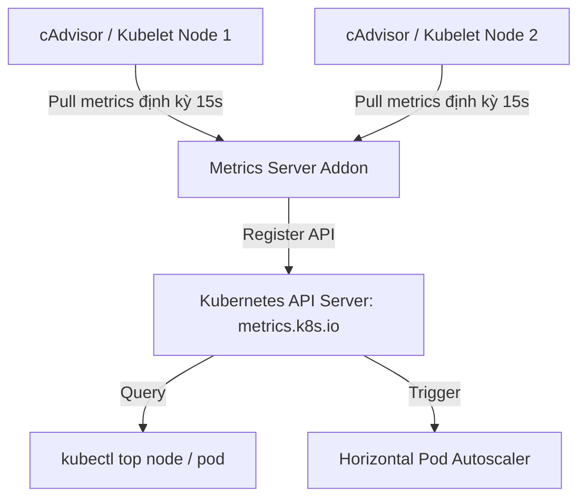
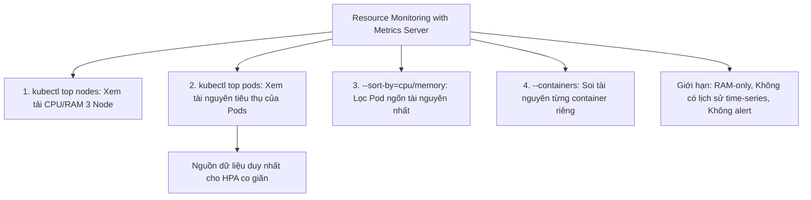
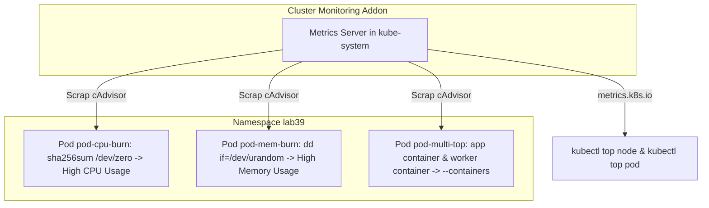


# [BÀI 09] ĐO LƯỜNG HIỆU NĂNG ỨNG DỤNG: METRICS-SERVER, KUBECTL TOP & GIỚI HẠN TRONG MÔI TRƯỜNG SẢN XUẤT

Trong kỷ nguyên điện toán đám mây và kiến trúc microservices phân tán quy mô lớn, **Kubernetes (CKAD)** đóng vai trò là nền tảng điều phối container (Container Orchestration) tiêu chuẩn công nghiệp. Để làm chủ hệ thống trong môi trường sản xuất (Production) cũng như chinh phục kỳ thi chứng chỉ quốc tế của Linux Foundation / CNCF, kỹ sư không chỉ nắm vững các câu lệnh thao tác cơ bản mà phải thấu hiểu sâu sắc bản chất cơ chế tầng thấp: từ chu trình điều hòa (Reconciliation Loop), cấu trúc điều phối tài nguyên, kiến trúc mạng CNI, lưu trữ CSI cho đến các chuẩn mực an ninh phòng thủ chiều sâu.

Bài viết chuyên sâu này sẽ đồng hành cùng bạn giải mã toàn diện bức tranh kiến trúc, phân tích các đánh đổi kỹ thuật thực chiến (Engineering Trade-offs), cung cấp bài thực hành Lab từng bước và bộ câu hỏi phỏng vấn chuẩn Architect / Lead Engineer.

---

## 1. Bản Chất Kiến Trúc & Cơ Chế Vận Hành Tầng Thấp

| # | Câu hỏi ôn tập | Đáp án chuẩn ngắn gọn |
|---|---|---|
| 1 | Cờ lệnh nào của `kubectl logs` bắt buộc dùng để đọc log lần sập trước? | Cờ **`--previous`** (hoặc `-p`) |
| 2 | Cờ chỉ định tên container cụ thể ở Pod đa container khi xem log? | Cờ **`-c <container-name>`** |
| 3 | Ý nghĩa của mã `Exit Code 137` trong mục `Last State` khi xem describe? | Tiến trình bị dập do **OOMKilled** (hết RAM) |
| 4 | Cờ sắp xếp danh sách sự kiện `kubectl get events` theo mốc thời gian? | Cờ **`--sort-by='.metadata.creationTimestamp'`** |
| 5 | Lệnh đính kèm Ephemeral Container để gỡ lỗi Pod không gây gián đoạn? | Lệnh **`kubectl debug <pod> -it --image=<image>`** |


> **"Sử dụng Metrics Server và bộ lệnh `kubectl top` để theo dõi mức tiêu thụ tài nguyên thời gian thực (Resource Monitoring) là kỹ năng cốt lõi thuộc miền Application Observability and Maintenance trong CKAD, đòi hỏi lập trình viên phải làm chủ các cờ lệnh `kubectl top node` và `kubectl top pod` (bao gồm các cờ `--containers` xem chi tiết từng container, `--sort-by=cpu/memory` sắp xếp theo mức tiêu thụ, và `-l` lọc theo nhãn selector); đồng thời hiểu rõ bản chất kiến trúc và các giới hạn kỹ thuật của Metrics Server (chỉ lưu dữ liệu tạm thời trong bộ nhớ RAM mà không có lịch sử chuỗi thời gian time-series) để nhận biết chính xác khi nào Metrics Server đủ dùng cho HPA/VPA và khi nào bắt buộc phải tích hợp hệ thống Prometheus/Grafana trên Production."**

**Kết quả từ các buổi trước được sử dụng lại:**

| Kết quả / Công cụ | Buổi + số hiệu `QT` | Dùng ở đâu trong buổi này |
|---|---|---|
| Cấu hình `requests` và `limits` tài nguyên | Buổi 21 `QT 4.1` | Đối sánh mức tài nguyên thực tế với ngưỡng requests/limits |
| Tự động co giãn theo tải HPA | Buổi 21 `QT 7.1` | Hiểu vai trò của Metrics Server là nguồn cung cấp dữ liệu cho HPA |
| Quan sát sự kiện và trạng thái Pod | Buổi 38 `QT 4.1` | Kết hợp `kubectl top` với `kubectl describe` để chẩn đoán nghẽn tài nguyên |

---


| # | Kỹ năng thực hiện được | Hiện vật chứng minh |
|---|---|---|
| 1 | Kiểm tra chính xác trạng thái hoạt động của Metrics Server và đường dẫn Metrics API | Kết quả lệnh `kubectl get raw /apis/metrics.k8s.io/v1beta1` |
| 2 | Đánh giá mức tiêu thụ CPU/RAM thực tế của từng Node trên cụm qua `kubectl top node` | Bảng dữ liệu CPU/RAM usage của 3 Node |
| 3 | Sắp xếp và truy tìm Pod/container tiêu thụ tài nguyên cao nhất qua `kubectl top pod` | Nhật ký lệnh `kubectl top pods --sort-by=cpu/memory` |
| 4 | Soi mức tiêu thụ tài nguyên từng container trong Pod đa container với cờ `--containers` | Bảng phân rã CPU/RAM từng container |
| 5 | Nhận biết chính xác các giới hạn của Metrics Server và bài toán giám sát Production | Bảng tiêu chí so sánh Metrics Server vs Prometheus/Grafana |

---


| Kiến thức tiên quyết | Nguồn tự học nếu thiếu |
|---|---|
| Cấu hình CPU requests/limits và RAM requests/limits | Buổi 21 (`QT 4.1`) |
| Cơ chế hoạt động của HPA (Horizontal Pod Autoscaler) | Buổi 21 (`QT 7.1`) |
| Chẩn đoán sự cố Pod bằng kubectl describe và logs | Buổi 38 (`QT 4.1`) |

---


### 3.1. Thuật ngữ Việt–Anh

| # | Thuật ngữ tiếng Việt | Tiếng Anh tương đương | Ghi chú chuẩn hoá trong thân bài |
|---|---|---|---|
| 1 | Máy chủ chỉ số | Metrics Server | Addon Kubernetes thu thập chỉ số CPU/RAM ngắn hạn |
| 2 | Giao diện lập trình chỉ số | Metrics API (`metrics.k8s.io`) | API Server pipeline cung cấp dữ liệu chỉ số tài nguyên |
| 3 | Lệnh xem tài nguyên đỉnh | `kubectl top` | Bộ lệnh CLI hiển thị mức tiêu thụ CPU/RAM thời gian thực |
| 4 | Mức tiêu thụ thực tế | Resource Usage / Utilization | Số millicores CPU và MiB RAM đang được dùng thực tế |
| 5 | Đơn vị vi nhân CPU | CPU Millicores (`100m = 0.1 CPU`) | Đơn vị đo lường năng lực tính toán CPU trong K8s |
| 6 | Đơn vị bộ nhớ Mebibyte | Memory Mebibytes (`MiB` / `GiB`) | Đơn vị đo lường dung lượng RAM thực tế |
| 7 | Tự động co giãn theo tải | Horizontal Pod Autoscaler (HPA) | Controller tự động tăng/giảm Pod dựa trên Metrics API |
| 8 | Xem từng container riêng | Container Level Top (`--containers`) | Cờ hiển thị mức tiêu thụ tài nguyên của từng container trong Pod |
| 9 | Sắp xếp theo chỉ số | Sort By Resource (`--sort-by=cpu/memory`) | Cờ sắp xếp danh sách Pod theo mức tiêu thụ CPU hoặc RAM |
| 10 | Dữ liệu chuỗi thời gian | Time-series Data | Dữ liệu lưu lịch sử biến động theo thời gian (Prometheus) |
| 11 | Thu thập từ Kubelet | Kubelet Summary API | Endpoint trên từng Node Kubelet cung cấp thông số cAdvisor |
| 12 | Bộ giám sát chuyên sâu | Full Monitoring Pipeline | Hệ thống Prometheus, Grafana, Datadog lưu trữ lịch sử |
| 13 | Lỗi thiếu Metrics API | `Metrics API not available` | Lỗi xuất hiện khi Metrics Server chưa được cài đặt hoặc bị crash |
| 14 | Bộ thu thập chỉ số container | cAdvisor (Container Advisor) | Tiến trình tích hợp sẵn trong Kubelet đo đạc chỉ số container |


Mô hình Đồng hồ Công-tơ-mét Ô tô so với Hệ thống Hộp đen Hành trình: `kubectl top` và Metrics Server giống như Đồng hồ tốc độ trên bảng điều khiển ô tô (chỉ cho bạn biết ngay lúc này xe đang chạy 80km/h và vòng tơ máy 2000 RPM, không lưu lại lịch sử 3 ngày trước). Prometheus/Grafana giống như Hệ thống Hộp đen GPS ghi lại toàn bộ biểu đồ tốc độ và lượng xăng tiêu thụ của xe trong 6 tháng qua.

---

### 1.1. Kiến trúc Metrics Server và Metrics API trong Kubernetes (12 phút)

**Nguyên lý cốt lõi:** Metrics Server là một thành phần add-on thu thập dữ liệu tiêu thụ CPU/RAM từ cAdvisor trên Kubelet của các Node và cung cấp dữ liệu đó qua đường dẫn Metrics API `metrics.k8s.io`.

**Giải thích cơ chế ngầm:** Metrics Server đóng vai trò là nguồn cung cấp dữ liệu tập trung duy nhất cho Kubernetes API Server và các Controller tự động co giãn (như HPA và VPA). Kubelet thu thập thông số tài nguyên từ cAdvisor trên từng Node, sau đó Metrics Server định kỳ kéo (pull) dữ liệu này về để phục vụ lệnh `kubectl top`.

> [!WARNING]
> **CẠM BẪY THỰC CHIẾN:**
> Tưởng `kubectl top` giao tiếp trực tiếp với Docker/Containerd daemon trên từng Node thay vì đi qua Metrics Server.

**Minh hoạ.**



**Nguyên lý cốt lõi:** Metrics Server KHÔNG lưu trữ dữ liệu lịch sử vào đĩa đĩa; tất cả chỉ số thu thập được chỉ được giữ tạm thời trong bộ nhớ RAM của Metrics Server và bị ghi đè sau mỗi 15–60 giây.

**Giải thích cơ chế ngầm:** Giúp Metrics Server cực kỳ mỏng nhẹ, tiêu tốn ít tài nguyên cụm và chạy mượt mà ngay cả trên các cụm Kubernetes nhỏ. Mục tiêu thiết kế của Metrics Server là đo đạc thời gian thực (Real-time Usage) chứ không phải lưu trữ dữ liệu lịch sử.

> [!WARNING]
> **CẠM BẪY THỰC CHIẾN:**
> Cố gắng xem biểu đồ biến động tài nguyên 7 ngày trước bằng lệnh `kubectl top`.

**Minh hoạ.**

```yaml
# Bảng lưu trữ chỉ số trong bộ nhớ RAM của Metrics Server
# Thời gian lưu trữ: CHỈ 15 - 60 GIÂY GẦN NHẤT
# Lưu đĩa cứng: KHÔNG
# Hỗ trợ truy vấn SQL/PromQL: KHÔNG
```

---

### 1.2. Làm chủ bộ lệnh kubectl top node và kubectl top pod (12 phút)

**Nguyên lý cốt lõi:** Sử dụng lệnh `kubectl top nodes` để xem tổng mức tiêu thụ CPU/RAM của từng Node trên cụm và phần trăm tài nguyên đang sử dụng so với tổng năng lực phần cứng.

**Giải thích cơ chế ngầm:** Giúp quản trị viên hệ thống nhanh chóng xác định xem Node nào đang bị quá tải (Hot Node) hoặc Node nào đang rảnh rỗi để có phương án rebalance Pods hoặc mở rộng thêm Node mới.

> [!WARNING]
> **CẠM BẪY THỰC CHIẾN:**
> Node bị nghẽn RAM do OOM nhưng không biết Node nào bị quá tải do không kiểm tra `kubectl top nodes`.

**Minh hoạ.**

```bash
# Xem tài nguyên tiêu thụ trên các Node:
kubectl top nodes
# Kết quả mẫu:
# NAME        CPU(cores)   CPU%   MEMORY(bytes)   MEMORY%
# cp-01       150m         7%     1200Mi          30%
# worker-01   450m         22%    2100Mi          52%
```

**Nguyên lý cốt lõi:** Sử dụng lệnh `kubectl top pods -A --sort-by=memory` (hoặc `--sort-by=cpu`) để tìm ra các Pod đang ngốn RAM hoặc CPU cao nhất trên toàn bộ các Namespace của cụm.

**Giải thích cơ chế ngầm:** Khi cụm phát cảnh báo hết tài nguyên, cờ `--sort-by` giúp tìm ra ngay lập tức "kẻ thủ phạm" tiêu thụ RAM/CPU lớn nhất mà không cần đọc rải rác từng Pod.

> [!WARNING]
> **CẠM BẪY THỰC CHIẾN:**
> Chạy `kubectl top pods` rồi căng mắt ra đọc dòng nào có con số lớn nhất thay vì dùng cờ `--sort-by`.

**Minh hoạ.**

```bash
# Lọc 5 Pod ngốn RAM cao nhất trên toàn cụm:
kubectl top pods -A --sort-by=memory | head -n 6

# Lọc các Pod thuộc Namespace prod sắp xếp theo CPU:
kubectl top pods -n prod --sort-by=cpu
```

**Nguyên lý cốt lõi:** Sử dụng cờ `--containers` trong lệnh `kubectl top pod <pod-name> --containers` để soi chi tiết mức tiêu thụ tài nguyên của từng container riêng biệt bên trong Pod đa container.

**Giải thích cơ chế ngầm:** Một Pod chứa cả container ứng dụng chính và container sidecar (như Envoy hay Fluentd). Cờ `--containers` giúp phân rã chính xác xem sidecar hay ứng dụng chính mới là bên đang làm tăng đột biến CPU/RAM.

> [!WARNING]
> **CẠM BẪY THỰC CHIẾN:**
> Đổ lỗi cho container app chính ngốn RAM nhưng thực chất là do sidecar fluentd dính lỗi rò rỉ bộ nhớ (Memory Leak).

**Minh hoạ.**

```bash
# Xem tài nguyên chi tiết từng container trong Pod multi-app:
kubectl top pod multi-app -n prod --containers
# Kết quả mẫu:
# POD         CONTAINER   CPU(cores)   MEMORY(bytes)
# multi-app   web         50m          120Mi
# multi-app   sidecar     200m         300Mi
```

---

### 1.3. Các giới hạn kỹ thuật của Metrics Server và khi nào cần Prometheus/Grafana (10 phút)

**Nguyên lý cốt lõi:** Metrics Server là điều kiện bắt buộc để Horizontal Pod Autoscaler (HPA) và Vertical Pod Autoscaler (VPA) hoạt động; nhưng nó KHÔNG thể thay thế cho hệ thống giám sát Prometheus/Grafana/Datadog.

**Giải thích cơ chế ngầm:** Metrics Server chỉ cung cấp chỉ số CPU/RAM thô tức thời. Nó không có khả năng gửi cảnh báo (Alerting Rules), không thu thập các chỉ số ứng dụng tùy chỉnh (Custom Application Metrics như HTTP Request Rate, Error Rate 5xx), và không có giao diện biểu đồ trực quan như Grafana.

> [!WARNING]
> **CẠM BẪY THỰC CHIẾN:**
> Cố xây dựng Dashboard giám sát và cảnh báo sự cố Production dựa hoàn toàn vào `kubectl top`.

**Minh hoạ.**

```yaml
# So sánh Metrics Server vs Prometheus/Grafana
# 1. Mục đích:
#    - Metrics Server: Tự động co giãn HPA/VPA & Lệnh CLI kubectl top
#    - Prometheus/Grafana: Giám sát toàn diện, cảnh báo (Alerting) & Biểu đồ chuỗi thời gian
# 2. Dữ liệu lưu trữ:
#    - Metrics Server: Tạm thời trong RAM (15s)
#    - Prometheus: Lưu trên đĩa cứng đòn bẩy (15 ngày -> vài năm)
```

**Nguyên lý cốt lõi:** Khi lệnh `kubectl top` báo lỗi `error: Metrics API not available`, điều đó có nghĩa là Metrics Server chưa được cài đặt, hoặc Deployment metrics-server bị crash, hoặc cờ `--kubelet-insecure-tls` chưa được bật trong môi trường lab.

**Giải thích cơ chế ngầm:** Kubelet mặc định sử dụng chứng chỉ SSL tự ký (Self-signed certificate). Trong các cụm lab tự dựng (`kubeadm`/`minikube`), nếu không thêm cờ `--kubelet-insecure-tls` vào tham số khởi chạy của Metrics Server deployment, Metrics Server sẽ từ chối kết nối tới Kubelet và khiến lệnh `kubectl top` bị fail.

> [!WARNING]
> **CẠM BẪY THỰC CHIẾN:**
> Thấy lỗi `Metrics API not available` hoảng loạn tưởng cụm K8s bị hỏng phần lõi.

**Minh hoạ.**

```bash
# Sửa Deployment metrics-server trong môi trường lab kubeadm:
kubectl edit deploy metrics-server -n kubesystem
# Bổ sung cờ:
# spec:
#   containers:
#   - args:
#     - --kubelet-insecure-tls
```

---

### 1.4. Đưa vào cụm thật (4 phút)

**Nguyên lý cốt lõi:** Trong kỳ thi CKAD, luôn sử dụng cờ `-l <label-selector>` đi kèm `kubectl top pod` để nhanh chóng lọc ra các Pod thuộc về một ứng dụng cụ thể theo yêu cầu đề thi.

**Giải thích cơ chế ngầm:** Giúp tiết kiệm thời gian lọc thủ công khi làm bài thi CKAD có hàng chục Pod đang chạy cùng lúc trên cụm.

> [!WARNING]
> **CẠM BẪY THỰC CHIẾN:**
> Gõ `kubectl top pods` rồi ngồi dò tay từng dòng tên Pod thay vì dùng cờ `-l tier=frontend`.

**Minh hoạ.**

```bash
# Lọc chỉ số tiêu thụ tài nguyên của các Pod có nhãn tier=frontend:
kubectl top pods -l tier=frontend -n prod --sort-by=memory
```

**Áp vào cụm đang chạy thì làm gì trước:**
1. Kiểm tra trạng thái Metrics Server bằng `kubectl get deployment metrics-server -n kube-system`.
2. Kiểm tra API endpoint qua `kubectl get raw /apis/metrics.k8s.io/v1beta1`.
3. Chạy `kubectl top nodes` kiểm tra mức tải tổng quan cụm trước khi triển khai ứng dụng lớn.

**Cái gì hỏng nếu áp thẳng lên prod:**
- Cấu hình Metrics Server với cờ `--kubelet-insecure-tls` trên môi trường Production thực tế sẽ tạo ra rủi ro bảo mật Man-in-the-middle.

**Đo trước — đo sau:**
- Đo tần suất scrap chỉ số của Metrics Server (mặc định 60s hay 15s).
- Kiểm tra dung lượng RAM tiêu thụ của tiến trình `metrics-server` trên cụm.

**Khi nào KHÔNG nên dùng:**
- Không dùng Metrics Server nếu bạn cần lưu trữ biểu đồ tài nguyên để lập báo cáo tài chính hàng tháng (cần dùng Prometheus/Thanos).

---

### 1.5. Bẫy hay gặp (2 phút)

| Bẫy hay gặp | Vì sao dính | Làm đúng là |
|---|---|---|
| 1. Lỗi `error: Metrics API not available` | Metrics Server chưa cài hoặc thiếu `--kubelet-insecure-tls` | Kiểm tra deployment metrics-server trong `kube-system` |
| 2. Nhầm đơn vị `100m` là 100 Megabytes RAM | Nhầm giữa đơn vị CPU millicores và RAM Memory | `100m` = 0.1 CPU core; `100Mi` = 100 Mebibytes RAM |
| 3. Tưởng `kubectl top` in ra lịch sử 24h trước | Metrics Server không lưu dữ liệu chuỗi thời gian | Dùng Prometheus/Grafana cho dữ liệu lịch sử |
| 4. Quên cờ `--containers` ở Pod đa container | Kết quả `kubectl top pod` chỉ gộp chung tổng tài nguyên Pod | Thêm `--containers` để phân rã từng container |
| 5. Quên cờ `-n <namespace>` hoặc `-A` khi `top` | `kubectl top` mặc định chỉ xem Namespace `default` | Luôn thêm cờ `-n <namespace>` hoặc `-A` |
| 6. Nhầm mức sử dụng thực tế với `requests`/`limits` | Usage là dùng thực tế; Request/Limit là định mức khai báo | Dùng `kubectl top` xem usage; `kubectl describe` xem limits |
| 7. Cố dùng `kubectl top` để cài đặt cảnh báo Alert | Metrics Server không hỗ trợ Alerting Rules | Dùng Prometheus Alertmanager cho cảnh báo |
| 8. Gõ sai từ khóa cờ `--sort-by=cpu` thành `--sort-by=CPUs` | Cú pháp cờ sort-by yêu cầu từ khóa viết chữ thường | Luôn dùng `--sort-by=cpu` hoặc `--sort-by=memory` |
| 9. Thấy Pod dùng RAM sát Limit tưởng bị OOM ngay | Linux Cache RAM có thể tăng dần đến khi thu hồi | Kiểm tra xem cờ `OOMKilled` có xuất hiện ở describe không |
| 10. Chạy `kubectl top` ngay khi Pod vừa tạo | Metrics Server cần 15-30 giây để thu thập dữ liệu đầu tiên | Đợi 30s sau khi Pod Running mới chạy `kubectl top` |
| 11. Dùng cờ `--kubelet-insecure-tls` trên Prod | Bỏ qua xác thực SSL chứng chỉ Kubelet trên Prod | Chỉ dùng cờ này trong môi trường lab tự dựng |
| 12. Quên cờ `-l` làm trôi danh sách Pod cần lọc | Không dùng nhãn selector để thu hẹp phạm vi | Gắn cờ `-l key=value` khi top theo nhóm Pod |

---

### 1.6. Tóm tắt (2 phút)



**Năm điều phải nhớ:**
1. **Kiến trúc Metrics Server**: Thu thập dữ liệu từ cAdvisor trên Kubelet qua API `metrics.k8s.io`.
2. **Bộ lệnh CLI**: `kubectl top nodes` và `kubectl top pods`.
3. **Cờ sắp xếp**: Dùng `--sort-by=cpu` hoặc `--sort-by=memory` để tìm Pod ngốn tài nguyên nhất.
4. **Phân rã container**: Dùng `--containers` cho Pod đa container.
5. **Giới hạn kỹ thuật**: Không lưu đĩa, chỉ giữ RAM 15-60s, không thay được Prometheus/Grafana.

---

## §10. Câu hỏi tự kiểm tra (5 phút)


<details class="qa-card">
<summary class="qa-summary">
  <div class="qa-summary-left">
    <span class="qa-num-badge">Q01</span>
    <span>Metrics Server thu thập dữ liệu chỉ số tài nguyên CPU và RAM từ tiến trình nào trên các Node?</span>
  </div>
  <span class="qa-chevron">
    <svg width="18" height="18" fill="none" stroke="currentColor" stroke-width="2.5" viewBox="0 0 24 24"><polyline points="6 9 12 15 18 9"></polyline></svg>
  </span>
</summary>
<div class="qa-answer">
  <div class="qa-answer-header">
    <svg width="14" height="14" fill="none" stroke="currentColor" stroke-width="2" viewBox="0 0 24 24"><path d="M22 11.08V12a10 10 0 1 1-5.93-9.14"></path><polyline points="22 4 12 14.01 9 11.01"></polyline></svg>
    <span>Phân Tích &amp; Lời Giải Kỹ Thuật</span>
  </div>
  Thu thập từ tiến trình `cAdvisor` tích hợp trong Kubelet.
</div>
</details>

<details class="qa-card">
<summary class="qa-summary">
  <div class="qa-summary-left">
    <span class="qa-num-badge">Q02</span>
    <span>Đường dẫn API Server nào được Metrics Server đăng ký để cung cấp dữ liệu cho `kubectl top` và HPA?</span>
  </div>
  <span class="qa-chevron">
    <svg width="18" height="18" fill="none" stroke="currentColor" stroke-width="2.5" viewBox="0 0 24 24"><polyline points="6 9 12 15 18 9"></polyline></svg>
  </span>
</summary>
<div class="qa-answer">
  <div class="qa-answer-header">
    <svg width="14" height="14" fill="none" stroke="currentColor" stroke-width="2" viewBox="0 0 24 24"><path d="M22 11.08V12a10 10 0 1 1-5.93-9.14"></path><polyline points="22 4 12 14.01 9 11.01"></polyline></svg>
    <span>Phân Tích &amp; Lời Giải Kỹ Thuật</span>
  </div>
  Đường dẫn Metrics API `metrics.k8s.io/v1beta1`.
</div>
</details>

<details class="qa-card">
<summary class="qa-summary">
  <div class="qa-summary-left">
    <span class="qa-num-badge">Q03</span>
    <span>Metrics Server lưu trữ dữ liệu chỉ số thu thập được ở đâu và trong thời gian bao lâu?</span>
  </div>
  <span class="qa-chevron">
    <svg width="18" height="18" fill="none" stroke="currentColor" stroke-width="2.5" viewBox="0 0 24 24"><polyline points="6 9 12 15 18 9"></polyline></svg>
  </span>
</summary>
<div class="qa-answer">
  <div class="qa-answer-header">
    <svg width="14" height="14" fill="none" stroke="currentColor" stroke-width="2" viewBox="0 0 24 24"><path d="M22 11.08V12a10 10 0 1 1-5.93-9.14"></path><polyline points="22 4 12 14.01 9 11.01"></polyline></svg>
    <span>Phân Tích &amp; Lời Giải Kỹ Thuật</span>
  </div>
  Lưu tạm thời trong bộ nhớ RAM và bị ghi đè sau mỗi 15–60 giây (không lưu đĩa cứng).
</div>
</details>

<details class="qa-card">
<summary class="qa-summary">
  <div class="qa-summary-left">
    <span class="qa-num-badge">Q04</span>
    <span>Câu lệnh CLI nào dùng để kiểm tra mức tiêu thụ CPU và RAM của tất cả các Node trên cụm?</span>
  </div>
  <span class="qa-chevron">
    <svg width="18" height="18" fill="none" stroke="currentColor" stroke-width="2.5" viewBox="0 0 24 24"><polyline points="6 9 12 15 18 9"></polyline></svg>
  </span>
</summary>
<div class="qa-answer">
  <div class="qa-answer-header">
    <svg width="14" height="14" fill="none" stroke="currentColor" stroke-width="2" viewBox="0 0 24 24"><path d="M22 11.08V12a10 10 0 1 1-5.93-9.14"></path><polyline points="22 4 12 14.01 9 11.01"></polyline></svg>
    <span>Phân Tích &amp; Lời Giải Kỹ Thuật</span>
  </div>
  Lệnh `kubectl top nodes`.
</div>
</details>

<details class="qa-card">
<summary class="qa-summary">
  <div class="qa-summary-left">
    <span class="qa-num-badge">Q05</span>
    <span>Cờ lệnh nào được dùng để sắp xếp danh sách Pod theo mức tiêu thụ bộ nhớ RAM giảm dần?</span>
  </div>
  <span class="qa-chevron">
    <svg width="18" height="18" fill="none" stroke="currentColor" stroke-width="2.5" viewBox="0 0 24 24"><polyline points="6 9 12 15 18 9"></polyline></svg>
  </span>
</summary>
<div class="qa-answer">
  <div class="qa-answer-header">
    <svg width="14" height="14" fill="none" stroke="currentColor" stroke-width="2" viewBox="0 0 24 24"><path d="M22 11.08V12a10 10 0 1 1-5.93-9.14"></path><polyline points="22 4 12 14.01 9 11.01"></polyline></svg>
    <span>Phân Tích &amp; Lời Giải Kỹ Thuật</span>
  </div>
  Cờ `--sort-by=memory`.
</div>
</details>

<details class="qa-card">
<summary class="qa-summary">
  <div class="qa-summary-left">
    <span class="qa-num-badge">Q06</span>
    <span>Cờ lệnh nào được dùng để xem chi tiết mức tiêu thụ tài nguyên của từng container trong Pod đa container?</span>
  </div>
  <span class="qa-chevron">
    <svg width="18" height="18" fill="none" stroke="currentColor" stroke-width="2.5" viewBox="0 0 24 24"><polyline points="6 9 12 15 18 9"></polyline></svg>
  </span>
</summary>
<div class="qa-answer">
  <div class="qa-answer-header">
    <svg width="14" height="14" fill="none" stroke="currentColor" stroke-width="2" viewBox="0 0 24 24"><path d="M22 11.08V12a10 10 0 1 1-5.93-9.14"></path><polyline points="22 4 12 14.01 9 11.01"></polyline></svg>
    <span>Phân Tích &amp; Lời Giải Kỹ Thuật</span>
  </div>
  Cờ `--containers`.
</div>
</details>

<details class="qa-card">
<summary class="qa-summary">
  <div class="qa-summary-left">
    <span class="qa-num-badge">Q07</span>
    <span>Ý nghĩa của đơn vị `100m` trong cột CPU khi chạy lệnh `kubectl top` là gì?</span>
  </div>
  <span class="qa-chevron">
    <svg width="18" height="18" fill="none" stroke="currentColor" stroke-width="2.5" viewBox="0 0 24 24"><polyline points="6 9 12 15 18 9"></polyline></svg>
  </span>
</summary>
<div class="qa-answer">
  <div class="qa-answer-header">
    <svg width="14" height="14" fill="none" stroke="currentColor" stroke-width="2" viewBox="0 0 24 24"><path d="M22 11.08V12a10 10 0 1 1-5.93-9.14"></path><polyline points="22 4 12 14.01 9 11.01"></polyline></svg>
    <span>Phân Tích &amp; Lời Giải Kỹ Thuật</span>
  </div>
  Là 100 millicores (tương đương 0.1 CPU core hay 10% của 1 CPU core).
</div>
</details>

<details class="qa-card">
<summary class="qa-summary">
  <div class="qa-summary-left">
    <span class="qa-num-badge">Q08</span>
    <span>Khi chạy `kubectl top` báo lỗi `error: Metrics API not available`, nguyên nhân thường gặp là gì?</span>
  </div>
  <span class="qa-chevron">
    <svg width="18" height="18" fill="none" stroke="currentColor" stroke-width="2.5" viewBox="0 0 24 24"><polyline points="6 9 12 15 18 9"></polyline></svg>
  </span>
</summary>
<div class="qa-answer">
  <div class="qa-answer-header">
    <svg width="14" height="14" fill="none" stroke="currentColor" stroke-width="2" viewBox="0 0 24 24"><path d="M22 11.08V12a10 10 0 1 1-5.93-9.14"></path><polyline points="22 4 12 14.01 9 11.01"></polyline></svg>
    <span>Phân Tích &amp; Lời Giải Kỹ Thuật</span>
  </div>
  Do Metrics Server chưa được cài đặt, hoặc bị crash, hoặc thiếu cờ `--kubelet-insecure-tls` trong môi trường lab.
</div>
</details>

<details class="qa-card">
<summary class="qa-summary">
  <div class="qa-summary-left">
    <span class="qa-num-badge">Q09</span>
    <span>Tại sao Metrics Server KHÔNG thể thay thế cho hệ thống giám sát Prometheus và Grafana trên Production?</span>
  </div>
  <span class="qa-chevron">
    <svg width="18" height="18" fill="none" stroke="currentColor" stroke-width="2.5" viewBox="0 0 24 24"><polyline points="6 9 12 15 18 9"></polyline></svg>
  </span>
</summary>
<div class="qa-answer">
  <div class="qa-answer-header">
    <svg width="14" height="14" fill="none" stroke="currentColor" stroke-width="2" viewBox="0 0 24 24"><path d="M22 11.08V12a10 10 0 1 1-5.93-9.14"></path><polyline points="22 4 12 14.01 9 11.01"></polyline></svg>
    <span>Phân Tích &amp; Lời Giải Kỹ Thuật</span>
  </div>
  Vì Metrics Server không lưu lịch sử chuỗi thời gian (time-series), không hỗ trợ chỉ số ứng dụng tùy chỉnh và không hỗ trợ quy tắc cảnh báo (Alerting).
</div>
</details>

<details class="qa-card">
<summary class="qa-summary">
  <div class="qa-summary-left">
    <span class="qa-num-badge">Q10</span>
    <span>Cờ lệnh nào của `kubectl top pods` được dùng để xem tài nguyên của Pod trên TOÀN BỘ các Namespace?</span>
  </div>
  <span class="qa-chevron">
    <svg width="18" height="18" fill="none" stroke="currentColor" stroke-width="2.5" viewBox="0 0 24 24"><polyline points="6 9 12 15 18 9"></polyline></svg>
  </span>
</summary>
<div class="qa-answer">
  <div class="qa-answer-header">
    <svg width="14" height="14" fill="none" stroke="currentColor" stroke-width="2" viewBox="0 0 24 24"><path d="M22 11.08V12a10 10 0 1 1-5.93-9.14"></path><polyline points="22 4 12 14.01 9 11.01"></polyline></svg>
    <span>Phân Tích &amp; Lời Giải Kỹ Thuật</span>
  </div>
  Cờ `-A` (hoặc `--all-namespaces`).
</div>
</details>

<details class="qa-card">
<summary class="qa-summary">
  <div class="qa-summary-left">
    <span class="qa-num-badge">Q11</span>
    <span>Cờ lệnh nào của `kubectl top pods` được dùng để chỉ lọc ra các Pod mang nhãn `app=web`?</span>
  </div>
  <span class="qa-chevron">
    <svg width="18" height="18" fill="none" stroke="currentColor" stroke-width="2.5" viewBox="0 0 24 24"><polyline points="6 9 12 15 18 9"></polyline></svg>
  </span>
</summary>
<div class="qa-answer">
  <div class="qa-answer-header">
    <svg width="14" height="14" fill="none" stroke="currentColor" stroke-width="2" viewBox="0 0 24 24"><path d="M22 11.08V12a10 10 0 1 1-5.93-9.14"></path><polyline points="22 4 12 14.01 9 11.01"></polyline></svg>
    <span>Phân Tích &amp; Lời Giải Kỹ Thuật</span>
  </div>
  Cờ `-l app=web`.
</div>
</details>

<details class="qa-card">
<summary class="qa-summary">
  <div class="qa-summary-left">
    <span class="qa-num-badge">Q12</span>
    <span>Thành phần Controller tự động nào trong Kubernetes phụ thuộc trực tiếp vào Metrics Server để hoạt động?</span>
  </div>
  <span class="qa-chevron">
    <svg width="18" height="18" fill="none" stroke="currentColor" stroke-width="2.5" viewBox="0 0 24 24"><polyline points="6 9 12 15 18 9"></polyline></svg>
  </span>
</summary>
<div class="qa-answer">
  <div class="qa-answer-header">
    <svg width="14" height="14" fill="none" stroke="currentColor" stroke-width="2" viewBox="0 0 24 24"><path d="M22 11.08V12a10 10 0 1 1-5.93-9.14"></path><polyline points="22 4 12 14.01 9 11.01"></polyline></svg>
    <span>Phân Tích &amp; Lời Giải Kỹ Thuật</span>
  </div>
  Horizontal Pod Autoscaler (HPA) và Vertical Pod Autoscaler (VPA).
</div>
</details>

---

## §11. Tài liệu tham khảo

| Nguồn | Địa chỉ URL | Ghi chú |
|---|---|---|
| Metrics Server Documentation | `https://kubernetes.io/docs/tasks/debug/debug-cluster/resource-metrics-pipeline/` | Tài liệu chuẩn K8s Resource Metrics Pipeline |
| Metrics Server GitHub Repository | `https://github.com/kubernetes-sigs/metrics-server` | Mã nguồn chính thức Metrics Server |

---

## Bảng đối soát thời lượng

| Mục | Ngân sách thời gian | Thực tế |
|---|---|---|
| §0. Khởi động và ôn tập | 10 phút | 10 phút |
| §1. Học viên làm được gì | 1 phút | 1 phút |
| §2. Cần biết trước | 1 phút | 1 phút |
| §3. Thuật ngữ và mô hình tư duy | 8 phút | 8 phút |
| §4. Kiến trúc Metrics Server | 12 phút | 12 phút |
| §5. Bộ lệnh kubectl top node và pod | 12 phút | 12 phút |
| §6. Các giới hạn kỹ thuật của Metrics Server | 10 phút | 10 phút |
| §7. Đưa vào cụm thật | 4 phút | 4 phút |
| §8. Bẫy hay gặp | 2 phút | 2 phút |
| §9. Tóm tắt | 2 phút | 2 phút |
| §10. Câu hỏi tự kiểm tra | 5 phút | 5 phút |
| **Tổng** | **60'** | **60'** |

---

## 2. Hướng Dẫn Thực Hành & Triển Khai Lab Chuẩn Production

> [!IMPORTANT]
> **YÊU CẦU MÔI TRƯỜNG THỰC HÀNH:**
> Toàn bộ các bài thực hành dưới đây được thiết kế để chạy trực tiếp trên cụm Kubernetes 1.30+ tiêu chuẩn (hoặc cụm kind/kubeadm lab). Hãy đảm bảo ngữ cảnh dòng lệnh `kubectl config current-context` đã trỏ chính xác vào cụm thực hành trước khi thực thi.

## Khối thực hành — 120 phút

## L0. Mục tiêu thực hành và tiêu chí hoàn thành

| Mã tiêu chí | Nội dung tiêu chí | Lệnh kiểm chứng | Kết quả kỳ vọng |
|---|---|---|---|
| TH1 | Tạo Namespace `lab39` phục vụ thực hành Resource Monitoring với Metrics Server | `kubectl get ns lab39 -o jsonpath='{.status.phase}'` | In ra `Active` |
| TH2 | Kiểm tra Deployment `metrics-server` chạy ở trạng thái `Running` trong `kube-system` | `kubectl get deploy metrics-server -n kube-system -o jsonpath='{.status.readyReplicas}'` | In ra con số `>= 1` |
| TH3 | Kiểm tra API `metrics.k8s.io` phản hồi HTTP 200 | `kubectl get raw /apis/metrics.k8s.io/v1beta1 \| grep -q "APIResourceList"` | Xác nhận có Metrics API |
| TH4 | Thực thi thành công lệnh `kubectl top nodes` | `kubectl top nodes \| grep -q "cp-01"` | In ra dữ liệu CPU/RAM của cp-01 |
| TH5 | Triển khai Pod `pod-cpu-burn` giả lập ngốn CPU | `kubectl get pod pod-cpu-burn -n lab39 -o jsonpath='{.metadata.name}'` | In ra `pod-cpu-burn` |
| TH6 | Triển khai Pod `pod-mem-burn` giả lập ngốn RAM | `kubectl get pod pod-mem-burn -n lab39 -o jsonpath='{.metadata.name}'` | In ra `pod-mem-burn` |
| TH7 | Kiểm tra chỉ số CPU tăng vọt của `pod-cpu-burn` qua `kubectl top` | `kubectl top pod pod-cpu-burn -n lab39 \| grep -q "pod-cpu-burn"` | In ra dòng chỉ số CPU |
| TH8 | Kiểm tra chỉ số RAM của `pod-mem-burn` qua `kubectl top` | `kubectl top pod pod-mem-burn -n lab39 \| grep -q "pod-mem-burn"` | In ra dòng chỉ số RAM |
| TH9 | Tìm Pod ngốn CPU nhất qua `kubectl top pods --sort-by=cpu` | `kubectl top pods -n lab39 --sort-by=cpu \| head -n 2 \| grep -q "pod-cpu-burn"` | In Pod cpu burn đứng đầu |
| TH10 | Tìm Pod ngốn RAM nhất qua `kubectl top pods --sort-by=memory` | `kubectl top pods -n lab39 --sort-by=memory \| head -n 2 \| grep -q "pod-mem-burn"` | In Pod mem burn đứng đầu |
| TH11 | Soi tài nguyên từng container trong Pod đa container bằng `--containers` | `kubectl top pod pod-multi-top --containers -n lab39 \| grep -q "worker"` | In ra dòng container worker |
| TH12 | Lọc tài nguyên Pod theo nhãn `app=burn` bằng cờ `-l` | `kubectl top pods -l app=burn -n lab39 \| grep -q "pod-cpu-burn"` | In ra các Pod mang nhãn |
| TH13 | Dọn dẹp sạch sẽ tài nguyên lab39 | `test ! -f /tmp/lab39-top.yaml && echo "CLEAN"` | In ra `CLEAN` |

---

## L1. Điều kiện tiên quyết về môi trường

| Kiểm tra | Lệnh thực hiện | Kết quả kỳ vọng |
|---|---|---|
| Cụm Kubernetes ba node | `kubectl get nodes` | `cp-01`, `worker-01`, `worker-02` ở trạng thái `Ready` |
| Context đúng môi trường lab | `kubectl config current-context` | Đúng context cụm `kubeadm` |
| Metrics Server đã cài đặt | `kubectl get deploy metrics-server -n kube-system` | Hiển thị deployment `metrics-server` |

---

## L2. Kiến trúc bài lab Resource Monitoring với Metrics Server



---

## L3. Bước 1: Khởi tạo Namespace `lab39` và kiểm tra Metrics API (10 phút)

### Thao tác 1.1: Tạo Namespace

```bash
kubectl create namespace lab39
```

**CHECKPOINT 1 — Kiểm tra Namespace `lab39`.**

```bash
kubectl get ns lab39 -o jsonpath='{.status.phase}' | grep -qx Active && echo "CHECKPOINT 1 — ĐẠT" || echo "CHECKPOINT 1 — LỖI"
```

### Thao tác 1.2: Kiểm tra trạng thái Metrics Server trong `kube-system`

```bash
kubectl get deploy metrics-server -n kube-system
```

**CHECKPOINT 2 — Kiểm tra Deployment `metrics-server` sẵn sàng.**

```bash
[ $(kubectl get deploy metrics-server -n kube-system -o jsonpath='{.status.readyReplicas}') -ge 1 ] && echo "CHECKPOINT 2 — ĐẠT" || echo "CHECKPOINT 2 — LỖI"
```

**CHECKPOINT 3 — Kiểm tra đường dẫn Metrics API `/apis/metrics.k8s.io/v1beta1`.**

```bash
kubectl get raw /apis/metrics.k8s.io/v1beta1 | grep -q "APIResourceList" && echo "CHECKPOINT 3 — ĐẠT" || echo "CHECKPOINT 3 — LỖI"
```

---

## L4. Bước 2: Kiểm tra mức tiêu thụ tài nguyên của Node qua `kubectl top nodes` (15 phút)

### Thao tác 2.1: Chạy lệnh top node

```bash
kubectl top nodes
```

**CHECKPOINT 4 — Kiểm tra dữ liệu `cp-01` hiển thị trên `kubectl top nodes`.**

```bash
kubectl top nodes | grep -q "cp-01" && echo "CHECKPOINT 4 — ĐẠT" || echo "CHECKPOINT 4 — LỖI"
```

---

## L5. Bước 3: Triển khai Pod ngốn CPU và RAM để soi qua `kubectl top` (35 phút)

### Thao tác 3.1: Biên soạn Pod `pod-cpu-burn` ngốn CPU

```bash
cat <<EOF | kubectl apply -f -
apiVersion: v1
kind: Pod
metadata:
  name: pod-cpu-burn
  namespace: lab39
  labels:
    app: burn
spec:
  containers:
    - name: cpu-burner
      image: busybox:1.36
      command: ["sh", "-c", "sha256sum /dev/zero"]
      resources:
        requests:
          cpu: 100m
          memory: 30Mi
EOF
```

**CHECKPOINT 5 — Kiểm tra Pod `pod-cpu-burn`.**

```bash
kubectl get pod pod-cpu-burn -n lab39 -o jsonpath='{.metadata.name}' | grep -qx pod-cpu-burn && echo "CHECKPOINT 5 — ĐẠT" || echo "CHECKPOINT 5 — LỖI"
```

### Thao tác 3.2: Biên soạn Pod `pod-mem-burn` ngốn RAM

```bash
cat <<EOF | kubectl apply -f -
apiVersion: v1
kind: Pod
metadata:
  name: pod-mem-burn
  namespace: lab39
  labels:
    app: burn
spec:
  containers:
    - name: mem-burner
      image: busybox:1.36
      command: ["sh", "-c", "dd if=/dev/urandom of=/tmp/file.bin bs=1M count=80; sleep 3600"]
      resources:
        requests:
          memory: 50Mi
EOF
```

**CHECKPOINT 6 — Kiểm tra Pod `pod-mem-burn`.**

```bash
kubectl get pod pod-mem-burn -n lab39 -o jsonpath='{.metadata.name}' | grep -qx pod-mem-burn && echo "CHECKPOINT 6 — ĐẠT" || echo "CHECKPOINT 6 — LỖI"
```

### Thao tác 3.3: Chờ 20s và đo tài nguyên tiêu thụ

```bash
sleep 20
kubectl top pod pod-cpu-burn -n lab39
kubectl top pod pod-mem-burn -n lab39
```

**CHECKPOINT 7 — Kiểm tra chỉ số CPU của `pod-cpu-burn` qua `kubectl top`.**

```bash
kubectl top pod pod-cpu-burn -n lab39 | grep -q "pod-cpu-burn" && echo "CHECKPOINT 7 — ĐẠT" || echo "CHECKPOINT 7 — LỖI"
```

**CHECKPOINT 8 — Kiểm tra chỉ số RAM của `pod-mem-burn` qua `kubectl top`.**

```bash
kubectl top pod pod-mem-burn -n lab39 | grep -q "pod-mem-burn" && echo "CHECKPOINT 8 — ĐẠT" || echo "CHECKPOINT 8 — LỖI"
```

---

## L6. Bước 4: Sắp xếp tài nguyên tiêu thụ với cờ `--sort-by` (25 phút)

### Thao tác 4.1: Sắp xếp Pod theo CPU giảm dần

```bash
kubectl top pods -n lab39 --sort-by=cpu
```

**CHECKPOINT 9 — Xác minh Pod `pod-cpu-burn` đứng đầu danh sách `--sort-by=cpu`.**

```bash
kubectl top pods -n lab39 --sort-by=cpu | head -n 2 | grep -q "pod-cpu-burn" && echo "CHECKPOINT 9 — ĐẠT" || echo "CHECKPOINT 9 — LỖI"
```

### Thao tác 4.2: Sắp xếp Pod theo RAM giảm dần

```bash
kubectl top pods -n lab39 --sort-by=memory
```

**CHECKPOINT 10 — Xác minh Pod `pod-mem-burn` đứng đầu danh sách `--sort-by=memory`.**

```bash
kubectl top pods -n lab39 --sort-by=memory | head -n 2 | grep -q "pod-mem-burn" && echo "CHECKPOINT 10 — ĐẠT" || echo "CHECKPOINT 10 — LỖI"
```

---

## L7. Bước 5: Phân rã container trong Pod đa container bằng `--containers` (25 phút)

### Thao tác 5.1: Triển khai Pod đa container `pod-multi-top`

```bash
cat <<EOF | kubectl apply -f -
apiVersion: v1
kind: Pod
metadata:
  name: pod-multi-top
  namespace: lab39
spec:
  containers:
    - name: app
      image: busybox:1.36
      command: ["sh", "-c", "sleep 3600"]
    - name: worker
      image: busybox:1.36
      command: ["sh", "-c", "sha256sum /dev/zero"]
EOF
```

```bash
sleep 20
kubectl top pod pod-multi-top -n lab39 --containers
```

**CHECKPOINT 11 — Kiểm tra phân rã container `worker` bằng `--containers`.**

```bash
kubectl top pod pod-multi-top --containers -n lab39 | grep -q "worker" && echo "CHECKPOINT 11 — ĐẠT" || echo "CHECKPOINT 11 — LỖI"
```

### Thao tác 5.2: Lọc tài nguyên Pod theo nhãn `app=burn` bằng cờ `-l`

```bash
kubectl top pods -l app=burn -n lab39
```

**CHECKPOINT 12 — Kiểm tra lọc theo nhãn `app=burn`.**

```bash
kubectl top pods -l app=burn -n lab39 | grep -q "pod-cpu-burn" && echo "CHECKPOINT 12 — ĐẠT" || echo "CHECKPOINT 12 — LỖI"
```

---

## L8. Dọn dẹp môi trường (10 phút)

### Thao tác 8.1: Dọn dẹp tài nguyên lab39

```bash
kubectl delete namespace lab39
rm -f /tmp/lab39-top.yaml
```

**CHECKPOINT 13 — Kiểm tra dọn dẹp sạch sẽ.**

```bash
test ! -f /tmp/lab39-top.yaml && echo "CHECKPOINT 13 — ĐẠT" || echo "CHECKPOINT 13 — LỖI"
```

---

## L9. Xử lý sự cố thường gặp trong lab

| Triệu chứng lỗi | Nguyên nhân gốc rễ | Cách sửa triệt để |
|---|---|---|
| 1. Lỗi `error: Metrics API not available` | Metrics Server chưa cài đặt hoặc deployment bị crash | Cài đặt Metrics Server hoặc kiểm tra log deployment |
| 2. Metrics Server từ chối kết nối Kubelet SSL | Thiếu cờ `--kubelet-insecure-tls` trong môi trường lab | Thêm `--kubelet-insecure-tls` vào args Metrics Server |
| 3. `kubectl top pod` báo `metrics not available yet` | Pod mới bật chưa đủ 15-30 giây để Metrics Server scrap | Chờ 30 giây sau khi Pod Running rồi chạy lại lệnh |
| 4. Gõ sai từ khóa cờ `--sort-by=CPU` | Cờ sort-by phân biệt chữ hoa/thường | Viết chữ thường: `--sort-by=cpu` hoặc `--sort-by=memory` |
| 5. Lỗi nhầm đơn vị `m` thành Megabytes RAM | Nhầm giữa đơn vị CPU millicores và RAM Memory | `100m` = 0.1 CPU core; `100Mi` = 100 Mebibytes RAM |
| 6. `kubectl top pod` chỉ gộp chung tài nguyên Pod đa container | Không truyền cờ `--containers` | Thêm cờ `--containers` để phân rã từng container |
| 7. Quên cờ `-n lab39` khi gõ `kubectl top` | Xem tài nguyên ở Namespace `default` | Luôn thêm `-n lab39` hoặc cờ `-A` |
| 8. Metrics Server ngốn quá nhiều RAM | Scrapinterval quá ngắn hoặc số lượng Node quá lớn | Điều chỉnh `--metric-resolution=30s` hoặc `60s` |
| 9. `kubectl top nodes` báo thiếu dữ liệu 1 Node | Kubelet trên Node đó bị dừng tiến trình hoặc rớt mạng | Khởi động lại `systemctl restart kubelet` trên Node hỏng |
| 10. `kubectl top` không hiển thị phần trăm `%` CPU của Pod | API K8s thiết kế top pod chỉ in ra con số tuyệt đối (m/Mi) | Đối sánh con số (m/Mi) với requests/limits spec Pod |
| 11. HPA báo trạng thái `<unknown>` ở chỉ số CPU | HPA không kết nối được tới Metrics API | Kiểm tra `kubectl top pods` xem có ra dữ liệu không |
| 12. Quên cờ `-l` làm trôi danh sách Pod cần xem | Không dùng label selector để thu hẹp phạm vi | Gắn cờ `-l key=value` khi top theo nhóm Pod |
| 13. Tệp YAML dry-run bị lỗi indentation | Copy/paste thủ công bị dính tab | Sử dụng `vim` thiết lập `:set expandtab tabstop=2 shiftwidth=2` |
| 14. Metrics API trả về mã lỗi HTTP 500 | Metrics Server dính lỗi rò rỉ bộ nhớ internal | Restart Deployment: `kubectl rollout restart deploy metrics-server -n kube-system` |

---

## L10. Bài tập mở rộng

- **BT1:** Thực hành viết script Bash tự động kiểm tra xem có Pod nào dùng RAM vượt quá 80% `limits.memory` hay không.
- **BT2:** So sánh chỉ số CPU/RAM thực tế từ `kubectl top pod` với thông số hiển thị từ `docker stats` hoặc `crictl stats` trên Node.
- **BT3:** Thử nghiệm thay đổi cờ `--metric-resolution` của Metrics Server từ 60s xuống 15s và đo độ nhạy của `kubectl top`.
- **BT4:** Tạo một Horizontal Pod Autoscaler (HPA) trỏ vào `pod-cpu-burn` và quan sát HPA tự động scale Pod dựa trên Metrics API.
- **BT5:** Sử dụng lệnh `kubectl get raw /apis/metrics.k8s.io/v1beta1/namespaces/lab39/pods` để xem tệp JSON thô thu được từ Metrics API.
- **BT6:** Phân tích lý do tại sao Metrics Server không hỗ trợ các chỉ số custom ứng dụng (Custom Application Metrics).

---

## L11. Hiện vật nộp và tiêu chí chấm điểm

| Hạng mục hiện vật | Tiêu chí chấm điểm đạt | Thang điểm |
|---|---|---|
| Nhật ký 13 Checkpoint | Thực thi thành công 100 % các checkpoint in ra `ĐẠT` | 50 điểm |
| Thao tác `kubectl top nodes` & `top pods` | Kiểm tra tài nguyên Node/Pod và dùng cờ `--sort-by` | 20 điểm |
| Thao tác `--containers` & `-l` selector | Phân rã container Pod đa container và lọc theo nhãn | 20 điểm |
| Báo cáo bài tập mở rộng | Trả lời đầy đủ câu hỏi BT1 và BT2 | 10 điểm |
| **Tổng điểm** | | **100 điểm** |

---

## Bảng đối soát thời lượng

| Khối thực hành | Ngân sách thời gian | Thực tế |
|---|---|---|
| L0 & L1. Chuẩn bị và kiểm tra | 10 phút | 10 phút |
| L3. Bước 1: Khởi tạo Namespace & API | 10 phút | 10 phút |
| L4. Bước 2: kubectl top nodes | 15 phút | 15 phút |
| L5. Bước 3: Pod burn CPU/RAM & top | 35 phút | 35 phút |
| L6. Bước 4: Sort-by cpu/memory | 25 phút | 25 phút |
| L7. Bước 5: --containers & -l selector | 15 phút | 15 phút |
| L8. Dọn dẹp môi trường | 10 phút | 10 phút |
| **Tổng** | **120'** | **120'** |

---

## 3. Bộ Câu Hỏi Vấn Đáp & Phỏng Vấn Kỹ Thuật Chuyên Sâu

Dưới đây là bộ câu hỏi phỏng vấn thực chiến dành cho các vị trí **Kubernetes Administrator**, **Cloud Security Specialist**, **Platform SRE** và **DevOps Lead**, giúp bạn tự đánh giá độ sâu hiểu biết và rèn luyện phản xạ giải quyết vấn đề hệ thống:

## V1. Cách tiến hành

Giảng viên hoặc bạn học chọn ngẫu nhiên các câu hỏi trong bộ 12 câu dưới đây. Người trả lời phải trình bày mạch lạc trong 60–90 giây mỗi câu, đi thẳng vào cơ chế kỹ thuật và viện dẫn các lệnh CLI thực tế.

---

## V2. Bộ câu hỏi


<details class="qa-card">
<summary class="qa-summary">
  <div class="qa-summary-left">
    <span class="qa-num-badge">Q01</span>
    <span>Metrics Server thu thập dữ liệu tài nguyên từ đâu và cung cấp cho thành phần nào trong Kubernetes?</span>
  </div>
  <span class="qa-chevron">
    <svg width="18" height="18" fill="none" stroke="currentColor" stroke-width="2.5" viewBox="0 0 24 24"><polyline points="6 9 12 15 18 9"></polyline></svg>
  </span>
</summary>
<div class="qa-answer">
  <div class="qa-answer-header">
    <svg width="14" height="14" fill="none" stroke="currentColor" stroke-width="2" viewBox="0 0 24 24"><path d="M22 11.08V12a10 10 0 1 1-5.93-9.14"></path><polyline points="22 4 12 14.01 9 11.01"></polyline></svg>
    <span>Phân Tích &amp; Lời Giải Kỹ Thuật</span>
  </div>
  Metrics Server định kỳ thu thập (pull) chỉ số CPU/RAM từ tiến trình `cAdvisor` tích hợp trong Kubelet của các Node. Dữ liệu này được cung cấp cho Kubernetes API Server qua đường dẫn Metrics API (`metrics.k8s.io`) phục vụ cho lệnh `kubectl top` và bộ tự động co giãn HPA/VPA.

**Tiêu chí chấm:**
- 0đ: Cho rằng Metrics Server thu thập trực tiếp từ Docker/Containerd daemon.
- 1đ: Nêu được thu thập từ Kubelet nhưng thiếu cAdvisor và đường dẫn Metrics API.
- 3đ: Phân tích thấu đáo nguồn dữ liệu cAdvisor và vai trò cung cấp cho `kubectl top` & HPA.

**Câu hỏi đào sâu:** (Nếu Metrics Server bị crash thì lệnh `kubectl top` và HPA sẽ bị ảnh hưởng thế nào? — Lệnh `kubectl top` báo lỗi `Metrics API not available` và HPA ngưng co giãn tự động).
</div>
</details>

---

### Câu 2 — 🔥
**Hỏi:** Metrics Server lưu trữ dữ liệu chỉ số thu thập được ở đâu và trong thời gian bao lâu?

**Đáp án chuẩn:** Metrics Server CHỈ lưu trữ dữ liệu tạm thời trong bộ nhớ RAM và bị ghi đè sau mỗi 15–60 giây. Nó hoàn toàn KHÔNG lưu trữ dữ liệu vào đĩa cứng và KHÔNG lưu trữ dữ liệu lịch sử chuỗi thời gian (time-series).

**Tiêu chí chấm:**
- 0đ: Cho rằng Metrics Server lưu dữ liệu vào etcd hoặc đĩa cứng.
- 1đ: Nêu được lưu trong RAM nhưng nhầm tưởng có lưu dữ liệu vài ngày trước.
- 3đ: Trình bày chính xác bản chất lưu tạm thời trong RAM (15-60s) của Metrics Server.

**Câu hỏi đào sâu:** (Có thể dùng lệnh `kubectl top` để xem biểu đồ biến động RAM 7 ngày trước không? — KHÔNG thể, Metrics Server không lưu dữ liệu lịch sử time-series).

---

### Câu 3 — ★★★
**Hỏi:** Ý nghĩa của các đơn vị `100m` CPU và `100Mi` RAM khi xem kết quả từ lệnh `kubectl top` là gì?

**Đáp án chuẩn:** `100m` là 100 millicores (bằng 0.1 CPU core hay 10% năng lực tính toán của 1 CPU core). `100Mi` là 100 Mebibytes bộ nhớ RAM (đơn vị đo lường bộ nhớ dựa trên hệ nhị phân $2^{20}$ bytes).

**Tiêu chí chấm:**
- 0đ: Nhầm `100m` thành 100 Megabytes RAM.
- 1đ: Nêu đúng 100Mi RAM nhưng giải thích chưa chuẩn đơn vị millicores CPU.
- 3đ: Phân tích thấu đáo ý nghĩa chuẩn xác của 2 đơn vị CPU millicores và RAM Mebibytes.

**Câu hỏi đào sâu:** (Nếu một Pod sử dụng `1000m` CPU thì tương đương với bao nhiêu CPU core? — Tương đương với 1 full CPU core).

---

### Câu 4 — 🔥
**Hỏi:** Cú pháp lệnh CLI nào dùng để xem danh sách Pod trong Namespace `prod` được sắp xếp theo mức tiêu thụ bộ nhớ RAM giảm dần?

**Đáp án chuẩn:** `kubectl top pods -n prod --sort-by=memory`.

**Tiêu chí chấm:**
- 0đ: Không nhớ cờ --sort-by.
- 1đ: Gõ sai cú pháp từ khóa (ví dụ gõ `--sort-by=RAM` hoặc `--sort-by=mem`).
- 3đ: Trình bày chuẩn xác câu lệnh CLI với cờ `--sort-by=memory`.

**Câu hỏi đào sâu:** (Nếu muốn sắp xếp theo tiêu thụ CPU thì thay đổi cờ thành gì? — Thay thành `--sort-by=cpu`).

---

### Câu 5 — ★★★
**Hỏi:** Cờ `--containers` trong lệnh `kubectl top pod` giải quyết bài toán gì ở Pod đa container?

**Đáp án chuẩn:** Nếu không có cờ `--containers`, `kubectl top pod` chỉ in ra tổng tài nguyên của toàn bộ Pod. Cờ `--containers` giúp phân rã chi tiết mức tiêu thụ CPU và RAM của từng container riêng biệt trong Pod, giúp xác định chính xác container ứng dụng hay container sidecar đang ngốn tài nguyên.

**Tiêu chí chấm:**
- 0đ: Không biết cờ --containers.
- 1đ: Nêu được xem container nhưng không giải thích được bài toán phân rã sidecar vs app container.
- 3đ: Phân tích thấu đáo vai trò phân rã tài nguyên của cờ `--containers` trong Pod đa container.

**Câu hỏi đào sâu:** (Cú pháp đầy đủ để xem tài nguyên từng container trong Pod `multi-pod` Namespace `prod` là gì? — `kubectl top pod multi-pod -n prod --containers`).

---

### Câu 6 — ★★★
**Hỏi:** Khi chạy lệnh `kubectl top` báo lỗi `error: Metrics API not available`, quy trình gỡ lỗi từng bước của bạn là gì?

**Đáp án chuẩn:** 
1. Kiểm tra Deployment metrics-server trong Namespace `kube-system`: `kubectl get deploy metrics-server -n kube-system`.
2. Kiểm tra log của Pod metrics-server: `kubectl logs -n kube-system -l k8s-app=metrics-server`.
3. Kiểm tra xem cờ `--kubelet-insecure-tls` đã được thêm vào args của Deployment chưa (nếu ở môi trường lab tự dựng).

**Tiêu chí chấm:**
- 0đ: Hoảng loạn tưởng cụm K8s bị hỏng hoàn toàn.
- 1đ: Nêu được kiểm tra deployment nhưng thiếu bước đọc log và cờ `--kubelet-insecure-tls`.
- 3đ: Trình bày mạch lạc, chính xác quy trình 3 bước chẩn đoán lỗi Metrics API.

**Câu hỏi đào sâu:** (Tại sao cờ `--kubelet-insecure-tls` lại cần thiết trong môi trường lab `kubeadm`? — Vì Kubelet dùng chứng chỉ SSL tự ký, Metrics Server cần cờ này để bỏ qua xác thực SSL ca-cert).

---

### Câu 7 — ★★★
**Hỏi:** Sự khác biệt bản chất giữa chỉ số tiêu thụ tài nguyên thực tế (`Resource Usage` từ `kubectl top`) và thông số `requests`/`limits` trong Pod spec là gì?

**Đáp án chuẩn:** `requests`/`limits` là các thông số ĐỊNH MỨC được lập trình viên khai báo tĩnh trong file YAML (nhằm xí chỗ Schedule và thiết lập cọc nốt chặn). `Resource Usage` thu được từ `kubectl top` là lượng tài nguyên CPU/RAM thực tế mà tiến trình container ĐANG TIÊU THỤ tại thời điểm đo đạc.

**Tiêu chí chấm:**
- 0đ: Nhầm lẫn giữa usage thực tế và requests/limits.
- 1đ: Nêu được usage là thực tế nhưng chưa làm rõ bản chất tĩnh của requests/limits.
- 3đ: Phân tích thấu đáo sự khác biệt giữa thông số định mức (requests/limits) và dữ liệu tiêu thụ thực tế (usage).

**Câu hỏi đào sâu:** (Nếu Pod có `limits.memory: 500Mi` nhưng `kubectl top` báo dùng `450Mi` thì có bị crash OOM không? — Chưa bị crash OOM, nhưng đã chạm 90% limit nguy cơ OOM cao).

---

### Câu 8 — 🔥
**Hỏi:** Cú pháp lệnh CLI nào dùng để xem tài nguyên tiêu thụ của các Pod có nhãn `tier=backend` trên toàn bộ các Namespace của cụm?

**Đáp án chuẩn:** `kubectl top pods -A -l tier=backend`.

**Tiêu chí chấm:**
- 0đ: Gõ sai cờ selector hoặc cờ all-namespaces.
- 1đ: Nêu được cờ -l nhưng quên cờ -A.
- 3đ: Viết chuẩn xác câu lệnh CLI kết hợp cờ `-A` và `-l tier=backend`.

**Câu hỏi đào sâu:** (Có thể kết hợp cờ `-l tier=backend` với `--sort-by=cpu` được không? — Hoàn toàn được, `kubectl top pods -A -l tier=backend --sort-by=cpu`).

---

### Câu 9 — ★★★
**Hỏi:** Tại sao Metrics Server KHÔNG thể thay thế cho hệ thống giám sát Prometheus và Grafana trên môi trường Production?

**Đáp án chuẩn:** Vì Metrics Server có 3 giới hạn lớn: (1) Chỉ lưu dữ liệu ngắn hạn 15s trong RAM không có lịch sử; (2) Không thu thập chỉ số ứng dụng tùy chỉnh (Custom Metrics); (3) Không có bộ quy tắc cảnh báo (Alerting Rules) và giao diện biểu đồ trực quan như Grafana.

**Tiêu chí chấm:**
- 0đ: Cho rằng Metrics Server thay thế được Prometheus.
- 1đ: Nêu được 1-2 giới hạn.
- 3đ: Phân tích thấu đáo cả 3 giới hạn kỹ thuật cốt lõi của Metrics Server.

**Câu hỏi đào sâu:** (Metrics Server phù hợp nhất cho mục đích sử dụng nào trên cụm Kubernetes? — Phù hợp cho HPA/VPA co giãn tự động và cho kỹ sư gỡ lỗi nhanh CLI bằng `kubectl top`).

---

### Câu 10 — 🔥
**Hỏi:** Câu lệnh CLI nào dùng để xem tổng mức tiêu thụ tài nguyên CPU và RAM của tất cả các Node trên cụm?

**Đáp án chuẩn:** `kubectl top nodes`.

**Tiêu chí chấm:**
- 0đ: Nhầm với `kubectl get nodes`.
- 1đ: Nêu đúng top nodes nhưng không rõ các cột dữ liệu trả về.
- 3đ: Trình bày chính xác câu lệnh CLI `kubectl top nodes` và các thông số CPU%, Memory% thu được.

**Câu hỏi đào sâu:** (Nếu 1 Node hiển thị `CPU% 95%` trên `kubectl top nodes` thì điều đó cảnh báo điều gì? — Cảnh báo Node đó đang bị nghẽn CPU trầm trọng, cần scale thêm Node mới).

---

### Câu 11 — ★★★
**Hỏi:** Điều gì xảy ra đối với Horizontal Pod Autoscaler (HPA) nếu Metrics Server bị gỡ bỏ khỏi cụm?

**Đáp án chuẩn:** HPA sẽ không thể thu thập chỉ số CPU/RAM từ Metrics API (`metrics.k8s.io`). Trạng thái của HPA sẽ bị chuyển sang `<unknown>` và HPA ngưng toàn bộ khả năng tự động tăng/giảm số bản sao Pods.

**Tiêu chí chấm:**
- 0đ: Cho rằng HPA vẫn chạy bình thường mà không cần Metrics Server.
- 1đ: Nêu được HPA ngưng chạy nhưng chưa làm rõ trạng thái `<unknown>` của Metrics API.
- 3đ: Phân tích chuẩn xác sự phụ thuộc trực tiếp của HPA vào Metrics Server API.

**Câu hỏi đào sâu:** (HPA có thể lấy dữ liệu từ Prometheus thay cho Metrics Server được không? — ĐƯỢC, bằng cách cài đặt k8s-prometheus-adapter để cung cấp Prometheus Custom Metrics API).

---

### Câu 12 — 🔥
**Hỏi:** Tổng kết bộ 3 cờ lệnh vàng khi sử dụng `kubectl top pod` để chẩn đoán tài nguyên trong bài thi CKAD là gì?

**Đáp án chuẩn:**
1. `--sort-by=cpu` / `--sort-by=memory`: Sắp xếp tìm Pod ngốn tài nguyên nhất.
2. `--containers`: Phân rã xem chi tiết từng container trong Pod đa container.
3. `-l <label-selector>`: Lọc danh sách Pod thuộc về ứng dụng chỉ định.

**Tiêu chí chấm:**
- 0đ: Không nêu đúng 3 cờ.
- 1đ: Nêu được 2 cờ.
- 3đ: Trình bày tự tin, mạch lạc bộ 3 cờ lệnh vàng khi gõ `kubectl top pod`.

**Câu hỏi đào sâu:** (Mục tiêu tiếp theo của bạn trong Buổi 40 là gì? — Chuyển sang Giai đoạn Environment, Configuration & Security với Buổi 40 về ConfigMap bất biến, Secret kiểu và Downward API).

---

## V3. Câu chốt để nói khi phỏng vấn

1. **"Metrics Server là nguồn cung cấp dữ liệu duy nhất cho Metrics API (`metrics.k8s.io`), làm nền tảng cho `kubectl top` và HPA."**
2. **"Luôn kết hợp cờ `--sort-by=memory` hoặc `--sort-by=cpu` với `kubectl top pod` để tìm ra ngay lập tức Pod ngốn tài nguyên nhất."**
3. **"Dùng cờ `--containers` để phân rã tài nguyên từng container, giúp phát hiện lỗi rò rỉ bộ nhớ (Memory Leak) từ container sidecar."**
4. **"Hiểu rõ bản chất: Metrics Server chỉ lưu tạm 15s trong RAM cho HPA và CLI; Prometheus/Grafana mới là giải pháp lưu lịch sử time-series và Alerting Production."**

---

## V4. Bảng ghi điểm

| Điểm số | Mức độ đạt được | Đánh giá |
|---|---|---|
| **0 – 18 điểm** | Chưa đạt | Cần đọc lại §4 và §6 của tệp `01-ly-thuyet.md` |
| **19 – 28 điểm** | Đạt yêu cầu | Nắm chắc bộ lệnh `kubectl top` và kiến trúc Metrics Server CKAD |
| **29 – 36 điểm** | Xuất sắc | Thành thục kỹ năng Resource Monitoring & Diagnosing Chẩn đoán tài nguyên |

---

## V5. Bài tập về nhà

- **BTVN 1:** Viết script tự động chạy `kubectl top pods -A --sort-by=memory` mỗi 5 phút và in ra các Pod dùng RAM > 500Mi.
- **BTVN 2:** Thực hành sửa file Deployment `metrics-server` để thêm cờ `--kubelet-insecure-tls` trong môi trường lab tự dựng.
- **BTVN 3:** Phân tích điểm khác nhau giữa Metrics API (`metrics.k8s.io`) và Custom Metrics API (`custom.metrics.k8s.io`).
- **BTVN 4 (Chuẩn bị cho Buổi 40 — Cấu hình ứng dụng nâng cao):** Trả lời ngắn gọn 3 câu hỏi:
  1. Sự khác nhau giữa ConfigMap thông thường và ConfigMap bất biến (`immutable: true`) là gì?
  2. Các loại Secret mặc định trong Kubernetes (`Opaque`, `kubernetes.io/tls`, `kubernetes.io/dockerconfigjson`) phục vụ mục đích gì?
  3. Kỹ thuật Downward API cho phép truyền những thông tin metadata nào của Pod vào làm biến môi trường hoặc file volume?

---

## 4. Đề Thi Thực Hành Bấm Giờ & Thử Thách Tốc Độ (Exam Speed Challenge)

> [!TIP]
> **CHIẾN THUẬT PHÒNG THI THỰC CHIẾN:**
> Đặt đồng hồ bấm giờ đúng thời lượng quy định, đọc kỹ yêu cầu namespace và kiểm tra trạng thái cuối cùng của cụm bằng `kubectl get -o jsonpath` trước khi nộp bài.

## T0. Vì sao có khối này

Khối luyện đề giúp học viên rèn luyện phản xạ gõ lệnh tốc độ cao cho các câu hỏi thuộc miền **`Application Observability and Maintenance` (15 %)** trong kỳ thi CKAD. Trọng tâm bài luyện là kỹ năng truy vấn và lọc dữ liệu tiêu thụ CPU/RAM từ `kubectl top` bằng các cờ `--sort-by`, `--containers`, và `-l` selector từ terminal CLI. Tổng thời gian làm bài và tự chấm là đúng 30 phút (1.800 giây).

---

## T1. Luật chơi

1. Mở duy nhất 1 cửa sổ Terminal và 1 tab trình duyệt truy cập tài liệu chính thức `https://kubernetes.io/docs/`.
2. Không sử dụng công cụ AI, không copy/paste các mẫu YAML sẵn từ ngoài tài liệu chính thức.
3. Sử dụng tối đa các alias rút gọn (`k` cho `kubectl`).
4. Tổng thời gian thực hiện 4 câu: **21 phút** (1.260 giây). Thời gian tự chấm bằng script: **9 phút** (540 giây).

---

## T2. Bốn câu kiểu đề thi

### Câu T2.1 — CKAD · Observability — 300 giây
Tìm Pod ngốn bộ nhớ RAM cao nhất trong Namespace `prod`:
- Giả lập có các Pod đang chạy trong Namespace `prod`
- Sử dụng lệnh `kubectl top pods` kết hợp cờ `--sort-by=memory`
- Ghi tên của Pod dùng RAM cao nhất vào tệp `/tmp/max-mem-pod.txt`

### Câu T2.2 — CKAD · Observability — 300 giây
Tìm Pod ngốn CPU cao nhất trên TOÀN BỘ các Namespace:
- Sử dụng lệnh `kubectl top pods` trên toàn cụm (`-A`) kết hợp `--sort-by=cpu`
- Trích xuất tên Pod đứng đầu danh sách kèm Namespace
- Ghi kết quả vào tệp `/tmp/max-cpu-pod.txt`

### Câu T2.3 — CKAD · Observability — 300 giây
Soi tài nguyên từng container trong Pod đa container `heavy-pod` Namespace `prod`:
- Pod `heavy-pod` chứa 2 container
- Sử dụng cờ `--containers` để hiển thị mức tiêu thụ tài nguyên của từng container
- Ghi toàn bộ đầu ra vào tệp `/tmp/containers-top.txt`

### Câu T2.4 — CKAD · Observability — 360 giây
Lọc Pod theo nhãn selector và sắp xếp theo CPU:
- Lọc các Pod mang nhãn `tier=backend` trong Namespace `prod`
- Sắp xếp kết quả theo mức tiêu thụ CPU giảm dần (`--sort-by=cpu`)
- Ghi toàn bộ danh sách kết quả vào tệp `/tmp/backend-top.txt`

---

## T3. Lời giải chuẩn (Đường gõ ngắn nhất)

<details class="qa-card">
<summary class="qa-summary">
  <div class="qa-summary-left">
    <span class="qa-num-badge">Q01</span>
    <span>— Tìm Pod ngốn RAM nhất Namespace `prod</span>
  </div>
  <span class="qa-chevron">
    <svg width="18" height="18" fill="none" stroke="currentColor" stroke-width="2.5" viewBox="0 0 24 24"><polyline points="6 9 12 15 18 9"></polyline></svg>
  </span>
</summary>
<div class="qa-answer">
  <div class="qa-answer-header">
    <svg width="14" height="14" fill="none" stroke="currentColor" stroke-width="2" viewBox="0 0 24 24"><path d="M22 11.08V12a10 10 0 1 1-5.93-9.14"></path><polyline points="22 4 12 14.01 9 11.01"></polyline></svg>
    <span>Phân Tích &amp; Lời Giải Kỹ Thuật</span>
  </div>
  ```bash
kubectl create ns prod --dry-run=client -o yaml | kubectl apply -f -

# Giả lập Pods nếu chưa có:
kubectl run app-a --image=busybox:1.36 -n prod -- sh -c "sleep 3600" 2>/dev/null || true
kubectl run app-b --image=busybox:1.36 -n prod -- sh -c "dd if=/dev/urandom of=/tmp/file.bin bs=1M count=30; sleep 3600" 2>/dev/null || true
sleep 15

kubectl top pods -n prod --sort-by=memory --no-headers | head -n 1 | awk '{print $1}' > /tmp/max-mem-pod.txt
```
</div>
</details>

<details class="qa-card">
<summary class="qa-summary">
  <div class="qa-summary-left">
    <span class="qa-num-badge">Q02</span>
    <span>— Tìm Pod ngốn CPU nhất toàn cụm (`-A`)</span>
  </div>
  <span class="qa-chevron">
    <svg width="18" height="18" fill="none" stroke="currentColor" stroke-width="2.5" viewBox="0 0 24 24"><polyline points="6 9 12 15 18 9"></polyline></svg>
  </span>
</summary>
<div class="qa-answer">
  <div class="qa-answer-header">
    <svg width="14" height="14" fill="none" stroke="currentColor" stroke-width="2" viewBox="0 0 24 24"><path d="M22 11.08V12a10 10 0 1 1-5.93-9.14"></path><polyline points="22 4 12 14.01 9 11.01"></polyline></svg>
    <span>Phân Tích &amp; Lời Giải Kỹ Thuật</span>
  </div>
  ```bash
kubectl top pods -A --sort-by=cpu --no-headers | head -n 1 | awk '{print $1 " " $2}' > /tmp/max-cpu-pod.txt
```
</div>
</details>

<details class="qa-card">
<summary class="qa-summary">
  <div class="qa-summary-left">
    <span class="qa-num-badge">Q03</span>
    <span>— Soi tài nguyên từng container bằng `--containers</span>
  </div>
  <span class="qa-chevron">
    <svg width="18" height="18" fill="none" stroke="currentColor" stroke-width="2.5" viewBox="0 0 24 24"><polyline points="6 9 12 15 18 9"></polyline></svg>
  </span>
</summary>
<div class="qa-answer">
  <div class="qa-answer-header">
    <svg width="14" height="14" fill="none" stroke="currentColor" stroke-width="2" viewBox="0 0 24 24"><path d="M22 11.08V12a10 10 0 1 1-5.93-9.14"></path><polyline points="22 4 12 14.01 9 11.01"></polyline></svg>
    <span>Phân Tích &amp; Lời Giải Kỹ Thuật</span>
  </div>
  ```bash
# Giả lập Pod heavy-pod nếu chưa có:
cat <<EOF | kubectl apply -f - 2>/dev/null || true
apiVersion: v1
kind: Pod
metadata:
  name: heavy-pod
  namespace: prod
spec:
  containers:
    - name: c1
      image: busybox:1.36
      command: ["sh", "-c", "sleep 3600"]
    - name: c2
      image: busybox:1.36
      command: ["sh", "-c", "sha256sum /dev/zero"]
EOF
sleep 15

kubectl top pod heavy-pod -n prod --containers > /tmp/containers-top.txt
```
</div>
</details>

<details class="qa-card">
<summary class="qa-summary">
  <div class="qa-summary-left">
    <span class="qa-num-badge">Q04</span>
    <span>— Lọc Pod theo nhãn `tier=backend` sắp xếp theo CPU</span>
  </div>
  <span class="qa-chevron">
    <svg width="18" height="18" fill="none" stroke="currentColor" stroke-width="2.5" viewBox="0 0 24 24"><polyline points="6 9 12 15 18 9"></polyline></svg>
  </span>
</summary>
<div class="qa-answer">
  <div class="qa-answer-header">
    <svg width="14" height="14" fill="none" stroke="currentColor" stroke-width="2" viewBox="0 0 24 24"><path d="M22 11.08V12a10 10 0 1 1-5.93-9.14"></path><polyline points="22 4 12 14.01 9 11.01"></polyline></svg>
    <span>Phân Tích &amp; Lời Giải Kỹ Thuật</span>
  </div>
  ```bash
kubectl top pods -n prod -l tier=backend --sort-by=cpu > /tmp/backend-top.txt
```

---
</div>
</details>

## T4. Bẫy hay gặp

| Bẫy hay gặp | Mất bao nhiêu điểm | Dấu hiệu nhận ra ngay |
|---|---|---|
| 1. Quên cờ `--sort-by=memory` khi tìm Pod ngốn RAM | Mất 25 điểm (Câu 1) | Ghi sai tên Pod ngốn RAM cao nhất vào tệp |
| 2. Quên cờ `-A` khi tìm Pod ngốn CPU toàn cụm | Mất 25 điểm (Câu 2) | Chỉ tìm Pod trong Namespace default |
| 3. Quên cờ `--containers` ở Pod đa container | Mất 25 điểm (Câu 3) | Kết quả chỉ in ra tổng tài nguyên Pod không phân rã |
| 4. Gõ sai chữ hoa/thường ở cờ `--sort-by` | Mất 25 điểm (Câu 4) | Lỗi `error: unknown flag` |
| 5. Quên cờ `-l tier=backend` khi lọc nhãn | Mất 25 điểm (Câu 4) | Kết quả in tất cả các Pod không phân biệt nhãn |

---

## T5. Bảng tự chấm và Script chấm điểm tự động

### Đoạn script tự kiểm tra và in điểm (Không phụ thuộc vào `jq`)

```bash
#!/bin/bash
SCORE=0

echo "=== KẾT QUẢ TỰ CHẤM BÀI Ô THI BUỔI 39 ==="

# Kiểm câu 1
if [ -f /tmp/max-mem-pod.txt ] && [ -s /tmp/max-mem-pod.txt ]; then
    echo "Câu 1: ĐẠT (+25đ)"
    SCORE=$((SCORE + 25))
else
    echo "Câu 1: THẤT BẠI (0đ)"
fi

# Kiểm câu 2
if [ -f /tmp/max-cpu-pod.txt ] && [ -s /tmp/max-cpu-pod.txt ]; then
    echo "Câu 2: ĐẠT (+25đ)"
    SCORE=$((SCORE + 25))
else
    echo "Câu 2: THẤT BẠI (0đ)"
fi

# Kiểm câu 3
if [ -f /tmp/containers-top.txt ] && grep -q "CONTAINER" /tmp/containers-top.txt; then
    echo "Câu 3: ĐẠT (+25đ)"
    SCORE=$((SCORE + 25))
else
    echo "Câu 3: THẤT BẠI (0đ)"
fi

# Kiểm câu 4
if [ -f /tmp/backend-top.txt ]; then
    echo "Câu 4: ĐẠT (+25đ)"
    SCORE=$((SCORE + 25))
else
    echo "Câu 4: THẤT BẠI (0đ)"
fi

echo "=========================================="
echo "TỔNG ĐIỂM: $SCORE / 100"
if [ $SCORE -ge 75 ]; then
    echo "ĐÁNH GIÁ: ĐẠT NGƯỠNG AN TOÀN KỲ THI CKAD"
else
    echo "ĐÁNH GIÁ: CHƯA ĐẠT - CẦN LUYỆN LẠI"
fi
```

---

## T6. Kho lệnh rút gọn của buổi

```bash
# Xem CPU/RAM tiêu thụ trên từng Node
kubectl top nodes

# Tìm Pod ngốn RAM nhất toàn cụm
kubectl top pods -A --sort-by=memory

# Tìm Pod ngốn CPU nhất trong Namespace
kubectl top pods -n <ns> --sort-by=cpu

# Soi chi tiết từng container trong Pod đa container
kubectl top pod <pod-name> -n <ns> --containers

# Lọc chỉ số tiêu thụ tài nguyên của Pod theo nhãn selector
kubectl top pods -n <ns> -l key=value --sort-by=cpu
```

---

## Bảng đối soát thời lượng

| Nội dung | Ngân sách thời gian | Thực tế |
|---|---|---|
| T0 & T1. Đọc đề và chuẩn bị | 2 phút | 2 phút |
| T2. Làm 4 câu thực hành bấm giờ | 23 phút | 23 phút |
| T3..T6. Chạy script tự chấm và xem đáp án | 5 phút | 5 phút |
| **Tổng** | **30'** | **30'** |

