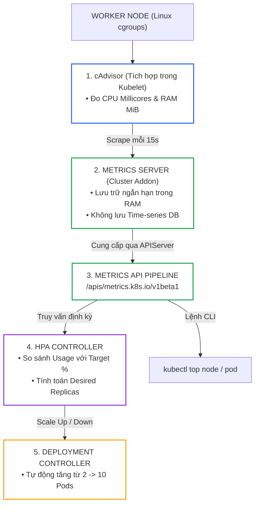
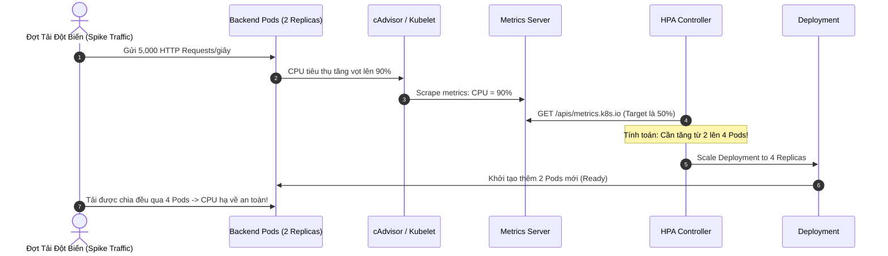
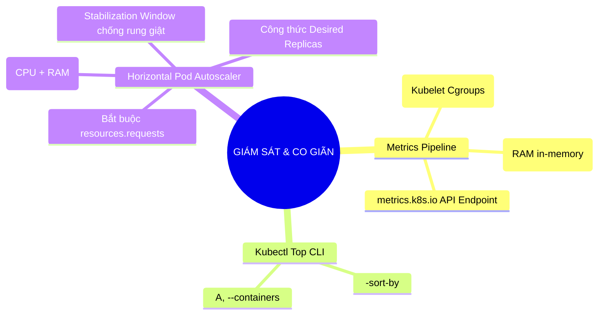


> [!IMPORTANT]
> **Mục tiêu kỹ thuật cốt lõi**: Làm chủ kỹ năng đo lường chỉ số hiệu năng (**Resource Metrics**) và thiết lập cơ chế tự động co giãn (**Autoscaling**) thuộc miền **Application Observability and Maintenance (15%)** của kỳ thi CKAD. Khai thác sức mạnh của **Metrics Server**, trích xuất mức tiêu thụ CPU/RAM từng container với **`kubectl top`**, cấu hình bộ điều khiển **Horizontal Pod Autoscaler (HPA)** phản ứng linh hoạt trước các đợt tăng đột biến lưu lượng (Traffic Spikes), và nắm vững sự khác biệt giữa HPA, VPA và Cluster Autoscaler.

---

## 1. Bản Chất Kiến Trúc & Tư Duy Cốt Lõi: Kiến Trúc Metrics Pipeline & Bộ Điều Khiển Tự Động Co Giãn (HPA)

Để tự động điều chỉnh số lượng bản sao Pod theo tải thực tế, Kubernetes cần một luồng dữ liệu chỉ số (**Metrics Pipeline**) hoạt động liên tục với độ trễ thấp.



### Công Thức Tính Toán Số Bản Sao Của HPA:

$$\text{Số Bản Sao Mong Muốn (Desired Replicas)} = \left\lceil \text{Số Bản Sao Hiện Tại} \times \left( \frac{\text{Giá Trị Chỉ Số Hiện Tại}}{\text{Giá Trị Chỉ Số Mục Tiêu}} \right) \right\rceil$$

*Ví dụ:* Deployment đang chạy 2 Pods với mức tiêu thụ CPU thực tế trung bình là **160m**. Mục tiêu (Target) cấu hình là **80m** (tương đương 80% của request 100m).
$$\text{Desired Replicas} = \left\lceil 2 \times \frac{160}{80} \right\rceil = 4 \text{ Pods}$$

### 3 Cấp Độ Tự Động Co Giãn (Autoscaling Hierarchy):

1. **HPA (Horizontal Pod Autoscaler)**: Tự động tăng/giảm **số lượng bản sao Pod (Scale Out / Scale In)** dựa trên CPU, Memory hoặc Custom Metrics (ví dụ: HTTP requests/sec). Phù hợp cho các ứng dụng Stateless.
2. **VPA (Vertical Pod Autoscaler)**: Tự động tăng/giảm **kích thước CPU/RAM requests & limits** của Pod (Scale Up / Scale Down). Yêu cầu restart Pod khi áp dụng cấu hình mới. Phù hợp cho các ứng dụng Stateful (Database, Redis).
3. **Cluster Autoscaler (CA)**: Tự động bổ sung hoặc thu hồi **Worker Nodes vật lý** khi các Pod bị rơi vào trạng thái `Pending` do thiếu tài nguyên cụm.

---

## 2. Bảng Ma Trận So Sánh Kỹ Thuật Toàn Diện (Engineering Matrix)

### Ma Trận Các Cờ Lệnh `kubectl top` Cần Nhớ Trong Phòng Thi CKAD

| Câu Lệnh CLI | Mục Đích Sử Dụng | Đầu Ra Thông Tin Chính | Cờ Bổ Trợ Đắt Giá |
|---|---|---|---|
| **`kubectl top node`** | Đánh giá tải trên toàn bộ Worker Nodes | `CPU(cores)`, `CPU%`, `MEMORY(bytes)`, `MEMORY%` | `--sort-by=cpu`, `--sort-by=memory` |
| **`kubectl top pod`** | Xem mức tiêu thụ của các Pod trong Namespace hiện tại | `NAME`, `CPU(cores)`, `MEMORY(bytes)` | `--sort-by=memory`, `-n <namespace>` |
| **`kubectl top pod -A`** | Tìm kiếm Pod ngốn tài nguyên nhất toàn cụm | Danh sách Pod trên tất cả các Namespaces | `--sort-by=cpu` |
| **`kubectl top pod --containers`** | Phân rã mức tiêu thụ của từng container trong Pod | `POD`, `NAME(container)`, `CPU`, `MEMORY` | Rất hữu ích cho Multi-Container Pod |
| **`kubectl top pod -l app=web`** | Lọc theo nhãn của Deployment / Service | Chỉ hiển thị các Pods thuộc ứng dụng chỉ định | Kết hợp với grep để tính tổng |

### So Sánh Metrics Server vs Prometheus Stack

| Tiêu Chí So Sánh | Metrics Server (CKAD Native) | Prometheus + Grafana Stack |
|---|---|---|
| **Mục Đích Chính** | Cung cấp dữ liệu tức thì cho HPA và `kubectl top` | Giám sát toàn diện, phân tích lịch sử, cảnh báo Alertmanager |
| **Lưu Trữ Dữ Liệu** | **Chỉ lưu trong RAM**, mất sạch khi restart | **Time-series Database (TSDB)** lưu trữ nhiều tháng/năm |
| **Độ Phức Tạp Cài Đặt** | Siêu nhẹ, 1 manifest YAML duy nhất | Phức tạp (Cần Prometheus Operator, Exporters, Storage PV) |
| **Hỗ Trợ Custom Metrics** | Không (Chỉ có CPU và Memory cơ bản) | Có đầy đủ (Prometheus Adapter, HTTP RPS, Queue length) |

---

## 3. Kiến Trúc Môi Trường & Luồng Thực Thi Mẫu

### Luồng Phản Ứng Tự Động Co Giãn Khi Có Tải Đột Biến



### Manifest Mẫu HPA v2 Đa Chỉ Số (CPU & Memory) Chuẩn Mực

```yaml
# production-hpa-v2.yaml
apiVersion: autoscaling/v2
kind: HorizontalPodAutoscaler
metadata:
  name: api-autoscaler
  namespace: default
spec:
  scaleTargetRef:
    apiVersion: apps/v1
    kind: Deployment
    name: payment-api
  minReplicas: 2
  maxReplicas: 8
  metrics:
  # 1. Co giãn theo CPU trung bình 70%
  - type: Resource
    resource:
      name: cpu
      target:
        type: Utilization
        averageUtilization: 70
  # 2. Co giãn theo Bộ nhớ RAM trung bình 200Mi
  - type: Resource
    resource:
      name: memory
      target:
        type: AverageValue
        averageValue: 200Mi
  behavior:
    # Tăng tốc độ scale up khi có tải đột biến
    scaleUp:
      stabilizationWindowSeconds: 0
      policies:
      - type: Percent
        value: 100
        periodSeconds: 15
    # Trì hoãn scale down 5 phút để tránh rung giật (Flapping)
    scaleDown:
      stabilizationWindowSeconds: 300
      policies:
      - type: Percent
        value: 50
        periodSeconds: 60
```

---

## 4. Phân Tích Cạm Bẫy Thực Chiến: Quên Khai Báo `resources.requests` Khiến HPA Báo Trạng Thái `<unknown>`

### Tình Huống Sự Cố: HPA Không Thể Tự Động Co Giãn Vào Giờ Cao Điểm Khiến Website Bị Sập

Một kỹ sư thiết lập HPA cho Deployment bán vé máy bay với mục tiêu `cpu: 60%`. Khi đợt mở bán bắt đầu, hàng triệu lượt truy cập đổ về nhưng Deployment vẫn đứng yên ở con số 2 Pods ban đầu. Website bị quá tải và sập hoàn toàn. Khi kiểm tra HPA, cột `TARGETS` in ra thông báo lỗi **`<unknown>/60%`**.

### Hậu Quả & Log Lỗi Thực Tế:
```text
$ kubectl get hpa api-autoscaler
NAME             REFERENCE                TARGETS         MINPODS   MAXPODS   REPLICAS   AGE
api-autoscaler   Deployment/payment-api   <unknown>/60%   2         10        2          15m

$ kubectl describe hpa api-autoscaler
Conditions:
  Type           Status  Reason                   Message
  ----           ------  ------                   -------
  AbleToScale    True    SucceededGetScale        the HPA controller was able to get the target's current scale
  ScalingActive  False   FailedGetResourceMetric  the HPA was unable to compute the replica count: missing request for cpu
```

### 5-Whys Root Cause Analysis:
1. **Tại sao HPA không tự động tăng số lượng Pod?** Vì HPA Controller không thể tính toán được tỷ lệ phần trăm CPU tiêu thụ.
2. **Tại sao HPA không tính được phần trăm CPU?** Vì HPA hiển thị trạng thái `TARGETS: <unknown>/60%`.
3. **Tại sao trạng thái lại là `<unknown>`?** Vì thông báo lỗi trong describe ghi rõ: `missing request for cpu`.
4. **Tại sao lại thiếu request for CPU?** Vì trong Pod Template của Deployment, kỹ sư chỉ khai báo `resources.limits` hoặc không khai báo bất kỳ khối `resources` nào.
5. **Gốc rễ vấn đề (Root Cause):** HPA tính toán tỷ lệ phần trăm (\%) dựa trên công thức: $\text{Phần trăm CPU} = \frac{\text{CPU Tiêu Thụ Thực Tế}}{\text{CPU Request}} \times 100\%$. Nếu container **không khai báo `resources.requests.cpu`**, mẫu số bằng 0 (hoặc null), khiến phép toán bị vô hiệu hóa hoàn toàn.

### Biện Pháp Khắc Phục Chuẩn:
```diff
--- a/deployment.yaml
+++ b/deployment.yaml
@@ -15,4 +15,7 @@
         resources:
+          # BẮT BUỘC KHAI BÁO REQUESTS ĐỂ HPA CÓ MẪU SỐ TÍNH TOÁN!
+          requests:
+            cpu: 100m
+            memory: 128Mi
           limits:
             cpu: 500m
             memory: 256Mi
```

---

## 5. Hands-on Lab: Đo Lường Tài Nguyên & Cấu Hình HPA Tự Động Co Giãn (8 Bước)

| Bước | Mục Tiêu Kỹ Thuật | Lệnh / Manifest Kiểm Tra Chính |
|---|---|---|
| **1** | Kiểm tra trạng thái hoạt động của Metrics Server | `kubectl get apiservices \| grep metrics` |
| **2** | Đo lường mức tiêu thụ tài nguyên của các Node | `kubectl top nodes --sort-by=cpu` |
| **3** | Khởi tạo Deployment có khai báo `resources.requests` đầy đủ | `resources.requests.cpu: 100m` |
| **4** | Đo lường mức tiêu thụ của Pods và phân rã Containers | `kubectl top pods --containers` |
| **5** | Khởi tạo HPA bằng câu lệnh Imperative CLI | `kubectl autoscale deployment ... --cpu-percent=50` |
| **6** | Tạo tải CPU nhân tạo lên ứng dụng | Pod chạy vòng lặp tải `while true` |
| **7** | Quan sát HPA tự động scale out từ 1 lên 4 Pods | `kubectl get hpa -w` |
| **8** | Dừng tải và quan sát cơ chế Stabilization Window Scale Down | `kubectl get pods -w` quan sát giảm dần Pods |

---

### Bước 1: Kiểm Tra Trạng Thái Của Metrics Server

```bash
# Kiểm tra API Service metrics.k8s.io đang sẵn sàng
kubectl get apiservice v1beta1.metrics.k8s.io
```
> Trạng thái hiển thị: `AVAILABLE: True`.

---

### Bước 2: Đo Lường Mức Tiêu Thụ Toàn Bộ Worker Nodes

```bash
# Xem mức tiêu thụ CPU và RAM của tất cả các Node
kubectl top nodes

# Sắp xếp theo Node ngốn RAM nhiều nhất
kubectl top nodes --sort-by=memory
```

---

### Bước 3: Triển Khai Ứng Dụng Chuẩn Bị Cho Tự Động Co Giãn

```yaml
# autoscale-app.yaml
apiVersion: apps/v1
kind: Deployment
metadata:
  name: load-app
  namespace: default
spec:
  replicas: 1
  selector:
    matchLabels:
      app: load-app
  template:
    metadata:
      labels:
        app: load-app
    spec:
      containers:
      - name: php-server
        image: registry.k8s.io/hpa-example
        ports:
        - containerPort: 80
        resources:
          requests:
            cpu: 100m
            memory: 64Mi
          limits:
            cpu: 300m
            memory: 128Mi
---
apiVersion: v1
kind: Service
metadata:
  name: load-svc
  namespace: default
spec:
  ports:
  - port: 80
    targetPort: 80
  selector:
    app: load-app
```
```bash
kubectl apply -f autoscale-app.yaml
kubectl rollout status deployment/load-app
```

---

### Bước 4: Kiểm Tra Mức Tiêu Thụ Của Pod Ban Đầu

```bash
# Đợi 15 giây để Metrics Server thu thập đủ nhịp dữ liệu
sleep 15
kubectl top pods -l app=load-app --containers
```
> Đầu ra hiển thị: `CPU(cores): 1m`, `MEMORY(bytes): 12Mi` (Mức tải ban đầu rất thấp).

---

### Bước 5: Cấu Hình HPA Bằng Lệnh Imperative CLI

```bash
# Tự động co giãn từ 1 đến 5 Pods khi CPU tiêu thụ vượt 50% (tức > 50m)
kubectl autoscale deployment load-app --min=1 --max=5 --cpu-percent=50

# Kiểm tra HPA đã nhận diện đúng Target
kubectl get hpa load-app
```
> Trạng thái hiển thị: `TARGETS: 1%/50%`, `REPLICAS: 1`.

---

### Bước 6: Tạo Tải Nhân Tạo Bằng Pod Sinh Tải

```bash
# Khởi chạy một Pod liên tục gửi HTTP requests tới Service
kubectl run load-generator --image=busybox:1.36 --rm -it --restart=Never -- /bin/sh -c "while true; do wget -q -O- http://load-svc; done"
```

---

### Bước 7: Quan Sát Tiến Trình Scale Out Tự Động

Mở một cửa sổ terminal khác để theo dõi sự kiện:

```bash
# Theo dõi trực tiếp HPA phản ứng với tải
kubectl get hpa load-app -w
```
> Tiến trình biến đổi thời gian thực:
> `TARGETS: 1%/50% -> 120%/50% -> 180%/50%`
> `REPLICAS: 1 -> 3 -> 5 (Đạt ngưỡng Max)`
> `kubectl get pods -l app=load-app` in ra 5 Pods đang chạy đồng thời!

---

### Bước 8: Dừng Tải & Quan Sát Scale Down

```bash
# Nhấn Ctrl+C để dừng Pod load-generator ở Bước 6
# Theo dõi: Sau thời gian ổn định (mặc định 5 phút), HPA sẽ an toàn scale về 1 Pod
kubectl get hpa load-app
kubectl delete hpa load-app
kubectl delete deployment load-app
kubectl delete svc load-svc
```

---

## 6. 10 Câu Hỏi Tự Kiểm Tra Chuyên Sâu (Self-Check Q&A Accordion)

<details class="qa-card">
<summary><b>1. Đơn vị `100m` trong cấu hình CPU của Kubernetes tương đương với bao nhiêu tài nguyên tính toán?</b></summary>
<div class="qa-answer">
<p><code>m</code> là viết tắt của <b>Millicores</b> ($1/1000$ của một nhân CPU). Do đó, <code>100m</code> tương đương với <b>0.1 Core CPU</b> (hoặc 10% năng lực tính toán của 1 vCPU / Hyperthread). Giá trị <code>1000m</code> tương đương đúng <b>1 Core CPU nguyên vẹn</b>.</p>
</div>
</details>

<details class="qa-card">
<summary><b>2. Tại sao lệnh `kubectl top pod` có thể báo lỗi "Metrics API not available"?</b></summary>
<div class="qa-answer">
<p>Có 3 nguyên nhân chính:</p>
<div>1. Cụm Kubernetes chưa được cài đặt <b>Metrics Server</b> addon.</div>
<div>2. Pod Metrics Server đang bị crash hoặc chưa đạt trạng thái Ready.</div>
<div>3. Kubelet trên các Worker Nodes sử dụng chứng chỉ TLS tự ký và Metrics Server chưa được cấu hình cờ bỏ qua xác thực <code>--kubelet-insecure-tls</code>.</div>
</div>
</details>

<details class="qa-card">
<summary><b>3. Làm thế nào để lọc ra 5 Pods ngốn nhiều bộ nhớ RAM nhất trong toàn bộ cụm?</b></summary>
<div class="qa-answer">
<pre><code>kubectl top pods -A --sort-by=memory | head -n 6</code></pre>
</div>
</details>

<details class="qa-card">
<summary><b>4. Tại sao cấu hình `resources.requests` lại là điều kiện bắt buộc để HPA theo tỷ lệ phần trăm hoạt động?</b></summary>
<div class="qa-answer">
<p>HPA tính toán tỷ lệ phần trăm sử dụng dựa trên công thức: <code>(Mức CPU thực tế / CPU Request) x 100%</code>. Nếu Pod không khai báo <code>resources.requests.cpu</code>, hệ thống không có giá trị cơ sở làm mốc tham chiếu (mẫu số không xác định), khiến HPA hiển thị trạng thái <code>&lt;unknown&gt;</code> và từ chối co giãn.</p>
</div>
</details>

<details class="qa-card">
<summary><b>5. Tham số `stabilizationWindowSeconds` trong cấu hình HPA behavior có tác dụng gì?</b></summary>
<div class="qa-answer">
<p><code>stabilizationWindowSeconds</code> (Cửa sổ ổn định) ngăn chặn hiện tượng <b>Rung giật số lượng Pod (Flapping / Thrashing)</b>. Khi tải giảm đột ngột trong chốc lát, HPA sẽ không vội vàng scale down ngay lập tức mà đợi qua hết khoảng thời gian ổn định (mặc định 300 giây = 5 phút) để đảm bảo tải thực sự đã hạ nhiệt trước khi thu hồi Pods.</p>
</div>
</details>

<details class="qa-card">
<summary><b>6. Sự khác biệt căn bản giữa HPA (Horizontal) và VPA (Vertical) là gì?</b></summary>
<div class="qa-answer">
<p><b>HPA (Co giãn theo chiều ngang):</b> Thay đổi <b>số lượng bản sao Pod (Replicas)</b>, không làm gián đoạn dịch vụ, phù hợp cho ứng dụng Stateless.</p>
<p><b>VPA (Co giãn theo chiều dọc):</b> Thay đổi <b>kích thước CPU/RAM limits & requests</b> của từng Pod đơn lẻ, thường yêu cầu restart Pod để áp dụng thông số mới của Linux cgroup, phù hợp cho ứng dụng Stateful.</p>
</div>
</details>

<details class="qa-card">
<summary><b>7. Có nên cấu hình cả HPA và VPA cùng nhắm vào một chỉ số CPU trên cùng một Deployment không?</b></summary>
<div class="qa-answer">
<p><b>Tuyệt đối không nên.</b> Việc cấu hình cả HPA và VPA cùng điều khiển theo CPU sẽ dẫn đến <b>xung đột quyền điều phối (Controller Conflict)</b>: HPA cố gắng tăng thêm Pods trong khi VPA lại cố gắng nâng CPU limit của Pods hiện tại, gây ra hành vi co giãn hỗn loạn và lãng phí tài nguyên.</p>
</div>
</details>

<details class="qa-card">
<summary><b>8. Lệnh kubectl imperative nào giúp tạo ngay một HPA cho Deployment trong phòng thi CKAD trong 5 giây?</b></summary>
<div class="qa-answer">
<pre><code>kubectl autoscale deployment &lt;deploy-name&gt; --min=2 --max=8 --cpu-percent=75</code></pre>
</div>
</details>

<details class="qa-card">
<summary><b>9. cAdvisor lấy thông tin mức tiêu thụ tài nguyên của Container từ đâu trong hệ điều hành Linux?</b></summary>
<div class="qa-answer">
<p>cAdvisor đọc trực tiếp các tệp thống kê trong hệ thống ảo <b>Linux Control Groups (cgroups)</b> của Kernel tại đường dẫn <code>/sys/fs/cgroup/cpu/</code> và <code>/sys/fs/cgroup/memory/</code> được gắn kết riêng cho từng container.</p>
</div>
</details>

<details class="qa-card">
<summary><b>10. Làm thế nào để cấu hình HPA co giãn theo một giá trị RAM tuyệt đối (ví dụ trung bình 500Mi) thay vì phần trăm?</b></summary>
<div class="qa-answer">
<p>Khai báo target dạng <code>AverageValue</code> trong khối cấu hình metrics của HPA v2 manifest:</p>
<pre><code>metricType: Resource
resourceName: memory
targetType: AverageValue
averageValue: 500Mi</code></pre>
</div>
</details>

---

## 7. Tổng Kết & Lộ Trình Bài Học Tiếp Theo



Nắm vững cơ chế giám sát tài nguyên và tự động co giãn giúp hệ thống của bạn luôn giữ vững tính sẵn sàng trước các đợt bùng nổ lưu lượng, đồng thời tối ưu hóa chi phí hạ tầng điện toán đám mây.

> [!TIP]
> **Bài học tiếp theo**: Khám phá kỹ thuật quản trị cấu hình động và dữ liệu bí mật với **[Bài 10: Cấu Hình Động & Quản Trị Bí Mật: ConfigMap, Secret & Projected Volumes](ckad-10-10-cau-hinh-ung-dung-nang-cao.html)**.

