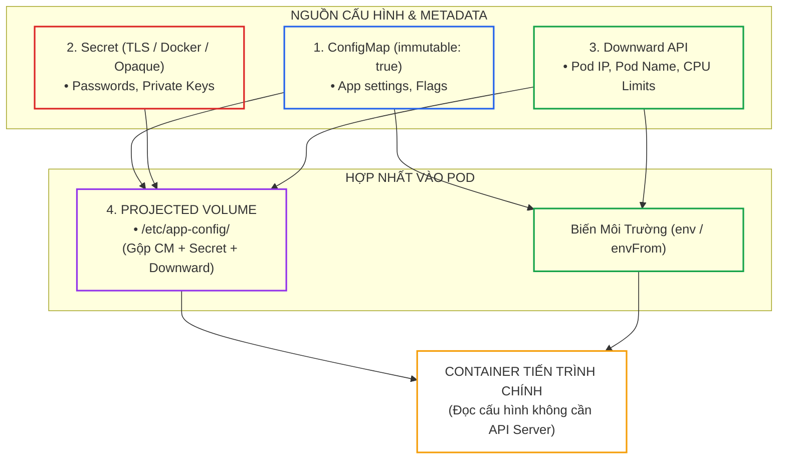
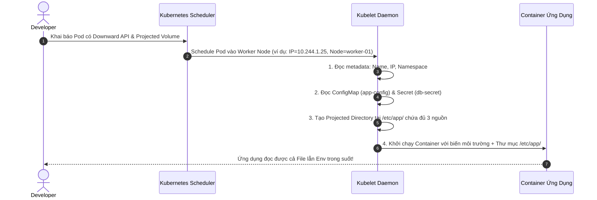
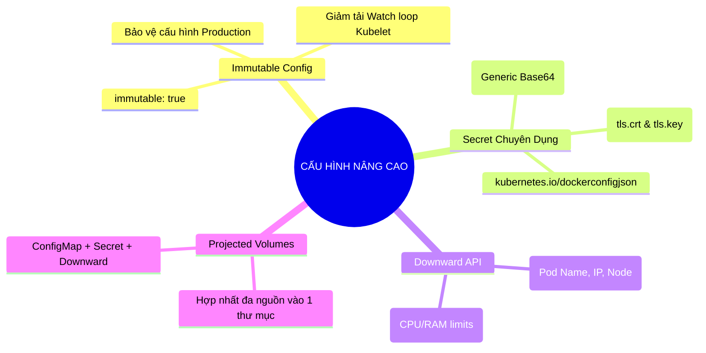


> [!IMPORTANT]
> **Mục tiêu kỹ thuật cốt lõi**: Làm chủ các kỹ thuật quản trị cấu hình động và dữ liệu bí mật nâng cao (**Advanced Application Configuration & Secrets**) thuộc miền **Application Environment, Configuration and Security (25%)** của kỳ thi CKAD. Thiết lập chính xác **Immutable ConfigMaps/Secrets**, khai thác siêu dữ liệu qua **Downward API**, hợp nhất cấu hình với **Projected Volumes**, và phân biệt rõ các loại Secret chuyên dụng cho ứng dụng Production.

---

## 1. Bản Chất Kiến Trúc & Tư Duy Cốt Lõi: Kiến Trúc Cấu Hình Động & Cơ Chế Downward API

Trong kiến trúc Cloud-Native, ứng dụng phải tuân thủ nguyên tắc **12-Factor App**: Tách biệt hoàn toàn mã nguồn (Code) khỏi cấu hình (Config). Kubernetes cung cấp hệ thống phân phối cấu hình động đa tầng giúp lập trình viên quản trị tham số môi trường an toàn và linh hoạt.



### 4 Trụ Cột Cấu Hình Nâng Cao Cần Nắm Vững:

1. **Immutable ConfigMaps & Secrets (`immutable: true`)**:
   - *Bản chất:* Mặc định, Kubelet liên tục mở kết nối theo dõi (Watch Loop) tới API Server để cập nhật khi ConfigMap thay đổi.
   - *Lợi ích:* Khi đánh dấu `immutable: true`, Kubelet **ngừng theo dõi**, giảm tải 90% áp lực lên Kube-APIServer và etcd trên các cụm quy mô lớn (hàng nghìn Pods), đồng thời ngăn ngừa rủi ro ai đó vô tình sửa đổi cấu hình gây hỏng ứng dụng đang chạy.
2. **Các Loại Secret Chuyên Dụng (Specialized Secret Types)**:
   - `Opaque`: Loại Secret thông thường (Key-Value tùy biến mã hóa Base64).
   - `kubernetes.io/tls`: Lưu trữ cặp khóa chứng chỉ SSL (`tls.crt` và `tls.key`).
   - `kubernetes.io/dockerconfigjson`: Lưu trữ thông tin đăng nhập (`.dockerconfigjson`) dùng cho `imagePullSecrets` để kéo ảnh từ kho riêng tư (Private Container Registry).
3. **Downward API (Truyền Siêu Dữ Liệu Vào Container)**:
   - *Mục đích:* Giúp container biết được thông tin của chính nó (như tên Pod, địa chỉ IP, tên Node, Namespace, CPU/Memory request & limit) **mà không cần phải cấp quyền truy cập Kube-APIServer** cho Pod.
   - *Cơ chế:* Truyền qua biến môi trường (`fieldRef`, `resourceFieldRef`) hoặc mount thành tệp tin trong Volume.
4. **Projected Volumes (Thư Mục Gộp Đa Nguồn)**:
   - *Mục đích:* Gộp nhiều nguồn cấu hình khác nhau (một phần ConfigMap, một phần Secret, một phần Downward API, và ServiceAccount Token) vào **cùng một thư mục mount duy nhất** thay vì phải tạo nhiều volume độc lập.

---

## 2. Bảng Ma Trận So Sánh Kỹ Thuật Toàn Diện (Engineering Matrix)

### Ma Trận Các Phương Thức Nạp Cấu Hình Vào Ứng Dụng

| Phương Thức Nạp | Cú Pháp Khai Báo Chính | Tự Động Cập Nhật Khi Đổi (Live Reload)? | Hỗ Trợ File Nhị Phân / Nhiều Dòng? | Nguy Cơ Rò Rỉ Thông Tin | Trường Hợp Sử Dụng Phù Hợp |
|---|---|---|---|---|---|
| **Env Var (`valueFrom`)** | `env[].valueFrom.configMapKeyRef` | **Không** (Cần restart Pod) | Hạn chế (Chỉ phù hợp chuỗi ngắn) | Có thể lộ qua lệnh `ps aux` hoặc `env` | Tham số đơn lẻ (ví dụ: `PORT=8080`, `ENV=prod`) |
| **EnvFrom Batch** | `envFrom[].configMapRef` | **Không** (Cần restart Pod) | Hạn chế | Có thể bị trùng đè tên biến | Nạp toàn bộ tập biến từ `.env` vào Pod trong 1 dòng |
| **Mounted Volume** | `volumes[].configMap` + `volumeMounts` | **Có** (Sau 10–60 giây Kubelet sync cache) | **Có đầy đủ** (Hỗ trợ JSON, YAML, certs) | An toàn hơn (Được bảo vệ bằng quyền Linux) | File cấu hình ứng dụng (`app.json`, `nginx.conf`) |
| **Downward API** | `fieldRef` / `resourceFieldRef` | Chỉ cập nhật với Volume mount | Không | Rất an toàn (Chỉ lộ metadata của chính Pod) | Logging framework, phân tán cụm (Cluster discovery) |
| **Projected Volume** | `volumes[].projected.sources` | **Có** | **Có đầy đủ** | An toàn cao | Gộp TLS certs, Config files và ServiceAccount tokens |

---

## 3. Kiến Trúc Môi Trường & Luồng Thực Thi Mẫu

### Luồng Tích Hợp Downward API & Projected Volumes



### Manifest Mẫu Ứng Dụng Tích Hợp Downward API & Projected Volume

```yaml
# production-advanced-config.yaml
apiVersion: v1
kind: Pod
metadata:
  name: advanced-app
  namespace: default
  labels:
    app: secure-service
spec:
  containers:
  - name: server
    image: nginx:alpine
    ports:
    - containerPort: 80
    resources:
      requests:
        cpu: 100m
        memory: 128Mi
      limits:
        cpu: 500m
        memory: 256Mi
    # 1. DOWNWARD API TRUYỀN VÀO BIẾN MÔI TRƯỜNG
    env:
    - name: POD_NAME
      valueFrom:
        fieldRef:
          fieldPath: metadata.name
    - name: POD_NAMESPACE
      valueFrom:
        fieldRef:
          fieldPath: metadata.namespace
    - name: POD_IP
      valueFrom:
        fieldRef:
          fieldPath: status.podIP
    - name: NODE_NAME
      valueFrom:
        fieldRef:
          fieldPath: spec.nodeName
    - name: CPU_LIMIT
      valueFrom:
        resourceFieldRef:
          containerName: server
          resource: limits.cpu
    # 2. GẮN PROJECTED VOLUME
    volumeMounts:
    - name: combined-config
      mountPath: /etc/projected-config
      readOnly: true
  volumes:
  # 3. HỢP NHẤT NHIỀU NGUỒN VÀO 1 VOLUME DUY NHẤT
  - name: combined-config
    projected:
      sources:
      # Nguồn A: ConfigMap
      - configMap:
          name: app-shared-config
          items:
          - key: settings.json
            path: app-settings.json
      # Nguồn B: Secret
      - secret:
          name: app-shared-secret
          items:
          - key: api-token
            path: token.txt
      # Nguồn C: Downward API tệp tin
      - downwardAPI:
          items:
          - path: pod-info.txt
            fieldRef:
              fieldPath: metadata.labels
```

---

## 4. Phân Tích Cạm Bẫy Thực Chiến: Sửa Đổi ConfigMap Đang Chạy Khiến Pod Sử Dụng Cấu Hình Không Đồng Nhất

### Tình Huống Sự Cố: Nửa Ứng Dụng Đọc Config Mới, Nửa Ứng Dụng Dùng Config Cũ (Split-Brain State)

Một lập trình viên cập nhật ConfigMap `app-config` từ cổng DB cũ `PORT=5432` sang cổng mới `PORT=5433` bằng lệnh `kubectl edit cm`. Ứng dụng sử dụng kết hợp cả biến môi trường `envFrom` và file mount `volumeMounts`. Hậu quả là tiến trình chính đọc biến môi trường vẫn giữ giá trị cũ `5432` (vì biến môi trường không bao giờ tự cập nhật), trong khi module phụ đọc file mount lại nạp giá trị mới `5433` sau 30 giây Kubelet sync cache, gây ra sự cố bất đồng bộ dữ liệu nghiêm trọng.

### Hậu Quả & Log Lỗi Thực Tế:
```text
[ERROR] Database Client Connection Mismatch!
Main Process DB Host: postgresql-v1:5432 (from ENV VAR: APP_DB_PORT)
Worker Thread DB Host: postgresql-v2:5433 (from Mounted File: /etc/config/db.json)
[FATAL] Transaction Rollback: Target DB mismatch between thread pools. Aborting.
```

### 5-Whys Root Cause Analysis:
1. **Tại sao ứng dụng bị lỗi bất đồng bộ cổng Database?** Vì hai module trong cùng một ứng dụng đọc được hai giá trị cổng khác nhau từ cùng một ConfigMap.
2. **Tại sao lại có 2 giá trị khác nhau?** Vì module 1 đọc từ biến môi trường `envFrom`, module 2 đọc từ tệp tin mount trong Volume.
3. **Tại sao biến môi trường không đổi khi ConfigMap đổi?** Vì biến môi trường chỉ được Linux Kernel gán một lần duy nhất tại thời điểm **khởi tạo tiến trình container** (Process Boot), không thể thay đổi động sau đó.
4. **Tại sao file mount lại tự thay đổi?** Vì Kubelet định kỳ đồng bộ các file mount từ ConfigMap theo chu kỳ sync cache (10–60 giây).
5. **Gốc rễ vấn đề (Root Cause):** Cho phép sửa đổi ConfigMap trực tiếp tại chỗ (Mutable ConfigMap) thay vì tạo phiên bản mới và thực hiện RollingUpdate, hoặc không khóa lại bằng **`immutable: true`**.

### Biện Pháp Khắc Phục Chuẩn:
```yaml
# Áp dụng Immutable ConfigMap: Bắt buộc tạo bản mới v2 và rollout an toàn
apiVersion: v1
kind: ConfigMap
metadata:
  name: app-config-v2
  namespace: default
immutable: true
data:
  APP_DB_PORT: "5433"
```

---

## 5. Hands-on Lab: Triển Khai Cấu Hình Động & Projected Volumes (8 Bước)

| Bước | Mục Tiêu Kỹ Thuật | Lệnh / Manifest Kiểm Tra Chính |
|---|---|---|
| **1** | Khởi tạo Immutable ConfigMap và kiểm tra cơ chế khóa | `immutable: true`, thử `kubectl edit` |
| **2** | Khởi tạo Secret chuyên dụng `docker-registry` | `kubectl create secret docker-registry` |
| **3** | Khởi tạo Secret chuyên dụng `tls` với khóa tự ký | `kubectl create secret tls` |
| **4** | Truyền siêu dữ liệu Pod vào Env qua Downward API | `fieldRef: metadata.name / status.podIP` |
| **5** | Truyền thông số CPU Limit qua `resourceFieldRef` | `resourceFieldRef: limits.cpu` |
| **6** | Hợp nhất ConfigMap và Secret vào Projected Volume | Manifest `volumes.projected.sources` |
| **7** | Mở shell vào Container xác minh toàn bộ dữ liệu | `kubectl exec` kiểm tra `env` và file mount |
| **8** | Dọn dẹp tài nguyên cấu hình | `kubectl delete pod,cm,secret` |

---

### Bước 1: Tạo Immutable ConfigMap & Kiểm Tra Cơ Chế Chống Sửa Đổi

```yaml
# 1-immutable-cm.yaml
apiVersion: v1
kind: ConfigMap
metadata:
  name: locked-config
  namespace: default
immutable: true
data:
  DATABASE_URL: "postgres://db.production:5432"
  CACHE_ENABLED: "true"
```
```bash
kubectl apply -f 1-immutable-cm.yaml

# Thử sửa ConfigMap (SẼ BÁO LỖI VÌ TRƯỜNG IMMUTABLE ĐÃ KHÓA):
kubectl patch cm locked-config -p '{"data":{"CACHE_ENABLED":"false"}}' || true
```
> Hệ thống trả về lỗi: `The ConfigMap "locked-config" is invalid: field is immutable when `immutable` is set`.

---

### Bước 2: Tạo Secret Docker Registry Cho Private Image

```bash
# Tạo Secret chứa thông tin xác thực để kéo ảnh từ Private Registry
kubectl create secret docker-registry my-private-registry-key \
  --docker-server=ghcr.io \
  --docker-username=mydeveloper \
  --docker-password=MySuperSecretToken123! \
  --docker-email=dev@company.com
```

---

### Bước 3: Tạo Secret TLS Chuyên Dụng

```bash
# Tạo cặp khóa SSL tự ký
openssl req -x509 -nodes -days 365 -newkey rsa:2048 \
  -keyout /tmp/tls.key -out /tmp/tls.crt \
  -subj "/CN=api.enterprise.com"

# Tạo Secret loại kubernetes.io/tls
kubectl create secret tls api-tls-cert \
  --cert=/tmp/tls.crt \
  --key=/tmp/tls.key
```

---

### Bước 4: Tạo ConfigMap & Secret Chuẩn Bị Cho Projected Volume

```bash
kubectl create configmap app-shared-config \
  --from-literal=settings.json='{"theme": "dark", "rateLimit": 1000}'

kubectl create secret generic app-shared-secret \
  --from-literal=api-token="SEC-TOKEN-987654321"
```

---

### Bước 5: Triển Khai Pod Tích Hợp Đầy Đủ Downward API & Projected Volume

```yaml
# 2-projected-pod.yaml
apiVersion: v1
kind: Pod
metadata:
  name: meta-projected-pod
  namespace: default
  labels:
    tier: frontend
    env: staging
spec:
  containers:
  - name: test-app
    image: busybox:1.36
    command: ["/bin/sh", "-c", "sleep 3600"]
    resources:
      requests:
        cpu: 50m
        memory: 64Mi
      limits:
        cpu: 200m
        memory: 128Mi
    env:
    - name: MY_POD_NAME
      valueFrom:
        fieldRef:
          fieldPath: metadata.name
    - name: MY_POD_IP
      valueFrom:
        fieldRef:
          fieldPath: status.podIP
    - name: MY_NODE_NAME
      valueFrom:
        fieldRef:
          fieldPath: spec.nodeName
    - name: MY_CPU_LIMIT
      valueFrom:
        resourceFieldRef:
          containerName: test-app
          resource: limits.cpu
    volumeMounts:
    - name: all-in-one-config
      mountPath: /etc/configs
      readOnly: true
  volumes:
  - name: all-in-one-config
    projected:
      sources:
      - configMap:
          name: app-shared-config
      - secret:
          name: app-shared-secret
      - downwardAPI:
          items:
          - path: "labels"
            fieldRef:
              fieldPath: metadata.labels
```
```bash
kubectl apply -f 2-projected-pod.yaml
kubectl wait --for=condition=ready pod/meta-projected-pod --timeout=30s
```

---

### Bước 6: Xác Minh Biến Môi Trường Downward API

```bash
# In ra các biến môi trường được Kubelet inject tự động
kubectl exec meta-projected-pod -- env | grep -E "MY_POD|MY_NODE|MY_CPU"
```
> Đầu ra hiển thị chính xác siêu dữ liệu thực tế của Pod:
> `MY_POD_NAME=meta-projected-pod`
> `MY_POD_IP=10.244.X.X`
> `MY_NODE_NAME=worker-01`
> `MY_CPU_LIMIT=1` (hoặc 200m quy đổi).

---

### Bước 7: Xác Minh Thư Mục Projected Volume Gộp Đa Nguồn

```bash
# Kiểm tra danh sách các file trong thư mục /etc/configs
kubectl exec meta-projected-pod -- ls -la /etc/configs
```
> Thư mục `/etc/configs` chứa đồng thời cả 3 nguồn:
> - `settings.json` (Từ ConfigMap)
> - `api-token` (Từ Secret)
> - `labels` (Từ Downward API)

```bash
# Đọc nội dung tệp nhãn Downward API
kubectl exec meta-projected-pod -- cat /etc/configs/labels
```
> In ra: `tier="frontend"`, `env="staging"`.

---

### Bước 8: Dọn Dẹp Tài Nguyên Lab

```bash
kubectl delete pod meta-projected-pod --grace-period=0 --force
kubectl delete cm locked-config app-shared-config
kubectl delete secret my-private-registry-key api-tls-cert app-shared-secret
rm -f /tmp/tls.key /tmp/tls.crt
```

---

## 6. 10 Câu Hỏi Tự Kiểm Tra Chuyên Sâu (Self-Check Q&A Accordion)

<details class="qa-card">
<summary><b>1. Lợi ích lớn nhất của việc thiết lập `immutable: true` trên ConfigMap và Secret là gì?</b></summary>
<div class="qa-answer">
<p>Lợi ích lớn nhất là <b>giảm tải đáng kể cho Kube-APIServer và etcd</b>. Mặc định, Kubelet phải duy trì các kết nối Watch liên tục để phát hiện thay đổi của ConfigMap. Khi đặt <code>immutable: true</code>, Kubelet ngừng polling, giúp cụm mở rộng lên hàng nghìn Pods mà không bị nghẽn API Server, đồng thời bảo vệ cấu hình khỏi bị sửa đổi ngoài ý muốn.</p>
</div>
</details>

<details class="qa-card">
<summary><b>2. Làm thế nào để cập nhật cấu hình cho một ứng dụng đang sử dụng Immutable ConfigMap?</b></summary>
<div class="qa-answer">
<p>Quy trình chuẩn: Tạo một <b>ConfigMap mới với tên phiên bản mới</b> (ví dụ <code>app-config-v2</code>), sau đó cập nhật Deployment trỏ vào ConfigMap v2. Deployment Controller sẽ tự động thực hiện <b>RollingUpdate Zero-Downtime</b> để chuyển dần các Pods sang phiên bản cấu hình mới an toàn.</p>
</div>
</details>

<details class="qa-card">
<summary><b>3. Downward API có thể trích xuất những trường thông tin nào của Pod thông qua `fieldRef`?</b></summary>
<div class="qa-answer">
<p>Các trường metadata hợp lệ gồm:</p>
<div>1. <code>metadata.name</code> (Tên của Pod)</div>
<div>2. <code>metadata.namespace</code> (Không gian tên)</div>
<div>3. <code>metadata.uid</code> (Mã định danh duy nhất của Pod)</div>
<div>4. <code>metadata.labels</code> và <code>metadata.annotations</code></div>
<div>5. <code>status.podIP</code> và <code>status.hostIP</code></div>
<div>6. <code>spec.nodeName</code> và <code>spec.serviceAccountName</code></div>
</div>
</details>

<details class="qa-card">
<summary><b>4. Sự khác biệt giữa `fieldRef` và `resourceFieldRef` trong Downward API là gì?</b></summary>
<div class="qa-answer">
<p><b>fieldRef:</b> Dùng để lấy các thông tin <b>Metadata và Trạng thái của toàn bộ Pod</b> (như Pod Name, IP, Node Name).</p>
<p><b>resourceFieldRef:</b> Dùng để lấy các thông số <b>Tài nguyên tính toán của một Container cụ thể</b> (như <code>limits.cpu</code>, <code>limits.memory</code>, <code>requests.cpu</code>, <code>requests.memory</code>).</p>
</div>
</details>

<details class="qa-card">
<summary><b>5. Cú pháp lệnh kubectl imperative nào giúp tạo một Secret loại `docker-registry` trong 5 giây?</b></summary>
<div class="qa-answer">
<pre><code>kubectl create secret docker-registry &lt;secret-name&gt; --docker-server=&lt;registry-url&gt; --docker-username=&lt;user&gt; --docker-password=&lt;pass&gt;</code></pre>
</div>
</details>

<details class="qa-card">
<summary><b>6. Projected Volume giải quyết vấn đề gì mà Volume thông thường không làm được?</b></summary>
<div class="qa-answer">
<p>Volume thông thường chỉ cho phép mount <b>duy nhất 1 nguồn tài nguyên</b> vào 1 đường dẫn thư mục. Nếu muốn gắn cả ConfigMap và Secret, bạn phải mount vào 2 thư mục khác nhau. <b>Projected Volume</b> cho phép <b>hợp nhất nhiều nguồn độc lập</b> (nhiều ConfigMaps, nhiều Secrets, DownwardAPI và ServiceAccountToken) vào <b>cùng một thư mục mount duy nhất</b>.</p>
</div>
</details>

<details class="qa-card">
<summary><b>7. Hai key bắt buộc phải có trong một Secret loại `kubernetes.io/tls` là gì?</b></summary>
<div class="qa-answer">
<p>Hai key bắt buộc theo chuẩn Kubernetes API là: <b><code>tls.crt</code></b> (chứa nội dung chứng chỉ công khai / certificate chain) và <b><code>tls.key</code></b> (chứa nội dung khóa bí mật / private key) được mã hóa Base64.</p>
</div>
</details>

<details class="qa-card">
<summary><b>8. Khi một ConfigMap thông thường (không immutable) được mount dạng Volume bị sửa đổi, bao lâu sau container sẽ nhận được dữ liệu mới?</b></summary>
<div class="qa-answer">
<p>Thời gian cập nhật phụ thuộc vào <b>chu kỳ sync cache của Kubelet</b> (thường từ <b>10 đến 60 giây</b>, dựa trên cấu hình <code>syncFrequency</code> của Kubelet và TTL của ConfigMap cache). Lưu ý: Nếu ứng dụng đọc file một lần khi khởi động vào RAM thì vẫn cần restart ứng dụng để nạp lại.</p>
</div>
</details>

<details class="qa-card">
<summary><b>9. Làm thế nào để mount một key cụ thể trong ConfigMap thành một tên file khác trong Container?</b></summary>
<div class="qa-answer">
<p>Sử dụng trường <code>items</code> trong volume spec:</p>
<pre><code>volumes:
  name: my-vol
  configMap:
    name: my-config
    items:
      key: raw_data.json
      path: custom_name.json</code></pre>
</div>
</details>

<details class="qa-card">
<summary><b>10. Biến môi trường nạp từ ConfigMap có tự động cập nhật khi ConfigMap bị sửa đổi không?</b></summary>
<div class="qa-answer">
<p><b>Hoàn toàn không.</b> Biến môi trường được Linux Kernel thiết lập một lần duy nhất tại thời điểm khởi tạo tiến trình (Process Creation). Việc sửa đổi ConfigMap trên Kubernetes không thể can thiệp vào môi trường của một tiến trình đang chạy. Muốn cập nhật biến môi trường, <b>bắt buộc phải Restart Pod</b>.</p>
</div>
</details>

---

## 7. Tổng Kết & Lộ Trình Bài Học Tiếp Theo



Làm chủ cấu hình nâng cao và quản trị bí mật giúp bạn thiết kế các vi dịch vụ microservices an toàn, tách biệt hoàn toàn cấu hình khỏi mã nguồn và tối ưu hóa hiệu năng cụm ở quy mô lớn.

> [!TIP]
> **Bài học tiếp theo**: Tìm hiểu cách bảo vệ và phân quyền tầng sâu cho ứng dụng với **[Bài 11: Gia Cố Bảo Mật Ứng Dụng: SecurityContext, User IDs & Capabilities](ckad-11-11-securitycontext-cho-ung-dung.html)**.

