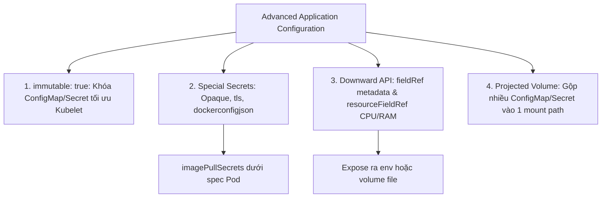
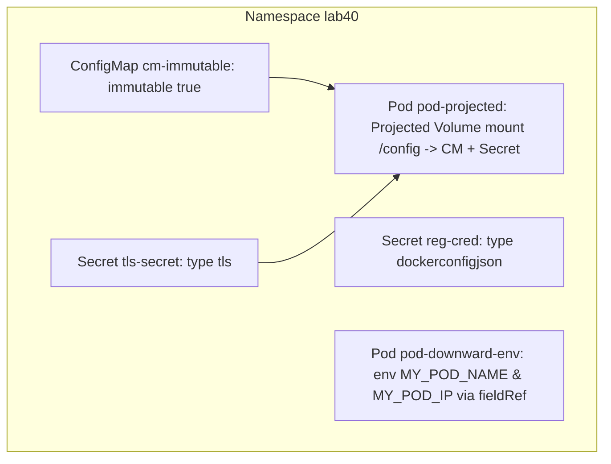


# [BÀI 10] QUẢN LÝ CẤU HÌNH ỨNG DỤNG NÂNG CAO: IMMUTABLE CONFIGMAP/SECRET, DOWNWARD API & PROJECTED VOLUMES

Trong kỷ nguyên điện toán đám mây và kiến trúc microservices phân tán quy mô lớn, **Kubernetes (CKAD)** đóng vai trò là nền tảng điều phối container (Container Orchestration) tiêu chuẩn công nghiệp. Để làm chủ hệ thống trong môi trường sản xuất (Production) cũng như chinh phục kỳ thi chứng chỉ quốc tế của Linux Foundation / CNCF, kỹ sư không chỉ nắm vững các câu lệnh thao tác cơ bản mà phải thấu hiểu sâu sắc bản chất cơ chế tầng thấp: từ chu trình điều hòa (Reconciliation Loop), cấu trúc điều phối tài nguyên, kiến trúc mạng CNI, lưu trữ CSI cho đến các chuẩn mực an ninh phòng thủ chiều sâu.

Bài viết chuyên sâu này sẽ đồng hành cùng bạn giải mã toàn diện bức tranh kiến trúc, phân tích các đánh đổi kỹ thuật thực chiến (Engineering Trade-offs), cung cấp bài thực hành Lab từng bước và bộ câu hỏi phỏng vấn chuẩn Architect / Lead Engineer.

---

## 1. Bản Chất Kiến Trúc & Cơ Chế Vận Hành Tầng Thấp

| # | Câu hỏi ôn tập | Đáp án chuẩn ngắn gọn |
|---|---|---|
| 1 | Thành phần thu thập dữ liệu chỉ số tài nguyên ngắn hạn trong K8s? | **Metrics Server** |
| 2 | Nguồn dữ liệu thu thập của Metrics Server từ từng Node? | **`cAdvisor`** tích hợp sẵn trong Kubelet |
| 3 | Lệnh CLI xem mức tiêu thụ CPU và RAM của các Node trên cụm? | **`kubectl top nodes`** |
| 4 | Cờ sắp xếp danh sách Pod theo mức tiêu thụ bộ nhớ RAM giảm dần? | **`--sort-by=memory`** |
| 5 | Cờ xem chi tiết tài nguyên của từng container riêng biệt trong Pod? | **`--containers`** |


> **"Kỹ thuật cấu hình ứng dụng nâng cao (Advanced Application Configuration) là nội dung thuộc miền Application Environment, Configuration and Security trong CKAD, đòi hỏi lập trình viên phải nắm vững cách tối ưu hiệu năng Kubelet bằng ConfigMap và Secret bất biến (`immutable: true`), phân biệt các kiểu Secret chuyên dụng (`Opaque`, `kubernetes.io/tls`, `kubernetes.io/dockerconfigjson`); đồng thời làm chủ kỹ thuật Downward API để truyền thông số metadata của Pod (`metadata.name`, `status.podIP`, `requests.cpu`) vào container mà không cần mã hóa cứng, và áp dụng Projected Volume để hợp nhất nhiều nguồn cấu hình vào một thư mục mount duy nhất."**

**Kết quả từ các buổi trước được sử dụng lại:**

| Kết quả / Công cụ | Buổi + số hiệu `QT` | Dùng ở đâu trong buổi này |
|---|---|---|
| Cấu hình ConfigMap và Secret cơ bản | Buổi 18 `QT 4.1` | Mở rộng lên ConfigMap immutable và các kiểu Secret TLS/Docker |
| Gắn Volume mount vào container | Buổi 26 `QT 4.1` | Sử dụng để mount Downward API và Projected Volume |
| Quản lý tài nguyên `requests` và `limits` | Buổi 21 `QT 4.1` | Trích xuất giá trị limit/request bằng Downward API |

---


| # | Kỹ năng thực hiện được | Hiện vật chứng minh |
|---|---|---|
| 1 | Biên soạn và khóa thay đổi tài nguyên qua ConfigMap bất biến | Tệp ConfigMap YAML có thuộc tính `immutable: true` |
| 2 | Khởi tạo Secret chuyên dụng `docker-registry` để pull ảnh riêng tư | Secret kiểu `kubernetes.io/dockerconfigjson` |
| 3 | Khởi tạo Secret chuyên dụng `tls` để lưu cặp khóa chứng chỉ SSL | Secret kiểu `kubernetes.io/tls` với cert và key |
| 4 | Truyền thông tin metadata của Pod vào container qua Downward API | Tệp YAML Pod spec chứa `fieldRef` và `resourceFieldRef` |
| 5 | Hợp nhất nhiều nguồn ConfigMap/Secret vào một thư mục qua Projected Volume | Tệp YAML Pod spec chứa khối `volumes.projected` |

---


| Kiến thức tiên quyết | Nguồn tự học nếu thiếu |
|---|---|
| Khai báo ConfigMap và Secret cơ bản | Buổi 18 (`QT 4.1`) |
| Cấu trúc Volume và VolumeMounts trong Pod spec | Buổi 26 (`QT 4.1`) |
| Quản lý tài nguyên CPU và Memory limits | Buổi 21 (`QT 4.1`) |

---


### 3.1. Thuật ngữ Việt–Anh

| # | Thuật ngữ tiếng Việt | Tiếng Anh tương đương | Ghi chú chuẩn hoá trong thân bài |
|---|---|---|---|
| 1 | Bảng cấu hình bất biến | Immutable ConfigMap (`immutable: true`) | ConfigMap bị khóa không cho phép sửa đổi nội dung |
| 2 | Biển mật mã kho đăng ký ảnh | Private Registry Secret (`dockerconfigjson`) | Secret chứa thông tin xác thực để pull ảnh riêng tư |
| 3 | Mật mã chứng chỉ SSL/TLS | TLS Secret (`kubernetes.io/tls`) | Secret chứa cặp khóa public cert (`tls.crt`) và private key (`tls.key`) |
| 4 | Giao diện truyền thông tin Pod | Downward API | Cơ chế expose metadata của Pod vào container mà không hardcode |
| 5 | Tham chiếu trường dữ liệu | Field Reference (`fieldRef`) | Khai báo lấy giá trị các trường như `metadata.name`, `status.podIP` |
| 6 | Tham chiếu tài nguyên | Resource Field Reference (`resourceFieldRef`) | Lấy thông số CPU/RAM limit hoặc request của container |
| 7 | Thư mục gộp tài nguyên | Projected Volume | Volume hợp nhất nhiều nguồn ConfigMap, Secret, DownwardAPI |
| 8 | Bí mật thông thường | Opaque Secret | Dạng Secret mã hóa Base64 mặc định cho key-value |
| 9 | Trừu tượng hóa cấu hình | Configuration Abstraction | Tách biệt mã nguồn ứng dụng khỏi tham số môi trường |
| 10 | Vòng lặp quan sát Kubelet | Kubelet Watch Loop | Tiến trình Kubelet liên tục kiểm tra sự thay đổi của ConfigMap |
| 11 | Nhãn thông tin Pod | Pod Metadata | Các trường dữ liệu mô tả tên, namespace, IP, nodeName của Pod |
| 12 | Quyền đọc tệp volume | Volume Mount Permissions | Quyền hạn truy cập tệp khi mount ConfigMap/Secret vào container |
| 13 | Mật khẩu registry Docker | Docker Registry Credentials | Username, password, email dùng để login vào Docker Hub/GHCR |
| 14 | Chuỗi khóa công khai TLS | TLS Certificate Chain | Nội dung chứng chỉ số SSL mã hóa dưới dạng PEM Base64 |


Mô hình Thẻ Căn cước Công dân và Chiếc Thẻ Từ Khách sạn: Downward API giống như Thẻ căn cước công dân của container (ghi rõ tên Pod, Namespace, IP được cấp tự động mà container không cần tự khai báo). ConfigMap/Secret immutable giống như chiếc Thẻ từ khách sạn đã được ghi mã cố định (không thể sửa nội dung thẻ, giúp lễ tân Kubelet kiểm tra cực nhanh không cần đọc lại hệ thống). Projected Volume giống như Ví tiền thông minh chứa cả Thẻ căn cước, Thẻ từ và Chìa khóa vào chung một ngăn duy nhất.

---

### 1.1. ConfigMap và Secret bất biến (`immutable: true`) (12 phút)

**Nguyên lý cốt lõi:** Thiết lập cờ `immutable: true` trong khối spec của ConfigMap hoặc Secret sẽ khóa không cho phép thay đổi dữ liệu; điều này giúp giảm tải đáng kể cho Kubelet và API Server do loại bỏ hoàn toàn các vòng lặp watch theo dõi thay đổi.

**Giải thích cơ chế ngầm:** Mặc định, Kubelet phải liên tục watch và poll các ConfigMap/Secret để tự động cập nhật tệp mount trong Pod khi có thay đổi. Đối với các hệ thống có hàng nghìn Pod, việc này gây tốn CPU và băng thông mạng lớn. Cờ `immutable: true` báo cho Kubelet biết dữ liệu này vĩnh viễn không đổi, Kubelet sẽ ngừng watch hoàn toàn.

> [!WARNING]
> **CẠM BẪY THỰC CHIẾN:**
> Thay đổi ConfigMap trên cụm hàng nghìn Pod làm API Server và Kubelet bị tăng CPU spike đột biến.

**Minh hoạ.**

```yaml
apiVersion: v1
kind: ConfigMap
metadata:
  name: app-config-static
  namespace: prod
immutable: true # KHÓA BẤT BIẾN KHÔNG CHO SỬA
data:
  DATABASE_URL: "postgres://db.prod:5432/app"
```

**Nguyên lý cốt lõi:** Nếu một ứng dụng cần thay đổi cấu hình trong ConfigMap `immutable: true`, bắt buộc phải tạo một ConfigMap mới với tên khác và cập nhật Deployment trỏ sang tên mới.

**Giải thích cơ chế ngầm:** Cố tình sửa đổi một ConfigMap/Secret đã gắn cờ `immutable: true` sẽ bị Kubernetes API Server từ chối ngay lập tức với lỗi `Forbidden: field is immutable`.

> [!WARNING]
> **CẠM BẪY THỰC CHIẾN:**
> Chạy lệnh `kubectl apply -f` đè lên ConfigMap immutable bị báo lỗi `Forbidden: field is immutable`.

**Minh hoạ.**

```bash
# Quy trình thay đổi cấu hình bất biến đúng chuẩn:
# Bước 1: Tạo ConfigMap phiên bản 2 tên app-config-v2
kubectl create configmap app-config-v2 --from-literal=DB=postgres2

# Bước 2: Cập nhật Deployment trỏ sang app-config-v2
kubectl set env deploy/my-app --from=configmap/app-config-v2
```

---

### 1.2. Phân loại Secret chuyên dụng (`Opaque`, `tls`, `dockerconfigjson`) (12 phút)

**Nguyên lý cốt lõi:** Để pull ảnh container từ Private Registry (như Docker Hub private, GHCR, Harbor), bắt buộc phải tạo Secret kiểu `kubernetes.io/dockerconfigjson` qua lệnh `kubectl create secret docker-registry` và khai báo trong `imagePullSecrets` của Pod spec.

**Giải thích cơ chế ngầm:** Kubelet trên các Node không chứa thông tin đăng nhập registry riêng tư của dự án. Khai báo `imagePullSecrets` giúp Kubelet tự động giải mã Secret và gửi header xác thực tới Registry khi kéo ảnh.

> [!WARNING]
> **CẠM BẪY THỰC CHIẾN:**
> Pod bị kẹt ở trạng thái `ImagePullBackOff` hoặc `ErrImagePull` do không thể kéo ảnh từ Private Registry.

**Minh hoạ.**

```bash
# Tạo Secret docker-registry từ CLI:
kubectl create secret docker-registry reg-cred \
  --docker-server=https://index.docker.io/v1/ \
  --docker-username=myuser \
  --docker-password=mypassword \
  --docker-email=user@example.com -n prod
```

```yaml
# Nhúng vào Pod spec:
spec:
  imagePullSecrets:
    - name: reg-cred
  containers:
    - name: app
      image: myuser/private-app:v1
```

**Nguyên lý cốt lõi:** Secret kiểu `kubernetes.io/tls` bắt buộc phải chứa đúng 2 khóa `tls.crt` (chứng chỉ public) và `tls.key` (khóa private) dạng PEM để các Ingress Controller hoặc Web Server tự động nhận diện.

**Giải thích cơ chế ngầm:** Các Controller (như Nginx Ingress Controller) kiểm tra cứng 2 tên khóa `tls.crt` và `tls.key` trong Secret kiểu `kubernetes.io/tls` để tự động bật mã hóa HTTPS TLS termination.

> [!WARNING]
> **CẠM BẪY THỰC CHIẾN:**
> Tạo TLS Secret bằng kiểu `Opaque` với tên key tự đặt (như `cert.pem` thay vì `tls.crt`), làm Ingress Controller không nhận diện được chứng chỉ HTTPS.

**Minh hoạ.**

```bash
# Tạo Secret TLS từ tệp cert và key thực tế:
kubectl create secret tls tls-secret \
  --cert=path/to/tls.crt \
  --key=path/to/tls.key -n prod
```

---

### 1.3. Downward API và Projected Volume (10 phút)

**Nguyên lý cốt lõi:** Downward API cho phép truyền thông tin metadata của Pod (`metadata.name`, `metadata.namespace`, `status.podIP`, `spec.nodeName`) vào biến môi trường container qua khối `env.valueFrom.fieldRef`.

**Giải thích cơ chế ngầm:** Giúp ứng dụng microservice biết được định danh và địa chỉ IP của chính mình để đăng ký (register) vào hệ thống Service Discovery (như Consul hoặc Eureka) mà không cần lập trình mã hóa cứng.

> [!WARNING]
> **CẠM BẪY THỰC CHIẾN:**
> Hardcode địa chỉ IP hoặc Pod Name bên trong file cấu hình ứng dụng làm Pod bị crash khi được Schedule sang Node khác.

**Minh hoạ.**

```yaml
env:
  - name: MY_POD_NAME
    valueFrom:
      fieldRef:
        fieldPath: metadata.name
  - name: MY_POD_IP
    valueFrom:
      fieldRef:
        fieldPath: status.podIP
```

**Nguyên lý cốt lõi:** Downward API cũng cho phép mount dữ liệu thông số tài nguyên (`limits.cpu`, `requests.memory`) thành các tệp văn bản bên trong container qua khối `volume.downwardAPI.items.resourceFieldRef`.

**Giải thích cơ chế ngầm:** Giúp ứng dụng Java hoặc NodeJS bên trong container đọc được giới hạn bộ nhớ RAM thực tế (`limits.memory`) để tự động điều chỉnh tham số `-Xmx` (Heap Size) cho phù hợp.

> [!WARNING]
> **CẠM BẪY THỰC CHIẾN:**
> Ứng dụng Java không đọc được RAM limit của Pod nên tự nhận diện toàn bộ RAM của Node vật lý, dẫn đến bị OOM-Killed.

**Minh hoạ.**

```yaml
volumes:
  - name: pod-info
    downwardAPI:
      items:
        - path: "cpu_limit"
          resourceFieldRef:
            containerName: app
            resource: limits.cpu
```

**Nguyên lý cốt lõi:** Projected Volume cho phép gộp nhiều ConfigMap, Secret, DownwardAPI và ServiceAccountToken vào chung một thư mục mount duy nhất dưới `volumes.projected.sources`.

**Giải thích cơ chế ngầm:** Tránh việc phải khai báo quá nhiều khối `volumeMounts` rải rác trong container spec. Projected Volume quy hoạch toàn bộ các tệp cấu hình, chứng chỉ bí mật và metadata vào chung 1 cây thư mục duy nhất (như `/etc/config`).

> [!WARNING]
> **CẠM BẪY THỰC CHIẾN:**
> Khai báo 5 thư mục mount riêng biệt cho 5 ConfigMap/Secret khác nhau gây rối mắt và trùng lặp mount path.

**Minh hoạ.**

```yaml
volumes:
  - name: all-in-one
    projected:
      sources:
        - configMap:
            name: app-config
        - secret:
            name: app-secret
        - downwardAPI:
            items:
              - path: "pod_name"
                fieldRef:
                  fieldPath: metadata.name
```

---

### 1.4. Đưa vào cụm thật (4 phút)

**Nguyên lý cốt lõi:** Tuyệt đối không hardcode IP, Pod Name hay thông số tài nguyên bên trong mã nguồn ứng dụng; luôn sử dụng Downward API để inject động từ môi trường Kubernetes.

**Giải thích cơ chế ngầm:** Giữ cho container hoàn toàn tuân thủ các nguyên tắc thiết kế Twelve-Factor App, linh hoạt khi triển khai trên bất kỳ môi trường Kubernetes nào.

> [!WARNING]
> **CẠM BẪY THỰC CHIẾN:**
> Hardcode địa chỉ IP `10.244.1.5` trực tiếp vào file `app.conf` làm ứng dụng bị lỗi ngay khi Pod khởi động lại nhận IP mới.

**Minh hoạ.**

```yaml
# ĐÚNG LÀ: Sử dụng Downward API để lấy IP động của Pod
env:
  - name: POD_IP
    valueFrom:
      fieldRef:
        fieldPath: status.podIP
```

**Áp vào cụm đang chạy thì làm gì trước:**
1. Rà soát tất cả các ConfigMap tĩnh và bổ sung cờ `immutable: true` để tối ưu hiệu năng cụm.
2. Kiểm tra các Secret pull ảnh Docker và đảm bảo khai báo đúng `imagePullSecrets`.
3. Nhúng Downward API cho các microservice cần tự đăng ký Service Discovery.

**Cái gì hỏng nếu áp thẳng lên prod:**
- Gắn cờ `immutable: true` cho ConfigMap đang được cập nhật động bởi các bài toán hot-reload sẽ làm mất khả năng tự động reload của ứng dụng.

**Đo trước — đo sau:**
- Đo thời gian phản hồi của API Server và lượng CPU tiêu thụ của Kubelet trước và sau khi bật `immutable: true`.
- Kiểm tra danh sách các biến môi trường trong Pod xem Downward API đã resolve đúng IP và Name chưa.

**Khi nào KHÔNG nên dùng:**
- Không dùng ConfigMap `immutable: true` nếu ứng dụng của bạn yêu cầu cập nhật cấu hình tức thì mà không muốn restart Pod.

---

### 1.5. Bẫy hay gặp (2 phút)

| Bẫy hay gặp | Vì sao dính | Làm đúng là |
|---|---|---|
| 1. Chạy `kubectl apply` sửa ConfigMap `immutable: true` | API Server khóa không cho sửa | Tạo ConfigMap mới v2 và trỏ Deployment sang v2 |
| 2. Quên cờ `imagePullSecrets` khi kéo ảnh riêng tư | Kubelet không biết dùng Secret nào để login | Thêm `imagePullSecrets` dưới `spec` của Pod |
| 3. Tạo Secret TLS bằng kiểu `Opaque` với key tùy tiện | Ingress Controller bắt buộc dùng key `tls.crt`/`tls.key` | Dùng lệnh `kubectl create secret tls` chuẩn |
| 4. Gõ sai từ khóa `fieldPath: status.podIP` | Từ khóa fieldPath phân biệt chữ hoa/thường | Luôn kiểm tra chính xác cú pháp fieldPath |
| 5. Nhầm lẫn giữa `fieldRef` và `resourceFieldRef` | `fieldRef` lấy metadata; `resourceFieldRef` lấy CPU/RAM | Dùng `fieldRef` cho metadata; `resourceFieldRef` cho tài nguyên |
| 6. Projected Volume bị đè tên tệp trùng nhau | Hai ConfigMap/Secret chứa key trùng tên | Đặt tên key khác biệt hoặc chỉ định subPath |
| 7. Quên `containerName` khi dùng `resourceFieldRef` | API Server cần biết lấy CPU/RAM limit của container nào | Luôn chỉ định `containerName` trong resourceFieldRef |
| 8. Đặt `immutable: true` cho ConfigMap cần hot-reload | Khóa mất tính năng tự động cập nhật file mount | Chỉ dùng `immutable: true` cho cấu hình cố định |
| 9. Encode Base64 thủ công bị dính ký tự newline `\n` | Dùng `echo` không có cờ `-n` | Dùng `echo -n "string" \| base64` |
| 10. Quên cờ `-n <namespace>` khi tạo Secret | Secret bị tạo nhầm ở Namespace default | Luôn thêm cờ `-n <namespace>` chính xác |
| 11. Projected Volume quên cờ `sources` | Khai báo sai cấu trúc YAML của projected volume | Khai báo đúng `volumes.projected.sources` |
| 12. Mount Secret dạng file nhưng ứng dụng đòi hỏi Env | Khai báo sai khối volumeMounts thay vì env | Dùng `secretKeyRef` cho env, `volume` cho tệp |

---

### 1.6. Tóm tắt (2 phút)



**Năm điều phải nhớ:**
1. **ConfigMap bất biến**: Dùng `immutable: true` để loại bỏ vòng lặp watch Kubelet.
2. **Secret pull ảnh**: Dùng `kubectl create secret docker-registry` và khai báo `imagePullSecrets`.
3. **Secret TLS**: Bắt buộc chứa 2 khóa `tls.crt` và `tls.key`.
4. **Downward API**: Expose `metadata.name`, `status.podIP` qua `fieldRef` và CPU/RAM qua `resourceFieldRef`.
5. **Projected Volume**: Gộp nhiều nguồn cấu hình vào một thư mục mount duy nhất.

---

## §10. Câu hỏi tự kiểm tra (5 phút)


<div class="qa-answer">
  <div class="qa-answer-header">
    <svg width="14" height="14" fill="none" stroke="currentColor" stroke-width="2" viewBox="0 0 24 24"><path d="M22 11.08V12a10 10 0 1 1-5.93-9.14"></path><polyline points="22 4 12 14.01 9 11.01"></polyline></svg>
    <span>Phân Tích &amp; Lời Giải Kỹ Thuật</span>
  </div>
  
Thuộc tính <code>immutable: true</code>.
</div>
</details>

<div class="qa-answer">
  <div class="qa-answer-header">
    <svg width="14" height="14" fill="none" stroke="currentColor" stroke-width="2" viewBox="0 0 24 24"><path d="M22 11.08V12a10 10 0 1 1-5.93-9.14"></path><polyline points="22 4 12 14.01 9 11.01"></polyline></svg>
    <span>Phân Tích &amp; Lời Giải Kỹ Thuật</span>
  </div>
  
Loại bỏ hoàn toàn các vòng lặp watch theo dõi thay đổi của Kubelet, giúp giảm tải đáng kể cho API Server và Node CPU.
</div>
</details>

<div class="qa-answer">
  <div class="qa-answer-header">
    <svg width="14" height="14" fill="none" stroke="currentColor" stroke-width="2" viewBox="0 0 24 24"><path d="M22 11.08V12a10 10 0 1 1-5.93-9.14"></path><polyline points="22 4 12 14.01 9 11.01"></polyline></svg>
    <span>Phân Tích &amp; Lời Giải Kỹ Thuật</span>
  </div>
  
Secret kiểu <code>kubernetes.io/dockerconfigjson</code>.
</div>
</details>

<div class="qa-answer">
  <div class="qa-answer-header">
    <svg width="14" height="14" fill="none" stroke="currentColor" stroke-width="2" viewBox="0 0 24 24"><path d="M22 11.08V12a10 10 0 1 1-5.93-9.14"></path><polyline points="22 4 12 14.01 9 11.01"></polyline></svg>
    <span>Phân Tích &amp; Lời Giải Kỹ Thuật</span>
  </div>
  
Khai báo dưới trường <code>imagePullSecrets</code> trong spec của Pod.
</div>
</details>

<div class="qa-answer">
  <div class="qa-answer-header">
    <svg width="14" height="14" fill="none" stroke="currentColor" stroke-width="2" viewBox="0 0 24 24"><path d="M22 11.08V12a10 10 0 1 1-5.93-9.14"></path><polyline points="22 4 12 14.01 9 11.01"></polyline></svg>
    <span>Phân Tích &amp; Lời Giải Kỹ Thuật</span>
  </div>
  
Khóa <code>tls.crt</code> (chứng chỉ public) và <code>tls.key</code> (khóa private).
</div>
</details>

<div class="qa-answer">
  <div class="qa-answer-header">
    <svg width="14" height="14" fill="none" stroke="currentColor" stroke-width="2" viewBox="0 0 24 24"><path d="M22 11.08V12a10 10 0 1 1-5.93-9.14"></path><polyline points="22 4 12 14.01 9 11.01"></polyline></svg>
    <span>Phân Tích &amp; Lời Giải Kỹ Thuật</span>
  </div>
  
Cho phép ứng dụng truy nhập thông tin metadata của chính Pod (như Pod Name, IP, Namespace) mà không cần hardcode.
</div>
</details>

<div class="qa-answer">
  <div class="qa-answer-header">
    <svg width="14" height="14" fill="none" stroke="currentColor" stroke-width="2" viewBox="0 0 24 24"><path d="M22 11.08V12a10 10 0 1 1-5.93-9.14"></path><polyline points="22 4 12 14.01 9 11.01"></polyline></svg>
    <span>Phân Tích &amp; Lời Giải Kỹ Thuật</span>
  </div>
  
Trích xuất các thông tin metadata (như <code>metadata.name</code>, <code>status.podIP</code>, <code>spec.nodeName</code>).
</div>
</details>

<div class="qa-answer">
  <div class="qa-answer-header">
    <svg width="14" height="14" fill="none" stroke="currentColor" stroke-width="2" viewBox="0 0 24 24"><path d="M22 11.08V12a10 10 0 1 1-5.93-9.14"></path><polyline points="22 4 12 14.01 9 11.01"></polyline></svg>
    <span>Phân Tích &amp; Lời Giải Kỹ Thuật</span>
  </div>
  
Trích xuất thông số tài nguyên CPU/RAM limit hoặc request của container.
</div>
</details>

<div class="qa-answer">
  <div class="qa-answer-header">
    <svg width="14" height="14" fill="none" stroke="currentColor" stroke-width="2" viewBox="0 0 24 24"><path d="M22 11.08V12a10 10 0 1 1-5.93-9.14"></path><polyline points="22 4 12 14.01 9 11.01"></polyline></svg>
    <span>Phân Tích &amp; Lời Giải Kỹ Thuật</span>
  </div>
  
Cho phép gộp nhiều nguồn tài nguyên (ConfigMap, Secret, DownwardAPI, ServiceAccountToken) vào chung một thư mục mount duy nhất.
</div>
</details>

<div class="qa-answer">
  <div class="qa-answer-header">
    <svg width="14" height="14" fill="none" stroke="currentColor" stroke-width="2" viewBox="0 0 24 24"><path d="M22 11.08V12a10 10 0 1 1-5.93-9.14"></path><polyline points="22 4 12 14.01 9 11.01"></polyline></svg>
    <span>Phân Tích &amp; Lời Giải Kỹ Thuật</span>
  </div>
  
<code>kubectl create secret docker-registry <secret-name> --docker-server=... --docker-username=... --docker-password=...</code>.
</div>
</details>

<div class="qa-answer">
  <div class="qa-answer-header">
    <svg width="14" height="14" fill="none" stroke="currentColor" stroke-width="2" viewBox="0 0 24 24"><path d="M22 11.08V12a10 10 0 1 1-5.93-9.14"></path><polyline points="22 4 12 14.01 9 11.01"></polyline></svg>
    <span>Phân Tích &amp; Lời Giải Kỹ Thuật</span>
  </div>
  
Kubernetes API Server sẽ từ chối lệnh sửa đổi và trả về lỗi <code>Forbidden: field is immutable</code>.
</div>
</details>

<div class="qa-answer">
  <div class="qa-answer-header">
    <svg width="14" height="14" fill="none" stroke="currentColor" stroke-width="2" viewBox="0 0 24 24"><path d="M22 11.08V12a10 10 0 1 1-5.93-9.14"></path><polyline points="22 4 12 14.01 9 11.01"></polyline></svg>
    <span>Phân Tích &amp; Lời Giải Kỹ Thuật</span>
  </div>
  
Cú pháp <code>fieldPath: status.podIP</code>.
</div>
</details>

---

## §11. Tài liệu tham khảo

| Nguồn | Địa chỉ URL | Ghi chú |
|---|---|---|
| Immutable Secrets and ConfigMaps | `https://kubernetes.io/docs/concepts/configuration/configmap/#configmap-immutable` | Tài liệu chuẩn K8s Immutable ConfigMaps |
| Downward API Documentation | `https://kubernetes.io/docs/tasks/inject-data-application/downward-api-volume-expose-pod-information/` | Tài liệu chuẩn K8s Downward API |
| Projected Volumes Documentation | `https://kubernetes.io/docs/concepts/storage/projected-volumes/` | Tài liệu chuẩn K8s Projected Volumes |


---

## 2. Hướng Dẫn Thực Hành & Triển Khai Lab Chuẩn Production

> [!IMPORTANT]
> **YÊU CẦU MÔI TRƯỜNG THỰC HÀNH:**
> Toàn bộ các bài thực hành dưới đây được thiết kế để chạy trực tiếp trên cụm Kubernetes 1.30+ tiêu chuẩn (hoặc cụm kind/kubeadm lab). Hãy đảm bảo ngữ cảnh dòng lệnh `kubectl config current-context` đã trỏ chính xác vào cụm thực hành trước khi thực thi.

## Khối thực hành — 120 phút

## L0. Mục tiêu thực hành và tiêu chí hoàn thành

| Mã tiêu chí | Nội dung tiêu chí | Lệnh kiểm chứng | Kết quả kỳ vọng |
|---|---|---|---|
| TH1 | Tạo Namespace `lab40` phục vụ thực hành Advanced Configuration | `kubectl get ns lab40 -o jsonpath='{.status.phase}'` | In ra `Active` |
| TH2 | Triển khai ConfigMap `cm-immutable` có cờ `immutable: true` | `kubectl get cm cm-immutable -n lab40 -o jsonpath='{.immutable}'` | In ra `true` |
| TH3 | Xác minh API Server từ chối lệnh sửa đổi trên `cm-immutable` | `kubectl annotate cm cm-immutable test=1 -n lab40 2>&1 \| grep -q "immutable"` | Báo lỗi field is immutable |
| TH4 | Tạo Secret kiểu `docker-registry` tên `reg-cred` | `kubectl get secret reg-cred -n lab40 -o jsonpath='{.type}'` | In ra `kubernetes.io/dockerconfigjson` |
| TH5 | Kiểm tra chìa khóa `.dockerconfigjson` có trong Secret `reg-cred` | `kubectl get secret reg-cred -n lab40 -o jsonpath='{.data.\.dockerconfigjson}'` | In ra chuỗi Base64 khác rỗng |
| TH6 | Tạo Secret kiểu `tls` tên `tls-secret` chứa cert/key | `kubectl get secret tls-secret -n lab40 -o jsonpath='{.type}'` | In ra `kubernetes.io/tls` |
| TH7 | Kiểm tra khóa `tls.crt` trong Secret `tls-secret` | `kubectl get secret tls-secret -n lab40 -o jsonpath='{.data.tls\.crt}'` | In ra chuỗi Base64 khác rỗng |
| TH8 | Triển khai Pod `pod-downward-env` truyền Pod IP/Name qua Downward API | `kubectl get pod pod-downward-env -n lab40 -o jsonpath='{.spec.containers[0].env[0].valueFrom.fieldRef.fieldPath}'` | In ra `metadata.name` |
| TH9 | Xác minh biến môi trường trong `pod-downward-env` in ra đúng Pod Name | `kubectl exec pod-downward-env -n lab40 -- env \| grep -q "MY_POD_NAME=pod-downward-env"` | In ra đúng tên Pod |
| TH10 | Triển khai Pod `pod-downward-vol` mount thông số CPU limit | `kubectl get pod pod-downward-vol -n lab38 -o jsonpath='{.spec.volumes[0].downwardAPI}'` (hoặc lab40) | Cấu hình có khối downwardAPI |
| TH11 | Triển khai Pod `pod-projected` dùng Projected Volume hợp nhất CM & Secret | `kubectl get pod pod-projected -n lab40 -o jsonpath='{.spec.volumes[0].projected.sources[0].configMap.name}'` | In ra `cm-immutable` |
| TH12 | Xác minh thư mục `/config` chứa đủ cả tệp từ CM và Secret | `kubectl exec pod-projected -n lab40 -- ls /config \| grep -q "DB_HOST"` | In ra danh sách tệp |
| TH13 | Dọn dẹp sạch sẽ tài nguyên lab40 | `test ! -f /tmp/lab40-config.yaml && echo "CLEAN"` | In ra `CLEAN` |

---

## L1. Điều kiện tiên quyết về môi trường

| Kiểm tra | Lệnh thực hiện | Kết quả kỳ vọng |
|---|---|---|
| Cụm Kubernetes ba node | `kubectl get nodes` | `cp-01`, `worker-01`, `worker-02` ở trạng thái `Ready` |
| Context đúng môi trường lab | `kubectl config current-context` | Đúng context cụm `kubeadm` |
| Quyền tạo ConfigMap và Secret | `kubectl auth can-i create secret -n default` | In ra `yes` |

---

## L2. Kiến trúc bài lab Advanced Configuration



---

## L3. Bước 1: Khởi tạo Namespace `lab40` và ConfigMap immutable (15 phút)

### Thao tác 1.1: Tạo Namespace

```bash
kubectl create namespace lab40
```

**CHECKPOINT 1 — Kiểm tra Namespace `lab40`.**

```bash
kubectl get ns lab40 -o jsonpath='{.status.phase}' | grep -qx Active && echo "CHECKPOINT 1 — ĐẠT" || echo "CHECKPOINT 1 — LỖI"
```

### Thao tác 1.2: Tạo ConfigMap `cm-immutable` có cờ `immutable: true`

```bash
cat <<EOF | kubectl apply -f -
apiVersion: v1
kind: ConfigMap
metadata:
  name: cm-immutable
  namespace: lab40
immutable: true
data:
  DB_HOST: "postgres.lab40"
  DB_PORT: "5432"
EOF
```

**CHECKPOINT 2 — Kiểm tra thuộc tính `immutable: true`.**

```bash
kubectl get cm cm-immutable -n lab40 -o jsonpath='{.immutable}' | grep -qx true && echo "CHECKPOINT 2 — ĐẠT" || echo "CHECKPOINT 2 — LỖI"
```

**CHECKPOINT 3 — Xác minh API Server từ chối sửa đổi ConfigMap immutable.**

```bash
kubectl annotate cm cm-immutable test=1 -n lab40 2>&1 | grep -q "immutable" && echo "CHECKPOINT 3 — ĐẠT" || echo "CHECKPOINT 3 — LỖI"
```

---

## L4. Bước 2: Khởi tạo Secret chuyên dụng `docker-registry` và `tls` (25 phút)

### Thao tác 2.1: Tạo Secret `reg-cred` kiểu `kubernetes.io/dockerconfigjson`

```bash
kubectl create secret docker-registry reg-cred \
  --docker-server=https://index.docker.io/v1/ \
  --docker-username=testuser \
  --docker-password=testpass \
  --docker-email=user@example.com -n lab40
```

**CHECKPOINT 4 — Kiểm tra loại Secret `kubernetes.io/dockerconfigjson`.**

```bash
kubectl get secret reg-cred -n lab40 -o jsonpath='{.type}' | grep -qx "kubernetes.io/dockerconfigjson" && echo "CHECKPOINT 4 — ĐẠT" || echo "CHECKPOINT 4 — LỖI"
```

**CHECKPOINT 5 — Kiểm tra khóa `.dockerconfigjson` có dữ liệu.**

```bash
kubectl get secret reg-cred -n lab40 -o jsonpath='{.data.\.dockerconfigjson}' | grep -q "." && echo "CHECKPOINT 5 — ĐẠT" || echo "CHECKPOINT 5 — LỖI"
```

### Thao tác 2.2: Tạo Secret `tls-secret` kiểu `kubernetes.io/tls`

```bash
# Tạo cặp cert/key giả lập dạng PEM:
openssl req -x509 -nodes -days 365 -newkey rsa:2048 \
  -keyout /tmp/tls.key -out /tmp/tls.crt -subj "/CN=lab40.example.com" 2>/dev/null

kubectl create secret tls tls-secret \
  --cert=/tmp/tls.crt \
  --key=/tmp/tls.key -n lab40
```

**CHECKPOINT 6 — Kiểm tra loại Secret `kubernetes.io/tls`.**

```bash
kubectl get secret tls-secret -n lab40 -o jsonpath='{.type}' | grep -qx "kubernetes.io/tls" && echo "CHECKPOINT 6 — ĐẠT" || echo "CHECKPOINT 6 — LỖI"
```

**CHECKPOINT 7 — Kiểm tra khóa `tls.crt` trong Secret.**

```bash
kubectl get secret tls-secret -n lab40 -o jsonpath='{.data.tls\.crt}' | grep -q "." && echo "CHECKPOINT 7 — ĐẠT" || echo "CHECKPOINT 7 — LỖI"
```

---

## L5. Bước 3: Truyền thông tin metadata Pod qua Downward API (25 phút)

### Thao tác 3.1: Biên soạn Pod `pod-downward-env` truyền Pod Name và IP vào `env`

```bash
cat <<EOF | kubectl apply -f -
apiVersion: v1
kind: Pod
metadata:
  name: pod-downward-env
  namespace: lab40
spec:
  containers:
    - name: app
      image: busybox:1.36
      command: ["sh", "-c", "sleep 3600"]
      env:
        - name: MY_POD_NAME
          valueFrom:
            fieldRef:
              fieldPath: metadata.name
        - name: MY_POD_IP
          valueFrom:
            fieldRef:
              fieldPath: status.podIP
EOF
```

**CHECKPOINT 8 — Kiểm tra thuộc tính `fieldRef.fieldPath: metadata.name`.**

```bash
kubectl get pod pod-downward-env -n lab40 -o jsonpath='{.spec.containers[0].env[0].valueFrom.fieldRef.fieldPath}' | grep -qx "metadata.name" && echo "CHECKPOINT 8 — ĐẠT" || echo "CHECKPOINT 8 — LỖI"
```

**CHECKPOINT 9 — Xác minh biến môi trường trong Pod in ra đúng `MY_POD_NAME=pod-downward-env`.**

```bash
sleep 4
kubectl exec pod-downward-env -n lab40 -- env | grep -q "MY_POD_NAME=pod-downward-env" && echo "CHECKPOINT 9 — ĐẠT" || echo "CHECKPOINT 9 — LỖI"
```

### Thao tác 3.2: Triển khai Pod `pod-downward-vol` mount thông số CPU limit

```bash
cat <<EOF | kubectl apply -f -
apiVersion: v1
kind: Pod
metadata:
  name: pod-downward-vol
  namespace: lab40
spec:
  containers:
    - name: app
      image: busybox:1.36
      command: ["sh", "-c", "sleep 3600"]
      resources:
        limits:
          cpu: "500m"
      volumeMounts:
        - name: pod-info
          mountPath: /etc/podinfo
  volumes:
    - name: pod-info
      downwardAPI:
        items:
          - path: "cpu_limit"
            resourceFieldRef:
              containerName: app
              resource: limits.cpu
EOF
```

**CHECKPOINT 10 — Kiểm tra cấu hình Downward API Volume.**

```bash
kubectl get pod pod-downward-vol -n lab40 -o jsonpath='{.spec.volumes[0].downwardAPI.items[0].resourceFieldRef.resource}' | grep -qx "limits.cpu" && echo "CHECKPOINT 10 — ĐẠT" || echo "CHECKPOINT 10 — LỖI"
```

---

## L6. Bước 4: Hợp nhất nhiều nguồn cấu hình bằng Projected Volume (25 phút)

### Thao tác 4.1: Triển khai Pod `pod-projected` mount `/config` chứa CM và Secret

```bash
cat <<EOF | kubectl apply -f -
apiVersion: v1
kind: Pod
metadata:
  name: pod-projected
  namespace: lab40
spec:
  containers:
    - name: web
      image: busybox:1.36
      command: ["sh", "-c", "sleep 3600"]
      volumeMounts:
        - name: combined-config
          mountPath: /config
  volumes:
    - name: combined-config
      projected:
        sources:
          - configMap:
              name: cm-immutable
          - secret:
              name: tls-secret
EOF
```

**CHECKPOINT 11 — Kiểm tra tên ConfigMap trong Projected Volume sources.**

```bash
kubectl get pod pod-projected -n lab40 -o jsonpath='{.spec.volumes[0].projected.sources[0].configMap.name}' | grep -qx "cm-immutable" && echo "CHECKPOINT 11 — ĐẠT" || echo "CHECKPOINT 11 — LỖI"
```

**CHECKPOINT 12 — Xác minh thư mục `/config` chứa tệp `DB_HOST` từ ConfigMap.**

```bash
sleep 4
kubectl exec pod-projected -n lab40 -- ls /config | grep -q "DB_HOST" && echo "CHECKPOINT 12 — ĐẠT" || echo "CHECKPOINT 12 — LỖI"
```

---

## L7. Dọn dẹp môi trường (10 phút)

### Thao tác 7.1: Dọn dẹp tài nguyên lab40

```bash
kubectl delete namespace lab40
rm -f /tmp/tls.key /tmp/tls.crt /tmp/lab40-config.yaml
```

**CHECKPOINT 13 — Kiểm tra dọn dẹp sạch sẽ.**

```bash
test ! -f /tmp/lab40-config.yaml && echo "CHECKPOINT 13 — ĐẠT" || echo "CHECKPOINT 13 — LỖI"
```

---

## L8. Xử lý sự cố thường gặp trong lab

| Triệu chứng lỗi | Nguyên nhân gốc rễ | Cách sửa triệt me |
|---|---|---|
| 1. Chạy `kubectl apply` sửa ConfigMap báo `immutable` | API Server ngăn chặn sửa đổi ConfigMap immutable | Tạo ConfigMap mới v2 và cập nhật Deployment |
| 2. Pod kẹt lỗi `ImagePullBackOff` khi kéo ảnh private | Khai báo thiếu `imagePullSecrets` hoặc gõ sai tên Secret | Thêm `imagePullSecrets: [{name: reg-cred}]` dưới spec |
| 3. Ingress Controller không nhận diện chứng chỉ TLS | Secret TLS bị tạo bằng kiểu `Opaque` với key tự chọn | Dùng `kubectl create secret tls` tạo đúng khóa `tls.crt`/`tls.key` |
| 4. Biến môi trường Downward API bị rỗng | Gõ sai từ khóa `fieldPath: status.podIP` hoặc Pod chưa gán IP | Kiểm tra chính xác chữ hoa/thường của `fieldPath` |
| 5. Downward API `resourceFieldRef` báo lỗi container | Quên khai báo `containerName` trong resourceFieldRef | Chỉ định rõ tên container trong `resourceFieldRef` |
| 6. Projected Volume báo lỗi `duplicate key` | Hai ConfigMap/Secret trong nguồn projected chứa key trùng | Đặt tên key khác biệt hoặc dùng thuộc tính `items.path` |
| 7. Lỗi Base64 khi tạo Secret thủ công bằng YAML | Dùng `echo` không có cờ `-n` làm dính ký tự xuống dòng | Dùng `echo -n "string" \| base64` |
| 8. Quên cờ `-n lab40` khi tạo Secret registry | Secret bị tạo nhầm ở Namespace `default` | Luôn thêm cờ `-n lab40` cho mọi lệnh `kubectl create` |
| 9. Pod `pod-downward-vol` kẹt `ContainerCreating` | Khai báo sai mountPath trùng với thư mục hệ thống | Mount vào thư mục riêng biệt như `/etc/podinfo` |
| 10. OpenSSL tạo cert bị báo lỗi permission | Thư mục `/tmp` bị giới hạn quyền ghi tệp | Chạy với quyền user hiện tại có writable `/tmp` |
| 11. Downward API không lấy được `limits.cpu` | Container spec không khai báo khối `resources.limits` | Khai báo đủ `limits.cpu` dưới `resources` của container |
| 12. Projected volume quên cờ `sources` | Sai cấu trúc YAML spec của projected volume | Khai báo đúng `volumes.projected.sources` |
| 13. Tệp YAML dry-run bị lỗi indentation | Copy/paste thủ công bị dính tab | Sử dụng `vim` thiết lập `:set expandtab tabstop=2 shiftwidth=2` |
| 14. Lỗi `secret "reg-cred" not found` | Tên Secret khai báo trong `imagePullSecrets` không tồn tại | Kiểm tra lại danh sách Secret bằng `kubectl get secrets` |

---

## L9. Bài tập mở rộng

- **BT1:** Viết tệp YAML Pod spec sử dụng Downward API truyền thông số `metadata.labels['app']` vào biến môi trường.
- **BT2:** Thực hành tạo Secret kiểu `Opaque` chứa 3 file cấu hình và mount vào container bằng Projected Volume.
- **BT3:** So sánh hiệu năng thời gian phản hồi API Server giữa 100 ConfigMap thông thường và 100 ConfigMap `immutable: true`.
- **BT4:** Cấu hình `imagePullSecrets` trên ServiceAccount để tất cả các Pod dùng ServiceAccount đó tự động kéo ảnh riêng tư.
- **BT5:** Sử dụng Downward API để truyền thông số `requests.memory` thành file văn bản trong container.
- **BT6:** Viết script Bash tự động kiểm tra tất cả các Secret trên cụm và cảnh báo các Secret chưa mã hóa Base64.

---

## L10. Hiện vật nộp và tiêu chí chấm điểm

| Hạng mục hiện vật | Tiêu chí chấm điểm đạt | Thang điểm |
|---|---|---|
| Nhật ký 13 Checkpoint | Thực thi thành công 100 % các checkpoint in ra `ĐẠT` | 50 điểm |
| Thao tác ConfigMap Immutable & Special Secrets | Tạo ConfigMap immutable và Secret `docker-registry`, `tls` | 20 điểm |
| Thao tác Downward API & Projected Volume | Truyền metadata Pod và gộp Projected Volume | 20 điểm |
| Báo cáo bài tập mở rộng | Trả lời đầy đủ câu hỏi BT1 và BT2 | 10 điểm |
| **Tổng điểm** | | **100 điểm** |


---

## 3. Bộ Câu Hỏi Vấn Đáp & Phỏng Vấn Kỹ Thuật Chuyên Sâu


## V1. Cách tiến hành

Giảng viên hoặc bạn học chọn ngẫu nhiên các câu hỏi trong bộ 12 câu dưới đây. Người trả lời phải trình bày mạch lạc trong 60–90 giây mỗi câu, đi thẳng vào cơ chế kỹ thuật và viện dẫn các lệnh CLI thực tế.

---

---

## V2. Bộ câu hỏi phỏng vấn thực chiến

<details class="qa-card">
<summary class="qa-summary">
  <div class="qa-summary-left">
    <span class="qa-num-badge">Q01</span>
    <span>Nếu một hệ thống sử dụng ConfigMap <code>immutable: true</code> nhưng cần thay đổi tham số cấu hình cho ứng dụng thì quy trình thực hiện đúng chuẩn là gì?</span>
  </div>
  <span class="qa-chevron">
    <svg width="18" height="18" fill="none" stroke="currentColor" stroke-width="2.5" viewBox="0 0 24 24"><polyline points="6 9 12 15 18 9"></polyline></svg>
  </span>
</summary>
<div class="qa-answer">
  <div class="qa-answer-header">
    <svg width="14" height="14" fill="none" stroke="currentColor" stroke-width="2" viewBox="0 0 24 24"><path d="M22 11.08V12a10 10 0 1 1-5.93-9.14"></path><polyline points="22 4 12 14.01 9 11.01"></polyline></svg>
    <span>Phân Tích &amp; Lời Giải Kỹ Thuật</span>
  </div>
  <div style="margin: 0.35rem 0; padding-left: 1rem; border-left: 2px solid var(--accent-primary);">Tạo một ConfigMap mới với tên phiên bản mới (ví dụ <code>app-config-v2</code>) chứa các giá trị tham số mới. Sau đó cập nhật bản kê khai Deployment trỏ tên ConfigMap sang <code>app-config-v2</code> để kích hoạt RollingUpdate.</div>
  <div style="margin-top: 0.75rem;"><b style="color: var(--accent-primary);">Tiêu chí chấm điểm &amp; Phân tầng năng lực:</b></div>
  <div style="margin: 0.25rem 0; padding-left: 1rem; border-left: 2px solid var(--accent-primary);">• 0đ: Cho rằng phải xóa ConfigMap cũ rồi tạo lại trùng tên.</div>
  <div style="margin: 0.25rem 0; padding-left: 1rem; border-left: 2px solid var(--accent-primary);">• 1đ: Nêu được tạo ConfigMap mới nhưng chưa rõ bước cập nhật Deployment để RollingUpdate.</div>
  <div style="margin: 0.25rem 0; padding-left: 1rem; border-left: 2px solid var(--accent-primary);">• 3đ: Trình bày chính xác quy trình versioning ConfigMap và cập nhật Deployment.</div>
  <div style="margin-top: 0.75rem; padding: 0.5rem 0.75rem; background: rgba(var(--accent-primary-rgb, 59, 130, 246), 0.08); border-radius: 4px;"><b style="color: var(--accent-primary);">Câu hỏi mở rộng / Đào sâu:</b> (Ưu điểm của phương pháp versioning ConfigMap này so với sửa đè ConfigMap cũ là gì? — Giúp dễ dàng rollback về phiên bản cấu hình cũ bất cứ lúc nào).

---</div>
</div>
</details>

<details class="qa-card">
<summary class="qa-summary">
  <div class="qa-summary-left">
    <span class="qa-num-badge">Q02</span>
    <span>Loại Secret nào trong Kubernetes được dùng để lưu thông tin xác thực kéo ảnh từ Private Docker Registry và cách khai báo trong Pod spec?</span>
  </div>
  <span class="qa-chevron">
    <svg width="18" height="18" fill="none" stroke="currentColor" stroke-width="2.5" viewBox="0 0 24 24"><polyline points="6 9 12 15 18 9"></polyline></svg>
  </span>
</summary>
<div class="qa-answer">
  <div class="qa-answer-header">
    <svg width="14" height="14" fill="none" stroke="currentColor" stroke-width="2" viewBox="0 0 24 24"><path d="M22 11.08V12a10 10 0 1 1-5.93-9.14"></path><polyline points="22 4 12 14.01 9 11.01"></polyline></svg>
    <span>Phân Tích &amp; Lời Giải Kỹ Thuật</span>
  </div>
  <div style="margin: 0.35rem 0; padding-left: 1rem; border-left: 2px solid var(--accent-primary);">Secret kiểu <code>kubernetes.io/dockerconfigjson</code> (tạo bằng <code>kubectl create secret docker-registry</code>). Khai báo trong Pod spec dưới trường <code>imagePullSecrets: [{name: <secret-name>}]</code>.</div>
  <div style="margin-top: 0.75rem;"><b style="color: var(--accent-primary);">Tiêu chí chấm điểm &amp; Phân tầng năng lực:</b></div>
  <div style="margin: 0.25rem 0; padding-left: 1rem; border-left: 2px solid var(--accent-primary);">• 0đ: Không biết kiểu dockerconfigjson.</div>
  <div style="margin: 0.25rem 0; padding-left: 1rem; border-left: 2px solid var(--accent-primary);">• 1đ: Nêu được lệnh tạo nhưng quên tên trường <code>imagePullSecrets</code> trong Pod spec.</div>
  <div style="margin: 0.25rem 0; padding-left: 1rem; border-left: 2px solid var(--accent-primary);">• 3đ: Trình bày chính xác loại Secret <code>kubernetes.io/dockerconfigjson</code> và vị trí khai báo <code>imagePullSecrets</code>.</div>
  <div style="margin-top: 0.75rem; padding: 0.5rem 0.75rem; background: rgba(var(--accent-primary-rgb, 59, 130, 246), 0.08); border-radius: 4px;"><b style="color: var(--accent-primary);">Câu hỏi mở rộng / Đào sâu:</b> (Nếu quên khai báo <code>imagePullSecrets</code> thì Pod sẽ gặp lỗi gì khi kéo ảnh private? — Lỗi <code>ImagePullBackOff</code> hoặc <code>ErrImagePull</code>).

---</div>
</div>
</details>

<details class="qa-card">
<summary class="qa-summary">
  <div class="qa-summary-left">
    <span class="qa-num-badge">Q03</span>
    <span>Secret kiểu <code>kubernetes.io/tls</code> bắt buộc phải chứa đúng 2 khóa nào dạng PEM?</span>
  </div>
  <span class="qa-chevron">
    <svg width="18" height="18" fill="none" stroke="currentColor" stroke-width="2.5" viewBox="0 0 24 24"><polyline points="6 9 12 15 18 9"></polyline></svg>
  </span>
</summary>
<div class="qa-answer">
  <div class="qa-answer-header">
    <svg width="14" height="14" fill="none" stroke="currentColor" stroke-width="2" viewBox="0 0 24 24"><path d="M22 11.08V12a10 10 0 1 1-5.93-9.14"></path><polyline points="22 4 12 14.01 9 11.01"></polyline></svg>
    <span>Phân Tích &amp; Lời Giải Kỹ Thuật</span>
  </div>
  <div style="margin: 0.35rem 0; padding-left: 1rem; border-left: 2px solid var(--accent-primary);">Bắt buộc chứa đúng 2 khóa: <code>tls.crt</code> (chứa chuỗi chứng chỉ SSL public) và <code>tls.key</code> (chứa khóa bí mật private key).</div>
  <div style="margin-top: 0.75rem;"><b style="color: var(--accent-primary);">Tiêu chí chấm điểm &amp; Phân tầng năng lực:</b></div>
  <div style="margin: 0.25rem 0; padding-left: 1rem; border-left: 2px solid var(--accent-primary);">• 0đ: Nhầm tên khóa thành cert.pem hay key.pem.</div>
  <div style="margin: 0.25rem 0; padding-left: 1rem; border-left: 2px solid var(--accent-primary);">• 1đ: Nêu được cert và key nhưng gõ sai tên khóa chuẩn.</div>
  <div style="margin: 0.25rem 0; padding-left: 1rem; border-left: 2px solid var(--accent-primary);">• 3đ: Trình bày chuẩn xác tuyệt đối 2 tên khóa <code>tls.crt</code> và <code>tls.key</code>.</div>
  <div style="margin-top: 0.75rem; padding: 0.5rem 0.75rem; background: rgba(var(--accent-primary-rgb, 59, 130, 246), 0.08); border-radius: 4px;"><b style="color: var(--accent-primary);">Câu hỏi mở rộng / Đào sâu:</b> (Lệnh CLI nào tạo nhanh Secret TLS từ 2 tệp cert và key? — <code>kubectl create secret tls <name> --cert=file.crt --key=file.key</code>).

---</div>
</div>
</details>

<details class="qa-card">
<summary class="qa-summary">
  <div class="qa-summary-left">
    <span class="qa-num-badge">Q04</span>
    <span>Kỹ thuật Downward API trong Kubernetes giải quyết bài toán gì cho các ứng dụng microservice?</span>
  </div>
  <span class="qa-chevron">
    <svg width="18" height="18" fill="none" stroke="currentColor" stroke-width="2.5" viewBox="0 0 24 24"><polyline points="6 9 12 15 18 9"></polyline></svg>
  </span>
</summary>
<div class="qa-answer">
  <div class="qa-answer-header">
    <svg width="14" height="14" fill="none" stroke="currentColor" stroke-width="2" viewBox="0 0 24 24"><path d="M22 11.08V12a10 10 0 1 1-5.93-9.14"></path><polyline points="22 4 12 14.01 9 11.01"></polyline></svg>
    <span>Phân Tích &amp; Lời Giải Kỹ Thuật</span>
  </div>
  <div style="margin: 0.35rem 0; padding-left: 1rem; border-left: 2px solid var(--accent-primary);">Giải quyết bài toán truyền thông tin định danh và tài nguyên của chính Pod đang chạy (<code>metadata.name</code>, <code>status.podIP</code>, <code>limits.cpu</code>) vào bên trong container mà không cần mã hóa cứng (hardcode) trong code hay tệp cấu hình.</div>
  <div style="margin-top: 0.75rem;"><b style="color: var(--accent-primary);">Tiêu chí chấm điểm &amp; Phân tầng năng lực:</b></div>
  <div style="margin: 0.25rem 0; padding-left: 1rem; border-left: 2px solid var(--accent-primary);">• 0đ: Không biết khái niệm Downward API.</div>
  <div style="margin: 0.25rem 0; padding-left: 1rem; border-left: 2px solid var(--accent-primary);">• 1đ: Nêu được truyền thông tin nhưng không rõ các trường metadata thực tế như Name/IP.</div>
  <div style="margin: 0.25rem 0; padding-left: 1rem; border-left: 2px solid var(--accent-primary);">• 3đ: Phân tích thấu đáo vai trò bỏ hardcode và tự động hóa truyền định danh của Downward API.</div>
  <div style="margin-top: 0.75rem; padding: 0.5rem 0.75rem; background: rgba(var(--accent-primary-rgb, 59, 130, 246), 0.08); border-radius: 4px;"><b style="color: var(--accent-primary);">Câu hỏi mở rộng / Đào sâu:</b> (Có mấy cách để expose dữ liệu Downward API vào container? — Có 2 cách: qua biến môi trường (<code>env</code>) và qua tệp volume mount (<code>downwardAPI</code> volume)).

---</div>
</div>
</details>

<details class="qa-card">
<summary class="qa-summary">
  <div class="qa-summary-left">
    <span class="qa-num-badge">Q05</span>
    <span>Sự khác biệt giữa <code>fieldRef</code> và <code>resourceFieldRef</code> trong cấu hình Downward API là gì?</span>
  </div>
  <span class="qa-chevron">
    <svg width="18" height="18" fill="none" stroke="currentColor" stroke-width="2.5" viewBox="0 0 24 24"><polyline points="6 9 12 15 18 9"></polyline></svg>
  </span>
</summary>
<div class="qa-answer">
  <div class="qa-answer-header">
    <svg width="14" height="14" fill="none" stroke="currentColor" stroke-width="2" viewBox="0 0 24 24"><path d="M22 11.08V12a10 10 0 1 1-5.93-9.14"></path><polyline points="22 4 12 14.01 9 11.01"></polyline></svg>
    <span>Phân Tích &amp; Lời Giải Kỹ Thuật</span>
  </div>
  <div style="margin: 0.35rem 0; padding-left: 1rem; border-left: 2px solid var(--accent-primary);"><code>fieldRef</code> dùng để trích xuất các thuộc tính metadata của Pod (như <code>metadata.name</code>, <code>metadata.namespace</code>, <code>status.podIP</code>, <code>spec.nodeName</code>). <code>resourceFieldRef</code> dùng để trích xuất thông số tài nguyên của container (như <code>limits.cpu</code>, <code>requests.memory</code>).</div>
  <div style="margin-top: 0.75rem;"><b style="color: var(--accent-primary);">Tiêu chí chấm điểm &amp; Phân tầng năng lực:</b></div>
  <div style="margin: 0.25rem 0; padding-left: 1rem; border-left: 2px solid var(--accent-primary);">• 0đ: Nhầm lẫn giữa fieldRef và resourceFieldRef.</div>
  <div style="margin: 0.25rem 0; padding-left: 1rem; border-left: 2px solid var(--accent-primary);">• 1đ: Nêu được fieldRef là metadata nhưng chưa rõ resourceFieldRef lấy CPU/RAM.</div>
  <div style="margin: 0.25rem 0; padding-left: 1rem; border-left: 2px solid var(--accent-primary);">• 3đ: Trình bày chính xác sự khác biệt về mục đích khai báo giữa <code>fieldRef</code> và <code>resourceFieldRef</code>.</div>
  <div style="margin-top: 0.75rem; padding: 0.5rem 0.75rem; background: rgba(var(--accent-primary-rgb, 59, 130, 246), 0.08); border-radius: 4px;"><b style="color: var(--accent-primary);">Câu hỏi mở rộng / Đào sâu:</b> (Khi dùng <code>resourceFieldRef</code> thì bắt buộc phải chỉ định thuộc tính nào thêm? — Thuộc tính <code>containerName</code> để biết lấy tài nguyên của container nào).

---</div>
</div>
</details>

<details class="qa-card">
<summary class="qa-summary">
  <div class="qa-summary-left">
    <span class="qa-num-badge">Q06</span>
    <span>Projected Volume trong Kubernetes cho phép thực hiện điều gì vượt trội so với Volume mount thông thường?</span>
  </div>
  <span class="qa-chevron">
    <svg width="18" height="18" fill="none" stroke="currentColor" stroke-width="2.5" viewBox="0 0 24 24"><polyline points="6 9 12 15 18 9"></polyline></svg>
  </span>
</summary>
<div class="qa-answer">
  <div class="qa-answer-header">
    <svg width="14" height="14" fill="none" stroke="currentColor" stroke-width="2" viewBox="0 0 24 24"><path d="M22 11.08V12a10 10 0 1 1-5.93-9.14"></path><polyline points="22 4 12 14.01 9 11.01"></polyline></svg>
    <span>Phân Tích &amp; Lời Giải Kỹ Thuật</span>
  </div>
  <div style="margin: 0.35rem 0; padding-left: 1rem; border-left: 2px solid var(--accent-primary);">Cho phép hợp nhất (project) nhiều nguồn dữ liệu cấu hình khác nhau (như nhiều ConfigMap, Secret, DownwardAPI và ServiceAccountToken) vào chung một thư mục mount duy nhất dưới <code>volumes.projected.sources</code>.</div>
  <div style="margin-top: 0.75rem;"><b style="color: var(--accent-primary);">Tiêu chí chấm điểm &amp; Phân tầng năng lực:</b></div>
  <div style="margin: 0.25rem 0; padding-left: 1rem; border-left: 2px solid var(--accent-primary);">• 0đ: Không biết khái niệm Projected Volume.</div>
  <div style="margin: 0.25rem 0; padding-left: 1rem; border-left: 2px solid var(--accent-primary);">• 1đ: Nêu được gộp volume nhưng chưa làm rõ các nguồn gộp CM, Secret, DownwardAPI.</div>
  <div style="margin: 0.25rem 0; padding-left: 1rem; border-left: 2px solid var(--accent-primary);">• 3đ: Phân tích thấu đáo khả năng quy hoạch gộp nhiều nguồn cấu hình vào 1 mount path của Projected Volume.</div>
  <div style="margin-top: 0.75rem; padding: 0.5rem 0.75rem; background: rgba(var(--accent-primary-rgb, 59, 130, 246), 0.08); border-radius: 4px;"><b style="color: var(--accent-primary);">Câu hỏi mở rộng / Đào sâu:</b> (Nếu hai ConfigMap trong Projected Volume chứa chìa khóa tệp trùng tên thì chuyện gì xảy ra? — Tệp mount sẽ bị xung đột đè đè lên nhau, cần dùng thuộc tính <code>items.path</code> để đổi tên tệp).

---</div>
</div>
</details>

<details class="qa-card">
<summary class="qa-summary">
  <div class="qa-summary-left">
    <span class="qa-num-badge">Q07</span>
    <span>Cú pháp <code>fieldPath</code> chuẩn để truyền địa chỉ IP của Pod vào biến môi trường <code>MY_POD_IP</code> qua Downward API là gì?</span>
  </div>
  <span class="qa-chevron">
    <svg width="18" height="18" fill="none" stroke="currentColor" stroke-width="2.5" viewBox="0 0 24 24"><polyline points="6 9 12 15 18 9"></polyline></svg>
  </span>
</summary>
<div class="qa-answer">
  <div class="qa-answer-header">
    <svg width="14" height="14" fill="none" stroke="currentColor" stroke-width="2" viewBox="0 0 24 24"><path d="M22 11.08V12a10 10 0 1 1-5.93-9.14"></path><polyline points="22 4 12 14.01 9 11.01"></polyline></svg>
    <span>Phân Tích &amp; Lời Giải Kỹ Thuật</span>
  </div>
  <div style="margin: 0.35rem 0; padding-left: 1rem; border-left: 2px solid var(--accent-primary);">```yaml</div>
  <div style="margin: 0.35rem 0; padding-left: 1rem; border-left: 2px solid var(--accent-primary);">env:</div>
  <div style="margin: 0.35rem 0; padding-left: 1rem; border-left: 2px solid var(--accent-primary);">• name: MY_POD_IP</div>
  <div style="margin: 0.35rem 0; padding-left: 1rem; border-left: 2px solid var(--accent-primary);">valueFrom:</div>
  <div style="margin: 0.35rem 0; padding-left: 1rem; border-left: 2px solid var(--accent-primary);">fieldRef:</div>
  <div style="margin: 0.35rem 0; padding-left: 1rem; border-left: 2px solid var(--accent-primary);">fieldPath: status.podIP</div>
  <div style="margin: 0.35rem 0; padding-left: 1rem; border-left: 2px solid var(--accent-primary);">```</div>
  <div style="margin-top: 0.75rem;"><b style="color: var(--accent-primary);">Tiêu chí chấm điểm &amp; Phân tầng năng lực:</b></div>
  <div style="margin: 0.25rem 0; padding-left: 1rem; border-left: 2px solid var(--accent-primary);">• 0đ: Gõ sai cú pháp fieldPath.</div>
  <div style="margin: 0.25rem 0; padding-left: 1rem; border-left: 2px solid var(--accent-primary);">• 1đ: Nêu đúng status.podIP nhưng thiếu cấu trúc valueFrom/fieldRef.</div>
  <div style="margin: 0.25rem 0; padding-left: 1rem; border-left: 2px solid var(--accent-primary);">• 3đ: Viết chuẩn xác tuyệt đối khối YAML spec Downward API cho Pod IP.</div>
  <div style="margin-top: 0.75rem; padding: 0.5rem 0.75rem; background: rgba(var(--accent-primary-rgb, 59, 130, 246), 0.08); border-radius: 4px;"><b style="color: var(--accent-primary);">Câu hỏi mở rộng / Đào sâu:</b> (Cú pháp <code>fieldPath</code> lấy tên Node mà Pod đang chạy trên đó là gì? — <code>fieldPath: spec.nodeName</code>).

---</div>
</div>
</details>

<details class="qa-card">
<summary class="qa-summary">
  <div class="qa-summary-left">
    <span class="qa-num-badge">Q08</span>
    <span>Tại sao không nên hardcode địa chỉ IP hay Pod Name bên trong mã nguồn ứng dụng microservice?</span>
  </div>
  <span class="qa-chevron">
    <svg width="18" height="18" fill="none" stroke="currentColor" stroke-width="2.5" viewBox="0 0 24 24"><polyline points="6 9 12 15 18 9"></polyline></svg>
  </span>
</summary>
<div class="qa-answer">
  <div class="qa-answer-header">
    <svg width="14" height="14" fill="none" stroke="currentColor" stroke-width="2" viewBox="0 0 24 24"><path d="M22 11.08V12a10 10 0 1 1-5.93-9.14"></path><polyline points="22 4 12 14.01 9 11.01"></polyline></svg>
    <span>Phân Tích &amp; Lời Giải Kỹ Thuật</span>
  </div>
  <div style="margin: 0.35rem 0; padding-left: 1rem; border-left: 2px solid var(--accent-primary);">Vì địa chỉ IP và Pod Name trong Kubernetes là động (ephemeral) và thay đổi mỗi khi Pod bị restart hoặc reschedule sang Node khác. Hardcode làm ứng dụng bị crash và mất tính di động Twelve-Factor App.</div>
  <div style="margin-top: 0.75rem;"><b style="color: var(--accent-primary);">Tiêu chí chấm điểm &amp; Phân tầng năng lực:</b></div>
  <div style="margin: 0.25rem 0; padding-left: 1rem; border-left: 2px solid var(--accent-primary);">• 0đ: Không giải thích được tính chất ephemeral của Pod IP.</div>
  <div style="margin: 0.25rem 0; padding-left: 1rem; border-left: 2px solid var(--accent-primary);">• 1đ: Nêu được IP đổi nhưng chưa kết nối với giải pháp dùng Downward API.</div>
  <div style="margin: 0.25rem 0; padding-left: 1rem; border-left: 2px solid var(--accent-primary);">• 3đ: Phân tích thấu đáo tính chất động của Pod IP và chuẩn hóa thiết kế Twelve-Factor App.</div>
  <div style="margin-top: 0.75rem; padding: 0.5rem 0.75rem; background: rgba(var(--accent-primary-rgb, 59, 130, 246), 0.08); border-radius: 4px;"><b style="color: var(--accent-primary);">Câu hỏi mở rộng / Đào sâu:</b> (Ứng dụng Java có thể đọc CPU limit từ Downward API để làm gì? — Để tự động tính toán số lượng Worker Threads phù hợp với số CPU cores được cấp).

---</div>
</div>
</details>

<details class="qa-card">
<summary class="qa-summary">
  <div class="qa-summary-left">
    <span class="qa-num-badge">Q09</span>
    <span>Cú pháp lệnh CLI nào dùng để tạo nhanh Secret <code>reg-cred</code> kéo ảnh Docker Hub với user <code>admin</code> và password <code>secret</code>?</span>
  </div>
  <span class="qa-chevron">
    <svg width="18" height="18" fill="none" stroke="currentColor" stroke-width="2.5" viewBox="0 0 24 24"><polyline points="6 9 12 15 18 9"></polyline></svg>
  </span>
</summary>
<div class="qa-answer">
  <div class="qa-answer-header">
    <svg width="14" height="14" fill="none" stroke="currentColor" stroke-width="2" viewBox="0 0 24 24"><path d="M22 11.08V12a10 10 0 1 1-5.93-9.14"></path><polyline points="22 4 12 14.01 9 11.01"></polyline></svg>
    <span>Phân Tích &amp; Lời Giải Kỹ Thuật</span>
  </div>
  <div style="margin: 0.35rem 0; padding-left: 1rem; border-left: 2px solid var(--accent-primary);"><code>kubectl create secret docker-registry reg-cred --docker-server=https://index.docker.io/v1/ --docker-username=admin --docker-password=secret --docker-email=admin@example.com -n <namespace></code>.</div>
  <div style="margin-top: 0.75rem;"><b style="color: var(--accent-primary);">Tiêu chí chấm điểm &amp; Phân tầng năng lực:</b></div>
  <div style="margin: 0.25rem 0; padding-left: 1rem; border-left: 2px solid var(--accent-primary);">• 0đ: Gõ sai loại secret docker-registry.</div>
  <div style="margin: 0.25rem 0; padding-left: 1rem; border-left: 2px solid var(--accent-primary);">• 1đ: Nêu đúng docker-registry nhưng thiếu tham số --docker-server hay --docker-username.</div>
  <div style="margin: 0.25rem 0; padding-left: 1rem; border-left: 2px solid var(--accent-primary);">• 3đ: Trình bày chuẩn xác tuyệt đối câu lệnh CLI tạo Docker Registry Secret.</div>
  <div style="margin-top: 0.75rem; padding: 0.5rem 0.75rem; background: rgba(var(--accent-primary-rgb, 59, 130, 246), 0.08); border-radius: 4px;"><b style="color: var(--accent-primary);">Câu hỏi mở rộng / Đào sâu:</b> (Có thể tạo Secret <code>docker-registry</code> từ tệp <code>~/.docker/config.json</code> có sẵn không? — ĐƯỢC, dùng cờ <code>--from-file=.dockerconfigjson=~/.docker/config.json</code>).

---</div>
</div>
</details>

<details class="qa-card">
<summary class="qa-summary">
  <div class="qa-summary-left">
    <span class="qa-num-badge">Q10</span>
    <span>Khi nào NÊN và KHÔNG NÊN sử dụng thuộc tính <code>immutable: true</code> cho ConfigMap?</span>
  </div>
  <span class="qa-chevron">
    <svg width="18" height="18" fill="none" stroke="currentColor" stroke-width="2.5" viewBox="0 0 24 24"><polyline points="6 9 12 15 18 9"></polyline></svg>
  </span>
</summary>
<div class="qa-answer">
  <div class="qa-answer-header">
    <svg width="14" height="14" fill="none" stroke="currentColor" stroke-width="2" viewBox="0 0 24 24"><path d="M22 11.08V12a10 10 0 1 1-5.93-9.14"></path><polyline points="22 4 12 14.01 9 11.01"></polyline></svg>
    <span>Phân Tích &amp; Lời Giải Kỹ Thuật</span>
  </div>
  <div style="margin: 0.35rem 0; padding-left: 1rem; border-left: 2px solid var(--accent-primary);">NÊN dùng cho các tham số cấu hình cố định không đổi (như URL kết nối DB, cổng dịch vụ, tham số tĩnh). KHÔNG NÊN dùng cho các tham số cấu hình cần tính năng hot-reload động mà ứng dụng tự watch để cập nhật tức thì mà không cần restart Pod.</div>
  <div style="margin-top: 0.75rem;"><b style="color: var(--accent-primary);">Tiêu chí chấm điểm &amp; Phân tầng năng lực:</b></div>
  <div style="margin: 0.25rem 0; padding-left: 1rem; border-left: 2px solid var(--accent-primary);">• 0đ: Không phân biệt được bối cảnh nên và không nên dùng.</div>
  <div style="margin: 0.25rem 0; padding-left: 1rem; border-left: 2px solid var(--accent-primary);">• 1đ: Nêu được nên dùng cho tĩnh nhưng chưa rõ bài toán hot-reload.</div>
  <div style="margin: 0.25rem 0; padding-left: 1rem; border-left: 2px solid var(--accent-primary);">• 3đ: Phân tích chuẩn xác tiêu chí quyết định dựa trên yêu cầu hot-reload của ứng dụng.</div>
  <div style="margin-top: 0.75rem; padding: 0.5rem 0.75rem; background: rgba(var(--accent-primary-rgb, 59, 130, 246), 0.08); border-radius: 4px;"><b style="color: var(--accent-primary);">Câu hỏi mở rộng / Đào sâu:</b> (Nếu ConfigMap không immutable thì Kubelet mất bao lâu để tự cập nhật tệp mount trong container? — Mất khoảng 1 đến 2 phút tùy theo cấu hình sync period của Kubelet).

---</div>
</div>
</details>

<details class="qa-card">
<summary class="qa-summary">
  <div class="qa-summary-left">
    <span class="qa-num-badge">Q11</span>
    <span>Tổng kết bộ 4 kỹ thuật cấu hình ứng dụng nâng cao trong bài thi CKAD là gì?</span>
  </div>
  <span class="qa-chevron">
    <svg width="18" height="18" fill="none" stroke="currentColor" stroke-width="2.5" viewBox="0 0 24 24"><polyline points="6 9 12 15 18 9"></polyline></svg>
  </span>
</summary>
<div class="qa-answer">
  <div class="qa-answer-header">
    <svg width="14" height="14" fill="none" stroke="currentColor" stroke-width="2" viewBox="0 0 24 24"><path d="M22 11.08V12a10 10 0 1 1-5.93-9.14"></path><polyline points="22 4 12 14.01 9 11.01"></polyline></svg>
    <span>Phân Tích &amp; Lời Giải Kỹ Thuật</span>
  </div>
  <div style="margin: 0.35rem 0; padding-left: 1rem; border-left: 2px solid var(--accent-primary);">• <code>immutable: true</code>: Khóa ConfigMap/Secret tối ưu hiệu năng cụm.</div>
  <div style="margin: 0.35rem 0; padding-left: 1rem; border-left: 2px solid var(--accent-primary);">• <code>kubernetes.io/dockerconfigjson</code>: Secret kéo ảnh riêng tư via <code>imagePullSecrets</code>.</div>
  <div style="margin: 0.35rem 0; padding-left: 1rem; border-left: 2px solid var(--accent-primary);">• <code>Downward API</code>: Inject Pod metadata (<code>metadata.name</code>, <code>status.podIP</code>) qua <code>fieldRef</code>.</div>
  <div style="margin: 0.35rem 0; padding-left: 1rem; border-left: 2px solid var(--accent-primary);">• <code>Projected Volume</code>: Gộp nhiều ConfigMap/Secret vào chung 1 thư mục mount.</div>
  <div style="margin-top: 0.75rem;"><b style="color: var(--accent-primary);">Tiêu chí chấm điểm &amp; Phân tầng năng lực:</b></div>
  <div style="margin: 0.25rem 0; padding-left: 1rem; border-left: 2px solid var(--accent-primary);">• 0đ: Không nêu đủ 4 kỹ thuật.</div>
  <div style="margin: 0.25rem 0; padding-left: 1rem; border-left: 2px solid var(--accent-primary);">• 1đ: Nêu được 2-3 kỹ thuật.</div>
  <div style="margin: 0.25rem 0; padding-left: 1rem; border-left: 2px solid var(--accent-primary);">• 3đ: Trình bày tự tin, mạch lạc bộ 4 kỹ thuật cấu hình nâng cao chuẩn CKAD.</div>
  <div style="margin-top: 0.75rem; padding: 0.5rem 0.75rem; background: rgba(var(--accent-primary-rgb, 59, 130, 246), 0.08); border-radius: 4px;"><b style="color: var(--accent-primary);">Câu hỏi mở rộng / Đào sâu:</b> (Mục tiêu tiếp theo của bạn trong Buổi 41 là gì? — Học về <code>securityContext</code>, <code>runAsNonRoot</code>, capabilities và <code>readOnlyRootFilesystem</code> để bảo mật Pod).

---

## V3. Câu chốt để nói khi phỏng vấn

1. <b style="color: var(--accent-primary);">"Sử dụng <code>immutable: true</code> cho các ConfigMap tĩnh giúp triệt tiêu hoàn toàn các vòng lặp watch Kubelet, tối ưu hiệu năng cụm."</b>
2. <b style="color: var(--accent-primary);">"Tạo Secret kiểu <code>kubernetes.io/dockerconfigjson</code> và khai báo <code>imagePullSecrets</code> là quy chuẩn để Kubelet kéo ảnh riêng tư an toàn."</b>
3. <b style="color: var(--accent-primary);">"Downward API giúp giải phóng ứng dụng khỏi việc hardcode định danh, tự động inject Pod IP và Name cho Service Discovery."</b>
4. <b style="color: var(--accent-primary);">"Dùng Projected Volume để quy hoạch toàn bộ ConfigMap, Secret và Downward API vào chung một cây thư mục mount duy nhất."</b>

---</div>
</div>
</details>

---

## V3. Câu chốt để nói khi phỏng vấn

1. **"Sử dụng `immutable: true` cho các ConfigMap tĩnh giúp triệt tiêu hoàn toàn các vòng lặp watch Kubelet, tối ưu hiệu năng cụm."**
2. **"Tạo Secret kiểu `kubernetes.io/dockerconfigjson` và khai báo `imagePullSecrets` là quy chuẩn để Kubelet kéo ảnh riêng tư an toàn."**
3. **"Downward API giúp giải phóng ứng dụng khỏi việc hardcode định danh, tự động inject Pod IP và Name cho Service Discovery."**
4. **"Dùng Projected Volume để quy hoạch toàn bộ ConfigMap, Secret và Downward API vào chung một cây thư mục mount duy nhất."**

---

## 4. Đề Thi Thực Hành Bấm Giờ & Thử Thách Tốc Độ (Exam Speed Challenge)

> [!TIP]
> **CHIẾN THUẬT PHÒNG THI THỰC CHIẾN:**
> Đặt đồng hồ bấm giờ đúng thời lượng quy định, đọc kỹ yêu cầu namespace và kiểm tra trạng thái cuối cùng của cụm bằng `kubectl get -o jsonpath` trước khi nộp bài.

## T0. Vì sao có khối này

Khối luyện đề giúp học viên rèn luyện phản xạ gõ lệnh tốc độ cao cho các câu hỏi thuộc miền **`Application Environment, Configuration and Security` (25 %)** trong kỳ thi CKAD. Trọng tâm bài luyện là kỹ năng tạo ConfigMap bất biến `immutable: true`, tạo Secret `docker-registry`, cấu hình Downward API và Projected Volume từ terminal CLI. Tổng thời gian làm bài và tự chấm là đúng 30 phút (1.800 giây).

---

## T1. Luật chơi

1. Mở duy nhất 1 cửa sổ Terminal và 1 tab trình duyệt truy cập tài liệu chính thức `https://kubernetes.io/docs/`.
2. Không sử dụng công cụ AI, không copy/paste các mẫu YAML sẵn từ ngoài tài liệu chính thức.
3. Sử dụng tối đa các alias rút gọn (`k` cho `kubectl`).
4. Tổng thời gian thực hiện 4 câu: **21 phút** (1.260 giây). Thời gian tự chấm bằng script: **9 phút** (540 giây).

---

## T2. Bốn câu kiểu đề thi

### Câu T2.1 — CKAD · Environment & Config — 300 giây
Tạo ConfigMap bất biến `app-config` trong Namespace `prod`:
- Khởi tạo ConfigMap chứa key `DB_HOST=postgres.prod` và `DB_PORT=5432`
- Bắt buộc thiết lập cờ `immutable: true`

### Câu T2.2 — CKAD · Environment & Config — 300 giây
Tạo Secret kéo ảnh Docker Registry tên `private-reg-secret` trong Namespace `prod`:
- Server: `https://index.docker.io/v1/`
- Username: `admin`, Password: `secretpass`, Email: `admin@example.com`
- Đảm bảo thuộc tính `type` trong Secret spec là `kubernetes.io/dockerconfigjson`

### Câu T2.3 — CKAD · Environment & Config — 300 giây
Tạo Pod `downward-pod` trong Namespace `prod`:
- Ảnh container `nginx:alpine`
- Sử dụng Downward API (`fieldRef`) truyền `status.podIP` vào biến môi trường `MY_POD_IP`

### Câu T2.4 — CKAD · Environment & Config — 360 giây
Cấu hình Pod `projected-pod` trong Namespace `prod`:
- Giả lập có ConfigMap `app-config` và Secret `tls-secret` (hoặc tạo mới)
- Mount hai nguồn trên vào đường dẫn `/etc/projected-config` qua Projected Volume

---

## T3. Lời giải chuẩn (Đường gõ ngắn nhất)

<div class="qa-answer">
  <div class="qa-answer-header">
    <svg width="14" height="14" fill="none" stroke="currentColor" stroke-width="2" viewBox="0 0 24 24"><path d="M22 11.08V12a10 10 0 1 1-5.93-9.14"></path><polyline points="22 4 12 14.01 9 11.01"></polyline></svg>
    <span>Phân Tích &amp; Lời Giải Kỹ Thuật</span>
  </div>
  
```bash
kubectl create ns prod --dry-run=client -o yaml | kubectl apply -f -

cat <<EOF | kubectl apply -f -
apiVersion: v1
kind: ConfigMap
metadata:
  name: app-config
  namespace: prod
immutable: true
data:
  DB_HOST: "postgres.prod"
  DB_PORT: "5432"
EOF
```
</div>
</details>

<div class="qa-answer">
  <div class="qa-answer-header">
    <svg width="14" height="14" fill="none" stroke="currentColor" stroke-width="2" viewBox="0 0 24 24"><path d="M22 11.08V12a10 10 0 1 1-5.93-9.14"></path><polyline points="22 4 12 14.01 9 11.01"></polyline></svg>
    <span>Phân Tích &amp; Lời Giải Kỹ Thuật</span>
  </div>
  
```bash
kubectl create secret docker-registry private-reg-secret \
  --docker-server=https://index.docker.io/v1/ \
  --docker-username=admin \
  --docker-password=secretpass \
  --docker-email=admin@example.com -n prod
```
</div>
</details>

<div class="qa-answer">
  <div class="qa-answer-header">
    <svg width="14" height="14" fill="none" stroke="currentColor" stroke-width="2" viewBox="0 0 24 24"><path d="M22 11.08V12a10 10 0 1 1-5.93-9.14"></path><polyline points="22 4 12 14.01 9 11.01"></polyline></svg>
    <span>Phân Tích &amp; Lời Giải Kỹ Thuật</span>
  </div>
  
```bash
cat <<EOF | kubectl apply -f -
apiVersion: v1
kind: Pod
metadata:
  name: downward-pod
  namespace: prod
spec:
  containers:
  <div style="margin: 0.35rem 0; padding-left: 1rem; border-left: 2px solid var(--accent-primary);">• name: web</div>
      image: nginx:alpine
      ports:
  <div style="margin: 0.35rem 0; padding-left: 1rem; border-left: 2px solid var(--accent-primary);">• containerPort: 80</div>
      env:
  <div style="margin: 0.35rem 0; padding-left: 1rem; border-left: 2px solid var(--accent-primary);">• name: MY_POD_IP</div>
          valueFrom:
            fieldRef:
              fieldPath: status.podIP
EOF
```
</div>
</details>

<div class="qa-answer">
  <div class="qa-answer-header">
    <svg width="14" height="14" fill="none" stroke="currentColor" stroke-width="2" viewBox="0 0 24 24"><path d="M22 11.08V12a10 10 0 1 1-5.93-9.14"></path><polyline points="22 4 12 14.01 9 11.01"></polyline></svg>
    <span>Phân Tích &amp; Lời Giải Kỹ Thuật</span>
  </div>
  
```bash
# Giả lập Secret tls-secret nếu chưa có:
kubectl create secret generic tls-secret --from-literal=key=val -n prod 2>/dev/null || true

cat <<EOF | kubectl apply -f -
apiVersion: v1
kind: Pod
metadata:
  name: projected-pod
  namespace: prod
spec:
  containers:
  <div style="margin: 0.35rem 0; padding-left: 1rem; border-left: 2px solid var(--accent-primary);">• name: web</div>
      image: nginx:alpine
      volumeMounts:
  <div style="margin: 0.35rem 0; padding-left: 1rem; border-left: 2px solid var(--accent-primary);">• name: all-config</div>
          mountPath: /etc/projected-config
  volumes:
  <div style="margin: 0.35rem 0; padding-left: 1rem; border-left: 2px solid var(--accent-primary);">• name: all-config</div>
      projected:
        sources:
  <div style="margin: 0.35rem 0; padding-left: 1rem; border-left: 2px solid var(--accent-primary);">• configMap:</div>
              name: app-config
  <div style="margin: 0.35rem 0; padding-left: 1rem; border-left: 2px solid var(--accent-primary);">• secret:</div>
              name: tls-secret
EOF
```

---
</div>
</details>

## T4. Bẫy hay gặp

| Bẫy hay gặp | Mất bao nhiêu điểm | Dấu hiệu nhận ra ngay |
|---|---|---|
| 1. Quên cờ `immutable: true` khi tạo ConfigMap | Mất 25 điểm (Câu 1) | Thuộc tính `immutable` bị rỗng trong ConfigMap spec |
| 2. Nhầm lệnh `create secret generic` thay vì `docker-registry` | Mất 25 điểm (Câu 2) | Thuộc tính `type` bị nhầm thành `Opaque` |
| 3. Gõ sai từ khóa `fieldPath: status.podIP` trong Downward API | Mất 25 điểm (Câu 3) | Biến `MY_POD_IP` bị rỗng khi Pod khởi chạy |
| 4. Khai báo sai cấu trúc `volumes.projected.sources` | Mất 25 điểm (Câu 4) | API Server báo lỗi unknown field khi apply YAML |
| 5. Quên cờ `-n prod` khi thao tác tạo Secret/Pod | Mất 25 điểm (Câu 2) | Tài nguyên bị khởi tạo nhầm ở Namespace default |

---

## T5. Bảng tự chấm và Script chấm điểm tự động

### Đoạn script tự kiểm tra và in điểm (Không phụ thuộc vào `jq`)

```bash
#!/bin/bash
SCORE=0

echo "=== KẾT QUẢ TỰ CHẤM BÀI Ô THI BUỔI 40 ==="

# Kiểm câu 1
IS_IMMUTABLE=$(kubectl get cm app-config -n prod -o jsonpath='{.immutable}' 2>/dev/null)
if [ "$IS_IMMUTABLE" == "true" ]; then
    echo "Câu 1: ĐẠT (+25đ)"
    SCORE=$((SCORE + 25))
else
    echo "Câu 1: THẤT BẠI (0đ)"
fi

# Kiểm câu 2
SEC_TYPE=$(kubectl get secret private-reg-secret -n prod -o jsonpath='{.type}' 2>/dev/null)
if [ "$SEC_TYPE" == "kubernetes.io/dockerconfigjson" ]; then
    echo "Câu 2: ĐẠT (+25đ)"
    SCORE=$((SCORE + 25))
else
    echo "Câu 2: THẤT BẠI (0đ)"
fi

# Kiểm câu 3
FIELD_PATH=$(kubectl get pod downward-pod -n prod -o jsonpath='{.spec.containers[0].env[0].valueFrom.fieldRef.fieldPath}' 2>/dev/null)
if [ "$FIELD_PATH" == "status.podIP" ]; then
    echo "Câu 3: ĐẠT (+25đ)"
    SCORE=$((SCORE + 25))
else
    echo "Câu 3: THẤT BẠI (0đ)"
fi

# Kiểm câu 4
PROJ_CM=$(kubectl get pod projected-pod -n prod -o jsonpath='{.spec.volumes[0].projected.sources[0].configMap.name}' 2>/dev/null)
if [ "$PROJ_CM" == "app-config" ]; then
    echo "Câu 4: ĐẠT (+25đ)"
    SCORE=$((SCORE + 25))
else
    echo "Câu 4: THẤT BẠI (0đ)"
fi

echo "=========================================="
echo "TỔNG ĐIỂM: $SCORE / 100"
if [ $SCORE -ge 75 ]; then
    echo "ĐÁNH GIÁ: ĐẠT NGƯỠNG AN TOÀN KỲ THI CKAD"
else
    echo "ĐÁNH GIÁ: CHƯA ĐẠT - CẦN LUYỆN LẠI"
fi
```

---

## T6. Kho lệnh rút gọn của buổi

```bash
# Tạo Secret docker-registry từ CLI
kubectl create secret docker-registry <name> --docker-server=... --docker-username=... --docker-password=... --docker-email=... -n <ns>

# Tạo Secret TLS từ tệp cert và key
kubectl create secret tls <name> --cert=file.crt --key=file.key -n <ns>

# Khung YAML ConfigMap bất biến
apiVersion: v1
kind: ConfigMap
metadata: {name: app-cm}
immutable: true
data: {KEY: VAL}

# Khung YAML Downward API Pod IP
env:
  - name: MY_IP
    valueFrom: {fieldRef: {fieldPath: status.podIP}}
```


---

## Tổng Kết & Lộ Trình Bài Học Tiếp Theo

Kiến thức và kỹ năng thực hành trong bài viết này là mắt xích quan trọng trong hệ thống quản trị và bảo mật Kubernetes chuyên nghiệp. Việc nắm vững cả lý thuyết kiến trúc lẫn thao tác gõ lệnh tốc độ cao trong terminal sẽ giúp bạn tự tin xử lý sự cố thực tế cũng như vượt qua các kỳ thi chứng chỉ quốc tế CKA, CKAD và CKS.

> [!TIP]
> **BÀI TIẾP THEO TRONG CHUỖI BÀI HỌC:**
> Tiếp tục hành trình nâng cao năng lực Kubernetes với bài học tiếp theo: [[Bài 11] Thiết Lập SecurityContext Cho Ứng Dụng: RunAsNonRoot, ReadOnlyRootFilesystem, Capabilities & fsGroup](ckad-11-11-securitycontext-cho-ung-dung.html).


