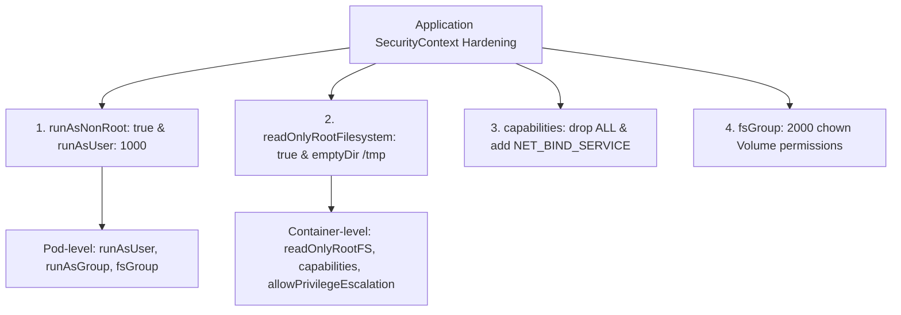
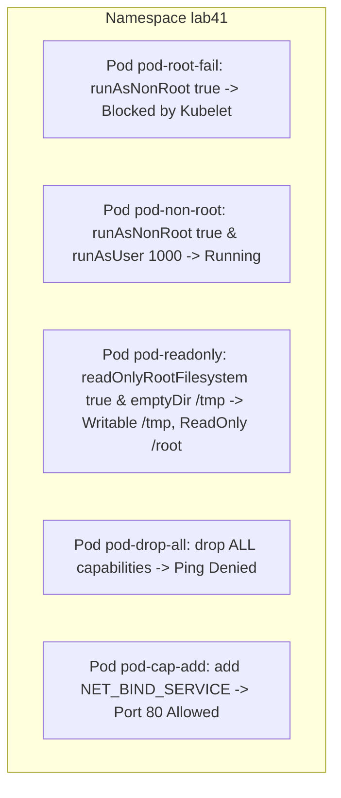


# [BÀI 11] THIẾT LẬP SECURITYCONTEXT CHO ỨNG DỤNG: RUNASNONROOT, READONLYROOTFILESYSTEM, CAPABILITIES & FSGROUP

Trong kỷ nguyên điện toán đám mây và kiến trúc microservices phân tán quy mô lớn, **Kubernetes (CKAD)** đóng vai trò là nền tảng điều phối container (Container Orchestration) tiêu chuẩn công nghiệp. Để làm chủ hệ thống trong môi trường sản xuất (Production) cũng như chinh phục kỳ thi chứng chỉ quốc tế của Linux Foundation / CNCF, kỹ sư không chỉ nắm vững các câu lệnh thao tác cơ bản mà phải thấu hiểu sâu sắc bản chất cơ chế tầng thấp: từ chu trình điều hòa (Reconciliation Loop), cấu trúc điều phối tài nguyên, kiến trúc mạng CNI, lưu trữ CSI cho đến các chuẩn mực an ninh phòng thủ chiều sâu.

Bài viết chuyên sâu này sẽ đồng hành cùng bạn giải mã toàn diện bức tranh kiến trúc, phân tích các đánh đổi kỹ thuật thực chiến (Engineering Trade-offs), cung cấp bài thực hành Lab từng bước và bộ câu hỏi phỏng vấn chuẩn Architect / Lead Engineer.

---

## 1. Bản Chất Kiến Trúc & Cơ Chế Vận Hành Tầng Thấp

| # | Câu hỏi ôn tập | Đáp án chuẩn ngắn gọn |
|---|---|---|
| 1 | Cờ thuộc tính nào khóa ConfigMap không cho phép sửa đổi dữ liệu? | Thuộc tính **`immutable: true`** |
| 2 | Loại Secret dùng để lưu thông tin xác thực kéo ảnh từ Private Registry? | Secret kiểu **`kubernetes.io/dockerconfigjson`** |
| 3 | Trường Pod spec chỉ định Secret kéo ảnh riêng tư từ Registry? | Trường **`imagePullSecrets`** |
| 4 | Cặp khóa bắt buộc dạng PEM trong Secret kiểu `kubernetes.io/tls`? | Khóa **`tls.crt`** và **`tls.key`** |
| 5 | Khối khai báo Downward API truyền metadata Pod vào biến môi trường? | Khối **`fieldRef`** (`metadata.name`, `status.podIP`) |


> **"Thiết lập cơ chế bảo mật cấp ứng dụng qua SecurityContext (Application SecurityContext Hardening) là nội dung quan trọng thuộc miền Application Environment, Configuration and Security trong CKAD, đòi hỏi lập trình viên phải thực thi nghiêm ngặt nguyên tắc đặc quyền tối thiểu (Least Privilege) thông qua việc phân biệt `securityContext` ở cấp Pod và cấp Container, bắt buộc cờ `runAsNonRoot: true` đi kèm `runAsUser` và `runAsGroup`, kích hoạt hệ thống tệp chỉ đọc `readOnlyRootFilesystem: true`, quản lý quyền sở hữu Volume qua `fsGroup`; đồng thời làm chủ kỹ thuật tước bỏ toàn bộ đặc quyền kernel mặc định qua `capabilities.drop: ['ALL']` và chỉ bổ sung đúng đặc quyền tối cần thiết (`capabilities.add`) để bảo vệ ứng dụng trước các đe dọa tấn công container escape."**

**Kết quả từ các buổi trước được sử dụng lại:**

| Kết quả / Công cụ | Buổi + số hiệu `QT` | Dùng ở đâu trong buổi này |
|---|---|---|
| Cấu trúc Pod spec và container spec | Buổi 32 `QT 4.1` | Nhúng khối `securityContext` vào Pod spec và container spec |
| Cấu hình `emptyDir` volume | Buổi 26 `QT 4.1` | Mount `emptyDir` làm thư mục tạm `/tmp` khi bật `readOnlyRootFilesystem` |
| Quản lý quyền hạn người dùng Linux | Buổi 02 `QT 4.1` | Giải thích UID/GID và Linux Kernel Capabilities |

---


| # | Kỹ năng thực hiện được | Hiện vật chứng minh |
|---|---|---|
| 1 | Phân biệt chính xác phạm vi tác động của SecurityContext cấp Pod vs cấp Container | Bảng so sánh các thuộc tính hỗ trợ ở cấp Pod và cấp Container |
| 2 | Cấu hình cấm chạy root bằng `runAsNonRoot: true` kết hợp `runAsUser` | Tệp YAML Pod spec chạy dưới UID non-root 1000 |
| 3 | Khóa hệ thống tệp container ở chế độ Read-Only kết hợp `emptyDir` | Tệp YAML Pod spec có `readOnlyRootFilesystem: true` |
| 4 | Tước bỏ toàn bộ đặc quyền kernel mặc định qua `capabilities.drop: ["ALL"]` | Khối `securityContext.capabilities` trong container spec |
| 5 | Gán quyền sở hữu Volume tự động cho tài khoản non-root qua `fsGroup` | Khối `pod.spec.securityContext.fsGroup: 2000` |

---


| Kiến thức tiên quyết | Nguồn tự học nếu thiếu |
|---|---|
| Cấu trúc bản kê khai Pod spec và Container spec | Buổi 32 (`QT 4.1`) |
| Gắn VolumeMounts và emptyDir vào container | Buổi 26 (`QT 4.1`) |
| Nguyên tắc quản lý phân quyền UID/GID Linux | Buổi 02 (`QT 4.1`) |

---


### 3.1. Thuật ngữ Việt–Anh

| # | Thuật ngữ tiếng Việt | Tiếng Anh tương đương | Ghi chú chuẩn hoá trong thân bài |
|---|---|---|---|
| 1 | Bối cảnh bảo mật | SecurityContext | Khối khai báo quyền hạn và đặc quyền bảo mật cho Pod/Container |
| 2 | Cấm chạy quyền root | `runAsNonRoot: true` | Quy định container bắt buộc phải chạy dưới tài khoản non-root UID khác 0 |
| 3 | Định danh người dùng | `runAsUser` | Số hiệu UID của tài khoản Linux chạy tiến trình (ví dụ UID 1000) |
| 4 | Định danh nhóm người dùng | `runAsGroup` | Số hiệu GID của nhóm Linux chạy tiến trình (ví dụ GID 3000) |
| 5 | Nhóm sở hữu hệ thống tệp | `fsGroup` | Số hiệu GID tự động gán quyền sở hữu cho các Volume mount vào Pod |
| 6 | Khóa hệ thống tệp chỉ đọc | `readOnlyRootFilesystem: true` | Khóa đĩa gốc container thành chỉ đọc để chống ghi đè tệp tin |
| 7 | Quyền hạt nhân Linux | Linux Capabilities | Các mảnh phân quyền hạt nhân Linux (ví dụ `CAP_NET_BIND_SERVICE`) |
| 8 | Tước bỏ toàn bộ đặc quyền | Drop All Capabilities (`drop: ["ALL"]`) | Tước bỏ 100% đặc quyền kernel mặc định của container |
| 9 | Bổ sung đặc quyền cụ thể | Add Capability (`add: ["NET_BIND_SERVICE"]`) | Cấp đúng đặc quyền cần thiết cho container |
| 10 | Tránh leo đặc quyền | `allowPrivilegeEscalation: false` | Cấm tiến trình con tự nâng quyền root qua các file suid |
| 11 | Nguyên tắc đặc quyền tối thiểu | Principle of Least Privilege | Nguyên tắc chỉ cấp đúng quyền hạn tối thiểu cần thiết để chạy |
| 12 | Thoát khỏi rào chắn container | Container Escape | Hành vi tấn công phá vỡ rào chắn container chiếm Node host |
| 13 | Thư mục ghi tạm thời | Temporary Writable Directory | Thư mục mount `emptyDir` dùng ghi file tạm khi bật Read-Only FS |
| 14 | Mã người dùng siêu cấp | Root User (`UID 0`) | Tài khoản có toàn quyền truy cập cao nhất trên Linux |


Mô hình Nhân viên Ngân hàng và Chiếc Áo Giáp Bảo vệ: Khai báo `runAsNonRoot: true` và `runAsUser: 1000` giống như yêu cầu Nhân viên ngân hàng phải đeo thẻ định danh nhân viên thường (không được dùng chìa khóa vạn năng của Giám đốc UID 0). `readOnlyRootFilesystem: true` giống như bọc toàn bộ văn phòng bằng kính cường lực không cho phép ai tự tiện dán thêm hoặc sửa tài liệu trên tường. `capabilities.drop: ["ALL"]` giống như tước bỏ toàn bộ vũ khí của nhân viên bảo vệ, và `capabilities.add` là cấp lại cho họ duy nhất chiếc bộ đàm liên lạc để làm việc.

---

### 1.1. Phân biệt SecurityContext cấp Pod và cấp Container (12 phút)

**Nguyên lý cốt lõi:** `securityContext` ở cấp Pod áp dụng cho tất cả các container bên trong Pod (như `runAsUser`, `runAsGroup`, `fsGroup`); trong khi `securityContext` ở cấp Container ghi đè các thiết lập cấp Pod và chứa các thuộc tính riêng của container (như `readOnlyRootFilesystem`, `capabilities`, `allowPrivilegeEscalation`).

**Giải thích cơ chế ngầm:** Giúp dễ dàng thiết lập một quy chuẩn bảo mật chung cho toàn bộ Pod (Pod-level), đồng thời cho phép linh hoạt tùy biến quyền hạn chuyên biệt cho từng container riêng (Container-level) khi có nhu cầu đặc thù.

> [!WARNING]
> **CẠM BẪY THỰC CHIẾN:**
> Khai báo cờ `readOnlyRootFilesystem: true` ở cấp Pod spec khiến Kubernetes API Server từ chối và báo lỗi `unknown field "readOnlyRootFilesystem" in io.k8s.api.core.v1.PodSecurityContext`.

**Minh hoạ.**

```yaml
spec:
  securityContext: # CẤP POD (ÁP DỤNG CHO TOÀN POD)
    runAsUser: 1000
    runAsGroup: 3000
    fsGroup: 2000
  containers:
    - name: app
      image: nginx:alpine
      securityContext: # CẤP CONTAINER (RIÊNG CONTAINER NÀY)
        readOnlyRootFilesystem: true
        allowPrivilegeEscalation: false
```

**Nguyên lý cốt lõi:** Khi thiết lập `runAsNonRoot: true`, nếu container image mặc định chạy bằng `USER root` (UID 0) mà không khai báo cờ `runAsUser` khác 0, Kubelet sẽ từ chối khởi chạy container và báo lỗi `container has runAsNonRoot and image will run as root`.

**Giải thích cơ chế ngầm:** Kubelet kiểm tra kỹ UID mặc định được nạp từ Dockerfile của ảnh. Nếu ảnh không có chỉ thị `USER nonroot` mà ta chỉ bật cờ `runAsNonRoot: true`, Kubelet sẽ phát hiện nguy cơ chạy root và chặn ngay lập tức.

> [!WARNING]
> **CẠM BẪY THỰC CHIẾN:**
> Pod bị kẹt ở trạng thái `CreateContainerConfigError` với thông điệp `image will run as root`.

**Minh hoạ.**

```yaml
# Sửa đúng: Kết hợp cả 2 cờ runAsNonRoot và runAsUser
securityContext:
  runAsNonRoot: true
  runAsUser: 1000 # Chỉ định UID 1000 khác 0
```

---

### 1.2. Cơ chế thực thi Non-root và khóa hệ thống tệp Read-Only (12 phút)

**Nguyên lý cốt lõi:** Bật cờ `readOnlyRootFilesystem: true` trong container `securityContext` sẽ khóa toàn bộ đĩa gốc container ở chế độ chỉ đọc; nếu ứng dụng cần ghi file tạm (như `/tmp` hay `/var/log`), bắt buộc phải mount một `emptyDir` volume vào đường dẫn đó.

**Giải thích cơ chế ngầm:** Hầu hết mã độc khi xâm nhập container sẽ tìm cách ghi đè binary hoặc tải các script độc hại vào đĩa gốc. Khóa Read-Only FS sẽ triệt tiêu hoàn toàn khả năng này. Các file ghi tạm ngắn hạn của ứng dụng sẽ được định hướng lưu an toàn trong `emptyDir` volume độc lập.

> [!WARNING]
> **CẠM BẪY THỰC CHIẾN:**
> Bật `readOnlyRootFilesystem: true` nhưng không mount `emptyDir` vào `/tmp`, khiến ứng dụng bị crash ngay khi khởi động do không thể ghi tệp tạm.

**Minh hoạ.**

```yaml
containers:
  - name: app
    image: nginx:alpine
    securityContext:
      readOnlyRootFilesystem: true
    volumeMounts:
      - name: tmp-vol
        mountPath: /tmp
      - name: cache-vol
        mountPath: /var/cache/nginx
volumes:
  - name: tmp-vol
    emptyDir: {}
  - name: cache-vol
    emptyDir: {}
```

**Nguyên lý cốt lõi:** Luôn thiết lập cờ `allowPrivilegeEscalation: false` để ngăn chặn các tiến trình con bên trong container sử dụng các lệnh binary `suid` hoặc `sudo` để tự leo quyền root.

**Giải thích cơ chế ngầm:** Nếu một hacker xâm nhập được vào tiến trình non-root, họ có thể khai thác các lỗ hổng binary `suid` sẵn có trong Linux (như `ping` hay `mount`) để nâng quyền root. Cờ `allowPrivilegeEscalation: false` triệt tiêu cờ `no_new_privs` ở kernel level.

> [!WARNING]
> **CẠM BẪY THỰC CHIẾN:**
> Quên khai báo `allowPrivilegeEscalation: false` làm container bị giảm điểm đánh giá trong các bài kiểm tra bảo mật CIS Benchmark.

**Minh hoạ.**

```yaml
securityContext:
  allowPrivilegeEscalation: false
```

---

### 1.3. Quản lý Linux Capabilities (`add`/`drop`) và `fsGroup` (10 phút)

**Nguyên lý cốt lõi:** Theo chuẩn bảo mật Cloud Native, bắt buộc phải khai báo `capabilities.drop: ["ALL"]` ở tất cả các container Production để tước bỏ toàn bộ 30+ Linux capabilities mặc định.

**Giải thích cơ chế ngầm:** Tiến trình container mặc định được cấp sẵn nhiều quyền hạt nhân không dùng tới (như `CAP_CHOWN`, `CAP_FOWNER`, `CAP_MKNOD`, `CAP_NET_RAW`). Tước bỏ 100% quyền mặc định giúp cô lập container tối đa.

> [!WARNING]
> **CẠM BẪY THỰC CHIẾN:**
> Để nguyên đặc quyền kernel mặc định cho container làm tăng nguy cơ bị tấn công leo quyền Container Escape.

**Minh hoạ.**

```yaml
securityContext:
  capabilities:
    drop:
      - ALL
```

**Nguyên lý cốt lõi:** Nếu ứng dụng Web (như Nginx) chạy tài khoản non-root (UID 1000) cần mở port dưới 1024 (như port 80/443), bổ sung duy nhất quyền `capabilities.add: ["NET_BIND_SERVICE"]`.

**Giải thích cơ chế ngầm:** Trên Linux, chỉ có root mới được mở cổng TCP dưới 1024. Quyền `CAP_NET_BIND_SERVICE` cho phép tài khoản non-root mở cổng dưới 1024 mà KHÔNG CẦN phải cấp toàn bộ quyền root nguy hiểm.

> [!WARNING]
> **CẠM BẪY THỰC CHIẾN:**
> Ứng dụng chạy non-root mở port 80 bị báo lỗi `Permission denied` do thiếu `NET_BIND_SERVICE`.

**Minh hoạ.**

```yaml
securityContext:
  capabilities:
    drop:
      - ALL
    add:
      - NET_BIND_SERVICE
```

**Nguyên lý cốt lõi:** Khi Pod mount một Volume (như PVC hoặc ConfigMap) và ứng dụng chạy non-root không có quyền truy cập, thiết lập cờ `fsGroup: 2000` trong Pod `securityContext` để Kubelet tự động chown đổi quyền sở hữu Volume cho GID 2000.

**Giải thích cơ chế ngầm:** Khi mount Volume, các tệp mặc định có thể thuộc sở hữu của root (`UID 0`). Tài khoản non-root (`UID 1000`) sẽ bị lỗi `Permission denied` khi đọc/ghi file. `fsGroup` giải quyết bài toán này ở cấp đĩa Kubelet.

> [!WARNING]
> **CẠM BẪY THỰC CHIẾN:**
> Container chạy non-root không đọc được tệp mount từ Volume do lỗi `Permission denied`.

**Minh hoạ.**

```yaml
spec:
  securityContext:
    runAsUser: 1000
    fsGroup: 2000 # Gán quyền sở hữu Volume cho GID 2000
```

---

### 1.4. Đưa vào cụm thật (4 phút)

**Nguyên lý cốt lõi:** Bản kê khai Pod chuẩn bảo mật cao nhất (Hardened Pod Manifest) bắt buộc phải hội tụ đủ 4 yếu tố: `runAsNonRoot: true`, `readOnlyRootFilesystem: true`, `allowPrivilegeEscalation: false`, và `capabilities.drop: ["ALL"]`.

**Giải thích cơ chế ngầm:** Giúp ứng dụng đạt tiêu chuẩn bảo mật `Restricted` của Pod Security Standards (PSS) trong Kubernetes, chống lại 99% các kỹ thuật tấn công container phổ biến.

> [!WARNING]
> **CẠM BẪY THỰC CHIẾN:**
> Bỏ qua 1 trong 4 yếu tố trên làm cho Pod bị các bộ kiểm tra bảo mật (Admission Controller) chặn không cho triển khai vào Namespace Production.

**Minh hoạ.**

```yaml
apiVersion: v1
kind: Pod
metadata:
  name: hardened-app
  namespace: prod
spec:
  securityContext:
    runAsNonRoot: true
    runAsUser: 1000
    fsGroup: 2000
  containers:
    - name: web
      image: nginx:alpine
      securityContext:
        readOnlyRootFilesystem: true
        allowPrivilegeEscalation: false
        capabilities:
          drop: ["ALL"]
          add: ["NET_BIND_SERVICE"]
      volumeMounts:
        - name: tmp-dir
          mountPath: /tmp
        - name: cache-dir
          mountPath: /var/cache/nginx
        - name: run-dir
          mountPath: /var/run
  volumes:
    - name: tmp-dir
      emptyDir: {}
    - name: cache-dir
      emptyDir: {}
    - name: run-dir
      emptyDir: {}
```

**Áp vào cụm đang chạy thì làm gì trước:**
1. Rà soát tất cả các Pod xem có Pod nào đang chạy bằng tài khoản root không.
2. Thử nghiệm bật `readOnlyRootFilesystem: true` trên môi trường Staging và bổ sung `emptyDir` cho các thư mục ghi log.
3. Thêm `capabilities.drop: ["ALL"]` cho tất cả các container.

**Cái gì hỏng nếu áp thẳng lên prod:**
- Bật `readOnlyRootFilesystem: true` mà thiếu `emptyDir` sẽ làm container bị crash vĩnh viễn không khởi động được.

**Đo trước — đo sau:**
- Sử dụng công cụ `trivy` hoặc `kubesec` quét điểm bảo mật tệp YAML trước và sau khi áp dụng SecurityContext.
- Kiểm tra danh sách các capability thực tế bên trong container qua lệnh `capsh --print`.

**Khi nào KHÔNG nên dùng:**
- Không dùng `readOnlyRootFilesystem` cho các ứng dụng StatefulSet cũ yêu cầu ghi dữ liệu liên tục vào nhiều thư mục gốc không xác định được.

---

### 1.5. Bẫy hay gặp (2 phút)

| Bẫy hay gặp | Vì sao dính | Làm đúng là |
|---|---|---|
| 1. Khai báo `readOnlyRootFilesystem` ở cấp Pod spec | Cờ này chỉ hỗ trợ ở cấp Container spec | Chuyển `readOnlyRootFilesystem` xuống khối container |
| 2. Bật `runAsNonRoot: true` nhưng quên `runAsUser` | Ảnh Docker mặc định chạy `USER root` | Khai báo kết hợp `runAsNonRoot: true` và `runAsUser: 1000` |
| 3. App crash do `readOnlyRootFilesystem` thiếu `emptyDir` | App cần ghi tệp tạm vào `/tmp` hoặc `/var/log` | Mount `emptyDir` volume vào các thư mục ghi tạm |
| 4. Non-root user mở port 80 bị lỗi Permission denied | Linux cấm non-root mở port dưới 1024 | Bổ sung `capabilities.add: ["NET_BIND_SERVICE"]` |
| 5. Lệnh `ping` trong container bị lỗi sau khi drop ALL | `ping` cần quyền `CAP_NET_RAW` | Bổ sung `NET_RAW` nếu bắt buộc dùng ping |
| 6. Non-root user bị lỗi `Permission denied` khi đọc Volume | Volume thuộc sở hữu của root `UID 0` | Khai báo `fsGroup: 2000` trong Pod securityContext |
| 7. Gõ sai từ khóa `capabilities` thành `capability` | Từ khóa YAML phân biệt chữ hoa/thường | Sử dụng chính xác từ khóa `capabilities` |
| 8. Gõ sai giá trị `drop: ["ALL"]` thành `drop: ["all"]` | Giá trị `ALL` phải viết in hoa | Luôn viết in hoa chữ `ALL` trong array drop |
| 9. Quên cờ `allowPrivilegeEscalation: false` | Bỏ sót điều kiện bảo mật chống leo quyền | Luôn thêm `allowPrivilegeEscalation: false` |
| 10. `runAsUser: 0` khi đã bật `runAsNonRoot: true` | `UID 0` chính là root user | Khai báo `runAsUser` con số khác 0 (như 1000) |
| 11. Nhầm lẫn giữa `runAsUser` và `fsGroup` | `runAsUser` gán UID tiến trình; `fsGroup` gán GID volume | Dùng `runAsUser` cho tiến trình; `fsGroup` cho volume |
| 12. Mount `emptyDir` ghi đè toàn bộ thư mục `/etc` | Thư mục `/etc` chứa các tệp hệ thống quan trọng | Chỉ mount `emptyDir` vào các thư mục tạm ghi file |

---

### 1.6. Tóm tắt (2 phút)



**Năm điều phải nhớ:**
1. **Phân biệt 2 cấp**: Pod-level (`runAsUser`, `fsGroup`) vs Container-level (`readOnlyRootFilesystem`, `capabilities`).
2. **Cấm chạy Root**: Bắt buộc dùng `runAsNonRoot: true` kết hợp `runAsUser: 1000`.
3. **Đĩa chỉ đọc**: Dùng `readOnlyRootFilesystem: true` kết hợp `emptyDir` mount vào `/tmp`.
4. **Tước đặc quyền Kernel**: Bắt buộc dùng `capabilities.drop: ["ALL"]` và chỉ `add` quyền cần thiết.
5. **Đổi quyền Volume**: Dùng `fsGroup: 2000` để gán quyền đọc/ghi volume cho tài khoản non-root.

---

## §10. Câu hỏi tự kiểm tra (5 phút)


<details class="qa-card">
<summary class="qa-summary">
  <div class="qa-summary-left">
    <span class="qa-num-badge">Q01</span>
    <span>Sự khác biệt chính về phạm vi áp dụng giữa `securityContext` ở cấp Pod và cấp Container là gì?</span>
  </div>
  <span class="qa-chevron">
    <svg width="18" height="18" fill="none" stroke="currentColor" stroke-width="2.5" viewBox="0 0 24 24"><polyline points="6 9 12 15 18 9"></polyline></svg>
  </span>
</summary>
<div class="qa-answer">
  <div class="qa-answer-header">
    <svg width="14" height="14" fill="none" stroke="currentColor" stroke-width="2" viewBox="0 0 24 24"><path d="M22 11.08V12a10 10 0 1 1-5.93-9.14"></path><polyline points="22 4 12 14.01 9 11.01"></polyline></svg>
    <span>Phân Tích &amp; Lời Giải Kỹ Thuật</span>
  </div>
  Cấp Pod áp dụng chung cho tất cả container (`runAsUser`, `fsGroup`); Cấp Container áp dụng riêng và ghi đè cấp Pod (`readOnlyRootFilesystem`, `capabilities`).
</div>
</details>

<details class="qa-card">
<summary class="qa-summary">
  <div class="qa-summary-left">
    <span class="qa-num-badge">Q02</span>
    <span>Điều gì xảy ra khi bạn cấu hình `runAsNonRoot: true` cho một Pod chạy ảnh Docker mặc định là root mà không khai báo `runAsUser`?</span>
  </div>
  <span class="qa-chevron">
    <svg width="18" height="18" fill="none" stroke="currentColor" stroke-width="2.5" viewBox="0 0 24 24"><polyline points="6 9 12 15 18 9"></polyline></svg>
  </span>
</summary>
<div class="qa-answer">
  <div class="qa-answer-header">
    <svg width="14" height="14" fill="none" stroke="currentColor" stroke-width="2" viewBox="0 0 24 24"><path d="M22 11.08V12a10 10 0 1 1-5.93-9.14"></path><polyline points="22 4 12 14.01 9 11.01"></polyline></svg>
    <span>Phân Tích &amp; Lời Giải Kỹ Thuật</span>
  </div>
  Kubelet từ chối khởi chạy container và báo lỗi `container has runAsNonRoot and image will run as root`.
</div>
</details>

<details class="qa-card">
<summary class="qa-summary">
  <div class="qa-summary-left">
    <span class="qa-num-badge">Q03</span>
    <span>Cờ thuộc tính nào trong container `securityContext` được sử dụng để khóa toàn bộ đĩa gốc container ở chế độ chỉ đọc?</span>
  </div>
  <span class="qa-chevron">
    <svg width="18" height="18" fill="none" stroke="currentColor" stroke-width="2.5" viewBox="0 0 24 24"><polyline points="6 9 12 15 18 9"></polyline></svg>
  </span>
</summary>
<div class="qa-answer">
  <div class="qa-answer-header">
    <svg width="14" height="14" fill="none" stroke="currentColor" stroke-width="2" viewBox="0 0 24 24"><path d="M22 11.08V12a10 10 0 1 1-5.93-9.14"></path><polyline points="22 4 12 14.01 9 11.01"></polyline></svg>
    <span>Phân Tích &amp; Lời Giải Kỹ Thuật</span>
  </div>
  Thuộc tính `readOnlyRootFilesystem: true`.
</div>
</details>

<details class="qa-card">
<summary class="qa-summary">
  <div class="qa-summary-left">
    <span class="qa-num-badge">Q04</span>
    <span>Khi bật `readOnlyRootFilesystem: true`, giải pháp nào giúp ứng dụng vẫn ghi được các tệp tin tạm thời?</span>
  </div>
  <span class="qa-chevron">
    <svg width="18" height="18" fill="none" stroke="currentColor" stroke-width="2.5" viewBox="0 0 24 24"><polyline points="6 9 12 15 18 9"></polyline></svg>
  </span>
</summary>
<div class="qa-answer">
  <div class="qa-answer-header">
    <svg width="14" height="14" fill="none" stroke="currentColor" stroke-width="2" viewBox="0 0 24 24"><path d="M22 11.08V12a10 10 0 1 1-5.93-9.14"></path><polyline points="22 4 12 14.01 9 11.01"></polyline></svg>
    <span>Phân Tích &amp; Lời Giải Kỹ Thuật</span>
  </div>
  Mount một `emptyDir` volume vào các thư mục tạm (như `/tmp` hay `/var/log`).
</div>
</details>

<details class="qa-card">
<summary class="qa-summary">
  <div class="qa-summary-left">
    <span class="qa-num-badge">Q05</span>
    <span>Cờ thuộc tính nào được sử dụng để ngăn chặn các tiến trình con bên trong container leo quyền root qua các file suid?</span>
  </div>
  <span class="qa-chevron">
    <svg width="18" height="18" fill="none" stroke="currentColor" stroke-width="2.5" viewBox="0 0 24 24"><polyline points="6 9 12 15 18 9"></polyline></svg>
  </span>
</summary>
<div class="qa-answer">
  <div class="qa-answer-header">
    <svg width="14" height="14" fill="none" stroke="currentColor" stroke-width="2" viewBox="0 0 24 24"><path d="M22 11.08V12a10 10 0 1 1-5.93-9.14"></path><polyline points="22 4 12 14.01 9 11.01"></polyline></svg>
    <span>Phân Tích &amp; Lời Giải Kỹ Thuật</span>
  </div>
  Thuộc tính `allowPrivilegeEscalation: false`.
</div>
</details>

<details class="qa-card">
<summary class="qa-summary">
  <div class="qa-summary-left">
    <span class="qa-num-badge">Q06</span>
    <span>Cú pháp YAML chuẩn để tước bỏ toàn bộ các đặc quyền Linux kernel mặc định của container là gì?</span>
  </div>
  <span class="qa-chevron">
    <svg width="18" height="18" fill="none" stroke="currentColor" stroke-width="2.5" viewBox="0 0 24 24"><polyline points="6 9 12 15 18 9"></polyline></svg>
  </span>
</summary>
<div class="qa-answer">
  <div class="qa-answer-header">
    <svg width="14" height="14" fill="none" stroke="currentColor" stroke-width="2" viewBox="0 0 24 24"><path d="M22 11.08V12a10 10 0 1 1-5.93-9.14"></path><polyline points="22 4 12 14.01 9 11.01"></polyline></svg>
    <span>Phân Tích &amp; Lời Giải Kỹ Thuật</span>
  </div>
  Khai báo `capabilities.drop: ["ALL"]`.
</div>
</details>

<details class="qa-card">
<summary class="qa-summary">
  <div class="qa-summary-left">
    <span class="qa-num-badge">Q07</span>
    <span>Quyền Linux Capability nào cần được bổ sung (`capabilities.add`) để tài khoản non-root mở được port 80?</span>
  </div>
  <span class="qa-chevron">
    <svg width="18" height="18" fill="none" stroke="currentColor" stroke-width="2.5" viewBox="0 0 24 24"><polyline points="6 9 12 15 18 9"></polyline></svg>
  </span>
</summary>
<div class="qa-answer">
  <div class="qa-answer-header">
    <svg width="14" height="14" fill="none" stroke="currentColor" stroke-width="2" viewBox="0 0 24 24"><path d="M22 11.08V12a10 10 0 1 1-5.93-9.14"></path><polyline points="22 4 12 14.01 9 11.01"></polyline></svg>
    <span>Phân Tích &amp; Lời Giải Kỹ Thuật</span>
  </div>
  Quyền `NET_BIND_SERVICE`.
</div>
</details>

<details class="qa-card">
<summary class="qa-summary">
  <div class="qa-summary-left">
    <span class="qa-num-badge">Q08</span>
    <span>Thuộc tính `fsGroup: 2000` trong Pod `securityContext` có tác dụng gì đối với các Volume được mount?</span>
  </div>
  <span class="qa-chevron">
    <svg width="18" height="18" fill="none" stroke="currentColor" stroke-width="2.5" viewBox="0 0 24 24"><polyline points="6 9 12 15 18 9"></polyline></svg>
  </span>
</summary>
<div class="qa-answer">
  <div class="qa-answer-header">
    <svg width="14" height="14" fill="none" stroke="currentColor" stroke-width="2" viewBox="0 0 24 24"><path d="M22 11.08V12a10 10 0 1 1-5.93-9.14"></path><polyline points="22 4 12 14.01 9 11.01"></polyline></svg>
    <span>Phân Tích &amp; Lời Giải Kỹ Thuật</span>
  </div>
  Kubelet tự động thay đổi quyền sở hữu (chown) của các tệp trong Volume sang GID 2000.
</div>
</details>

<details class="qa-card">
<summary class="qa-summary">
  <div class="qa-summary-left">
    <span class="qa-num-badge">Q09</span>
    <span>Bốn yếu tố bắt buộc để xây dựng một bản kê khai Pod chuẩn bảo mật cao nhất (Hardened Pod Manifest) là gì?</span>
  </div>
  <span class="qa-chevron">
    <svg width="18" height="18" fill="none" stroke="currentColor" stroke-width="2.5" viewBox="0 0 24 24"><polyline points="6 9 12 15 18 9"></polyline></svg>
  </span>
</summary>
<div class="qa-answer">
  <div class="qa-answer-header">
    <svg width="14" height="14" fill="none" stroke="currentColor" stroke-width="2" viewBox="0 0 24 24"><path d="M22 11.08V12a10 10 0 1 1-5.93-9.14"></path><polyline points="22 4 12 14.01 9 11.01"></polyline></svg>
    <span>Phân Tích &amp; Lời Giải Kỹ Thuật</span>
  </div>
  `runAsNonRoot: true`, `readOnlyRootFilesystem: true`, `allowPrivilegeEscalation: false`, và `capabilities.drop: ["ALL"]`.
</div>
</details>

<details class="qa-card">
<summary class="qa-summary">
  <div class="qa-summary-left">
    <span class="qa-num-badge">Q10</span>
    <span>Giá trị chữ `ALL` trong mảng `capabilities.drop` bắt buộc phải viết thế nào?</span>
  </div>
  <span class="qa-chevron">
    <svg width="18" height="18" fill="none" stroke="currentColor" stroke-width="2.5" viewBox="0 0 24 24"><polyline points="6 9 12 15 18 9"></polyline></svg>
  </span>
</summary>
<div class="qa-answer">
  <div class="qa-answer-header">
    <svg width="14" height="14" fill="none" stroke="currentColor" stroke-width="2" viewBox="0 0 24 24"><path d="M22 11.08V12a10 10 0 1 1-5.93-9.14"></path><polyline points="22 4 12 14.01 9 11.01"></polyline></svg>
    <span>Phân Tích &amp; Lời Giải Kỹ Thuật</span>
  </div>
  Bắt buộc phải viết in hoa toàn bộ (`"ALL"`).
</div>
</details>

<details class="qa-card">
<summary class="qa-summary">
  <div class="qa-summary-left">
    <span class="qa-num-badge">Q11</span>
    <span>Tại sao không nên cho tiến trình container chạy dưới tài khoản root (`UID 0`)?</span>
  </div>
  <span class="qa-chevron">
    <svg width="18" height="18" fill="none" stroke="currentColor" stroke-width="2.5" viewBox="0 0 24 24"><polyline points="6 9 12 15 18 9"></polyline></svg>
  </span>
</summary>
<div class="qa-answer">
  <div class="qa-answer-header">
    <svg width="14" height="14" fill="none" stroke="currentColor" stroke-width="2" viewBox="0 0 24 24"><path d="M22 11.08V12a10 10 0 1 1-5.93-9.14"></path><polyline points="22 4 12 14.01 9 11.01"></polyline></svg>
    <span>Phân Tích &amp; Lời Giải Kỹ Thuật</span>
  </div>
  Vì nếu rào chắn container bị phá vỡ (Container Escape), kẻ tấn công sẽ chiếm trọn quyền root của Node host.
</div>
</details>

<details class="qa-card">
<summary class="qa-summary">
  <div class="qa-summary-left">
    <span class="qa-num-badge">Q12</span>
    <span>Cờ thuộc tính nào dùng để chỉ định UID của tài khoản Linux chạy tiến trình trong container?</span>
  </div>
  <span class="qa-chevron">
    <svg width="18" height="18" fill="none" stroke="currentColor" stroke-width="2.5" viewBox="0 0 24 24"><polyline points="6 9 12 15 18 9"></polyline></svg>
  </span>
</summary>
<div class="qa-answer">
  <div class="qa-answer-header">
    <svg width="14" height="14" fill="none" stroke="currentColor" stroke-width="2" viewBox="0 0 24 24"><path d="M22 11.08V12a10 10 0 1 1-5.93-9.14"></path><polyline points="22 4 12 14.01 9 11.01"></polyline></svg>
    <span>Phân Tích &amp; Lời Giải Kỹ Thuật</span>
  </div>
  Thuộc tính `runAsUser`.
</div>
</details>

---

## §11. Tài liệu tham khảo

| Nguồn | Địa chỉ URL | Ghi chú |
|---|---|---|
| Configure a Security Context for a Pod | `https://kubernetes.io/docs/tasks/configure-pod-container/security-context/` | Tài liệu chuẩn K8s SecurityContext |
| Pod Security Standards (PSS) | `https://kubernetes.io/docs/concepts/security/pod-security-standards/` | Tài liệu chuẩn K8s Pod Security Standards |

---

## Bảng đối soát thời lượng

| Mục | Ngân sách thời gian | Thực tế |
|---|---|---|
| §0. Khởi động và ôn tập | 10 phút | 10 phút |
| §1. Học viên làm được gì | 1 phút | 1 phút |
| §2. Cần biết trước | 1 phút | 1 phút |
| §3. Thuật ngữ và mô hình tư duy | 8 phút | 8 phút |
| §4. Phân biệt SecurityContext cấp Pod và Container | 12 phút | 12 phút |
| §5. Cơ chế Non-root và Read-Only FS | 12 phút | 12 phút |
| §6. Quản lý Capabilities và fsGroup | 10 phút | 10 phút |
| §7. Đưa vào cụm thật | 4 phút | 4 phút |
| §8. Bẫy hay gặp | 2 phút | 2 phút |
| §9. Tóm tắt | 2 phút | 2 phút |
| §10. Câu hỏi tự kiểm tra | 5 phút | 5 phút |
| **Tổng** | **60'** | **60'** |

---

## 2. Hướng Dẫn Thực Hành & Triển Khai Lab Chuẩn Production

> [!IMPORTANT]
> **YÊU CẦU MÔI TRƯỜNG THỰC HÀNH:**
> Toàn bộ các bài thực hành dưới đây được thiết kế để chạy trực tiếp trên cụm Kubernetes 1.30+ tiêu chuẩn (hoặc cụm kind/kubeadm lab). Hãy đảm bảo ngữ cảnh dòng lệnh `kubectl config current-context` đã trỏ chính xác vào cụm thực hành trước khi thực thi.

## Khối thực hành — 120 phút

## L0. Mục tiêu thực hành và tiêu chí hoàn thành

| Mã tiêu chí | Nội dung tiêu chí | Lệnh kiểm chứng | Kết quả kỳ vọng |
|---|---|---|---|
| TH1 | Tạo Namespace `lab41` phục vụ thực hành Application SecurityContext Hardening | `kubectl get ns lab41 -o jsonpath='{.status.phase}'` | In ra `Active` |
| TH2 | Triển khai Pod `pod-root-fail` có `runAsNonRoot: true` chạy ảnh root mặc định | `kubectl get pod pod-root-fail -n lab41 -o jsonpath='{.metadata.name}'` | In ra `pod-root-fail` |
| TH3 | Xác minh Kubelet chặn `pod-root-fail` do chạy root | `kubectl describe pod pod-root-fail -n lab41 \| grep -q "image will run as root"` | Báo lỗi run as root |
| TH4 | Sửa Pod `pod-non-root` thêm `runAsUser: 1000` | `kubectl get pod pod-non-root -n lab41 -o jsonpath='{.spec.securityContext.runAsUser}'` | In ra `1000` |
| TH5 | Xác minh lệnh `id` trong `pod-non-root` in ra `uid=1000` | `kubectl exec pod-non-root -n lab41 -- id \| grep -q "uid=1000"` | In ra UID 1000 |
| TH6 | Triển khai Pod `pod-readonly` có `readOnlyRootFilesystem: true` & `emptyDir` mount | `kubectl get pod pod-readonly -n lab41 -o jsonpath='{.spec.containers[0].securityContext.readOnlyRootFilesystem}'` | In ra `true` |
| TH7 | Xác minh ghi file vào `/root` trong `pod-readonly` bị từ chối | `kubectl exec pod-readonly -n lab41 -- touch /root/test 2>&1 \| grep -q "Read-only"` | Báo lỗi Read-only FS |
| TH8 | Xác minh ghi file vào `/tmp` (emptyDir) trong `pod-readonly` thành công | `kubectl exec pod-readonly -n lab41 -- touch /tmp/test && echo "OK"` | In ra `OK` |
| TH9 | Triển khai Pod `pod-drop-all` chứa `capabilities.drop: ["ALL"]` | `kubectl get pod pod-drop-all -n lab41 -o jsonpath='{.spec.containers[0].securityContext.capabilities.drop[0]}'` | In ra `ALL` |
| TH10 | Xác minh lệnh `ping` trong `pod-drop-all` bị từ chối do thiếu `NET_RAW` | `kubectl exec pod-drop-all -n lab41 -- ping 127.0.0.1 2>&1 \| grep -q "Permission denied\|Operation not permitted"` | Báo lỗi mất quyền |
| TH11 | Triển khai Pod `pod-cap-add` bổ sung quyền `NET_BIND_SERVICE` | `kubectl get pod pod-cap-add -n lab41 -o jsonpath='{.spec.containers[0].securityContext.capabilities.add[0]}'` | In ra `NET_BIND_SERVICE` |
| TH12 | Triển khai Pod `pod-fsgroup` có `fsGroup: 2000` | `kubectl get pod pod-fsgroup -n lab41 -o jsonpath='{.spec.securityContext.fsGroup}'` | In ra `2000` |
| TH13 | Dọn dẹp sạch sẽ tài nguyên lab41 | `test ! -f /tmp/lab41-sec.yaml && echo "CLEAN"` | In ra `CLEAN` |

---

## L1. Điều kiện tiên quyết về môi trường

| Kiểm tra | Lệnh thực hiện | Kết quả kỳ vọng |
|---|---|---|
| Cụm Kubernetes ba node | `kubectl get nodes` | `cp-01`, `worker-01`, `worker-02` ở trạng thái `Ready` |
| Context đúng môi trường lab | `kubectl config current-context` | Đúng context cụm `kubeadm` |
| Quyền cấu hình SecurityContext | `kubectl auth can-i create pod -n default` | In ra `yes` |

---

## L2. Kiến trúc bài lab Application SecurityContext Hardening



---

## L3. Bước 1: Khởi tạo Namespace `lab41` và thử nghiệm `runAsNonRoot` (15 phút)

### Thao tác 1.1: Tạo Namespace

```bash
kubectl create namespace lab41
```

**CHECKPOINT 1 — Kiểm tra Namespace `lab41`.**

```bash
kubectl get ns lab41 -o jsonpath='{.status.phase}' | grep -qx Active && echo "CHECKPOINT 1 — ĐẠT" || echo "CHECKPOINT 1 — LỖI"
```

### Thao tác 1.2: Triển khai Pod `pod-root-fail` bị chặn do chạy root

```bash
cat <<EOF | kubectl apply -f -
apiVersion: v1
kind: Pod
metadata:
  name: pod-root-fail
  namespace: lab41
spec:
  securityContext:
    runAsNonRoot: true
  containers:
    - name: app
      image: busybox:1.36
      command: ["sh", "-c", "sleep 3600"]
EOF
```

**CHECKPOINT 2 — Kiểm tra Pod `pod-root-fail` khởi tạo.**

```bash
kubectl get pod pod-root-fail -n lab41 -o jsonpath='{.metadata.name}' | grep -qx pod-root-fail && echo "CHECKPOINT 2 — ĐẠT" || echo "CHECKPOINT 2 — LỖI"
```

**CHECKPOINT 3 — Xác minh Kubelet chặn `pod-root-fail` do chạy root.**

```bash
sleep 4
kubectl describe pod pod-root-fail -n lab41 | grep -q "image will run as root" && echo "CHECKPOINT 3 — ĐẠT" || echo "CHECKPOINT 3 — LỖI"
```

---

## L4. Bước 2: Khắc phục lỗi bằng `runAsUser` và xác minh UID (25 phút)

### Thao tác 2.1: Triển khai Pod `pod-non-root` với `runAsUser: 1000`

```bash
cat <<EOF | kubectl apply -f -
apiVersion: v1
kind: Pod
metadata:
  name: pod-non-root
  namespace: lab41
spec:
  securityContext:
    runAsNonRoot: true
    runAsUser: 1000
    runAsGroup: 3000
  containers:
    - name: app
      image: busybox:1.36
      command: ["sh", "-c", "sleep 3600"]
EOF
```

**CHECKPOINT 4 — Kiểm tra `runAsUser: 1000` trong spec.**

```bash
kubectl get pod pod-non-root -n lab41 -o jsonpath='{.spec.securityContext.runAsUser}' | grep -qx 1000 && echo "CHECKPOINT 4 — ĐẠT" || echo "CHECKPOINT 4 — LỖI"
```

**CHECKPOINT 5 — Xác minh lệnh `id` trong container in ra `uid=1000`.**

```bash
sleep 4
kubectl exec pod-non-root -n lab41 -- id | grep -q "uid=1000" && echo "CHECKPOINT 5 — ĐẠT" || echo "CHECKPOINT 5 — LỖI"
```

---

## L5. Bước 3: Khóa hệ thống tệp với `readOnlyRootFilesystem` kết hợp `emptyDir` (25 phút)

### Thao tác 3.1: Triển khai Pod `pod-readonly`

```bash
cat <<EOF | kubectl apply -f -
apiVersion: v1
kind: Pod
metadata:
  name: pod-readonly
  namespace: lab41
spec:
  containers:
    - name: app
      image: busybox:1.36
      command: ["sh", "-c", "sleep 3600"]
      securityContext:
        readOnlyRootFilesystem: true
      volumeMounts:
        - name: tmp-dir
          mountPath: /tmp
  volumes:
    - name: tmp-dir
      emptyDir: {}
EOF
```

**CHECKPOINT 6 — Kiểm tra cờ `readOnlyRootFilesystem: true`.**

```bash
kubectl get pod pod-readonly -n lab41 -o jsonpath='{.spec.containers[0].securityContext.readOnlyRootFilesystem}' | grep -qx true && echo "CHECKPOINT 6 — ĐẠT" || echo "CHECKPOINT 6 — LỖI"
```

**CHECKPOINT 7 — Xác minh ghi file vào `/root` bị chặn với lỗi Read-only FS.**

```bash
sleep 4
kubectl exec pod-readonly -n lab41 -- touch /root/test 2>&1 | grep -q "Read-only" && echo "CHECKPOINT 7 — ĐẠT" || echo "CHECKPOINT 7 — LỖI"
```

**CHECKPOINT 8 — Xác minh ghi file vào `/tmp` (emptyDir) thành công.**

```bash
kubectl exec pod-readonly -n lab41 -- touch /tmp/test && echo "CHECKPOINT 8 — ĐẠT" || echo "CHECKPOINT 8 — LỖI"
```

---

## L6. Bước 4: Tước bỏ và bổ sung Linux Capabilities (25 phút)

### Thao tác 4.1: Triển khai Pod `pod-drop-all` tước bỏ toàn bộ đặc quyền kernel

```bash
cat <<EOF | kubectl apply -f -
apiVersion: v1
kind: Pod
metadata:
  name: pod-drop-all
  namespace: lab41
spec:
  containers:
    - name: app
      image: busybox:1.36
      command: ["sh", "-c", "sleep 3600"]
      securityContext:
        capabilities:
          drop:
            - ALL
EOF
```

**CHECKPOINT 9 — Kiểm tra `capabilities.drop: ["ALL"]`.**

```bash
kubectl get pod pod-drop-all -n lab41 -o jsonpath='{.spec.containers[0].securityContext.capabilities.drop[0]}' | grep -qx "ALL" && echo "CHECKPOINT 9 — ĐẠT" || echo "CHECKPOINT 9 — LỖI"
```

**CHECKPOINT 10 — Xác minh lệnh `ping` bị từ chối do thiếu `NET_RAW`.**

```bash
sleep 4
kubectl exec pod-drop-all -n lab41 -- ping -c 1 127.0.0.1 2>&1 | grep -q -i "permission\|permitted" && echo "CHECKPOINT 10 — ĐẠT" || echo "CHECKPOINT 10 — LỖI"
```

### Thao tác 4.2: Triển khai Pod `pod-cap-add` bổ sung quyền `NET_BIND_SERVICE`

```bash
cat <<EOF | kubectl apply -f -
apiVersion: v1
kind: Pod
metadata:
  name: pod-cap-add
  namespace: lab41
spec:
  containers:
    - name: web
      image: nginx:alpine
      securityContext:
        runAsUser: 1000
        capabilities:
          drop:
            - ALL
          add:
            - NET_BIND_SERVICE
EOF
```

**CHECKPOINT 11 — Kiểm tra `capabilities.add: ["NET_BIND_SERVICE"]`.**

```bash
kubectl get pod pod-cap-add -n lab41 -o jsonpath='{.spec.containers[0].securityContext.capabilities.add[0]}' | grep -qx "NET_BIND_SERVICE" && echo "CHECKPOINT 11 — ĐẠT" || echo "CHECKPOINT 11 — LỖI"
```

---

## L7. Bước 5: Đổi quyền sở hữu Volume tự động qua `fsGroup` (10 phút)

### Thao tác 5.1: Triển khai Pod `pod-fsgroup` có `fsGroup: 2000`

```bash
cat <<EOF | kubectl apply -f -
apiVersion: v1
kind: Pod
metadata:
  name: pod-fsgroup
  namespace: lab41
spec:
  securityContext:
    runAsUser: 1000
    fsGroup: 2000
  containers:
    - name: app
      image: busybox:1.36
      command: ["sh", "-c", "sleep 3600"]
      volumeMounts:
        - name: data-vol
          mountPath: /data
  volumes:
    - name: data-vol
      emptyDir: {}
EOF
```

**CHECKPOINT 12 — Kiểm tra `fsGroup: 2000` trong Pod spec.**

```bash
kubectl get pod pod-fsgroup -n lab41 -o jsonpath='{.spec.securityContext.fsGroup}' | grep -qx 2000 && echo "CHECKPOINT 12 — ĐẠT" || echo "CHECKPOINT 12 — LỖI"
```

---

## L8. Dọn dẹp môi trường (10 phút)

### Thao tác 8.1: Dọn dẹp tài nguyên lab41

```bash
kubectl delete namespace lab41
rm -f /tmp/lab41-sec.yaml
```

**CHECKPOINT 13 — Kiểm tra dọn dẹp sạch sẽ.**

```bash
test ! -f /tmp/lab41-sec.yaml && echo "CHECKPOINT 13 — ĐẠT" || echo "CHECKPOINT 13 — LỖI"
```

---

## L9. Xử lý sự cố thường gặp trong lab

| Triệu chứng lỗi | Nguyên nhân gốc rễ | Cách sửa triệt để |
|---|---|---|
| 1. Pod kẹt `CreateContainerConfigError` do runAsNonRoot | Ảnh Docker mặc định chạy UID 0 mà thiếu `runAsUser` | Khai báo `runAsUser: 1000` dưới securityContext |
| 2. App crash khi bật `readOnlyRootFilesystem: true` | App cần ghi tệp tạm vào `/tmp` hoặc `/var/cache` | Mount `emptyDir` volume vào các đường dẫn ghi tạm |
| 3. Khai báo `readOnlyRootFilesystem` bị báo lỗi unknown field | Khai báo nhầm ở cấp Pod spec thay vì Container spec | Chuyển `readOnlyRootFilesystem` xuống container spec |
| 4. Non-root user mở port 80 bị lỗi `Permission denied` | Linux cấm non-root mở port dưới 1024 | Bổ sung `capabilities.add: ["NET_BIND_SERVICE"]` |
| 5. Cờ `drop: ["all"]` bị API Server báo lỗi validation | Giá trị `ALL` phải viết in hoa toàn bộ | Đổi thành `drop: ["ALL"]` viết in hoa |
| 6. Non-root user bị lỗi `Permission denied` khi ghi Volume | Volume mount thuộc sở hữu của root `UID 0` | Thêm cờ `fsGroup: 2000` vào Pod securityContext |
| 7. Gõ sai từ khóa `capabilities` thành `capability` | Từ khóa YAML phân biệt chữ hoa/thường | Sử dụng chính xác từ khóa `capabilities` |
| 8. Lệnh `ping` fail do tước bỏ `ALL` capabilities | Lệnh ping đòi hỏi đặc quyền `CAP_NET_RAW` | Thêm `add: ["NET_RAW"]` nếu ứng dụng bắt buộc dùng ping |
| 9. Quên cờ `allowPrivilegeEscalation: false` | Bỏ sót thuộc tính bảo mật chống leo quyền | Luôn thêm `allowPrivilegeEscalation: false` |
| 10. `runAsUser: 0` khi đã bật `runAsNonRoot: true` | `UID 0` chính là tài khoản root | Thay đổi `runAsUser` thành UID khác 0 (như 1000) |
| 11. Cờ `fsGroup` không có tác dụng với HostPath volume | `fsGroup` chỉ hỗ trợ một số loại Volume như emptyDir, PVC | Dùng emptyDir hoặc PVC thay cho HostPath |
| 12. Mount `emptyDir` đè mất các tệp cài sẵn của ảnh | Mount `emptyDir` vào thư mục gốc chứa binary app | Chỉ mount `emptyDir` vào các thư mục trống như `/tmp` |
| 13. Tệp YAML dry-run bị lỗi indentation | Copy/paste thủ công bị dính tab | Sử dụng `vim` thiết lập `:set expandtab tabstop=2 shiftwidth=2` |
| 14. Pod kẹt trạng thái `CrashLoopBackOff` khi đổi UID | Tiến trình ứng dụng bị thiếu file permission ở UID mới | Kiểm tra phân quyền file trong Dockerfile hoặc dùng fsGroup |

---

## L10. Bài tập mở rộng

- **BT1:** Viết bản kê khai Pod Nginx chạy UID `1001`, GID `2001`, `readOnlyRootFilesystem: true`, mount `emptyDir` cho `/tmp`, `/var/cache/nginx`, `/var/run`.
- **BT2:** Sử dụng lệnh `kubectl exec` chạy `capsh --print` để kiểm tra danh sách capabilities thực tế bên trong container.
- **BT3:** So sánh điểm khác biệt khi ghi file vào Volume mount có `fsGroup: 2000` và không có `fsGroup`.
- **BT4:** Thử nghiệm bật `allowPrivilegeEscalation: true` và quan sát khả năng thực thi các lệnh `suid` trong container.
- **BT5:** Viết script Bash tự động kiểm tra tất cả các Pod trong Namespace `prod` và cảnh báo các Pod chưa bật `runAsNonRoot`.
- **BT6:** Phân tích quy tắc đánh giá của Pod Security Standards (PSS) mức `Restricted` đối với SecurityContext.

---

## L11. Hiện vật nộp và tiêu chí chấm điểm

| Hạng mục hiện vật | Tiêu chí chấm điểm đạt | Thang điểm |
|---|---|---|
| Nhật ký 13 Checkpoint | Thực thi thành công 100 % các checkpoint in ra `ĐẠT` | 50 điểm |
| Thao tác Non-root & Read-Only FS | Cấu hình runAsUser, readOnlyRootFilesystem kết hợp emptyDir | 20 điểm |
| Thao tác Capabilities & fsGroup | Drop ALL capabilities, add NET_BIND_SERVICE & fsGroup | 20 điểm |
| Báo cáo bài tập mở rộng | Trả lời đầy đủ câu hỏi BT1 và BT2 | 10 điểm |
| **Tổng điểm** | | **100 điểm** |

---

## Bảng đối soát thời lượng

| Khối thực hành | Ngân sách thời gian | Thực tế |
|---|---|---|
| L0 & L1. Chuẩn bị và kiểm tra | 10 phút | 10 phút |
| L3. Bước 1: Namespace & runAsNonRoot fail | 15 phút | 15 phút |
| L4. Bước 2: runAsUser 1000 | 25 phút | 25 phút |
| L5. Bước 3: Read-Only FS & emptyDir | 25 phút | 25 phút |
| L6. Bước 4: Capabilities drop & add | 25 phút | 25 phút |
| L7. Bước 5: fsGroup volume | 10 phút | 10 phút |
| L8. Dọn dẹp môi trường | 10 phút | 10 phút |
| **Tổng** | **120'** | **120'** |

---

## 3. Bộ Câu Hỏi Vấn Đáp & Phỏng Vấn Kỹ Thuật Chuyên Sâu

Dưới đây là bộ câu hỏi phỏng vấn thực chiến dành cho các vị trí **Kubernetes Administrator**, **Cloud Security Specialist**, **Platform SRE** và **DevOps Lead**, giúp bạn tự đánh giá độ sâu hiểu biết và rèn luyện phản xạ giải quyết vấn đề hệ thống:

## V1. Cách tiến hành

Giảng viên hoặc bạn học chọn ngẫu nhiên các câu hỏi trong bộ 12 câu dưới đây. Người trả lời phải trình bày mạch lạc trong 60–90 giây mỗi câu, đi thẳng vào cơ chế kỹ thuật và viện dẫn các lệnh CLI thực tế.

---

## V2. Bộ câu hỏi


<details class="qa-card">
<summary class="qa-summary">
  <div class="qa-summary-left">
    <span class="qa-num-badge">Q01</span>
    <span>Sự khác biệt về phạm vi áp dụng giữa `securityContext` được khai báo ở cấp Pod spec và cấp Container spec là gì?</span>
  </div>
  <span class="qa-chevron">
    <svg width="18" height="18" fill="none" stroke="currentColor" stroke-width="2.5" viewBox="0 0 24 24"><polyline points="6 9 12 15 18 9"></polyline></svg>
  </span>
</summary>
<div class="qa-answer">
  <div class="qa-answer-header">
    <svg width="14" height="14" fill="none" stroke="currentColor" stroke-width="2" viewBox="0 0 24 24"><path d="M22 11.08V12a10 10 0 1 1-5.93-9.14"></path><polyline points="22 4 12 14.01 9 11.01"></polyline></svg>
    <span>Phân Tích &amp; Lời Giải Kỹ Thuật</span>
  </div>
  `securityContext` ở cấp Pod áp dụng chung cho tất cả các container bên trong Pod (bao gồm `runAsUser`, `runAsGroup`, `fsGroup`). `securityContext` ở cấp Container áp dụng riêng và ghi đè cấp Pod, chứa các thuộc tính riêng của container (như `readOnlyRootFilesystem`, `capabilities`, `allowPrivilegeEscalation`).

**Tiêu chí chấm:**
- 0đ: Không phân biệt được 2 cấp securityContext.
- 1đ: Nêu được Pod là chung, Container là riêng nhưng nhầm lẫn các thuộc tính hỗ trợ.
- 3đ: Phân tích chuẩn xác thuộc tính nào thuộc Pod-level và thuộc tính nào thuộc Container-level.

**Câu hỏi đào sâu:** (Nếu cấp Pod khai báo `runAsUser: 1000` nhưng container A khai báo `runAsUser: 2000` thì container A sẽ chạy dưới UID nào? — Chạy dưới UID 2000 do container-level ghi đè pod-level).
</div>
</details>

---

### Câu 2 — 🔥
**Hỏi:** Điều gì xảy ra khi bạn bật cờ `runAsNonRoot: true` cho một Pod chạy ảnh Docker mặc định là root (`USER root`) mà không khai báo `runAsUser`?

**Đáp án chuẩn:** Kubelet sẽ kiểm tra UID mặc định của ảnh và phát hiện nó chạy bằng root (UID 0). Kubelet lập tức từ chối khởi chạy container và phát ra lỗi `CreateContainerConfigError` với thông điệp `container has runAsNonRoot and image will run as root`.

**Tiêu chí chấm:**
- 0đ: Cho rằng Kubelet tự động đổi UID thành 1000.
- 1đ: Nêu được Pod bị lỗi nhưng không giải thích được cơ chế kiểm tra UID 0 của Kubelet.
- 3đ: Trình bày chính xác thông điệp lỗi và lý do Kubelet chặn container.

**Câu hỏi đào sâu:** (Cách khắc phục triệt để lỗi này là gì? — Thêm thuộc tính `runAsUser: 1000` (hoặc UID khác 0) vào `securityContext`).

---

### Câu 3 — ★★★
**Hỏi:** Tại sao bật cờ `readOnlyRootFilesystem: true` lại là giải pháp bảo mật quan trọng và cần kết hợp với `emptyDir` volume thế nào?

**Đáp án chuẩn:** Bật `readOnlyRootFilesystem: true` sẽ khóa toàn bộ đĩa gốc container thành chỉ đọc, triệt tiêu khả năng hacker ghi đè binary hoặc tải mã độc vào đĩa. Tuy nhiên, ứng dụng cần ghi file tạm (như `/tmp` hay `/var/log`) nên bắt buộc phải mount một `emptyDir` volume vào các đường dẫn tạm đó để ứng dụng không bị crash.

**Tiêu chí chấm:**
- 0đ: Không giải thích được lý do phải dùng emptyDir đi kèm.
- 1đ: Nêu được khóa đĩa nhưng quên ý mount emptyDir vào các thư mục ghi tạm.
- 3đ: Phân tích thấu đáo khả năng chống ghi đè mã độc và giải pháp mount emptyDir cho tệp tạm.

**Câu hỏi đào sâu:** (Nếu bật `readOnlyRootFilesystem: true` mà không mount `emptyDir` vào `/tmp` thì chuyện gì xảy ra? — Ứng dụng sẽ bị crash ngay khi khởi động do lỗi `Read-only file system`).

---

### Câu 4 — 🔥
**Hỏi:** Ý nghĩa của cờ `allowPrivilegeEscalation: false` trong container `securityContext` là gì?

**Đáp án chuẩn:** Cờ này cấm các tiến trình con bên trong container tự nâng quyền root thông qua việc thực thi các file binary có thuộc tính `suid` hoặc `sgid` (như lệnh `sudo` hay `ping`). Nó kích hoạt thuộc tính `no_new_privs` ở cấp Linux Kernel.

**Tiêu chí chấm:**
- 0đ: Không biết cờ allowPrivilegeEscalation.
- 1đ: Nêu được cấm leo quyền nhưng không làm rõ cơ chế chặn file suid/sgid của kernel.
- 3đ: Trình bày chuẩn xác cơ chế chặn file suid và thuộc tính `no_new_privs` của kernel.

**Câu hỏi đào sâu:** (Nếu container chạy non-root nhưng `allowPrivilegeEscalation: true` thì có rủi ro gì? — Kẻ tấn công có thể lợi dụng file binary suid bị lỗi để leo từ non-root lên root).

---

### Câu 5 — ★★★
**Hỏi:** Tại sao quy chuẩn bảo mật Cloud Native lại yêu cầu khai báo `capabilities.drop: ["ALL"]` ở tất cả các container Production?

**Đáp án chuẩn:** Vì tiến trình container mặc định được Linux cấp sẵn 30+ capabilities kernel (như `CAP_NET_RAW`, `CAP_CHOWN`, `CAP_MKNOD`). Việc tước bỏ toàn bộ 100% quyền mặc định qua `drop: ["ALL"]` giúp áp dụng triệt để nguyên tắc đặc quyền tối thiểu (Least Privilege) và chống tấn công Container Escape.

**Tiêu chí chấm:**
- 0đ: Không biết ý nghĩa của drop ALL capabilities.
- 1đ: Nêu được tước quyền nhưng chưa rõ nguyên tắc đặc quyền tối thiểu và chống Container Escape.
- 3đ: Phân tích thấu đáo việc tước bỏ 30+ Linux capabilities mặc định để gia cố bảo mật container.

**Câu hỏi đào sâu:** (Nếu sau khi `drop: ["ALL"]` mà ứng dụng Web non-root cần mở port 80 thì phải bổ sung cờ gì? — Thêm `capabilities.add: ["NET_BIND_SERVICE"]`).

---

### Câu 6 — ★★★
**Hỏi:** Tại sao tài khoản non-root (UID 1000) mặc định lại không thể bind mở cổng TCP 80, và giải pháp `NET_BIND_SERVICE` giải quyết vấn đề này ra sao?

**Đáp án chuẩn:** Mặc định trên Linux, chỉ có tài khoản root (UID 0) mới có quyền mở các cổng TCP dưới 1024 (Privileged Ports). `capabilities.add: ["NET_BIND_SERVICE"]` cấp duy nhất đặc quyền mở cổng dưới 1024 cho tài khoản non-root mà KHÔNG CẦN phải trao toàn bộ quyền root nguy hiểm.

**Tiêu chí chấm:**
- 0đ: Cho rằng non-root tự do mở mọi port.
- 1đ: Nêu được port 80 cần root nhưng chưa rõ cơ chế bổ sung capability NET_BIND_SERVICE.
- 3đ: Phân tích chuẩn xác giới hạn port dưới 1024 của Linux và giải pháp cấp quyền NET_BIND_SERVICE.

**Câu hỏi đào sâu:** (Nếu ứng dụng đổi sang bind cổng 8080 thay vì cổng 80 thì có cần cờ `NET_BIND_SERVICE` không? — Không cần, cổng 8080 > 1024 nên non-root mở tự do).

---

### Câu 7 — ★★★
**Hỏi:** Cờ thuộc tính `fsGroup: 2000` trong Pod `securityContext` giải quyết bài toán phân quyền nào khi mount Volume?

**Đáp án chuẩn:** Khi mount một Volume (như PVC hay ConfigMap), tệp tin mặc định có thể thuộc sở hữu của root (`UID 0`). Nếu Pod chạy non-root (`UID 1000`), ứng dụng sẽ bị lỗi `Permission denied`. Khai báo `fsGroup: 2000` bắt Kubelet tự động chown đổi quyền sở hữu của tất cả các tệp trong Volume cho GID 2000.

**Tiêu chí chấm:**
- 0đ: Nhầm fsGroup với runAsGroup.
- 1đ: Nêu được đổi quyền nhưng chưa làm rõ việc Kubelet tự động chown các tệp trong Volume mount.
- 3đ: Phân tích thấu đáo vai trò của `fsGroup` trong việc giải quyết lỗi Permission denied khi mount Volume cho non-root user.

**Câu hỏi đào sâu:** (Cờ `fsGroup` được khai báo ở cấp Pod spec hay cấp Container spec? — Khai báo ở cấp Pod spec).

---

### Câu 8 — 🔥
**Hỏi:** Cú pháp YAML chuẩn để khai báo một container chạy non-root UID 1001, đĩa Read-Only, cấm leo quyền và drop ALL capabilities là gì?

**Đáp án chuẩn:**
```yaml
securityContext:
  runAsNonRoot: true
  runAsUser: 1001
  readOnlyRootFilesystem: true
  allowPrivilegeEscalation: false
  capabilities:
    drop: ["ALL"]
```

**Tiêu chí chấm:**
- 0đ: Cấu hình sai thụt lề hoặc nhầm vị trí cờ.
- 1đ: Nêu đúng 2-3 cờ nhưng thiếu drop ALL hoặc readOnlyRootFilesystem.
- 3đ: Viết chuẩn xác tuyệt đối khối YAML spec bảo mật container.

**Câu hỏi đào sâu:** (Chữ `ALL` trong `capabilities.drop` phải viết thế nào? — Bắt buộc viết in hoa toàn bộ `"ALL"`).

---

### Câu 9 — ★★★
**Hỏi:** Tại sao chạy container bằng tài khoản root (`UID 0`) lại bị coi là một rủi ro bảo mật nghiêm trọng trong Kubernetes?

**Đáp án chuẩn:** Vì nếu hacker khai thác được một lỗ hổng trong ứng dụng và thực hiện tấn công thoát khỏi rào chắn container (Container Escape), họ sẽ sở hữu ngay toàn bộ quyền root của Node host bên dưới và chiếm toàn bộ cụm Kubernetes.

**Tiêu chí chấm:**
- 0đ: Cho rằng chạy root trong container không ảnh hưởng tới Node host.
- 1đ: Nêu được nguy hiểm nhưng chưa giải thích được kịch bản Container Escape chiếm Node host.
- 3đ: Phân tích thấu đáo kịch bản tấn công Container Escape chiếm quyền kiểm soát Node host từ UID 0.

**Câu hỏi đào sâu:** (Tiêu chuẩn bảo mật Pod Security Standards (PSS) mức nào yêu cầu bắt buộc cấm chạy root? — Mức `Restricted`).

---

### Câu 10 — 🔥
**Hỏi:** Cú pháp gõ lệnh CLI `kubectl exec` nào dùng để kiểm tra UID và GID thực tế đang chạy của tiến trình bên trong Pod `my-pod`?

**Đáp án chuẩn:** `kubectl exec my-pod -n <namespace> -- id`.

**Tiêu chí chấm:**
- 0đ: Không nhớ lệnh id.
- 1đ: Nêu lệnh whoami thay vì lệnh id.
- 3đ: Trình bày chính xác lệnh `kubectl exec ... -- id` hiển thị đủ uid, gid và groups.

**Câu hỏi đào sâu:** (Lệnh CLI nào xem danh sách capabilities thực tế của tiến trình container? — Lệnh `kubectl exec ... -- capsh --print`).

---

### Câu 11 — ★★★
**Hỏi:** Khi một Pod chứa 2 container (`web` và `sidecar`), nếu chỉ khai báo `securityContext` ở cấp Pod thì 2 container sẽ hoạt động thế nào về phân quyền?

**Đáp án chuẩn:** Cả 2 container sẽ cùng kế thừa toàn bộ cấu hình cấp Pod (như cùng chạy UID `runAsUser` và nhóm `runAsGroup` đã định nghĩa ở cấp Pod).

**Tiêu chí chấm:**
- 0đ: Cho rằng cấp Pod chỉ áp dụng cho container đầu tiên.
- 1đ: Nêu được cả 2 cùng dùng nhưng không làm rõ cơ chế kế thừa.
- 3đ: Phân tích chuẩn xác cơ chế kế thừa Pod-level securityContext cho tất cả các container.

**Câu hỏi đào sâu:** (Nếu container `sidecar` muốn chạy UID khác với container `web` thì phải làm thế nào? — Khai báo `runAsUser` riêng trong `securityContext` của container `sidecar` để ghi đè).

---

### Câu 12 — 🔥
**Hỏi:** Bộ 4 quy tắc vàng để xây dựng một bản kê khai Pod chuẩn bảo mật cao nhất (Hardened Pod Manifest) là gì?

**Đáp án chuẩn:**
1. `runAsNonRoot: true` kết hợp `runAsUser: 1000`.
2. `readOnlyRootFilesystem: true` kết hợp `emptyDir` mount vào `/tmp`.
3. `allowPrivilegeEscalation: false`.
4. `capabilities.drop: ["ALL"]` và chỉ `add` quyền tối cần thiết.

**Tiêu chí chấm:**
- 0đ: Không nêu đủ 4 quy tắc.
- 1đ: Nêu được 2-3 quy tắc.
- 3đ: Trình bày tự tin, mạch lạc bộ 4 quy tắc vàng gia cố bảo mật Pod.

**Câu hỏi đào sâu:** (Mục tiêu tiếp theo của bạn trong Buổi 42 là gì? — Học về `ResourceQuota`, `LimitRange` và xử lý ca "Quota chặn âm thầm" làm Pod kẹt Pending).

---

## V3. Câu chốt để nói khi phỏng vấn

1. **"Thực thi nguyên tắc đặc quyền tối thiểu bằng cách bắt buộc cờ `runAsNonRoot: true` và chỉ định UID non-root cho mọi Pod Production."**
2. **"Bật `readOnlyRootFilesystem: true` kết hợp `emptyDir` cho thư mục tạm là lá chắn vững chắc chống lại hành vi ghi đè mã độc vào đĩa gốc container."**
3. **"Luôn khai báo `capabilities.drop: ['ALL']` để tước bỏ 100% đặc quyền kernel mặc định, và chỉ `add` lại quyền `NET_BIND_SERVICE` khi cần mở port dưới 1024."**
4. **"Dùng `fsGroup` trong Pod securityContext để tự động phân quyền truy cập Volume cho tài khoản non-root, triệt tiêu lỗi Permission denied."**

---

## V4. Bảng ghi điểm

| Điểm số | Mức độ đạt được | Đánh giá |
|---|---|---|
| **0 – 18 điểm** | Chưa đạt | Cần đọc lại §4 và §6 của tệp `01-ly-thuyet.md` |
| **19 – 28 điểm** | Đạt yêu cầu | Nắm chắc các thiết lập Application SecurityContext CKAD |
| **29 – 36 điểm** | Xuất sắc | Thành thục gia cố bảo mật container Pod Hardening Production |

---

## V5. Bài tập về nhà

- **BTVN 1:** Viết tệp YAML Pod spec gia cố bảo mật hoàn chỉnh chứa đủ 4 yếu tố Pod Hardening.
- **BTVN 2:** Thực hành chạy công cụ `kubesec` hoặc `trivy` kiểm tra điểm số bảo mật của tệp Pod YAML trước và sau khi áp dụng SecurityContext.
- **BTVN 3:** So sánh sự khác nhau về quyền hạn giữa cờ `privileged: true` (cấm tuyệt đối trên Prod) và việc dùng `capabilities.add`.
- **BTVN 4 (Chuẩn bị cho Buổi 42 — ResourceQuota và LimitRange):** Trả lời ngắn gọn 3 câu hỏi:
  1. Sự khác nhau giữa `ResourceQuota` (giới hạn tài nguyên ở cấp Namespace) và `LimitRange` (giới hạn ở cấp Pod/Container) là gì?
  2. Sự cố "Quota chặn âm thầm" xảy ra khi nào và tại sao Pod bị kẹt ở trạng thái `Pending` không được Schedule?
  3. Lệnh CLI nào dùng để kiểm tra mức tài nguyên quota đã tiêu thụ trong Namespace (`kubectl get resourcequota`, `kubectl describe quota`)?

---

## 4. Đề Thi Thực Hành Bấm Giờ & Thử Thách Tốc Độ (Exam Speed Challenge)

> [!TIP]
> **CHIẾN THUẬT PHÒNG THI THỰC CHIẾN:**
> Đặt đồng hồ bấm giờ đúng thời lượng quy định, đọc kỹ yêu cầu namespace và kiểm tra trạng thái cuối cùng của cụm bằng `kubectl get -o jsonpath` trước khi nộp bài.

## T0. Vì sao có khối này

Khối luyện đề giúp học viên rèn luyện phản xạ gõ lệnh tốc độ cao cho các câu hỏi thuộc miền **`Application Environment, Configuration and Security` (25 %)** trong kỳ thi CKAD. Trọng tâm bài luyện là kỹ năng cấu hình `securityContext` (gồm `runAsUser`, `runAsNonRoot`, `readOnlyRootFilesystem`, `capabilities.drop/add`, và `fsGroup`) từ terminal CLI. Tổng thời gian làm bài và tự chấm là đúng 30 phút (1.800 giây).

---

## T1. Luật chơi

1. Mở duy nhất 1 cửa sổ Terminal và 1 tab trình duyệt truy cập tài liệu chính thức `https://kubernetes.io/docs/`.
2. Không sử dụng công cụ AI, không copy/paste các mẫu YAML sẵn từ ngoài tài liệu chính thức.
3. Sử dụng tối đa các alias rút gọn (`k` cho `kubectl`).
4. Tổng thời gian thực hiện 4 câu: **21 phút** (1.260 giây). Thời gian tự chấm bằng script: **9 phút** (540 giây).

---

## T2. Bốn câu kiểu đề thi

### Câu T2.1 — CKAD · Environment & Config — 300 giây
Tạo Pod `secure-pod` trong Namespace `prod`:
- Ảnh container `nginx:alpine`
- Cấu hình `securityContext` chạy dưới UID `1001` và cấm chạy root (`runAsNonRoot: true`)

### Câu T2.2 — CKAD · Environment & Config — 300 giây
Tạo Pod `readonly-pod` trong Namespace `prod`:
- Ảnh container `busybox:1.36`, lệnh `sleep 3600`
- Cấu hình `readOnlyRootFilesystem: true`
- Mount một `emptyDir` volume tên `tmp-vol` vào đường dẫn `/tmp`

### Câu T2.3 — CKAD · Environment & Config — 300 giây
Tạo Pod `hardened-pod` trong Namespace `prod`:
- Ảnh container `nginx:alpine`
- Tước bỏ toàn bộ đặc quyền Linux kernel (`capabilities.drop: ["ALL"]`)
- Cấm tự nâng quyền đặc quyền (`allowPrivilegeEscalation: false`)

### Câu T2.4 — CKAD · Environment & Config — 360 giây
Tạo Pod `net-bind-pod` trong Namespace `prod`:
- Ảnh container `nginx:alpine`
- Cấu hình UID `2000`, `fsGroup: 3000`
- Tước bỏ `ALL` capabilities nhưng bổ sung duy nhất quyền `NET_BIND_SERVICE` để mở port 80

---

## T3. Lời giải chuẩn (Đường gõ ngắn nhất)

<details class="qa-card">
<summary class="qa-summary">
  <div class="qa-summary-left">
    <span class="qa-num-badge">Q01</span>
    <span>— Tạo Pod `secure-pod` chạy non-root UID 1001</span>
  </div>
  <span class="qa-chevron">
    <svg width="18" height="18" fill="none" stroke="currentColor" stroke-width="2.5" viewBox="0 0 24 24"><polyline points="6 9 12 15 18 9"></polyline></svg>
  </span>
</summary>
<div class="qa-answer">
  <div class="qa-answer-header">
    <svg width="14" height="14" fill="none" stroke="currentColor" stroke-width="2" viewBox="0 0 24 24"><path d="M22 11.08V12a10 10 0 1 1-5.93-9.14"></path><polyline points="22 4 12 14.01 9 11.01"></polyline></svg>
    <span>Phân Tích &amp; Lời Giải Kỹ Thuật</span>
  </div>
  ```bash
kubectl create ns prod --dry-run=client -o yaml | kubectl apply -f -

cat <<EOF | kubectl apply -f -
apiVersion: v1
kind: Pod
metadata:
  name: secure-pod
  namespace: prod
spec:
  securityContext:
    runAsNonRoot: true
    runAsUser: 1001
  containers:
    - name: web
      image: nginx:alpine
      ports:
        - containerPort: 8080
EOF
```
</div>
</details>

<details class="qa-card">
<summary class="qa-summary">
  <div class="qa-summary-left">
    <span class="qa-num-badge">Q02</span>
    <span>— Tạo Pod `readonly-pod` với `readOnlyRootFilesystem` kết hợp `emptyDir</span>
  </div>
  <span class="qa-chevron">
    <svg width="18" height="18" fill="none" stroke="currentColor" stroke-width="2.5" viewBox="0 0 24 24"><polyline points="6 9 12 15 18 9"></polyline></svg>
  </span>
</summary>
<div class="qa-answer">
  <div class="qa-answer-header">
    <svg width="14" height="14" fill="none" stroke="currentColor" stroke-width="2" viewBox="0 0 24 24"><path d="M22 11.08V12a10 10 0 1 1-5.93-9.14"></path><polyline points="22 4 12 14.01 9 11.01"></polyline></svg>
    <span>Phân Tích &amp; Lời Giải Kỹ Thuật</span>
  </div>
  ```bash
cat <<EOF | kubectl apply -f -
apiVersion: v1
kind: Pod
metadata:
  name: readonly-pod
  namespace: prod
spec:
  containers:
    - name: worker
      image: busybox:1.36
      command: ["sh", "-c", "sleep 3600"]
      securityContext:
        readOnlyRootFilesystem: true
      volumeMounts:
        - name: tmp-vol
          mountPath: /tmp
  volumes:
    - name: tmp-vol
      emptyDir: {}
EOF
```
</div>
</details>

<details class="qa-card">
<summary class="qa-summary">
  <div class="qa-summary-left">
    <span class="qa-num-badge">Q03</span>
    <span>— Tạo Pod `hardened-pod` drop ALL capabilities</span>
  </div>
  <span class="qa-chevron">
    <svg width="18" height="18" fill="none" stroke="currentColor" stroke-width="2.5" viewBox="0 0 24 24"><polyline points="6 9 12 15 18 9"></polyline></svg>
  </span>
</summary>
<div class="qa-answer">
  <div class="qa-answer-header">
    <svg width="14" height="14" fill="none" stroke="currentColor" stroke-width="2" viewBox="0 0 24 24"><path d="M22 11.08V12a10 10 0 1 1-5.93-9.14"></path><polyline points="22 4 12 14.01 9 11.01"></polyline></svg>
    <span>Phân Tích &amp; Lời Giải Kỹ Thuật</span>
  </div>
  ```bash
cat <<EOF | kubectl apply -f -
apiVersion: v1
kind: Pod
metadata:
  name: hardened-pod
  namespace: prod
spec:
  containers:
    - name: web
      image: nginx:alpine
      securityContext:
        allowPrivilegeEscalation: false
        capabilities:
          drop:
            - ALL
EOF
```
</div>
</details>

<details class="qa-card">
<summary class="qa-summary">
  <div class="qa-summary-left">
    <span class="qa-num-badge">Q04</span>
    <span>— Tạo Pod `net-bind-pod` add `NET_BIND_SERVICE` và `fsGroup</span>
  </div>
  <span class="qa-chevron">
    <svg width="18" height="18" fill="none" stroke="currentColor" stroke-width="2.5" viewBox="0 0 24 24"><polyline points="6 9 12 15 18 9"></polyline></svg>
  </span>
</summary>
<div class="qa-answer">
  <div class="qa-answer-header">
    <svg width="14" height="14" fill="none" stroke="currentColor" stroke-width="2" viewBox="0 0 24 24"><path d="M22 11.08V12a10 10 0 1 1-5.93-9.14"></path><polyline points="22 4 12 14.01 9 11.01"></polyline></svg>
    <span>Phân Tích &amp; Lời Giải Kỹ Thuật</span>
  </div>
  ```bash
cat <<EOF | kubectl apply -f -
apiVersion: v1
kind: Pod
metadata:
  name: net-bind-pod
  namespace: prod
spec:
  securityContext:
    runAsUser: 2000
    fsGroup: 3000
  containers:
    - name: web
      image: nginx:alpine
      ports:
        - containerPort: 80
      securityContext:
        capabilities:
          drop:
            - ALL
          add:
            - NET_BIND_SERVICE
EOF
```

---
</div>
</details>

## T4. Bẫy hay gặp

| Bẫy hay gặp | Mất bao nhiêu điểm | Dấu hiệu nhận ra ngay |
|---|---|---|
| 1. Khai báo `readOnlyRootFilesystem` ở cấp Pod spec | Mất 25 điểm (Câu 2) | API Server báo lỗi unknown field in PodSecurityContext |
| 2. Quên cờ `runAsUser` khi bật `runAsNonRoot: true` | Mất 25 điểm (Câu 1) | Pod kẹt lỗi image will run as root |
| 3. Quên mount `emptyDir` vào `/tmp` khi bật read-only | Mất 25 điểm (Câu 2) | Pod bị crash liên tục không ghi được file |
| 4. Gõ sai từ khóa `drop: ["all"]` chữ thường | Mất 25 điểm (Câu 3) | Lỗi `ALL` phải viết in hoa trong capabilities |
| 5. Quên cờ `-n prod` khi apply Pod spec | Mất 25 điểm (Câu 4) | Pod bị khởi tạo nhầm ở Namespace default |

---

## T5. Bảng tự chấm và Script chấm điểm tự động

### Đoạn script tự kiểm tra và in điểm (Không phụ thuộc vào `jq`)

```bash
#!/bin/bash
SCORE=0

echo "=== KẾT QUẢ TỰ CHẤM BÀI Ô THI BUỔI 41 ==="

# Kiểm câu 1
RUN_USER=$(kubectl get pod secure-pod -n prod -o jsonpath='{.spec.securityContext.runAsUser}' 2>/dev/null)
if [ "$RUN_USER" == "1001" ]; then
    echo "Câu 1: ĐẠT (+25đ)"
    SCORE=$((SCORE + 25))
else
    echo "Câu 1: THẤT BẠI (0đ)"
fi

# Kiểm câu 2
READ_ONLY=$(kubectl get pod readonly-pod -n prod -o jsonpath='{.spec.containers[0].securityContext.readOnlyRootFilesystem}' 2>/dev/null)
if [ "$READ_ONLY" == "true" ]; then
    echo "Câu 2: ĐẠT (+25đ)"
    SCORE=$((SCORE + 25))
else
    echo "Câu 2: THẤT BẠI (0đ)"
fi

# Kiểm câu 3
DROP_CAP=$(kubectl get pod hardened-pod -n prod -o jsonpath='{.spec.containers[0].securityContext.capabilities.drop[0]}' 2>/dev/null)
if [ "$DROP_CAP" == "ALL" ]; then
    echo "Câu 3: ĐẠT (+25đ)"
    SCORE=$((SCORE + 25))
else
    echo "Câu 3: THẤT BẠI (0đ)"
fi

# Kiểm câu 4
ADD_CAP=$(kubectl get pod net-bind-pod -n prod -o jsonpath='{.spec.containers[0].securityContext.capabilities.add[0]}' 2>/dev/null)
if [ "$ADD_CAP" == "NET_BIND_SERVICE" ]; then
    echo "Câu 4: ĐẠT (+25đ)"
    SCORE=$((SCORE + 25))
else
    echo "Câu 4: THẤT BẠI (0đ)"
fi

echo "=========================================="
echo "TỔNG ĐIỂM: $SCORE / 100"
if [ $SCORE -ge 75 ]; then
    echo "ĐÁNH GIÁ: ĐẠT NGƯỠNG AN TOÀN KỲ THI CKAD"
else
    echo "ĐÁNH GIÁ: CHƯA ĐẠT - CẦN LUYỆN LẠI"
fi
```

---

## T6. Kho lệnh rút gọn của buổi

```bash
# Khung YAML Pod SecurityContext (Cấp Pod)
spec:
  securityContext:
    runAsNonRoot: true
    runAsUser: 1000
    fsGroup: 2000

# Khung YAML Container SecurityContext (Cấp Container)
securityContext:
  readOnlyRootFilesystem: true
  allowPrivilegeEscalation: false
  capabilities:
    drop: ["ALL"]
    add: ["NET_BIND_SERVICE"]
```

---

## Bảng đối soát thời lượng

| Nội dung | Ngân sách thời gian | Thực tế |
|---|---|---|
| T0 & T1. Đọc đề và chuẩn bị | 2 phút | 2 phút |
| T2. Làm 4 câu thực hành bấm giờ | 23 phút | 23 phút |
| T3..T6. Chạy script tự chấm và xem đáp án | 5 phút | 5 phút |
| **Tổng** | **30'** | **30'** |

