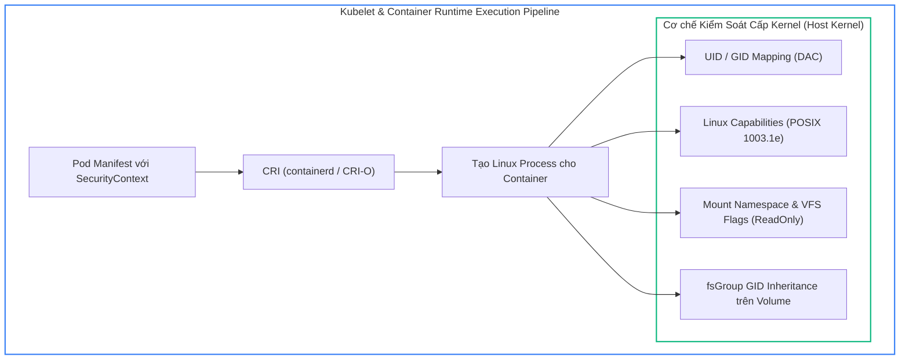
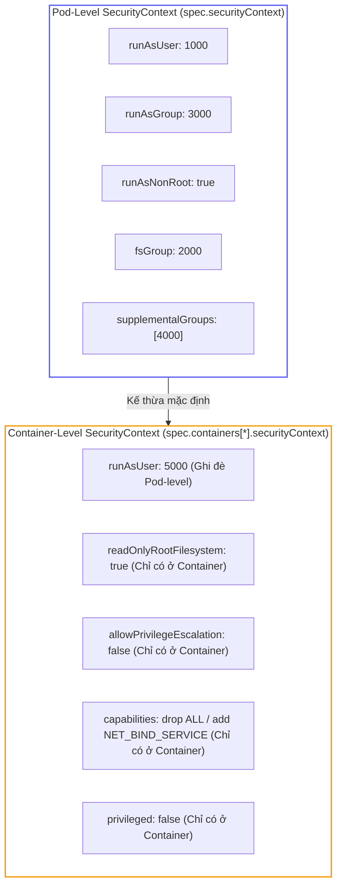
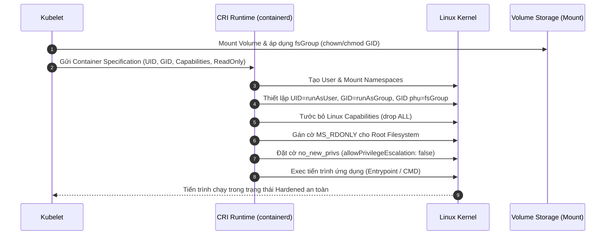
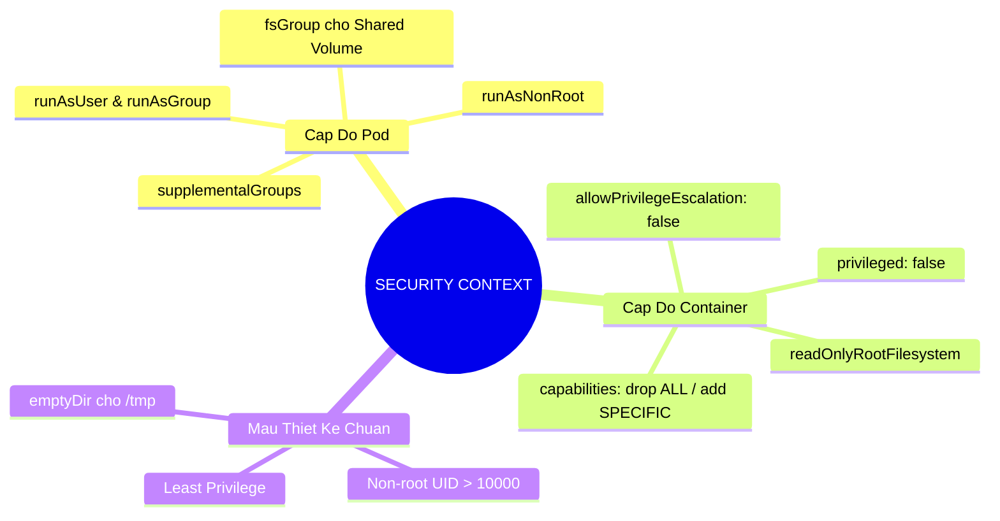


> [!IMPORTANT]
> **Mục tiêu kỹ thuật bài học**:
> - Hiểu rõ cách Linux Kernel thực thi kiểm soát an ninh (DAC, Capabilities, cgroups, namespaces) khi Container Runtime khởi tạo tiến trình.
> - Phân biệt chính xác phạm vi áp dụng của SecurityContext ở cấp độ Pod (Pod-wide) và Container (Container-specific).
> - Áp dụng hoàn hảo các chỉ thị `runAsNonRoot: true`, `runAsUser`, `runAsGroup`, `readOnlyRootFilesystem: true`, `capabilities` (`drop: ["ALL"]`, `add: [...]`) và `fsGroup`.
> - Nhận diện và xử lý các lỗi thường gặp trong kỳ thi CKAD như `CreateContainerConfigError`, `CrashLoopBackOff` do vi phạm quyền ghi tệp hoặc lắng nghe cổng đặc quyền.

---

## 1. Bản Chất Kiến Trúc & Tư Duy Cốt Lõi: Bảo Mật Ứng Dụng Với SecurityContext

Trong kiến trúc container của Linux, một container thực chất không phải là một máy ảo cô lập hoàn toàn mà là một **tiến trình (process) chạy trực tiếp trên nhân hệ điều hành Linux (Host Kernel)**, được bao bọc bởi các tính năng cách ly gồm **Namespaces** (cô lập tầm nhìn tiến trình, mạng, mount, IPC, UTS, user) và **Control Groups - cgroups** (giới hạn tài nguyên CPU, Memory, I/O).

Nếu không được cấu hình bảo mật chặt chẽ, một tiến trình chạy với quyền `UID 0 (root)` bên trong container sẽ sở hữu phần lớn đặc quyền tương đương với root trên máy chủ vật lý. Khi container bị tấn công khai thác lỗ hổng thực thi mã từ xa (RCE), kẻ tấn công có thể thoát khỏi vùng cách ly (Container Escape) và chiếm quyền điều khiển toàn bộ Node.

`SecurityContext` trong Kubernetes là lớp khai báo chính sách an ninh (Security Policy Abstraction) cho phép lập trình viên định nghĩa các ràng buộc và quyền hạn của tiến trình đối với Kernel trước khi container được khởi chạy.



### 1.1. Phân Cấp SecurityContext: Pod-Level vs Container-Level

Kubernetes cho phép định nghĩa `securityContext` ở hai vị trí trong YAML manifest:



1. **Pod-Level (`spec.securityContext`)**: Áp dụng chung cho tất cả các container (cả init containers và app containers) bên trong Pod. Các trường quan trọng:
   - `runAsUser`, `runAsGroup`, `runAsNonRoot`.
   - `fsGroup`: Thiết lập GID đặc biệt cho tất cả các Volume được mount vào Pod. Kubelet sẽ tự động thay đổi quyền sở hữu (chown/chmod) của volume sao cho tiến trình chạy dưới `fsGroup` có toàn quyền đọc/ghi.
   - `supplementalGroups`: Danh sách các GID phụ bổ sung cho tiến trình.
2. **Container-Level (`spec.containers[*].securityContext`)**: Áp dụng riêng cho container cụ thể. Các trường này có thể **ghi đè (override)** cấu hình của Pod-level và bổ sung các tính năng can thiệp sâu vào kernel:
   - `readOnlyRootFilesystem: true`: Khóa toàn bộ root filesystem của container thành chỉ đọc.
   - `allowPrivilegeEscalation: false`: Ngăn chặn tiến trình con giành thêm đặc quyền cao hơn tiến trình cha (chặn cờ `setuid`/`setgid` binary như `sudo`, `su`, `passwd`).
   - `capabilities`: Bổ sung (`add`) hoặc tước bỏ (`drop`) các đặc quyền hạt nhân Linux.
   - `privileged: true/false`: Chế độ đặc quyền tối cao (cấm tuyệt đối trong production trừ các daemon hệ thống mạng/lưu trữ).

---

## 2. Bảng Ma Trận So Sánh Kỹ Thuật Toàn Diện (Engineering Matrix)

| Tiêu chí Kỹ thuật | Pod-Level SecurityContext | Container-Level SecurityContext | Đánh Đổi & Khuyến Nghị Thực Chiến |
| :--- | :--- | :--- | :--- |
| **Vị trí khai báo** | `spec.securityContext` | `spec.containers[i].securityContext` | Pod-level dùng cho quy chuẩn toàn Pod; Container-level dùng cho tinh chỉnh chuyên biệt. |
| **`runAsUser` / `runAsGroup`** | Áp dụng cho mọi container nếu container không định nghĩa riêng | Ghi đè giá trị của Pod-level cho container cụ thể | Luôn chỉ định số nguyên dương UID/GID > 10000 để tránh trùng lặp với UID hệ thống của Host. |
| **`runAsNonRoot`** | Kiểm tra toàn bộ containers trong Pod | Kiểm tra riêng lẻ container | Nếu đặt `true` nhưng image chạy user `0` (root), Pod sẽ rơi vào lỗi `CreateContainerConfigError`. |
| **`readOnlyRootFilesystem`** | ❌ Không hỗ trợ ở cấp Pod | Có hỗ trợ (`true`/`false`) | Ngăn chặn malware ghi file nhị phân vào `/bin`, `/usr`. Cần mount `emptyDir` vào `/tmp` cho app. |
| **`capabilities`** | ❌ Không hỗ trợ ở cấp Pod | Có hỗ trợ (`drop: ['ALL']`, `add: [...]`) | Chuẩn bảo mật khắt khe: Luôn `drop: ['ALL']` trước, sau đó chỉ `add` các capability tối cần thiết. |
| **`allowPrivilegeEscalation`** | ❌ Không hỗ trợ ở cấp Pod | Có hỗ trợ (`false`/`true`) | Luôn đặt `false` để ngăn chặn các cuộc tấn công khai thác binary setuid (như CVE sudo/pkexec). |
| **`fsGroup`** | Có hỗ trợ (`fsGroup: 2000`) | ❌ Không hỗ trợ ở cấp Container | Giúp nhiều container trong Pod đọc/ghi chung PersistentVolume hoặc emptyDir mà không bị lỗi Permission Denied. |

---

## 3. Kiến Trúc Môi Trường & Luồng Thực Thi Mẫu

Khi Kubelet tiếp nhận một Pod có khai báo `SecurityContext`, quá trình khởi tạo container diễn ra qua một chuỗi các bước thiết lập bảo mật nghiêm ngặt tại tầng Linux Kernel:



### Manifest Mẫu: Hardened Microservice Đạt Chuẩn Production

```yaml
apiVersion: v1
kind: Pod
metadata:
  name: secure-order-service
  namespace: default
  labels:
    app: order-api
    tier: backend
spec:
  # 1. Pod-level SecurityContext: Áp dụng chung cho toàn Pod
  securityContext:
    runAsNonRoot: true
    runAsUser: 10001
    runAsGroup: 10001
    fsGroup: 20001
    seccompProfile:
      type: RuntimeDefault

  containers:
  - name: api-container
    image: nginxinc/nginx-unprivileged:alpine
    ports:
    - containerPort: 8080

    # 2. Container-level SecurityContext: Ghi đè & siết chặt bảo mật sâu
    securityContext:
      allowPrivilegeEscalation: false
      readOnlyRootFilesystem: true
      capabilities:
        drop:
        - ALL
        add:
        - NET_BIND_SERVICE

    # 3. Mount emptyDir để cung cấp vùng ghi tạm cho ứng dụng
    volumeMounts:
    - name: tmp-scratch
      mountPath: /tmp
    - name: cache-scratch
      mountPath: /var/cache/nginx
    - name: run-scratch
      mountPath: /var/run

  volumes:
  - name: tmp-scratch
    emptyDir: {}
  - name: cache-scratch
    emptyDir: {}
  - name: run-scratch
    emptyDir: {}
```

---

## 4. Phân Tích Cạm Bẫy Thực Chiến: "CrashLoopBackOff do Quyền Ghi và Root Injection"

### Tình Huống Thực Tế
Một nhóm phát triển triển khai ứng dụng Spring Boot / Node.js lên môi trường Kubernetes với yêu cầu tuân thủ tiêu chuẩn an ninh CIS Benchmark. Kỹ sư DevOps cấu hình thêm `readOnlyRootFilesystem: true` và `runAsNonRoot: true`. Tuy nhiên, ngay sau khi áp dụng, Pod rơi vào trạng thái `CrashLoopBackOff` và không thể phục vụ traffic.

### Hậu Quả & Log Lỗi Thực Tế:
```text
State:          Waiting
  Reason:       CrashLoopBackOff
Last State:     Terminated
  Reason:       Error
  Exit Code:    1
Events:
  Type     Reason     Age                From               Message
  ----     ------     ----               ----               -------
  Normal   Pulled     25s                kubelet            Successfully pulled image "app:v1.0"
  Normal   Created    24s                kubelet            Created container app
  Normal   Started    24s                kubelet            Started container app
  Warning  BackOff    10s (x2 over 22s)  kubelet            Back-off restarting failed container
```

Khi kiểm tra log của container (`kubectl logs secure-pod`):
```text
java.io.IOException: Read-only file system
	at java.io.File.createNewFile(File.java:1035)
	at org.apache.catalina.startup.Tomcat.start(Tomcat.java:380)
	at com.example.demo.DemoApplication.main(DemoApplication.java:25)
2026-09-12 14:05:10 ERROR: Cannot create /tmp/tomcat.8080/work or PID file in /var/run/app.pid
```

### 5-Whys Root Cause Analysis:
1. **Tại sao ứng dụng bị crash khi khởi động?** Do Tomcat/Node.js không thể tạo file tạm trong thư mục `/tmp` và file PID trong `/var/run`.
2. **Tại sao không tạo được file?** Do Kernel trả về lỗi `EROFS (Read-only file system)`.
3. **Tại sao file system là Read-only?** Do container được cấu hình `readOnlyRootFilesystem: true` trong SecurityContext.
4. **Tại sao không ghi được vào `/tmp` dù `/tmp` là thư mục tạm?** Khi `readOnlyRootFilesystem` được kích hoạt, toàn bộ VFS của container bị khóa cờ `MS_RDONLY`, bao gồm cả `/tmp` nếu nó không được mount từ một Volume riêng biệt.
5. **Giải pháp chuẩn:** Khai báo một `emptyDir` volume và mount trực tiếp vào các đường dẫn cần quyền ghi như `/tmp`, `/var/run`, `/var/cache`.

---

## 5. Hands-on Lab: Triển Khai & Gia Cố Ứng Dụng Với SecurityContext Toàn Diện (8 Bước)

| Bước | Mục Tiêu Kỹ Thuật | Lệnh Thực Hiện Chính |
| :--- | :--- | :--- |
| **1** | Khởi tạo Namespace Lab cô lập | `kubectl create ns ckad-sec-hard-lab` |
| **2** | Chạy Pod không an toàn (Root mặc định) | `kubectl apply -f 1-unsecure-pod.yaml` |
| **3** | Khảo sát UID/GID và Capabilities mặc định | `kubectl exec unsecure-pod -- id && pscap` |
| **4** | Triển khai Pod với `runAsNonRoot` & `runAsUser` | `kubectl apply -f 2-nonroot-pod.yaml` |
| **5** | Quan sát lỗi khi Image cố tình dùng user Root | `kubectl logs error-nonroot-pod` |
| **6** | Cấu hình `readOnlyRootFilesystem` kết hợp `emptyDir` | `kubectl apply -f 3-readonly-pod.yaml` |
| **7** | Tinh chỉnh Linux Capabilities (`drop ALL`, `add NET_BIND_SERVICE`) | `kubectl apply -f 4-capabilities-pod.yaml` |
| **8** | Quản lý quyền ghi Shared Volume qua `fsGroup` & Dọn dẹp | `kubectl apply -f 5-fsgroup-pod.yaml && kubectl delete ns` |

---

### Bước 1: Khởi Tạo Namespace Lab Cô Lập

```bash
kubectl create namespace ckad-sec-hard-lab
kubectl config set-context --current --namespace=ckad-sec-hard-lab
```

---

### Bước 2: Tạo Pod Không An Toàn (Chạy Root Mặc Định)

Tạo file `1-unsecure-pod.yaml`:
```yaml
apiVersion: v1
kind: Pod
metadata:
  name: unsecure-pod
spec:
  containers:
  - name: web
    image: busybox:1.36
    command: ["sleep", "3600"]
```
```bash
kubectl apply -f 1-unsecure-pod.yaml
kubectl wait --for=condition=ready pod/unsecure-pod --timeout=30s
```

---

### Bước 3: Khảo Sát Quyền Hạn Thực Tế Của Tiến Trình

```bash
# Kiểm tra User ID và Group ID bên trong container
kubectl exec unsecure-pod -- id
```
> Đầu ra hiển thị: `uid=0(root) gid=0(root) groups=0(root),10(wheel)`. Tiến trình đang chạy với quyền Root tuyệt đối, tiềm ẩn nguy cơ bảo mật nghiêm trọng.

---

### Bước 4: Triển Khai Pod An Toàn Với `runAsNonRoot` và `runAsUser`

Tạo file `2-nonroot-pod.yaml`:
```yaml
apiVersion: v1
kind: Pod
metadata:
  name: secure-nonroot-pod
spec:
  securityContext:
    runAsNonRoot: true
    runAsUser: 10005
    runAsGroup: 10005
  containers:
  - name: worker
    image: busybox:1.36
    command: ["sleep", "3600"]
```
```bash
kubectl apply -f 2-nonroot-pod.yaml
kubectl wait --for=condition=ready pod/secure-nonroot-pod --timeout=30s

# Kiểm tra lại UID
kubectl exec secure-nonroot-pod -- id
```
> Đầu ra hiển thị: `uid=10005 gid=10005 groups=10005`.

---

### Bước 5: Kiểm Chứng Cơ Chế Bắt Lỗi Khi Image Vi Phạm `runAsNonRoot`

Tạo file `3-invalid-root-pod.yaml` thử chạy image mà không chỉ định `runAsUser` (image mặc định chạy root):
```yaml
apiVersion: v1
kind: Pod
metadata:
  name: invalid-root-pod
spec:
  securityContext:
    runAsNonRoot: true
  containers:
  - name: root-app
    image: busybox:1.36
    command: ["sleep", "3600"]
```
```bash
kubectl apply -f 3-invalid-root-pod.yaml
sleep 3
kubectl get pod invalid-root-pod
```
> Kết quả: Pod báo lỗi `CreateContainerConfigError`.
> Dùng lệnh `kubectl describe pod invalid-root-pod` sẽ thấy thông báo:
> `Error: container has runAsNonRoot and image will run as root (uid 0)`.

---

### Bước 6: Cấu Hình `readOnlyRootFilesystem` Kết Hợp `emptyDir`

Tạo file `4-readonly-pod.yaml`:
```yaml
apiVersion: v1
kind: Pod
metadata:
  name: secure-readonly-pod
spec:
  containers:
  - name: app
    image: busybox:1.36
    command: ["sh", "-c", "echo 'data' > /tmp/test.txt && sleep 3600"]
    securityContext:
      readOnlyRootFilesystem: true
    volumeMounts:
    - name: writable-scratch
      mountPath: /tmp
  volumes:
  - name: writable-scratch
    emptyDir: {}
```
```bash
kubectl apply -f 4-readonly-pod.yaml
kubectl wait --for=condition=ready pod/secure-readonly-pod --timeout=30s

# Thử ghi file vào thư mục gốc / (sẽ bị lỗi Read-only)
kubectl exec secure-readonly-pod -- touch /root-file.txt || echo "Blocked by ReadOnlyRootFilesystem!"

# Ghi file vào /tmp (thành công nhờ emptyDir)
kubectl exec secure-readonly-pod -- cat /tmp/test.txt
```

---

### Bước 7: Quản Trị Linux Capabilities (`drop ALL`, `add NET_BIND_SERVICE`)

Tạo file `5-capabilities-pod.yaml`:
```yaml
apiVersion: v1
kind: Pod
metadata:
  name: secure-cap-pod
spec:
  containers:
  - name: proxy
    image: nginx:alpine
    securityContext:
      allowPrivilegeEscalation: false
      capabilities:
        drop:
        - ALL
        add:
        - NET_BIND_SERVICE
        - CHOWN
        - SETGID
        - SETUID
```
```bash
kubectl apply -f 5-capabilities-pod.yaml
kubectl wait --for=condition=ready pod/secure-cap-pod --timeout=30s
kubectl get pod secure-cap-pod
```

---

### Bước 8: Quản Trị Phân Quyền Volume Qua `fsGroup` & Dọn Dẹp

Tạo file `6-fsgroup-pod.yaml`:
```yaml
apiVersion: v1
kind: Pod
metadata:
  name: secure-fsgroup-pod
spec:
  securityContext:
    runAsUser: 10001
    runAsGroup: 10001
    fsGroup: 20002
  containers:
  - name: writer
    image: busybox:1.36
    command: ["sh", "-c", "echo 'shared log' > /data/app.log && sleep 3600"]
    volumeMounts:
    - name: shared-storage
      mountPath: /data
  volumes:
  - name: shared-storage
    emptyDir: {}
```
```bash
kubectl apply -f 6-fsgroup-pod.yaml
kubectl wait --for=condition=ready pod/secure-fsgroup-pod --timeout=30s

# Kiểm tra quyền sở hữu group của file vừa tạo trong volume
kubectl exec secure-fsgroup-pod -- ls -ln /data/app.log
```
> Đầu ra hiển thị GID sở hữu file chính xác là `20002` (do `fsGroup` áp đặt), giúp bất kỳ container nào khác trong Pod thuộc group `20002` đều đọc/ghi file này được.

```bash
# Dọn dẹp môi trường lab
kubectl delete ns ckad-sec-hard-lab
```

---

## 6. 10 Câu Hỏi Tự Kiểm Tra Chuyên Sâu (Self-Check Q&A Accordion)

<details class="qa-card">
<summary><b>1. Sự khác biệt cơ bản giữa `runAsUser` đặt ở cấp độ Pod (`spec.securityContext`) và cấp độ Container (`spec.containers[*].securityContext`) là gì?</b></summary>
<div class="qa-answer">
<p><code>runAsUser</code> ở cấp <b>Pod</b> thiết lập UID mặc định cho toàn bộ các container (gồm cả init container và app container). Nếu một container cụ thể định nghĩa riêng <code>runAsUser</code> ở cấp <b>Container</b>, giá trị này sẽ <b>ghi đè (override)</b> cấu hình ở cấp Pod cho duy nhất container đó.</p>
</div>
</details>

<details class="qa-card">
<summary><b>2. Tại sao cấu hình `runAsNonRoot: true` lại dẫn đến lỗi `CreateContainerConfigError` trên một số Container Images?</b></summary>
<div class="qa-answer">
<p>Khi bật <code>runAsNonRoot: true</code>, Kubelet kiểm tra metadata của Image xem tiến trình có chạy dưới UID 0 (Root) hay không. Nếu Dockerfile không chỉ định lệnh <code>USER &lt;uid&gt;</code> và Pod manifest cũng không cấu hình <code>runAsUser</code> với một số nguyên dương khác 0, Kubelet sẽ chặn khởi động container ngay lập tức để đảm bảo an toàn.</p>
</div>
</details>

<details class="qa-card">
<summary><b>3. Mục đích chính của trường `fsGroup` trong SecurityContext là gì?</b></summary>
<div class="qa-answer">
<p><code>fsGroup</code> định nghĩa một <b>Group ID (GID) bổ sung</b> cho Pod. Khi Volume được mount vào Pod, Kubelet sẽ tự động thay đổi quyền sở hữu (ownership) của Volume để group GID đó có toàn quyền đọc/ghi (POSIX group permission), giúp các tiến trình non-root đọc ghi được dữ liệu trên Shared Volume.</p>
</div>
</details>

<details class="qa-card">
<summary><b>4. Khi thiết lập `readOnlyRootFilesystem: true`, làm thế nào để ứng dụng có thể ghi log hoặc lưu file tạm mà không bị lỗi crash?</b></summary>
<div class="qa-answer">
<p>Khai báo các Volume tạm dạng <b><code>emptyDir: {}</code></b> trong Pod spec và mount chúng vào đúng các đường dẫn mà ứng dụng cần ghi tệp tin (ví dụ <code>/tmp</code>, <code>/var/run</code>, <code>/var/log</code>). Các thư mục mount này sẽ có quyền ghi bình thường trong khi toàn bộ phần còn lại của Root Filesystem vẫn được bảo vệ chỉ đọc.</p>
</div>
</details>

<details class="qa-card">
<summary><b>5. Ý nghĩa của cờ `allowPrivilegeEscalation: false` trong Container SecurityContext là gì?</b></summary>
<div class="qa-answer">
<p>Cờ này thiết lập thuộc tính hạt nhân <b><code>no_new_privs</code></b> của Linux. Nó ngăn chặn tiến trình con giành thêm đặc quyền cao hơn tiến trình cha, vô hiệu hóa hoàn toàn cơ chế của các tệp nhị phân có cờ <code>setuid</code>/<code>setgid</code> (như <code>sudo</code>, <code>su</code>, <code>chsh</code>), ngăn chặn việc leo thang đặc quyền trong container.</p>
</div>
</details>

<details class="qa-card">
<summary><b>6. Cú pháp chuẩn để tước bỏ toàn bộ đặc quyền Linux mặc định và chỉ thêm quyền bind cổng &lt; 1024 là gì?</b></summary>
<div class="qa-answer">
<pre><code>securityContext:
  capabilities:
    drop: ["ALL"]
    add: ["NET_BIND_SERVICE"]</code></pre>
</div>
</details>

<details class="qa-card">
<summary><b>7. Linux Capability `CAP_NET_ADMIN` cho phép tiến trình container làm những công việc gì?</b></summary>
<div class="qa-answer">
<p><code>CAP_NET_ADMIN</code> cho phép tiến trình thực hiện các tác vụ quản trị mạng nâng cao như: cấu hình card mạng (interfaces), thiết lập bảng định tuyến (routing tables), cấu hình tường lửa <code>iptables</code>/<code>nftables</code>, và quản lý các giao diện IPsec/VPN.</p>
</div>
</details>

<details class="qa-card">
<summary><b>8. Trường `privileged: true` trong SecurityContext có những rủi ro an ninh gì?</b></summary>
<div class="qa-answer">
<p>Khi bật <code>privileged: true</code>, container được cấp <b>gần như toàn bộ quyền hạn tương đương tiến trình trên Host OS</b>, vô hiệu hóa mọi cơ chế cách ly của AppArmor/Seccomp và có quyền truy cập trực tiếp vào tất cả các thiết bị phần cứng trong <code>/dev</code> của Host. Kẻ tấn công có thể dễ dàng thoát khỏi container và chiếm quyền điều khiển Node.</p>
</div>
</details>

<details class="qa-card">
<summary><b>9. Làm thế nào để kiểm tra User ID thực tế đang chạy bên trong một Container đang hoạt động?</b></summary>
<div class="qa-answer">
<p>Sử dụng lệnh: <code>kubectl exec &lt;pod-name&gt; -c &lt;container-name&gt; -- id</code> để xem UID, GID và danh sách các groups mà tiến trình đang trực thuộc.</p>
</div>
</details>

<details class="qa-card">
<summary><b>10. Sự khác biệt giữa `supplementalGroups` và `fsGroup` trong cấu hình Pod SecurityContext là gì?</b></summary>
<div class="qa-answer">
<p><b>fsGroup:</b> Vừa thêm GID vào danh sách nhóm của tiến trình, vừa <b>tự động thay đổi quyền sở hữu (chown) trên các Volume được mount</b>.</p>
<p><b>supplementalGroups:</b> Chỉ bổ sung thêm các GID vào danh sách nhóm bổ sung của tiến trình để kiểm tra quyền truy cập (DAC) mà <b>không làm thay đổi quyền sở hữu của các Volume</b>.</p>
</div>
</details>

---

## 7. Tổng Kết & Lộ Trình Bài Học Tiếp Theo



Làm chủ `SecurityContext` giúp lập trình viên ứng dụng xây dựng các microservices tuân thủ nguyên tắc Zero-Trust và Least Privilege, triệt tiêu tối đa rủi ro Container Escape trên hạ tầng Kubernetes.

> [!TIP]
> **Bài học tiếp theo**: Tìm hiểu cách quản trị hạn ngạch tài nguyên và thiết lập phân hạng chất lượng dịch vụ với **[Bài 12: Quản Trị Hạn Ngạch & Phân Hạng Tài Nguyên: ResourceQuota, LimitRange & QoS](ckad-12-12-resource-quota-limitrange.html)**.

