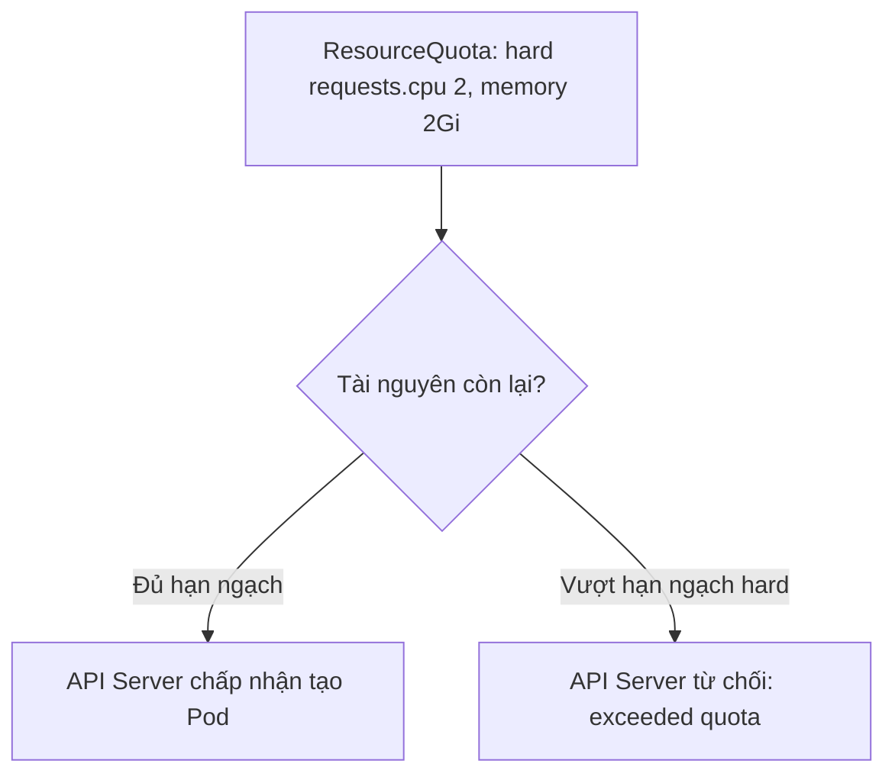
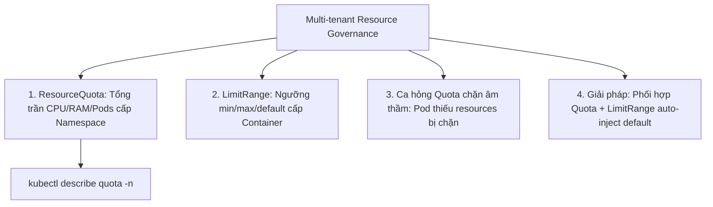
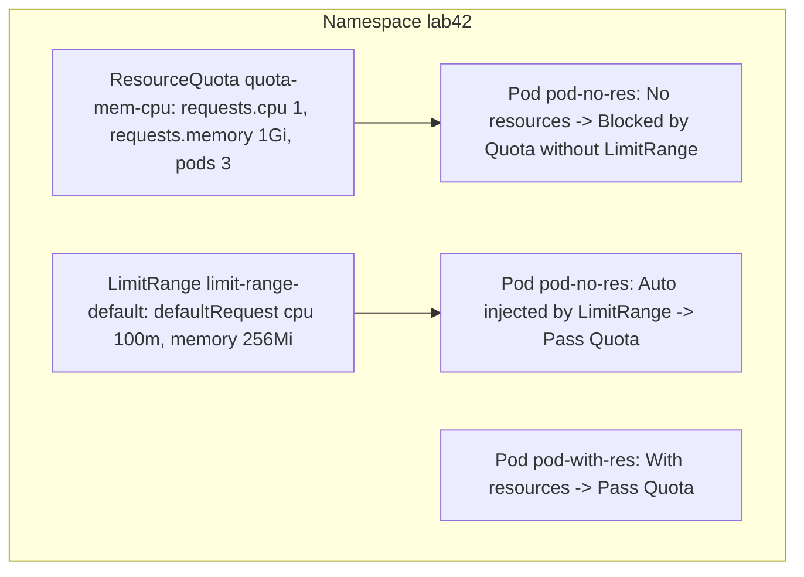


# [BÀI 12] QUẢN LÝ TÀI NGUYÊN ĐA ỨNG DỤNG: RESOURCEQUOTA, LIMITRANGE & KHẮC PHỤC HIỆN TƯỢNG QUOTA CHẶN ÂM THẦM

Trong kỷ nguyên điện toán đám mây và kiến trúc microservices phân tán quy mô lớn, **Kubernetes (CKAD)** đóng vai trò là nền tảng điều phối container (Container Orchestration) tiêu chuẩn công nghiệp. Để làm chủ hệ thống trong môi trường sản xuất (Production) cũng như chinh phục kỳ thi chứng chỉ quốc tế của Linux Foundation / CNCF, kỹ sư không chỉ nắm vững các câu lệnh thao tác cơ bản mà phải thấu hiểu sâu sắc bản chất cơ chế tầng thấp: từ chu trình điều hòa (Reconciliation Loop), cấu trúc điều phối tài nguyên, kiến trúc mạng CNI, lưu trữ CSI cho đến các chuẩn mực an ninh phòng thủ chiều sâu.

Bài viết chuyên sâu này sẽ đồng hành cùng bạn giải mã toàn diện bức tranh kiến trúc, phân tích các đánh đổi kỹ thuật thực chiến (Engineering Trade-offs), cung cấp bài thực hành Lab từng bước và bộ câu hỏi phỏng vấn chuẩn Architect / Lead Engineer.

---

## 1. Bản Chất Kiến Trúc & Cơ Chế Vận Hành Tầng Thấp

| # | Câu hỏi ôn tập | Đáp án chuẩn ngắn gọn |
|---|---|---|
| 1 | Cờ thuộc tính cấm chạy root trong SecurityContext? | **`runAsNonRoot: true`** |
| 2 | Cờ chỉ định UID của tài khoản Linux chạy tiến trình? | **`runAsUser: 1000`** |
| 3 | Cờ khóa hệ thống tệp đĩa gốc container ở chế độ chỉ đọc? | **`readOnlyRootFilesystem: true`** |
| 4 | Cú pháp tước bỏ 100% Linux capabilities kernel mặc định? | **`capabilities.drop: ["ALL"]`** |
| 5 | Cờ gán quyền sở hữu Volume tự động cho tài khoản non-root? | **`fsGroup: 2000`** trong Pod spec |


> **"Quản lý hạn ngạch và giới hạn tài nguyên đa người dùng (Multi-tenant Resource Governance) là nội dung thuộc miền Application Environment, Configuration and Security trong CKAD, đòi hỏi lập trình viên phải phân biệt rõ phạm vi quản lý của `ResourceQuota` (thiết lập tổng trần CPU/RAM/Object count cho toàn bộ Namespace) và `LimitRange` (thiết lập ngưỡng min/max và giá trị mặc định default/defaultRequest cho từng Container); đồng thời xử lý triệt để ca hỏng 'Quota chặn âm thầm' (khi Namespace có ResourceQuota bắt buộc 100% các Pod khởi tạo phải khai báo đầy đủ `requests` và `limits`, nếu không sẽ bị Kubernetes API Server từ chối ngay từ vòng gửi xe) bằng cách kết hợp với `LimitRange` tự động bổ sung giá trị mặc định."**

**Kết quả từ các buổi trước được sử dụng lại:**

| Kết quả / Công cụ | Buổi + số hiệu `QT` | Dùng ở đâu trong buổi này |
|---|---|---|
| Cấu hình `requests` và `limits` tài nguyên | Buổi 21 `QT 4.1` | Khai báo đủ requests/limits để vượt qua kiểm tra của ResourceQuota |
| Quan sát mức tiêu thụ tài nguyên thực tế | Buổi 39 `QT 4.1` | Đối sánh mức tiêu thụ từ `kubectl top` với ngưỡng ResourceQuota |
| Xử lý trạng thái Pod bị Pending | Buổi 14 `QT 4.1` | Chẩn đoán nguyên nhân Pod bị Pending do dính trần Quota |

---


| # | Kỹ năng thực hiện được | Hiện vật chứng minh |
|---|---|---|
| 1 | Biên soạn và áp đặt tổng hạn ngạch tài nguyên CPU/RAM/Pods cho Namespace | Tệp ResourceQuota YAML có thuộc tính `hard` |
| 2 | Thiết lập ngưỡng min/max và giá trị mặc định cho Container qua LimitRange | Tệp LimitRange YAML chứa `default` và `defaultRequest` |
| 3 | Chẩn đoán và giải quyết ca hỏng "Quota chặn âm thầm" khi Pod bị từ chối | Thông điệp sửa lỗi `must specify cpu` thành công |
| 4 | Kiểm tra bảng đối soát mức tài nguyên đã dùng qua `kubectl describe quota` | Nhật ký lệnh `kubectl describe quota -n <ns>` |
| 5 | Quy hoạch hệ thống hạn ngạch tài nguyên chuẩn cho môi trường Multi-tenant | Bộ đôi tệp YAML ResourceQuota + LimitRange cho Namespace |

---


| Kiến thức tiên quyết | Nguồn tự học nếu thiếu |
|---|---|
| Khai báo tài nguyên requests và limits trong Pod spec | Buổi 21 (`QT 4.1`) |
| Phân chia không gian tên Namespace trong cụm | Buổi 18 (`QT 4.1`) |
| Kiểm tra mức tiêu thụ CPU/RAM qua kubectl top | Buổi 39 (`QT 4.1`) |

---


### 3.1. Thuật ngữ Việt–Anh

| # | Thuật ngữ tiếng Việt | Tiếng Anh tương đương | Ghi chú chuẩn hoá trong thân bài |
|---|---|---|---|
| 1 | Hạn ngạch tài nguyên | ResourceQuota | Đối tượng đặt tổng trần tài nguyên CPU/RAM/Pods cho Namespace |
| 2 | Giới hạn khoảng tài nguyên | LimitRange | Đối tượng đặt ngưỡng min/max/default CPU/RAM cho từng Pod/Container |
| 3 | Ngưỡng trần tối đa | Hard Limit (`hard`) | Tổng tài nguyên tối đa cho phép trong ResourceQuota |
| 4 | Mức tài nguyên đã dùng | Used Resource (`used`) | Tổng tài nguyên hiện đang được các Pod trong Namespace chiếm dụng |
| 5 | Giá trị mặc định khi thiếu | Default Value (`default` / `defaultRequest`) | Giá trị CPU/RAM tự động tiêm vào nếu Pod không khai báo |
| 6 | Ngưỡng nhỏ nhất / lớn nhất | Min / Max Bounds | Ngưỡng CPU/RAM nhỏ nhất và lớn nhất cho phép của 1 Container |
| 7 | Giới hạn số lượng đối tượng | Object Count Quota (`pods`, `services`) | Hạn ngạch khống chế tổng số lượng Pod, Service, PVC trong Namespace |
| 8 | Sự cố Quota chặn âm thầm | Silent Quota Rejection | Lỗi API Server từ chối Pod do thiếu requests/limits khi có Quota |
| 9 | Đa người dùng trên cụm | Multi-tenancy | Mô hình chia sẻ cụm K8s cho nhiều đội ngũ qua các Namespace độc lập |
| 10 | Tỷ lệ ép tài nguyên | Overcommit Ratio | Tỷ lệ tổng Limits vượt quá tài nguyên thực tế của Node |
| 11 | Phân bổ tài nguyên | Resource Allocation | Quá trình API Server tính toán và trừ bớt hạn ngạch Quota |
| 12 | Khối lượng lưu trữ hạn ngạch | Storage Quota (`requests.storage`) | Hạn ngạch khống chế tổng dung lượng đĩa PVC trong Namespace |
| 13 | Lớp dịch vụ tài nguyên | Quality of Service (QoS) | Phân loại Guaranteed, Burstable, BestEffort dựa trên requests/limits |
| 14 | Kiểm tra điều kiện Admission | Admission Control (`ResourceQuota Plugin`) | Bộ lọc API Server kiểm tra Quota trước khi lưu đối tượng |


Mô hình Hạn mức Thẻ Tín dụng gia đình và Quy định Khẩu phần Ăn: `ResourceQuota` giống như Hạn mức Thẻ tín dụng 50 triệu/tháng của cả gia đình Namespace (tổng số tiền tiêu của tất cả các thành viên Pod không được vượt quá 50 triệu). `LimitRange` giống như Quy định khẩu phần ăn của từng thành viên (mỗi bữa tối thiểu phải ăn 1 bát cơm `min`, tối đa không quá 5 bát `max`, và nếu không gọi món thì tự động dọn ra 2 bát `default`).

---

### 1.1. ResourceQuota: Quản lý tổng hạn ngạch cấp Namespace (12 phút)

**Nguyên lý cốt lõi:** `ResourceQuota` quản lý tổng hạn ngạch tài nguyên (CPU, RAM, số lượng Pods/Services/PVCs) ở cấp Namespace; khi tổng `requests` hoặc `limits` của các Pod đạt ngưỡng `hard`, API Server sẽ từ chối tạo thêm Pod mới.

**Giải thích cơ chế ngầm:** Giúp bảo vệ cụm Kubernetes khỏi nguy cơ bị 1 Namespace duy nhất (như môi trường Dev) ngốn cạn kiệt tài nguyên của toàn bộ cụm, gây ảnh hưởng đến các Namespace Production quan trọng khác.

> [!WARNING]
> **CẠM BẪY THỰC CHIẾN:**
> Không đặt ResourceQuota làm cho một Pod bị lỗi ngốn 100% CPU/RAM của Node khiến các Pod khác bị rớt hàng loạt.

**Minh hoạ.**



**Nguyên lý cốt lõi:** Ngay khi một Namespace có áp dụng `ResourceQuota` cho CPU/RAM, BẮT BUỘC tất cả các Pod triển khai vào Namespace đó phải khai báo đầy đủ `requests` và `limits` (hoặc phải có `LimitRange` tự động bổ sung), nếu không API Server sẽ chặn ngay lập tức.

**Giải thích cơ chế ngầm:** Để trừ bớt tài nguyên vào tổng hạn ngạch Quota, API Server bắt buộc phải biết con số `requests`/`limits` chính xác của từng Pod. Nếu Pod không khai báo con số, API Server không thể tính toán được dung lượng còn lại và bắt buộc phải từ chối.

> [!WARNING]
> **CẠM BẪY THỰC CHIẾN:**
> Chạy lệnh `kubectl apply` triển khai Pod không có khối `resources` vào Namespace có Quota và bị báo lỗi `is forbidden: failed quota: ... must specify cpu for: ...`.

**Minh hoạ.**

```yaml
apiVersion: v1
kind: ResourceQuota
metadata:
  name: quota-demo
  namespace: prod
spec:
  hard:
    requests.cpu: "2"
    requests.memory: 2Gi
    limits.cpu: "4"
    limits.memory: 4Gi
    pods: "10"
```

---

### 1.2. LimitRange: Quản lý ngưỡng min/max và default cho Container (12 phút)

**Nguyên lý cốt lõi:** `LimitRange` áp đặt các quy tắc tài nguyên ở cấp Container và Pod riêng lẻ (gồm `max`, `min`, `default`, `defaultRequest`); giúp ngăn ngừa trường hợp 1 Pod duy nhất xin quá nhiều tài nguyên ngốn sạch Quota của Namespace.

**Giải thích cơ chế ngầm:** ResourceQuota chỉ kiểm soát tổng cộng tài nguyên của toàn Namespace. Nếu không có `LimitRange`, một Pod duy nhất có thể xin `requests.memory: 10Gi` chiếm trọn toàn bộ Quota của 10 Pod khác.

> [!WARNING]
> **CẠM BẪY THỰC CHIẾN:**
> Một Pod duy nhất xin 90% Quota của Namespace làm các Pod khác trong cùng team không còn dung lượng để triển khai.

**Minh hoạ.**

```yaml
apiVersion: v1
kind: LimitRange
metadata:
  name: limit-mem-cpu-per-container
  namespace: prod
spec:
  limits:
    - type: Container
      max:
        cpu: "1"
        memory: 1Gi
      min:
        cpu: 50m
        memory: 32Mi
      default:
        cpu: 200m
        memory: 512Mi
      defaultRequest:
        cpu: 100m
        memory: 256Mi
```

**Nguyên lý cốt lõi:** Thuộc tính `default` trong `LimitRange` định nghĩa giá trị `limits` mặc định; thuộc tính `defaultRequest` định nghĩa giá trị `requests` mặc định cho bất kỳ container nào không tự khai báo trong file YAML.

**Giải thích cơ chế ngầm:** Tự động tiêm thông số tài nguyên chuẩn cho các lập trình viên lỡ quên không viết khối `resources` trong tệp YAML, đảm bảo Pod vẫn đáp ứng điều kiện của ResourceQuota và khởi chạy bình thường.

> [!WARNING]
> **CẠM BẪY THỰC CHIẾN:**
> Không khai báo `default` và `defaultRequest` trong LimitRange làm cho tệp YAML thiếu resources bị API Server từ chối.

**Minh hoạ.**

```bash
# Khi apply Pod không có resources vào Namespace có LimitRange:
# LimitRange sẽ tự động tiêm:
# resources:
#   requests: {cpu: 100m, memory: 256Mi}
#   limits: {cpu: 200m, memory: 512Mi}
```

---

### 1.3. Ca hỏng "Quota chặn âm thầm" và kỹ thuật phối hợp Quota + LimitRange (10 phút)

**Nguyên lý cốt lõi:** Ca hỏng "Quota chặn âm thầm": Khi gõ `kubectl apply -f pod.yaml` bị báo lỗi `is forbidden: failed quota: ... must specify cpu for: app...`, nguyên nhân là do Namespace có ResourceQuota nhưng Pod YAML thiếu khối `resources.requests/limits`.

**Giải thích cơ chế ngầm:** Lập trình viên mới thường chỉ viết tệp YAML Pod đơn giản không có khối `resources`. Khi triển khai vào Namespace Production có bật ResourceQuota, API Server sẽ chặn ngay lập tức và trả về thông điệp lỗi khó hiểu làm gián đoạn CI/CD pipeline.

> [!WARNING]
> **CẠM BẪY THỰC CHIẾN:**
> Đường ống CI/CD bị fail âm thầm do API Server trả về lỗi `must specify cpu` mà không rõ lý do.

**Minh hoạ.**

```bash
# Thông điệp lỗi ca hỏng Quota chặn âm thầm:
# Error from server (Forbidden): pods "my-app" is forbidden: failed quota: mem-cpu-quota: 
# must specify cpu for: app; must specify memory for: app
```

**Nguyên lý cốt lõi:** Giải pháp chuẩn nhất để khắc phục triệt để ca hỏng "Quota chặn âm thầm" cho toàn bộ team là triển khai một `LimitRange` song song với `ResourceQuota` trong cùng Namespace để tự động tiêm giá trị mặc định cho các tệp YAML thiếu.

**Giải thích cơ chế ngầm:** Giúp bộ phận DevOps không phải đi sửa thủ công hàng trăm tệp YAML của lập trình viên. `LimitRange` hoạt động như một Admission Webhook tự động bổ sung giá trị thiếu trước khi tệp được lưu vào etcd.

> [!WARNING]
> **CẠM BẪY THỰC CHIẾN:**
> Đi sửa thủ công từng tệp YAML trong repository để thêm `resources` thay vì áp dụng `LimitRange` mặc định cho Namespace.

**Minh hoạ.**

```bash
# Bộ đôi tệp YAML chuẩn cho mọi Namespace Production:
# 1. resource-quota.yaml (Quản lý tổng trần Namespace)
# 2. limit-range.yaml (Tiêm giá trị mặc định cho từng Container)
```

**Nguyên lý cốt lõi:** Sử dụng lệnh `kubectl describe quota -n <namespace>` để kiểm tra chi tiết bảng đối soát giữa cột `Used` (đã dùng) và cột `Hard` (hạn ngạch tối đa) để chẩn đoán lý do Pod bị Pending.

**Giải thích cơ chế ngầm:** Khi một Deployment không thể scale thêm Pod và Pod kẹt ở trạng thái `Pending`, lệnh `kubectl describe quota` cho biết chính xác tài nguyên nào (CPU, RAM hay Pod count) đã chạm trần `Hard`.

> [!WARNING]
> **CẠM BẪY THỰC CHIẾN:**
> Pod kẹt `Pending` không biết do thiếu RAM trên Node hay do dính trần Quota ở Namespace.

**Minh hoạ.**

```bash
# Kiểm tra bảng đối soát Quota:
kubectl describe quota -n prod
# Kết quả mẫu:
# Resource     Used  Hard
# --------     ----  ----
# pods         10    10   <-- ĐÃ CHẠM TRẦN PODS!
# requests.cpu 1500m 2000m
```

---

### 1.4. Đưa vào cụm thật (4 phút)

**Nguyên lý cốt lõi:** Trên môi trường Production đa người dùng (Multi-tenant), luôn áp đặt bộ đôi `ResourceQuota` + `LimitRange` cho 100% các Namespace nghiệp vụ để đảm bảo tính cô lập và công bằng tài nguyên.

**Giải thích cơ chế ngầm:** Đảm bảo không một đội ngũ hay dự án nào có thể vô tình hoặc cố ý kéo sập toàn bộ cụm Kubernetes chung của công ty.

> [!WARNING]
> **CẠM BẪY THỰC CHIẾN:**
> Để một Namespace nghiệp vụ không có Quota làm cho tiến trình container bị rò rỉ bộ nhớ ngốn kiệt tài nguyên của toàn cụm.

**Minh hoạ.**

```yaml
# Bộ đôi tệp YAML áp dụng cho mọi Namespace Multi-tenant:
# ResourceQuota (quota-prod.yaml) + LimitRange (limits-prod.yaml)
```

**Áp vào cụm đang chạy thì làm gì trước:**
1. Tạo `LimitRange` trước để tiêm sẵn giá trị `defaultRequest` cho các Pod hiện hữu.
2. Đo đạc tổng mức tiêu thụ tài nguyên thực tế của Namespace qua `kubectl top pods -n <ns>`.
3. Khởi tạo `ResourceQuota` với ngưỡng `hard` cao hơn 20% so với tổng tiêu thụ thực tế.

**Cái gì hỏng nếu áp thẳng lên prod:**
- Đặt `ResourceQuota` có ngưỡng `hard` thấp hơn mức tài nguyên đang chạy sẽ chặn không cho Deployment thực hiện RollingUpdate (do RollingUpdate tạo tạm Pod mới làm vượt Quota).

**Đo trước — đo sau:**
- Đo tổng số Pods và tổng CPU/RAM requests trong Namespace qua `kubectl describe quota`.
- Theo dõi các sự kiện `ExceededQuota` trong nhật ký `kubectl get events`.

**Khi nào KHÔNG nên dùng:**
- Không dùng `ResourceQuota` cho các Namespace hệ thống lõi (như `kube-system` hay `ingress-nginx`) để tránh làm gián đoạn hạ tầng chung.

---

### 1.5. Bẫy hay gặp (2 phút)

| Bẫy hay gặp | Vì sao dính | Làm đúng là |
|---|---|---|
| 1. Pod bị chặn `must specify cpu` khi Namespace có Quota | Pod YAML thiếu khối `resources.requests/limits` | Bổ sung `resources` hoặc tạo `LimitRange` mặc định |
| 2. Deployment không RollingUpdate được do dính Quota pods | Cờ `maxSurge` tạo thêm Pod mới làm vượt trần `pods` | Tăng trần `pods` trong Quota hoặc giảm `maxSurge: 0` |
| 3. Đặt LimitRange `min` lớn hơn `max` | Khai báo sai logic ngưỡng nhỏ nhất/lớn nhất | Kiểm tra đảm bảo `min <= default <= max` |
| 4. Đặt ResourceQuota `hard` nhỏ hơn tài nguyên đang chạy | Không đo đạc dung lượng Namespace trước | Kiểm tra `kubectl top pods` trước khi đặt Quota |
| 5. Quên cờ `-n <namespace>` khi describe quota | Describe Quota ở Namespace `default` | Luôn thêm cờ `-n <namespace>` chính xác |
| 6. Nhầm lẫn giữa `ResourceQuota` và `LimitRange` | Khái niệm quản lý tài nguyên cấp Namespace vs Pod | Quota = Cấp Namespace; LimitRange = Cấp Container |
| 7. Pod bị Pending tưởng do thiếu RAM Node | Thực chất chạm trần `limits.memory` của ResourceQuota | Chạy `kubectl describe quota` để xác nhận lý do |
| 8. Đặt ResourceQuota cho Namespace `kube-system` | Làm gián đoạn các addon hệ thống khi scale | Tránh đặt Quota cho `kube-system` |
| 9. Gõ sai từ khóa `requests.cpu` thành `request.cpu` | Từ khóa Quota spec phân biệt số nhiều | Luôn dùng số nhiều: `requests.cpu` và `limits.memory` |
| 10. `LimitRange` không áp dụng cho Pod đã chạy trước đó | LimitRange chỉ tác động lên Pod MỚI khởi tạo | Restart Deployment để tiêm LimitRange cho Pod mới |
| 11. Nhầm đơn vị `1Gi` thành `1G` | `Gi` là Gibibytes ($1024^3$); `G` là Gigabytes ($1000^3$) | Dùng chuẩn `Gi` và `Mi` cho dung lượng K8s |
| 12. Không đặt Quota số lượng `persistentvolumeclaims` | User tạo tràn lan PVC ngốn cạn ổ đĩa StorageClass | Khống chế thêm `persistentvolumeclaims` trong Quota |

---

### 1.6. Tóm tắt (2 phút)



**Năm điều phải nhớ:**
1. **ResourceQuota**: Quản lý tổng trần tài nguyên CPU/RAM/Object count ở cấp Namespace.
2. **LimitRange**: Quản lý min/max và tiêm giá trị `default`/`defaultRequest` ở cấp Container.
3. **Ca hỏng Quota chặn âm thầm**: Xuất hiện khi Namespace có Quota nhưng Pod YAML thiếu `resources`.
4. **Giải pháp phối hợp**: Luôn tạo `LimitRange` đi kèm `ResourceQuota` để tự động tiêm giá trị mặc định.
5. **Chẩn đoán CLI**: Dùng `kubectl describe quota -n <ns>` để đối soát cột `Used` vs `Hard`.

---

## §10. Câu hỏi tự kiểm tra (5 phút)


<details class="qa-card">
<summary class="qa-summary">
  <div class="qa-summary-left">
    <span class="qa-num-badge">Q01</span>
    <span>Sự khác biệt chính về phạm vi quản lý giữa `ResourceQuota` và `LimitRange` trong Kubernetes là gì?</span>
  </div>
  <span class="qa-chevron">
    <svg width="18" height="18" fill="none" stroke="currentColor" stroke-width="2.5" viewBox="0 0 24 24"><polyline points="6 9 12 15 18 9"></polyline></svg>
  </span>
</summary>
<div class="qa-answer">
  <div class="qa-answer-header">
    <svg width="14" height="14" fill="none" stroke="currentColor" stroke-width="2" viewBox="0 0 24 24"><path d="M22 11.08V12a10 10 0 1 1-5.93-9.14"></path><polyline points="22 4 12 14.01 9 11.01"></polyline></svg>
    <span>Phân Tích &amp; Lời Giải Kỹ Thuật</span>
  </div>
  `ResourceQuota` quản lý tổng trần tài nguyên ở cấp Namespace; `LimitRange` quản lý ngưỡng min/max và giá trị mặc định ở cấp Container/Pod.
</div>
</details>

<details class="qa-card">
<summary class="qa-summary">
  <div class="qa-summary-left">
    <span class="qa-num-badge">Q02</span>
    <span>Điều gì xảy ra khi bạn triển khai một tệp YAML Pod KHÔNG khai báo khối `resources` vào một Namespace đang có `ResourceQuota`?</span>
  </div>
  <span class="qa-chevron">
    <svg width="18" height="18" fill="none" stroke="currentColor" stroke-width="2.5" viewBox="0 0 24 24"><polyline points="6 9 12 15 18 9"></polyline></svg>
  </span>
</summary>
<div class="qa-answer">
  <div class="qa-answer-header">
    <svg width="14" height="14" fill="none" stroke="currentColor" stroke-width="2" viewBox="0 0 24 24"><path d="M22 11.08V12a10 10 0 1 1-5.93-9.14"></path><polyline points="22 4 12 14.01 9 11.01"></polyline></svg>
    <span>Phân Tích &amp; Lời Giải Kỹ Thuật</span>
  </div>
  Kubernetes API Server từ chối khởi tạo Pod và trả về lỗi `is forbidden: failed quota: ... must specify cpu for: ...`.
</div>
</details>

<details class="qa-card">
<summary class="qa-summary">
  <div class="qa-summary-left">
    <span class="qa-num-badge">Q03</span>
    <span>Thuộc tính `defaultRequest` trong `LimitRange` có vai trò gì đối với Container?</span>
  </div>
  <span class="qa-chevron">
    <svg width="18" height="18" fill="none" stroke="currentColor" stroke-width="2.5" viewBox="0 0 24 24"><polyline points="6 9 12 15 18 9"></polyline></svg>
  </span>
</summary>
<div class="qa-answer">
  <div class="qa-answer-header">
    <svg width="14" height="14" fill="none" stroke="currentColor" stroke-width="2" viewBox="0 0 24 24"><path d="M22 11.08V12a10 10 0 1 1-5.93-9.14"></path><polyline points="22 4 12 14.01 9 11.01"></polyline></svg>
    <span>Phân Tích &amp; Lời Giải Kỹ Thuật</span>
  </div>
  Tự động tiêm giá trị `requests` mặc định cho bất kỳ container nào không tự khai báo trong tệp YAML.
</div>
</details>

<details class="qa-card">
<summary class="qa-summary">
  <div class="qa-summary-left">
    <span class="qa-num-badge">Q04</span>
    <span>Thuộc tính `default` trong `LimitRange` có vai trò gì đối với Container?</span>
  </div>
  <span class="qa-chevron">
    <svg width="18" height="18" fill="none" stroke="currentColor" stroke-width="2.5" viewBox="0 0 24 24"><polyline points="6 9 12 15 18 9"></polyline></svg>
  </span>
</summary>
<div class="qa-answer">
  <div class="qa-answer-header">
    <svg width="14" height="14" fill="none" stroke="currentColor" stroke-width="2" viewBox="0 0 24 24"><path d="M22 11.08V12a10 10 0 1 1-5.93-9.14"></path><polyline points="22 4 12 14.01 9 11.01"></polyline></svg>
    <span>Phân Tích &amp; Lời Giải Kỹ Thuật</span>
  </div>
  Tự động tiêm giá trị `limits` mặc định cho bất kỳ container nào không tự khai báo trong tệp YAML.
</div>
</details>

<details class="qa-card">
<summary class="qa-summary">
  <div class="qa-summary-left">
    <span class="qa-num-badge">Q05</span>
    <span>Giải pháp chuẩn nhất để khắc phục triệt để ca hỏng "Quota chặn âm thầm" cho cả đội ngũ là gì?</span>
  </div>
  <span class="qa-chevron">
    <svg width="18" height="18" fill="none" stroke="currentColor" stroke-width="2.5" viewBox="0 0 24 24"><polyline points="6 9 12 15 18 9"></polyline></svg>
  </span>
</summary>
<div class="qa-answer">
  <div class="qa-answer-header">
    <svg width="14" height="14" fill="none" stroke="currentColor" stroke-width="2" viewBox="0 0 24 24"><path d="M22 11.08V12a10 10 0 1 1-5.93-9.14"></path><polyline points="22 4 12 14.01 9 11.01"></polyline></svg>
    <span>Phân Tích &amp; Lời Giải Kỹ Thuật</span>
  </div>
  Triển khai một `LimitRange` song song với `ResourceQuota` trong cùng Namespace để tự động tiêm thông số tài nguyên mặc định.
</div>
</details>

<details class="qa-card">
<summary class="qa-summary">
  <div class="qa-summary-left">
    <span class="qa-num-badge">Q06</span>
    <span>Câu lệnh CLI nào dùng để xem chi tiết bảng đối soát giữa tài nguyên đã dùng (`Used`) và hạn ngạch tối đa (`Hard`) trong Namespace?</span>
  </div>
  <span class="qa-chevron">
    <svg width="18" height="18" fill="none" stroke="currentColor" stroke-width="2.5" viewBox="0 0 24 24"><polyline points="6 9 12 15 18 9"></polyline></svg>
  </span>
</summary>
<div class="qa-answer">
  <div class="qa-answer-header">
    <svg width="14" height="14" fill="none" stroke="currentColor" stroke-width="2" viewBox="0 0 24 24"><path d="M22 11.08V12a10 10 0 1 1-5.93-9.14"></path><polyline points="22 4 12 14.01 9 11.01"></polyline></svg>
    <span>Phân Tích &amp; Lời Giải Kỹ Thuật</span>
  </div>
  `kubectl describe quota -n <namespace>`.
</div>
</details>

<details class="qa-card">
<summary class="qa-summary">
  <div class="qa-summary-left">
    <span class="qa-num-badge">Q07</span>
    <span>Thuộc tính `pods: "10"` trong khối `hard` của `ResourceQuota` có ý nghĩa là gì?</span>
  </div>
  <span class="qa-chevron">
    <svg width="18" height="18" fill="none" stroke="currentColor" stroke-width="2.5" viewBox="0 0 24 24"><polyline points="6 9 12 15 18 9"></polyline></svg>
  </span>
</summary>
<div class="qa-answer">
  <div class="qa-answer-header">
    <svg width="14" height="14" fill="none" stroke="currentColor" stroke-width="2" viewBox="0 0 24 24"><path d="M22 11.08V12a10 10 0 1 1-5.93-9.14"></path><polyline points="22 4 12 14.01 9 11.01"></polyline></svg>
    <span>Phân Tích &amp; Lời Giải Kỹ Thuật</span>
  </div>
  Giới hạn tổng số lượng Pod tối đa được phép tồn tại đồng thời trong Namespace là 10 Pods.
</div>
</details>

<details class="qa-card">
<summary class="qa-summary">
  <div class="qa-summary-left">
    <span class="qa-num-badge">Q08</span>
    <span>Tại sao một Deployment có thể bị từ chối RollingUpdate khi Namespace đang sát trần hạn ngạch số lượng `pods`?</span>
  </div>
  <span class="qa-chevron">
    <svg width="18" height="18" fill="none" stroke="currentColor" stroke-width="2.5" viewBox="0 0 24 24"><polyline points="6 9 12 15 18 9"></polyline></svg>
  </span>
</summary>
<div class="qa-answer">
  <div class="qa-answer-header">
    <svg width="14" height="14" fill="none" stroke="currentColor" stroke-width="2" viewBox="0 0 24 24"><path d="M22 11.08V12a10 10 0 1 1-5.93-9.14"></path><polyline points="22 4 12 14.01 9 11.01"></polyline></svg>
    <span>Phân Tích &amp; Lời Giải Kỹ Thuật</span>
  </div>
  Vì chiến lược RollingUpdate mặc định tạo thêm Pod mới (`maxSurge`) làm tổng số Pod tạm thời vượt quá trần `pods` trong Quota.
</div>
</details>

<details class="qa-card">
<summary class="qa-summary">
  <div class="qa-summary-left">
    <span class="qa-num-badge">Q09</span>
    <span>Lớp dịch vụ tài nguyên QoS (Quality of Service) nào được tự động gán cho Pod khi `requests` và `limits` bằng nhau hoàn toàn?</span>
  </div>
  <span class="qa-chevron">
    <svg width="18" height="18" fill="none" stroke="currentColor" stroke-width="2.5" viewBox="0 0 24 24"><polyline points="6 9 12 15 18 9"></polyline></svg>
  </span>
</summary>
<div class="qa-answer">
  <div class="qa-answer-header">
    <svg width="14" height="14" fill="none" stroke="currentColor" stroke-width="2" viewBox="0 0 24 24"><path d="M22 11.08V12a10 10 0 1 1-5.93-9.14"></path><polyline points="22 4 12 14.01 9 11.01"></polyline></svg>
    <span>Phân Tích &amp; Lời Giải Kỹ Thuật</span>
  </div>
  Lớp dịch vụ `Guaranteed`.
</div>
</details>

<details class="qa-card">
<summary class="qa-summary">
  <div class="qa-summary-left">
    <span class="qa-num-badge">Q10</span>
    <span>Cấu hình `requests.storage: 50Gi` trong `ResourceQuota` khống chế loại tài nguyên nào?</span>
  </div>
  <span class="qa-chevron">
    <svg width="18" height="18" fill="none" stroke="currentColor" stroke-width="2.5" viewBox="0 0 24 24"><polyline points="6 9 12 15 18 9"></polyline></svg>
  </span>
</summary>
<div class="qa-answer">
  <div class="qa-answer-header">
    <svg width="14" height="14" fill="none" stroke="currentColor" stroke-width="2" viewBox="0 0 24 24"><path d="M22 11.08V12a10 10 0 1 1-5.93-9.14"></path><polyline points="22 4 12 14.01 9 11.01"></polyline></svg>
    <span>Phân Tích &amp; Lời Giải Kỹ Thuật</span>
  </div>
  Khống chế tổng dung lượng đĩa của tất cả các tệp yêu cầu PVC trong Namespace tối đa là 50Gi.
</div>
</details>

<details class="qa-card">
<summary class="qa-summary">
  <div class="qa-summary-left">
    <span class="qa-num-badge">Q11</span>
    <span>Điều gì xảy ra khi một Pod khai báo `requests.memory: 2Gi` nhưng `LimitRange` trong Namespace quy định `max.memory: 1Gi`?</span>
  </div>
  <span class="qa-chevron">
    <svg width="18" height="18" fill="none" stroke="currentColor" stroke-width="2.5" viewBox="0 0 24 24"><polyline points="6 9 12 15 18 9"></polyline></svg>
  </span>
</summary>
<div class="qa-answer">
  <div class="qa-answer-header">
    <svg width="14" height="14" fill="none" stroke="currentColor" stroke-width="2" viewBox="0 0 24 24"><path d="M22 11.08V12a10 10 0 1 1-5.93-9.14"></path><polyline points="22 4 12 14.01 9 11.01"></polyline></svg>
    <span>Phân Tích &amp; Lời Giải Kỹ Thuật</span>
  </div>
  API Server từ chối tạo Pod và trả về lỗi `requests.memory is higher than limitrange max`.
</div>
</details>

<details class="qa-card">
<summary class="qa-summary">
  <div class="qa-summary-left">
    <span class="qa-num-badge">Q12</span>
    <span>Tại sao không nên thiết lập `ResourceQuota` cho Namespace `kube-system`?</span>
  </div>
  <span class="qa-chevron">
    <svg width="18" height="18" fill="none" stroke="currentColor" stroke-width="2.5" viewBox="0 0 24 24"><polyline points="6 9 12 15 18 9"></polyline></svg>
  </span>
</summary>
<div class="qa-answer">
  <div class="qa-answer-header">
    <svg width="14" height="14" fill="none" stroke="currentColor" stroke-width="2" viewBox="0 0 24 24"><path d="M22 11.08V12a10 10 0 1 1-5.93-9.14"></path><polyline points="22 4 12 14.01 9 11.01"></polyline></svg>
    <span>Phân Tích &amp; Lời Giải Kỹ Thuật</span>
  </div>
  Để tránh làm gián đoạn các tiến trình addon hạ tầng hệ thống cốt lõi của cụm Kubernetes.
</div>
</details>

---

## §11. Tài liệu tham khảo

| Nguồn | Địa chỉ URL | Ghi chú |
|---|---|---|
| Resource Quotas Documentation | `https://kubernetes.io/docs/concepts/policy/resource-quotas/` | Tài liệu chuẩn K8s Resource Quotas |
| Limit Ranges Documentation | `https://kubernetes.io/docs/concepts/policy/limit-range/` | Tài liệu chuẩn K8s Limit Ranges |

---

## Bảng đối soát thời lượng

| Mục | Ngân sách thời gian | Thực tế |
|---|---|---|
| §0. Khởi động và ôn tập | 10 phút | 10 phút |
| §1. Học viên làm được gì | 1 phút | 1 phút |
| §2. Cần biết trước | 1 phút | 1 phút |
| §3. Thuật ngữ và mô hình tư duy | 8 phút | 8 phút |
| §4. ResourceQuota cấp Namespace | 12 phút | 12 phút |
| §5. LimitRange cấp Container | 12 phút | 12 phút |
| §6. Ca hỏng Quota chặn âm thầm và giải pháp | 10 phút | 10 phút |
| §7. Đưa vào cụm thật | 4 phút | 4 phút |
| §8. Bẫy hay gặp | 2 phút | 2 phút |
| §9. Tóm tắt | 2 phút | 2 phút |
| §10. Câu hỏi tự kiểm tra | 5 phút | 5 phút |
| **Tổng** | **60'** | **60'** |

---

## 2. Hướng Dẫn Thực Hành & Triển Khai Lab Chuẩn Production

> [!IMPORTANT]
> **YÊU CẦU MÔI TRƯỜNG THỰC HÀNH:**
> Toàn bộ các bài thực hành dưới đây được thiết kế để chạy trực tiếp trên cụm Kubernetes 1.30+ tiêu chuẩn (hoặc cụm kind/kubeadm lab). Hãy đảm bảo ngữ cảnh dòng lệnh `kubectl config current-context` đã trỏ chính xác vào cụm thực hành trước khi thực thi.

## Khối thực hành — 120 phút

## L0. Mục tiêu thực hành và tiêu chí hoàn thành

| Mã tiêu chí | Nội dung tiêu chí | Lệnh kiểm chứng | Kết quả kỳ vọng |
|---|---|---|---|
| TH1 | Tạo Namespace `lab42` phục vụ thực hành ResourceQuota & LimitRange | `kubectl get ns lab42 -o jsonpath='{.status.phase}'` | In ra `Active` |
| TH2 | Triển khai ResourceQuota `quota-mem-cpu` giới hạn trần CPU/RAM/Pods | `kubectl get quota quota-mem-cpu -n lab42 -o jsonpath='{.spec.hard.pods}'` | In ra `3` |
| TH3 | Kiểm tra bảng đối soát ResourceQuota qua `kubectl describe quota` | `kubectl describe quota quota-mem-cpu -n lab42 \| grep -q "requests.cpu"` | Hiển thị bảng Quota |
| TH4 | Triển khai Pod `pod-no-resources` thiếu khối resources vào Namespace `lab42` | `kubectl get pod pod-no-resources -n lab42 -o jsonpath='{.metadata.name}' 2>&1` | Thất bại hoặc có Pod |
| TH5 | Xác minh API Server từ chối `pod-no-resources` với thông điệp lỗi `must specify cpu` | `kubectl apply -f /tmp/pod-no-res.yaml 2>&1 \| grep -q "must specify cpu"` | Báo lỗiQuota chặn âm thầm |
| TH6 | Sửa Pod `pod-with-resources` thêm requests và xác minh tạo thành công | `kubectl get pod pod-with-resources -n lab42 -o jsonpath='{.status.phase}'` | In ra `Running` |
| TH7 | Triển khai LimitRange `limit-range-default` thiết lập `defaultRequest` | `kubectl get limitrange limit-range-default -n lab42 -o jsonpath='{.spec.limits[0].defaultRequest.cpu}'` | In ra `100m` |
| TH8 | Triển khai lại Pod thiếu resources và xác minh LimitRange tự động tiêm giá trị | `kubectl apply -f /tmp/pod-no-res.yaml && echo "TIÊM_THÀNH_CÔNG"` | In ra `TIÊM_THÀNH_CÔNG` |
| TH9 | Xác minh giá trị `requests.cpu` tiêm vào Pod in ra đúng `100m` | `kubectl get pod pod-no-resources -n lab42 -o jsonpath='{.spec.containers[0].resources.requests.cpu}'` | In ra `100m` |
| TH10 | Triển khai Pod `pod-over-limit` xin `requests.memory: 2Gi` vượt trần LimitRange | `kubectl get pod pod-over-limit -n lab42 -o jsonpath='{.metadata.name}' 2>&1` | Báo lỗi hoặc không có |
| TH11 | Xác minh API Server từ chối `pod-over-limit` do vượt trần `max` | `kubectl apply -f /tmp/pod-over.yaml 2>&1 \| grep -q "is max"` | Báo lỗi vượt trần max |
| TH12 | Giả lập tạo quá 3 Pod rớt Quota số lượng `pods: "3"` | `kubectl apply -f /tmp/pod-4th.yaml 2>&1 \| grep -q "exceeded quota"` | Báo lỗi exceeded quota |
| TH13 | Dọn dẹp sạch sẽ tài nguyên lab42 | `test ! -f /tmp/lab42-quota.yaml && echo "CLEAN"` | In ra `CLEAN` |

---

## L1. Điều kiện tiên quyết về môi trường

| Kiểm tra | Lệnh thực hiện | Kết quả kỳ vọng |
|---|---|---|
| Cụm Kubernetes ba node | `kubectl get nodes` | `cp-01`, `worker-01`, `worker-02` ở trạng thái `Ready` |
| Context đúng môi trường lab | `kubectl config current-context` | Đúng context cụm `kubeadm` |
| Quyền tạo ResourceQuota và LimitRange | `kubectl auth can-i create resourcequota -n default` | In ra `yes` |

---

## L2. Kiến trúc bài lab ResourceQuota & LimitRange



---

## L3. Bước 1: Khởi tạo Namespace `lab42` và ResourceQuota (15 phút)

### Thao tác 1.1: Tạo Namespace

```bash
kubectl create namespace lab42
```

**CHECKPOINT 1 — Kiểm tra Namespace `lab42`.**

```bash
kubectl get ns lab42 -o jsonpath='{.status.phase}' | grep -qx Active && echo "CHECKPOINT 1 — ĐẠT" || echo "CHECKPOINT 1 — LỖI"
```

### Thao tác 1.2: Triển khai ResourceQuota `quota-mem-cpu`

```bash
cat <<EOF | kubectl apply -f -
apiVersion: v1
kind: ResourceQuota
metadata:
  name: quota-mem-cpu
  namespace: lab42
spec:
  hard:
    requests.cpu: "1"
    requests.memory: 1Gi
    limits.cpu: "2"
    limits.memory: 2Gi
    pods: "3"
EOF
```

**CHECKPOINT 2 — Kiểm tra `pods: "3"` trong ResourceQuota hard limit.**

```bash
kubectl get quota quota-mem-cpu -n lab42 -o jsonpath='{.spec.hard.pods}' | grep -qx 3 && echo "CHECKPOINT 2 — ĐẠT" || echo "CHECKPOINT 2 — LỖI"
```

**CHECKPOINT 3 — Kiểm tra bảng đối soát Quota qua `kubectl describe quota`.**

```bash
kubectl describe quota quota-mem-cpu -n lab42 | grep -q "requests.cpu" && echo "CHECKPOINT 3 — ĐẠT" || echo "CHECKPOINT 3 — LỖI"
```

---

## L4. Bước 2: Tái hiện ca hỏng "Quota chặn âm thầm" (25 phút)

### Thao tác 2.1: Chuẩn bị tệp YAML `pod-no-res.yaml` thiếu khối resources

```bash
cat <<EOF > /tmp/pod-no-res.yaml
apiVersion: v1
kind: Pod
metadata:
  name: pod-no-resources
  namespace: lab42
spec:
  containers:
    - name: app
      image: busybox:1.36
      command: ["sh", "-c", "sleep 3600"]
EOF
```

**CHECKPOINT 4 — Kiểm tra khởi tạo tệp `/tmp/pod-no-res.yaml`.**

```bash
test -f /tmp/pod-no-res.yaml && echo "CHECKPOINT 4 — ĐẠT" || echo "CHECKPOINT 4 — LỖI"
```

**CHECKPOINT 5 — Xác minh API Server từ chối `pod-no-resources` với lỗi `must specify cpu`.**

```bash
kubectl apply -f /tmp/pod-no-res.yaml 2>&1 | grep -q "must specify cpu" && echo "CHECKPOINT 5 — ĐẠT" || echo "CHECKPOINT 5 — LỖI"
```

### Thao tác 2.2: Khắc phục thủ công bằng cách bổ sung `resources`

```bash
cat <<EOF | kubectl apply -f -
apiVersion: v1
kind: Pod
metadata:
  name: pod-with-resources
  namespace: lab42
spec:
  containers:
    - name: app
      image: busybox:1.36
      command: ["sh", "-c", "sleep 3600"]
      resources:
        requests:
          cpu: 100m
          memory: 128Mi
        limits:
          cpu: 200m
          memory: 256Mi
EOF
```

**CHECKPOINT 6 — Xác minh Pod `pod-with-resources` khởi chạy `Running`.**

```bash
sleep 4
kubectl get pod pod-with-resources -n lab42 -o jsonpath='{.status.phase}' | grep -qx Running && echo "CHECKPOINT 6 — ĐẠT" || echo "CHECKPOINT 6 — LỖI"
```

---

## L5. Bước 3: Triển khai LimitRange tự động tiêm giá trị mặc định (25 phút)

### Thao tác 3.1: Triển khai LimitRange `limit-range-default`

```bash
cat <<EOF | kubectl apply -f -
apiVersion: v1
kind: LimitRange
metadata:
  name: limit-range-default
  namespace: lab42
spec:
  limits:
    - type: Container
      max:
        cpu: "500m"
        memory: 512Mi
      min:
        cpu: 50m
        memory: 32Mi
      default:
        cpu: 200m
        memory: 256Mi
      defaultRequest:
        cpu: 100m
        memory: 128Mi
EOF
```

**CHECKPOINT 7 — Kiểm tra thuộc tính `defaultRequest.cpu: 100m`.**

```bash
kubectl get limitrange limit-range-default -n lab42 -o jsonpath='{.spec.limits[0].defaultRequest.cpu}' | grep -qx "100m" && echo "CHECKPOINT 7 — ĐẠT" || echo "CHECKPOINT 7 — LỖI"
```

**CHECKPOINT 8 — Thử lại `kubectl apply -f /tmp/pod-no-res.yaml` và xác minh thành công.**

```bash
kubectl apply -f /tmp/pod-no-res.yaml && echo "CHECKPOINT 8 — ĐẠT" || echo "CHECKPOINT 8 — LỖI"
```

**CHECKPOINT 9 — Xác minh giá trị `requests.cpu` tiêm tự động là `100m`.**

```bash
sleep 4
kubectl get pod pod-no-resources -n lab42 -o jsonpath='{.spec.containers[0].resources.requests.cpu}' | grep -qx "100m" && echo "CHECKPOINT 9 — ĐẠT" || echo "CHECKPOINT 9 — LỖI"
```

---

## L6. Bước 4: Thử nghiệm vi phạm trần LimitRange và Quota (25 phút)

### Thao tác 4.1: Chuẩn bị Pod `pod-over-limit` xin RAM 2Gi (vượt trần max 512Mi)

```bash
cat <<EOF > /tmp/pod-over.yaml
apiVersion: v1
kind: Pod
metadata:
  name: pod-over-limit
  namespace: lab42
spec:
  containers:
    - name: app
      image: busybox:1.36
      command: ["sh", "-c", "sleep 3600"]
      resources:
        requests:
          memory: 2Gi
EOF
```

**CHECKPOINT 10 — Kiểm tra tạo tệp `/tmp/pod-over.yaml`.**

```bash
test -f /tmp/pod-over.yaml && echo "CHECKPOINT 10 — ĐẠT" || echo "CHECKPOINT 10 — LỖI"
```

**CHECKPOINT 11 — Xác minh API Server từ chối do vượt trần LimitRange max.**

```bash
kubectl apply -f /tmp/pod-over.yaml 2>&1 | grep -q -i "is max\|forbidden" && echo "CHECKPOINT 11 — ĐẠT" || echo "CHECKPOINT 11 — LỖI"
```

### Thao tác 4.2: Giả lập tạo quá 3 Pods để vượt trần Quota `pods: "3"`

```bash
cat <<EOF > /tmp/pod-4th.yaml
apiVersion: v1
kind: Pod
metadata:
  name: pod-fourth
  namespace: lab42
spec:
  containers:
    - name: app
      image: busybox:1.36
      command: ["sh", "-c", "sleep 3600"]
EOF

# Hiện có pod-with-resources và pod-no-resources (2 pods).
# Tạo thêm pod 3:
kubectl run pod-third --image=busybox:1.36 -n lab42 -- sleep 3600
sleep 2
```

**CHECKPOINT 12 — Xác minh API Server chặn Pod thứ 4 với lỗi `exceeded quota`.**

```bash
kubectl apply -f /tmp/pod-4th.yaml 2>&1 | grep -q "exceeded quota" && echo "CHECKPOINT 12 — ĐẠT" || echo "CHECKPOINT 12 — LỖI"
```

---

## L7. Dọn dẹp môi trường (10 phút)

### Thao tác 7.1: Dọn dẹp tài nguyên lab42

```bash
kubectl delete namespace lab42
rm -f /tmp/pod-no-res.yaml /tmp/pod-over.yaml /tmp/pod-4th.yaml /tmp/lab42-quota.yaml
```

**CHECKPOINT 13 — Kiểm tra dọn dẹp sạch sẽ.**

```bash
test ! -f /tmp/lab42-quota.yaml && echo "CHECKPOINT 13 — ĐẠT" || echo "CHECKPOINT 13 — LỖI"
```

---

## L8. Xử lý sự cố thường gặp trong lab

| Triệu chứng lỗi | Nguyên nhân gốc rễ | Cách sửa triệt để |
|---|---|---|
| 1. Pod bị chặn `must specify cpu` khi apply | Namespace có ResourceQuota nhưng Pod YAML thiếu resources | Thêm khối `resources` hoặc tạo `LimitRange` tiêm mặc định |
| 2. Pod bị từ chối `exceeded quota: pods` | Số lượng Pod trong Namespace đã chạm trần `hard.pods` | Tăng trần `pods` trong Quota hoặc xóa bớt Pod cũ |
| 3. Pod bị chặn `is max` khi apply | Thông số resources trong Pod vượt quá trần `max` LimitRange | Giảm `requests`/`limits` trong Pod YAML cho nhỏ hơn max |
| 4. LimitRange không tự động tiêm cho Pod cũ | LimitRange chỉ tác động lên các Pod MỚI tạo | Khởi động lại Deployment để tạo mới Pod |
| 5. Quên cờ `-n lab42` khi describe quota | Describe Quota ở Namespace `default` không thấy | Luôn chỉ định cờ `-n lab42` chính xác |
| 6. Đặt LimitRange `min` lớn hơn `max` | Khai báo sai logic trong tệp LimitRange YAML | Sửa lại đảm bảo `min <= default <= max` |
| 7. Deployment kẹt không RollingUpdate được | Cờ `maxSurge` tạo thêm Pod mới vượt trần Quota `pods` | Tăng trần `pods` trong Quota hoặc đặt `maxSurge: 0` |
| 8. Gõ sai từ khóa `requests.cpu` thành `request.cpu` | Từ khóa ResourceQuota spec phân biệt số nhiều | Luôn dùng số nhiều: `requests.cpu` và `limits.memory` |
| 9. Lỗi nhầm đơn vị `1Gi` thành `1G` | `Gi` là Gibibytes ($1024^3$); `G` là Gigabytes ($1000^3$) | Dùng chuẩn `Gi` và `Mi` cho dung lượng K8s |
| 10. Quota không chặn được tài nguyên Pod | Khai báo sai Namespace trong tệp ResourceQuota | Kiểm tra thuộc tính `metadata.namespace` của Quota |
| 11. Pod kẹt trạng thái `Pending` không có event lỗi | Pod vượt trần Quota nhưng controller không tạo Pod | Chạy `kubectl describe quota` và `kubectl describe deploy` |
| 12. LimitRange defaultRequest lớn hơn defaultLimit | Sai logic: Request không được lớn hơn Limit | Sửa `defaultRequest <= default` |
| 13. Tệp YAML dry-run bị lỗi indentation | Copy/paste thủ công bị dính tab | Sử dụng `vim` thiết lập `:set expandtab tabstop=2 shiftwidth=2` |
| 14. Lỗi `quota "quota-mem-cpu" already exists` | Tạo lại Quota trùng tên đã có | Xóa Quota cũ hoặc dùng `kubectl apply` |

---

## L9. Bài tập mở rộng

- **BT1:** Viết tệp YAML ResourceQuota khống chế số lượng PVC `requests.storage: 20Gi` và `persistentvolumeclaims: "3"`.
- **BT2:** Thực hành tạo LimitRange cho Pod (cấp Pod) kiểm soát tỷ lệ overcommit `maxLimitRequestRatio`.
- **BT3:** Viết script Bash tự động quét tất cả các Namespace và thông báo Namespace nào đang dùng > 90% Quota.
- **BT4:** Thử nghiệm tạo Deployment có `replicas: 5` vào Namespace có `ResourceQuota pods: 3` và quan sát hành vi RepliacaSet.
- **BT5:** Sử dụng lệnh `kubectl get quota -A` để thống kê toàn bộ Quota trên cụm.
- **BT6:** Phân tích quy trình làm việc của `ResourceQuota Admission Controller` trong API Server pipeline.

---

## L10. Hiện vật nộp và tiêu chí chấm điểm

| Hạng mục hiện vật | Tiêu chí chấm điểm đạt | Thang điểm |
|---|---|---|
| Nhật ký 13 Checkpoint | Thực thi thành công 100 % các checkpoint in ra `ĐẠT` | 50 điểm |
| Thao tác ResourceQuota & Tái hiện lỗi | Tạo Quota và tái hiện ca hỏng "Quota chặn âm thầm" | 20 điểm |
| Thao tác LimitRange & Phối hợp Quota | Tạo LimitRange tiêm default và thử nghiệm vượt trần | 20 điểm |
| Báo cáo bài tập mở rộng | Trả lời đầy đủ câu hỏi BT1 và BT2 | 10 điểm |
| **Tổng điểm** | | **100 điểm** |

---

## Bảng đối soát thời lượng

| Khối thực hành | Ngân sách thời gian | Thực tế |
|---|---|---|
| L0 & L1. Chuẩn bị và kiểm tra | 10 phút | 10 phút |
| L3. Bước 1: Namespace & ResourceQuota | 15 phút | 15 phút |
| L4. Bước 2: Tái hiện Quota chặn âm thầm | 25 phút | 25 phút |
| L5. Bước 3: LimitRange tiêm mặc định | 25 phút | 25 phút |
| L6. Bước 4: Vi phạm LimitRange & Quota | 25 phút | 25 phút |
| L7. Dọn dẹp môi trường | 10 phút | 10 phút |
| **Tổng** | **120'** | **120'** |

---

## 3. Bộ Câu Hỏi Vấn Đáp & Phỏng Vấn Kỹ Thuật Chuyên Sâu

Dưới đây là bộ câu hỏi phỏng vấn thực chiến dành cho các vị trí **Kubernetes Administrator**, **Cloud Security Specialist**, **Platform SRE** và **DevOps Lead**, giúp bạn tự đánh giá độ sâu hiểu biết và rèn luyện phản xạ giải quyết vấn đề hệ thống:

## V1. Cách tiến hành

Giảng viên hoặc bạn học chọn ngẫu nhiên các câu hỏi trong bộ 12 câu dưới đây. Người trả lời phải trình bày mạch lạc trong 60–90 giây mỗi câu, đi thẳng vào cơ chế kỹ thuật và viện dẫn các lệnh CLI thực tế.

---

## V2. Bộ câu hỏi


<details class="qa-card">
<summary class="qa-summary">
  <div class="qa-summary-left">
    <span class="qa-num-badge">Q01</span>
    <span>Sự khác biệt bản chất về phạm vi và mục đích quản lý giữa `ResourceQuota` và `LimitRange` trong Kubernetes là gì?</span>
  </div>
  <span class="qa-chevron">
    <svg width="18" height="18" fill="none" stroke="currentColor" stroke-width="2.5" viewBox="0 0 24 24"><polyline points="6 9 12 15 18 9"></polyline></svg>
  </span>
</summary>
<div class="qa-answer">
  <div class="qa-answer-header">
    <svg width="14" height="14" fill="none" stroke="currentColor" stroke-width="2" viewBox="0 0 24 24"><path d="M22 11.08V12a10 10 0 1 1-5.93-9.14"></path><polyline points="22 4 12 14.01 9 11.01"></polyline></svg>
    <span>Phân Tích &amp; Lời Giải Kỹ Thuật</span>
  </div>
  `ResourceQuota` quản lý TỔNG TRẦN tài nguyên (CPU, RAM, số lượng Pods/Services) ở cấp Namespace nhằm chống việc 1 team dùng cạn cụm. `LimitRange` quản lý NGƯỠNG (min/max/default) ở cấp Container/Pod riêng lẻ nhằm chống việc 1 Pod duy nhất dùng cạn Quota của Namespace.

**Tiêu chí chấm:**
- 0đ: Không phân biệt được 2 đối tượng.
- 1đ: Nêu được Quota là tổng, LimitRange là riêng nhưng chưa rõ cấp tác động Namespace vs Container.
- 3đ: Phân tích thấu đáo phạm vi quản lý tổng trần Namespace vs ngưỡng riêng lẻ Container.

**Câu hỏi đào sâu:** (Nếu một Namespace không có `LimitRange` nhưng có `ResourceQuota` thì Pod mới triển khai bắt buộc phải có điều kiện gì? — Bắt buộc phải khai báo đầy đủ `requests` và `limits`).
</div>
</details>

---

### Câu 2 — 🔥
**Hỏi:** Nguyên nhân xảy ra ca hỏng "Quota chặn âm thầm" (Silent Quota Rejection) và thông điệp lỗi phổ biến trả về từ API Server là gì?

**Đáp án chuẩn:** Nguyên nhân do Namespace có `ResourceQuota` quản lý CPU/RAM nhưng tệp YAML Pod triển khai lại thiếu khối `resources.requests/limits`. API Server không thể tính toán để trừ Quota nên chặn ngay từ vòng gửi xe với lỗi `is forbidden: failed quota: ... must specify cpu for: ...`.

**Tiêu chí chấm:**
- 0đ: Không biết nguyên nhân ca hỏng Quota chặn âm thầm.
- 1đ: Nêu được do thiếu tài nguyên nhưng chưa rõ thông điệp lỗi `must specify cpu`.
- 3đ: Phân tích chuẩn xác cơ chế chặn từ vòng gửi xe của API Server và thông điệp lỗi.

**Câu hỏi đào sâu:** (Giải pháp lâu dài để không phải sửa thủ công từng tệp YAML là gì? — Triển khai một `LimitRange` tiêm giá trị `default`/`defaultRequest` tự động trong Namespace).

---

### Câu 3 — ★★★
**Hỏi:** Sự khác nhau giữa thuộc tính `default` và `defaultRequest` trong tệp cấu hình `LimitRange` là gì?

**Đáp án chuẩn:** `default` định nghĩa giá trị `limits` tài nguyên mặc định cho container nếu không khai báo. `defaultRequest` định nghĩa giá trị `requests` tài nguyên mặc định cho container nếu không khai báo.

**Tiêu chí chấm:**
- 0đ: Nhầm lẫn giữa default và defaultRequest.
- 1đ: Nêu được 1 trong 2 thuộc tính.
- 3đ: Trình bày chính xác ánh xạ `default` -> `limits` và `defaultRequest` -> `requests`.

**Câu hỏi đào sâu:** (Nếu container khai báo `requests` nhưng không khai báo `limits` thì `LimitRange` sẽ tiêm thêm thuộc tính nào? — Chỉ tiêm thêm thuộc tính `limits` từ giá trị `default`).

---

### Câu 4 — ★★★
**Hỏi:** Ngưỡng `max` và `min` trong `LimitRange` kiểm soát điều gì ở container?

**Đáp án chuẩn:** `max` quy định trần tài nguyên CPU/RAM tối đa mà 1 container được phép xin. `min` quy định ngưỡng tài nguyên CPU/RAM tối thiểu mà 1 container bắt buộc phải xin. Nếu container khai báo vượt quá `max` hoặc nhỏ hơn `min`, API Server sẽ từ chối tạo Pod.

**Tiêu chí chấm:**
- 0đ: Không hiểu ý nghĩa min/max trong LimitRange.
- 1đ: Nêu được lớn nhất nhỏ nhất nhưng chưa rõ cơ chế từ chối của API Server.
- 3đ: Phân tích chuẩn xác vai trò chặn các container xin tài nguyên quá dị biệt.

**Câu hỏi đào sâu:** (Nếu container xin `requests.memory: 2Gi` nhưng `LimitRange` quy định `max.memory: 1Gi` thì lỗi gì xuất hiện? — Lỗi `requests.memory is higher than limitrange max`).

---

### Câu 5 — 🔥
**Hỏi:** Câu lệnh CLI nào dùng để xem bảng đối soát chi tiết giữa tài nguyên đã tiêu thụ (`Used`) và hạn ngạch tối đa (`Hard`) trong Namespace `prod`?

**Đáp án chuẩn:** `kubectl describe quota -n prod`.

**Tiêu chí chấm:**
- 0đ: Nhầm với `kubectl get quota`.
- 1đ: Nêu đúng describe quota nhưng quên chỉ định Namespace.
- 3đ: Trình bày chính xác câu lệnh `kubectl describe quota -n prod` và giải thích 2 cột Used vs Hard.

**Câu hỏi đào sâu:** (Nếu cột `Used` bằng cột `Hard` ở mục `pods` thì điều gì xảy ra khi Deployment scale thêm Pod? — Pod mới sẽ không được tạo và bị chặn rớt event `exceeded quota`).

---

### Câu 6 — ★★★
**Hỏi:** Tại sao một Deployment có thể bị từ chối RollingUpdate khi Namespace đang sát trần hạn ngạch số lượng `pods` trong `ResourceQuota`?

**Đáp án chuẩn:** Vì chiến lược RollingUpdate mặc định tạo thêm các Pod mới trước (`maxSurge`). Nếu trần `pods` trong Quota chỉ còn trống 1 Pod nhưng RollingUpdate cần bật 2 Pod mới, tổng số Pod sẽ tạm thời vượt quá trần `hard.pods` làm cho RollingUpdate bị nghẽn kẹt.

**Tiêu chí chấm:**
- 0đ: Không giải thích được sự xung đột giữa RollingUpdate maxSurge và Quota pods.
- 1đ: Nêu được thừa Pod nhưng chưa làm rõ cơ chế maxSurge của RollingUpdate.
- 3đ: Phân tích thấu đáo sự xung đột giữa `maxSurge` RollingUpdate và trần `hard.pods` trong Quota.

**Câu hỏi đào sâu:** (Hai cách xử lý sự cố này là gì? — Cách 1: Tăng tạm trần `pods` trong Quota; Cách 2: Đặt `maxSurge: 0` trong Deployment spec).

---

### Câu 7 — ★★★
**Hỏi:** Đối tượng `ResourceQuota` có thể khống chế những loại tài nguyên nào ngoài CPU và RAM?

**Đáp án chuẩn:** Ngoài CPU và RAM, `ResourceQuota` còn khống chế: (1) Số lượng đối tượng (`pods`, `services`, `secrets`, `configmaps`, `persistentvolumeclaims`); (2) Dung lượng đĩa lưu trữ (`requests.storage`); (3) Số lượng NodePort/LoadBalancer Services (`services.nodeports`, `services.loadbalancers`).

**Tiêu chí chấm:**
- 0đ: Cho rằng Quota chỉ khống chế CPU và RAM.
- 1đ: Nêu được số lượng Pods nhưng thiếu storage và Services.
- 3đ: Phân tích đầy đủ 3 nhóm tài nguyên Quota khống chế (CPU/RAM, Object counts, Storage).

**Câu hỏi đào sâu:** (Cú pháp khống chế tổng dung lượng đĩa PVC trong Quota là gì? — Khai báo `requests.storage: 50Gi`).

---

### Câu 8 — 🔥
**Hỏi:** Cú pháp YAML chuẩn để định nghĩa một ResourceQuota `prod-quota` giới hạn CPU request 2 cores, RAM request 2Gi và tối đa 5 Pods là gì?

**Đáp án chuẩn:**
```yaml
apiVersion: v1
kind: ResourceQuota
metadata:
  name: prod-quota
  namespace: prod
spec:
  hard:
    requests.cpu: "2"
    requests.memory: 2Gi
    pods: "5"
```

**Tiêu chí chấm:**
- 0đ: Cấu hình sai thụt lề hoặc sai từ khóa.
- 1đ: Nêu đúng hard nhưng gõ nhầm request.cpu (thiếu s).
- 3đ: Viết chuẩn xác tuyệt đối khối YAML spec ResourceQuota.

**Câu hỏi đào sâu:** (Từ khóa `requests.cpu` có chữ `s` hay không? — Bắt buộc phải có chữ `s` số nhiều: `requests.cpu`).

---

### Câu 9 — ★★★
**Hỏi:** Tải trọng Overcommit Ratio trong cụm Kubernetes được `LimitRange` kiểm soát như thế nào qua cờ `maxLimitRequestRatio`?

**Đáp án chuẩn:** Cờ `maxLimitRequestRatio` quy định tỷ lệ tối đa giữa `limits` và `requests` của 1 container (ví dụ ratio = 2 có nghĩa limits không được gấp quá 2 lần requests). Giúp chặn các tệp YAML khai báo request quá nhỏ nhưng limit quá lớn gây overcommit ảo.

**Tiêu chí chấm:**
- 0đ: Không biết cờ maxLimitRequestRatio.
- 1đ: Nêu được tỷ lệ limits/requests nhưng chưa rõ bài toán chặn overcommit ảo.
- 3đ: Phân tích chuẩn xác ý nghĩa của `maxLimitRequestRatio` trong việc kiểm soát tải overcommit cụm.

**Câu hỏi đào sâu:** (Nếu container khai báo `requests.memory: 100Mi` và `limits.memory: 500Mi` với `maxLimitRequestRatio: 2` thì bị lỗi gì? — Lỗi tỷ lệ 500/100 = 5 vượt quá max ratio 2).

---

### Câu 10 — 🔥
**Hỏi:** Cú pháp lệnh CLI nào dùng để xem danh sách tất cả các đối tượng `LimitRange` đang áp dụng trong Namespace `prod`?

**Đáp án chuẩn:** `kubectl get limitrange -n prod` (hoặc `kubectl get limits -n prod`).

**Tiêu chí chấm:**
- 0đ: Nhầm tên đối tượng.
- 1đ: Nêu đúng get limitrange nhưng quên cờ Namespace.
- 3đ: Trình bày chính xác lệnh CLI `kubectl get limitrange -n prod`.

**Câu hỏi đào sâu:** (Xem thông số chi tiết min/max/default của LimitRange bằng lệnh gì? — Lệnh `kubectl describe limitrange <name> -n prod`).

---

### Câu 11 — ★★★
**Hỏi:** Tại sao trong mô hình Multi-tenancy (nhiều dự án dùng chung 1 cụm K8s), việc thiếu `ResourceQuota` lại là một lỗ hổng vận hành nguy hiểm?

**Đáp án chuẩn:** Vì nếu không có `ResourceQuota`, một dự án thử nghiệm bị lỗi vô hạn loop có thể chiếm sạch 100% CPU/RAM của toàn cụm, làm tất cả các dự án Production khác bị sập rây chuyền. `ResourceQuota` tạo ra rào chắn cách ly tài nguyên tuyệt đối giữa các team.

**Tiêu chí chấm:**
- 0đ: Cho rằng chỉ cần Namespace là đủ phân chia.
- 1đ: Nêu được hết tài nguyên nhưng chưa làm rõ tính cách ly tài nguyên Multi-tenancy.
- 3đ: Phân tích thấu đáo nguy cơ sập dây chuyền và vai trò cách ly rào chắn của ResourceQuota.

**Câu hỏi đào sâu:** (Tại sao Namespace không tự động cách ly tài nguyên nếu thiếu Quota? — Vì Namespace chỉ là rào chắn định danh logic, không khống chế dung lượng phần cứng nếu thiếu Quota).

---

### Câu 12 — 🔥
**Hỏi:** Bộ 3 bước quy trình vàng để triển khai Resource Governance an toàn cho một Namespace mới là gì?

**Đáp án chuẩn:**
1. Tạo `LimitRange` trước để thiết lập `default`/`defaultRequest` tự động tiêm cho Pod.
2. Đo đạc dung lượng tiêu thụ dự kiến của Namespace.
3. Tạo `ResourceQuota` với ngưỡng `hard` cao hơn 20% so với dung lượng dự kiến để dành khoảng trống RollingUpdate.

**Tiêu chí chấm:**
- 0đ: Không nêu đúng 3 bước.
- 1đ: Nêu được 2 bước.
- 3đ: Trình bày tự tin, mạch lạc bộ 3 bước quy trình vàng quản trị tài nguyên Namespace.

**Câu hỏi đào sâu:** (Mục tiêu tiếp theo của bạn trong Buổi 43 là gì? — Học về `CRD` và `Operator` ở mức độ người dùng).

---

## V3. Câu chốt để nói khi phỏng vấn

1. **"ResourceQuota quản lý tổng trần tài nguyên ở cấp Namespace; LimitRange quản lý ngưỡng min/max và tiêm giá trị mặc định ở cấp Container."**
2. **"Luôn triển khai LimitRange tiêm default/defaultRequest đi kèm với ResourceQuota để triệt tiêu hoàn toàn ca hỏng 'Quota chặn âm thầm'."**
3. **"Dùng `kubectl describe quota` để xem ngay bảng đối soát cột Used vs Hard khi chẩn đoán nguyên nhân Pod bị Pending."**
4. **"Áp đặt bộ đôi ResourceQuota + LimitRange cho 100% các Namespace nghiệp vụ là nền tảng quản trị tài nguyên đa người dùng (Multi-tenancy) an toàn."**

---

## V4. Bảng ghi điểm

| Điểm số | Mức độ đạt được | Đánh giá |
|---|---|---|
| **0 – 18 điểm** | Chưa đạt | Cần đọc lại §4 và §6 của tệp `01-ly-thuyet.md` |
| **19 – 28 điểm** | Đạt yêu cầu | Nắm chắc các kỹ thuật ResourceQuota & LimitRange CKAD |
| **29 – 36 điểm** | Xuất sắc | Thành thục quản trị tài nguyên Multi-tenant Production |

---

## V5. Bài tập về nhà

- **BTVN 1:** Viết tệp YAML ResourceQuota và LimitRange chuẩn cho 1 Namespace Production.
- **BTVN 2:** Thực hành tái hiện ca hỏng "Quota chặn âm thầm" và quay video giải thích cơ chế sửa lỗi bằng LimitRange.
- **BTVN 3:** So sánh điểm khác nhau giữa QoS Class `Guaranteed`, `Burstable` và `BestEffort` dưới sự chi phối của LimitRange.
- **BTVN 4 (Chuẩn bị cho Buổi 43 — CRD và Operator mức độ người dùng):** Trả lời ngắn gọn 3 câu hỏi:
  1. Khái niệm `CRD` (Custom Resource Definition) trong Kubernetes là gì và nó giúp mở rộng API Server thế nào?
  2. Mô hình `Operator Pattern` kết hợp Custom Resource với Custom Controller để tự động hóa công việc gì?
  3. Lệnh CLI nào dùng để kiểm tra các CRD đang có trên cụm (`kubectl get crd`, `kubectl get <custom-resource>`)?

---

## 4. Đề Thi Thực Hành Bấm Giờ & Thử Thách Tốc Độ (Exam Speed Challenge)

> [!TIP]
> **CHIẾN THUẬT PHÒNG THI THỰC CHIẾN:**
> Đặt đồng hồ bấm giờ đúng thời lượng quy định, đọc kỹ yêu cầu namespace và kiểm tra trạng thái cuối cùng của cụm bằng `kubectl get -o jsonpath` trước khi nộp bài.

## T0. Vì sao có khối này

Khối luyện đề giúp học viên rèn luyện phản xạ gõ lệnh tốc độ cao cho các câu hỏi thuộc miền **`Application Environment, Configuration and Security` (25 %)** trong kỳ thi CKAD. Trọng tâm bài luyện là kỹ năng tạo `ResourceQuota` và `LimitRange` và chẩn đoán ca hỏng "Quota chặn âm thầm" từ terminal CLI. Tổng thời gian làm bài và tự chấm là đúng 30 phút (1.800 giây).

---

## T1. Luật chơi

1. Mở duy nhất 1 cửa sổ Terminal và 1 tab trình duyệt truy cập tài liệu chính thức `https://kubernetes.io/docs/`.
2. Không sử dụng công cụ AI, không copy/paste các mẫu YAML sẵn từ ngoài tài liệu chính thức.
3. Sử dụng tối đa các alias rút gọn (`k` cho `kubectl`).
4. Tổng thời gian thực hiện 4 câu: **21 phút** (1.260 giây). Thời gian tự chấm bằng script: **9 phút** (540 giây).

---

## T2. Bốn câu kiểu đề thi

### Câu T2.1 — CKAD · Environment & Config — 300 giây
Tạo ResourceQuota `app-quota` trong Namespace `prod`:
- Tổng hạn ngạch `requests.cpu: "2"`
- Tổng hạn ngạch `requests.memory: 2Gi`
- Giới hạn số lượng `pods: "5"`

### Câu T2.2 — CKAD · Environment & Config — 300 giây
Tạo LimitRange `app-limits` trong Namespace `prod`:
- Áp dụng cho loại `Container`
- `defaultRequest`: CPU `100m`, Memory `256Mi`
- `default`: CPU `200m`, Memory `512Mi`

### Câu T2.3 — CKAD · Environment & Config — 300 giây
Sửa lỗi Pod `blocked-pod` bị chặn trong Namespace `prod`:
- Giả lập Pod `blocked-pod` bị từ chối do thiếu `resources` khi Namespace có ResourceQuota
- Bổ sung khối `resources.requests` (CPU `100m`, Memory `128Mi`) để Pod được khởi chạy thành công

### Câu T2.4 — CKAD · Environment & Config — 360 giây
Tạo ResourceQuota khống chế lưu trữ đĩa `storage-quota` trong Namespace `prod`:
- Giới hạn tổng số lượng `persistentvolumeclaims: "2"`
- Giới hạn tổng dung lượng đĩa `requests.storage: 10Gi`

---

## T3. Lời giải chuẩn (Đường gõ ngắn nhất)

<details class="qa-card">
<summary class="qa-summary">
  <div class="qa-summary-left">
    <span class="qa-num-badge">Q01</span>
    <span>— Tạo ResourceQuota `app-quota</span>
  </div>
  <span class="qa-chevron">
    <svg width="18" height="18" fill="none" stroke="currentColor" stroke-width="2.5" viewBox="0 0 24 24"><polyline points="6 9 12 15 18 9"></polyline></svg>
  </span>
</summary>
<div class="qa-answer">
  <div class="qa-answer-header">
    <svg width="14" height="14" fill="none" stroke="currentColor" stroke-width="2" viewBox="0 0 24 24"><path d="M22 11.08V12a10 10 0 1 1-5.93-9.14"></path><polyline points="22 4 12 14.01 9 11.01"></polyline></svg>
    <span>Phân Tích &amp; Lời Giải Kỹ Thuật</span>
  </div>
  ```bash
kubectl create ns prod --dry-run=client -o yaml | kubectl apply -f -

cat <<EOF | kubectl apply -f -
apiVersion: v1
kind: ResourceQuota
metadata:
  name: app-quota
  namespace: prod
spec:
  hard:
    requests.cpu: "2"
    requests.memory: 2Gi
    pods: "5"
EOF
```
</div>
</details>

<details class="qa-card">
<summary class="qa-summary">
  <div class="qa-summary-left">
    <span class="qa-num-badge">Q02</span>
    <span>— Tạo LimitRange `app-limits</span>
  </div>
  <span class="qa-chevron">
    <svg width="18" height="18" fill="none" stroke="currentColor" stroke-width="2.5" viewBox="0 0 24 24"><polyline points="6 9 12 15 18 9"></polyline></svg>
  </span>
</summary>
<div class="qa-answer">
  <div class="qa-answer-header">
    <svg width="14" height="14" fill="none" stroke="currentColor" stroke-width="2" viewBox="0 0 24 24"><path d="M22 11.08V12a10 10 0 1 1-5.93-9.14"></path><polyline points="22 4 12 14.01 9 11.01"></polyline></svg>
    <span>Phân Tích &amp; Lời Giải Kỹ Thuật</span>
  </div>
  ```bash
cat <<EOF | kubectl apply -f -
apiVersion: v1
kind: LimitRange
metadata:
  name: app-limits
  namespace: prod
spec:
  limits:
    - type: Container
      defaultRequest:
        cpu: 100m
        memory: 256Mi
      default:
        cpu: 200m
        memory: 512Mi
EOF
```
</div>
</details>

<details class="qa-card">
<summary class="qa-summary">
  <div class="qa-summary-left">
    <span class="qa-num-badge">Q03</span>
    <span>— Sửa lỗi Pod `blocked-pod` bổ sung `resources</span>
  </div>
  <span class="qa-chevron">
    <svg width="18" height="18" fill="none" stroke="currentColor" stroke-width="2.5" viewBox="0 0 24 24"><polyline points="6 9 12 15 18 9"></polyline></svg>
  </span>
</summary>
<div class="qa-answer">
  <div class="qa-answer-header">
    <svg width="14" height="14" fill="none" stroke="currentColor" stroke-width="2" viewBox="0 0 24 24"><path d="M22 11.08V12a10 10 0 1 1-5.93-9.14"></path><polyline points="22 4 12 14.01 9 11.01"></polyline></svg>
    <span>Phân Tích &amp; Lời Giải Kỹ Thuật</span>
  </div>
  ```bash
cat <<EOF | kubectl apply -f -
apiVersion: v1
kind: Pod
metadata:
  name: blocked-pod
  namespace: prod
spec:
  containers:
    - name: app
      image: busybox:1.36
      command: ["sh", "-c", "sleep 3600"]
      resources:
        requests:
          cpu: 100m
          memory: 128Mi
EOF
```
</div>
</details>

<details class="qa-card">
<summary class="qa-summary">
  <div class="qa-summary-left">
    <span class="qa-num-badge">Q04</span>
    <span>— Tạo ResourceQuota `storage-quota</span>
  </div>
  <span class="qa-chevron">
    <svg width="18" height="18" fill="none" stroke="currentColor" stroke-width="2.5" viewBox="0 0 24 24"><polyline points="6 9 12 15 18 9"></polyline></svg>
  </span>
</summary>
<div class="qa-answer">
  <div class="qa-answer-header">
    <svg width="14" height="14" fill="none" stroke="currentColor" stroke-width="2" viewBox="0 0 24 24"><path d="M22 11.08V12a10 10 0 1 1-5.93-9.14"></path><polyline points="22 4 12 14.01 9 11.01"></polyline></svg>
    <span>Phân Tích &amp; Lời Giải Kỹ Thuật</span>
  </div>
  ```bash
cat <<EOF | kubectl apply -f -
apiVersion: v1
kind: ResourceQuota
metadata:
  name: storage-quota
  namespace: prod
spec:
  hard:
    persistentvolumeclaims: "2"
    requests.storage: 10Gi
EOF
```

---
</div>
</details>

## T4. Bẫy hay gặp

| Bẫy hay gặp | Mất bao nhiêu điểm | Dấu hiệu nhận ra ngay |
|---|---|---|
| 1. Gõ sai từ khóa `requests.cpu` thành `request.cpu` (thiếu s) | Mất 25 điểm (Câu 1) | API Server báo lỗi unknown field |
| 2. Nhầm lẫn giữa `default` và `defaultRequest` | Mất 25 điểm (Câu 2) | Giá trị limits/requests bị gán ngược |
| 3. Quên khối `resources` làm Pod bị chặn | Mất 25 điểm (Câu 3) | Lỗi `must specify cpu` xuất hiện |
| 4. Nhầm đơn vị `10Gi` thành `10G` | Mất 25 điểm (Câu 4) | Lỗi validation đơn vị bộ nhớ K8s |
| 5. Quên cờ `-n prod` khi apply Quota/LimitRange | Mất 25 điểm (Câu 1) | Tài nguyên bị tạo ở Namespace default |

---

## T5. Bảng tự chấm và Script chấm điểm tự động

### Đoạn script tự kiểm tra và in điểm (Không phụ thuộc vào `jq`)

```bash
#!/bin/bash
SCORE=0

echo "=== KẾT QUẢ TỰ CHẤM BÀI Ô THI BUỔI 42 ==="

# Kiểm câu 1
QUOTA_PODS=$(kubectl get quota app-quota -n prod -o jsonpath='{.spec.hard.pods}' 2>/dev/null)
if [ "$QUOTA_PODS" == "5" ]; then
    echo "Câu 1: ĐẠT (+25đ)"
    SCORE=$((SCORE + 25))
else
    echo "Câu 1: THẤT BẠI (0đ)"
fi

# Kiểm câu 2
LIMIT_DEF_REQ=$(kubectl get limitrange app-limits -n prod -o jsonpath='{.spec.limits[0].defaultRequest.cpu}' 2>/dev/null)
if [ "$LIMIT_DEF_REQ" == "100m" ]; then
    echo "Câu 2: ĐẠT (+25đ)"
    SCORE=$((SCORE + 25))
else
    echo "Câu 2: THẤT BẠI (0đ)"
fi

# Kiểm câu 3
POD_CPU_REQ=$(kubectl get pod blocked-pod -n prod -o jsonpath='{.spec.containers[0].resources.requests.cpu}' 2>/dev/null)
if [ "$POD_CPU_REQ" == "100m" ]; then
    echo "Câu 3: ĐẠT (+25đ)"
    SCORE=$((SCORE + 25))
else
    echo "Câu 3: THẤT BẠI (0đ)"
fi

# Kiểm câu 4
STG_PVC=$(kubectl get quota storage-quota -n prod -o jsonpath='{.spec.hard.persistentvolumeclaims}' 2>/dev/null)
if [ "$STG_PVC" == "2" ]; then
    echo "Câu 4: ĐẠT (+25đ)"
    SCORE=$((SCORE + 25))
else
    echo "Câu 4: THẤT BẠI (0đ)"
fi

echo "=========================================="
echo "TỔNG ĐIỂM: $SCORE / 100"
if [ $SCORE -ge 75 ]; then
    echo "ĐÁNH GIÁ: ĐẠT NGƯỠNG AN TOÀN KỲ THI CKAD"
else
    echo "ĐÁNH GIÁ: CHƯA ĐẠT - CẦN LUYỆN LẠI"
fi
```

---

## T6. Kho lệnh rút gọn của buổi

```bash
# Xem bảng đối soát Quota
kubectl describe quota -n <ns>

# Khung YAML ResourceQuota CPU/RAM
apiVersion: v1
kind: ResourceQuota
metadata: {name: quota-demo}
spec:
  hard:
    requests.cpu: "2"
    requests.memory: 2Gi
    pods: "10"

# Khung YAML LimitRange Default
apiVersion: v1
kind: LimitRange
metadata: {name: limits-demo}
spec:
  limits:
    - type: Container
      defaultRequest: {cpu: 100m, memory: 128Mi}
      default: {cpu: 200m, memory: 256Mi}
```

---

## Bảng đối soát thời lượng

| Nội dung | Ngân sách thời gian | Thực tế |
|---|---|---|
| T0 & T1. Đọc đề và chuẩn bị | 2 phút | 2 phút |
| T2. Làm 4 câu thực hành bấm giờ | 23 phút | 23 phút |
| T3..T6. Chạy script tự chấm và xem đáp án | 5 phút | 5 phút |
| **Tổng** | **30'** | **30'** |

