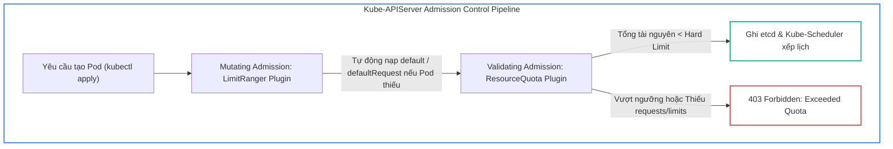
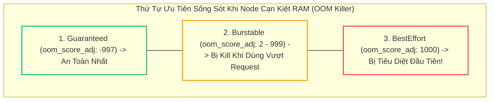
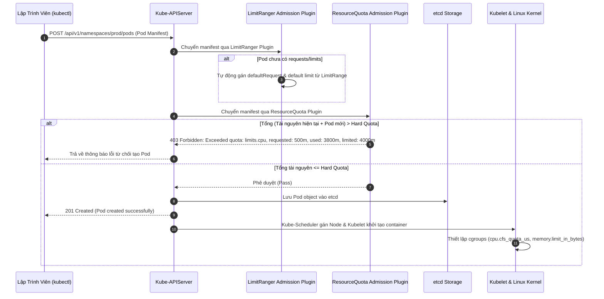
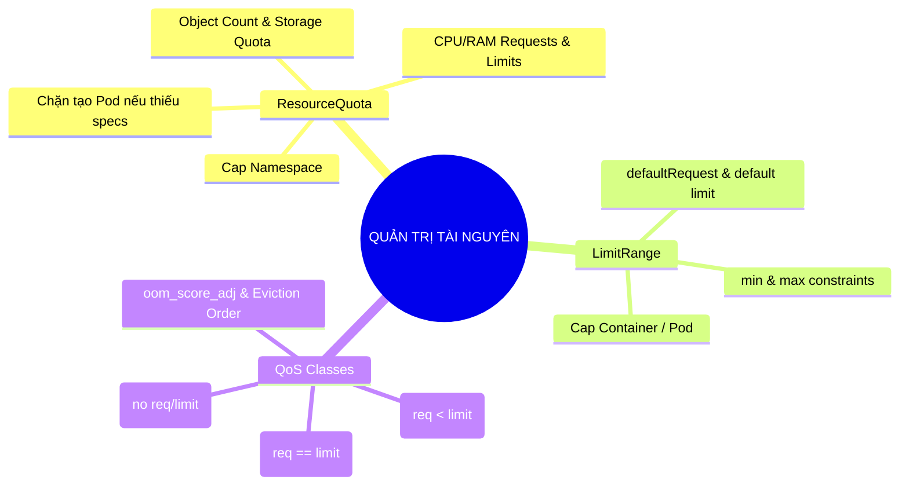


> [!IMPORTANT]
> **Mục tiêu kỹ thuật bài học**:
> - Hiểu rõ cơ chế điều phối tài nguyên CPU (Completely Fair Scheduler - CFS) và Memory (cgroup limits, OOM Killer) ở tầng Linux Kernel.
> - Cấu hình thành thạo `ResourceQuota` kiểm soát tổng dung lượng CPU, RAM, PersistentVolumeClaims và số lượng Objects trong Namespace.
> - Thiết lập `LimitRange` để tự động inject `defaultRequest` và `default` limit, ngăn chặn các Pod vô tình chiếm dụng cạn kiệt tài nguyên cụm.
> - Phân tích chính xác điều kiện để Pod đạt chuẩn QoS `Guaranteed`, `Burstable`, hoặc `BestEffort`.
> - Chẩn đoán và khắc phục lỗi `exceeded quota`, `forbidden: is forbidden: minimum cpu usage per Pod is...`, và hiện tượng Deployment 0/1 replicas do ReplicaSet bị nghẽn.

---

## 1. Bản Chất Kiến Trúc & Tư Duy Cốt Lõi: Quản Trị Tài Nguyên Tính Toán & QoS

Trong mô hình đa người dùng (Multi-tenancy) hoặc môi trường Microservices phân tán, nhiều nhóm kỹ sư cùng chia sẻ một cụm Kubernetes. Nếu không có cơ chế quản trị tài nguyên chặt chẽ, một ứng dụng gặp lỗi rò rỉ bộ nhớ (Memory Leak) hoặc vòng lặp vô tận (Infinite CPU Loop) có thể làm cạn kiệt tài nguyên của Worker Node, kéo sập các dịch vụ trọng yếu khác trên cùng hạ tầng.

Kubernetes cung cấp hai công cụ cốt lõi ở tầng Admission Control để quản trị tài nguyên: **`ResourceQuota`** và **`LimitRange`**.



### 1.1. So Sánh Bản Chất: ResourceQuota vs LimitRange

1. **`ResourceQuota` (Hạn ngạch cấp Namespace)**:
   - Đóng vai trò như một **chiếc ví ngân sách tổng** cho toàn bộ Namespace.
   - Quản lý tổng tài nguyên tính toán (tổng `requests.cpu`, `requests.memory`, `limits.cpu`, `limits.memory`), dung lượng lưu trữ (tổng `requests.storage`), và số lượng tài nguyên API (tối đa bao nhiêu Pods, Services, Secrets, ConfigMaps, PVCs).
   - **Quy tắc vàng**: Nếu Namespace có `ResourceQuota` áp đặt trên `requests` hoặc `limits`, mọi Pod tạo trong Namespace đó **bắt buộc phải khai báo đầy đủ `requests` và `limits` tương ứng**. Nếu thiếu, API Server sẽ từ chối ngay lập tức.
2. **`LimitRange` (Quy chuẩn kích thước từng Container / Pod)**:
   - Đóng vai trò như **bộ khuôn kích thước** cho từng đối tượng đơn lẻ bên trong Namespace.
   - Thiết lập ngưỡng `min` (kích thước tối thiểu) và `max` (kích thước tối đa) cho 1 Pod hoặc 1 Container.
   - Thiết lập giá trị mặc định: `defaultRequest` (nạp tự động nếu container không khai báo request) và `default` (nạp tự động nếu container không khai báo limit).

---

### 1.2. Phân Hạng Chất Lượng Dịch Vụ (Quality of Service - QoS Classes)

Kubernetes tự động gán nhãn một trong 3 phân hạng **QoS** cho mỗi Pod dựa trên cách lập trình viên khai báo `requests` và `limits`. QoS quyết định trực tiếp độ ưu tiên sống sót của Pod khi Node gặp tình trạng cạn kiệt tài nguyên (Node OOM / Eviction):



- **`Guaranteed` (Chất lượng cao nhất)**:
  - *Điều kiện*: Mọi Container trong Pod (kể cả Init Containers) **phải có đầy đủ cả CPU và Memory** cho cả `requests` và `limits`, và giá trị `requests == limits`.
  - *Hành vi*: Được cấp phát tài nguyên cứng; `oom_score_adj` được gán mức `-997`. Linux Kernel sẽ không bao giờ tiêu diệt Pod này trừ khi toàn bộ hệ thống sụp đổ.
- **`Burstable` (Chất lượng linh hoạt)**:
  - *Điều kiện*: Pod không đạt chuẩn Guaranteed nhưng có ít nhất một container khai báo `requests` hoặc `limits` cho CPU hoặc Memory.
  - *Hành vi*: Cho phép bứt phá (burst) sử dụng tài nguyên vượt quá request khi Node còn rảnh rỗi. Điểm `oom_score_adj` được tính dựa trên tỉ lệ % RAM mà container đang sử dụng vượt quá mức request.
- **`BestEffort` (Chất lượng thấp nhất)**:
  - *Điều kiện*: Không có bất kỳ container nào khai báo `requests` hoặc `limits`.
  - *Hành vi*: Không có bất kỳ sự đảm bảo nào về tài nguyên. Điểm `oom_score_adj` là `1000` (mức cao nhất). Khi Worker Node có dấu hiệu thiếu RAM, Kubelet và Linux OOM Killer sẽ **lập tức tiêu diệt (kill) các Pod BestEffort đầu tiên**.

---

## 2. Bảng Ma Trận So Sánh Kỹ Thuật Toàn Diện (Engineering Matrix)

| Tiêu chí Kỹ thuật | ResourceQuota | LimitRange | QoS Guaranteed | QoS Burstable | QoS BestEffort |
| :--- | :--- | :--- | :--- | :--- | :--- |
| **Cấp độ áp dụng** | Toàn bộ Namespace (Aggregated) | Từng Container / Pod đơn lẻ | Từng Pod đơn lẻ | Từng Pod đơn lẻ | Từng Pod đơn lẻ |
| **Mục đích chính** | Chặn vượt trần ngân sách hạ tầng | Ép chuẩn kích thước & gán mặc định | Bảo vệ ứng dụng lõi (Mission-Critical) | Tối ưu hóa chi phí & chia sẻ tài nguyên | Dành cho Batch/Dev pod không quan trọng |
| **Thời điểm kiểm tra** | Khi tạo/sửa đổi tài nguyên qua API Server | Khi tạo Pod qua Mutating Webhook | Khi Kubelet khởi tạo container | Khi Kubelet khởi tạo container | Khi Kubelet khởi tạo container |
| **Xử lý thiếu resources** | Từ chối tạo Pod nếu thiếu cấu hình | Tự động bổ sung `defaultRequest`/`default` | Bắt buộc `request == limit` | Chấp nhận cấu hình linh hoạt | Không khai báo |
| **Hành vi khi thiếu RAM** | Không cho phép tạo thêm Pod mới | Không cho phép tạo Pod quá cỡ `max` | Sống sót cuối cùng (Kill sau cùng) | Bị kill nếu dùng vượt request | **Bị tiêu diệt đầu tiên (OOMKill)** |
| **Hành vi khi thiếu CPU** | Chặn tạo Pod mới nếu tổng request chạm trần | Chặn tạo Pod nếu request > `max` | CPU được cấp phát Dedicated qua CPU Manager | Bị CPU Throttling (bóp nghẽn nhịp CPU) | Nhận lượng CPU thừa còn lại |

---

## 3. Kiến Trúc Môi Trường & Luồng Thực Thi Mẫu



### Manifest Mẫu 1: LimitRange Tiêu Chuẩn

```yaml
apiVersion: v1
kind: LimitRange
metadata:
  name: core-resource-limits
  namespace: default
spec:
  limits:
  - type: Container
    default: # Giới hạn tối đa mặc định (limits) nếu Pod không khai báo
      cpu: "500m"
      memory: "512Mi"
    defaultRequest: # Mức yêu cầu tối thiểu mặc định (requests) nếu Pod không khai báo
      cpu: "100m"
      memory: "128Mi"
    max: # Không cho phép bất kỳ container nào đặt limit vượt quá ngưỡng này
      cpu: "2"
      memory: "2Gi"
    min: # Không cho phép bất kỳ container nào đặt request nhỏ hơn ngưỡng này
      cpu: "50m"
      memory: "64Mi"
```

### Manifest Mẫu 2: ResourceQuota Toàn Diện Cấp Namespace

```yaml
apiVersion: v1
kind: ResourceQuota
metadata:
  name: namespace-hard-quota
  namespace: default
spec:
  hard:
    # Tổng tài nguyên tính toán
    requests.cpu: "4"
    requests.memory: "8Gi"
    limits.cpu: "8"
    limits.memory: "16Gi"
    # Tổng số lượng đối tượng (Object Count Quota)
    pods: "20"
    services: "10"
    secrets: "30"
    configmaps: "30"
    persistentvolumeclaims: "5"
    requests.storage: "100Gi"
```

---

## 4. Phân Tích Cạm Bẫy Thực Chiến: "Hiện Tượng Quota Chặn Âm Thầm & Deployment 0/3 Replicas"

### Tình Huống Thực Tế
Một nhóm kỹ sư chuyển dịch ứng dụng từ môi trường Development sang một Namespace mới có cấu hình `ResourceQuota`. Lập trình viên thực hiện lệnh `kubectl apply -f deployment.yaml`. Terminal báo kết quả `deployment.apps/order-processor created` rất mượt mà. Tuy nhiên, sau 10 phút, ứng dụng vẫn không nhận bất kỳ request nào. Kiểm tra thấy `READY 0/3`.

### Hậu Quả & Log Lỗi Thực Tế:
```text
NAME              READY   UP-TO-DATE   AVAILABLE   AGE
order-processor   0/3     0            0           10m
```

Khi kiểm tra Pod (`kubectl get pods`): Hoàn toàn **không có bất kỳ Pod nào được tạo ra!**
Kỹ sư kiểm tra tiếp ReplicaSet (`kubectl describe rs order-processor-7667f8b44b`):
```text
Events:
  Type     Reason        Age                From                   Message
  ----     ------        ----               ----                   -------
  Warning  FailedCreate  45s (x12 over 8m)  replicaset-controller  Error creating: pods "order-processor-7667f8b44b-4v8z9" is forbidden: failed quota: namespace-hard-quota: must specify cpu,memory for each container; exceeded quota: pods, requested: 1, used: 20, limited: 20
```

### 5-Whys Root Cause Analysis:
1. **Tại sao Deployment có 0 Pods đang chạy?** Do ReplicaSet Controller không thể tạo được Pod con.
2. **Tại sao ReplicaSet không tạo được Pod?** Do lệnh tạo Pod bị API Server từ chối với lỗi `403 Forbidden`.
3. **Tại sao API Server từ chối?** Do Namespace có gắn `ResourceQuota` nhưng Pod Template trong Deployment không khai báo `resources.requests` và `resources.limits`, hoặc tổng số lượng Pod đã chạm trần `hard.pods: 20`.
4. **Tại sao `kubectl apply` ban đầu không báo lỗi?** Vì lệnh `kubectl apply` chỉ gửi yêu cầu tạo đối tượng `Deployment` (thành công). Sau đó, `Deployment Controller` tạo `ReplicaSet` (thành công), và chính `ReplicaSet Controller` mới là bên thực hiện gọi API tạo `Pod` (thất bại âm thầm trong background).
5. **Giải pháp chuẩn:** 
   - Thêm cấu hình `resources` đầy đủ vào spec của Pod Template.
   - Hoặc triển khai một `LimitRange` trong Namespace để tự động gán giá trị mặc định cho các Pod thiếu cấu hình.

---

## 5. Hands-on Lab: Thiết Lập ResourceQuota, LimitRange & Phân Hạng QoS (8 Bước)

| Bước | Mục Tiêu Kỹ Thuật | Lệnh Thực Hiện Chính |
| :--- | :--- | :--- |
| **1** | Khởi tạo Namespace Lab cô lập | `kubectl create ns ckad-quota-lab` |
| **2** | Áp dụng ResourceQuota đa chiều | `kubectl apply -f 1-resource-quota.yaml` |
| **3** | Thử tạo Pod trần trụi và quan sát lỗi chặn | `kubectl apply -f 2-naked-pod.yaml` |
| **4** | Thiết lập LimitRange bổ sung giá trị mặc định | `kubectl apply -f 3-limit-range.yaml` |
| **5** | Khởi tạo Pod tự động nhận cấu hình LimitRange | `kubectl apply -f 2-naked-pod.yaml` |
| **6** | Xây dựng 3 Pod đạt chuẩn 3 QoS Classes | `kubectl apply -f 4-qos-pods.yaml` |
| **7** | Thử nghiệm vượt trần hạn ngạch (Quota Exhaustion) | `kubectl scale deploy worker-app --replicas=10` |
| **8** | Dọn dẹp môi trường Lab | `kubectl delete ns ckad-quota-lab` |

---

### Bước 1: Khởi Tạo Namespace Lab Cô Lập

```bash
kubectl create namespace ckad-quota-lab
kubectl config set-context --current --namespace=ckad-quota-lab
```

---

### Bước 2: Áp Dụng ResourceQuota

Tạo file `1-resource-quota.yaml`:
```yaml
apiVersion: v1
kind: ResourceQuota
metadata:
  name: lab-quota
spec:
  hard:
    requests.cpu: "1"
    requests.memory: "1Gi"
    limits.cpu: "2"
    limits.memory: "2Gi"
    pods: "4"
```
```bash
kubectl apply -f 1-resource-quota.yaml
kubectl describe resourcequota lab-quota
```

---

### Bước 3: Thử Nghiệm Tạo Pod Không Khai Báo Resources (Bị Chặn)

Tạo file `2-naked-pod.yaml`:
```yaml
apiVersion: v1
kind: Pod
metadata:
  name: naked-app-pod
spec:
  containers:
  - name: web
    image: nginx:alpine
```
```bash
kubectl apply -f 2-naked-pod.yaml
```
> Đầu ra xuất hiện lỗi ngay lập tức:
> `Error from server (Forbidden): error when creating "2-naked-pod.yaml": pods "naked-app-pod" is forbidden: failed quota: lab-quota: must specify cpu for: web; memory for: web`

---

### Bước 4: Thiết Lập LimitRange

Tạo file `3-limit-range.yaml`:
```yaml
apiVersion: v1
kind: LimitRange
metadata:
  name: lab-limitrange
spec:
  limits:
  - type: Container
    default:
      cpu: "300m"
      memory: "256Mi"
    defaultRequest:
      cpu: "100m"
      memory: "128Mi"
```
```bash
kubectl apply -f 3-limit-range.yaml
kubectl describe limitrange lab-limitrange
```

---

### Bước 5: Tạo Lại Pod Trần Trụi (Thành Công Nhờ LimitRange)

```bash
kubectl apply -f 2-naked-pod.yaml
kubectl wait --for=condition=ready pod/naked-app-pod --timeout=30s

# Kiểm tra xem LimitRange đã tự động inject resources chưa
kubectl get pod naked-app-pod -o jsonpath='{.spec.containers[0].resources}'
```
> Đầu ra hiển thị: `{"limits":{"cpu":"300m","memory":"256Mi"},"requests":{"cpu":"100m","memory":"128Mi"}}`.

---

### Bước 6: Khởi Tạo 3 Pod Thuộc 3 QoS Classes

Tạo file `4-qos-pods.yaml`:
```yaml
# 1. Guaranteed Pod (Request == Limit cho toàn bộ containers)
apiVersion: v1
kind: Pod
metadata:
  name: qos-guaranteed-pod
spec:
  containers:
  - name: app
    image: busybox:1.36
    command: ["sleep", "3600"]
    resources:
      requests:
        cpu: "100m"
        memory: "100Mi"
      limits:
        cpu: "100m"
        memory: "100Mi"
---
# 2. Burstable Pod (Request < Limit)
apiVersion: v1
kind: Pod
metadata:
  name: qos-burstable-pod
spec:
  containers:
  - name: app
    image: busybox:1.36
    command: ["sleep", "3600"]
    resources:
      requests:
        cpu: "100m"
        memory: "100Mi"
      limits:
        cpu: "200m"
        memory: "200Mi"
```
```bash
kubectl apply -f 4-qos-pods.yaml
kubectl wait --for=condition=ready pod/qos-guaranteed-pod pod/qos-burstable-pod --timeout=30s

# Xác minh QoS Class
kubectl get pod qos-guaranteed-pod -o jsonpath='{.status.qosClass}'
# In ra: Guaranteed

kubectl get pod qos-burstable-pod -o jsonpath='{.status.qosClass}'
# In ra: Burstable
```

---

### Bước 7: Thử Nghiệm Vượt Trần ResourceQuota

Hiện tại Namespace đã có 3 Pods (`naked-app-pod`, `qos-guaranteed-pod`, `qos-burstable-pod`). Trần `hard.pods` là 4.
Hãy thử tạo một Deployment với 3 replicas:

```bash
kubectl create deployment worker-app --image=busybox:1.36 --replicas=3 -- sleep 3600
sleep 3
kubectl get deployment worker-app
kubectl describe rs $(kubectl get rs -l app=worker-app -o jsonpath='{.items[0].metadata.name}')
```
> Bạn sẽ thấy Deployment chỉ sẵn sàng `1/3` (đạt tổng 4 Pods). 2 Pods còn lại trong ReplicaSet bị từ chối với thông báo: `exceeded quota: lab-quota, requested: pods=1, used: pods=4, limited: pods=4`.

---

### Bước 8: Dọn Dẹp Tài Nguyên Lab

```bash
kubectl delete ns ckad-quota-lab
```

---

## 6. 10 Câu Hỏi Tự Kiểm Tra Chuyên Sâu (Self-Check Q&A Accordion)

<details class="qa-card">
<summary><b>1. Điều kiện chính xác để một Pod được Kubernetes phân hạng QoS `Guaranteed` là gì?</b></summary>
<div class="qa-answer">
<p>Pod đạt chuẩn <code>Guaranteed</code> khi và chỉ khi <b>tất cả mọi Container</b> trong Pod (bao gồm cả Init Containers) đều khai báo tường minh cả <code>CPU</code> và <code>Memory</code> ở cả hai mục <code>requests</code> và <code>limits</code>, đồng thời giá trị của <b><code>requests</code> phải bằng chính xác <code>limits</code></b> cho từng loại tài nguyên.</p>
</div>
</details>

<details class="qa-card">
<summary><b>2. Khi một Namespace có ResourceQuota quản lý `requests.cpu`, điều gì xảy ra nếu lập trình viên tạo Pod mà không định nghĩa `resources` và Namespace không có LimitRange?</b></summary>
<div class="qa-answer">
<p>Kube-APIServer sẽ <b>từ chối yêu cầu tạo Pod ngay lập tức</b> với mã lỗi <code>403 Forbidden</code> kèm thông báo: <code>failed quota: &lt;quota-name&gt;: must specify cpu for: &lt;container-name&gt;</code>.</p>
</div>
</details>

<details class="qa-card">
<summary><b>3. Vai trò của `defaultRequest` và `default` trong LimitRange là gì?</b></summary>
<div class="qa-answer">
<p><b><code>defaultRequest</code>:</b> Là giá trị <code>resources.requests</code> mặc định được Admission Controller tự động gán vào Container nếu lập trình viên không khai báo.</p>
<p><b><code>default</code>:</b> Là giá trị <code>resources.limits</code> tối đa mặc định được tự động gán vào Container nếu không khai báo.</p>
</div>
</details>

<details class="qa-card">
<summary><b>4. Sự khác nhau cơ bản giữa CPU Throttling và hiện tượng OOMKilled khi container vượt quá Limit là gì?</b></summary>
<div class="qa-answer">
<p><b>CPU (Compressible resource):</b> Khi container chạm trần CPU Limit, Linux CFS Scheduler sẽ <b>bóp nghẽn nhịp xử lý (Throttling)</b> làm ứng dụng phản hồi chậm nhưng tiến trình <b>không bị tiêu diệt</b>.</p>
<p><b>Memory (Incompressible resource):</b> Khi container tiêu thụ RAM vượt quá Memory Limit, Linux Kernel OOM Killer sẽ <b>lập tức gửi tín hiệu SIGKILL (Exit code 137)</b> để tiêu diệt tiến trình (OOMKilled).</p>
</div>
</details>

<details class="qa-card">
<summary><b>5. Thứ tự tiêu diệt Pod của Linux Kernel OOM Killer khi một Worker Node rơi vào tình trạng cạn kiệt RAM là như thế nào?</b></summary>
<div class="qa-answer">
<p>Thứ tự ưu tiên tiêu diệt (từ bị kill đầu tiên đến an toàn nhất):</p>
<div>1. <b>BestEffort:</b> Bị tiêu diệt đầu tiên (<code>oom_score_adj: 1000</code>).</div>
<div>2. <b>Burstable:</b> Bị tiêu diệt tiếp theo nếu đang sử dụng RAM vượt quá mức <code>requests</code>.</div>
<div>3. <b>Guaranteed:</b> An toàn nhất, chỉ bị tiêu diệt cuối cùng khi không còn Pod nào khác để giải phóng (<code>oom_score_adj: -997</code>).</div>
</div>
</details>

<details class="qa-card">
<summary><b>6. ResourceQuota có thể giới hạn những loại tài nguyên nào ngoài CPU và Memory?</b></summary>
<div class="qa-answer">
<p>ResourceQuota có thể giới hạn:</p>
<div>1. <b>Lưu trữ:</b> Tổng dung lượng đĩa <code>requests.storage</code> và số lượng <code>persistentvolumeclaims</code>.</div>
<div>2. <b>Số lượng đối tượng Kubernetes (Object Counts):</b> <code>pods</code>, <code>services</code>, <code>services.loadbalancers</code>, <code>services.nodeports</code>, <code>secrets</code>, <code>configmaps</code>.</div>
</div>
</details>

<details class="qa-card">
<summary><b>7. Khi một Deployment báo READY 0/1 nhưng `kubectl get pods` không hiển thị Pod nào, lệnh nào là hữu ích nhất để tìm nguyên nhân?</b></summary>
<div class="qa-answer">
<p>Sử dụng lệnh kiểm tra sự kiện của ReplicaSet: <code>kubectl describe rs &lt;replicaset-name&gt;</code> hoặc <code>kubectl get events --sort-by=.metadata.creationTimestamp</code> để xem lý do ReplicaSet Controller bị API Server từ chối tạo Pod.</p>
</div>
</details>

<details class="qa-card">
<summary><b>8. `scopes` trong ResourceQuota cho phép lọc hạn ngạch theo các tiêu chí nào?</b></summary>
<div class="qa-answer">
<p>Các scopes phổ biến gồm: <code>Terminating</code> (Pod có <code>activeDeadlineSeconds</code>), <code>NotTerminating</code> (Pod chạy dài hạn thông thường), <code>BestEffort</code> (chỉ áp dụng cho Pod BestEffort), và <code>NotBestEffort</code> (áp dụng cho Pod Guaranteed và Burstable).</p>
</div>
</details>

<details class="qa-card">
<summary><b>9. Nếu một Container khai báo `requests.cpu: "200m"` và `limits.cpu: "500m"`, nhưng không khai báo Memory, Pod đó thuộc QoS Class nào?</b></summary>
<div class="qa-answer">
<p>Pod đó thuộc QoS Class <b><code>Burstable</code></b>, vì nó đã khai báo ít nhất một thông số tài nguyên (CPU request/limit) nhưng không đáp ứng đủ điều kiện của <code>Guaranteed</code>.</p>
</div>
</details>

<details class="qa-card">
<summary><b>10. Làm thế nào để kiểm tra mức sử dụng tài nguyên thực tế hiện tại so với trần ResourceQuota trong một Namespace?</b></summary>
<div class="qa-answer">
<p>Sử dụng lệnh: <code>kubectl describe resourcequota &lt;quota-name&gt; -n &lt;namespace&gt;</code>. Bảng hiển thị sẽ liệt kê chi tiết các cột <b>Resource</b>, <b>Used</b> (đang dùng) và <b>Hard</b> (trần tối đa cho phép).</p>
</div>
</details>

---

## 7. Tổng Kết & Lộ Trình Bài Học Tiếp Theo



Quản trị hạn ngạch tài nguyên đúng cách là chìa khóa xây dựng môi trường Cloud Native đa người dùng an toàn, tối ưu hóa chi phí điện toán đám mây và ngăn chặn triệt để hiện tượng ứng dụng bị crash do cạn kiệt tài nguyên.

> [!TIP]
> **Bài học tiếp theo**: Khám phá kiến trúc mở rộng Kubernetes với **[Bài 13: Mở Rộng Kubernetes: Custom Resource Definitions (CRDs) & Operator Pattern Mức Độ Lập Trình Viên](ckad-13-13-crd-va-operator-muc-do-nguoi-dung.html)**.

