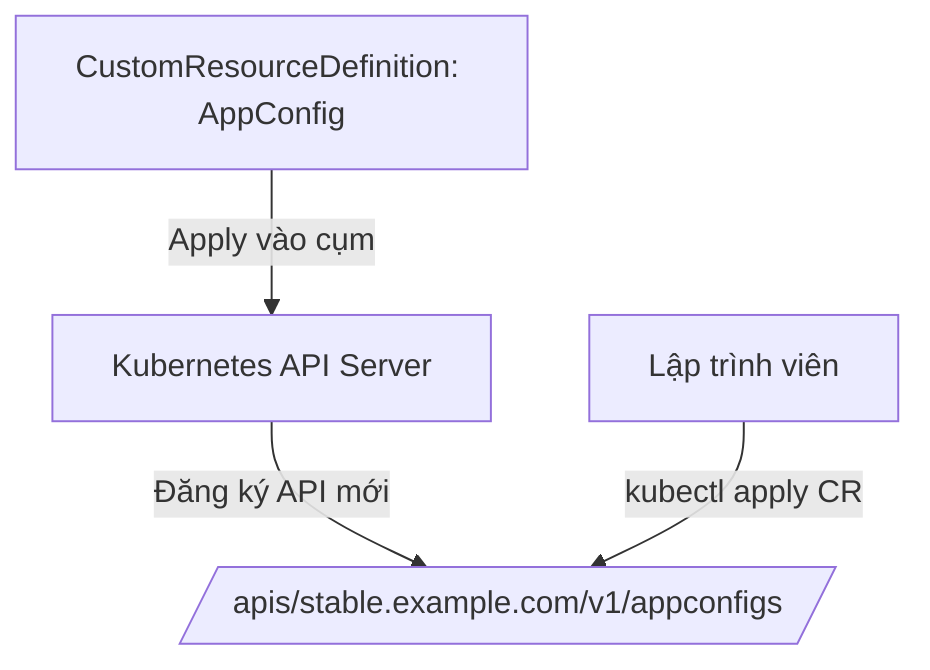
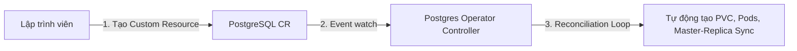
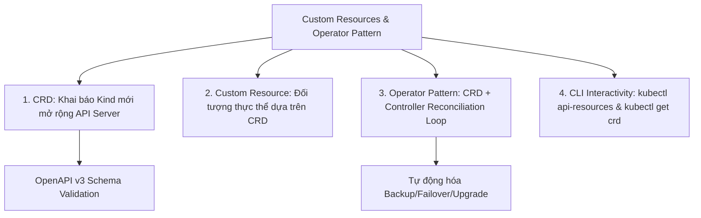
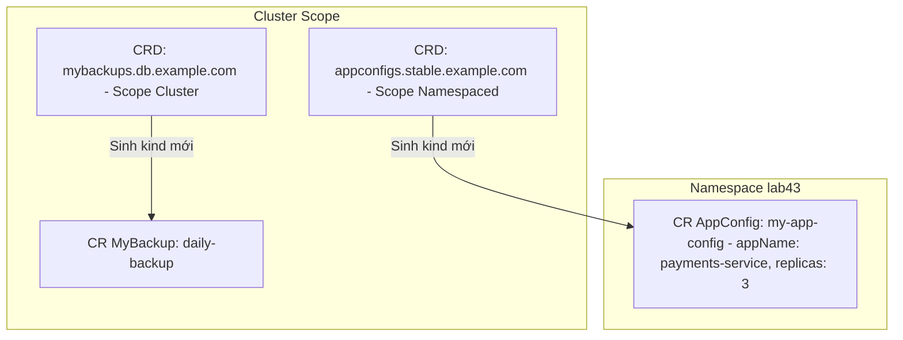


# [BÀI 13] MỞ RỘNG KHẢ NĂNG NỀN TẢNG VỚI CUSTOM RESOURCE DEFINITIONS (CRD) & KUBERNETES OPERATOR PATTERN

Trong kỷ nguyên điện toán đám mây và kiến trúc microservices phân tán quy mô lớn, **Kubernetes (CKAD)** đóng vai trò là nền tảng điều phối container (Container Orchestration) tiêu chuẩn công nghiệp. Để làm chủ hệ thống trong môi trường sản xuất (Production) cũng như chinh phục kỳ thi chứng chỉ quốc tế của Linux Foundation / CNCF, kỹ sư không chỉ nắm vững các câu lệnh thao tác cơ bản mà phải thấu hiểu sâu sắc bản chất cơ chế tầng thấp: từ chu trình điều hòa (Reconciliation Loop), cấu trúc điều phối tài nguyên, kiến trúc mạng CNI, lưu trữ CSI cho đến các chuẩn mực an ninh phòng thủ chiều sâu.

Bài viết chuyên sâu này sẽ đồng hành cùng bạn giải mã toàn diện bức tranh kiến trúc, phân tích các đánh đổi kỹ thuật thực chiến (Engineering Trade-offs), cung cấp bài thực hành Lab từng bước và bộ câu hỏi phỏng vấn chuẩn Architect / Lead Engineer.

---

## 1. Bản Chất Kiến Trúc & Cơ Chế Vận Hành Tầng Thấp

| # | Câu hỏi ôn tập | Đáp án chuẩn ngắn gọn |
|---|---|---|
| 1 | Phạm vi quản lý chính của ResourceQuota? | Cấp **Namespace** (tổng CPU/RAM/Pods) |
| 2 | Phạm vi quản lý chính của LimitRange? | Cấp **Container / Pod** riêng lẻ (min/max/default) |
| 3 | Lỗi xuất hiện khi Pod thiếu resources trong Namespace có Quota? | **`must specify cpu`** (Ca hỏng Quota chặn âm thầm) |
| 4 | Thuộc tính LimitRange tiêm requests mặc định cho container? | Thuộc tính **`defaultRequest`** |
| 5 | Lệnh CLI xem bảng đối soát cột Used vs Hard trong Quota? | **`kubectl describe quota -n <namespace>`** |


> **"Khai thác mở rộng Kubernetes qua CRD và Operator ở góc độ lập trình viên ứng dụng (User-facing Custom Resources and Operators) là nội dung quan trọng thuộc kỳ thi CKAD, đòi hỏi học viên phải hiểu rõ cơ chế mở rộng API của Kubernetes bằng CustomResourceDefinition (CRD) để tự định nghĩa các loại tài nguyên tùy biến mới; phân biệt rõ cấu trúc của CRD spec với bản kê khai Custom Resource (CR) thực thể; làm chủ mô hình Operator Pattern (kết hợp CRD với Custom Controller để tự động hóa vòng đời ứng dụng phức tạp như Database hay Monitoring); đồng thời thành thạo kỹ năng gõ lệnh CLI (`kubectl get crd`, `kubectl get <custom-resource>`, `kubectl api-resources`) để tương tác, khai thác và gỡ lỗi các tài nguyên tùy biến trên cụm."**

**Kết quả từ các buổi trước được sử dụng lại:**

| Kết quả / Công cụ | Buổi + số hiệu `QT` | Dùng ở đâu trong buổi này |
|---|---|---|
| Cấu trúc tệp YAML Kubernetes bản địa | Buổi 32 `QT 4.1` | So sánh cấu trúc `apiVersion`, `kind`, `spec` của K8s Native vs Custom Resource |
| Cài đặt ứng dụng qua Helm Chart | Buổi 36 `QT 4.1` | Triển khai các Operator phổ biến (như Prometheus / cert-manager Operator) qua Helm |
| Tương tác CLI với API Server | Buổi 10 `QT 4.1` | Tra cứu API endpoints qua `kubectl api-resources` và `kubectl get crd` |

---


| # | Kỹ năng thực hiện được | Hiện vật chứng minh |
|---|---|---|
| 1 | Biên soạn tệp YAML định nghĩa tài nguyên tùy biến CRD | Tệp CRD YAML thuộc `apiextensions.k8s.io/v1` |
| 2 | Khởi tạo đối tượng Custom Resource (CR) dựa trên CRD đã tạo | Tệp Custom Resource YAML có `kind` tùy biến |
| 3 | Giải thích cơ chế hoạt động của Operator Pattern và Reconciliation Loop | Sơ đồ đối sánh trạng thái Desired State vs Actual State |
| 4 | Kiểm tra cú pháp dữ liệu CR qua OpenAPI v3 Schema Validation | Nhật ký lỗi API Server từ chối CR khi gõ sai kiểu dữ liệu |
| 5 | Thành thạo lệnh CLI tương tác với CRD ở mức độ người dùng | Nhật ký các lệnh `kubectl get crd`, `kubectl api-resources` |

---


| Kiến thức tiên quyết | Nguồn tự học nếu thiếu |
|---|---|
| Cấu trúc bản kê khai YAML Kubernetes (apiVersion, kind, spec) | Buổi 32 (`QT 4.1`) |
| Quản lý và thao tác tài nguyên qua lệnh CLI kubectl | Buổi 10 (`QT 4.1`) |
| Khái niệm Controller Loop trong kiến trúc Kubernetes | Buổi 01 (`QT 4.1`) |

---


### 3.1. Thuật ngữ Việt–Anh

| # | Thuật ngữ tiếng Việt | Tiếng Anh tương đương | Ghi chú chuẩn hoá trong thân bài |
|---|---|---|---|
| 1 | Định nghĩa tài nguyên tùy biến | CustomResourceDefinition (CRD) | Tệp YAML mở rộng API Server khai báo kind mới |
| 2 | Tài nguyên tùy biến thực thể | Custom Resource (CR) | Đối tượng YAML được tạo ra từ CRD spec |
| 3 | Mô hình tác nhân vận hành | Operator Pattern | Mẫu thiết kế kết hợp CRD và Custom Controller tự động hóa app |
| 4 | Bộ điều khiển tùy biến | Custom Controller | Tiến trình theo dõi sự thay đổi của CR và thực thi Reconciliation Loop |
| 5 | Vòng lặp hòa giải trạng thái | Reconciliation Loop | Tiến trình liên tục đưa Desired State về bằng với Actual State |
| 6 | Sơ đồ xác thực dữ liệu | OpenAPI v3 Schema Validation | Cấu trúc validation quy định kiểu dữ liệu cho các trường trong CRD |
| 7 | Nhóm API tùy biến | API Group & Version (`apiextensions.k8s.io/v1`) | Định danh nhóm API cho CRD (ví dụ `stable.example.com/v1`) |
| 8 | Định danh tên gọi số nhiều/số ít | Plural / Singular Names | Khai báo tên gọi rút gọn và số nhiều cho CLI (ví dụ `appconfigs` / `ac`) |
| 9 | Tri thức miền vận hành | Domain Knowledge | Kinh nghiệm vận hành ứng dụng (như backup DB, failover cluster) |
| 10 | Liệt kê tài nguyên API | `kubectl api-resources` | Lệnh CLI hiển thị toàn bộ loại tài nguyên sẵn có trên cụm K8s |
| 11 | Trạng thái mong muốn vs thực tế | Desired State vs Actual State | Khái niệm lõi của Kubernetes Controller Loop |
| 12 | Tác nhân quản lý chứng chỉ | cert-manager Operator | Operator phổ biến chuyên tự động gia hạn chứng chỉ TLS |
| 13 | Tác nhân giám sát Prometheus | Prometheus Operator | Operator phổ biến chuyên quản lý cấu hình Monitoring |
| 14 | Đối tượng lưu trữ etcd | etcd Object Persistence | Việc API Server lưu trữ thông tin Custom Resource vào etcd |


Mô hình Bản thiết kế Khuôn mẫu và Nhân viên Vận hành tự động: `CRD` giống như một Tờ khai đăng ký mẫu xe mới gửi cho Cục Đăng kiểm API Server (khai rõ xe tên gì, có bao nhiêu bánh, động cơ loại nào). `Custom Resource` (CR) giống như Chiếc xe thực tế được sản xuất dựa trên tờ khai đó. `Operator` giống như người Lái xe tự động chuyên nghiệp ngồi bên trong, liên tục quan sát bảng điều khiển để tự động bơm xăng, thay nhớt và sửa chữa xe mà người chủ không cần phải ra tay thủ công.

---

### 1.1. CRD (CustomResourceDefinition): Mở rộng API Server bằng tài nguyên mới (12 phút)

**Nguyên lý cốt lõi:** `CustomResourceDefinition` (CRD) mở rộng Kubernetes API Server bằng cách đăng ký các kiểu tài nguyên mới (Resource Kind mới); giúp API Server nhận diện và quản lý các đối tượng tùy biến hệt như tài nguyên bản địa (Native Resources như Pod, Service).

**Giải thích cơ chế ngầm:** Giúp Kubernetes không bị giới hạn ở các tài nguyên cố định ban đầu. Bất kỳ đội ngũ phát triển nào cũng có thể tự mở rộng API Server để thêm các loại tài nguyên chuyên biệt của riêng dự án (như `AppConfig`, `DatabaseCluster`, `CertManager`).

> [!WARNING]
> **CẠM BẪY THỰC CHIẾN:**
> Cố gắng `kubectl apply` một tệp YAML chứa `kind` lạ khi chưa cài đặt CRD tương ứng, làm API Server báo lỗi `error: unable to recognize "file.yaml": no matches for kind...`.

**Minh hoạ.**



**Nguyên lý cốt lõi:** Bản kê khai CRD spec bắt buộc phải thuộc `apiVersion: apiextensions.k8s.io/v1` và `kind: CustomResourceDefinition`, chỉ định rõ `group`, `names` (plural, singular, kind, shortNames) và `scope` (`Namespaced` hoặc `Cluster`).

**Giải thích cơ chế ngầm:** API Server cần các thông số định danh chuẩn này để tạo đường dẫn REST API endpoint trong etcd và hỗ trợ lệnh `kubectl` tự động nhận diện tên gọi viết tắt.

> [!WARNING]
> **CẠM BẪY THỰC CHIẾN:**
> Khai báo thiếu trường `plural` hoặc `kind` trong CRD spec làm lệnh `kubectl apply` bị API Server từ chối ngay.

**Minh hoạ.**

```yaml
apiVersion: apiextensions.k8s.io/v1
kind: CustomResourceDefinition
metadata:
  name: appconfigs.stable.example.com
spec:
  group: stable.example.com
  versions:
    - name: v1
      served: true
      storage: true
      schema:
        openAPIV3Schema:
          type: object
          properties:
            spec:
              type: object
              properties:
                appName: {type: string}
                replicas: {type: integer}
  scope: Namespaced
  names:
    plural: appconfigs
    singular: appconfig
    kind: AppConfig
    shortNames: [ac]
```

---

### 1.2. Custom Resource (CR) và OpenAPI v3 Schema Validation (12 phút)

**Nguyên lý cốt lõi:** `Custom Resource` (CR) là một đối tượng YAML cụ thể được khởi tạo dựa trên định nghĩa của CRD; CR chứa các thuộc tính tùy biến được quy định bởi cấu trúc `openAPIV3Schema` trong CRD.

**Giải thích cơ chế ngầm:** CRD chỉ là bản vẽ kỹ thuật (template). Để ứng dụng thực tế hoạt động, lập trình viên phải biên soạn tệp Custom Resource (CR) khai báo các thông số cấu hình cụ thể cho dự án.

> [!WARNING]
> **CẠM BẪY THỰC CHIẾN:**
> Nhầm lẫn giữa CRD và CR, cố gắng nhúng dữ liệu cấu hình ứng dụng trực tiếp vào tệp CRD spec.

**Minh hoạ.**

```yaml
# Tệp Custom Resource (CR) thực thể:
apiVersion: stable.example.com/v1
kind: AppConfig
metadata:
  name: my-app-config
  namespace: prod
spec:
  appName: "payments-service"
  replicas: 3
```

**Nguyên lý cốt lõi:** Thuộc tính `schema.openAPIV3Schema` trong CRD spec giúp Kubernetes API Server tự động kiểm tra cú pháp (Validation) và từ chối các tệp CR YAML có trường dữ liệu sai kiểu hoặc thiếu các trường bắt buộc (`required`).

**Giải thích cơ chế ngầm:** Bảo vệ etcd không bị lưu trữ các dữ liệu cấu hình rác hoặc hỏng hóc, đảm bảo tính toàn vẹn dữ liệu cho các Operator Controller đọc phía sau.

> [!WARNING]
> **CẠM BẪY THỰC CHIẾN:**
> Nhập chuỗi văn bản `"tất cả"` cho trường `replicas` (vốn đòi hỏi kiểu `integer`), khiến API Server từ chối và báo lỗi `spec.replicas: Invalid value: "string": spec.replicas in body must be of type integer`.

**Minh hoạ.**

```yaml
# Trong CRD spec quy định validation:
schema:
  openAPIV3Schema:
    type: object
    properties:
      spec:
        type: object
        required: ["appName"] # Trường appName bắt buộc
        properties:
          appName:
            type: string
          replicas:
            type: integer
            minimum: 1
```

---

### 1.3. Operator Pattern: Tự động hóa vận hành ứng dụng phức tạp (10 phút)

**Nguyên lý cốt lõi:** `Operator Pattern` là mô hình kết hợp một hoặc nhiều `Custom Resource` (CRD) với một `Custom Controller` để tự động hóa toàn bộ vòng đời vận hành của một ứng dụng phức tạp (như tự động Backup, Failover, Upgrade Database).

**Giải thích cơ chế ngầm:** Các ứng dụng có trạng thái (Stateful Apps như PostgreSQL, Redis, Kafka) đòi hỏi nhiều quy trình vận hành phức tạp mà các Controller K8s cơ bản (như Deployment hay StatefulSet) không tự giải quyết được. Operator đóng gói kinh nghiệm của chuyên gia SRE vào mã tự động.

> [!WARNING]
> **CẠM BẪY THỰC CHIẾN:**
> Phải thực hiện quy trình backup/restore Database thủ công bằng tay thay vì khai báo một đối tượng Custom Resource cho Operator xử lý.

**Minh hoạ.**



**Nguyên lý cốt lõi:** Custom Controller trong Operator liên tục chạy một vòng lặp hòa giải trạng thái (`Reconciliation Loop`) để đối sánh giữa trạng thái mong muốn (`spec` của CR) và trạng thái thực tế (`status`), tự động thực hiện hành động khắc phục nếu có sai lệch.

**Giải thích cơ chế ngầm:** Đảm bảo hệ thống luôn tự chữa lành (Self-healing). Khi 1 Pod Database bị rớt, Operator không chỉ khởi động lại Pod mà còn tự thực hiện quy trình bầu chọn Master mới (Failover).

> [!WARNING]
> **CẠM BẪY THỰC CHIẾN:**
> Sửa đổi trực tiếp tài nguyên bên dưới do Operator quản lý mà không sửa tệp Custom Resource, làm cho Operator tự động ghi đè trả lại trạng thái ban đầu.

**Minh hoạ.**

```bash
# Vòng lặp Reconciliation Loop chuẩn:
# 1. Đọc spec.replicas = 3 (Desired State)
# 2. Đọc status.currentReplicas = 2 (Actual State)
# 3. Thực thi hành động: Tạo thêm 1 Pod mới để đạt 3
```

**Nguyên lý cốt lõi:** Sử dụng lệnh `kubectl api-resources` để liệt kê danh sách toàn bộ các CRD hiện có trên cụm và tra cứu tên viết tắt (`SHORTNAMES`) để thao tác CLI nhanh hơn (`kubectl get <shortname>`).

**Giải thích cơ chế ngầm:** Sau khi cài đặt các Operator (như Prometheus, cert-manager), cụm sẽ xuất hiện thêm hàng chục CRD mới. Lệnh `kubectl api-resources` giúp lập trình viên tra cứu chính xác tên Kind và API Group để tương tác.

> [!WARNING]
> **CẠM BẪY THỰC CHIẾN:**
> Không biết tên kind của Custom Resource nên không thể gõ lệnh `kubectl get` xem trạng thái.

**Minh hoạ.**

```bash
# Liệt kê tài nguyên API và tra shortNames:
kubectl api-resources | grep -i appconfig
# Kết quả: appconfigs ac stable.example.com/v1 true AppConfig
```

---

### 1.4. Đưa vào cụm thật (4 phút)

**Nguyên lý cốt lõi:** Ở mức độ người dùng ứng dụng (CKAD), lập trình viên không cần viết mã Golang để tạo Operator Controller; chỉ cần thành thạo việc biên soạn tệp YAML Custom Resource (CR) để khai báo thông số ứng dụng cho Operator vận hành.

**Giải thích cơ chế ngầm:** Kỳ thi CKAD tập trung vào góc độ người phát triển ứng dụng (Application Developer) sử dụng các tiện ích của K8s. Việc lập trình viết Controller bằng SDK Golang/Python thuộc phạm vi công việc của nhà phát triển hạ tầng (Platform Engineer).

> [!WARNING]
> **CẠM BẪY THỰC CHIẾN:**
> Cố gắng lập trình mã nguồn Golang viết Custom Controller trong kỳ thi CKAD gây lãng phí thời gian không cần thiết.

**Minh hoạ.**

```bash
# Kỹ năng CKAD chuẩn:
# 1. Tra cứu CRD có sẵn: kubectl get crd
# 2. Tạo Custom Resource YAML: kubectl apply -f my-cr.yaml
# 3. Gỡ lỗi CR: kubectl describe <custom-resource> <name>
```

**Áp vào cụm đang chạy thì làm gì trước:**
1. Chạy lệnh `kubectl get crd` để kiểm tra cụm đã cài sẵn những Operator nào (như cert-manager, prometheus).
2. Tra cứu tài liệu của Operator để viết tệp YAML Custom Resource phù hợp.
3. Kiểm tra nhật ký Pod của Operator Controller (`kubectl logs -n <operator-ns> <controller-pod>`) khi Custom Resource không hoạt động.

**Cái gì hỏng nếu áp thẳng lên prod:**
- Xóa một CRD (`kubectl delete crd <name>`) sẽ làm Kubernetes TỰ ĐỘNG XÓA TOÀN BỘ các Custom Resource (và dữ liệu liên quan) thuộc CRD đó trên 100% các Namespace.

**Đo trước — đo sau:**
- Kiểm tra danh sách CRD trước và sau khi cài đặt Helm Chart của Operator.
- Theo dõi trạng thái `status` của Custom Resource qua `kubectl get <cr> -o yaml`.

**Khi nào KHÔNG nên dùng:**
- Không lạm dụng tạo CRD cho các cấu hình ứng dụng đơn giản; nên dùng ConfigMap/Secret bản địa trước khi nghĩ đến CRD.

---

### 1.5. Bẫy hay gặp (2 phút)

| Bẫy hay gặp | Vì sao dính | Làm đúng là |
|---|---|---|
| 1. Xóa nhầm CRD làm mất sạch Custom Resources | Lệnh `kubectl delete crd` sẽ cascaded delete toàn bộ CR | Cực kỳ cẩn trọng khi gõ lệnh delete CRD trên Prod |
| 2. Gõ sai `apiVersion` khi tạo Custom Resource (CR) | apiVersion của CR phải trùng với `group/version` trong CRD | Kiểm tra đúng cú pháp `group/version` (như `stable.example.com/v1`) |
| 3. Gõ sai kiểu dữ liệu bị OpenAPI Validation chặn | Dữ liệu YAML không tuân thủ `openAPIV3Schema` trong CRD | Đọc kỹ `kubectl describe crd` để xem kiểu dữ liệu chuẩn |
| 4. Sửa thủ công Pod do Operator tạo ra | Operator Reconciliation Loop tự động đè lại trạng thái cũ | Luôn cập nhật thông số ở tệp Custom Resource (CR) |
| 5. Không biết tên shortName để gõ lệnh rút gọn | Quên kiểm tra bảng `kubectl api-resources` | Tra cứu shortNames qua `kubectl api-resources` |
| 6. Nhầm lẫn giữa CRD spec và CR spec | CRD định nghĩa loại tài nguyên; CR chứa dữ liệu thực thể | CRD = Bản thiết kế; CR = Thực thể |
| 7. CR kẹt không hoạt động do Operator Controller bị rớt | CR chỉ là dữ liệu etcd, cần Controller chạy để xử lý | Kiểm tra Pod của Operator Controller xem có Running không |
| 8. Đặt tên CRD không tuân theo chuẩn `<plural>.<group>` | Kubernetes yêu cầu `metadata.name` phải là `<plural>.<group>` | Đặt tên CRD đúng dạng `appconfigs.stable.example.com` |
| 9. Quên cờ `storage: true` trong CRD versions | API Server bắt buộc có 1 version làm storage version | Đảm bảo có đúng 1 version có cờ `storage: true` |
| 10. Tạo CR ở Namespace khác khi CRD thuộc `scope: Cluster` | CRD Cluster-scoped không nằm trong Namespace nào | Không khai báo `metadata.namespace` cho CR Cluster-scoped |
| 11. Gõ sai từ khóa `group` hoặc `kind` trong CRD spec | Từ khóa YAML phân biệt chữ hoa/thường | Luôn kiểm tra chính xác cú pháp CRD spec |
| 12. Tưởng gõ `kubectl get crd` hiển thị cả Custom Resources | `get crd` chỉ hiện bản định nghĩa, không hiện thực thể | Dùng `kubectl get <kind>` để xem các thực thể Custom Resource |

---

### 1.6. Tóm tắt (2 phút)



**Năm điều phải nhớ:**
1. **CRD (CustomResourceDefinition)**: Bản thiết kế đăng ký loại tài nguyên tùy biến mới với API Server.
2. **Custom Resource (CR)**: Đối tượng thực thể chứa dữ liệu cấu hình cụ thể khởi tạo từ CRD.
3. **OpenAPI v3 Schema**: Bộ lọc validation kiểm tra cú pháp và kiểu dữ liệu cho CR ngay tại API Server.
4. **Operator Pattern**: Kết hợp CRD với Custom Controller tự động hóa vòng đời ứng dụng phức tạp.
5. **Cảnh báo nguy hiểm**: Xóa CRD sẽ tự động xóa sạch TOÀN BỘ các Custom Resource thuộc CRD đó trên cụm.

---

## §10. Câu hỏi tự kiểm tra (5 phút)


<div class="qa-answer">
  <div class="qa-answer-header">
    <svg width="14" height="14" fill="none" stroke="currentColor" stroke-width="2" viewBox="0 0 24 24"><path d="M22 11.08V12a10 10 0 1 1-5.93-9.14"></path><polyline points="22 4 12 14.01 9 11.01"></polyline></svg>
    <span>Phân Tích &amp; Lời Giải Kỹ Thuật</span>
  </div>
  
CRD là bản thiết kế đăng ký loại tài nguyên mới với API Server; CR là đối tượng thực thể chứa dữ liệu cụ thể được tạo ra từ CRD.
</div>
</details>

<div class="qa-answer">
  <div class="qa-answer-header">
    <svg width="14" height="14" fill="none" stroke="currentColor" stroke-width="2" viewBox="0 0 24 24"><path d="M22 11.08V12a10 10 0 1 1-5.93-9.14"></path><polyline points="22 4 12 14.01 9 11.01"></polyline></svg>
    <span>Phân Tích &amp; Lời Giải Kỹ Thuật</span>
  </div>
  
Cú pháp <code>apiVersion: apiextensions.k8s.io/v1</code>.
</div>
</details>

<div class="qa-answer">
  <div class="qa-answer-header">
    <svg width="14" height="14" fill="none" stroke="currentColor" stroke-width="2" viewBox="0 0 24 24"><path d="M22 11.08V12a10 10 0 1 1-5.93-9.14"></path><polyline points="22 4 12 14.01 9 11.01"></polyline></svg>
    <span>Phân Tích &amp; Lời Giải Kỹ Thuật</span>
  </div>
  
Đóng vai trò validation kiểm tra cú pháp và kiểu dữ liệu của Custom Resource khi người dùng <code>kubectl apply</code>.
</div>
</details>

<div class="qa-answer">
  <div class="qa-answer-header">
    <svg width="14" height="14" fill="none" stroke="currentColor" stroke-width="2" viewBox="0 0 24 24"><path d="M22 11.08V12a10 10 0 1 1-5.93-9.14"></path><polyline points="22 4 12 14.01 9 11.01"></polyline></svg>
    <span>Phân Tích &amp; Lời Giải Kỹ Thuật</span>
  </div>
  
Là mẫu thiết kế kết hợp Custom Resource (CRD) với Custom Controller để tự động hóa quy trình vận hành ứng dụng phức tạp.
</div>
</details>

<div class="qa-answer">
  <div class="qa-answer-header">
    <svg width="14" height="14" fill="none" stroke="currentColor" stroke-width="2" viewBox="0 0 24 24"><path d="M22 11.08V12a10 10 0 1 1-5.93-9.14"></path><polyline points="22 4 12 14.01 9 11.01"></polyline></svg>
    <span>Phân Tích &amp; Lời Giải Kỹ Thuật</span>
  </div>
  
Liên tục so sánh trạng thái mong muốn (<code>spec</code> của CR) với trạng thái thực tế (<code>status</code>) và tự động thực hiện hành động đưa thực tế về bằng mong muốn.
</div>
</details>

<div class="qa-answer">
  <div class="qa-answer-header">
    <svg width="14" height="14" fill="none" stroke="currentColor" stroke-width="2" viewBox="0 0 24 24"><path d="M22 11.08V12a10 10 0 1 1-5.93-9.14"></path><polyline points="22 4 12 14.01 9 11.01"></polyline></svg>
    <span>Phân Tích &amp; Lời Giải Kỹ Thuật</span>
  </div>
  
Lệnh <code>kubectl api-resources</code>.
</div>
</details>

<div class="qa-answer">
  <div class="qa-answer-header">
    <svg width="14" height="14" fill="none" stroke="currentColor" stroke-width="2" viewBox="0 0 24 24"><path d="M22 11.08V12a10 10 0 1 1-5.93-9.14"></path><polyline points="22 4 12 14.01 9 11.01"></polyline></svg>
    <span>Phân Tích &amp; Lời Giải Kỹ Thuật</span>
  </div>
  
Lệnh <code>kubectl get crd</code>.
</div>
</details>

<div class="qa-answer">
  <div class="qa-answer-header">
    <svg width="14" height="14" fill="none" stroke="currentColor" stroke-width="2" viewBox="0 0 24 24"><path d="M22 11.08V12a10 10 0 1 1-5.93-9.14"></path><polyline points="22 4 12 14.01 9 11.01"></polyline></svg>
    <span>Phân Tích &amp; Lời Giải Kỹ Thuật</span>
  </div>
  
Kubernetes sẽ tự động xóa sạch toàn bộ các Custom Resource (CR) thuộc CRD đó trên tất cả các Namespace.
</div>
</details>

<div class="qa-answer">
  <div class="qa-answer-header">
    <svg width="14" height="14" fill="none" stroke="currentColor" stroke-width="2" viewBox="0 0 24 24"><path d="M22 11.08V12a10 10 0 1 1-5.93-9.14"></path><polyline points="22 4 12 14.01 9 11.01"></polyline></svg>
    <span>Phân Tích &amp; Lời Giải Kỹ Thuật</span>
  </div>
  
Nhận giá trị <code>Namespaced</code> (tài nguyên thuộc Namespace) hoặc <code>Cluster</code> (tài nguyên phạm vi toàn cụm).
</div>
</details>

<div class="qa-answer">
  <div class="qa-answer-header">
    <svg width="14" height="14" fill="none" stroke="currentColor" stroke-width="2" viewBox="0 0 24 24"><path d="M22 11.08V12a10 10 0 1 1-5.93-9.14"></path><polyline points="22 4 12 14.01 9 11.01"></polyline></svg>
    <span>Phân Tích &amp; Lời Giải Kỹ Thuật</span>
  </div>
  
Vì nó được kết hợp từ trường <code>group</code> (<code>stable.example.com</code>) và trường <code>version</code> (<code>v1</code>) được quy định trong tệp CRD.
</div>
</details>

<div class="qa-answer">
  <div class="qa-answer-header">
    <svg width="14" height="14" fill="none" stroke="currentColor" stroke-width="2" viewBox="0 0 24 24"><path d="M22 11.08V12a10 10 0 1 1-5.93-9.14"></path><polyline points="22 4 12 14.01 9 11.01"></polyline></svg>
    <span>Phân Tích &amp; Lời Giải Kỹ Thuật</span>
  </div>
  
Vì lập trình viên ứng dụng chỉ cần khai báo thông số trong tệp Custom Resource YAML để Operator Controller sẵn có tự vận hành.
</div>
</details>

<div class="qa-answer">
  <div class="qa-answer-header">
    <svg width="14" height="14" fill="none" stroke="currentColor" stroke-width="2" viewBox="0 0 24 24"><path d="M22 11.08V12a10 10 0 1 1-5.93-9.14"></path><polyline points="22 4 12 14.01 9 11.01"></polyline></svg>
    <span>Phân Tích &amp; Lời Giải Kỹ Thuật</span>
  </div>
  
Quy tắc bắt buộc phải có dạng <code><plural>.<group></code> (ví dụ <code>appconfigs.stable.example.com</code>).
</div>
</details>

---

## §11. Tài liệu tham khảo

| Nguồn | Địa chỉ URL | Ghi chú |
|---|---|---|
| Custom Resources Documentation | `https://kubernetes.io/docs/concepts/extend-kubernetes/api-extension/custom-resources/` | Tài liệu chuẩn K8s Custom Resources |
| Operator Pattern Documentation | `https://kubernetes.io/docs/concepts/extend-kubernetes/operator/` | Tài liệu chuẩn K8s Operator Pattern |

---

## Bảng đối soát thời lượng

| Mục | Ngân sách thời gian | Thực tế |
|---|---|---|
| §0. Khởi động và ôn tập | 10 phút | 10 phút |
| §1. Học viên làm được gì | 1 phút | 1 phút |
| §2. Cần biết trước | 1 phút | 1 phút |
| §3. Thuật ngữ và mô hình tư duy | 8 phút | 8 phút |
| §4. CRD: Mở rộng API Server | 12 phút | 12 phút |
| §5. Custom Resource và Validation | 12 phút | 12 phút |
| §6. Operator Pattern & Reconciliation | 10 phút | 10 phút |
| §7. Đưa vào cụm thật | 4 phút | 4 phút |
| §8. Bẫy hay gặp | 2 phút | 2 phút |
| §9. Tóm tắt | 2 phút | 2 phút |
| §10. Câu hỏi tự kiểm tra | 5 phút | 5 phút |
| **Tổng** | **60'** | **60'** |

---

## 2. Hướng Dẫn Thực Hành & Triển Khai Lab Chuẩn Production

> [!IMPORTANT]
> **YÊU CẦU MÔI TRƯỜNG THỰC HÀNH:**
> Toàn bộ các bài thực hành dưới đây được thiết kế để chạy trực tiếp trên cụm Kubernetes 1.30+ tiêu chuẩn (hoặc cụm kind/kubeadm lab). Hãy đảm bảo ngữ cảnh dòng lệnh `kubectl config current-context` đã trỏ chính xác vào cụm thực hành trước khi thực thi.

## Khối thực hành — 120 phút

## L0. Mục tiêu thực hành và tiêu chí hoàn thành

| Mã tiêu chí | Nội dung tiêu chí | Lệnh kiểm chứng | Kết quả kỳ vọng |
|---|---|---|---|
| TH1 | Tạo Namespace `lab43` phục vụ thực hành CRD & Custom Resource | `kubectl get ns lab43 -o jsonpath='{.status.phase}'` | In ra `Active` |
| TH2 | Triển khai CRD `appconfigs.stable.example.com` tạo kind mới `AppConfig` | `kubectl get crd appconfigs.stable.example.com -o jsonpath='{.spec.group}'` | In ra `stable.example.com` |
| TH3 | Xác minh API Server đăng ký CRD thành công qua `kubectl get crd` | `kubectl get crd \| grep -q "appconfigs.stable.example.com"` | Hiển thị CRD trong danh sách |
| TH4 | Kiểm tra sự xuất hiện của kind `AppConfig` qua `kubectl api-resources` | `kubectl api-resources \| grep -q "AppConfig"` | In ra kind AppConfig |
| TH5 | Triển khai Custom Resource `my-app-config` kiểu `AppConfig` vào Namespace `lab43` | `kubectl get appconfig my-app-config -n lab43 -o jsonpath='{.metadata.name}'` | In ra `my-app-config` |
| TH6 | Xác minh giá trị `appName` trong Custom Resource vừa tạo | `kubectl get appconfig my-app-config -n lab43 -o jsonpath='{.spec.appName}'` | In ra `payments-service` |
| TH7 | Thử nghiệm tạo Custom Resource vi phạm OpenAPI v3 schema và quan sát từ chối | `kubectl apply -f /tmp/cr-invalid.yaml 2>&1 \| grep -q "must be of type integer"` | Báo lỗi validation schema |
| TH8 | Triển khai CRD thứ hai `mybackups.db.example.com` phạm vi `Cluster` | `kubectl get crd mybackups.db.example.com -o jsonpath='{.spec.scope}'` | In ra `Cluster` |
| TH9 | Xác minh CRD Cluster-scoped hiển thị qua `kubectl get crd` | `kubectl get crd \| grep -q "mybackups.db.example.com"` | Hiển thị CRD Cluster-scoped |
| TH10 | Triển khai Custom Resource `daily-backup` kiểu `MyBackup` | `kubectl get mybackup daily-backup -o jsonpath='{.spec.backupTime}'` | In ra `02:00` |
| TH11 | Sử dụng shortName `ac` để kiểm tra tài nguyên qua `kubectl get ac` | `kubectl get ac -n lab43 -o jsonpath='{.items[0].metadata.name}'` | In ra `my-app-config` |
| TH12 | Trích xuất thông số `spec` của Custom Resource qua `kubectl get` | `kubectl get appconfig my-app-config -n lab43 -o yaml \| grep -q "replicas: 3"` | Trích xuất đúng yaml spec |
| TH13 | Dọn dẹp sạch sẽ tài nguyên lab43 | `test ! -f /tmp/crd-appconfig.yaml && echo "CLEAN"` | In ra `CLEAN` |

---

## L1. Điều kiện tiên quyết về môi trường

| Kiểm tra | Lệnh thực hiện | Kết quả kỳ vọng |
|---|---|---|
| Cụm Kubernetes ba node | `kubectl get nodes` | `cp-01`, `worker-01`, `worker-02` ở trạng thái `Ready` |
| Context đúng môi trường lab | `kubectl config current-context` | Đúng context cụm `kubeadm` |
| Quyền tạo CRD ở mức Cluster | `kubectl auth can-i create customresourcedefinition` | In ra `yes` |

---

## L2. Kiến trúc bài lab CRD & Custom Resource



---

## L3. Bước 1: Khởi tạo Namespace `lab43` và định nghĩa CRD `AppConfig` (15 phút)

### Thao tác 1.1: Tạo Namespace

```bash
kubectl create namespace lab43
```

**CHECKPOINT 1 — Kiểm tra Namespace `lab43`.**

```bash
kubectl get ns lab43 -o jsonpath='{.status.phase}' | grep -qx Active && echo "CHECKPOINT 1 — ĐẠT" || echo "CHECKPOINT 1 — LỖI"
```

### Thao tác 1.2: Chuẩn bị và apply tệp CRD `appconfigs.stable.example.com`

```bash
cat <<EOF > /tmp/crd-appconfig.yaml
apiVersion: apiextensions.k8s.io/v1
kind: CustomResourceDefinition
metadata:
  name: appconfigs.stable.example.com
spec:
  group: stable.example.com
  versions:
    - name: v1
      served: true
      storage: true
      schema:
        openAPIV3Schema:
          type: object
          properties:
            spec:
              type: object
              required: ["appName"]
              properties:
                appName:
                  type: string
                replicas:
                  type: integer
                  minimum: 1
  scope: Namespaced
  names:
    plural: appconfigs
    singular: appconfig
    kind: AppConfig
    shortNames:
      - ac
EOF

kubectl apply -f /tmp/crd-appconfig.yaml
```

**CHECKPOINT 2 — Kiểm tra `group: stable.example.com` trong CRD spec.**

```bash
kubectl get crd appconfigs.stable.example.com -o jsonpath='{.spec.group}' | grep -qx "stable.example.com" && echo "CHECKPOINT 2 — ĐẠT" || echo "CHECKPOINT 2 — LỖI"
```

**CHECKPOINT 3 — Xác minh API Server đăng ký CRD thành công.**

```bash
kubectl get crd | grep -q "appconfigs.stable.example.com" && echo "CHECKPOINT 3 — ĐẠT" || echo "CHECKPOINT 3 — LỖI"
```

**CHECKPOINT 4 — Kiểm tra sự xuất hiện của kind `AppConfig` qua `kubectl api-resources`.**

```bash
kubectl api-resources | grep -q "AppConfig" && echo "CHECKPOINT 4 — ĐẠT" || echo "CHECKPOINT 4 — LỖI"
```

---

## L4. Bước 2: Khởi tạo Custom Resource (CR) thực thể (25 phút)

### Thao tác 2.1: Triển khai Custom Resource `my-app-config`

```bash
cat <<EOF | kubectl apply -f -
apiVersion: stable.example.com/v1
kind: AppConfig
metadata:
  name: my-app-config
  namespace: lab43
spec:
  appName: "payments-service"
  replicas: 3
EOF
```

**CHECKPOINT 5 — Kiểm tra Custom Resource `my-app-config` khởi tạo.**

```bash
kubectl get appconfig my-app-config -n lab43 -o jsonpath='{.metadata.name}' | grep -qx my-app-config && echo "CHECKPOINT 5 — ĐẠT" || echo "CHECKPOINT 5 — LỖI"
```

**CHECKPOINT 6 — Xác minh giá trị `appName: payments-service`.**

```bash
kubectl get appconfig my-app-config -n lab43 -o jsonpath='{.spec.appName}' | grep -qx "payments-service" && echo "CHECKPOINT 6 — ĐẠT" || echo "CHECKPOINT 6 — LỖI"
```

---

## L5. Bước 3: Thử nghiệm OpenAPI v3 Schema Validation (25 phút)

### Thao tác 3.1: Chuẩn bị tệp Custom Resource `cr-invalid.yaml` vi phạm kiểu dữ liệu

```bash
cat <<EOF > /tmp/cr-invalid.yaml
apiVersion: stable.example.com/v1
kind: AppConfig
metadata:
  name: invalid-app-config
  namespace: lab43
spec:
  appName: "test-service"
  replicas: "ba_con"  # Sai kiểu: Nhập chuỗi thay vì số nguyên integer
EOF
```

**CHECKPOINT 7 — Xác minh API Server từ chối `cr-invalid.yaml` với lỗi validation.**

```bash
kubectl apply -f /tmp/cr-invalid.yaml 2>&1 | grep -q "must be of type integer" && echo "CHECKPOINT 7 — ĐẠT" || echo "CHECKPOINT 7 — LỖI"
```

---

## L6. Bước 4: Khởi tạo CRD phạm vi Cluster (`Cluster-scoped`) (25 phút)

### Thao tác 4.1: Triển khai CRD `mybackups.db.example.com`

```bash
cat <<EOF | kubectl apply -f -
apiVersion: apiextensions.k8s.io/v1
kind: CustomResourceDefinition
metadata:
  name: mybackups.db.example.com
spec:
  group: db.example.com
  versions:
    - name: v1
      served: true
      storage: true
      schema:
        openAPIV3Schema:
          type: object
          properties:
            spec:
              type: object
              properties:
                database: {type: string}
                backupTime: {type: string}
  scope: Cluster
  names:
    plural: mybackups
    singular: mybackup
    kind: MyBackup
    shortNames:
      - mb
EOF
```

**CHECKPOINT 8 — Kiểm tra thuộc tính `scope: Cluster` trong CRD.**

```bash
kubectl get crd mybackups.db.example.com -o jsonpath='{.spec.scope}' | grep -qx "Cluster" && echo "CHECKPOINT 8 — ĐẠT" || echo "CHECKPOINT 8 — LỖI"
```

**CHECKPOINT 9 — Xác minh CRD Cluster-scoped hiển thị trong danh sách.**

```bash
kubectl get crd | grep -q "mybackups.db.example.com" && echo "CHECKPOINT 9 — ĐẠT" || echo "CHECKPOINT 9 — LỖI"
```

### Thao tác 4.2: Triển khai Custom Resource `daily-backup` Cluster-scoped

```bash
cat <<EOF | kubectl apply -f -
apiVersion: db.example.com/v1
kind: MyBackup
metadata:
  name: daily-backup
spec:
  database: "postgres-main"
  backupTime: "02:00"
EOF
```

**CHECKPOINT 10 — Xác minh `backupTime: 02:00` trong `daily-backup`.**

```bash
kubectl get mybackup daily-backup -o jsonpath='{.spec.backupTime}' | grep -qx "02:00" && echo "CHECKPOINT 10 — ĐẠT" || echo "CHECKPOINT 10 — LỖI"
```

---

## L7. Bước 5: Thao tác CLI nâng cao với shortNames và trích xuất YAML (10 phút)

**CHECKPOINT 11 — Sử dụng shortName `ac` để lấy tài nguyên Custom Resource.**

```bash
kubectl get ac -n lab43 -o jsonpath='{.items[0].metadata.name}' | grep -qx "my-app-config" && echo "CHECKPOINT 11 — ĐẠT" || echo "CHECKPOINT 11 — LỖI"
```

**CHECKPOINT 12 — Trích xuất thông số `spec` của Custom Resource qua `kubectl get`.**

```bash
kubectl get appconfig my-app-config -n lab43 -o yaml | grep -q "replicas: 3" && echo "CHECKPOINT 12 — ĐẠT" || echo "CHECKPOINT 12 — LỖI"
```

---

## L8. Dọn dẹp môi trường (10 phút)

### Thao tác 8.1: Dọn dẹp tài nguyên lab43

```bash
kubectl delete namespace lab43
kubectl delete crd appconfigs.stable.example.com mybackups.db.example.com
rm -f /tmp/crd-appconfig.yaml /tmp/cr-invalid.yaml
```

**CHECKPOINT 13 — Kiểm tra dọn dẹp sạch sẽ.**

```bash
test ! -f /tmp/crd-appconfig.yaml && echo "CHECKPOINT 13 — ĐẠT" || echo "CHECKPOINT 13 — LỖI"
```

---

## L9. Xử lý sự cố thường gặp trong lab

| Triệu chứng lỗi | Nguyên nhân gốc rễ | Cách sửa triệt để |
|---|---|---|
| 1. Lỗi `no matches for kind "AppConfig"` khi apply CR | CRD chưa được apply hoặc API Server chưa kịp đăng ký | Chạy `kubectl apply -f crd.yaml` trước và đợi vài giây |
| 2. API Server báo `metadata.name must be <plural>.<group>` | Đặt tên CRD không tuân theo quy tắc ghép plural và group | Đặt lại tên `metadata.name: appconfigs.stable.example.com` |
| 3. Lỗi `must be of type integer` khi apply CR | Dữ liệu trường trong CR YAML không đúng schema OpenAPI v3 | Kiểm tra kiểu dữ liệu trong `openAPIV3Schema` |
| 4. Lỗi `missing required field` khi apply CR | Tệp CR YAML thiếu trường nằm trong mảng `required` | Bổ sung các trường bắt buộc vào tệp CR YAML |
| 5. Cờ `kubectl get ac` bị báo lỗi unknown command | Quên khai báo `shortNames` trong CRD spec | Bổ sung `shortNames: [ac]` trong phần `names` của CRD |
| 6. Custom Resource Cluster-scoped bị báo lỗi Namespace | CRD quy định `scope: Cluster` nhưng CR lại khai báo namespace | Xóa trường `metadata.namespace` trong tệp CR YAML |
| 7. Quên cờ `storage: true` làm CRD bị lỗi apply | CRD spec yêu cầu có đúng 1 version có cờ `storage: true` | Bổ sung cờ `storage: true` cho phiên bản chính |
| 8. Lệnh `kubectl delete crd` xóa sạch mọi dữ liệu CR | Tính năng cascading delete mặc định của K8s CRD | Cẩn trọng không xóa CRD trên môi trường Production |
| 9. Gõ sai `apiVersion` của Custom Resource | `apiVersion` của CR phải ghép từ `group/version` của CRD | Sửa `apiVersion: stable.example.com/v1` |
| 10. `kubectl get` không hiển thị cột tùy biến mong muốn | Thiếu thuộc tính `additionalPrinterColumns` trong CRD | Khai báo thêm `additionalPrinterColumns` trong CRD spec |
| 11. Custom Resource được tạo nhưng không sinh ra Pod nào | Thiếu Operator Controller xử lý dữ liệu CR | Kiểm tra Pod của Operator Controller đã được cài chưa |
| 12. Lỗi `apiextensions.k8s.io/v1beta1 is deprecated` | Dùng API Group cũ của CRD trên K8s 1.22+ | Đổi `apiVersion: apiextensions.k8s.io/v1` |
| 13. Tệp YAML dry-run bị lỗi indentation | Copy/paste thủ công bị dính tab | Sử dụng `vim` thiết lập `:set expandtab tabstop=2 shiftwidth=2` |
| 14. Lỗi `CRD appconfigs.stable.example.com already exists` | Nạp lại CRD đã có trên cụm | Dùng `kubectl apply` đè lên CRD cũ |

---

## L10. Bài tập mở rộng

- **BT1:** Viết tệp CRD `memcacheds.cache.example.com` có `additionalPrinterColumns` hiển thị cột `REPLICAS` khi gõ `kubectl get`.
- **BT2:** Thực hành cài đặt cert-manager Operator bằng Helm và kiểm tra các CRD do cert-manager sinh ra (`certificates`, `issuers`).
- **BT3:** Viết script Bash tự động đếm tổng số lượng Custom Resource (CR) đang chạy của từng CRD trên cụm.
- **BT4:** Thử nghiệm sửa đổi trường `spec` của Custom Resource `my-app-config` và quan sát sự thay đổi YAML qua `kubectl get -o yaml`.
- **BT5:** Phân tích điểm khác nhau giữa `CRD` (Custom Resource Definition) và `AA` (Aggregated API Server).
- **BT6:** Viết tệp CRD có thuộc tính validation `pattern` kiểm tra định dạng email của một trường dữ liệu.

---

## L11. Hiện vật nộp và tiêu chí chấm điểm

| Hạng mục hiện vật | Tiêu chí chấm điểm đạt | Thang điểm |
|---|---|---|
| Nhật ký 13 Checkpoint | Thực thi thành công 100 % các checkpoint in ra `ĐẠT` | 50 điểm |
| Thao tác CRD & Custom Resource | Định nghĩa CRD Namespaced/Cluster và khởi tạo CR thực thể | 20 điểm |
| Thao tác Validation & CLI | Thử nghiệm OpenAPI schema error & thao tác shortNames | 20 điểm |
| Báo cáo bài tập mở rộng | Trả lời đầy đủ câu hỏi BT1 và BT2 | 10 điểm |
| **Tổng điểm** | | **100 điểm** |

---

## Bảng đối soát thời lượng

| Khối thực hành | Ngân sách thời gian | Thực tế |
|---|---|---|
| L0 & L1. Chuẩn bị và kiểm tra | 10 phút | 10 phút |
| L3. Bước 1: Namespace & CRD Namespaced | 15 phút | 15 phút |
| L4. Bước 2: Custom Resource thực thể | 25 phút | 25 phút |
| L5. Bước 3: OpenAPI Validation Test | 25 phút | 25 phút |
| L6. Bước 4: CRD & CR Cluster-scoped | 25 phút | 25 phút |
| L7. Bước 5: Thao tác CLI nâng cao | 10 phút | 10 phút |
| L8. Dọn dẹp môi trường | 10 phút | 10 phút |
| **Tổng** | **120'** | **120'** |

---

## 3. Bộ Câu Hỏi Vấn Đáp & Phỏng Vấn Kỹ Thuật Chuyên Sâu

Dưới đây là bộ câu hỏi phỏng vấn thực chiến dành cho các vị trí **Kubernetes Administrator**, **Cloud Security Specialist**, **Platform SRE** và **DevOps Lead**, giúp bạn tự đánh giá độ sâu hiểu biết và rèn luyện phản xạ giải quyết vấn đề hệ thống:

## V1. Cách tiến hành

Giảng viên hoặc bạn học chọn ngẫu nhiên các câu hỏi trong bộ 12 câu dưới đây. Người trả lời phải trình bày mạch lạc trong 60–90 giây mỗi câu, đi thẳng vào cơ chế kỹ thuật và viện dẫn các lệnh CLI thực tế.

---

## V2. Bộ câu hỏi


<div class="qa-answer">
  <div class="qa-answer-header">
    <svg width="14" height="14" fill="none" stroke="currentColor" stroke-width="2" viewBox="0 0 24 24"><path d="M22 11.08V12a10 10 0 1 1-5.93-9.14"></path><polyline points="22 4 12 14.01 9 11.01"></polyline></svg>
    <span>Phân Tích &amp; Lời Giải Kỹ Thuật</span>
  </div>
  
<code>CustomResourceDefinition</code> (CRD) là bản thiết kế mở rộng API Server nhằm đăng ký một Kind loại tài nguyên mới (ví dụ kind <code>AppConfig</code>). <code>Custom Resource</code> (CR) là một đối tượng thực thể chứa dữ liệu cấu hình cụ thể được tạo ra dựa trên bản thiết kế CRD đó.

<b style="color: var(--accent-primary);">Tiêu chí chấm:</b>
  <div style="margin: 0.35rem 0; padding-left: 1rem; border-left: 2px solid var(--accent-primary);">• 0đ: Không phân biệt được CRD và CR.</div>
  <div style="margin: 0.35rem 0; padding-left: 1rem; border-left: 2px solid var(--accent-primary);">• 1đ: Nêu được CRD là thiết kế, CR là thực thể nhưng chưa làm rõ cơ chế đăng ký API Server.</div>
  <div style="margin: 0.35rem 0; padding-left: 1rem; border-left: 2px solid var(--accent-primary);">• 3đ: Phân tích thấu đáo khái niệm bản thiết kế đăng ký API Server (CRD) vs đối tượng thực thể (CR).</div>

<b style="color: var(--accent-primary);">Câu hỏi đào sâu:</b> (Tương quan giữa CRD và CR giống như tương quan giữa lớp Class và đối tượng Object thế nào trong lập trình OOP? — CRD giống như Class định nghĩa kiểu dữ liệu; CR giống như Object instance cụ thể).
</div>
</details>

---

### Câu 2 — 🔥
**Hỏi:** Mô hình `Operator Pattern` trong Kubernetes hoạt động như thế nào để đóng gói tri thức vận hành ứng dụng?

**Đáp án chuẩn:** Operator Pattern kết hợp một Custom Resource (CRD) với một Custom Controller. Custom Controller liên tục chạy vòng lặp `Reconciliation Loop` để theo dõi các sự thay đổi của CR và tự động thực thi các tác vụ vận hành phức tạp (như Backup, Restore, Failover Cluster, Upgrade) hệt như một kỹ sư SRE thực thụ.

**Tiêu chí chấm:**
- 0đ: Không biết mô hình Operator Pattern.
- 1đ: Nêu được tự động hóa nhưng chưa làm rõ sự phối hợp giữa CRD và Custom Controller.
- 3đ: Trình bày chuẩn xác cơ chế đóng gói tri thức SRE qua CRD + Custom Controller và Reconciliation Loop.

**Câu hỏi đào sâu:** (Nêu tên 2 Operator nổi tiếng được sử dụng rộng rãi trên thực tế? — Prometheus Operator và cert-manager Operator).

---

### Câu 3 — ★★★
**Hỏi:** Cơ chế `Reconciliation Loop` trong Custom Controller của Operator hoạt động ra sao?

**Đáp án chuẩn:** Controller liên tục so sánh trạng thái mong muốn (`spec` khai báo trong Custom Resource) với trạng thái thực tế (`status` đang chạy trên cụm). Nếu có sự lệch pha, Controller tự động thực hiện các hành động khắc phục để đưa trạng thái thực tế về đúng bằng trạng thái mong muốn.

**Tiêu chí chấm:**
- 0đ: Không giải thích được Reconciliation Loop.
- 1đ: Nêu được so sánh trạng thái nhưng chưa rõ Desired State vs Actual State.
- 3đ: Phân tích thấu đáo việc đối sánh `spec` (Desired State) vs `status` (Actual State) và cơ chế tự chữa lành.

**Câu hỏi đào sâu:** (Nếu người dùng cố tình xóa 1 Pod do Operator quản lý thì Reconciliation Loop sẽ làm gì? — Controller phát hiện thiếu Pod và tự động tạo lại Pod mới).

---

### Câu 4 — ★★★
**Hỏi:** Vai trò của thuộc tính `schema.openAPIV3Schema` trong tệp YAML định nghĩa CRD là gì?

**Đáp án chuẩn:** Thuộc tính này định nghĩa quy tắc kiểm tra cú pháp (Validation) cho các Custom Resource. Khi người dùng gõ `kubectl apply -f cr.yaml`, API Server sẽ dùng schema này để kiểm tra kiểu dữ liệu (integer, string, boolean) và các trường bắt buộc (`required`), từ chối tệp nếu vi phạm.

**Tiêu chí chấm:**
- 0đ: Không biết vai trò của openAPIV3Schema.
- 1đ: Nêu được kiểm tra dữ liệu nhưng chưa làm rõ cơ chế validation tại API Server.
- 3đ: Phân tích chuẩn xác cơ chế chặn dữ liệu rác tại vòng API Server trước khi ghi vào etcd.

**Câu hỏi đào sâu:** (Nếu một trường khai báo `type: integer` nhưng tệp CR nhập vào chuỗi `"3"` thì API Server phản ứng thế nào? — Trả về lỗi validation `must be of type integer` và từ chối tạo đối tượng).

---

### Câu 5 — 🔥
**Hỏi:** Điều gì nguy hiểm xảy ra khi bạn thực thi lệnh xóa một CRD (`kubectl delete crd <name>`) trên cụm Kubernetes?

**Đáp án chuẩn:** Kubernetes sẽ tự động xóa sạch TOÀN BỘ các Custom Resource (CR) thực thể thuộc CRD đó trên 100% các Namespace. Đây là hành động cực kỳ nguy hiểm có thể làm mất toàn bộ dữ liệu cấu hình của dự án.

**Tiêu chí chấm:**
- 0đ: Cho rằng xóa CRD không ảnh hưởng tới các CR đã tạo.
- 1đ: Nêu được xóa CR nhưng chưa nhấn mạnh tính chất xóa dây chuyền toàn cụm (Cascading Delete).
- 3đ: Phân tích thấu đáo nguy cơ mất dữ liệu dây chuyền trên toàn bộ các Namespace khi xóa CRD.

**Câu hỏi đào sâu:** (Làm thế nào để phòng tránh việc xóa nhầm CRD trên Production? — Phân quyền RBAC hạn chế quyền delete crd và áp dụng cờ bảo vệ deletion protection).

---

### Câu 6 — ★★★
**Hỏi:** Câu lệnh CLI nào dùng để kiểm tra danh sách tất cả các loại tài nguyên API (bao gồm các CRD mới) cùng tên viết tắt shortNames trên cụm?

**Đáp án chuẩn:** `kubectl api-resources`.

**Tiêu chí chấm:**
- 0đ: Nhầm với `kubectl get crd`.
- 1đ: Nêu đúng lệnh nhưng không giải thích được vai trò tra cứu shortNames.
- 3đ: Trình bày chính xác lệnh `kubectl api-resources` và vai trò tra cứu kind, group, shortNames.

**Câu hỏi đào sâu:** (Nếu CRD khai báo `shortNames: [ac]` thì câu lệnh gõ nhanh để xem danh sách Custom Resource là gì? — Lệnh `kubectl get ac`).

---

### Câu 7 — ★★★
**Hỏi:** Sự khác nhau giữa trường `scope: Namespaced` và `scope: Cluster` trong tệp YAML CRD spec là gì?

**Đáp án chuẩn:** `scope: Namespaced` quy định các Custom Resource tạo ra sẽ thuộc về từng Namespace độc lập (phải chỉ định `-n <namespace>`). `scope: Cluster` quy định các Custom Resource nằm ở phạm vi toàn cụm (không thuộc Namespace nào, hệt như Node hay PersistentVolume).

**Tiêu chí chấm:**
- 0đ: Không phân biệt được 2 giá trị scope.
- 1đ: Nêu được 1 cái trong Namespace, 1 cái toàn cụm nhưng chưa rõ khai báo metadata.namespace.
- 3đ: Phân tích chuẩn xác cơ chế phân vùng tài nguyên của scope Namespaced vs Cluster.

**Câu hỏi đào sâu:** (Nếu CRD có `scope: Cluster` nhưng tệp CR YAML lại khai báo `metadata.namespace: prod` thì điều gì xảy ra? — API Server sẽ từ chối hoặc bỏ qua trường namespace).

---

### Câu 8 — 🔥
**Hỏi:** Cú pháp gõ lệnh CLI nào dùng để xem danh sách tất cả các tệp định nghĩa tài nguyên tùy biến `CustomResourceDefinition` trên cụm?

**Đáp án chuẩn:** `kubectl get crd` (hoặc `kubectl get customresourcedefinitions`).

**Tiêu chí chấm:**
- 0đ: Nhầm với `kubectl api-resources`.
- 1đ: Nêu đúng lệnh nhưng chưa phân biệt với việc get Custom Resource thực thể.
- 3đ: Trình bày chính xác lệnh `kubectl get crd` xem danh sách các bản thiết kế CRD.

**Câu hỏi đào sâu:** (Lệnh `kubectl get crd` có hiển thị các Custom Resource thực thể do lập trình viên tạo ra không? — Không, chỉ hiển thị danh sách các CRD spec).

---

### Câu 9 — ★★★
**Hỏi:** Quy tắc bắt buộc về việc đặt tên `metadata.name` cho tệp YAML CRD spec là gì?

**Đáp án chuẩn:** Tên `metadata.name` của CRD bắt buộc phải được ghép theo cú pháp `<plural>.<group>` (ví dụ nếu `plural: appconfigs` và `group: stable.example.com` thì tên CRD bắt buộc phải là `appconfigs.stable.example.com`).

**Tiêu chí chấm:**
- 0đ: Không nhớ quy tắc đặt tên CRD.
- 1đ: Nêu được ghép tên nhưng nhầm thứ tự group.plural.
- 3đ: Trình bày chính xác công thức ghép tên `<plural>.<group>`.

**Câu hỏi đào sâu:** (Nếu đặt tên CRD sai quy tắc `<plural>.<group>` thì API Server báo lỗi gì? — Báo lỗi `metadata.name must be spec.names.plural + "." + spec.group`).

---

### Câu 10 — 🔥
**Hỏi:** Cú pháp `apiVersion` của một tệp Custom Resource (CR) được xác định như thế nào dựa trên CRD spec?

**Đáp án chuẩn:** Cú pháp `apiVersion` của tệp CR được xác định bằng cách ghép trường `group` và trường `version` trong CRD spec theo dạng `<group>/<version>` (ví dụ `stable.example.com/v1`).

**Tiêu chí chấm:**
- 0đ: Nhầm apiVersion của CR với apiVersion của CRD.
- 1đ: Nêu được group và version nhưng nhầm dấu nối.
- 3đ: Phân tích chuẩn xác công thức ghép `apiVersion` cho Custom Resource.

**Câu hỏi đào sâu:** (apiVersion của tệp CRD spec chính chủ là gì? — Là `apiextensions.k8s.io/v1`).

---

### Câu 11 — ★★★
**Hỏi:** Tại sao các ứng dụng Stateful (như PostgreSQL, Kafka) lại rất cần đến Operator mà không thể chỉ dùng StatefulSet thông thường?

**Đáp án chuẩn:** Vì StatefulSet chỉ hỗ trợ quản lý định danh Pod cố định và mount đĩa đính kèm. Nó không có tri thức nghiệp vụ để tự làm các việc phức tạp như: Replicate dữ liệu, bầu chọn Master mới khi sự cố, tự động backup đĩa định kỳ hay upgrade phiên bản Database mà không mất dữ liệu.

**Tiêu chí chấm:**
- 0đ: Cho rằng StatefulSet làm được mọi việc của Operator.
- 1đ: Nêu được StatefulSet thiếu tính năng nhưng chưa giải thích được tri thức nghiệp vụ tự động hóa.
- 3đ: Phân tích thấu đáo các giới hạn của StatefulSet và lý do cần đến Operator để tự động hóa Domain Knowledge.

**Câu hỏi đào sâu:** (Vai trò của lập trình viên ứng dụng CKAD đối với các Operator là gì? — Chỉ cần đọc tài liệu và viết tệp YAML Custom Resource khai báo thông số cho Operator chạy).

---

### Câu 12 — 🔥
**Hỏi:** Bộ 3 bước quy trình làm việc chuẩn của lập trình viên khi khai thác một Operator mới trên cụm là gì?

**Đáp án chuẩn:**
1. Tra cứu danh sách CRD và shortNames có sẵn qua `kubectl get crd` và `kubectl api-resources`.
2. Biên soạn tệp YAML Custom Resource (CR) khai báo cấu hình mong muốn.
3. Apply tệp CR và theo dõi trạng thái qua `kubectl get <cr>` và `kubectl describe <cr>`.

**Tiêu chí chấm:**
- 0đ: Không nêu đúng 3 bước.
- 1đ: Nêu được 2 bước.
- 3đ: Trình bày tự tin, mạch lạc bộ 3 bước quy trình khai thác Operator của lập trình viên.

**Câu hỏi đào sâu:** (Mục tiêu tiếp theo của bạn trong Buổi 44 là gì? — Học về `Mạng cho người viết ứng dụng: Service và Ingress`).

---

## V3. Câu chốt để nói khi phỏng vấn

1. **"CRD mở rộng API Server bằng cách đăng ký Kind tài nguyên mới; Custom Resource là thực thể cấu hình cụ thể khởi tạo từ CRD."**
2. **"Operator Pattern đóng gói tri thức SRE bằng cách kết hợp CRD với Custom Controller chạy Reconciliation Loop tự động chữa lành."**
3. **"Dùng `kubectl api-resources` để tra cứu nhanh nhóm API và shortNames của toàn bộ các Custom Resource có trên cụm."**
4. **"Thao tác cẩn trọng tuyệt đối với lệnh `kubectl delete crd` vì nó sẽ xóa sạch dây chuyền toàn bộ Custom Resource thực thể trên mọi Namespace."**

---

## V4. Bảng ghi điểm

| Điểm số | Mức độ đạt được | Đánh giá |
|---|---|---|
| **0 – 18 điểm** | Chưa đạt | Cần đọc lại §4 và §6 của tệp `01-ly-thuyet.md` |
| **19 – 28 điểm** | Đạt yêu cầu | Nắm chắc khái niệm CRD & Operator Pattern CKAD |
| **29 – 36 điểm** | Xuất sắc | Thành thục khai thác và gỡ lỗi Custom Resources Production |

---

## V5. Bài tập về nhà

- **BTVN 1:** Viết tệp YAML CRD `redisclusters.cache.example.com` có `shortNames: [rc]` và OpenAPI validation.
- **BTVN 2:** Thực hành tạo 2 Custom Resource kiểu `RedisCluster` và sử dụng lệnh `kubectl get rc` để tra cứu.
- **BTVN 3:** So sánh điểm khác biệt về kiến trúc giữa CRD (CustomResourceDefinition) và AA (Aggregated API Server).
- **BTVN 4 (Chuẩn bị cho Buổi 44 — Mạng cho người viết ứng dụng: Service và Ingress):** Trả lời ngắn gọn 3 câu hỏi:
  1. Sự khác nhau về cơ chế định tuyến giữa `ClusterIP`, `NodePort` và `LoadBalancer` Service là gì?
  2. Lớp đối tượng `Ingress` và `IngressController` đóng vai trò gì trong việc chuyển tiếp traffic HTTP/HTTPS vào Pod?
  3. Lệnh CLI nào dùng để kiểm tra địa chỉ IP và Endpoints của Service (`kubectl get svc`, `kubectl get ep`)?

---

## 4. Đề Thi Thực Hành Bấm Giờ & Thử Thách Tốc Độ (Exam Speed Challenge)

> [!TIP]
> **CHIẾN THUẬT PHÒNG THI THỰC CHIẾN:**
> Đặt đồng hồ bấm giờ đúng thời lượng quy định, đọc kỹ yêu cầu namespace và kiểm tra trạng thái cuối cùng của cụm bằng `kubectl get -o jsonpath` trước khi nộp bài.

## T0. Vì sao có khối này

Khối luyện đề giúp học viên rèn luyện phản xạ gõ lệnh tốc độ cao cho các câu hỏi thuộc miền **`Application Design and Build` (20 %)** trong kỳ thi CKAD. Trọng tâm bài luyện là kỹ năng biên soạn CRD, khởi tạo Custom Resource và tra cứu tài nguyên tùy biến qua `kubectl api-resources` từ terminal CLI. Tổng thời gian làm bài và tự chấm là đúng 30 phút (1.800 giây).

---

## T1. Luật chơi

1. Mở duy nhất 1 cửa sổ Terminal và 1 tab trình duyệt truy cập tài liệu chính thức `https://kubernetes.io/docs/`.
2. Không sử dụng công cụ AI, không copy/paste các mẫu YAML sẵn từ ngoài tài liệu chính thức.
3. Sử dụng tối đa các alias rút gọn (`k` cho `kubectl`).
4. Tổng thời gian thực hiện 4 câu: **21 phút** (1.260 giây). Thời gian tự chấm bằng script: **9 phút** (540 giây).

---

## T2. Bốn câu kiểu đề thi

### Câu T2.1 — CKAD · Application Design — 300 giây
Kiểm tra danh sách CRD và Custom Resource trong Namespace `prod`:
- Tra cứu danh sách các CRD hiện có trên cụm
- Liệt kê toàn bộ các đối tượng Custom Resource thuộc kind `AppConfig` trong Namespace `prod`

### Câu T2.2 — CKAD · Application Design — 300 giây
Tạo tệp CRD `cronjobs.batch.tutorial.com`:
- `group: batch.tutorial.com`, `version: v1`, `kind: CronJobDemo`
- `scope: Namespaced`, `shortNames: [cjd]`
- `schema` chứa trường `spec.schedule` (string) và `spec.image` (string)

### Câu T2.3 — CKAD · Application Design — 300 giây
Khởi tạo một Custom Resource `web-cron` trong Namespace `prod`:
- `kind: CronJobDemo`, `apiVersion: batch.tutorial.com/v1`
- `spec.schedule: "*/5 * * * *"`
- `spec.image: "busybox:1.36"`

### Câu T2.4 — CKAD · Application Design — 360 giây
Trích xuất chi tiết khối `spec` của Custom Resource `web-cron`:
- Sử dụng shortName `cjd` để lấy tài nguyên
- Xuất toàn bộ khối `spec` của `web-cron` ra tệp `/tmp/cr-spec.yaml`

---

## T3. Lời giải chuẩn (Đường gõ ngắn nhất)

<div class="qa-answer">
  <div class="qa-answer-header">
    <svg width="14" height="14" fill="none" stroke="currentColor" stroke-width="2" viewBox="0 0 24 24"><path d="M22 11.08V12a10 10 0 1 1-5.93-9.14"></path><polyline points="22 4 12 14.01 9 11.01"></polyline></svg>
    <span>Phân Tích &amp; Lời Giải Kỹ Thuật</span>
  </div>
  
```bash
kubectl create ns prod --dry-run=client -o yaml | kubectl apply -f -
kubectl get crd
kubectl get appconfigs -n prod
```
</div>
</details>

<div class="qa-answer">
  <div class="qa-answer-header">
    <svg width="14" height="14" fill="none" stroke="currentColor" stroke-width="2" viewBox="0 0 24 24"><path d="M22 11.08V12a10 10 0 1 1-5.93-9.14"></path><polyline points="22 4 12 14.01 9 11.01"></polyline></svg>
    <span>Phân Tích &amp; Lời Giải Kỹ Thuật</span>
  </div>
  
```bash
cat <<EOF | kubectl apply -f -
apiVersion: apiextensions.k8s.io/v1
kind: CustomResourceDefinition
metadata:
  name: cronjobs.batch.tutorial.com
spec:
  group: batch.tutorial.com
  versions:
  <div style="margin: 0.35rem 0; padding-left: 1rem; border-left: 2px solid var(--accent-primary);">• name: v1</div>
      served: true
      storage: true
      schema:
        openAPIV3Schema:
          type: object
          properties:
            spec:
              type: object
              properties:
                schedule: {type: string}
                image: {type: string}
  scope: Namespaced
  names:
    plural: cronjobs
    singular: cronjob
    kind: CronJobDemo
    shortNames:
  <div style="margin: 0.35rem 0; padding-left: 1rem; border-left: 2px solid var(--accent-primary);">• cjd</div>
EOF
```
</div>
</details>

<div class="qa-answer">
  <div class="qa-answer-header">
    <svg width="14" height="14" fill="none" stroke="currentColor" stroke-width="2" viewBox="0 0 24 24"><path d="M22 11.08V12a10 10 0 1 1-5.93-9.14"></path><polyline points="22 4 12 14.01 9 11.01"></polyline></svg>
    <span>Phân Tích &amp; Lời Giải Kỹ Thuật</span>
  </div>
  
```bash
cat <<EOF | kubectl apply -f -
apiVersion: batch.tutorial.com/v1
kind: CronJobDemo
metadata:
  name: web-cron
  namespace: prod
spec:
  schedule: "*/5 * * * *"
  image: "busybox:1.36"
EOF
```
</div>
</details>

<div class="qa-answer">
  <div class="qa-answer-header">
    <svg width="14" height="14" fill="none" stroke="currentColor" stroke-width="2" viewBox="0 0 24 24"><path d="M22 11.08V12a10 10 0 1 1-5.93-9.14"></path><polyline points="22 4 12 14.01 9 11.01"></polyline></svg>
    <span>Phân Tích &amp; Lời Giải Kỹ Thuật</span>
  </div>
  
```bash
kubectl get cjd web-cron -n prod -o jsonpath='{.spec}' > /tmp/cr-spec.yaml
```

---
</div>
</details>

## T4. Bẫy hay gặp

| Bẫy hay gặp | Mất bao nhiêu điểm | Dấu hiệu nhận ra ngay |
|---|---|---|
| 1. Đặt tên CRD không khớp quy tắc `<plural>.<group>` | Mất 25 điểm (Câu 2) | API Server báo lỗi metadata.name must be plural + group |
| 2. Gõ sai `apiVersion` trong Custom Resource YAML | Mất 25 điểm (Câu 3) | Lỗi no matches for kind in version |
| 3. Quên cờ `shortNames` trong CRD spec | Mất 25 điểm (Câu 4) | Lỗi `cjd` is not recognized command |
| 4. Nhầm lẫn giữa CRD spec và CR spec | Mất 25 điểm (Câu 2) | Đưa data thực thể vào trong CRD schema |
| 5. Quên cờ `-n prod` khi get Custom Resource | Mất 25 điểm (Câu 1) | Không tìm thấy tài nguyên ở default namespace |

---

## T5. Bảng tự chấm và Script chấm điểm tự động

### Đoạn script tự kiểm tra và in điểm (Không phụ thuộc vào `jq`)

```bash
#!/bin/bash
SCORE=0

echo "=== KẾT QUẢ TỰ CHẤM BÀI Ô THI BUỔI 43 ==="

# Kiểm câu 1
kubectl get crd >/dev/null 2>&1
if [ $? -eq 0 ]; then
    echo "Câu 1: ĐẠT (+25đ)"
    SCORE=$((SCORE + 25))
else
    echo "Câu 1: THẤT BẠI (0đ)"
fi

# Kiểm câu 2
CRD_GROUP=$(kubectl get crd cronjobs.batch.tutorial.com -o jsonpath='{.spec.group}' 2>/dev/null)
if [ "$CRD_GROUP" == "batch.tutorial.com" ]; then
    echo "Câu 2: ĐẠT (+25đ)"
    SCORE=$((SCORE + 25))
else
    echo "Câu 2: THẤT BẠI (0đ)"
fi

# Kiểm câu 3
CR_IMAGE=$(kubectl get cjd web-cron -n prod -o jsonpath='{.spec.image}' 2>/dev/null)
if [ "$CR_IMAGE" == "busybox:1.36" ]; then
    echo "Câu 3: ĐẠT (+25đ)"
    SCORE=$((SCORE + 25))
else
    echo "Câu 3: THẤT BẠI (0đ)"
fi

# Kiểm câu 4
if [ -f /tmp/cr-spec.yaml ] && grep -q "schedule" /tmp/cr-spec.yaml; then
    echo "Câu 4: ĐẠT (+25đ)"
    SCORE=$((SCORE + 25))
else
    echo "Câu 4: THẤT BẠI (0đ)"
fi

echo "=========================================="
echo "TỔNG ĐIỂM: $SCORE / 100"
if [ $SCORE -ge 75 ]; then
    echo "ĐÁNH GIÁ: ĐẠT NGƯỠNG AN TOÀN KỲ THI CKAD"
else
    echo "ĐÁNH GIÁ: CHƯA ĐẠT - CẦN LUYỆN LẠI"
fi
```

---

## T6. Kho lệnh rút gọn của buổi

```bash
# Tra cứu danh sách CRD và shortNames
kubectl get crd
kubectl api-resources

# Khung YAML CRD Spec chuẩn
apiVersion: apiextensions.k8s.io/v1
kind: CustomResourceDefinition
metadata: {name: <plural>.<group>}
spec:
  group: <group>
  versions: [{name: v1, served: true, storage: true, schema: {...}}]
  scope: Namespaced
  names: {plural: ..., singular: ..., kind: ..., shortNames: [...]}

# Khung YAML Custom Resource (CR)
apiVersion: <group>/<version>
kind: <Kind>
metadata: {name: my-cr, namespace: prod}
spec: {KEY: VAL}
```

---

## Bảng đối soát thời lượng

| Nội dung | Ngân sách thời gian | Thực tế |
|---|---|---|
| T0 & T1. Đọc đề và chuẩn bị | 2 phút | 2 phút |
| T2. Làm 4 câu thực hành bấm giờ | 23 phút | 23 phút |
| T3..T6. Chạy script tự chấm và xem đáp án | 5 phút | 5 phút |
| **Tổng** | **30'** | **30'** |

