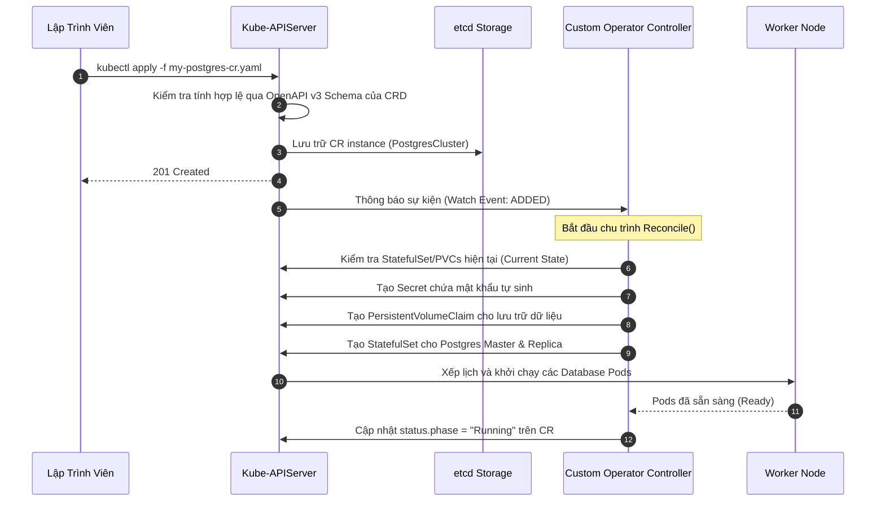
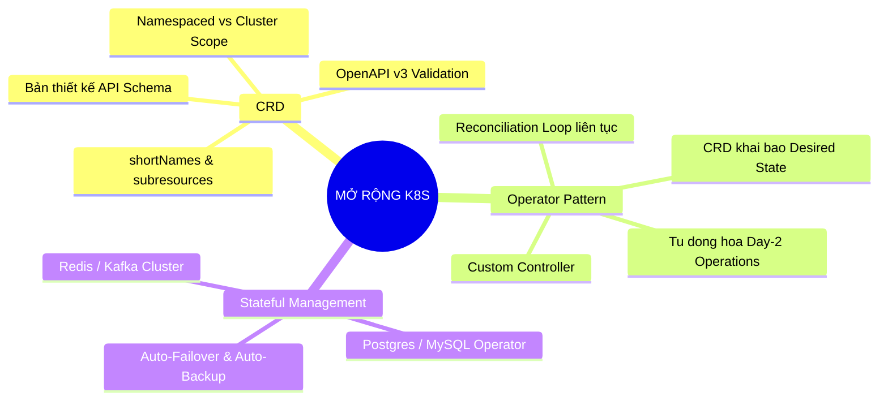


> [!IMPORTANT]
> **Mục tiêu kỹ thuật bài học**:
> - Hiểu rõ cách Kube-APIServer đăng ký động các RESTful Endpoints mới khi một CRD được nạp vào cụm.
> - Phân biệt chính xác sự khác biệt giữa tài nguyên bản địa (Native Resources) và tài nguyên tùy biến (Custom Resources).
> - Nắm vững nguyên lý hoạt động của Operator Pattern trong việc tự động hóa quản trị các ứng dụng có trạng thái (Stateful Applications như PostgreSQL, Redis, Kafka).
> - Khai báo thành thạo CRD chuẩn OpenAPI v3 Schema Validation và khởi tạo Custom Resources tương ứng.
> - Khắc phục các sự cố thường gặp: Custom Resource tạo thành công nhưng không sinh ra Pod, hoặc lỗi bị API Server từ chối do vi phạm schema validation.

---

## 1. Bản Chất Kiến Trúc & Tư Duy Cốt Lõi: Mở Rộng API Kubernetes Với CRD & Operator

Mặc định, Kubernetes cung cấp sẵn một tập hợp các tài nguyên bản địa (Native Resources) như `Pod`, `Service`, `Deployment`, `ConfigMap`. Tuy nhiên, với các ứng dụng phức tạp có trạng thái (Stateful Applications) như cơ sở dữ liệu phân tán (PostgreSQL HA, Redis Cluster), việc quản lý thủ công các thao tác sao lưu (backup), phục hồi (restore), chuyển dịch dự phòng (failover) và nâng cấp phiên bản (rolling upgrade) đòi hỏi kiến thức vận hành chuyên sâu của con người (Human Operational Knowledge).

Để giải quyết bài toán này, Kubernetes cung cấp cơ chế **Custom Resource Definition (CRD)** và mô hình kiến trúc **Operator Pattern**.

```mermaid
flowchart TD
    subgraph OperatorArchitecture["Kiến Trúc Operator Pattern Toàn Diện"]
        User["Lập trình viên (kubectl apply)"] -->|"Tạo Custom Resource (CR)"| APIServer["Kube-APIServer (REST API)"]
        
        subgraph StorageValidation["Validation & Storage"]
            CRD["CRD (OpenAPI v3 Schema)"] -.->|"Validate Payload"| APIServer
            APIServer -->|"Lưu trữ Desired State"| etcd[("etcd Cluster")]
        end

        subgraph OperatorPod["Custom Controller (Operator Pod)"]
            Informer["Informer / Reflector (Watch Event)"]
            Queue["Work Queue"]
            Reconcile["Reconciliation Loop (Reconciler)"]
            
            Informer --> Queue
            Queue --> Reconcile
        end

        APIServer -->|"Watch Event Notification"| Informer
        Reconcile -->|"Quan sát Current State & Điều phối"| APIServer
        
        subgraph NativeWorkloads["Hạ Tầng Native Được Tự Động Sinh Ra"]
            Pods["StatefulSet / Pods (Database Engine)"]
            PVCs["PersistentVolumeClaims (Data Storage)"]
            SVC["Services (Leader / Follower Endpoints)"]
            Sec["Secrets (Auto-generated Credentials)"]
        end

        Reconcile -.->|"Quản lý vòng đời"| NativeWorkloads
    end

    style OperatorArchitecture fill:none,stroke:#3b82f6,stroke-width:2px
    style OperatorPod fill:none,stroke:#10b981,stroke-width:2px
    style NativeWorkloads fill:none,stroke:#f59e0b,stroke-width:2px
```



### 1.1. Phân Biệt CRD và Custom Resource (CR)

- **`CustomResourceDefinition` (CRD)**:
  - Là một tài nguyên quản trị ở cấp độ cụm (Cluster-scoped) thuộc nhóm API `apiextensions.k8s.io/v1`.
  - Đóng vai trò như một **bản vẽ kỹ thuật (Schema Blueprint)** định nghĩa tên gọi, nhóm API (`group`), phiên bản (`version`), phạm vi (`scope: Namespaced` hoặc `Cluster`), và cấu trúc các trường dữ liệu được phép thông qua chuẩn **OpenAPI v3 Schema Validation**.
- **`Custom Resource` (CR)**:
  - Là **thực thể dữ liệu (Instance)** được tạo ra dựa trên định nghĩa của CRD.
  - Chứa thông tin cấu hình cụ thể do lập trình viên khai báo (ví dụ số lượng replica của database, dung lượng storage, cấu hình backup).

---

### 1.2. Mô Hình Vận Hành Operator Pattern: Vòng Lặp Điều Hòa (Reconciliation Loop)

Operator Pattern hoạt động dựa trên triết lý cốt lõi của Kubernetes: **Khai báo trạng thái mong muốn (Declarative Desired State)** và **Liên tục điều hòa (Continuous Reconciliation)**.

Một Operator hoàn chỉnh gồm 2 thành phần:
1. **CRD**: Cung cấp ngôn ngữ khai báo cho người dùng.
2. **Custom Controller**: Một tiến trình phần mềm (thường được viết bằng Go/Python/Rust) chạy dưới dạng Pod trong cụm, liên tục thực hiện vòng lặp vô tận:

$$\text{Reconcile}() : \quad \text{Observe}(\text{Current State}) \longrightarrow \text{Compare}(\text{Current}, \text{Desired}) \longrightarrow \text{Act}(\text{Create / Update / Delete})$$

Nếu phát hiện sự sai lệch (Drift) giữa trạng thái thực tế và khai báo trong CR (ví dụ một node cơ sở dữ liệu bị hỏng), Controller sẽ tự động tạo Pod mới, gắn lại PersistentVolume, và cấu hình lại cơ chế đồng bộ dữ liệu Replication mà không cần sự can thiệp của con người.

---

## 2. Bảng Ma Trận So Sánh Kỹ Thuật Toàn Diện (Engineering Matrix)

| Tiêu chí Kỹ thuật | Kubernetes Native Resources | Helm Chart Deployment | Kubernetes Operator Pattern |
| :--- | :--- | :--- | :--- |
| **Bản chất** | Đối tượng có sẵn trong mã nguồn K8s (Deployment, Pod, SVC) | Công cụ đóng gói và render template YAML tĩnh | Kết hợp CRD tùy biến + Controller điều hòa động thông minh |
| **Khả năng tự động hóa Vòng đời (Day-2 Ops)** | Cơ bản (Restart Pod, Rolling Update không nhận biết ứng dụng) | ❌ Không hỗ trợ (Chỉ hỗ trợ cài đặt và nâng cấp tham số tĩnh) | **Tự động hóa hoàn toàn** (Auto-Backup, Failover, Resharding, Data Migration) |
| **Nhận biết trạng thái ứng dụng (Domain Knowledge)** | Không nhận biết (Coi ứng dụng như một black-box container) | Không nhận biết | **Sở hữu tri thức miền sâu sắc** (Hiểu rõ cơ chế Master-Slave của DB) |
| **API Endpoints** | Cố định (`/api/v1`, `/apis/apps/v1`) | Sử dụng các API endpoints có sẵn | **Đăng ký endpoint mới** (ví dụ `/apis/database.example.com/v1`) |
| **Công cụ tương tác** | `kubectl` bản địa | `helm install`, `helm upgrade` | `kubectl` bản địa hoàn toàn (`kubectl get <custom-resource>`) |
| **Độ phức tạp phát triển** | Không cần phát triển | Thấp (Viết Jinja2 / Go templates) | Trung bình - Cao (Viết controller bằng Operator SDK / Kubebuilder) |

---

## 3. Kiến Trúc Môi Trường & Luồng Thực Thi Mẫu



### Manifest Mẫu 1: Định Nghĩa CRD Với OpenAPI v3 Schema Validation

```yaml
apiVersion: apiextensions.k8s.io/v1
kind: CustomResourceDefinition
metadata:
  name: internalapps.app.devops.io
spec:
  group: app.devops.io
  names:
    kind: InternalApp
    listKind: InternalAppList
    plural: internalapps
    singular: internalapp
    shortNames:
    - ia
  scope: Namespaced
  versions:
  - name: v1alpha1
    served: true
    storage: true
    schema:
      openAPIV3Schema:
        type: object
        properties:
          spec:
            type: object
            required: ["image", "replicas", "port"]
            properties:
              image:
                type: string
              replicas:
                type: integer
                minimum: 1
                maximum: 10
              port:
                type: integer
                minimum: 80
                maximum: 65535
              environment:
                type: string
                enum: ["dev", "staging", "production"]
          status:
            type: object
            properties:
              availableReplicas:
                type: integer
              phase:
                type: string
    subresources:
      status: {}
```

### Manifest Mẫu 2: Custom Resource (CR) Khai Báo Ứng Dụng

```yaml
apiVersion: app.devops.io/v1alpha1
kind: InternalApp
metadata:
  name: billing-frontend
  namespace: default
spec:
  image: "nginx:alpine"
  replicas: 3
  port: 8080
  environment: "production"
```

---

## 4. Phân Tích Cạm Bẫy Thực Chiến: "Custom Resource Áp Dụng Thành Công Nhưng Không Tạo Được Ứng Dụng"

### Tình Huống Thực Tế
Một nhóm phát triển sử dụng Redis Operator để triển khai cụm Redis Cache. Lập trình viên chạy lệnh `kubectl apply -f redis-cluster.yaml`. Lệnh thực thi trả về kết quả `rediscluster.cache.example.com/main-redis created`. Tuy nhiên, sau 20 phút, không có bất kỳ Pod Redis nào xuất hiện trong cụm.

### Hậu Quả & Log Lỗi Thực Tế:
```text
NAME                                  READY   STATUS    RESTARTS   AGE
(No resources found in default namespace)
```

Khi kiểm tra Custom Resource (`kubectl describe rediscluster main-redis`):
```text
Name:         main-redis
Namespace:    default
Labels:       <none>
Annotations:  <none>
API Version:  cache.example.com/v1alpha1
Kind:         RedisCluster
Spec:
  Nodes:      3
Status:       <none>
Events:       <none>
```

Tiếp tục kiểm tra Namespace chứa Operator (`kubectl get pods -n operator-system`):
```text
NAME                               READY   STATUS             RESTARTS      AGE
redis-operator-6d8b98b7f8-w4f2x    0/1     CrashLoopBackOff   14 (3m ago)   45m
```

Kiểm tra log của Operator Controller (`kubectl logs -n operator-system redis-operator-6d8b98b7f8-w4f2x`):
```text
2026-09-12 13:42:01 ERROR controller-runtime.manager.controller.rediscluster "msg"="Reconciler error" 
"error"="User \"system:serviceaccount:operator-system:redis-operator-sa\" cannot create resource \"statefulsets\" in API group \"apps\" in the namespace \"default\""
```

### 5-Whys Root Cause Analysis:
1. **Tại sao không có Pod Redis nào được tạo?** Do Operator Controller không thể sinh ra đối tượng `StatefulSet`.
2. **Tại sao Operator không tạo được StatefulSet?** Do API Server trả về lỗi `403 Forbidden` (RBAC Permission Denied).
3. **Tại sao Operator bị thiếu quyền?** Do `ClusterRole` hoặc `RoleBinding` của ServiceAccount `redis-operator-sa` chỉ được cấp quyền trong namespace `operator-system` mà chưa được cấp quyền quản trị trên namespace `default`.
4. **Tại sao lệnh `kubectl apply` ban đầu vẫn thành công?** Vì `kubectl apply` chỉ lưu thực thể Custom Resource vào etcd qua API Server. Bản thân API Server không trực tiếp tạo Pod thay cho Operator.
5. **Giải pháp chuẩn:** 
   - Kiểm tra trạng thái sức khỏe của Operator Pod (`kubectl get pods -n <operator-ns>`).
   - Cấp phát đầy đủ quyền RBAC (Role/ClusterRole) cho ServiceAccount của Operator Controller.

---

## 5. Hands-on Lab: Định Nghĩa CRD, Khởi Tạo Custom Resource & Vận Hành Operator (8 Bước)

| Bước | Mục Tiêu Kỹ Thuật | Lệnh Thực Hiện Chính |
| :--- | :--- | :--- |
| **1** | Khởi tạo Namespace Lab cô lập | `kubectl create ns ckad-crd-lab` |
| **2** | Khảo sát danh sách API Resources và CRD hiện hữu | `kubectl api-resources && kubectl get crd` |
| **3** | Định nghĩa CRD `AppEngine` với OpenAPI v3 validation | `kubectl apply -f 1-appengine-crd.yaml` |
| **4** | Khảo sát tài nguyên mới qua `kubectl explain` | `kubectl explain appengine.spec` |
| **5** | Khởi tạo Custom Resource hợp lệ | `kubectl apply -f 2-valid-cr.yaml` |
| **6** | Thử nghiệm tạo Custom Resource sai schema (Bị chặn) | `kubectl apply -f 3-invalid-cr.yaml` |
| **7** | Cập nhật và truy vấn trạng thái Custom Resource | `kubectl get ae,appengine -o wide` |
| **8** | Dọn dẹp tài nguyên Lab | `kubectl delete crd appengines.core.ckad.io && kubectl delete ns` |

---

### Bước 1: Khởi Tạo Namespace Lab Cô Lập

```bash
kubectl create namespace ckad-crd-lab
kubectl config set-context --current --namespace=ckad-crd-lab
```

---

### Bước 2: Khảo Sát Danh Sách CRD Hiện Có Trên Cụm

```bash
# Liệt kê tất cả CustomResourceDefinitions đang có trên cụm
kubectl get crd

# Kiểm tra các API Groups và Resources
kubectl api-resources --namespaced=true
```

---

### Bước 3: Khai Báo CRD Chuẩn OpenAPI v3

Tạo file `1-appengine-crd.yaml`:
```yaml
apiVersion: apiextensions.k8s.io/v1
kind: CustomResourceDefinition
metadata:
  name: appengines.core.ckad.io
spec:
  group: core.ckad.io
  names:
    kind: AppEngine
    listKind: AppEngineList
    plural: appengines
    singular: appengine
    shortNames:
    - ae
  scope: Namespaced
  versions:
  - name: v1
    served: true
    storage: true
    schema:
      openAPIV3Schema:
        type: object
        properties:
          spec:
            type: object
            required: ["image", "replicas"]
            properties:
              image:
                type: string
              replicas:
                type: integer
                minimum: 1
                maximum: 5
              servicePort:
                type: integer
                default: 80
    subresources:
      status: {}
```
```bash
kubectl apply -f 1-appengine-crd.yaml
kubectl wait --for condition=established --timeout=30s crd/appengines.core.ckad.io
```

---

### Bước 4: Khảo Sát Schema Với `kubectl explain`

```bash
# Kiểm tra tài liệu tự động sinh từ OpenAPI schema
kubectl explain appengine
kubectl explain appengine.spec
```
> Bạn sẽ thấy Kubernetes tự động tạo tài liệu mô tả chi tiết các trường `image`, `replicas`, `servicePort` giống như các tài nguyên bản địa!

---

### Bước 5: Khởi Tạo Custom Resource Hợp Lệ

Tạo file `2-valid-cr.yaml`:
```yaml
apiVersion: core.ckad.io/v1
kind: AppEngine
metadata:
  name: my-payment-service
spec:
  image: "nginx:alpine"
  replicas: 3
  servicePort: 8080
```
```bash
kubectl apply -f 2-valid-cr.yaml
# Truy vấn bằng tên đầy đủ hoặc short name
kubectl get appengine
kubectl get ae my-payment-service -o yaml
```

---

### Bước 6: Kiểm Chứng Cơ Chế Bắt Lỗi Schema Validation

Tạo file `3-invalid-cr.yaml` thử tạo replica = 10 (vượt quá `maximum: 5`) và thiếu trường bắt buộc `image`:
```yaml
apiVersion: core.ckad.io/v1
kind: AppEngine
metadata:
  name: invalid-app
spec:
  replicas: 10
```
```bash
kubectl apply -f 3-invalid-cr.yaml
```
> API Server từ chối ngay lập tức:
> `error: error validating "3-invalid-cr.yaml": error validating data: [ValidationError(AppEngine.spec): missing required field "image", ValidationError(AppEngine.spec.replicas): Invalid value: 10: spec.replicas in body should be less than or equal to 5]`

---

### Bước 7: Cập Nhật Custom Resource

```bash
# Sửa đổi cấu hình Custom Resource nhanh qua kubectl patch
kubectl patch ae my-payment-service --type='merge' -p '{"spec":{"replicas":4}}'
kubectl get ae my-payment-service -o jsonpath='{.spec.replicas}'
```
> In ra: `4`.

---

### Bước 8: Dọn Dẹp Môi Trường Lab

```bash
kubectl delete crd appengines.core.ckad.io
kubectl delete ns ckad-crd-lab
```

---

## 6. 10 Câu Hỏi Tự Kiểm Tra Chuyên Sâu (Self-Check Q&A Accordion)

<details class="qa-card">
<summary><b>1. CustomResourceDefinition (CRD) và Custom Resource (CR) khác nhau như thế nào?</b></summary>
<div class="qa-answer">
<p><b>CRD:</b> Là định nghĩa kỹ thuật (Schema Definition) ở cấp độ cụm, đóng vai trò tạo ra một loại tài nguyên API mới trên Kube-APIServer.</p>
<p><b>CR:</b> Là đối tượng thực thể cụ thể (Instance) được lập trình viên khởi tạo dựa trên schema mà CRD đã thiết lập.</p>
</div>
</details>

<details class="qa-card">
<summary><b>2. Hai thành phần cốt lõi tạo nên kiến trúc Operator Pattern hoàn chỉnh là gì?</b></summary>
<div class="qa-answer">
<p>Hai thành phần bắt buộc gồm: <b>Custom Resource Definition (CRD)</b> (dùng để khai báo trạng thái mong muốn của ứng dụng) và <b>Custom Controller</b> (tiến trình thực hiện vòng lặp điều hòa Reconciliation Loop để tự động quản lý hạ tầng tương ứng).</p>
</div>
</details>

<details class="qa-card">
<summary><b>3. Lợi ích lớn nhất của việc khai báo OpenAPI v3 Schema Validation bên trong CRD là gì?</b></summary>
<div class="qa-answer">
<p>Giúp Kube-APIServer <b>kiểm tra và xác thực dữ liệu ngay tại tầng tiếp nhận API</b> (chặn các trường thiếu, sai kiểu dữ liệu hoặc vượt ngưỡng cho phép) trước khi ghi vào etcd, bảo vệ hệ thống khỏi dữ liệu rác mà không cần phụ thuộc vào logic kiểm tra của Controller.</p>
</div>
</details>

<details class="qa-card">
<summary><b>4. Lệnh kubectl nào dùng để tra cứu nhanh danh sách tất cả các loại tài nguyên và shortNames được hỗ trợ trên cụm?</b></summary>
<div class="qa-answer">
<p>Sử dụng lệnh: <code>kubectl api-resources</code>. Lệnh này hiển thị đầy đủ tên loại tài nguyên (Kind), tên số nhiều (NAME), tên viết tắt (SHORTNAMES), API Group và phạm vi (NAMESPACED: true/false).</p>
</div>
</details>

<details class="qa-card">
<summary><b>5. Tại sao khi xóa một CRD (`kubectl delete crd <crd-name>`), toàn bộ các Custom Resources liên quan cũng bị xóa theo?</b></summary>
<div class="qa-answer">
<p>Khi xóa CRD, Kube-APIServer sẽ xóa hoàn toàn API endpoint tương ứng. Cơ chế Garbage Collection của Kubernetes sẽ tự động dọn dẹp (cascade delete) toàn bộ các thực thể Custom Resources thuộc định nghĩa CRD đó được lưu trữ trong etcd.</p>
</div>
</details>

<details class="qa-card">
<summary><b>6. Điểm khác biệt giữa `scope: Namespaced` và `scope: Cluster` trong định nghĩa CRD là gì?</b></summary>
<div class="qa-answer">
<p><b><code>Namespaced</code>:</b> Các thực thể Custom Resources được cô lập bên trong từng Namespace riêng biệt (giống như Pod hay Deployment).</p>
<p><b><code>Cluster</code>:</b> Các thực thể tồn tại ở cấp độ toàn cụm, không phụ thuộc vào Namespace nào (giống như Node hay ClusterRole).</p>
</div>
</details>

<details class="qa-card">
<summary><b>7. Vòng lặp điều hòa (Reconciliation Loop) trong Custom Controller hoạt động theo nguyên lý nào?</b></summary>
<div class="qa-answer">
<p>Controller liên tục thực hiện 3 bước:</p>
<div>1. <b>Observe:</b> Lắng nghe sự kiện (Watch Events) từ APIServer để nắm bắt trạng thái thực tế (Current State).</div>
<div>2. <b>Analyze:</b> So sánh trạng thái thực tế với trạng thái khai báo trong CR (Desired State).</div>
<div>3. <b>Act:</b> Thực hiện các hành động tạo/sửa/xóa các tài nguyên Kubernetes bản địa (Pods, PVCs, Services) để đưa Current State khớp với Desired State.</div>
</div>
</details>

<details class="qa-card">
<summary><b>8. Trường `shortNames` trong spec của CRD mang lại sự tiện lợi gì khi thao tác CLI?</b></summary>
<div class="qa-answer">
<p>Cho phép lập trình viên sử dụng các từ viết tắt thay vì phải gõ toàn bộ tên đầy đủ của tài nguyên khi chạy lệnh kubectl (ví dụ khai báo <code>shortNames: ["ae"]</code> cho phép gõ <code>kubectl get ae</code> thay vì <code>kubectl get appengines</code>).</p>
</div>
</details>

<details class="qa-card">
<summary><b>9. Khi một Custom Resource được tạo nhưng không thấy sinh ra bất kỳ Pod nào, các bước chẩn đoán đầu tiên là gì?</b></summary>
<div class="qa-answer">
<p>Các bước kiểm tra chuẩn:</p>
<div>1. Kiểm tra mô tả chi tiết và sự kiện của CR: <code>kubectl describe &lt;kind&gt; &lt;name&gt;</code>.</div>
<div>2. Kiểm tra xem Operator Controller Pod có đang chạy bình thường không: <code>kubectl get pods -A</code>.</div>
<div>3. Đọc log của Operator Controller Pod: <code>kubectl logs -n &lt;operator-ns&gt; &lt;controller-pod&gt;</code> để tìm các lỗi RBAC Permission Denied hoặc Reconcile Error.</div>
</div>
</details>

<details class="qa-card">
<summary><b>10. Khối `subresources.status: {}` trong định nghĩa CRD có ý nghĩa gì?</b></summary>
<div class="qa-answer">
<p>Kích hoạt endpoint phụ <code>/status</code> cho Custom Resource. Điều này giúp tách biệt quyền cập nhật <code>spec</code> (do người dùng chỉnh sửa) và quyền cập nhật <code>status</code> (chỉ dành riêng cho Operator Controller), tăng tính bảo mật và giảm thiểu xung đột dữ liệu đồng thời.</p>
</div>
</details>

---

## 7. Tổng Kết & Lộ Trình Bài Học Tiếp Theo



Hiểu rõ CRD và Operator Pattern giúp lập trình viên ứng dụng tự tin làm việc với các hệ sinh thái Cloud Native phức tạp, khai thác tối đa sức mạnh tự động hóa của nền tảng Kubernetes.

> [!TIP]
> **Bài học tiếp theo**: Làm chủ mạng Kubernetes từ góc nhìn lập trình viên với **[Bài 14: Mạng Cho Người Viết Ứng Dụng: Service, Ingress & NetworkPolicy Isolation](ckad-14-14-mang-cho-nguoi-viet-ung-dung.html)**.

