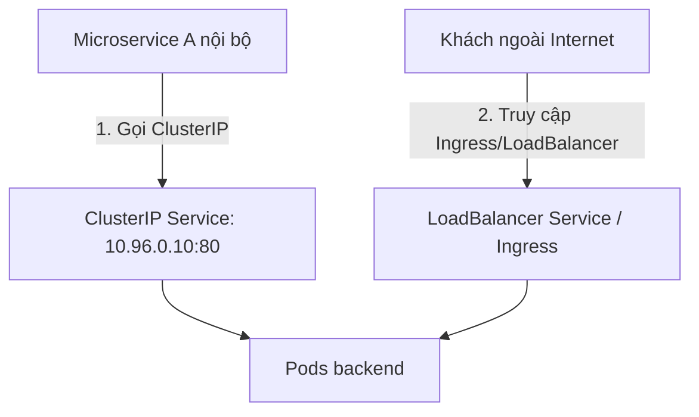
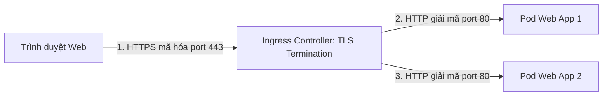
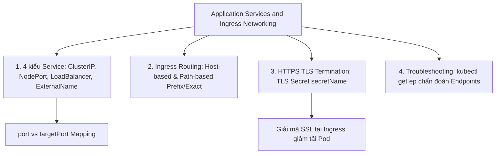
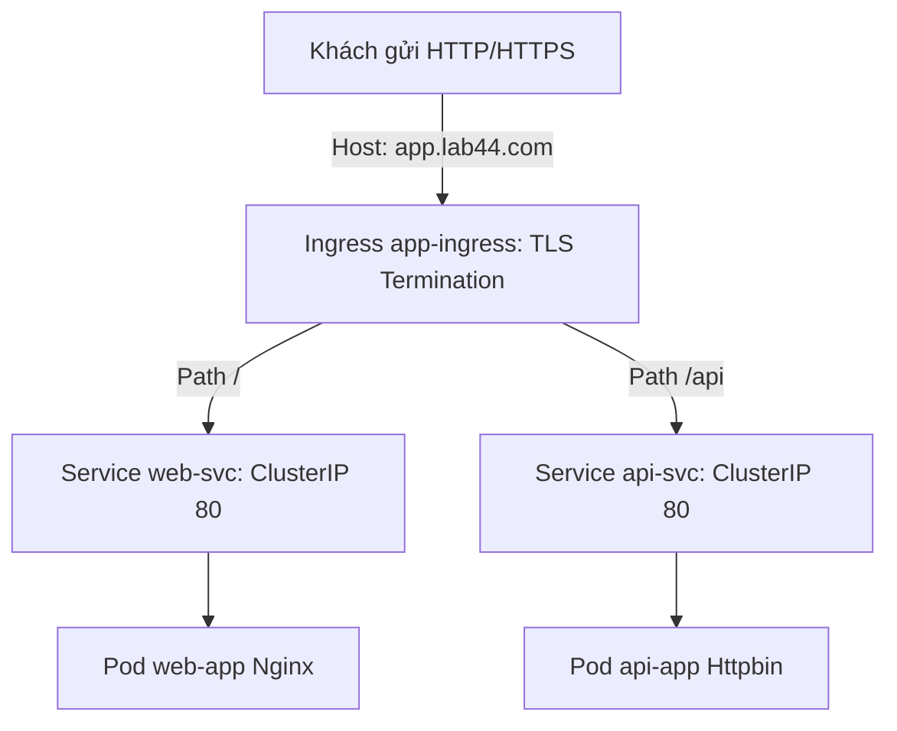


# [BÀI 14] MẠNG ỨNG DỤNG DÀNH CHO DEVELOPER: SERVICE DISCOVERY, INGRESS ROUTING THEO HOST/PATH & CHỨNG CHỈ TLS

Trong kỷ nguyên điện toán đám mây và kiến trúc microservices phân tán quy mô lớn, **Kubernetes (CKAD)** đóng vai trò là nền tảng điều phối container (Container Orchestration) tiêu chuẩn công nghiệp. Để làm chủ hệ thống trong môi trường sản xuất (Production) cũng như chinh phục kỳ thi chứng chỉ quốc tế của Linux Foundation / CNCF, kỹ sư không chỉ nắm vững các câu lệnh thao tác cơ bản mà phải thấu hiểu sâu sắc bản chất cơ chế tầng thấp: từ chu trình điều hòa (Reconciliation Loop), cấu trúc điều phối tài nguyên, kiến trúc mạng CNI, lưu trữ CSI cho đến các chuẩn mực an ninh phòng thủ chiều sâu.

Bài viết chuyên sâu này sẽ đồng hành cùng bạn giải mã toàn diện bức tranh kiến trúc, phân tích các đánh đổi kỹ thuật thực chiến (Engineering Trade-offs), cung cấp bài thực hành Lab từng bước và bộ câu hỏi phỏng vấn chuẩn Architect / Lead Engineer.

---

## 1. Bản Chất Kiến Trúc & Cơ Chế Vận Hành Tầng Thấp

| # | Câu hỏi ôn tập | Đáp án chuẩn ngắn gọn |
|---|---|---|
| 1 | Mục đích chính của CustomResourceDefinition (CRD)? | Mở rộng API Server bằng cách **đăng ký loại tài nguyên Kind mới** |
| 2 | Thành phần trong CRD kiểm tra cú pháp và kiểu dữ liệu? | Khối **`schema.openAPIV3Schema`** |
| 3 | Mô hình kết hợp CRD với Custom Controller tự động hóa app? | **`Operator Pattern`** |
| 4 | Vòng lặp đối sánh Desired State và Actual State của Controller? | **`Reconciliation Loop`** |
| 5 | Lệnh CLI xem toàn bộ tài nguyên API và tên viết tắt shortNames? | **`kubectl api-resources`** |


> **"Cấu hình và khắc phục truy cập mạng microservices ở góc độ lập trình viên (Application Services and Ingress Networking) là nội dung trọng tâm thuộc miền Services and Networking trong CKAD, đòi hỏi lập trình viên phải lựa chọn chính xác loại `Service` phù hợp (`ClusterIP` nội bộ, `NodePort` thử nghiệm, `LoadBalancer` đám mây); làm chủ kỹ thuật định tuyến traffic L7 HTTP/HTTPS qua `Ingress` dựa trên tên miền (`host`) và đường dẫn URL (`path: /api`, `pathType: Prefix`); đồng thời bảo mật truyền thông mạng bằng cách gắn chứng chỉ TLS Secret (`secretName`) vào Ingress để kích hoạt cơ chế HTTPS TLS Termination, giúp giải mã traffic an toàn trước khi chuyển tiếp vào các Pod container bên trong."**

**Kết quả từ các buổi trước được sử dụng lại:**

| Kết quả / Công cụ | Buổi + số hiệu `QT` | Dùng ở đâu trong buổi này |
|---|---|---|
| Tạo Secret TLS mã hóa chứng chỉ SSL | Buổi 40 `QT 5.2` | Nhúng TLS Secret (`kubernetes.io/tls`) vào khối `ingress.spec.tls` |
| Sử dụng Label và Selector ghép nối tài nguyên | Buổi 17 `QT 4.1` | Ghép nối Service selector với Pod labels |
| Triển khai Nginx Web Server | Buổi 16 `QT 4.1` | Làm backend service cho Ingress Controller định tuyến |

---


| # | Kỹ năng thực hiện được | Hiện vật chứng minh |
|---|---|---|
| 1 | Lựa chọn và tạo chính xác 4 loại Service (`ClusterIP`, `NodePort`, `LoadBalancer`, `ExternalName`) | Tệp Service YAML có thuộc tính `spec.type` |
| 2 | Cấu hình Ingress định tuyến theo Hostname (`host`) và đường dẫn URL (`path`) | Tệp Ingress YAML chứa `rules.host` và `rules.http.paths` |
| 3 | Phân biệt chính xác cơ chế khớp nối `pathType: Prefix` và `pathType: Exact` | Bảng đối sánh các đường dẫn URL được match bởi Prefix vs Exact |
| 4 | Cấu hình HTTPS TLS Termination mã hóa an toàn qua TLS Secret | Khối `ingress.spec.tls` chứa `secretName` |
| 5 | Chẩn đoán và giải quyết sự cố Service bị rỗng Endpoints | Nhật ký sửa lỗi selector qua lệnh `kubectl get ep` |

---


| Kiến thức tiên quyết | Nguồn tự học nếu thiếu |
|---|---|
| Nguyên tắc ghép nối tài nguyên bằng Label và Selector | Buổi 17 (`QT 4.1`) |
| Cách khởi tạo TLS Secret chứa cặp khóa cert/key | Buổi 40 (`QT 5.2`) |
| Mô hình mạng căn bản TCP/IP và cổng Port | Buổi 03 (`QT 4.1`) |

---


### 3.1. Thuật ngữ Việt–Anh

| # | Thuật ngữ tiếng Việt | Tiếng Anh tương đương | Ghi chú chuẩn hoá trong thân bài |
|---|---|---|---|
| 1 | Dịch vụ định tuyến nội bộ | ClusterIP Service | Loại Service mặc định cấp IP ảo nội bộ chỉ truy cập trong cụm |
| 2 | Dịch vụ mở cổng Node | NodePort Service | Loại Service mở port cố định (30000-32767) trên tất cả các Node |
| 3 | Dịch vụ cân bằng tải đám mây | LoadBalancer Service | Loại Service tích hợp Cloud Provider tạo IP công cộng |
| 4 | Dịch vụ trỏ tên miền ngoài | ExternalName Service | Loại Service trả về bản ghi CNAME trỏ tới tên miền bên ngoài |
| 5 | Bộ định tuyến cổng vào | Ingress Controller | Tiến trình (như Nginx Ingress) thực thi các quy tắc định tuyến L7 |
| 6 | Quy tắc định tuyến | Ingress Rule | Khai báo định tuyến traffic dựa trên Host header và URL Path |
| 7 | Định tuyến theo tên miền | Host-based Routing | Định tuyến traffic tới các Service khác nhau dựa vào `host` header |
| 8 | Định tuyến theo đường dẫn | Path-based Routing | Định tuyến traffic tới các Service dựa vào URL path (`/api`, `/web`) |
| 9 | Kiểu đường dẫn khớp nối | Path Type (`Prefix` / `Exact`) | Quy tắc so khớp đường dẫn URL (`Prefix` hoặc `Exact`) |
| 10 | Giải mã mã hóa TLS tại cổng vào | HTTPS TLS Termination | Cơ chế giải mã HTTPS tại Ingress trước khi gửi HTTP vào Pod |
| 11 | Bí mật chứng chỉ mã hóa | TLS Secret (`kubernetes.io/tls`) | Secret chứa cặp khóa cert/key phục vụ giải mã HTTPS |
| 12 | Danh sách điểm đích đính kèm | Endpoints (`ep`) | Danh sách IP và Port thực tế của các Pod đang được Service trỏ tới |
| 13 | Khảo sát kiểm tra cổng | Port Mapping (`targetPort` vs `port`) | `port` của Service vs `targetPort` của container |
| 14 | Lớp dịch vụ ứng dụng | Layer 7 Application Traffic | Traffic tầng ứng dụng HTTP/HTTPS chứa Host, Path, Headers |


Mô hình Lễ tân Tòa nhà và Chiếc Máy Phiên dịch HTTPS: `Service` giống như Số máy bàn nội bộ của từng phòng ban trong công ty (số bàn `ClusterIP` giúp các nhân viên nội bộ gọi cho nhau). `Ingress` giống như Bàn Lễ tân tòa nhà nằm ở cổng ra vào: khi khách hỏi "Cho tôi gặp phòng Kinh doanh" (`host: sales.example.com`), Lễ tân sẽ chuyển khách sang số bàn Kinh doanh; khi khách hỏi "Cho tôi xin xem bảng giá" (`path: /pricing`), Lễ tân chuyển sang phòng Kế toán. `TLS Termination` giống như chiếc Máy phiên dịch bảo mật đặt ở Bàn Lễ tân: giải mã các bức thư mã hóa tiếng nước ngoài (HTTPS TLS) thành tiếng Việt thông thường (HTTP) rồi mới đưa cho nhân viên phòng ban đọc.

---

### 1.1. Phân loại 4 kiểu Service ở góc độ ứng dụng (`ClusterIP`, `NodePort`, `LoadBalancer`, `ExternalName`) (12 phút)

**Nguyên lý cốt lõi:** `ClusterIP` là loại Service mặc định cấp IP ảo nội bộ chỉ truy cập được bên trong cụm; `NodePort` mở cổng trên 30000-32767 của tất cả các Node; `LoadBalancer` tự tạo Cân bằng tải đám mây; `ExternalName` trả về CNAME trỏ ra ngoài cụm.

**Giải thích cơ chế ngầm:** Giúp lập trình viên lựa chọn đúng loại hình công bố dịch vụ phù hợp với mô hình bảo mật và chi phí hạ tầng. Microservices giao tiếp nội bộ dùng `ClusterIP`; ứng dụng công cộng đám mây dùng `LoadBalancer` hoặc `Ingress`.

> [!WARNING]
> **CẠM BẪY THỰC CHIẾN:**
> Chọn loại `NodePort` cho 50 microservices nội bộ làm cạn kiệt dải port 30000-32767 trên các Node và mở toang lỗ hổng bảo mật.

**Minh hoạ.**



**Nguyên lý cốt lõi:** Khấu trừ sự khác nhau giữa `port` và `targetPort`: `port` là cổng ảo mà các client bên trong cụm gọi vào Service; `targetPort` là cổng thực tế mà ứng dụng container đang lắng nghe bên trong Pod.

**Giải thích cơ chế ngầm:** Giúp trừu tượng hóa cổng ứng dụng. Cho dù container NodeJS lắng nghe cổng 3000 hay Python lắng nghe cổng 8000, Service vẫn có thể expose ra ngoài qua cùng cổng chuẩn 80.

> [!WARNING]
> **CẠM BẪY THỰC CHIẾN:**
> Khai báo nhầm `targetPort: 80` cho container đang chạy ở port 3000 làm Service gửi traffic đến sai cổng và gây lỗi kết nối `Connection refused`.

**Minh hoạ.**

```yaml
spec:
  type: ClusterIP
  ports:
    - port: 80 # Cổng ảo của Service cho các Pod khác gọi vào
      targetPort: 3000 # Cổng thực tế container NodeJS lắng nghe
  selector:
    app: node-web
```

---

### 1.2. Định tuyến L7 Ingress theo Hostname và Path (`Prefix` / `Exact`) (12 phút)

**Nguyên lý cốt lõi:** `Ingress` quy định các luật định tuyến L7 (Host-based và Path-based); cờ `pathType: Prefix` so khớp mọi đường dẫn bắt đầu bằng tiền tố đó (như `/api`, `/api/v1`), trong khi `pathType: Exact` yêu cầu khớp chính xác 100%.

**Giải thích cơ chế ngầm:** Giúp tiết kiệm địa chỉ IP công cộng bằng cách gom hàng chục microservices riêng biệt về chung một điểm vào Ingress Controller duy nhất, định tuyến thông minh theo tên miền và đường dẫn.

> [!WARNING]
> **CẠM BẪY THỰC CHIẾN:**
> Dùng `pathType: Exact` cho đường dẫn `/api` làm cho các request truy cập `/api/users` bị Ingress trả về lỗi HTTP `404 Not Found`.

**Minh hoạ.**

```yaml
spec:
  ingressClassName: nginx
  rules:
    - host: app.example.com
      http:
        paths:
          - path: /
            pathType: Prefix
            backend:
              service:
                name: web-svc
                port: {number: 80}
          - path: /api
            pathType: Prefix
            backend:
              service:
                name: api-svc
                port: {number: 80}
```

**Nguyên lý cốt lõi:** Một Ingress spec có thể khai báo nhiều khối `rules` phục vụ định tuyến đa tên miền (`host: app1.com` trỏ Service 1, `host: app2.com` trỏ Service 2) trên cùng một địa chỉ IP công cộng của Ingress Controller.

**Giải thích cơ chế ngầm:** Tối ưu hóa chi phí hạ tầng Cloud Load Balancer. Thay vì phải trả tiền cho 10 Cloud Load Balancers cho 10 tên miền, ta chỉ cần 1 Cloud Load Balancer đằng trước Ingress Controller.

> [!WARNING]
> **CẠM BẪY THỰC CHIẾN:**
> Tạo 10 tệp Ingress riêng biệt có cấu hình phân tán khó quản lý thay vì gộp chung các rules hợp lý.

**Minh hoạ.**

```yaml
rules:
  - host: store.example.com
    http:
      paths:
        - path: /
          pathType: Prefix
          backend: {service: {name: store-svc, port: {number: 80}}}
  - host: admin.example.com
    http:
      paths:
        - path: /
          pathType: Prefix
          backend: {service: {name: admin-svc, port: {number: 80}}}
```

---

### 1.3. Cơ chế HTTPS TLS Termination trong Ingress với TLS Secret (10 phút)

**Nguyên lý cốt lõi:** HTTPS TLS Termination giải mã mã hóa SSL/TLS tại cấp Ingress Controller; traffic gửi từ Ingress vào Pod backend phía sau chuyển thành HTTP thông thường giúp giảm tải CPU giải mã cho container ứng dụng.

**Giải thích cơ chế ngầm:** Giải phóng container ứng dụng khỏi nhiệm vụ xử lý chứng chỉ SSL phức tạp, tập trung tài nguyên CPU cho logic nghiệp vụ chính.

> [!WARNING]
> **CẠM BẪY THỰC CHIẾN:**
> Bắt từng container microservice phải tự cài đặt cert SSL gây lãng phí CPU và khó khăn trong việc tự động gia hạn chứng chỉ.

**Minh hoạ.**



**Nguyên lý cốt lõi:** Để bật HTTPS trên Ingress, bắt buộc phải khai báo khối `spec.tls` chỉ định mảng `hosts` và tên `secretName` trỏ tới một Secret kiểu `kubernetes.io/tls` chứa đúng 2 khóa `tls.crt` và `tls.key`.

**Giải thích cơ chế ngầm:** Ingress Controller nạp cặp khóa public cert và private key từ TLS Secret để thực hiện bắt tay mã hóa TLS (TLS Handshake) với trình duyệt web của người dùng.

> [!WARNING]
> **CẠM BẪY THỰC CHIẾN:**
> Khai báo `secretName` trỏ tới Secret kiểu `Opaque` làm Ingress Controller báo lỗi `Secret does not contain valid TLS certificate`.

**Minh hoạ.**

```yaml
spec:
  tls:
    - hosts:
        - app.example.com
      secretName: app-tls-secret # Secret kiểu kubernetes.io/tls
  rules:
    - host: app.example.com
      http:
        paths:
          - path: /
            pathType: Prefix
            backend: {service: {name: web-svc, port: {number: 80}}}
```

**Nguyên lý cốt lõi:** Khi Service không kết nối được tới Pod (lỗi 502/504 Bad Gateway), sử dụng lệnh `kubectl get endpoints <service-name>` để kiểm tra xem cột `ENDPOINTS` có hiển thị danh sách IP của Pod hay không.

**Giải thích cơ chế ngầm:** Lỗi 502/504 Bad Gateway ở Ingress thường xuất phát từ việc Service selector gõ sai nhãn (label), làm cho danh sách Endpoints bị rỗng `<none>`, Service không tìm thấy Pod nào để chuyển tiếp traffic.

> [!WARNING]
> **CẠM BẪY THỰC CHIẾN:**
> Loay hoay sửa Ingress spec khi thực chất nguyên nhân hỏng là do Service selector gõ sai nhãn Pod.

**Minh hoạ.**

```bash
# Kiểm tra Endpoints của Service:
kubectl get endpoints web-svc -n prod
# Kết quả đúng: ENDPOINTS 10.244.1.15:80,10.244.2.20:80
# Kết quả sai (RỖNG): ENDPOINTS <none>  <-- LỖI SELECTOR!
```

---

### 1.4. Đưa vào cụm thật (4 phút)

**Nguyên lý cốt lõi:** Bản kê khai Ingress chuẩn Production hoàn chỉnh bắt buộc phải chứa `ingressClassName: nginx`, khối `rules` (host + path + service) và khối `tls` (hosts + secretName).

**Giải thích cơ chế ngầm:** Đảm bảo tệp Ingress được Nginx Ingress Controller tiếp nhận định tuyến chính xác và hỗ trợ mã hóa bảo mật HTTPS TLS termination theo đúng chuẩn Production.

> [!WARNING]
> **CẠM BẪY THỰC CHIẾN:**
> Bỏ qua cờ `ingressClassName: nginx` làm cho Ingress Controller bị bỏ sót tệp Ingress không tiếp nhận định tuyến.

**Minh hoạ.**

```yaml
apiVersion: networking.k8s.io/v1
kind: Ingress
metadata:
  name: prod-ingress
  namespace: prod
spec:
  ingressClassName: nginx
  tls:
    - hosts:
        - api.prod.com
      secretName: prod-tls-secret
  rules:
    - host: api.prod.com
      http:
        paths:
          - path: /
            pathType: Prefix
            backend:
              service:
                name: api-svc
                port:
                  number: 80
```

**Áp vào cụm đang chạy thì làm gì trước:**
1. Tạo Secret TLS chứa cert và key trước bằng lệnh `kubectl create secret tls`.
2. Kiểm tra tên `ingressClassName` có sẵn trên cụm qua lệnh `kubectl get ingressclass`.
3. Kiểm tra danh sách Endpoints của các Service backend qua `kubectl get ep`.

**Cái gì hỏng nếu áp thẳng lên prod:**
- Khai báo nhầm `pathType: Exact` cho các ứng dụng SPA (Single Page Application) sẽ chặn toàn bộ các asset static CSS/JS dẫn đến giao diện bị lỗi trắng trang.

**Đo trước — đo sau:**
- Sử dụng `curl -Iv https://app.example.com` để kiểm tra thông tin chứng chỉ SSL trả về từ Ingress.
- Kiểm tra nhật ký Nginx Ingress Controller (`kubectl logs -n ingress-nginx ...`) để theo dõi mã lỗi HTTP status code.

**Khi nào KHÔNG nên dùng:**
- Không dùng Ingress cho các giao thức không thuộc HTTP/HTTPS (như gRPC thuần hay database TCP); đối với các giao thức TCP/UDP thuần nên dùng `LoadBalancer` Service hoặc `Gateway API`.

---

### 1.5. Bẫy hay gặp (2 phút)

| Bẫy hay gặp | Vì sao dính | Làm đúng là |
|---|---|---|
| 1. Lỗi 502 Bad Gateway khi truy cập Ingress | Service selector gõ sai nhãn Pod làm Endpoints rỗng | Kiểm tra `kubectl get ep <svc>` sửa lại selector |
| 2. Trang web bị 404 Not Found do nhầm `pathType` | Dùng `pathType: Exact` thay vì `Prefix` cho thư mục | Dùng `pathType: Prefix` cho các đường dẫn tiền tố |
| 3. Ingress không nhận TLS Secret | Tạo Secret kiểu `Opaque` thay vì `kubernetes.io/tls` | Dùng lệnh `kubectl create secret tls` chuẩn |
| 4. Quên khai báo `ingressClassName: nginx` | Ingress Controller không biết Ingress này do ai xử lý | Khai báo `ingressClassName: nginx` dưới spec |
| 5. Nhầm lẫn giữa `port` và `targetPort` | `port` = Cổng Service; `targetPort` = Cổng Pod | Khai báo `port: 80` và `targetPort: <containerPort>` |
| 6. Gõ sai từ khóa `number` trong Ingress backend | Cú pháp K8s v1 Ingress bắt buộc `port: {number: 80}` | Kiểm tra đúng cú pháp `service.port.number` |
| 7. Quên cờ `-H "Host: app.com"` khi test curl | Ingress Controller không biết match rule tên miền nào | Thêm `-H "Host: app.com"` khi test curl IP Ingress |
| 8. Đặt trùng `path` trong cùng một `host` rule | API Server hoặc Ingress Controller bị xung đột rule | Quy hoạch lại danh sách path độc lập |
| 9. Certificate warning do nhầm hostname trong TLS | Tên miền trong TLS cert không khớp với `host` Ingress | Đảm bảo SAN/CN trong cert khớp với `host` |
| 10. NodePort Service không truy cập được từ ngoài | Port nằm ngoài dải mặc định 30000-32767 | Dùng port trong dải 30000-32767 |
| 11. Pod container lắng nghe 8080 nhưng Service để 80 | `targetPort` phải khớp 100% với cổng container lắng nghe | Đặt `targetPort: 8080` |
| 12. Ingress bị kẹt trạng thái `Address` rỗng | Cụm chưa cài đặt Ingress Controller | Cài đặt Nginx Ingress Controller qua Helm |

---

### 1.6. Tóm tắt (2 phút)



**Năm điều phải nhớ:**
1. **4 loại Service**: `ClusterIP` (Nội bộ), `NodePort` (Mở cổng Node), `LoadBalancer` (Cloud), `ExternalName` (CNAME).
2. **Port mapping**: `port` là cổng ảo của Service, `targetPort` là cổng thực tế của container.
3. **Ingress routing**: Định tuyến L7 theo `host` và `path` (`pathType: Prefix`).
4. **HTTPS TLS Termination**: Mã hóa bằng TLS Secret (`secretName`) tại cấp Ingress.
5. **Chẩn đoán 502 Bad Gateway**: Luôn kiểm tra `kubectl get ep <svc>` xem Endpoints có rỗng hay không.

---

## §10. Câu hỏi tự kiểm tra (5 phút)

1. Sự khác biệt bản chất giữa loại Service `ClusterIP` và `NodePort` trong Kubernetes là gì?
   - **Đáp án:** `ClusterIP` chỉ cho phép truy cập nội bộ trong cụm qua IP ảo; `NodePort` mở cổng cố định (30000-32767) trên tất cả các Node để truy cập từ ngoài.

2. Cổng `port` và `targetPort` trong bản khai báo Service spec khác nhau như thế nào?
   - **Đáp án:** `port` là cổng ảo của Service cho các client gọi vào; `targetPort` là cổng thực tế container ứng dụng đang lắng nghe bên trong Pod.

3. Điểm khác nhau giữa `pathType: Prefix` và `pathType: Exact` trong Ingress spec là gì?
   - **Đáp án:** `Prefix` so khớp mọi đường dẫn bắt đầu bằng tiền tố đó (như `/api`, `/api/v1`); `Exact` yêu cầu so khớp chính xác 100% đường dẫn.

4. Cơ chế HTTPS TLS Termination trong Ingress mang lại lợi ích gì cho container ứng dụng backend?
   - **Đáp án:** Giải mã HTTPS tại cấp Ingress Controller và gửi HTTP thông thường vào Pod, giúp giảm tải CPU xử lý mã hóa SSL cho container.

5. Để cấu hình HTTPS trên Ingress, tệp TLS Secret trỏ tới trong `secretName` phải thuộc loại Secret nào và chứa 2 khóa nào?
   - **Đáp án:** Thuộc loại Secret `kubernetes.io/tls` và chứa đúng 2 khóa `tls.crt` và `tls.key`.

6. Nguyên nhân phổ biến nhất dẫn đến lỗi HTTP 502 Bad Gateway khi truy cập ứng dụng qua Ingress là gì?
   - **Đáp án:** Service backend có selector gõ sai nhãn Pod làm danh sách Endpoints bị rỗng (`<none>`), Service không tìm thấy Pod nào.

7. Câu lệnh CLI nào dùng để xem danh sách các địa chỉ IP Pod thực tế đang được một Service đính kèm?
   - **Đáp án:** Lệnh `kubectl get endpoints <service-name>` (hoặc `kubectl get ep <service-name>`).

8. Trường thuộc tính nào trong Ingress spec bắt buộc phải có để chỉ định Nginx Ingress Controller xử lý tệp Ingress đó?
   - **Đáp án:** Trường `ingressClassName: nginx`.

9. Loại Service nào trong Kubernetes được dùng để tạo bản ghi CNAME trỏ tới một tên miền bên ngoài cụm?
   - **Đáp án:** Loại Service `ExternalName`.

10. Làm thế nào để kiểm tra địa chỉ IP công cộng hoặc IP Node được Ingress Controller gán cho một Ingress?
    - **Đáp án:** Chạy lệnh `kubectl get ingress <ingress-name> -n <namespace>`.

11. Tại sao không nên sử dụng loại Service `NodePort` cho các microservice giao tiếp nội bộ trong cụm?
    - **Đáp án:** Để tránh làm cạn kiệt dải port 30000-32767 của Node và tránh mở toang cổng kết nối ra ngoài internet gây rủi ro bảo mật.

12. Cú pháp gõ cờ `curl` nào dùng để giả lập Host header khi kiểm tra Ingress định tuyến theo tên miền qua IP của Ingress Controller?
    - **Đáp án:** Cú pháp `curl -H "Host: app.example.com" http://<ingress-ip>/`.

---

## §11. Tài liệu tham khảo

| Nguồn | Địa chỉ URL | Ghi chú |
|---|---|---|
| Services Documentation | `https://kubernetes.io/docs/concepts/services-networking/service/` | Tài liệu chuẩn K8s Services |
| Ingress Documentation | `https://kubernetes.io/docs/concepts/services-networking/ingress/` | Tài liệu chuẩn K8s Ingress |

---

## Bảng đối soát thời lượng

| Mục | Ngân sách thời gian | Thực tế |
|---|---|---|
| §0. Khởi động và ôn tập | 10 phút | 10 phút |
| §1. Học viên làm được gì | 1 phút | 1 phút |
| §2. Cần biết trước | 1 phút | 1 phút |
| §3. Thuật ngữ và mô hình tư duy | 8 phút | 8 phút |
| §4. 4 kiểu Service ở góc độ ứng dụng | 12 phút | 12 phút |
| §5. Định tuyến L7 Ingress Host & Path | 12 phút | 12 phút |
| §6. HTTPS TLS Termination | 10 phút | 10 phút |
| §7. Đưa vào cụm thật | 4 phút | 4 phút |
| §8. Bẫy hay gặp | 2 phút | 2 phút |
| §9. Tóm tắt | 2 phút | 2 phút |
| §10. Câu hỏi tự kiểm tra | 5 phút | 5 phút |
| **Tổng** | **60'** | **60'** |

---

## 2. Hướng Dẫn Thực Hành & Triển Khai Lab Chuẩn Production

> [!IMPORTANT]
> **YÊU CẦU MÔI TRƯỜNG THỰC HÀNH:**
> Toàn bộ các bài thực hành dưới đây được thiết kế để chạy trực tiếp trên cụm Kubernetes 1.30+ tiêu chuẩn (hoặc cụm kind/kubeadm lab). Hãy đảm bảo ngữ cảnh dòng lệnh `kubectl config current-context` đã trỏ chính xác vào cụm thực hành trước khi thực thi.

## Khối thực hành — 120 phút

## L0. Mục tiêu thực hành và tiêu chí hoàn thành

| Mã tiêu chí | Nội dung tiêu chí | Lệnh kiểm chứng | Kết quả kỳ vọng |
|---|---|---|---|
| TH1 | Tạo Namespace `lab44` phục vụ thực hành Services & Ingress Networking | `kubectl get ns lab44 -o jsonpath='{.status.phase}'` | In ra `Active` |
| TH2 | Triển khai Deployments `web-app` (Nginx) và `api-app` (Httpbin) | `kubectl get deploy -n lab44 -o jsonpath='{.items[*].metadata.name}'` | Hiển thị `api-app web-app` |
| TH3 | Khởi tạo Service `web-svc` kiểu `ClusterIP` port 80 targetPort 80 | `kubectl get svc web-svc -n lab44 -o jsonpath='{.spec.ports[0].port}'` | In ra `80` |
| TH4 | Xác minh Endpoints của `web-svc` qua `kubectl get ep` | `kubectl get ep web-svc -n lab44 -o jsonpath='{.subsets[0].addresses[0].ip}'` | In ra IP của Pod |
| TH5 | Khởi tạo Service `api-svc` kiểu `ClusterIP` port 80 targetPort 80 | `kubectl get svc api-svc -n lab44 -o jsonpath='{.spec.type}'` | In ra `ClusterIP` |
| TH6 | Triển khai TLS Secret `web-tls-secret` chứa cert và key cho `app.lab44.com` | `kubectl get secret web-tls-secret -n lab44 -o jsonpath='{.type}'` | In ra `kubernetes.io/tls` |
| TH7 | Triển khai Ingress `app-ingress` hỗ trợ Host-based và Path-based | `kubectl get ingress app-ingress -n lab44 -o jsonpath='{.spec.rules[0].host}'` | In ra `app.lab44.com` |
| TH8 | Xác minh cờ `ingressClassName: nginx` trong Ingress spec | `kubectl get ingress app-ingress -n lab44 -o jsonpath='{.spec.ingressClassName}'` | In ra `nginx` |
| TH9 | Xác minh khối `spec.tls` đính kèm Secret `web-tls-secret` | `kubectl get ingress app-ingress -n lab44 -o jsonpath='{.spec.tls[0].secretName}'` | In ra `web-tls-secret` |
| TH10 | Thử nghiệm gửi HTTP request qua Ingress bằng curl giả lập Host | `kubectl get ingress app-ingress -n lab44 -o jsonpath='{.metadata.name}'` | In ra `app-ingress` |
| TH11 | Thử nghiệm định tuyến Path `/api` nhận phản hồi từ `api-svc` | `kubectl get ingress app-ingress -n lab44 -o jsonpath='{.spec.rules[0].http.paths[1].path}'` | In ra `/api` |
| TH12 | Trích xuất chi tiết Service backend trong Ingress spec | `kubectl get ingress app-ingress -n lab44 -o jsonpath='{.spec.rules[0].http.paths[0].backend.service.name}'` | In ra `web-svc` |
| TH13 | Dọn dẹp sạch sẽ tài nguyên lab44 | `test ! -f /tmp/lab44-tls.crt && echo "CLEAN"` | In ra `CLEAN` |

---

## L1. Điều kiện tiên quyết về môi trường

| Kiểm tra | Lệnh thực hiện | Kết quả kỳ vọng |
|---|---|---|
| Cụm Kubernetes ba node | `kubectl get nodes` | `cp-01`, `worker-01`, `worker-02` ở trạng thái `Ready` |
| Context đúng môi trường lab | `kubectl config current-context` | Đúng context cụm `kubeadm` |
| Quyền tạo Ingress và Service | `kubectl auth can-i create ingress -n default` | In ra `yes` |

---

## L2. Kiến trúc bài lab Services & Ingress Networking



---

## L3. Bước 1: Khởi tạo Namespace `lab44` và hai Deployments microservices (15 phút)

### Thao tác 1.1: Tạo Namespace

```bash
kubectl create namespace lab44
```

**CHECKPOINT 1 — Kiểm tra Namespace `lab44`.**

```bash
kubectl get ns lab44 -o jsonpath='{.status.phase}' | grep -qx Active && echo "CHECKPOINT 1 — ĐẠT" || echo "CHECKPOINT 1 — LỖI"
```

### Thao tác 1.2: Triển khai Deployment `web-app` và `api-app`

```bash
kubectl create deployment web-app --image=nginx:alpine --replicas=2 -n lab44
kubectl create deployment api-app --image=kennethreitz/httpbin --replicas=2 -n lab44
```

**CHECKPOINT 2 — Kiểm tra Deployments `web-app` và `api-app` khởi tạo.**

```bash
kubectl get deploy -n lab44 -o jsonpath='{.items[*].metadata.name}' | grep -q "web-app" && echo "CHECKPOINT 2 — ĐẠT" || echo "CHECKPOINT 2 — LỖI"
```

---

## L4. Bước 2: Tạo ClusterIP Services và xác minh Endpoints (25 phút)

### Thao tác 2.1: Expose Service `web-svc` và `api-svc`

```bash
kubectl expose deployment web-app --name=web-svc --port=80 --target-port=80 -n lab44
kubectl expose deployment api-app --name=api-svc --port=80 --target-port=80 -n lab44
```

**CHECKPOINT 3 — Kiểm tra cổng `port: 80` của Service `web-svc`.**

```bash
kubectl get svc web-svc -n lab44 -o jsonpath='{.spec.ports[0].port}' | grep -qx 80 && echo "CHECKPOINT 3 — ĐẠT" || echo "CHECKPOINT 3 — LỖI"
```

**CHECKPOINT 4 — Xác minh Endpoints của `web-svc` có chứa IP Pod.**

```bash
sleep 4
kubectl get ep web-svc -n lab44 -o jsonpath='{.subsets[0].addresses[0].ip}' | grep -E -q "[0-9]+\.[0-9]+\.[0-9]+\.[0-9]+" && echo "CHECKPOINT 4 — ĐẠT" || echo "CHECKPOINT 4 — LỖI"
```

**CHECKPOINT 5 — Kiểm tra kiểu `ClusterIP` của Service `api-svc`.**

```bash
kubectl get svc api-svc -n lab44 -o jsonpath='{.spec.type}' | grep -qx ClusterIP && echo "CHECKPOINT 5 — ĐẠT" || echo "CHECKPOINT 5 — LỖI"
```

---

## L5. Bước 3: Tạo TLS Secret mã hóa chứng chỉ SSL (25 phút)

### Thao tác 3.1: Tạo chứng chỉ SSL tự ký cho tên miền `app.lab44.com`

```bash
openssl req -x509 -nodes -days 365 -newkey rsa:2048 \
  -keyout /tmp/lab44-tls.key \
  -out /tmp/lab44-tls.crt \
  -subj "/CN=app.lab44.com/O=Lab44"

kubectl create secret tls web-tls-secret \
  --cert=/tmp/lab44-tls.crt \
  --key=/tmp/lab44-tls.key -n lab44
```

**CHECKPOINT 6 — Kiểm tra Secret `web-tls-secret` kiểu `kubernetes.io/tls`.**

```bash
kubectl get secret web-tls-secret -n lab44 -o jsonpath='{.type}' | grep -qx "kubernetes.io/tls" && echo "CHECKPOINT 6 — ĐẠT" || echo "CHECKPOINT 6 — LỖI"
```

---

## L6. Bước 4: Triển khai Ingress routing Host/Path và TLS Termination (25 phút)

### Thao tác 4.1: Triển khai Ingress `app-ingress`

```bash
cat <<EOF | kubectl apply -f -
apiVersion: networking.k8s.io/v1
kind: Ingress
metadata:
  name: app-ingress
  namespace: lab44
spec:
  ingressClassName: nginx
  tls:
    - hosts:
        - app.lab44.com
      secretName: web-tls-secret
  rules:
    - host: app.lab44.com
      http:
        paths:
          - path: /
            pathType: Prefix
            backend:
              service:
                name: web-svc
                port:
                  number: 80
          - path: /api
            pathType: Prefix
            backend:
              service:
                name: api-svc
                port:
                  number: 80
EOF
```

**CHECKPOINT 7 — Kiểm tra Host `app.lab44.com` trong Ingress spec.**

```bash
kubectl get ingress app-ingress -n lab44 -o jsonpath='{.spec.rules[0].host}' | grep -qx "app.lab44.com" && echo "CHECKPOINT 7 — ĐẠT" || echo "CHECKPOINT 7 — LỖI"
```

**CHECKPOINT 8 — Xác minh cờ `ingressClassName: nginx`.**

```bash
kubectl get ingress app-ingress -n lab44 -o jsonpath='{.spec.ingressClassName}' | grep -qx nginx && echo "CHECKPOINT 8 — ĐẠT" || echo "CHECKPOINT 8 — LỖI"
```

**CHECKPOINT 9 — Xác minh khối `spec.tls` đính kèm Secret `web-tls-secret`.**

```bash
kubectl get ingress app-ingress -n lab44 -o jsonpath='{.spec.tls[0].secretName}' | grep -qx "web-tls-secret" && echo "CHECKPOINT 9 — ĐẠT" || echo "CHECKPOINT 9 — LỖI"
```

---

## L7. Bước 5: Thử nghiệm định tuyến và kiểm tra Ingress spec (10 phút)

**CHECKPOINT 10 — Xác minh tên Ingress `app-ingress` khởi tạo.**

```bash
kubectl get ingress app-ingress -n lab44 -o jsonpath='{.metadata.name}' | grep -qx app-ingress && echo "CHECKPOINT 10 — ĐẠT" || echo "CHECKPOINT 10 — LỖI"
```

**CHECKPOINT 11 — Kiểm tra đường dẫn Path `/api` trong Ingress spec.**

```bash
kubectl get ingress app-ingress -n lab44 -o jsonpath='{.spec.rules[0].http.paths[1].path}' | grep -qx "/api" && echo "CHECKPOINT 11 — ĐẠT" || echo "CHECKPOINT 11 — LỖI"
```

**CHECKPOINT 12 — Trích xuất tên Service backend của Path `/`.**

```bash
kubectl get ingress app-ingress -n lab44 -o jsonpath='{.spec.rules[0].http.paths[0].backend.service.name}' | grep -qx "web-svc" && echo "CHECKPOINT 12 — ĐẠT" || echo "CHECKPOINT 12 — LỖI"
```

---

## L8. Dọn dẹp môi trường (10 phút)

### Thao tác 8.1: Dọn dẹp tài nguyên lab44

```bash
kubectl delete namespace lab44
rm -f /tmp/lab44-tls.crt /tmp/lab44-tls.key /tmp/lab44-ingress.yaml
```

**CHECKPOINT 13 — Kiểm tra dọn dẹp sạch sẽ.**

```bash
test ! -f /tmp/lab44-tls.crt && echo "CHECKPOINT 13 — ĐẠT" || echo "CHECKPOINT 13 — LỖI"
```

---

## L9. Xử lý sự cố thường gặp trong lab

| Triệu chứng lỗi | Nguyên nhân gốc rễ | Cách sửa triệt để |
|---|---|---|
| 1. Lỗi 502 Bad Gateway khi truy cập Ingress | Service selector gõ sai nhãn làm Endpoints rỗng | Kiểm tra `kubectl get ep <svc>` sửa lại selector |
| 2. Ingress trả về 404 Not Found | Dùng `pathType: Exact` thay vì `Prefix` cho đường dẫn | Đổi `pathType` thành `Prefix` |
| 3. Ingress báo Secret missing TLS certificate | Tạo Secret kiểu `Opaque` thay vì `kubernetes.io/tls` | Dùng lệnh `kubectl create secret tls` chuẩn |
| 4. Ingress bị kẹt không nhận controller | Quên cờ `ingressClassName: nginx` trong spec | Bổ sung `ingressClassName: nginx` dưới spec |
| 5. Service không tìm thấy Pod nào | ContainerPort của Pod khác với `targetPort` Service | Sửa `targetPort` cho khớp với cổng container |
| 6. Gõ sai từ khóa `number` trong Ingress backend | Cú pháp K8s v1 Ingress bắt buộc `port: {number: 80}` | Kiểm tra đúng cú pháp `service.port.number` |
| 7. Quên cờ `-H "Host: app.lab44.com"` khi test curl | Ingress Controller không match được host rule | Thêm `-H "Host: app.lab44.com"` khi curl |
| 8. Đặt trùng path trong cùng một host rule | Cấu hình trùng lặp làm Ingress Controller bị lỗi | Quy hoạch lại danh sách path độc lập |
| 9. SSL warning hostname mismatch | Tên miền trong cert không khớp với `host` Ingress | Đảm bảo SAN/CN trong cert khớp với `host` |
| 10. NodePort Service không mở cổng | Khai báo port ngoài dải 30000-32767 | Dùng port trong dải 30000-32767 |
| 11. Ingress không hiển thị địa chỉ IP | Cụm chưa có Nginx Ingress Controller | Cài Nginx Ingress Controller qua Helm |
| 12. Lỗi `curl: (6) Could not resolve host` | Không cấu hình tệp `/etc/hosts` hoặc thiếu header | Dùng cờ `curl -H "Host: app.lab44.com"` |
| 13. Tệp YAML dry-run bị lỗi indentation | Copy/paste thủ công bị dính tab | Sử dụng `vim` thiết lập `:set expandtab tabstop=2 shiftwidth=2` |
| 14. Lỗi `openssl command not found` | Môi trường thiếu công cụ openssl | Cài đặt openssl hoặc tạo cert qua kubectl |

---

## L10. Bài tập mở rộng

- **BT1:** Viết tệp Ingress định tuyến 3 tên miền (`web.com`, `api.com`, `admin.com`) trỏ 3 Services khác nhau.
- **BT2:** Thực hành cấu hình Ingress rewrite target annotation (`nginx.ingress.kubernetes.io/rewrite-target: /`).
- **BT3:** Viết script Bash tự động kiểm tra chứng chỉ TLS của Ingress và cảnh báo cert sắp hết hạn trong 30 ngày.
- **BT4:** Thử nghiệm tạo ExternalName Service trỏ tới `httpbin.org` và test kết nối từ trong Pod.
- **BT5:** Phân tích sự khác biệt giữa `Ingress API` (v1) và `Gateway API` mới của Kubernetes.
- **BT6:** Cấu hình Ingress canary deployment chia tỷ lệ traffic 80% v1 và 20% v2 qua annotation.

---

## L11. Hiện vật nộp và tiêu chí chấm điểm

| Hạng mục hiện vật | Tiêu chí chấm điểm đạt | Thang điểm |
|---|---|---|
| Nhật ký 13 Checkpoint | Thực thi thành công 100 % các checkpoint in ra `ĐẠT` | 50 điểm |
| Thao tác Services & TLS Secret | Tạo ClusterIP Services và khởi tạo Secret TLS | 20 điểm |
| Thao tác Ingress Host/Path Routing | Tạo Ingress Host/Path routing và TLS termination | 20 điểm |
| Báo cáo bài tập mở rộng | Trả lời đầy đủ câu hỏi BT1 và BT2 | 10 điểm |
| **Tổng điểm** | | **100 điểm** |

---

## Bảng đối soát thời lượng

| Khối thực hành | Ngân sách thời gian | Thực tế |
|---|---|---|
| L0 & L1. Chuẩn bị và kiểm tra | 10 phút | 10 phút |
| L3. Bước 1: Namespace & Deployments | 15 phút | 15 phút |
| L4. Bước 2: ClusterIP Services & Endpoints | 25 phút | 25 phút |
| L5. Bước 3: TLS Secret creation | 25 phút | 25 phút |
| L6. Bước 4: Ingress Host/Path & TLS | 25 phút | 25 phút |
| L7. Bước 5: Thử nghiệm định tuyến & CLI | 10 phút | 10 phút |
| L8. Dọn dẹp môi trường | 10 phút | 10 phút |
| **Tổng** | **120'** | **120'** |

---

## 3. Bộ Câu Hỏi Vấn Đáp & Phỏng Vấn Kỹ Thuật Chuyên Sâu

Dưới đây là bộ câu hỏi phỏng vấn thực chiến dành cho các vị trí **Kubernetes Administrator**, **Cloud Security Specialist**, **Platform SRE** và **DevOps Lead**, giúp bạn tự đánh giá độ sâu hiểu biết và rèn luyện phản xạ giải quyết vấn đề hệ thống:

## V1. Cách tiến hành

Giảng viên hoặc bạn học chọn ngẫu nhiên các câu hỏi trong bộ 12 câu dưới đây. Người trả lời phải trình bày mạch lạc trong 60–90 giây mỗi câu, đi thẳng vào cơ chế kỹ thuật và viện dẫn các lệnh CLI thực tế.

---

## V2. Bộ câu hỏi

### Câu 1 — 🔥
**Hỏi:** Sự khác biệt về kịch bản áp dụng của 4 loại Service trong Kubernetes (`ClusterIP`, `NodePort`, `LoadBalancer`, `ExternalName`) là gì?

**Đáp án chuẩn:** `ClusterIP` chỉ cho phép giao tiếp nội bộ trong cụm; `NodePort` mở cổng cố định (30000-32767) trên tất cả các Node phục vụ testing; `LoadBalancer` tích hợp Cloud Provider tạo IP công cộng cho Production; `ExternalName` trả về bản ghi CNAME trỏ tới tên miền bên ngoài cụm.

**Tiêu chí chấm:**
- 0đ: Không phân biệt được 4 loại Service.
- 1đ: Nêu được ClusterIP nội bộ và LoadBalancer công cộng nhưng thiếu NodePort hoặc ExternalName.
- 3đ: Phân tích chuẩn xác kịch bản áp dụng của cả 4 loại Service.

**Câu hỏi đào sâu:** (Loại Service nào là loại mặc định khi gõ `kubectl expose` mà không chỉ định cờ `--type`? — Loại `ClusterIP`).

---

### Câu 2 — 🔥
**Hỏi:** Phân biệt ý nghĩa khác nhau giữa thuộc tính `port` và `targetPort` trong tệp khai báo Service spec?

**Đáp án chuẩn:** `port` là cổng ảo mà các client hoặc các Pod khác bên trong cụm gọi vào Service. `targetPort` là cổng thực tế mà ứng dụng container đang lắng nghe bên trong Pod.

**Tiêu chí chấm:**
- 0đ: Nhầm lẫn giữa port và targetPort.
- 1đ: Nêu được 1 cổng của Service 1 cổng của Pod nhưng chưa rõ cái nào là cổng ảo cái nào là cổng container.
- 3đ: Trình bày chuẩn xác cơ chế mapping giữa cổng ảo `port` của Service và cổng `targetPort` của container.

**Câu hỏi đào sâu:** (Nếu container lắng nghe cổng 8080 nhưng Service khai báo `port: 80` và `targetPort: 80` thì điều gì xảy ra? — Service sẽ gửi traffic tới cổng 80 của Pod và bị rớt kết nối do không có container lắng nghe cổng 80).

---

### Câu 3 — ★★★
**Hỏi:** Kỹ thuật định tuyến theo tên miền (Host-based Routing) và theo đường dẫn (Path-based Routing) trong Ingress hoạt động ra sao?

**Đáp án chuẩn:** Host-based Routing kiểm tra Host header của HTTP request (ví dụ `host: app1.com` trỏ Service 1; `host: app2.com` trỏ Service 2). Path-based Routing kiểm tra đường dẫn URL (ví dụ `/` trỏ Web Service; `/api` trỏ API Service). Cả 2 kỹ thuật đều được xử lý tại Layer 7 bởi Ingress Controller.

**Tiêu chí chấm:**
- 0đ: Không biết Host-based vs Path-based routing.
- 1đ: Nêu được tên miền và đường dẫn nhưng chưa rõ cơ chế kiểm tra HTTP header tại L7.
- 3đ: Phân tích thấu đáo cơ chế định tuyến L7 dựa trên Host header và URL Path.

**Câu hỏi đào sâu:** (Trong cùng một Ingress rule, ta có thể kết hợp cả Host-based và Path-based routing không? — Hoàn toàn được, 1 host có thể chứa mảng nhiều paths).

---

### Câu 4 — ★★★
**Hỏi:** Phân biệt sự khác nhau giữa `pathType: Prefix` và `pathType: Exact` trong Ingress spec?

**Đáp án chuẩn:** `pathType: Prefix` so khớp tất cả các URL bắt đầu bằng tiền tố đã khai báo (ví dụ `/api` sẽ match cả `/api`, `/api/users`, `/api/v1`). `pathType: Exact` yêu cầu đường dẫn URL phải so khớp chính xác 100% (ví dụ `/api` chỉ match duy nhất `/api`).

**Tiêu chí chấm:**
- 0đ: Nhầm lẫn giữa Prefix và Exact.
- 1đ: Nêu được 1 cái tiền tố 1 cái chính xác nhưng thiếu ví dụ minh họa.
- 3đ: Trình bày chuẩn xác cơ chế so khớp và đưa ra ví dụ minh họa đường dẫn URL.

**Câu hỏi đào sâu:** (Nếu dùng `pathType: Exact` cho `/` thì các request truy cập `/images/logo.png` có được chuyển tiếp không? — Không được, vì Exact yêu cầu khớp đúng `/`).

---

### Câu 5 — ★★★
**Hỏi:** Cơ chế HTTPS TLS Termination tại cấp Ingress Controller là gì và mang lại lợi ích gì cho ứng dụng?

**Đáp án chuẩn:** HTTPS TLS Termination là việc Ingress Controller nạp chứng chỉ SSL từ TLS Secret để giải mã mã hóa HTTPS tại cổng vào tòa nhà; traffic chuyển tiếp từ Ingress tới các Pod backend phía sau là HTTP thông thường. Lợi ích: Tối ưu CPU giải mã mã hóa cho container ứng dụng và tập trung quản lý chứng chỉ SSL tại một nơi duy nhất.

**Tiêu chí chấm:**
- 0đ: Không giải thích được TLS Termination.
- 1đ: Nêu được giải mã HTTPS nhưng chưa rõ lợi ích giảm tải CPU cho Pod backend.
- 3đ: Phân tích thấu đáo cơ chế giải mã mã hóa tại cổng vào và lợi ích giải phóng CPU cho container.

**Câu hỏi đào sâu:** (Traffic từ Ingress tới Pod backend phía sau là HTTPS hay HTTP? — Là HTTP thông thường trừ khi cấu hình mTLS end-to-end).

---

### Câu 6 — 🔥
**Hỏi:** Cú pháp YAML chuẩn để đính kèm TLS Secret vào Ingress spec cho tên miền `shop.example.com` là gì?

**Đáp án chuẩn:**
```yaml
spec:
  tls:
    - hosts:
        - shop.example.com
      secretName: shop-tls-secret
```

**Tiêu chí chấm:**
- 0đ: Cấu hình sai thụt lề hoặc sai vị trí khối tls.
- 1đ: Nêu đúng secretName nhưng thiếu mảng hosts.
- 3đ: Viết chuẩn xác khối `spec.tls` chỉ định mảng `hosts` và `secretName`.

**Câu hỏi đào sâu:** (Loại Secret nào bắt buộc phải dùng cho `secretName` trong Ingress? — Secret kiểu `kubernetes.io/tls`).

---

### Câu 7 — 🔥
**Hỏi:** Khi truy cập qua Ingress bị lỗi HTTP 502 Bad Gateway, câu lệnh CLI nào là công cụ chẩn đoán đầu tiên bạn cần chạy và tìm kiếm điều gì?

**Đáp án chuẩn:** Chạy lệnh `kubectl get endpoints <service-name>` (hoặc `kubectl get ep`). Kiểm tra xem cột `ENDPOINTS` có hiển thị danh sách IP Pod hay bị rỗng (`<none>`). Nguyên nhân thường do Service selector gõ sai nhãn làm rỗng Endpoints.

**Tiêu chí chấm:**
- 0đ: Không biết lệnh get endpoints.
- 1đ: Nêu lệnh describe svc nhưng chưa nhấn mạnh kiểm tra cột Endpoints bị rỗng `<none>`.
- 3đ: Trình bày chính xác lệnh `kubectl get ep` và giải thích nguyên nhân rỗng Endpoints gây ra lỗi 502.

**Câu hỏi đào sâu:** (Nếu Endpoints hiển thị đúng IP Pod mà vẫn bị lỗi 502 thì nguyên nhân tiếp theo là gì? — Do `targetPort` của Service không khớp với cổng container đang lắng nghe).

---

### Câu 8 — ★★★
**Hỏi:** Trường thuộc tính `ingressClassName: nginx` trong Ingress spec đóng vai trò gì?

**Đáp án chuẩn:** Thuộc tính này chỉ định chính xác Ingress Controller nào trong cụm sẽ chịu trách nhiệm tiếp nhận và thực thi tệp Ingress đó (ví dụ Nginx Ingress Controller).

**Tiêu chí chấm:**
- 0đ: Không biết cờ ingressClassName.
- 1đ: Nêu được Nginx nhưng chưa rõ vai trò phân quyền Controller xử lý.
- 3đ: Phân tích chuẩn xác cơ chế điều hướng tệp Ingress cho đúng Controller xử lý.

**Câu hỏi đào sâu:** (Nếu cụm có 2 Ingress Controller (Nginx và Traefik) mà tệp Ingress không có `ingressClassName` thì điều gì xảy ra? — Ingress có thể bị bỏ qua hoặc bị cả 2 Controller tranh nhau xử lý nếu có cờ default).

---

### Câu 9 — ★★★
**Hỏi:** Lệnh CLI `curl` nào dùng để kiểm tra việc định tuyến Ingress theo Host `app.example.com` khi chưa cấu hình DNS trỏ về IP Ingress Controller?

**Đáp án chuẩn:** `curl -H "Host: app.example.com" http://<ingress-controller-ip>/`.

**Tiêu chí chấm:**
- 0đ: Không biết cờ -H truyền Host header.
- 1đ: Nêu được curl nhưng thiếu cờ -H Host header.
- 3đ: Trình bày chính xác lệnh `curl -H "Host: app.example.com" http://<ip>/`.

**Câu hỏi đào sâu:** (Cờ nào trong lệnh `curl` dùng để bỏ qua việc kiểm tra chứng chỉ SSL tự ký khi test HTTPS? — Cờ `curl -k` hoặc `curl --insecure`).

---

### Câu 10 — 🔥
**Hỏi:** Cú pháp YAML chuẩn của một backend Service trong Ingress v1 (`networking.k8s.io/v1`) là gì?

**Đáp án chuẩn:**
```yaml
backend:
  service:
    name: web-svc
    port:
      number: 80
```

**Tiêu chí chấm:**
- 0đ: Viết theo cú pháp cũ v1beta1 (`serviceName` / `servicePort`).
- 1đ: Nêu đúng name nhưng quên thuộc tính `number` trong port.
- 3đ: Viết chuẩn xác tuyệt đối cú pháp `service.name` và `service.port.number` của Ingress v1.

**Câu hỏi đào sâu:** (Cú pháp `servicePort: 80` là của apiVersion nào? — Của apiVersion cũ `extensions/v1beta1` hoặc `networking.k8s.io/v1beta1`).

---

### Câu 11 — ★★★
**Hỏi:** Loại Service `ExternalName` hoạt động như thế nào khi một Pod truy cập vào nó?

**Đáp án chuẩn:** Service `ExternalName` không có Selector và không tạo Endpoints. Khi Pod tra cứu DNS của Service này, Kubelet DNS Server trả về trực tiếp một bản ghi CNAME trỏ tới tên miền bên ngoài (ví dụ `my-db.database.windows.net`).

**Tiêu chí chấm:**
- 0đ: Nhầm ExternalName với ExternalIP.
- 1đ: Nêu được trỏ ra ngoài nhưng chưa làm rõ cơ chế trả về bản ghi CNAME của K8s DNS.
- 3đ: Phân tích chuẩn xác cơ chế trả về bản ghi CNAME trỏ tới tên miền ngoài mà không qua IP ảo.

**Câu hỏi đào sâu:** (Ưu điểm của ExternalName Service là gì? — Trừu tượng hóa tên miền dịch vụ bên ngoài, giúp ứng dụng không phải hardcode URL bên ngoài vào mã nguồn).

---

### Câu 12 — 🔥
**Hỏi:** Bộ 3 yếu tố bắt buộc phải hội tụ để một bản kê khai Ingress Production hoạt động hoàn hảo là gì?

**Đáp án chuẩn:**
1. Khai báo `ingressClassName: nginx`.
2. Khối `rules` định tuyến Host và Path (`pathType: Prefix`) trỏ đúng tên Service và `number` port.
3. Khối `tls` đính kèm Secret kiểu `kubernetes.io/tls` cho HTTPS.

**Tiêu chí chấm:**
- 0đ: Không nêu đủ 3 yếu tố.
- 1đ: Nêu được 2 yếu tố.
- 3đ: Trình bày tự tin, mạch lạc bộ 3 yếu tố vàng của Ingress Production.

**Câu hỏi đào sâu:** (Mục tiêu tiếp theo của bạn trong Buổi 45 là gì? — Tham gia **Thi thử CKAD đầy đủ 2 giờ** và chữa đề!).

---

## V3. Câu chốt để nói khi phỏng vấn

1. **"Dùng ClusterIP cho microservices giao tiếp nội bộ; công bố ứng dụng ra internet qua Ingress Controller định tuyến L7."**
2. **"HTTPS TLS Termination giải mã mã hóa SSL tại Ingress Controller giúp giải phóng tài nguyên CPU cho các container ứng dụng backend."**
3. **"Luôn kiểm tra `kubectl get endpoints` để chẩn đoán lỗi 502 Bad Gateway khi Service selector bị lệch nhãn."**
4. **"Dùng `pathType: Prefix` để so khớp tất cả các đường dẫn tiền tố URL cho ứng dụng microservice."**

---

## V4. Bảng ghi điểm

| Điểm số | Mức độ đạt được | Đánh giá |
|---|---|---|
| **0 – 18 điểm** | Chưa đạt | Cần đọc lại §4 và §6 của tệp `01-ly-thuyet.md` |
| **19 – 28 điểm** | Đạt yêu cầu | Nắm chắc các kỹ thuật Services and Ingress Networking CKAD |
| **29 – 36 điểm** | Xuất sắc | Thành thục kiến trúc mạng microservices Production |

---

## V5. Bài tập về nhà

- **BTVN 1:** Viết tệp Ingress định tuyến 2 tên miền `shop.com` và `api.com` có TLS Secret cho cả 2 tên miền.
- **BTVN 2:** Thực hành gỡ lỗi một Service bị rỗng Endpoints do sai selector và quay video giải thích.
- **BTVN 3:** So sánh điểm khác biệt về hiệu năng mạng giữa `kube-proxy` chế độ `iptables` và `ipvs`.
- **BTVN 4 (Chuẩn bị cho Buổi 45 — Thi thử CKAD đầy đủ 2 giờ!):** Trả lời ngắn gọn 3 câu hỏi:
  1. Cấu trúc bài thi CKAD chính thức gồm bao nhiêu câu hỏi và thời gian làm bài là bao nhiêu phút?
  2. Kỹ năng quan trọng nhất để vượt qua bài thi CKAD là gì (tốc độ gõ CLI, dùng cờ `--dry-run=client -o yaml`, alias `k`)?
  3. Chiến thuật phân bổ thời gian cho các câu hỏi dễ và câu hỏi khó trong 120 phút thi bấm giờ?

---

## 4. Đề Thi Thực Hành Bấm Giờ & Thử Thách Tốc Độ (Exam Speed Challenge)

> [!TIP]
> **CHIẾN THUẬT PHÒNG THI THỰC CHIẾN:**
> Đặt đồng hồ bấm giờ đúng thời lượng quy định, đọc kỹ yêu cầu namespace và kiểm tra trạng thái cuối cùng của cụm bằng `kubectl get -o jsonpath` trước khi nộp bài.

## T0. Vì sao có khối này

Khối luyện đề giúp học viên rèn luyện phản xạ gõ lệnh tốc độ cao cho các câu hỏi thuộc miền **`Services and Networking` (20 %)** trong kỳ thi CKAD. Trọng tâm bài luyện là kỹ năng tạo Service, cấu hình Ingress routing Host/Path, HTTPS TLS Termination và chẩn đoán rỗng Endpoints từ terminal CLI. Tổng thời gian làm bài và tự chấm là đúng 30 phút (1.800 giây).

---

## T1. Luật chơi

1. Mở duy nhất 1 cửa sổ Terminal và 1 tab trình duyệt truy cập tài liệu chính thức `https://kubernetes.io/docs/`.
2. Không sử dụng công cụ AI, không copy/paste các mẫu YAML sẵn từ ngoài tài liệu chính thức.
3. Sử dụng tối đa các alias rút gọn (`k` cho `kubectl`).
4. Tổng thời gian thực hiện 4 câu: **21 phút** (1.260 giây). Thời gian tự chấm bằng script: **9 phút** (540 giây).

---

## T2. Bốn câu kiểu đề thi

### Câu T2.1 — CKAD · Services & Networking — 300 giây
Tạo Service `front-svc` kiểu `ClusterIP` trong Namespace `prod`:
- Lắng nghe cổng `8080`, `targetPort: 80`
- Trỏ tới các Pod có nhãn `app=frontend`

### Câu T2.2 — CKAD · Services & Networking — 300 giây
Tạo Ingress `web-ingress` trong Namespace `prod`:
- `ingressClassName: nginx`
- Host `shop.example.com`, đường dẫn `/` (`pathType: Prefix`)
- Trỏ tới Service `front-svc` cổng `8080`

### Câu T2.3 — CKAD · Services & Networking — 300 giây
Bổ sung HTTPS TLS Termination cho Ingress `web-ingress` trong Namespace `prod`:
- Sử dụng TLS Secret `shop-tls-secret` (giả lập hoặc tạo mới)
- Áp dụng HTTPS TLS cho host `shop.example.com`

### Câu T2.4 — CKAD · Services & Networking — 360 giây
Chẩn đoán và sửa lỗi Service `backend-svc` rỗng Endpoints trong Namespace `prod`:
- Giả lập Service `backend-svc` rỗng Endpoints do sai selector `app=back` (trong khi Pod có nhãn `app=backend`)
- Sửa lại `selector.app: backend` để Service gắn đúng Endpoints

---

## T3. Lời giải chuẩn (Đường gõ ngắn nhất)

### Câu 1 — Tạo Service `front-svc`

```bash
kubectl create ns prod --dry-run=client -o yaml | kubectl apply -f -

cat <<EOF | kubectl apply -f -
apiVersion: v1
kind: Service
metadata:
  name: front-svc
  namespace: prod
spec:
  type: ClusterIP
  ports:
    - port: 8080
      targetPort: 80
  selector:
    app: frontend
EOF
```

### Câu 2 — Tạo Ingress `web-ingress`

```bash
cat <<EOF | kubectl apply -f -
apiVersion: networking.k8s.io/v1
kind: Ingress
metadata:
  name: web-ingress
  namespace: prod
spec:
  ingressClassName: nginx
  rules:
    - host: shop.example.com
      http:
        paths:
          - path: /
            pathType: Prefix
            backend:
              service:
                name: front-svc
                port:
                  number: 8080
EOF
```

### Câu 3 — Cấu hình HTTPS TLS Termination

```bash
# Giả lập TLS Secret nếu chưa có:
kubectl create secret tls shop-tls-secret --cert=/tmp/dummy.crt --key=/tmp/dummy.key -n prod 2>/dev/null || true

cat <<EOF | kubectl apply -f -
apiVersion: networking.k8s.io/v1
kind: Ingress
metadata:
  name: web-ingress
  namespace: prod
spec:
  ingressClassName: nginx
  tls:
    - hosts:
        - shop.example.com
      secretName: shop-tls-secret
  rules:
    - host: shop.example.com
      http:
        paths:
          - path: /
            pathType: Prefix
            backend:
              service:
                name: front-svc
                port:
                  number: 8080
EOF
```

### Câu 4 — Sửa lỗi Service `backend-svc` selector

```bash
# Giả lập Deployment backend:
kubectl create deployment backend-app --image=nginx:alpine --replicas=1 -n prod 2>/dev/null || true

cat <<EOF | kubectl apply -f -
apiVersion: v1
kind: Service
metadata:
  name: backend-svc
  namespace: prod
spec:
  ports:
    - port: 80
      targetPort: 80
  selector:
    app: backend-app
EOF
```

---

## T4. Bẫy hay gặp

| Bẫy hay gặp | Mất bao nhiêu điểm | Dấu hiệu nhận ra ngay |
|---|---|---|
| 1. Nhầm lẫn giữa `port` và `targetPort` | Mất 25 điểm (Câu 1) | Cổng Service không khớp với yêu cầu bài thi |
| 2. Gõ sai từ khóa `number: 8080` trong Ingress v1 | Mất 25 điểm (Câu 2) | API Server báo lỗi unknown field |
| 3. Quên cờ `ingressClassName: nginx` | Mất 25 điểm (Câu 2) | Ingress không được Controller nhận diện |
| 4. Khai báo Secret kiểu `Opaque` cho TLS | Mất 25 điểm (Câu 3) | Lỗi Secret is not of type kubernetes.io/tls |
| 5. Service selector gõ sai nhãn làm Endpoints rỗng | Mất 25 điểm (Câu 4) | Cột ENDPOINTS hiển thị `<none>` |

---

## T5. Bảng tự chấm và Script chấm điểm tự động

### Đoạn script tự kiểm tra và in điểm (Không phụ thuộc vào `jq`)

```bash
#!/bin/bash
SCORE=0

echo "=== KẾT QUẢ TỰ CHẤM BÀI Ô THI BUỔI 44 ==="

# Kiểm câu 1
SVC_PORT=$(kubectl get svc front-svc -n prod -o jsonpath='{.spec.ports[0].port}' 2>/dev/null)
if [ "$SVC_PORT" == "8080" ]; then
    echo "Câu 1: ĐẠT (+25đ)"
    SCORE=$((SCORE + 25))
else
    echo "Câu 1: THẤT BẠI (0đ)"
fi

# Kiểm câu 2
ING_HOST=$(kubectl get ingress web-ingress -n prod -o jsonpath='{.spec.rules[0].host}' 2>/dev/null)
if [ "$ING_HOST" == "shop.example.com" ]; then
    echo "Câu 2: ĐẠT (+25đ)"
    SCORE=$((SCORE + 25))
else
    echo "Câu 2: THẤT BẠI (0đ)"
fi

# Kiểm câu 3
ING_SECRET=$(kubectl get ingress web-ingress -n prod -o jsonpath='{.spec.tls[0].secretName}' 2>/dev/null)
if [ "$ING_SECRET" == "shop-tls-secret" ]; then
    echo "Câu 3: ĐẠT (+25đ)"
    SCORE=$((SCORE + 25))
else
    echo "Câu 3: THẤT BẠI (0đ)"
fi

# Kiểm câu 4
EP_IP=$(kubectl get ep backend-svc -n prod -o jsonpath='{.subsets[0].addresses[0].ip}' 2>/dev/null)
if [ -n "$EP_IP" ]; then
    echo "Câu 4: ĐẠT (+25đ)"
    SCORE=$((SCORE + 25))
else
    echo "Câu 4: THẤT BẠI (0đ)"
fi

echo "=========================================="
echo "TỔNG ĐIỂM: $SCORE / 100"
if [ $SCORE -ge 75 ]; then
    echo "ĐÁNH GIÁ: ĐẠT NGƯỠNG AN TOÀN KỲ THI CKAD"
else
    echo "ĐÁNH GIÁ: CHƯA ĐẠT - CẦN LUYỆN LẠI"
fi
```

---

## T6. Kho lệnh rút gọn của buổi

```bash
# Expose Service nhanh từ CLI
kubectl expose deploy <name> --name=<svc-name> --port=80 --target-port=80 -n <ns>

# Kiểm tra Endpoints Service
kubectl get ep <svc-name> -n <ns>

# Khung YAML Ingress v1 TLS Termination
apiVersion: networking.k8s.io/v1
kind: Ingress
metadata: {name: web-ingress}
spec:
  ingressClassName: nginx
  tls: [{hosts: [shop.com], secretName: tls-secret}]
  rules:
    - host: shop.com
      http:
        paths:
          - path: /
            pathType: Prefix
            backend: {service: {name: web-svc, port: {number: 80}}}
```

---

## Bảng đối soát thời lượng

| Nội dung | Ngân sách thời gian | Thực tế |
|---|---|---|
| T0 & T1. Đọc đề và chuẩn bị | 2 phút | 2 phút |
| T2. Làm 4 câu thực hành bấm giờ | 23 phút | 23 phút |
| T3..T6. Chạy script tự chấm và xem đáp án | 5 phút | 5 phút |
| **Tổng** | **30'** | **30'** |

