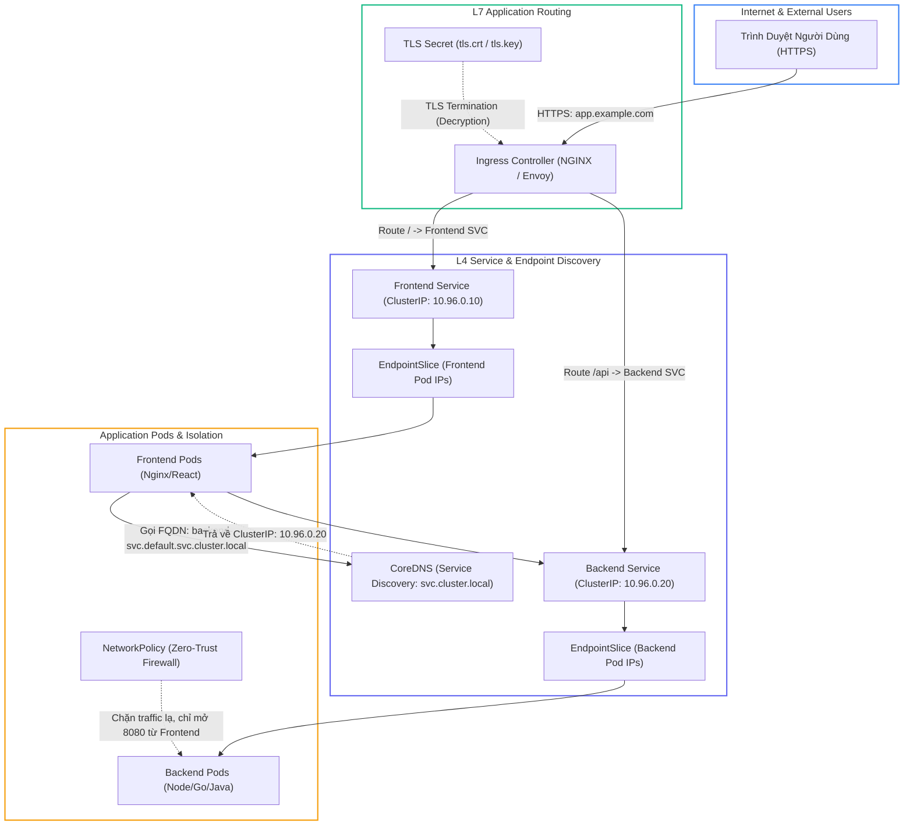
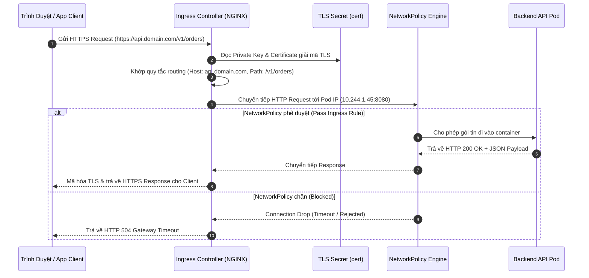
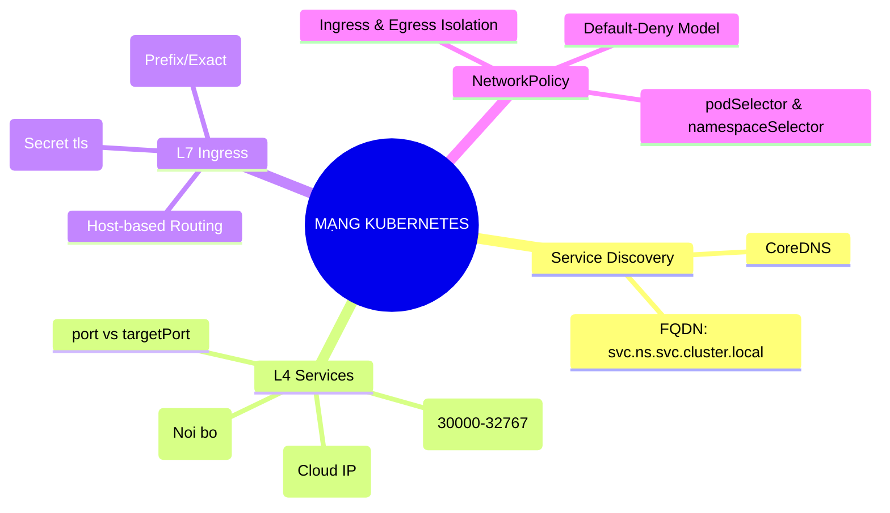


> [!IMPORTANT]
> **Mục tiêu kỹ thuật bài học**:
> - Hiểu rõ đường đi của gói tin mạng trong cụm Kubernetes: Từ Pod Client -> CoreDNS -> Virtual IP (iptables/IPVS) -> EndpointSlice -> Target Pod Container.
> - Cấu hình chuẩn xác `Service` (`port`, `targetPort`, `nodePort`) và giải quyết dứt điểm lỗi lệch port.
> - Triển khai tài nguyên `Ingress` (`networking.k8s.io/v1`) hỗ trợ đa Hostname, đa Path với `pathType: Prefix` và gắn chứng chỉ SSL qua `spec.tls`.
> - Viết các quy tắc `NetworkPolicy` cô lập lưu lượng mạng Pod-to-Pod và Namespace-to-Namespace theo chuẩn an ninh Zero-Trust.
> - Chẩn đoán và xử lý nhanh các mã lỗi mạng phổ biến: `502 Bad Gateway`, `503 Service Temporarily Unavailable`, `Connection Timed Out`.

---

## 1. Bản Chất Kiến Trúc & Tư Duy Cốt Lõi: Mạng Kubernetes Dưới Góc Nhìn Developer

Trong Kubernetes, các Pod có tính chất tạm thời (ephemeral) — chúng có thể bị tiêu diệt, khởi động lại và đổi địa chỉ IP bất kỳ lúc nào. Để các microservices có thể giao tiếp ổn định với nhau và tiếp nhận lưu lượng từ bên ngoài Internet, Kubernetes cung cấp một hệ thống mạng phân tầng mạnh mẽ gồm: **Service Discovery (CoreDNS)**, **L4 Load Balancing (Services)**, **L7 Application Routing (Ingress)**, và **Tường lửa phần mềm (NetworkPolicy)**.



### 1.1. Cơ Chế Service Discovery & Phân Giải Tên Miền FQDN

Kubernetes tích hợp sẵn dịch vụ **CoreDNS** chạy ngầm trong cụm. Khi một Service được tạo ra, CoreDNS tự động tạo một bản ghi DNS A/AAAA theo định dạng tên miền đầy đủ (**FQDN - Fully Qualified Domain Name**):

$$\text{FQDN} = \texttt{<service-name>}.\texttt{<namespace>}.\texttt{svc}.\texttt{cluster.local}$$

- **Cùng Namespace**: Microservice chỉ cần gọi trực tiếp bằng tên ngắn: `http://backend-svc:8080`.
- **Khác Namespace**: Microservice gọi qua FQDN: `http://backend-svc.payment-prod.svc.cluster.local:8080`.

---

### 1.2. Phân Cấp Các Loại Service (L4)

1. **`ClusterIP` (Mặc định)**: Cấp phát một IP ảo nội bộ (Virtual IP). Chỉ có các tiến trình bên trong cụm mới kết nối được. Dùng cho giao tiếp nội bộ giữa Microservice và Database/Backend.
2. **`NodePort`**: Mở một cổng tĩnh trên tất cả các Worker Nodes trong dải mặc định `30000-32767`. Cho phép truy cập từ mạng ngoài cụm bằng `http://<Node-IP>:<NodePort>`.
3. **`LoadBalancer`**: Tích hợp với nhà cung cấp Cloud (AWS NLB/ALB, GCP Cloud Load Balancing) để cấp một External IP công khai hướng ra Internet.
4. **`ExternalName`**: Chuyển hướng lưu lượng ra một CNAME bên ngoài cụm (ví dụ `db-prod.rds.amazonaws.com`) mà không dùng proxy.

---

### 1.3. Định Tuyến L7 Nâng Cao Với Ingress & TLS Termination

Trong khi Service hoạt động ở Layer 4 (TCP/UDP), **Ingress** hoạt động ở Layer 7 (HTTP/HTTPS) giúp gom nhiều dịch vụ sau một External IP duy nhất:
- **Host-based routing**: `api.example.com` trỏ tới Backend Service, `app.example.com` trỏ tới Frontend Service.
- **Path-based routing**: `example.com/api` trỏ tới Backend Service, `example.com/static` trỏ tới Storage Service.
- **TLS Termination**: Ingress Controller giải mã chứng chỉ HTTPS SSL tại cửa ngõ và chuyển tiếp HTTP thuần vào Pods nội bộ, giảm tải tính toán mã hóa cho các container ứng dụng.

---

### 1.4. Kiểm Soát Lưu Lượng Với NetworkPolicy (Zero-Trust)

Mặc định trên Kubernetes, mạng là **Non-isolated (Default-Allow)**: Bất kỳ Pod nào cũng có thể gửi gói tin tới bất kỳ Pod nào khác trong cụm.

**NetworkPolicy** cho phép lập trình viên định nghĩa các quy tắc lọc gói tin (dựa trên CNI plugin hỗ trợ như Calico, Cilium):
- **Ingress Policy**: Kiểm soát các nguồn traffic *đi vào* Pod (`from: podSelector, namespaceSelector, ipBlock`).
- **Egress Policy**: Kiểm soát các đích đến mà Pod *được phép gọi ra* (`to: ...`).

---

## 2. Bảng Ma Trận So Sánh Kỹ Thuật Toàn Diện (Engineering Matrix)

| Tiêu chí Kỹ thuật | ClusterIP Service | NodePort Service | Ingress (L7) | NetworkPolicy |
| :--- | :--- | :--- | :--- | :--- |
| **Tầng mạng (OSI)** | Layer 4 (TCP/UDP) | Layer 4 (TCP/UDP) | Layer 7 (HTTP/HTTPS) | Layer 3/4 (IP, Port, Protocol) |
| **Phạm vi truy cập** | Chỉ nội bộ cụm (Internal Only) | Mọi máy kết nối tới IP của Node | Công khai Internet / Intranet | Kiểm soát nội bộ cụm |
| **Định tuyến theo URL** | ❌ Không hỗ trợ | ❌ Không hỗ trợ | **Hỗ trợ (Host & Path)** | ❌ Không hỗ trợ |
| **Quản lý SSL/TLS** | Tự quản lý trong code | Tự quản lý trong code | **Tự động giải mã (TLS Termination)** | Không can thiệp |
| **Chính sách an ninh** | Cho phép mọi kết nối | Cho phép mọi kết nối | Lọc HTTP Header / WAF | **Chặn/Mở gói tin theo Pod/Namespace** |
| **Khuyến nghị sử dụng** | Microservices giao tiếp nội bộ | Môi trường Test / On-premise | **Chuẩn Production Web/API** | **Bắt buộc trong Production Zero-Trust** |

---

## 3. Kiến Trúc Môi Trường & Luồng Thực Thi Mẫu



### Manifest Mẫu 1: Ingress Chuẩn Hỗ Trợ Đa Path & TLS Termination

```yaml
apiVersion: networking.k8s.io/v1
kind: Ingress
metadata:
  name: main-enterprise-ingress
  namespace: default
  annotations:
    nginx.ingress.kubernetes.io/ssl-redirect: "true"
spec:
  ingressClassName: nginx
  tls:
  - hosts:
    - store.example.com
    secretName: store-tls-cert
  rules:
  - host: store.example.com
    http:
      paths:
      - path: /api
        pathType: Prefix
        backend:
          service:
            name: order-api-service
            port:
              number: 8080
      - path: /
        pathType: Prefix
        backend:
          service:
            name: web-frontend-service
            port:
              number: 80
```

### Manifest Mẫu 2: NetworkPolicy Bảo Mật Zero-Trust Cho Backend

```yaml
apiVersion: networking.k8s.io/v1
kind: NetworkPolicy
metadata:
  name: isolate-backend-policy
  namespace: default
spec:
  podSelector:
    matchLabels:
      tier: backend
  policyTypes:
  - Ingress
  - Egress
  ingress:
  - from:
    - podSelector:
        matchLabels:
          tier: frontend
    ports:
    - protocol: TCP
      port: 8080
  egress:
  - to:
    - podSelector:
        matchLabels:
          tier: database
    ports:
    - protocol: TCP
      port: 5432
  - ports: # Cho phép phân giải DNS nội bộ
    - protocol: UDP
      port: 53
```

---

## 4. Phân Tích Cạm Bẫy Thực Chiến: "Lỗi 502 Bad Gateway / 503 Service Unavailable Trên Ingress"

### Tình Huống Thực Tế
Một nhóm kỹ sư cấu hình Ingress để public dịch vụ Backend API mới. Khi người dùng truy cập `https://api.company.com/users`, trình duyệt lập tức trả về lỗi **`503 Service Temporarily Unavailable`** hoặc **`502 Bad Gateway`**.

### Hậu Quả & Log Lỗi Thực Tế:
```text
HTTP/1.1 503 Service Temporarily Unavailable
Date: Sat, 12 Sep 2026 13:35:12 GMT
Content-Type: text/html
Content-Length: 190
Connection: keep-alive

<html>
<head><title>503 Service Temporarily Unavailable</title></head>
<body>
<center><h1>503 Service Temporarily Unavailable</h1></center>
<hr><center>nginx</center>
</body>
</html>
```

Khi kiểm tra Endpoint của Service (`kubectl get endpoints backend-api-service`):
```text
NAME                  ENDPOINTS   AGE
backend-api-service   <none>      12m
```

### 5-Whys Root Cause Analysis:
1. **Tại sao Ingress trả về 503 Service Unavailable?** Do Ingress Controller không tìm thấy bất kỳ IP backend nào để chuyển tiếp request.
2. **Tại sao không có IP backend?** Do danh sách `ENDPOINTS` của `backend-api-service` bị trống rỗng (`<none>`).
3. **Tại sao Service không có Endpoint nào?** Do trường `spec.selector` của Service không khớp chính xác với `spec.template.metadata.labels` của Pod (ví dụ Service khai báo `app: backend` trong khi Pod có label `app: backend-api`).
4. **Trường hợp lỗi 502 Bad Gateway xảy ra khi nào?** Khi Pod labels khớp (Endpoint có IP), nhưng trường `targetPort` của Service bị cấu hình sai cổng (ví dụ Service forward vào port 80 trong khi container ứng dụng chỉ lắng nghe ở port 8080).
5. **Giải pháp chuẩn:** 
   - Kiểm tra đối sánh nhãn: `kubectl get pods --show-labels` so với `kubectl describe svc <svc-name>`.
   - Kiểm tra `targetPort` trong Service spec phải khớp chính xác với cổng mở thực tế của container.

---

## 5. Hands-on Lab: Triển Khai Microservices Với Ingress & NetworkPolicy (8 Bước)

| Bước | Mục Tiêu Kỹ Thuật | Lệnh Thực Hiện Chính |
| :--- | :--- | :--- |
| **1** | Khởi tạo Namespace Lab cô lập | `kubectl create ns ckad-net-hard-lab` |
| **2** | Triển khai 2 tầng ứng dụng Frontend & Backend | `kubectl apply -f 1-apps.yaml` |
| **3** | Tạo Service ClusterIP cho 2 ứng dụng | `kubectl apply -f 2-services.yaml` |
| **4** | Kiểm chứng Service Discovery FQDN từ bên trong Pod | `kubectl exec frontend-pod -- curl http://backend-svc:8080` |
| **5** | Tạo TLS Secret tự ký (Self-signed Certificate) | `openssl req ... && kubectl create secret tls` |
| **6** | Cấu hình Ingress định tuyến Host & Path kèm TLS | `kubectl apply -f 3-ingress.yaml` |
| **7** | Thiết lập NetworkPolicy siết chặt lưu lượng | `kubectl apply -f 4-netpol.yaml` |
| **8** | Dọn dẹp môi trường Lab | `kubectl delete ns ckad-net-hard-lab` |

---

### Bước 1: Khởi Tạo Namespace Lab Cô Lập

```bash
kubectl create namespace ckad-net-hard-lab
kubectl config set-context --current --namespace=ckad-net-hard-lab
```

---

### Bước 2: Triển Khai Frontend và Backend Workloads

Tạo file `1-apps.yaml`:
```yaml
apiVersion: apps/v1
kind: Deployment
metadata:
  name: frontend-app
spec:
  replicas: 1
  selector:
    matchLabels:
      tier: frontend
  template:
    metadata:
      labels:
        tier: frontend
    spec:
      containers:
      - name: web
        image: nginx:alpine
        ports:
        - containerPort: 80
---
apiVersion: apps/v1
kind: Deployment
metadata:
  name: backend-app
spec:
  replicas: 1
  selector:
    matchLabels:
      tier: backend
  template:
    metadata:
      labels:
        tier: backend
    spec:
      containers:
      - name: api
        image: hashicorp/http-echo:0.2.3
        args:
        - "-text=Backend API v1.0 Response Ready!"
        - "-listen=:8080"
        ports:
        - containerPort: 8080
```
```bash
kubectl apply -f 1-apps.yaml
kubectl wait --for=condition=available deployment/frontend-app deployment/backend-app --timeout=60s
```

---

### Bước 3: Tạo Services ClusterIP

Tạo file `2-services.yaml`:
```yaml
apiVersion: v1
kind: Service
metadata:
  name: frontend-svc
spec:
  type: ClusterIP
  selector:
    tier: frontend
  ports:
  - port: 80
    targetPort: 80
---
apiVersion: v1
kind: Service
metadata:
  name: backend-svc
spec:
  type: ClusterIP
  selector:
    tier: backend
  ports:
  - port: 8080
    targetPort: 8080
```
```bash
kubectl apply -f 2-services.yaml
kubectl get svc,endpoints -o wide
```

---

### Bước 4: Kiểm Chứng Phân Giải DNS & Service Discovery

```bash
# Kiểm tra gọi service qua DNS ngắn nội bộ
kubectl exec deploy/frontend-app -- curl -s http://backend-svc:8080
```
> Đầu ra hiển thị: `Backend API v1.0 Response Ready!`

---

### Bước 5: Tạo Secret TLS Tự Ký

```bash
# Tạo cặp khóa SSL trong thư mục tạm
openssl req -x509 -nodes -days 365 -newkey rsa:2048 \
  -keyout /tmp/lab-tls.key -out /tmp/lab-tls.crt \
  -subj "/CN=ckad-shop.lab/O=CKAD"

# Đưa chứng chỉ vào Kubernetes Secret
kubectl create secret tls ckad-shop-tls --cert=/tmp/lab-tls.crt --key=/tmp/lab-tls.key
```

---

### Bước 6: Cấu Hình Ingress Đa Path & TLS Termination

Tạo file `3-ingress.yaml`:
```yaml
apiVersion: networking.k8s.io/v1
kind: Ingress
metadata:
  name: lab-ingress
  annotations:
    nginx.ingress.kubernetes.io/rewrite-target: /$2
spec:
  ingressClassName: nginx
  tls:
  - hosts:
    - ckad-shop.lab
    secretName: ckad-shop-tls
  rules:
  - host: ckad-shop.lab
    http:
      paths:
      - path: /api(/|$)(.*)
        pathType: ImplementationSpecific
        backend:
          service:
            name: backend-svc
            port:
              number: 8080
      - path: /()(.*)
        pathType: ImplementationSpecific
        backend:
          service:
            name: frontend-svc
            port:
              number: 80
```
```bash
kubectl apply -f 3-ingress.yaml
kubectl get ingress lab-ingress
```

---

### Bước 7: Thiết Lập NetworkPolicy Bảo Vệ Backend

Tạo file `4-netpol.yaml` chỉ cho phép Pod Frontend kết nối vào Backend:
```yaml
apiVersion: networking.k8s.io/v1
kind: NetworkPolicy
metadata:
  name: backend-security-policy
spec:
  podSelector:
    matchLabels:
      tier: backend
  policyTypes:
  - Ingress
  ingress:
  - from:
    - podSelector:
        matchLabels:
          tier: frontend
    ports:
    - protocol: TCP
      port: 8080
```
```bash
kubectl apply -f 4-netpol.yaml
kubectl get networkpolicy
```

---

### Bước 8: Dọn Dẹp Môi Trường Lab

```bash
kubectl delete ns ckad-net-hard-lab
rm -f /tmp/lab-tls.key /tmp/lab-tls.crt
```

---

## 6. 10 Câu Hỏi Tự Kiểm Tra Chuyên Sâu (Self-Check Q&A Accordion)

<details class="qa-card">
<summary><b>1. Cấu trúc tên miền FQDN hoàn chỉnh của một Service trong Kubernetes là gì?</b></summary>
<div class="qa-answer">
<p>Cấu trúc FQDN chuẩn là: <b><code>&lt;service-name&gt;.&lt;namespace&gt;.svc.cluster.local</code></b>.</p>
</div>
</details>

<details class="qa-card">
<summary><b>2. Sự khác biệt giữa `port` và `targetPort` trong Service Manifest là gì?</b></summary>
<div class="qa-answer">
<p><b><code>port</code>:</b> Là số hiệu cổng mà <b>Service phơi bày ra bên ngoài</b> cho các client khác kết nối tới.</p>
<p><b><code>targetPort</code>:</b> Là số hiệu cổng thực tế mà <b>Container ứng dụng bên trong Pod đang lắng nghe</b>.</p>
</div>
</details>

<details class="qa-card">
<summary><b>3. Khi lệnh `kubectl get endpoints <service-name>` hiển thị `<none>`, nguyên nhân phổ biến nhất là gì?</b></summary>
<div class="qa-answer">
<p>Nguyên nhân phổ biến nhất là <b><code>spec.selector</code> của Service không khớp với bất kỳ <code>metadata.labels</code> của Pod nào</b>, hoặc các Pod khớp nhãn nhưng đều đang ở trạng thái Unready (chưa vượt qua Readiness Probe).</p>
</div>
</details>

<details class="qa-card">
<summary><b>4. Sự khác nhau giữa `pathType: Prefix` và `pathType: Exact` trong Ingress là gì?</b></summary>
<div class="qa-answer">
<p><b><code>Exact</code>:</b> Chỉ khớp chính xác 100% từng ký tự của đường dẫn URL (ví dụ <code>/api</code> chỉ khớp <code>/api</code>, không khớp <code>/api/v1</code>).</p>
<p><b><code>Prefix</code>:</b> Khớp theo tiền tố phân tách bởi dấu gạch chéo <code>/</code> (ví dụ <code>/api</code> sẽ khớp cả <code>/api</code>, <code>/api/</code>, <code>/api/users</code>).</p>
</div>
</details>

<details class="qa-card">
<summary><b>5. TLS Termination trên Ingress Controller hoạt động như thế nào và mang lại lợi ích gì cho Developer?</b></summary>
<div class="qa-answer">
<p>Ingress Controller sử dụng chứng chỉ SSL từ Secret để <b>giải mã lưu lượng HTTPS ngay tại cửa ngõ cụm</b>, sau đó chuyển tiếp HTTP không mã hóa vào các Pod nội bộ. Lợi ích: Lập trình viên không cần cấu hình mã hóa SSL phức tạp trong mã nguồn ứng dụng.</p>
</div>
</details>

<details class="qa-card">
<summary><b>6. Khi áp dụng một NetworkPolicy rỗng có `podSelector: {}` và `policyTypes: ["Ingress"]` mà không có khối `ingress:`, điều gì sẽ xảy ra?</b></summary>
<div class="qa-answer">
<p>Quy tắc này biến toàn bộ Namespace thành trạng thái <b>Default-Deny Ingress</b>: Toàn bộ lưu lượng mạng đi vào (Ingress) tới tất cả các Pod trong Namespace sẽ bị <b>chặn 100%</b>.</p>
</div>
</details>

<details class="qa-card">
<summary><b>7. Làm thế nào để tạo một NetworkPolicy cho phép traffic đi vào Pod từ một Namespace cụ thể có nhãn `env: production`?</b></summary>
<div class="qa-answer">
<pre><code>ingress:
  from:
    namespaceSelector:
      matchLabels:
        env: production</code></pre>
</div>
</details>

<details class="qa-card">
<summary><b>8. Lệnh kubectl imperative nào giúp expose nhanh một Deployment thành một Service loại NodePort cổng 80?</b></summary>
<div class="qa-answer">
<pre><code>kubectl expose deployment &lt;deploy-name&gt; --type=NodePort --port=80 --target-port=8080 --name=&lt;svc-name&gt;</code></pre>
</div>
</details>

<details class="qa-card">
<summary><b>9. Tại sao NetworkPolicy không thể chặn kết nối Loopback (`127.0.0.1`) giữa hai container trong cùng một Pod?</b></summary>
<div class="qa-answer">
<p>Bởi vì các container trong cùng một Pod <b>chia sẻ chung Network Namespace</b> (chung IP và localhost interface). Giao tiếp qua <code>127.0.0.1</code> không đi qua tầng CNI Network Plugin nên NetworkPolicy không thể can thiệp kiểm soát.</p>
</div>
</details>

<details class="qa-card">
<summary><b>10. Sự khác biệt giữa Service loại `NodePort` và `LoadBalancer` là gì?</b></summary>
<div class="qa-answer">
<p><b>NodePort:</b> Chỉ mở port trên Worker Nodes, người dùng phải tự quản lý việc cân bằng tải tới các Node IP.</p>
<p><b>LoadBalancer:</b> Kế thừa toàn bộ tính năng của NodePort đồng thời <b>tự động khởi tạo một Load Balancer đám mây chuyên dụng</b> (như AWS NLB / GCP LB) với một IP tĩnh duy nhất đại diện cho toàn hệ thống.</p>
</div>
</details>

---

## 7. Tổng Kết & Lộ Trình Bài Học Tiếp Theo



Làm chủ kiến trúc mạng và tường lửa NetworkPolicy giúp bạn xây dựng các hệ thống microservices hiệu năng cao, định tuyến lưu lượng thông minh và đảm bảo an toàn tuyệt đối trước các đợt tấn công nội bộ.

> [!TIP]
> **Bài học tiếp theo**: Thử sức với bài thi mô phỏng thực tế với **[Bài 15: Đề Thi Thử Toàn Diện CKAD: 16 Tình Huống Thực Chiến 120 Phút](ckad-15-15-thi-thu-ckad.html)**.

