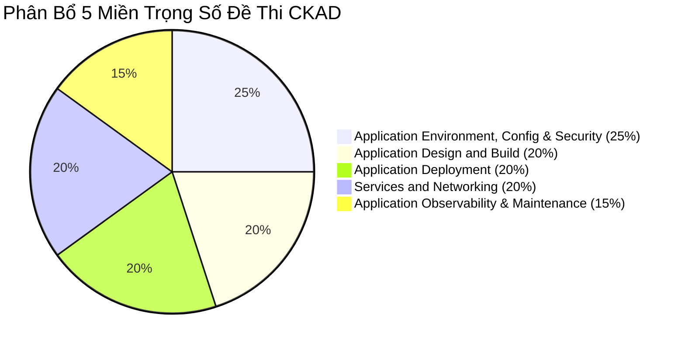
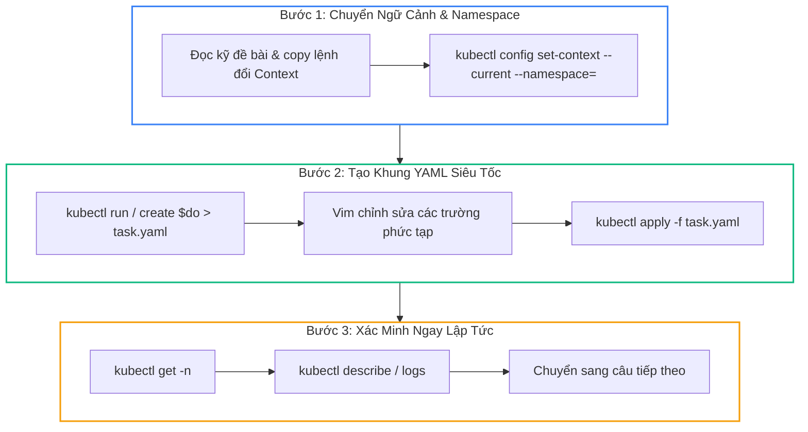
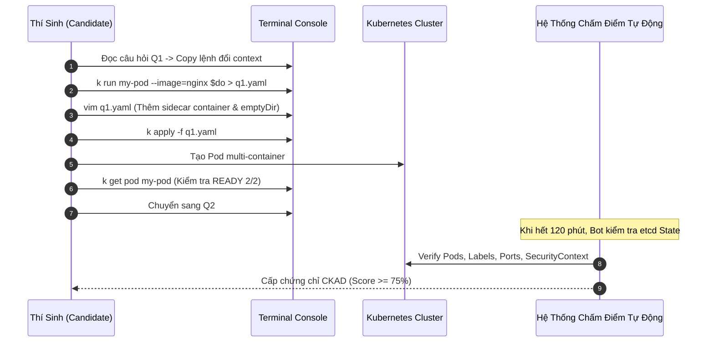
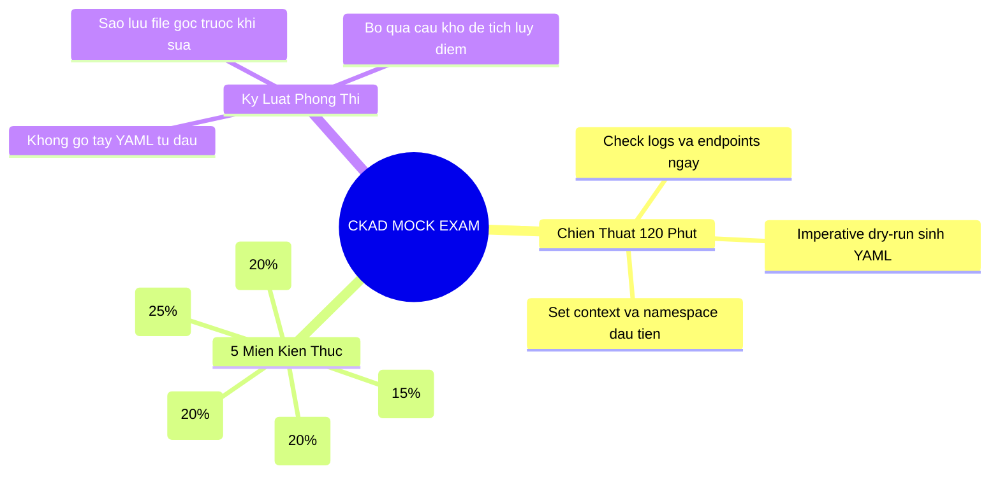


> [!IMPORTANT]
> **Mục tiêu kỹ thuật bài học**:
> - Đánh giá toàn diện năng lực thực chiến bấm giờ đối với cả 5 miền kiến thức CKAD.
> - Rèn luyện phản xạ thao tác CLI với tốc độ dưới 5 phút cho mỗi kịch bản triển khai.
> - Nắm vững quy trình xử lý sự cố 3 bước: Chuyển Context/Namespace -> Sinh YAML mẫu qua dry-run -> Xác minh trạng thái qua lệnh kiểm tra.
> - Làm chủ kỹ năng giải quyết các câu hỏi phức tạp kết hợp nhiều thành phần (Multi-container + SecurityContext + PersistentVolume + Ingress + NetworkPolicy).

---

## 1. Bản Chất Kiến Trúc & Tư Duy Cốt Lõi: Chiến Thuật Vượt Qua Kỳ Thi CKAD 120 Phút

Kỳ thi **CKAD (Certified Kubernetes Application Developer)** của CNCF / Linux Foundation là bài thi thực hành 100% trên môi trường dòng lệnh (Command Line Interface). Trong vòng **120 phút**, thí sinh phải giải quyết khoảng **16 đến 19 câu hỏi** thực tế trên nhiều cụm Kubernetes khác nhau.



### 1.1. Quy Trình 3 Bước Xử Lý Mọi Câu Hỏi Trong Phòng Thi

Để đạt điểm số an toàn (> 75%), bạn không bao giờ được viết YAML từ đầu bằng tay. Hãy áp dụng nghiêm ngặt quy trình 3 bước:



---

### 1.2. Thiết Lập Môi Trường Terminal Tốc Độ Cao (30 Giây Đầu Tiên)

Ngay khi bước vào phòng thi, hãy dán ngay đoạn cấu hình sau vào terminal để tiết kiệm hàng chục phút gõ lệnh:

```bash
# 1. Thiết lập alias cho kubectl và autocompletion
alias k=kubectl
complete -o default -F __start_kubectl k

# 2. Biến tắt sinh YAML dry-run và xóa nhanh
export do="--dry-run=client -o yaml"
export now="--grace-period=0 --force"

# 3. Tối ưu hóa file cấu hình vim ~/.vimrc
cat <<EOF > ~/.vimrc
set tabstop=2
set shiftwidth=2
set expandtab
set number
set autoindent
EOF
```

---

## 2. Bảng Ma Trận So Sánh Kỹ Thuật Toàn Diện (Engineering Matrix)

| STT | Tên Kịch Bản Thực Chiến | Miền Kiến Thức CKAD | Trọng Số Điểm | Độ Khó | Thời Gian Chuẩn |
| :--- | :--- | :--- | :--- | :--- | :--- |
| **Q1** | Multi-container Pod (Sidecar Pattern) | Application Design and Build | 7% | Medium | 6 phút |
| **Q2** | InitContainer & Shared Volume Storage | Application Design and Build | 6% | Easy | 5 phút |
| **Q3** | SecurityContext (runAsNonRoot & ReadOnly) | Environment, Config & Security | 7% | Medium | 6 phút |
| **Q4** | Capabilities & fsGroup Permissions | Environment, Config & Security | 6% | Medium | 6 phút |
| **Q5** | ConfigMap & Secret Projected Volumes | Environment, Config & Security | 6% | Easy | 4 phút |
| **Q6** | Immutable ConfigMap & Rolling Update | Environment, Config & Security | 6% | Easy | 5 phút |
| **Q7** | Batch Job với Parallelism & BackoffLimit | Application Design and Build | 6% | Easy | 5 phút |
| **Q8** | CronJob với Deadline & History Limits | Application Design and Build | 6% | Medium | 6 phút |
| **Q9** | Deployment Canary Strategy & Weighting | Application Deployment | 7% | Hard | 8 phút |
| **Q10** | RollingUpdate Rollback & History | Application Deployment | 6% | Easy | 4 phút |
| **Q11** | Health Probes (Startup & Readiness) | Observability & Maintenance | 7% | Medium | 6 phút |
| **Q12** | Container Log Analysis & Debugging | Observability & Maintenance | 6% | Easy | 4 phút |
| **Q13** | Service Discovery & Port Mapping | Services and Networking | 6% | Easy | 4 phút |
| **Q14** | Ingress Routing Đa Path & TLS Secret | Services and Networking | 7% | Hard | 8 phút |
| **Q15** | NetworkPolicy Default-Deny & Ingress | Services and Networking | 8% | Hard | 9 phút |
| **Q16** | ResourceQuota & LimitRange Troubleshooting | Environment, Config & Security | 6% | Medium | 6 phút |

---

## 3. Kiến Trúc Môi Trường & Luồng Thực Thi Mẫu



---

## 4. Phân Tích Cạm Bẫy Thực Chiến: "3 Bẫy Mất Điểm Đau Đớn Nhất Trong Phòng Thi CKAD"

### Tình Huống Thực Tế
Nhiều thí sinh có kiến thức kỹ thuật rất tốt nhưng vẫn bị trượt kỳ thi với điểm số 60-70%. Khi phân tích lại, hầu hết đều rơi vào 3 cạm bẫy kinh điển:

### Hậu Quả & Log Lỗi Thực Tế:
```text
[EXAM AUDIT LOG]
Question 04: FAIL (Score: 0/7)
Expected: Pod "secure-worker" in namespace "finance-prod"
Actual: Pod "secure-worker" was created in namespace "default"!
Result: Resource not found in target namespace. 0 Points awarded.
```

### 5-Whys Root Cause Analysis:
1. **Bẫy 1: Quên chuyển Namespace hoặc Context**: Mỗi câu hỏi đều yêu cầu một Namespace/Context cụ thể. Nếu làm đúng 100% cấu hình nhưng nằm ở namespace `default`, bot chấm điểm tự động sẽ quét namespace mục tiêu và ghi nhận `0 điểm`.
2. **Bẫy 2: Nhầm lẫn giữa `port` và `targetPort` trong Service / Ingress**: Service mở cổng `port: 80` nhưng container lắng nghe ở cổng `8080`. Nếu khai báo nhầm `targetPort: 80`, Ingress sẽ trả về lỗi `502 Bad Gateway` và bài thi bị chấm rớt phần networking.
3. **Bẫy 3: Sửa trực tiếp Pod đang chạy mà không sao lưu**: Dùng `kubectl edit pod` sửa sai cú pháp, Pod bị xóa mất trong khi file mới không apply được, mất trắng 10-15 phút để viết lại từ đầu.
4. **Giải pháp chuẩn:** 
   - Đầu mỗi câu hỏi, luôn chạy lệnh chuyển context và set namespace mặc định: `kubectl config set-context --current --namespace=<ns>`.
   - Luôn tạo file YAML trung gian: `k get <res> <name> -o yaml > res.yaml && cp res.yaml res.yaml.bak`.

---

## 5. Hands-on Lab: Bộ Đề Thi Thử Thực Chiến 16 Câu Hỏi & Lời Giải Chuẩn (8 Nhóm Kỹ Năng / 8 Bước)

| Bước | Nhóm Bài Toán Mô Phỏng | Kỹ Năng Đo Lường |
| :--- | :--- | :--- |
| **1** | Multi-container & Storage Sharing | Tạo Pod 2 containers chia sẻ volume `emptyDir` |
| **2** | Pod Hardening & SecurityContext | Cấu hình `runAsNonRoot`, `readOnlyRootFilesystem`, `capabilities` |
| **3** | Dynamic & Secure Configuration | Projected Volumes từ ConfigMap & Secret |
| **4** | Batch Processing Workloads | Job với `completions`, `parallelism` & CronJob lịch định kỳ |
| **5** | Deployment Lifecycle Management | Rolling Update, Canary Release và Rollback |
| **6** | Container Observability & Probes | Liveness Probe, Readiness Probe & Startup Probe |
| **7** | L4 & L7 Services and Ingress | ClusterIP Service & Ingress Routing TLS |
| **8** | Resource Governance & NetworkPolicy | ResourceQuota, LimitRange & Zero-Trust NetworkPolicy |

---

### Bước 1: Khởi Tạo Multi-Container Pod Chia Sẻ Volume (Câu 1 & 2)

**Yêu cầu**: Tạo Pod `app-logger` trong namespace `ckad-lab` gồm:
- Container chính `app`: image `busybox:1.36`, lệnh ghi log timestamp vào `/var/log/app.log` mỗi 1 giây.
- Container phụ `sidecar`: image `busybox:1.36`, lệnh đọc file `/var/log/app.log` và in ra stdout.

```bash
kubectl create namespace ckad-lab --dry-run=client -o yaml | kubectl apply -f -
kubectl config set-context --current --namespace=ckad-lab
```

Tạo file `q1-multicontainer.yaml`:
```yaml
apiVersion: v1
kind: Pod
metadata:
  name: app-logger
  namespace: ckad-lab
spec:
  volumes:
  - name: log-storage
    emptyDir: {}
  containers:
  - name: app
    image: busybox:1.36
    command: ["sh", "-c", "while true; do date >> /var/log/app.log; sleep 1; done"]
    volumeMounts:
    - name: log-storage
      mountPath: /var/log
  - name: sidecar
    image: busybox:1.36
    command: ["sh", "-c", "tail -f /var/log/app.log"]
    volumeMounts:
    - name: log-storage
      mountPath: /var/log
```
```bash
kubectl apply -f q1-multicontainer.yaml
kubectl wait --for=condition=ready pod/app-logger --timeout=30s
kubectl logs app-logger -c sidecar | head -n 3
```

---

### Bước 2: Thiết Lập Pod Hardening Với SecurityContext (Câu 3 & 4)

**Yêu cầu**: Tạo Pod `secure-vault` chạy image `busybox:1.36` (lệnh `sleep 3600`) với các tiêu chuẩn an ninh:
- Chạy dưới UID `2000` và GID `3000`.
- Bắt buộc `runAsNonRoot: true`.
- Hệ thống tệp đĩa gốc chỉ đọc `readOnlyRootFilesystem: true`.
- Mount `emptyDir` vào `/tmp` để ứng dụng ghi file tạm.
- Tước bỏ toàn bộ đặc quyền `drop: ["ALL"]` và chỉ thêm `add: ["NET_BIND_SERVICE"]`.

Tạo file `q2-security.yaml`:
```yaml
apiVersion: v1
kind: Pod
metadata:
  name: secure-vault
  namespace: ckad-lab
spec:
  securityContext:
    runAsNonRoot: true
    runAsUser: 2000
    runAsGroup: 3000
    fsGroup: 4000
  containers:
  - name: worker
    image: busybox:1.36
    command: ["sleep", "3600"]
    securityContext:
      allowPrivilegeEscalation: false
      readOnlyRootFilesystem: true
      capabilities:
        drop: ["ALL"]
        add: ["NET_BIND_SERVICE"]
    volumeMounts:
    - name: tmp-scratch
      mountPath: /tmp
  volumes:
  - name: tmp-scratch
    emptyDir: {}
```
```bash
kubectl apply -f q2-security.yaml
kubectl wait --for=condition=ready pod/secure-vault --timeout=30s
kubectl exec secure-vault -- id
```

---

### Bước 3: Cấu Hình Projected Volume Hợp Nhất (Câu 5 & 6)

**Yêu cầu**: Tạo ConfigMap `app-config` (`env=prod`) và Secret `db-secret` (`pass=S3cret`). Mount cả hai vào Pod `config-pod` tại cùng thư mục `/etc/projected`.

```bash
kubectl create configmap app-config --from-literal=env=prod
kubectl create secret generic db-secret --from-literal=pass=S3cret
```

Tạo file `q3-projected.yaml`:
```yaml
apiVersion: v1
kind: Pod
metadata:
  name: config-pod
  namespace: ckad-lab
spec:
  containers:
  - name: app
    image: busybox:1.36
    command: ["sleep", "3600"]
    volumeMounts:
    - name: all-configs
      mountPath: /etc/projected
      readOnly: true
  volumes:
  - name: all-configs
    projected:
      sources:
      - configMap:
          name: app-config
      - secret:
          name: db-secret
```
```bash
kubectl apply -f q3-projected.yaml
kubectl wait --for=condition=ready pod/config-pod --timeout=30s
kubectl exec config-pod -- ls -la /etc/projected
```

---

### Bước 4: Khởi Tạo Job Song Song & CronJob Định Kỳ (Câu 7 & 8)

**Yêu cầu**: Tạo Job `batch-calculator` chạy image `busybox:1.36` tính `expr 33 \* 3`, cần `completions: 4`, `parallelism: 2`, `backoffLimit: 3`.

Tạo file `q4-job.yaml`:
```yaml
apiVersion: batch/v1
kind: Job
metadata:
  name: batch-calculator
  namespace: ckad-lab
spec:
  completions: 4
  parallelism: 2
  backoffLimit: 3
  template:
    spec:
      restartPolicy: Never
      containers:
      - name: calc
        image: busybox:1.36
        command: ["sh", "-c", "expr 33 \\* 3 && sleep 2"]
```
```bash
kubectl apply -f q4-job.yaml
kubectl wait --for=condition=complete job/batch-calculator --timeout=60s
```

---

### Bước 5: Quản Lý Deployment Rollout & Canary (Câu 9 & 10)

**Yêu cầu**: Triển khai Deployment `web-app` (image `nginx:1.24`, replicas: 3). Nâng cấp lên `nginx:1.25`, theo dõi rollout và thực hiện rollback về phiên bản trước.

```bash
kubectl create deployment web-app --image=nginx:1.24 --replicas=3
kubectl rollout status deployment/web-app

# Cập nhật phiên bản image
kubectl set image deployment/web-app nginx=nginx:1.25 --record
kubectl rollout status deployment/web-app

# Rollback ngay lập tức
kubectl rollout undo deployment/web-app
kubectl rollout status deployment/web-app
```

---

### Bước 6: Cấu Hình Health Probes (Câu 11 & 12)

**Yêu cầu**: Tạo Pod `probe-app` chạy `nginx:alpine` với:
- `startupProbe`: HTTP GET `/`, delay 5s, period 5s, failureThreshold 10.
- `livenessProbe`: HTTP GET `/`, period 10s.
- `readinessProbe`: HTTP GET `/`, period 5s.

Tạo file `q6-probes.yaml`:
```yaml
apiVersion: v1
kind: Pod
metadata:
  name: probe-app
  namespace: ckad-lab
spec:
  containers:
  - name: web
    image: nginx:alpine
    ports:
    - containerPort: 80
    startupProbe:
      httpGet:
        path: /
        port: 80
      initialDelaySeconds: 5
      periodSeconds: 5
      failureThreshold: 10
    livenessProbe:
      httpGet:
        path: /
        port: 80
      periodSeconds: 10
    readinessProbe:
      httpGet:
        path: /
        port: 80
      periodSeconds: 5
```
```bash
kubectl apply -f q6-probes.yaml
kubectl wait --for=condition=ready pod/probe-app --timeout=30s
```

---

### Bước 7: Mạng L4/L7 Với Ingress & TLS (Câu 13 & 14)

**Yêu cầu**: Expose Deployment `web-app` qua Service `web-service` cổng 80, tạo Ingress định tuyến `host: shop.lab`, đường dẫn `/` trỏ vào `web-service:80`.

```bash
kubectl expose deployment web-app --name=web-service --port=80 --target-port=80
```

Tạo file `q7-ingress.yaml`:
```yaml
apiVersion: networking.k8s.io/v1
kind: Ingress
metadata:
  name: shop-ingress
  namespace: ckad-lab
spec:
  ingressClassName: nginx
  rules:
  - host: shop.lab
    http:
      paths:
      - path: /
        pathType: Prefix
        backend:
          service:
            name: web-service
            port:
              number: 80
```
```bash
kubectl apply -f q7-ingress.yaml
kubectl get ingress shop-ingress
```

---

### Bước 8: NetworkPolicy & Dọn Dẹp (Câu 15 & 16)

**Yêu cầu**: Áp dụng NetworkPolicy chỉ cho phép traffic đi vào `web-app` từ các Pod có nhãn `role: frontend` trên port 80.

Tạo file `q8-netpol.yaml`:
```yaml
apiVersion: networking.k8s.io/v1
kind: NetworkPolicy
metadata:
  name: allow-frontend-only
  namespace: ckad-lab
spec:
  podSelector:
    matchLabels:
      app: web-app
  policyTypes:
  - Ingress
  ingress:
  - from:
    - podSelector:
        matchLabels:
          role: frontend
    ports:
    - protocol: TCP
      port: 80
```
```bash
kubectl apply -f q8-netpol.yaml
kubectl get netpol allow-frontend-only

# Dọn dẹp toàn bộ tài nguyên đề thi thử
kubectl delete ns ckad-lab
```

---

## 6. 10 Câu Hỏi Tự Kiểm Tra Chuyên Sâu (Self-Check Q&A Accordion)

<details class="qa-card">
<summary><b>1. Cú pháp một dòng để xuất YAML template của một Pod mà không thực sự tạo Pod là gì?</b></summary>
<div class="qa-answer">
<pre><code>kubectl run my-pod --image=nginx --dry-run=client -o yaml &gt; pod.yaml</code></pre>
</div>
</details>

<details class="qa-card">
<summary><b>2. Làm thế nào để thay đổi Namespace mặc định cho toàn bộ các lệnh kubectl tiếp theo trong kỳ thi?</b></summary>
<div class="qa-answer">
<pre><code>kubectl config set-context --current --namespace=&lt;target-namespace&gt;</code></pre>
</div>
</details>

<details class="qa-card">
<summary><b>3. Lệnh nào giúp xóa cưỡng bức một Pod bị treo ở trạng thái Terminating trong 0 giây?</b></summary>
<div class="qa-answer">
<pre><code>kubectl delete pod &lt;pod-name&gt; --grace-period=0 --force</code></pre>
</div>
</details>

<details class="qa-card">
<summary><b>4. Khi gặp một câu hỏi yêu cầu sửa Deployment nhưng bị báo lỗi cú pháp không thể lưu, cách xử lý nhanh nhất là gì?</b></summary>
<div class="qa-answer">
<p>Kube-editor sẽ tự động lưu bản nháp bị lỗi tại thư mục tạm (ví dụ <code>/tmp/kubectl-edit-xxxx.yaml</code>). Bạn có thể mở trực tiếp file tạm đó ra chỉnh sửa lại các lỗi thụt đầu dòng (indentation) rồi chạy lệnh: <code>kubectl apply -f /tmp/kubectl-edit-xxxx.yaml</code>.</p>
</div>
</details>

<details class="qa-card">
<summary><b>5. Sự khác biệt giữa `restartPolicy: Always`, `OnFailure`, và `Never` khi áp dụng cho Pod thông thường vs Job là gì?</b></summary>
<div class="qa-answer">
<p><b>Pod thông thường:</b> Mặc định là <code>Always</code>.</p>
<p><b>Batch Job:</b> Chỉ chấp nhận <code>OnFailure</code> hoặc <code>Never</code>. Nếu cố tình đặt <code>Always</code> cho Job, API Server sẽ báo lỗi từ chối tạo manifest ngay lập tức.</p>
</div>
</details>

<details class="qa-card">
<summary><b>6. Cú pháp lệnh kubectl imperative để tạo nhanh một Ingress với host và backend service là gì?</b></summary>
<div class="qa-answer">
<pre><code>kubectl create ingress &lt;ing-name&gt; --rule="app.lab/*=app-svc:80" --class=nginx</code></pre>
</div>
</details>

<details class="qa-card">
<summary><b>7. Làm thế nào để nhanh chóng kiểm tra tài liệu định dạng của một trường sâu bên trong Pod spec mà không cần mở trình duyệt web?</b></summary>
<div class="qa-answer">
<p>Sử dụng lệnh: <code>kubectl explain &lt;resource&gt;.&lt;field&gt;</code> (ví dụ: <code>kubectl explain pod.spec.containers.securityContext.capabilities</code>).</p>
</div>
</details>

<details class="qa-card">
<summary><b>8. Khi nào thì một Container rơi vào trạng thái `CrashLoopBackOff` và lệnh đầu tiên bạn nên chạy để debug là gì?</b></summary>
<div class="qa-answer">
<p>Xảy ra khi tiến trình chính của container khởi động rồi kết thúc với mã lỗi khác 0 nhiều lần liên tiếp. Lệnh kiểm tra đầu tiên: <code>kubectl logs &lt;pod-name&gt; --previous</code> (đọc log của lần crash trước đó) và <code>kubectl describe pod &lt;pod-name&gt;</code>.</p>
</div>
</details>

<details class="qa-card">
<summary><b>9. Làm thế nào để lọc và in ra danh sách tên của tất cả các Pods đang chạy mà không hiển thị các cột header?</b></summary>
<div class="qa-answer">
<pre><code>kubectl get pods -o jsonpath='{.items[*].metadata.name}'</code></pre>
<p>Hoặc dùng: <code>kubectl get pods --no-headers -o custom-columns=":metadata.name"</code></p>
</div>
</details>

<details class="qa-card">
<summary><b>10. Chiến lược xử lý khi gặp một câu hỏi quá khó hoặc tốn nhiều thời gian (> 8 phút) trong phòng thi CKAD là gì?</b></summary>
<div class="qa-answer">
<p>Ghi chú lại số thứ tự câu hỏi vào Notepad dự phòng trên giao diện thi, <b>nhấn Next để bỏ qua ngay lập tức</b> và giải quyết hết tất cả các câu hỏi dễ còn lại. Sau khi hoàn thành các câu dễ và nắm chắc 70-75% điểm số, quay lại xử lý các câu khó trong thời gian còn lại.</p>
</div>
</details>

---

## 7. Tổng Kết & Lộ Trình Bài Học Tiếp Theo



Hoàn thành bài thi thử toàn diện 16 câu hỏi giúp bạn kiểm chứng trọn vẹn năng lực thực chiến, rèn luyện tâm lý phòng thi vững vàng và sẵn sàng 100% để chinh phục chứng chỉ quốc tế CKAD.

> [!TIP]
> **Bài học tiếp theo**: Tổng ôn toàn bộ khóa học với **[Bài 16: Tổng Ôn Tốc Độ CKAD: 100+ Lệnh Thực Chiến & Kỹ Năng Về Đích](ckad-16-16-tong-on-ckad-toc-do.html)**.

