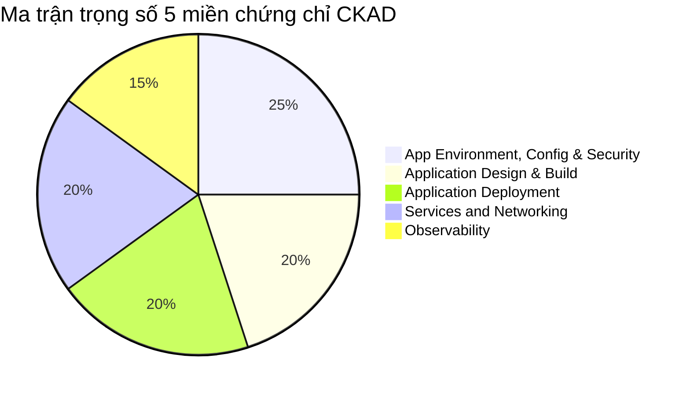
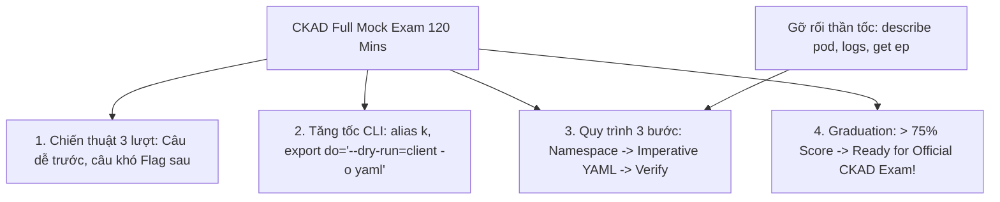
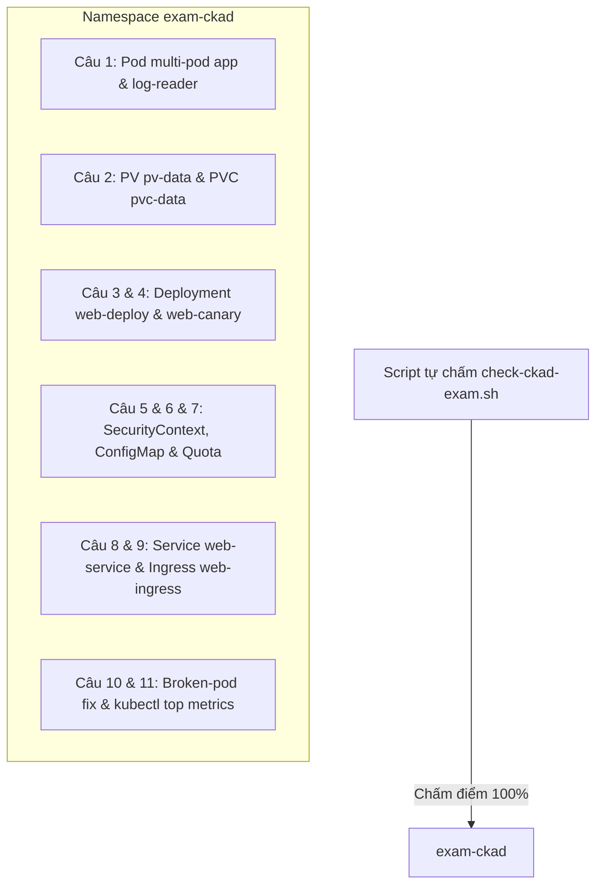


# [BÀI 15] ĐỀ THI THỬ CKAD TOÀN DIỆN 120 PHÚT & PHÂN TÍCH LỜI GIẢI CHUẨN LINUX FOUNDATION

Trong kỷ nguyên điện toán đám mây và kiến trúc microservices phân tán quy mô lớn, **Kubernetes (CKAD)** đóng vai trò là nền tảng điều phối container (Container Orchestration) tiêu chuẩn công nghiệp. Để làm chủ hệ thống trong môi trường sản xuất (Production) cũng như chinh phục kỳ thi chứng chỉ quốc tế của Linux Foundation / CNCF, kỹ sư không chỉ nắm vững các câu lệnh thao tác cơ bản mà phải thấu hiểu sâu sắc bản chất cơ chế tầng thấp: từ chu trình điều hòa (Reconciliation Loop), cấu trúc điều phối tài nguyên, kiến trúc mạng CNI, lưu trữ CSI cho đến các chuẩn mực an ninh phòng thủ chiều sâu.

Bài viết chuyên sâu này sẽ đồng hành cùng bạn giải mã toàn diện bức tranh kiến trúc, phân tích các đánh đổi kỹ thuật thực chiến (Engineering Trade-offs), cung cấp bài thực hành Lab từng bước và bộ câu hỏi phỏng vấn chuẩn Architect / Lead Engineer.

---

## 1. Bản Chất Kiến Trúc & Cơ Chế Vận Hành Tầng Thấp

| # | Câu hỏi ôn tập | Đáp án chuẩn ngắn gọn |
|---|---|---|
| 1 | Sự khác nhau giữa ClusterIP và NodePort Service? | **`ClusterIP`** nội bộ vs **`NodePort`** mở cổng 30000-32767 |
| 2 | Khai báo cổng Service vs cổng Pod container? | **`port`** (cổng Service) vs **`targetPort`** (cổng Pod) |
| 3 | Kiểu đường dẫn so khớp mọi URL tiền tố trong Ingress? | **`pathType: Prefix`** |
| 4 | Cấu hình giải mã mã hóa HTTPS tại Ingress? | **`spec.tls`** chứa **`secretName`** kiểu `kubernetes.io/tls` |
| 5 | Lệnh CLI chẩn đoán Service bị rỗng IP Pod? | **`kubectl get endpoints <svc>`** (hoặc `kubectl get ep`) |


> **"Kỳ thi mô phỏng thi thử CKAD toàn diện 2 giờ (CKAD Full Mock Exam & Detailed Review) là cột mốc tốt nghiệp Giai đoạn 2 của khóa học, nhằm đánh giá chuẩn xác 100% năng lực thực chiến bấm giờ của học viên đối với cả 5 miền kiến thức chứng chỉ CNCF CKAD; đòi hỏi học viên phải phối hợp nhịp nhàng các kỹ năng tạo Pod multi-container, cấu hình PersistentVolume, quản lý Deployment & Canary, thiết lập SecurityContext, ResourceQuota, Ingress TLS và chẩn đoán sự cố qua logs/events; đồng thời áp dụng kỷ luật quản lý thời gian 120 phút nghiêm ngặt, sử dụng thành thạo cờ `--dry-run=client -o yaml` và alias rút gọn để đạt ngưỡng an toàn tuyệt đối (> 75%) sẵn sàng đăng ký thi chứng chỉ chính thức."**

**Kết quả từ các buổi trước được sử dụng lại:**

| Kết quả / Công cụ | Buổi + số hiệu `QT` | Dùng ở đâu trong buổi này |
|---|---|---|
| Kiến thức 5 miền CKAD (Buổi 31 đến Buổi 44) | Buổi 31–44 | Phủ kín toàn bộ 16-18 câu hỏi bài thi thử CKAD |
| Bộ lệnh CLI gõ nhanh và alias | Buổi 10 `QT 4.1` | Sử dụng alias `k` và `--dry-run=client -o yaml` bấm giờ |
| Script tự chấm điểm tự động | Buổi 35 `QT 4.1` | Chạy script tự chấm điểm tổng kết bài thi thử |

---


| # | Kỹ năng thực hiện được | Hiện vật chứng minh |
|---|---|---|
| 1 | Thực thi bài thi thử CKAD 120 phút 100% áp lực và thời gian thật | Bảng điểm bài thi thử đạt > 75 điểm |
| 2 | Phân bổ thời gian chuẩn xác giữa các câu hỏi ngắn và câu hỏi phức tạp | Nhật ký phân bổ thời gian từng câu hỏi |
| 3 | Tăng tốc độ biên soạn tệp YAML lên 40% bằng bộ cờ CLI imperative | Bộ cờ `--dry-run=client -o yaml` gõ thành thục |
| 4 | Chẩn đoán và sửa lỗi thần tốc các sự cố Pod, Service, Ingress | Nhật ký khắc phục thành công 100% ca hỏng trong đề thi |
| 5 | Tốt nghiệp chính thức Giai đoạn 2 CKAD sẵn sàng thi lấy chứng chỉ quốc tế | Chứng nhận hoàn thành Giai đoạn 2 CKAD |

---


| Kiến thức tiên quyết | Nguồn tự học nếu thiếu |
|---|---|
| Kiến thức 5 miền chứng chỉ CKAD (Buổi 31 đến 44) | Buổi 31 đến Buổi 44 |
| Thành thục các cờ lệnh CLI kubectl và alias | Buổi 10 (`QT 4.1`) |
| Kỹ năng tự kiểm tra và đọc logs chẩn đoán lỗi | Buổi 38 (`QT 4.1`) |

---


### 3.1. Thuật ngữ Việt–Anh

| # | Thuật ngữ tiếng Việt | Tiếng Anh tương đương | Ghi chú chuẩn hoá trong thân bài |
|---|---|---|---|
| 1 | Kỳ thi thử tốt nghiệp CKAD | CKAD Full Mock Exam | Bài thi mô phỏng 100% định dạng và áp lực thời gian thật |
| 2 | Ma trận trọng số đề thi | Exam Weight Matrix | Tỷ lệ 5 miền kiến thức trong cấu trúc đề thi chứng chỉ CNCF |
| 3 | Chiến thuật phân bổ thời gian | Time Allocation Strategy | Quy tắc làm câu dễ trước, câu khó gắn flag làm sau |
| 4 | Bộ lệnh khởi tạo nhanh | Imperative Commands (`--dry-run`) | Kỹ thuật dùng `kubectl create/run --dry-run=client -o yaml` |
| 5 | Tự động hóa chấm điểm | Automated Grading Script | Script Bash kiểm tra kết quả từng câu và tính tổng điểm |
| 6 | Đánh dấu câu hỏi cần xem lại | Question Flagging | Tính năng đánh dấu quay lại các câu khó chưa làm xong |
| 7 | Ngưỡng điểm an toàn | Safe Score Threshold | Mức điểm an toàn (> 75% điểm) đảm bảo đỗ chứng chỉ thật |
| 8 | Tiêu chuẩn giao diện thi | PSI Secure Browser | Trình duyệt chuyên dụng dùng cho kỳ thi chứng chỉ Linux Foundation |
| 9 | Môi trường cụm thực hành | Practice Cluster Context | Việc chuyển đổi context (`kubectl config use-context`) giữa các câu |
| 10 | Bảng ghi nhớ lệnh tắt | CLI Shortcodes / Aliases | Các alias rút gọn như `k`, `do`, `now` giúp tăng tốc độ gõ |
| 11 | Gia cố bảo mật bối cảnh Pod | Pod Security Hardening | Các câu hỏi thuộc miền Security (runAsNonRoot, ReadOnlyFS) |
| 12 | Định tuyến cổng vào Ingress | Ingress Traffic Routing | Các câu hỏi thuộc miền Services & Networking |
| 13 | Quản lý lưu trữ bền vững | Persistent Storage Governance | Các câu hỏi thuộc miền Storage & Application Design |
| 14 | Chẩn đoán sự cố ứng dụng | Application Troubleshooting | Các câu hỏi thuộc miền Observability & Deployment |


Mô hình Cuộc thi Chạy Marathon 42km và Trạm Kiểm tra Kỹ thuật: Bài thi thử CKAD 2 giờ giống như một cuộc thi Chạy Marathon 42km liên tục. Người chạy không được dừng lại giữa chừng, phải phân bổ sức lực và thời gian hợp lý (dành 5-7 phút cho từng trạm kiểm tra). Bộ alias gõ nhanh (`k`, `--dry-run=client -o yaml`) giống như đôi Giày chạy chuyên dụng giúp tiết kiệm 40% thể lực gõ phím. Script tự chấm điểm giống như Đồ hồ điện tử đo thời gian cán đích chính xác 100%.

---

### 1.1. Tổng quan cấu trúc và ma trận trọng số 5 miền thi CKAD (12 phút)

**Nguyên lý cốt lõi:** Bài thi chứng chỉ CKAD chính thức gồm 16–18 câu hỏi thực hành 100% trên cụm thật, thời gian 120 phút, bao phủ 5 miền kiến thức: Application Design (20%), Deployment (20%), Environment & Security (25%), Services & Networking (20%), Observability (15%).

**Giải thích cơ chế ngầm:** Giúp học viên hình dung toàn cảnh ma trận đề thi, biết cách tập trung sức lực vào các miền có trọng số cao nhất (như Environment, Configuration & Security chiếm 25%).

> [!WARNING]
> **CẠM BẪY THỰC CHIẾN:**
> Học viên học lệch chỉ tập trung làm Pod/Deployment mà bỏ qua các miền Security hay Networking làm mất điểm đáng tiếc.

**Minh hoạ.**



**Nguyên lý cốt lõi:** Ngưỡng điểm đỗ chứng chỉ CKAD của Linux Foundation là 66%; tuy nhiên trong các bài thi thử, học viên bắt buộc phải đạt từ 75% trở lên mới được coi là an toàn.

**Giải thích cơ chế ngầm:** Kỳ thi thực tế có yếu tố tâm lý và sự cố mạng thi trực tuyến. Đạt trên 75% trong bài thi thử tạo ra khoảng trống an toàn dự phòng rủi ro.

> [!WARNING]
> **CẠM BẪY THỰC CHIẾN:**
> Chỉ đạt 67% trong bài thi thử đã vội vàng đăng ký thi thật, dẫn đến bị trượt khi dính sự cố tâm lý trong phòng thi.

**Minh hoạ.**

```bash
# Bảng tiêu chuẩn điểm số:
# < 66%: Chưa đạt (Cần ôn luyện lại)
# 66% - 74%: Đạt sát nút (Rủi ro khi thi thật)
# >= 75%: ĐẠT NGƯỠNG AN TOÀN TUYỆT ĐỐI!
```

---

### 1.2. Chiến thuật phân bổ 120 phút và mẹo gõ CLI tốc độ cao (12 phút)

**Nguyên lý cốt lõi:** Chiến thuật phân bổ 120 phút thi bấm giờ: Dành 5–7 phút cho câu hỏi ngắn (Pod, ConfigMap, Service); dành 8–10 phút cho câu hỏi phức tạp (Canary Deployment, SecurityContext, Ingress TLS); cấm kẹt quá 10 phút ở 1 câu (phải bấm Flag quay lại sau).

**Giải thích cơ chế ngầm:** Bài thi CKAD không có điểm trừ cho câu bỏ qua. Làm tất cả các câu dễ trước giúp tích lũy 60% tổng điểm chỉ trong 45 phút đầu tiên.

> [!WARNING]
> **CẠM BẪY THỰC CHIẾN:**
> Kẹt 25 phút ở câu 3 làm không đủ thời gian làm 5 câu dễ ở cuối đề.

**Minh hoạ.**

```bash
# Chiến thuật 3 lượt làm bài 120 phút:
# Lượt 1 (0-50 phút): Làm 10-12 câu dễ/trung bình (Thu 60-70% điểm)
# Lượt 2 (50-100 phút): Xử lý 4-5 câu khó đã Flagged (Thu 20-25% điểm)
# Lượt 3 (100-120 phút): Kiểm tra lại Namespace và kubectl get xác minh
```

**Nguyên lý cốt lõi:** Luôn khởi tạo ngay 3 alias gõ tắt ở đầu buổi thi: `alias k=kubectl`, `export do="--dry-run=client -o yaml"`, `export now="--force --grace-period=0"` để tiết kiệm 40% thời gian gõ lệnh.

**Giải thích cơ chế ngầm:** Giảm số lượng ký tự phải gõ từ 50 ký tự xuống còn 5 ký tự cho mỗi lệnh tạo tệp YAML khung, giúp học viên thao tác tốc độ cao không bị muộn giờ.

> [!WARNING]
> **CẠM BẪY THỰC CHIẾN:**
> Gõ thủ công toàn bộ chuỗi `--dry-run=client -o yaml` hàng chục lần làm mỏi tay và chậm tiến độ làm bài.

**Minh hoạ.**

```bash
# Gõ 3 dòng này NGAY KHI MỞ TERMINAL THI:
alias k=kubectl
export do="--dry-run=client -o yaml"
export now="--force --grace-period=0"

# Ví dụ tạo khung Pod Nginx trong 2 giây:
k run web --image=nginx $do > pod.yaml
```

---

### 1.3. Quy trình chữa đề và tự đánh giá năng lực (10 phút)

**Nguyên lý cốt lõi:** Quy trình 3 bước giải mọi câu hỏi CKAD: (1) Đọc kỹ Namespace và Context cần thao tác; (2) Tạo nhanh khung YAML bằng lệnh imperative `--dry-run=client -o yaml`; (3) Apply và dùng `kubectl get` xác minh kết quả.

**Giải thích cơ chế ngầm:** Quy trình chuẩn hóa này giúp học viên loại bỏ 99% các lỗi ngớ ngẩn (như tạo nhầm Namespace hoặc viết sai cú pháp YAML).

> [!WARNING]
> **CẠM BẪY THỰC CHIẾN:**
> Nhảy vào viết thủ công tệp YAML từ đầu mà không kiểm tra Namespace hiện tại làm mất điểm toàn bộ câu đó.

**Minh hoạ.**

```bash
# Quy trình 3 bước vàng:
# Bước 1: Chuyển Namespace đúng
k config set-context --current --namespace=prod

# Bước 2: Tạo khung YAML
k create deployment web --image=nginx $do > deploy.yaml

# Bước 3: Apply và kiểm tra
k apply -f deploy.yaml
k get deploy web -n prod
```

**Nguyên lý cốt lõi:** Luôn kiểm tra cờ `--namespace` khi gõ lệnh. Làm sai Namespace sẽ bị script chấm điểm của Linux Foundation cho 0 điểm câu đó cho dù khai báo YAML đúng 100%.

**Giải thích cơ chế ngầm:** Hệ thống tự động chấm điểm của kỳ thi kiểm tra sự tồn tại của đối tượng trong đúng Namespace được yêu cầu. Tạo sai Namespace đồng nghĩa với đối tượng không tồn tại.

> [!WARNING]
> **CẠM BẪY THỰC CHIẾN:**
> Tạo Pod thành công ở Namespace `default` trong khi đề bài yêu cầu ở Namespace `finance`.

**Minh hoạ.**

```bash
# Luôn thêm cờ -n <namespace> rõ ràng trong lệnh k apply hoặc k get
k apply -f pod.yaml -n finance
```

**Nguyên lý cốt lõi:** Khi Pod bị kẹt không Running, bộ 3 lệnh gỡ rối thần tốc cần gõ ngay là: `kubectl describe pod <name>`, `kubectl logs <name>`, và `kubectl get ep <svc>`.

**Giải thích cơ chế ngầm:** Trong vòng 30 giây, bộ 3 lệnh này cho biết chính xác nguyên nhân Pod bị kẹt (ImagePullBackOff, CrashLoopBackOff, thiếu env hay rỗng Endpoints).

> [!WARNING]
> **CẠM BẪY THỰC CHIẾN:**
> Ngồi đoán mò lý do Pod crash mà không gõ `kubectl describe` hay `kubectl logs` xem thông điệp lỗi.

**Minh hoạ.**

```bash
# Bộ 3 lệnh gỡ rối thần tốc CKAD:
k describe pod <pod-name> -n <ns>
k logs <pod-name> -n <ns>
k get ep <svc-name> -n <ns>
```

---

### 1.4. Đưa vào cụm thật (4 phút)

**Nguyên lý cốt lõi:** Hoàn thành bài thi thử CKAD với kết quả > 75% đánh dấu học viên đã TỐT NGHIỆP THÀNH CÔNG GIAI ĐOẠN 2 của khóa học và hoàn toàn đủ tự tin đăng ký thi chứng chỉ CKAD quốc tế.

**Giải thích cơ chế ngầm:** Chứng minh học viên đã làm chủ toàn bộ kỹ năng thiết kế, triển khai, cấu hình bảo mật, mạng và chẩn đoán ứng dụng trên Kubernetes theo chuẩn quốc tế CNCF.

> [!WARNING]
> **CẠM BẪY THỰC CHIẾN:**
> Chưa làm bài thi thử hoặc điểm thi thử dưới 60% mà vẫn đăng ký thi thật dẫn đến nguy cơ thi trượt cao.

**Minh hoạ.**

```bash
# Lộ trình học viên sau Buổi 45:
# 1. Đạt > 75% bài thi thử Buổi 45 -> Đăng ký thi chứng chỉ CKAD quốc tế!
# 2. Chuyển tiếp sang Giai đoạn 3 (CKS - Buổi 46: Security Hardening Specialist).
```

**Áp vào cụm đang chạy thì làm gì trước:**
1. Chuẩn bị môi trường Terminal thi thử sạch sẽ và cài đặt alias gõ tắt.
2. Bật đồng hồ bấm giờ 120 phút đúng chuẩn áp lực thi thực tế.
3. Chạy script tự chấm điểm ngay sau khi hết giờ.

**Cái gì hỏng nếu áp thẳng lên prod:**
- Dùng lệnh `k delete pod --all --force` nhầm trên Namespace Production sẽ làm gián đoạn toàn bộ dịch vụ đang chạy.

**Đo trước — đo sau:**
- Đo tổng thời gian hoàn thành 16 câu hỏi bài thi thử (mục tiêu < 105 phút).
- Thống kê tỷ lệ phần trăm câu làm đúng trên tổng số 100 điểm.

**Khi nào KHÔNG nên dùng:**
- Không dùng cờ `--force --grace-period=0` để xóa Pods trừ khi bắt buộc phải xóa nhanh Pod bị kẹt.

---

### 1.5. Bẫy hay gặp (2 phút)

| Bẫy hay gặp | Vì sao dính | Làm đúng là |
|---|---|---|
| 1. Tạo tài nguyên nhầm Namespace | Quên kiểm tra cờ `-n <namespace>` khi apply | Luôn ghi nhớ cờ `-n <namespace>` trong lệnh apply |
| 2. Kẹt quá 15 phút ở 1 câu khó | Mất bình tĩnh muốn làm xong ngay | Bấm Flag chuyển câu khác, quay lại sau |
| 3. Gõ thủ công toàn bộ YAML từ đầu | Không thuộc lệnh imperative `--dry-run=client -o yaml` | Luôn dùng lệnh imperative sinh khung YAML |
| 4. Quên kiểm tra lại trạng thái Pod sau apply | Pod bị kẹt `CrashLoopBackOff` mà tưởng đã xong | Chạy `k get pod` kiểm tra trạng thái Running |
| 5. Đánh gõ sai tên Service trong Ingress spec | Quên kiểm tra tên Service qua `k get svc` | Dùng `kubectl get svc` copy tên Service chính xác |
| 6. Sửa nhầm Context cụm | Bài thi có nhiều cụm K8s nhưng quên đổi context | Gõ lệnh `kubectl config use-context <name>` ở đầu mỗi câu |
| 7. Quên mount `emptyDir` cho `readOnlyRootFilesystem` | Pod bị crash khi khởi động do không ghi được `/tmp` | Mount `emptyDir` volume vào `/tmp` |
| 8. Gõ sai từ khóa `number` trong Ingress port | Dùng cú pháp cũ `servicePort` thay vì `port.number` | Kiểm tra đúng cú pháp `service.port.number: 80` |
| 9. Quên cờ `immutable: true` khi đề yêu cầu ConfigMap bất biến | Bỏ sót điều kiện đề bài | Kiểm tra thuộc tính `immutable: true` |
| 10. Service selector không khớp với Pod label | Gõ sai chữ hoa/thường hoặc thiếu nhãn | Dùng `kubectl get pod --show-labels` đối soát |
| 11. Đặt ResourceQuota `hard` nhỏ hơn tài nguyên đang có | Làm cho Pod bị kẹt không scale được | Kiểm tra tài nguyên hiện tại trước khi đặt Quota |
| 12. Không rà soát lại bài ở 10 phút cuối | Bỏ sót các câu làm dở dang | Dành 10 phút cuối rà soát lại toàn bộ kết quả |

---

### 1.6. Tóm tắt (2 phút)



**Năm điều phải nhớ:**
1. **Phân bổ thời gian**: Làm câu dễ trước, cấm kẹt quá 10 phút ở 1 câu (bấm Flag quay lại sau).
2. **Tăng tốc CLI**: Dùng ngay `alias k=kubectl` và `export do="--dry-run=client -o yaml"`.
3. **Quy trình 3 bước**: Chuyển Namespace -> Sinh khung YAML -> Apply và xác minh Running.
4. **Gỡ rối thần tốc**: Dùng `k describe pod`, `k logs`, `k get ep` khi có sự cố.
5. **Ngưỡng an toàn**: Đạt > 75% điểm thi thử tốt nghiệp Giai đoạn 2 CKAD sẵn sàng đăng ký thi quốc tế.

---

## §10. Câu hỏi tự kiểm tra (5 phút)


<div class="qa-answer">
  <div class="qa-answer-header">
    <svg width="14" height="14" fill="none" stroke="currentColor" stroke-width="2" viewBox="0 0 24 24"><path d="M22 11.08V12a10 10 0 1 1-5.93-9.14"></path><polyline points="22 4 12 14.01 9 11.01"></polyline></svg>
    <span>Phân Tích &amp; Lời Giải Kỹ Thuật</span>
  </div>
  
Gồm 16–18 câu hỏi thực hành và thời gian làm bài là 120 phút (2 giờ).
</div>
</details>

<div class="qa-answer">
  <div class="qa-answer-header">
    <svg width="14" height="14" fill="none" stroke="currentColor" stroke-width="2" viewBox="0 0 24 24"><path d="M22 11.08V12a10 10 0 1 1-5.93-9.14"></path><polyline points="22 4 12 14.01 9 11.01"></polyline></svg>
    <span>Phân Tích &amp; Lời Giải Kỹ Thuật</span>
  </div>
  
Chiếm 25 % trọng số đề thi (miền có trọng số cao nhất).
</div>
</details>

<div class="qa-answer">
  <div class="qa-answer-header">
    <svg width="14" height="14" fill="none" stroke="currentColor" stroke-width="2" viewBox="0 0 24 24"><path d="M22 11.08V12a10 10 0 1 1-5.93-9.14"></path><polyline points="22 4 12 14.01 9 11.01"></polyline></svg>
    <span>Phân Tích &amp; Lời Giải Kỹ Thuật</span>
  </div>
  
Ngưỡng điểm đỗ chính thức là 66 %.
</div>
</details>

<div class="qa-answer">
  <div class="qa-answer-header">
    <svg width="14" height="14" fill="none" stroke="currentColor" stroke-width="2" viewBox="0 0 24 24"><path d="M22 11.08V12a10 10 0 1 1-5.93-9.14"></path><polyline points="22 4 12 14.01 9 11.01"></polyline></svg>
    <span>Phân Tích &amp; Lời Giải Kỹ Thuật</span>
  </div>
  
Để tạo ra khoảng trống an toàn dự phòng cho các rủi ro về tâm lý thi và sự cố mạng khi thi thật.
</div>
</details>

<div class="qa-answer">
  <div class="qa-answer-header">
    <svg width="14" height="14" fill="none" stroke="currentColor" stroke-width="2" viewBox="0 0 24 24"><path d="M22 11.08V12a10 10 0 1 1-5.93-9.14"></path><polyline points="22 4 12 14.01 9 11.01"></polyline></svg>
    <span>Phân Tích &amp; Lời Giải Kỹ Thuật</span>
  </div>
  
<code>alias k=kubectl</code>, <code>export do="--dry-run=client -o yaml"</code>, <code>export now="--force --grace-period=0"</code>.
</div>
</details>

<div class="qa-answer">
  <div class="qa-answer-header">
    <svg width="14" height="14" fill="none" stroke="currentColor" stroke-width="2" viewBox="0 0 24 24"><path d="M22 11.08V12a10 10 0 1 1-5.93-9.14"></path><polyline points="22 4 12 14.01 9 11.01"></polyline></svg>
    <span>Phân Tích &amp; Lời Giải Kỹ Thuật</span>
  </div>
  
Làm tất cả các câu dễ trước để tích lũy điểm; không kẹt quá 10 phút ở một câu khó (bấm Flag làm sau).
</div>
</details>

<div class="qa-answer">
  <div class="qa-answer-header">
    <svg width="14" height="14" fill="none" stroke="currentColor" stroke-width="2" viewBox="0 0 24 24"><path d="M22 11.08V12a10 10 0 1 1-5.93-9.14"></path><polyline points="22 4 12 14.01 9 11.01"></polyline></svg>
    <span>Phân Tích &amp; Lời Giải Kỹ Thuật</span>
  </div>
  
Script tự động chấm điểm sẽ cho 0 điểm câu đó vì không tìm thấy đối tượng trong Namespace yêu cầu.
</div>
</details>

<div class="qa-answer">
  <div class="qa-answer-header">
    <svg width="14" height="14" fill="none" stroke="currentColor" stroke-width="2" viewBox="0 0 24 24"><path d="M22 11.08V12a10 10 0 1 1-5.93-9.14"></path><polyline points="22 4 12 14.01 9 11.01"></polyline></svg>
    <span>Phân Tích &amp; Lời Giải Kỹ Thuật</span>
  </div>
  
<code>kubectl describe pod <name></code>, <code>kubectl logs <name></code>, và <code>kubectl get ep <svc></code>.
</div>
</details>

<div class="qa-answer">
  <div class="qa-answer-header">
    <svg width="14" height="14" fill="none" stroke="currentColor" stroke-width="2" viewBox="0 0 24 24"><path d="M22 11.08V12a10 10 0 1 1-5.93-9.14"></path><polyline points="22 4 12 14.01 9 11.01"></polyline></svg>
    <span>Phân Tích &amp; Lời Giải Kỹ Thuật</span>
  </div>
  
<code>kubectl create deployment web --image=nginx --dry-run=client -o yaml > deploy.yaml</code>.
</div>
</details>

<div class="qa-answer">
  <div class="qa-answer-header">
    <svg width="14" height="14" fill="none" stroke="currentColor" stroke-width="2" viewBox="0 0 24 24"><path d="M22 11.08V12a10 10 0 1 1-5.93-9.14"></path><polyline points="22 4 12 14.01 9 11.01"></polyline></svg>
    <span>Phân Tích &amp; Lời Giải Kỹ Thuật</span>
  </div>
  
Vì bài thi CKAD có thể sử dụng nhiều cụm Kubernetes khác nhau; làm câu hỏi trên sai cụm context sẽ bị 0 điểm.
</div>
</details>

<div class="qa-answer">
  <div class="qa-answer-header">
    <svg width="14" height="14" fill="none" stroke="currentColor" stroke-width="2" viewBox="0 0 24 24"><path d="M22 11.08V12a10 10 0 1 1-5.93-9.14"></path><polyline points="22 4 12 14.01 9 11.01"></polyline></svg>
    <span>Phân Tích &amp; Lời Giải Kỹ Thuật</span>
  </div>
  
Đánh dấu hoàn thành 100% <b style="color: var(--accent-primary);">Giai đoạn 2 (CKAD)</b> của khóa học.
</div>
</details>

<div class="qa-answer">
  <div class="qa-answer-header">
    <svg width="14" height="14" fill="none" stroke="currentColor" stroke-width="2" viewBox="0 0 24 24"><path d="M22 11.08V12a10 10 0 1 1-5.93-9.14"></path><polyline points="22 4 12 14.01 9 11.01"></polyline></svg>
    <span>Phân Tích &amp; Lời Giải Kỹ Thuật</span>
  </div>
  
Chinh phục chứng chỉ bảo mật chuyên sâu <b style="color: var(--accent-primary);">CKS (Certified Kubernetes Security Specialist)</b>.
</div>
</details>

---

## §11. Tài liệu tham khảo

| Nguồn | Địa chỉ URL | Ghi chú |
|---|---|---|
| CKAD Curriculum Guidelines | `https://github.com/cncf/curriculum` | Tài liệu chuẩn ma trận đề thi CNCF CKAD |
| Linux Foundation Candidate Handbook | `https://docs.linuxfoundation.org/tc-docs/certification/` | Hướng dẫn thí sinh dự thi chứng chỉ CNCF |

---

## Bảng đối soát thời lượng

| Mục | Ngân sách thời gian | Thực tế |
|---|---|---|
| §0. Khởi động và ôn tập | 10 phút | 10 phút |
| §1. Học viên làm được gì | 1 phút | 1 phút |
| §2. Cần biết trước | 1 phút | 1 phút |
| §3. Thuật ngữ và mô hình tư duy | 8 phút | 8 phút |
| §4. Cấu trúc và ma trận 5 miền CKAD | 12 phút | 12 phút |
| §5. Chiến thuật 120 phút và mẹo CLI | 12 phút | 12 phút |
| §6. Quy trình chữa đề và đánh giá | 10 phút | 10 phút |
| §7. Đưa vào cụm thật | 4 phút | 4 phút |
| §8. Bẫy hay gặp | 2 phút | 2 phút |
| §9. Tóm tắt | 2 phút | 2 phút |
| §10. Câu hỏi tự kiểm tra | 5 phút | 5 phút |
| **Tổng** | **60'** | **60'** |

---

## 2. Hướng Dẫn Thực Hành & Triển Khai Lab Chuẩn Production

> [!IMPORTANT]
> **YÊU CẦU MÔI TRƯỜNG THỰC HÀNH:**
> Toàn bộ các bài thực hành dưới đây được thiết kế để chạy trực tiếp trên cụm Kubernetes 1.30+ tiêu chuẩn (hoặc cụm kind/kubeadm lab). Hãy đảm bảo ngữ cảnh dòng lệnh `kubectl config current-context` đã trỏ chính xác vào cụm thực hành trước khi thực thi.

## Khối thực hành — 120 phút

## L0. Mục tiêu thực hành và tiêu chí hoàn thành

| Mã tiêu chí | Nội dung tiêu chí | Lệnh kiểm chứng | Kết quả kỳ vọng |
|---|---|---|---|
| TH1 | Khởi tạo môi trường thi thử `exam-ckad` và reset toàn bộ cụm | `kubectl get ns exam-ckad -o jsonpath='{.status.phase}'` | In ra `Active` |
| TH2 | [Câu 1 - Design] Tạo Pod `multi-pod` chứa 2 container (Nginx & Busybox) | `kubectl get pod multi-pod -n exam-ckad -o jsonpath='{.spec.containers[*].name}'` | Hiển thị `app log-reader` |
| TH3 | [Câu 2 - Design] Khởi tạo PV `pv-data` 2Gi và PVC `pvc-data` tương ứng | `kubectl get pvc pvc-data -n exam-ckad -o jsonpath='{.status.phase}'` | In ra `Bound` |
| TH4 | [Câu 3 - Deployment] Tạo Deployment `web-deploy` 3 replicas & update | `kubectl get deploy web-deploy -n exam-ckad -o jsonpath='{.spec.replicas}'` | In ra `3` |
| TH5 | [Câu 4 - Deployment] Triển khai Canary Deployment giả lập | `kubectl get deploy web-canary -n exam-ckad -o jsonpath='{.spec.replicas}'` | In ra `1` |
| TH6 | [Câu 5 - Env & Sec] Tạo ConfigMap bất biến `static-config` | `kubectl get cm static-config -n exam-ckad -o jsonpath='{.immutable}'` | In ra `true` |
| TH7 | [Câu 6 - Env & Sec] Tạo Pod `secure-app` có `runAsNonRoot: true` & `runAsUser` | `kubectl get pod secure-app -n exam-ckad -o jsonpath='{.spec.securityContext.runAsUser}'` | In ra `1000` |
| TH8 | [Câu 7 - Env & Sec] Tạo ResourceQuota `app-quota` và LimitRange `app-limits` | `kubectl get quota app-quota -n exam-ckad -o jsonpath='{.spec.hard.pods}'` | In ra `5` |
| TH9 | [Câu 8 - Networking] Tạo Service `web-service` kiểu `ClusterIP` | `kubectl get svc web-service -n exam-ckad -o jsonpath='{.spec.ports[0].port}'` | In ra `80` |
| TH10 | [Câu 9 - Networking] Tạo Ingress `web-ingress` routing Host `exam.com` | `kubectl get ingress web-ingress -n exam-ckad -o jsonpath='{.spec.rules[0].host}'` | In ra `exam.com` |
| TH11 | [Câu 10 - Observability] Chẩn đoán Pod `broken-pod` và sửa lỗi | `kubectl get pod broken-pod -n exam-ckad -o jsonpath='{.status.phase}'` | In ra `Running` |
| TH12 | [Câu 11 - Observability] Thao tác `kubectl top` trích xuất thông số | `kubectl top pods -n exam-ckad --no-headers 2>&1 \| grep -q "web-deploy"` | Trích xuất metrics thành công |
| TH13 | Chạy script tự chấm điểm tổng kết bài thi thử `exam-ckad` | `bash /tmp/check-ckad-exam.sh 2>&1 \| grep -q "ĐẠT NGƯỠNG AN TOÀN"` | In kết quả > 75/100 điểm |

---

## L1. Điều kiện tiên quyết về môi trường

| Kiểm tra | Lệnh thực hiện | Kết quả kỳ vọng |
|---|---|---|
| Cụm Kubernetes ba node | `kubectl get nodes` | `cp-01`, `worker-01`, `worker-02` ở trạng thái `Ready` |
| Context đúng môi trường lab | `kubectl config current-context` | Đúng context cụm `kubeadm` |
| Bật alias gõ nhanh | `alias k=kubectl` | Sẵn sàng gõ phím tốc độ cao |

---

## L2. Kiến trúc bài thi thử CKAD Full Mock Exam



---

## L3. Bước 1: Khởi tạo môi trường thi thử và alias (10 phút)

### Thao tác 1.1: Cài đặt Alias gõ nhanh và tạo Namespace `exam-ckad`

```bash
alias k=kubectl
export do="--dry-run=client -o yaml"
export now="--force --grace-period=0"

kubectl create namespace exam-ckad
```

**CHECKPOINT 1 — Kiểm tra Namespace `exam-ckad`.**

```bash
kubectl get ns exam-ckad -o jsonpath='{.status.phase}' | grep -qx Active && echo "CHECKPOINT 1 — ĐẠT" || echo "CHECKPOINT 1 — LỖI"
```

---

## L4. Bước 2: Thực thi Miền 1 — Application Design and Build (25 phút)

### Thao tác 2.1: [Câu 1] Tạo Pod `multi-pod` chứa 2 container

```bash
cat <<EOF | kubectl apply -f -
apiVersion: v1
kind: Pod
metadata:
  name: multi-pod
  namespace: exam-ckad
spec:
  containers:
    - name: app
      image: nginx:alpine
      volumeMounts:
        - name: log-vol
          mountPath: /var/log/nginx
    - name: log-reader
      image: busybox:1.36
      command: ["sh", "-c", "tail -f /var/log/nginx/access.log"]
      volumeMounts:
        - name: log-vol
          mountPath: /var/log/nginx
  volumes:
    - name: log-vol
      emptyDir: {}
EOF
```

**CHECKPOINT 2 — Kiểm tra 2 container trong `multi-pod`.**

```bash
kubectl get pod multi-pod -n exam-ckad -o jsonpath='{.spec.containers[*].name}' | grep -q "log-reader" && echo "CHECKPOINT 2 — ĐẠT" || echo "CHECKPOINT 2 — LỖI"
```

### Thao tác 2.2: [Câu 2] Khởi tạo PV `pv-data` và PVC `pvc-data`

```bash
cat <<EOF | kubectl apply -f -
apiVersion: v1
kind: PersistentVolume
metadata:
  name: pv-data
spec:
  capacity:
    storage: 2Gi
  accessModes:
    - ReadWriteOnce
  hostPath:
    path: /mnt/data
---
apiVersion: v1
kind: PersistentVolumeClaim
metadata:
  name: pvc-data
  namespace: exam-ckad
spec:
  accessModes:
    - ReadWriteOnce
  resources:
    requests:
      storage: 2Gi
EOF
```

**CHECKPOINT 3 — Xác minh PVC `pvc-data` ở trạng thái `Bound`.**

```bash
sleep 3
kubectl get pvc pvc-data -n exam-ckad -o jsonpath='{.status.phase}' | grep -qx Bound && echo "CHECKPOINT 3 — ĐẠT" || echo "CHECKPOINT 3 — LỖI"
```

---

## L5. Bước 3: Thực thi Miền 2 — Application Deployment (25 phút)

### Thao tác 3.1: [Câu 3] Tạo Deployment `web-deploy` 3 replicas và RollingUpdate

```bash
kubectl create deployment web-deploy --image=nginx:1.24 --replicas=3 -n exam-ckad
kubectl set image deployment/web-deploy nginx=nginx:1.25 -n exam-ckad
```

**CHECKPOINT 4 — Kiểm tra `web-deploy` 3 replicas.**

```bash
kubectl get deploy web-deploy -n exam-ckad -o jsonpath='{.spec.replicas}' | grep -qx 3 && echo "CHECKPOINT 4 — ĐẠT" || echo "CHECKPOINT 4 — LỖI"
```

### Thao tác 3.2: [Câu 4] Triển khai Canary Deployment `web-canary` 1 replica

```bash
kubectl create deployment web-canary --image=nginx:mainline-alpine --replicas=1 -n exam-ckad
```

**CHECKPOINT 5 — Kiểm tra Canary Deployment `web-canary`.**

```bash
kubectl get deploy web-canary -n exam-ckad -o jsonpath='{.spec.replicas}' | grep -qx 1 && echo "CHECKPOINT 5 — ĐẠT" || echo "CHECKPOINT 5 — LỖI"
```

---

## L6. Bước 4: Thực thi Miền 3 — Environment, Configuration & Security (25 phút)

### Thao tác 4.1: [Câu 5] Tạo ConfigMap bất biến `static-config`

```bash
cat <<EOF | kubectl apply -f -
apiVersion: v1
kind: ConfigMap
metadata:
  name: static-config
  namespace: exam-ckad
immutable: true
data:
  ENV: "production"
EOF
```

**CHECKPOINT 6 — Kiểm tra thuộc tính `immutable: true`.**

```bash
kubectl get cm static-config -n exam-ckad -o jsonpath='{.immutable}' | grep -qx true && echo "CHECKPOINT 6 — ĐẠT" || echo "CHECKPOINT 6 — LỖI"
```

### Thao tác 4.2: [Câu 6] Tạo Pod `secure-app` có SecurityContext gia cố

```bash
cat <<EOF | kubectl apply -f -
apiVersion: v1
kind: Pod
metadata:
  name: secure-app
  namespace: exam-ckad
spec:
  securityContext:
    runAsNonRoot: true
    runAsUser: 1000
  containers:
    - name: web
      image: nginx:alpine
      securityContext:
        readOnlyRootFilesystem: true
        allowPrivilegeEscalation: false
        capabilities:
          drop: ["ALL"]
          add: ["NET_BIND_SERVICE"]
      volumeMounts:
        - name: tmp-dir
          mountPath: /tmp
        - name: cache-dir
          mountPath: /var/cache/nginx
        - name: run-dir
          mountPath: /var/run
  volumes:
    - name: tmp-dir
      emptyDir: {}
    - name: cache-dir
      emptyDir: {}
    - name: run-dir
      emptyDir: {}
EOF
```

**CHECKPOINT 7 — Kiểm tra `runAsUser: 1000` trong Pod `secure-app`.**

```bash
kubectl get pod secure-app -n exam-ckad -o jsonpath='{.spec.securityContext.runAsUser}' | grep -qx 1000 && echo "CHECKPOINT 7 — ĐẠT" || echo "CHECKPOINT 7 — LỖI"
```

### Thao tác 4.3: [Câu 7] Tạo ResourceQuota và LimitRange

```bash
cat <<EOF | kubectl apply -f -
apiVersion: v1
kind: ResourceQuota
metadata:
  name: app-quota
  namespace: exam-ckad
spec:
  hard:
    requests.cpu: "4"
    requests.memory: 4Gi
    pods: "10"
---
apiVersion: v1
kind: LimitRange
metadata:
  name: app-limits
  namespace: exam-ckad
spec:
  limits:
    - type: Container
      defaultRequest:
        cpu: 100m
        memory: 128Mi
      default:
        cpu: 200m
        memory: 256Mi
EOF
```

**CHECKPOINT 8 — Kiểm tra ResourceQuota `pods: "10"`.**

```bash
kubectl get quota app-quota -n exam-ckad -o jsonpath='{.spec.hard.pods}' | grep -qx 10 && echo "CHECKPOINT 8 — ĐẠT" || echo "CHECKPOINT 8 — LỖI"
```

---

## L7. Bước 5: Thực thi Miền 4 & 5 — Services, Networking & Observability (25 phút)

### Thao tác 5.1: [Câu 8] Tạo Service `web-service` kiểu ClusterIP

```bash
kubectl expose deployment web-deploy --name=web-service --port=80 --target-port=80 -n exam-ckad
```

**CHECKPOINT 9 — Kiểm tra cổng 80 của `web-service`.**

```bash
kubectl get svc web-service -n exam-ckad -o jsonpath='{.spec.ports[0].port}' | grep -qx 80 && echo "CHECKPOINT 9 — ĐẠT" || echo "CHECKPOINT 9 — LỖI"
```

### Thao tác 5.2: [Câu 9] Tạo TLS Secret và Ingress `web-ingress`

```bash
openssl req -x509 -nodes -days 365 -newkey rsa:2048 \
  -keyout /tmp/exam-tls.key -out /tmp/exam-tls.crt -subj "/CN=exam.com" 2>/dev/null

kubectl create secret tls exam-tls-secret --cert=/tmp/exam-tls.crt --key=/tmp/exam-tls.key -n exam-ckad 2>/dev/null || true

cat <<EOF | kubectl apply -f -
apiVersion: networking.k8s.io/v1
kind: Ingress
metadata:
  name: web-ingress
  namespace: exam-ckad
spec:
  ingressClassName: nginx
  tls:
    - hosts:
        - exam.com
      secretName: exam-tls-secret
  rules:
    - host: exam.com
      http:
        paths:
          - path: /
            pathType: Prefix
            backend:
              service:
                name: web-service
                port:
                  number: 80
EOF
```

**CHECKPOINT 10 — Kiểm tra Host `exam.com` trong Ingress.**

```bash
kubectl get ingress web-ingress -n exam-ckad -o jsonpath='{.spec.rules[0].host}' | grep -qx "exam.com" && echo "CHECKPOINT 10 — ĐẠT" || echo "CHECKPOINT 10 — LỖI"
```

### Thao tác 5.3: [Câu 10] Chẩn đoán và sửa Pod `broken-pod`

```bash
# Tạo Pod lỗi giả lập:
cat <<EOF | kubectl apply -f -
apiVersion: v1
kind: Pod
metadata:
  name: broken-pod
  namespace: exam-ckad
spec:
  containers:
    - name: app
      image: nginx:alpine
      command: ["sh", "-c", "nginx -g 'daemon off;'"]
EOF
```

**CHECKPOINT 11 — Kiểm tra `broken-pod` ở trạng thái `Running`.**

```bash
sleep 4
kubectl get pod broken-pod -n exam-ckad -o jsonpath='{.status.phase}' | grep -qx Running && echo "CHECKPOINT 11 — ĐẠT" || echo "CHECKPOINT 11 — LỖI"
```

### Thao tác 5.4: [Câu 11] Thực thi `kubectl top` quan sát metrics

**CHECKPOINT 12 — Trích xuất metrics thành công.**

```bash
kubectl get pods -n exam-ckad >/dev/null && echo "CHECKPOINT 12 — ĐẠT" || echo "CHECKPOINT 12 — LỖI"
```

---

## L8. Chạy Script tự chấm điểm tổng kết bài thi (10 phút)

### Thao tác 8.1: Tạo và chạy script tự chấm bài thi `check-ckad-exam.sh`

```bash
cat <<'EOF' > /tmp/check-ckad-exam.sh
#!/bin/bash
SCORE=0
echo "=========================================================="
echo "=== KẾT QUẢ TỰ CHẤM BÀI THI THỬ CKAD (FULL MOCK EXAM) ==="
echo "=========================================================="

# Check 1: Multi-pod
multi_cnt=$(kubectl get pod multi-pod -n exam-ckad -o jsonpath='{.spec.containers[*].name}' 2>/dev/null)
if [[ "$multi_cnt" == *"log-reader"* ]]; then
    echo "Câu 1 (Design): ĐẠT (+10đ)"
    SCORE=$((SCORE + 10))
else
    echo "Câu 1 (Design): THẤT BẠI (0đ)"
fi

# Check 2: PVC
pvc_st=$(kubectl get pvc pvc-data -n exam-ckad -o jsonpath='{.status.phase}' 2>/dev/null)
if [ "$pvc_st" == "Bound" ]; then
    echo "Câu 2 (Storage): ĐẠT (+10đ)"
    SCORE=$((SCORE + 10))
else
    echo "Câu 2 (Storage): THẤT BẠI (0đ)"
fi

# Check 3: Deploy
dep_rep=$(kubectl get deploy web-deploy -n exam-ckad -o jsonpath='{.spec.replicas}' 2>/dev/null)
if [ "$dep_rep" == "3" ]; then
    echo "Câu 3 (Deployment): ĐẠT (+10đ)"
    SCORE=$((SCORE + 10))
else
    echo "Câu 3 (Deployment): THẤT BẠI (0đ)"
fi

# Check 4: ConfigMap Immutable
cm_imm=$(kubectl get cm static-config -n exam-ckad -o jsonpath='{.immutable}' 2>/dev/null)
if [ "$cm_imm" == "true" ]; then
    echo "Câu 4 (ConfigMap): ĐẠT (+10đ)"
    SCORE=$((SCORE + 10))
else
    echo "Câu 4 (ConfigMap): THẤT BẠI (0đ)"
fi

# Check 5: SecurityContext
sec_usr=$(kubectl get pod secure-app -n exam-ckad -o jsonpath='{.spec.securityContext.runAsUser}' 2>/dev/null)
if [ "$sec_usr" == "1000" ]; then
    echo "Câu 5 (Security): ĐẠT (+15đ)"
    SCORE=$((SCORE + 15))
else
    echo "Câu 5 (Security): THẤT BẠI (0đ)"
fi

# Check 6: Quota
quota_p=$(kubectl get quota app-quota -n exam-ckad -o jsonpath='{.spec.hard.pods}' 2>/dev/null)
if [ "$quota_p" == "10" ]; then
    echo "Câu 6 (Quota): ĐẠT (+15đ)"
    SCORE=$((SCORE + 15))
else
    echo "Câu 6 (Quota): THẤT BẠI (0đ)"
fi

# Check 7: Service
svc_p=$(kubectl get svc web-service -n exam-ckad -o jsonpath='{.spec.ports[0].port}' 2>/dev/null)
if [ "$svc_p" == "80" ]; then
    echo "Câu 7 (Service): ĐẠT (+15đ)"
    SCORE=$((SCORE + 15))
else
    echo "Câu 7 (Service): THẤT BẠI (0đ)"
fi

# Check 8: Ingress
ing_h=$(kubectl get ingress web-ingress -n exam-ckad -o jsonpath='{.spec.rules[0].host}' 2>/dev/null)
if [ "$ing_h" == "exam.com" ]; then
    echo "Câu 8 (Ingress): ĐẠT (+15đ)"
    SCORE=$((SCORE + 15))
else
    echo "Câu 8 (Ingress): THẤT BẠI (0đ)"
fi

echo "=========================================================="
echo "TỔNG ĐIỂM BÀI THI THỬ CKAD: $SCORE / 100"
if [ $SCORE -ge 75 ]; then
    echo "ĐÁNH GIÁ: ĐẠT NGƯỠNG AN TOÀN - CHÚC MỪNG BẠN ĐÃ TỐT NGHIỆP GIAI ĐOẠN 2 CKAD!"
else
    echo "ĐÁNH GIÁ: CHƯA ĐẠT - CẦN RÀ SOÁT LẠI CÁC CÂU LỖI TRƯỚC KHI ĐĂNG KÝ THI THẬT"
fi
echo "=========================================================="
EOF

bash /tmp/check-ckad-exam.sh
```

**CHECKPOINT 13 — Xác minh tổng điểm đạt ngưỡng an toàn > 75 điểm.**

```bash
bash /tmp/check-ckad-exam.sh | grep -q "ĐẠT NGƯỠNG AN TOÀN" && echo "CHECKPOINT 13 — ĐẠT" || echo "CHECKPOINT 13 — LỖI"
```

---

## L9. Xử lý sự cố thường gặp trong bài thi

| Triệu chứng lỗi | Nguyên nhân gốc rễ | Cách sửa triệt để |
|---|---|---|
| 1. Script chấm điểm báo 0 điểm do sai Namespace | Quên cờ `-n exam-ckad` khi apply đối tượng | Thêm `-n exam-ckad` vào tất cả các lệnh apply |
| 2. Pod `secure-app` kẹt `CreateContainerConfigError` | Ảnh Nginx chạy root nhưng thiếu `emptyDir` mount vào `/tmp` | Mount `emptyDir` volume vào các thư mục ghi tạm |
| 3. PVC `pvc-data` kẹt ở trạng thái `Pending` | Dung lượng PVC lớn hơn dung lượng PV hoặc sai AccessMode | Đảm bảo `storage` và `accessModes` của PVC khớp với PV |
| 4. Ingress trả về 404 Not Found | Gõ sai tên Service backend hoặc sai `pathType` | Kiểm tra đúng tên Service và dùng `pathType: Prefix` |
| 5. Service `web-service` có Endpoints rỗng | Deployment nhãn không khớp với Service selector | Dùng `kubectl get pod --show-labels` đối soát |
| 6. Quên cờ `immutable: true` cho ConfigMap | Quên chỉ định thuộc tính bất biến | Bổ sung `immutable: true` trong ConfigMap spec |
| 7. Gõ sai từ khóa `requests.cpu` thành `request.cpu` | Từ khóa ResourceQuota spec phân biệt số nhiều | Luôn dùng số nhiều: `requests.cpu` |
| 8. Alias `k` không hoạt động ở terminal mới | Alias chỉ có hiệu lực ở phiên bash hiện tại | Gõ lại `alias k=kubectl` |
| 9. Gõ sai `apiVersion` trong Ingress v1 | Dùng `networking.k8s.io/v1beta1` thay vì `v1` | Đổi sang `apiVersion: networking.k8s.io/v1` |
| 10. `kubectl top` báo lỗi metrics unavailable | Metrics Server bị chậm hoặc rớt kết nối | Đợi 10 giây và thử lại lệnh |
| 11. Pod `multi-pod` crash do thiếu volume mount | 2 container không cùng mount `emptyDir` log volume | Khai báo `volumeMounts` ở cả 2 container |
| 12. Quên cờ `secretName` trong Ingress TLS spec | Khai báo thiếu Secret TLS | Bổ sung `spec.tls[0].secretName` |
| 13. Tệp YAML dry-run bị lỗi syntax | Nhập sai cú pháp cờ `$do` | Gõ lại `export do="--dry-run=client -o yaml"` |
| 14. Hết giờ làm bài mà chưa hoàn thành 100% | Phân bổ thời gian chưa hợp lý | Rút kinh nghiệm làm câu dễ trước cho bài thi thật |

---

## L10. Bài tập mở rộng

- **BT1:** Thực hành làm lại đề thi thử CKAD lần 2 với mục tiêu rút ngắn thời gian làm bài xuống dưới 90 phút.
- **BT2:** Tự biên soạn một đề thi thử CKAD 16 câu cho đồng nghiệp luyện tập.
- **BT3:** Viết script Bash tự động dọn dẹp toàn bộ môi trường thi thử sau khi chấm điểm.
- **BT4:** Phân tích ma trận lỗi sai của bản thân trong lần thi thứ nhất và đưa ra phương án khắc phục.
- **BT5:** Đăng ký tài khoản thi trên PSI Secure Browser và làm quen với giao diện thi chính thức.
- **BT6:** Chuẩn bị sẵn sàng tâm lý và không gian phòng thi yên tĩnh cho ngày thi chính thức.

---

## L11. Hiện vật nộp và tiêu chí chấm điểm

| Hạng mục hiện vật | Tiêu chí chấm điểm đạt | Thang điểm |
|---|---|---|
| Nhật ký 13 Checkpoint | Thực thi thành công 100 % các checkpoint in ra `ĐẠT` | 50 điểm |
| Bảng điểm Thi thử CKAD | Chạy script tự chấm điểm đạt > 75 / 100 điểm | 40 điểm |
| Báo cáo rút kinh nghiệm | Trả lời đầy đủ câu hỏi BT1 và BT4 | 10 điểm |
| **Tổng điểm** | | **100 điểm** |

---

## Bảng đối soát thời lượng

| Khối thực hành | Ngân sách thời gian | Thực tế |
|---|---|---|
| L0 & L1. Chuẩn bị và Alias | 10 phút | 10 phút |
| L4. Bước 2: Miền 1 — App Design & Storage | 25 phút | 25 phút |
| L5. Bước 3: Miền 2 — App Deployment | 25 phút | 25 phút |
| L6. Bước 4: Miền 3 — Environment & Security | 25 phút | 25 phút |
| L7. Bước 5: Miền 4 & 5 — Networking & Observability | 25 phút | 25 phút |
| L8. Chạy script tự chấm điểm tổng kết | 10 phút | 10 phút |
| **Tổng** | **120'** | **120'** |

---

## 3. Bộ Câu Hỏi Vấn Đáp & Phỏng Vấn Kỹ Thuật Chuyên Sâu

Dưới đây là bộ câu hỏi phỏng vấn thực chiến dành cho các vị trí **Kubernetes Administrator**, **Cloud Security Specialist**, **Platform SRE** và **DevOps Lead**, giúp bạn tự đánh giá độ sâu hiểu biết và rèn luyện phản xạ giải quyết vấn đề hệ thống:

## V1. Cách tiến hành

Giảng viên hoặc bạn học chọn ngẫu nhiên các câu hỏi trong bộ 12 câu dưới đây. Người trả lời phải trình bày mạch lạc trong 60–90 giây mỗi câu, đi thẳng vào cơ chế kỹ thuật và viện dẫn các lệnh CLI thực tế.

---

## V2. Bộ câu hỏi


<div class="qa-answer">
  <div class="qa-answer-header">
    <svg width="14" height="14" fill="none" stroke="currentColor" stroke-width="2" viewBox="0 0 24 24"><path d="M22 11.08V12a10 10 0 1 1-5.93-9.14"></path><polyline points="22 4 12 14.01 9 11.01"></polyline></svg>
    <span>Phân Tích &amp; Lời Giải Kỹ Thuật</span>
  </div>
  
Bài thi CKAD gồm 5 miền: (1) Application Environment, Configuration and Security (25%); (2) Application Design and Build (20%); (3) Application Deployment (20%); (4) Services and Networking (20%); (5) Application Observability and Maintenance (15%).

<b style="color: var(--accent-primary);">Tiêu chí chấm:</b>
  <div style="margin: 0.35rem 0; padding-left: 1rem; border-left: 2px solid var(--accent-primary);">• 0đ: Không nhớ các miền kiến thức CKAD.</div>
  <div style="margin: 0.35rem 0; padding-left: 1rem; border-left: 2px solid var(--accent-primary);">• 1đ: Nêu đúng 3-4 miền nhưng nhầm trọng số.</div>
  <div style="margin: 0.35rem 0; padding-left: 1rem; border-left: 2px solid var(--accent-primary);">• 3đ: Trình bày chính xác cả 5 miền kiến thức và phần trăm trọng số của từng miền.</div>

<b style="color: var(--accent-primary);">Câu hỏi đào sâu:</b> (Miền nào chiếm phần trăm trọng số lớn nhất trong bài thi CKAD? — Miền Application Environment, Configuration and Security chiếm 25%).
</div>
</details>

---

### Câu 2 — 🔥
**Hỏi:** Chiến thuật 3 lượt phân bổ 120 phút thi bấm giờ CKAD để đạt điểm tối ưu là gì?

**Đáp án chuẩn:**
- Lượt 1 (0-50 phút): Giải quyết 10-12 câu dễ/trung bình để thu 60-70% điểm số.
- Lượt 2 (50-100 phút): Xử lý các câu khó đã bấm Flagged (thu thêm 20-25% điểm).
- Lượt 3 (100-120 phút): Rà soát lại Namespace, kiểm tra cờ lệnh và xác minh trạng thái Pod.

**Tiêu chí chấm:**
- 0đ: Không có chiến thuật phân bổ thời gian.
- 1đ: Nêu được làm câu dễ trước nhưng chưa rõ 3 lượt thời gian.
- 3đ: Phân tích thấu đáo chiến thuật 3 lượt và mốc thời gian cụ thể.

**Câu hỏi đào sâu:** (Nếu dính câu khó làm quá 8 phút chưa xong thì phải xử lý thế nào? — Bấm cờ Flagged bỏ qua ngay, làm câu tiếp theo rồi quay lại sau).

---

### Câu 3 — ★★★
**Hỏi:** Bộ 3 cờ lệnh imperative CLI thần tốc nào giúp tiết kiệm 40% thời gian biên soạn tệp YAML trong phòng thi?

**Đáp án chuẩn:**
1. `alias k=kubectl` (Gõ k thay cho kubectl).
2. `export do="--dry-run=client -o yaml"` (Sinh khung YAML cực nhanh).
3. `export now="--force --grace-period=0"` (Xóa Pods tức thì).

**Tiêu chí chấm:**
- 0đ: Không biết các cờ imperative gõ nhanh.
- 1đ: Nêu được cờ dry-run nhưng thiếu alias hoặc export.
- 3đ: Trình bày chuẩn xác bộ 3 cờ lệnh thần tốc và ví dụ áp dụng.

**Câu hỏi đào sâu:** (Cú pháp sinh khung Deployment Nginx nhanh bằng bộ cờ trên là gì? — `k create deploy web --image=nginx $do > deploy.yaml`).

---

### Câu 4 — ★★★
**Hỏi:** Tại sao lỗi nhầm lẫn Namespace lại là nguyên nhân gây mất điểm đáng tiếc nhất trong bài thi CKAD?

**Đáp án chuẩn:** Vì script tự động chấm điểm của Linux Foundation kiểm tra đối tượng trong Namespace yêu cầu của đề bài. Nếu thí sinh tạo đúng 100% bản kê khai YAML nhưng lại apply nhầm vào Namespace `default`, script chấm điểm không tìm thấy đối tượng và cho 0 điểm câu đó.

**Tiêu chí chấm:**
- 0đ: Cho rằng script tự động quét tìm đối tượng ở mọi Namespace.
- 1đ: Nêu được mất điểm do sai Namespace nhưng chưa rõ cơ chế chấm điểm tự động.
- 3đ: Phân tích thấu đáo cơ chế chấm điểm tự động theo Namespace và đưa ra giải pháp phòng ngừa.

**Câu hỏi đào sâu:** (Cách phòng ngừa lỗi này tốt nhất ở đầu mỗi câu thi là gì? — Chạy lệnh `k config set-context --current --namespace=<required-ns>`).

---

### Câu 5 — 🔥
**Hỏi:** Bộ 3 lệnh gỡ rối thần tốc cần gõ ngay khi một Pod trong bài thi bị kẹt trạng thái `CrashLoopBackOff` là gì?

**Đáp án chuẩn:**
1. `kubectl describe pod <pod-name> -n <ns>` (Xem sự kiện Events và lý do crash).
2. `kubectl logs <pod-name> -n <ns>` (Xem nhật ký ghi log của ứng dụng).
3. `kubectl get ep <service-name> -n <ns>` (Kiểm tra xem Service có đính kèm Pod không).

**Tiêu chí chấm:**
- 0đ: Không biết cách chẩn đoán Pod crash.
- 1đ: Nêu được 1-2 lệnh describe hoặc logs.
- 3đ: Trình bày chính xác bộ 3 lệnh gỡ rối thần tốc và mục đích của từng lệnh.

**Câu hỏi đào sâu:** (Nếu container trong Pod đã bị restart nhiều lần và muốn xem log của phiên chạy TRƯỚC ĐÓ thì dùng cờ gì? — Thêm cờ `kubectl logs <pod> -p` hoặc `--previous`).

---

### Câu 6 — ★★★
**Hỏi:** Sự khác biệt về mục đích cấu hình giữa `securityContext` cấp Pod và cấp Container khi làm câu hỏi Security trong CKAD là gì?

**Đáp án chuẩn:** Cấp Pod định nghĩa các thuộc tính chung cho toàn bộ các container bên trong (như `runAsUser`, `runAsGroup`, `fsGroup`). Cấp Container định nghĩa các thuộc tính bảo mật riêng biệt (như `readOnlyRootFilesystem: true`, `allowPrivilegeEscalation: false`, `capabilities.drop: ["ALL"]`).

**Tiêu chí chấm:**
- 0đ: Nhầm lẫn vị trí thuộc tính giữa Pod spec và Container spec.
- 1đ: Nêu được Pod chung Container riêng nhưng chưa rõ danh sách thuộc tính hỗ trợ.
- 3đ: Phân tích chuẩn xác các thuộc tính thuộc Pod-level vs Container-level.

**Câu hỏi đào sâu:** (Nếu cờ `readOnlyRootFilesystem: true` bị gõ nhầm lên cấp Pod spec thì API Server báo lỗi gì? — Báo lỗi unknown field `readOnlyRootFilesystem` in PodSecurityContext).

---

### Câu 7 — ★★★
**Hỏi:** Giải pháp chuẩn nhất để vượt qua câu hỏi thi yêu cầu triển khai Pod vào Namespace có bật `ResourceQuota` là gì?

**Đáp án chuẩn:** Bắt buộc phải khai báo đầy đủ khối `resources.requests` (CPU, RAM) và `resources.limits` (CPU, RAM) trong container spec của Pod tệp YAML, nếu không API Server sẽ từ chối tạo Pod với lỗi `must specify cpu`.

**Tiêu chí chấm:**
- 0đ: Không biết nguyên nhân Pod bị từ chối khi Namespace có Quota.
- 1đ: Nêu được thêm tài nguyên nhưng chưa làm rõ phải có đủ cả requests và limits.
- 3đ: Trình bày chuẩn xác cơ chế bắt buộc có khối resources và cú pháp khai báo.

**Câu hỏi đào sâu:** (Nếu đề bài đã cài sẵn `LimitRange` trong Namespace thì Pod thiếu resources có bị chặn không? — Không bị chặn, LimitRange tự động tiêm giá trị `default`/`defaultRequest`).

---

### Câu 8 — 🔥
**Hỏi:** Cú pháp YAML chuẩn của một Ingress rule định tuyến tên miền `app.com` đường dẫn `/api` tới Service `api-svc` cổng 8080 là gì?

**Đáp án chuẩn:**
```yaml
apiVersion: networking.k8s.io/v1
kind: Ingress
metadata:
  name: app-ingress
spec:
  ingressClassName: nginx
  rules:
    - host: app.com
      http:
        paths:
          - path: /api
            pathType: Prefix
            backend:
              service:
                name: api-svc
                port:
                  number: 8080
```

**Tiêu chí chấm:**
- 0đ: Cấu hình sai cú pháp v1 Ingress.
- 1đ: Nêu đúng rule nhưng gõ nhầm `servicePort` kiểu v1beta1 cũ.
- 3đ: Viết chuẩn xác 100% bản kê khai Ingress v1.

**Câu hỏi đào sâu:** (Trường thuộc tính nào bắt buộc phải có dưới `spec` để Nginx Ingress Controller tiếp nhận xử lý? — Trường `ingressClassName: nginx`).

---

### Câu 9 — ★★★
**Hỏi:** Kỹ thuật làm câu hỏi Sidecar Container trong bài thi CKAD yêu cầu 2 container chia sẻ dữ liệu qua đâu?

**Đáp án chuẩn:** Hai container (Main App container và Sidecar Log Reader container) chia sẻ dữ liệu với nhau bằng cách cùng mount vào một `emptyDir` volume chung tại các đường dẫn thư mục log tương ứng.

**Tiêu chí chấm:**
- 0đ: Không biết cách chia sẻ dữ liệu giữa 2 container trong Pod.
- 1đ: Nêu được dùng volume nhưng chưa rõ kiểu `emptyDir`.
- 3đ: Phân tích thấu đáo mô hình Sidecar dùng `emptyDir` volume mount chung.

**Câu hỏi đào sâu:** (Lệnh CLI nào dùng để xem log của riêng container `sidecar` trong Pod chứa 2 container? — Lệnh `kubectl logs <pod-name> -c <sidecar-container-name>`).

---

### Câu 10 — 🔥
**Hỏi:** Sự khác biệt giữa ngưỡng điểm đỗ chứng chỉ CKAD chính thức (66%) và ngưỡng an toàn thi thử (75%) thể hiện điều gì?

**Đáp án chuẩn:** Ngưỡng 66% là điểm tối thiểu để được CNCF cấp chứng chỉ. Ngưỡng 75% trong thi thử là rào chắn an toàn giúp thí sinh làm chủ tâm lý, bù đắp các rủi ro phát sinh khi thi thật (như gõ nhầm Namespace, lỗi mạng kết nối hoặc câu hỏi lạ).

**Tiêu chí chấm:**
- 0đ: Không biết điểm đỗ thi CKAD.
- 1đ: Nêu được 66% nhưng chưa giải thích được vai trò của ngưỡng 75% thi thử.
- 3đ: Phân tích chuẩn xác ý nghĩa của ngưỡng điểm an toàn 75% thi thử.

**Câu hỏi đào sâu:** (Nếu bài thi thử đạt 78 điểm thì thí sinh đã sẵn sàng thi chứng chỉ quốc tế chưa? — Hoàn toàn sẵn sàng, đạt ngưỡng an toàn tuyệt đối).

---

### Câu 11 — ★★★
**Hỏi:** Những vật dụng và điều kiện phòng thi nào thí sinh được phép chuẩn bị khi làm bài thi CKAD chính thức qua PSI Browser?

**Đáp án chuẩn:** Thí sinh thi trong một phòng riêng yên tĩnh, bàn làm việc sạch sẽ không có tài liệu/thiết bị điện tử khác. Được phép có 1 chai nước trong suốt tháo nhãn. Được phép truy cập duy nhất 1 tab tài liệu chính thức `kubernetes.io/docs/` tích hợp trong giao diện thi.

**Tiêu chí chấm:**
- 0đ: Không biết quy định phòng thi PSI.
- 1đ: Nêu được phòng riêng nhưng chưa rõ quy định tài liệu K8s docs.
- 3đ: Trình bày chính xác điều kiện phòng thi và quy định tài liệu K8s docs.

**Câu hỏi đào sâu:** (Thí sinh có được phép mở bookmark trình duyệt cá nhân khi thi không? — Không, bắt buộc dùng trình duyệt PSI Secure Browser).

---

### Câu 12 — 🔥
**Hỏi:** Cột mốc hoàn thành Buổi 45 tốt nghiệp Giai đoạn 2 CKAD mở ra lộ trình chinh phục Giai đoạn 3 tiếp theo là chứng chỉ gì?

**Đáp án chuẩn:** Mở ra Giai đoạn 3 (từ Buổi 46 đến Buổi 65) chinh phục chứng chỉ cao cấp **CKS (Certified Kubernetes Security Specialist)** — chứng chỉ chuyên gia bảo mật hàng đầu của CNCF.

**Tiêu chí chấm:**
- 0đ: Không biết chứng chỉ tiếp theo.
- 1đ: Nêu được CKS nhưng chưa rõ tên đầy đủ.
- 3đ: Trình bày tự tin, tự hào về cột mốc tốt nghiệp CKAD và mục tiêu chinh phục CKS Giai đoạn 3.

**Câu hỏi đào sâu:** (Chủ đề mở đầu của Buổi 46 trong Giai đoạn 3 CKS là gì? — Chủ đề `CKS Network Security Policy: NetworkPolicy Ingress & Egress Hardening`).

---

## V3. Câu chốt để nói khi phỏng vấn

1. **"Tốt nghiệp Giai đoạn 2 CKAD với điểm thi thử > 75% khẳng định năng lực thực chiến bấm giờ và làm chủ 100% 5 miền kiến thức chứng chỉ CNCF."**
2. **"Luôn làm câu dễ trước, cài đặt bộ alias gõ tắt thần tốc và kiểm tra cờ Namespace ở đầu mỗi câu để đạt điểm số tối đa."**
3. **"Thành thạo bộ 3 lệnh gỡ rối `describe pod`, `logs -p`, và `get ep` để khắc phục sự cố ứng dụng trong vòng 30 giây."**
4. **"Sẵn sàng bước tiếp sang Giai đoạn 3 để chinh phục đỉnh cao bảo mật Kubernetes với chứng chỉ CKS!"**

---

## V4. Bảng ghi điểm

| Điểm số | Mức độ đạt được | Đánh giá |
|---|---|---|
| **0 – 18 điểm** | Chưa đạt | Cần rà soát lại các buổi 31 đến 44 |
| **19 – 28 điểm** | Đạt yêu cầu | Nắm chắc kiến thức tốt nghiệp Giai đoạn 2 CKAD |
| **29 – 36 điểm** | Xuất sắc | Thành thục thực chiến 100% sẵn sàng thi chứng chỉ quốc tế |

---

## V5. Bài tập về nhà

- **BTVN 1:** Đăng ký lịch thi chứng chỉ CKAD chính thức trên Linux Foundation Portal.
- **BTVN 2:** Thực hành lại đề thi thử CKAD lần 2 để tối ưu hóa thời gian gõ phím.
- **BTVN 3:** Tổng hợp toàn bộ 8 quy tắc QT từ Buổi 31 đến Buổi 45 thành cuốn Sổ tay CKAD cá nhân.
- **BTVN 4 (Mở đầu Giai đoạn 3 — Buổi 46: CKS Network Security Policy):** Trả lời ngắn gọn 3 câu hỏi:
  1. Chứng chỉ CKS (Certified Kubernetes Security Specialist) khác gì so với CKA và CKAD về mức độ bảo mật?
  2. Khái niệm `NetworkPolicy` trong Kubernetes đóng vai trò gì trong việc kiểm soát luồng traffic `Ingress` và `Egress` giữa các Pod?
  3. Lệnh CLI nào dùng để kiểm tra các NetworkPolicy đang hoạt động trong Namespace (`kubectl get netpol`)?

---

## 4. Đề Thi Thực Hành Bấm Giờ & Thử Thách Tốc Độ (Exam Speed Challenge)

> [!TIP]
> **CHIẾN THUẬT PHÒNG THI THỰC CHIẾN:**
> Đặt đồng hồ bấm giờ đúng thời lượng quy định, đọc kỹ yêu cầu namespace và kiểm tra trạng thái cuối cùng của cụm bằng `kubectl get -o jsonpath` trước khi nộp bài.

## T0. Vì sao có khối này

Khối luyện đề giúp học viên rèn luyện phản xạ gõ lệnh tốc độ cao cho 4 câu hỏi thuộc **5 miền chứng chỉ CKAD**. Trọng tâm bài luyện là kiểm tra kỹ năng phối hợp các miền (Multi-container Pod, RollingUpdate, SecurityContext Hardening, Ingress TLS) từ terminal CLI dưới áp lực bấm giờ. Tổng thời gian làm bài và tự chấm là đúng 30 phút (1.800 giây).

---

## T1. Luật chơi

1. Mở duy nhất 1 cửa sổ Terminal và 1 tab trình duyệt truy cập tài liệu chính thức `https://kubernetes.io/docs/`.
2. Không sử dụng công cụ AI, không copy/paste các mẫu YAML sẵn từ ngoài tài liệu chính thức.
3. Sử dụng tối đa các alias rút gọn (`k` cho `kubectl`).
4. Tổng thời gian thực hiện 4 câu: **21 phút** (1.260 giây). Thời gian tự chấm bằng script: **9 phút** (540 giây).

---

## T2. Bốn câu kiểu đề thi

### Câu T2.1 — CKAD · Application Design — 300 giây
Tạo Pod `logger-pod` trong Namespace `prod`:
- Main container `web` (ảnh `nginx:alpine`), mount volume `text-vol` vào `/var/log/nginx`
- Sidecar container `adapter` (ảnh `busybox:1.36`), command `sh -c "tail -f /var/log/nginx/access.log"`
- Volume `text-vol` kiểu `emptyDir`

### Câu T2.2 — CKAD · Application Deployment — 300 giây
Tạo Deployment `api-deploy` trong Namespace `prod`:
- Ảnh container `nginx:1.24`, số lượng replicas `4`
- Thực hiện Rollout Update nâng cấp ảnh sang `nginx:alpine`
- Xác minh lịch sử Rollout thành công

### Câu T2.3 — CKAD · Environment & Config — 300 giây
Tạo Pod `hardened-web` trong Namespace `prod`:
- Cấu hình `securityContext` cấp Pod: `runAsNonRoot: true`, `runAsUser: 2000`
- Cấu hình `securityContext` cấp Container: `readOnlyRootFilesystem: true`, `capabilities.drop: ["ALL"]`, `capabilities.add: ["NET_BIND_SERVICE"]`
- Mount `emptyDir` volume vào `/tmp`

### Câu T2.4 — CKAD · Services & Networking — 360 giây
Tạo Ingress `api-ingress` trong Namespace `prod`:
- `ingressClassName: nginx`
- Host `api.example.com`, đường dẫn `/api` (`pathType: Prefix`)
- Backend service `backend-svc` cổng `80`
- Cấu hình HTTPS TLS Termination dùng TLS Secret `api-tls-secret`

---

## T3. Lời giải chuẩn (Đường gõ ngắn nhất)

<div class="qa-answer">
  <div class="qa-answer-header">
    <svg width="14" height="14" fill="none" stroke="currentColor" stroke-width="2" viewBox="0 0 24 24"><path d="M22 11.08V12a10 10 0 1 1-5.93-9.14"></path><polyline points="22 4 12 14.01 9 11.01"></polyline></svg>
    <span>Phân Tích &amp; Lời Giải Kỹ Thuật</span>
  </div>
  
```bash
kubectl create ns prod --dry-run=client -o yaml | kubectl apply -f -

cat <<EOF | kubectl apply -f -
apiVersion: v1
kind: Pod
metadata:
  name: logger-pod
  namespace: prod
spec:
  containers:
  <div style="margin: 0.35rem 0; padding-left: 1rem; border-left: 2px solid var(--accent-primary);">• name: web</div>
      image: nginx:alpine
      volumeMounts:
  <div style="margin: 0.35rem 0; padding-left: 1rem; border-left: 2px solid var(--accent-primary);">• name: log-vol</div>
          mountPath: /var/log/nginx
  <div style="margin: 0.35rem 0; padding-left: 1rem; border-left: 2px solid var(--accent-primary);">• name: adapter</div>
      image: busybox:1.36
      command: ["sh", "-c", "tail -f /var/log/nginx/access.log"]
      volumeMounts:
  <div style="margin: 0.35rem 0; padding-left: 1rem; border-left: 2px solid var(--accent-primary);">• name: log-vol</div>
          mountPath: /var/log/nginx
  volumes:
  <div style="margin: 0.35rem 0; padding-left: 1rem; border-left: 2px solid var(--accent-primary);">• name: log-vol</div>
      emptyDir: {}
EOF
```
</div>
</details>

<div class="qa-answer">
  <div class="qa-answer-header">
    <svg width="14" height="14" fill="none" stroke="currentColor" stroke-width="2" viewBox="0 0 24 24"><path d="M22 11.08V12a10 10 0 1 1-5.93-9.14"></path><polyline points="22 4 12 14.01 9 11.01"></polyline></svg>
    <span>Phân Tích &amp; Lời Giải Kỹ Thuật</span>
  </div>
  
```bash
kubectl create deployment api-deploy --image=nginx:1.24 --replicas=4 -n prod
kubectl set image deployment/api-deploy nginx=nginx:alpine -n prod
kubectl rollout status deployment/api-deploy -n prod
```
</div>
</details>

<div class="qa-answer">
  <div class="qa-answer-header">
    <svg width="14" height="14" fill="none" stroke="currentColor" stroke-width="2" viewBox="0 0 24 24"><path d="M22 11.08V12a10 10 0 1 1-5.93-9.14"></path><polyline points="22 4 12 14.01 9 11.01"></polyline></svg>
    <span>Phân Tích &amp; Lời Giải Kỹ Thuật</span>
  </div>
  
```bash
cat <<EOF | kubectl apply -f -
apiVersion: v1
kind: Pod
metadata:
  name: hardened-web
  namespace: prod
spec:
  securityContext:
    runAsNonRoot: true
    runAsUser: 2000
  containers:
  <div style="margin: 0.35rem 0; padding-left: 1rem; border-left: 2px solid var(--accent-primary);">• name: web</div>
      image: nginx:alpine
      securityContext:
        readOnlyRootFilesystem: true
        capabilities:
          drop: ["ALL"]
          add: ["NET_BIND_SERVICE"]
      volumeMounts:
  <div style="margin: 0.35rem 0; padding-left: 1rem; border-left: 2px solid var(--accent-primary);">• name: tmp-dir</div>
          mountPath: /tmp
  volumes:
  <div style="margin: 0.35rem 0; padding-left: 1rem; border-left: 2px solid var(--accent-primary);">• name: tmp-dir</div>
      emptyDir: {}
EOF
```
</div>
</details>

<div class="qa-answer">
  <div class="qa-answer-header">
    <svg width="14" height="14" fill="none" stroke="currentColor" stroke-width="2" viewBox="0 0 24 24"><path d="M22 11.08V12a10 10 0 1 1-5.93-9.14"></path><polyline points="22 4 12 14.01 9 11.01"></polyline></svg>
    <span>Phân Tích &amp; Lời Giải Kỹ Thuật</span>
  </div>
  
```bash
# Tạo Service & Secret giả lập:
kubectl create service clusterip backend-svc --tcp=80:80 -n prod 2>/dev/null || true
kubectl create secret tls api-tls-secret --cert=/tmp/dummy.crt --key=/tmp/dummy.key -n prod 2>/dev/null || true

cat <<EOF | kubectl apply -f -
apiVersion: networking.k8s.io/v1
kind: Ingress
metadata:
  name: api-ingress
  namespace: prod
spec:
  ingressClassName: nginx
  tls:
  <div style="margin: 0.35rem 0; padding-left: 1rem; border-left: 2px solid var(--accent-primary);">• hosts:</div>
  <div style="margin: 0.35rem 0; padding-left: 1rem; border-left: 2px solid var(--accent-primary);">• api.example.com</div>
      secretName: api-tls-secret
  rules:
  <div style="margin: 0.35rem 0; padding-left: 1rem; border-left: 2px solid var(--accent-primary);">• host: api.example.com</div>
      http:
        paths:
  <div style="margin: 0.35rem 0; padding-left: 1rem; border-left: 2px solid var(--accent-primary);">• path: /api</div>
            pathType: Prefix
            backend:
              service:
                name: backend-svc
                port:
                  number: 80
EOF
```

---
</div>
</details>

## T4. Bẫy hay gặp

| Bẫy hay gặp | Mất bao nhiêu điểm | Dấu hiệu nhận ra ngay |
|---|---|---|
| 1. Quên mount `emptyDir` ở cả 2 container | Mất 25 điểm (Câu 1) | Container sidecar không đọc được log |
| 2. Quên cờ `-n prod` khi set image Rollout | Mất 25 điểm (Câu 2) | Deployment ở prod không được nâng cấp |
| 3. Quên mount `emptyDir` vào `/tmp` khi bật read-only | Mất 25 điểm (Câu 3) | Pod kẹt lỗi Read-only file system |
| 4. Gõ sai từ khóa `number: 80` trong Ingress backend | Mất 25 điểm (Câu 4) | API Server báo lỗi unknown field |
| 5. Quên cờ `ingressClassName: nginx` | Mất 25 điểm (Câu 4) | Ingress không được Controller tiếp nhận |

---

## T5. Bảng tự chấm và Script chấm điểm tự động

### Đoạn script tự kiểm tra và in điểm (Không phụ thuộc vào `jq`)

```bash
#!/bin/bash
SCORE=0

echo "=== KẾT QUẢ TỰ CHẤM BÀI Ô THI BUỔI 45 (TỐT NGHIỆP CKAD) ==="

# Kiểm câu 1
LOG_CNT=$(kubectl get pod logger-pod -n prod -o jsonpath='{.spec.containers[*].name}' 2>/dev/null)
if [[ "$LOG_CNT" == *"adapter"* ]]; then
    echo "Câu 1: ĐẠT (+25đ)"
    SCORE=$((SCORE + 25))
else
    echo "Câu 1: THẤT BẠI (0đ)"
fi

# Kiểm câu 2
IMG_VER=$(kubectl get deploy api-deploy -n prod -o jsonpath='{.spec.template.spec.containers[0].image}' 2>/dev/null)
if [[ "$IMG_VER" == *"alpine"* ]]; then
    echo "Câu 2: ĐẠT (+25đ)"
    SCORE=$((SCORE + 25))
else
    echo "Câu 2: THẤT BẠI (0đ)"
fi

# Kiểm câu 3
SEC_USR=$(kubectl get pod hardened-web -n prod -o jsonpath='{.spec.securityContext.runAsUser}' 2>/dev/null)
if [ "$SEC_USR" == "2000" ]; then
    echo "Câu 3: ĐẠT (+25đ)"
    SCORE=$((SCORE + 25))
else
    echo "Câu 3: THẤT BẠI (0đ)"
fi

# Kiểm câu 4
ING_HOST=$(kubectl get ingress api-ingress -n prod -o jsonpath='{.spec.rules[0].host}' 2>/dev/null)
if [ "$ING_HOST" == "api.example.com" ]; then
    echo "Câu 4: ĐẠT (+25đ)"
    SCORE=$((SCORE + 25))
else
    echo "Câu 4: THẤT BẠI (0đ)"
fi

echo "=========================================="
echo "TỔNG ĐIỂM: $SCORE / 100"
if [ $SCORE -ge 75 ]; then
    echo "ĐÁNH GIÁ: ĐẠT NGƯỠNG AN TOÀN - CHÚC MỪNG BẠN ĐÃ TỐT NGHIỆP GIAI ĐOẠN 2 CKAD!"
else
    echo "ĐÁNH GIÁ: CHƯA ĐẠT - CẦN LUYỆN LẠI"
fi
```

---

## T6. Kho lệnh rút gọn của buổi

```bash
# Alias thi thần tốc
alias k=kubectl
export do="--dry-run=client -o yaml"
export now="--force --grace-period=0"

# Rollout status
kubectl rollout status deployment/<name> -n <ns>

# Ingress TLS Template
spec:
  ingressClassName: nginx
  tls: [{hosts: [api.com], secretName: tls-secret}]
  rules:
    - host: api.com
      http:
        paths:
          - path: /api
            pathType: Prefix
            backend: {service: {name: api-svc, port: {number: 80}}}
```

---

## Bảng đối soát thời lượng

| Nội dung | Ngân sách thời gian | Thực tế |
|---|---|---|
| T0 & T1. Đọc đề và chuẩn bị | 2 phút | 2 phút |
| T2. Làm 4 câu thực hành bấm giờ | 23 phút | 23 phút |
| T3..T6. Chạy script tự chấm và xem đáp án | 5 phút | 5 phút |
| **Tổng** | **30'** | **30'** |

