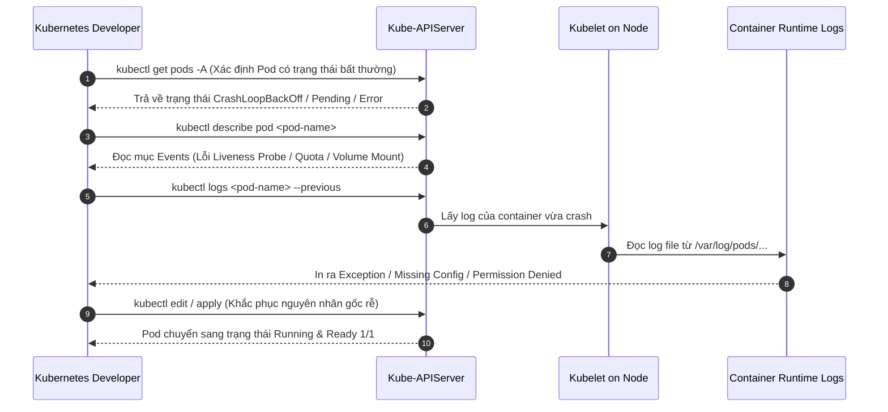
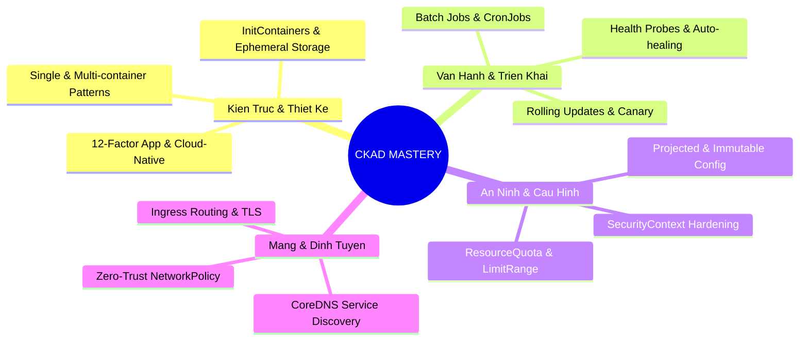


> [!IMPORTANT]
> **Mục tiêu kỹ thuật bài học**:
> - Tổng kết và xâu chuỗi toàn bộ kiến thức của 16 bài học thuộc chuỗi đào tạo chuyên sâu CKAD.
> - Làm chủ bảng tra cứu lệnh tắt `kubectl` một dòng (One-liners) cho mọi loại tài nguyên: Pods, Deployments, Services, Jobs, ConfigMaps, Secrets, Ingress và NetworkPolicies.
> - Rèn luyện phản xạ xử lý sự cố trong vòng dưới 3 phút khi gặp các mã lỗi: `CrashLoopBackOff`, `ImagePullBackOff`, `OOMKilled`, `CreateContainerConfigError`, `502/503 Ingress Error`.
> - Chuẩn bị tâm lý và kỹ năng trả lời phỏng vấn chuyên sâu dành cho vị trí Kubernetes Developer / Cloud-Native Software Engineer.

---

## 1. Bản Chất Kiến Trúc & Tư Duy Cốt Lõi: Khung Năng Lực Toàn Diện Của Kubernetes Developer

Trở thành một **Kubernetes Developer xuất sắc (CKAD)** không chỉ đơn thuần là ghi nhớ các câu lệnh `kubectl`, mà là sự kết hợp nhuần nhuyễn giữa **Tư duy Kiến trúc Hướng Đám Mây (Cloud-Native Architecture)**, **Mô hình 12-Factor App**, và **Kỹ năng Thao tác Dòng Lệnh Tốc Độ Cao**.

```mermaid
flowchart TD
    subgraph AppLifecycle["Vòng Đời Ứng Dụng Cloud-Native Toàn Diện"]
        Code["Mã Nguồn Microservice"] --> Build["Đóng gói OCI Container Image"]
        Build --> Pods["Khởi tạo Pod (Single / Multi-container)"]
        
        subgraph Hardening["Cấu Hình & Gia Cố An Ninh"]
            Config["ConfigMaps & Secrets (Projected/Immutable)"]
            Sec["SecurityContext (runAsNonRoot, ReadOnly, Cap)"]
            Quota["LimitRange & ResourceQuota (QoS Classes)"]
        end

        subgraph NetworkingLayer["Định Tuyến & Bảo Mật Mạng"]
            SVC["L4 Services (ClusterIP, NodePort)"]
            Ing["L7 Ingress Routing (Host, Path, TLS)"]
            NetPol["NetworkPolicy (Zero-Trust Isolation)"]
        end

        subgraph Reliability["Giám Sát & Vận Hành Vòng Đời"]
            Probes["Health Probes (Startup, Liveness, Readiness)"]
            Deploy["Deployment Strategies (RollingUpdate, Canary)"]
            Jobs["Batch Jobs & CronJobs"]
        end

        Pods --> Hardening
        Hardening --> NetworkingLayer
        NetworkingLayer --> Reliability
    end

    style AppLifecycle fill:none,stroke:#3b82f6,stroke-width:2px
    style Hardening fill:none,stroke:#10b981,stroke-width:2px
    style NetworkingLayer fill:none,stroke:#6366f1,stroke-width:2px
    style Reliability fill:none,stroke:#f59e0b,stroke-width:2px
```



---

## 2. Bảng Ma Trận So Sánh Kỹ Thuật Toàn Diện: Cheat Sheet 100+ Lệnh Thực Chiến

| Danh Mục | Tác Vụ Cần Thực Hiện | Câu Lệnh Imperative Chuẩn Tốc Độ Cao (One-Liner) |
| :--- | :--- | :--- |
| **Môi Trường** | Thiết lập Alias & Shell | `alias k=kubectl && export do="--dry-run=client -o yaml" && export now="--grace-period=0 --force"` |
| **Namespace** | Đổi namespace mặc định | `k config set-context --current --namespace=<ns-name>` |
| **Pod** | Tạo Pod Nginx cổng 80 | `k run nginx-pod --image=nginx:alpine --port=80` |
| **Pod** | Xuất YAML Pod với biến môi trường | `k run test-pod --image=busybox:1.36 --env="ENV=prod" $do -- sleep 3600 > pod.yaml` |
| **Pod** | Xóa Pod cưỡng bức 0s | `k delete pod <pod-name> $now` |
| **Deployment** | Tạo Deployment 3 replicas | `k create deployment api-deploy --image=nginx:alpine --replicas=3` |
| **Deployment** | Cập nhật Image ghi log history | `k set image deployment/api-deploy nginx=nginx:1.25 --record` |
| **Deployment** | Rollback về revision trước | `k rollout undo deployment/api-deploy` |
| **Deployment** | Scale số lượng Pods | `k scale deployment/api-deploy --replicas=5` |
| **Service** | Expose ClusterIP nội bộ | `k expose deployment api-deploy --name=api-svc --port=80 --target-port=8080` |
| **Service** | Expose NodePort cổng ngoài | `k expose deployment api-deploy --name=api-np --type=NodePort --port=80 --target-port=80` |
| **ConfigMap** | Tạo từ giá trị trực tiếp | `k create configmap app-cfg --from-literal=DB_HOST=10.0.0.1 --from-literal=PORT=3306` |
| **ConfigMap** | Tạo từ tệp tin cấu hình | `k create configmap app-cfg --from-file=config.json` |
| **Secret** | Tạo Secret Generic chứa mật khẩu | `k create secret generic db-pass --from-literal=password='P@ssw0rd123'` |
| **Secret** | Tạo Secret TLS tự ký | `k create secret tls domain-tls --cert=tls.crt --key=tls.key` |
| **Secret** | Tạo Secret kéo ảnh Private | `k create secret docker-registry reg-cred --docker-server=... --docker-username=... --docker-password=...` |
| **Batch Job** | Tạo Job tính toán | `k create job calc-job --image=busybox:1.36 -- expr 100 + 200` |
| **CronJob** | Tạo CronJob mỗi 5 phút | `k create cronjob sync-job --image=busybox:1.36 --schedule="*/5 * * * *" -- date` |
| **Ingress** | Tạo Ingress có Host & Path | `k create ingress web-ing --rule="store.lab/*=store-svc:80" --class=nginx` |
| **Debug** | Xem log container crash trước đó | `k logs <pod-name> -c <container-name> --previous` |
| **Debug** | Trích xuất sự kiện cảnh báo | `k get events --field-selector type=Warning --sort-by=.metadata.creationTimestamp` |

---

## 3. Kiến Trúc Môi Trường & Luồng Thực Thi Mẫu

Khi một sự cố xảy ra trên môi trường Production hoặc trong phòng thi, một Developer chuyên nghiệp sẽ tuân thủ quy trình xử lý sự cố chuẩn (**Incident Troubleshooting Pipeline**):



---

## 4. Phân Tích Cạm Bẫy Thực Chiến: "Tổng Hợp 5 Lỗi Cú Pháp & Cấu Hình Nguy Hiểm Nhất"

### Tình Huống Thực Tế
Dưới đây là 5 lỗi cấu hình kinh điển khiến ứng dụng bị sập hoặc thí sinh mất trọn điểm trong kỳ thi CKAD:

### Hậu Quả & Log Lỗi Thực Tế:
```text
1. Lỗi Thụt Lề YAML (Indentation Error):
   error: error parsing task.yaml: error converting YAML to JSON: yaml: line 12: mapping values are not allowed in this context

2. Lỗi Nhầm Cổng Service targetPort:
   HTTP/1.1 502 Bad Gateway (Ingress không thể kết nối tới backend pod)

3. Lỗi CrashLoopBackOff do Command kết thúc ngay:
   Container chạy image "busybox" không có sleep hoặc loop, trả về Exit Code 0 rồi Kubelet tự động restart liên tục!

4. Lỗi ImagePullBackOff do gõ sai tên Image hoặc thiếu Secret kéo ảnh:
   Failed to pull image "nginx:alpin": rpc error: code = NotFound desc = failed to pull and unpack image

5. Lỗi ReadOnlyRootFilesystem mà không mount emptyDir vào /tmp:
   java.io.IOException: Read-only file system at org.apache.catalina.startup.Tomcat.start
```

### 5-Whys Root Cause Analysis:
1. **Tại sao YAML bị lỗi cú pháp?** Do sử dụng phím Tab thay vì Space, hoặc thụt lề không đồng nhất giữa các mảng (`- `).
2. **Tại sao Busybox bị CrashLoopBackOff dù không có lỗi mã nguồn?** Vì tiến trình container không chạy ở chế độ nền (foreground daemon). Khi CMD kết thúc, PID 1 đóng lại, Kubelet mặc định với `restartPolicy: Always` sẽ khởi động lại container vô tận.
3. **Tại sao Ingress trả về 502 Bad Gateway?** Do Service `targetPort` không khớp với `containerPort` mà ứng dụng đang lắng nghe.
4. **Giải pháp chuẩn:** Luôn kiểm tra file bằng `kubectl apply --dry-run=client -f file.yaml` trước khi chạy thực tế.

---

## 5. Hands-on Lab: Thử Thách Tốc Độ 15 Phút - 8 Tình Huống Triển Khai Nhanh (8 Bước)

| Bước | Mục Tiêu Kỹ Thuật (Target: < 2 phút/bước) | Lệnh Thực Hiện Chính |
| :--- | :--- | :--- |
| **1** | Tạo Namespace và Pod Nginx với Label | `kubectl create ns ckad-fast-lab && kubectl run web ...` |
| **2** | Expose Service ClusterIP cho Pod vừa tạo | `kubectl expose pod web --name=web-svc --port=80` |
| **3** | Tạo ConfigMap & Secret và nạp vào Pod mới | `kubectl create cm/secret && kubectl apply -f pod-env.yaml` |
| **4** | Tạo Deployment 3 replicas và Rolling Update | `kubectl create deploy worker --replicas=3 && kubectl set image` |
| **5** | Thêm Liveness & Readiness Probes vào Pod | `kubectl apply -f probe-pod.yaml` |
| **6** | Tạo Batch Job thực thi lệnh tính toán | `kubectl create job calc-job --image=busybox -- expr 50 \* 2` |
| **7** | Tạo CronJob chạy định kỳ mỗi 5 phút | `kubectl create cronjob backup-task --schedule="*/5 * * * *" ...` |
| **8** | Dọn dẹp toàn bộ tài nguyên Lab | `kubectl delete ns ckad-fast-lab` |

---

### Bước 1: Khởi Tạo Namespace & Pod Với Labels

```bash
kubectl create namespace ckad-fast-lab
kubectl config set-context --current --namespace=ckad-fast-lab

# Tạo Pod Nginx mang label tier=frontend trong 5 giây
kubectl run web --image=nginx:alpine --labels="tier=frontend,env=prod" --port=80
kubectl wait --for=condition=ready pod/web --timeout=30s
```

---

### Bước 2: Expose Service ClusterIP

```bash
# Tạo Service ClusterIP tự động map label từ Pod
kubectl expose pod web --name=web-svc --port=80 --target-port=80
kubectl get svc,endpoints web-svc
```

---

### Bước 3: Tạo ConfigMap, Secret & Mount Dạng Biến Môi Trường

```bash
kubectl create configmap app-cfg --from-literal=APP_MODE=production
kubectl create secret generic app-sec --from-literal=API_KEY=ABC123XYZ

# Tạo Pod nạp toàn bộ biến môi trường từ ConfigMap và Secret
cat <<EOF | kubectl apply -f -
apiVersion: v1
kind: Pod
metadata:
  name: env-consumer-pod
spec:
  containers:
  - name: app
    image: busybox:1.36
    command: ["sh", "-c", "echo Mode: \$APP_MODE, Key: \$API_KEY && sleep 3600"]
    envFrom:
    - configMapRef:
        name: app-cfg
    - secretRef:
        name: app-sec
EOF
kubectl wait --for=condition=ready pod/env-consumer-pod --timeout=30s
kubectl logs env-consumer-pod | head -n 1
```

---

### Bước 4: Tạo Deployment & Thực Hiện Rolling Update

```bash
kubectl create deployment worker-service --image=nginx:1.24 --replicas=3
kubectl rollout status deployment/worker-service

# Nâng cấp phiên bản và ghi lại lịch sử rollout
kubectl set image deployment/worker-service nginx=nginx:1.25 --record
kubectl rollout status deployment/worker-service
kubectl rollout history deployment/worker-service
```

---

### Bước 5: Triển Khai Pod Có Đầy Đủ Health Probes

```bash
cat <<EOF | kubectl apply -f -
apiVersion: v1
kind: Pod
metadata:
  name: hardened-probe-pod
spec:
  containers:
  - name: web
    image: nginx:alpine
    ports:
    - containerPort: 80
    livenessProbe:
      httpGet:
        path: /
        port: 80
      initialDelaySeconds: 5
      periodSeconds: 10
    readinessProbe:
      httpGet:
        path: /
        port: 80
      periodSeconds: 5
EOF
kubectl wait --for=condition=ready pod/hardened-probe-pod --timeout=30s
```

---

### Bước 6: Khởi Tạo Batch Job Xử Lý Dữ Liệu

```bash
kubectl create job math-batch-job --image=busybox:1.36 -- sh -c "expr 50 \* 2"
kubectl wait --for=condition=complete job/math-batch-job --timeout=30s
kubectl logs job/math-batch-job
```

---

### Bước 7: Khởi Tạo CronJob Chạy Định Kỳ

```bash
kubectl create cronjob scheduled-backup --image=busybox:1.36 --schedule="*/5 * * * *" -- sh -c "echo 'Backup completed at' \$(date)"
kubectl get cronjob scheduled-backup
```

---

### Bước 8: Dọn Dẹp Toàn Bộ Môi Trường Lab

```bash
kubectl delete ns ckad-fast-lab
```

---

## 6. 10 Câu Hỏi Tự Kiểm Tra Chuyên Sâu (Self-Check Q&A Accordion)

<details class="qa-card">
<summary><b>1. Làm thế nào để trích xuất nhanh địa chỉ IP của tất cả các Pod trong một lệnh duy nhất?</b></summary>
<div class="qa-answer">
<pre><code>kubectl get pods -o jsonpath='{.items[*].status.podIP}'</code></pre>
<p>Hoặc hiển thị kèm tên Pod: <code>kubectl get pods -o custom-columns=NAME:.metadata.name,IP:.status.podIP</code></p>
</div>
</details>

<details class="qa-card">
<summary><b>2. Tại sao cần sử dụng InitContainer thay vì chạy script khởi tạo trực tiếp trong App Container?</b></summary>
<div class="qa-answer">
<p><b>InitContainer</b> luôn chạy và hoàn thành trước khi App Container khởi động. Giúp tách biệt các công cụ cài đặt nặng (như git, curl, compiler) khỏi image chính của ứng dụng, giữ cho App Container siêu nhẹ, an toàn và chỉ chứa đúng runtime cần thiết.</p>
</div>
</details>

<details class="qa-card">
<summary><b>3. Sự khác nhau giữa Liveness Probe và Readiness Probe là gì?</b></summary>
<div class="qa-answer">
<p><b>Liveness Probe:</b> Phát hiện ứng dụng bị treo (deadlock). Nếu thất bại, Kubelet sẽ <b>Restart Container</b>.</p>
<p><b>Readiness Probe:</b> Phát hiện ứng dụng đã sẵn sàng nhận traffic chưa. Nếu thất bại, Kubelet sẽ <b>Tạm gỡ IP của Pod khỏi Endpoints của Service</b> mà không restart Pod.</p>
</div>
</details>

<details class="qa-card">
<summary><b>4. Cú pháp để tạo một Job chạy song song 3 worker và cần tổng cộng 6 lượt hoàn thành thành công là gì?</b></summary>
<div class="qa-answer">
<pre><code>spec:
  completions: 6
  parallelism: 3</code></pre>
</div>
</details>

<details class="qa-card">
<summary><b>5. Điều gì xảy ra nếu bạn đặt `readOnlyRootFilesystem: true` nhưng không mount Volume cho thư mục tạm của ứng dụng?</b></summary>
<div class="qa-answer">
<p>Tiến trình ứng dụng sẽ bị crash ngay lập tức với mã lỗi <code>EROFS (Read-only file system)</code> khi cố gắng ghi log tạm hoặc file PID vào <code>/tmp</code> hay <code>/var/run</code>, dẫn đến trạng thái <code>CrashLoopBackOff</code>.</p>
</div>
</details>

<details class="qa-card">
<summary><b>6. Làm thế nào để xem lịch sử nâng cấp của Deployment và quay về một Revision cụ thể?</b></summary>
<div class="qa-answer">
<pre><code>kubectl rollout history deployment/&lt;deploy-name&gt;
kubectl rollout undo deployment/&lt;deploy-name&gt; --to-revision=2</code></pre>
</div>
</details>

<details class="qa-card">
<summary><b>7. Cờ nào trong CronJob ngăn chặn việc tạo Job mới nếu Job của chu kỳ trước vẫn đang chạy?</b></summary>
<div class="qa-answer">
<p>Thiết lập cờ <b><code>concurrencyPolicy: Forbid</code></b> trong <code>spec</code> của CronJob.</p>
</div>
</details>

<details class="qa-card">
<summary><b>8. Lợi ích của việc đặt `immutable: true` cho ConfigMap và Secret là gì?</b></summary>
<div class="qa-answer">
<p>Giúp bảo vệ dữ liệu cấu hình không bị sửa đổi ngoài ý muốn và <b>ngắt chu kỳ Watch polling liên tục của Kubelet</b>, giảm tải đáng kể cho Kube-APIServer và etcd khi cụm mở rộng quy mô lớn.</p>
</div>
</details>

<details class="qa-card">
<summary><b>9. Khi một Pod có nhiều container, làm thế nào để mở phiên làm việc tương tác (interactive shell) vào đúng container thứ hai?</b></summary>
<div class="qa-answer">
<pre><code>kubectl exec -it &lt;pod-name&gt; -c &lt;container-name&gt; -- sh</code></pre>
</div>
</details>

<details class="qa-card">
<summary><b>10. Trong kiến trúc Microservices trên Kubernetes, tại sao nên kết hợp Ingress L7 với NetworkPolicy L3/L4?</b></summary>
<div class="qa-answer">
<p><b>Ingress L7:</b> Đóng vai trò cửa ngõ định tuyến thông minh (Smart Gateway), giải mã HTTPS SSL và cân bằng tải bên ngoài.</p>
<p><b>NetworkPolicy L3/L4:</b> Đóng vai trò tường lửa Zero-Trust nội bộ, cô lập chặt chẽ các microservices ở các tầng backend/database khỏi việc bị truy cập trái phép nếu một container ở tầng frontend bị xâm nhập.</p>
</div>
</details>

---

## 7. Tổng Kết & Lộ Trình Phát Triển Chuyên Sâu



Chúc mừng bạn đã hoàn thành xuất sắc toàn bộ **16 bài học chuyên sâu của khóa học CKAD Exam & App Developer Mastery**! Với nền tảng kiến thức kiến trúc vững chắc, kỹ năng thao tác dòng lệnh tốc độ cao và phản xạ xử lý sự cố thực chiến, bạn đã sẵn sàng 100% để tự tin bước vào phòng thi và chinh phục chứng chỉ quốc tế **Certified Kubernetes Application Developer (CKAD)**.

> [!TIP]
> **Lộ trình tiếp theo**: Để tiếp tục nâng cao trình độ quản trị hạ tầng và kiến trúc bảo mật cấp cao, hãy khám phá lộ trình chứng chỉ **CKA (Certified Kubernetes Administrator)** và **CKS (Certified Kubernetes Security Specialist)**.

