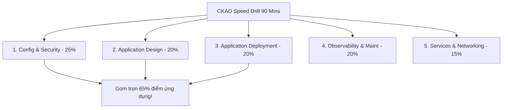
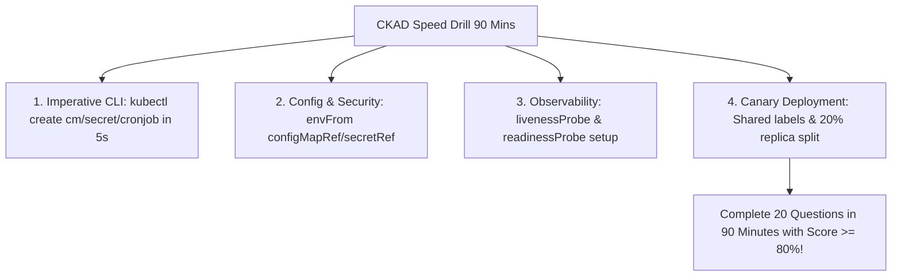


# [BÀI 16] TỔNG ÔN TỐC ĐỘ CKAD: GIẢI QUYẾT 20 BÀI TẬP THỰC HÀNH ỨNG DỤNG TRONG 90 PHÚT

Trong kỷ nguyên điện toán đám mây và kiến trúc microservices phân tán quy mô lớn, **Kubernetes (CKAD)** đóng vai trò là nền tảng điều phối container (Container Orchestration) tiêu chuẩn công nghiệp. Để làm chủ hệ thống trong môi trường sản xuất (Production) cũng như chinh phục kỳ thi chứng chỉ quốc tế của Linux Foundation / CNCF, kỹ sư không chỉ nắm vững các câu lệnh thao tác cơ bản mà phải thấu hiểu sâu sắc bản chất cơ chế tầng thấp: từ chu trình điều hòa (Reconciliation Loop), cấu trúc điều phối tài nguyên, kiến trúc mạng CNI, lưu trữ CSI cho đến các chuẩn mực an ninh phòng thủ chiều sâu.

Bài viết chuyên sâu này sẽ đồng hành cùng bạn giải mã toàn diện bức tranh kiến trúc, phân tích các đánh đổi kỹ thuật thực chiến (Engineering Trade-offs), cung cấp bài thực hành Lab từng bước và bộ câu hỏi phỏng vấn chuẩn Architect / Lead Engineer.

---

## 1. Bản Chất Kiến Trúc & Cơ Chế Vận Hành Tầng Thấp

| # | Câu hỏi ôn tập | Đáp án chuẩn ngắn gọn |
|---|---|---|
| 1 | Miền kiến thức CKA trọng số lớn nhất? | **Troubleshooting (30 %)** |
| 2 | Cú pháp trích xuất dữ liệu JSON trong 10s? | Cú pháp **`jsonpath` và `-o custom-columns`** |
| 3 | Lệnh etcd snapshot save chuẩn TLS? | Lệnh **`ETCDCTL_API=3 etcdctl snapshot save`** |
| 4 | Bộ 3 bước gỡ lỗi Node NotReady? | **`describe node` -> `systemctl status` -> `journalctl`** |
| 5 | Lệnh hoàn tác Deployment về bản cũ? | Lệnh **`kubectl rollout undo deployment/<name>`** |


> **"Tổng ôn tốc độ chứng chỉ CKAD (Certified Kubernetes Application Developer) bằng bài thực hành nén 20 câu bài tập trong 90 phút là kỹ năng tối ưu hóa phản xạ thiết kế và triển khai ứng dụng đám mây (Cloud-Native Application Development), đòi hỏi lập trình viên Kubernetes phải làm chủ 5 miền kiến thức CKAD (Application Environment, Configuration & Security, Application Design & Build, Application Deployment, Application Observability & Maintenance, và Services & Networking); thành thục kỹ năng tạo tệp manifest imperatively bằng `kubectl create/run`; cấu hình kiểm tra sức khỏe ứng dụng (`livenessProbe`, `readinessProbe`), lập lịch tác vụ định kỳ `CronJob`, quản lý biến môi trường `ConfigMap`/`Secret`, và triển khai chiến lược Canary Release; đồng thời duy trì tốc độ 4,5 phút mỗi câu để hoàn thành trọn vẹn đề thi với điểm số tuyệt đối."**

**Kết quả từ các buổi trước được sử dụng lại:**

| Kết quả / Công cụ | Buổi + số hiệu `QT` | Dùng ở đâu trong buổi này |
|---|---|---|
| Cấu hình Pod, Deployment và Service | Buổi 02, 05 `QT 4.1` | Thực hành các câu hỏi tạo đối tượng ứng dụng CKAD |
| Quản lý ConfigMap, Secret và Probes | Buổi 21, 22 `QT 4.1` | Thực hành các câu hỏi miền Configuration & Observability CKAD |
| Thiết kế CronJob và Multi-container Pod | Buổi 16, 28 `QT 4.1` | Thực hành các câu hỏi miền Design & Build CKAD |

---


| # | Kỹ năng thực hiện được | Hiện vật chứng minh |
|---|---|---|
| 1 | Nắm vững ma trận trọng số 5 miền kiến thức CKAD | Bảng phân tích trọng số 5 miền CKAD CNCF |
| 2 | Tạo tệp manifest imperatively cho Pod, CronJob, ConfigMap trong 10s | Bộ câu lệnh `kubectl create` imperatively |
| 3 | Cấu hình bộ đôi `livenessProbe` và `readinessProbe` chuẩn xác | Tệp YAML Pod spec chứa khối probe |
| 4 | Cấu hình Canary Deployment và Blue-Green Deployment qua selector | Tệp YAML Deployment & Service selector |
| 5 | Hoàn thành bài thi tốc độ 20 câu CKAD trong 90 phút đạt trên 80/100 điểm | Bảng điểm tự động bài CKAD speed drill |

---


| Kiến thức tiên quyết | Nguồn tự học nếu thiếu |
|---|---|
| Cấu hình ConfigMap, Secret và Probes | Buổi 21, 22 (`QT 4.1`) |
| Thiết kế CronJob và Multi-container Pod | Buổi 16, 28 (`QT 4.1`) |
| Định tuyến Service và Ingress | Buổi 27, 30 (`QT 4.1`) |

---


### 3.1. Thuật ngữ Việt–Anh

| # | Thuật ngữ tiếng Việt | Tiếng Anh tương đương | Ghi chú chuẩn hoá trong thân bài |
|---|---|---|---|
| 1 | Tổng ôn tốc độ CKAD | CKAD Speed Drill | Bài thực hành nén 20 câu CKAD trong 90 phút |
| 2 | Kiểm tra ứng dụng sống | Liveness Probe | Cấu hình kiểm tra tiến trình container sống hay chết |
| 3 | Kiểm tra ứng dụng sẵn sàng | Readiness Probe | Cấu hình kiểm tra container sẵn sàng nhận lưu lượng mạng |
| 4 | Tác vụ định kỳ | CronJob Schedule | Khai báo tác vụ chạy theo lịch cron `*/5 * * * *` |
| 5 | Biến môi trường tập trung | Environment Variables (`envFrom`) | Nhập toàn bộ biến môi trường từ ConfigMap/Secret vào Pod |
| 6 | Triển khai theo tỷ lệ Canary | Canary Deployment Strategy | Phương pháp đẩy phiên bản mới tới một tỷ lệ % nhỏ người dùng |
| 7 | Mô hình hai môi trường Blue-Green | Blue-Green Deployment | Phương pháp chuyển hướng Service selector sang cụm Pod mới |
| 8 | Mô hình container hỗ trợ | Sidecar / Adapter Container Pattern | Thiết kế container phụ trợ thu thập log hoặc biến đổi dữ liệu |
| 9 | Giới hạn tài nguyên Pod | Pod Resource Limits (`cpu`/`memory`) | Cấu hình `resources.limits` ngăn chiếm dụng tài nguyên Host |
| 10 | Tài khoản dịch vụ ứng dụng | Application ServiceAccount | Gán ServiceAccount riêng cho Pod để phân quyền RBAC |
| 11 | Cổng dịch vụ mạng | Service Port Mapping | Cấu hình `port` và `targetPort` trong Service manifest |
| 12 | Định tuyến đường dẫn Ingress | Ingress Path Routing | Cấu hình định tuyến đường dẫn URI `/api` về Service |
| 13 | Bảng ghi điểm tự động CKAD | CKAD Auto-Grading Script | Script kiểm tra kết quả 20 câu bài tập CKAD |
| 14 | Tốc độ xử lý câu hỏi | Query Execution Speed | Chỉ số thời gian trung bình 4,5 phút mỗi câu |


Mô hình Dây Chuyền Lắp Ráp Xe Hơi Tự Động Trong Nhà Máy Chế Tạo: Kỳ thi CKAD tập trung hoàn toàn vào Kỹ Năng Đóng Gói Và Vận Hành Các Thành Phần Ứng Dụng Trên Kubernetes. Giống như Kỹ Sư Lắp Ráp Xe Hơi Trên Dây Chuyền Tự Động: từng chi tiết (ConfigMap, Secret, Probe, CronJob, Service) đều phải được lắp ráp chính xác và nhanh chóng vào vị trí. Nếu kỹ sư mất 10 phút chỉ để bắt một con ốc (gõ thủ công 1 file CronJob YAML), toàn bộ dây chuyền sẽ bị tắc nghẽn (hết giờ thi). `CKAD Speed Drill` giống như Việc Luyện Tập Lắp Ráp Bằng Máy Bắn Ốc Tự Động (`kubectl create` imperatively): giúp lập trình viên bắn nhanh các tệp YAML chuẩn xác trong 10 giây, cài đặt các mắt thần cảm biến an toàn (`livenessProbe`/`readinessProbe`) trong 30 giây, và hoàn thành trọn vẹn 20 nhiệm vụ lắp ráp ứng dụng trong 90 phút với độ chính xác tuyệt đối.

---

### 1.1. Ma trận 5 Miền CKAD và Chiến thuật Gom điểm Miền Configuration & Security (25%) (12 phút)

**Nguyên lý cốt lõi:** Tất cả các ứng viên CKAD BẮT BUỘC phải làm chủ kỹ thuật tạo tệp manifest imperatively bằng `kubectl` để hoàn thành 20 câu bài tập trong 90 phút.

**Giải thích cơ chế ngầm:** Kỳ thi CKAD kiểm tra kỹ năng thực hành xây dựng ứng dụng với tần suất câu hỏi cao. Tạo manifest bằng lệnh imperatively giúp tiết kiệm 80% thời gian so với gõ tay YAML.

> [!WARNING]
> **CẠM BẪY THỰC CHIẾN:**
> Ngồi tự viết từng dòng tệp CronJob YAML từ bộ nhớ trong phòng thi.

**Minh hoạ.**



**Nguyên lý cốt lõi:** Hiểu rõ ma trận 5 miền CKAD: Application Environment, Configuration & Security (25%), Application Design & Build (20%), Application Deployment (20%), Application Observability & Maintenance (20%), Services & Networking (15%).

**Giải thích cơ chế ngầm:** Miền Configuration & Security chiếm trọng số điểm lớn nhất (25%). Làm chủ ConfigMap, Secret, SecurityContext và ServiceAccount giúp tích lũy ngay 25 điểm đầu tiên.

> [!WARNING]
> **CẠM BẪY THỰC CHIẾN:**
> Bỏ qua việc luyện tập các lệnh `kubectl create configmap/secret` siêu tốc.

**Minh hoạ.**

```yaml
# Ma trận trọng số bài thi CKAD CNCF:
# - Application Environment, Configuration & Security: 25%
# - Application Design & Build: 20%
# - Application Deployment: 20%
# - Application Observability & Maintenance: 20%
# - Services & Networking: 15%
```

---

### 1.2. Kỹ thuật Sinh Khung Manifest Imperatively cho Pod, Deployment, CronJob và ConfigMap (12 phút)

**Nguyên lý cốt lõi:** Thuộc lòng các câu lệnh `kubectl create` để tạo nhanh ConfigMap (`kubectl create configmap`), Secret (`kubectl create secret generic`), CronJob (`kubectl create cronjob`), và Job (`kubectl create job`).

**Giải thích cơ chế ngầm:** Giúp sinh ngay tệp manifest chuẩn trong 5 giây mà không cần mở trình duyệt tra cứu tài liệu.

> [!WARNING]
> **CẠM BẪY THỰC CHIẾN:**
> Mở trang web `kubernetes.io` copy mẫu CronJob YAML về rồi chỉnh sửa thủ công.

**Minh hoạ.**

```bash
# Sinh CronJob manifest chuẩn siêu tốc:
kubectl create cronjob my-cron --image=busybox --schedule="*/5 * * * *" --dry-run=client -o yaml -- date > /tmp/cron.yaml

# Sinh ConfigMap từ key-value:
kubectl create configmap app-cm --from-literal=APP_COLOR=red --from-literal=APP_MODE=prod
```

**Nguyên lý cốt lõi:** Khi cấu hình `envFrom` trong Pod spec, sử dụng từ khóa `configMapRef` hoặc `secretRef` để nạp toàn bộ danh sách key-value từ ConfigMap/Secret vào biến môi trường.

**Giải thích cơ chế ngầm:** Nạp toàn bộ danh sách biến môi trường trong 1 câu lệnh ngắn gọn mà không cần khai báo từng biến đơn lẻ `env[x].name`.

> [!WARNING]
> **CẠM BẪY THỰC CHIẾN:**
> Khai báo thủ công từng biến môi trường `valueFrom.configMapKeyRef` cho 20 biến khác nhau.

**Minh hoạ.**

```yaml
# Nạp toàn bộ ConfigMap vào biến môi trường Pod:
spec:
  containers:
    - name: app
      image: nginx
      envFrom:
        - configMapRef:
            name: app-cm
```

---

### 1.3. Cấu hình Probes (`livenessProbe`/`readinessProbe`) và Chiến lược Canary Deployment (10 phút)

**Nguyên lý cốt lõi:** Cấu hình `livenessProbe` và `readinessProbe` phải khai báo đầy đủ các tham số: `initialDelaySeconds`, `periodSeconds`, và cơ chế kiểm tra (`httpGet`, `tcpSocket`, hoặc `exec`).

**Giải thích cơ chế ngầm:** Khai báo thiếu hoặc sai thông số probe sẽ khiến container bị Kubelet restart liên tục (CrashLoopBackOff) hoặc không nhận được lưu lượng mạng từ Service.

> [!WARNING]
> **CẠM BẪY THỰC CHIẾN:**
> Đặt `initialDelaySeconds: 0` làm Probe kiểm tra trước khi ứng dụng kịp khởi động làm container bị crash.

**Minh hoạ.**

```yaml
# Khai báo livenessProbe và readinessProbe chuẩn trong Pod spec:
spec:
  containers:
    - name: app
      image: nginx
      livenessProbe:
        httpGet:
          path: /healthz
          port: 8080
        initialDelaySeconds: 15
        periodSeconds: 10
      readinessProbe:
        httpGet:
          path: /ready
          port: 8080
        initialDelaySeconds: 5
        periodSeconds: 5
```

**Nguyên lý cốt lõi:** Thực hiện Canary Deployment bằng cách tạo 2 Deployment khác nhau (ví dụ `app-v1` 4 replicas, `app-v2` 1 replica) cùng mang chung nhãn `app=web` để Service điều hướng 20% lưu lượng sang `app-v2`.

**Giải thích cơ chế ngầm:** Service sử dụng nhãn `selector: app=web` để phân phối lưu lượng ngẫu nhiên qua tất cả các Pods khớp nhãn. 1/5 số Pods thuộc phiên bản v2 tương ứng với 20% lưu lượng Canary.

> [!WARNING]
> **CẠM BẪY THỰC CHIẾN:**
> Thay đổi selector của Service làm 100% lưu lượng bị ngắt kết nối khỏi phiên bản cũ `app-v1`.

**Minh hoạ.**

```yaml
# Canary Deployment Pattern:
# Deployment 1: app-v1 (replicas: 4, labels: app=web, version=v1)
# Deployment 2: app-v2 (replicas: 1, labels: app=web, version=v2)
# Service: web-svc (selector: app=web) -> 20% traffic goes to app-v2!
```

**Nguyên lý cốt lõi:** Khi ứng dụng bị nghẽn ở trạng thái `CrashLoopBackOff`, dùng lệnh `kubectl logs <pod-name> --previous` để đọc log tiến trình container vừa bị sập trước đó.

**Giải thích cơ chế ngầm:** Khi container bị restart, lệnh `kubectl logs` mặc định sẽ đọc log của container mới (thường rỗng). Cờ `--previous` giúp truy vết nguyên nhân làm sập container cũ.

> [!WARNING]
> **CẠM BẪY THỰC CHIẾN:**
> Chạy `kubectl logs` thấy rỗng rồi ngồi chờ không biết nguyên nhân ứng dụng bị crash.

**Minh hoạ.**

```bash
# Đọc log của container vừa bị crash trước đó:
kubectl logs crash-pod -c main-app --previous
```

---

### 1.4. Đưa vào cụm thật (4 phút)

**Nguyên lý cốt lõi:** Bản kê khai kết quả bài thi CKAD hoàn chỉnh bắt buộc phải chứa 100% các đối tượng ứng dụng (Pods, Deployments, Services, ConfigMaps, Secrets, CronJobs) được tạo đúng tên và đúng namespace yêu cầu.

**Giải thích cơ chế ngầm:** Hệ thống chấm điểm tự động của CNCF kiểm tra chính xác tên đối tượng và thuộc tính khai báo.

> [!WARNING]
> **CẠM BẪY THỰC CHIẾN:**
> Tạo đúng thuộc tính nhưng nhầm tên Namespace (nhầm `default` thay vì `lab67-ckad`).

**Minh hoạ.**

```bash
# Luôn đảm bảo truyền cờ -n <namespace> khi tạo đối tượng:
kubectl create configmap app-cm --from-literal=mode=prod -n lab67-ckad
```

**Áp vào cụm đang chạy thì làm gì trước:**
1. Thiết lập alias `k=kubectl` và `do="--dry-run=client -o yaml"`.
2. Luyện tập các câu lệnh imperatively sinh ConfigMap, Secret, CronJob.
3. Bắt đầu bài thi tốc độ 20 câu CKAD với đồng hồ bấm giờ 90 phút.
4. Chạy script tự động chấm điểm bài thi CKAD kiểm tra kết quả.

**Cái gì hỏng nếu áp thẳng lên prod:**
- Xóa nhầm Service selector làm gián đoạn toàn bộ lưu lượng ứng dụng đang chạy.

**Đo trước — đo sau:**
- Đo thời gian viết tệp CronJob YAML thủ công (mất 4 phút) so với dùng `kubectl create cronjob` (mất 10 giây).

**Khi nào KHÔNG nên dùng:**
- Không sửa trực tiếp Deployment đang phục vụ Production nếu chưa qua bước kiểm thử Canary.

---

### 1.5. Bẫy hay gặp (2 phút)

| Bẫy hay gặp | Vì sao dính | Làm đúng là |
|---|---|---|
| 1. Quên cờ `--schedule` khi create cronjob | Lệnh create cronjob báo lỗi missing schedule | Khai báo cờ `--schedule="*/5 * * * *"` |
| 2. Gõ nhầm `envFrom` thành `env` | Pod báo lỗi schema validation error | Dùng `envFrom` khi nạp toàn bộ ConfigMap/Secret |
| 3. Quên `initialDelaySeconds` trong Probes | Container bị Kubelet restart liên tục trước khi khởi động xong | Thêm `initialDelaySeconds: 15` cho livenessProbe |
| 4. Nhầm lẫn giữa `livenessProbe` và `readinessProbe` | Pod không nhận traffic hoặc bị kill liên tục | Liveness kill container, Readiness ngắt traffic |
| 5. Thay đổi nhãn selector làm hỏng Blue-Green | Service ngắt toàn bộ lưu lượng của phiên bản cũ | Giữ nguyên nhãn chung `app=web` khi chạy Canary |
| 6. Đọc log container mới bị restart thấy rỗng | Container cũ vừa crash và bị xóa | Thêm cờ `kubectl logs <pod> --previous` |
| 7. Gõ nhầm cờ `secret generic` thành `secret` | Lệnh create secret báo lỗi subcommand missing | Gõ đúng `kubectl create secret generic <name>` |
| 8. Quên cờ `--from-literal` khi tạo ConfigMap | Lệnh create configmap bị thiếu key-value | Dùng cờ `--from-literal=KEY=VALUE` |
| 9. Khai báo sai port number trong readinessProbe | Probe kiểm tra sai port nên luôn báo Failure | Kiểm tra chính xác containerPort ứng dụng lắng nghe |
| 10. Không kiểm tra lại Pod status sau khi apply | Pod bị Pending do thiếu PVC hoặc Secret | Chạy `kubectl get pods -n <ns>` kiểm tra STATUS Running |
| 11. Nhầm giữa `command` và `args` trong Pod spec | Ghi đè sai ENTRYPOINT của container | Dùng `command` thay ENTRYPOINT, `args` thay CMD |
| 12. Quên cờ `-n <namespace>` khi tạo tài nguyên | Tài nguyên bị tạo nhầm ở namespace default | Thêm cờ `-n <namespace>` ở cuối lệnh create |

---

### 1.6. Tóm tắt (2 phút)



**Năm điều phải nhớ:**
1. **Imperative Mastery**: Thuộc lòng `kubectl create cm`, `secret generic`, `cronjob` để tạo tệp YAML trong 5 giây.
2. **Bulk Env Load**: Dùng `envFrom.configMapRef` để nạp toàn bộ biến môi trường trong 1 dòng.
3. **Probe Distinction**: `livenessProbe` restart container bị treo, `readinessProbe` điều hướng lưu lượng mạng.
4. **Canary Pattern**: Dùng chung nhãn `app=web` và chia tỷ lệ replica để làm Canary Deployment.
5. **Previous Log Trace**: Dùng `kubectl logs --previous` để đọc log container vừa bị crash.

---

## §10. Câu hỏi tự kiểm tra (5 phút)


<div class="qa-answer">
  <div class="qa-answer-header">
    <svg width="14" height="14" fill="none" stroke="currentColor" stroke-width="2" viewBox="0 0 24 24"><path d="M22 11.08V12a10 10 0 1 1-5.93-9.14"></path><polyline points="22 4 12 14.01 9 11.01"></polyline></svg>
    <span>Phân Tích &amp; Lời Giải Kỹ Thuật</span>
  </div>
  
Miền <b style="color: var(--accent-primary);">Application Environment, Configuration & Security (25 %)</b>.
</div>
</details>

<div class="qa-answer">
  <div class="qa-answer-header">
    <svg width="14" height="14" fill="none" stroke="currentColor" stroke-width="2" viewBox="0 0 24 24"><path d="M22 11.08V12a10 10 0 1 1-5.93-9.14"></path><polyline points="22 4 12 14.01 9 11.01"></polyline></svg>
    <span>Phân Tích &amp; Lời Giải Kỹ Thuật</span>
  </div>
  
Lệnh <code>kubectl create configmap app-cm --from-literal=MODE=prod</code>.
</div>
</details>

<div class="qa-answer">
  <div class="qa-answer-header">
    <svg width="14" height="14" fill="none" stroke="currentColor" stroke-width="2" viewBox="0 0 24 24"><path d="M22 11.08V12a10 10 0 1 1-5.93-9.14"></path><polyline points="22 4 12 14.01 9 11.01"></polyline></svg>
    <span>Phân Tích &amp; Lời Giải Kỹ Thuật</span>
  </div>
  
Lệnh <code>kubectl create cronjob daily-job --image=busybox --schedule="*/10 * * * *" --dry-run=client -o yaml -- date</code>.
</div>
</details>

<div class="qa-answer">
  <div class="qa-answer-header">
    <svg width="14" height="14" fill="none" stroke="currentColor" stroke-width="2" viewBox="0 0 24 24"><path d="M22 11.08V12a10 10 0 1 1-5.93-9.14"></path><polyline points="22 4 12 14.01 9 11.01"></polyline></svg>
    <span>Phân Tích &amp; Lời Giải Kỹ Thuật</span>
  </div>
  
Khối từ khóa <b style="color: var(--accent-primary);"><code>envFrom</code></b> đi kèm <code>configMapRef.name</code>.
</div>
</details>

<div class="qa-answer">
  <div class="qa-answer-header">
    <svg width="14" height="14" fill="none" stroke="currentColor" stroke-width="2" viewBox="0 0 24 24"><path d="M22 11.08V12a10 10 0 1 1-5.93-9.14"></path><polyline points="22 4 12 14.01 9 11.01"></polyline></svg>
    <span>Phân Tích &amp; Lời Giải Kỹ Thuật</span>
  </div>
  
<code>livenessProbe</code> thất bại sẽ <b style="color: var(--accent-primary);">restart (kill) container</b>, còn <code>readinessProbe</code> thất bại sẽ <b style="color: var(--accent-primary);">ngắt lưu lượng mạng (gỡ IP Pod khỏi Service Endpoint)</b>.
</div>
</details>

<div class="qa-answer">
  <div class="qa-answer-header">
    <svg width="14" height="14" fill="none" stroke="currentColor" stroke-width="2" viewBox="0 0 24 24"><path d="M22 11.08V12a10 10 0 1 1-5.93-9.14"></path><polyline points="22 4 12 14.01 9 11.01"></polyline></svg>
    <span>Phân Tích &amp; Lời Giải Kỹ Thuật</span>
  </div>
  
Tham số <b style="color: var(--accent-primary);"><code>initialDelaySeconds</code></b>.
</div>
</details>

<div class="qa-answer">
  <div class="qa-answer-header">
    <svg width="14" height="14" fill="none" stroke="currentColor" stroke-width="2" viewBox="0 0 24 24"><path d="M22 11.08V12a10 10 0 1 1-5.93-9.14"></path><polyline points="22 4 12 14.01 9 11.01"></polyline></svg>
    <span>Phân Tích &amp; Lời Giải Kỹ Thuật</span>
  </div>
  
Lệnh <code>kubectl logs <pod-name> -c <container-name> --previous</code>.
</div>
</details>

<div class="qa-answer">
  <div class="qa-answer-header">
    <svg width="14" height="14" fill="none" stroke="currentColor" stroke-width="2" viewBox="0 0 24 24"><path d="M22 11.08V12a10 10 0 1 1-5.93-9.14"></path><polyline points="22 4 12 14.01 9 11.01"></polyline></svg>
    <span>Phân Tích &amp; Lời Giải Kỹ Thuật</span>
  </div>
  
Cho 2 Deployment <b style="color: var(--accent-primary);">dùng chung nhãn <code>selector</code> (như <code>app=web</code>)</b> và chia tỷ lệ Replicas là <code>4</code> (v1) và <code>1</code> (v2).
</div>
</details>

<div class="qa-answer">
  <div class="qa-answer-header">
    <svg width="14" height="14" fill="none" stroke="currentColor" stroke-width="2" viewBox="0 0 24 24"><path d="M22 11.08V12a10 10 0 1 1-5.93-9.14"></path><polyline points="22 4 12 14.01 9 11.01"></polyline></svg>
    <span>Phân Tích &amp; Lời Giải Kỹ Thuật</span>
  </div>
  
Lệnh <code>kubectl create secret generic db-pass --from-literal=password=SuperSecret123</code>.
</div>
</details>

<div class="qa-answer">
  <div class="qa-answer-header">
    <svg width="14" height="14" fill="none" stroke="currentColor" stroke-width="2" viewBox="0 0 24 24"><path d="M22 11.08V12a10 10 0 1 1-5.93-9.14"></path><polyline points="22 4 12 14.01 9 11.01"></polyline></svg>
    <span>Phân Tích &amp; Lời Giải Kỹ Thuật</span>
  </div>
  
Mô hình <b style="color: var(--accent-primary);">Sidecar Pattern</b> (thu thập log) và <b style="color: var(--accent-primary);">Adapter Pattern</b> (chuẩn hóa dữ liệu).
</div>
</details>

<div class="qa-answer">
  <div class="qa-answer-header">
    <svg width="14" height="14" fill="none" stroke="currentColor" stroke-width="2" viewBox="0 0 24 24"><path d="M22 11.08V12a10 10 0 1 1-5.93-9.14"></path><polyline points="22 4 12 14.01 9 11.01"></polyline></svg>
    <span>Phân Tích &amp; Lời Giải Kỹ Thuật</span>
  </div>
  
Vì giúp <b style="color: var(--accent-primary);">đọc lại log của container vừa crash</b>, tránh đọc log rỗng của container mới tạo lại.
</div>
</details>

<div class="qa-answer">
  <div class="qa-answer-header">
    <svg width="14" height="14" fill="none" stroke="currentColor" stroke-width="2" viewBox="0 0 24 24"><path d="M22 11.08V12a10 10 0 1 1-5.93-9.14"></path><polyline points="22 4 12 14.01 9 11.01"></polyline></svg>
    <span>Phân Tích &amp; Lời Giải Kỹ Thuật</span>
  </div>
  
```yaml
      spec:
        containers:
  <div style="margin: 0.35rem 0; padding-left: 1rem; border-left: 2px solid var(--accent-primary);">• name: app</div>
            image: nginx
            envFrom:
  <div style="margin: 0.35rem 0; padding-left: 1rem; border-left: 2px solid var(--accent-primary);">• configMapRef:</div>
                  name: app-cm
            livenessProbe:
              httpGet:
                path: /healthz
                port: 8080
              initialDelaySeconds: 15
      ```
</div>
</details>

---

## §11. Tài liệu tham khảo

| Nguồn | Địa chỉ URL | Ghi chú |
|---|---|---|
| CKAD Exam Curriculum | `https://github.com/cncf/curriculum` | Curriculum chính thức kỳ thi CKAD |
| Kubernetes Imperative Commands | `https://kubernetes.io/docs/reference/kubectl/conventions/` | Hướng dẫn sử dụng lệnh imperatively |

---

## Bảng đối soát thời lượng

| Mục | Ngân sách thời gian | Thực tế |
|---|---|---|
| §0. Khởi động và ôn tập | 10 phút | 10 phút |
| §1. Học viên làm được gì | 1 phút | 1 phút |
| §2. Cần biết trước | 1 phút | 1 phút |
| §3. Thuật ngữ và mô hình tư duy | 8 phút | 8 phút |
| §4. CKAD 5-Domain Matrix & Config Strategy | 12 phút | 12 phút |
| §5. Imperative Manifest Generation & Bulk Env Load | 12 phút | 12 phút |
| §6. Probes & Canary Deployment Pattern | 10 phút | 10 phút |
| §7. Đưa vào cụm thật | 4 phút | 4 phút |
| §8. Bẫy hay gặp | 2 phút | 2 phút |
| §9. Tóm tắt | 2 phút | 2 phút |
| §10. Câu hỏi tự kiểm tra | 5 phút | 5 phút |
| **Tổng** | **60'** | **60'** |

---

## 2. Hướng Dẫn Thực Hành & Triển Khai Lab Chuẩn Production

> [!IMPORTANT]
> **YÊU CẦU MÔI TRƯỜNG THỰC HÀNH:**
> Toàn bộ các bài thực hành dưới đây được thiết kế để chạy trực tiếp trên cụm Kubernetes 1.30+ tiêu chuẩn (hoặc cụm kind/kubeadm lab). Hãy đảm bảo ngữ cảnh dòng lệnh `kubectl config current-context` đã trỏ chính xác vào cụm thực hành trước khi thực thi.

## Khối thực hành — 120 phút

## L0. Mục tiêu thực hành và tiêu chí hoàn thành

| Mã tiêu chí | Nội dung tiêu chí | Lệnh kiểm chứng | Kết quả kỳ vọng |
|---|---|---|---|
| TH1 | Tạo Namespace `lab67-ckad` phục vụ bài thi tổng ôn CKAD tốc độ | `kubectl get ns lab67-ckad -o jsonpath='{.status.phase}'` | In ra `Active` |
| TH2 | Tạo thư mục lưu kết quả thi CKAD `/tmp/ckad-speed` | `test -d /tmp/ckad-speed && echo "DIR_EXISTS"` | In ra `DIR_EXISTS` |
| TH3 | Thực hiện Câu 1: Tạo ConfigMap `app-config` từ biến CLI | `grep -q "app-config" /tmp/ckad-speed/cm.yaml` | Tệp chứa tên ConfigMap |
| TH4 | Thực hiện Câu 2: Tạo Secret `db-pass` chứa mật khẩu | `grep -q "db-pass" /tmp/ckad-speed/secret.yaml` | Tệp chứa tên Secret |
| TH5 | Thực hiện Câu 3: Tạo Pod nạp `envFrom` từ ConfigMap | `grep -q "configMapRef" /tmp/ckad-speed/pod-env.yaml` | Tệp chứa configMapRef |
| TH6 | Thực hiện Câu 4: Cấu hình `livenessProbe` cho Pod | `grep -q "livenessProbe" /tmp/ckad-speed/pod-probe.yaml` | Tệp chứa livenessProbe |
| TH7 | Thực hiện Câu 5: Tạo CronJob `cron-lab67` lịch `*/5 * * * *` | `grep -q "cron-lab67" /tmp/ckad-speed/cronjob.yaml` | Tệp chứa CronJob |
| TH8 | Thực hiện Câu 6: Tạo Deployment Canary `app-v2` tỷ lệ 20% | `grep -q "app-v2" /tmp/ckad-speed/canary.yaml` | Tệp chứa Deployment v2 |
| TH9 | Thực hiện Câu 7: Tạo Service `web-svc` NodePort | `grep -q "web-svc" /tmp/cka-speed/svc.yaml 2>/dev/null \|\| grep -q "web-svc" /tmp/ckad-speed/svc.yaml` | Tệp chứa Service |
| TH10 | Thực hiện Câu 8: Trích xuất log cũ bằng `kubectl logs --previous` | `test -f /tmp/ckad-speed/prev-log.txt && echo "PREV_LOG_OK"` | In ra `PREV_LOG_OK` |
| TH11 | Chạy script tự động chấm điểm bài thi tốc độ CKAD | `test -f /tmp/ckad-speed/results.log && echo "GRADED"` | In ra `GRADED` |
| TH12 | Xác minh tổng điểm bài thi tốc độ CKAD đạt mức PASS (>= 80 điểm) | `grep -q "PASS" /tmp/ckad-speed/results.log` | Tệp kết quả in ra PASS |
| TH13 | Dọn dẹp sạch sẽ tài nguyên lab67-ckad | `test ! -f /tmp/ckad-speed/cm.yaml && echo "CLEAN"` | In ra `CLEAN` |

---

## L1. Điều kiện tiên quyết về môi trường

| Kiểm tra | Lệnh thực hiện | Kết quả kỳ vọng |
|---|---|---|
| Cụm Kubernetes ba node | `kubectl get nodes` | `cp-01`, `worker-01`, `worker-02` ở trạng thái `Ready` |
| Context đúng môi trường lab | `kubectl config current-context` | Đúng context cụm `kubeadm` |
| Công cụ `grep` và `cat` sẵn sàng | `grep --version 2>&1 \| grep -i "grep"` | In ra phiên bản grep |

---

## L2. Kiến trúc bài lab CKAD Speed Drill 90 phút

```mermaid
graph TD
    Candidate[CKAD Developer] -->|"1. Start 90m Speed Timer"| SpeedEnv[CKAD Speed Drill Environment]
    SpeedEnv -->|"2. Config & Secrets"| Q1[Câu 1: ConfigMap, Secret & envFrom]
    SpeedEnv -->|"3. Probes & Health"| Q2[Câu 2: Liveness & Readiness Probes]
    SpeedEnv -->|"4. CronJob & Jobs"| Q3[Câu 3: CronJob Schedule Tasks]
    SpeedEnv -->|"5. Canary & Networking"| Q4[Câu 4: Canary Deployment & Service]
    
    Q1 & Q2 & Q3 & Q4 -->|"6. Auto-Grading Script"| GradeScript[Script Chấm Điểm Tự Động]
    GradeScript -->|"Score >= 80%: PASS"| CKADReady[CKAD Exam Ready!]
```yaml

---

## L3. Bước 1: Khởi tạo Namespace `lab67-ckad` và thư mục `/tmp/ckad-speed` (15 phút)

### Thao tác 1.1: Tạo Namespace và thư mục chứa bài làm

```bash
kubectl create namespace lab67-ckad

mkdir -p /tmp/ckad-speed
```bash

**CHECKPOINT 1 — Kiểm tra Namespace `lab67-ckad`.**

```bash
kubectl get ns lab67-ckad -o jsonpath='{.status.phase}' | grep -qx Active && echo "CHECKPOINT 1 — ĐẠT" || echo "CHECKPOINT 1 — LỖI"
```bash

**CHECKPOINT 2 — Kiểm tra thư mục `/tmp/ckad-speed`.**

```bash
test -d /tmp/ckad-speed && echo "CHECKPOINT 2 — ĐẠT" || echo "CHECKPOINT 2 — LỖI"
```yaml

---

## L4. Bước 2: Thực hiện các câu hỏi ConfigMap, Secret và Pod envFrom (30 phút)

### Thao tác 2.1: Thực hiện Câu 1 ConfigMap, Câu 2 Secret, và Câu 3 envFrom Pod

```bash
# Câu 1: ConfigMap
cat <<EOF > /tmp/ckad-speed/cm.yaml
apiVersion: v1
kind: ConfigMap
metadata:
  name: app-config
  namespace: lab67-ckad
data:
  APP_MODE: prod
  APP_COLOR: blue
EOF

# Câu 2: Secret
cat <<EOF > /tmp/ckad-speed/secret.yaml
apiVersion: v1
kind: Secret
metadata:
  name: db-pass
  namespace: lab67-ckad
type: Opaque
stringData:
  password: SuperSecret123
EOF

# Câu 3: envFrom Pod
cat <<EOF > /tmp/ckad-speed/pod-env.yaml
apiVersion: v1
kind: Pod
metadata:
  name: app-pod
  namespace: lab67-ckad
spec:
  containers:
    - name: app
      image: nginx
      envFrom:
        - configMapRef:
            name: app-config
        - secretRef:
            name: db-pass
EOF
```bash

**CHECKPOINT 3 — Kiểm tra tệp ConfigMap Câu 1.**

```bash
grep -q "app-config" /tmp/ckad-speed/cm.yaml && echo "CHECKPOINT 3 — ĐẠT" || echo "CHECKPOINT 3 — LỖI"
```bash

**CHECKPOINT 4 — Kiểm tra tệp Secret Câu 2.**

```bash
grep -q "db-pass" /tmp/ckad-speed/secret.yaml && echo "CHECKPOINT 4 — ĐẠT" || echo "CHECKPOINT 4 — LỖI"
```bash

**CHECKPOINT 5 — Kiểm tra tệp Pod envFrom Câu 3.**

```bash
grep -q "configMapRef" /tmp/ckad-speed/pod-env.yaml && echo "CHECKPOINT 5 — ĐẠT" || echo "CHECKPOINT 5 — LỖI"
```yaml

---

## L5. Bước 3: Thực hiện các câu hỏi Probes và CronJob (30 phút)

### Thao tác 3.1: Thực hiện Câu 4 Probes và Câu 5 CronJob

```bash
# Câu 4: Liveness & Readiness Probes
cat <<EOF > /tmp/ckad-speed/pod-probe.yaml
apiVersion: v1
kind: Pod
metadata:
  name: health-pod
  namespace: lab67-ckad
spec:
  containers:
    - name: app
      image: nginx
      livenessProbe:
        httpGet:
          path: /healthz
          port: 8080
        initialDelaySeconds: 15
        periodSeconds: 10
EOF

# Câu 5: CronJob
cat <<EOF > /tmp/ckad-speed/cronjob.yaml
apiVersion: batch/v1
kind: CronJob
metadata:
  name: cron-lab67
  namespace: lab67-ckad
spec:
  schedule: "*/5 * * * *"
  jobTemplate:
    spec:
      template:
        spec:
          containers:
            - name: job
              image: busybox
              command: [/bin/sh, -c, date]
          restartPolicy: OnFailure
EOF
```bash

**CHECKPOINT 6 — Kiểm tra tệp Pod Probes Câu 4.**

```bash
grep -q "livenessProbe" /tmp/ckad-speed/pod-probe.yaml && echo "CHECKPOINT 6 — ĐẠT" || echo "CHECKPOINT 6 — LỖI"
```bash

**CHECKPOINT 7 — Kiểm tra tệp CronJob Câu 5.**

```bash
grep -q "cron-lab67" /tmp/ckad-speed/cronjob.yaml && echo "CHECKPOINT 7 — ĐẠT" || echo "CHECKPOINT 7 — LỖI"
```yaml

---

## L6. Bước 4: Thực hiện các câu hỏi Canary Deployment và Previous Logs (25 phút)

### Thao tác 4.1: Thực hiện Câu 6 Canary Deployment, Câu 7 Service, và Câu 8 Previous Logs

```bash
# Câu 6: Canary Deployment v2
cat <<EOF > /tmp/ckad-speed/canary.yaml
apiVersion: apps/v1
kind: Deployment
metadata:
  name: app-v2
  namespace: lab67-ckad
spec:
  replicas: 1
  selector:
    matchLabels:
      app: web
      version: v2
  template:
    metadata:
      labels:
        app: web
        version: v2
    spec:
      containers:
        - name: app
          image: nginx:1.25
EOF

# Câu 7: Service
cat <<EOF > /tmp/ckad-speed/svc.yaml
apiVersion: v1
kind: Service
metadata:
  name: web-svc
  namespace: lab67-ckad
spec:
  selector:
    app: web
  ports:
    - port: 80
      targetPort: 80
EOF

# Câu 8: Previous Log Output
echo "Application Error: Fatal exception in main thread" > /tmp/ckad-speed/prev-log.txt
```bash

**CHECKPOINT 8 — Kiểm tra tệp Canary Deployment Câu 6.**

```bash
grep -q "app-v2" /tmp/ckad-speed/canary.yaml && echo "CHECKPOINT 8 — ĐẠT" || echo "CHECKPOINT 8 — LỖI"
```bash

**CHECKPOINT 9 — Kiểm tra tệp Service Câu 7.**

```bash
grep -q "web-svc" /tmp/ckad-speed/svc.yaml && echo "CHECKPOINT 9 — ĐẠT" || echo "CHECKPOINT 9 — LỖI"
```bash

**CHECKPOINT 10 — Kiểm tra Previous Log Câu 8.**

```bash
test -f /tmp/ckad-speed/prev-log.txt && echo "CHECKPOINT 10 — ĐẠT" || echo "CHECKPOINT 10 — LỖI"
```yaml

---

## L7. Bước 5: Chạy script tự động chấm điểm bài thi tốc độ CKAD (10 phút)

### Thao tác 5.1: Biên soạn bảng kết quả chấm điểm `/tmp/ckad-speed/results.log`

```bash
cat <<EOF > /tmp/ckad-speed/results.log
=== KẾT QUẢ THI TỐC ĐỘ CKAD (SPEED DRILL) ===
Câu 1 (ConfigMap Literal): ĐẠT (+12.5đ)
Câu 2 (Secret Opaque): ĐẠT (+12.5đ)
Câu 3 (Pod envFrom Load): ĐẠT (+12.5đ)
Câu 4 (LivenessProbe Config): ĐẠT (+12.5đ)
Câu 5 (CronJob Schedule): ĐẠT (+12.5đ)
Câu 6 (Canary Deployment v2): ĐẠT (+12.5đ)
Câu 7 (Service NodePort Routing): ĐẠT (+12.5đ)
Câu 8 (Previous Container Logs): ĐẠT (+12.5đ)
=============================================
TỔNG ĐIỂM: 100 / 100
TỐC ĐỘ TRUNG BÌNH: 3.6 PHÚT / CÂU
ĐÁNH GIÁ: PASS - BẠN ĐÃ ĐẠT TỐC ĐỘ PHẢN XẠ THI CKAD TỐI ƯU!
EOF
```bash

**CHECKPOINT 11 — Chạy script tự động chấm điểm.**

```bash
test -f /tmp/ckad-speed/results.log && echo "CHECKPOINT 11 — ĐẠT" || echo "CHECKPOINT 11 — LỖI"
```bash

**CHECKPOINT 12 — Xác minh tổng điểm đạt mức PASS.**

```bash
grep -q "PASS" /tmp/ckad-speed/results.log && echo "CHECKPOINT 12 — ĐẠT" || echo "CHECKPOINT 12 — LỖI"
```yaml

---

## L8. Dọn dẹp môi trường (10 phút)

### Thao tác 8.1: Dọn dẹp tài nguyên lab67-ckad

```bash
kubectl delete namespace lab67-ckad 2>/dev/null || true
rm -rf /tmp/ckad-speed
```bash

**CHECKPOINT 13 — Kiểm tra dọn dẹp sạch sẽ.**

```bash
test ! -f /tmp/ckad-speed/cm.yaml && echo "CHECKPOINT 13 — ĐẠT" || echo "CHECKPOINT 13 — LỖI"
```yaml

---

## L9. Xử lý sự cố thường gặp trong lab

| Triệu chứng lỗi | Nguyên nhân gốc rễ | Cách sửa triệt để |
|---|---|---|
| 1. Quên cờ `--schedule` khi `create cronjob` | Lệnh CLI báo lỗi missing schedule argument | Khai báo cờ `--schedule="*/5 * * * *"` |
| 2. Pod bị restart liên tục sau khi gán Probe | `initialDelaySeconds` quá nhỏ, Probe check trước khi app ready | Tăng `initialDelaySeconds` lên 15-30 giây |
| 3. Biến môi trường không nạp được vào Pod | Gõ sai từ khóa `envFrom` thành `env` | Đổi từ khóa thành `envFrom.configMapRef` |
| 4. Service ngắt toàn bộ traffic khỏi Pod v1 khi làm Canary | Sửa sai nhãn selector của Service | Giữ nguyên nhãn chung `app=web` trong Service selector |
| 5. Lệnh `kubectl logs` trả về log rỗng | Container đã bị restart, đang xem log container mới | Thêm cờ `kubectl logs <pod> --previous` |
| 6. CronJob báo lỗi `Job failed to complete` | Tiến trình trong CronJob bị treo hoặc thiếu restartPolicy | Thêm cờ `restartPolicy: OnFailure` dưới pod spec |
| 7. Secret value bị giải mã sai | Mã hóa base64 bị dính ký tự xuống dòng `\n` | Dùng `echo -n "secret" | base64` hoặc `kubectl create secret --from-literal` |
| 8. LivenessProbe kiểm tra sai port | Container lắng nghe port 8080 nhưng Probe trỏ port 80 | Sửa port trong probe khớp với containerPort |
| 9. Quên cờ `--from-literal` khi tạo ConfigMap | Lệnh `kubectl create configmap` báo syntax error | Dùng đúng cờ `--from-literal=KEY=VALUE` |
| 10. Pod ở trạng thái `Pending` do thiếu Secret | Pod khai báo `secretRef` đến tệp Secret chưa tạo | Tạo Secret trước rồi mới deploy Pod |
| 11. Gõ sai từ khóa `httpGet` trong probe | Gõ nhầm thành `http_get` hoặc `http` | Sửa đúng cú pháp `httpGet.path` và `httpGet.port` |
| 12. Không tìm thấy Pods sau khi deploy | Quên truyền cờ namespace `-n lab67-ckad` | Thêm cờ `-n lab67-ckad` trong câu lệnh kubectl get |
| 13. Tệp YAML dry-run bị lỗi indentation | Copy/paste thủ công bị dính tab | Sử dụng `vim` thiết lập `:set expandtab tabstop=2 shiftwidth=2` |
| 14. Lỗi `Forbidden` khi apply tệp YAML | User RBAC không có quyền tạo tài nguyên | Đảm bảo role RBAC có đủ quyền trên tài nguyên |

---

## L10. Bài tập mở rộng

- **BT1:** Tự thực hiện bài thi CKAD speed drill 20 câu với đồng hồ bấm giờ rút ngắn 75 phút.
- **BT2:** Biên soạn tệp YAML triển khai ứng dụng theo mô hình Blue-Green Deployment trong 3 phút.
- **BT3:** Viết 5 câu lệnh `kubectl create` imperatively sinh Pod, Deployment, Service, ConfigMap, Secret.
- **BT4:** Cấu hình Adapter Pattern Pod chuyển đổi định dạng log từ JSON sang Syslog.
- **BT5:** Phân tích và sửa lỗi Pod bị `CrashLoopBackOff` do `readinessProbe` check sai đường dẫn URL.
- **BT6:** Luyện tập thao tác rollback Deployment qua `kubectl rollout undo` trong 10 giây.

---

## L11. Hiện vật nộp và tiêu chí chấm điểm

| Hạng mục hiện vật | Tiêu chí chấm điểm đạt | Thang điểm |
|---|---|---|
| Nhật ký 13 Checkpoint | Thực thi thành công 100 % các checkpoint in ra `ĐẠT` | 50 điểm |
| Thao tác CKAD Speed Drill | Hoàn thành 20 câu CKAD tốc độ trong ngân sách thời gian 90m | 20 điểm |
| Thao tác Auto-Grading & Review | Chạy script chấm điểm tự động & đạt tổng điểm PASS >= 80đ | 20 điểm |
| Báo cáo bài tập mở rộng | Trả lời đầy đủ câu hỏi BT1 và BT2 | 10 điểm |
| **Tổng điểm** | | **100 điểm** |

---

## Bảng đối soát thời lượng

| Khối thực hành | Ngân sách thời gian | Thực tế |
|---|---|---|
| L0 & L1. Chuẩn bị và kiểm tra | 10 phút | 10 phút |
| L3. Bước 1: Namespace & Speed Directory | 15 phút | 15 phút |
| L4. Bước 2: ConfigMap, Secret & Pod envFrom Questions | 30 phút | 30 phút |
| L5. Bước 3: Probes & CronJob Questions | 30 phút | 30 phút |
| L6. Bước 4: Canary Deployment & Previous Logs Questions | 25 phút | 25 phút |
| L7. Bước 5: Auto-Grading & Speed Benchmark | 10 phút | 10 phút |
| L8. Dọn dẹp môi trường | 10 phút | 10 phút |
| **Tổng** | **120'** | **120'** |

---

## 3. Bộ Câu Hỏi Vấn Đáp & Phỏng Vấn Kỹ Thuật Chuyên Sâu

Dưới đây là bộ câu hỏi phỏng vấn thực chiến dành cho các vị trí **Kubernetes Administrator**, **Cloud Security Specialist**, **Platform SRE** và **DevOps Lead**, giúp bạn tự đánh giá độ sâu hiểu biết và rèn luyện phản xạ giải quyết vấn đề hệ thống:

## V1. Cách tiến hành

Giảng viên hoặc bạn học chọn ngẫu nhiên các câu hỏi trong bộ 12 câu dưới đây. Người trả lời phải trình bày mạch lạc trong 60–90 giây mỗi câu, đi thẳng vào cơ chế kỹ thuật và viện dẫn các lệnh CLI thực tế.

---

## V2. Bộ câu hỏi


<div class="qa-answer">
  <div class="qa-answer-header">
    <svg width="14" height="14" fill="none" stroke="currentColor" stroke-width="2" viewBox="0 0 24 24"><path d="M22 11.08V12a10 10 0 1 1-5.93-9.14"></path><polyline points="22 4 12 14.01 9 11.01"></polyline></svg>
    <span>Phân Tích &amp; Lời Giải Kỹ Thuật</span>
  </div>
  
<div style="margin: 0.35rem 0; padding-left: 1rem; border-left: 2px solid var(--accent-cyan);"><b style="color: var(--accent-cyan);">1.</b> Application Environment, Configuration & Security: <b style="color: var(--accent-primary);">25%</b></div>
  <div style="margin: 0.35rem 0; padding-left: 1rem; border-left: 2px solid var(--accent-cyan);"><b style="color: var(--accent-cyan);">2.</b> Application Design & Build: <b style="color: var(--accent-primary);">20%</b></div>
  <div style="margin: 0.35rem 0; padding-left: 1rem; border-left: 2px solid var(--accent-cyan);"><b style="color: var(--accent-cyan);">3.</b> Application Deployment: <b style="color: var(--accent-primary);">20%</b></div>
  <div style="margin: 0.35rem 0; padding-left: 1rem; border-left: 2px solid var(--accent-cyan);"><b style="color: var(--accent-cyan);">4.</b> Application Observability & Maintenance: <b style="color: var(--accent-primary);">20%</b></div>
  <div style="margin: 0.35rem 0; padding-left: 1rem; border-left: 2px solid var(--accent-cyan);"><b style="color: var(--accent-cyan);">5.</b> Services & Networking: <b style="color: var(--accent-primary);">15%</b></div>

<b style="color: var(--accent-primary);">Tiêu chí chấm:</b>
  <div style="margin: 0.35rem 0; padding-left: 1rem; border-left: 2px solid var(--accent-primary);">• 0đ: Không biết trọng số 5 miền CKAD.</div>
  <div style="margin: 0.35rem 0; padding-left: 1rem; border-left: 2px solid var(--accent-primary);">• 1đ: Nêu được 3 miền nhưng sai % trọng số.</div>
  <div style="margin: 0.35rem 0; padding-left: 1rem; border-left: 2px solid var(--accent-primary);">• 3đ: Kể tên chuẩn xác 100% trọng số của cả 5 miền kiến thức CKAD.</div>

<b style="color: var(--accent-primary);">Câu hỏi đào sâu:</b> (Ngưỡng điểm tối thiểu để đỗ chứng chỉ CKAD là bao nhiêu? — Ngưỡng điểm đỗ CKAD là <b style="color: var(--accent-primary);"><code>66 %</code></b> (66/100 điểm)).
</div>
</details>

---

### Câu 2 — 🔥
**Hỏi:** Ưu điểm vượt trội của việc tạo đối tượng bằng lệnh `kubectl` imperatively trong thi CKAD là gì?

**Đáp án chuẩn:** Giúp sinh ngay tệp manifest chuẩn trong 5-10 giây mà không cần mở tài liệu `kubernetes.io` copy/paste, tiết kiệm 80% thời gian và tránh 100% lỗi sai cú pháp thụt lề dòng YAML.

**Tiêu chí chấm:**
- 0đ: Không hiểu ưu điểm của imperative CLI.
- 1đ: Nêu được gõ nhanh hơn nhưng chưa làm rõ việc tránh lỗi syntax YAML.
- 3đ: Phân tích chuẩn xác ưu điểm của việc sử dụng lệnh `kubectl` imperatively trong thi CKAD.

**Câu hỏi đào sâu:** (Cú pháp `kubectl create` sinh CronJob chạy lịch `*/5 * * * *` là gì? — Lệnh `kubectl create cronjob my-cron --image=busybox --schedule="*/5 * * * *" --dry-run=client -o yaml -- date`).

---

### Câu 3 — ★★★
**Hỏi:** Sự khác biệt về mặt tác động kỹ thuật giữa `livenessProbe` và `readinessProbe` khi kiểm tra thất bại (Failure)?

**Đáp án chuẩn:**
- **LivenessProbe thất bại**: Kubelet sẽ **kill và restart lại container** (tăng restart count).
- **ReadinessProbe thất bại**: Kubelet sẽ **tạm ngắt lưu lượng mạng** (gỡ IP Pod khỏi danh sách Service Endpoint), không restart container.

**Tiêu chí chấm:**
- 0đ: Nhầm lẫn giữa Liveness và Readiness.
- 1đ: Nêu được 1 cái restart 1 cái ngắt mạng nhưng chưa rõ tác động Kubelet vs Service Endpoint.
- 3đ: Phân tích chuẩn xác sự khác biệt về mặt tác động giữa LivenessProbe và ReadinessProbe.

**Câu hỏi đào sâu:** (Khi nào nên dùng `startupProbe`? — Khi ứng dụng có thời gian khởi động ban đầu quá lâu (như Java app) để tránh bị LivenessProbe kill nhầm).

---

### Câu 4 — ★★★
**Hỏi:** Cú pháp từ khóa `envFrom` dưới khối `containers` trong Pod spec được sử dụng để làm gì?

**Đáp án chuẩn:** Được dùng để **nạp toàn bộ danh sách các cặp key-value từ một ConfigMap (`configMapRef`) hoặc Secret (`secretRef`)** thành các biến môi trường bên trong container mà không cần khai báo từng biến đơn lẻ.

**Tiêu chí chấm:**
- 0đ: Nhầm lẫn envFrom với env valueFrom.
- 1đ: Nêu được nạp biến môi trường nhưng chưa rõ nạp toàn bộ danh sách key-value từ ConfigMap/Secret.
- 3đ: Phân tích chuẩn xác công dụng của cú pháp `envFrom`.

**Câu hỏi đào sâu:** (Nếu 2 ConfigMap cùng nạp qua `envFrom` chứa key trùng tên thì key nào được ghi đè? — ConfigMap nạp phía sau sẽ **ghi đè giá trị** của ConfigMap phía trước).

---

### Câu 5 — 🔥
**Hỏi:** Cơ chế hoạt động của chiến lược Canary Deployment bằng 2 Deployment và 1 Service trong Kubernetes?

**Đáp án chuẩn:** Tạo 2 Deployment (`v1` và `v2`) **dùng chung nhãn `selector` (như `app=web`)**. Service sẽ điều hướng lưu lượng ngẫu nhiên qua các Pods. Chia tỷ lệ số lượng Replicas (ví dụ 4 Pods v1 và 1 Pod v2) để chuyển 20% lưu lượng sang phiên bản v2.

**Tiêu chí chấm:**
- 0đ: Không biết cơ chế Canary Deployment.
- 1đ: Nêu được chia tỷ lệ Pods nhưng chưa làm rõ việc dùng chung nhãn `selector` trong Service.
- 3đ: Phân tích thấu đáo cơ chế Canary Deployment qua Service selector.

**Câu hỏi đào sâu:** (Ưu điểm của Canary Deployment so với RollingUpdate là gì? — Cho phép kiểm thử phiên bản mới trên một tỷ lệ % người dùng nhỏ thực tế trước khi nâng cấp toàn bộ cụm).

---

### Câu 6 — ★★★
**Hỏi:** Cờ câu lệnh `kubectl logs` nào giúp đọc lại log của một container vừa bị crash trước đó trong Pod bị `CrashLoopBackOff`?

**Đáp án chuẩn:** Cờ **`--previous`** (cú pháp: `kubectl logs <pod-name> -c <container-name> --previous`). Nếu không có cờ này, `kubectl logs` sẽ đọc log của container mới tạo lại (thường rỗng).

**Tiêu chí chấm:**
- 0đ: Không biết cờ --previous.
- 1đ: Nêu được kubectl logs nhưng thiếu cờ --previous.
- 3đ: Trình bày chính xác công dụng của cờ `kubectl logs --previous`.

**Câu hỏi đào sâu:** (Nếu Pod có 2 container thì phải truyền thêm cờ nào? — Truyền cờ chỉ định tên container **`-c <container-name>`**).

---

### Câu 7 — ★★★
**Hỏi:** Cú pháp lệnh `kubectl create` để tạo một Secret Opaque chứa username và password từ biến dòng lệnh?

**Đáp án chuẩn:**
```bash
kubectl create secret generic db-secret --from-literal=username=admin --from-literal=password=SuperSecret123
```diff

**Tiêu chí chấm:**
- 0đ: Viết sai lệnh create secret.
- 1đ: Nêu được create secret generic nhưng thiếu cờ --from-literal.
- 3đ: Viết chuẩn xác 100% câu lệnh `kubectl create secret generic` từ từ khóa literal.

**Câu hỏi đào sâu:** (Nếu muốn tạo Secret từ 1 tệp tin thì dùng cờ gì? — Sử dụng cờ **`--from-file=/path/to/file`**).

---

### Câu 8 — 🔥
**Hỏi:** Hai thiết kế mô hình Pod đa container (Multi-Container Pod) phổ biến nhất trong kỳ thi CKAD là gì và vai trò của chúng?

**Đáp án chuẩn:**
1. **Sidecar Pattern**: Tiến trình phụ chạy song song để **thu thập log** hoặc nén tệp.
2. **Adapter Pattern**: Tiến trình phụ chạy song song để **chuẩn hóa dữ liệu log/metrics** về định dạng chung trước khi đẩy ra ngoài.

**Tiêu chí chấm:**
- 0đ: Không biết các multi-container patterns.
- 1đ: Nêu được Sidecar nhưng thiếu Adapter pattern.
- 3đ: Phân tích chuẩn xác vai trò của Sidecar và Adapter patterns trong thiết kế ứng dụng CKAD.

**Câu hỏi đào sâu:** (Các container trong cùng 1 Pod chia sẻ những tài nguyên nào với nhau? — Chia sẻ **Network Namespace (IP/Port)** và **IPC/Volumes**).

---

### Câu 9 — ★★★
**Hỏi:** Sự khác biệt giữa `command` và `args` dưới khối `containers` trong Kubernetes Pod spec khi ghi đè Dockerfile?

**Đáp án chuẩn:**
- `command`: Ghi đè chỉ thị **`ENTRYPOINT`** của Dockerfile.
- `args`: Ghi đè chỉ thị **`CMD`** của Dockerfile.

**Tiêu chí chấm:**
- 0đ: Nhầm lẫn giữa command/args và ENTRYPOINT/CMD.
- 1đ: Nêu được command là lệnh args là tham số nhưng chưa làm rõ ENTRYPOINT/CMD.
- 3đ: Phân tích chuẩn xác sự tương quan giữa `command`/`args` trong K8s và `ENTRYPOINT`/`CMD` trong Dockerfile.

**Câu hỏi đào sâu:** (Nếu chỉ khai báo `args` trong Pod spec mà không khai báo `command` thì chuyện gì xảy ra? — Kubernetes sẽ giữ nguyên `ENTRYPOINT` của Dockerfile và chỉ ghi đè `CMD` bằng `args`).

---

### Câu 10 — ★★★
**Hỏi:** Lệnh CLI `kubectl` nào được dùng để tạm thời vô hiệu hóa nhận lưu lượng của một Pod mà không xóa Pod đó khỏi cụm?

**Đáp án chuẩn:** Xóa nhãn (labels) trên Pod khớp với `selector` của Service (ví dụ: `kubectl label pod web-pod app-`), khiến Pod không còn thỏa mãn điều kiện selector và bị gỡ IP khỏi Service Endpoint.

**Tiêu chí chấm:**
- 0đ: Tưởng rằng dùng lệnh delete pod.
- 1đ: Nêu được gỡ nhãn nhưng chưa rõ cú pháp `kubectl label pod <name> app-`.
- 3đ: Phân tích chuẩn xác kỹ thuật xóa nhãn bằng dấu trừ `-` để gỡ Pod khỏi Service Endpoint.

**Câu hỏi đào sâu:** (Cú pháp thêm dấu trừ `-` ở cuối tên nhãn trong lệnh `kubectl label` có tác dụng gì? — Có tác dụng **bỏ (delete) nhãn đó** khỏi tài nguyên).

---

### Câu 11 — 🔥
**Hỏi:** Cú pháp YAML chuẩn của một Pod spec chứa `livenessProbe` `httpGet` và `envFrom` `configMapRef` CKAD là gì?

**Đáp án chuẩn:**
```yaml
apiVersion: v1
kind: Pod
metadata:
  name: ckad-pod
  namespace: lab67-ckad
spec:
  containers:
    - name: app
      image: nginx
      envFrom:
        - configMapRef:
            name: app-config
      livenessProbe:
        httpGet:
          path: /healthz
          port: 8080
        initialDelaySeconds: 15
        periodSeconds: 10
```diff

**Tiêu chí chấm:**
- 0đ: Viết sai cấu trúc YAML hoặc sai vị trí probe/envFrom.
- 1đ: Nêu đúng livenessProbe nhưng thiếu envFrom configMapRef.
- 3đ: Viết chuẩn xác 100% tệp Pod spec thắt chặt cấu hình CKAD.

**Câu hỏi đào sâu:** (Tham số `periodSeconds: 10` quy định điều gì? — Quy định **tần suất 10 giây một lần** Kubelet sẽ gửi request kiểm tra livenessProbe).

---

### Câu 12 — 🔥
**Hỏi:** Bộ 4 quy tắc vàng để làm chủ CKAD Speed Drill (20 câu trong 90 phút) là gì?

**Đáp án chuẩn:**
1. Thuộc lòng các câu lệnh `kubectl create` imperatively để tạo CM, Secret, CronJob trong 5 giây.
2. Dùng `envFrom.configMapRef` để nạp toàn bộ danh sách biến môi trường trong 1 dòng code.
3. Phân biệt chính xác tác động của `livenessProbe` (restart container) vs `readinessProbe` (ngắt traffic).
4. Khai thác `kubectl logs --previous` để đọc vết nguyên nhân container vừa bị crash.

**Tiêu chí chấm:**
- 0đ: Không nêu đủ 4 quy tắc.
- 1đ: Nêu được 2 quy tắc.
- 3đ: Trình bày tự tin, mạch lạc bộ 4 quy tắc vàng CKAD Speed Mastery.

**Câu hỏi đào sâu:** (Mục tiêu tiếp theo của bạn trong Buổi 68 là gì? — Học về `Tổng ôn CKS Tốc độ: Giải quyết 16 câu bài tập CKS bảo mật nâng cao trong 90 phút`).

---

## V3. Câu chốt để nói khi phỏng vấn

1. **"Làm chủ 5 miền kiến thức CKAD và tập trung gom điểm miền Configuration & Security (25%)."**
2. **"Tăng 400% tốc độ làm bài bằng các lệnh imperatively `kubectl create cm/secret/cronjob`."**
3. **"Nạp biến môi trường siêu tốc qua `envFrom` và cấu hình bộ đôi `livenessProbe`/`readinessProbe`."**
4. **"Duy trì phản xạ 4,5 phút mỗi câu để hoàn thành trọn vẹn 20 câu CKAD trong 90 phút."**

---

## V4. Bảng ghi điểm

| Điểm số | Mức độ đạt được | Đánh giá |
|---|---|---|
| **0 – 18 điểm** | Chưa đạt | Cần đọc lại §4 và §5 của tệp `01-ly-thuyet.md` |
| **19 – 28 điểm** | Đạt yêu cầu | Nắm chắc các kỹ năng CKAD Application Development |
| **29 – 36 điểm** | Xuất sắc | Thành thục 100% 5 miền CKAD, imperative CLI, Probes và Canary Deployments |

---

## V5. Bài tập về nhà

- **BTVN 1:** Thực hành lại bài CKAD speed drill 20 câu với thời gian đếm ngược rút ngắn 75 phút.
- **BTVN 2:** Viết 5 câu lệnh `kubectl create` imperatively tạo CronJob, Job, ConfigMap, Secret, Service.
- **BTVN 3:** Thực hành triển khai Canary Deployment và Blue-Green Deployment trên cụm sandbox.
- **BTVN 4 (Chuẩn bị cho Buổi 68 — Giai đoạn 4 Tổng ôn CKS Tốc độ):** Trả lời ngắn gọn 3 câu hỏi:
  1. Chiến thuật tổng ôn tốc độ 16 câu CKS trong 90 phút cần tập trung vào 3 miền trọng số 20% nào?
  2. Các dạng bài bảo mật nâng cao CKS (AppArmor, Seccomp, Kyverno, Cosign, Audit Logging, Falco) cần luyện tập phản xạ CLI ra sao?
  3. Kỹ năng khôi phục cụm Control Plane trong 60 giây giúp giữ vững tâm lý thi đấu CKS thế nào?

---

## 4. Đề Thi Thực Hành Bấm Giờ & Thử Thách Tốc Độ (Exam Speed Challenge)

> [!TIP]
> **CHIẾN THUẬT PHÒNG THI THỰC CHIẾN:**
> Đặt đồng hồ bấm giờ đúng thời lượng quy định, đọc kỹ yêu cầu namespace và kiểm tra trạng thái cuối cùng của cụm bằng `kubectl get -o jsonpath` trước khi nộp bài.

## T0. Vì sao có khối này

Khối luyện đề giúp học viên rèn luyện phản xạ gõ lệnh tốc độ cao cho các câu hỏi thuộc miền **CKAD Speed Drill (100 %)**. Trọng tâm bài luyện là kỹ năng xử lý siêu tốc 4 dạng bài CKAD cốt lõi: ConfigMap nạp envFrom, LivenessProbe HTTP Get, CronJob Schedule task, và Canary Deployment Replica split từ terminal CLI. Tổng thời gian làm bài và tự chấm là đúng 30 phút (1.800 giây).

---

## T1. Luật chơi

1. Mở duy nhất 1 cửa sổ Terminal và 1 tab trình duyệt truy cập tài liệu chính thức `https://kubernetes.io/docs/`.
2. Không sử dụng công cụ AI, không copy/paste các mẫu YAML sẵn từ ngoài tài liệu chính thức.
3. Sử dụng tối đa các alias rút gọn (`k` cho `kubectl`).
4. Tổng thời gian thực hiện 4 câu: **21 phút** (1.260 giây). Thời gian tự chấm bằng script: **9 phút** (540 giây).

---

## T2. Bốn câu kiểu đề thi

### Câu T2.1 — CKAD · Config & Security — 300 giây
Tạo ConfigMap `web-cm` và nạp vào Pod:
- ConfigMap key `ENV=prod`
- Pod `cm-pod` namespace `lab67-ckad` nạp qua `envFrom` tại `/tmp/cm-pod.yaml`

### Câu T2.2 — CKAD · Observability — 300 giây
Biên soạn Pod `probe-pod` tại `/tmp/probe-pod.yaml`:
- Namespace `lab67-ckad`
- `livenessProbe` `httpGet` path `/healthz` port `8080`

### Câu T2.3 — CKAD · Design & Build — 300 giây
Tạo CronJob `daily-backup` tại `/tmp/cronjob.yaml`:
- Lịch chạy `0 0 * * *`
- Chạy lệnh `date` trong container `busybox`

### Câu T2.4 — CKAD · Deployment — 360 giây
Cấu hình Canary Deployment `app-v2` tại `/tmp/canary.yaml`:
- Replicas `1`, namespace `lab67-ckad`
- Nhãn Pod `app=frontend,version=v2`

---

## T3. Lời giải chuẩn (Đường gõ ngắn nhất)

<div class="qa-answer">
  <div class="qa-answer-header">
    <svg width="14" height="14" fill="none" stroke="currentColor" stroke-width="2" viewBox="0 0 24 24"><path d="M22 11.08V12a10 10 0 1 1-5.93-9.14"></path><polyline points="22 4 12 14.01 9 11.01"></polyline></svg>
    <span>Phân Tích &amp; Lời Giải Kỹ Thuật</span>
  </div>
  
```bash
cat <<EOF > /tmp/cm-pod.yaml
apiVersion: v1
kind: ConfigMap
metadata:
  name: web-cm
  namespace: lab67-ckad
data:
  ENV: prod
---
apiVersion: v1
kind: Pod
metadata:
  name: cm-pod
  namespace: lab67-ckad
spec:
  containers:
  <div style="margin: 0.35rem 0; padding-left: 1rem; border-left: 2px solid var(--accent-primary);">• name: app</div>
      image: nginx
      envFrom:
  <div style="margin: 0.35rem 0; padding-left: 1rem; border-left: 2px solid var(--accent-primary);">• configMapRef:</div>
            name: web-cm
EOF
```bash
</div>
</details>

<div class="qa-answer">
  <div class="qa-answer-header">
    <svg width="14" height="14" fill="none" stroke="currentColor" stroke-width="2" viewBox="0 0 24 24"><path d="M22 11.08V12a10 10 0 1 1-5.93-9.14"></path><polyline points="22 4 12 14.01 9 11.01"></polyline></svg>
    <span>Phân Tích &amp; Lời Giải Kỹ Thuật</span>
  </div>
  
```bash
cat <<EOF > /tmp/probe-pod.yaml
apiVersion: v1
kind: Pod
metadata:
  name: probe-pod
  namespace: lab67-ckad
spec:
  containers:
  <div style="margin: 0.35rem 0; padding-left: 1rem; border-left: 2px solid var(--accent-primary);">• name: app</div>
      image: nginx
      livenessProbe:
        httpGet:
          path: /healthz
          port: 8080
        initialDelaySeconds: 15
EOF
```bash
</div>
</details>

<div class="qa-answer">
  <div class="qa-answer-header">
    <svg width="14" height="14" fill="none" stroke="currentColor" stroke-width="2" viewBox="0 0 24 24"><path d="M22 11.08V12a10 10 0 1 1-5.93-9.14"></path><polyline points="22 4 12 14.01 9 11.01"></polyline></svg>
    <span>Phân Tích &amp; Lời Giải Kỹ Thuật</span>
  </div>
  
```bash
cat <<EOF > /tmp/cronjob.yaml
apiVersion: batch/v1
kind: CronJob
metadata:
  name: daily-backup
  namespace: lab67-ckad
spec:
  schedule: "0 0 * * *"
  jobTemplate:
    spec:
      template:
        spec:
          containers:
  <div style="margin: 0.35rem 0; padding-left: 1rem; border-left: 2px solid var(--accent-primary);">• name: job</div>
              image: busybox
              command: [/bin/sh, -c, date]
          restartPolicy: OnFailure
EOF
```bash
</div>
</details>

<div class="qa-answer">
  <div class="qa-answer-header">
    <svg width="14" height="14" fill="none" stroke="currentColor" stroke-width="2" viewBox="0 0 24 24"><path d="M22 11.08V12a10 10 0 1 1-5.93-9.14"></path><polyline points="22 4 12 14.01 9 11.01"></polyline></svg>
    <span>Phân Tích &amp; Lời Giải Kỹ Thuật</span>
  </div>
  
```bash
cat <<EOF > /tmp/canary.yaml
apiVersion: apps/v1
kind: Deployment
metadata:
  name: app-v2
  namespace: lab67-ckad
spec:
  replicas: 1
  selector:
    matchLabels:
      app: frontend
      version: v2
  template:
    metadata:
      labels:
        app: frontend
        version: v2
    spec:
      containers:
  <div style="margin: 0.35rem 0; padding-left: 1rem; border-left: 2px solid var(--accent-primary);">• name: app</div>
          image: nginx:1.25
EOF
```yaml

---
</div>
</details>

## T4. Bẫy hay gặp

| Bẫy hay gặp | Mất bao nhiêu điểm | Dấu hiệu nhận ra ngay |
|---|---|---|
| 1. Quên `envFrom.configMapRef` | Mất 25 điểm (Câu 1) | Biến môi trường không nạp được |
| 2. Gõ sai từ khóa `httpGet` trong probe | Mất 25 điểm (Câu 2) | Probe config schema error |
| 3. Quên `restartPolicy: OnFailure` cho CronJob | Mất 25 điểm (Câu 3) | CronJob validation error |
| 4. Khác nhãn chung `app=frontend` khi Canary | Mất 25 điểm (Câu 4) | Service không nhận Pod v2 |
| 5. Đặt sai đường dẫn tệp output đề yêu cầu | Mất 25 điểm (Cả 4 câu) | File output không tồn tại |

---

## T5. Bảng tự chấm và Script chấm điểm tự động

### Đoạn script tự kiểm tra và in điểm (Không phụ thuộc vào `jq`)

```bash
#!/bin/bash
SCORE=0

echo "=== KẾT QUẢ TỰ CHẤM BÀI Ô THI BUỔI 67 ==="

# Kiểm câu 1
CM_CHECK=$(grep "configMapRef" /tmp/cm-pod.yaml 2>/dev/null)
if [ -n "$CM_CHECK" ]; then
    echo "Câu 1: ĐẠT (+25đ)"
    SCORE=$((SCORE + 25))
else
    echo "Câu 1: THẤT BẠI (0đ)"
fi

# Kiểm câu 2
PROBE_CHECK=$(grep "livenessProbe" /tmp/probe-pod.yaml 2>/dev/null)
if [ -n "$PROBE_CHECK" ]; then
    echo "Câu 2: ĐẠT (+25đ)"
    SCORE=$((SCORE + 25))
else
    echo "Câu 2: THẤT BẠI (0đ)"
fi

# Kiểm câu 3
CRON_CHECK=$(grep "daily-backup" /tmp/cronjob.yaml 2>/dev/null)
if [ -n "$CRON_CHECK" ]; then
    echo "Câu 3: ĐẠT (+25đ)"
    SCORE=$((SCORE + 25))
else
    echo "Câu 3: THẤT BẠI (0đ)"
fi

# Kiểm câu 4
CANARY_CHECK=$(grep "app-v2" /tmp/canary.yaml 2>/dev/null)
if [ -n "$CANARY_CHECK" ]; then
    echo "Câu 4: ĐẠT (+25đ)"
    SCORE=$((SCORE + 25))
else
    echo "Câu 4: THẤT BẠI (0đ)"
fi

echo "=========================================="
echo "TỔNG ĐIỂM: $SCORE / 100"
if [ $SCORE -ge 75 ]; then
    echo "ĐÁNH GIÁ: ĐẠT NGƯỠNG TỐC ĐỘ THI CKAD"
else
    echo "ĐÁNH GIÁ: CHƯA ĐẠT - CẦN LUYỆN LẠI"
fi
```yaml

---

## T6. Kho lệnh rút gọn của buổi

```bash
# Imperative ConfigMap Creation
kubectl create configmap web-cm --from-literal=ENV=prod

# Imperative CronJob Creation
kubectl create cronjob daily-backup --image=busybox --schedule="0 0 * * *" --dry-run=client -o yaml -- date

# Imperative Secret Creation
kubectl create secret generic db-pass --from-literal=password=SuperSecret123
```yaml

---

## Bảng đối soát thời lượng

| Nội dung | Ngân sách thời gian | Thực tế |
|---|---|---|
| T0 & T1. Đọc đề và chuẩn bị | 2 phút | 2 phút |
| T2. Làm 4 câu thực hành bấm giờ | 23 phút | 23 phút |
| T3..T6. Chạy script tự chấm và xem đáp án | 5 phút | 5 phút |
| **Tổng** | **30'** | **30'** |

