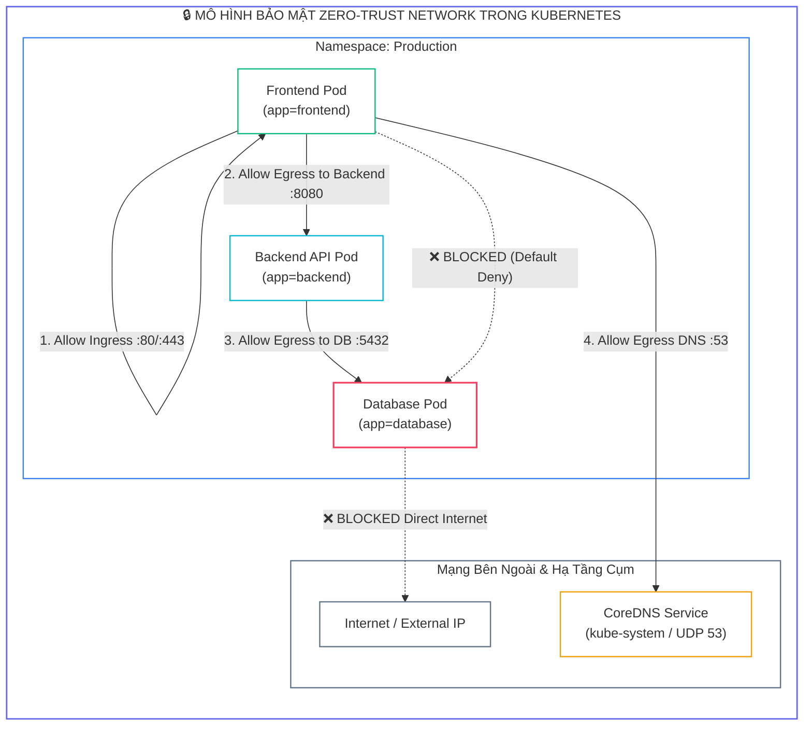
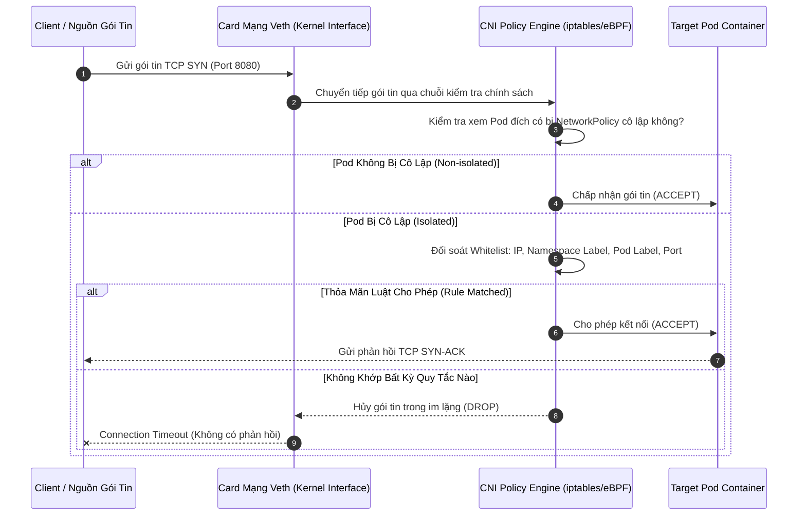
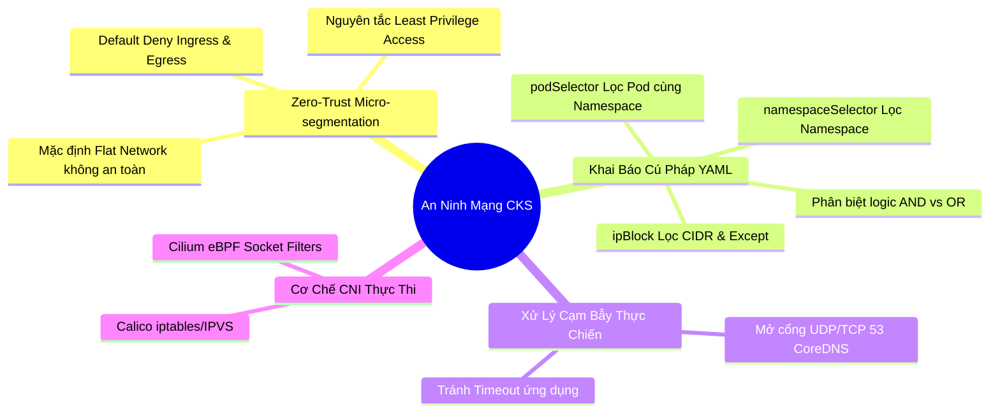


> [!IMPORTANT]
> **Mục tiêu kỹ thuật bài học**:
> - Thấu hiểu mô hình an ninh mạng **Zero-Trust Micro-segmentation** và kiến trúc mạng phẳng (Flat Network) trong Kubernetes.
> - Thiết lập chính sách **Default Deny All** cho cả chiều **Ingress** (luồng vào) và **Egress** (luồng ra).
> - Nắm vững 3 tiêu chí chọn lọc: `podSelector`, `namespaceSelector`, và `ipBlock` (với danh sách ngoại trừ `except`).
> - Phân biệt chính xác cú pháp YAML thực thi logic **AND** và logic **OR** trong các quy tắc mạng.
> - Cấu hình mở cổng **DNS Resolution (Port 53 UDP/TCP)** khi kích hoạt Egress NetworkPolicy.
> - Hiểu rõ vai trò của **CNI Plugin (Calico iptables / Cilium eBPF)** trong việc biên dịch và thực thi chính sách an ninh mạng.

---

## 1. Bản Chất Kiến Trúc & Tư Duy Cốt Lõi: An Ninh Mạng Vi Mô (Micro-Segmentation) & Zero-Trust

Theo thiết kế mặc định của Kubernetes, mô hình mạng là một **mạng phẳng không giới hạn (Flat Network)**: Mọi Pod trong bất kỳ Namespace nào đều có thể tự do gửi và nhận gói tin tới bất kỳ Pod nào khác trong cụm mà không cần NAT. Thiết kế này tối ưu cho sự tiện lợi trong phát triển, nhưng tạo ra **lỗ hổng thảm họa về bảo mật**. Nếu kẻ tấn công chiếm quyền điều khiển một Pod Frontend bị nhiễm mã độc, chúng có thể tự do quét mạng nội bộ (*Lateral Movement*) và tấn công trực tiếp vào cơ sở dữ liệu Database hoặc dịch vụ nội bộ nhạy cảm.

Để bảo vệ cụm theo chuẩn an ninh **CKS (Certified Kubernetes Security Specialist)**, ta phải áp dụng mô hình **Zero-Trust Network**: Không tin tưởng bất kỳ luồng mạng nào, khóa toàn bộ giao tiếp mặc định (**Default Deny All**), và chỉ mở những cổng kết nối tối thiểu cần thiết (**Least Privilege Network Access**).



### 1.1. Bản Chất Thực Thi Của CNI Plugin

Tài nguyên `NetworkPolicy` là một đặc tả API của Kubernetes, nhưng bản thân Kubernetes Control Plane (`kube-apiserver`, `kubelet`) **không trực tiếp lọc gói tin**. Việc lọc gói tin hoàn toàn do **CNI Plugin (Container Network Interface)** phụ trách:

- **Calico:** Lắng nghe API Server qua DaemonSet `calico-node`, tự động sinh các chuỗi `iptables` hoặc bảng `IPVS / eBPF` trên từng Node Linux để drop gói tin tại tầng Kernel.
- **Cilium:** Biên dịch trực tiếp các quy tắc NetworkPolicy thành mã bytecode **eBPF (Extended Berkeley Packet Filter)** gán vào socket mạng, cho phép lọc gói tin tốc độ cực cao ở tầng kernel mà không bị nghẽn hiệu năng như iptables khi số lượng quy tắc lớn.
- **Flannel (Mặc định):** ⚠️ **KHÔNG** hỗ trợ NetworkPolicy! Nếu cụm chỉ dùng Flannel thuần túy, mọi tài nguyên NetworkPolicy được tạo ra sẽ bị bỏ qua và không có tác dụng bảo vệ.

---

## 2. Bảng Ma Trận So Sánh Kỹ Thuật Toàn Diện (Engineering Matrix)

| Tiêu Chí So Sánh | Mặc Định (Flat Network) | Default Deny Ingress/Egress | Calico (iptables mode) | Cilium (eBPF mode) |
| :--- | :--- | :--- | :--- | :--- |
| **Mức độ bảo vệ** | <span class="badge badge--rose">Không an toàn (0%)</span> | <span class="badge badge--emerald">Rất cao (Zero-Trust)</span> | <span class="badge badge--emerald">Chuẩn doanh nghiệp</span> | <span class="badge badge--emerald">Tối tân (L3/L4/L7)</span> |
| **Cơ chế thực thi** | Không lọc gói tin | Chặn toàn bộ luồng chưa cấp phép | Linux Netfilter / iptables | Kernel eBPF Socket Filters |
| **Hiệu năng khi mở rộng** | Cao (không tốn CPU) | Cao (chặn sớm tại interface) | Suy giảm O(N) khi iptables lớn | Siêu nhanh O(1) hash map |
| **Hỗ trợ phân tích L7** | Không | Không (L3/L4 chuẩn K8s) | Cần Calico Enterprise | Tích hợp sẵn Envoy L7 filter |
| **Độ phức tạp vận hành** | Rất thấp | Cần cấu hình chính xác cổng | Trung bình | Yêu cầu Kernel Linux 5.4+ |
| **Điểm thi CKS** | Cấm dùng trong bài thi | Bắt buộc cho mọi bài Lab | CNI mặc định trong kỳ thi CKS | Kiến thức mở rộng nâng cao |

---

## 3. Kiến Trúc Môi Trường & Luồng Thực Thi Mẫu

Khi một gói tin từ Client gửi tới Pod, CNI Engine sẽ đối soát gói tin theo luồng kiểm tra tuần tự được mô hình hóa qua Sequence Diagram sau:



### 3.1. Phân Biệt Tuyệt Đối Cú Pháp YAML: Logic AND vs Logic OR

Đây là cạm bẫy gây mất điểm nhiều nhất trong kỳ thi CKS:

```yaml
# ==============================================================================
# VÍ DỤ 1: LOGIC AND (CÙNG 1 PHẦN TỬ DANH SÁCH - KHÔNG CÓ DẤU '-' Ở DÒNG THỨ 2)
# Điều kiện: Phải ĐỒNG THỜI thuộc Namespace có nhãn role=frontend VÀ Pod có nhãn app=web
# ==============================================================================
ingress:
- from:
  - namespaceSelector:
      matchLabels:
        role: frontend
    podSelector:
      matchLabels:
        app: web

# ==============================================================================
# VÍ DỤ 2: LOGIC OR (2 PHẦN TỬ DANH SÁCH RIÊNG BIỆT - MỖI DÒNG ĐỀU CÓ DẤU '-')
# Điều kiện: Cho phép TẤT CẢ Pod thuộc Namespace role=frontend HOẶC bất kỳ Pod nào có app=web
# ==============================================================================
ingress:
- from:
  - namespaceSelector:
      matchLabels:
        role: frontend
  - podSelector:
      matchLabels:
        app: web
```

---

## 4. Phân Tích Cạm Bẫy Thực Chiến: Khóa Quên Cổng DNS Khi Bật Default Deny Egress

### Tình Huống Sự Cố Thực Tế:
<span class="badge badge--rose">🕒 02:40 AM</span> Kỹ sư bảo mật áp dụng chính sách `default-deny-egress` trên Namespace `production` để ngăn chặn rò rỉ dữ liệu. Ngay lập tức, toàn bộ ứng dụng Microservices bị mất kết nối tới Database với lỗi `UnknownHostException: database.production.svc.cluster.local: Name or service not known`. Toàn bộ giao dịch của khách hàng bị từ chối 100%.

### Hậu Quả & Log Lỗi Thực Tế:
```text
================================================================================
INCIDENT LOG: MICROSERVICE DNS RESOLUTION TIMEOUT (PORT 53 EGRESS DROPPED)
================================================================================
[ERROR] 2026-09-12T02:40:15.104Z [pool-2-thread-1] c.e.service.DatabaseConnector:
java.net.UnknownHostException: postgres-service.production.svc.cluster.local: Name or service not known
    at java.base/java.net.InetAddress$CachedLookup.get(InetAddress.java:950)
    at java.base/java.net.InetAddress.getAllByName0(InetAddress.java:1654)
    at com.zaxxer.hikari.util.DriverDataSource.<init>(DriverDataSource.java:114)
    at com.zaxxer.hikari.pool.PoolBase.initializeDataSource(PoolBase.java:331)

[FATAL] Calico CNI Kernel Filter Trace:
PACKET DROP: src=10.244.1.45 dst=10.96.0.10 proto=UDP spt=51423 dpt=53 rule=default-deny-egress.drop
================================================================================
```

### 5-Whys Root Cause Analysis:
1. <span class="badge badge--primary">Why 1</span> **Tại sao ứng dụng không thể kết nối tới cơ sở dữ liệu?** $\rightarrow$ Vì ứng dụng không thể phân giải tên miền DNS `postgres-service.production.svc.cluster.local` sang địa chỉ IP.
2. <span class="badge badge--primary">Why 2</span> **Tại sao truy vấn DNS không thành công?** $\rightarrow$ Vì gói tin UDP gửi tới máy chủ CoreDNS tại IP `10.96.0.10` cổng 53 bị CNI chặn lại.
3. <span class="badge badge--primary">Why 3</span> **Tại sao gói tin DNS bị CNI chặn?** $\rightarrow$ Vì chính sách `Default Deny Egress` đã khóa toàn bộ các luồng mạng đi ra của Pod.
4. <span class="badge badge--primary">Why 4</span> **Tại sao kỹ sư không mở cổng DNS khi bật chính sách?** $\rightarrow$ Do ngộ nhận rằng việc truy vấn CoreDNS nội bộ trong cụm là cơ chế hệ thống mặc định được miễn trừ khỏi NetworkPolicy.
5. <span class="badge badge--emerald">Root Cause Remedy</span> **Biện pháp khắc phục chuẩn CKS:**
   - <span class="badge badge--emerald">Bắt Buộc Khai Báo DNS Egress Rule</span> Mọi NetworkPolicy có `policyTypes: ["Egress"]` đều phải chứa một khối rule cho phép gửi traffic tới cổng `UDP 53` và `TCP 53` của CoreDNS.
   - <span class="badge badge--cyan">Mẫu Cấu Hình DNS Tiêu Chuẩn:</span>
     ```yaml
     egress:
     - to:
       - namespaceSelector: {}
         podSelector:
           matchLabels:
             k8s-app: kube-dns
       ports:
       - protocol: UDP
         port: 53
       - protocol: TCP
         port: 53
     ```

---

## 5. Hands-on Lab: Triển Khai Zero-Trust NetworkPolicy Cho Ứng Dụng 3-Tier (8 Bước)

| Bước | Mục Tiêu Kỹ Thuật | Đầu Ra Kiểm Tra |
| :---: | :--- | :--- |
| **1** | Tạo Namespace thử nghiệm `secure-app` | Namespace sẵn sàng để triển khai |
| **2** | Triển khai 3 tầng Pod: Frontend, Backend API, Database | 3 Pods running với nhãn `app=frontend`, `app=backend`, `app=db` |
| **3** | Kiểm tra kết nối mở ban đầu (Flat Network Verification) | Frontend ping/curl được cả Backend và Database |
| **4** | Kích hoạt chính sách Default Deny All (Ingress & Egress) | Toàn bộ kết nối bị khóa 100% |
| **5** | Mở chính sách Egress DNS (UDP/TCP 53) | Pod có thể phân giải tên miền trở lại |
| **6** | Cấu hình cho phép Frontend gọi Backend trên cổng 8080 | Frontend kết nối thành công Backend; Database vẫn bị cô lập |
| **7** | Cấu hình cho phép Backend gọi Database trên cổng 5432 | Backend kết nối thành công Database; Frontend không thể truy cập DB |
| **8** | Kiểm định toàn diện ma trận an ninh mạng | Hoàn tất xác thực kiến trúc Zero-Trust |

### Bước 1: Tạo Namespace Thử Nghiệm

```bash
kubectl create namespace secure-app
kubectl label namespace secure-app env=production
```

### Bước 2: Triển Khai Các Pod Đại Diện Cho Kiến Trúc 3-Tier

```bash
# Tạo Database Pod
kubectl run db --image=nginx:alpine --restart=Never -n secure-app -l app=db --port=5432

# Tạo Backend API Pod
kubectl run backend --image=nginx:alpine --restart=Never -n secure-app -l app=backend --port=8080

# Tạo Frontend Pod
kubectl run frontend --image=nginx:alpine --restart=Never -n secure-app -l app=frontend --port=80

# Kiểm tra trạng thái Running
kubectl get pods -n secure-app --show-labels
```

### Bước 3: Kiểm Tra Kết Nối Ban Đầu Khi Chưa Có NetworkPolicy

```bash
# Lấy IP của DB Pod
DB_IP=$(kubectl get pod db -n secure-app -o jsonpath='{.status.podIP}')

# Kiểm tra từ Frontend tới DB (Thành công - Rủi ro bảo mật!)
kubectl exec -n secure-app frontend -- wget -qO- --timeout=2 http://$DB_IP:5432
```

### Bước 4: Áp Dụng Chính Sách Default Deny All

```bash
cat <<EOF | kubectl apply -f -
apiVersion: networking.k8s.io/v1
kind: NetworkPolicy
metadata:
  name: default-deny-all
  namespace: secure-app
spec:
  podSelector: {}
  policyTypes:
  - Ingress
  - Egress
EOF
```

> **Kiểm tra checkpoint:** Chạy lại lệnh `kubectl exec -n secure-app frontend -- wget -qO- --timeout=2 http://$DB_IP:5432` $\rightarrow$ Kết quả: **Connection timed out** (Đã chặn thành công).

### Bước 5: Cấu Hình Mở Cổng DNS Resolution Cho Toàn Namespace

```bash
cat <<EOF | kubectl apply -f -
apiVersion: networking.k8s.io/v1
kind: NetworkPolicy
metadata:
  name: allow-dns-egress
  namespace: secure-app
spec:
  podSelector: {}
  policyTypes:
  - Egress
  - Ingress
  egress:
  - to:
    - namespaceSelector: {}
    ports:
    - protocol: UDP
      port: 53
    - protocol: TCP
      port: 53
EOF
```

### Bước 6: Cấu Hình Cho Phép Frontend Gọi Backend (Port 8080)

```bash
cat <<EOF | kubectl apply -f -
apiVersion: networking.k8s.io/v1
kind: NetworkPolicy
metadata:
  name: allow-frontend-to-backend
  namespace: secure-app
spec:
  podSelector:
    matchLabels:
      app: backend
  policyTypes:
  - Ingress
  ingress:
  - from:
    - podSelector:
        matchLabels:
          app: frontend
    ports:
    - protocol: TCP
      port: 8080
---
apiVersion: networking.k8s.io/v1
kind: NetworkPolicy
metadata:
  name: allow-frontend-egress-to-backend
  namespace: secure-app
spec:
  podSelector:
    matchLabels:
      app: frontend
  policyTypes:
  - Egress
  egress:
  - to:
    - podSelector:
        matchLabels:
          app: backend
    ports:
    - protocol: TCP
      port: 8080
EOF
```

### Bước 7: Cấu Hình Cho Phép Backend Gọi Database (Port 5432)

```bash
cat <<EOF | kubectl apply -f -
apiVersion: networking.k8s.io/v1
kind: NetworkPolicy
metadata:
  name: allow-backend-to-db
  namespace: secure-app
spec:
  podSelector:
    matchLabels:
      app: db
  policyTypes:
  - Ingress
  ingress:
  - from:
    - podSelector:
        matchLabels:
          app: backend
    ports:
    - protocol: TCP
      port: 5432
---
apiVersion: networking.k8s.io/v1
kind: NetworkPolicy
metadata:
  name: allow-backend-egress-to-db
  namespace: secure-app
spec:
  podSelector:
    matchLabels:
      app: backend
  policyTypes:
  - Egress
  egress:
  - to:
    - podSelector:
        matchLabels:
          app: db
    ports:
    - protocol: TCP
      port: 5432
EOF
```

### Bước 8: Kiểm Thử Toàn Diện Ma Trận Kết Nối

```bash
BE_IP=$(kubectl get pod backend -n secure-app -o jsonpath='{.status.podIP}')
DB_IP=$(kubectl get pod db -n secure-app -o jsonpath='{.status.podIP}')

# 1. Frontend -> Backend :8080 -> PHẢI THÀNH CÔNG
kubectl exec -n secure-app frontend -- wget -qO- --timeout=2 http://$BE_IP:8080

# 2. Frontend -> Database :5432 -> PHẢI BỊ TIMEOUT (CHẶN)
kubectl exec -n secure-app frontend -- wget -qO- --timeout=2 http://$DB_IP:5432

# 3. Backend -> Database :5432 -> PHẢI THÀNH CÔNG
kubectl exec -n secure-app backend -- wget -qO- --timeout=2 http://$DB_IP:5432

echo ">> [VERIFIED] Chuc mung ban da thiet lap thanh cong he thong an ninh mang Zero-Trust!"
```

---

## 6. 10 Câu Hỏi Tự Kiểm Tra Chuyên Sâu (Self-Check Q&A Accordion)

<details class="qa-card">
<summary class="qa-summary">
  <div class="qa-summary-left">
    <span class="qa-num-badge">Q01</span>
    <span>Nếu một Pod được chọn bởi 2 NetworkPolicy khác nhau: một policy cho phép Ingress cổng 80, policy kia cho phép Ingress cổng 443, kết quả cuối cùng là gì?</span>
  </div>
  <span class="qa-chevron">
    <svg width="18" height="18" fill="none" stroke="currentColor" stroke-width="2.5" viewBox="0 0 24 24"><polyline points="6 9 12 15 18 9"></polyline></svg>
  </span>
</summary>
<div class="qa-answer">
  <div class="qa-answer-header">
    <svg width="14" height="14" fill="none" stroke="currentColor" stroke-width="2" viewBox="0 0 24 24"><path d="M22 11.08V12a10 10 0 1 1-5.93-9.14"></path><polyline points="22 4 12 14.01 9 11.01"></polyline></svg>
    <span>Phân Tích &amp; Lời Giải Kỹ Thuật</span>
  </div>
  <div style="margin-bottom: 8px;">NetworkPolicy trong Kubernetes hoạt động theo cơ chế <b style="color: var(--accent-emerald);">hợp quy tắc (Additive / Whitelist Union)</b>. Do đó, Pod sẽ được phép nhận lưu lượng mạng ở cả 2 cổng 80 và 443. Các chính sách không bao giờ xung đột hay ghi đè lẫn nhau theo kiểu triệt tiêu.</div>
</div>
</details>

<details class="qa-card">
<summary class="qa-summary">
  <div class="qa-summary-left">
    <span class="qa-num-badge">Q02</span>
    <span>Tại sao NetworkPolicy khai báo `podSelector: {}` nhưng không có trường `ingress` lại mang ý nghĩa Default Deny Ingress?</span>
  </div>
  <span class="qa-chevron">
    <svg width="18" height="18" fill="none" stroke="currentColor" stroke-width="2.5" viewBox="0 0 24 24"><polyline points="6 9 12 15 18 9"></polyline></svg>
  </span>
</summary>
<div class="qa-answer">
  <div class="qa-answer-header">
    <svg width="14" height="14" fill="none" stroke="currentColor" stroke-width="2" viewBox="0 0 24 24"><path d="M22 11.08V12a10 10 0 1 1-5.93-9.14"></path><polyline points="22 4 12 14.01 9 11.01"></polyline></svg>
    <span>Phân Tích &amp; Lời Giải Kỹ Thuật</span>
  </div>
  <div style="margin-bottom: 8px;">Trường <code>podSelector: {}</code> chọn tất cả các Pod trong Namespace. Khi thêm <code>policyTypes: ["Ingress"]</code>, tất cả Pods được đưa vào trạng thái <b style="color: var(--accent-rose);">cô lập (Isolated)</b>. Do danh sách <code>ingress: []</code> để trống (danh sách rỗng), không có bất kỳ nguồn kết nối nào được whitelist, dẫn đến toàn bộ traffic đầu vào bị chặn.</div>
</div>
</details>

<details class="qa-card">
<summary class="qa-summary">
  <div class="qa-summary-left">
    <span class="qa-num-badge">Q03</span>
    <span>Khối `ipBlock` với `except` có thể dùng để lọc lưu lượng giữa các Pod trong cụm Kubernetes được không?</span>
  </div>
  <span class="qa-chevron">
    <svg width="18" height="18" fill="none" stroke="currentColor" stroke-width="2.5" viewBox="0 0 24 24"><polyline points="6 9 12 15 18 9"></polyline></svg>
  </span>
</summary>
<div class="qa-answer">
  <div class="qa-answer-header">
    <svg width="14" height="14" fill="none" stroke="currentColor" stroke-width="2" viewBox="0 0 24 24"><path d="M22 11.08V12a10 10 0 1 1-5.93-9.14"></path><polyline points="22 4 12 14.01 9 11.01"></polyline></svg>
    <span>Phân Tích &amp; Lời Giải Kỹ Thuật</span>
  </div>
  <div style="margin-bottom: 8px;"><b style="color: var(--accent-amber);">Không khuyến khích và không an toàn.</b> Trường <code>ipBlock</code> được thiết kế để kiểm soát lưu lượng đi ra/vào mạng ngoài cụm (Internet / External CIDR). Địa chỉ IP của Pod có tính chất tạm thời (Ephemeral) và được cấp phát động. Để lọc lưu lượng giữa các Pod trong cụm, bắt buộc phải sử dụng <code>podSelector</code> và <code>namespaceSelector</code>.</div>
</div>
</details>

<details class="qa-card">
<summary class="qa-summary">
  <div class="qa-summary-left">
    <span class="qa-num-badge">Q04</span>
    <span>Điều gì xảy ra nếu cụm Kubernetes sử dụng CNI Plugin Flannel thuần túy khi ta áp dụng NetworkPolicy?</span>
  </div>
  <span class="qa-chevron">
    <svg width="18" height="18" fill="none" stroke="currentColor" stroke-width="2.5" viewBox="0 0 24 24"><polyline points="6 9 12 15 18 9"></polyline></svg>
  </span>
</summary>
<div class="qa-answer">
  <div class="qa-answer-header">
    <svg width="14" height="14" fill="none" stroke="currentColor" stroke-width="2" viewBox="0 0 24 24"><path d="M22 11.08V12a10 10 0 1 1-5.93-9.14"></path><polyline points="22 4 12 14.01 9 11.01"></polyline></svg>
    <span>Phân Tích &amp; Lời Giải Kỹ Thuật</span>
  </div>
  <div style="margin-bottom: 8px;">Tài nguyên NetworkPolicy vẫn được Kubernetes API Server lưu trữ trong etcd mà không báo lỗi, nhưng <b style="color: var(--accent-rose);">hoàn toàn không có hiệu lực thực thi trên Node</b>. Mọi lưu lượng giữa các Pod vẫn thông suốt như mạng phẳng, tạo ra lỗ hổng bảo mật vô cùng nguy hiểm do ảo tưởng an toàn.</div>
</div>
</details>

<details class="qa-card">
<summary class="qa-summary">
  <div class="qa-summary-left">
    <span class="qa-num-badge">Q05</span>
    <span>Làm thế nào để cho phép Ingress từ tất cả các Pod thuộc mọi Namespace khác, nhưng chỉ chặn kết nối từ bên ngoài Internet?</span>
  </div>
  <span class="qa-chevron">
    <svg width="18" height="18" fill="none" stroke="currentColor" stroke-width="2.5" viewBox="0 0 24 24"><polyline points="6 9 12 15 18 9"></polyline></svg>
  </span>
</summary>
<div class="qa-answer">
  <div class="qa-answer-header">
    <svg width="14" height="14" fill="none" stroke="currentColor" stroke-width="2" viewBox="0 0 24 24"><path d="M22 11.08V12a10 10 0 1 1-5.93-9.14"></path><polyline points="22 4 12 14.01 9 11.01"></polyline></svg>
    <span>Phân Tích &amp; Lời Giải Kỹ Thuật</span>
  </div>
  <div style="margin-bottom: 8px;">Cấu hình một quy tắc Ingress chỉ chứa <b style="color: var(--accent-primary);">namespaceSelector: {}</b> (khối rỗng). Cấu hình này chọn tất cả các Namespace trong cụm, cho phép mọi Pod nội bộ kết nối nhưng tự động chặn các luồng IP bên ngoài không xuất phát từ Pod trong cụm.</div>
</div>
</details>

<details class="qa-card">
<summary class="qa-summary">
  <div class="qa-summary-left">
    <span class="qa-num-badge">Q06</span>
    <span>Tại sao khi cấu hình Egress tới CoreDNS, cần mở cả 2 giao thức UDP và TCP trên cổng 53?</span>
  </div>
  <span class="qa-chevron">
    <svg width="18" height="18" fill="none" stroke="currentColor" stroke-width="2.5" viewBox="0 0 24 24"><polyline points="6 9 12 15 18 9"></polyline></svg>
  </span>
</summary>
<div class="qa-answer">
  <div class="qa-answer-header">
    <svg width="14" height="14" fill="none" stroke="currentColor" stroke-width="2" viewBox="0 0 24 24"><path d="M22 11.08V12a10 10 0 1 1-5.93-9.14"></path><polyline points="22 4 12 14.01 9 11.01"></polyline></svg>
    <span>Phân Tích &amp; Lời Giải Kỹ Thuật</span>
  </div>
  <div style="margin-bottom: 8px;">Phần lớn các truy vấn DNS tiêu chuẩn sử dụng UDP 53. Tuy nhiên, khi gói tin phản hồi DNS vượt quá kích thước 512 bytes (hoặc có DNSSEC), DNS client sẽ tự động <b style="color: var(--accent-amber);">chuyển đổi dự phòng sang TCP 53 (DNS Truncation Fallback)</b>. Nếu chỉ mở UDP, các truy vấn lớn sẽ bị timeout ngắt quãng.</div>
</div>
</details>

<details class="qa-card">
<summary class="qa-summary">
  <div class="qa-summary-left">
    <span class="qa-num-badge">Q07</span>
    <span>Lệnh kubectl nào giúp kiểm tra nhanh danh sách các quy tắc Ingress và Egress đang được áp dụng cho một NetworkPolicy?</span>
  </div>
  <span class="qa-chevron">
    <svg width="18" height="18" fill="none" stroke="currentColor" stroke-width="2.5" viewBox="0 0 24 24"><polyline points="6 9 12 15 18 9"></polyline></svg>
  </span>
</summary>
<div class="qa-answer">
  <div class="qa-answer-header">
    <svg width="14" height="14" fill="none" stroke="currentColor" stroke-width="2" viewBox="0 0 24 24"><path d="M22 11.08V12a10 10 0 1 1-5.93-9.14"></path><polyline points="22 4 12 14.01 9 11.01"></polyline></svg>
    <span>Phân Tích &amp; Lời Giải Kỹ Thuật</span>
  </div>
  <div style="margin-bottom: 8px;">Sử dụng lệnh: <b style="color: var(--accent-primary);">kubectl describe netpol &lt;policy-name&gt; -n &lt;namespace&gt;</b>. Đầu ra sẽ phân tích rõ ràng cấu trúc: PodSelector, AllowIngress (From Pods/Namespaces/Ports), và AllowEgress.</div>
</div>
</details>

<details class="qa-card">
<summary class="qa-summary">
  <div class="qa-summary-left">
    <span class="qa-num-badge">Q08</span>
    <span>Nhãn `kubernetes.io/metadata.name` trên Namespace có ý nghĩa đặc biệt gì trong NetworkPolicy từ bản K8s 1.22 trở lên?</span>
  </div>
  <span class="qa-chevron">
    <svg width="18" height="18" fill="none" stroke="currentColor" stroke-width="2.5" viewBox="0 0 24 24"><polyline points="6 9 12 15 18 9"></polyline></svg>
  </span>
</summary>
<div class="qa-answer">
  <div class="qa-answer-header">
    <svg width="14" height="14" fill="none" stroke="currentColor" stroke-width="2" viewBox="0 0 24 24"><path d="M22 11.08V12a10 10 0 1 1-5.93-9.14"></path><polyline points="22 4 12 14.01 9 11.01"></polyline></svg>
    <span>Phân Tích &amp; Lời Giải Kỹ Thuật</span>
  </div>
  <div style="margin-bottom: 8px;">Kubernetes tự động gắn nhãn bất biến <b style="color: var(--accent-emerald);">kubernetes.io/metadata.name: &lt;namespace-name&gt;</b> cho mọi Namespace. Nhờ đó, bạn có thể chọn đích danh một Namespace trong <code>namespaceSelector.matchLabels</code> mà không cần phải gán nhãn thủ công cho Namespace đó trước.</div>
</div>
</details>

<details class="qa-card">
<summary class="qa-summary">
  <div class="qa-summary-left">
    <span class="qa-num-badge">Q09</span>
    <span>Sự khác biệt giữa việc để trống trường `spec.podSelector: {}` và không khai báo trường `spec.podSelector` là gì?</span>
  </div>
  <span class="qa-chevron">
    <svg width="18" height="18" fill="none" stroke="currentColor" stroke-width="2.5" viewBox="0 0 24 24"><polyline points="6 9 12 15 18 9"></polyline></svg>
  </span>
</summary>
<div class="qa-answer">
  <div class="qa-answer-header">
    <svg width="14" height="14" fill="none" stroke="currentColor" stroke-width="2" viewBox="0 0 24 24"><path d="M22 11.08V12a10 10 0 1 1-5.93-9.14"></path><polyline points="22 4 12 14.01 9 11.01"></polyline></svg>
    <span>Phân Tích &amp; Lời Giải Kỹ Thuật</span>
  </div>
  <div style="margin-bottom: 8px;">Trong đặc tả Kubernetes API, trường <code>spec.podSelector</code> là <b style="color: var(--accent-rose);">bắt buộc (Required)</b>. Khai báo <code>spec.podSelector: {}</code> hợp lệ và mang ý nghĩa chọn tất cả các Pod trong Namespace. Nếu bỏ qua trường này, API Server sẽ từ chối manifest với lỗi validation schema.</div>
</div>
</details>

<details class="qa-card">
<summary class="qa-summary">
  <div class="qa-summary-left">
    <span class="qa-num-badge">Q10</span>
    <span>Làm thế nào để cấu hình NetworkPolicy chỉ cho phép traffic từ Ingress Controller Pod nằm trong Namespace `ingress-nginx`?</span>
  </div>
  <span class="qa-chevron">
    <svg width="18" height="18" fill="none" stroke="currentColor" stroke-width="2.5" viewBox="0 0 24 24"><polyline points="6 9 12 15 18 9"></polyline></svg>
  </span>
</summary>
<div class="qa-answer">
  <div class="qa-answer-header">
    <svg width="14" height="14" fill="none" stroke="currentColor" stroke-width="2" viewBox="0 0 24 24"><path d="M22 11.08V12a10 10 0 1 1-5.93-9.14"></path><polyline points="22 4 12 14.01 9 11.01"></polyline></svg>
    <span>Phân Tích &amp; Lời Giải Kỹ Thuật</span>
  </div>
  <div style="margin-bottom: 8px;">Sử dụng kết hợp <b style="color: var(--accent-primary);">logic AND</b> trong một phần tử <code>from</code> duy nhất:
  <div style="margin-top: 6px; padding: 8px; background: rgba(0,0,0,0.2); border-radius: 4px; font-family: monospace; font-size: 0.9em;">
  ingress:<br/>
  - from:<br/>
  &nbsp;&nbsp;- namespaceSelector:<br/>
  &nbsp;&nbsp;&nbsp;&nbsp;&nbsp;&nbsp;matchLabels:<br/>
  &nbsp;&nbsp;&nbsp;&nbsp;&nbsp;&nbsp;&nbsp;&nbsp;kubernetes.io/metadata.name: ingress-nginx<br/>
  &nbsp;&nbsp;&nbsp;&nbsp;podSelector:<br/>
  &nbsp;&nbsp;&nbsp;&nbsp;&nbsp;&nbsp;matchLabels:<br/>
  &nbsp;&nbsp;&nbsp;&nbsp;&nbsp;&nbsp;&nbsp;&nbsp;app.kubernetes.io/name: ingress-nginx
  </div>
  </div>
</div>
</details>

---

## 7. Tổng Kết & Lộ Trình Bài Học Tiếp Theo



Nắm vững **NetworkPolicy** là chìa khóa then chốt để đạt điểm tối đa trong các bài thi CKS liên quan đến an ninh mạng và cô lập tiến trình.

> [!TIP]
> **BÀI HỌC TIẾP THEO:**
> Trong **[[Bài 02] Bảo Mật Ingress Controller & Quản Lý Chứng Chỉ TLS: Giai Đoạn 3](cks-02-02-securing-ingress-giai-doan-3.html)**, chúng ta sẽ tìm hiểu cách bảo vệ cửa ngõ đón nhận lưu lượng bên ngoài vào cụm: Thiết lập TLS Termination, kiểm soát Cipher Suites, tích hợp ModSecurity WAF và cấu hình mTLS tại Ingress Gateway.

