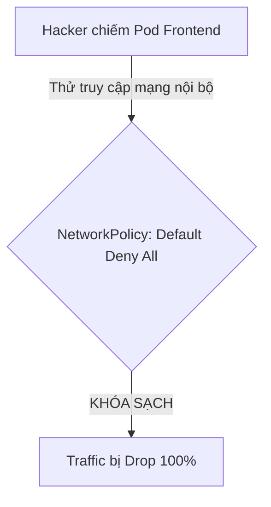
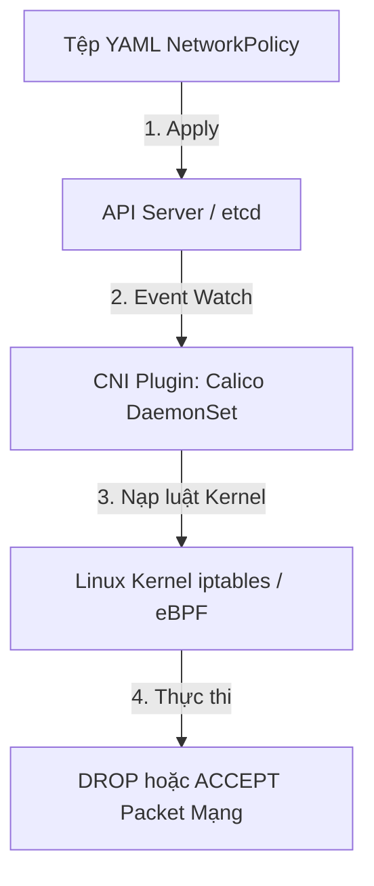
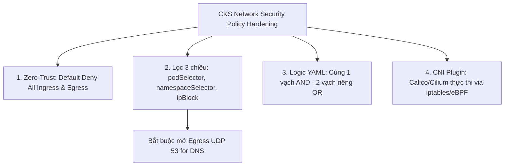
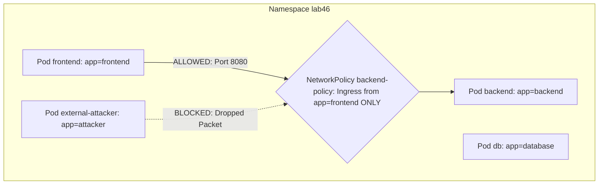


# [BÀI 01] KIẾN TRÚC AN NINH MẠNG CKS: LÀM CHỦ NETWORKPOLICY INGRESS/EGRESS & CNI PLUGIN HARDENING

Trong kỷ nguyên điện toán đám mây và kiến trúc microservices phân tán quy mô lớn, **Kubernetes (CKS)** đóng vai trò là nền tảng điều phối container (Container Orchestration) tiêu chuẩn công nghiệp. Để làm chủ hệ thống trong môi trường sản xuất (Production) cũng như chinh phục kỳ thi chứng chỉ quốc tế của Linux Foundation / CNCF, kỹ sư không chỉ nắm vững các câu lệnh thao tác cơ bản mà phải thấu hiểu sâu sắc bản chất cơ chế tầng thấp: từ chu trình điều hòa (Reconciliation Loop), cấu trúc điều phối tài nguyên, kiến trúc mạng CNI, lưu trữ CSI cho đến các chuẩn mực an ninh phòng thủ chiều sâu.

Bài viết chuyên sâu này sẽ đồng hành cùng bạn giải mã toàn diện bức tranh kiến trúc, phân tích các đánh đổi kỹ thuật thực chiến (Engineering Trade-offs), cung cấp bài thực hành Lab từng bước và bộ câu hỏi phỏng vấn chuẩn Architect / Lead Engineer.

---

## 1. Bản Chất Kiến Trúc & Cơ Chế Vận Hành Tầng Thấp

| # | Câu hỏi ôn tập | Đáp án chuẩn ngắn gọn |
|---|---|---|
| 1 | Số lượng câu hỏi và thời gian làm bài thi CKAD chính thức? | **16–18 câu hỏi** và **120 phút** |
| 2 | Miền chiếm phần trăm trọng số cao nhất trong bài thi CKAD? | Miền **Environment, Config & Security (25 %)** |
| 3 | Ngưỡng điểm đỗ chính thức CKAD vs ngưỡng an toàn thi thử? | **66 %** đỗ thi thật vs **75 %** ngưỡng an toàn |
| 4 | Bộ 3 alias gõ tắt thần tốc khởi tạo ở đầu phòng thi? | **`alias k=kubectl`**, **`do="--dry-run=client -o yaml"`**, **`now="--force --grace-period=0"`** |
| 5 | Bộ 3 câu lệnh CLI gỡ rối thần tốc khi Pod bị crash? | **`kubectl describe pod`**, **`kubectl logs -p`**, **`kubectl get ep`** |


> **"Bảo vệ mạng vi mô cấp Pod bằng NetworkPolicy (Network Isolation & Micro-segmentation) là nội dung kiểm tra tối quan trọng thuộc chứng chỉ CKS, đòi hỏi chuyên gia bảo mật phải thực thi nguyên tắc Zero-Trust Network bằng cách mặc định chặn toàn bộ luồng mạng đầu vào và đầu ra qua chính sách Default Deny All (`policyTypes: ['Ingress', 'Egress']`); phân biệt rõ ràng và phối hợp linh hoạt giữa 3 tiêu chí lọc `podSelector` (lọc theo nhãn Pod), `namespaceSelector` (lọc theo nhãn Namespace), và `ipBlock` (lọc theo dải IP CIDR và ngoại trừ `except`); đồng thời làm chủ vai trò thực thi chính sách của CNI Plugin (như Calico hay Cilium) để bảo vệ cụm Kubernetes trước các nguy cơ tấn công leo hàng rào mạng nội bộ."**

**Kết quả từ các buổi trước được sử dụng lại:**

| Kết quả / Công cụ | Buổi + số hiệu `QT` | Dùng ở đâu trong buổi này |
|---|---|---|
| Nguyên tắc Label và Selector | Buổi 17 `QT 4.1` | Lọc Pods và Namespaces trong `podSelector` và `namespaceSelector` |
| Quản lý Namespace trong cụm | Buổi 18 `QT 4.1` | Gán nhãn cho Namespace để cấu hình `namespaceSelector` |
| Sử dụng công cụ kiểm tra mạng `nc` / `curl` | Buổi 38 `QT 4.1` | Kiểm tra kết nối mạng giữa các Pod |

---


| # | Kỹ năng thực hiện được | Hiện vật chứng minh |
|---|---|---|
| 1 | Biên soạn tệp NetworkPolicy Default Deny All khóa 100% Ingress/Egress | Tệp NetworkPolicy YAML chứa `policyTypes: ["Ingress", "Egress"]` |
| 2 | Cấu hình mở cổng Ingress cho Pod từ Pod khác hoặc Namespace khác | Tệp NetworkPolicy YAML chứa `from.podSelector` và `from.namespaceSelector` |
| 3 | Phân biệt chính xác cú pháp YAML thực thi phép toán AND vs phép toán OR | Bảng so sánh vị trí dấu gạch ngang `-` trong YAML selector |
| 4 | Cấu hình `ipBlock` kết hợp cờ `except` lọc dải IP CIDR chuẩn xác | Khối `to.ipBlock.cidr` và `to.ipBlock.except` trong Egress policy |
| 5 | Chẩn đoán sự cố luồng mạng bị chặn bởi NetworkPolicy qua `describe` | Nhật ký đối soát luật mạng qua lệnh `kubectl describe netpol` |

---


| Kiến thức tiên quyết | Nguồn tự học nếu thiếu |
|---|---|
| Gán nhãn Label cho Pod và Namespace | Buổi 17 (`QT 4.1`) |
| Mô hình địa chỉ IP và dải mạng CIDR | Buổi 03 (`QT 4.1`) |
| Kiến thức tốt nghiệp Giai đoạn 2 CKAD | Buổi 45 (`QT 7.1`) |

---


### 3.1. Thuật ngữ Việt–Anh

| # | Thuật ngữ tiếng Việt | Tiếng Anh tương đương | Ghi chú chuẩn hoá trong thân bài |
|---|---|---|---|
| 1 | Chính sách bảo mật mạng | NetworkPolicy | Đối tượng K8s quy định quy tắc cho phép/chặn luồng traffic Pod |
| 2 | Luồng truy cập vào | Ingress Traffic | Luồng mạng từ bên ngoài hoặc từ Pod khác đi VÀO Pod |
| 3 | Luồng truy cập ra | Egress Traffic | Luồng mạng từ Pod đi RA bên ngoài hoặc Pod khác |
| 4 | Mặc định chặn toàn bộ | Default Deny All | Chính sách khóa sạch 100% Ingress/Egress traffic của Namespace |
| 5 | Bộ lọc theo nhãn Pod | Pod Selector (`podSelector`) | Quy tắc lọc các Pod dựa trên nhãn `metadata.labels` |
| 6 | Bộ lọc theo nhãn Namespace | Namespace Selector (`namespaceSelector`) | Quy tắc lọc các Pod thuộc các Namespace có nhãn tương ứng |
| 7 | Bộ lọc theo dải IP | IP Block (`ipBlock`) | Quy tắc lọc luồng mạng theo dải IP CIDR và cờ `except` |
| 8 | Mô hình bảo mật Không tin cậy | Zero-Trust Network Architecture | Kiến trúc bảo mật mặc định không tin bất kỳ kết nối nào |
| 9 | Phép toán hợp và giao | AND vs OR Evaluation | Phân biệt kết hợp selector trong cùng 1 item (AND) hay 2 items (OR) |
| 10 | Giao diện mạng container | CNI Network Plugin | Plugin mạng (Calico, Cilium) thực thi NetworkPolicy qua iptables/eBPF |
| 11 | Nhãn phân vùng Namespace | Namespace Label | Nhãn được gán cho Namespace (`kubernetes.io/metadata.name`) |
| 12 | Cổng dịch vụ tên miền | DNS Port (UDP 53) | Cổng Egress tối quan trọng bắt buộc phải mở cho Pod tra cứu DNS |
| 13 | Phân đoạn mạng vi mô | Micro-segmentation | Kỹ thuật chia nhỏ ranh giới bảo mật cho từng nhóm microservice |
| 14 | Tường lửa cấp Pod | Pod-level Firewall | Khái niệm xem NetworkPolicy như một tường lửa cá nhân cho từng Pod |


Mô hình Tháp Văn phòng Bảo vệ 3 lớp và Thẻ Căn cước: `NetworkPolicy Default Deny All` giống như việc Tòa nhà văn phòng khóa tất cả các cửa ra vào và thang máy. `podSelector` giống như Kiểm tra thẻ phòng ban (chỉ nhân viên có thẻ "Kế toán" mới được vào phòng Kế toán). `namespaceSelector` giống như Kiểm tra thẻ chi nhánh (chỉ nhân viên chi nhánh "Hà Nội" mới được vào tòa nhà). `ipBlock` giống như Trạm kiểm soát cổng bảo vệ ngoài đường (chỉ cho phép các xe có biển số thuộc dải IP `192.168.1.0/24` đi qua cổng).

---

### 1.1. Nguyên tắc Zero-Trust và chính sách Default Deny All (Ingress/Egress) (12 phút)

**Nguyên lý cốt lõi:** Theo chuẩn bảo mật Zero-Trust của CKS, luôn áp đặt tệp NetworkPolicy `default-deny-all` (`policyTypes: ["Ingress", "Egress"]`) cho 100% các Namespace ngay khi khởi tạo để khóa sạch mọi luồng mạng chưa được phép.

**Giải thích cơ chế ngầm:** Mặc định trong Kubernetes, tất cả các Pod trong mọi Namespace đều có thể tự do kết nối với nhau không rào cản. Nếu kẻ tấn công chiếm được 1 Pod công cộng (như Frontend), chúng có thể quét mạng và tấn công leo thang sang các Pod cơ sở dữ liệu nội bộ. `Default Deny All` triệt tiêu nguy cơ này.

> [!WARNING]
> **CẠM BẪY THỰC CHIẾN:**
> Để Namespace rỗng không có NetworkPolicy làm các Pod kết nối tự do vi phạm tiêu chuẩn bảo mật CKS.

**Minh hoạ.**



**Nguyên lý cốt lõi:** Nếu một Pod không bị chi phối bởi bất kỳ NetworkPolicy nào, mặc định Kubernetes sẽ cho phép 100% traffic Ingress và Egress tự do ra vào Pod đó mà không gặp rào cản.

**Giải thích cơ chế ngầm:** Kubernetes thiết kế mô hình mạng phẳng ban đầu ưu tiên sự tiện lợi cho lập trình viên. Do đó, vai trò của chuyên gia bảo mật CKS là phải viết các luật NetworkPolicy để siết chặt rào chắn mạng.

> [!WARNING]
> **CẠM BẪY THỰC CHIẾN:**
> Tưởng rằng Pod tự động được bảo mật khi chưa áp dụng NetworkPolicy nào vào Namespace.

**Minh hoạ.**

```yaml
# Tệp NetworkPolicy Default Deny All chuẩn CKS:
apiVersion: networking.k8s.io/v1
kind: NetworkPolicy
metadata:
  name: default-deny-all
  namespace: prod
spec:
  podSelector: {} # Áp dụng cho TẤT CẢ các Pods trong Namespace
  policyTypes:
    - Ingress
    - Egress
```

---

### 1.2. Cấu hình chuyên sâu Lọc ba chiều (`podSelector`, `namespaceSelector`, `ipBlock`) (12 phút)

**Nguyên lý cốt lõi:** Khi khai báo `from` hoặc `to` trong NetworkPolicy, nếu `namespaceSelector` và `podSelector` nằm trong CÙNG MỘT phần tử mảng (cùng 1 dấu gạch ngang `-`), Kubernetes thực hiện phép toán AND (phải thỏa mãn cả 2); nếu nằm ở HAI phần tử mảng riêng biệt, Kubernetes thực hiện phép toán OR.

**Giải thích cơ chế ngầm:** Cú pháp mảng YAML quy định logic điều kiện. Đây là bẫy kinh điển nhất trong kỳ thi CKS dẫn đến việc mở nhầm cổng mạng quá rộng (OR) hoặc mở nhầm cổng quá hẹp (AND).

> [!WARNING]
> **CẠM BẪY THỰC CHIẾN:**
> Muốn cho phép Pod `app=client` thuộc Namespace `env=prod` truy cập (phép AND), nhưng lại đặt ở 2 dấu gạch ngang riêng biệt khiến Pod `app=client` từ BẤT KỲ Namespace nào cũng chui vào được (phép OR).

**Minh hoạ.**

```yaml
# PHÉP TOÁN AND (Chỉ 1 dấu gạch ngang -):
# Phải là Pod app=client VÀ thuộc Namespace team=dev
from:
  - namespaceSelector:
      matchLabels:
        team: dev
    podSelector:
      matchLabels:
        app: client

---
# PHÉP TOÁN OR (Hai dấu gạch ngang -):
# Tất cả Pods thuộc Namespace team=dev KHÔNG PHÂN BIỆT APP
# HOẶC tất cả Pods app=client KHÔNG PHÂN BIỆT NAMESPACE
from:
  - namespaceSelector:
      matchLabels:
        team: dev
  - podSelector:
      matchLabels:
        app: client
```

**Nguyên lý cốt lõi:** Khi cấu hình Egress NetworkPolicy cho Pod, BẮT BUỘC phải mở cổng UDP/TCP 53 tới Kube-DNS / CoreDNS, nếu không Pod sẽ bị lỗi không thể giải mã tên miền (DNS Lookup Error).

**Giải thích cơ chế ngầm:** Khi bật `Egress` policy, mặc định kết nối đi ra của Pod bị khóa sạch, bao gồm cả kết nối tới CoreDNS Server (`10.96.0.10:53`). Ứng dụng sẽ bị treo khi gọi tên miền Service.

> [!WARNING]
> **CẠM BẪY THỰC CHIẾN:**
> Bật Egress NetworkPolicy nhưng quên mở cổng 53 làm cho Pod bị lỗi `curl: (6) Could not resolve host`.

**Minh hoạ.**

```yaml
egress:
  # Mở cổng DNS Egress tối quan trọng:
  - to:
      - namespaceSelector:
          matchLabels:
            kubernetes.io/metadata.name: kube-system
    ports:
      - protocol: UDP
        port: 53
      - protocol: TCP
        port: 53
```

---

### 1.3. Vai trò thực thi của CNI Network Plugin (Calico, Cilium) và gỡ lỗi mạng (10 phút)

**Nguyên lý cốt lõi:** NetworkPolicy chỉ là bản khai báo chính sách dạng declarative; việc thực thi đóng/mở cổng mạng thực tế phụ thuộc 100% vào CNI Network Plugin của cụm (như Calico, Cilium dùng iptables/eBPF); nếu cụm dùng Flannel mặc định, NetworkPolicy sẽ KHÔNG CÓ TÁC DỤNG.

**Giải thích cơ chế ngầm:** API Server K8s chỉ lưu cấu hình NetworkPolicy vào etcd. Các daemonset CNI trên từng Node (như `calico-node`) sẽ đọc cấu hình này và nạp các luật `iptables` hoặc `eBPF` tương ứng vào Linux Kernel.

> [!WARNING]
> **CẠM BẪY THỰC CHIẾN:**
> Tạo NetworkPolicy trên cụm dùng Flannel thuần và thắc mắc tại sao traffic vẫn lọt qua không bị chặn.

**Minh hoạ.**



**Nguyên lý cốt lõi:** Cờ `ipBlock.except` trong NetworkPolicy được dùng để loại trừ các dải IP CIDR cụ thể (ví dụ cho phép ra internet `0.0.0.0/0` nhưng `except` chặn dải IP nội bộ `10.0.0.0/8`).

**Giải thích cơ chế ngầm:** Giúp ứng dụng kết nối được các dịch vụ bên ngoài internet (như thanh toán Stripe hay Google API) nhưng chặn không cho Pod gửi gói tin quét địa chỉ IP mạng nội bộ của công ty.

> [!WARNING]
> **CẠM BẪY THỰC CHIẾN:**
> Cho phép Egress `0.0.0.0/0` mà không loại trừ `except` dải IP nội bộ làm rò rỉ rào chắn mạng nội bộ.

**Minh hoạ.**

```yaml
egress:
  - to:
      - ipBlock:
          cidr: 0.0.0.0/0
          except:
            - 10.0.0.0/8 # Chặn dải IP nội bộ công ty
            - 172.16.0.0/12
```

**Nguyên lý cốt lõi:** Khi chẩn đoán sự cố Pod không kết nối được mạng, chạy lệnh `kubectl describe netpol -n <namespace>` để kiểm tra các luật Ingress/Egress và đối soát nhãn `podSelector` với Pod thực tế.

**Giải thích cơ chế ngầm:** Lệnh `describe netpol` hiển thị rõ ràng danh sách Pod bị chi phối (Specifying pods), luật Allow Ingress/Egress và danh sách ports.

> [!WARNING]
> **CẠM BẪY THỰC CHIẾN:**
> Loay hoay xóa Pod khởi động lại trong khi nguyên nhân thực sự là do NetworkPolicy `podSelector` gõ sai nhãn làm rỗng danh sách Pod tác động.

**Minh hoạ.**

```bash
# Kiểm tra đối soát NetworkPolicy:
kubectl describe netpol backend-policy -n prod
# Quan sát mục: Specifying pods: app=backend
```

---

### 1.4. Đưa vào cụm thật (4 phút)

**Nguyên lý cốt lõi:** Bản kê khai NetworkPolicy chuẩn CKS cho một Microservice Backend bắt buộc phải chứa: `podSelector` trỏ app backend, `policyTypes` đủ `Ingress` và `Egress`, Ingress chỉ nhận từ `podSelector: app=frontend`, Egress chỉ cho phép truy cập DB và DNS port 53.

**Giải thích cơ chế ngầm:** Đảm bảo nguyên tắc bảo mật vi mô (Micro-segmentation) cao nhất của chứng chỉ CKS, cô lập Pod tối đa ở cả 2 chiều vào và ra.

> [!WARNING]
> **CẠM BẪY THỰC CHIẾN:**
> Thiết lập NetworkPolicy chỉ có Ingress mà bỏ qua Egress làm Pod backend có thể bị khai thác gửi dữ liệu độc hại ra ngoài internet.

**Minh hoạ.**

```yaml
apiVersion: networking.k8s.io/v1
kind: NetworkPolicy
metadata:
  name: hardened-backend-policy
  namespace: prod
spec:
  podSelector:
    matchLabels:
      app: backend
  policyTypes:
    - Ingress
    - Egress
  ingress:
    - from:
        - podSelector:
            matchLabels:
              app: frontend
      ports:
        - protocol: TCP
          port: 8080
  egress:
    - to:
        - podSelector:
            matchLabels:
              app: database
      ports:
        - protocol: TCP
          port: 5432
    - to:
        - namespaceSelector:
            matchLabels:
              kubernetes.io/metadata.name: kube-system
      ports:
        - protocol: UDP
          port: 53
```

**Áp vào cụm đang chạy thì làm gì trước:**
1. Kiểm tra CNI Plugin cụm đang dùng qua `kubectl get pods -n kube-system` (đảm bảo có Calico hay Cilium).
2. Áp dụng tệp `default-deny-all` ở môi trường Staging trước để quan sát các ứng dụng có bị đứt kết nối không.
3. Mở dần từng cổng Ingress và Egress cần thiết dựa trên yêu cầu thực tế của từng microservice.

**Cái gì hỏng nếu áp thẳng lên prod:**
- Áp tệp `default-deny-all` trực tiếp lên Production mà chưa mở cổng DNS port 53 sẽ làm TOÀN BỘ các microservices trong Namespace ngưng hoạt động ngay lập tức.

**Đo trước — đo sau:**
- Dùng lệnh `nc -zv <pod-ip> <port>` thử kết nối trước và sau khi áp dụng NetworkPolicy.
- Thử nghiệm gửi gói tin từ Pod không thuộc danh sách cho phép để xác minh packet bị DROP.

**Khi nào KHÔNG nên dùng:**
- Không áp dụng `default-deny-all` cho Namespace `kube-system` trừ khi bạn hiểu rõ 100% các luồng mạng của hạ tầng Kubernetes.

---

### 1.5. Bẫy hay gặp (2 phút)

| Bẫy hay gặp | Vì sao dính | Làm đúng là |
|---|---|---|
| 1. Nhầm lẫn giữa phép toán AND và OR trong YAML | Nhầm vị trí dấu gạch ngang `-` trong mảng `from`/`to` | Một dấu `-` là AND; Hai dấu `-` riêng biệt là OR |
| 2. Quên mở cổng DNS port 53 cho Egress policy | Bật Egress làm Pod không giải mã được tên miền | Luôn mở port 53 UDP/TCP tới DNS Server |
| 3. NetworkPolicy không có tác dụng do dùng Flannel | CNI Flannel không hỗ trợ NetworkPolicy | Cài đặt CNI Plugin hỗ trợ như Calico hoặc Cilium |
| 4. Gõ nhầm `policyTypes: ["Ingress"]` khi muốn chặn cả Egress | Thiếu `Egress` trong mảng policyTypes | Khai báo đủ `policyTypes: ["Ingress", "Egress"]` |
| 5. Quên cờ `kubernetes.io/metadata.name` khi chọn Namespace | Quên nhãn mặc định của Namespace K8s 1.21+ | Dùng `kubernetes.io/metadata.name: <ns-name>` |
| 6. Cho phép Egress `0.0.0.0/0` quên cờ `except` | Pod có thể quét và tấn công IP nội bộ công ty | Dùng `except` chặn dải IP `10.0.0.0/8` |
| 7. Quên cờ `-n <namespace>` khi describe netpol | Describe NetworkPolicy nhầm ở Namespace default | Luôn chỉ định cờ `-n <namespace>` chính xác |
| 8. Thêm `podSelector: {}` trong ingress | Mở cổng Ingress cho TẤT CẢ các Pods | Chỉ định rõ `matchLabels` cho podSelector |
| 9. Gõ sai từ khóa `matchLabels` thành `matchLabel` | Từ khóa YAML phân biệt số nhiều | Luôn viết đúng `matchLabels` |
| 10. `ipBlock` bị lỗi cú pháp CIDR | Gõ sai định dạng CIDR (như thiếu /24 hay /32) | Gõ đúng chuẩn CIDR `192.168.1.0/24` |
| 11. Pod bị Timeout nhưng tưởng bị lỗi ứng dụng | Traffic bị NetworkPolicy DROP âm thầm | Dùng `kubectl describe netpol` kiểm tra |
| 12. Không kiểm tra nhãn của Namespace | `namespaceSelector` không match được Namespace nào | Gán nhãn cho Namespace bằng `kubectl label ns` |

---

### 1.6. Tóm tắt (2 phút)



**Năm điều phải nhớ:**
1. **Zero-Trust**: Mặc định áp dụng `default-deny-all` khóa sạch Ingress/Egress cho Namespace.
2. **Cú pháp AND vs OR**: Cùng 1 dấu gạch ngang `-` là phép AND; 2 dấu gạch ngang riêng là phép OR.
3. **Mở Egress DNS**: Bắt buộc mở cổng UDP/TCP 53 cho Egress policy để Pod không bị lỗi giải mã tên miền.
4. **ipBlock except**: Lọc IP theo CIDR và dùng `except` chặn truy cập dải mạng nội bộ.
5. **Thực thi CNI**: Cụm bắt buộc phải có CNI Plugin hỗ trợ (Calico/Cilium) thì NetworkPolicy mới có hiệu lực.

---

## §10. Câu hỏi tự kiểm tra (5 phút)


<div class="qa-answer">
  <div class="qa-answer-header">
    <svg width="14" height="14" fill="none" stroke="currentColor" stroke-width="2" viewBox="0 0 24 24"><path d="M22 11.08V12a10 10 0 1 1-5.93-9.14"></path><polyline points="22 4 12 14.01 9 11.01"></polyline></svg>
    <span>Phân Tích &amp; Lời Giải Kỹ Thuật</span>
  </div>
  
Mặc định không tin bất kỳ kết nối mạng nào; khóa sạch 100% traffic và chỉ mở đúng cổng mạng tối cần thiết cho từng Pod.
</div>
</details>

<div class="qa-answer">
  <div class="qa-answer-header">
    <svg width="14" height="14" fill="none" stroke="currentColor" stroke-width="2" viewBox="0 0 24 24"><path d="M22 11.08V12a10 10 0 1 1-5.93-9.14"></path><polyline points="22 4 12 14.01 9 11.01"></polyline></svg>
    <span>Phân Tích &amp; Lời Giải Kỹ Thuật</span>
  </div>
  
Khai báo <code>podSelector: {}</code> và <code>policyTypes: ["Ingress", "Egress"]</code> không chứa khối rules <code>ingress</code> hay <code>egress</code>.
</div>
</details>

<div class="qa-answer">
  <div class="qa-answer-header">
    <svg width="14" height="14" fill="none" stroke="currentColor" stroke-width="2" viewBox="0 0 24 24"><path d="M22 11.08V12a10 10 0 1 1-5.93-9.14"></path><polyline points="22 4 12 14.01 9 11.01"></polyline></svg>
    <span>Phân Tích &amp; Lời Giải Kỹ Thuật</span>
  </div>
  
Pod bị chặn kết nối tới CoreDNS Server và gặp lỗi không thể giải mã tên miền (<code>Could not resolve host</code>).
</div>
</details>

<div class="qa-answer">
  <div class="qa-answer-header">
    <svg width="14" height="14" fill="none" stroke="currentColor" stroke-width="2" viewBox="0 0 24 24"><path d="M22 11.08V12a10 10 0 1 1-5.93-9.14"></path><polyline points="22 4 12 14.01 9 11.01"></polyline></svg>
    <span>Phân Tích &amp; Lời Giải Kỹ Thuật</span>
  </div>
  
Nằm trong CÙNG MỘT phần tử mảng (cùng 1 dấu gạch ngang <code>-</code>) là phép toán AND; Nằm ở HAI phần tử mảng riêng biệt là phép toán OR.
</div>
</details>

<div class="qa-answer">
  <div class="qa-answer-header">
    <svg width="14" height="14" fill="none" stroke="currentColor" stroke-width="2" viewBox="0 0 24 24"><path d="M22 11.08V12a10 10 0 1 1-5.93-9.14"></path><polyline points="22 4 12 14.01 9 11.01"></polyline></svg>
    <span>Phân Tích &amp; Lời Giải Kỹ Thuật</span>
  </div>
  
Thuộc tính <code>except</code> dưới <code>ipBlock</code> (ví dụ <code>except: ["10.0.0.0/8"]</code>).
</div>
</details>

<div class="qa-answer">
  <div class="qa-answer-header">
    <svg width="14" height="14" fill="none" stroke="currentColor" stroke-width="2" viewBox="0 0 24 24"><path d="M22 11.08V12a10 10 0 1 1-5.93-9.14"></path><polyline points="22 4 12 14.01 9 11.01"></polyline></svg>
    <span>Phân Tích &amp; Lời Giải Kỹ Thuật</span>
  </div>
  
Vì CNI Flannel không có trình thực thi (enforcer) nạp luật mạng vào Kernel; việc thực thi NetworkPolicy đòi hỏi CNI Plugin như Calico hay Cilium.
</div>
</details>

<div class="qa-answer">
  <div class="qa-answer-header">
    <svg width="14" height="14" fill="none" stroke="currentColor" stroke-width="2" viewBox="0 0 24 24"><path d="M22 11.08V12a10 10 0 1 1-5.93-9.14"></path><polyline points="22 4 12 14.01 9 11.01"></polyline></svg>
    <span>Phân Tích &amp; Lời Giải Kỹ Thuật</span>
  </div>
  
Nhãn <code>kubernetes.io/metadata.name: <namespace-name></code>.
</div>
</details>

<div class="qa-answer">
  <div class="qa-answer-header">
    <svg width="14" height="14" fill="none" stroke="currentColor" stroke-width="2" viewBox="0 0 24 24"><path d="M22 11.08V12a10 10 0 1 1-5.93-9.14"></path><polyline points="22 4 12 14.01 9 11.01"></polyline></svg>
    <span>Phân Tích &amp; Lời Giải Kỹ Thuật</span>
  </div>
  
Lệnh <code>kubectl get netpol -n prod</code> (hoặc <code>kubectl get networkpolicy -n prod</code>).
</div>
</details>

<div class="qa-answer">
  <div class="qa-answer-header">
    <svg width="14" height="14" fill="none" stroke="currentColor" stroke-width="2" viewBox="0 0 24 24"><path d="M22 11.08V12a10 10 0 1 1-5.93-9.14"></path><polyline points="22 4 12 14.01 9 11.01"></polyline></svg>
    <span>Phân Tích &amp; Lời Giải Kỹ Thuật</span>
  </div>
  
Lệnh <code>kubectl describe netpol <netpol-name> -n <namespace></code>.
</div>
</details>

<div class="qa-answer">
  <div class="qa-answer-header">
    <svg width="14" height="14" fill="none" stroke="currentColor" stroke-width="2" viewBox="0 0 24 24"><path d="M22 11.08V12a10 10 0 1 1-5.93-9.14"></path><polyline points="22 4 12 14.01 9 11.01"></polyline></svg>
    <span>Phân Tích &amp; Lời Giải Kỹ Thuật</span>
  </div>
  
Các gói tin sẽ bị kernel DROP âm thầm (không trả về phản hồi ICMP), khiến kết nối phía client bị kẹt ở trạng thái Timeout.
</div>
</details>

<div class="qa-answer">
  <div class="qa-answer-header">
    <svg width="14" height="14" fill="none" stroke="currentColor" stroke-width="2" viewBox="0 0 24 24"><path d="M22 11.08V12a10 10 0 1 1-5.93-9.14"></path><polyline points="22 4 12 14.01 9 11.01"></polyline></svg>
    <span>Phân Tích &amp; Lời Giải Kỹ Thuật</span>
  </div>
  
Để tránh làm gián đoạn luồng mạng giao tiếp giữa các tiến trình hạ tầng cốt lõi của Kubernetes (như CoreDNS, Metrics Server).
</div>
</details>

<div class="qa-answer">
  <div class="qa-answer-header">
    <svg width="14" height="14" fill="none" stroke="currentColor" stroke-width="2" viewBox="0 0 24 24"><path d="M22 11.08V12a10 10 0 1 1-5.93-9.14"></path><polyline points="22 4 12 14.01 9 11.01"></polyline></svg>
    <span>Phân Tích &amp; Lời Giải Kỹ Thuật</span>
  </div>
  
```yaml
      ingress:
  <div style="margin: 0.35rem 0; padding-left: 1rem; border-left: 2px solid var(--accent-primary);">• from:</div>
  <div style="margin: 0.35rem 0; padding-left: 1rem; border-left: 2px solid var(--accent-primary);">• podSelector:</div>
                matchLabels:
                  app: frontend
          ports:
  <div style="margin: 0.35rem 0; padding-left: 1rem; border-left: 2px solid var(--accent-primary);">• protocol: TCP</div>
              port: 80
```
</div>
</details>

---

## §11. Tài liệu tham khảo

| Nguồn | Địa chỉ URL | Ghi chú |
|---|---|---|
| Network Policies Documentation | `https://kubernetes.io/docs/concepts/services-networking/network-policies/` | Tài liệu chuẩn K8s NetworkPolicies |
| Calico Network Policy Reference | `https://docs.tigera.io/calico/latest/reference/resources/networkpolicy` | Tài liệu chuẩn CNI Calico NetworkPolicy |


---

## 2. Hướng Dẫn Thực Hành & Triển Khai Lab Chuẩn Production

> [!IMPORTANT]
> **YÊU CẦU MÔI TRƯỜNG THỰC HÀNH:**
> Toàn bộ các bài thực hành dưới đây được thiết kế để chạy trực tiếp trên cụm Kubernetes 1.30+ tiêu chuẩn (hoặc cụm kind/kubeadm lab). Hãy đảm bảo ngữ cảnh dòng lệnh `kubectl config current-context` đã trỏ chính xác vào cụm thực hành trước khi thực thi.

## Khối thực hành — 120 phút

## L0. Mục tiêu thực hành và tiêu chí hoàn thành

| Mã tiêu chí | Nội dung tiêu chí | Lệnh kiểm chứng | Kết quả kỳ vọng |
|---|---|---|---|
| TH1 | Tạo Namespace `lab46` phục vụ thực hành CKS Network Security Policy | `kubectl get ns lab46 -o jsonpath='{.status.phase}'` | In ra `Active` |
| TH2 | Triển khai 3 Pods (`frontend`, `backend`, `db`) và 1 Pod `external-attacker` | `kubectl get pod -n lab46 -o jsonpath='{.items[*].metadata.name}'` | Hiển thị đủ 4 Pods |
| TH3 | Xác minh ban đầu chưa có NetworkPolicy thì 4 Pods kết nối tự do | `kubectl exec frontend -n lab46 -- nc -z -w 2 backend 8080 && echo "OK"` | In ra `OK` |
| TH4 | Triển khai NetworkPolicy `default-deny-all` khóa 100% Ingress và Egress | `kubectl get netpol default-deny-all -n lab46 -o jsonpath='{.spec.policyTypes[*]}'` | In ra `Ingress Egress` |
| TH5 | Xác minh lệnh `nc` từ `frontend` sang `backend` bị kẹt timeout (bị CHẶN) | `kubectl exec frontend -n lab46 -- nc -z -w 2 backend 8080 2>&1 \| grep -q "timed out\|exit code"` | Báo lỗi timeout/blocked |
| TH6 | Triển khai NetworkPolicy `allow-dns-egress` mở cổng UDP 53 cho Pods | `kubectl get netpol allow-dns-egress -n lab46 -o jsonpath='{.spec.egress[0].ports[0].port}'` | In ra `53` |
| TH7 | Triển khai NetworkPolicy `backend-policy` cho phép Ingress từ `app=frontend` | `kubectl get netpol backend-policy -n lab46 -o jsonpath='{.spec.ingress[0].from[0].podSelector.matchLabels.app}'` | In ra `frontend` |
| TH8 | Xác minh lệnh `nc` từ `frontend` sang `backend` ĐẠT thành công | `kubectl exec frontend -n lab46 -- nc -z -w 2 backend 8080 && echo "CONNECTED"` | In ra `CONNECTED` |
| TH9 | Xác minh lệnh `nc` từ `external-attacker` sang `backend` bị CHẶN thất bại | `kubectl exec external-attacker -n lab46 -- nc -z -w 2 backend 8080 2>&1 \| grep -q "timed out\|exit code"` | Báo lỗi bị chặn |
| TH10 | Triển khai NetworkPolicy kết hợp `namespaceSelector` (phép toán AND) | `kubectl get netpol and-policy -n lab46 -o jsonpath='{.spec.ingress[0].from[0].podSelector.matchLabels.app}'` | In ra `client` |
| TH11 | Triển khai NetworkPolicy dùng `ipBlock` với cờ `except` lọc dải IP | `kubectl get netpol ipblock-policy -n lab46 -o jsonpath='{.spec.egress[0].to[0].ipBlock.except[0]}'` | In ra `10.0.0.0/8` |
| TH12 | Sử dụng lệnh `kubectl describe netpol` đối soát các luật mạng | `kubectl describe netpol backend-policy -n lab46 \| grep -q "frontend"` | Trích xuất luật đúng |
| TH13 | Dọn dẹp sạch sẽ tài nguyên lab46 | `test ! -f /tmp/lab46-deny.yaml && echo "CLEAN"` | In ra `CLEAN` |

---

## L1. Điều kiện tiên quyết về môi trường

| Kiểm tra | Lệnh thực hiện | Kết quả kỳ vọng |
|---|---|---|
| Cụm Kubernetes ba node | `kubectl get nodes` | `cp-01`, `worker-01`, `worker-02` ở trạng thái `Ready` |
| Context đúng môi trường lab | `kubectl config current-context` | Đúng context cụm `kubeadm` |
| CNI Plugin hỗ trợ NetworkPolicy | `kubectl get pods -n kube-system \| grep -E -i "calico\|cilium"` | CNI Plugin đang ở trạng thái `Running` |

---

## L2. Kiến trúc bài lab CKS Network Security Policy



---

## L3. Bước 1: Khởi tạo Namespace `lab46` và 4 Pods kiểm thử (15 phút)

### Thao tác 1.1: Tạo Namespace và gán nhãn

```bash
kubectl create namespace lab46
kubectl label namespace lab46 env=lab --overwrite
```

**CHECKPOINT 1 — Kiểm tra Namespace `lab46`.**

```bash
kubectl get ns lab46 -o jsonpath='{.status.phase}' | grep -qx Active && echo "CHECKPOINT 1 — ĐẠT" || echo "CHECKPOINT 1 — LỖI"
```

### Thao tác 1.2: Triển khai 4 Pods microservices

```bash
cat <<EOF | kubectl apply -f -
apiVersion: v1
kind: Pod
metadata:
  name: frontend
  namespace: lab46
  labels:
    app: frontend
spec:
  containers:
    - name: app
      image: busybox:1.36
      command: ["sh", "-c", "sleep 3600"]
---
apiVersion: v1
kind: Pod
metadata:
  name: backend
  namespace: lab46
  labels:
    app: backend
spec:
  containers:
    - name: app
      image: busybox:1.36
      command: ["sh", "-c", "nc -l -p 8080 -e echo 'HELLO_BACKEND'"]
---
apiVersion: v1
kind: Pod
metadata:
  name: db
  namespace: lab46
  labels:
    app: database
spec:
  containers:
    - name: app
      image: busybox:1.36
      command: ["sh", "-c", "nc -l -p 5432 -e echo 'HELLO_DB'"]
---
apiVersion: v1
kind: Pod
metadata:
  name: external-attacker
  namespace: lab46
  labels:
    app: attacker
spec:
  containers:
    - name: app
      image: busybox:1.36
      command: ["sh", "-c", "sleep 3600"]
EOF
```

**CHECKPOINT 2 — Kiểm tra đủ 4 Pods khởi tạo.**

```bash
sleep 4
kubectl get pod -n lab46 -o jsonpath='{.items[*].metadata.name}' | grep -q "external-attacker" && echo "CHECKPOINT 2 — ĐẠT" || echo "CHECKPOINT 2 — LỖI"
```

**CHECKPOINT 3 — Xác minh ban đầu chưa có NetworkPolicy thì kết nối tự do.**

```bash
kubectl exec frontend -n lab46 -- nc -z -w 2 backend 8080 && echo "CHECKPOINT 3 — ĐẠT" || echo "CHECKPOINT 3 — LỖI"
```

---

## L4. Bước 2: Triển khai NetworkPolicy `default-deny-all` (25 phút)

### Thao tác 2.1: Triển khai tệp `default-deny-all`

```bash
cat <<EOF > /tmp/lab46-deny.yaml
apiVersion: networking.k8s.io/v1
kind: NetworkPolicy
metadata:
  name: default-deny-all
  namespace: lab46
spec:
  podSelector: {}
  policyTypes:
    - Ingress
    - Egress
EOF

kubectl apply -f /tmp/lab46-deny.yaml
```

**CHECKPOINT 4 — Kiểm tra `policyTypes: ["Ingress", "Egress"]`.**

```bash
kubectl get netpol default-deny-all -n lab46 -o jsonpath='{.spec.policyTypes[*]}' | grep -q "Egress" && echo "CHECKPOINT 4 — ĐẠT" || echo "CHECKPOINT 4 — LỖI"
```

**CHECKPOINT 5 — Xác minh lệnh `nc` từ `frontend` sang `backend` bị kẹt timeout (bị CHẶN).**

```bash
kubectl exec frontend -n lab46 -- nc -z -w 2 backend 8080 2>&1 | grep -q -E "timed out|exit code|1" && echo "CHECKPOINT 5 — ĐẠT" || echo "CHECKPOINT 5 — LỖI"
```

---

## L5. Bước 3: Mở Egress DNS port 53 và Ingress cho `backend` (25 phút)

### Thao tác 3.1: Mở cổng Egress DNS port 53 cho tất cả các Pods

```bash
cat <<EOF | kubectl apply -f -
apiVersion: networking.k8s.io/v1
kind: NetworkPolicy
metadata:
  name: allow-dns-egress
  namespace: lab46
spec:
  podSelector: {}
  policyTypes:
    - Egress
  egress:
    - to:
        - namespaceSelector:
            matchLabels:
              kubernetes.io/metadata.name: kube-system
      ports:
        - protocol: UDP
          port: 53
        - protocol: TCP
          port: 53
EOF
```

**CHECKPOINT 6 — Kiểm tra cổng UDP `53` trong `allow-dns-egress`.**

```bash
kubectl get netpol allow-dns-egress -n lab46 -o jsonpath='{.spec.egress[0].ports[0].port}' | grep -qx 53 && echo "CHECKPOINT 6 — ĐẠT" || echo "CHECKPOINT 6 — LỖI"
```

### Thao tác 3.2: Triển khai NetworkPolicy `backend-policy` mở Ingress duy nhất cho `app=frontend`

```bash
cat <<EOF | kubectl apply -f -
apiVersion: networking.k8s.io/v1
kind: NetworkPolicy
metadata:
  name: backend-policy
  namespace: lab46
spec:
  podSelector:
    matchLabels:
      app: backend
  policyTypes:
    - Ingress
  ingress:
    - from:
        - podSelector:
            matchLabels:
              app: frontend
      ports:
        - protocol: TCP
          port: 8080
EOF
```

**CHECKPOINT 7 — Kiểm tra `podSelector.matchLabels.app: frontend`.**

```bash
kubectl get netpol backend-policy -n lab46 -o jsonpath='{.spec.ingress[0].from[0].podSelector.matchLabels.app}' | grep -qx "frontend" && echo "CHECKPOINT 7 — ĐẠT" || echo "CHECKPOINT 7 — LỖI"
```

**CHECKPOINT 8 — Xác minh `frontend` truy cập `backend` THÀNH CÔNG.**

```bash
kubectl exec frontend -n lab46 -- nc -z -w 2 backend 8080 && echo "CHECKPOINT 8 — ĐẠT" || echo "CHECKPOINT 8 — LỖI"
```

**CHECKPOINT 9 — Xác minh `external-attacker` truy cập `backend` BỊ CHẶN.**

```bash
kubectl exec external-attacker -n lab46 -- nc -z -w 2 backend 8080 2>&1 | grep -q -E "timed out|exit code|1" && echo "CHECKPOINT 9 — ĐẠT" || echo "CHECKPOINT 9 — LỖI"
```

---

## L6. Bước 4: Thao tác phép toán AND/OR và `ipBlock` với cờ `except` (25 phút)

### Thao tác 4.1: Triển khai NetworkPolicy kết hợp phép toán AND

```bash
cat <<EOF | kubectl apply -f -
apiVersion: networking.k8s.io/v1
kind: NetworkPolicy
metadata:
  name: and-policy
  namespace: lab46
spec:
  podSelector:
    matchLabels:
      app: db
  policyTypes:
    - Ingress
  ingress:
    - from:
        - namespaceSelector:
            matchLabels:
              env: lab
          podSelector:
            matchLabels:
              app: client
EOF
```

**CHECKPOINT 10 — Kiểm tra thuộc tính AND selector trong `and-policy`.**

```bash
kubectl get netpol and-policy -n lab46 -o jsonpath='{.spec.ingress[0].from[0].podSelector.matchLabels.app}' | grep -qx "client" && echo "CHECKPOINT 10 — ĐẠT" || echo "CHECKPOINT 10 — LỖI"
```

### Thao tác 4.2: Triển khai NetworkPolicy `ipblock-policy` lọc dải IP

```bash
cat <<EOF | kubectl apply -f -
apiVersion: networking.k8s.io/v1
kind: NetworkPolicy
metadata:
  name: ipblock-policy
  namespace: lab46
spec:
  podSelector:
    matchLabels:
      app: frontend
  policyTypes:
    - Egress
  egress:
    - to:
        - ipBlock:
            cidr: 0.0.0.0/0
            except:
              - 10.0.0.0/8
EOF
```

**CHECKPOINT 11 — Kiểm tra cờ `except: ["10.0.0.0/8"]` trong `ipblock-policy`.**

```bash
kubectl get netpol ipblock-policy -n lab46 -o jsonpath='{.spec.egress[0].to[0].ipBlock.except[0]}' | grep -qx "10.0.0.0/8" && echo "CHECKPOINT 11 — ĐẠT" || echo "CHECKPOINT 11 — LỖI"
```

---

## L7. Bước 5: Tra cứu và đối soát với `kubectl describe netpol` (10 phút)

**CHECKPOINT 12 — Trích xuất thông tin đối soát từ `kubectl describe netpol`.**

```bash
kubectl describe netpol backend-policy -n lab46 | grep -q "frontend" && echo "CHECKPOINT 12 — ĐẠT" || echo "CHECKPOINT 12 — LỖI"
```

---

## L8. Dọn dẹp môi trường (10 phút)

### Thao tác 8.1: Dọn dẹp tài nguyên lab46

```bash
kubectl delete namespace lab46
rm -f /tmp/lab46-deny.yaml
```

**CHECKPOINT 13 — Kiểm tra dọn dẹp sạch sẽ.**

```bash
test ! -f /tmp/lab46-deny.yaml && echo "CHECKPOINT 13 — ĐẠT" || echo "CHECKPOINT 13 — LỖI"
```

---

## L9. Xử lý sự cố thường gặp trong lab

| Triệu chứng lỗi | Nguyên nhân gốc rễ | Cách sửa triệt để |
|---|---|---|
| 1. NetworkPolicy apply thành công nhưng không chặn được packet | Cụm dùng CNI Plugin không hỗ trợ NetworkPolicy (như Flannel) | Cài đặt Calico hoặc Cilium CNI Plugin |
| 2. Pod bị lỗi `Could not resolve host` sau khi bật Egress | Quên mở cổng UDP/TCP 53 tới CoreDNS trong `kube-system` | Thêm luật Egress mở port 53 tới kube-system |
| 3. Nhầm lẫn giữa phép toán AND và OR làm mở nhầm rào chắn | Đặt `podSelector` và `namespaceSelector` ở 2 dấu gạch ngang riêng | Đưa 2 selector vào CÙNG MỘT dấu gạch ngang `-` |
| 4. Pod `external-attacker` vẫn kết nối được `backend` | Quên bật `policyTypes: ["Ingress"]` hoặc sai nhãn Pod | Kiểm tra `kubectl describe netpol` xem đã đúng `podSelector` chưa |
| 5. Lệnh `nc` bị kẹt treo không kết thúc | Packet bị NetworkPolicy DROP âm thầm mà không gửi từ chối | Dùng cờ `nc -z -w 2` để giới hạn thời gian chờ 2 giây |
| 6. Gõ nhầm từ khóa `matchLabels` thành `matchLabel` | Từ khóa YAML spec phân biệt số nhiều | Luôn dùng số nhiều `matchLabels` |
| 7. Quên cờ `kubernetes.io/metadata.name` khi chọn Namespace | Quên nhãn mặc định của Namespace K8s 1.21+ | Dùng `kubernetes.io/metadata.name: <ns-name>` |
| 8. Cờ `ipBlock.except` bị báo lỗi cú pháp CIDR | Gõ sai định dạng CIDR (như thiếu /8 hay /24) | Điền chuẩn cú pháp CIDR `10.0.0.0/8` |
| 9. Quên cờ `-n lab46` khi describe netpol | Describe NetworkPolicy nhầm ở Namespace default | Luôn thêm cờ `-n lab46` chính xác |
| 10. `podSelector: {}` mở Ingress cho TẤT CẢ các Pods | Cấu hình podSelector rỗng mở cổng toàn bộ Pod | Định nghĩa `matchLabels` cụ thể cho Pod |
| 11. Pod bị rớt kết nối ngay sau khi apply `default-deny-all` | Chưa chuẩn bị trước tệp allow DNS và allow Ingress | Áp dụng tệp allow DNS và Ingress ngay sau đó |
| 12. Gõ sai từ khóa `protocol: TCP` thành `protocol: tcp` | Giá trị protocol phân biệt chữ hoa | Viết in hoa toàn bộ `TCP` và `UDP` |
| 13. Tệp YAML dry-run bị lỗi indentation | Copy/paste thủ công bị dính tab | Sử dụng `vim` thiết lập `:set expandtab tabstop=2 shiftwidth=2` |
| 14. Lỗi `networkpolicies.networking.k8s.io already exists` | Nạp đè NetworkPolicy trùng tên | Dùng `kubectl apply` đè lên tệp cũ |

---

## L10. Bài tập mở rộng

- **BT1:** Viết tệp NetworkPolicy cho phép Pod `web` Egress ra internet qua `0.0.0.0/0` nhưng chặn dải IP `10.0.0.0/8` và `192.168.0.0/16`.
- **BT2:** Cấu hình NetworkPolicy chỉ cho phép traffic Ingress trên cổng TCP 443 từ các Pod thuộc Namespace có nhãn `security=high`.
- **BT3:** Viết script Bash tự động kiểm tra tất cả các Namespace và cảnh báo Namespace nào chưa có tệp `default-deny-all`.
- **BT4:** Thử nghiệm sử dụng công cụ `calicoctl` xem các luật iptables do Calico nạp vào Kernel.
- **BT5:** Phân tích điểm khác biệt giữa `NetworkPolicy` bản địa K8s và `Calico GlobalNetworkPolicy`.
- **BT6:** Cấu hình Egress NetworkPolicy chỉ cho phép Pod kết nối tới địa chỉ IP của một API Server bên ngoài.

---

## L11. Hiện vật nộp và tiêu chí chấm điểm

| Hạng mục hiện vật | Tiêu chí chấm điểm đạt | Thang điểm |
|---|---|---|
| Nhật ký 13 Checkpoint | Thực thi thành công 100 % các checkpoint in ra `ĐẠT` | 50 điểm |
| Thao tác Default Deny & DNS Egress | Tạo tệp default-deny-all và mở cổng DNS port 53 | 20 điểm |
| Thao tác Lọc 3 chiều & AND/OR | Cấu hình pod/namespaceSelector (phép AND) & ipBlock except | 20 điểm |
| Báo cáo bài tập mở rộng | Trả lời đầy đủ câu hỏi BT1 và BT2 | 10 điểm |
| **Tổng điểm** | | **100 điểm** |


---

## 3. Bộ Câu Hỏi Vấn Đáp & Phỏng Vấn Kỹ Thuật Chuyên Sâu


## V1. Cách tiến hành

Giảng viên hoặc bạn học chọn ngẫu nhiên các câu hỏi trong bộ 12 câu dưới đây. Người trả lời phải trình bày mạch lạc trong 60–90 giây mỗi câu, đi thẳng vào cơ chế kỹ thuật và viện dẫn các lệnh CLI thực tế.

---

---

## V2. Bộ câu hỏi phỏng vấn thực chiến

<details class="qa-card">
<summary class="qa-summary">
  <div class="qa-summary-left">
    <span class="qa-num-badge">Q01</span>
    <span>Phân biệt sự khác nhau trong cú pháp YAML giữa phép toán AND và phép toán OR khi kết hợp <code>namespaceSelector</code> và <code>podSelector</code> trong NetworkPolicy?</span>
  </div>
  <span class="qa-chevron">
    <svg width="18" height="18" fill="none" stroke="currentColor" stroke-width="2.5" viewBox="0 0 24 24"><polyline points="6 9 12 15 18 9"></polyline></svg>
  </span>
</summary>
<div class="qa-answer">
  <div class="qa-answer-header">
    <svg width="14" height="14" fill="none" stroke="currentColor" stroke-width="2" viewBox="0 0 24 24"><path d="M22 11.08V12a10 10 0 1 1-5.93-9.14"></path><polyline points="22 4 12 14.01 9 11.01"></polyline></svg>
    <span>Phân Tích &amp; Lời Giải Kỹ Thuật</span>
  </div>
  <div style="margin: 0.35rem 0; padding-left: 1rem; border-left: 2px solid var(--accent-primary);">Nếu <code>namespaceSelector</code> và <code>podSelector</code> nằm trong CÙNG MỘT phần tử mảng (cùng 1 dấu gạch ngang <code>-</code>), Kubernetes thực hiện phép toán AND (phải thỏa mãn cả 2). Nếu nằm ở HAI phần tử mảng riêng biệt (2 dấu gạch ngang <code>-</code>), Kubernetes thực hiện phép toán OR.</div>
  <div style="margin-top: 0.75rem;"><b style="color: var(--accent-primary);">Tiêu chí chấm điểm &amp; Phân tầng năng lực:</b></div>
  <div style="margin: 0.25rem 0; padding-left: 1rem; border-left: 2px solid var(--accent-primary);">• 0đ: Nhầm lẫn giữa phép AND và OR.</div>
  <div style="margin: 0.25rem 0; padding-left: 1rem; border-left: 2px solid var(--accent-primary);">• 1đ: Nêu được 1 cái cùng 1 cái riêng nhưng chưa làm rõ vị trí dấu gạch ngang <code>-</code>.</div>
  <div style="margin: 0.25rem 0; padding-left: 1rem; border-left: 2px solid var(--accent-primary);">• 3đ: Trình bày chuẩn xác quy tắc cú pháp YAML quyết định logic phép toán AND vs OR.</div>
  <div style="margin-top: 0.75rem; padding: 0.5rem 0.75rem; background: rgba(var(--accent-primary-rgb, 59, 130, 246), 0.08); border-radius: 4px;"><b style="color: var(--accent-primary);">Câu hỏi mở rộng / Đào sâu:</b> (Nếu muốn chỉ cho phép Pod <code>app=client</code> thuộc Namespace <code>env=prod</code> kết nối thì dùng phép AND hay OR? — Bắt buộc dùng phép toán AND (cùng 1 dấu gạch ngang <code>-</code>)).

---</div>
</div>
</details>

<details class="qa-card">
<summary class="qa-summary">
  <div class="qa-summary-left">
    <span class="qa-num-badge">Q02</span>
    <span>Tại sao khi bật chính sách <code>Egress</code> NetworkPolicy cho Pod, lập trình viên BẮT BUỘC phải mở cổng UDP/TCP 53 tới CoreDNS?</span>
  </div>
  <span class="qa-chevron">
    <svg width="18" height="18" fill="none" stroke="currentColor" stroke-width="2.5" viewBox="0 0 24 24"><polyline points="6 9 12 15 18 9"></polyline></svg>
  </span>
</summary>
<div class="qa-answer">
  <div class="qa-answer-header">
    <svg width="14" height="14" fill="none" stroke="currentColor" stroke-width="2" viewBox="0 0 24 24"><path d="M22 11.08V12a10 10 0 1 1-5.93-9.14"></path><polyline points="22 4 12 14.01 9 11.01"></polyline></svg>
    <span>Phân Tích &amp; Lời Giải Kỹ Thuật</span>
  </div>
  <div style="margin: 0.35rem 0; padding-left: 1rem; border-left: 2px solid var(--accent-primary);">Vì khi bật <code>Egress</code> policy, mặc định toàn bộ luồng mạng đi ra của Pod bị khóa sạch, bao gồm cả kết nối tới CoreDNS Server (<code>10.96.0.10:53</code>). Nếu không mở cổng 53, Pod sẽ bị lỗi không thể giải mã tên miền Service (<code>Could not resolve host</code>).</div>
  <div style="margin-top: 0.75rem;"><b style="color: var(--accent-primary);">Tiêu chí chấm điểm &amp; Phân tầng năng lực:</b></div>
  <div style="margin: 0.25rem 0; padding-left: 1rem; border-left: 2px solid var(--accent-primary);">• 0đ: Không biết vai trò của cổng DNS 53 trong Egress policy.</div>
  <div style="margin: 0.25rem 0; padding-left: 1rem; border-left: 2px solid var(--accent-primary);">• 1đ: Nêu được cần mở DNS nhưng chưa rõ lý do rớt tên miền.</div>
  <div style="margin: 0.25rem 0; padding-left: 1rem; border-left: 2px solid var(--accent-primary);">• 3đ: Phân tích thấu đáo việc khóa Egress dẫn đến rớt CoreDNS port 53 và giải pháp mở cổng.</div>
  <div style="margin-top: 0.75rem; padding: 0.5rem 0.75rem; background: rgba(var(--accent-primary-rgb, 59, 130, 246), 0.08); border-radius: 4px;"><b style="color: var(--accent-primary);">Câu hỏi mở rộng / Đào sâu:</b> (Cú pháp khai báo mở cổng DNS port 53 tới Namespace <code>kube-system</code> là gì? — Dùng <code>namespaceSelector</code> trỏ <code>kubernetes.io/metadata.name: kube-system</code> và <code>ports</code> protocol UDP/TCP 53).

---</div>
</div>
</details>

<details class="qa-card">
<summary class="qa-summary">
  <div class="qa-summary-left">
    <span class="qa-num-badge">Q03</span>
    <span>Vai trò của CNI Network Plugin (như Calico hay Cilium) trong việc thực thi NetworkPolicy là gì?</span>
  </div>
  <span class="qa-chevron">
    <svg width="18" height="18" fill="none" stroke="currentColor" stroke-width="2.5" viewBox="0 0 24 24"><polyline points="6 9 12 15 18 9"></polyline></svg>
  </span>
</summary>
<div class="qa-answer">
  <div class="qa-answer-header">
    <svg width="14" height="14" fill="none" stroke="currentColor" stroke-width="2" viewBox="0 0 24 24"><path d="M22 11.08V12a10 10 0 1 1-5.93-9.14"></path><polyline points="22 4 12 14.01 9 11.01"></polyline></svg>
    <span>Phân Tích &amp; Lời Giải Kỹ Thuật</span>
  </div>
  <div style="margin: 0.35rem 0; padding-left: 1rem; border-left: 2px solid var(--accent-primary);">API Server Kubernetes chỉ lưu trữ bản khai báo NetworkPolicy vào etcd. CNI Network Plugin (như Calico daemonset trên từng Node) mới là trình thực thi thực sự, đọc cấu hình từ etcd và nạp các luật <code>iptables</code> hoặc <code>eBPF</code> tương ứng vào Linux Kernel để đóng/mở cổng mạng.</div>
  <div style="margin-top: 0.75rem;"><b style="color: var(--accent-primary);">Tiêu chí chấm điểm &amp; Phân tầng năng lực:</b></div>
  <div style="margin: 0.25rem 0; padding-left: 1rem; border-left: 2px solid var(--accent-primary);">• 0đ: Cho rằng API Server tự đóng mở cổng mạng.</div>
  <div style="margin: 0.25rem 0; padding-left: 1rem; border-left: 2px solid var(--accent-primary);">• 1đ: Nêu được CNI nạp luật nhưng chưa rõ iptables/eBPF ở Linux Kernel.</div>
  <div style="margin: 0.25rem 0; padding-left: 1rem; border-left: 2px solid var(--accent-primary);">• 3đ: Phân tích chuẩn xác vai trò của CNI Plugin trong việc đọc etcd và nạp luật Kernel.</div>
  <div style="margin-top: 0.75rem; padding: 0.5rem 0.75rem; background: rgba(var(--accent-primary-rgb, 59, 130, 246), 0.08); border-radius: 4px;"><b style="color: var(--accent-primary);">Câu hỏi mở rộng / Đào sâu:</b> (Nếu cụm Kubernetes sử dụng CNI Plugin Flannel mặc định thì NetworkPolicy có tác dụng không? — Không có tác dụng, vì Flannel không có trình thực thi nạp luật NetworkPolicy).

---</div>
</div>
</details>

<details class="qa-card">
<summary class="qa-summary">
  <div class="qa-summary-left">
    <span class="qa-num-badge">Q04</span>
    <span>Cờ thuộc tính <code>ipBlock.except</code> trong NetworkPolicy được sử dụng trong kịch bản bảo mật nào?</span>
  </div>
  <span class="qa-chevron">
    <svg width="18" height="18" fill="none" stroke="currentColor" stroke-width="2.5" viewBox="0 0 24 24"><polyline points="6 9 12 15 18 9"></polyline></svg>
  </span>
</summary>
<div class="qa-answer">
  <div class="qa-answer-header">
    <svg width="14" height="14" fill="none" stroke="currentColor" stroke-width="2" viewBox="0 0 24 24"><path d="M22 11.08V12a10 10 0 1 1-5.93-9.14"></path><polyline points="22 4 12 14.01 9 11.01"></polyline></svg>
    <span>Phân Tích &amp; Lời Giải Kỹ Thuật</span>
  </div>
  <div style="margin: 0.35rem 0; padding-left: 1rem; border-left: 2px solid var(--accent-primary);">Được sử dụng trong kịch bản cho phép Pod gửi Egress ra ngoài internet (dải <code>0.0.0.0/0</code>) nhưng bắt buộc phải loại trừ (<code>except</code>) dải địa chỉ IP nội bộ của doanh nghiệp (như <code>10.0.0.0/8</code> hay <code>172.16.0.0/12</code>) để chống rò rỉ rào chắn mạng nội bộ.</div>
  <div style="margin-top: 0.75rem;"><b style="color: var(--accent-primary);">Tiêu chí chấm điểm &amp; Phân tầng năng lực:</b></div>
  <div style="margin: 0.25rem 0; padding-left: 1rem; border-left: 2px solid var(--accent-primary);">• 0đ: Không biết thuộc tính ipBlock.except.</div>
  <div style="margin: 0.25rem 0; padding-left: 1rem; border-left: 2px solid var(--accent-primary);">• 1đ: Nêu được loại trừ IP nhưng chưa rõ kịch bản mở internet chặn mạng nội bộ.</div>
  <div style="margin: 0.25rem 0; padding-left: 1rem; border-left: 2px solid var(--accent-primary);">• 3đ: Trình bày chuẩn xác kịch bản sử dụng <code>ipBlock</code> với <code>except</code> bảo vệ IP nội bộ.</div>
  <div style="margin-top: 0.75rem; padding: 0.5rem 0.75rem; background: rgba(var(--accent-primary-rgb, 59, 130, 246), 0.08); border-radius: 4px;"><b style="color: var(--accent-primary);">Câu hỏi mở rộng / Đào sâu:</b> (Định dạng địa chỉ trong <code>ipBlock.cidr</code> bắt buộc phải viết theo chuẩn nào? — Viết theo chuẩn dải mạng CIDR (ví dụ <code>192.168.1.0/24</code>)).

---</div>
</div>
</details>

<details class="qa-card">
<summary class="qa-summary">
  <div class="qa-summary-left">
    <span class="qa-num-badge">Q05</span>
    <span>Cú pháp YAML chuẩn để tạo NetworkPolicy cho phép Ingress vào Pod <code>app=backend</code> trên cổng 8080 DUY NHẤT từ Pod <code>app=frontend</code> là gì?</span>
  </div>
  <span class="qa-chevron">
    <svg width="18" height="18" fill="none" stroke="currentColor" stroke-width="2.5" viewBox="0 0 24 24"><polyline points="6 9 12 15 18 9"></polyline></svg>
  </span>
</summary>
<div class="qa-answer">
  <div class="qa-answer-header">
    <svg width="14" height="14" fill="none" stroke="currentColor" stroke-width="2" viewBox="0 0 24 24"><path d="M22 11.08V12a10 10 0 1 1-5.93-9.14"></path><polyline points="22 4 12 14.01 9 11.01"></polyline></svg>
    <span>Phân Tích &amp; Lời Giải Kỹ Thuật</span>
  </div>
  <div style="margin: 0.35rem 0; padding-left: 1rem; border-left: 2px solid var(--accent-primary);">```yaml</div>
  <div style="margin: 0.35rem 0; padding-left: 1rem; border-left: 2px solid var(--accent-primary);">spec:</div>
  <div style="margin: 0.35rem 0; padding-left: 1rem; border-left: 2px solid var(--accent-primary);">podSelector:</div>
  <div style="margin: 0.35rem 0; padding-left: 1rem; border-left: 2px solid var(--accent-primary);">matchLabels:</div>
  <div style="margin: 0.35rem 0; padding-left: 1rem; border-left: 2px solid var(--accent-primary);">app: backend</div>
  <div style="margin: 0.35rem 0; padding-left: 1rem; border-left: 2px solid var(--accent-primary);">policyTypes: ["Ingress"]</div>
  <div style="margin: 0.35rem 0; padding-left: 1rem; border-left: 2px solid var(--accent-primary);">ingress:</div>
  <div style="margin: 0.35rem 0; padding-left: 1rem; border-left: 2px solid var(--accent-primary);">• from:</div>
  <div style="margin: 0.35rem 0; padding-left: 1rem; border-left: 2px solid var(--accent-primary);">• podSelector:</div>
  <div style="margin: 0.35rem 0; padding-left: 1rem; border-left: 2px solid var(--accent-primary);">matchLabels:</div>
  <div style="margin: 0.35rem 0; padding-left: 1rem; border-left: 2px solid var(--accent-primary);">app: frontend</div>
  <div style="margin: 0.35rem 0; padding-left: 1rem; border-left: 2px solid var(--accent-primary);">ports:</div>
  <div style="margin: 0.35rem 0; padding-left: 1rem; border-left: 2px solid var(--accent-primary);">• protocol: TCP</div>
  <div style="margin: 0.35rem 0; padding-left: 1rem; border-left: 2px solid var(--accent-primary);">port: 8080</div>
  <div style="margin: 0.35rem 0; padding-left: 1rem; border-left: 2px solid var(--accent-primary);">```</div>
  <div style="margin-top: 0.75rem;"><b style="color: var(--accent-primary);">Tiêu chí chấm điểm &amp; Phân tầng năng lực:</b></div>
  <div style="margin: 0.25rem 0; padding-left: 1rem; border-left: 2px solid var(--accent-primary);">• 0đ: Cấu hình sai cú pháp podSelector hoặc ingress rules.</div>
  <div style="margin: 0.25rem 0; padding-left: 1rem; border-left: 2px solid var(--accent-primary);">• 1đ: Nêu đúng from nhưng thiếu cờ protocol TCP hoặc sai port.</div>
  <div style="margin: 0.25rem 0; padding-left: 1rem; border-left: 2px solid var(--accent-primary);">• 3đ: Viết chuẩn xác 100% bản kê khai NetworkPolicy Ingress.</div>
  <div style="margin-top: 0.75rem; padding: 0.5rem 0.75rem; background: rgba(var(--accent-primary-rgb, 59, 130, 246), 0.08); border-radius: 4px;"><b style="color: var(--accent-primary);">Câu hỏi mở rộng / Đào sâu:</b> (Nếu bỏ trống khối <code>ports</code> trong <code>ingress</code> rule trên thì điều gì xảy ra? — Cho phép Ingress từ <code>app=frontend</code> trên TẤT CẢ các cổng).

---</div>
</div>
</details>

<details class="qa-card">
<summary class="qa-summary">
  <div class="qa-summary-left">
    <span class="qa-num-badge">Q06</span>
    <span>Hiện tượng gì xảy ra với gói tin mạng (packets) khi bị chặn bởi NetworkPolicy và sự khác biệt giữa Timeout vs Connection Refused?</span>
  </div>
  <span class="qa-chevron">
    <svg width="18" height="18" fill="none" stroke="currentColor" stroke-width="2.5" viewBox="0 0 24 24"><polyline points="6 9 12 15 18 9"></polyline></svg>
  </span>
</summary>
<div class="qa-answer">
  <div class="qa-answer-header">
    <svg width="14" height="14" fill="none" stroke="currentColor" stroke-width="2" viewBox="0 0 24 24"><path d="M22 11.08V12a10 10 0 1 1-5.93-9.14"></path><polyline points="22 4 12 14.01 9 11.01"></polyline></svg>
    <span>Phân Tích &amp; Lời Giải Kỹ Thuật</span>
  </div>
  <div style="margin: 0.35rem 0; padding-left: 1rem; border-left: 2px solid var(--accent-primary);">Khi bị chặn bởi NetworkPolicy, CNI Plugin sẽ nạp luật <code>DROP</code> vào kernel, gói tin bị hủy âm thầm mà không trả về phản hồi ICMP, dẫn đến kết nối phía client bị kẹt ở trạng thái <b style="color: var(--accent-primary);">Timeout</b>. <code>Connection Refused</code> xảy ra khi gói tin ĐẾN ĐƯỢC Pod nhưng không có tiến trình nào lắng nghe ở cổng đó.</div>
  <div style="margin-top: 0.75rem;"><b style="color: var(--accent-primary);">Tiêu chí chấm điểm &amp; Phân tầng năng lực:</b></div>
  <div style="margin: 0.25rem 0; padding-left: 1rem; border-left: 2px solid var(--accent-primary);">• 0đ: Nhầm lẫn giữa Timeout và Connection Refused.</div>
  <div style="margin: 0.25rem 0; padding-left: 1rem; border-left: 2px solid var(--accent-primary);">• 1đ: Nêu được bị kẹt nhưng chưa làm rõ cơ chế DROP packet của kernel.</div>
  <div style="margin: 0.25rem 0; padding-left: 1rem; border-left: 2px solid var(--accent-primary);">• 3đ: Phân tích chuẩn xác cơ chế DROP packet dẫn đến Timeout vs REJECT dẫn đến Connection Refused.</div>
  <div style="margin-top: 0.75rem; padding: 0.5rem 0.75rem; background: rgba(var(--accent-primary-rgb, 59, 130, 246), 0.08); border-radius: 4px;"><b style="color: var(--accent-primary);">Câu hỏi mở rộng / Đào sâu:</b> (Lệnh <code>nc -z -w 2</code> có cờ <code>-w 2</code> đóng vai trò gì khi test mạng bị chặn bởi NetworkPolicy? — Giới hạn thời gian chờ timeout là 2 giây để lệnh không bị kẹt vô hạn).

---</div>
</div>
</details>

<details class="qa-card">
<summary class="qa-summary">
  <div class="qa-summary-left">
    <span class="qa-num-badge">Q07</span>
    <span>Nhãn mặc định nào được Kubernetes (từ bản 1.21+) tự động gắn cho mọi Namespace giúp dễ dàng chọn Namespace trong <code>namespaceSelector</code>?</span>
  </div>
  <span class="qa-chevron">
    <svg width="18" height="18" fill="none" stroke="currentColor" stroke-width="2.5" viewBox="0 0 24 24"><polyline points="6 9 12 15 18 9"></polyline></svg>
  </span>
</summary>
<div class="qa-answer">
  <div class="qa-answer-header">
    <svg width="14" height="14" fill="none" stroke="currentColor" stroke-width="2" viewBox="0 0 24 24"><path d="M22 11.08V12a10 10 0 1 1-5.93-9.14"></path><polyline points="22 4 12 14.01 9 11.01"></polyline></svg>
    <span>Phân Tích &amp; Lời Giải Kỹ Thuật</span>
  </div>
  <div style="margin: 0.35rem 0; padding-left: 1rem; border-left: 2px solid var(--accent-primary);">Nhãn <code>kubernetes.io/metadata.name: <namespace-name></code>.</div>
  <div style="margin-top: 0.75rem;"><b style="color: var(--accent-primary);">Tiêu chí chấm điểm &amp; Phân tầng năng lực:</b></div>
  <div style="margin: 0.25rem 0; padding-left: 1rem; border-left: 2px solid var(--accent-primary);">• 0đ: Không biết nhãn mặc định của Namespace.</div>
  <div style="margin: 0.25rem 0; padding-left: 1rem; border-left: 2px solid var(--accent-primary);">• 1đ: Nêu được metadata nhưng thiếu tiền tố <code>kubernetes.io/</code>.</div>
  <div style="margin: 0.25rem 0; padding-left: 1rem; border-left: 2px solid var(--accent-primary);">• 3đ: Trình bày chuẩn xác nhãn <code>kubernetes.io/metadata.name</code>.</div>
  <div style="margin-top: 0.75rem; padding: 0.5rem 0.75rem; background: rgba(var(--accent-primary-rgb, 59, 130, 246), 0.08); border-radius: 4px;"><b style="color: var(--accent-primary);">Câu hỏi mở rộng / Đào sâu:</b> (Nếu muốn cho phép Ingress từ Namespace <code>kube-system</code> thì dùng <code>namespaceSelector</code> thế nào? — Dùng <code>matchLabels: {kubernetes.io/metadata.name: kube-system}</code>).

---</div>
</div>
</details>

<details class="qa-card">
<summary class="qa-summary">
  <div class="qa-summary-left">
    <span class="qa-num-badge">Q08</span>
    <span>Lệnh CLI nào dùng để xem chi tiết đối soát các luật Ingress/Egress và danh sách Pods bị tác động bởi một NetworkPolicy?</span>
  </div>
  <span class="qa-chevron">
    <svg width="18" height="18" fill="none" stroke="currentColor" stroke-width="2.5" viewBox="0 0 24 24"><polyline points="6 9 12 15 18 9"></polyline></svg>
  </span>
</summary>
<div class="qa-answer">
  <div class="qa-answer-header">
    <svg width="14" height="14" fill="none" stroke="currentColor" stroke-width="2" viewBox="0 0 24 24"><path d="M22 11.08V12a10 10 0 1 1-5.93-9.14"></path><polyline points="22 4 12 14.01 9 11.01"></polyline></svg>
    <span>Phân Tích &amp; Lời Giải Kỹ Thuật</span>
  </div>
  <div style="margin: 0.35rem 0; padding-left: 1rem; border-left: 2px solid var(--accent-primary);"><code>kubectl describe netpol <netpol-name> -n <namespace></code>.</div>
  <div style="margin-top: 0.75rem;"><b style="color: var(--accent-primary);">Tiêu chí chấm điểm &amp; Phân tầng năng lực:</b></div>
  <div style="margin: 0.25rem 0; padding-left: 1rem; border-left: 2px solid var(--accent-primary);">• 0đ: Nhầm với <code>kubectl get netpol</code>.</div>
  <div style="margin: 0.25rem 0; padding-left: 1rem; border-left: 2px solid var(--accent-primary);">• 1đ: Nêu đúng describe nhưng quên tên đối tượng netpol.</div>
  <div style="margin: 0.25rem 0; padding-left: 1rem; border-left: 2px solid var(--accent-primary);">• 3đ: Trình bày chính xác lệnh <code>kubectl describe netpol</code> và các mục đối soát quan trọng.</div>
  <div style="margin-top: 0.75rem; padding: 0.5rem 0.75rem; background: rgba(var(--accent-primary-rgb, 59, 130, 246), 0.08); border-radius: 4px;"><b style="color: var(--accent-primary);">Câu hỏi mở rộng / Đào sâu:</b> (Mục nào trong đầu ra lệnh <code>describe netpol</code> cho biết các Pod đang bị chi phối bởi chính sách? — Mục <code>Specifying pods</code>).

---</div>
</div>
</details>

<details class="qa-card">
<summary class="qa-summary">
  <div class="qa-summary-left">
    <span class="qa-num-badge">Q09</span>
    <span>Sự khác nhau giữa <code>Ingress NetworkPolicy</code> và <code>Ingress Controller</code> là gì?</span>
  </div>
  <span class="qa-chevron">
    <svg width="18" height="18" fill="none" stroke="currentColor" stroke-width="2.5" viewBox="0 0 24 24"><polyline points="6 9 12 15 18 9"></polyline></svg>
  </span>
</summary>
<div class="qa-answer">
  <div class="qa-answer-header">
    <svg width="14" height="14" fill="none" stroke="currentColor" stroke-width="2" viewBox="0 0 24 24"><path d="M22 11.08V12a10 10 0 1 1-5.93-9.14"></path><polyline points="22 4 12 14.01 9 11.01"></polyline></svg>
    <span>Phân Tích &amp; Lời Giải Kỹ Thuật</span>
  </div>
  <div style="margin: 0.35rem 0; padding-left: 1rem; border-left: 2px solid var(--accent-primary);"><code>Ingress NetworkPolicy</code> là tường lửa cấp L3/L4 quy định Pod nào được phép gửi gói tin IP tới Pod nào. <code>Ingress Controller</code> là bộ định tuyến L7 quy định điều hướng traffic HTTP/HTTPS dựa trên Hostname và URL Path.</div>
  <div style="margin-top: 0.75rem;"><b style="color: var(--accent-primary);">Tiêu chí chấm điểm &amp; Phân tầng năng lực:</b></div>
  <div style="margin: 0.25rem 0; padding-left: 1rem; border-left: 2px solid var(--accent-primary);">• 0đ: Nhầm lẫn giữa NetworkPolicy Ingress và Ingress Controller.</div>
  <div style="margin: 0.25rem 0; padding-left: 1rem; border-left: 2px solid var(--accent-primary);">• 1đ: Nêu được 1 cái tường lửa 1 cái định tuyến nhưng chưa rõ tầng L3/L4 vs L7.</div>
  <div style="margin: 0.25rem 0; padding-left: 1rem; border-left: 2px solid var(--accent-primary);">• 3đ: Phân tích thấu đáo ranh giới tác động L3/L4 của NetworkPolicy vs L7 của Ingress Controller.</div>
  <div style="margin-top: 0.75rem; padding: 0.5rem 0.75rem; background: rgba(var(--accent-primary-rgb, 59, 130, 246), 0.08); border-radius: 4px;"><b style="color: var(--accent-primary);">Câu hỏi mở rộng / Đào sâu:</b> (Traffic từ Ingress Controller đi vào Pod backend có bị kiểm tra bởi Ingress NetworkPolicy không? — Có, Ingress Controller đóng vai trò như một client gửi packet L3/L4 vào Pod backend).

---</div>
</div>
</details>

<details class="qa-card">
<summary class="qa-summary">
  <div class="qa-summary-left">
    <span class="qa-num-badge">Q10</span>
    <span>Kỹ thuật chia nhỏ ranh giới bảo mật mạng cho từng nhóm microservice được gọi là gì trong kiến trúc bảo mật CKS?</span>
  </div>
  <span class="qa-chevron">
    <svg width="18" height="18" fill="none" stroke="currentColor" stroke-width="2.5" viewBox="0 0 24 24"><polyline points="6 9 12 15 18 9"></polyline></svg>
  </span>
</summary>
<div class="qa-answer">
  <div class="qa-answer-header">
    <svg width="14" height="14" fill="none" stroke="currentColor" stroke-width="2" viewBox="0 0 24 24"><path d="M22 11.08V12a10 10 0 1 1-5.93-9.14"></path><polyline points="22 4 12 14.01 9 11.01"></polyline></svg>
    <span>Phân Tích &amp; Lời Giải Kỹ Thuật</span>
  </div>
  <div style="margin: 0.35rem 0; padding-left: 1rem; border-left: 2px solid var(--accent-primary);">Được gọi là <b style="color: var(--accent-primary);">Phân đoạn mạng vi mô (Micro-segmentation)</b>.</div>
  <div style="margin-top: 0.75rem;"><b style="color: var(--accent-primary);">Tiêu chí chấm điểm &amp; Phân tầng năng lực:</b></div>
  <div style="margin: 0.25rem 0; padding-left: 1rem; border-left: 2px solid var(--accent-primary);">• 0đ: Không biết thuật ngữ Micro-segmentation.</div>
  <div style="margin: 0.25rem 0; padding-left: 1rem; border-left: 2px solid var(--accent-primary);">• 1đ: Nêu được phân đoạn mạng nhưng chưa rõ thuật ngữ Micro-segmentation.</div>
  <div style="margin: 0.25rem 0; padding-left: 1rem; border-left: 2px solid var(--accent-primary);">• 3đ: Phân tích chuẩn xác khái niệm Micro-segmentation trong CKS.</div>
  <div style="margin-top: 0.75rem; padding: 0.5rem 0.75rem; background: rgba(var(--accent-primary-rgb, 59, 130, 246), 0.08); border-radius: 4px;"><b style="color: var(--accent-primary);">Câu hỏi mở rộng / Đào sâu:</b> (Lợi ích lớn nhất của Micro-segmentation là gì? — Cô lập sự cố; nếu 1 microservice bị chiếm thì kẻ tấn công không thể lan truyền sang các microservices khác).

---</div>
</div>
</details>

<details class="qa-card">
<summary class="qa-summary">
  <div class="qa-summary-left">
    <span class="qa-num-badge">Q11</span>
    <span>Bộ 4 quy tắc vàng để xây dựng một kiến trúc NetworkPolicy Hardening chuẩn CKS cho Namespace là gì?</span>
  </div>
  <span class="qa-chevron">
    <svg width="18" height="18" fill="none" stroke="currentColor" stroke-width="2.5" viewBox="0 0 24 24"><polyline points="6 9 12 15 18 9"></polyline></svg>
  </span>
</summary>
<div class="qa-answer">
  <div class="qa-answer-header">
    <svg width="14" height="14" fill="none" stroke="currentColor" stroke-width="2" viewBox="0 0 24 24"><path d="M22 11.08V12a10 10 0 1 1-5.93-9.14"></path><polyline points="22 4 12 14.01 9 11.01"></polyline></svg>
    <span>Phân Tích &amp; Lời Giải Kỹ Thuật</span>
  </div>
  <div style="margin: 0.35rem 0; padding-left: 1rem; border-left: 2px solid var(--accent-primary);">• Áp dụng <code>default-deny-all</code> khóa 100% Ingress và Egress.</div>
  <div style="margin: 0.35rem 0; padding-left: 1rem; border-left: 2px solid var(--accent-primary);">• Mở Egress UDP/TCP 53 tới DNS Server cho tất cả Pods.</div>
  <div style="margin: 0.35rem 0; padding-left: 1rem; border-left: 2px solid var(--accent-primary);">• Mở Ingress có kiểm soát bằng <code>podSelector</code> và <code>namespaceSelector</code> (phép AND).</div>
  <div style="margin: 0.35rem 0; padding-left: 1rem; border-left: 2px solid var(--accent-primary);">• Mở Egress có kiểm soát bằng <code>ipBlock</code> loại trừ (<code>except</code>) dải IP nội bộ.</div>
  <div style="margin-top: 0.75rem;"><b style="color: var(--accent-primary);">Tiêu chí chấm điểm &amp; Phân tầng năng lực:</b></div>
  <div style="margin: 0.25rem 0; padding-left: 1rem; border-left: 2px solid var(--accent-primary);">• 0đ: Không nêu đủ 4 quy tắc.</div>
  <div style="margin: 0.25rem 0; padding-left: 1rem; border-left: 2px solid var(--accent-primary);">• 1đ: Nêu được 2 quy tắc.</div>
  <div style="margin: 0.25rem 0; padding-left: 1rem; border-left: 2px solid var(--accent-primary);">• 3đ: Trình bày tự tin, mạch lạc bộ 4 quy tắc vàng NetworkPolicy Hardening CKS.</div>
  <div style="margin-top: 0.75rem; padding: 0.5rem 0.75rem; background: rgba(var(--accent-primary-rgb, 59, 130, 246), 0.08); border-radius: 4px;"><b style="color: var(--accent-primary);">Câu hỏi mở rộng / Đào sâu:</b> (Mục tiêu tiếp theo của bạn trong Buổi 47 là gì? — Học về <code>Securing Ingress Giai đoạn 3 CKS: TLS Termination, Nginx Annotations và WAF ModSecurity</code>).

---

## V3. Câu chốt để nói khi phỏng vấn

1. <b style="color: var(--accent-primary);">"Thực thi nguyên tắc Zero-Trust bằng cách áp đặt <code>default-deny-all</code> khóa sạch Ingress/Egress cho 100% các Namespace ngay khi khởi tạo."</b>
2. <b style="color: var(--accent-primary);">"Phân biệt rõ cú pháp YAML: Cùng 1 dấu gạch ngang là phép AND; Hai dấu gạch ngang riêng biệt là phép OR khi chọn Namespace và Pod."</b>
3. <b style="color: var(--accent-primary);">"Luôn mở cổng Egress UDP 53 tới CoreDNS để tránh lỗi rớt giải mã tên miền khi siết chặt NetworkPolicy."</b>
4. <b style="color: var(--accent-primary);">"NetworkPolicy chỉ hoạt động trên các cụm cài đặt CNI Plugin hỗ trợ như Calico hay Cilium nạp luật vào Linux Kernel."</b>

---</div>
</div>
</details>

---

## V3. Câu chốt để nói khi phỏng vấn

1. **"Thực thi nguyên tắc Zero-Trust bằng cách áp đặt `default-deny-all` khóa sạch Ingress/Egress cho 100% các Namespace ngay khi khởi tạo."**
2. **"Phân biệt rõ cú pháp YAML: Cùng 1 dấu gạch ngang là phép AND; Hai dấu gạch ngang riêng biệt là phép OR khi chọn Namespace và Pod."**
3. **"Luôn mở cổng Egress UDP 53 tới CoreDNS để tránh lỗi rớt giải mã tên miền khi siết chặt NetworkPolicy."**
4. **"NetworkPolicy chỉ hoạt động trên các cụm cài đặt CNI Plugin hỗ trợ như Calico hay Cilium nạp luật vào Linux Kernel."**

---

## 4. Đề Thi Thực Hành Bấm Giờ & Thử Thách Tốc Độ (Exam Speed Challenge)

> [!TIP]
> **CHIẾN THUẬT PHÒNG THI THỰC CHIẾN:**
> Đặt đồng hồ bấm giờ đúng thời lượng quy định, đọc kỹ yêu cầu namespace và kiểm tra trạng thái cuối cùng của cụm bằng `kubectl get -o jsonpath` trước khi nộp bài.

## T0. Vì sao có khối này

Khối luyện đề giúp học viên rèn luyện phản xạ gõ lệnh tốc độ cao cho các câu hỏi thuộc miền **`Cluster Hardening` (15 %)** trong kỳ thi CKS. Trọng tâm bài luyện là kỹ năng biên soạn NetworkPolicy `default-deny-all`, cấu hình Ingress/Egress policy lọc theo `podSelector`, `namespaceSelector` (phép AND/OR) và `ipBlock` từ terminal CLI. Tổng thời gian làm bài và tự chấm là đúng 30 phút (1.800 giây).

---

## T1. Luật chơi

1. Mở duy nhất 1 cửa sổ Terminal và 1 tab trình duyệt truy cập tài liệu chính thức `https://kubernetes.io/docs/`.
2. Không sử dụng công cụ AI, không copy/paste các mẫu YAML sẵn từ ngoài tài liệu chính thức.
3. Sử dụng tối đa các alias rút gọn (`k` cho `kubectl`).
4. Tổng thời gian thực hiện 4 câu: **21 phút** (1.260 giây). Thời gian tự chấm bằng script: **9 phút** (540 giây).

---

## T2. Bốn câu kiểu đề thi

### Câu T2.1 — CKS · Cluster Hardening — 300 giây
Tạo NetworkPolicy `deny-all` trong Namespace `prod`:
- Áp dụng cho TẤT CẢ các Pods trong Namespace
- Khóa toàn bộ 100% luồng traffic Ingress và Egress

### Câu T2.2 — CKS · Cluster Hardening — 300 giây
Tạo NetworkPolicy `db-netpol` trong Namespace `prod`:
- Áp dụng cho các Pods có nhãn `app=db`
- Cho phép Ingress duy nhất từ các Pods có nhãn `app=backend` trên cổng TCP 5432

### Câu T2.3 — CKS · Cluster Hardening — 300 giây
Tạo NetworkPolicy `frontend-egress` trong Namespace `prod`:
- Áp dụng cho các Pods có nhãn `app=frontend`
- Cho phép Egress tới Namespace `kube-system` trên cổng UDP 53 (DNS)
- Cho phép Egress tới dải IP `192.168.1.0/24` ngoại trừ IP `192.168.1.50`

### Câu T2.4 — CKS · Cluster Hardening — 360 giây
Tạo NetworkPolicy `multi-ns-policy` trong Namespace `prod`:
- Áp dụng cho các Pods có nhãn `app=api`
- Chỉ cho phép Ingress từ các Pods có nhãn `role=client` THUỘC các Namespace có nhãn `env=staging` (Phép toán AND) trên cổng TCP 8080

---

## T3. Lời giải chuẩn (Đường gõ ngắn nhất)

<div class="qa-answer">
  <div class="qa-answer-header">
    <svg width="14" height="14" fill="none" stroke="currentColor" stroke-width="2" viewBox="0 0 24 24"><path d="M22 11.08V12a10 10 0 1 1-5.93-9.14"></path><polyline points="22 4 12 14.01 9 11.01"></polyline></svg>
    <span>Phân Tích &amp; Lời Giải Kỹ Thuật</span>
  </div>
  
```bash
kubectl create ns prod --dry-run=client -o yaml | kubectl apply -f -

cat <<EOF | kubectl apply -f -
apiVersion: networking.k8s.io/v1
kind: NetworkPolicy
metadata:
  name: deny-all
  namespace: prod
spec:
  podSelector: {}
  policyTypes:
  <div style="margin: 0.35rem 0; padding-left: 1rem; border-left: 2px solid var(--accent-primary);">• Ingress</div>
  <div style="margin: 0.35rem 0; padding-left: 1rem; border-left: 2px solid var(--accent-primary);">• Egress</div>
EOF
```
</div>
</details>

<div class="qa-answer">
  <div class="qa-answer-header">
    <svg width="14" height="14" fill="none" stroke="currentColor" stroke-width="2" viewBox="0 0 24 24"><path d="M22 11.08V12a10 10 0 1 1-5.93-9.14"></path><polyline points="22 4 12 14.01 9 11.01"></polyline></svg>
    <span>Phân Tích &amp; Lời Giải Kỹ Thuật</span>
  </div>
  
```bash
cat <<EOF | kubectl apply -f -
apiVersion: networking.k8s.io/v1
kind: NetworkPolicy
metadata:
  name: db-netpol
  namespace: prod
spec:
  podSelector:
    matchLabels:
      app: db
  policyTypes:
  <div style="margin: 0.35rem 0; padding-left: 1rem; border-left: 2px solid var(--accent-primary);">• Ingress</div>
  ingress:
  <div style="margin: 0.35rem 0; padding-left: 1rem; border-left: 2px solid var(--accent-primary);">• from:</div>
  <div style="margin: 0.35rem 0; padding-left: 1rem; border-left: 2px solid var(--accent-primary);">• podSelector:</div>
            matchLabels:
              app: backend
      ports:
  <div style="margin: 0.35rem 0; padding-left: 1rem; border-left: 2px solid var(--accent-primary);">• protocol: TCP</div>
          port: 5432
EOF
```
</div>
</details>

<div class="qa-answer">
  <div class="qa-answer-header">
    <svg width="14" height="14" fill="none" stroke="currentColor" stroke-width="2" viewBox="0 0 24 24"><path d="M22 11.08V12a10 10 0 1 1-5.93-9.14"></path><polyline points="22 4 12 14.01 9 11.01"></polyline></svg>
    <span>Phân Tích &amp; Lời Giải Kỹ Thuật</span>
  </div>
  
```bash
cat <<EOF | kubectl apply -f -
apiVersion: networking.k8s.io/v1
kind: NetworkPolicy
metadata:
  name: frontend-egress
  namespace: prod
spec:
  podSelector:
    matchLabels:
      app: frontend
  policyTypes:
  <div style="margin: 0.35rem 0; padding-left: 1rem; border-left: 2px solid var(--accent-primary);">• Egress</div>
  egress:
  <div style="margin: 0.35rem 0; padding-left: 1rem; border-left: 2px solid var(--accent-primary);">• to:</div>
  <div style="margin: 0.35rem 0; padding-left: 1rem; border-left: 2px solid var(--accent-primary);">• namespaceSelector:</div>
            matchLabels:
              kubernetes.io/metadata.name: kube-system
      ports:
  <div style="margin: 0.35rem 0; padding-left: 1rem; border-left: 2px solid var(--accent-primary);">• protocol: UDP</div>
          port: 53
  <div style="margin: 0.35rem 0; padding-left: 1rem; border-left: 2px solid var(--accent-primary);">• to:</div>
  <div style="margin: 0.35rem 0; padding-left: 1rem; border-left: 2px solid var(--accent-primary);">• ipBlock:</div>
            cidr: 192.168.1.0/24
            except:
  <div style="margin: 0.35rem 0; padding-left: 1rem; border-left: 2px solid var(--accent-primary);">• 192.168.1.50/32</div>
EOF
```
</div>
</details>

<div class="qa-answer">
  <div class="qa-answer-header">
    <svg width="14" height="14" fill="none" stroke="currentColor" stroke-width="2" viewBox="0 0 24 24"><path d="M22 11.08V12a10 10 0 1 1-5.93-9.14"></path><polyline points="22 4 12 14.01 9 11.01"></polyline></svg>
    <span>Phân Tích &amp; Lời Giải Kỹ Thuật</span>
  </div>
  
```bash
cat <<EOF | kubectl apply -f -
apiVersion: networking.k8s.io/v1
kind: NetworkPolicy
metadata:
  name: multi-ns-policy
  namespace: prod
spec:
  podSelector:
    matchLabels:
      app: api
  policyTypes:
  <div style="margin: 0.35rem 0; padding-left: 1rem; border-left: 2px solid var(--accent-primary);">• Ingress</div>
  ingress:
  <div style="margin: 0.35rem 0; padding-left: 1rem; border-left: 2px solid var(--accent-primary);">• from:</div>
  <div style="margin: 0.35rem 0; padding-left: 1rem; border-left: 2px solid var(--accent-primary);">• namespaceSelector:</div>
            matchLabels:
              env: staging
          podSelector:
            matchLabels:
              role: client
      ports:
  <div style="margin: 0.35rem 0; padding-left: 1rem; border-left: 2px solid var(--accent-primary);">• protocol: TCP</div>
          port: 8080
EOF
```

---
</div>
</details>

## T4. Bẫy hay gặp

| Bẫy hay gặp | Mất bao nhiêu điểm | Dấu hiệu nhận ra ngay |
|---|---|---|
| 1. Nhầm lẫn giữa phép toán AND và OR | Mất 25 điểm (Câu 4) | Đặt namespaceSelector và podSelector ở 2 dấu gạch ngang riêng |
| 2. Quên cổng Egress DNS port 53 | Mất 25 điểm (Câu 3) | Pod không giải mã được tên miền |
| 3. Gõ sai từ khóa `matchLabels` thành `matchLabel` | Mất 25 điểm (Câu 2) | API Server báo lỗi unknown field |
| 4. Quên cờ `except` trong `ipBlock` | Mất 25 điểm (Câu 3) | Mở cả dải IP mà không loại trừ IP cấm |
| 5. Quên cờ `-n prod` khi apply NetworkPolicy | Mất 25 điểm (Câu 1) | NetworkPolicy bị tạo ở Namespace default |

---

## T5. Bảng tự chấm và Script chấm điểm tự động

### Đoạn script tự kiểm tra và in điểm (Không phụ thuộc vào `jq`)

```bash
#!/bin/bash
SCORE=0

echo "=== KẾT QUẢ TỰ CHẤM BÀI Ô THI BUỔI 46 ==="

# Kiểm câu 1
DENY_EGRESS=$(kubectl get netpol deny-all -n prod -o jsonpath='{.spec.policyTypes[*]}' 2>/dev/null)
if [[ "$DENY_EGRESS" == *"Egress"* ]]; then
    echo "Câu 1: ĐẠT (+25đ)"
    SCORE=$((SCORE + 25))
else
    echo "Câu 1: THẤT BẠI (0đ)"
fi

# Kiểm câu 2
DB_PORT=$(kubectl get netpol db-netpol -n prod -o jsonpath='{.spec.ingress[0].ports[0].port}' 2>/dev/null)
if [ "$DB_PORT" == "5432" ]; then
    echo "Câu 2: ĐẠT (+25đ)"
    SCORE=$((SCORE + 25))
else
    echo "Câu 2: THẤT BẠI (0đ)"
fi

# Kiểm câu 3
EXCEPT_IP=$(kubectl get netpol frontend-egress -n prod -o jsonpath='{.spec.egress[1].to[0].ipBlock.except[0]}' 2>/dev/null)
if [ "$EXCEPT_IP" == "192.168.1.50/32" ]; then
    echo "Câu 3: ĐẠT (+25đ)"
    SCORE=$((SCORE + 25))
else
    echo "Câu 3: THẤT BẠI (0đ)"
fi

# Kiểm câu 4
AND_APP=$(kubectl get netpol multi-ns-policy -n prod -o jsonpath='{.spec.ingress[0].from[0].podSelector.matchLabels.role}' 2>/dev/null)
if [ "$AND_APP" == "client" ]; then
    echo "Câu 4: ĐẠT (+25đ)"
    SCORE=$((SCORE + 25))
else
    echo "Câu 4: THẤT BẠI (0đ)"
fi

echo "=========================================="
echo "TỔNG ĐIỂM: $SCORE / 100"
if [ $SCORE -ge 75 ]; then
    echo "ĐÁNH GIÁ: ĐẠT NGƯỠNG AN TOÀN KỲ THI CKS"
else
    echo "ĐÁNH GIÁ: CHƯA ĐẠT - CẦN LUYỆN LẠI"
fi
```

---

## T6. Kho lệnh rút gọn của buổi

```bash
# Khung YAML NetworkPolicy Default Deny All
apiVersion: networking.k8s.io/v1
kind: NetworkPolicy
metadata: {name: default-deny}
spec:
  podSelector: {}
  policyTypes: [Ingress, Egress]

# Khung YAML Phép toán AND (Cùng 1 vạch -)
from:
  - namespaceSelector: {matchLabels: {env: prod}}
    podSelector: {matchLabels: {app: client}}
```


---

## Tổng Kết & Lộ Trình Bài Học Tiếp Theo

Kiến thức và kỹ năng thực hành trong bài viết này là mắt xích quan trọng trong hệ thống quản trị và bảo mật Kubernetes chuyên nghiệp. Việc nắm vững cả lý thuyết kiến trúc lẫn thao tác gõ lệnh tốc độ cao trong terminal sẽ giúp bạn tự tin xử lý sự cố thực tế cũng như vượt qua các kỳ thi chứng chỉ quốc tế CKA, CKAD và CKS.

> [!TIP]
> **BÀI TIẾP THEO TRONG CHUỖI BÀI HỌC:**
> Tiếp tục hành trình nâng cao năng lực Kubernetes với bài học tiếp theo: [[Bài 02] Bảo Vệ Lớp Mạng Biên Ingress: TLS Termination, Nginx Security Annotations & ModSecurity WAF](cks-02-02-securing-ingress-giai-doan-3.html).


