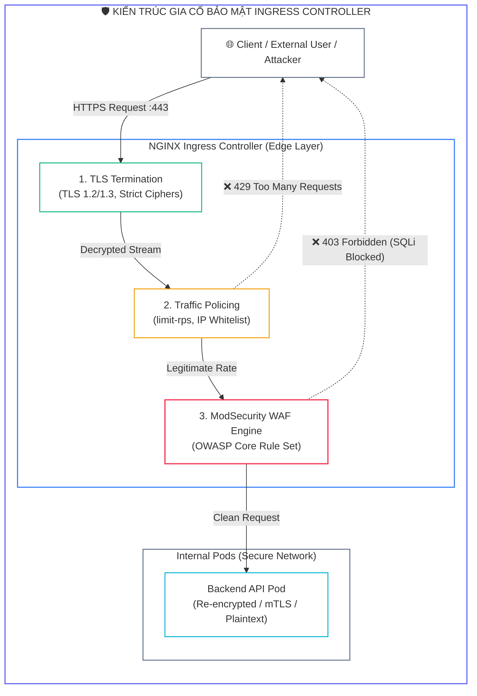
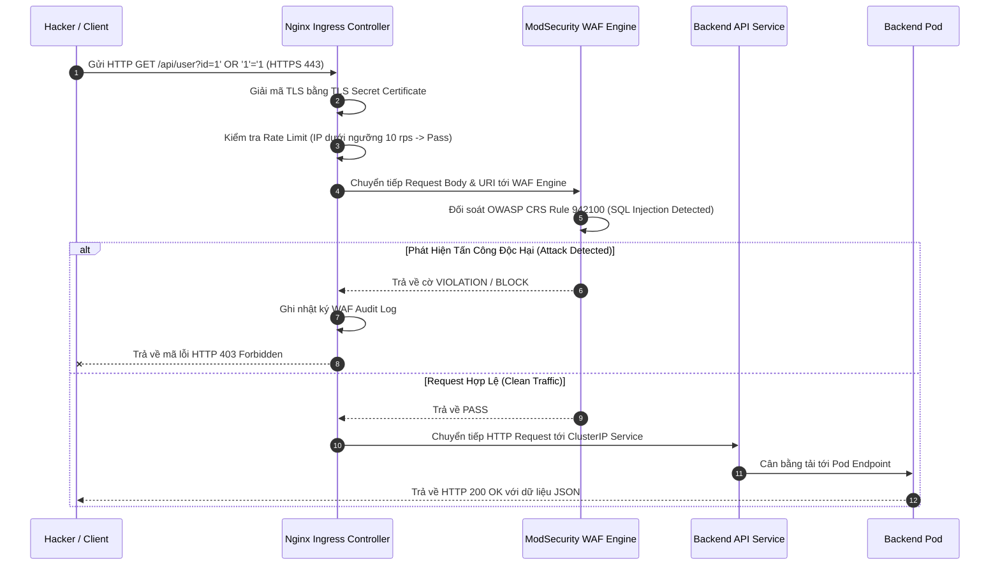
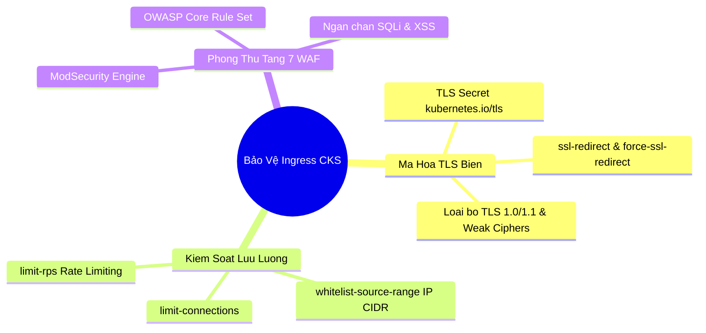


> [!IMPORTANT]
> **Mục tiêu kỹ thuật bài học**:
> - Hiểu rõ kiến trúc biên của **Ingress Controller** và mô hình đe dọa tấn công ứng dụng Web tầng 7 (L7).
> - Tạo **TLS Secret** và cấu hình **TLS Termination** trên Ingress manifest để ép buộc mã hóa HTTPS (`ssl-redirect: "true"`).
> - Gia cố các phiên bản giao thức mã hóa (**TLS 1.2 / 1.3**) và vô hiệu hóa các thuật toán mã hóa yếu (**Weak Cipher Suites**) thông qua Ingress ConfigMap.
> - Cấu hình chống tấn công DoS/DDoS L7 bằng **Rate Limiting Annotations** (`limit-rps`, `limit-connections`).
> - Kiểm soát quyền truy cập theo dải địa chỉ IP nguồn (**IP Whitelisting** qua `whitelist-source-range`).
> - Kích hoạt và tinh chỉnh **ModSecurity Web Application Firewall (WAF)** kết hợp **OWASP Core Rule Set (CRS)** để phát hiện và chặn đứng tấn công khai thác lỗ hổng Web.

---

## 1. Bản Chất Kiến Trúc & Tư Duy Cốt Lõi: Bảo Vệ Lớp Mạng Biên (Edge Security)

Trong kiến trúc vi dịch vụ Kubernetes, **Ingress Controller** (phổ biến nhất là Ingress-NGINX) đóng vai trò là một Reverse Proxy / API Gateway tầng ứng dụng (Layer 7). Nó tiếp nhận toàn bộ các yêu cầu HTTP/HTTPS từ Internet, giải mã TLS, kiểm tra định tuyến, và chuyển tiếp các gói tin tới các Pod dịch vụ backend bên trong cụm.

Do trực tiếp đối mặt với mạng ngoài, Ingress Controller là **mục tiêu tấn công hàng đầu** của tin tặc. Một hệ thống Ingress không được bảo vệ có thể khiến toàn bộ cụm bị phơi bày trước các nguy cơ:
1. **Ghe lén & Giả mạo dữ liệu (Eavesdropping & MITM):** Do truyền tải HTTP dạng văn bản rõ (*Plaintext*) hoặc sử dụng chứng chỉ TLS yếu.
2. **Tấn công từ chối dịch vụ (L7 HTTP Flood / DDoS):** Kẻ tấn công gửi hàng triệu request mỗi giây làm kiệt quệ tài nguyên CPU và bộ nhớ của Ingress và Pod backend.
3. **Khai thác lỗ hổng ứng dụng Web (OWASP Top 10):** Các đòn tấn công SQL Injection (SQLi), Cross-Site Scripting (XSS), hay Remote Code Execution (RCE) đi xuyên qua các lớp tường lửa mạng L3/L4 truyền thống.



---

## 2. Bảng Ma Trận So Sánh Kỹ Thuật Toàn Diện (Engineering Matrix)

| Tiêu Chí So Sánh | Edge TLS Termination | End-to-End TLS (Re-encryption) | Rate Limiting (limit-rps) | ModSecurity WAF Integration |
| :--- | :--- | :--- | :--- | :--- |
| **Vị trí xử lý** | Ingress Controller | Ingress + Từng Pod Backend | Ingress Memory Buffer | Ingress Lua / C-Module |
| **Tiêu tốn CPU** | Trung bình (tập trung tại Ingress) | Cao (mã hóa 2 lần liên tiếp) | Cực thấp (O(1) memory hash) | Cao (phân tích regex từng request) |
| **Mức độ an ninh** | Tốt (Bảo vệ luồng ngoài cụm) | Tối đa (Zero-Trust nội bộ) | Chống DoS/Brute-force | Chống SQLi, XSS, RCE |
| **Độ phức tạp cấu hình** | Thấp (1 TLS Secret tại Ingress) | Cao (chứng chỉ cho từng Pod) | Thấp (1 Ingress Annotation) | Trung bình (Tích hợp OWASP CRS) |
| **Tác động độ trễ** | $< 2\text{ ms}$ | $+ 5\text{ ms} - 10\text{ ms}$ | $< 0.5\text{ ms}$ | $+ 3\text{ ms} - 8\text{ ms}$ |
| **Trọng số CKS** | Bắt buộc 100% | Kiến thức chuyên sâu | Bắt buộc thi thực hành | Câu hỏi tình huống nâng cao |

---

## 3. Kiến Trúc Môi Trường & Luồng Thực Thi Mẫu

Khi một HTTP Request độc hại (chứa mã tiêm SQL Injection) được gửi từ Internet, quy trình đánh giá và chặn đứng được mô hình hóa qua Sequence Diagram sau:



---

## 4. Phân Tích Cạm Bẫy Thực Chiến: Đứt Gãy Chứng Chỉ TLS và Tấn Công DDoS Khi Quên Cấu Hình Rate Limit

### Tình Huống Sự Cố Thực Tế:
<span class="badge badge--rose">🕒 08:15 AM</span> Một hệ thống cổng thanh toán trực tuyến bị tin tặc tấn công từ chối dịch vụ tầng ứng dụng (L7 HTTP Flood) với hơn $50,000\text{ requests/giây}$ vào trang đăng nhập. Do Ingress không được cấu hình `limit-rps` và không bật SSL Redirect, Ingress Controller bị cạn kiệt File Descriptors, dẫn đến tình trạng treo máy và mất kết nối toàn bộ hệ sinh thái.

### Hậu Quả & Log Lỗi Thực Tế:
```text
================================================================================
INCIDENT LOG: NGINX INGRESS CONTROLLER WORKER PROCESS STARVATION (L7 DDOS)
================================================================================
[ALERT] 2026-09-12T08:15:33.201Z nginx-ingress-controller-7f4b8c-x9kz2:
2026/09/12 08:15:33 [alert] 12#12: *482910 socket() failed (24: Too many open files) while connecting to upstream,
client: 198.51.100.42, server: api.company.com, request: "POST /v1/auth/login HTTP/1.1", upstream: "http://10.244.2.18:8080"

[WARN] Pod Health Check Failure:
Liveness probe failed: Get "http://10.244.0.12:10254/healthz": context deadline exceeded (Client.Timeout)
Killed and restarted container 'controller' in pod 'nginx-ingress-controller-7f4b8c-x9kz2'
================================================================================
```

### 5-Whys Root Cause Analysis:
1. <span class="badge badge--primary">Why 1</span> **Tại sao Ingress Controller bị khởi động lại liên tục?** $\rightarrow$ Do tiến trình NGINX bị treo cứng, không kịp phản hồi Liveness Probe trên cổng `10254`.
2. <span class="badge badge--primary">Why 2</span> **Tại sao tiến trình NGINX bị treo cứng?** $\rightarrow$ Do cạn kiệt Socket File Descriptors khi tiếp nhận $50,000$ kết nối đồng thời từ một dải IP tấn công.
3. <span class="badge badge--primary">Why 3</span> **Tại sao các kết nối độc hại không bị chặn ngay từ đầu?** $\rightarrow$ Vì Ingress manifest thiếu các annotation kiểm soát tần suất (**Rate Limiting**) như `limit-rps` và `limit-connections`.
4. <span class="badge badge--primary">Why 4</span> **Tại sao tin tặc có thể quét và gửi request trực tiếp không qua bảo vệ?** $\rightarrow$ Do Ingress không có cơ chế lọc địa chỉ IP nguồn và không tích hợp WAF để nhận diện các mẫu tấn công lặp lại.
5. <span class="badge badge--emerald">Root Cause Remedy</span> **Biện pháp khắc phục chuẩn CKS:**
   - <span class="badge badge--emerald">Bổ Sung Rate Limiting Annotations:</span>
     ```yaml
     nginx.ingress.kubernetes.io/limit-rps: "15"
     nginx.ingress.kubernetes.io/limit-connections: "20"
     ```
   - <span class="badge badge--cyan">Ép Buộc Mã Hóa HTTPS & HSTS:</span>
     ```yaml
     nginx.ingress.kubernetes.io/ssl-redirect: "true"
     nginx.ingress.kubernetes.io/force-ssl-redirect: "true"
     nginx.ingress.kubernetes.io/hsts: "true"
     ```
   - <span class="badge badge--primary">Kích Hoạt ModSecurity WAF:</span>
     ```yaml
     nginx.ingress.kubernetes.io/enable-modsecurity: "true"
     nginx.ingress.kubernetes.io/enable-owasp-core-rules: "true"
     ```

---

## 5. Hands-on Lab: Triển Khai Ingress Bảo Mật TLS, Rate Limit & WAF (8 Bước)

| Bước | Mục Tiêu Kỹ Thuật | Đầu Ra Kiểm Tra |
| :---: | :--- | :--- |
| **1** | Khởi tạo Namespace `edge-secure` | Namespace sẵn sàng để triển khai |
| **2** | Triển khai ứng dụng Web Backend và Service | Pod `secure-web` và ClusterIP Service hoạt động |
| **3** | Tạo cặp khóa riêng tư và chứng chỉ tự ký TLS (Self-signed Cert) | Tệp `tls.key` và `tls.crt` chuẩn mã hóa RSA 2048-bit |
| **4** | Đóng gói chứng chỉ vào Kubernetes TLS Secret | Secret `secure-web-tls` loại `kubernetes.io/tls` |
| **5** | Biên soạn Ingress manifest với TLS và SSL-Redirect | Ingress tiếp nhận traffic HTTPS và tự động chuyển hướng HTTP |
| **6** | Gia cố bảo mật với Rate Limiting Annotations | Kiểm tra chặn HTTP 429 khi vượt quá 5 request/s |
| **7** | Kích hoạt ModSecurity WAF và OWASP CRS | Ingress tự động phát hiện và chặn gói tin SQL Injection |
| **8** | Kiểm định toàn diện luồng an ninh L7 | Hoàn tất xác thực Ingress an toàn theo chuẩn CKS |

### Bước 1: Tạo Namespace Thử Nghiệm

```bash
kubectl create namespace edge-secure
```

### Bước 2: Triển Khai Backend Web App & Service

```bash
kubectl run secure-web --image=nginx:alpine --restart=Never -n edge-secure --port=80
kubectl expose pod secure-web --name=secure-web-svc --port=80 --target-port=80 -n edge-secure
```

### Bước 3: Tạo Khóa Riêng Tư & Chứng Chỉ TLS Bằng OpenSSL

```bash
openssl req -x509 -nodes -days 365 -newkey rsa:2048 \
  -keyout /tmp/tls.key -out /tmp/tls.crt \
  -subj "/CN=secure.company.internal/O=DevSecOps"
```

### Bước 4: Tạo Kubernetes TLS Secret

```bash
kubectl create secret tls secure-web-tls \
  --cert=/tmp/tls.crt \
  --key=/tmp/tls.key \
  -n edge-secure

# Kiểm tra Secret đã được tạo đúng type
kubectl get secret secure-web-tls -n edge-secure
```

### Bước 5: Biên Soạn Ingress Khởi Tạo Với TLS Termination & SSL-Redirect

```bash
cat <<EOF | kubectl apply -f -
apiVersion: networking.k8s.io/v1
kind: Ingress
metadata:
  name: secure-web-ingress
  namespace: edge-secure
  annotations:
    nginx.ingress.kubernetes.io/ssl-redirect: "true"
    nginx.ingress.kubernetes.io/force-ssl-redirect: "true"
spec:
  ingressClassName: nginx
  tls:
  - hosts:
    - secure.company.internal
    secretName: secure-web-tls
  rules:
  - host: secure.company.internal
    http:
      paths:
      - path: /
        pathType: Prefix
        backend:
          service:
            name: secure-web-svc
            port:
              number: 80
EOF
```

### Bước 6: Thêm Cấu Hình Rate Limiting Chống Tấn Công DoS

```bash
kubectl annotate ingress secure-web-ingress -n edge-secure \
  nginx.ingress.kubernetes.io/limit-rps="5" \
  nginx.ingress.kubernetes.io/limit-connections="10" --overwrite
```

### Bước 7: Kích Hoạt ModSecurity WAF & OWASP Core Rule Set

```bash
kubectl annotate ingress secure-web-ingress -n edge-secure \
  nginx.ingress.kubernetes.io/enable-modsecurity="true" \
  nginx.ingress.kubernetes.io/enable-owasp-core-rules="true" \
  nginx.ingress.kubernetes.io/modsecurity-snippet="
    SecRuleEngine On
    SecRequestBodyAccess On
  " --overwrite
```

### Bước 8: Kiểm Thử Toàn Diện Luồng An Ninh Ingress

```bash
INGRESS_IP=$(kubectl get ingress secure-web-ingress -n edge-secure -o jsonpath='{.status.loadBalancer.ingress[0].ip}')
if [ -z "$INGRESS_IP" ]; then INGRESS_IP="127.0.0.1"; fi

# 1. Kiểm tra SSL Redirect: Truy cập HTTP (80) -> Phải nhận HTTP 308/301 Redirect sang HTTPS
curl -I -H "Host: secure.company.internal" http://$INGRESS_IP/

# 2. Kiểm tra HTTPS hợp lệ qua TLS (Bỏ qua kiểm tra chứng chỉ tự ký với cờ -k)
curl -k -I -H "Host: secure.company.internal" https://$INGRESS_IP/

# 3. Kiểm tra WAF: Gửi payload SQL Injection -> Phải bị chặn với mã HTTP 403 Forbidden
curl -k -I -H "Host: secure.company.internal" "https://$INGRESS_IP/?id=1'%20OR%20'1'='1"

echo ">> [VERIFIED] Chuc mung ban da gia co thanh cong Ingress Controller theo chuan CKS!"
```

---

## 6. 10 Câu Hỏi Tự Kiểm Tra Chuyên Sâu (Self-Check Q&A Accordion)

<details class="qa-card">
<summary class="qa-summary">
  <div class="qa-summary-left">
    <span class="qa-num-badge">Q01</span>
    <span>Sự khác biệt cốt lõi giữa Ingress TLS Termination và End-to-End TLS Encryption là gì?</span>
  </div>
  <span class="qa-chevron">
    <svg width="18" height="18" fill="none" stroke="currentColor" stroke-width="2.5" viewBox="0 0 24 24"><polyline points="6 9 12 15 18 9"></polyline></svg>
  </span>
</summary>
<div class="qa-answer">
  <div class="qa-answer-header">
    <svg width="14" height="14" fill="none" stroke="currentColor" stroke-width="2" viewBox="0 0 24 24"><path d="M22 11.08V12a10 10 0 1 1-5.93-9.14"></path><polyline points="22 4 12 14.01 9 11.01"></polyline></svg>
    <span>Phân Tích &amp; Lời Giải Kỹ Thuật</span>
  </div>
  <div style="margin-bottom: 8px;"><b style="color: var(--accent-emerald);">TLS Termination:</b> Ingress Controller giải mã chứng chỉ TLS ngay tại cửa ngõ biên và chuyển tiếp HTTP dạng văn bản rõ tới Pod backend, giúp giảm tải CPU cho các Pod. <b style="color: var(--accent-primary);">End-to-End TLS:</b> Ingress Controller sau khi nhận kết nối sẽ thiết lập tiếp một phiên mã hóa HTTPS mới tới tận Pod backend (sử dụng annotation <code>nginx.ingress.kubernetes.io/backend-protocol: "HTTPS"</code>), đảm bảo bảo mật tuyệt đối trên đường truyền nội bộ cụm.</div>
</div>
</details>

<details class="qa-card">
<summary class="qa-summary">
  <div class="qa-summary-left">
    <span class="qa-num-badge">Q02</span>
    <span>Tại sao cần khai báo annotation `ssl-redirect: "true"` trên Ingress manifest?</span>
  </div>
  <span class="qa-chevron">
    <svg width="18" height="18" fill="none" stroke="currentColor" stroke-width="2.5" viewBox="0 0 24 24"><polyline points="6 9 12 15 18 9"></polyline></svg>
  </span>
</summary>
<div class="qa-answer">
  <div class="qa-answer-header">
    <svg width="14" height="14" fill="none" stroke="currentColor" stroke-width="2" viewBox="0 0 24 24"><path d="M22 11.08V12a10 10 0 1 1-5.93-9.14"></path><polyline points="22 4 12 14.01 9 11.01"></polyline></svg>
    <span>Phân Tích &amp; Lời Giải Kỹ Thuật</span>
  </div>
  <div style="margin-bottom: 8px;">Annotation <code>ssl-redirect: "true"</code> (kết hợp với <code>force-ssl-redirect: "true"</code>) chỉ đạo NGINX tự động trả về phản hồi chuyển hướng <b style="color: var(--accent-cyan);">HTTP 308 Permanent Redirect</b> sang giao thức HTTPS an toàn khi người dùng truy cập bằng cổng HTTP 80, loại bỏ hoàn toàn nguy cơ rò rỉ dữ liệu qua kênh không mã hóa.</div>
</div>
</details>

<details class="qa-card">
<summary class="qa-summary">
  <div class="qa-summary-left">
    <span class="qa-num-badge">Q03</span>
    <span>Làm thế nào để vô hiệu hóa các giao thức mã hóa cũ (TLS 1.0 / 1.1) và Cipher Suites yếu trên phạm vi toàn cụm?</span>
  </div>
  <span class="qa-chevron">
    <svg width="18" height="18" fill="none" stroke="currentColor" stroke-width="2.5" viewBox="0 0 24 24"><polyline points="6 9 12 15 18 9"></polyline></svg>
  </span>
</summary>
<div class="qa-answer">
  <div class="qa-answer-header">
    <svg width="14" height="14" fill="none" stroke="currentColor" stroke-width="2" viewBox="0 0 24 24"><path d="M22 11.08V12a10 10 0 1 1-5.93-9.14"></path><polyline points="22 4 12 14.01 9 11.01"></polyline></svg>
    <span>Phân Tích &amp; Lời Giải Kỹ Thuật</span>
  </div>
  <div style="margin-bottom: 8px;">Chỉnh sửa ConfigMap của NGINX Ingress Controller (thường nằm ở Namespace <code>ingress-nginx</code>) với các tham số toàn cục:
  <div style="margin-top: 6px; padding: 8px; background: rgba(0,0,0,0.2); border-radius: 4px; font-family: monospace; font-size: 0.9em;">
  ssl-protocols: "TLSv1.2 TLSv1.3"<br/>
  ssl-ciphers: "ECDHE-ECDSA-AES128-GCM-SHA256:ECDHE-RSA-AES128-GCM-SHA256:ECDHE-ECDSA-AES256-GCM-SHA384"
  </div>
  </div>
</div>
</details>

<details class="qa-card">
<summary class="qa-summary">
  <div class="qa-summary-left">
    <span class="qa-num-badge">Q04</span>
    <span>Annotation `limit-rps` hoạt động theo cơ chế nào và khi nào client nhận mã lỗi HTTP 429?</span>
  </div>
  <span class="qa-chevron">
    <svg width="18" height="18" fill="none" stroke="currentColor" stroke-width="2.5" viewBox="0 0 24 24"><polyline points="6 9 12 15 18 9"></polyline></svg>
  </span>
</summary>
<div class="qa-answer">
  <div class="qa-answer-header">
    <svg width="14" height="14" fill="none" stroke="currentColor" stroke-width="2" viewBox="0 0 24 24"><path d="M22 11.08V12a10 10 0 1 1-5.93-9.14"></path><polyline points="22 4 12 14.01 9 11.01"></polyline></svg>
    <span>Phân Tích &amp; Lời Giải Kỹ Thuật</span>
  </div>
  <div style="margin-bottom: 8px;"><code>limit-rps</code> sử dụng thuật toán <b style="color: var(--accent-primary);">Leaky Bucket (Thùng Rò Rỉ)</b> trong NGINX để giới hạn số lượng request được chấp nhận trên mỗi giây từ một IP nguồn. Nếu tốc độ gửi request vượt quá ngưỡng quy định và bộ nhớ đệm burst bị đầy, NGINX sẽ ngay lập tức từ chối yêu cầu và trả về mã lỗi <b style="color: var(--accent-rose);">HTTP 429 Too Many Requests</b>.</div>
</div>
</details>

<details class="qa-card">
<summary class="qa-summary">
  <div class="qa-summary-left">
    <span class="qa-num-badge">Q05</span>
    <span>Annotation `whitelist-source-range` có thể dùng để làm gì và hỗ trợ định dạng nào?</span>
  </div>
  <span class="qa-chevron">
    <svg width="18" height="18" fill="none" stroke="currentColor" stroke-width="2.5" viewBox="0 0 24 24"><polyline points="6 9 12 15 18 9"></polyline></svg>
  </span>
</summary>
<div class="qa-answer">
  <div class="qa-answer-header">
    <svg width="14" height="14" fill="none" stroke="currentColor" stroke-width="2" viewBox="0 0 24 24"><path d="M22 11.08V12a10 10 0 1 1-5.93-9.14"></path><polyline points="22 4 12 14.01 9 11.01"></polyline></svg>
    <span>Phân Tích &amp; Lời Giải Kỹ Thuật</span>
  </div>
  <div style="margin-bottom: 8px;"><code>whitelist-source-range</code> cho phép thiết lập danh sách trắng các địa chỉ IP hoặc dải mạng CIDR được phép truy cập Ingress (ví dụ: <code>"203.0.113.0/24, 198.51.100.5"</code>). Mọi kết nối từ các địa chỉ IP nằm ngoài danh sách này sẽ bị chặn với mã lỗi <b style="color: var(--accent-rose);">HTTP 403 Forbidden</b>.</div>
</div>
</details>

<details class="qa-card">
<summary class="qa-summary">
  <div class="qa-summary-left">
    <span class="qa-num-badge">Q06</span>
    <span>Tại sao cần kiểm tra cờ `use-forwarded-headers: "true"` khi chạy Ingress Controller phía sau Load Balancer đám mây?</span>
  </div>
  <span class="qa-chevron">
    <svg width="18" height="18" fill="none" stroke="currentColor" stroke-width="2.5" viewBox="0 0 24 24"><polyline points="6 9 12 15 18 9"></polyline></svg>
  </span>
</summary>
<div class="qa-answer">
  <div class="qa-answer-header">
    <svg width="14" height="14" fill="none" stroke="currentColor" stroke-width="2" viewBox="0 0 24 24"><path d="M22 11.08V12a10 10 0 1 1-5.93-9.14"></path><polyline points="22 4 12 14.01 9 11.01"></polyline></svg>
    <span>Phân Tích &amp; Lời Giải Kỹ Thuật</span>
  </div>
  <div style="margin-bottom: 8px;">Khi đứng sau Cloud Load Balancer (AWS ALB, GCP NLB), địa chỉ IP nguồn trong socket TCP sẽ là IP của Load Balancer chứ không phải của người dùng thực. Bật <code>use-forwarded-headers: "true"</code> giúp NGINX đọc đúng địa chỉ IP thực của Client từ HTTP Header <b style="color: var(--accent-cyan);">X-Forwarded-For</b>, giúp các cơ chế Rate Limiting và IP Whitelisting hoạt động chính xác.</div>
</div>
</details>

<details class="qa-card">
<summary class="qa-summary">
  <div class="qa-summary-left">
    <span class="qa-num-badge">Q07</span>
    <span>Chế độ phát hiện (Detection Mode) khác gì so với chế độ thực thi (Enforcement Mode) trong ModSecurity WAF?</span>
  </div>
  <span class="qa-chevron">
    <svg width="18" height="18" fill="none" stroke="currentColor" stroke-width="2.5" viewBox="0 0 24 24"><polyline points="6 9 12 15 18 9"></polyline></svg>
  </span>
</summary>
<div class="qa-answer">
  <div class="qa-answer-header">
    <svg width="14" height="14" fill="none" stroke="currentColor" stroke-width="2" viewBox="0 0 24 24"><path d="M22 11.08V12a10 10 0 1 1-5.93-9.14"></path><polyline points="22 4 12 14.01 9 11.01"></polyline></svg>
    <span>Phân Tích &amp; Lời Giải Kỹ Thuật</span>
  </div>
  <div style="margin-bottom: 8px;"><b style="color: var(--accent-amber);">Detection Mode (SecRuleEngine DetectionOnly):</b> WAF chỉ phân tích và ghi nhật ký cảnh báo vi phạm luật vào Audit Log mà không chặn gói tin, thường dùng trong giai đoạn thử nghiệm để tránh chặn nhầm (False Positive). <b style="color: var(--accent-rose);">Enforcement Mode (SecRuleEngine On):</b> WAF trực tiếp hủy gói tin độc hại và trả về mã lỗi HTTP 403 Forbidden.</div>
</div>
</details>

<details class="qa-card">
<summary class="qa-summary">
  <div class="qa-summary-left">
    <span class="qa-num-badge">Q08</span>
    <span>Lệnh kubectl nào giúp kiểm tra danh sách các Secret TLS và chứng chỉ đang gắn vào Ingress?</span>
  </div>
  <span class="qa-chevron">
    <svg width="18" height="18" fill="none" stroke="currentColor" stroke-width="2.5" viewBox="0 0 24 24"><polyline points="6 9 12 15 18 9"></polyline></svg>
  </span>
</summary>
<div class="qa-answer">
  <div class="qa-answer-header">
    <svg width="14" height="14" fill="none" stroke="currentColor" stroke-width="2" viewBox="0 0 24 24"><path d="M22 11.08V12a10 10 0 1 1-5.93-9.14"></path><polyline points="22 4 12 14.01 9 11.01"></polyline></svg>
    <span>Phân Tích &amp; Lời Giải Kỹ Thuật</span>
  </div>
  <div style="margin-bottom: 8px;">Sử dụng lệnh: <b style="color: var(--accent-primary);">kubectl describe ingress &lt;ingress-name&gt; -n &lt;namespace&gt;</b> và quan sát khối thông tin <code>TLS:</code> với danh sách các Hosts và SecretName tương ứng.</div>
</div>
</details>

<details class="qa-card">
<summary class="qa-summary">
  <div class="qa-summary-left">
    <span class="qa-num-badge">Q09</span>
    <span>Secret TLS trong Kubernetes bắt buộc phải chứa những trường khóa dữ liệu (data keys) cụ thể nào?</span>
  </div>
  <span class="qa-chevron">
    <svg width="18" height="18" fill="none" stroke="currentColor" stroke-width="2.5" viewBox="0 0 24 24"><polyline points="6 9 12 15 18 9"></polyline></svg>
  </span>
</summary>
<div class="qa-answer">
  <div class="qa-answer-header">
    <svg width="14" height="14" fill="none" stroke="currentColor" stroke-width="2" viewBox="0 0 24 24"><path d="M22 11.08V12a10 10 0 1 1-5.93-9.14"></path><polyline points="22 4 12 14.01 9 11.01"></polyline></svg>
    <span>Phân Tích &amp; Lời Giải Kỹ Thuật</span>
  </div>
  <div style="margin-bottom: 8px;">Secret kiểu <code>kubernetes.io/tls</code> bắt buộc phải chứa chính xác 2 trường dữ liệu: <b style="color: var(--accent-emerald);">tls.crt</b> (chứa nội dung chứng chỉ công khai đã mã hóa Base64) và <b style="color: var(--accent-rose);">tls.key</b> (chứa nội dung khóa bí mật RSA/ECDSA đã mã hóa Base64).</div>
</div>
</details>

<details class="qa-card">
<summary class="qa-summary">
  <div class="qa-summary-left">
    <span class="qa-num-badge">Q10</span>
    <span>Làm thế nào để giới hạn kích thước tối đa của Request Body gửi lên Ingress nhằm chống tấn công làm cạn kiệt bộ nhớ?</span>
  </div>
  <span class="qa-chevron">
    <svg width="18" height="18" fill="none" stroke="currentColor" stroke-width="2.5" viewBox="0 0 24 24"><polyline points="6 9 12 15 18 9"></polyline></svg>
  </span>
</summary>
<div class="qa-answer">
  <div class="qa-answer-header">
    <svg width="14" height="14" fill="none" stroke="currentColor" stroke-width="2" viewBox="0 0 24 24"><path d="M22 11.08V12a10 10 0 1 1-5.93-9.14"></path><polyline points="22 4 12 14.01 9 11.01"></polyline></svg>
    <span>Phân Tích &amp; Lời Giải Kỹ Thuật</span>
  </div>
  <div style="margin-bottom: 8px;">Khai báo annotation: <b style="color: var(--accent-primary);">nginx.ingress.kubernetes.io/proxy-body-size: "8m"</b> (hoặc cấu hình trong ConfigMap qua <code>client-max-body-size</code>). Nếu Client cố tình upload payload vượt quá kích thước này, Ingress sẽ từ chối với mã lỗi <b style="color: var(--accent-rose);">HTTP 413 Payload Too Large</b>.</div>
</div>
</details>

---

## 7. Tổng Kết & Lộ Trình Bài Học Tiếp Theo



Gia cố Ingress Controller là bước đầu tiên trong chuỗi bảo mật hạ tầng mạng của chứng chỉ CKS, kết nối trực tiếp với chuỗi cung ứng container và bảo mật tiến trình chạy.

> [!TIP]
> **BÀI HỌC TIẾP THEO:**
> Trong **[[Bài 03] Quét Lỗ Hổng Ảnh Container: Tích Hợp Trivy, Clair & Harbor Security Gate](cks-03-03-quay-va-trivy-quet-anh-container.html)**, chúng ta sẽ đi sâu vào kỹ thuật quét lỗ hổng ảnh container tĩnh, phân tích CVE mức độ CRITICAL/HIGH, thiết lập rào chắn tự động chặn ảnh không an toàn trong CI/CD pipeline và quản lý Registry an toàn.

