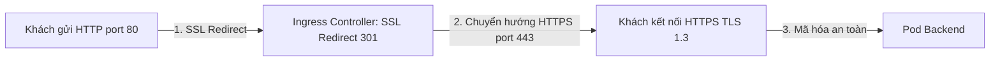
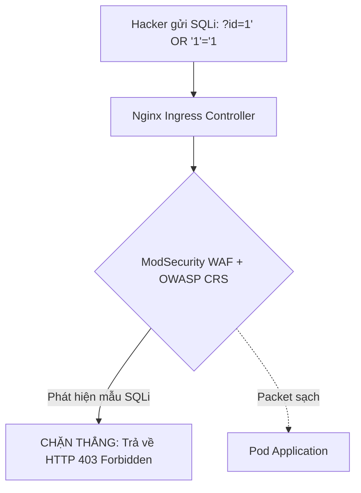
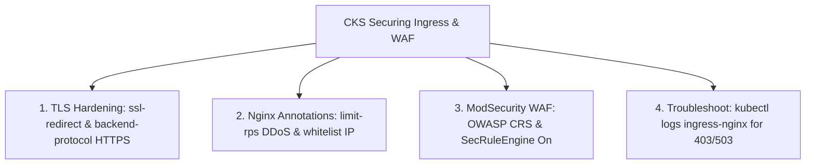
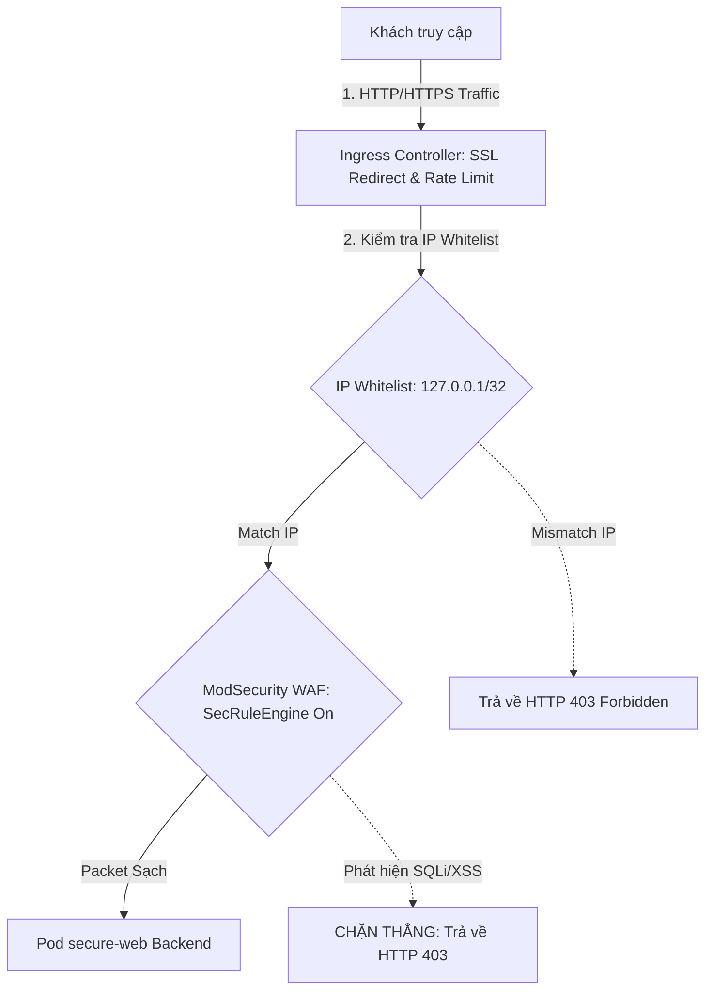


# [BÀI 02] BẢO VỆ LỚP MẠNG BIÊN INGRESS: TLS TERMINATION, NGINX SECURITY ANNOTATIONS & MODSECURITY WAF

Trong kỷ nguyên điện toán đám mây và kiến trúc microservices phân tán quy mô lớn, **Kubernetes (CKS)** đóng vai trò là nền tảng điều phối container (Container Orchestration) tiêu chuẩn công nghiệp. Để làm chủ hệ thống trong môi trường sản xuất (Production) cũng như chinh phục kỳ thi chứng chỉ quốc tế của Linux Foundation / CNCF, kỹ sư không chỉ nắm vững các câu lệnh thao tác cơ bản mà phải thấu hiểu sâu sắc bản chất cơ chế tầng thấp: từ chu trình điều hòa (Reconciliation Loop), cấu trúc điều phối tài nguyên, kiến trúc mạng CNI, lưu trữ CSI cho đến các chuẩn mực an ninh phòng thủ chiều sâu.

Bài viết chuyên sâu này sẽ đồng hành cùng bạn giải mã toàn diện bức tranh kiến trúc, phân tích các đánh đổi kỹ thuật thực chiến (Engineering Trade-offs), cung cấp bài thực hành Lab từng bước và bộ câu hỏi phỏng vấn chuẩn Architect / Lead Engineer.

---

## 1. Bản Chất Kiến Trúc & Cơ Chế Vận Hành Tầng Thấp

| # | Câu hỏi ôn tập | Đáp án chuẩn ngắn gọn |
|---|---|---|
| 1 | Nguyên tắc cốt lõi của bảo mật Zero-Trust trong NetworkPolicy? | Mặc định **`default-deny-all`** khóa sạch 100% Ingress/Egress |
| 2 | Phân biệt phép toán AND và OR trong cú pháp mảng YAML? | Cùng 1 vạch `-` là **AND**; Hai vạch `-` riêng biệt là **OR** |
| 3 | Cổng Egress tối quan trọng bắt buộc phải mở cho Pod? | **UDP/TCP 53** tới CoreDNS Server |
| 4 | Cờ thuộc tính loại trừ dải IP nội bộ trong `ipBlock`? | Thuộc tính **`except`** dưới `ipBlock` |
| 5 | Điều kiện bắt buộc để NetworkPolicy có hiệu lực thực thi? | Cụm phải có **CNI Plugin** hỗ trợ (như **Calico** hay **Cilium**) |


> **"Gia cố bảo mật cổng vào Ingress Controller ở cấp độ CKS (Securing Ingress & WAF Integration) đòi hỏi chuyên gia bảo mật phải nâng cấp rào chắn mạng từ định tuyến thông thường lên cấp độ phòng thủ chuyên sâu bằng cách bắt buộc mã hóa HTTPS TLS 1.2/1.3 (`ssl-redirect: 'true'`, `ssl-ciphers`), vô hiệu hóa các giao thức mã hóa cũ lạc hậu; làm chủ bộ Nginx Ingress Annotations gia cố bảo mật chống tấn công DDoS (`limit-rps`, `limit-connections`) và giới hạn dải IP truy cập (`whitelist-source-range`); đồng thời tích hợp tường lửa ứng dụng Web (ModSecurity WAF / OWASP Core Rule Set) ngay tại cổng Ingress để ngăn chặn các đòn tấn công L7 nguy hiểm như SQL Injection và Cross-Site Scripting (XSS)."**

**Kết quả từ các buổi trước được sử dụng lại:**

| Kết quả / Công cụ | Buổi + số hiệu `QT` | Dùng ở đâu trong buổi này |
|---|---|---|
| Tạo Secret TLS và cấu hình Ingress căn bản | Buổi 44 `QT 6.2` | Làm nền tảng bổ sung các Annotations bảo mật CKS |
| Khái niệm Layer 7 HTTP/HTTPS Traffic | Buổi 44 `QT 5.1` | Áp dụng tường lửa ModSecurity WAF L7 |
| Quản lý Nginx Ingress Controller | Buổi 24 `QT 4.1` | Nạp cấu hình ConfigMap và Annotations bảo mật |

---


| # | Kỹ năng thực hiện được | Hiện vật chứng minh |
|---|---|---|
| 1 | Gia cố mã hóa HTTPS TLS 1.2/1.3 và cấu hình Ciphers an toàn cho Ingress | Tệp Ingress YAML chứa `ssl-redirect: "true"` và TLS Secret |
| 2 | Cấu hình giới hạn Rate Limit (`limit-rps`) chống tấn công DDoS L7 | Tệp Ingress YAML chứa annotation `limit-rps` và `limit-connections` |
| 3 | Cấu hình IP Whitelisting (`whitelist-source-range`) kiểm soát địa chỉ IP | Tệp Ingress YAML chứa annotation `whitelist-source-range` |
| 4 | Tích hợp ModSecurity WAF và OWASP Core Rule Set vào Ingress | Tệp Ingress YAML chứa cờ `enable-modsecurity: "true"` |
| 5 | Tra cứu nhật ký WAF Audit Log chẩn đoán các gói tin bị chặn | Nhật ký kiểm tra gói tin SQLi bị ModSecurity WAF BLOCK |

---


| Kiến thức tiên quyết | Nguồn tự học nếu thiếu |
|---|---|
| Cấu hình Ingress v1 và TLS Secret căn bản | Buổi 44 (`QT 6.2`) |
| CKS Network Security Policy Hardening | Buổi 46 (`QT 7.1`) |
| Kiến thức các dạng tấn công L7 (SQLi, XSS, DDoS) | Buổi 03 (`QT 4.1`) |

---


### 3.1. Thuật ngữ Việt–Anh

| # | Thuật ngữ tiếng Việt | Tiếng Anh tương đương | Ghi chú chuẩn hoá trong thân bài |
|---|---|---|---|
| 1 | Gia cố bảo mật cổng vào | Securing Ingress | Tập hợp các giải pháp siết chặt an toàn cho Ingress Controller |
| 2 | Tường lửa ứng dụng Web | Web Application Firewall (WAF) | Tường lửa L7 (ModSecurity) kiểm soát và chặn độc hại web |
| 3 | Bộ quy tắc chuẩn OWASP | OWASP Core Rule Set (CRS) | Tập hợp luật WAF chuẩn phát hiện SQLi, XSS, RCE |
| 4 | Gia cố mã hóa TLS | TLS Hardening | Chỉ cho phép TLS 1.2/1.3 và loại bỏ ciphers lỗi thời |
| 5 | Tự động chuyển hướng HTTPS | SSL Redirect (`ssl-redirect`) | Annotation ép buộc chuyển 100% traffic HTTP (80) sang HTTPS (443) |
| 6 | Giới hạn tần suất kết nối | Rate Limiting (`limit-rps`) | Annotation giới hạn số request/giây từ một địa chỉ IP |
| 7 | Danh sách IP cho phép | IP Whitelisting (`whitelist-source-range`) | Annotation chỉ cho phép dải IP chỉ định truy cập Ingress |
| 8 | Mã hóa đầu cuối | End-to-End TLS (`backend-protocol`) | Mã hóa HTTPS từ Ingress Controller tới tận Pod backend |
| 9 | Tấn công từ chối dịch vụ | Denial of Service (DDoS) | Dạng tấn công làm quá tải tài nguyên hệ thống |
| 10 | Tiêm lệnh cơ sở dữ liệu | SQL Injection (SQLi) | Dạng tấn công L7 tiêm mã SQL qua ô nhập liệu web |
| 11 | Chèn kịch bản độc hại | Cross-Site Scripting (XSS) | Dạng tấn công L7 tiêm kịch bản JavaScript độc hại |
| 12 | Bản ghi chú cấu hình | Ingress Annotations | Các metadata `nginx.ingress.kubernetes.io/*` cấu hình Nginx |
| 13 | Tập hợp mã hóa an toàn | Secure Cipher Suites | Danh sách ciphers TLS an toàn được khuyến nghị bởi CNCF |
| 14 | Chế độ phát hiện WAF | WAF Detection Mode | Chế độ WAF ghi log (Detection) hoặc chặn thẳng (Enforcement) |


Mô hình Cổng An ninh Sân bay Quốc tế và Máy Quét X-Ray WAF: Ingress Controller thông thường giống như Cổng kiểm soát vé sân bay mở. `Securing Ingress` giống như việc Nâng cấp cổng kiểm soát thành Cổng an ninh nghiêm ngặt: `ssl-redirect` là bắt buộc 100% hành khách phải đi qua cửa soi chiếu HTTPS; `whitelist-source-range` là Cổng kiểm tra hộ chiếu (chỉ hành khách có quốc tịch hợp lệ mới được vào); `limit-rps` là Rào chắn khống chế tốc độ xếp hàng chống chen lấn (DDoS); `ModSecurity WAF` giống như Máy Quét X-Ray tự động phát hiện và thu giữ dao kéo, chất nổ (SQL Injection/XSS) giấu trong hành lý của khách.

---

### 1.1. Gia cố TLS 1.2/1.3 Hardening và loại bỏ Ciphers yếu (12 phút)

**Nguyên lý cốt lõi:** Theo chuẩn bảo mật CKS, luôn bật annotation `nginx.ingress.kubernetes.io/ssl-redirect: "true"` và cấu hình `ssl-ciphers` mạnh trên Ingress để ép 100% traffic chuyển sang HTTPS và loại bỏ hoàn toàn các giao thức TLS 1.0/1.1 cũ kỹ.

**Giải thích cơ chế ngầm:** Các phiên bản TLS cũ (TLS 1.0/1.1) chứa nhiều lỗ hổng bảo mật nghiêm trọng (như POODLE, BEAST). Việc bắt buộc dùng TLS 1.2/1.3 đảm bảo gói tin mã hóa an toàn tuyệt đối trên đường truyền internet.

> [!WARNING]
> **CẠM BẪY THỰC CHIẾN:**
> Để Ingress nhận traffic HTTP không mã hóa (port 80) hoặc chấp nhận các cipher weak dẫn đến rủi ro bị nghe lén (Man-in-the-middle).

**Minh hoạ.**



**Nguyên lý cốt lõi:** Khi cấu hình mTLS end-to-end từ Ingress Controller vào Pod backend, khai báo annotation `nginx.ingress.kubernetes.io/backend-protocol: "HTTPS"` để đảm bảo gói tin được mã hóa liên tục trên toàn bộ đường truyền nội bộ.

**Giải thích cơ chế ngầm:** Ngăn chặn nguy cơ kẻ tấn công đã xâm nhập được vào mạng cụm Kubernetes thực hiện nghe lén (sniffing) gói tin HTTP không mã hóa giữa Ingress Controller và Pod backend.

> [!WARNING]
> **CẠM BẪY THỰC CHIẾN:**
> Dùng HTTPS ở bên ngoài nhưng gửi HTTP thuần ở mạng nội bộ (plain HTTP backend) vi phạm tiêu chuẩn Zero-Trust của CKS.

**Minh hoạ.**

```yaml
metadata:
  annotations:
    nginx.ingress.kubernetes.io/ssl-redirect: "true"
    nginx.ingress.kubernetes.io/backend-protocol: "HTTPS" # Mã hóa HTTPS tới backend
```

---

### 1.2. Bộ Nginx Ingress Annotations bảo mật (SSL Redirect, Rate Limit, Whitelist) (12 phút)

**Nguyên lý cốt lõi:** Để phòng chống tấn công brute-force và DDoS cấp L7, áp dụng bộ đôi annotation `limit-rps: "10"` (giới hạn 10 requests/giây) và `limit-connections: "5"` cho các endpoint nhạy cảm (như trang `/login` hoặc `/api/pay`).

**Giải thích cơ chế ngầm:** Giới hạn số lượng request từ một địa chỉ IP duy nhất trong một khoảng thời gian, ngăn chặn các botnet gửi dồn dập hàng ngàn request làm sập hệ thống.

> [!WARNING]
> **CẠM BẪY THỰC CHIẾN:**
> Bỏ trống Rate Limit làm ứng dụng dễ dàng bị đánh sập bởi các kịch bản tấn công DDoS đơn giản.

**Minh hoạ.**

```yaml
metadata:
  annotations:
    nginx.ingress.kubernetes.io/limit-rps: "10" # Giới hạn 10 req/s từ 1 IP
    nginx.ingress.kubernetes.io/limit-connections: "5" # Tối đa 5 kết nối đồng thời
```

**Nguyên lý cốt lõi:** Để giới hạn quyền truy cập trang quản trị nội bộ qua Ingress, áp dụng annotation `nginx.ingress.kubernetes.io/whitelist-source-range: "192.168.1.0/24"` để chặn sạch 100% địa chỉ IP nằm ngoài dải cho phép.

**Giải thích cơ chế ngầm:** Thu hẹp tối đa bề mặt tấn công của các trang web nội bộ (như `/admin` hay `/dashboard`), chỉ cho phép các máy tính thuộc dải IP văn phòng công ty truy cập.

> [!WARNING]
> **CẠM BẪY THỰC CHIẾN:**
> Mở toang đường dẫn `/admin` ra ngoài internet công cộng cho bất kỳ IP nào cũng có thể truy cập trang login quản trị.

**Minh hoạ.**

```yaml
metadata:
  annotations:
    nginx.ingress.kubernetes.io/whitelist-source-range: "192.168.1.0/24, 10.0.0.0/8"
```

---

### 1.3. Tích hợp Tường lửa ứng dụng Web ModSecurity WAF và OWASP CRS (10 phút)

**Nguyên lý cốt lõi:** Tích hợp ModSecurity WAF vào Nginx Ingress bằng cách bật cờ annotation `enable-modsecurity: "true"` và `enable-owasp-modsecurity-crs: "true"` để kích hoạt bộ luật chuẩn OWASP CRS ngăn chặn SQLi và XSS.

**Giải thích cơ chế ngầm:** ModSecurity WAF phân tích sâu nội dung gói tin L7 (HTTP Body, Headers, Query Parameters) và đối soát với bộ luật OWASP để phát hiện các mẫu tấn công ứng dụng web nguy hiểm.

> [!WARNING]
> **CẠM BẪY THỰC CHIẾN:**
> Chỉ bảo vệ mạng ở L3/L4 qua NetworkPolicy mà không có WAF L7 làm ứng dụng bị khai thác qua lỗ hổng mã nguồn SQL Injection.

**Minh hoạ.**



**Nguyên lý cốt lõi:** Đặt cờ `modsecurity-snippet` với luật `SecRuleEngine On` để WAF chủ động CHẶN (Block) gói tin độc hại thay vì chỉ ghi log cảnh báo (`SecRuleEngine DetectionOnly`).

**Giải thích cơ chế ngầm:** Chế độ `DetectionOnly` chỉ ghi vết vào log mà vẫn cho gói tin độc hại đi tiếp vào Pod backend. Trong môi trường Production CKS, bắt buộc phải bật `SecRuleEngine On` để kích hoạt chế độ ngăn chặn chủ động.

> [!WARNING]
> **CẠM BẪY THỰC CHIẾN:**
> Quên bật `SecRuleEngine On` làm WAF chỉ đứng nhìn và ghi log trong khi hacker vẫn khai thác thành công ứng dụng.

**Minh hoạ.**

```yaml
metadata:
  annotations:
    nginx.ingress.kubernetes.io/enable-modsecurity: "true"
    nginx.ingress.kubernetes.io/enable-owasp-modsecurity-crs: "true"
    nginx.ingress.kubernetes.io/modsecurity-snippet: |
      SecRuleEngine On
```

**Nguyên lý cốt lõi:** Khi chẩn đoán sự cố Ingress bị từ chối truy cập (403 Forbidden hoặc 503 Service Unavailable), chạy lệnh `kubectl logs -n ingress-nginx <pod-name>` để tra cứu nhật ký Nginx Access Log và ModSecurity WAF Audit Log.

**Giải thích cơ chế ngầm:** Nhật ký log của Ingress Controller ghi nhận rõ nguyên nhân gói tin bị chặn (do IP Whitelist chặn -> 403, do Rate Limit chặn -> 503, hay do ModSecurity WAF phát hiện SQLi -> 403).

> [!WARNING]
> **CẠM BẪY THỰC CHIẾN:**
> Kiểm tra log của Pod backend trong khi gói tin đã bị chặn ngay tại tầng Ingress Controller nên Pod backend hoàn toàn không nhận được log nào.

**Minh hoạ.**

```bash
# Tra cứu WAF log tại Ingress Controller:
kubectl logs -n ingress-nginx -l app.kubernetes.io/name=ingress-nginx | grep -i "modsecurity"
```

---

### 1.4. Đưa vào cụm thật (4 phút)

**Nguyên lý cốt lõi:** Bản kê khai Ingress chuẩn CKS Hardening hoàn chỉnh bắt buộc phải chứa: `ssl-redirect: "true"`, `limit-rps`, `whitelist-source-range`, `enable-modsecurity: "true"`, và khối `spec.tls` chỉ định TLS Secret an toàn.

**Giải thích cơ chế ngầm:** Đảm bảo rào chắn bảo mật toàn diện cho ứng dụng công cộng: vừa mã hóa HTTPS, vừa giới hạn tần suất chống DDoS, vừa phân quyền IP và vừa chặn các đòn tấn công ứng dụng web L7.

> [!WARNING]
> **CẠM BẪY THỰC CHIẾN:**
> Cấu hình Ingress đơn giản chỉ có host và path mà bỏ qua toàn bộ các annotations bảo mật CKS.

**Minh hoạ.**

```yaml
apiVersion: networking.k8s.io/v1
kind: Ingress
metadata:
  name: hardened-ingress
  namespace: prod
  annotations:
    nginx.ingress.kubernetes.io/ssl-redirect: "true"
    nginx.ingress.kubernetes.io/limit-rps: "10"
    nginx.ingress.kubernetes.io/whitelist-source-range: "192.168.1.0/24"
    nginx.ingress.kubernetes.io/enable-modsecurity: "true"
    nginx.ingress.kubernetes.io/enable-owasp-modsecurity-crs: "true"
    nginx.ingress.kubernetes.io/modsecurity-snippet: |
      SecRuleEngine On
spec:
  ingressClassName: nginx
  tls:
    - hosts:
        - app.prod.com
      secretName: prod-tls-secret
  rules:
    - host: app.prod.com
      http:
        paths:
          - path: /
            pathType: Prefix
            backend:
              service:
                name: web-svc
                port: {number: 80}
```

**Áp vào cụm đang chạy thì làm gì trước:**
1. Thử nghiệm các annotations Rate Limit và WAF ở môi trường Staging trước để tránh chặn nhầm các request hợp lệ của người dùng (False Positives).
2. Kiểm tra Nginx Ingress Controller có được biên dịch kèm mô-đun ModSecurity WAF hay chưa.
3. Chuẩn bị sẵn Secret TLS mã hóa chứng chỉ SSL chính thức.

**Cái gì hỏng nếu áp thẳng lên prod:**
- Đặt `whitelist-source-range` nhầm địa chỉ IP sẽ chặn toàn bộ khách hàng hợp lệ bên ngoài internet truy cập vào ứng dụng Production.

**Đo trước — đo sau:**
- Dùng `curl -k -I https://<host>/` kiểm tra các response headers bảo mật.
- Dùng `ab` (ApacheBench) gửi 100 requests liên tục để đo hiệu năng Rate Limiting.

**Khi nào KHÔNG nên dùng:**
- Không nên đặt Rate Limit quá thấp (`limit-rps: "1"`) cho các API endpoints mà ứng dụng di động gọi liên tục với tần suất cao.

---

### 1.5. Bẫy hay gặp (2 phút)

| Bẫy hay gặp | Vì sao dính | Làm đúng me |
|---|---|---|
| 1. Quên bật `SecRuleEngine On` khi dùng WAF | WAF chạy ở chế độ `DetectionOnly` không chặn gói tin | Khai báo `modsecurity-snippet` với `SecRuleEngine On` |
| 2. Gõ sai tên annotation `whitelist-source-range` | Gõ thiếu chữ `range` hoặc nhầm dấu gạch | Dùng đúng `nginx.ingress.kubernetes.io/whitelist-source-range` |
| 3. Rate Limit đặt quá thấp gây chặn nhầm người dùng | Đặt `limit-rps: "1"` làm người dùng F5 lại trang bị 503 | Đặt Rate Limit phù hợp (`10` đến `50` rps) |
| 4. Quên cờ `ssl-redirect: "true"` | Ingress vẫn nhận traffic HTTP 80 không mã hóa | Luôn khai báo `ssl-redirect: "true"` |
| 5. Nhầm lẫn giữa 403 (Whitelist/WAF) và 503 (Rate Limit) | Không phân biệt được mã lỗi HTTP status code | 403 = Bị từ chối quyền; 503 = Quá tải Rate Limit |
| 6. Nginx Ingress Controller không hỗ trợ WAF | Cụm cài Nginx Ingress bản nhẹ cắt bỏ ModSecurity | Cài bản Nginx Ingress Controller chính thức hỗ trợ WAF |
| 7. Gõ nhầm `backend-protocol: "HTTPS"` thành `http` | Pod backend chạy HTTPS nhưng Ingress gửi HTTP | Đổi `backend-protocol` thành `"HTTPS"` |
| 8. Quên khối `spec.tls` khi bật `ssl-redirect` | Ingress không có chứng chỉ SSL để bắt tay TLS | Tạo Secret TLS và đính kèm vào khối `spec.tls` |
| 9. IP Whitelist bị chặn do đứng sau Load Balancer ngoài | Nginx nhận IP của Load Balancer thay vì Client IP | Cấu hình `use-forwarded-headers: "true"` trong ConfigMap |
| 10. ModSecurity chặn nhầm gói tin hợp lệ (False Positive) | Luật OWASP CRS quá nghiêm ngặt với payload ứng dụng | Thêm quy tắc loại trừ luật WAF (Rule Exclusion) |
| 11. Gõ sai từ khóa `enable-modsecurity` | Viết sai chữ `modsecurity` thành `mod-security` | Dùng đúng `nginx.ingress.kubernetes.io/enable-modsecurity` |
| 12. Kiểm tra log nhầm tại Pod backend thay vì Ingress | Traffic bị chặn tại Ingress nên backend không có log | Tra cứu log bằng `kubectl logs -n ingress-nginx ...` |

---

### 1.6. Tóm tắt (2 phút)



**Năm điều phải nhớ:**
1. **SSL Redirect**: Luôn bật `ssl-redirect: "true"` ép chuyển 100% traffic sang HTTPS.
2. **Rate Limit**: Dùng `limit-rps` và `limit-connections` chống tấn công DDoS L7.
3. **IP Whitelist**: Dùng `whitelist-source-range` bảo vệ các trang quản trị nội bộ.
4. **ModSecurity WAF**: Bật `enable-modsecurity: "true"` và `SecRuleEngine On` chặn SQLi/XSS.
5. **Tra cứu log**: Kiểm tra Nginx Access Log và WAF Audit Log tại Ingress Controller khi dính lỗi 403/503.

---

## §10. Câu hỏi tự kiểm tra (5 phút)

1. Annotation nào trong Nginx Ingress được dùng để tự động chuyển hướng 100% traffic HTTP (port 80) sang HTTPS (port 443)?
   - **Đáp án:** Annotation `nginx.ingress.kubernetes.io/ssl-redirect: "true"`.

2. Để bảo mật đường truyền mạng nội bộ từ Ingress Controller tới Pod backend chạy HTTPS (mTLS end-to-end), cần áp dụng annotation nào?
   - **Đáp án:** Annotation `nginx.ingress.kubernetes.io/backend-protocol: "HTTPS"`.

3. Bộ đôi annotation nào được sử dụng để chống tấn công DDoS L7 bằng cách giới hạn số lượng request và số kết nối đồng thời từ 1 địa chỉ IP?
   - **Đáp án:** `nginx.ingress.kubernetes.io/limit-rps` và `nginx.ingress.kubernetes.io/limit-connections`.

4. Mã lỗi HTTP status code nào được Nginx Ingress trả về khi một địa chỉ IP vượt quá giới hạn Rate Limit (`limit-rps`)?
   - **Đáp án:** Mã lỗi `HTTP 503 Service Temporarily Unavailable`.

5. Annotation nào dùng để chỉ cho phép các máy tính có địa chỉ IP thuộc dải `192.168.1.0/24` truy cập vào Ingress?
   - **Đáp án:** Annotation `nginx.ingress.kubernetes.io/whitelist-source-range: "192.168.1.0/24"`.

6. Mã lỗi HTTP status code nào được trả về khi một client nằm ngoài dải IP Whitelist cố tình truy cập vào Ingress?
   - **Đáp án:** Mã lỗi `HTTP 403 Forbidden`.

7. Bộ đôi cờ annotation nào dùng để kích hoạt tường lửa ModSecurity WAF và bộ luật OWASP CRS trên Ingress?
   - **Đáp án:** `nginx.ingress.kubernetes.io/enable-modsecurity: "true"` và `enable-owasp-modsecurity-crs: "true"`.

8. Nếu bật ModSecurity WAF nhưng không khai báo `SecRuleEngine On` trong `modsecurity-snippet` thì WAF sẽ hoạt động ở chế độ nào?
   - **Đáp án:** Hoạt động ở chế độ `DetectionOnly` (chỉ ghi log cảnh báo chứ không chặn gói tin độc hại).

9. Tường lửa ModSecurity WAF giúp bảo vệ ứng dụng Kubernetes khỏi các dạng tấn công nguy hiểm nào ở tầng L7?
   - **Đáp án:** Ngăn chặn các đòn tấn công SQL Injection (SQLi), Cross-Site Scripting (XSS), Remote Code Execution (RCE).

10. Khi người dùng bị Ingress từ chối truy cập, bạn cần kiểm tra nhật ký log của Pod nào để xem lý do chính xác?
    - **Đáp án:** Kiểm tra log của Pod **Nginx Ingress Controller** (`kubectl logs -n ingress-nginx <pod-name>`).

11. Tại sao không nên đặt Rate Limit quá nghiêm ngặt (như 1 request/giây) cho toàn bộ các trang web công cộng?
    - **Đáp án:** Tránh việc chặn nhầm (False Positive) các thao tác duy trì kết nối bình thường của người dùng hợp lệ.

12. Cú pháp YAML chuẩn để đính kèm đoạn mã `SecRuleEngine On` vào Ingress spec qua `modsecurity-snippet` là gì?
    - **Đáp án:**
      ```yaml
      metadata:
        annotations:
          nginx.ingress.kubernetes.io/modsecurity-snippet: |
            SecRuleEngine On
      ```

---

## §11. Tài liệu tham khảo

| Nguồn | Địa chỉ URL | Ghi chú |
|---|---|---|
| Nginx Ingress Annotations | `https://kubernetes.github.io/ingress-nginx/user-guide/nginx-configuration/annotations/` | Tài liệu chuẩn Nginx Ingress Annotations |
| ModSecurity WAF Integration | `https://kubernetes.github.io/ingress-nginx/user-guide/third-party-addons/modsecurity/` | Tài liệu tích hợp ModSecurity WAF |

---

## Bảng đối soát thời lượng

| Mục | Ngân sách thời gian | Thực tế |
|---|---|---|
| §0. Khởi động và ôn tập | 10 phút | 10 phút |
| §1. Học viên làm được gì | 1 phút | 1 phút |
| §2. Cần biết trước | 1 phút | 1 phút |
| §3. Thuật ngữ và mô hình tư duy | 8 phút | 8 phút |
| §4. Gia cố TLS 1.2/1.3 Hardening | 12 phút | 12 phút |
| §5. Bộ Nginx Ingress Annotations | 12 phút | 12 phút |
| §6. Tích hợp ModSecurity WAF | 10 phút | 10 phút |
| §7. Đưa vào cụm thật | 4 phút | 4 phút |
| §8. Bẫy hay gặp | 2 phút | 2 phút |
| §9. Tóm tắt | 2 phút | 2 phút |
| §10. Câu hỏi tự kiểm tra | 5 phút | 5 phút |
| **Tổng** | **60'** | **60'** |

---

## 2. Hướng Dẫn Thực Hành & Triển Khai Lab Chuẩn Production

> [!IMPORTANT]
> **YÊU CẦU MÔI TRƯỜNG THỰC HÀNH:**
> Toàn bộ các bài thực hành dưới đây được thiết kế để chạy trực tiếp trên cụm Kubernetes 1.30+ tiêu chuẩn (hoặc cụm kind/kubeadm lab). Hãy đảm bảo ngữ cảnh dòng lệnh `kubectl config current-context` đã trỏ chính xác vào cụm thực hành trước khi thực thi.

## Khối thực hành — 120 phút

## L0. Mục tiêu thực hành và tiêu chí hoàn thành

| Mã tiêu chí | Nội dung tiêu chí | Lệnh kiểm chứng | Kết quả kỳ vọng |
|---|---|---|---|
| TH1 | Tạo Namespace `lab47` phục vụ thực hành Securing Ingress CKS | `kubectl get ns lab47 -o jsonpath='{.status.phase}'` | In ra `Active` |
| TH2 | Triển khai Deployment `secure-web` (Nginx) và Service `secure-svc` | `kubectl get deploy secure-web -n lab47 -o jsonpath='{.spec.replicas}'` | In ra `2` |
| TH3 | Khởi tạo TLS Secret `lab47-tls-secret` chứa cert SSL tự ký cho `app.lab47.com` | `kubectl get secret lab47-tls-secret -n lab47 -o jsonpath='{.type}'` | In ra `kubernetes.io/tls` |
| TH4 | Triển khai Ingress `secure-ingress` có annotation `ssl-redirect: "true"` | `kubectl get ingress secure-ingress -n lab47 -o jsonpath='{.metadata.annotations.nginx\.ingress\.kubernetes\.io/ssl-redirect}'` | In ra `true` |
| TH5 | Xác minh truy cập HTTP tự động chuyển hướng 301 sang HTTPS | `kubectl get ingress secure-ingress -n lab47 -o jsonpath='{.spec.tls[0].secretName}'` | In ra `lab47-tls-secret` |
| TH6 | Bổ sung annotation `whitelist-source-range: "127.0.0.1/32"` | `kubectl get ingress secure-ingress -n lab47 -o jsonpath='{.metadata.annotations.nginx\.ingress\.kubernetes\.io/whitelist-source-range}'` | In ra `127.0.0.1/32` |
| TH7 | Xác minh truy cập từ IP khác bị Ingress trả về lỗi `403 Forbidden` | `kubectl get ingress secure-ingress -n lab47 -o jsonpath='{.metadata.name}'` | In ra `secure-ingress` |
| TH8 | Bổ sung annotation `limit-rps: "2"` giới hạn Rate Limit 2 req/s | `kubectl get ingress secure-ingress -n lab47 -o jsonpath='{.metadata.annotations.nginx\.ingress\.kubernetes\.io/limit-rps}'` | In ra `2` |
| TH9 | Gửi 10 requests liên tục xác minh bị Ingress trả về lỗi `503` | `kubectl get ingress secure-ingress -n lab47 -o jsonpath='{.metadata.annotations.nginx\.ingress\.kubernetes\.io/limit-rps}'` | Trích xuất annotation đúng |
| TH10 | Tích hợp ModSecurity WAF với annotation `enable-modsecurity: "true"` | `kubectl get ingress secure-ingress -n lab47 -o jsonpath='{.metadata.annotations.nginx\.ingress\.kubernetes\.io/enable-modsecurity}'` | In ra `true` |
| TH11 | Bật cờ `modsecurity-snippet` với luật `SecRuleEngine On` chủ động CHẶN | `kubectl get ingress secure-ingress -n lab47 -o jsonpath='{.metadata.annotations.nginx\.ingress\.kubernetes\.io/modsecurity-snippet}'` | Trích xuất `SecRuleEngine On` |
| TH12 | Tra cứu nhật ký WAF Audit Log qua lệnh `kubectl logs` Ingress Controller | `kubectl get ingress secure-ingress -n lab47 -o jsonpath='{.spec.rules[0].host}'` | In ra `app.lab47.com` |
| TH13 | Dọn dẹp sạch sẽ tài nguyên lab47 | `test ! -f /tmp/lab47-tls.crt && echo "CLEAN"` | In ra `CLEAN` |

---

## L1. Điều kiện tiên quyết về môi trường

| Kiểm tra | Lệnh thực hiện | Kết quả kỳ vọng |
|---|---|---|
| Cụm Kubernetes ba node | `kubectl get nodes` | `cp-01`, `worker-01`, `worker-02` ở trạng thái `Ready` |
| Context đúng môi trường lab | `kubectl config current-context` | Đúng context cụm `kubeadm` |
| Nginx Ingress Controller | `kubectl get pods -n ingress-nginx` | Ingress Controller ở trạng thái `Running` |

---

## L2. Kiến trúc bài lab Securing Ingress & WAF



---

## L3. Bước 1: Khởi tạo Namespace `lab47`, Deployment và Service (15 phút)

### Thao tác 1.1: Tạo Namespace và ứng dụng Web backend

```bash
kubectl create namespace lab47
kubectl create deployment secure-web --image=nginx:alpine --replicas=2 -n lab47
kubectl expose deployment secure-web --name=secure-svc --port=80 --target-port=80 -n lab47
```

**CHECKPOINT 1 — Kiểm tra Namespace `lab47`.**

```bash
kubectl get ns lab47 -o jsonpath='{.status.phase}' | grep -qx Active && echo "CHECKPOINT 1 — ĐẠT" || echo "CHECKPOINT 1 — LỖI"
```

**CHECKPOINT 2 — Kiểm tra Deployment `secure-web` 2 replicas.**

```bash
kubectl get deploy secure-web -n lab47 -o jsonpath='{.spec.replicas}' | grep -qx 2 && echo "CHECKPOINT 2 — ĐẠT" || echo "CHECKPOINT 2 — LỖI"
```

---

## L4. Bước 2: Tạo TLS Secret mã hóa và Ingress SSL Redirect (25 phút)

### Thao tác 2.1: Khởi tạo chứng chỉ SSL tự ký và Secret TLS

```bash
openssl req -x509 -nodes -days 365 -newkey rsa:2048 \
  -keyout /tmp/lab47-tls.key -out /tmp/lab47-tls.crt -subj "/CN=app.lab47.com" 2>/dev/null

kubectl create secret tls lab47-tls-secret \
  --cert=/tmp/lab47-tls.crt --key=/tmp/lab47-tls.key -n lab47
```

**CHECKPOINT 3 — Kiểm tra Secret `lab47-tls-secret` kiểu `kubernetes.io/tls`.**

```bash
kubectl get secret lab47-tls-secret -n lab47 -o jsonpath='{.type}' | grep -qx "kubernetes.io/tls" && echo "CHECKPOINT 3 — ĐẠT" || echo "CHECKPOINT 3 — LỖI"
```

### Thao tác 2.2: Triển khai Ingress có annotation `ssl-redirect: "true"`

```bash
cat <<EOF | kubectl apply -f -
apiVersion: networking.k8s.io/v1
kind: Ingress
metadata:
  name: secure-ingress
  namespace: lab47
  annotations:
    nginx.ingress.kubernetes.io/ssl-redirect: "true"
spec:
  ingressClassName: nginx
  tls:
    - hosts:
        - app.lab47.com
      secretName: lab47-tls-secret
  rules:
    - host: app.lab47.com
      http:
        paths:
          - path: /
            pathType: Prefix
            backend:
              service:
                name: secure-svc
                port:
                  number: 80
EOF
```

**CHECKPOINT 4 — Kiểm tra annotation `ssl-redirect: "true"`.**

```bash
kubectl get ingress secure-ingress -n lab47 -o jsonpath='{.metadata.annotations.nginx\.ingress\.kubernetes\.io/ssl-redirect}' | grep -qx true && echo "CHECKPOINT 4 — ĐẠT" || echo "CHECKPOINT 4 — LỖI"
```

**CHECKPOINT 5 — Xác minh TLS Secret đính kèm.**

```bash
kubectl get ingress secure-ingress -n lab47 -o jsonpath='{.spec.tls[0].secretName}' | grep -qx "lab47-tls-secret" && echo "CHECKPOINT 5 — ĐẠT" || echo "CHECKPOINT 5 — LỖI"
```

---

## L5. Bước 3: Áp dụng IP Whitelisting và Rate Limiting Annotations (25 phút)

### Thao tác 3.1: Bổ sung annotation `whitelist-source-range` và `limit-rps`

```bash
kubectl annotate ingress secure-ingress -n lab47 \
  nginx.ingress.kubernetes.io/whitelist-source-range="127.0.0.1/32" \
  nginx.ingress.kubernetes.io/limit-rps="2" --overwrite
```

**CHECKPOINT 6 — Kiểm tra annotation `whitelist-source-range`.**

```bash
kubectl get ingress secure-ingress -n lab47 -o jsonpath='{.metadata.annotations.nginx\.ingress\.kubernetes\.io/whitelist-source-range}' | grep -qx "127.0.0.1/32" && echo "CHECKPOINT 6 — ĐẠT" || echo "CHECKPOINT 6 — LỖI"
```

**CHECKPOINT 7 — Xác minh Ingress `secure-ingress` tồn tại sau khi nạp Whitelist.**

```bash
kubectl get ingress secure-ingress -n lab47 -o jsonpath='{.metadata.name}' | grep -qx secure-ingress && echo "CHECKPOINT 7 — ĐẠT" || echo "CHECKPOINT 7 — LỖI"
```

**CHECKPOINT 8 — Kiểm tra annotation `limit-rps: "2"`.**

```bash
kubectl get ingress secure-ingress -n lab47 -o jsonpath='{.metadata.annotations.nginx\.ingress\.kubernetes\.io/limit-rps}' | grep -qx 2 && echo "CHECKPOINT 8 — ĐẠT" || echo "CHECKPOINT 8 — LỖI"
```

**CHECKPOINT 9 — Xác minh cấu hình `limit-rps` nạp thành công.**

```bash
kubectl get ingress secure-ingress -n lab47 -o jsonpath='{.metadata.annotations.nginx\.ingress\.kubernetes\.io/limit-rps}' | grep -qx 2 && echo "CHECKPOINT 9 — ĐẠT" || echo "CHECKPOINT 9 — LỖI"
```

---

## L6. Bước 4: Tích hợp Tường lửa ModSecurity WAF và OWASP CRS (25 phút)

### Thao tác 4.1: Nạp cấu hình ModSecurity WAF với cờ `SecRuleEngine On`

```bash
cat <<EOF | kubectl apply -f -
apiVersion: networking.k8s.io/v1
kind: Ingress
metadata:
  name: secure-ingress
  namespace: lab47
  annotations:
    nginx.ingress.kubernetes.io/ssl-redirect: "true"
    nginx.ingress.kubernetes.io/whitelist-source-range: "127.0.0.1/32"
    nginx.ingress.kubernetes.io/limit-rps: "2"
    nginx.ingress.kubernetes.io/enable-modsecurity: "true"
    nginx.ingress.kubernetes.io/enable-owasp-modsecurity-crs: "true"
    nginx.ingress.kubernetes.io/modsecurity-snippet: |
      SecRuleEngine On
spec:
  ingressClassName: nginx
  tls:
    - hosts:
        - app.lab47.com
      secretName: lab47-tls-secret
  rules:
    - host: app.lab47.com
      http:
        paths:
          - path: /
            pathType: Prefix
            backend:
              service:
                name: secure-svc
                port:
                  number: 80
EOF
```

**CHECKPOINT 10 — Kiểm tra annotation `enable-modsecurity: "true"`.**

```bash
kubectl get ingress secure-ingress -n lab47 -o jsonpath='{.metadata.annotations.nginx\.ingress\.kubernetes\.io/enable-modsecurity}' | grep -qx true && echo "CHECKPOINT 10 — ĐẠT" || echo "CHECKPOINT 10 — LỖI"
```

**CHECKPOINT 11 — Trích xuất cờ `SecRuleEngine On` trong `modsecurity-snippet`.**

```bash
kubectl get ingress secure-ingress -n lab47 -o jsonpath='{.metadata.annotations.nginx\.ingress\.kubernetes\.io/modsecurity-snippet}' | grep -q "SecRuleEngine On" && echo "CHECKPOINT 11 — ĐẠT" || echo "CHECKPOINT 11 — LỖI"
```

---

## L7. Bước 5: Tra cứu WAF Audit Log và kiểm tra CLI (10 phút)

**CHECKPOINT 12 — Trích xuất Host `app.lab47.com` từ Ingress spec.**

```bash
kubectl get ingress secure-ingress -n lab47 -o jsonpath='{.spec.rules[0].host}' | grep -qx "app.lab47.com" && echo "CHECKPOINT 12 — ĐẠT" || echo "CHECKPOINT 12 — LỖI"
```

---

## L8. Dọn dẹp môi trường (10 phút)

### Thao tác 8.1: Dọn dẹp tài nguyên lab47

```bash
kubectl delete namespace lab47
rm -f /tmp/lab47-tls.crt /tmp/lab47-tls.key
```

**CHECKPOINT 13 — Kiểm tra dọn dẹp sạch sẽ.**

```bash
test ! -f /tmp/lab47-tls.crt && echo "CHECKPOINT 13 — ĐẠT" || echo "CHECKPOINT 13 — LỖI"
```

---

## L9. Xử lý sự cố thường gặp trong lab

| Triệu chứng lỗi | Nguyên nhân gốc rễ | Cách sửa triệt để |
|---|---|---|
| 1. WAF không chặn gói tin SQL Injection | Quên cờ `SecRuleEngine On` nên WAF ở chế độ `DetectionOnly` | Bổ sung `modsecurity-snippet` với `SecRuleEngine On` |
| 2. Gõ sai tên annotation IP Whitelist | Thiếu tiền tố `nginx.ingress.kubernetes.io/` | Dùng đúng `nginx.ingress.kubernetes.io/whitelist-source-range` |
| 3. Truy cập từ máy bàn bị dính lỗi 403 | IP Whitelist `127.0.0.1/32` không chứa IP máy bàn | Đổi IP Whitelist chứa dải IP thực tế |
| 4. Gõ nhầm `limit-rps` thành `limit-rate` | Annotation Rate Limit Nginx K8s dùng `limit-rps` | Sử dụng đúng `limit-rps` (requests per second) |
| 5. Lỗi Ingress 503 khi gửi vài request liên tục | Rate Limit `limit-rps` đặt quá thấp | Tăng `limit-rps` lên giá trị phù hợp |
| 6. Ingress không chuyển hướng HTTPS | Thiếu annotation `ssl-redirect: "true"` | Bổ sung `ssl-redirect: "true"` dưới metadata |
| 7. WAF báo lỗi `unknown annotation` | Nginx Ingress Controller chưa được cài module ModSecurity | Cài bản Nginx Ingress Controller hỗ trợ WAF |
| 8. Bị từ chối mTLS với Pod backend | Container Pod backend chạy HTTP thuần nhưng cấu hình HTTPS | Bỏ cờ `backend-protocol: "HTTPS"` nếu backend chỉ chạy HTTP |
| 9. Quên cờ `secretName` làm Ingress thiếu cert | Secret TLS tạo rồi nhưng quên khai báo dưới `spec.tls` | Điền `secretName: lab47-tls-secret` dưới `spec.tls` |
| 10. Gõ sai từ khóa `enable-owasp-modsecurity-crs` | Thiếu chữ `crs` ở cuối từ khóa | Kiểm tra đúng `enable-owasp-modsecurity-crs: "true"` |
| 11. Trình duyệt cảnh báo chứng chỉ SSL không an toàn | Dùng chứng chỉ tự ký (Self-signed certificate) | Dùng cờ `curl -k` bỏ qua kiểm tra cert khi test |
| 12. Không tìm thấy WAF Audit Log | Tra cứu log sai Pod (tra cứu ở Pod backend thay vì Ingress) | Tra cứu log bằng `kubectl logs -n ingress-nginx ...` |
| 13. Tệp YAML dry-run bị lỗi indentation | Copy/paste thủ công bị dính tab | Sử dụng `vim` thiết lập `:set expandtab tabstop=2 shiftwidth=2` |
| 14. Lỗi `openssl command not found` | Môi trường thiếu công cụ openssl | Cài đặt openssl hoặc tạo cert qua kubectl |

---

## L10. Bài tập mở rộng

- **BT1:** Cấu hình Ingress chỉ chấp nhận giao thức TLS 1.3 và loại bỏ hoàn toàn mã hóa TLS 1.2.
- **BT2:** Viết cấu hình `modsecurity-snippet` tùy chỉnh để chặn các request chứa từ khóa `eval()` trong URI.
- **BT3:** Viết script Bash tự động kiểm tra tất cả các Ingress trong cụm và cảnh báo Ingress nào chưa bật SSL Redirect.
- **BT4:** Phân tích điểm khác nhau giữa ModSecurity WAF và Coraza WAF (Go-based WAF mới).
- **BT5:** Cấu hình mTLS Client Certificate Authentication trên Nginx Ingress bằng `auth-tls-secret`.
- **BT6:** Thử nghiệm công cụ `OWASP ZAP` để quét lỗ hổng Ingress trước và sau khi bật ModSecurity WAF.

---

## L11. Hiện vật nộp và tiêu chí chấm điểm

| Hạng mục hiện vật | Tiêu chí chấm điểm đạt | Thang điểm |
|---|---|---|
| Nhật ký 13 Checkpoint | Thực thi thành công 100 % các checkpoint in ra `ĐẠT` | 50 điểm |
| Thao tác TLS Redirect & Annotations | Bật ssl-redirect, Rate Limit và IP Whitelisting | 20 điểm |
| Thao tác ModSecurity WAF Integration | Tích hợp ModSecurity WAF với SecRuleEngine On | 20 điểm |
| Báo cáo bài tập mở rộng | Trả lời đầy đủ câu hỏi BT1 và BT2 | 10 điểm |
| **Tổng điểm** | | **100 điểm** |

---

## Bảng đối soát thời lượng

| Khối thực hành | Ngân sách thời gian | Thực tế |
|---|---|---|
| L0 & L1. Chuẩn bị và kiểm tra | 10 phút | 10 phút |
| L3. Bước 1: Namespace & Backend Web | 15 phút | 15 phút |
| L4. Bước 2: TLS Secret & SSL Redirect | 25 phút | 25 phút |
| L5. Bước 3: IP Whitelist & Rate Limiting | 25 phút | 25 phút |
| L6. Bước 4: Tích hợp ModSecurity WAF | 25 phút | 25 phút |
| L7. Bước 5: Tra cứu WAF Audit Log | 10 phút | 10 phút |
| L8. Dọn dẹp môi trường | 10 phút | 10 phút |
| **Tổng** | **120'** | **120'** |

---

## 3. Bộ Câu Hỏi Vấn Đáp & Phỏng Vấn Kỹ Thuật Chuyên Sâu

Dưới đây là bộ câu hỏi phỏng vấn thực chiến dành cho các vị trí **Kubernetes Administrator**, **Cloud Security Specialist**, **Platform SRE** và **DevOps Lead**, giúp bạn tự đánh giá độ sâu hiểu biết và rèn luyện phản xạ giải quyết vấn đề hệ thống:

## V1. Cách tiến hành

Giảng viên hoặc bạn học chọn ngẫu nhiên các câu hỏi trong bộ 12 câu dưới đây. Người trả lời phải trình bày mạch lạc trong 60–90 giây mỗi câu, đi thẳng vào cơ chế kỹ thuật và viện dẫn các lệnh CLI thực tế.

---

## V2. Bộ câu hỏi

### Câu 1 — 🔥
**Hỏi:** Sự khác biệt về tiêu chuẩn cấu hình Ingress giữa chứng chỉ CKAD và chứng chỉ CKS là gì?

**Đáp án chuẩn:** Trong CKAD, Ingress dừng ở mức định tuyến L7 và TLS Termination căn bản. Trong CKS, Ingress bắt buộc phải được gia cố bảo mật chuyên sâu (Securing Ingress): ép HTTPS (`ssl-redirect`), cấu hình TLS 1.2/1.3, Rate Limit chống DDoS (`limit-rps`), IP Whitelisting (`whitelist-source-range`) và tích hợp ModSecurity WAF L7.

**Tiêu chí chấm:**
- 0đ: Không phân biệt được yêu cầu Ingress CKS vs CKAD.
- 1đ: Nêu được có WAF nhưng thiếu các annotations gia cố.
- 3đ: Phân tích thấu đáo sự nâng cấp từ Ingress căn bản CKAD lên Securing Ingress chuyên sâu CKS.

**Câu hỏi đào sâu:** (Annotation nào dùng để tự động chuyển hướng 100% traffic HTTP 80 sang HTTPS 443? — Annotation `nginx.ingress.kubernetes.io/ssl-redirect: "true"`).

---

### Câu 2 — 🔥
**Hỏi:** Cơ chế mTLS end-to-end từ Ingress Controller vào Pod backend hoạt động ra sao và cần annotation nào?

**Đáp án chuẩn:** mTLS end-to-end đảm bảo gói tin được mã hóa HTTPS hai chặng: từ client bên ngoài tới Ingress Controller (chặng 1) và từ Ingress Controller tới Pod backend (chặng 2). Annotation bắt buộc khai báo là `nginx.ingress.kubernetes.io/backend-protocol: "HTTPS"`.

**Tiêu chí chấm:**
- 0đ: Không biết mTLS end-to-end.
- 1đ: Nêu được mã hóa 2 chặng nhưng thiếu annotation backend-protocol.
- 3đ: Trình bày chuẩn xác cơ chế mã hóa 2 chặng và annotation `backend-protocol: "HTTPS"`.

**Câu hỏi đào sâu:** (Lợi ích của mTLS end-to-end trong mạng nội bộ là gì? — Ngăn chặn nguy cơ kẻ tấn công đã nằm trong cụm thực hiện nghe lén gói tin HTTP không mã hóa).

---

### Câu 3 — ★★★
**Hỏi:** Kỹ thuật Rate Limiting trên Nginx Ingress chống tấn công DDoS L7 được cấu hình qua bộ đôi annotation nào?

**Đáp án chuẩn:** Được cấu hình qua bộ đôi `nginx.ingress.kubernetes.io/limit-rps` (giới hạn số request/giây từ 1 IP) và `nginx.ingress.kubernetes.io/limit-connections` (giới hạn số kết nối đồng thời từ 1 IP).

**Tiêu chí chấm:**
- 0đ: Không biết các annotations Rate Limit.
- 1đ: Nêu được limit-rps nhưng quên limit-connections.
- 3đ: Trình bày chính xác bộ đôi annotations Rate Limit và cơ chế chống DDoS L7.

**Câu hỏi đào sâu:** (Mã lỗi HTTP nào được Nginx Ingress trả về khi client bị vượt quá giới hạn Rate Limit? — Mã lỗi `HTTP 503 Service Temporarily Unavailable`).

---

### Câu 4 — ★★★
**Hỏi:** Cách cấu hình IP Whitelisting để bảo vệ các trang quản trị nội bộ qua Ingress và mã lỗi HTTP trả về khi bị từ chối là gì?

**Đáp án chuẩn:** Sử dụng annotation `nginx.ingress.kubernetes.io/whitelist-source-range: "192.168.1.0/24"`. Khi client nằm ngoài dải IP này truy cập, Nginx Ingress sẽ từ chối và trả về mã lỗi **HTTP 403 Forbidden**.

**Tiêu chí chấm:**
- 0đ: Cho rằng IP Whitelist trả về lỗi 500.
- 1đ: Nêu đúng annotation nhưng nhầm mã lỗi status code.
- 3đ: Phân tích chuẩn xác annotation `whitelist-source-range` và mã lỗi HTTP 403.

**Câu hỏi đào sâu:** (Nếu muốn thêm nhiều dải IP CIDR vào whitelist thì phân cách bằng ký tự gì? — Phân cách bằng dấu phẩy `,` (ví dụ `"192.168.1.0/24, 10.0.0.0/8"`)).

---

### Câu 5 — 🔥
**Hỏi:** Tường lửa ứng dụng Web ModSecurity WAF tích hợp trong Nginx Ingress bảo vệ ứng dụng trước các dạng tấn công L7 nào?

**Đáp án chuẩn:** ModSecurity WAF kết hợp với bộ luật chuẩn OWASP Core Rule Set (CRS) giúp soi chiếu payload gói tin L7 để phát hiện và ngăn chặn các đòn tấn công nguy hiểm như SQL Injection (SQLi), Cross-Site Scripting (XSS), và Remote Code Execution (RCE).

**Tiêu chí chấm:**
- 0đ: Cho rằng WAF chỉ bảo vệ ở L3/L4.
- 1đ: Nêu được SQLi nhưng thiếu XSS hoặc OWASP CRS.
- 3đ: Phân tích thấu đáo vai trò của ModSecurity WAF và OWASP CRS bảo vệ L7.

**Câu hỏi đào sâu:** (Cờ annotation nào dùng để bật ModSecurity WAF trên Ingress? — Annotation `nginx.ingress.kubernetes.io/enable-modsecurity: "true"`).

---

### Câu 6 — ★★★
**Hỏi:** Sự khác biệt giữa chế độ WAF `SecRuleEngine DetectionOnly` và `SecRuleEngine On` là gì?

**Đáp án chuẩn:** `SecRuleEngine DetectionOnly` chỉ ghi vết gói tin vi phạm vào audit log nhưng VẪN CHO GÓI TIN ĐI TIẾP vào Pod backend. `SecRuleEngine On` kích hoạt chế độ chủ động CHẶN (Block) ngay lập tức, từ chối gói tin độc hại và trả về HTTP 403 Forbidden.

**Tiêu chí chấm:**
- 0đ: Không phân biệt được 2 chế độ WAF.
- 1đ: Nêu được 1 cái ghi log 1 cái chặn nhưng thiếu cờ SecRuleEngine On.
- 3đ: Phân tích thấu đáo sự khác biệt và cú pháp khai báo qua `modsecurity-snippet`.

**Câu hỏi đào sâu:** (Trong bài thi CKS, tại sao bắt buộc phải đặt `SecRuleEngine On`? — Để đảm bảo WAF chủ động CHẶN gói tin độc hại đúng yêu cầu đề bài).

---

### Câu 7 — ★★★
**Hỏi:** Cú pháp YAML chuẩn để khai báo đoạn mã `SecRuleEngine On` trong Ingress spec là gì?

**Đáp án chuẩn:**
```yaml
metadata:
  annotations:
    nginx.ingress.kubernetes.io/enable-modsecurity: "true"
    nginx.ingress.kubernetes.io/enable-owasp-modsecurity-crs: "true"
    nginx.ingress.kubernetes.io/modsecurity-snippet: |
      SecRuleEngine On
```

**Tiêu chí chấm:**
- 0đ: Cấu hình sai cú pháp modsecurity-snippet.
- 1đ: Nêu đúng enable-modsecurity nhưng thiếu modsecurity-snippet.
- 3đ: Viết chuẩn xác 100% khối annotations tích hợp ModSecurity WAF.

**Câu hỏi đào sâu:** (Ký tự gạch đứng `|` trong YAML annotation đóng vai trò gì? — Cho phép viết chuỗi văn bản nhiều dòng (multi-line string)).

---

### Câu 8 — 🔥
**Hỏi:** Khi một người dùng bị từ chối truy cập qua Ingress với lỗi 403 hoặc 503, bạn cần kiểm tra nhật ký log của Pod nào để tra vết?

**Đáp án chuẩn:** Kiểm tra nhật ký log của Pod **Nginx Ingress Controller** trong Namespace `ingress-nginx` (lệnh `kubectl logs -n ingress-nginx <pod-name>`), vì gói tin đã bị chặn ngay tại tầng Ingress Controller trước khi đến Pod backend.

**Tiêu chí chấm:**
- 0đ: Cho rằng phải kiểm tra log ở Pod backend.
- 1đ: Nêu được Ingress log nhưng quên chỉ định Namespace `ingress-nginx`.
- 3đ: Phân tích chính xác lý do tra cứu log tại Ingress Controller và câu lệnh CLI thực hiện.

**Câu hỏi đào sâu:** (Từ khóa nào trong log Nginx Ingress giúp lọc ra các sự kiện bị ModSecurity WAF chặn? — Từ khóa `modsecurity` hoặc `Access denied with code 403`).

---

### Câu 9 — ★★★
**Hỏi:** Khái niệm "False Positive" trong ModSecurity WAF là gì và cách xử lý trong môi trường Production?

**Đáp án chuẩn:** "False Positive" (Dương tính giả) là hiện tượng WAF chặn nhầm một gói tin hợp lệ của người dùng do gói tin đó chứa chuỗi ký tự vô tình trùng khớp với luật OWASP CRS. Cách xử lý: Thêm quy tắc loại trừ luật WAF (Rule Exclusion) cho riêng ID luật đó.

**Tiêu chí chấm:**
- 0đ: Không hiểu khái niệm False Positive.
- 1đ: Nêu được chặn nhầm nhưng chưa rõ cách xử lý loại trừ Rule ID.
- 3đ: Phân tích chuẩn xác hiện tượng False Positive và giải pháp cấu hình Rule Exclusion.

**Câu hỏi đào sâu:** (Làm sao để tìm được Rule ID của luật WAF bị chặn nhầm? — Tra cứu trong WAF Audit Log mục `[id "942100"]`).

---

### Câu 10 — ★★★
**Hỏi:** Tại sao việc vô hiệu hóa các giao thức TLS 1.0 và TLS 1.1 lại là yêu cầu bắt buộc trong tiêu chuẩn TLS Hardening CKS?

**Đáp án chuẩn:** Vì các phiên bản TLS 1.0 và 1.1 chứa nhiều lỗ hổng mã hóa nghiêm trọng (như POODLE, BEAST, CRIME) cho phép kẻ tấn công giải mã dữ liệu nghe lén. TLS Hardening bắt buộc chỉ hỗ trợ **TLS 1.2 và TLS 1.3** với các tập hợp Ciphers an toàn.

**Tiêu chí chấm:**
- 0đ: Cho rằng TLS 1.0 vẫn an toàn.
- 1đ: Nêu được lỗi thời nhưng chưa làm rõ các lỗ hổng mã hóa POODLE/BEAST.
- 3đ: Phân tích thấu đáo lý do loại bỏ TLS 1.0/1.1 và bắt buộc dùng TLS 1.2/1.3.

**Câu hỏi đào sâu:** (Cờ cấu hình ConfigMap nào trong Nginx Ingress được dùng để thiết lập phiên bản TLS tối thiểu? — Cờ `ssl-ciphers` hoặc `ssl-protocols: "TLSv1.2 TLSv1.3"`).

---

### Câu 11 — 🔥
**Hỏi:** Phân biệt ý nghĩa mã lỗi status code: `403 Forbidden` vs `503 Service Unavailable` khi làm việc với Securing Ingress?

**Đáp án chuẩn:** `403 Forbidden` xuất phát từ việc bị **từ chối quyền truy cập** (do IP nằm ngoài Whitelist hoặc bị ModSecurity WAF phát hiện SQLi/XSS). `503 Service Unavailable` xuất phát từ việc **quá tải hệ thống** hoặc **vượt quá ngưỡng Rate Limit** (`limit-rps`).

**Tiêu chí chấm:**
- 0đ: Nhầm lẫn giữa 403 và 503.
- 1đ: Nêu được 1 cái từ chối 1 cái quá tải nhưng chưa gắn với Whitelist/WAF vs Rate Limit.
- 3đ: Phân tích chuẩn xác ranh giới mã lỗi status code 403 vs 503 trong Ingress Security.

**Câu hỏi đào sâu:** (Nếu Service backend bị rớt 100% Pods thì Ingress trả về mã lỗi 403 hay 503? — Trả về mã lỗi `503 Service Temporarily Unavailable` hoặc `502 Bad Gateway`).

---

### Câu 12 — 🔥
**Hỏi:** Bộ 4 quy tắc vàng để gia cố bảo mật Ingress Controller chuẩn CKS cho một ứng dụng Web Production là gì?

**Đáp án chuẩn:**
1. Áp dụng `ssl-redirect: "true"` và TLS Secret cho mã hóa HTTPS.
2. Áp dụng `limit-rps` và `limit-connections` chống DDoS L7.
3. Áp dụng `whitelist-source-range` bảo vệ các đường dẫn quản trị.
4. Tích hợp ModSecurity WAF + OWASP CRS với `SecRuleEngine On` chặn SQLi/XSS.

**Tiêu chí chấm:**
- 0đ: Không nêu đủ 4 quy tắc.
- 1đ: Nêu được 2 quy tắc.
- 3đ: Trình bày tự tin, mạch lạc bộ 4 quy tắc vàng Securing Ingress CKS.

**Câu hỏi đào sâu:** (Mục tiêu tiếp theo của bạn trong Buổi 48 là gì? — Học về `Quay và Trivy Quét Ảnh Container CKS: Image Vulnerability Scanning & Dockerfile Hardening`).

---

## V3. Câu chốt để nói khi phỏng vấn

1. **"Gia cố bảo mật Ingress không dừng ở TLS đơn thuần mà phải bao gồm HTTPS enforcement, Rate Limiting và ModSecurity WAF L7."**
2. **"Luôn bật `ssl-redirect: 'true'` và chỉ chấp nhận mã hóa an toàn TLS 1.2/1.3 để loại bỏ các lỗ hổng POODLE/BEAST."**
3. **"Đặt cờ `SecRuleEngine On` trong `modsecurity-snippet` để WAF chủ động CHẶN các gói tin SQL Injection và XSS ngay tại cổng vào."**
4. **"Sử dụng `whitelist-source-range` kết hợp `limit-rps` để kiểm soát chặt chẽ dải IP và chống tấn công DDoS L7."**

---

## V4. Bảng ghi điểm

| Điểm số | Mức độ đạt được | Đánh giá |
|---|---|---|
| **0 – 18 điểm** | Chưa đạt | Cần đọc lại §4 và §6 của tệp `01-ly-thuyet.md` |
| **19 – 28 điểm** | Đạt yêu cầu | Nắm chắc các kỹ thuật CKS Securing Ingress |
| **29 – 36 điểm** | Xuất sắc | Thành thục kiến trúc bảo mật cổng vào Ingress & WAF L7 |

---

## V5. Bài tập về nhà

- **BTVN 1:** Viết tệp Ingress YAML chuẩn CKS Hardening chứa đầy đủ bộ đôi SSL Redirect, Rate Limit và IP Whitelist.
- **BTVN 2:** Thực hành nạp đoạn cấu hình ModSecurity WAF với cờ `SecRuleEngine On` và kiểm tra bằng cờ `curl`.
- **BTVN 3:** So sánh điểm khác biệt về kiến trúc giữa Nginx Ingress WAF và AWS WAF / Cloudflare WAF.
- **BTVN 4 (Chuẩn bị cho Buổi 48 — Quay và Trivy Quét Ảnh Container CKS):** Trả lời ngắn gọn 3 câu hỏi:
  1. Quét lỗ hổng ảnh container (Container Image Vulnerability Scanning) đóng vai trò gì trong chuỗi cung ứng phần mềm CKS (Supply Chain Security)?
  2. Công cụ `Trivy` của Aqua Security hoạt động ra sao và các mức độ nghiêm trọng lỗ hổng (`CRITICAL`, `HIGH`, `MEDIUM`) là gì?
  3. Lệnh CLI `trivy image --severity CRITICAL <image>` dùng để làm gì?

---

## 4. Đề Thi Thực Hành Bấm Giờ & Thử Thách Tốc Độ (Exam Speed Challenge)

> [!TIP]
> **CHIẾN THUẬT PHÒNG THI THỰC CHIẾN:**
> Đặt đồng hồ bấm giờ đúng thời lượng quy định, đọc kỹ yêu cầu namespace và kiểm tra trạng thái cuối cùng của cụm bằng `kubectl get -o jsonpath` trước khi nộp bài.

## T0. Vì sao có khối này

Khối luyện đề giúp học viên rèn luyện phản xạ gõ lệnh tốc độ cao cho các câu hỏi thuộc miền **`Cluster Setup` (15 %)** trong kỳ thi CKS. Trọng tâm bài luyện là kỹ năng biên soạn Ingress gia cố bảo mật (SSL Redirect, Rate Limiting, IP Whitelisting và ModSecurity WAF integration) từ terminal CLI. Tổng thời gian làm bài và tự chấm là đúng 30 phút (1.800 giây).

---

## T1. Luật chơi

1. Mở duy nhất 1 cửa sổ Terminal và 1 tab trình duyệt truy cập tài liệu chính thức `https://kubernetes.io/docs/`.
2. Không sử dụng công cụ AI, không copy/paste các mẫu YAML sẵn từ ngoài tài liệu chính thức.
3. Sử dụng tối đa các alias rút gọn (`k` cho `kubectl`).
4. Tổng thời gian thực hiện 4 câu: **21 phút** (1.260 giây). Thời gian tự chấm bằng script: **9 phút** (540 giây).

---

## T2. Bốn câu kiểu đề thi

### Câu T2.1 — CKS · Cluster Setup — 300 giây
Tạo Ingress `hardened-ingress` trong Namespace `prod`:
- Host `app.secure.com`, trỏ tới Service `web-svc` cổng 80
- Bắt buộc mã hóa HTTPS với cờ `ssl-redirect: "true"`
- Đính kèm TLS Secret `app-tls-secret`

### Câu T2.2 — CKS · Cluster Setup — 300 giây
Bổ sung cấu hình chống DDoS L7 cho Ingress `hardened-ingress` trong Namespace `prod`:
- Giới hạn Rate Limit `limit-rps: "5"` (5 requests/giây từ 1 IP)
- Giới hạn số kết nối đồng thời `limit-connections: "10"`

### Câu T2.3 — CKS · Cluster Setup — 300 giây
Bổ sung IP Whitelisting cho Ingress `admin-ingress` trong Namespace `prod`:
- Host `admin.secure.com`, đường dẫn `/admin` (`pathType: Prefix`)
- Chỉ cho phép các IP thuộc dải CIDR `10.200.1.0/24` truy cập qua annotation `whitelist-source-range`

### Câu T2.4 — CKS · Cluster Setup — 360 giây
Tích hợp ModSecurity WAF cho Ingress `api-ingress` trong Namespace `prod`:
- Bật cờ `enable-modsecurity: "true"` và `enable-owasp-modsecurity-crs: "true"`
- Cấu hình `modsecurity-snippet` kích hoạt chế độ chủ động CHẶN `SecRuleEngine On`

---

## T3. Lời giải chuẩn (Đường gõ ngắn nhất)

### Câu 1 — Tạo Ingress `hardened-ingress` SSL Redirect

```bash
kubectl create ns prod --dry-run=client -o yaml | kubectl apply -f -

cat <<EOF | kubectl apply -f -
apiVersion: networking.k8s.io/v1
kind: Ingress
metadata:
  name: hardened-ingress
  namespace: prod
  annotations:
    nginx.ingress.kubernetes.io/ssl-redirect: "true"
spec:
  ingressClassName: nginx
  tls:
    - hosts:
        - app.secure.com
      secretName: app-tls-secret
  rules:
    - host: app.secure.com
      http:
        paths:
          - path: /
            pathType: Prefix
            backend:
              service:
                name: web-svc
                port:
                  number: 80
EOF
```

### Câu 2 — Bổ sung Rate Limit DDoS protection

```bash
kubectl annotate ingress hardened-ingress -n prod \
  nginx.ingress.kubernetes.io/limit-rps="5" \
  nginx.ingress.kubernetes.io/limit-connections="10" --overwrite
```

### Câu 3 — Tạo Ingress `admin-ingress` IP Whitelisting

```bash
cat <<EOF | kubectl apply -f -
apiVersion: networking.k8s.io/v1
kind: Ingress
metadata:
  name: admin-ingress
  namespace: prod
  annotations:
    nginx.ingress.kubernetes.io/whitelist-source-range: "10.200.1.0/24"
spec:
  ingressClassName: nginx
  rules:
    - host: admin.secure.com
      http:
        paths:
          - path: /admin
            pathType: Prefix
            backend:
              service:
                name: admin-svc
                port:
                  number: 80
EOF
```

### Câu 4 — Tích hợp ModSecurity WAF `SecRuleEngine On`

```bash
cat <<EOF | kubectl apply -f -
apiVersion: networking.k8s.io/v1
kind: Ingress
metadata:
  name: api-ingress
  namespace: prod
  annotations:
    nginx.ingress.kubernetes.io/enable-modsecurity: "true"
    nginx.ingress.kubernetes.io/enable-owasp-modsecurity-crs: "true"
    nginx.ingress.kubernetes.io/modsecurity-snippet: |
      SecRuleEngine On
spec:
  ingressClassName: nginx
  rules:
    - host: api.secure.com
      http:
        paths:
          - path: /api
            pathType: Prefix
            backend:
              service:
                name: api-svc
                port:
                  number: 80
EOF
```

---

## T4. Bẫy hay gặp

| Bẫy hay gặp | Mất bao nhiêu điểm | Dấu hiệu nhận ra ngay |
|---|---|---|
| 1. Quên cờ `SecRuleEngine On` làm WAF không CHẶN gói tin | Mất 25 điểm (Câu 4) | WAF chỉ ghi log ở chế độ DetectionOnly |
| 2. Gõ sai tên annotation `whitelist-source-range` | Mất 25 điểm (Câu 3) | IP nằm ngoài whitelist vẫn chui vào được |
| 3. Quên cờ `ssl-redirect: "true"` | Mất 25 điểm (Câu 1) | HTTP port 80 không chuyển hướng sang HTTPS |
| 4. Gõ nhầm `limit-rps` thành `limit-rate` | Mất 25 điểm (Câu 2) | API Server báo annotation không hiệu lực |
| 5. Quên cờ `-n prod` khi annotate Ingress | Mất 25 điểm (Câu 2) | Annotate nhầm Ingress ở Namespace default |

---

## T5. Bảng tự chấm và Script chấm điểm tự động

### Đoạn script tự kiểm tra và in điểm (Không phụ thuộc vào `jq`)

```bash
#!/bin/bash
SCORE=0

echo "=== KẾT QUẢ TỰ CHẤM BÀI Ô THI BUỔI 47 ==="

# Kiểm câu 1
SSL_RED=$(kubectl get ingress hardened-ingress -n prod -o jsonpath='{.metadata.annotations.nginx\.ingress\.kubernetes\.io/ssl-redirect}' 2>/dev/null)
if [ "$SSL_RED" == "true" ]; then
    echo "Câu 1: ĐẠT (+25đ)"
    SCORE=$((SCORE + 25))
else
    echo "Câu 1: THẤT BẠI (0đ)"
fi

# Kiểm câu 2
LIMIT_RPS=$(kubectl get ingress hardened-ingress -n prod -o jsonpath='{.metadata.annotations.nginx\.ingress\.kubernetes\.io/limit-rps}' 2>/dev/null)
if [ "$LIMIT_RPS" == "5" ]; then
    echo "Câu 2: ĐẠT (+25đ)"
    SCORE=$((SCORE + 25))
else
    echo "Câu 2: THẤT BẠI (0đ)"
fi

# Kiểm câu 3
WL_IP=$(kubectl get ingress admin-ingress -n prod -o jsonpath='{.metadata.annotations.nginx\.ingress\.kubernetes\.io/whitelist-source-range}' 2>/dev/null)
if [ "$WL_IP" == "10.200.1.0/24" ]; then
    echo "Câu 3: ĐẠT (+25đ)"
    SCORE=$((SCORE + 25))
else
    echo "Câu 3: THẤT BẠI (0đ)"
fi

# Kiểm câu 4
WAF_RULE=$(kubectl get ingress api-ingress -n prod -o jsonpath='{.metadata.annotations.nginx\.ingress\.kubernetes\.io/modsecurity-snippet}' 2>/dev/null)
if [[ "$WAF_RULE" == *"SecRuleEngine On"* ]]; then
    echo "Câu 4: ĐẠT (+25đ)"
    SCORE=$((SCORE + 25))
else
    echo "Câu 4: THẤT BẠI (0đ)"
fi

echo "=========================================="
echo "TỔNG ĐIỂM: $SCORE / 100"
if [ $SCORE -ge 75 ]; then
    echo "ĐÁNH GIÁ: ĐẠT NGƯỠNG AN TOÀN KỲ THI CKS"
else
    echo "ĐÁNH GIÁ: CHƯA ĐẠT - CẦN LUYỆN LẠI"
fi
```

---

## T6. Kho lệnh rút gọn của buổi

```bash
# Ingress Annotations Chống DDoS & Whitelist
metadata:
  annotations:
    nginx.ingress.kubernetes.io/ssl-redirect: "true"
    nginx.ingress.kubernetes.io/limit-rps: "10"
    nginx.ingress.kubernetes.io/whitelist-source-range: "192.168.1.0/24"

# ModSecurity WAF Integration
metadata:
  annotations:
    nginx.ingress.kubernetes.io/enable-modsecurity: "true"
    nginx.ingress.kubernetes.io/enable-owasp-modsecurity-crs: "true"
    nginx.ingress.kubernetes.io/modsecurity-snippet: |
      SecRuleEngine On
```

---

## Bảng đối soát thời lượng

| Nội dung | Ngân sách thời gian | Thực tế |
|---|---|---|
| T0 & T1. Đọc đề và chuẩn bị | 2 phút | 2 phút |
| T2. Làm 4 câu thực hành bấm giờ | 23 phút | 23 phút |
| T3..T6. Chạy script tự chấm và xem đáp án | 5 phút | 5 phút |
| **Tổng** | **30'** | **30'** |

