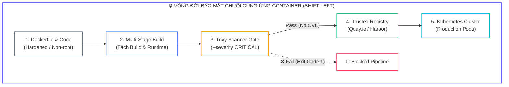
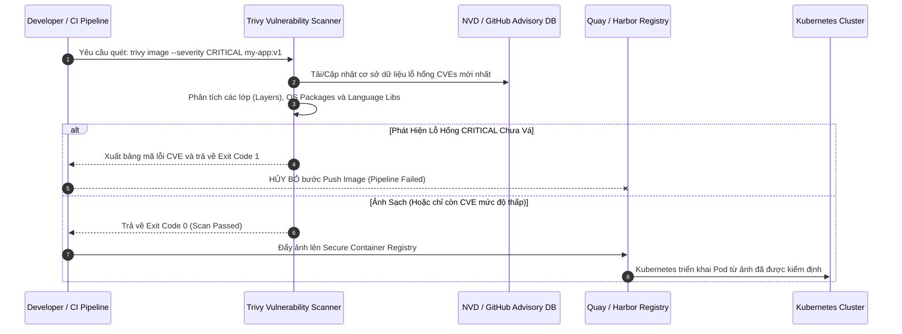
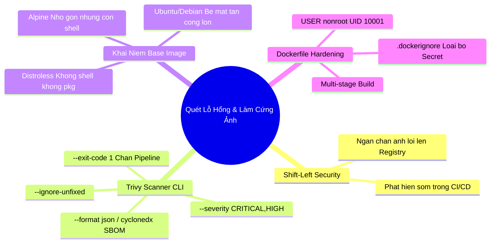


> [!IMPORTANT]
> **Mục tiêu kỹ thuật bài học**:
> - Thấu hiểu mô hình bảo mật **Shift-Left Security** và các nguy cơ từ lỗ hổng phần mềm đã biết (**CVEs**).
> - Làm chủ công cụ **Trivy CLI** để quét lỗ hổng ảnh container cục bộ và từ xa với các cờ lọc nâng cao (`--severity`, `--ignore-unfixed`, `--format`).
> - Thiết lập cơ chế tự động chặn bản build không an toàn bằng mã thoát (`--exit-code 1`).
> - Phân tích sự khác biệt về bề mặt tấn công giữa các ảnh cơ sở: **Ubuntu/Debian vs Alpine vs Distroless**.
> - Áp dụng kỹ thuật **Multi-stage build** để loại bỏ toàn bộ trình biên dịch, công cụ debug và mã nguồn thừa khỏi ảnh runtime.
> - Thiết lập chỉ thị `USER <UID>` trong Dockerfile để ngăn chặn container chạy với quyền `root (UID 0)` mặc định.

---

## 1. Bản Chất Kiến Trúc & Tư Duy Cốt Lõi: An Ninh Chuỗi Cung Ứng Container (Shift-Left)

Trong mô hình an ninh Kubernetes truyền thống, các kỹ sư thường chỉ tập trung vào việc bảo vệ cụm khi ứng dụng đã chạy (*Runtime Security*). Tuy nhiên, nếu một container được xây dựng từ một ảnh cơ sở (**Base Image**) chứa sẵn các lỗ hổng thực thi mã từ xa (**Remote Code Execution - RCE**) nghiêm trọng, tin tặc có thể dễ dàng khai thác ứng dụng ngay khi Pod vừa khởi tạo mà không cần phá vỡ rào chắn mạng.

Nguyên lý **Shift-Left Security** yêu cầu đưa việc kiểm tra an ninh vào giai đoạn sớm nhất của vòng đời phát triển phần mềm (SDLC): Quét mã nguồn, kiểm tra phụ thuộc thư viện, và quét ảnh container ngay trong pipeline CI/CD trước khi đẩy lên Container Registry (như Harbor, Quay.io, Docker Hub).



### 1.1. So Sánh Bề Mặt Tấn Công Giữa Các Base Image

Kích thước của ảnh container tỷ lệ thuận với số lượng gói phần mềm và **bề mặt tấn công (Attack Surface)** tiềm tàng:

1. **Standard OS Image (Ubuntu, Debian, CentOS - 100MB ~ 500MB):** Chứa đầy đủ package manager (`apt`, `yum`), shell (`/bin/bash`, `/bin/sh`), tiện ích mạng (`curl`, `wget`, `nc`), và hàng trăm thư viện chia sẻ C. Kẻ tấn công có sẵn mọi công cụ để tải mã độc và leo thang đặc quyền.
2. **Alpine Linux (~5MB):** Sử dụng thư viện tối giản `musl libc` và package manager `apk`. Giảm thiểu đáng kể số lượng CVE nhưng vẫn chứa shell (`/bin/sh`).
3. **Google Distroless (~2MB - 20MB):** **Không chứa hệ điều hành, không có shell, không có package manager.** Ảnh chỉ chứa đúng binary ứng dụng và các runtime dependencies tối thiểu (như glibc hoặc CA certificates). Kẻ tấn công không thể mở reverse shell hay tải thêm tệp tin thực thi.

---

## 2. Bảng Ma Trận So Sánh Kỹ Thuật Toàn Diện (Engineering Matrix)

| Tiêu Chí So Sánh | Ảnh Chuẩn Ubuntu/Debian | Ảnh Tối Giản Alpine | Ảnh Google Distroless | Ảnh Tự Xây Dựng Scratch |
| :--- | :--- | :--- | :--- | :--- |
| **Kích thước trung bình** | $80\text{ MB} - 300\text{ MB}$ | $5\text{ MB} - 15\text{ MB}$ | $20\text{ MB} - 50\text{ MB}$ | $< 5\text{ MB}$ (Chỉ binary) |
| **Số lượng CVE trung bình** | $50 - 200+$ CVEs | $0 - 5$ CVEs | $0 - 2$ CVEs | <span class="badge badge--emerald">0 CVE (Sạch tuyệt đối)</span> |
| **Có Shell (/bin/sh)?** | Có đầy đủ bash/sh | Có `/bin/sh` | <span class="badge badge--emerald">Không có shell</span> | <span class="badge badge--emerald">Không có shell</span> |
| **Package Manager** | `apt` / `dpkg` | `apk` | Không có | Không có |
| **Khả năng Debug trực tiếp** | Dễ dàng qua `kubectl exec` | Dễ dàng | Khó (cần Ephemeral Container) | Khó |
| **Mức độ an toàn CKS** | Rất thấp (Không khuyến nghị) | Chấp nhận được | <span class="badge badge--emerald">Rất cao (Khuyến nghị chuẩn)</span> | Tối đa cho ngôn ngữ Go/Rust |

---

## 3. Kiến Trúc Môi Trường & Luồng Thực Thi Mẫu

Luồng kiểm soát tự động của Trivy Scanner trong quy trình CI/CD được mô hình hóa qua Sequence Diagram sau:



---

## 4. Phân Tích Cạm Bẫy Thực Chiến: Đẩy Ảnh Chứa Lỗ Hổng RCE Nghiêm Trọng Vào Production Vì Bỏ Qua Quét CVE

### Tình Huống Sự Cố Thực Tế:
<span class="badge badge--rose">🕒 04:30 AM</span> Một ứng dụng xử lý tài liệu sử dụng thư viện `ImageMagick` cũ trên nền `node:14-buster`. Một lỗ hổng thực thi mã từ xa nghiêm trọng (**ImageTragick - CVE-2016-3714**) bị tin tặc khai thác thông qua tệp tin ảnh tải lên, giúp tin tặc chiếm quyền điều khiển shell root trong container và đánh cắp toàn bộ Secret môi trường của cụm.

### Hậu Quả & Log Lỗi Thực Tế:
```text
================================================================================
INCIDENT LOG: TRIVY VULNERABILITY SCAN AUDIT REPORT (CRITICAL CVE DETECTED)
================================================================================
2026-09-12T04:30:12.890Z [FATAL] Vulnerabilities found in image: legacy-app:v1.0

+------------------+------------------+----------+-------------------+---------------+---------------------------------------+
|     LIBRARY      |  VULNERABILITY   | SEVERITY | INSTALLED VERSION | FIXED VERSION |                 TITLE                 |
+------------------+------------------+----------+-------------------+---------------+---------------------------------------+
| imagemagick      | CVE-2016-3714    | CRITICAL | 8:6.9.10.23+dfsg  | 8:6.9.11.60   | ImageMagick: Remote Code Execution    |
| libssl1.1        | CVE-2022-0778    | HIGH     | 1.1.1d-0+deb10u3  | 1.1.1n-0+deb10| OpenSSL: Infinite loop in BN_mod_sqrt |
| curl             | CVE-2023-38545   | CRITICAL | 7.64.0-4+deb10u2  | 7.64.0-4+deb10| curl: SOCKS5 heap buffer overflow     |
+------------------+------------------+----------+-------------------+---------------+---------------------------------------+

[ALERT] Pipeline security gate failure: 2 CRITICAL, 1 HIGH vulnerabilities!
Terminating deployment workflow with Exit Code 1.
================================================================================
```

### 5-Whys Root Cause Analysis:
1. <span class="badge badge--primary">Why 1</span> **Tại sao tin tặc chiếm được quyền thực thi shell trên Node?** $\rightarrow$ Do ứng dụng sử dụng phiên bản thư viện `ImageMagick` dính lỗ hổng CVE-2016-3714.
2. <span class="badge badge--primary">Why 2</span> **Tại sao thư viện có lỗ hổng lại có mặt trong ảnh Production?** $\rightarrow$ Vì Dockerfile sử dụng Base Image lỗi thời (`node:14-buster`) chứa hàng trăm gói phần mềm không được cập nhật.
3. <span class="badge badge--primary">Why 3</span> **Tại sao container lại chạy dưới quyền root?** $\rightarrow$ Do Dockerfile không khai báo chỉ thị `USER` non-root, khiến tiến trình tự động kế thừa UID `0` (root).
4. <span class="badge badge--primary">Why 4</span> **Tại sao ảnh container này không bị phát hiện trước khi triển khai?** $\rightarrow$ Vì pipeline CI/CD không có bước quét lỗ hổng tĩnh bằng Trivy và không thiết lập cờ chặn `--exit-code 1`.
5. <span class="badge badge--emerald">Root Cause Remedy</span> **Biện pháp khắc phục chuẩn CKS:**
   - <span class="badge badge--emerald">Thực Thi Quét Trivy Bắt Buộc:</span> Thêm lệnh `trivy image --severity CRITICAL,HIGH --ignore-unfixed --exit-code 1 <image>` vào mọi pipeline CI/CD.
   - <span class="badge badge--cyan">Chuyển Sang Multi-stage Build & Distroless:</span> Biên dịch ứng dụng trong container trung gian và sao chép binary sang ảnh `gcr.io/distroless/nodejs`.
   - <span class="badge badge--rose">Chỉ Định User Non-Root:</span> Khai báo `USER 10001:10001` trong Dockerfile.

---

## 5. Hands-on Lab: Quét Lỗ Hổng Bằng Trivy & Xây Dựng Hardened Dockerfile Chuẩn CKS (8 Bước)

| Bước | Mục Tiêu Kỹ Thuật | Đầu Ra Kiểm Tra |
| :---: | :--- | :--- |
| **1** | Kiểm tra cài đặt và cập nhật cơ sở dữ liệu Trivy | `trivy --version` hoạt động chính xác |
| **2** | Quét ảnh container mẫu có chứa lỗ hổng | Nhận diện danh sách CVEs của ảnh `nginx:1.14` |
| **3** | Lọc kết quả quét theo mức độ nghiêm trọng `CRITICAL` | Chỉ xuất các lỗ hổng nguy hiểm nhất |
| **4** | Lọc bỏ các lỗ hổng chưa có bản vá (`--ignore-unfixed`) | Loại bỏ nhiễu, chỉ tập trung vào lỗi có thể sửa |
| **5** | Xuất kết quả quét ra định dạng JSON | Tệp `scan-report.json` phục vụ đối soát |
| **6** | Biên soạn Dockerfile không an toàn ban đầu | Tệp `Dockerfile.insecure` chạy quyền root |
| **7** | Tái cấu trúc sang Dockerfile gia cố (Multi-stage + Non-root) | Tệp `Dockerfile.hardened` chuẩn CKS |
| **8** | Quét kiểm định ảnh mới và kiểm tra mã thoát (Exit Code 0) | Xác nhận ảnh sạch 0 lỗ hổng CRITICAL |

### Bước 1: Kiểm Tra Cài Đặt Trivy CLI

```bash
trivy --version
```

### Bước 2: Quét Ảnh Container Cũ Chứa Lỗ Hổng (Ví dụ: `nginx:1.14.0`)

```bash
trivy image nginx:1.14.0
```

### Bước 3: Lọc Quét Theo Mức Độ Nghiêm Trọng CRITICAL & HIGH

```bash
trivy image --severity CRITICAL,HIGH nginx:1.14.0
```

### Bước 4: Lọc Bỏ Các Lỗ Hổng Chưa Có Bản Vá (Actionable CVEs Only)

```bash
trivy image --severity CRITICAL --ignore-unfixed nginx:1.14.0
```

### Bước 5: Xuất Báo Cáo Ra Định Dạng JSON Chuẩn Phân Tích

```bash
trivy image --severity CRITICAL --ignore-unfixed --format json \
  --output /tmp/trivy-report.json nginx:1.14.0

# Xem tóm tắt bằng jq
cat /tmp/trivy-report.json | jq '.Results[0].Vulnerabilities[0]'
```

### Bước 6: Biên Soạn Dockerfile Không An Toàn (Mô Hình Cần Khắc Phục)

```dockerfile
# /tmp/Dockerfile.insecure (KHÔNG KHUYẾN NGHỊ)
FROM ubuntu:20.04
RUN apt-get update && apt-get install -y gcc golang curl
WORKDIR /app
COPY app.go .
RUN go build -o server app.go
# Chạy dưới quyền root mặc định, để lại toàn bộ gcc và source code
CMD ["/app/server"]
```

### Bước 7: Tái Cấu Trúc Sang Dockerfile Gia Cố Chuẩn CKS

```dockerfile
# /tmp/Dockerfile.hardened (CHUẨN CKS HARDENING)
# ==========================================
# GIAI ĐOẠN 1: BUILD STAGE (Chứa công cụ biên dịch)
# ==========================================
FROM golang:1.22-alpine AS builder
WORKDIR /build
COPY app.go .
RUN CGO_ENABLED=0 GOOS=linux go build -ldflags="-w -s" -o server app.go

# ==========================================
# GIAI ĐOẠN 2: RUNTIME STAGE (Tối giản Distroless)
# ==========================================
FROM gcr.io/distroless/static:nonroot
WORKDIR /app
# Sao chép binary từ builder stage
COPY --from=builder /build/server /app/server
# Chạy dưới quyền user non-root đã có sẵn trong Distroless (UID 65532)
USER nonroot:nonroot
ENTRYPOINT ["/app/server"]
```

### Bước 8: Kiểm Thử Tích Hợp Cổng Chặn CI/CD Với Mã Thoát (--exit-code 1)

```bash
# Kiểm tra ảnh sạch: Kỳ vọng trả về Exit Code 0 (Thành công)
trivy image --severity CRITICAL --ignore-unfixed --exit-code 1 gcr.io/distroless/static:nonroot
echo "Exit Code anh sach: $?"

# Kiểm tra ảnh lỗi: Kỳ vọng trả về Exit Code 1 (Chặn pipeline)
trivy image --severity CRITICAL --ignore-unfixed --exit-code 1 nginx:1.14.0
echo "Exit Code anh loi: $?"

echo ">> [VERIFIED] Chuc mung ban da lam chu cong cu Trivy va ky thuat lam cung Dockerfile theo chuan CKS!"
```

---

## 6. 10 Câu Hỏi Tự Kiểm Tra Chuyên Sâu (Self-Check Q&A Accordion)

<details class="qa-card">
<summary class="qa-summary">
  <div class="qa-summary-left">
    <span class="qa-num-badge">Q01</span>
    <span>Cờ `--ignore-unfixed` trong Trivy có ý nghĩa gì và tại sao rất quan trọng trong CI/CD?</span>
  </div>
  <span class="qa-chevron">
    <svg width="18" height="18" fill="none" stroke="currentColor" stroke-width="2.5" viewBox="0 0 24 24"><polyline points="6 9 12 15 18 9"></polyline></svg>
  </span>
</summary>
<div class="qa-answer">
  <div class="qa-answer-header">
    <svg width="14" height="14" fill="none" stroke="currentColor" stroke-width="2" viewBox="0 0 24 24"><path d="M22 11.08V12a10 10 0 1 1-5.93-9.14"></path><polyline points="22 4 12 14.01 9 11.01"></polyline></svg>
    <span>Phân Tích &amp; Lời Giải Kỹ Thuật</span>
  </div>
  <div style="margin-bottom: 8px;">Cờ <code>--ignore-unfixed</code> yêu cầu Trivy <b style="color: var(--accent-emerald);">chỉ báo cáo những lỗ hổng CVE đã có bản vá chính thức (Fixed Version)</b> từ nhà phát triển. Điều này giúp loại bỏ các cảnh báo nhiễu đối với những lỗ hổng mà đội ngũ kỹ sư chưa thể khắc phục ngay, tránh làm gián đoạn pipeline một cách không cần thiết.</div>
</div>
</details>

<details class="qa-card">
<summary class="qa-summary">
  <div class="qa-summary-left">
    <span class="qa-num-badge">Q02</span>
    <span>Làm thế nào để cấu hình Trivy trả về mã lỗi Exit Code 1 khi phát hiện lỗ hổng CRITICAL trong kịch bản CI/CD?</span>
  </div>
  <span class="qa-chevron">
    <svg width="18" height="18" fill="none" stroke="currentColor" stroke-width="2.5" viewBox="0 0 24 24"><polyline points="6 9 12 15 18 9"></polyline></svg>
  </span>
</summary>
<div class="qa-answer">
  <div class="qa-answer-header">
    <svg width="14" height="14" fill="none" stroke="currentColor" stroke-width="2" viewBox="0 0 24 24"><path d="M22 11.08V12a10 10 0 1 1-5.93-9.14"></path><polyline points="22 4 12 14.01 9 11.01"></polyline></svg>
    <span>Phân Tích &amp; Lời Giải Kỹ Thuật</span>
  </div>
  <div style="margin-bottom: 8px;">Thực thi câu lệnh với cặp cờ: <b style="color: var(--accent-primary);">trivy image --severity CRITICAL --exit-code 1 &lt;image-name&gt;</b>. Nếu phát hiện bất kỳ lỗ hổng nào thuộc mức CRITICAL, Trivy sẽ dừng tiến trình với exit code 1, tự động làm thất bại (Fail) bước build trong Jenkins, GitLab CI hoặc GitHub Actions.</div>
</div>
</details>

<details class="qa-card">
<summary class="qa-summary">
  <div class="qa-summary-left">
    <span class="qa-num-badge">Q03</span>
    <span>Tại sao kỹ thuật Multi-stage build lại giúp nâng cao tính an toàn của ảnh container?</span>
  </div>
  <span class="qa-chevron">
    <svg width="18" height="18" fill="none" stroke="currentColor" stroke-width="2.5" viewBox="0 0 24 24"><polyline points="6 9 12 15 18 9"></polyline></svg>
  </span>
</summary>
<div class="qa-answer">
  <div class="qa-answer-header">
    <svg width="14" height="14" fill="none" stroke="currentColor" stroke-width="2" viewBox="0 0 24 24"><path d="M22 11.08V12a10 10 0 1 1-5.93-9.14"></path><polyline points="22 4 12 14.01 9 11.01"></polyline></svg>
    <span>Phân Tích &amp; Lời Giải Kỹ Thuật</span>
  </div>
  <div style="margin-bottom: 8px;">Multi-stage build cho phép tách biệt môi trường biên dịch (chứa trình biên dịch gcc, go, maven, mã nguồn gốc) khỏi môi trường thực thi runtime. Chỉ có <b style="color: var(--accent-cyan);">tệp tin thực thi (binary) cuối cùng</b> được sao chép sang ảnh runtime sạch, loại bỏ hoàn toàn các công cụ biên dịch mà tin tặc có thể lợi dụng để compile mã độc tại chỗ.</div>
</div>
</details>

<details class="qa-card">
<summary class="qa-summary">
  <div class="qa-summary-left">
    <span class="qa-num-badge">Q04</span>
    <span>Ảnh cơ sở Distroless của Google mang lại lợi thế bảo mật gì so với ảnh Alpine Linux?</span>
  </div>
  <span class="qa-chevron">
    <svg width="18" height="18" fill="none" stroke="currentColor" stroke-width="2.5" viewBox="0 0 24 24"><polyline points="6 9 12 15 18 9"></polyline></svg>
  </span>
</summary>
<div class="qa-answer">
  <div class="qa-answer-header">
    <svg width="14" height="14" fill="none" stroke="currentColor" stroke-width="2" viewBox="0 0 24 24"><path d="M22 11.08V12a10 10 0 1 1-5.93-9.14"></path><polyline points="22 4 12 14.01 9 11.01"></polyline></svg>
    <span>Phân Tích &amp; Lời Giải Kỹ Thuật</span>
  </div>
  <div style="margin-bottom: 8px;">Mặc dù Alpine rất nhỏ nhưng vẫn chứa shell <code>/bin/sh</code> và trình quản lý gói <code>apk</code>. Ảnh Distroless <b style="color: var(--accent-rose);">hoàn toàn không có shell và không có package manager</b>. Kẻ tấn công ngay cả khi tiêm được lệnh độc hại cũng không thể khởi tạo tiến trình shell tương tác (Interactive Reverse Shell).</div>
</div>
</details>

<details class="qa-card">
<summary class="qa-summary">
  <div class="qa-summary-left">
    <span class="qa-num-badge">Q05</span>
    <span>Tại sao cần chỉ định `USER 10001` dạng số (Numeric UID) thay vì chuỗi tên `USER appuser` trong Dockerfile?</span>
  </div>
  <span class="qa-chevron">
    <svg width="18" height="18" fill="none" stroke="currentColor" stroke-width="2.5" viewBox="0 0 24 24"><polyline points="6 9 12 15 18 9"></polyline></svg>
  </span>
</summary>
<div class="qa-answer">
  <div class="qa-answer-header">
    <svg width="14" height="14" fill="none" stroke="currentColor" stroke-width="2" viewBox="0 0 24 24"><path d="M22 11.08V12a10 10 0 1 1-5.93-9.14"></path><polyline points="22 4 12 14.01 9 11.01"></polyline></svg>
    <span>Phân Tích &amp; Lời Giải Kỹ Thuật</span>
  </div>
  <div style="margin-bottom: 8px;">Kubernetes Pod Security Admission (PSA) và các công cụ Policy Engine (OPA/Kyverno) kiểm tra quy tắc <code>runAsNonRoot</code> dựa trên giá trị số nguyên của UID. Nếu sử dụng tên dạng chuỗi, Kubernetes không thể xác thực ngay UID đó có khác 0 hay không nếu không đọc tệp <code>/etc/passwd</code> bên trong container, dẫn đến cảnh báo hoặc bị từ chối khởi chạy.</div>
</div>
</details>

<details class="qa-card">
<summary class="qa-summary">
  <div class="qa-summary-left">
    <span class="qa-num-badge">Q06</span>
    <span>Lệnh Trivy nào cho phép quét lỗ hổng trực tiếp trên tệp tin cấu hình Kubernetes Manifest hoặc Terraform?</span>
  </div>
  <span class="qa-chevron">
    <svg width="18" height="18" fill="none" stroke="currentColor" stroke-width="2.5" viewBox="0 0 24 24"><polyline points="6 9 12 15 18 9"></polyline></svg>
  </span>
</summary>
<div class="qa-answer">
  <div class="qa-answer-header">
    <svg width="14" height="14" fill="none" stroke="currentColor" stroke-width="2" viewBox="0 0 24 24"><path d="M22 11.08V12a10 10 0 1 1-5.93-9.14"></path><polyline points="22 4 12 14.01 9 11.01"></polyline></svg>
    <span>Phân Tích &amp; Lời Giải Kỹ Thuật</span>
  </div>
  <div style="margin-bottom: 8px;">Sử dụng lệnh: <b style="color: var(--accent-primary);">trivy config &lt;path-to-manifest-or-directory&gt;</b>. Trivy sẽ phân tích tĩnh (Static Analysis / Misconfiguration Scan) các tệp YAML/HCL để tìm kiếm các thiết lập sai như chạy container quyền root, thiếu resource limits hoặc mở hostNetwork.</div>
</div>
</details>

<details class="qa-card">
<summary class="qa-summary">
  <div class="qa-summary-left">
    <span class="qa-num-badge">Q07</span>
    <span>Làm thế nào để quét một ảnh container nằm trong một Private Registry yêu cầu xác thực người dùng?</span>
  </div>
  <span class="qa-chevron">
    <svg width="18" height="18" fill="none" stroke="currentColor" stroke-width="2.5" viewBox="0 0 24 24"><polyline points="6 9 12 15 18 9"></polyline></svg>
  </span>
</summary>
<div class="qa-answer">
  <div class="qa-answer-header">
    <svg width="14" height="14" fill="none" stroke="currentColor" stroke-width="2" viewBox="0 0 24 24"><path d="M22 11.08V12a10 10 0 1 1-5.93-9.14"></path><polyline points="22 4 12 14.01 9 11.01"></polyline></svg>
    <span>Phân Tích &amp; Lời Giải Kỹ Thuật</span>
  </div>
  <div style="margin-bottom: 8px;">Thiết lập các biến môi trường xác thực trước khi chạy lệnh quét:
  <div style="margin-top: 6px; padding: 8px; background: rgba(0,0,0,0.2); border-radius: 4px; font-family: monospace; font-size: 0.9em;">
  export TRIVY_AUTH_URL="https://quay.io"<br/>
  export TRIVY_USERNAME="myuser"<br/>
  export TRIVY_PASSWORD="mypassword"<br/>
  trivy image quay.io/myorg/my-secure-app:v1
  </div>
  </div>
</div>
</details>

<details class="qa-card">
<summary class="qa-summary">
  <div class="qa-summary-left">
    <span class="qa-num-badge">Q08</span>
    <span>Chỉ thị `.dockerignore` đóng vai trò gì trong việc gia cố an ninh cho tệp đóng gói Dockerfile?</span>
  </div>
  <span class="qa-chevron">
    <svg width="18" height="18" fill="none" stroke="currentColor" stroke-width="2.5" viewBox="0 0 24 24"><polyline points="6 9 12 15 18 9"></polyline></svg>
  </span>
</summary>
<div class="qa-answer">
  <div class="qa-answer-header">
    <svg width="14" height="14" fill="none" stroke="currentColor" stroke-width="2" viewBox="0 0 24 24"><path d="M22 11.08V12a10 10 0 1 1-5.93-9.14"></path><polyline points="22 4 12 14.01 9 11.01"></polyline></svg>
    <span>Phân Tích &amp; Lời Giải Kỹ Thuật</span>
  </div>
  <div style="margin-bottom: 8px;">Tệp <code>.dockerignore</code> ngăn chặn việc vô tình sao chép các tệp tin nhạy cảm (như <code>.git</code>, <code>.env</code>, <code>id_rsa</code>, khóa bí mật, hoặc tệp mã nguồn tạm) vào build context của Docker, triệt tiêu nguy cơ nhúng lộ Secret vào các lớp ảnh container.</div>
</div>
</details>

<details class="qa-card">
<summary class="qa-summary">
  <div class="qa-summary-left">
    <span class="qa-num-badge">Q09</span>
    <span>Sự khác biệt giữa CVE Vulnerability và Configuration Misconfiguration trong kiểm định container là gì?</span>
  </div>
  <span class="qa-chevron">
    <svg width="18" height="18" fill="none" stroke="currentColor" stroke-width="2.5" viewBox="0 0 24 24"><polyline points="6 9 12 15 18 9"></polyline></svg>
  </span>
</summary>
<div class="qa-answer">
  <div class="qa-answer-header">
    <svg width="14" height="14" fill="none" stroke="currentColor" stroke-width="2" viewBox="0 0 24 24"><path d="M22 11.08V12a10 10 0 1 1-5.93-9.14"></path><polyline points="22 4 12 14.01 9 11.01"></polyline></svg>
    <span>Phân Tích &amp; Lời Giải Kỹ Thuật</span>
  </div>
  <div style="margin-bottom: 8px;"><b style="color: var(--accent-rose);">CVE (Lỗ hổng phần mềm):</b> Lỗi mã nguồn hoặc lỗ hổng bảo mật nằm trong thư viện/package được cài đặt (ví dụ: Log4j, OpenSSL buffer overflow). <b style="color: var(--accent-amber);">Misconfiguration (Cấu hình sai):</b> Lỗi thiết lập chính sách vận hành (ví dụ: chạy quyền root, cấp quyền privileged, mở toàn bộ cổng mạng).</div>
</div>
</details>

<details class="qa-card">
<summary class="qa-summary">
  <div class="qa-summary-left">
    <span class="qa-num-badge">Q10</span>
    <span>Làm thế nào để sử dụng Trivy tạo bảng danh mục thành phần phần mềm (SBOM - Software Bill of Materials)?</span>
  </div>
  <span class="qa-chevron">
    <svg width="18" height="18" fill="none" stroke="currentColor" stroke-width="2.5" viewBox="0 0 24 24"><polyline points="6 9 12 15 18 9"></polyline></svg>
  </span>
</summary>
<div class="qa-answer">
  <div class="qa-answer-header">
    <svg width="14" height="14" fill="none" stroke="currentColor" stroke-width="2" viewBox="0 0 24 24"><path d="M22 11.08V12a10 10 0 1 1-5.93-9.14"></path><polyline points="22 4 12 14.01 9 11.01"></polyline></svg>
    <span>Phân Tích &amp; Lời Giải Kỹ Thuật</span>
  </div>
  <div style="margin-bottom: 8px;">Sử dụng cờ định dạng CycloneDX hoặc SPDX: <b style="color: var(--accent-emerald);">trivy image --format cyclonedx --output sbom.json &lt;image-name&gt;</b>. Tệp SBOM sinh ra sẽ liệt kê toàn bộ các gói phần mềm, giấy phép và phiên bản có mặt trong ảnh phục vụ đối soát an toàn chuỗi cung ứng.</div>
</div>
</details>

---

## 7. Tổng Kết & Lộ Trình Bài Học Tiếp Theo



Làm chủ công cụ **Trivy** và kỹ thuật **Dockerfile Hardening** là nền tảng cốt lõi trong miền Supply Chain Security của chứng chỉ CKS.

> [!TIP]
> **BÀI HỌC TIẾP THEO:**
> Trong **[[Bài 04] Giám Sát Thời Gian Chạy & Phát Hiện Mối Đe Dọa: Tích Hợp Sysdig & Falco Engine](cks-04-04-sysdig-falco-phat-hien-de-doa.html)**, chúng ta sẽ chuyển từ an ninh tĩnh sang giám sát an ninh động thời gian thực: Phân tích cuộc gọi hệ thống (System Calls), cài đặt Falco daemon, viết quy tắc phát hiện xâm nhập và cảnh báo vi phạm runtime.

